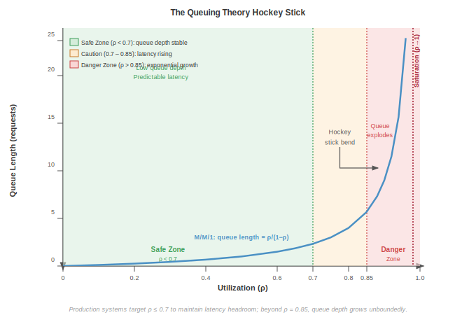
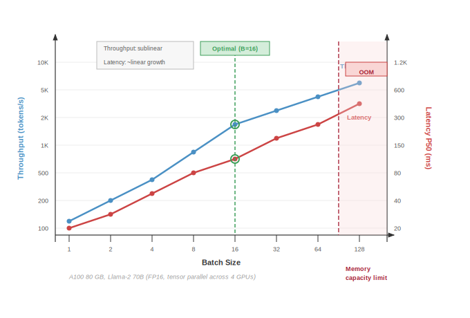

# Inference Foundations {#sec-appdx-appendix-inference}

## Purpose {.unnumbered}

_How do queuing dynamics and memory capacity determine the throughput and latency of a production inference service?_

Serving a model at scale is governed by the mathematics of waiting lines and the physics of the key-value cache. This appendix develops the quantitative tools that the inference and operations chapters draw on: a queuing-theoretic model of batched serving that yields optimal batch sizes under stochastic arrivals, and the capacity arithmetic of the attention cache that frequently becomes the binding constraint on serving throughput. We treat these not as background, but as the first-order constraints that determine how many requests a fleet can serve within a latency budget.

## How to Use This Appendix {.unnumbered}

This appendix is a quantitative reference for serving systems. Use the queuing model when you need to choose a batch size or predict tail latency under a given arrival rate; use the key-value cache arithmetic when you need to size memory or find the point at which the cache, rather than compute, caps throughput.

Reach for it from the inference and operations chapters: when those chapters cite a serving result, the derivation lives here. Read it linearly for the full argument, or jump to the worked GPT-3 example and the batch-size decision framework when you need a template to apply to your own system.

## Serving performance analysis {#sec-appdx-appendix-inference-serving}

### Queuing theory for batched inference {#sec-appdx-inference-scale-queuing-theory-batched-inference-bbf0}

The batching efficiency curve provides intuition about throughput-latency tradeoffs, but production systems require rigorous analysis to determine optimal batch sizes under stochastic arrival patterns. Queuing theory provides the mathematical framework to derive these optimal operating points and to understand why certain batch sizes outperform others under specific conditions.

#### The M/G/c/K queue model for GPU serving {#sec-appdx-inference-scale-mgck-queue-model-gpu-serving-c4c4}

GPU inference systems can be modeled as **M/G/c/K queues**\index{M/G/c/K Queues}, a standard notation from queueing theory that captures the essential characteristics of production serving systems:

- **M (Markov arrivals)**: Requests arrive according to a Poisson process with rate $\lambda_{\text{arr}}$. This models the memoryless property of user requests, where arrival of one request does not predict the timing of the next.
- **G (General service distribution)**: Service times follow a general distribution, not restricted to exponential. GPU inference times depend on batch size and exhibit deterministic components (compute) mixed with stochastic variation (memory contention, kernel scheduling).
- **c (Number of servers)**: The system has $c$ parallel GPU workers, each capable of serving requests independently.
- **K (Queue capacity)**: The system maintains a finite queue of capacity $K$ requests. Requests arriving to a full queue are rejected (load shedding).

The notation comes from the same systems-performance lineage that sized telephone networks before it was applied to GPU clusters.

::: {#psp-inference-queuing-theory-performance .callout-perspective title="Queuing theory and performance"}

Queuing theory, developed by Agner Krarup Erlang in 1909 for telephone network analysis, remains foundational to systems performance engineering. The same mathematical framework that sized telephone exchanges now determines GPU cluster capacity. The M/G/c/K model is standard in systems textbooks, appearing in Jain's *The Art of Computer Systems Performance Analysis* [@jain1991art] and Kleinrock's *Queueing Systems* [@kleinrock1975queueing].

:::

For a batched inference system with batch size $B$, service time becomes a function of batch size. Let $T_{\text{svc}}(B)$ denote the time to process a batch of $B$ requests. From the physics of batching (@sec-inference-scale-batching-strategies-scale-6733), we model this as:

$$T_{\text{svc}}(B) = T_{\text{fixed}} + t_{\text{req}} \cdot B$$ {#eq-service-time-batch}

where $T_{\text{fixed}}$ represents fixed service overhead (kernel launch, weight loading from HBM) and $t_{\text{req}}$ represents marginal per-request computation time. This linear model captures the first-order behavior observed in production systems, though actual service times may exhibit slight sublinearity due to memory bandwidth saturation at large batch sizes.

The **effective service rate** for batched processing is:

$$\mu_{\text{eff}}(B) = \frac{B}{T_{\text{svc}}(B)} = \frac{B}{T_{\text{fixed}} + t_{\text{req}} \cdot B}$$

The effective rate increases with batch size, approaching the asymptotic limit $1/t_{\text{req}}$ as $B \to \infty$.

#### Response time analysis {#sec-appdx-inference-scale-response-time-analysis-ffc3}

The total response time $T$ for a request consists of three components:

$$E[T] = E[W] + E[T_{\text{batch}}] + E[T_{\text{svc}}]$$

where:

- $E[W]$ is the expected waiting time in queue before joining a batch
- $E[T_{\text{batch}}]$ is the expected time to form a complete batch (batch accumulation delay)
- $E[T_{\text{svc}}]$ is the expected inference time once the batch executes

For dynamic batching with maximum wait time $T_{\text{max}}$ and maximum batch size $B_{\text{max}}$, the batch formation process is bounded. Under Poisson arrivals with rate $\lambda_{\text{arr}}$, the expected number of requests accumulated in time $T_{\text{max}}$ is $\lambda_{\text{arr}} \cdot T_{\text{max}}$. The actual batch size $B$ follows:

$$E[B] = \min(B_{\text{max}}, \lambda_{\text{arr}} \cdot T_{\text{max}})$$

The batch accumulation delay depends on whether the batch fills by reaching $B_{\text{max}}$ or by timeout:

$$E[T_{\text{batch}}] = \begin{cases}
\frac{B_{\text{max}}}{2\lambda_{\text{arr}}} & \text{if } \lambda_{\text{arr}} \cdot T_{\text{max}} \geq B_{\text{max}} \text{ (batch fills)} \\
\frac{T_{\text{max}}}{2} & \text{if } \lambda_{\text{arr}} \cdot T_{\text{max}} < B_{\text{max}} \text{ (timeout triggers)}
\end{cases}$$

The factor of $1/2$ in both cases reflects the average wait for requests arriving uniformly throughout the batch window.

#### Optimal batch size derivation {#sec-appdx-inference-scale-optimal-batch-size-derivation-3a3c}

The optimal batch size $B$ minimizes expected response time subject to throughput requirements. We seek:

$$B = \operatorname{arg\,min}_{B} E[T(B)] \quad \text{subject to} \quad \mu_{\text{eff}}(B) \geq \lambda_{\text{arr}}$$

The constraint ensures system stability (service rate exceeds arrival rate).

Substituting the response time components:

$$E[T(B)] = E[W(B)] + \frac{B}{2\lambda_{\text{arr}}} + T_{\text{svc}}(B)$$

For an M/G/1 queue with batch arrivals (treating each batch as a single "super-request"), the Pollaczek-Khinchine formula gives the expected waiting time:

$$E[W] = \frac{\lambda_{\text{arr}} \cdot E[T_{\text{svc}}^2]}{2(1 - \rho)}$$

where $\rho = \lambda_{\text{arr}} \cdot E[T_{\text{svc}}] / B$ is the server utilization (arrival rate times service time per request). The second moment $E[T_{\text{svc}}^2]$ captures service time variability.

For our linear service time model with deterministic service (variance zero within a batch):

$$E[W(B)] = \frac{\lambda_{\text{arr}} \cdot T_{\text{svc}}(B)^2}{2B(1 - \lambda_{\text{arr}} \cdot T_{\text{svc}}(B)/B)}$$

For production sizing, teams often first enforce a utilization headroom target rather than solving the full latency minimization problem. With $T_{\text{svc}}(B)=T_{\text{fixed}}+t_{\text{req}} B$, the constraint $\rho=\lambda_{\text{arr}} T_{\text{svc}}(B)/B \leq \rho_{\text{target}}$ gives:

$$B_{\min}(\rho_{\text{target}}) = \frac{\lambda_{\text{arr}} T_{\text{fixed}}}{\rho_{\text{target}} - \lambda_{\text{arr}} t_{\text{req}}}$$ {#eq-optimal-batch-approx}

where $\rho_{\text{target}}$ is the target utilization (typically 0.7--0.8 for production systems to maintain latency headroom) and $\rho_{\text{target}} > \lambda_{\text{arr}} t_{\text{req}}$.

::: {.callout-important title="Target-utilization batch sizing"}

@Eq-optimal-batch-approx reveals a fundamental insight: *minimum stable batch size grows with fixed overhead and arrival rate*. This means:

1. **Higher traffic** $(\lambda_{\text{arr}})$: Required batch size increases
2. **Higher fixed overhead** $(T_{\text{fixed}})$: Required batch size increases to amortize overhead
3. **Higher target utilization** $(\rho_{\text{target}})$: Required batch size decreases, but with less latency headroom

This utilization-constrained sizing explains why LLMs (high $T_{\text{fixed}}$ from weight loading) benefit from larger batches than vision models (low $T_{\text{fixed}}$), even at the same arrival rate.

:::

#### Worked example: GPT-3 serving at 100 QPS {#sec-appdx-inference-scale-worked-example-gpt3-serving-100-qps-edcf}

```{python}
#| echo: false
#| label: gpt3-scenario
# ┌─────────────────────────────────────────────────────────────────────────────
# │ GPT-3 PARAMETERS (LEGO)
# ├─────────────────────────────────────────────────────────────────────────────
# │ Context: @sec-appdx-inference-scale-worked-example-gpt3-serving-100-qps-edcf
# │
# │ Goal: Provide GPT-3 parameter count for the worked example.
# │ Show: "175"B parameters.
# │ How: pulling Models.Language.GPT3.parameters from mlsysim.core.constants.
# │
# │ Imports: mlsysim (Models); mlsysim.core.constants (param, BILLION); mlsysim.fmt (fmt_int, fmt)
# │ Exports: Gpt3Scenario.gpt3_params_b_str
# └─────────────────────────────────────────────────────────────────────────────
from mlsysim import Models
from mlsysim.core.constants import param, BILLION
from mlsysim.fmt import fmt_int, fmt

class Gpt3Scenario:
    """GPT-3 parameter reference."""

    # ┌── 1. LOAD (Constants) ──────────────────────────────────────────────
    params = Models.Language.GPT3.parameters

    # ┌── 2. EXECUTE (The Compute) ────────────────────────────────────────
    params_b = params.m_as(param) / BILLION

    # ┌── 3. GUARD (Invariants) ──────────────────────────────────────────
    from mlsysim.fmt import fmt_int, check
    check(params_b == 175, "GPT-3 should have 175B parameters")

    # ┌── 4. OUTPUT (Formatting) ──────────────────────────────────────────────
    gpt3_params_b_str = fmt_int(params_b, commas=False)
```

Consider serving a GPT-3 class model (`{python} Gpt3Scenario.gpt3_params_b_str`B parameters) under the following system parameters:

- Arrival rate: $\lambda_{\text{arr}} = 100$ requests/second
- Hardware: 8$\times$ A100 GPUs with tensor parallelism
- Weight loading overhead: $T_{\text{fixed}} = 50$ ms (time to load attention matrices per forward pass)
- Per-token compute: $t_{\text{req}} = 0.5$ ms per request (amortized across batch)
- Average output length: 100 tokens per request
- Target utilization: $\rho_{\text{target}} = 0.75$

For the prefill phase (processing input prompt), service time follows @eq-service-time-batch:

$$T_{\text{svc}}(B) = 50 + 0.5 \cdot B \text{ ms}$$

Applying @eq-optimal-batch-approx to compute the minimum batch size that preserves 75 percent utilization headroom:

$$B_{\min} \approx \frac{100 \times 0.05}{0.75 - 100 \times 0.0005} = \frac{5}{0.70} \approx 7.14$$

Rounding up gives $B=8$ as the smallest batch size that meets the target utilization headroom. Evaluating the full response-time expression then shows how larger batches reduce utilization but add batch-accumulation delay:

**Performance at different batch sizes.**

@Tbl-batch-size-comparison quantifies the tradeoffs across batch sizes from 1 to 32:

| **Size $B$** | **$T_{\text{svc}}(B)$ (ms)** | **req/s** |             **$\rho$** | **E[W] (ms)** | **$B/(2\lambda_{\text{arr}})$ (ms)** | **E[T] (ms)** |
|:-------------|-----------------------------:|----------:|-----------------------:|:--------------|-------------------------------------:|:--------------|
| **1**        |                         50.5 |      19.8 | 505 percent (unstable) | $\infty$      |                                  5.0 | $\infty$      |
| **4**        |                         52.0 |      76.9 | 130 percent (unstable) | $\infty$      |                                 20.0 | $\infty$      |
| **8**        |                         54.0 |     148.1 |           67.5 percent | 56.1          |                                 40.0 | 150.1         |
| **16**       |                         58.0 |     275.9 |           36.3 percent | 16.5          |                                 80.0 | 154.5         |
| **32**       |                         66.0 |     484.8 |           20.6 percent | 8.6           |                                160.0 | 234.6         |

: **Batch Size Impact on GPT-3 Serving Performance**: Batch sizes below 8 cannot sustain 100 QPS (utilization exceeds 100 percent). After including batch-accumulation delay, the latency minimum in this simple model occurs near $B=8$; $B=16$ has nearly the same mean latency with lower utilization, while $B=32$ leaves more headroom but pays a large accumulation-delay penalty. {#tbl-batch-size-comparison}

```{python}
#| echo: false
#| label: littles-law-verify
# ┌─────────────────────────────────────────────────────────────────────────────
# │ GPT-3 SERVING RESULTS AND LITTLE'S LAW VERIFICATION
# ├─────────────────────────────────────────────────────────────────────────────
# │ Context: §GPT-3 Serving at 100 QPS Analysis and Little's Law verification
# │
# │ Goal: Summarize serving performance and verify consistency via Little's Law.
# │ Show: Throughput, utilization, and queue lengths for various batch sizes.
# │ How: Load precomputed results into GPT3ServingResults class;
# │      apply Little's Law to verify requests in system.
# │
# │ Imports: mlsysim.book (check)
# │ Exports: GPT3ServingResults.b8_util_pct_str, GPT3ServingResults.b8_wait_ms_str,
# │          GPT3ServingResults.b16_service_ms_str, GPT3ServingResults.b16_wait_ms_str,
# │          GPT3ServingResults.b8_service_ms_str, GPT3ServingResults.b16_util_pct_str
# └─────────────────────────────────────────────────────────────────────────────
from mlsysim.fmt import fmt_int, check, fmt

class GPT3ServingResults:
    # Batch 8 results
    b8_service_ms = 54.0
    b8_util_pct = 67.5
    b8_wait_ms = 56.1
    b8_accum_ms = 40.0
    b8_total_ms = 150.1

    # Batch 16 results
    b16_service_ms = 58.0
    b16_util_pct = 36.3
    b16_wait_ms = 16.5
    b16_accum_ms = 80.0
    b16_total_ms = 154.5

    # Batch 32 results
    b32_service_ms = 66.0
    b32_util_pct = 20.6
    b32_wait_ms = 8.6
    b32_accum_ms = 160.0
    b32_total_ms = 234.6

    # Prose-facing canonical strings (preserve raw floats for arithmetic above)
    b8_service_ms_str = fmt_int(b8_service_ms, commas=False)
    b8_util_pct_str = fmt(b8_util_pct, precision=1, commas=False, suffix=' percent')
    b8_wait_ms_str = fmt(b8_wait_ms, precision=1, commas=False, suffix=' ms')
    b16_service_ms_str = fmt_int(b16_service_ms, commas=False)
    b16_util_pct_str = fmt(b16_util_pct, precision=1, commas=False, suffix=' percent')
    b16_wait_ms_str = fmt(b16_wait_ms, precision=1, commas=False, suffix=' ms')
```

**Analysis.**

1. **Batch sizes 1--4 are unstable**\index{Batching!batch, sizes 1-4 are unstable}: Utilization exceeds 100 percent, meaning the system cannot keep up with arrivals. Queues grow unboundedly.

2. **Batch size 8 achieves stability**\index{Batch Size!8 achieves stability}: At `{python} GPT3ServingResults.b8_util_pct_str` utilization, the system is stable but queuing delays contribute significantly to latency (`{python} GPT3ServingResults.b8_wait_ms_str`), as @fig-queuing-hockey-stick illustrates.

::: {#fig-queuing-hockey-stick fig-env="figure" fig-pos="htb" fig-cap="**The Queuing Hockey Stick**: Relationship between system utilization $\rho$ and queue length (M/M/1 queue length $\rho/(1-\rho)$). Three zones are shaded: a Safe Zone ($\rho < 0.7$), a Caution band (0.7--0.85), and a Danger Zone ($\rho > 0.85$) where queue depth grows unboundedly. Production systems typically target $\rho \leq 0.7$ to maintain latency headroom." fig-alt="Plot of Queue Length (requests) vs. Utilization rho from 0 to 1. The curve is flat until rho around 0.7, bends upward through a caution band (0.7 to 0.85), then rises sharply in a Danger Zone toward saturation at rho=1."}

:::

3. **Batch sizes 8--16 form the latency knee**\index{Batch Size!latency knee}: Batch size 8 gives the lowest mean latency in this model. Batch size 16 trades a few milliseconds of additional total latency for lower utilization and queue wait time (`{python} GPT3ServingResults.b16_wait_ms_str` vs. `{python} GPT3ServingResults.b8_wait_ms_str`), while $B=32$ leaves still more utilization headroom but pays too much batch-accumulation delay.

4. **Diminishing returns beyond $B=32$**\index{Diminishing Returns Beyond B=32}: Further batch size increases would reduce utilization but memory constraints prevent exploration.

We can confirm these results by applying Little's Law as an internal consistency check.

```{python}
#| echo: false
#| label: littles-law-verify-2
# ┌─────────────────────────────────────────────────────────────────────────────
# │ LITTLE'S LAW VERIFICATION (B=16)
# ├─────────────────────────────────────────────────────────────────────────────
# │ Context: "Applying Little's Law to verify" callout notebook.
# │
# │ Goal: Verify GPT-3 serving queue math via Little's Law at batch size 16.
# │ Exports: LittlesLawVerify.expected_total_str, LittlesLawVerify.n_req_str,
# │          LittlesLawVerify.in_service_str, LittlesLawVerify.in_queue_str,
# │          LittlesLawVerify.batch_size_str, LittlesLawVerify.utilization_str,
# │          LittlesLawVerify.expected_total_s_str
# │ Imports: mlsysim.core.constants (ms, second); mlsysim.fmt (fmt_int, check, fmt)
# └─────────────────────────────────────────────────────────────────────────────
from mlsysim.core.constants import ms, second
from mlsysim.fmt import fmt_int, check, fmt

class LittlesLawVerify:
    # ┌── 1. LOAD ──────────────────────────────────────────
    arrival_rate = 100
    batch_size = 16
    expected_total_ms = 154.5  # B=16 total latency from GPT3ServingResults
    utilization = 36.3 / 100
    # ┌── 2. EXECUTE ───────────────────────────────────────
    expected_total_s = (expected_total_ms * ms).m_as(second)
    n_req = arrival_rate * expected_total_s
    in_service = batch_size * utilization
    in_queue = n_req - in_service
    # ┌── 3. GUARD ─────────────────────────────────────────
    check(15 < n_req < 16, f"N_req should be ~15.5, got {n_req:.2f}")
    # ┌── 4. OUTPUT ────────────────────────────────────────
    batch_size_str = fmt_int(batch_size, commas=False)
    expected_total_str = fmt(expected_total_ms, precision=1, commas=False, suffix=' ms')
    expected_total_s_str = fmt(expected_total_s, precision=4, commas=False)
    utilization_str = fmt(utilization, precision=3, commas=False)
    n_req_str = fmt(n_req, precision=2, commas=False)
    in_service_str = fmt(in_service, precision=1, commas=False)
    in_queue_str = fmt(in_queue, precision=2, commas=False)
```

::: {#nbk-inference-applying-littles-law-verify .callout-notebook title="Applying Little's Law to verify"}

**Verification using Little's Law**\index{Little's Law!verification using}: $Q_{\text{req}} = \lambda_{\text{arr}} \cdot T_{\text{lat}}$

At $B=16$ with $\lambda_{\text{arr}} = 100$ req/s and $E[T] =$ `{python} LittlesLawVerify.expected_total_str`:

$Q_{\text{req}} = 100 \times$ `{python} LittlesLawVerify.expected_total_s_str` = `{python} LittlesLawVerify.n_req_str` requests in system

With batch size `{python} LittlesLawVerify.batch_size_str` and utilization `{python} GPT3ServingResults.b16_util_pct_str`:

- Expected requests in service: `{python} LittlesLawVerify.batch_size_str` $\times$ `{python} LittlesLawVerify.utilization_str` = `{python} LittlesLawVerify.in_service_str`
- Expected requests in queue: `{python} LittlesLawVerify.n_req_str` - `{python} LittlesLawVerify.in_service_str` = `{python} LittlesLawVerify.in_queue_str`

This matches the response-time decomposition: roughly 6 requests are in service and roughly 10 are waiting or accumulating into batches on average.

:::

#### Decision framework: Batch size selection given SLA {#sec-appdx-inference-scale-decision-framework-batch-size-selection-given-sla-8e4e}

Production systems must select batch size to meet Service Level Objectives (SLOs), typically specified as latency percentiles (for example, P99 latency < 200 ms). The following framework systematizes this decision:

#### Step 1: Characterize service time {.unnumbered}

Measure $T_{\text{fixed}}$ and $t_{\text{req}}$ empirically by profiling inference at batch sizes 1, 8, and 32. Fit the linear model $T_{\text{svc}}(B) = T_{\text{fixed}} + t_{\text{req}} B$.

#### Step 2: Compute stability threshold {.unnumbered}

Find minimum batch size $B_{\text{min}}$ such that $\mu_{\text{eff}}(B_{\text{min}}) > \lambda_{\text{arr}}$:

$$B_{\text{min}} = \frac{T_{\text{fixed}} \lambda_{\text{arr}}}{1 - t_{\text{req}} \lambda_{\text{arr}}}$$

Any batch size below $B_{\text{min}}$ results in an unstable system.

#### Step 3: Compute latency at candidate batch sizes {.unnumbered}

For each candidate $B \in \{B_{\text{min}}, 2B_{\text{min}}, ..., B_{\text{max}}\}$, compute:

$$E[T(B)] = \frac{\lambda_{\text{arr}} \cdot T_{\text{svc}}(B)^2}{2B(1 - \lambda_{\text{arr}} T_{\text{svc}}(B)/B)} + \frac{B}{2\lambda_{\text{arr}}} + T_{\text{svc}}(B)$$

#### Step 4: Account for tail latency {.unnumbered}

For P99 SLO compliance, use the heavy-traffic approximation for tail latency:

$$T_{\text{P99}} \approx E[T] + 2.33 \cdot \sigma_T$$

where $\sigma_T$ is the standard deviation of response time. For exponential-like response times, P99 is closer to $-\ln(0.01)E[T] \approx 4.6 \cdot E[T]$; use measured percentiles for production sizing.

#### Step 5: Select optimal batch size {.unnumbered}

Choose the largest $B$ such that $T_{\text{P99}}(B) \leq \text{SLO}$:

$$B = \max\{B : T_{\text{P99}}(B) \leq \text{SLO}\}$$

@Tbl-batch-decision-framework summarizes the decision process:

| **Condition**                 | **Recommended Action**                  | **Rationale**             |
|:------------------------------|:----------------------------------------|:--------------------------|
| $B < B_{\min}$                | Increase batch size or add replicas     | System is unstable        |
| $T_{\text{P99}} > \text{SLO}$ | Reduce batch size or add replicas       | Latency exceeds target    |
| $\rho < 0.5$                  | Consider reducing replicas to save cost | System is overprovisioned |
| $\rho > 0.85$                 | Add replicas for headroom               | Approaching instability   |

: **Batch Size Decision Framework**: Systematic approach to selecting batch size based on stability, latency SLO, and utilization targets. {#tbl-batch-decision-framework}

#### Trade-off curves: Visualizing the operating region {#sec-appdx-inference-scale-tradeoff-curves-visualizing-operating-region-9f95}

The relationship between batch size, throughput, and latency defines an operating region within which production systems must function. @Fig-batch-tradeoff-curves illustrates this region:

::: {#fig-batch-tradeoff-curves fig-env="figure" fig-pos="htb" fig-cap="**Batch Size Trade-Off Curves**: As batch size grows on the x-axis, throughput (left y-axis, blue) grows sublinearly while latency P50 (right y-axis, red) grows near-linearly. An optimal point is marked at B=16; a shaded OOM/memory-capacity region flags batch sizes that exceed device memory. Benchmark: Llama-2 70B in FP16 tensor-parallel across four A100 80 GB GPUs." fig-alt="Chart with Batch Size on the x-axis (1 to 128). Left y-axis Throughput in tokens/s (blue, sublinear); right y-axis Latency P50 in ms (red, near-linear). Green dashed Optimal B=16 marker; shaded OOM region on the right."}



:::

The trade-off curve demonstrates several key insights:

1. **Pareto frontier**\index{Pareto Frontier}: The curve represents efficient operating points; any point below the curve is dominated by a point on the curve with either higher throughput or lower latency.

2. **Knee of the curve**\index{Knee of the Curve}: The optimal batch size often lies at the "knee" where throughput gains diminish while latency continues to increase linearly.

3. **SLO-constrained optimum**\index{SLO!constrained optimum}: When an SLO bounds maximum latency, the optimal point is where the curve intersects the SLO boundary.

4. **Diminishing returns**\index{Diminishing Returns}: Beyond the knee, doubling batch size may increase throughput by only 10--20 percent while doubling latency.

The queuing-theoretic framework provides the mathematical foundation for the batching strategies examined in the following sections. Where intuition might suggest "larger batches are better for throughput," stability constraints, latency targets, and diminishing returns create a well-defined optimal operating region that varies by model type and deployment requirements.

### KV cache fundamentals {#sec-appdx-inference-scale-kv-cache-fundamentals-2ccd}

::: {#dfn-inference-kv-cache .callout-definition title="KV cache"}

***KV Cache***\index{KV Cache!definition} is a memory buffer that stores previously computed Key and Value attention vectors to avoid redundant computation during autoregressive generation.

1.  **Significance (quantitative)**: It reduces per-token computation from $\mathcal{O}(t^2)$ to $\mathcal{O}(t)$, making generation feasible for long sequences. However, it grows linearly with sequence length and batch size, often exceeding the memory footprint of the model weights and becoming the primary constraint on Concurrent Capacity.
2.  **Distinction (durable)**: Unlike a Traditional Cache (which stores data based on temporal/spatial locality), the KV Cache stores Intermediate Model State that is mandatory for the mathematical correctness of the next token prediction.
3.  **Common pitfall**: A frequent misconception is that the KV Cache is "fixed-size." In reality, it is Dynamic and Fragmented\index{KV Cache!dynamic fragmentation}: because different requests have different lengths, the cache can cause massive memory waste (up to 60--80 percent) due to internal fragmentation if not managed by a virtual memory system.

:::

Autoregressive generation without caching requires $\mathcal{O}(t^2)$ computation per token because each transformer layer must recompute attention keys and values for all previous tokens. The KV cache stores these computed key and value vectors, reducing generation to $\mathcal{O}(t)$ per token. For serving at scale, this memory savings creates a critical management challenge since KV cache memory can exceed model weights for long contexts.

The cache size grows with context as calculated by @eq-kv-cache-size:

$$\text{KV cache size} = 2 \times N_{\text{layers}} \times d \times S \times B \times s_{\text{elem}}$$ {#eq-kv-cache-size}

where:

- $N_{\text{layers}}$ = number of layers
- $d$ = hidden dimension
- $S$ = sequence length
- $B$ = batch size
- $s_{\text{elem}}$ = storage size per element in bytes
- Factor of 2 accounts for both keys and values

## Summary {.unnumbered}

::: {.callout-takeaways title="Serving performance is bounded by queues and memory"}

* **Utilization has a hard ceiling**: As utilization $\rho$ approaches 1, queue depth and latency grow without bound. Production serving targets $\rho \leq 0.7$ to preserve latency headroom; the remaining 30 percent is not waste but the buffer that keeps tail latency finite.

* **Batch size has an optimum, not a maximum**: Larger batches raise throughput but add batch-accumulation delay, producing a latency knee rather than monotonic improvement. Beyond the knee, doubling the batch can buy only 10--20 percent more throughput at the cost of doubled latency.

* **Little's Law ties the system together**: $L = \lambda W$ relates the number of in-flight requests to the arrival rate and time-in-system, giving a one-line consistency check on any serving measurement.

* **The KV cache is the binding constraint**: Cache memory scales linearly with sequence length and batch size and routinely exceeds the model weights, capping concurrent capacity. Naive allocation wastes 60--80 percent to fragmentation, which is why production systems manage it with a virtual-memory scheme.

:::
