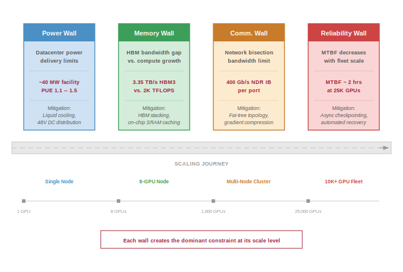
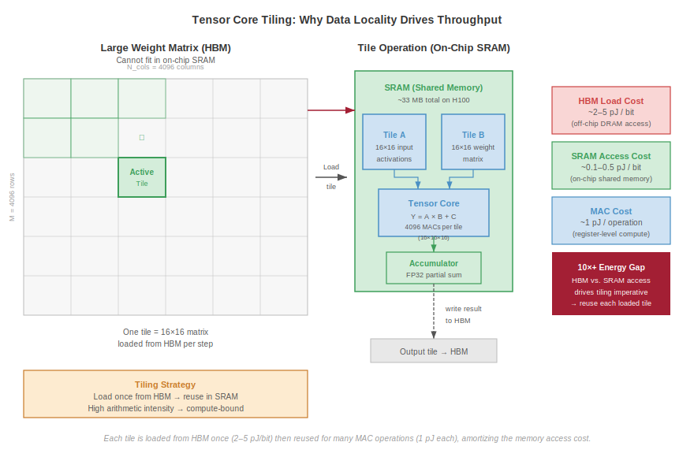
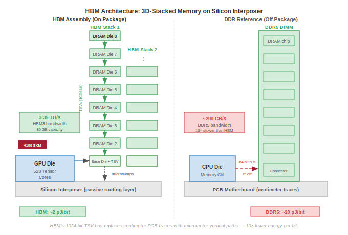
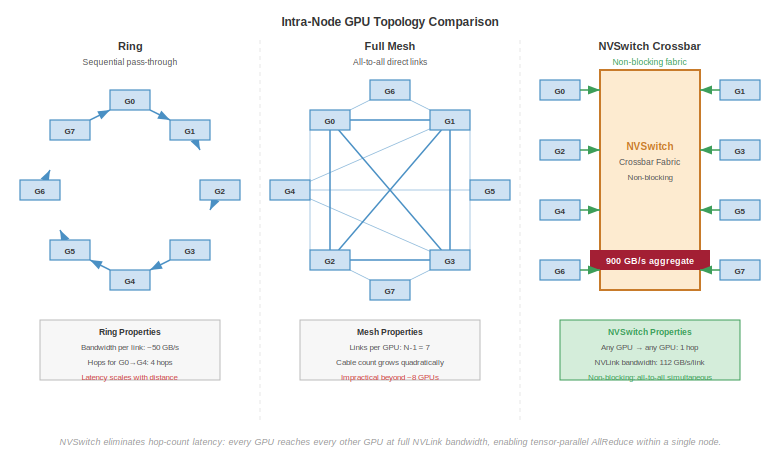
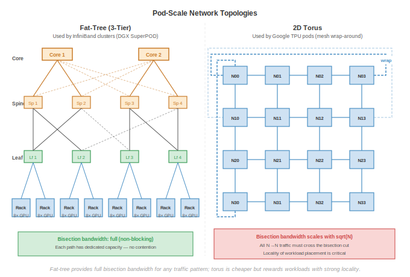

# Compute Infrastructure {#sec-compute-infrastructure}

::: {layout-narrow}
::: {.column-margin}

\chapterminitoc

:::

\noindent
{fig-alt="Isometric data center visualization with rows of server racks connected by glowing blue network paths, cooling infrastructure below, and monitoring dashboards displaying utilization graphs above."}

:::

## Purpose {.unnumbered}

\begin{marginfigure}
\mlfleetstack{100}{30}{15}{10}
\end{marginfigure}

_Why does infrastructure, not algorithms, increasingly determine who can participate in advancing machine learning?_

Machine learning systems have a physical reality that transcends code. While the algorithms for training large models are open, the ability to execute them at scale is gated by the physics of infrastructure. Every training run is a race against thermal limits, power delivery stability, and the crushing cost of data movement. When algorithms were the primary bottleneck, progress could happen anywhere. Now that scale dominates, the constraint is who can build and operate the physical systems that make scale possible. Building an ML fleet requires engineering across four physical levels: the **Accelerator** (silicon physics), the **Node** (interconnect density), the **Rack** (thermal management), and the **Pod** (warehouse-scale networking). At each level, the goal is the same: to minimize the time data spends in transit and maximize the time it spends in computation. The economics are equally unforgiving: a large GPU cluster represents staggering capital expenditure and megawatts of continuous power. Infrastructure has become the moat that separates organizations that can define the frontier from those that can only follow it. This chapter maps that physical stack, from the stacking of memory dies to the stabilization of grid-scale power ramps.

::: {.content-visible when-format="pdf"}

\newpage

:::

::: {.callout-learning-objectives}

- Explain the Accelerator Spectrum (GPU vs. TPU vs. ASIC) and how workload dataflows drive architectural specialization
- Quantify the memory wall by comparing HBM generations and calculating token generation latency
- Apply the Roofline Model to diagnose whether a cluster is throttled by arithmetic units or memory bandwidth
- Analyze the bandwidth hierarchy from HBM to NVLink to InfiniBand and its impact on parallel strategy selection
- Evaluate Cooling Architectures (Air vs. Liquid) and calculate data center power requirements using PUE
- Perform a Total Cost of Ownership (TCO) analysis to determine the break-even point for build-vs.-buy decisions

:::

```{python}
#| echo: false
from mlsysim import *
from mlsysim.core.constants import *
#| label: chapter-start
# ┌─────────────────────────────────────────────────────────────────────────────
# │ CHAPTER START
# ├─────────────────────────────────────────────────────────────────────────────
# │ Context: Chapter initialization and global imports
# │
# │ Why: Registers this chapter with the mlsys registry and provides shared
# │      imports for all subsequent calculation cells.
# │
# │ Imports: mlsysim.registry, mlsysim.constants, mlsysim.book
# │ Exports: (none)
# └─────────────────────────────────────────────────────────────────────────────
from mlsysim.fmt import fmt, fmt_sci, check, fmt_math
```

```{python}
#| echo: false
#| label: infra-running-example
#| output: false
# ┌─────────────────────────────────────────────────────────────────────────────
# │ RUNNING EXAMPLE: FRONTIER MODEL + H100 CORE SPECS (LEGO)
# ├─────────────────────────────────────────────────────────────────────────────
# │ Context: Chapter-wide running example used from @sec-compute-accelerator-spectrum
# │          through @sec-compute-pod. Token latency used in @nbk-token-latency.
# │
# │ Goal: Establish the frontier model (175B) and H100 baselines for the chapter.
# │ Show: frontier_params_b, gpt3_params_b, h_h100 specs, token latency breakdown.
# │ How: Reference mlsysim.Hardware and mlsysim.Models registry.
# │
# │ Imports: mlsysim.Hardware, mlsysim.Models, mlsysim.constants, mlsysim.book
# │ Exports: InfraSetup.frontier_params_b_str
# └─────────────────────────────────────────────────────────────────────────────
from mlsysim import Hardware, Models
from mlsysim.fmt import fmt, check, fmt_math

class InfraSetup:
    """Chapter preamble: 175B frontier running example."""

    m_frontier = Models.Language.GPT3

    # ┌── 4. OUTPUT (Formatting) ──────────────────────────────────────────────
    frontier_params_b_str = fmt(m_frontier.parameters.m_as(param) / BILLION, precision=0, commas=False)
```

Four physical constraints recur at different levels of the infrastructure stack: the memory wall, the power wall, the communication wall, and the reliability wall. @Fig-three-walls-grid maps *how* these constraints cascade from the accelerator die to the warehouse-scale pod.

::: {#fig-three-walls-grid fig-env="figure" fig-pos="htb" fig-cap="**The Four Infrastructure Walls**: Four dominant constraints arranged across a Scaling Journey: Power wall (data center delivery limits, ~40 MW facility), memory wall (HBM bandwidth gap, 3.35 TB/s HBM3 vs. ~2K TFLOP/s), communication wall (network bisection limit, 400 Gb/s NDR IB per port), and reliability wall (MTBF ~2 hours at 25K GPUs). Each wall becomes the dominant constraint at a different scale, from a single GPU through 8-GPU nodes and 1K-GPU clusters to 25K+ GPU fleets." fig-alt="Four walls laid out horizontally: Power, Memory, Comm., and Reliability, each with a quantitative constraint and a mitigation. Below, a Scaling Journey marks Single Node, 8-GPU Node, Multi-Node Cluster, and 10K+ GPU Fleet."}



:::

As @fig-three-walls-grid illustrates, this chapter begins at the silicon die and expands outward through four physical levels. At each level, we encounter the same engineering pattern: a constraint becomes intolerable, and the solution creates the next level of infrastructure. The Node aggregates accelerators to overcome memory capacity limits. The Rack concentrates nodes and confronts power delivery and cooling. The Pod wires racks into a warehouse-scale computer and faces the communication wall at full force. By the end, we will have mapped the complete physical stack from transistor to data center, with our `{python} InfraSetup.frontier_params_b_str`B model serving as the thread that connects each level.

## Accelerator Spectrum {#sec-compute-accelerator-spectrum}

\index{Accelerator!spectrum}
\index{Generality Tax}

Consider what happens when a CPU executes a matrix multiplication. The processor fetches an instruction, decodes it, checks for data hazards, routes operands through a deep pipeline, and writes the result back to a register file. For each multiply-accumulate operation, the chip expends energy on branch prediction, speculative execution, out-of-order scheduling, and cache coherence.

These mechanisms exist because a CPU must handle any instruction sequence efficiently, from pointer-chasing linked-list traversals to system calls. For neural network workloads, however, the operation is almost always the same: multiply two matrices of known dimensions, add a bias, and apply a nonlinear function. The CPU's elaborate control logic represents a tax on every operation, one that buys flexibility the workload does not need. This concept mirrors the classic reduced instruction set computer (RISC) vs. complex instruction set computer (CISC) debate in computer architecture: just as RISC processors achieved higher throughput by simplifying the instruction set, ML accelerators achieve higher throughput by simplifying the computational model to match the dominant workload pattern.

::: {#psp-compute-infrastructure-generality-tax .callout-perspective title="The generality tax"}

A modern server CPU devotes roughly 30--40 percent of its die area to caches, 20--30 percent to control logic (branch predictors, reorder buffers, instruction decoders), and only 5--10 percent to arithmetic units. This allocation makes sense for general-purpose code, where branches are unpredictable and data access patterns are irregular. For matrix multiplication, however, the access pattern is perfectly regular and the control flow is trivially predictable. Every transistor spent on branch prediction or speculative execution is a transistor that could have been a multiplier. This is the **generality tax**: the silicon area that a processor wastes on capabilities irrelevant to the dominant workload.

The accelerator revolution is, at its core, an exercise in eliminating this tax. Each step along the spectrum from CPU to custom ASIC reclaims more die area for arithmetic by removing another layer of general-purpose control logic. The progression is quantifiable: a CPU devotes roughly 5--10 percent of its die to arithmetic, a GPU devotes roughly 50--60 percent, a Tensor Processing Unit (TPU) devotes roughly 70--80 percent, and a purpose-built ASIC can devote over 90 percent of its die to the target computation.

:::

The transition from general-purpose to specialized silicon follows a logical progression. At one end of the spectrum, GPUs retain substantial programmability while providing 10--100$\times$ the matrix throughput of CPUs. At the other end, custom ASICs hardwire a specific dataflow for maximum efficiency at the cost of flexibility.

Understanding *where* each architecture falls on this spectrum, and *why*, is essential for selecting hardware that matches a given workload. The spectrum is not a ranking from "bad" (general-purpose CPU) to "good" (custom ASIC), but a continuum of trade-offs where each position offers the best match for a different combination of workload characteristics and deployment constraints.

GPUs represent the first major step away from general-purpose computing toward massive parallelism while retaining programmability. An NVIDIA H100, for example, contains 16,896 CUDA cores organized into 132 Streaming Multiprocessors (SMs). Each SM can execute thousands of threads simultaneously using the **Single Instruction, Multiple Threads (SIMT)**[^fn-simt-warp] execution model. Unlike a CPU, which optimizes for single-thread latency, a GPU hides memory latency by maintaining thousands of threads in flight and switching between them when one stalls on a memory access.

The programmer writes a single function (a *kernel*), and the hardware maps it across a massive grid of threads. This model is flexible enough to run any mathematical kernel, from convolutions to attention mechanisms to custom loss functions, while providing orders of magnitude more throughput than a CPU for data-parallel computation.

The trade-off is that irregular, branch-heavy code runs poorly because divergent threads within a warp (a group of 32 threads that execute in lockstep) must execute serially. When threads in the same warp take different branches of an if-else statement, the hardware must execute both branches sequentially, disabling the threads that took the other path during each branch. For ML workloads, this divergence penalty is usually small because neural network operations have highly uniform control flow: every element in a matrix multiplication follows the same computation path.

[^fn-simt-warp]: **SIMT (Single Instruction, Multiple Thread)**: Coined by NVIDIA to distinguish their GPU model from classical single instruction, multiple data (SIMD). In SIMT, 32 threads form a *warp* that shares an instruction stream but can diverge at branches; divergence forces serial execution of both paths, halving throughput per branch. For ML workloads, where matrix operations have uniform control flow, warp divergence is rare, which is why GPUs achieve near-peak utilization on general matrix multiply (GEMM) operations but degrade on irregular operations like sparse attention or dynamic routing. \index{SIMT!warp divergence}

TPUs go a step further, sacrificing some programmability for maximum efficiency on a single operation type by hardwiring the dataflow itself. Google's Tensor Processing Units use a **systolic array**[^fn-systolic-array-tpu] architecture: a fixed grid of multiply-accumulate (MAC) units where data flows between neighboring cells in a regular, wave-like pattern. Instead of fetching and decoding instructions for each operation, the systolic array receives a matrix at one edge and pulses it through the grid, with each cell performing one MAC and passing the result to its neighbor. This eliminates the instruction fetch and decode overhead entirely, and it avoids writing intermediate results to memory because each partial sum flows directly to the next computation.

The cost of this efficiency is reduced programmability. Models must be compiled through XLA (Accelerated Linear Algebra), which maps high-level operations onto the fixed dataflow. Workloads with irregular control flow or dynamic shapes may not map well to this architecture, and the compilation process itself can be time-consuming (minutes to hours for complex models), which slows the iteration cycle during model development.

The programming model distinction between GPUs and TPUs has practical implications for organizational decisions. Research teams that frequently modify model architectures (adding custom attention patterns, experimenting with new activation functions, prototyping novel training algorithms) generally prefer the GPU's CUDA ecosystem because new operations can be implemented as custom kernels without waiting for compiler support. Teams running established architectures at scale (standard Transformer training, large-scale fine-tuning) may prefer TPUs because the XLA compiler can optimize the entire computation graph, often achieving better hardware utilization than hand-written CUDA kernels for standard operations.

[^fn-systolic-array-tpu]: **Systolic Array**: From Greek *systole* (contraction) -- coined by H. T. Kung and Leiserson in 1978 because data pulses through a grid of processing elements in a heart-like rhythm. The metaphor explains the design: each cell performs one MAC and passes the result to its neighbor, eliminating register-file round-trips. Google's TPU v1 deployed a $256{\times}256$ array (65,536 MACs), achieving 92 TOPS within 75 W by hardwiring this dataflow -- the architectural bet that made data center-scale inference economically viable. \index{Systolic Array!etymology}

::: {#exmp-compute-infrastructure-tpu-origin-story .callout-example title="The TPU origin story"}

In 2013, Google engineers projected that if users spoke to their Android phones for just three minutes per day using voice search, the company would need to double its data center compute capacity to handle the inference load. The cost was prohibitive. When they profiled their production workloads, a striking pattern emerged: over 90 percent of inference cycles were spent on matrix multiplications in neural network models. The existing GPU fleet was powerful but expensive, and its general-purpose SIMT architecture carried the generality tax for capabilities that inference workloads never used. This observation led directly to the TPU v1, a purpose-built inference accelerator with a $256{\times}256$ systolic array that could deliver 92 TOPS (INT8) within a 75 W power envelope. The first TPUs were deployed in 2015 and served production inference workloads including RankBrain, portions of Google Neural Machine Translation, and AlphaGo match play [@silver2017; @jouppi2017].

:::

Custom ASICs represent the extreme end of the spectrum, where the economics of silicon justify abandoning general-purpose programmability entirely. When an organization runs a single model architecture at enormous scale, designing a chip specifically for that workload becomes economically rational. By stripping away every feature not required by the target computation, custom ASICs achieve the lowest energy per operation and the highest sustained utilization of any architecture on the spectrum.

Tesla's Dojo D1 chip, for example, is optimized for the spatial and temporal structure of video-based vision models. Its hundreds of tightly coupled processing nodes are designed around the dataflow needs of Tesla's vision pipeline, with on-chip SRAM sized to keep spatial tiles close to the compute units. This reduces the repeated round-trips to off-chip memory that a general-purpose GPU would require for the same computation.

AWS Trainium\index{AWS Trainium} takes a different approach, targeting the broad category of Transformer training rather than a single model. Trainium systems combine compiler-managed memory scheduling with hardware-assisted collective communication, so common training patterns such as tensor-parallel synchronization and data-parallel reductions can be optimized in the accelerator fabric rather than handled entirely by host software.

The risk of custom silicon is equally clear: if the dominant model architecture shifts, as it did from convolutional neural networks (CNNs) to Transformers between 2017 and 2020, a custom ASIC designed for the old architecture becomes a stranded asset. The design cycle for a new ASIC is 2--3 years from conception to deployment, which means the architecture decision must anticipate workload trends several years into the future. This prediction challenge is nontrivial: in 2015, few would have predicted that attention-based Transformers would replace CNNs as the dominant architecture within five years, and organizations that committed to CNN-optimized ASICs during that period found their hardware stranded by the architectural shift.

Custom silicon is therefore a bet on workload stability, and the organizations that make this bet are typically those with enough scale to justify the \$50--200 million development cost and enough workload volume to amortize the per-chip NRE (nonrecurring engineering) cost across millions of chips. Google can justify the TPU's development cost because every Google Search query, every YouTube recommendation, and every Gmail spam filter uses the same accelerator. A research lab running a few hundred GPUs cannot justify the same investment.

The bet pays off handsomely when workloads are stable: a purpose-built ASIC can deliver 5--10$\times$ the energy efficiency of a general-purpose GPU for its target operation. However, the consequences of a wrong bet are severe, as the chip's fixed dataflow cannot be reprogrammed to accommodate a fundamentally new computational pattern.

Pushing the locality argument further leads to a deeper question of physical scale: whether a single die can be expanded to the size of the entire wafer.

### Wafer-scale engines {#sec-compute-wafer-scale}

\index{Wafer-Scale Engine}

Wafer-Scale Engines (WSE) represent the ultimate pursuit of data locality. While every other architecture on the spectrum relies on chiplets or discrete dies connected by relatively slow PCB-level or package-level interconnects, a wafer-scale engine (like the Cerebras WSE-3) is a single, continuous piece of silicon the size of a dinner plate. By avoiding the need to "dice" the wafer into individual chips, a WSE can maintain a single, massive on-chip interconnect across its entire surface.

The WSE-3 contains 900,000 AI-optimized cores and 44 GB of on-chip SRAM, all connected by a silicon fabric that delivers 21 PB/s of memory bandwidth. To put this in perspective, a single WSE-3 has compute comparable to a large multi-H100 cluster and on-chip memory bandwidth comparable to thousands of H100 HBM links, but because the entire system resides on a single piece of silicon, the communication latency between any two cores is measured in nanoseconds rather than microseconds.

As @fig-wafer-scale-engine shows, the challenge of wafer-scale integration is physical: manufacturing yield, power delivery, and thermal expansion. A single defect on a standard chip might render it useless, but on a wafer-scale engine, the software must be "defect-aware," routing around local manufacturing flaws in the silicon fabric. Delivering 23 kW of power to a single piece of silicon and cooling it requires specialized manifold-level liquid cooling that is closer to industrial plumbing than traditional computer engineering.

Wafer-scale engines sit at a unique point on the spectrum: they are highly specialized in their *physical* architecture but flexible in their *computational* model, as the underlying cores are often general-purpose enough to execute diverse ML kernels. They represent a "Scale Up" philosophy that attempts to eliminate the communication wall by making the cluster the chip.

::: {#fig-wafer-scale-engine fig-env="figure" fig-pos="htb" fig-cap="**Wafer-Scale Engine (WSE) Architecture**: Unlike traditional processors, a WSE uses the entire 300 mm silicon wafer as a single continuous compute fabric. This eliminates the 'Dicing' process and replaces PCB-level interconnects with a high-bandwidth on-chip mesh. The software must be defect-aware, routing data through a unified fabric that treats the entire wafer as a single logical processor with uniform memory access (UMA) characteristics across 900,000 cores." fig-alt="Side-by-side comparison. Left: 8-GPU cluster, NVLink 900 GB/s intra-node, InfiniBand 400 Gb/s inter-node, microsecond cross-chip latency. Right: WSE-3 single wafer with 900,000 cores, 44 GB on-chip SRAM, 21 PB/s memory BW, nanosecond latency."}


:::

The key wafer-scale trade-off is manufacturing complexity and defect-aware routing in exchange for eliminating the inter-chip communication bottleneck entirely, keeping all 900,000 cores within nanoseconds of each other on a single silicon fabric. @Fig-accelerator-spectrum places these architectures on a continuum, revealing the fundamental trade-off between programmability and efficiency that governs every accelerator design choice.

::: {#fig-accelerator-spectrum fig-env="figure" fig-pos="htb" fig-cap="**The Accelerator Spectrum**: The landscape of ML hardware involves a fundamental trade-off between programmability and efficiency. General-purpose CPUs provide maximum flexibility but low compute density. Moving toward custom ASICs and systolic arrays increases throughput per watt by hardwiring common dataflows, at the cost of supporting a narrower range of model architectures." fig-alt="Four pie charts along a General-Purpose to Maximum-Efficiency axis showing die-area splits: CPU (90 percent Control, 10 percent Arithmetic), GPU (30/55), TPU (20/75), Custom ASIC (8 percent Control, over 90 percent Arithmetic)."}

:::

| **Feature**         |    **CPU**    | **GPU**\index{GPU} (H100) | **TPU** (v5p)  | **Wafer-Scale** | **Custom ASIC** |
|:--------------------|:-------------:|:-------------------------:|:--------------:|:---------------:|:---------------:|
| **Arithmetic Core** | Scalar/Vector |        Tensor Core        | systolic array | RISC-style Core |  Fixed Dataflow |
| **Execution**       |  Instruction  |            SIMT           |  Data-Driven   |     Dataflow    |    Hardwired    |
| **Memory Control**  |     Cache     |        L1/L2 + HBM        |   Scratchpad   |   On-Chip SRAM  |  Explicit Mesh  |
| **Flexibility**     |  **Extreme**  |            High           |    Moderate    |       High      |       Low       |
| **Efficiency**      |      Low      |            High           |   Very High    |       High      |   **Extreme**   |

: **The Accelerator Spectrum**: As we move from left to right, we trade general-purpose programmability for compute density and power efficiency. Wafer-scale engines occupy a distinct niche, providing cluster-scale performance on a single piece of silicon. {#tbl-accelerator-comparison}

```{python}
#| echo: false
# ┌── LEGO ───────────────────────────────────────────────
# │ Exports: InfraFrontierAccelRecap.frontier_params_b_str
class InfraFrontierAccelRecap:

    # ┌── 4. OUTPUT (Formatting) ──────────────────────────────────────────────
    frontier_params_b_str = fmt(Models.Language.GPT3.parameters.m_as(param) / BILLION, precision=0, commas=False)
```

As @tbl-accelerator-comparison summarizes, for our `{python} InfraFrontierAccelRecap.frontier_params_b_str`B model, the choice is not purely about peak FLOP/s. If we are a research lab experimenting with novel architectures weekly, the GPU's flexibility justifies its generality tax. If we are deploying a fixed Transformer at scale for years, the TPU's dataflow efficiency or a custom ASIC's power advantage may dominate total cost. The accelerator spectrum is ultimately an economic question of *how much flexibility can be surrendered, given the stability of the workload*.

An emerging trend in accelerator design is the **chiplet**\index{Chiplet} architecture, exemplified by NVIDIA's Blackwell and AMD's Instinct MI300 series. Rather than fabricating a single monolithic die, chiplet-based designs partition the processor into multiple smaller dies connected by a high-bandwidth die-to-die interconnect on a common package substrate. This approach addresses two physical limitations that constrain monolithic designs.

First, the maximum die size is limited by the reticle size of lithographic equipment, roughly 800 mm$^2$ for current EUV scanners. A monolithic GPU cannot exceed this area, which caps the number of Tensor Cores, SMs, and HBM stacks that can be integrated. Chiplet designs bypass this limit by placing multiple dies on a single package, with the B200's dual-die design effectively creating a 1,600 mm$^2$ equivalent processor.

Second, manufacturing yield decreases exponentially with die area because a single defect anywhere on the die renders the entire chip unusable. Smaller chiplets have higher individual yield, and the package-level integration allows partial yields (a defective chiplet can be replaced with a good one). This yield advantage translates directly to lower manufacturing cost per unit of compute, which is particularly important as transistor densities continue to increase and process nodes become more expensive.

The trade-off is the die-to-die interconnect. Communication between chiplets within a package is faster than communication between packages (NVLink) but slower than communication within a single monolithic die (the on-die mesh network). Workloads that generate frequent, fine-grained communication between processing elements (such as operations that share data between nonadjacent SMs) may experience a latency penalty when those SMs reside on different chiplets. GPU vendors mitigate this by making the die-to-die link transparent to the programmer, so the software sees a single logical GPU regardless of the underlying chiplet topology.

#### Evolution of GPU architectures {#sec-compute-infrastructure-evolution-gpu-architectures-566b}

The rapid evolution of NVIDIA's GPU architectures over the past decade illustrates how accelerator design has adapted to the changing demands of ML workloads. Each generation has introduced architectural innovations targeted at the specific bottlenecks revealed by production ML workloads, rather than simply increasing transistor counts.

```{python}
#| echo: false
# ┌── LEGO ───────────────────────────────────────────────
# │ Exports: V100SpectrumRecap.flops_fp16_str, V100SpectrumRecap.tdp_str
class V100SpectrumRecap:
    h_v100 = Hardware.Cloud.V100

    # ┌── 4. OUTPUT (Formatting) ──────────────────────────────────────────────
    flops_fp16_str = fmt(h_v100.compute.peak_flops.m_as(TFLOPs/second), precision=0, commas=False, suffix=" TFLOP/s")
    tdp_str = fmt(h_v100.tdp.m_as(watt), precision=0, commas=False, suffix=" W")
```

The Volta architecture (2017) introduced the first-generation Tensor Core, recognizing that neural network training spends the majority of its time in matrix multiplications. By adding dedicated matrix-multiply-accumulate (MMA) hardware alongside the existing CUDA cores, Volta could accelerate the dominant workload pattern without sacrificing the general-purpose programmability that made GPUs attractive for research. The V100, Volta's flagship, delivered `{python} V100SpectrumRecap.flops_fp16_str` of FP16 Tensor Core throughput at `{python} V100SpectrumRecap.tdp_str`.

```{python}
#| echo: false
#| label: a100-generation-specs
# ┌── LEGO ───────────────────────────────────────────────
# │ Exports: A100Specs.flops_fp16_str, A100Specs.tdp_str, A100Specs.nvlink_str
from mlsysim.fmt import fmt, check

class A100Specs:
    """A100 (Ampere, 2020) reference specs for plumbed prose/tables."""

    # ┌── 1. LOAD ──────────────────────────────────────────────────────────
    flops_fp16_tc = Hardware.Cloud.A100.compute.peak_flops
    mem_bw = Hardware.Cloud.A100.memory.bandwidth
    tdp = Hardware.Cloud.A100.tdp
    nvlink = Hardware.Cloud.A100.nvlink.bandwidth

    # ┌── 2. EXECUTE ───────────────────────────────────────────────────────
    flops_fp16_tflops = flops_fp16_tc.m_as(TFLOPs / second)
    mem_bw_gbs = mem_bw.m_as(GB / second)
    mem_bw_tbs = mem_bw.m_as(TB / second)
    tdp_w = tdp.m_as(watt)
    nvlink_gbs = nvlink.m_as(GB / second)

    # ┌── 3. GUARD ─────────────────────────────────────────────────────────
    check(flops_fp16_tflops > 300, "A100 FP16 Tensor should be > 300 TFLOP/s")
    check(tdp_w == 400, "A100 SXM TDP should be 400 W")

    # ┌── 4. OUTPUT ────────────────────────────────────────────────────────
    flops_fp16_str = fmt(flops_fp16_tflops, precision=0, commas=False, suffix=" TFLOP/s")
    mem_bw_str = fmt(mem_bw_gbs, precision=0, commas=False, suffix=" GB/s")
    mem_bw_tbs_str = fmt(mem_bw_tbs, precision=2, commas=False, suffix=" TB/s")
    tdp_str = fmt(tdp_w, precision=0, commas=False, suffix=" W")
    nvlink_str = fmt(nvlink_gbs, precision=0, commas=False, suffix=" GB/s")
```

```{python}
#| echo: false
# ┌── LEGO ───────────────────────────────────────────────
# │ Exports: V100NvlinkRecap.nvlink_str
class V100NvlinkRecap:

    # ┌── 4. OUTPUT (Formatting) ──────────────────────────────────────────────
    nvlink_str = fmt(Hardware.Cloud.V100.nvlink.bandwidth.m_as(GB/second), precision=0, commas=False, suffix=" GB/s")
```

The Ampere architecture (2020) expanded Tensor Core support to additional data types (TF32, BF16, INT8, INT4), reflecting the growing importance of mixed-precision training and quantized inference. The A100 also introduced Multi-Instance GPU (MIG), which partitions a single GPU into up to seven isolated instances, enabling efficient sharing of expensive hardware across multiple inference workloads. The most consequential change for infrastructure was Ampere's third-generation NVLink, which doubled bidirectional bandwidth to `{python} A100Specs.nvlink_str` per GPU from Volta's `{python} V100NvlinkRecap.nvlink_str`, directly addressing the communication wall for tensor parallelism.

```{python}
#| echo: false
#| label: h100-generation-specs
# ┌── LEGO ───────────────────────────────────────────────
# │ Exports: H100Specs.flops_fp16_str, H100Specs.tdp_str, H100Specs.nvlink_str
from mlsysim.fmt import fmt, check

class H100Specs:
    """H100 (Hopper, 2022) reference specs for plumbed prose/tables."""

    # ┌── 1. LOAD ──────────────────────────────────────────────────────────
    flops_fp16_tc = Hardware.Cloud.H100.compute.peak_flops
    mem_bw = Hardware.Cloud.H100.memory.bandwidth
    tdp = Hardware.Cloud.H100.tdp
    nvlink = Hardware.Cloud.H100.nvlink.bandwidth

    # ┌── 2. EXECUTE ───────────────────────────────────────────────────────
    flops_fp16_tflops = flops_fp16_tc.m_as(TFLOPs / second)
    mem_bw_gbs = mem_bw.m_as(GB / second)
    tdp_w = tdp.m_as(watt)
    nvlink_gbs = nvlink.m_as(GB / second)

    # ┌── 3. GUARD ─────────────────────────────────────────────────────────
    check(flops_fp16_tflops > 900, "H100 FP16 Tensor should be > 900 TFLOP/s")
    check(tdp_w == 700, "H100 SXM TDP should be 700 W")

    # ┌── 4. OUTPUT ────────────────────────────────────────────────────────
    flops_fp16_str = fmt(flops_fp16_tflops, precision=0, commas=False, suffix=" TFLOP/s")
    mem_bw_str = fmt(mem_bw_gbs, precision=0, commas=False, suffix=" GB/s")
    tdp_str = fmt(tdp_w, precision=0, commas=False, suffix=" W")
    nvlink_str = fmt(nvlink_gbs, precision=0, commas=False, suffix=" GB/s")
```

The Hopper architecture (2022) added the Transformer Engine, which dynamically selects between FP8 and FP16 precision on a per-layer basis, doubling the effective throughput for Transformer models without requiring manual precision tuning. Hopper also introduced NVLink 4.0 at `{python} H100Specs.nvlink_str` per GPU and the NVLink Switch, enabling NVLink connectivity beyond the 8-GPU boundary.

```{python}
#| echo: false
#| label: h_h100-performance-scenario
# ┌─────────────────────────────────────────────────────────────────────────────
# │ H100 PERFORMANCE SPECS (LEGO)
# ├─────────────────────────────────────────────────────────────────────────────
# │ Context: @sec-compute-infrastructure-evolution-gpu-architectures-566b—accelerator evolution
# │
# │ Goal: Provide H100 peak throughput and efficiency statistics.
# │ Show: ~1,979 TFLOP/s FP8.
# │ How: pulling constants from mlsysim.core.constants.
# │
# │ Imports: mlsysim.core.constants (Hardware.Cloud.H100.compute.precision_flops["fp8"], TFLOPs, second)
# │ Exports: H100PerformanceScenario.h100_tflops_str
# └─────────────────────────────────────────────────────────────────────────────
from mlsysim.fmt import fmt

class H100PerformanceScenario:
    """H100 peak performance reference."""

    # ┌── 1. LOAD (Constants) ──────────────────────────────────────────────
    flops = Hardware.Cloud.H100.compute.precision_flops["fp8"]

    # ┌── 2. EXECUTE (The Compute) ────────────────────────────────────────
    h100_tf = flops.m_as(TFLOPs/second)

    # ┌── 3. GUARD (Invariants) ──────────────────────────────────────────
    from mlsysim.fmt import check
    check(h100_tf > 1000, "H100 should have more than 1000 TFLOPs FP8")

    # ┌── 4. OUTPUT (Formatting) ──────────────────────────────────────────────
    h100_tflops_str = fmt(h100_tf, precision=0, commas=False, suffix=" TFLOP/s")
```

The H100's `{python} H100PerformanceScenario.h100_tflops_str` of FP8 Tensor Core throughput at `{python} H100Specs.tdp_str` represents a 6.8$\times$ efficiency improvement over V100, achieved through a combination of process technology (TSMC 4N), architectural innovation (Transformer Engine), and precision engineering (FP8 support).

```{python}
#| echo: false
#| label: b200-perf-specs
# ┌─────────────────────────────────────────────────────────────────────────────
# │ B200 PERFORMANCE SPECS (LEGO)
# ├─────────────────────────────────────────────────────────────────────────────
# │ Context: @sec-compute-infrastructure-evolution-gpu-architectures-566b—
# │          Blackwell discussion immediately below.
# │
# │ Goal: Provide B200 FP8 Tensor peak and TDP for the Blackwell paragraph.
# │ Show: ~4,500 TFLOP/s FP8 at ~1,000 W.
# │ How: pulling Hardware.Cloud.B200.compute.precision_flops["fp8"] and Hardware.Cloud.B200.tdp from mlsysim.core.constants.
# │
# │ Imports: mlsysim.core.constants (Hardware.Cloud.B200.compute.precision_flops["fp8"], Hardware.Cloud.B200.tdp,
# │                                  Hardware.Cloud.B200.nvlink, TFLOPs, GB, second, watt)
# │ Exports: B200PerformanceScenario.fp8_tflops_str,
# │          B200PerformanceScenario.tdp_w_str,
# │          B200PerformanceScenario.nvlink_str
# └─────────────────────────────────────────────────────────────────────────────
from mlsysim.fmt import check, fmt

class B200PerformanceScenario:
    """B200 peak FP8 performance reference."""

    # ┌── 1. LOAD (Constants) ──────────────────────────────────────────────
    fp8_tflops = Hardware.Cloud.B200.compute.precision_flops["fp8"].m_as(TFLOPs / second)
    tdp_w = Hardware.Cloud.B200.tdp.m_as(watt)
    nvlink_gbs = Hardware.Cloud.B200.nvlink.bandwidth.m_as(GB / second)

    # ┌── 2. EXECUTE (The Compute) ────────────────────────────────────────
    # (none — direct extraction)

    # ┌── 3. GUARD (Invariants) ───────────────────────────────────────────
    check(fp8_tflops > 4000, "B200 should exceed 4,000 TFLOP/s FP8")
    check(tdp_w == 1000, "B200 TDP should be 1,000 W")
    check(nvlink_gbs == 1800, "B200 NVLink bandwidth should be 1,800 GB/s")

    # ┌── 4. OUTPUT (Formatting) ──────────────────────────────────────────
    fp8_tflops_str = fmt(fp8_tflops, precision=0, suffix=" TFLOP/s")
    tdp_w_str = fmt(tdp_w, precision=0, commas=False, suffix=" W")
    nvlink_str = fmt(nvlink_gbs, precision=0, suffix=" GB/s")
```

The Blackwell architecture (2024) continued this trajectory with the B200, which pairs two GPU dies in a single package via a high-bandwidth chip-to-chip link, effectively creating a "dual-die GPU" that delivers about `{python} B200PerformanceScenario.fp8_tflops_str` of dense FP8 Tensor Core throughput at `{python} B200PerformanceScenario.tdp_w_str`. FP16/BF16 comparisons should use the lower precision-specific vendor figure rather than the FP8 peak.

The dual-die approach acknowledges that single-die GPU sizes are approaching the reticle limit of lithographic equipment (roughly 800 mm$^2$), and further scaling requires chiplet-based designs. The reticle limit is a fundamental constraint of photolithography: the lens system in the EUV scanner can only project a pattern onto an area of approximately $26{\times}33$ mm (858 mm$^2$) in a single exposure. A die larger than this area would require multiple exposures with stitching, which is technically possible but dramatically increases cost and reduces yield.

```{python}
#| echo: false
# ┌── LEGO ───────────────────────────────────────────────
# │ Exports: B200NvlinkRecap.nvlink_str
class B200NvlinkRecap:
    # ┌── 4. OUTPUT (Formatting) ──────────────────────────────────────────────
    nvlink_str = fmt(Hardware.Cloud.B200.nvlink.bandwidth.m_as(GB/second), precision=0, commas=False, suffix=" GB/s")
```

Blackwell also introduced fifth-generation NVLink at `{python} B200NvlinkRecap.nvlink_str` per GPU, doubling the intra-node bandwidth again. The die-to-die link within the B200 package operates at 10 TB/s, fast enough that the two dies appear as a single logical GPU to the software, with no performance penalty for operations that span the die boundary.

The progression reveals a consistent pattern: each generation addresses the bottleneck exposed by the previous generation. Volta solved the compute bottleneck for matrix multiplication. Ampere solved the precision bottleneck for mixed-precision training. Hopper solved the Transformer-specific precision bottleneck with FP8. Blackwell is pushing against the die-size limit with multi-die packaging.

At each step, the accelerator's design reflects the dominant workload of its era, illustrating *how* the physics of the workload drives the physics of the silicon. This co-evolution between workloads and hardware is not accidental: GPU architects profile production ML workloads to identify the next bottleneck, and then design the next generation to address it. The result is a hardware evolution that is tightly coupled to the model architecture evolution, which is *why* the Transformer's dominance since 2017 has so profoundly shaped the trajectory of accelerator design.

The evolution also reveals a sobering trend for infrastructure planners: the useful lifetime of each generation is shrinking. The V100 remained the state of the art for approximately three years (2017--2020). The A100 held that position for roughly two years (2020--2022). The H100's reign is similarly expected to last two years before being superseded by Blackwell for new deployments.

The accelerating cadence means that hardware deployed today will be two generations behind within three to four years, at which point the electricity cost of operating it may exceed the cost of replacing it. Hardware refresh planning is therefore an integral part of the initial procurement decision, not a future concern.

A subtlety that affects fleet consistency is the **silicon lottery** -- the manufacturing reality where microscopic variance in 4nm lithography produces a distribution of chip quality across each wafer. NVIDIA manages this yield curve through aggressive binning: dies capable of sustaining high clock frequencies at strictly controlled voltages under the full TDP are designated as premium H100 SXM modules, while those with higher leakage currents or minor defects become H100 PCIe cards or are fused down to lower-tier products. Even within the top-tier SXM bin, the achievable boost clock varies based on silicon characteristics. In a synchronous training cluster, the collective communication primitives are blocked by the slowest participant. A single chip running 50 MHz below the fleet average can degrade the effective throughput of the entire cluster by 5--10 percent, which is *why* sophisticated fleet management systems track per-GPU performance metrics and quarantine underperforming silicon to inference pools where the impact of individual chip variance is less pronounced.

```{python}
#| echo: false
# ┌── LEGO ───────────────────────────────────────────────
# │ Exports: V100TableRecap.flops_fp16_str, V100TableRecap.tdp_str, V100TableRecap.nvlink_str
class V100TableRecap:
    h_v100 = Hardware.Cloud.V100

    # ┌── 4. OUTPUT (Formatting) ──────────────────────────────────────────────
    flops_fp16_str = fmt(h_v100.compute.peak_flops.m_as(TFLOPs/second), precision=0, commas=False, suffix=" TFLOP/s")
    tdp_str = fmt(h_v100.tdp.m_as(watt), precision=0, commas=False, suffix=" W")
    nvlink_str = fmt(Hardware.Cloud.V100.nvlink.bandwidth.m_as(GB/second), precision=0, commas=False, suffix=" GB/s")
```

| **Architecture**     | **Year** | **Key Innovation**      |                    **Peak Tensor**                    |                   **TDP**                    |                 **NVLink BW**                 |
|:---------------------|:--------:|:------------------------|:-----------------------------------------------------:|:--------------------------------------------:|:---------------------------------------------:|
| **Volta** (V100)     |   2017   | First Tensor Core       |        `{python} V100TableRecap.flops_fp16_str`       |      `{python} V100TableRecap.tdp_str`       |      `{python} V100TableRecap.nvlink_str`     |
| **Ampere** (A100)    |   2020   | Multi-precision, MIG    |          `{python} A100Specs.flops_fp16_str`          |         `{python} A100Specs.tdp_str`         |        `{python} A100Specs.nvlink_str`        |
| **Hopper** (H100)    |   2022   | Transformer Engine, FP8 |   `{python} H100PerformanceScenario.h100_tflops_str`  |         `{python} H100Specs.tdp_str`         |        `{python} H100Specs.nvlink_str`        |
| **Blackwell** (B200) |   2024   | Dual-die, NVLink 5      | `{python} B200PerformanceScenario.fp8_tflops_str` FP8 | `{python} B200PerformanceScenario.tdp_w_str` | `{python} B200PerformanceScenario.nvlink_str` |

: **NVIDIA GPU Architecture Evolution**: Each generation introduces architectural features targeted at the dominant ML workload pattern of its era. Efficiency rises substantially but unevenly across generations, while NVLink bandwidth increases from 300 GB/s on V100 to `{python} B200PerformanceScenario.nvlink_str` on B200, with a smaller 1.5$\times$ A100-to-H100 step between the larger doubling jumps. {#tbl-gpu-evolution}

@Tbl-gpu-evolution compresses four hardware generations into a few columns. @Fig-accelerator-efficiency-wall unpacks two of those columns, raw throughput and power efficiency, to reveal a divergence that shapes every infrastructure decision in this volume.

::: {#fig-accelerator-efficiency-wall fig-env="figure" fig-pos="htb" fig-cap="**The Accelerator Efficiency Wall**: Peak Tensor Core throughput (blue, left axis) and power efficiency (green, right axis) for six generations of NVIDIA data center GPUs, both on logarithmic scales. The series follows the advertised low-precision Tensor Core mode for each generation, so precision changes are part of the hardware trend rather than an apples-to-apples FP16 comparison. Raw throughput has grown over 200$\times$ from the P100 to the B200, but efficiency (TFLOP/s per watt) has grown far less. The shaded region highlights the widening gap that the power grid, cooling systems, and data center infrastructure must absorb." fig-alt="Dual-axis log-scale plot showing peak Tensor Core TFLOP/s and TFLOP/s per watt from 2016 to 2024 across six NVIDIA GPU generations."}

```{python}
#| echo: false
# ┌─────────────────────────────────────────────────────────────────────────────
# │ ACCELERATOR EFFICIENCY WALL (FIGURE)
# ├─────────────────────────────────────────────────────────────────────────────
# │ Context: @fig-accelerator-efficiency-wall—throughput vs efficiency
# │
# │ Goal: Dual-axis plot: peak Tensor TFLOP/s vs TFLOP/s/Watt P100→B200;
# │       show widening gap.
# │ Show: Semilogy; left/right axes; shaded divergence; GPU labels.
# │ How: Verified tflops, tdp_w, eff; viz.setup_plot().
# │
# │ Imports: numpy (np), mlsysim.core.viz (viz)
# │ Exports: (figure only, no prose variables)
# └─────────────────────────────────────────────────────────────────────────────
# ┌── 1. CANVAS ────────────────────────────────────────────────────────────────
# │ Dual-axis plot: peak Tensor TFLOP/s vs TFLOP/s/Watt P100→B200;
import numpy as np
from mlsysim import viz

fig, ax1, COLORS, plt = viz.setup_plot(figsize=(8, 5))

#—Verified data (NVIDIA datacenter GPUs, official datasheets) ---

# ┌── 2. ARRAYS ────────────────────────────────────────────────────────────────
gpus    = ["P100\nSXM2", "V100\nSXM2", "A100\nSXM4", "H100\nSXM5", "B100", "B200"]
years   = [2016,          2017,          2020,          2022,          2024,   2024  ]
tflops  = [
    21.2,
    Hardware.Cloud.V100.compute.peak_flops.m_as(TFLOPs/second),
    Hardware.Cloud.A100.compute.peak_flops.m_as(TFLOPs/second),
    Hardware.Cloud.H100.compute.peak_flops.m_as(TFLOPs/second),
    1750,
    Hardware.Cloud.B200.compute.precision_flops["fp8"].m_as(TFLOPs/second),
]
tdp_w   = [
    300,
    Hardware.Cloud.V100.tdp.m_as(watt),
    Hardware.Cloud.A100.tdp.m_as(watt),
    Hardware.Cloud.H100.tdp.m_as(watt),
    700,
    Hardware.Cloud.B200.tdp.m_as(watt),
]
eff     = [t/w for t, w in zip(tflops, tdp_w)]  # TFLOP/s/W

years_arr = np.array(years, dtype=float)

#—Left axis: peak Tensor TFLOP/s ---
ax1.semilogy(years_arr, tflops, "o-", color=COLORS["BlueLine"], markersize=8,
             linewidth=2, label="Peak Tensor TFLOP/s", zorder=5)
ax1.set_ylabel("Peak Tensor TFLOP/s (log scale)", color=COLORS["BlueLine"])
ax1.tick_params(axis="y", labelcolor=COLORS["BlueLine"])
ax1.set_ylim(10, 10000)

#—Right axis: TFLOP/s/Watt ---
ax2 = ax1.twinx()
ax2.semilogy(years_arr, eff, "s-", color=COLORS["GreenLine"], markersize=8,
             linewidth=2, label="TFLOP/s/Watt", zorder=5)
ax2.set_ylabel("TFLOP/s/Watt (log scale)", color=COLORS["GreenLine"])
ax2.tick_params(axis="y", labelcolor=COLORS["GreenLine"])
ax2.set_ylim(0.01, 10)
ax2.spines["right"].set_visible(True)
ax2.spines["right"].set_color(COLORS["GreenLine"])

#—Shade the divergence gap ---
ax1.fill_between(years_arr, tflops, [e * tflops[0] / eff[0] for e in eff],

# ┌── 3. RENDER ────────────────────────────────────
                 alpha=0.08, color=COLORS["OrangeLine"])

#—Label each GPU ---
offsets = [
    (8,-15),  # P100
    (5,-23),  # V100
    (-20,9),  # A100
    (-5,-28), # H100
    (10,-5),  # B100
    (-10,10)  # B200
]

for i, g in enumerate(gpus):
    ax1.annotate(
        g,
        (years[i], tflops[i]),
        textcoords="offset points",
        xytext=offsets[i],
        fontsize=8.5,
        color=COLORS["BlueLine"]
    )

#—Growth annotations ---
ax1.annotate(">200$\\times$ raw TFLOP/s",
             xy=(2021.9, 3500), fontsize=9, color=COLORS["BlueLine"],
             fontstyle="italic",
             bbox=dict(boxstyle="round,pad=0.3", fc="white", ec=COLORS["BlueLine"], alpha=0.7))
ax2.annotate("64$\\times$ efficiency",
             xy=(2022.7, 0.035), fontsize=9, color=COLORS["GreenLine"],
             fontstyle="italic",
             bbox=dict(boxstyle="round,pad=0.3", fc="white", ec=COLORS["GreenLine"], alpha=0.7))

ax1.set_xlabel("Release Year")
ax1.set_xlim(2015, 2025)

#—Combined legend ---
lines1, labels1 = ax1.get_legend_handles_labels()
lines2, labels2 = ax2.get_legend_handles_labels()
ax1.legend(lines1 + lines2, labels1 + labels2, loc="upper left",
           frameon=True, fancybox=True, framealpha=0.9)
ax1.set_title("")
plt.show()
plt.close()

# ┌── 4. DECORATE ──────────────────────────────────────────────────────────────
```

:::

@Fig-accelerator-efficiency-wall quantifies a critical asymmetry: while each GPU generation delivers dramatically more raw throughput, the power required to sustain that throughput grows nearly as fast. The advertised low-precision Tensor Core peak from P100 to B200 has grown by more than 200$\times$, while TFLOP/s per watt has grown far less. The precision modes differ across generations, but that is itself part of the hardware trend: each generation gains compute density partly by introducing lower-precision formats. This divergence is the physical root of the power wall discussed in the next sections and explains *why* liquid cooling, megawatt-scale power delivery, and thermal management dominate modern data center design.

#### Evolution of TPU architectures {#sec-compute-tpu-evolution}

\index{TPU}

Google's TPU trajectory follows a different path, focusing on distributed efficiency and XLA compiler integration. While GPUs emphasize peak per-chip throughput and software flexibility (CUDA), the TPU is designed from the beginning as a "Pod-scale" resource. Every TPU chip is born as part of a larger cluster, with dedicated inter-chip interconnect (ICI) links that bypass the host CPU entirely.

The TPU v1 (2015) was a dedicated inference chip with a $256{\times}256$ systolic array, delivering 92 TOPS (INT8) for the matrix operations that dominated Google's production inference workloads.

The TPU v2 (2017) and TPU v3 (2018) transitioned to training, introducing bfloat16 (BF16) precision to eliminate the dynamic range issues of standard FP16. These generations pioneered the TPU Pod, with v3 pods scaling to 1,024 chips and 100+ PFLOP/s of aggregate compute.

The TPU v4 (2021) introduced an optical circuit switch (OCS) in the pod-scale network, allowing the physical topology of the pod to be reconfigured for different workloads. This generation also brought significant per-chip improvements, delivering 275 TFLOP/s of BF16 compute.

The TPU v5p\index{TPU!v5p} (2023) represents Google's high-end training accelerator generation before Trillium. It features 459 TFLOP/s of BF16 compute, 95 GB of HBM2e with 2,765 GB/s memory bandwidth, and 1,200 GB/s bidirectional ICI bandwidth per chip, optimized for the massive AllReduce operations required by billion-parameter models.

| **Generation** | **Year** | **Key Innovation**         | **Peak BF16** | **HBM** | **ICI BW** |
|:---------------|:--------:|:---------------------------|:-------------:|:-------:|:----------:|
| **TPU v1**     |   2015   | systolic array (Inference) |    92 TOPS*   |    —    |     —      |
| **TPU v2**     |   2017   | High-Bandwidth Memory      |   45 TFLOP/s  |  16 GB  |  600 GB/s  |
| **TPU v3**     |   2018   | Liquid Cooling, Pod Scale  |  105 TFLOP/s  |  32 GB  |  650 GB/s  |
| **TPU v4**     |   2021   | Optical Circuit Switching  |  275 TFLOP/s  |  32 GB  | 1,200 GB/s |
| **TPU v5p**    |   2023   | SparseCore, HBM2e          |  459 TFLOP/s  |  95 GB  | 1,200 GB/s |

: **Google TPU Architecture Evolution**: The TPU's development highlights a "Pod-first" design philosophy where inter-chip interconnect bandwidth and compiler-level optimization (XLA) are as important as peak per-chip arithmetic. Note: TPU v1 was INT8 only. {#tbl-tpu-evolution}

As @tbl-tpu-evolution illustrates, this comparison reveals a divergence in philosophy. GPU evolution is a race to pack more arithmetic and higher-precision Tensor Cores onto a single package, using chiplets (Blackwell) to overcome physical die-size limits. TPU evolution is a race to build more efficient warehouse-scale computers, where the individual chip's performance is secondary to the pod's collective bandwidth and reconfigurability.

The accelerator's arithmetic engine is now extraordinarily powerful, capable of nearly 2,000 TFLOP/s on the H100. Yet raw arithmetic throughput is meaningless if the data cannot reach the compute units fast enough. The fundamental bottleneck that limits every accelerator's effective performance is the memory wall.

## The Memory Wall {#sec-compute-memory-wall}

\index{Memory Wall}

With the accelerator's arithmetic engine selected, we confront a paradox: the faster we make our logic, the more it idles waiting for data. This diverging trajectory between processor throughput and data access speed is formally known as the **Memory Wall**. While transistor scaling has driven logic performance up by orders of magnitude, the physical interconnects that feed data to these cores have failed to keep pace. This bottleneck is existential for machine learning: unlike traditional software that benefits heavily from caching and data reuse, neural networks must stream billions of weights from memory for every inference pass, often making bandwidth -- not compute -- the governing constraint on performance.

```{python}
#| echo: false
# ┌── LEGO ───────────────────────────────────────────────
# │ Exports: InfraFrontierMemoryWallRecap.frontier_params_b_str
class InfraFrontierMemoryWallRecap:

    # ┌── 4. OUTPUT (Formatting) ──────────────────────────────────────────────
    frontier_params_b_str = fmt(Models.Language.GPT3.parameters.m_as(param) / BILLION, precision=0, commas=False)
```

```{python}
#| echo: false
# ┌── LEGO ───────────────────────────────────────────────
# │ Exports: MemoryBandwidthIntroRecap.h100_bw_str
class MemoryBandwidthIntroRecap:

    # ┌── 4. OUTPUT (Formatting) ──────────────────────────────────────────────
    h100_bw_str = fmt(Hardware.Cloud.H100.memory.bandwidth.m_as(TB/second), precision=2, commas=False, suffix=" TB/s")
```

The implications are concrete and perceptible in our running example. Our `{python} InfraFrontierMemoryWallRecap.frontier_params_b_str`B model's weights occupy 350 GB in FP16. During autoregressive decoding, this entire 350 GB tensor must be streamed from off-chip memory into the processor's registers for every single token generated. A single H100 cannot hold that tensor, so this is a bandwidth-floor calculation after sharding or quantization has solved the capacity problem. At H100-class HBM bandwidths (~`{python} MemoryBandwidthIntroRecap.h100_bw_str` per accelerator), the data movement alone dictates a latency floor of over 100 ms per token if one accelerator-equivalent bandwidth path must stream the weights. The memory wall is not an abstract architectural concept: it is the physical reason a chatbot takes a perceptible pause between words. Three engineering responses address this constraint: high bandwidth memory (HBM) widens the data pipe, the roofline model rigorously diagnoses whether a workload is starving for data or for compute, and Tensor Cores maximize the arithmetic value of every byte fetched.

### HBM: Breaking the memory wall {#sec-compute-hbm}

\index{HBM}

```{python}
#| echo: false
# ┌── LEGO ───────────────────────────────────────────────
# │ Exports: InfraFrontierMemoryIntroRecap.frontier_params_b_str
class InfraFrontierMemoryIntroRecap:

    # ┌── 4. OUTPUT (Formatting) ──────────────────────────────────────────────
    frontier_params_b_str = fmt(Models.Language.GPT3.parameters.m_as(param) / BILLION, precision=0, commas=False)
```

An H100 can execute nearly 2,000 TFLOP/s of low-precision matrix arithmetic, yet during autoregressive decoding of our `{python} InfraFrontierMemoryIntroRecap.frontier_params_b_str`B model, its Tensor Cores would sit idle for over 99 percent of each cycle in a bandwidth-floor model. The bottleneck is not the speed of *multiplication* but the speed of *delivery*: once the model has been sharded or compressed so the weights fit, the serving path must still stream the active weight shards through the arithmetic units for every output token. No amount of additional Tensor Cores can help when the existing ones are already starved for data. The technology that defines the modern accelerator's response to this fundamental limitation is High Bandwidth Memory[^fn-hbm-origin].

The memory hierarchy within a single accelerator spans orders of magnitude in both capacity and bandwidth. At the top sits the **register file**[^fn-register-file-bandwidth] -- approximately 20--30 MB distributed across all SMs -- with effectively infinite bandwidth (hundreds of TB/s) but minuscule capacity. Below this lies the L1 cache and **shared memory** (SRAM)[^fn-sram-energy-efficiency], offering roughly 256 KB per SM (approximately 33 MB total) with an aggregate bandwidth of ~19 TB/s.

[^fn-register-file-bandwidth]: **Register File Bandwidth**\index{Bandwidth!register file}: In an H100 GPU, the register file provides over 300 TB/s of aggregate bandwidth to the CUDA cores. This is ~100$\times$ higher than HBM3 bandwidth, explaining why tiling is mandatory: any operand not in a register during execution forces the arithmetic units to wait 100+ clock cycles for data, collapsing utilization. \index{Register File!bandwidth}

[^fn-sram-energy-efficiency]: **SRAM Energy (pJ/bit)**: Accessing a bit in SRAM (shared memory) consumes approximately 0.1--0.5 pJ, while fetching from HBM consumes 2--5 pJ. This 10$\times$ energy difference is the physical driver behind kernel fusion: every intermediate result kept in SRAM instead of written to HBM saves both time and significant power and thermal headroom. \index{SRAM!energy efficiency}
```{python}
#| echo: false
# ┌── LEGO ───────────────────────────────────────────────
# │ Exports: MemoryBandwidthCacheRecap.h100_l2_str, MemoryBandwidthCacheRecap.h100_mem_str,
# │          MemoryBandwidthCacheRecap.h100_bw_str
class MemoryBandwidthCacheRecap:

    # ┌── 4. OUTPUT (Formatting) ──────────────────────────────────────────────
    h100_l2_str = fmt(Hardware.Cloud.H100.memory.l2_cache.m_as('megabyte'), precision=0, commas=False, suffix=" MB")
    h100_mem_str = fmt(Hardware.Cloud.H100.memory.capacity.m_as('GiB'), precision=0, commas=False, suffix=" GB")
    h100_bw_str = fmt(Hardware.Cloud.H100.memory.bandwidth.m_as(TB/second), precision=2, commas=False, suffix=" TB/s")
```

Further down is the `{python} MemoryBandwidthCacheRecap.h100_l2_str` L2 cache (~12 TB/s), and

finally the `{python} MemoryBandwidthCacheRecap.h100_mem_str` of HBM3 at `{python} MemoryBandwidthCacheRecap.h100_bw_str`.

::: {#lhs-compute-infrastructure-archetype-b-dlrm-at-scale-capacity-wall .callout-lighthouse title="Archetype B (DLRM at Scale): The capacity wall"}

While **Archetype A (GPT-4)** is primarily throughput-bound (demanding more TFLOP/s), **Archetype B (DLRM at Scale)**, the Deep Learning Recommendation Model (DLRM) workload, is primarily capacity-bound. A 10 TB embedding table cannot fit into the 80 GB HBM of a single H100, nor can it fit into the aggregate HBM of a single 8-GPU node (640 GB). Capacity alone requires at least 16 such nodes before accounting for replication, hot-table headroom, and bandwidth balance; production-scale recommenders often grow to much larger multi-node shards, transforming a memory-access problem into a massive **All-to-All** network coordination problem.

:::

The bandwidth gap between registers and HBM is approximately 100$\times$. If an operand must be fetched from HBM for a single operation, the arithmetic unit spends about 99 percent of its time stalling. High Model FLOPs Utilization (MFU) is only possible through aggressive **tiling**\index{Tiling}: breaking the massive weight matrices into small tiles that fit entirely within shared memory and registers, then performing as many multiply-accumulate operations on each tile as possible before evicting it. As @fig-tensor-core-tiling illustrates, this strategy loads data once into the SM's fast SRAM and reuses it across multiple Tensor Core operations, effectively multiplying the arithmetic value of every byte fetched from HBM.

::: {#fig-tensor-core-tiling fig-env="figure" fig-pos="htb" fig-cap="**Tensor Core Tiling Strategy**: To overcome the HBM bandwidth bottleneck, GPUs decompose large matrix operations into small tiles that fit within the Streaming Multiprocessor's (SM) fast SRAM. Data is loaded once into SRAM and reused across multiple Tensor Core operations, effectively multiplying the arithmetic value of every byte fetched from HBM." fig-alt="Diagram showing a large matrix divided into a grid of tiles. One tile is highlighted and shown being loaded into a smaller SM-local memory block, then feeding into a dense Tensor Core unit."}

:::

```{python}
#| echo: false
# ┌── LEGO ───────────────────────────────────────────────
# │ Exports: InfraFrontierMemoryTilingRecap.frontier_params_b_str
class InfraFrontierMemoryTilingRecap:

    # ┌── 4. OUTPUT (Formatting) ──────────────────────────────────────────────
    frontier_params_b_str = fmt(Models.Language.GPT3.parameters.m_as(param) / BILLION, precision=0, commas=False)
```

Despite the `{python} InfraFrontierMemoryTilingRecap.frontier_params_b_str`B model's massive total memory footprint, the active working set at any given microsecond must be meticulously managed to reside in that top 30 MB of register space, or the chip's theoretical performance becomes a mirage.

[^fn-hbm-origin]: **HBM (High Bandwidth Memory)**: Standardized by JEDEC in 2013 as a joint development between AMD and SK Hynix, originally for graphics cards. ML accelerators adopted HBM because neural networks exhibit the same bandwidth-hungry, capacity-moderate access pattern as high-end rendering. Each HBM generation has roughly doubled bandwidth (128 GB/s in HBM1 to 1.2 TB/s per stack in HBM3e), yet the gap between memory bandwidth and arithmetic throughput continues to widen -- making HBM a necessary but never sufficient response to the memory wall. \index{HBM!origin}

::: {#dfn-compute-infrastructure-high-bandwidth-memory-hbm .callout-definition title="High bandwidth memory (HBM)"}

***High Bandwidth Memory (HBM)***\index{High Bandwidth Memory|see{HBM}}\index{HBM!definition} is a 3D-stacked DRAM architecture in which multiple memory dies are vertically bonded and connected to the processor through thousands of Through-Silicon Vias (TSVs) on a shared silicon interposer, eliminating the centimeter-scale PCB traces of conventional DRAM and replacing them with micrometer-scale vertical paths.

1.  **Significance (quantitative)**: HBM3 in the H100 delivers approximately 3.35 TB/s of memory bandwidth—roughly 16$\times$ DDR5's ~200 GB/s—at 2 pJ/bit vs. DDR5's ~20 pJ/bit. This bandwidth sets the $\text{BW}$ ceiling in the iron law: the H100's FP16 ridge point is approximately $989\,\text{TFLOP/s} / 3.35\,\text{TB/s} \approx 295$ FLOP/byte, so any operator with arithmetic intensity below 295 FLOP/byte (for example, attention at 5–20 FLOP/byte) remains memory-bound even with HBM.
2.  **Distinction (durable)**: Unlike DDR memory, which connects through centimeters of PCB trace (introducing capacitance, attenuation, and high driving current), HBM uses 1,024-bit-wide TSV buses with path lengths measured in micrometers, a 1,000$\times$ reduction in signal distance that enables the wider bus without proportionally higher power.
```{python}
#| echo: false
# ┌── LEGO ───────────────────────────────────────────────
# │ Exports: V100MemoryWallRecap.mem_bw_str, V100MemoryWallRecap.flops_fp16_str
class V100MemoryWallRecap:
    h_v100 = Hardware.Cloud.V100
    mem_bw_str = fmt(h_v100.memory.bandwidth.m_as(GB/second), precision=0, commas=False, suffix=" GB/s")
    flops_fp16_str = fmt(h_v100.compute.peak_flops.m_as(TFLOPs/second), precision=0, commas=False, suffix=" TFLOP/s")

    # ┌── 4. OUTPUT (Formatting) ──────────────────────────────────────────────
    h_v100 = Hardware.Cloud.V100
    mem_bw_str = fmt(h_v100.memory.bandwidth.m_as(GB/second), precision=0, commas=False, suffix=" GB/s")
    flops_fp16_str = fmt(h_v100.compute.peak_flops.m_as(TFLOPs/second), precision=0, commas=False, suffix=" TFLOP/s")
```

```{python}
#| echo: false
# ┌── LEGO ───────────────────────────────────────────────
# │ Exports: MemoryBandwidthPitfallRecap.h100_bw_str, MemoryBandwidthPitfallRecap.h100_flops_fp16_str
class MemoryBandwidthPitfallRecap:

    # ┌── 4. OUTPUT (Formatting) ──────────────────────────────────────────────
    h100_bw_str = fmt(Hardware.Cloud.H100.memory.bandwidth.m_as(TB/second), precision=2, commas=False, suffix=" TB/s")
    h100_flops_fp16_str = fmt(Hardware.Cloud.H100.compute.peak_flops.m_as(TFLOPs/second), precision=0, commas=False, suffix=" TFLOP/s")
```

3.  **Common pitfall**: A frequent misconception is that HBM solves the memory wall. HBM moves the wall rather than eliminates it: Tensor Core throughput $(R_{\text{peak}})$ has scaled faster than HBM bandwidth across generations (from `{python} V100MemoryWallRecap.mem_bw_str` with `{python} V100MemoryWallRecap.flops_fp16_str` FP16 in V100 to `{python} MemoryBandwidthPitfallRecap.h100_bw_str` with `{python} MemoryBandwidthPitfallRecap.h100_flops_fp16_str` FP16 in H100), so the ridge point continues rising and more operations remain memory-bound despite HBM improvements.

:::

```{python}
#| echo: false
# ┌── LEGO ───────────────────────────────────────────────
# │ Exports: MemoryBandwidthDdrRecap.ddr_bw_str
class MemoryBandwidthDdrRecap:
    # ┌── 4. OUTPUT (Formatting) ──────────────────────────────────────────────
    ddr_bw_str = fmt(Hardware.Tech.Storage.HostDram.bandwidth.m_as(GB/second), precision=0, commas=False, suffix=" GB/s")
```

Traditional DDR memory connects to the processor through pins on the edge of a printed circuit board (PCB). Each DIMM communicates over a 64-bit bus, and even with multiple channels (8 channels is typical for a high-end server CPU), a modern server tops out at roughly `{python} MemoryBandwidthDdrRecap.ddr_bw_str` of aggregate memory bandwidth.

The physical distance from the DIMM slot to the processor die is measured in centimeters, and every centimeter of copper trace introduces capacitance, signal attenuation, and energy loss. At DDR5 data rates (4,800--6,400 MT/s per pin), the signal conditioning circuits must compensate for significant channel impairment, consuming substantial power per bit transferred. Increasing the data rate on these long traces requires progressively more power for signal conditioning, creating a diminishing-returns curve that DDR5 is already approaching.

HBM solves this problem by changing the physical topology entirely, as @fig-hbm-architecture shows. Instead of routing signals *horizontally* across a PCB, HBM stacks multiple DRAM dies *vertically*, one on top of another, and connects them with **Through-Silicon Vias (TSVs)**[^fn-tsv-stacking]: microscopic copper pillars etched through the silicon substrate itself.

::: {#fig-hbm-architecture fig-env="figure" fig-pos="htb" fig-cap="**HBM 3D-Stacked Architecture**: High Bandwidth Memory achieves its performance by vertically stacking DRAM dies and connecting them via Through-Silicon Vias (TSVs). The entire stack sits on a silicon interposer alongside the GPU die, enabling a 1024-bit-wide bus and reducing signal travel distance from centimeters to micrometers. This physical proximity is the key to breaking the memory wall." fig-alt="Cross-section diagram of an HBM stack. Multiple DRAM dies are stacked on a logic die, connected by vertical TSVs. The assembly sits on a silicon interposer with microbumps connecting to the GPU die."}

:::

The vertical stacking represents a fundamental change in memory architecture: rather than increasing bandwidth by pushing signals faster through long copper traces (the DDR approach, which has diminishing returns), HBM increases bandwidth by multiplying the number of parallel signal paths through extremely short vertical connections.

A single HBM stack contains 8--12 DRAM dies. Each die is thinned to approximately 30--50 micrometers (roughly the thickness of a human hair) using a chemical-mechanical polishing process. The thinning is necessary because the TSVs must pass through the full thickness of each die, and thinner dies allow shorter, lower-resistance vias. The thinned dies are then vertically aligned with sub-micrometer precision and bonded to the die below using thermocompression bonding at temperatures of 300--400 degrees Celsius.

Thousands of TSVs pass through each die, providing a 1024-bit-wide interface per stack, compared to 64 bits for a DDR5 channel. This 16$\times$ wider interface, combined with higher per-pin signaling rates, is the source of HBM's bandwidth advantage. Each TSV is approximately 5--10 micrometers in diameter (invisible to the naked eye), and the pitch between adjacent TSVs is 40--50 micrometers, enabling thousands to fit within the area of a single HBM die.

Because the vias travel *through* the silicon rather than *across* a PCB, the signal path is measured in tens of micrometers rather than centimeters. This represents approximately a 1000$\times$ reduction in physical distance compared to DDR5 signal paths.

The shortened distance has three direct physical benefits. First, the energy per bit transferred drops by an order of magnitude (from approximately 20 pJ/bit for DDR5 to approximately 2 pJ/bit for HBM) because shorter traces have lower capacitance and require less driving current. Second, the latency decreases because electrical signals propagate through silicon at roughly two thirds the speed of light, and the shorter path means proportionally shorter propagation time. Third, the reduced capacitance allows higher signaling frequencies without the sophisticated equalization circuits required by long PCB traces, enabling the high per-pin data rates that complement the wide bus width.

[^fn-tsv-stacking]: **TSV (Through-Silicon Via)**: A vertical copper pillar, 5--10 micrometers in diameter, etched through a silicon die to connect stacked layers. Originally developed for CMOS image sensors in smartphone cameras, TSVs enabled HBM by replacing centimeters of PCB trace with tens of micrometers of vertical silicon -- a 1,000$\times$ reduction in signal path that drops energy per bit from ~20 pJ (DDR5) to ~2 pJ (HBM), making terabyte-per-second bandwidth economically feasible within an accelerator's power budget. \index{TSV!3D stacking}

The entire HBM assembly sits on the same silicon interposer as the processor die, connected via microbumps. This on-package placement means data travels from DRAM cell to arithmetic unit in nanoseconds rather than the tens of nanoseconds required by off-package DDR.

The interposer itself is a passive silicon substrate with etched wiring layers that connect the HBM stacks to the processor, forming what is effectively a miniature PCB made of silicon rather than fiberglass. The interposer's silicon construction allows much finer trace widths and tighter pitches than a fiberglass PCB, enabling thousands of parallel connections between the HBM stacks and the processor die in a physical area of just a few hundred square millimeters.

::: {#chk-compute-infrastructure-hbm-memory-wall .callout-checkpoint title="HBM and the memory wall"}

Verify your understanding of 3D-stacked memory:

- [ ] Why does HBM achieve higher bandwidth than DDR5 despite having a lower clock frequency?
- [ ] What is the "generality tax" of DDR memory, and how does vertical stacking (TSVs) eliminate it?
- [ ] If an H100 has 80 GB of HBM and a 70B parameter model requires 140 GB for weights (FP16), where must the remaining 60 GB reside?
- [ ] True or False: HBM's primary benefit is increasing the total memory capacity available to the GPU.

:::

| **Metric**                              |              **Host DRAM** (DDR5)              |               **Accelerator HBM** (HBM3e)               |      **Scaling Factor**      |
|:----------------------------------------|:----------------------------------------------:|:-------------------------------------------------------:|:----------------------------:|
| **Mechanism**                           |                 2D PCB Traces                  |                   **3D Die Stacking**                   |              -               |
| **Placement**                           |                 Socketed DIMMs                 |                **On-package (Substrate)**               |    **Physical Proximity**    |
| **Bandwidth**\index{HBM!bandwidth}      | ~`{python} MemoryBandwidthDdrRecap.ddr_bw_str` | **~`{python} MemoryBandwidthPitfallRecap.h100_bw_str`** |    **~17$\times$ Faster**    |
| **Interface Width**                     |                     64-bit                     |                  **1024-bit per stack**                 |     **16$\times$ Wider**     |
| **Energy**\index{HBM!energy efficiency} |                   ~20 pJ/bit                   |                     **~2--5 pJ/bit**                    | **4--10$\times$ Efficiency** |

: **HBM vs. Standard DRAM Comparison**: HBM achieves its bandwidth advantage through three simultaneous innovations: 3D die stacking (more bits per package), TSV interconnects (shorter signal paths), and on-package placement (proximity to the processor). {#tbl-hbm-comparison}

As @tbl-hbm-comparison shows, this performance comes at a price. HBM costs approximately \$10--15 per GB, compared to roughly \$3 per GB for DDR5 server memory. For an H100 with 80 GB of HBM3, the memory alone represents approximately \$800--1,200 of the accelerator's manufacturing cost. For a B200 with 192 GB of HBM3e, the memory cost rises to \$1,920--2,880 per accelerator, making HBM one of the most expensive components in the system.

The advanced packaging process, which requires precise alignment of thousands of TSVs across multiple die layers, has lower manufacturing yields and higher complexity. Each step in the stacking process (die thinning, alignment, bonding, and TSV etching) can introduce defects. The cumulative yield across 12 stacking steps means that the overall yield for a complete HBM3e stack is substantially lower than the yield for a single DRAM die. The silicon interposer itself must be large enough to accommodate both the processor die and multiple HBM stacks (often exceeding 1,000 mm$^2$ in total area), and any defect in a TSV can render an entire stack unusable.

The supply chain dynamics of HBM production further affect its cost and availability. The HBM supply chain is highly concentrated among a small number of manufacturers, and the production processes (die thinning, TSV etching, die-to-die bonding) require specialized capital equipment that is fundamentally different from standard DRAM manufacturing. Expanding HBM production capacity requires 12--18 months of equipment procurement and qualification, which means that production cannot rapidly scale in response to demand surges. When demand outpaces supply, as it did following the explosion of interest in large language models in 2023, lead times stretch to 12--18 months and prices can double.

For infrastructure planners, this supply chain concentration means that HBM availability, not just its specifications, can determine the timeline for building a training cluster. Organizations planning large deployments must secure HBM allocations 12--18 months in advance, committing capital before the rest of the system is designed. This procurement lead time is longer than for any other component in the stack, making HBM the pacing element for fleet expansion.

```{python}
#| echo: false
# ┌── LEGO ───────────────────────────────────────────────
# │ Exports: InfraFrontierMemoryHbmRecap.frontier_params_b_str
class InfraFrontierMemoryHbmRecap:

    # ┌── 4. OUTPUT (Formatting) ──────────────────────────────────────────────
    frontier_params_b_str = fmt(Models.Language.GPT3.parameters.m_as(param) / BILLION, precision=0, commas=False)
```

For our `{python} InfraFrontierMemoryHbmRecap.frontier_params_b_str`B model, the HBM alone in a cluster of 1,000 accelerators represents roughly \$0.8--1.2 million at 80 GB/accelerator (or \$2--3 million at 192 GB/accelerator) under the \$10--15/GB cost model above. This cost-capacity trade-off explains *why* accelerators typically offer 80--192 GB of HBM while the host server provides 512 GB to 2 TB of DDR: the *fast* memory holds the active computation (weights, activations, gradients that are accessed every cycle), and the *cheap* memory holds everything else (optimizer states, checkpoint buffers, data loading queues).

The boundary between what resides in HBM and what resides in DDR is a critical design parameter for training frameworks, and managing this boundary efficiently is one of the key challenges addressed by the ZeRO optimization and offloading strategies described in @sec-distributed-training-systems-systems-memoryefficient-data-parallelism-zero-fsdp-0e69. Getting this boundary wrong in either direction is costly: placing too much data in HBM wastes expensive capacity, while placing too much in DDR creates bandwidth stalls that idle the arithmetic units.

#### HBM generations and the scaling frontier {#sec-compute-infrastructure-hbm-generations-scaling-frontier-5827}

The evolution of HBM tracks the growth of model sizes with close correspondence. Each generation increases the number of stacked dies, the signaling rate per pin, and the total capacity per stack, driven by the relentless growth in model parameters.

| **Metric**           | **HBM2e (A100)** | **HBM3 (H100)** | **HBM3e (B200)** |      **HBM4 (Future)**      |
|:---------------------|:----------------:|:---------------:|:----------------:|:---------------------------:|
| **Peak Bandwidth**   |    ~2.0 TB/s     |    ~3.3 TB/s    |  **~8.0 TB/s**   | **12--16 TB/s (projected)** |
| **Typical Capacity** |    40--80 GB     |    80--96 GB    |    **192 GB**    |         **288 GB+**         |
| **Interface Width**  |     1024-bit     |     1024-bit    |     1024-bit     |         **2048-bit**        |
| **Stack Height**     |      8 dies      |    8--12 dies   |     12 dies      |           16 dies           |

: **Evolution of High Bandwidth Memory**: Each generation increases aggregate accelerator memory bandwidth, tracking the growth of frontier model sizes. The jump to HBM4 doubles the interface width for the first time since HBM's introduction, signaling that pin-rate increases alone can no longer sustain the required bandwidth growth. {#tbl-hbm-evolution}

```{python}
#| echo: false
# ┌── LEGO ───────────────────────────────────────────────
# │ Exports: InfraFrontierStragglerRecap1.frontier_params_b_str
class InfraFrontierStragglerRecap1:

    # ┌── 4. OUTPUT (Formatting) ──────────────────────────────────────────────
    frontier_params_b_str = fmt(Models.Language.GPT3.parameters.m_as(param) / BILLION, precision=0, commas=False)
```

As @tbl-hbm-evolution shows, the transition from HBM3 to HBM3e is particularly significant for our running example. An A100 with 80 GB of HBM2e can hold only 23 percent of our `{python} InfraFrontierStragglerRecap1.frontier_params_b_str`B model's weights (at FP16). An H100 with 80 GB of HBM3 can hold the same fraction but deliver the data 65 percent faster. A B200 with 192 GB of HBM3e can hold 55 percent of the weights and deliver them at about 8 TB/s. Neither can hold the full model, which is precisely *why* we need multiple accelerators in a node, a topic we address in @sec-compute-node.

```{python}
#| echo: false
# ┌── LEGO ───────────────────────────────────────────────
# │ Exports: InfraFrontierMemoryQuantRecap.frontier_params_b_str
class InfraFrontierMemoryQuantRecap:

    # ┌── 4. OUTPUT (Formatting) ──────────────────────────────────────────────
    frontier_params_b_str = fmt(Models.Language.GPT3.parameters.m_as(param) / BILLION, precision=0, commas=False)
```

However, the capacity story changes significantly when quantization is applied. The same `{python} InfraFrontierMemoryQuantRecap.frontier_params_b_str`B model quantized to INT8 requires only 175 GB, fitting in 3 H100 GPUs or a single B200. Quantized to INT4, it requires only 87.5 GB, fitting in two H100 GPUs. The capacity constraints that drive the need for multi-accelerator nodes for training (where FP16 or BF16 precision is typically required) are substantially relaxed for inference (where INT8 or INT4 quantization is often acceptable). This is another reason *why* training and inference infrastructure have different optimal configurations.

```{python}
#| echo: false
from mlsysim.fmt import fmt_int
# ┌── LEGO ───────────────────────────────────────────────
# │ Exports: A100HbmQuantRecap.model_params_b_str, A100HbmQuantRecap.weights_gb_str,
# │          A100HbmQuantRecap.mem_bw_tbs_str, A100HbmQuantRecap.a100_token_ms_str,
# │          A100HbmQuantRecap.h100_bw_tbs_str, A100HbmQuantRecap.h100_token_ms_str,
# │          A100HbmQuantRecap.b200_bw_tbs_str, A100HbmQuantRecap.b200_token_ms_str
class A100HbmQuantRecap:
    # ┌── 1. LOAD ──────────────────────────────────────────
    params = Models.Language.Llama3_70B.parameters.m_as(param)
    weights_gb = (params * BYTES_FP16.m_as(byte) * byte).m_as(GB)
    a100_bw_tbs = Hardware.Cloud.A100.memory.bandwidth.m_as(TB/second)
    h100_bw_tbs = Hardware.Cloud.H100.memory.bandwidth.m_as(TB/second)
    b200_bw_tbs = Hardware.Cloud.B200.memory.bandwidth.m_as(TB/second)

    # ┌── 2. EXECUTE ───────────────────────────────────────
    a100_token_ms = weights_gb / (a100_bw_tbs * THOUSAND) * MS_PER_SEC
    h100_token_ms = weights_gb / (h100_bw_tbs * THOUSAND) * MS_PER_SEC
    b200_token_ms = weights_gb / (b200_bw_tbs * THOUSAND) * MS_PER_SEC

    # ┌── 3. GUARD ─────────────────────────────────────────
    check(a100_token_ms > 50, "A100 token latency should exceed 50 ms")

    # ┌── 4. OUTPUT (Formatting) ──────────────────────────────────────────────
    model_params_b_str = fmt(params / BILLION, precision=1, commas=False)
    weights_gb_str = fmt_int(weights_gb, commas=False)
    mem_bw_tbs_str = fmt(a100_bw_tbs, precision=2, commas=False, suffix=" TB/s")
    a100_token_ms_str = fmt(a100_token_ms, precision=1, commas=False, suffix=" ms")
    h100_bw_tbs_str = fmt(h100_bw_tbs, precision=2, commas=False, suffix=" TB/s")
    h100_token_ms_str = fmt(h100_token_ms, precision=1, commas=False, suffix=" ms")
    b200_bw_tbs_str = fmt(b200_bw_tbs, precision=0, commas=False, suffix=" TB/s")
    b200_token_ms_str = fmt(b200_token_ms, precision=1, commas=False, suffix=" ms")
```
The bandwidth improvement matters independently of capacity. Each generation of HBM produces a nearly proportional reduction in per-token latency during autoregressive inference once the capacity problem has been handled by sharding or quantization.

A `{python} A100HbmQuantRecap.model_params_b_str`B FP16 model has `{python} A100HbmQuantRecap.weights_gb_str` of weights, so a bandwidth-floor calculation gives roughly `{python} A100HbmQuantRecap.weights_gb_str`/`{python} A100HbmQuantRecap.mem_bw_tbs_str` = `{python} A100HbmQuantRecap.a100_token_ms_str` per token at A100-class bandwidth, `{python} A100HbmQuantRecap.weights_gb_str`/`{python} A100HbmQuantRecap.h100_bw_tbs_str` = `{python} A100HbmQuantRecap.h100_token_ms_str` at H100-class bandwidth, and `{python} A100HbmQuantRecap.weights_gb_str`/`{python} A100HbmQuantRecap.b200_bw_tbs_str` = `{python} A100HbmQuantRecap.b200_token_ms_str` at B200-class bandwidth. The A100 and H100 cases do not imply that the full FP16 model fits on one device; they isolate the latency floor imposed by a single accelerator-equivalent HBM path. For interactive applications (chatbots, code assistants, real-time translation), where users perceive delays above 50 ms as "slow," these bandwidth improvements translate directly into better user experience and into the ability to serve larger models within latency budgets.

The forward-looking jump to HBM4 doubles the interface width from 1024 bits to 2048 bits for the first time since HBM's introduction. This signals that per-pin signaling rate increases alone can no longer sustain the required bandwidth growth, and the industry must widen the bus. The doubling of interface width requires a correspondingly larger interposer area for routing, which is one reason that next-generation accelerator packages are expected to grow even larger.

HBM4-class packages projected in the 12--16 TB/s aggregate range will be essential for the next generation of frontier models, which are expected to exceed 1 trillion parameters and require over 2 TB of weight storage in FP16. At current B200-class HBM3e bandwidths (about 8 TB/s), serving such a model at batch size 1 would produce tokens at 2,000 GB/8 TB/s = 250 ms per token, far too slow for interactive applications. Even at 16 TB/s, the bandwidth floor remains roughly 125 ms per token before batching, quantization, or tensor-parallel sharding. This suggests that trillion-parameter models will require aggressive quantization and multi-accelerator tensor parallelism even for single-request inference. The co-evolution of model scale and memory technology continues to drive infrastructure requirements.

```{python}
#| echo: false
# ┌── LEGO ───────────────────────────────────────────────
# │ Exports: MemoryBandwidthHbmRecap.h100_bw_str
class MemoryBandwidthHbmRecap:

    # ┌── 4. OUTPUT (Formatting) ──────────────────────────────────────────────
    h100_bw_str = fmt(Hardware.Cloud.H100.memory.bandwidth.m_as(TB/second), precision=2, commas=False, suffix=" TB/s")
```

An important architectural consideration is the number of HBM stacks per accelerator and how they connect to the processor. The H100 has 5 HBM3 stacks, each providing approximately 670 GB/s,

for a total of `{python} MemoryBandwidthHbmRecap.h100_bw_str` aggregate bandwidth. A B200-class Blackwell GPU package uses 8 HBM3e stacks for an aggregate of about 8 TB/s. The number of stacks is constrained by the interposer area available for HBM placement: each HBM stack occupies approximately 100 mm$^2$ of interposer area, and the total interposer must accommodate both the processor die(s) and all HBM stacks. Larger interposers allow more HBM stacks (and therefore higher bandwidth and capacity) but are more expensive and harder to manufacture.

The interposer area constraint creates a concrete design tension. Making the processor die larger (more Tensor Cores, more SMs) leaves less interposer area for HBM stacks, potentially reducing bandwidth. Making the processor die smaller (fewer Tensor Cores) frees interposer area for more HBM but reduces peak compute throughput. The optimal balance depends on the target workload's position on the Roofline plot: compute-bound workloads benefit from a larger processor die (more Tensor Cores), while bandwidth-bound workloads benefit from more HBM stacks.

#### Memory bandwidth and token latency {#sec-compute-infrastructure-memory-bandwidth-token-latency-1b38}

The distinction between memory *capacity* (how many gigabytes the HBM can store) and memory *bandwidth* (how many terabytes per second it can deliver) is one of the most practically important concepts in ML infrastructure. Capacity determines whether a model's weights *fit*. Bandwidth determines how fast the model can *run*. For autoregressive text generation, where each token requires a full pass through the model's weights, bandwidth is almost always the binding constraint.

```{python}
#| echo: false
#| label: token-latency-scenario
from mlsysim.fmt import fmt, check, fmt_math

# ┌── LEGO ───────────────────────────────────────────────
# │ Exports: TokenLatencyScenario.h100_tflops_str, TokenLatencyScenario.t_comp_math,
# │          TokenLatencyScenario.t_mem_math, TokenLatencyScenario.dominance_str
class TokenLatencyScenario:
    h_h100 = Hardware.Cloud.H100
    m_llama70b = Models.Language.Llama2_70B
    weight_vol = m_llama70b.size_in_bytes(BYTES_FP16)
    t_mem_ms = (weight_vol / h_h100.memory.bandwidth).to("millisecond").magnitude
    t_comp_ms = (2 * m_llama70b.parameters.to("count").magnitude * flop / h_h100.compute.peak_flops).to("millisecond").magnitude
    dominance = (t_mem_ms / (t_mem_ms + t_comp_ms)) * 100

    # ┌── 4. OUTPUT (Formatting) ──────────────────────────────────────────────
    h100_tflops_str = fmt(h_h100.compute.peak_flops.m_as(TFLOPs/second), precision=0, commas=False, suffix=" TFLOP/s")
    dominance_str = fmt(dominance, precision=1, commas=False)
    weight_gb_str = fmt(weight_vol.m_as(GB), precision=0, commas=False, suffix=" GB")
    t_comp_math = fmt_math(f"T_{{\\text{{compute}}}} \\approx \\mathbf{{{t_comp_ms:.2f} \\text{{ ms}}}}")
    t_mem_math = fmt_math(f"T_{{\\text{{mem}}}} \\approx \\mathbf{{{t_mem_ms:.1f} \\text{{ ms}}}}")
```

::: {#nbk-token-latency .callout-notebook title="The physics of token latency"}

**Problem**: Generating one token from Llama-3 70B (`{python} TokenLatencyScenario.weight_gb_str` of FP16 weights) requires both arithmetic and a full weight load from HBM. Assuming capacity has been solved (by sharding, a higher-capacity device, or quantization), which dominates the per-token time on an H100: compute or memory transfer?

1. **Compute Time**\index{Latency!compute time}: Each token requires $2 \times 70 \times 10^9 = 1.4 \times 10^{11}$ floating-point operations. At `{python} TokenLatencyScenario.h100_tflops_str` of low-precision Tensor Core peak throughput, the arithmetic takes:
   `{python} TokenLatencyScenario.t_comp_math`
```{python}
#| echo: false
# ┌── LEGO ───────────────────────────────────────────────
# │ Exports: MemoryBandwidthLatencyRecap.h100_bw_str
class MemoryBandwidthLatencyRecap:

    # ┌── 4. OUTPUT (Formatting) ──────────────────────────────────────────────
    h100_bw_str = fmt(Hardware.Cloud.H100.memory.bandwidth.m_as(TB/second), precision=2, commas=False, suffix=" TB/s")
```

2. **Memory Time**\index{Latency!memory time}:

Loading `{python} TokenLatencyScenario.weight_gb_str` of weights from HBM at `{python} MemoryBandwidthLatencyRecap.h100_bw_str` takes:
   `{python} TokenLatencyScenario.t_mem_math`

**Systems insight**: The processor spends `{python} TokenLatencyScenario.dominance_str` of its time waiting for data from memory. The arithmetic units are idle for almost the entire token generation. Even a hypothetical processor with infinite compute throughput would generate tokens only negligibly faster, because the memory transfer time dominates completely. This is *why* HBM bandwidth improvements deliver nearly linear speedups for inference workloads.

:::

```{python}
#| echo: false
#| label: h200-comparison
import mlsysim
from mlsysim.fmt import fmt

class H200Comparison:
    h_h100 = mlsysim.Hardware.Cloud.H100
    h200 = mlsysim.Hardware.Cloud.H200
    model = mlsysim.Models.Language.Llama2_70B

    serving_model = mlsysim.ServingModel()
    res_h100 = serving_model.solve(model, h_h100, seq_len=2048, batch_size=1)
    res_h200 = serving_model.solve(model, h200, seq_len=2048, batch_size=1)

    # ┌── 4. OUTPUT (Formatting) ──────────────────────────────────────────────
    bw_gain_str = fmt((h200.memory.bandwidth/h_h100.memory.bandwidth).to_base_units().magnitude, precision=1) + "x"
    cap_gain_str = fmt((h200.memory.capacity/h_h100.memory.capacity).to_base_units().magnitude, precision=1) + "x"

    itl_h100 = res_h100.itl
    itl_h200 = res_h200.itl
    speedup = (itl_h100 / itl_h200).to_base_units().magnitude
    speedup_str = fmt(speedup, precision=1) + "x"
```

That bandwidth floor also gives us a clean way to compare adjacent hardware generations: if compute stays fixed while HBM capacity and bandwidth improve, decode latency should move with the memory system rather than the arithmetic units.

::: {#nbk-compute-infrastructure-memory-wall-h_h100-vs-h200 .callout-notebook title="The memory wall: H100 vs. H200"}

To understand *why* the "memory wall" is the primary constraint for modern large language models (LLMs)\index{LLM!inference, memory bottleneck}, we compare the NVIDIA H100 against its successor, the H200\index{NVIDIA!H200, memory wall}. While both chips share the same compute cores (same peak TFLOP/s), the H200 provides `{python} H200Comparison.bw_gain_str` higher memory bandwidth and `{python} H200Comparison.cap_gain_str` more HBM capacity.

**Systems insight**: For LLM decoding, the H200 is `{python} H200Comparison.speedup_str` faster than the H100 despite having identical compute power. This proves that for large-scale autoregressive models, the "Wall" is the memory interface, not the arithmetic logic.

:::

The napkin math reveals a profound asymmetry at the heart of modern ML infrastructure. The accelerator vendors invest billions of dollars in designing faster arithmetic units (more Tensor Cores, higher clock speeds, wider datapaths), yet for single-request inference, the arithmetic completes in a fraction of a millisecond while the memory transfer takes tens of milliseconds. The arithmetic units are about 300$\times$ faster than the memory system for this workload, meaning that over 99 percent of the silicon dedicated to computation is idle during inference.

The compute-memory asymmetry is the single most important physical fact about ML inference, and it shapes every architectural and economic decision about serving infrastructure.

```{python}
#| echo: false
# ┌── LEGO ───────────────────────────────────────────────
# │ Exports: TokenLatencyDominanceRecap.dominance_str
class TokenLatencyDominanceRecap:
    h_h100 = Hardware.Cloud.H100
    m_llama70b = Models.Language.Llama2_70B
    weight_vol = m_llama70b.size_in_bytes(BYTES_FP16)
    t_mem_ms = (weight_vol / h_h100.memory.bandwidth).to('millisecond').magnitude
    t_comp_ms = (2 * m_llama70b.parameters.to('count').magnitude * flop / h_h100.compute.peak_flops).to('millisecond').magnitude
    dominance = (t_mem_ms / (t_mem_ms + t_comp_ms)) * 100

    # ┌── 4. OUTPUT (Formatting) ──────────────────────────────────────────────
    dominance_str = fmt(dominance, precision=1, commas=False)
```

The fraction of token time spent waiting on memory, `{python} TokenLatencyDominanceRecap.dominance_str` in this example, is called the **memory-boundedness** of the workload. A workload that is 99 percent memory-bound will see almost no benefit from a faster processor (more TFLOP/s) but will see nearly linear speedup from faster memory (more TB/s bandwidth).

Memory-boundedness is a quantitative expression of the memory wall: the gap between processing speed and memory speed has widened for decades and is particularly acute for ML inference workloads. The memory wall was first identified by Wulf and McKee in 1995, who observed that processor speed was improving at 60 percent per year while DRAM speed improved at only 7 percent per year. The growing disparity meant that processors would increasingly spend their time waiting for data rather than computing on it. Thirty years later, their prediction has proven accurate, and the ML inference workload is the most extreme manifestation of the memory wall in modern computing.

The practical implication is that accelerator selection for inference workloads should prioritize bandwidth-per-dollar over FLOP/s-per-dollar. An older-generation GPU with high memory bandwidth but moderate compute throughput may deliver better inference performance per dollar than a latest-generation GPU with extreme compute but insufficient bandwidth improvement.

@Fig-compute-memory-divergence makes this divergence visible across four GPU generations. While peak Tensor throughput has grown 36$\times$ from V100 to B200 when following each generation's advertised low-precision mode, memory bandwidth has grown only 9$\times$ over the same period. *The widening gap between these two curves is the memory wall*: each generation of accelerator becomes more powerful in arithmetic but proportionally more starved for data.

::: {#fig-compute-memory-divergence fig-env="figure" fig-pos="htb" fig-cap="**The Compute-Memory Divergence**: GPU peak Tensor throughput has grown approximately 36x from V100 to B200 when following each generation's advertised low-precision Tensor Core mode, while HBM bandwidth has grown only 9x over the same period. The widening gap between these curves is the memory wall: each generation of accelerator becomes proportionally more starved for data." fig-alt="Dual-axis log-scale plot showing GPU compute growth at 36x vs. memory bandwidth growth at 9x from 2017 to 2024, with diverging slopes illustrating the memory wall."}

```{python}
#| echo: false
# ┌─────────────────────────────────────────────────────────────────────────────
# │ COMPUTE-MEMORY DIVERGENCE (FIGURE)
# ├─────────────────────────────────────────────────────────────────────────────
# │ Context: @fig-compute-memory-divergence—Memory Wall quantification
# │
# │ Goal: Dual-axis plot: compute (36×) vs memory BW (9×) V100→B200; show
# │       diverging slopes.
# │ Show: Log-scale; two curves; growth annotations.
# │ How: gpus, years, tflops, bandwidth; twinx; matplotlib.
# │
# │ Imports: matplotlib.pyplot (plt), mlsysim.core.constants
# │          (Hardware.Cloud.V100.compute.peak_flops, Hardware.Cloud.A100.compute.peak_flops,
# │          Hardware.Cloud.H100.compute.precision_flops["fp8"], Hardware.Cloud.B200.compute.precision_flops["fp8"],
# │          Hardware.Cloud.V100.memory.bandwidth, Hardware.Cloud.A100.memory.bandwidth, Hardware.Cloud.H100.memory.bandwidth, Hardware.Cloud.B200.memory.bandwidth,
# │          TFLOPs, GB, TB, second)
# │ Exports: (figure only, no prose variables)
# └─────────────────────────────────────────────────────────────────────────────
# ┌── 1. CANVAS ────────────────────────────────────────────────────────────────
# │ Dual-axis plot: compute (36×) vs memory BW (9×) V100→B200; show
import matplotlib.pyplot as plt

# ┌── 2. ARRAYS ────────────────────────────────────────────────────────────────
gpus = ['V100', 'A100', 'H100', 'B200']
years = [2017, 2020, 2022, 2024]
tflops = [
    Hardware.Cloud.V100.compute.peak_flops.m_as(TFLOPs/second),
    Hardware.Cloud.A100.compute.peak_flops.m_as(TFLOPs/second),
    Hardware.Cloud.H100.compute.precision_flops["fp8"].m_as(TFLOPs/second),
    Hardware.Cloud.B200.compute.precision_flops["fp8"].m_as(TFLOPs/second),
]
bandwidth = [
    Hardware.Cloud.V100.memory.bandwidth.m_as(GB/second),
    Hardware.Cloud.A100.memory.bandwidth.m_as(GB/second),
    Hardware.Cloud.H100.memory.bandwidth.m_as(GB/second),
    Hardware.Cloud.B200.memory.bandwidth.m_as(GB/second),
]

fig, ax1 = plt.subplots(figsize=(8, 5))

color_compute = 'tab:blue'
ax1.set_xlabel('Release Year', fontsize=10, fontweight='bold')
ax1.set_ylabel('Peak Tensor (TFLOP/s)', color=color_compute, fontsize=10, fontweight='bold')
l1 = ax1.plot(years, tflops, color=color_compute, marker='o', markersize=8,
              linewidth=2.5, label='Compute (TFLOP/s)')
ax1.tick_params(axis='y', labelcolor=color_compute)
ax1.set_yscale('log')
ax1.set_ylim(80, 10000)

ax2 = ax1.twinx()
color_mem = 'tab:red'
ax2.set_ylabel('Memory Bandwidth (GB/s)', color=color_mem, fontsize=10, fontweight='bold')
l2 = ax2.plot(years, bandwidth, color=color_mem, marker='s', markersize=8,
              linewidth=2.5, linestyle='--', label='BW (GB/s)')
ax2.tick_params(axis='y', labelcolor=color_mem)
ax2.set_yscale('log')
ax2.set_ylim(500, 15000)

ax1.set_xticks(years)

# ┌── 3. RENDER ────────────────────────────────────────────────────────────────
ax1.set_xticklabels([f"{y}\n({g})" for y, g in zip(years, gpus)], fontsize=10)

ax1.grid(True, which="major", ls="-", alpha=0.3)
ax1.grid(True, which="minor", ls=":", alpha=0.1)

lines = l1 + l2
labels = [l.get_label() for l in lines]
ax1.legend(lines, labels, loc='upper left', frameon=True, framealpha=0.9)

ax1.annotate(
    "~36x Compute Growth",
    xy=(2023.9, 4500),
    xytext=(2021.7, 4200),
    arrowprops=dict(arrowstyle="->", color=color_compute, lw=1.5),
    ha="right",
    fontsize=9,
    color=color_compute
)

ax2.annotate(
    "~9x Bandwidth Growth",
    xy=(2024, 7600),
    xytext=(2023.8, 1900),
    arrowprops=dict(arrowstyle="->", color=color_mem, lw=1.5),
    ha="right",
    fontsize=9,
    color=color_mem
)

plt.tight_layout()
plt.show()
plt.close()

# ┌── 4. DECORATE ──────────────────────────────────────────────────────────────
```

:::

For training workloads, where large batch sizes increase arithmetic intensity, the calculus shifts toward compute: peak TFLOP/s per dollar becomes the relevant metric because the weight data loaded from HBM is amortized across many tokens in the batch. The Roofline Model, which we examine next, provides the formal framework for making this trade-off precise and for determining which metric matters for any given workload.

### Roofline model {#sec-compute-roofline}

\index{Roofline Model}
\index{Arithmetic Intensity}

The token latency calculation above demonstrated that a 70B model on an H100 is overwhelmingly memory-bound. The question is how to determine this systematically for any workload on any hardware. The **Roofline Model**[^fn-roofline-origin-ci], introduced by Williams, Waterman, and Patterson [@williams2009], provides a visual and analytical framework that answers this question with a single number: the arithmetic intensity of the workload.

```{python}
#| echo: false
# ┌── LEGO ───────────────────────────────────────────────
# │ Exports: MemoryBandwidthRooflineFnRecap.h100_bw_str, MemoryBandwidthRooflineFnRecap.h100_flops_fp16_str
class MemoryBandwidthRooflineFnRecap:

    # ┌── 4. OUTPUT (Formatting) ──────────────────────────────────────────────
    h100_bw_str = fmt(Hardware.Cloud.H100.memory.bandwidth.m_as(TB/second), precision=2, commas=False, suffix=" TB/s")
    h100_flops_fp16_str = fmt(Hardware.Cloud.H100.compute.peak_flops.m_as(TFLOPs/second), precision=0, commas=False, suffix=" TFLOP/s")
    h100_ridge_str = fmt((Hardware.Cloud.H100.compute.peak_flops/Hardware.Cloud.H100.memory.bandwidth).to(flop/byte).magnitude, precision=1, commas=False)
```

[^fn-roofline-origin-ci]: **Roofline Model**: Introduced by Williams, Waterman, and Patterson at UC Berkeley in 2009, the model plots attainable FLOP/s against arithmetic intensity on a log-log scale, producing two intersecting lines whose crossover point -- the *ridge point* -- separates memory-bound from compute-bound regimes.

For an H100 (`{python} MemoryBandwidthRooflineFnRecap.h100_flops_fp16_str` FP16, `{python} MemoryBandwidthRooflineFnRecap.h100_bw_str` HBM), the ridge point is ~295 FLOP/byte; most LLM inference operators fall well below this threshold, which is *why* the Roofline remains the first diagnostic tool for identifying whether more compute or more bandwidth will improve performance. \index{Roofline Model!origin}

::: {#psp-compute-infrastructure-arithmetic-intensity .callout-perspective title="Arithmetic intensity"}

**Arithmetic intensity** $(I)$ is defined as $I = \text{FLOP}/\text{byte}$, the ratio of computation to memory traffic that determines whether a workload is bandwidth-bound or compute-bound on the Roofline Model. The same quantity is applied to fleet-scale performance analysis at @sec-performance-engineering-roofline.

:::

The Roofline Model expresses the maximum achievable performance of a workload as the lesser of two ceilings:

$$ \text{Achievable FLOP/s} = \min\left(R_{\text{peak}},\ \text{BW} \times I\right) $$ {#eq-compute-roofline}

@Eq-compute-roofline has a direct physical interpretation. If the workload's arithmetic intensity is low (it needs many bytes per operation), then performance is limited by how fast memory can deliver those bytes. The achievable FLOP/s grows linearly with $I$, tracing a sloped line on a log-log plot. If the arithmetic intensity is high (each byte fuels many operations), then performance plateaus at the hardware's peak compute rate, regardless of further increases in $I$. This plateau is the flat "roof" of the model.

::: {#dfn-compute-infrastructure-ridge-point .callout-definition title="Ridge point"}

***ridge point***\index{Ridge Point!definition} is the specific arithmetic intensity where the memory bandwidth ceiling meets the compute ceiling $(I_{\text{ridge}} = \frac{R_{\text{peak}}}{\text{BW}})$.

1.  **Significance (quantitative)**: It defines the Hardware Efficiency Threshold. Workloads with an intensity below the ridge point are Bandwidth-Bound $(\text{BW})$, while those above are Compute-Bound\index{Compute-Bound} $(R_{\text{peak}})$.
2.  **Distinction (durable)**: Unlike Peak FLOP/s\index{Peak FLOP/s} (which only describes the horizontal ceiling), the ridge point describes the Balance of the architecture. A rising ridge point over hardware generations indicates that compute is growing faster than bandwidth, making utilization harder.
3.  **Common pitfall**: A frequent misconception is that all GPUs have the same ridge point. In reality, it varies by Precision: because $R_{\text{peak}}$ is higher for INT8 than FP32 while $\text{BW}$ is constant, the ridge point for INT8 is much higher, requiring more data reuse to saturate the hardware.

:::

Specific ML workloads occupy different regions of this plot depending on the operation and the batch size:

- **LLM decode (batch size 1)**: Each token requires loading the full weight tensor (~2 bytes per parameter) for just 2 FLOPs per parameter, yielding $I \approx 1$ FLOP/byte. This is deep in the memory-bound region, well below the ridge point of `{python} MemoryBandwidthRooflineFnRecap.h100_ridge_str`. Our token latency calculation confirmed this: the arithmetic finished in microseconds while the memory transfer took milliseconds.
- **LLM prefill (large context)**: Processing a long input sequence in parallel increases the FLOPs (matrix-matrix multiply instead of matrix-vector) without proportionally increasing memory traffic, pushing $I$ to 100--500 FLOP/byte. This range straddles the H100 ridge point: the lower end remains memory-bound or near the ridge, while the upper end crosses into the compute-bound region.
- **CNN training (large batch)**: Convolution with large spatial dimensions and batch sizes achieves $I$ of 50--200 FLOP/byte, placing it near or above the ridge point for most accelerators.
- **Attention (long sequences)**: The self-attention mechanism scales quadratically with sequence length in FLOPs but linearly in memory traffic for the KV cache, making its arithmetic intensity sequence-length-dependent. Short sequences are memory-bound; long sequences are compute-bound.

Reading a Roofline plot requires understanding what each axis represents. The horizontal axis is arithmetic intensity (FLOP/byte), plotted on a log scale. The vertical axis is achievable performance (FLOP/s), also on a log scale. Two lines define the "roofline" shape: a diagonal line with slope 1 (on the log-log plot) representing the memory bandwidth limit, and a horizontal line representing the peak compute limit. These two lines meet at the ridge point.

Any workload can be plotted as a single point on this chart by computing its arithmetic intensity and measuring its achieved performance. If the point lies on the diagonal line, the workload is memory-bound and would benefit from faster memory. If it lies on the horizontal line, the workload is compute-bound and would benefit from more arithmetic units.

If the point lies below either line, the workload is not fully using the available resource. This gap indicates an optimization opportunity in the software: kernel inefficiency, poor memory access patterns, or excessive synchronization. Closing this gap is the province of kernel engineering and communication optimization, topics examined in @sec-performance-engineering.

```{python}
#| echo: false
# ┌── LEGO ───────────────────────────────────────────────
# │ Exports: InfraFrontierMemoryRooflineRecap.frontier_params_b_str
class InfraFrontierMemoryRooflineRecap:

    # ┌── 4. OUTPUT (Formatting) ──────────────────────────────────────────────
    frontier_params_b_str = fmt(Models.Language.GPT3.parameters.m_as(param) / BILLION, precision=0, commas=False)
```

The Roofline's diagnostic power extends beyond individual kernels to entire training runs. For our `{python} InfraFrontierMemoryRooflineRecap.frontier_params_b_str`B model, the computation graph contains thousands of distinct operations with different arithmetic intensities. The dense Feed-Forward Network (FFN) layers are dominated by large GEMMs with high arithmetic intensity, placing them firmly in the compute-bound regime where Tensor Core utilization is the bottleneck. Conversely, operations like layer normalization and element-wise activations possess low arithmetic intensity, sitting deep in the memory-bound region where the compute units idle while waiting for data. The self-attention mechanism fluctuates between regimes depending on sequence length: while the quadratic complexity of attention scores suggests a compute bound, the loading of Key and Value matrices creates memory pressure at shorter sequences. This diagnostic distinction dictates the optimization strategy: memory-bound layers benefit from kernel fusion (reducing HBM round-trips), while compute-bound layers benefit from precision reduction (moving from FP16 to FP8, which effectively raises the hardware's compute ceiling).

```{python}
#| echo: false
#| label: roofline-landscape-values
#| output: false
# ┌─────────────────────────────────────────────────────────────────────────────
# │ ROOFLINE LANDSCAPE VALUES (LEGO)
# ├─────────────────────────────────────────────────────────────────────────────
# │ Context: @fig-roofline-landscape prose, caption, alt text, and point data.
# │
# │ Goal: Keep the plot labels and prose tied to the same arithmetic intensity
# │       assumptions used in the training-vs-inference example.
# │ Show: batch-1 decode intensity and batch-2048 training intensity.
# │ How: Reuse InfraSetup H100 values and compute training intensity from batch.
# │
# │ Imports: mlsysim.fmt (check, fmt)
# │ Exports: RooflineLandscapeMath.decode_intensity_str,
# │          RooflineLandscapeMath.training_batch_size_str,
# │          RooflineLandscapeMath.train_intensity_str,
# │          RooflineLandscapeMath.train_gap_str, figure inputs
# └─────────────────────────────────────────────────────────────────────────────
from mlsysim.fmt import check, fmt

class RooflineLandscapeMath:
    """Computed values for the H100 Roofline landscape figure."""

    # ┌── 1. LOAD ─────────────────────────────────────────────
    h_h100 = Hardware.Cloud.H100
    peak_tflops = h_h100.compute.peak_flops.m_as(TFLOPs/second)
    bandwidth_tbs = h_h100.memory.bandwidth.m_as(TB/second)
    ridge = (h_h100.compute.peak_flops / h_h100.memory.bandwidth).to(flop/byte).magnitude
    decode_intensity = 1.0
    training_batch_size = 2048

    # ┌── 2. EXECUTE ──────────────────────────────────────────
    train_intensity = training_batch_size * decode_intensity
    train_gap = train_intensity / decode_intensity

    # ┌── 3. GUARD ────────────────────────────────────────────
    check(abs(train_intensity - 2048.0) < 1e-9, "Training landscape point should be batch-size scaled.")
    check(train_intensity > ridge, "Training landscape point should be compute-bound.")

    # ┌── 4. OUTPUT ───────────────────────────────────────────
    decode_intensity_str = fmt(decode_intensity, precision=0, commas=False)
    training_batch_size_str = fmt(training_batch_size, precision=0, commas=False)
    train_intensity_str = fmt(train_intensity, precision=0, commas=True)
    train_gap_str = fmt(train_gap, precision=0, commas=True)
```

@Fig-roofline-landscape makes these relationships visible for the H100. Notice how LLM decode at batch size 1 sits deep in the memory-bound region, achieving less than 1 percent of peak compute, while LLM training at large batch sizes crosses the ridge point into the compute-bound regime. Under the batch-size `{python} RooflineLandscapeMath.training_batch_size_str` simplification used in the running example, the `{python} RooflineLandscapeMath.train_gap_str`$\times$ gap between these two workloads' arithmetic intensities (~`{python} RooflineLandscapeMath.decode_intensity_str` FLOP/byte for decode vs. ~`{python} RooflineLandscapeMath.train_intensity_str` FLOP/byte for training) explains why the same hardware that delivers excellent training throughput can appear woefully underutilized during inference.

::: {#fig-roofline-landscape fig-env="figure" fig-pos="htb" fig-cap="**The Roofline Landscape: NVIDIA H100 (FP16)**: H100 roofline showing the memory-bandwidth and peak-compute ceilings, with representative ML workloads spanning memory-bound and compute-bound regions." fig-alt="Log-log roofline plot for H100 FP16 showing memory-bound and compute-bound regions with five ML workloads from LLM decode at the low-intensity left edge to LLM training on the compute roof."}

```{python}
#| echo: false
# ┌─────────────────────────────────────────────────────────────────────────────
# │ ROOFLINE LANDSCAPE (FIGURE)
# ├─────────────────────────────────────────────────────────────────────────────
# │ Context: @fig-roofline-landscape—H100 roofline and workload placement
# │
# │ Goal: H100 FP16 roofline; plot LLM decode/CNN/LLM training workloads; show
# │       memory-bound vs compute-bound; ridge ~295 FLOP/byte (FP16).
# │ Show: Log-log; roofline; filled regions; workload scatter.
# │ How: y = min(BW*x, R_peak); workloads dict; matplotlib.
# │
# │ Imports: matplotlib.pyplot (plt), numpy (np)
# │ Exports: (figure only)
# └─────────────────────────────────────────────────────────────────────────────
# ┌── 1. CANVAS ────────────────────────────────────────────────────────────────
# │ H100 FP16 roofline; plot LLM decode/CNN/LLM training workloads; show
import matplotlib.pyplot as plt
import numpy as np

# ┌── 2. ARRAYS ────────────────────────────────────────────────────────────────
R_PEAK_TFLOP_PER_S = RooflineLandscapeMath.peak_tflops
BW_TBS = RooflineLandscapeMath.bandwidth_tbs
RIDGE_POINT = RooflineLandscapeMath.ridge

workloads = {
    "LLM Decode\n(Batch=1)": RooflineLandscapeMath.decode_intensity,
    "LLM Decode\n(Batch=32)": 32.0,
    "CNN Training\n(ResNet-50)": 200.0,
    "LLM Prefill": 500.0,
    "LLM Training\n(175B)": RooflineLandscapeMath.train_intensity
}

x_min, x_max = 0.5, 10000
x = np.logspace(np.log10(x_min), np.log10(x_max), 500)
y = np.minimum(BW_TBS * x, R_PEAK_TFLOP_PER_S)

plt.figure(figsize=(10, 6))

plt.plot(x, y, color='#333333', linewidth=3, label='H100 Roofline')

plt.fill_between(x, 0, y, where=(x <= RIDGE_POINT),
                 color='#e6f3ff', alpha=0.5, label='Memory Bound')
plt.fill_between(x, 0, y, where=(x > RIDGE_POINT),
                 color='#fff0e6', alpha=0.5, label='Compute Bound')

plt.axvline(x=RIDGE_POINT, color='#666666', linestyle='--', linewidth=1.5, alpha=0.7)
plt.text(RIDGE_POINT * 1.1, 10, f'ridge point\n~{int(RIDGE_POINT)} FLOP/byte',
         color='#666666',fontsize=11, verticalalignment='bottom')

# ┌── 3. RENDER ────────────────────────────────────────────────────────────────

label_offsets = {
    "LLM Decode\n(Batch=1)":  (10, -20, 'left'),
    "LLM Decode\n(Batch=32)": (10, -20,  'left'),
    "CNN Training\n(ResNet-50)": (-28, 12, 'center'),
    "LLM Prefill": (0, 10, 'right'),
    "LLM Training\n(175B)": (-5, -26, 'center')
}

for label, intensity in workloads.items():

    perf = min(BW_TBS * intensity, R_PEAK_TFLOP_PER_S)

    xytext_x, xytext_y, ha = label_offsets[label]

    plt.scatter(intensity, perf,
                color='#D62728',
                s=90,
                zorder=5,
                edgecolors='white')

    plt.annotate(
        label,
        (intensity, perf),
        xytext=(xytext_x, xytext_y),
        textcoords='offset points',
        ha=ha,
        fontsize=9,
        fontweight='bold',
        bbox=dict(
            boxstyle="round,pad=0.3",
            fc="white",
            ec="none",
            alpha=0.7
        )
    )

plt.xscale('log')
plt.yscale('log')
plt.xlim(x_min, x_max)
plt.ylim(1, R_PEAK_TFLOP_PER_S * 2.5)
plt.xlabel('arithmetic intensity (FLOP/byte)', fontweight='bold')
plt.ylabel('Attainable Performance (TFLOP/s)', fontweight='bold')
plt.grid(True, which="both", ls="-", alpha=0.15)
plt.grid(True, which="major", ls="-", alpha=0.3, color='#999999')

x_text = 4
y_text = BW_TBS * 0.88*x_text

plt.text(x_text, y_text,
         f'Bandwidth Slope\n{BW_TBS:.2f} TB/s',
         rotation=35,
         color='#006395',
         fontsize=10,
         ha='center',
         bbox=dict(fc="white", alpha=0.7, ec="none")
)
plt.text(
    2200,
    R_PEAK_TFLOP_PER_S * 1.23,
    f'$R_{{\\text{{peak}}}}$\n{int(R_PEAK_TFLOP_PER_S)} TFLOP/s',
    color='#006395',
    ha='center',
    fontsize=10,
    bbox=dict(fc="white", alpha=0.7, ec="none")
)
plt.tight_layout()
plt.show()
plt.close()

# ┌── 4. DECORATE ──────────────────────────────────────────────────────────────
```

:::

```{python}
#| echo: false
# ┌── LEGO ───────────────────────────────────────────────
# │ Exports: RooflineCaptionRecap.h100_tflops_str, RooflineCaptionRecap.h100_bw_str, RooflineCaptionRecap.h100_ridge_str
class RooflineCaptionRecap:
    h_h100 = Hardware.Cloud.H100

    # ┌── 4. OUTPUT (Formatting) ──────────────────────────────────────────────
    h100_tflops_str = fmt(h_h100.compute.peak_flops.m_as(TFLOPs/second), precision=0, commas=False, suffix=" TFLOP/s")
    h100_bw_str = fmt(h_h100.memory.bandwidth.m_as(TB/second), precision=2, commas=False, suffix=" TB/s")
    h100_ridge_str = fmt((h_h100.compute.peak_flops/h_h100.memory.bandwidth).to(flop/byte).magnitude, precision=1, commas=False)
```

The roofline in @fig-roofline-landscape is defined by two ceilings: memory bandwidth (diagonal) and peak compute (horizontal), meeting at the FP16 ridge point (~`{python} RooflineCaptionRecap.h100_ridge_str` FLOP/byte for `{python} RooflineCaptionRecap.h100_tflops_str` over `{python} RooflineCaptionRecap.h100_bw_str`). ML workloads span the full range: LLM decode at batch size 1 is deeply memory-bound, while LLM training at large batch sizes is compute-bound. The position of each workload determines whether faster memory or faster compute would improve performance.

The Roofline Model also reveals a subtle but important insight about the interaction between batch size and hardware utilization. Increasing the batch size for a given model raises the arithmetic intensity because the weight matrix is loaded once but multiplied against a larger activation matrix (more FLOPs for the same bytes transferred). This shifts the workload point rightward on the plot, potentially crossing the ridge point from memory-bound to compute-bound territory. The arithmetic intensity grows linearly with batch size (doubling the batch size doubles the FLOPs while keeping the weight loading unchanged), creating a simple and predictable relationship between batch size and hardware utilization.

For inference serving, batching multiple requests together dramatically increases hardware utilization and throughput. A model that achieves 1 percent of peak FLOP/s at batch size 1 might achieve 50 percent of peak FLOP/s at batch size 64, simply because the weight data loaded from HBM is reused across 64 independent requests rather than one. This 50$\times$ improvement in hardware utilization comes at a cost: the 64 requests must wait until a full batch is assembled before processing begins, introducing queuing latency. Serving systems must carefully balance this trade-off between throughput (larger batches, higher utilization) and latency (smaller batches, faster response per request).

For training, the batch size is a hyperparameter that affects both statistical convergence and hardware efficiency, creating a trade-off that practitioners must navigate carefully. Larger batch sizes improve hardware utilization (pushing the workload into the compute-bound regime) but may require learning rate adjustments and warmup schedules to maintain training quality. The optimal batch size depends on both the model architecture and the hardware's Roofline characteristics, creating a cross-disciplinary optimization problem that spans ML theory and systems engineering.

The practical value of the Roofline Model is that it tells us which resource to optimize. If a workload is memory-bound, buying a faster accelerator (more TFLOP/s) yields no benefit; only higher memory bandwidth will help. Conversely, if a workload is compute-bound, upgrading HBM generations is wasted money. This diagnostic power is the reason that experienced infrastructure engineers always begin a hardware selection process by computing the arithmetic intensity of their target workload and plotting it against the candidate hardware's Roofline: the plot immediately reveals which hardware characteristic matters and which is irrelevant.

```{python}
#| echo: false
# ┌── LEGO ───────────────────────────────────────────────
# │ Exports: InfraFrontierMemoryTrainRecap.frontier_params_b_str
class InfraFrontierMemoryTrainRecap:

    # ┌── 4. OUTPUT (Formatting) ──────────────────────────────────────────────
    frontier_params_b_str = fmt(Models.Language.GPT3.parameters.m_as(param) / BILLION, precision=0, commas=False)
```

For our `{python} InfraFrontierMemoryTrainRecap.frontier_params_b_str`B model, training with large batch sizes is compute-bound (optimize for TFLOP/s), while serving individual requests is memory-bound (optimize for bandwidth). This duality explains why some organizations use different hardware generations for training and inference. An A100, with its lower cost and adequate memory bandwidth, may be more cost-effective for inference than an H100, despite the H100's higher peak FLOP/s.

The Roofline Model also provides a quantitative framework for evaluating the return on investment of different optimizations. If a workload is 10$\times$ below the compute ceiling but already touching the bandwidth ceiling, spending engineering effort on kernel optimization (moving toward the compute ceiling) yields no benefit. The effort should instead be directed toward reducing memory traffic (shifting the workload rightward on the plot) through techniques like batching, kernel fusion, or quantization.

The Roofline's diagnostic power makes it one of the most practically useful analytical tools in the infrastructure engineer's toolkit. Before committing to any hardware purchase or optimization effort, plotting the workload on the Roofline reveals immediately whether the investment will produce returns. Teams that skip this analysis risk spending months optimizing the wrong resource, an expensive mistake when GPU-hours cost thousands of dollars per day.

```{python}
#| echo: false
#| label: roofline-inference-math
#| output: false
# ┌─────────────────────────────────────────────────────────────────────────────
# │ ROOFLINE INFERENCE MATH BLOCKS (LEGO)
# ├─────────────────────────────────────────────────────────────────────────────
# │ Context: Roofline callout-example comparing inference vs training intensity.
# │
# │ Goal: Provide formatted math expressions for inference and training examples.
# │ Show: Inference FLOP count, throughput ceiling, peak fraction, and training intensity.
# │ How: Compute from RooflineScenario constants, then format for prose.
# │
# │ Imports: mlsysim.core.constants (BYTES_FP16, TFLOPs, TB, GB, second, byte);
# │          mlsysim.fmt (fmt, check, fmt_math)
# │ Exports: RooflineInferenceMath.inf_weight_gb_str, RooflineInferenceMath.inf_intensity_math,
# │          RooflineInferenceMath.inf_flops_math, RooflineInferenceMath.inf_throughput_math,
# │          RooflineInferenceMath.inf_peak_pct_str, RooflineInferenceMath.train_intensity_math
# └─────────────────────────────────────────────────────────────────────────────
from mlsysim.fmt import check, fmt, fmt_math

class RooflineInferenceMath:
    """Formatted math strings for the roofline inference vs training intensity example."""

    # ┌── 1. LOAD ─────────────────────────────────────────────
    params = Models.Language.GPT3.parameters.m_as(param)
    weight_bytes_per_param = BYTES_FP16.m_as(byte)
    batch_size = 2048
    h_h100 = Hardware.Cloud.H100
    h100_bw_tbs = h_h100.memory.bandwidth.m_as(TB/second)
    h100_peak_tflops = h_h100.compute.peak_flops.m_as(TFLOPs/second)
    ridge = (h_h100.compute.peak_flops / h_h100.memory.bandwidth).to(flop/byte).magnitude
    params_b_str = fmt(params / BILLION, precision=0, commas=False)
    h100_bw_str = fmt(h100_bw_tbs, precision=2, commas=False)
    h100_tflops_str = fmt(h100_peak_tflops, precision=0, commas=False, suffix=" TFLOP/s")
    h100_ridge_str = fmt(ridge, precision=1, commas=False)

    # ┌── 2. EXECUTE ──────────────────────────────────────────
    inf_flops = 2 * params
    inf_weight_bytes = weight_bytes_per_param * params
    inf_weight_gb = (inf_weight_bytes * byte).m_as(GB)
    inf_intensity = inf_flops / inf_weight_bytes
    inf_throughput_tflops = h100_bw_tbs * inf_intensity
    inf_peak_pct = inf_throughput_tflops / h100_peak_tflops * 100
    train_intensity = batch_size * inf_intensity

    # ┌── 3. GUARD ────────────────────────────────────────────
    check(abs(inf_intensity - 1.0) < 1e-9, "Decode intensity should be 1 FLOP/byte")
    check(0.3 < inf_peak_pct < 0.4, "Decode throughput should be about 0.34% of H100 peak")
    check(train_intensity > ridge, "Training example should be compute-bound")

    # ┌── 4. OUTPUT ───────────────────────────────────────────
    inf_weight_gb_str = fmt(inf_weight_gb, precision=0, commas=True)
    inf_intensity_str = fmt(inf_intensity, precision=0, commas=False)
    inf_throughput_str = fmt(inf_throughput_tflops, precision=2, commas=False)
    inf_peak_pct_str = fmt(inf_peak_pct, precision=2, commas=False)
    batch_size_str = fmt(batch_size, precision=0, commas=False)
    train_intensity_str = fmt(train_intensity, precision=0, commas=True)
    inf_flops_math = fmt_math(f"2 \\times {params_b_str} \\times 10^9")
    inf_intensity_math = fmt_math(f"\\frac{{2 \\times {params_b_str} \\times 10^9}}{{{inf_weight_gb_str} \\times 10^9}} = {inf_intensity_str}")
    inf_throughput_math = fmt_math(f"{h100_bw_str} \\times {inf_intensity_str} = {inf_throughput_str}")
    train_intensity_math = fmt_math(f"{batch_size_str} \\times {inf_intensity_str} = {train_intensity_str}")
```

The same arithmetic-intensity calculation separates the running model's inference and training regimes.

::: {#exmp-compute-infrastructure-roofline-analysis-training-vs-inference .callout-example title="Roofline analysis: Training vs. inference"}

```{python}
#| echo: false
# ┌── LEGO ───────────────────────────────────────────────
# │ Exports: InfraFrontierMemoryMxRecap.frontier_params_b_str
class InfraFrontierMemoryMxRecap:

    # ┌── 4. OUTPUT (Formatting) ──────────────────────────────────────────────
    frontier_params_b_str = fmt(Models.Language.GPT3.parameters.m_as(param) / BILLION, precision=0, commas=False)
```

```{python}
#| echo: false
# ┌── LEGO ───────────────────────────────────────────────
# │ Exports: RooflineCalloutRecap.h100_ridge_str
class RooflineCalloutRecap:
    # ┌── 4. OUTPUT (Formatting) ──────────────────────────────────────────────
    h100_tflops_str = fmt(Hardware.Cloud.H100.compute.peak_flops.m_as(TFLOPs/second), precision=0, commas=False, suffix=" TFLOP/s")
    h100_ridge_str = fmt((Hardware.Cloud.H100.compute.peak_flops/Hardware.Cloud.H100.memory.bandwidth).to(flop/byte).magnitude, precision=1, commas=False)
```

Consider our `{python} InfraFrontierMemoryMxRecap.frontier_params_b_str`B model on an H100 with `{python} RooflineInferenceMath.h100_tflops_str` peak compute and `{python} RooflineInferenceMath.h100_bw_str` memory bandwidth. The ridge point is `{python} RooflineCalloutRecap.h100_ridge_str` FLOP/byte.

**Inference (Decode, Batch Size 1)**: Each token loads `{python} RooflineInferenceMath.inf_weight_gb_str` of FP16 weights and performs `{python} RooflineInferenceMath.inf_flops_math` FLOPs. Arithmetic intensity: $I =$ `{python} RooflineInferenceMath.inf_intensity_math` FLOP/byte. Since `{python} RooflineInferenceMath.inf_intensity_str` $\ll$ `{python} RooflineCalloutRecap.h100_ridge_str` (the ridge point), the workload is deeply memory-bound. The achievable throughput is `{python} RooflineInferenceMath.inf_throughput_math` TFLOP/s, which is about `{python} RooflineInferenceMath.inf_peak_pct_str` of the H100's peak `{python} RooflineCalloutRecap.h100_tflops_str`. No amount of additional compute will help; only more memory bandwidth improves throughput.

**Training (Forward Pass, Batch Size `{python} RooflineInferenceMath.batch_size_str`)**: The same weight tensor is multiplied by a batch of `{python} RooflineInferenceMath.batch_size_str` activation vectors simultaneously, turning matrix-vector operations into matrix-matrix operations. The FLOPs increase by `{python} RooflineInferenceMath.batch_size_str`$\times$ while the weight loading remains constant: $I =$ `{python} RooflineInferenceMath.train_intensity_math` FLOP/byte. Since `{python} RooflineInferenceMath.train_intensity_str` $\gg$ `{python} RooflineCalloutRecap.h100_ridge_str`, the workload is compute-bound. The achievable throughput is now limited by the peak compute ceiling of `{python} RooflineCalloutRecap.h100_tflops_str`, and the memory bandwidth is irrelevant. Adding more TFLOP/s (through a newer GPU generation) directly improves performance.

The contrast explains why organizations sometimes use different hardware for training and inference: *training* benefits from peak FLOP/s, while *inference* benefits from memory bandwidth per dollar.

:::

That same diagnostic becomes most valuable when a proposed upgrade changes the wrong ceiling.

::: {#chk-compute-infrastructure-roofline-diagnosis .callout-checkpoint title="Roofline diagnosis"}

A team is serving a 13B-parameter model at batch size 1 on an H100 and observing 25 ms per token. They propose upgrading to a B200 with 2.3$\times$ the peak TFLOP/s. Estimate the arithmetic intensity of their workload and predict whether the upgrade will achieve the expected 2.3$\times$ speedup. What alternative upgrade would be more effective?

:::

### Tensor Cores and matrix units {#sec-compute-tensor-cores}

The Roofline Model tells us whether a workload can reach peak compute. The next question is what determines that peak in the first place. The answer lies in the specialized arithmetic units that occupy the majority of a modern accelerator's die area: **Tensor Cores**[^fn-tensor-core-evolution] on NVIDIA GPUs and **Matrix Multiply Units (MXUs)** on Google TPUs.

[^fn-tensor-core-evolution]: **Tensor Core**: Introduced with NVIDIA Volta (2017) as $4{\times}4{\times}4$ FP16 fused matrix-multiply-accumulate units. Each generation widened the tile: Turing (2018) added INT8, Ampere (2020) added TF32/BF16, and Hopper (2022) reached $16{\times}16{\times}16$ with FP8 support. This precision cascade tracks ML's own shift toward lower-precision training and inference---each new format unlocks a $2\times$ throughput gain on the same silicon, making Tensor Core generations a proxy for how quickly the hardware-software co-design loop can widen the Roofline's compute ceiling. \index{Tensor Core!evolution}

A standard CPU floating-point unit performs one multiply-accumulate per cycle per lane. Even with wide SIMD units (AVX-512 provides 16 FP32 lanes), a CPU core performs at most 16 MACs per cycle. With 32 cores, a high-end server CPU achieves approximately 512 MACs per cycle, a respectable number for general-purpose computation but wholly inadequate for the demands of matrix multiplication at neural network scale.

A Tensor Core, by contrast, executes matrix-multiply-accumulate (MMA) instructions of the form $\mathbf{Y} = \mathbf{A} \times \mathbf{B} + \mathbf{C}$ on small tile matrices in specialized hardware. On the H100, these tile operations are distributed across the Tensor Core array in each SM, producing hundreds of accumulated results per instruction while keeping operands in registers and shared memory. This concentrates the dominant neural-network operation in hardware that occupies a small fraction of the chip area.

```{python}
#| echo: false
# ┌── LEGO ───────────────────────────────────────────────
# │ Exports: RooflineTensorRecap.h100_tflops_str
class RooflineTensorRecap:
    # ┌── 4. OUTPUT (Formatting) ──────────────────────────────────────────────
    h100_tflops_str = fmt(Hardware.Cloud.H100.compute.peak_flops.m_as(TFLOPs/second), precision=0, commas=False, suffix=" TFLOP/s")
```

With 528 Tensor Cores across the chip (4 per SM, 132 SMs), the H100 reaches the `{python} RooflineTensorRecap.h100_tflops_str` FP16/BF16 peak used in the roofline analysis. The important systems point is not the exact per-cycle instruction accounting, but the architectural specialization: the die dedicates a large fraction of its arithmetic area to dense tiled matrix operations rather than general-purpose scalar execution.

Google's MXUs take the same concept further by organizing the multipliers into a systolic array. In a systolic MXU, one matrix is loaded into the array's weight registers while the other matrix streams through the array one row at a time. Each cell multiplies the incoming activation by its stored weight, adds the result to the partial sum flowing from the cell above, and passes both the activation rightward and the partial sum downward. This pipelined flow means the array is performing useful computation on every cycle, with no idle cells once the pipeline is full. The TPU v5p contains two $128{\times}128$ MXUs per chip, providing 459 TFLOP/s of BF16 throughput. The systolic dataflow eliminates the register file accesses between operations that a Tensor Core still requires, achieving marginally higher energy efficiency at the cost of the flexibility to run nonmatrix workloads.

```{python}
#| echo: false
# ┌── LEGO ───────────────────────────────────────────────
# │ Exports: InfraFrontierMemoryArchRecap.frontier_params_b_str
class InfraFrontierMemoryArchRecap:

    # ┌── 4. OUTPUT (Formatting) ──────────────────────────────────────────────
    frontier_params_b_str = fmt(Models.Language.GPT3.parameters.m_as(param) / BILLION, precision=0, commas=False)
```

For our `{python} InfraFrontierMemoryArchRecap.frontier_params_b_str`B model, the choice between Tensor Cores and MXUs manifests in the compiler stack. CUDA kernels can intermix Tensor Core operations with arbitrary thread-level code, enabling fused kernels that combine matrix multiplies with activation functions, dropout, and layer normalization in a single launch. This fusion is critical for performance because it eliminates the intermediate memory reads and writes that would otherwise occur between operations, keeping data in registers and shared memory where access is fastest.

XLA compilation for TPUs must decompose the computation into sequences of matrix operations that map onto the systolic dataflow, which can be more efficient for standard Transformer architectures but less flexible for custom operations. The XLA compiler performs whole-program optimization, analyzing the entire computation graph to find the optimal tiling, memory layout, and execution schedule for the systolic array. For standard Transformer layers, this whole-program optimization can achieve higher hardware utilization than hand-tuned CUDA kernels, because the compiler can reason about the entire computation rather than optimizing individual operations in isolation.

The hardware dictates the software abstraction, which in turn shapes what architectures are practical to experiment with. This coupling between hardware and software is a defining characteristic of ML infrastructure and explains why hardware selection has downstream effects on research velocity and model design flexibility.

::: {#dfn-compute-infrastructure-tensor-core .callout-definition title="Tensor core"}

***Tensor Core***\index{Tensor Core!definition} is a specialized mixed-precision hardware unit that performs a fused matrix-multiply-accumulate (MMA) operation $\mathbf{Y} = \mathbf{A} \times \mathbf{B} + \mathbf{C}$ on small tiles (for example, $16{\times}8{\times}16$ in BF16) within a single clock cycle, delivering dramatically higher throughput than general-purpose CUDA cores by trading programmability for fixed-function matrix arithmetic.

```{python}
#| echo: false
from mlsysim.fmt import fmt_int
# ┌── LEGO ───────────────────────────────────────────────
# │ Exports: TensorCoreTdpRecap.h100_fp16_tc_str, TensorCoreTdpRecap.h100_fp8_tc_str, TensorCoreTdpRecap.tc_vs_cuda_ratio_str, TensorCoreTdpRecap.h100_fp32_cuda_str
class TensorCoreTdpRecap:

    # ┌── 4. OUTPUT (Formatting) ──────────────────────────────────────────────
    h100_fp16_tc_str = fmt(Hardware.Cloud.H100.compute.peak_flops.m_as(TFLOPs/second), precision=0, commas=False)
    h100_fp8_tc_str = fmt(Hardware.Cloud.H100.compute.precision_flops['fp8'].m_as(TFLOPs/second), precision=0, commas=True)
    tc_vs_cuda_ratio_str = fmt(64.0, precision=0, commas=False)
    h100_fp32_cuda_str = fmt_int(Hardware.Cloud.H100.compute.peak_flops.m_as(TFLOPs/second)/64, commas=False)
```

1.  **Significance (quantitative)**: Tensor Cores provide the bulk of the H100's `{python} TensorCoreTdpRecap.h100_fp16_tc_str` FP16/BF16 peak (and ~`{python} TensorCoreTdpRecap.h100_fp8_tc_str` at FP8)—roughly `{python} TensorCoreTdpRecap.tc_vs_cuda_ratio_str`$\times$ the ~`{python} TensorCoreTdpRecap.h100_fp32_cuda_str` delivered by CUDA (vector) cores alone. However, this peak is only achievable for operations that decompose into tiled matrix multiplications. Layer normalization and softmax, which involve reductions and element-wise operations rather than matrix multiplications, run at approximately 3–8 percent of peak throughput on the same hardware.
2.  **Distinction (durable)**: Unlike general-purpose CUDA cores (which execute one floating-point operation per clock per lane in a SIMT pipeline), Tensor Cores execute 512 multiply-accumulate operations per clock per warp on matrix tiles—trading the arbitrary per-element programmability of CUDA cores for the specific throughput of matrix arithmetic.
3.  **Common pitfall**: A frequent misconception is that all GPU operations benefit from Tensor Cores. Only operations that map to the $\mathbf{Y} = \mathbf{A} \times \mathbf{B} + \mathbf{C}$ tile computation (dense linear layers, attention score computation, convolutions) engage Tensor Cores; element-wise activations, layer norm, and embedding lookups fall back to CUDA cores and can run 10--30$\times$ slower per FLOP than Tensor Core operations.

:::

The precision support of Tensor Cores has expanded with each generation, driven by the discovery that neural network training and inference can tolerate lower numerical precision than was previously assumed. The Volta generation supported only FP16 accumulation. Ampere added BF16, TF32, and INT8. Hopper added FP8 (both E4M3 and E5M2 formats) with dynamic per-tensor scaling through the Transformer Engine.

The Transformer Engine automatically monitors the magnitude distribution of each tensor and selects FP8 when precision is adequate or FP16 when higher precision is needed, doubling the effective throughput for layers where FP8 suffices. This hardware-assisted precision management represents a convergence of arithmetic design and model-level insight: the hardware is no longer a passive executor of the programmer's precision choices but an active participant in the precision decision.

Understanding the distinction between the two FP8 formats clarifies why this matters for practitioners. The E4M3 format (4 exponent bits, 3 mantissa bits) can represent values up to approximately $4.48 \times 10^{2}$, with 3 bits of mantissa providing about 1 part in 8 relative precision. This range and precision are adequate for many neural network weights and activations after per-tensor scaling brings their observed range into the FP8 window.

The E5M2 format (5 exponent bits, 2 mantissa bits) provides a wider dynamic range, with maximum finite values around $5.73 \times 10^{4}$, at the cost of reduced precision (only 2 mantissa bits, or about 1 part in 4 relative precision). This wider range is important for gradients during the backward pass, which can span more orders of magnitude than forward-pass activations, particularly in the early and late layers of deep networks.

The Transformer Engine selects between these formats on a per-layer basis, and the per-tensor scaling factors are maintained in a small metadata buffer that adds negligible memory overhead. The scaling factors are updated every few iterations based on the observed tensor value distributions, ensuring that the limited precision of FP8 is focused on the range of values that actually appear in each tensor.

The practical implication for fleet design is that peak TFLOP/s specifications are precision-dependent. The H100 delivers `{python} TensorCoreTdpRecap.h100_fp16_tc_str` in FP16 but twice that (`{python} TensorCoreTdpRecap.h100_fp8_tc_str`) in FP8. A fleet designed for FP8 training effectively has twice the compute density of the same fleet running FP16, with no additional hardware. This makes precision engineering a first-class optimization lever for infrastructure planners, not just a model accuracy concern.

```{python}
#| echo: false
# ┌── LEGO ───────────────────────────────────────────────
# │ Exports: InfraFrontierStragglerRecap2.frontier_params_b_str
class InfraFrontierStragglerRecap2:

    # ┌── 4. OUTPUT (Formatting) ──────────────────────────────────────────────
    frontier_params_b_str = fmt(Models.Language.GPT3.parameters.m_as(param) / BILLION, precision=0, commas=False)
```

```{python}
#| echo: false
# ┌── LEGO ───────────────────────────────────────────────
# │ Exports: MemoryBandwidthPipelineRecap.h100_bw_str
class MemoryBandwidthPipelineRecap:

    # ┌── 4. OUTPUT (Formatting) ──────────────────────────────────────────────
    h100_bw_str = fmt(Hardware.Cloud.H100.memory.bandwidth.m_as(TB/second), precision=2, commas=False, suffix=" TB/s")
```

To achieve this peak throughput in practice, the entire accelerator must be viewed as a rigid pipeline where data flows from HBM through a deepening hierarchy of caches before reaching the Tensor Cores. The fundamental constraint is **pipeline balance**\index{Pipeline!balance}: the rate at which data is staged into registers must match or exceed the rate at which the arithmetic units consume it. When the arithmetic intensity of an operation falls below the ridge point, the pipeline stalls, leaving teraflops of compute potential idle while waiting for data. This makes **kernel fusion**\index{Kernel Fusion} the single most critical software optimization for large-scale training. By fusing multiple operations (matrix multiplication, bias addition, activation function) into a single kernel, the system eliminates the round-trips to HBM that would occur if each operation were executed sequentially. Consider the attention mechanism: a naive, unfused implementation writes the $S{\times}S$ attention matrix to HBM only to read it back for the softmax operation,

a round trip capped by the `{python} MemoryBandwidthPipelineRecap.h100_bw_str` memory bandwidth. A fused implementation like FlashAttention keeps these intermediate matrices entirely in on-chip SRAM, bypassing HBM and allowing the Tensor Cores to run near their theoretical peak. For our `{python} InfraFrontierStragglerRecap2.frontier_params_b_str`B model, where each training step involves thousands of matrix operations across 96 Transformer layers, the difference between fused and unfused kernels can be a 2--3$\times$ throughput improvement, separating a 2-week training run from a 6-week one.

#### Peak vs. sustained throughput {#sec-compute-infrastructure-peak-vs-sustained-throughput-625a}

A critical distinction for infrastructure planning is the difference between *peak* throughput (the maximum the hardware can achieve on a synthetic benchmark) and *sustained* throughput (what the hardware actually delivers during real training runs). Peak TFLOP/s assumes that the Tensor Cores are fed with data on every cycle, which requires perfect scheduling, zero memory stalls, and no communication overhead. In practice, sustained throughput during Transformer training is typically 30--50 percent of peak for compute-bound operations and less than 5 percent of peak for memory-bound operations.

The gap between peak and sustained throughput arises from several sources, each of which represents a different physical or software limitation.

```{python}
#| echo: false
# ┌── LEGO ───────────────────────────────────────────────
# │ Exports: MemoryBandwidthTensorRecap.h100_bw_str
class MemoryBandwidthTensorRecap:

    # ┌── 4. OUTPUT (Formatting) ──────────────────────────────────────────────
    h100_bw_str = fmt(Hardware.Cloud.H100.memory.bandwidth.m_as(TB/second), precision=2, commas=False, suffix=" TB/s")
```

Memory stalls occur when the Tensor Cores complete their current tile multiplication before the next tile has been loaded from HBM.

Even with the H100's `{python} MemoryBandwidthTensorRecap.h100_bw_str` HBM bandwidth, the Tensor Cores can consume data faster than HBM can deliver it for certain matrix dimensions, creating idle cycles while the arithmetic units wait for data.

Pipeline bubbles arise when one operation must complete before the next can begin, leaving some processing elements idle. In a Transformer layer, the attention computation must complete before the feed-forward network can begin, and the feed-forward computation must complete before the next layer's attention can start. These sequential dependencies create brief periods where some hardware resources are unused. The bubble fraction grows with the number of pipeline stages and shrinks with the number of micro-batches; @sec-distributed-training-systems-systems-hybrid-parallelism-pipeline-bubble formalizes this trade-off.

Communication overhead from AllReduce operations (for tensor parallelism) or gradient synchronization (for data parallelism) pauses computation entirely while data is exchanged between accelerators. Even when communication is overlapped with computation (using separate communication and compute streams), there are typically operations that cannot be overlapped because they depend on the result of the communication.

Software overhead from kernel launch latency, memory allocation, and Python-level control flow contributes an additional 5--10 percent overhead. Each CUDA kernel launch incurs approximately 5--10 microseconds of latency on the host side, and a single Transformer layer may involve 20–30 kernel launches. For small microbatches where each kernel completes in microseconds, the launch overhead can become a meaningful fraction of total execution time.

Kernel fusion partially addresses this gap by combining multiple operations (matrix multiply, bias add, activation function, dropout) into a single GPU kernel, eliminating the intermediate memory reads and writes that would otherwise stall the Tensor Cores between operations. The art of achieving high sustained utilization is largely the art of minimizing the time Tensor Cores spend idle, which is why specialized kernel libraries like FlashAttention and the Transformer Engine exist.

For capacity planning, the sustained throughput rate, not the peak rate, should be used. A training run estimated at 1,000 GPU-hours using peak FLOP/s will actually require 2,000--3,000 GPU-hours when accounting for real-world utilization. Experienced infrastructure teams track their **Model FLOPs Utilization (MFU)**\index{Model FLOPs Utilization}, defined as the ratio of the model's useful FLOP count to the product of hardware peak FLOP/s and wall-clock time, as the primary metric for infrastructure efficiency. MFU values of 40--50 percent are considered good for large-scale transformer training; values above 50 percent indicate excellent software optimization. @Sec-performance-engineering-fleet-efficiency-metric-dff4 formalizes MFU and develops its fleet-scale application.

The memory wall constrains how fast data reaches the compute units; the Roofline Model diagnoses whether compute or memory is the binding constraint; and Tensor Cores maximize the arithmetic value of every byte fetched. A third physical constraint also limits the accelerator's performance: the heat generated by all this computation. Every FLOP dissipates energy, and the faster we compute, the more heat we must remove. This is the power wall. @Fig-power-path traces the journey of energy from grid to transistor.

::: {#fig-power-path fig-env="figure" fig-pos="htb" fig-cap="**The Power Delivery Path**: The journey of energy from the high-voltage grid to the low-voltage transistor involves multiple conversion stages, each with its own efficiency loss. The cumulative delivery loss, combined with overhead for cooling (measured by PUE), dictates how much power a facility must draw from the grid. The critical engineering challenge is the rack PDU to VRM transition, where 10--40 kW of power must be delivered within a single cabinet." fig-alt="Flowchart showing power journey from Grid Substation to Data center UPS, to Rack PDU, to Server PSU, to Voltage Regulator Module, finally to GPU Die. Arrows show power flow."}


:::

The cascade shown in @fig-power-path reveals why power delivery is an infrastructure problem, not merely an electrical one: these conversion losses, combined with cooling overhead measured by PUE (Power Usage Effectiveness), determine the facility's total power draw, and the 10--40 kW concentrated at the rack PDU-to-VRM transition dictates the cooling architecture for the entire facility.

```{python}
#| echo: false
# ┌── LEGO ───────────────────────────────────────────────
# │ Exports: H100TdpWallRecap.tdp_str, H100TdpWallRecap.flops_fp16_str
class H100TdpWallRecap:

    # ┌── 4. OUTPUT (Formatting) ──────────────────────────────────────────────
    tdp_str = fmt(Hardware.Cloud.H100.tdp.m_as(watt), precision=0, commas=False, suffix=" W")
    flops_fp16_str = fmt(Hardware.Cloud.H100.compute.peak_flops.m_as(TFLOPs/second), precision=0, commas=False, suffix=" TFLOP/s")
```

\index{TDP}
\index{Power Wall}

Every floating-point operation dissipates energy as heat. Dense Tensor Core activity during large matrix multiplications drives heat proportional to the switching activity of billions of transistors. The **Thermal Design Power (TDP)**[^fn-tdp-thermal] of an accelerator is the maximum sustained heat dissipation that the cooling system must handle, and it has become the single most consequential specification in fleet design.

This is the thermodynamic limit (Principle \ref{pri-thermodynamic-limit}) in action: the bottleneck of the modern AI data center is not FLOP/s, but Watts per square foot. When a rack generates 100 kW of heat, air cooling fails. The physical design of the fleet is dictated by the ability to move heat away from silicon. The closely related power density wall (Principle \ref{pri-power-density-wall}) makes the consequence concrete: liquid cooling becomes a facility requirement, not an option, for large-scale training clusters.

[^fn-tdp-thermal]: **TDP (Thermal Design Power)**: Often misunderstood as "power consumption," TDP specifies the maximum sustained thermal load (in watts) that the cooling solution must remove. Accelerators can briefly exceed their sustained power target during transient workloads before firmware throttles back toward the configured limit, which forces rack-level VRM and cooling designs to provision for worst-case, not average, power draw. \index{TDP!thermal constraint}

::: {#dfn-compute-infrastructure-thermal-design-power-tdp .callout-definition title="Thermal design power (TDP)"}

***Thermal Design Power (TDP)***\index{Thermal Design Power!definition} is the maximum sustained thermal load in watts that a chip's cooling system must continuously remove for the processor to operate at its rated clock frequency—defining both the cooling infrastructure requirement and the performance ceiling for the accelerator.

1.  **Significance (quantitative)**: The H100 SXM5 operates at `{python} H100TdpWallRecap.tdp_str` TDP. When a liquid cooling system can only sustain 500 W of heat removal (inadequate cooling), the GPU firmware reduces clock frequency via thermal throttling, dropping $R_{\text{peak}}$ from `{python} H100TdpWallRecap.flops_fp16_str` to roughly 712 TFLOP/s FP16, a 28 percent reduction in training throughput that propagates directly into longer wall-clock training time and higher cost per model.
2.  **Distinction (durable)**: Unlike peak power consumption (the instantaneous maximum during a single-instruction burst), TDP specifies the steady-state thermal budget: the long-term average that determines whether training can run continuously at rated performance or must throttle.
3.  **Common pitfall**: A frequent misconception is that TDP is a power limit for the software. TDP is a cooling requirement: the processor exceeds its rated speed only if the cooling system removes heat at least as fast as the chip generates it; insufficient cooling causes hardware throttling silently—no error is raised, training simply slows down and MFU drops without obvious cause.

:::

The trajectory of TDP tells the story of a physical law reaching its limits. For three decades, **Dennard scaling**[^fn-dennard-scaling] allowed chip designers to shrink transistors while maintaining constant power density: smaller transistors required lower voltage, so packing more transistors into the same area did not increase heat output per unit area. This scaling broke down around 2006 when transistor dimensions reached the point where quantum effects (subthreshold leakage, gate oxide tunneling) prevented further voltage reduction. Since then, each generation of accelerator has increased power consumption roughly in proportion to its performance gains. The era of "free" performance improvements through process shrinks is over; every gain in throughput now comes with a proportional gain in power consumption and heat generation.

```{python}
#| echo: false
# ┌── LEGO ───────────────────────────────────────────────
# │ Exports: V100DennardRecap.tdp_str
class V100DennardRecap:

    # ┌── 4. OUTPUT (Formatting) ──────────────────────────────────────────────
    tdp_str = fmt(Hardware.Cloud.V100.tdp.m_as(watt), precision=0, commas=False, suffix=" W")
```

[^fn-dennard-scaling]: **Dennard Scaling**: Named after @dennard1974 at IBM, who observed that shrinking transistors could maintain constant power density because voltage and current scale with dimensions. The breakdown around 2006 -- when subthreshold leakage and gate-oxide tunneling prevented further voltage reduction below ~28 nm -- is the direct cause of the V100-to-B200 TDP trajectory (`{python} V100DennardRecap.tdp_str` to 1,000 W). For ML infrastructure, the post-Dennard era means every TFLOP/s gain arrives with a proportional watt increase, making cooling and power delivery co-equal design constraints with the silicon itself. \index{Dennard Scaling!power wall}

```{python}
#| echo: false
# ┌── LEGO ───────────────────────────────────────────────
# │ Exports: V100TdpRecap.tdp_str
class V100TdpRecap:

    # ┌── 4. OUTPUT (Formatting) ──────────────────────────────────────────────
    tdp_str = fmt(Hardware.Cloud.V100.tdp.m_as(watt), precision=0, commas=False, suffix=" W")
```

```{python}
#| echo: false
# ┌── LEGO ───────────────────────────────────────────────
# │ Exports: A100TdpTrajectoryRecap.tdp_str
class A100TdpTrajectoryRecap:
    # ┌── 4. OUTPUT (Formatting) ──────────────────────────────────────────────
    tdp_str = fmt(Hardware.Cloud.A100.tdp.m_as(watt), precision=0, commas=False, suffix=" W")
```
The numbers are stark. The V100 (2017) operated at `{python} V100TdpRecap.tdp_str` TDP.

```{python}
#| echo: false
# ┌── LEGO ───────────────────────────────────────────────
# │ Exports: H100TdpTrajectoryRecap.tdp_str
class H100TdpTrajectoryRecap:

    # ┌── 4. OUTPUT (Formatting) ──────────────────────────────────────────────
    tdp_str = fmt(Hardware.Cloud.H100.tdp.m_as(watt), precision=0, commas=False, suffix=" W")
```

The A100 (2020) increased to `{python} A100TdpTrajectoryRecap.tdp_str`. The H100 (2022) reached `{python} H100TdpTrajectoryRecap.tdp_str`.

```{python}
#| echo: false
# ┌── LEGO ───────────────────────────────────────────────
# │ Exports: B200PerformanceScenarioSecComputeTdpRecap.tdp_w_str
class B200PerformanceScenarioSecComputeTdpRecap:

    # ┌── 4. OUTPUT (Formatting) ──────────────────────────────────────────────
    tdp_w_str = fmt(Hardware.Cloud.B200.tdp.m_as(watt), precision=0, commas=False, suffix=" W")
```

The B200 (2024) draws `{python} B200PerformanceScenarioSecComputeTdpRecap.tdp_w_str`. In seven years, TDP has more than tripled, growing at approximately 18 percent per year.

If this growth rate continues, the next generation after Blackwell will approach 1,200--1,400 W per accelerator, and the generation after that may reach 1,500--2,000 W. At 2,000 W per accelerator, a single 8-GPU node would consume 16 kW of GPU power alone, requiring liquid cooling[^fn-liquid-cooling-flow] infrastructure that can remove heat at rates approaching those of industrial process cooling equipment.

[^fn-liquid-cooling-flow]: **Liquid Cooling Flow Rate**\index{Liquid Cooling Flow Rate}: A rack of GB200 NVL72 nodes (120 kW) requires approximately 150--200 liters per minute (LPM) of coolant flow. At these rates, the primary risk shift is from thermal throttling to mechanical failure (leaks, pump cavitation), necessitating the industrial-grade manifolds and quick-disconnect fittings common in chemical processing plants. \index{Cooling!liquid, flow rate}

::: {#psp-compute-infrastructure-end-dennard-scaling .callout-perspective title="The end of Dennard scaling"}

For three decades, Dennard scaling allowed architects to increase transistor count without increasing power density, as smaller transistors required proportionally less voltage. That free lunch ended around 2006 when process nodes dropped below 28nm, where quantum effects like subthreshold leakage and gate oxide tunneling prevent further voltage reduction. The result is that power density now rises with transistor density: every new generation of accelerator that delivers more TFLOP/s also demands more watts. The transition from the V100 (12nm) to the H100 (4nm) illustrates this physics: while transistor density tripled, the inability to scale voltage meant TDP grew from `{python} V100TdpRecap.tdp_str` to `{python} H100TdpTrajectoryRecap.tdp_str`. The "free" efficiency gains of the silicon era are over; today, the only path to higher performance per watt is architectural specialization -- Tensor Cores, systolic arrays, precision engineering -- or massive increases in power and cooling infrastructure. For ML infrastructure planners, power and cooling capacity must grow at least as fast as compute demand, and facility designs that assume future hardware will be more power-efficient are building on a foundation that no longer exists.

:::

TDP is not merely a specification on a data sheet; it is a physical constraint that propagates through every level of the infrastructure stack. The power delivery chain, cooling system, rack design, and facility electrical infrastructure must all be designed to accommodate today's TDP and the projected TDP of hardware two or three generations into the future.

Modern GPUs implement sophisticated power management to operate within their TDP envelope. When the workload does not fully use all SMs (for example, during the communication phase of a training step when the GPUs are waiting for AllReduce to complete), the GPU firmware can disable the clock signal to idle circuitry through *clock gating*\index{Clock Gating}, eliminating dynamic switching power and freeing thermal headroom for the active SMs. A separate mechanism, *dynamic voltage and frequency scaling* (DVFS), adjusts the chip's clock frequency and supply voltage to stay within power and thermal limits; during a large matrix multiplication that activates all SMs simultaneously, DVFS reduces the clock frequency to keep total power within TDP.

Dynamic power management means that the actual power draw of a GPU varies continuously during training. A typical training step might see power swing from 400 W (during communication phases when most SMs are idle) to `{python} H100TdpWallRecap.tdp_str` (during the forward and backward pass when all Tensor Cores are active) and back, with each transition occurring in microseconds. The VRMs on the baseboard must respond to these transitions fast enough to maintain a stable supply voltage despite the rapidly changing current draw.

To appreciate the physical challenge, consider what `{python} H100TdpWallRecap.tdp_str` means in terms of heat flux. An H100 die measures approximately 814 mm$^2$ (roughly $29{\times}28$ mm). Dissipating `{python} H100TdpWallRecap.tdp_str` from this area produces a heat flux of approximately 86 W/cm$^2$. For comparison, the surface of an electric stovetop burner at high heat produces approximately 10 W/cm$^2$. An H100 die generates 8.6$\times$ the heat flux of a stove burner, concentrated on an area the size of a large postage stamp.

The B200 pushes even further: at 1,000 W across a dual-die package, the average heat flux remains comparable, but the total energy that must be removed per package increases by 43 percent. Removing this heat without allowing the junction temperature to exceed 83 degrees Celsius (the typical operating maximum for HBM reliability) requires thermal solutions with extremely low thermal resistance from die to coolant.

The critical component in this thermal path is the **Thermal Interface Material (TIM)** -- the microscopic layer of phase-change material or liquid metal between the silicon die and the cold plate (for liquid cooling) or heatsink (for air cooling). Under the extreme thermal cycling of deep learning workloads, where die temperatures spike from 40 degrees C to 80 degrees C in milliseconds during matrix multiplications and drop back during communication phases, inferior TIM can pump out (migrate away from the contact surface) or crack. A mere 5 percent degradation in TIM thermal conductivity forces the GPU to thermally throttle, reducing clock frequency by hundreds of MHz to protect the silicon. This degradation is a classic gray failure: the GPU continues to function, but at reduced performance that silently degrades the entire cluster's throughput. Fleet management systems that track per-GPU junction temperatures over time can detect TIM degradation as a gradual upward trend in temperature at constant workload, enabling proactive replacement before the performance impact becomes severe.

```{python}
#| echo: false
# ┌── LEGO ───────────────────────────────────────────────
# │ Exports: RackPowerTdpRecap.rack_power_str
class RackPowerTdpRecap:

    # ┌── 4. OUTPUT (Formatting) ──────────────────────────────────────────────
    rack_power_str = fmt((Hardware.Cloud.H100.tdp*Systems.Nodes.DGX_H100.accelerators_per_node).m_as(kilowatt)*4+10.3, precision=1, commas=False, suffix=" kW")
```

At rack scale, four nodes of eight such chips require `{python} RackPowerTdpRecap.rack_power_str` of facility-relevant power, enough to heat several homes in winter. To put this in more tangible terms, a single ML rack at full power could run about 33 household space heaters simultaneously, concentrated in a volume roughly the size of a large refrigerator.

At pod scale, the power demand reaches megawatts, requiring dedicated electrical substations and industrial cooling plants. A 10,000-GPU cluster consumes 7--10 MW, comparable to the electrical demand of a large factory or a small town of several thousand residents.

The physical volume of a 10,000-GPU pod operating at this power density is surprisingly compact: the compute hardware (excluding networking and storage) fits in approximately 300 racks, occupying a data center floor area of roughly 1,500 square meters (about one third of an American football field). The density is the point: keeping the accelerators physically close minimizes cable lengths, which reduces signal propagation delay and enables higher interconnect bandwidth.

Physical density, however, makes power delivery and cooling exponentially harder, creating the engineering challenges that define the rack and pod levels of the hierarchy. The paradox of modern ML infrastructure is that computational efficiency demands *physical proximity*, while thermal management demands *physical separation*. Every rack design is a negotiation between these opposing forces.

Modern accelerators employ **dynamic voltage and frequency scaling (DVFS)** to manage the trade-off between performance and power in real time. When all Tensor Cores are active and drawing maximum current, the GPU reduces its clock frequency to stay within the TDP envelope. When some SMs are idle (during communication phases, for instance), the active SMs can boost their frequency because the total chip power is below TDP. The result is that the actual clock frequency, and therefore the actual throughput, varies throughout a training step.

For ML workloads, DVFS creates a subtle interaction with software optimization. A kernel that achieves high SM occupancy (many active warps per SM) draws more power, potentially triggering a frequency reduction that partially offsets the occupancy benefit. Conversely, a kernel with moderate occupancy may run at a higher clock frequency, achieving comparable throughput at lower power. Power-normalized throughput (TFLOP/s per watt) is therefore a more robust comparison metric than raw TFLOP/s, and it explains why the same GPU can show different sustained clock frequencies depending on the workload and the cooling solution.

At fleet scale, DVFS also affects power planning. The data center's power delivery must be designed for the *worst-case* power draw (all GPUs at TDP simultaneously), but the *average* power draw is typically 70--85 percent of TDP because DVFS reduces frequency during communication phases and because not all SMs are fully occupied at all times. Some operators deliberately set lower power caps on their GPUs (for example, capping an H100 at 600 W instead of `{python} H100TdpWallRecap.tdp_str`), accepting a 10--15 percent reduction in peak performance in exchange for 15 percent lower power consumption and the ability to fit more GPUs within a fixed power budget. Power capping is a form of the compute-efficiency trade-off at the operational level.

```{python}
#| echo: false
# ┌── LEGO ───────────────────────────────────────────────
# │ Exports: GpuEfficiencyTrajectoryRecap.v100_ef_str, GpuEfficiencyTrajectoryRecap.a100_ef_str, GpuEfficiencyTrajectoryRecap.h100_ef_str, GpuEfficiencyTrajectoryRecap.b200_ef_str
class GpuEfficiencyTrajectoryRecap:

    # ┌── 4. OUTPUT (Formatting) ──────────────────────────────────────────────
    v100_ef_str = fmt(Hardware.Cloud.V100.compute.peak_flops.m_as(TFLOPs/second)/Hardware.Cloud.V100.tdp.m_as(watt), precision=2, commas=False, suffix=" TFLOP/s")
    a100_ef_str = fmt(Hardware.Cloud.A100.compute.peak_flops.m_as(TFLOPs/second)/Hardware.Cloud.A100.tdp.m_as(watt), precision=2, commas=False, suffix=" TFLOP/s")
    h100_ef_str = fmt(Hardware.Cloud.H100.compute.precision_flops['fp8'].m_as(TFLOPs/second)/Hardware.Cloud.H100.tdp.m_as(watt), precision=2, commas=False, suffix=" TFLOP/s")
    b200_ef_str = fmt(Hardware.Cloud.B200.compute.precision_flops['fp8'].m_as(TFLOPs/second)/Hardware.Cloud.B200.tdp.m_as(watt), precision=2, commas=False, suffix=" TFLOP/s")
```

The power efficiency trajectory provides a partial counterweight to rising TDP. While absolute power has increased, the advertised low-precision TFLOP/s delivered per watt has improved dramatically: from `{python} GpuEfficiencyTrajectoryRecap.v100_ef_str` per watt (V100 FP16) to `{python} GpuEfficiencyTrajectoryRecap.h100_ef_str` per watt (H100 FP8) to `{python} GpuEfficiencyTrajectoryRecap.b200_ef_str` per watt (B200 FP8). These are not apples-to-apples FP16 numbers; the precision mode is part of the hardware trend. For a fixed compute budget that can use the newer precision modes, each generation requires fewer chips and therefore less total power. Frontier models, however, grow faster than efficiency improves, so the absolute power demand of training the latest model increases with every generation. This is the treadmill of infrastructure: efficiency gains buy time, but scale growth consumes it.

The implications of TDP for fleet design are profound and will recur throughout this chapter. At the node level, TDP determines how many accelerators can share a single chassis (we examine this in @sec-compute-node). At the rack level, TDP dictates the transition from air cooling to liquid cooling (@sec-compute-rack). At the pod level, TDP drives the megawatt-scale power delivery systems that connect the fleet to the electrical grid (@sec-compute-pod). The accelerator is the engine, but TDP is the exhaust, and every level of infrastructure above the die exists, in part, to manage that exhaust.

### Accelerator selection for ML workloads {#sec-compute-accelerator-selection}

\index{Accelerator!selection}

An accelerator's compute throughput, memory bandwidth, memory capacity, and power consumption are meaningful only in relation to a specific workload. The same H100 that delivers near-peak utilization during large-batch training may achieve less than 5 percent utilization during single-request inference, because the binding constraint shifts from arithmetic to memory bandwidth. Selecting the right accelerator therefore requires mapping each workload archetype to its position on the Roofline plot and identifying which physical resource dominates its performance.

```{python}
#| echo: false
# ┌── LEGO ───────────────────────────────────────────────
# │ Exports: InfraFrontierTdpRecap.frontier_params_b_str
class InfraFrontierTdpRecap:

    # ┌── 4. OUTPUT (Formatting) ──────────────────────────────────────────────
    frontier_params_b_str = fmt(Models.Language.GPT3.parameters.m_as(param) / BILLION, precision=0, commas=False)
```

Large language model training -- our `{python} InfraFrontierTdpRecap.frontier_params_b_str`B running example -- is typically compute-bound during the forward and backward passes because large batch sizes push the arithmetic intensity above the ridge point. The dominant hardware requirement is peak TFLOP/s, with memory capacity being a constraint that determines the minimum number of accelerators needed to hold the model state. The H100 and B200 are well-suited for this workload, as are TPU v5p pods for organizations willing to accept the XLA compilation requirement. The choice between GPU and TPU often comes down to software ecosystem compatibility: PyTorch-native research teams prefer GPUs, while JAX-based teams can take advantage of TPU's cost efficiency.

```{python}
#| echo: false
# ┌── LEGO ───────────────────────────────────────────────
# │ Exports: RooflineTdpRecap.h100_bw_str
class RooflineTdpRecap:
    # ┌── 4. OUTPUT (Formatting) ──────────────────────────────────────────────
    h100_bw_str = fmt(Hardware.Cloud.H100.memory.bandwidth.m_as(TB/second), precision=2, commas=False, suffix=" TB/s")
```
Large language model inference is overwhelmingly memory-bound during the autoregressive decode phase, as the token latency analysis demonstrated. The key hardware metric is memory bandwidth per dollar, not peak TFLOP/s.

For batch-1 serving (single user), the H100's `{python} RooflineTdpRecap.h100_bw_str` bandwidth determines throughput, and the compute units sit almost entirely idle. For batched serving (multiple concurrent users), increasing the batch size raises the arithmetic intensity, gradually shifting the workload toward the compute-bound regime. This shift explains why serving systems aggressively batch requests: it transforms a memory-bound workload into one that can actually use the expensive compute silicon.

Recommendation models\index{Recommendation Model} present a split personality. The embedding table lookup phase involves random memory accesses across terabytes of data, which is memory-capacity-bound (not bandwidth-bound, because each lookup retrieves a small amount of data from a random location). The dense neural network phase that operates on the retrieved embeddings is compute-bound. This duality drives Meta's hybrid CPU-GPU architecture: CPUs handle the capacity-bound embedding lookups, and GPUs handle the compute-bound dense layers\index{Dense Layer}.

Vision models and diffusion models exhibit high arithmetic intensity during both training and inference because convolution and attention operations involve substantial data reuse. These workloads are typically compute-bound on modern accelerators, making peak TFLOP/s the primary selection criterion. They are also less memory-capacity-constrained because vision models are typically 1--10B parameters rather than 100B+.

Diffusion models add a distinctive characteristic: inference requires multiple iterative denoising steps (typically 20--50), each of which involves a full forward pass through the model. The total computation per generated image is therefore 20--50$\times$ that of a single forward pass, making inference significantly more compute-intensive than for autoregressive language models of comparable size. This compute intensity shifts the hardware selection criterion firmly toward TFLOP/s per dollar rather than bandwidth per dollar.

Mixture-of-Experts\index{Mixture-of-Experts|see{MoE}}\index{MoE!infrastructure challenge} (MoE) models introduce a qualitatively different infrastructure challenge. In a dense Transformer, every token activates every parameter. In an MoE model, each token activates only a subset of "expert" subnetworks (typically 2 out of 8 or 16 experts), reducing the computation per token while maintaining a large total parameter count. A 1 trillion parameter MoE model with 2-of-16 routing activates only 125 billion parameters per token, achieving the perplexity of a dense 1T model with the per-token compute cost of a 125B model.

The infrastructure implications are significant. MoE models require AllToAll communication to route tokens to the correct experts, which is fundamentally different from the AllReduce pattern used by dense models. AllToAll sends different data to each recipient, creating a communication pattern where every GPU must exchange data with every other GPU simultaneously. This pattern requires high bisection bandwidth (the total bandwidth available across any bisection of the network), which is the strength of fat-tree topologies and the weakness of torus topologies. Organizations planning to train MoE models at scale must account for this when selecting their network topology.

MoE models also create uneven memory and compute loads. If token routing is not perfectly balanced, some experts receive more tokens than others, creating a load imbalance where some GPUs are busy while others wait. Dynamic load balancing mechanisms (auxiliary loss terms that encourage balanced routing, or capacity factors that cap the number of tokens per expert) address this problem in software, but the infrastructure must be designed to handle the worst-case load distribution.

Multi-modal models, combining text, image, audio, and video, present the most complex hardware selection challenge because each modality has different computational characteristics. The text processing component of a multi-modal model behaves like an LLM (memory-bound during decode, compute-bound during prefill). The vision component is typically a vision transformer (ViT), which is compute-bound during both training and inference. The audio component involves 1D convolutions and attention with different arithmetic intensities than the text or vision paths. A single accelerator must handle all these patterns efficiently, which favors the GPU's general-purpose flexibility over the TPU's specialized dataflow.

::: {#psp-compute-infrastructure-matching-hardware-workload .callout-perspective title="Matching hardware to workload"}

The fundamental insight from the Roofline Model is that *no single accelerator is optimal for all workloads*. An H100 that delivers outstanding training throughput for a 175B LLM achieves less than 1 percent utilization when serving that same model at batch size 1. A TPU pod that provides exceptional cost efficiency for Transformer training may be poorly suited for a recommendation model with irregular memory access patterns.

The fleet that a mature organization deploys is therefore heterogeneous by design:

- **Training clusters** optimized for compute throughput (peak TFLOP/s, NVLink bandwidth)
- **Serving clusters** optimized for memory bandwidth per dollar (HBM bandwidth, inference-specific accelerators)
- **Embedding systems** optimized for memory capacity (large DRAM, CPU-GPU hybrid)
- **Fine-tuning clusters** that balance compute and memory (fewer GPUs per node, more HBM per GPU)

The accelerator spectrum is a design space that must be navigated for each workload independently. Organizations that deploy a single hardware configuration for all workloads inevitably overpay: either the hardware is overprovisioned for simple workloads (wasting expensive compute silicon) or underprovisioned for demanding workloads (failing to meet performance requirements).

:::

#### Precision and throughput trade-offs {#sec-compute-infrastructure-precision-throughput-tradeoffs-49a5}

\index{Precision!FP8}
\index{Precision!BF16}

The relationship between numerical precision and hardware throughput is one of the most important considerations for infrastructure planning, because it directly affects how much useful work each accelerator can perform per second. Lower precision representations use fewer bits per number, which has two compounding benefits: more numbers fit in the same HBM capacity (reducing memory pressure), and the arithmetic units can process more operations per cycle (increasing throughput).

The precision landscape for ML has evolved rapidly. @Tbl-precision-throughput summarizes the available precisions on modern accelerators and their typical use cases:

```{python}
#| echo: false
# ┌── LEGO ───────────────────────────────────────────────
# │ Exports: TensorCorePrecisionRecap.h100_fp16_tc_str, TensorCorePrecisionRecap.h100_fp8_tc_str
class TensorCorePrecisionRecap:

    # ┌── 4. OUTPUT (Formatting) ──────────────────────────────────────────────
    h100_fp16_tc_str = fmt(Hardware.Cloud.H100.compute.peak_flops.m_as(TFLOPs/second), precision=0, commas=False)
    h100_fp8_tc_str = fmt(Hardware.Cloud.H100.compute.precision_flops['fp8'].m_as(TFLOPs/second), precision=0, commas=True)
```

| **Format**           | **Bits** | **Exponent** | **Mantissa** |                **H100 Dense TFLOP/s**                | **Typical Use**                  |
|:---------------------|:--------:|:------------:|:------------:|:----------------------------------------------------:|:---------------------------------|
| **FP32**\index{FP32} |    32    |      8       |      23      |                         ~67                          | Master weights, loss computation |
| **TF32**\index{TF32} |    19    |      8       |      10      |                         494                          | Training (NVIDIA default)        |
| **BF16**\index{BF16} |    16    |      8       |      7       | `{python} TensorCorePrecisionRecap.h100_fp16_tc_str` | Training, fine-tuning            |
| **FP16**\index{FP16} |    16    |      5       |      10      | `{python} TensorCorePrecisionRecap.h100_fp16_tc_str` | Training with loss scaling       |
| **FP8 (E4M3)**       |    8     |      4       |      3       | `{python} TensorCorePrecisionRecap.h100_fp8_tc_str`  | Forward pass, weights            |
| **FP8 (E5M2)**       |    8     |      5       |      2       | `{python} TensorCorePrecisionRecap.h100_fp8_tc_str`  | Backward pass, gradients         |
| **INT8**\index{INT8} |    8     |     N/A      |     N/A      | `{python} TensorCorePrecisionRecap.h100_fp8_tc_str`  | Post-training quantization       |
| **INT4**\index{INT4} |    4     |     N/A      |     N/A      |                        3,958                         | Weight-only quantization         |

: **Precision Formats and Hardware Throughput on H100**: The table uses dense peak throughput where Tensor Core support exists; structured sparsity can roughly double several of these advertised peaks. The choice of precision affects both the training dynamics (convergence, numerical stability) and the infrastructure requirements (memory capacity, bandwidth utilization). TF32 preserves the FP32 exponent width but reduces mantissa precision so Tensor Cores can accelerate common FP32 training workloads. {#tbl-precision-throughput}

The infrastructure implications are substantial. A fleet designed for BF16 training (the current standard for most large models) delivers `{python} TensorCorePrecisionRecap.h100_fp16_tc_str` per GPU on an H100. The same fleet running FP8 training delivers `{python} TensorCorePrecisionRecap.h100_fp8_tc_str` per GPU, effectively doubling the compute density without additional hardware. For a 10,000-GPU cluster priced at roughly \$350,000 per 8-GPU node, the difference between BF16 and FP8 training is equivalent to adding another 10,000 GPUs, or roughly \$440 million in node hardware.

However, not all workloads can use FP8 without accuracy degradation. The reduced mantissa precision (3 bits in E4M3) means that values must be scaled carefully to avoid overflow (values exceeding the representable range saturate or become nonfinite, depending on format and implementation) or underflow (small values rounded to zero). The Transformer Engine's dynamic per-tensor scaling addresses this challenge for standard Transformer architectures, but custom model architectures with unusual activation distributions may require manual precision tuning. The infrastructure team must therefore work closely with the model team to determine the lowest precision that maintains acceptable accuracy, as this decision directly affects the effective throughput and therefore the required cluster size.

```{python}
#| echo: false
# ┌── LEGO ───────────────────────────────────────────────
# │ Exports: InfraFrontierStragglerRecap3.frontier_params_b_str
class InfraFrontierStragglerRecap3:

    # ┌── 4. OUTPUT (Formatting) ──────────────────────────────────────────────
    frontier_params_b_str = fmt(Models.Language.GPT3.parameters.m_as(param) / BILLION, precision=0, commas=False)
```

For inference, **quantization**\index{Quantization} stands as the single most impactful optimization for serving economics, directly altering the hardware topology required for large models. Our `{python} InfraFrontierStragglerRecap3.frontier_params_b_str`B model at FP16 requires 350 GB, necessitating a minimum of five 80 GB H100 GPUs simply to load the parameters. At INT8, this drops to 175 GB, fitting on three GPUs. At INT4, it shrinks to 87.5 GB, fitting on two GPUs. Because inference is strictly memory-bandwidth-bound, reading 4-bit weights instead of 16-bit weights effectively quadruples the available bandwidth for weight loading, proportionally reducing per-token latency. A production team deploying at INT4 rather than FP16 reduces their inference fleet by 4$\times$, saving millions of dollars annually at scale while incurring less than 1 percent quality loss on standard benchmarks when using group quantization techniques.

For training, modern workloads use **mixed-precision training**\index{Mixed-Precision Training}, a strategy that decouples storage precision from arithmetic precision. A "master copy" of weights remains in FP32 for numerical stability, while the computationally intensive forward and backward passes are cast to BF16 or FP16 to exploit the full throughput of Tensor Cores. Gradients are accumulated in FP32 to prevent underflow before the optimizer updates the master weights. The H100's Transformer Engine extends this paradigm by dynamically selecting between FP8 and FP16 on a per-layer basis, potentially doubling throughput again for layers resilient to reduced precision. The cumulative effect on training velocity can be multiple-fold when the model remains numerically stable at the lower precision.

#### Energy cost of data movement {#sec-compute-infrastructure-energy-cost-data-movement-3cd1}

\index{Data Movement!energy cost}

The Roofline Model and token latency analysis demonstrate that data movement limits performance. Data movement also dominates energy consumption, with direct implications for fleet economics. A useful normalization is an FP16 operand: reading one 16-bit value from HBM at roughly 4 pJ/bit costs about 64 picojoules (pJ), while one FP16 multiply-accumulate (MAC) costs roughly 1 pJ. The raw operand fetch can therefore cost about 64$\times$ the arithmetic operation, before tiling and reuse amortize that movement across many MACs.

This operand-level ratio explains why accelerator architects devote so much silicon area to data reuse. A Tensor Core's tile-based execution model loads a small matrix into local registers and reuses each element hundreds of times (once per element in the opposing matrix), amortizing the HBM access cost across hundreds of 1 pJ compute operations. Without this reuse, the energy budget would be dominated by memory access, and most of the chip's power would be spent heating wires rather than switching transistors.

```{python}
#| echo: false
# ┌── LEGO ───────────────────────────────────────────────
# │ Exports: H100TdpEnergyRecap.tdp_str
class H100TdpEnergyRecap:

    # ┌── 4. OUTPUT (Formatting) ──────────────────────────────────────────────
    tdp_str = fmt(Hardware.Cloud.H100.tdp.m_as(watt), precision=0, commas=False, suffix=" W")
```

At fleet scale, the energy cost of data movement determines the electricity bill. For a 10,000-GPU cluster running at `{python} H100TdpEnergyRecap.tdp_str` per GPU, approximately 400--500 W per GPU is consumed by the memory subsystem (HBM reads and writes, on-chip network transfers, register file accesses), and only 150--250 W is consumed by the Tensor Cores performing useful arithmetic. The rest goes to clock distribution, I/O, and leakage. Improving data reuse, through techniques like kernel fusion, FlashAttention, and activation checkpointing, reduces the energy wasted on data movement and increases the fraction of power that performs useful computation.

The energy perspective provides a physical foundation for understanding why different parallelism strategies have different efficiencies. Tensor parallelism requires data movement over NVLink (approximately 5 pJ per bit at the link level, plus the energy of the NVSwitch chips). Data parallelism requires data movement over InfiniBand (approximately 15--20 pJ per bit, including the energy of the HCA and switch). Pipeline parallelism moves less data but requires more complex scheduling. Each parallelism strategy represents a different point in the trade-off between communication energy and computation efficiency.

::: {#nbk-compute-infrastructure-energy-cost-data-movement .callout-notebook title="The energy cost of data movement"}

The iron law of modern computing is that moving data costs significantly more energy than manipulating it. We can prove this by analyzing the energy hierarchy of a single operation at the 4nm process node.

Performing one FP16 multiply-accumulate (**MAC**\index{MAC}) operation -- the atomic unit of deep learning -- consumes approximately **1 picojoule (pJ)**. This is the baseline cost of useful work. Reading a single FP16 operand (16 bits) from HBM consumes roughly 4 pJ per bit, totaling **64 pJ**. Reading that same operand from off-package DRAM costs approximately 20 pJ per bit, or **320 pJ**. The asymmetry is staggering: reading a value from HBM costs 64$\times$ more energy than computing on it. Retrieving it from standard DRAM costs 320$\times$ more.

```{python}
#| echo: false
# ┌── LEGO ───────────────────────────────────────────────
# │ Exports: InfraFrontierTdpServingRecap.frontier_params_b_str
class InfraFrontierTdpServingRecap:

    # ┌── 4. OUTPUT (Formatting) ──────────────────────────────────────────────
    frontier_params_b_str = fmt(Models.Language.GPT3.parameters.m_as(param) / BILLION, precision=0, commas=False)
    weight_gb_str = fmt((Models.Language.GPT3.parameters * BYTES_FP16).m_as(GB), precision=0, commas=False, suffix=" GB")
```

The macro impact appears when serving our `{python} InfraFrontierTdpServingRecap.frontier_params_b_str`B model. Generating a single token requires loading the entire `{python} InfraFrontierTdpServingRecap.weight_gb_str` weight tensor from HBM:

$$\text{Data Movement Energy} = 350 \text{ GB} \times 8 \text{ bits/byte} \times 4 \text{ pJ/bit} \approx \mathbf{11.2 \text{ Joules}}$$

The computational cost for the associated $\approx$ 175 billion MACs (about 350 billion FLOPs) is trivial by comparison:

$$\text{Computation Energy} = 175 \times 10^9 \text{ MACs} \times 1 \text{ pJ/MAC} \approx \mathbf{0.175 \text{ Joules}}$$

Moving the weights to the compute units consumes **64$\times$** more energy than the math itself in this simplified decode model. This energy penalty is why HBM is engineered for physical proximity to the GPU die -- shorter traces mean less capacitance and lower energy per bit. It also explains why techniques that reduce data movement, such as **quantization** (moving fewer bits) and **kernel fusion** (preventing round-trips to memory), are the primary levers for improving both system performance and power efficiency.

:::

#### Benchmarking accelerator performance {#sec-compute-infrastructure-benchmarking-accelerator-performance-6920}

Given the complexity of the accelerator spectrum, objective comparison requires moving beyond raw specifications. Peak TFLOP/s, memory bandwidth, and TDP are necessary but insufficient, because they describe *potential* rather than *achieved* performance. Two industry-standard benchmarks provide more meaningful comparisons.

MLPerf Training, a benchmark suite maintained by MLCommons, measures the time required to train a set of reference models to a target accuracy on a given system. The benchmark covers multiple model types (image classification, object detection, natural language processing, recommendation) and requires submissions to report both the hardware configuration and the training time. MLPerf results are particularly valuable because they capture the complete system performance, including software stack efficiency, communication overhead, and memory management, not just the raw silicon capabilities.

MLPerf Inference measures the throughput and latency of serving trained models under realistic conditions, including batching, multi-stream scenarios, and offline processing. For infrastructure procurement, the inference benchmarks are especially useful because they reveal how well the accelerator's memory bandwidth supports real-world serving workloads, which is often more important than peak FLOP/s for inference-oriented hardware.

A critical subtlety in interpreting MLPerf results is the distinction between *closed* and *open* divisions. The closed division requires all submissions to use the same model architecture, hyperparameters, and training recipe, isolating the hardware and system software as the only variables. This makes closed-division results directly comparable across vendors. The open division allows arbitrary model modifications, software optimizations, and custom kernels, which can demonstrate the ceiling of a platform's capability but makes cross-vendor comparison unreliable. Infrastructure teams evaluating procurement decisions should weight closed-division results more heavily, as they reflect the performance an organization will achieve with standard frameworks and configurations, not the performance achievable only by the vendor's own optimization team.

```{python}
#| echo: false
# ┌── LEGO ───────────────────────────────────────────────
# │ Exports: InfraFrontierTdpBenchRecap.frontier_params_b_str
class InfraFrontierTdpBenchRecap:

    # ┌── 4. OUTPUT (Formatting) ──────────────────────────────────────────────
    frontier_params_b_str = fmt(Models.Language.GPT3.parameters.m_as(param) / BILLION, precision=0, commas=False)
```

For our `{python} InfraFrontierTdpBenchRecap.frontier_params_b_str`B model, no single benchmark captures the full picture. The training phase is compute-bound at large batch sizes, making peak TFLOP/s and scaling efficiency the dominant metrics. The inference phase at batch size 1 is memory-bandwidth-bound, making GB/s per dollar the relevant metric. The fine-tuning phase falls between these extremes, with moderate batch sizes placing the workload near the Roofline ridge point. A comprehensive evaluation must benchmark all three phases on the candidate hardware, using the organization's actual model and data pipeline rather than relying solely on published MLPerf numbers.

::: {#psp-compute-infrastructure-beyond-peak-specifications .callout-perspective title="Beyond peak specifications"}

When evaluating accelerator options, the following metrics provide a more complete picture than peak TFLOP/s alone:

- **Model FLOPs Utilization (MFU)**: The ratio of achieved FLOP/s during real training to peak hardware FLOP/s. An MFU of 50 percent means the hardware spends half its time on useful computation and half waiting for data, synchronizing, or idling.
- **Time-to-Train (TTT)**: The wall-clock time to train a reference model to a target metric. This captures all system-level effects that MFU alone does not, including I/O stalls, checkpointing overhead, and job restart delays.
- **Cost per Token**\index{Cost Per Token}: For language model training, the total cost (hardware amortization plus electricity) divided by the number of tokens processed. This metric normalizes across different hardware generations, cluster sizes, and pricing models.
- **Tokens per Second per Dollar**\index{Tokens Per Second Per Dollar}: The inverse of cost per token, useful for comparing the economic efficiency of different systems.

No single metric tells the whole story. A system with high MFU but high cost per GPU-hour may be less economical than a system with lower MFU but cheaper hardware. The right metric depends on whether the organization is optimizing for time (training must finish by a deadline), cost (minimize total expenditure), or throughput (maximize tokens processed per unit time).

:::

#### Inference-specific infrastructure considerations {#sec-compute-infrastructure-inferencespecific-infrastructure-considerations-10c9}

\index{Inference!infrastructure}

While this chapter focuses primarily on training infrastructure (because training drives the most demanding infrastructure requirements), the infrastructure for serving trained models at scale deserves separate attention because the design constraints differ fundamentally from training.

Training infrastructure is optimized for *throughput*: maximizing the total number of tokens processed per unit time across the entire cluster. The workload is a single, long-running job that occupies the full cluster for days or weeks. The communication pattern is predictable and repetitive. The acceptable latency for any individual operation is milliseconds to seconds.

Serving infrastructure is optimized for *latency* and *cost per query*: minimizing the time each user waits for a response while keeping the per-query cost low enough for the business model to be viable. The workload consists of millions of independent, short-lived requests arriving at irregular intervals. The communication pattern is minimal (each request is processed independently on a single node or small group of nodes). The acceptable latency is tens of milliseconds for interactive applications.

The differing requirements drive distinct hardware and architecture choices:

- **GPU utilization**\index{GPU Utilization}: Training clusters achieve 30--50 percent MFU because large batch sizes push workloads into the compute-bound regime. Serving clusters at low batch sizes achieve less than 5 percent MFU because single-request inference is deeply memory-bound. Serving systems therefore aggressively batch requests to improve utilization, which introduces a trade-off between latency (requests must wait to be batched) and throughput (larger batches achieve higher utilization).
- **Model replication**\index{Model Replication}: Training distributes a single model across many GPUs using tensor and pipeline parallelism. Serving replicates the entire model (or a significant portion of it) across many GPUs, with each replica handling independent requests. This replication approach means that the total GPU memory required for serving is proportional to the number of concurrent requests the system must support, not just the model size.
- **Network requirements**\index{Network Requirements}: Training requires high-bandwidth, low-latency inter-GPU communication for gradient synchronization. Serving requires minimal inter-GPU communication (each request is independent) but substantial client-facing network bandwidth to handle millions of API requests per second.
- **Cost metric**\index{Metric!cost}: Training cost is measured in dollars per training run (a fixed, one-time cost). Serving cost is measured in dollars per 1,000 tokens generated (a variable, ongoing cost that accumulates over the model's operational lifetime). For popular models served at scale, the cumulative serving cost can exceed the training cost within weeks.

```{python}
#| echo: false
# ┌── LEGO ───────────────────────────────────────────────
# │ Exports: A100ServingTdpRecap.tdp_str
class A100ServingTdpRecap:
    # ┌── 4. OUTPUT (Formatting) ──────────────────────────────────────────────
    tdp_str = fmt(Hardware.Cloud.A100.tdp.m_as(watt), precision=0, commas=False, suffix=" W")
```
```{python}
#| echo: false
# ┌── LEGO ───────────────────────────────────────────────
# │ Exports: H100TdpServingRecap.tdp_str
class H100TdpServingRecap:

    # ┌── 4. OUTPUT (Formatting) ──────────────────────────────────────────────
    tdp_str = fmt(Hardware.Cloud.H100.tdp.m_as(watt), precision=0, commas=False, suffix=" W")
```

The implication is that optimal serving infrastructure often uses different hardware, different software, and different facility designs than the training infrastructure. Some organizations use previous-generation GPUs (A100s) for serving because the memory bandwidth per dollar is competitive with current-generation GPUs, and

the lower TDP (`{python} A100ServingTdpRecap.tdp_str` vs. `{python} H100TdpServingRecap.tdp_str`) allows higher rack density and lower cooling costs.

```{python}
#| echo: false
# ┌── LEGO ───────────────────────────────────────────────
# │ Exports: InfraFrontierStragglerRecap4.frontier_params_b_str
class InfraFrontierStragglerRecap4:

    # ┌── 4. OUTPUT (Formatting) ──────────────────────────────────────────────
    frontier_params_b_str = fmt(Models.Language.GPT3.parameters.m_as(param) / BILLION, precision=0, commas=False)
```

The inference workload itself bifurcates into two distinct phases with opposing bottlenecks. The **prefill** phase processes the input prompt, performing a large matrix-matrix multiplication that is compute-bound and achieves high Tensor Core utilization. The **decode** phase generates tokens one by one, performing matrix-vector multiplications that are deeply memory-bandwidth-bound. To maximize hardware utilization, modern serving systems employ **continuous batching**\index{Continuous Batching}, which schedules requests at the iteration level rather than the request level. This allows the engine to inject a new prefill computation for a waiting request into the idle compute slots of an ongoing decode batch, dynamically filling the GPU's arithmetic pipelines. For our `{python} InfraFrontierStragglerRecap4.frontier_params_b_str`B model, serving 10,000 requests per second with a 50 ms time-to-first-token service level agreement (SLA) requires distributing traffic across hundreds of 8-GPU replicas (each holding the full model via tensor parallelism), with a load balancer routing requests to the replica with the lowest current queue depth. Unlike training, where 99.9 percent reliability is acceptable via checkpointing, inference architectures must account for tail latency, where a single slow replica can violate the SLA for the entire request batch.

#### The accelerator decision matrix {#sec-compute-infrastructure-accelerator-decision-matrix-8bba}

A practical decision framework synthesizes these workload-specific characteristics by mapping each archetype (@sec-vol2-introduction-archetypes) to the hardware resource that dominates its performance and cost.

| **Workload**                    | **Binding Constraint**       | **Key Metric**          | **Recommended Class**     |
|:--------------------------------|:-----------------------------|:------------------------|:--------------------------|
| **LLM Training (>100B)**        | Compute (high batch size)    | Peak TFLOP/s, NVLink BW | H100/B200, TPU v5p        |
| **LLM Inference (batch=1)**     | Memory bandwidth             | GB/s per dollar         | A100, H100 (bandwidth/\$) |
| **LLM Inference (batched)**     | Compute + bandwidth          | TFLOP/s and GB/s        | H100, B200                |
| **Vision Model Training**       | Compute (large spatial dims) | Peak TFLOP/s            | H100/B200, GPU preferred  |
| **Recommendation (embeddings)** | Memory capacity              | GB per dollar           | CPU DRAM + GPU hybrid     |
| **Fine-tuning (<13B)**          | Memory capacity              | HBM capacity            | A100 (cost-effective)     |
| **Research/Prototyping**        | Flexibility                  | Software ecosystem      | GPU (CUDA), avoid ASICs   |

: **The Accelerator Decision Matrix**: The optimal accelerator depends not on peak specifications but on which physical resource -- compute, bandwidth, or capacity -- is the binding constraint for the target workload. The Roofline Model provides the diagnostic: compute the arithmetic intensity, locate the workload relative to the ridge point, and select hardware that maximizes the binding resource per dollar. {#tbl-accelerator-decision}

```{python}
#| echo: false
# ┌── LEGO ───────────────────────────────────────────────
# │ Exports: InfraFrontierTdpDecisionRecap.frontier_params_b_str
class InfraFrontierTdpDecisionRecap:

    # ┌── 4. OUTPUT (Formatting) ──────────────────────────────────────────────
    frontier_params_b_str = fmt(Models.Language.GPT3.parameters.m_as(param) / BILLION, precision=0, commas=False)
```

As @tbl-accelerator-decision shows, for our `{python} InfraFrontierTdpDecisionRecap.frontier_params_b_str`B model, the decision depends on the phase of the model's lifecycle. During training, large batch sizes push the workload into the compute-bound regime, making peak TFLOP/s the dominant metric. The H100 or B200, with their high Tensor Core throughput and fast NVLink for tensor parallelism, are the natural choices. During inference at low batch sizes, the same model becomes deeply memory-bound, and the relevant metric shifts to bandwidth per dollar. An A100 with adequate HBM bandwidth at a lower price point may deliver better cost-per-token than an H100 whose additional TFLOP/s go unused.

The organizational dimension adds a further consideration. Research labs that modify model architectures weekly need the flexibility of the GPU's CUDA ecosystem, where custom kernels can be written and tested in hours. Production teams running a fixed Transformer architecture at scale for months may benefit from TPUs, where the XLA compiler's whole-program optimization can achieve higher sustained utilization than hand-tuned CUDA kernels for standard operations. Custom ASICs make economic sense only for organizations with enough scale to amortize the \$50--200 million NRE cost and enough workload stability to justify a 2--3 year design cycle. The accelerator spectrum is ultimately an economic question answered at the intersection of workload physics, organizational scale, and time horizon.

::: {#chk-compute-infrastructure-accelerator-selection .callout-checkpoint title="Accelerator selection"}

Your team needs to deploy a 70B-parameter model for both training and inference. Training will use batch size 2048 across 256 GPUs for 3 months. Inference will serve 10,000 requests per second at batch size 1 for 2 years. Using the Roofline Model, determine the arithmetic intensity of each workload on an H100. Should you use the same hardware for both, or different hardware? Calculate the cost difference over the 2-year inference period between using H100s (\$4.00/GPU-hour) and A100s (\$2.00/GPU-hour), accounting for the throughput difference at the workload's arithmetic intensity.

:::

```{python}
#| echo: false
# ┌── LEGO ───────────────────────────────────────────────
# │ Exports: InfraFrontierTdpTransitionRecap.frontier_params_b_str
class InfraFrontierTdpTransitionRecap:

    # ┌── 4. OUTPUT (Formatting) ──────────────────────────────────────────────
    frontier_params_b_str = fmt(Models.Language.GPT3.parameters.m_as(param) / BILLION, precision=0, commas=False)
```

With the accelerator's physics established, we face a concrete problem. Our `{python} InfraFrontierTdpTransitionRecap.frontier_params_b_str`B model requires 350 GB of memory for its weights alone in FP16, and Adam-style training state raises the requirement to multiple terabytes once optimizer moments, gradients, and activations are included. A single H100 provides 80 GB of HBM. No single accelerator can hold this model. We must expand to the next physical level: the node, where @fig-node-topology-comparison contrasts the two dominant approaches to wiring multiple accelerators within a single chassis.\index{Ring}\index{Full Mesh}\index{NVSwitch Crossbar}

## The Node {#sec-compute-node}

::: {#fig-node-topology-comparison fig-env="figure" fig-pos="htb" fig-cap="**Intra-Node GPU Topology Comparison**: Three approaches to wiring GPUs inside a node. (Left) Ring: sequential pass-through, ~50 GB/s per link, latency scales with distance. (Center) Full Mesh: all-to-all direct links, $N-1$ links per GPU, impractical beyond ~8 GPUs. (Right) NVSwitch Crossbar: non-blocking fabric with 112 GB/s per NVLink and 900 GB/s aggregate, any-GPU-to-any-GPU in one hop, enabling tensor-parallel AllReduce within a node." fig-alt="Three panels comparing intra-node GPU topologies. Left: Ring with 8 GPUs and arrows around the loop. Center: Full Mesh showing all-to-all links between 8 GPUs. Right: 8 GPUs connected through a central NVSwitch crossbar fabric."}

:::

\index{Node}
\index{NVLink}
\index{NVSwitch}

```{python}
#| echo: false
# ┌── LEGO ───────────────────────────────────────────────
# │ Exports: InfraFrontierNodeMemRecap.frontier_params_b_str
class InfraFrontierNodeMemRecap:

    # ┌── 4. OUTPUT (Formatting) ──────────────────────────────────────────────
    frontier_params_b_str = fmt(Models.Language.GPT3.parameters.m_as(param) / BILLION, precision=0, commas=False)
```

Our `{python} InfraFrontierNodeMemRecap.frontier_params_b_str`B model needs 350 GB for its FP16 weights alone. A single H100 provides 80 GB of HBM, so we need at least five accelerators just to place the weights. An 8-H100 dense node can hold those weight shards, but it cannot hold the full Adam training state in HBM: optimizer moments, gradients, activations, and communication buffers push the requirement into the 2 TB range. This arithmetic forces us beyond the single die to the next physical level: the **node**, and it also forces the training system to combine tensor parallelism with optimizer sharding and memory offload.

```{python}
#| echo: false
# ┌── LEGO ───────────────────────────────────────────────
# │ Exports: H100NvlinkNodeRecap.nvlink_str
class H100NvlinkNodeRecap:

    # ┌── 4. OUTPUT (Formatting) ──────────────────────────────────────────────
    nvlink_str = fmt(Hardware.Cloud.H100.nvlink.bandwidth.m_as(GB/second), precision=0, commas=False, suffix=" GB/s")
```

::: {#dfn-compute-infrastructure-node .callout-definition title="Node"}

***Node***\index{Node!definition} is a physical server chassis that aggregates multiple accelerators (typically 8) through a high-speed intra-node interconnect (NVLink or ICI), creating the fundamental boundary between high-bandwidth local communication and the order-of-magnitude slower inter-node network fabric.

1.  **Significance (quantitative)**: The NVLink bandwidth within a DGX H100 node reaches `{python} H100NvlinkNodeRecap.nvlink_str` bidirectional, while inter-node InfiniBand NDR provides 50 GB/s, an 18$\times$ gap that constrains where each parallelism strategy can run. Tensor parallelism, which AllReduces every layer's output, must stay within the node; pipeline parallelism, which transfers only stage-boundary activations, can span nodes over InfiniBand. The node is also the primary failure domain: a single node failure in a BSP training job idles the entire cluster until recovery.
2.  **Distinction (durable)**: Unlike a single accelerator (which provides fast HBM bandwidth but limited capacity), a node aggregates 8$\times$ the HBM capacity and 8$\times$ the compute of a single chip -- enough to place large FP16 weight shards (8 × 80 GB = 640 GB on DGX H100), but not enough to keep the full Adam training state in HBM.
3.  **Common pitfall**: A frequent misconception is that nodes in a distributed training job operate independently. In BSP training, all nodes are synchronously coupled at every step barrier: a performance degradation on one node (from thermal throttling, a faulty NIC, or a slow storage read) stalls the entire cluster and drops overall MFU for the duration of that step.

:::

The node exists because of a gap in the memory hierarchy. HBM provides enough *bandwidth* to feed the accelerator's arithmetic units, but not enough *capacity* to hold a frontier model. Host DRAM provides capacity (512 GB to 2 TB per server) but not enough bandwidth.

The node bridges this gap by aggregating the HBM of multiple accelerators into a shared pool, connected by an interconnect fast enough to allow cooperative computation across all of them. The key engineering insight is that by placing 8 accelerators in a single chassis and connecting them with a high-speed fabric, the node creates a virtual accelerator with 8$\times$ the memory capacity and 8$\times$ the compute throughput of any individual chip, while the fast interconnect ensures that this virtual accelerator can operate nearly as efficiently as a single monolithic device.

The economic argument for multi-accelerator nodes is equally compelling. Consider the alternative: building a single accelerator with enough HBM to hold a 175B model (350 GB in FP16). Current packages provide roughly 16--24 GB per HBM stack, so a 350 GB single-accelerator design would require on the order of 15--22 HBM stacks -- far beyond the 5-stack H100 or 8-stack B200-class package. The manufacturing cost of such a package would be prohibitive (yield decreases with package and interposer area), and the power delivery to a single chip with enough Tensor Cores to use all that bandwidth would exceed any practical cooling solution. By distributing the computation across 8 accelerators connected by NVLink, the node achieves the aggregate memory capacity and compute throughput of this hypothetical super-chip while remaining within manufacturable and coolable boundaries.

```{python}
#| echo: false
# ┌── LEGO ───────────────────────────────────────────────
# │ Exports: InfraFrontierNodeBudgetRecap.frontier_params_b_str,
# │          InfraFrontierNodeBudgetRecap.weights_gb_str,
# │          InfraFrontierNodeBudgetRecap.optimizer_gb_str,
# │          InfraFrontierNodeBudgetRecap.gradients_gb_str,
# │          InfraFrontierNodeBudgetRecap.total_static_tb_str,
# │          InfraFrontierNodeBudgetRecap.gpu_hbm_gb_str,
# │          InfraFrontierNodeBudgetRecap.node_hbm_gb_str
class InfraFrontierNodeBudgetRecap:
    # ┌── 1. LOAD ──────────────────────────────────────────
    params = Models.Language.GPT3.parameters.m_as(param)
    gpus_per_node = Systems.Nodes.DGX_H100.accelerators_per_node

    # ┌── 2. EXECUTE ───────────────────────────────────────
    weights_gb = (params * BYTES_FP16.m_as(byte) * byte).m_as(GB)
    optimizer_gb = (params * BYTES_FP32.m_as(byte) * 2 * byte).m_as(GB)
    gradients_gb = weights_gb
    total_static_gb = weights_gb + optimizer_gb + gradients_gb
    gpu_hbm_gb = Hardware.Cloud.H100.memory.capacity.m_as(GiB)
    node_hbm_gb = gpu_hbm_gb * gpus_per_node

    # ┌── 3. GUARD ─────────────────────────────────────────
    check(abs(total_static_gb - 2100) < 1, "Static training state should be about 2.1 TB")

    # ┌── 4. OUTPUT (Formatting) ──────────────────────────────────────────────
    frontier_params_b_str = fmt(params / BILLION, precision=0, commas=False)
    weights_gb_str = fmt(weights_gb, precision=0, commas=False)
    optimizer_gb_str = fmt(optimizer_gb, precision=0, commas=False, suffix=" GB")
    gradients_gb_str = fmt(gradients_gb, precision=0, commas=False)
    total_static_tb_str = fmt(total_static_gb / THOUSAND, precision=1, commas=False)
    gpu_hbm_gb_str = fmt(gpu_hbm_gb, precision=0, commas=False, suffix=" GB")
    node_hbm_gb_str = fmt(node_hbm_gb, precision=0, commas=False, suffix=" GB")
```

Understanding how the node partitions memory across its components is essential for selecting parallelism strategies. Consider the memory budget for training our `{python} InfraFrontierNodeBudgetRecap.frontier_params_b_str`B model. The model weights in FP16 require `{python} InfraFrontierNodeBudgetRecap.weights_gb_str`. The Adam optimizer maintains two additional copies of every parameter (first and second moments) in FP32 precision, adding `{python} InfraFrontierNodeBudgetRecap.frontier_params_b_str` $\times 10^9 \times 2 \times 4$ bytes = `{python} InfraFrontierNodeBudgetRecap.optimizer_gb_str`. Gradients require another `{python} InfraFrontierNodeBudgetRecap.gradients_gb_str`. The total is approximately `{python} InfraFrontierNodeBudgetRecap.total_static_tb_str` before activations, far exceeding both a single accelerator's `{python} InfraFrontierNodeBudgetRecap.gpu_hbm_gb_str` HBM and an 8-H100 node's `{python} InfraFrontierNodeBudgetRecap.node_hbm_gb_str` aggregate HBM.

When using ZeRO or FSDP-style optimization (which shards optimizer states, gradients, and optionally parameters across data-parallel workers), the training system avoids replicating this full 2.1 TB state on every GPU. Tensor parallelism first reduces each GPU's active weight shard; data-parallel sharding then spreads optimizer state and gradients across many workers; activation checkpointing reduces the activation peak; and offload moves cold optimizer state to host DRAM over PCIe. The node is therefore a high-bandwidth compute and communication unit, not a standalone container for the entire training state.

The node's internal memory hierarchy, consisting of HBM (fast, small), host DRAM (medium speed, larger), and Non-Volatile Memory Express (NVMe) storage (slow, very large), forms a tiered system that distributed training frameworks exploit aggressively. @Sec-distributed-training-systems examines these memory optimization strategies in detail.

### Bandwidth hierarchy {#sec-compute-bandwidth-hierarchy}

\index{Bandwidth Hierarchy}

The defining characteristic of multi-accelerator systems is not the *number of chips* but the *speed at which they can exchange data*. Data movement speed drops by orders of magnitude as it crosses physical boundaries. Each boundary represents a different physical medium, a different connector technology, and a different set of engineering constraints. Understanding these boundaries is essential because they dictate *where* in the hierarchy each type of parallelism can operate efficiently.

The bandwidth hierarchy is best understood as a series of concentric zones around each accelerator. The innermost zone is the HBM on the same package, with terabytes per second of bandwidth and sub-microsecond latency. The next zone encompasses the other accelerators within the same node, reachable over NVLink at hundreds of gigabytes per second with microsecond-scale latency. The outermost zone spans all other nodes in the cluster, connected by InfiniBand at tens of gigabytes per second with latency measured in single-digit microseconds. At each zone boundary, the bandwidth drops by roughly an order of magnitude while the latency increases by roughly an order of magnitude.

```{python}
#| echo: false
# ┌── LEGO ───────────────────────────────────────────────
# │ Exports: BandwidthHierarchyTableRecap.nvlink_bw_str, BandwidthHierarchyTableRecap.pcie_bw_str, BandwidthHierarchyTableRecap.ib_bw_str
class BandwidthHierarchyTableRecap:

    # ┌── 4. OUTPUT (Formatting) ──────────────────────────────────────────────
    nvlink_bw_str = fmt(Hardware.Cloud.H100.nvlink.bandwidth.m_as(GB/second), precision=0, commas=False, suffix=" GB/s")
    pcie_bw_str = fmt(Hardware.Cloud.H100.interconnect.bandwidth.m_as(GB/second), precision=0, commas=False, suffix=" GB/s")
    ib_bw_str = fmt(Systems.Fabrics.InfiniBand_NDR.bandwidth.m_as(GB/second), precision=0, commas=False, suffix=" GB/s")
```

| **Domain**          | **Interconnect**   |                       **Bandwidth**                        | **Latency**\index{Latency} | **Scaling Limit**  |
|:--------------------|:-------------------|:----------------------------------------------------------:|:--------------------------:|:-------------------|
| **Intra-Package**   | Silicon Interposer |                       **~3.3 TB/s**                        |          <100 ns           | Single Chip        |
| **Intra-Node**      | NVLink/ICI         | **~`{python} BandwidthHierarchyTableRecap.nvlink_bw_str`** |           ~1 μs            | Node (8--16 Chips) |
| **Intra-Node (IO)** | PCIe Gen5 x16      |  **~`{python} BandwidthHierarchyTableRecap.pcie_bw_str`**  |           ~2 μs            | CPU-GPU, NIC-GPU   |
| **Inter-Node**      | InfiniBand NDR     |   **~`{python} BandwidthHierarchyTableRecap.ib_bw_str`**   |         ~5--10 μs          | Pod (Thousands)    |

: **The Bandwidth Hierarchy**: Each physical boundary introduces an order-of-magnitude bandwidth cliff. These cliffs are not engineering failures to be optimized away; they reflect fundamental differences in the physics of each interconnect medium. The cliffs dictate model partitioning: Tensor Parallelism, which requires AllReduce after every layer, is strictly confined to the intra-node domain. {#tbl-bandwidth-hierarchy-compute}

::: {#fig-infra-bandwidth-hierarchy fig-env="figure" fig-pos="htb" fig-cap="**The Infrastructure Bandwidth Hierarchy**: Concentric zones visualize the bandwidth tiers an ML workload crosses. HBM (3.35 TB/s) sits at the innermost zone; each outward boundary crossing drops bandwidth ~10x and raises latency ~10x: NVLink/NVSwitch (900 GB/s), InfiniBand NDR (50 GB/s), and Storage/Network File System (7 GB/s) at the outermost zone. Exploiting this hierarchy through tiered algorithms is the primary task of distributed systems engineering." fig-alt="Concentric elliptical zones labeled HBM at the center, NVLink/NVSwitch, InfiniBand NDR, and Storage/Network File System at the outermost. Each boundary crossing drops bandwidth approximately tenfold."}

:::

@Fig-infra-bandwidth-hierarchy visualizes this hierarchy as a series of concentric zones, with bandwidth decreasing at each successive tier from on-chip SRAM down to the global network. As @tbl-bandwidth-hierarchy-compute shows, parallelism strategies must respect these boundaries. A simple synchronization calculation makes the bandwidth gaps concrete.

```{python}
#| echo: false
from mlsysim.fmt import fmt_int
#| label: bandwidth-staircase-notebook
# ┌─────────────────────────────────────────────────────────────────────────────
# │ HIGH-BANDWIDTH STAIRCASE (NOTEBOOK)
# ├─────────────────────────────────────────────────────────────────────────────
# │ Context: "The Physics of the Staircase" .callout-notebook
# │
# │ Goal: Quantify the bandwidth gaps between HBM, NVLink, and InfiniBand.
# │ Show: nvlink_to_ib_ratio ≈ 18x—inline in notebook result.
# │ How: Ratio = BW_fast/BW_slow.
# │
# │ Imports: mlsysim.core.constants (Hardware.Cloud.H100.memory.bandwidth, Hardware.Cloud.H100.nvlink,
# │          Systems.Fabrics.InfiniBand_NDR.bandwidth, GB, second), mlsysim.fmt (check)
# │ Exports: bs_hbm_bw_str, bs_nvlink_bw_str, bs_ib_bw_str, bs_gap_nv_ib_str
# └─────────────────────────────────────────────────────────────────────────────
from mlsysim.fmt import check, fmt

class BandwidthStaircase:
    # ┌── 1. LOAD ──────────────────────────────────────────
    hbm_bw_gbs = Hardware.Cloud.H100.memory.bandwidth.m_as(GB/second)           # H100 HBM3
    nvlink_bw_gbs = Hardware.Cloud.H100.nvlink.bandwidth.m_as(GB/second)      # H100 NVLink
    ib_bw_gbs = Systems.Fabrics.InfiniBand_NDR.bandwidth.m_as(GB/second) # 400G NDR InfiniBand
    transfer_gb = 10
    # ┌── 2. EXECUTE ───────────────────────────────────────
    hbm_ms = transfer_gb / hbm_bw_gbs * THOUSAND
    nvlink_ms = transfer_gb / nvlink_bw_gbs * THOUSAND
    ib_ms = transfer_gb / ib_bw_gbs * THOUSAND
    gap_hbm_nv = hbm_bw_gbs/nvlink_bw_gbs
    gap_nv_ib = nvlink_bw_gbs/ib_bw_gbs
    # ┌── 3. GUARD ─────────────────────────────────────────
    check(gap_nv_ib > 10, f"Narrative Violation: Bandwidth staircase collapsed! Ratio is only {gap_nv_ib:.1f}x (needs to be >10x)")
    # ┌── 4. OUTPUT ────────────────────────────────────────
    transfer_gb_str = fmt(transfer_gb, precision=0, commas=False, suffix=" GB")
    hbm_ms_str = fmt_int(hbm_ms, commas=False, suffix=" ms")
    nvlink_ms_str = fmt_int(nvlink_ms, commas=False, suffix=" ms")
    ib_ms_str = fmt(ib_ms, precision=0, commas=False, suffix=" ms")
    bs_hbm_bw_str = fmt(hbm_bw_gbs, precision=0, suffix=" GB/s")
    bs_nvlink_bw_str = fmt(nvlink_bw_gbs, precision=0, commas=False, suffix=" GB/s")
    bs_ib_bw_str = fmt(ib_bw_gbs, precision=0, commas=False, suffix=" GB/s")
    bs_gap_nv_ib_str = fmt(gap_nv_ib, precision=0, commas=False)
```

::: {#nbk-compute-infrastructure-physics-staircase .callout-notebook title="The physics of the staircase"}

**Problem**: A `{python} BandwidthStaircase.transfer_gb_str` buffer is synchronized across the fleet. How much does the physical "Layer" of the fleet affect transfer time?

**Math**:
Transfer time is $T_{\text{transfer}} = D_{\text{vol}} / \text{BW}$.

1. **HBM (Intra-Chip)**: `{python} BandwidthStaircase.transfer_gb_str` / `{python} BandwidthStaircase.bs_hbm_bw_str` $\approx$ `{python} BandwidthStaircase.hbm_ms_str`.
2. **NVLink (Intra-Node)**: `{python} BandwidthStaircase.transfer_gb_str` / `{python} BandwidthStaircase.bs_nvlink_bw_str` $\approx$ `{python} BandwidthStaircase.nvlink_ms_str`.
3. **InfiniBand (Inter-Node)**: `{python} BandwidthStaircase.transfer_gb_str` / `{python} BandwidthStaircase.bs_ib_bw_str` $\approx$ `{python} BandwidthStaircase.ib_ms_str`.

**Systems insight**: Moving data across the cluster is `{python} BandwidthStaircase.bs_gap_nv_ib_str`$\times$ slower than moving it within a node. This "Bandwidth Staircase" is the primary driver of all parallelization strategies: we use tensor parallelism\index{Tensor Parallelism} where bandwidth is abundant (NVLink) and data parallelism\index{Data Parallelism} where it is scarce (InfiniBand). A model that "fits" in memory but ignores the staircase will spend 90 percent of its time waiting for the network.

:::

Those timings are the operational form of a broader concept: bandwidth falls in tiers as data crosses physical boundaries.

::: {#dfn-compute-infrastructure-bandwidth-hierarchy .callout-definition title="Bandwidth hierarchy"}

***Bandwidth Hierarchy***\index{Bandwidth Hierarchy!definition} is the physical ordering of data transfer rates across system boundaries, from on-chip SRAM (fastest) to the wide-area network (slowest).

1.  **Significance (quantitative)**: It dictates the Scaling Ceiling for distributed training. At each physical boundary (die edge, package edge, chassis, rack), the Effective Bandwidth $(\text{BW})$ drops by approximately one order of magnitude while latency $(L_{\text{lat}})$ increases.
2.  **Distinction (durable)**: Unlike Idealized Networking Models\index{Idealized Networking Models}, the Bandwidth Hierarchy captures the Physical Cost of Distance\index{Physical Cost of Distance}: shorter signal paths over denser wiring achieve higher throughput at lower energy per bit.
3.  **Common pitfall**: A frequent misconception is that all cluster communication is equal. In reality, parallelism strategies must be Hierarchy-Aware\index{Hierarchy-Aware Parallelism}: placing high-frequency synchronization (for example, Tensor Parallelism) on a slow tier will rapidly idle the compute units $(R_{\text{peak}})$, collapsing scaling efficiency $(\eta_{\text{scaling}})$.

:::

Each cliff exists for a different physical reason rooted in the signal-propagation regime at that distance scale.

The **intra-package** interconnect achieves terabytes per second because signals travel through lithographically patterned copper traces on a silicon interposer, with path lengths measured in millimeters. At these distances, signal attenuation is negligible, no amplification is needed, and the signaling rate is limited only by the trace geometry and the transceiver design.

NVLink achieves hundreds of gigabytes per second using high-speed SerDes[^fn-serdes-signaling] transceivers over short copper cables or traces within a chassis, with path lengths of tens of centimeters. At these distances, signal attenuation is measurable but manageable with simple equalization circuits. The SerDes transceivers use PAM-4 (4-level pulse amplitude modulation) signaling at 112 Gb/s per lane, packing 2 bits per symbol to double the data rate relative to NRZ (nonreturn-to-zero) signaling.

PCIe uses a standardized protocol with flow control overhead, reducing effective bandwidth. While PCIe Gen5 uses the same 32 GT/s signaling rate as NVLink's individual lanes, the protocol overhead (packet headers, flow control credits, error checking) consumes approximately 20 percent of the raw bandwidth. The standardization that makes PCIe universally compatible also makes it less efficient than proprietary interconnects.

InfiniBand crosses meters of cable between racks, requiring signal amplification, error correction, and switch hops that add both latency and protocol overhead. Active optical cables (AOCs) convert electrical signals to light at the transmitter, propagate through optical fiber, and convert back to electrical signals at the receiver. Each electro-optical conversion adds approximately 2--5 nanoseconds of latency and consumes power for the laser driver and photodetector. Switch hops add another 100--300 nanoseconds each for packet routing and buffering.

[^fn-serdes-signaling]: **SerDes (Serializer/Deserializer)**: From Latin *serialis* (in a row) and *de-* (reverse). A circuit pair that converts parallel data to a serial bit stream for transmission and back again. Modern high-speed links use PAM-4 signaling (4-level pulse amplitude modulation, encoding 2 bits per symbol) at very high lane rates, and the transceiver energy becomes a material part of node power. This is why dense interconnects such as NVLink, InfiniBand, and PCIe must be treated as power and cooling loads, not just as bandwidth specifications. \index{SerDes!signaling}

As @tbl-bandwidth-hierarchy-compute illustrates, the practical consequence is that parallelism strategies must respect these boundaries. Tensor parallelism (TP), which splits individual matrix multiplications across accelerators and requires an AllReduce operation after every layer, generates communication volume proportional to the model's hidden dimension hundreds of times per second. At NVLink bandwidth, this synchronization takes roughly 1 ms per layer. At InfiniBand bandwidth, the same synchronization takes 10--20 ms, which would leave the accelerators idle for the majority of each training step.

TP is therefore confined to within a single node, while data parallelism (which synchronizes gradients only once per training step) spans the inter-node network. The bandwidth hierarchy is the physical law that determines the topology of distributed training.

The hierarchy also explains why pipeline parallelism occupies an intermediate position in the bandwidth requirements. In pipeline parallelism, the model is divided into sequential stages, with each stage assigned to a different group of accelerators. The communication between stages consists of activations flowing forward during the forward pass and gradients flowing backward during the backward pass, with a volume proportional to the batch size times the hidden dimension.

```{python}
#| echo: false
from mlsysim.fmt import fmt_int
# ┌── LEGO ───────────────────────────────────────────────
# │ Exports: InfraFrontierNodeTpRecap.frontier_params_b_str,
# │          InfraFrontierNodeTpRecap.activation_mb_str,
# │          InfraFrontierNodeTpRecap.gradient_allreduce_gb_str
class InfraFrontierNodeTpRecap:
    # ┌── 1. LOAD ──────────────────────────────────────────
    params = Models.Language.GPT3.parameters.m_as(param)
    hidden_dim = Models.Language.GPT3.hidden_dim
    microbatch = 4
    seq_len = 2048

    # ┌── 2. EXECUTE ───────────────────────────────────────
    activation_mb = microbatch * seq_len * hidden_dim * BYTES_FP16.m_as(byte) / MILLION
    gradient_allreduce_gb = (params * BYTES_FP16.m_as(byte) * byte).m_as(GB)

    # ┌── 3. GUARD ─────────────────────────────────────────
    check(activation_mb < gradient_allreduce_gb * THOUSAND, "Activation payload should be MB-scale")

    # ┌── 4. OUTPUT (Formatting) ──────────────────────────────────────────────
    frontier_params_b_str = fmt(params / BILLION, precision=0, commas=False)
    hidden_dim_str = fmt(hidden_dim, precision=0, commas=True)
    microbatch_str = fmt(microbatch, precision=0, commas=False)
    seq_len_str = fmt(seq_len, precision=0, commas=True)
    activation_mb_str = fmt_int(activation_mb, commas=False)
    gradient_allreduce_gb_str = fmt(gradient_allreduce_gb, precision=0, commas=False)
```

For our `{python} InfraFrontierNodeTpRecap.frontier_params_b_str`B model with hidden dimension `{python} InfraFrontierNodeTpRecap.hidden_dim_str` and a microbatch of `{python} InfraFrontierNodeTpRecap.microbatch_str` sequences at `{python} InfraFrontierNodeTpRecap.seq_len_str`, the activation tensor at each stage boundary is approximately $4 \times 2{,}048 \times 12{,}288 \times 2$ bytes (FP16) $\approx$ `{python} InfraFrontierNodeTpRecap.activation_mb_str`. This is far smaller than the `{python} InfraFrontierNodeTpRecap.gradient_allreduce_gb_str` gradient AllReduce required by data parallelism, which is why pipeline parallelism places less demanding requirements on the inter-node network.

Activation transfers occur once per microbatch per stage boundary, far less frequently than tensor parallelism's per-layer AllReduce. Pipeline parallelism can therefore tolerate the lower bandwidth of inter-node links, making it the preferred strategy for spanning multiple nodes when the model's depth exceeds a single node's capacity.

The result is a natural mapping between parallelism types and interconnect domains: tensor parallelism within the node (NVLink), pipeline parallelism across nearby nodes (InfiniBand), and data parallelism across the full cluster (InfiniBand with gradient compression). This mapping is so fundamental that it has become a de facto standard in production-scale Transformer training systems, with the details differing primarily in the number of pipeline stages, the degree of tensor parallelism, and the degree of data parallelism.

The mapping also determines how the job scheduler assigns nodes to training jobs. Nodes within the same tensor-parallel group should be physically adjacent (ideally in the same chassis, connected via NVLink). Nodes within the same pipeline-parallel group should be in the same rack or adjacent racks (minimizing InfiniBand switch hops). Data-parallel groups can span the entire cluster because their communication (gradient AllReduce) is the least bandwidth-intensive and most latency-tolerant of the three parallelism types.

@Sec-distributed-training-systems formalizes this mapping and examines the interactions between these parallelism strategies.

#### The PCIe hierarchy within a node {#sec-compute-infrastructure-pcie-hierarchy-within-node-c56f}

```{python}
#| echo: false
# ┌── LEGO ───────────────────────────────────────────────
# │ Exports: BandwidthHierarchyPcieRecap.pcie_bw_str
class BandwidthHierarchyPcieRecap:

    # ┌── 4. OUTPUT (Formatting) ──────────────────────────────────────────────
    pcie_bw_str = fmt(Hardware.Cloud.H100.interconnect.bandwidth.m_as(GB/second), precision=0, commas=False, suffix=" GB/s")
```

While NVLink provides a high-bandwidth freeway for GPU-to-GPU communication, **PCIe Gen5** serves as the universal glue connecting the heterogeneous components of the node. It links GPUs to the host CPU, GPUs to InfiniBand Host Channel Adapters (HCAs), the host CPU to NVMe storage, and the host CPU to system DRAM. Understanding this topology is critical because PCIe bandwidth -- though substantial at ~`{python} BandwidthHierarchyPcieRecap.pcie_bw_str` per direction (128 GB/s bidirectional) per x16 link -- is often the bottleneck for operations that cross the accelerator boundary, such as data loading, checkpointing, and inter-node gradient synchronization.

A standard DGX H100 node features two host CPUs, each managing a **PCIe root complex**\index{PCIe Root Complex} with 128 lanes. These lanes are distributed to maximize simultaneous throughput: 8 GPUs each receive a dedicated x16 link, and 8 InfiniBand HCAs each receive their own x16 link. This configuration provides an aggregate theoretical bandwidth of nearly 2 TB/s within the chassis. However, this bandwidth is shared among competing traffic streams. During a single training step, the PCIe bus simultaneously carries host-to-GPU data batches, GPU-to-HCA gradient shards for inter-node AllReduce (via GPUDirect RDMA), and periodic CPU-to-NVMe checkpoint writes. Contention between these streams can cause unexpected pipeline stalls, particularly when gradient synchronization saturates the links typically used for data loading.

The dual-CPU architecture introduces significant **Non-Uniform Memory Access (NUMA)** effects. The 8 GPUs are physically partitioned, with 4 connected to CPU 0's root complex and 4 to CPU 1's. A GPU connected to CPU 0 can access CPU 0's DRAM at full PCIe bandwidth but must traverse the inter-processor interconnect (UPI or Infinity Fabric) to access CPU 1's DRAM. This traversal incurs additional latency and reduces effective bandwidth by up to 50 percent. Robust data loading pipelines must employ *NUMA-aware scheduling*, pinning data loader worker processes to the CPU cores physically closest to the target GPUs. Empirical benchmarks show that aligning data loaders with the correct NUMA domain can improve data ingestion throughput by 20--30 percent, preventing the CPU from becoming the bottleneck in high-throughput training runs.

### Dense node designs {#sec-compute-dense-nodes}

\index{DGX}
\index{Crossbar Switch}

Given the bandwidth hierarchy, the engineering challenge within a node is clear: connect 8 accelerators with enough bandwidth that they can function as a single logical device for tensor-parallel operations. The solution is a specialized switching fabric that provides full bisection bandwidth between all accelerator pairs. Understanding the design of this fabric requires appreciating why simpler alternatives fail.

The simplest approach would be to connect the 8 GPUs in a ring, where each GPU has links to its two neighbors. A ring is inexpensive (requiring only $N$ links for $N$ GPUs) and works well for ring-AllReduce, where data flows sequentially around the ring in a circular pattern. The ring-AllReduce algorithm achieves optimal bandwidth utilization for gradient synchronization because each GPU simultaneously sends data to its right neighbor and receives data from its left neighbor, keeping all links busy throughout the operation.

However, tensor parallelism requires *all-to-all* communication: every GPU must exchange partial results with every other GPU after each layer. This is a fundamentally different communication pattern from the sequential flow of ring-AllReduce, and the ring topology handles it poorly.

In a ring of 8 GPUs, communicating between opposite sides requires 4 hops, reducing effective bandwidth by 4$\times$ compared to a direct link. A fully connected mesh (where every GPU has a direct link to every other GPU) eliminates this problem but requires $N(N-1) / 2 = 28$ links for 8 GPUs, a wiring challenge that becomes impractical as the link count grows quadratically.

The NVSwitch crossbar provides the best of both worlds: full bisection bandwidth with a manageable number of switch chips.

```{python}
#| echo: false
# ┌── LEGO ───────────────────────────────────────────────
# │ Exports: BandwidthHierarchyNvlinkRecap.nvlink_bw_str
class BandwidthHierarchyNvlinkRecap:

    # ┌── 4. OUTPUT (Formatting) ──────────────────────────────────────────────
    nvlink_bw_str = fmt(Hardware.Cloud.H100.nvlink.bandwidth.m_as(GB/second), precision=0, commas=False, suffix=" GB/s")
```

Consider the NVIDIA DGX H100 architecture. Eight H100 GPUs sit on a single baseboard, each connected to four NVSwitch chips via 18 NVLink 4.0 lanes. The NVSwitch chips form a non-blocking crossbar[^fn-crossbar-nvswitch]:

any GPU can communicate with any other GPU at the full `{python} BandwidthHierarchyNvlinkRecap.nvlink_bw_str` bidirectional bandwidth simultaneously, without contention. This is the equivalent of giving every pair of GPUs their own private highway, rather than forcing them to share a single road.

[^fn-crossbar-nvswitch]: **Crossbar Switch**: A topology providing a dedicated path between every input-output pair simultaneously. An $N{\times}N$ crossbar has $N^2$ crosspoints, achieving full bisection bandwidth. NVSwitch implements a 3-stage crossbar using four switch chips (each with 64 NVLink ports), consuming ~800 W total -- more than an entire V100 GPU -- but this power cost is justified because it enables all-to-all tensor parallelism within a node, the communication pattern that would otherwise dominate training time. \index{Crossbar Switch!NVSwitch}

```{python}
#| echo: false
# ┌── LEGO ───────────────────────────────────────────────
# │ Exports: NodeCapacityDenseRecap.node_hbm_cap_str, NodeCapacityDenseRecap.h100_tflops_str
class NodeCapacityDenseRecap:

    # ┌── 4. OUTPUT (Formatting) ──────────────────────────────────────────────
    node_hbm_cap_str = fmt((Hardware.Cloud.H100.memory.capacity * Systems.Nodes.DGX_H100.accelerators_per_node).m_as(GiB), precision=0, commas=False)
    h100_tflops_str = fmt(Hardware.Cloud.H100.compute.precision_flops['fp8'].m_as(TFLOPs/second), precision=0, commas=False, suffix=" TFLOP/s")
```

The result is that the 8 GPUs within a DGX H100 can be treated as a single logical device with `{python} NodeCapacityDenseRecap.node_hbm_cap_str` of aggregate HBM and a combined compute throughput of 8$\times$ `{python} NodeCapacityDenseRecap.h100_tflops_str`. This abstraction is critical for software: the training framework can partition a model across the 8 GPUs using tensor parallelism as if they were a single larger processor, with the NVSwitch fabric making the partitioning nearly transparent from a performance perspective.

The physical layout of the DGX H100 baseboard reflects this design goal. The 8 GPUs are arranged on the baseboard with the 4 NVSwitch chips positioned centrally. Each GPU connects to all 4 NVSwitch chips via NVLink lanes, and each NVSwitch chip has 64 NVLink ports that cross-connect the GPUs.

```{python}
#| echo: false
# ┌── LEGO ───────────────────────────────────────────────
# │ Exports: V100NodePowerRecap.tdp_str
class V100NodePowerRecap:
    # ┌── 4. OUTPUT (Formatting) ──────────────────────────────────────────────
    tdp_str = fmt(Hardware.Cloud.V100.tdp.m_as(watt), precision=0, commas=False, suffix=" W")
```
The NVSwitch chips themselves consume approximately 200 W each (800 W total for the NVSwitch fabric), a nontrivial power overhead that is justified by the bisection bandwidth it provides. To put this in perspective, the NVSwitch fabric alone consumes more power than an entire previous-generation GPU (the V100 drew `{python} V100NodePowerRecap.tdp_str`). Without NVSwitch, achieving full all-to-all connectivity would require 28 direct GPU-to-GPU links, a wiring nightmare that would also consume more total NVLink lane capacity.

During a tensor-parallel forward pass, each GPU holds one shard of each weight matrix and computes its portion of the matrix multiplication. For a Transformer layer with hidden dimension 12,288 (typical for a 175B model), each of the 8 GPUs holds a $12{,}288{\times}1{,}536$ slice of the weight matrix. After each GPU computes its partial result, an AllReduce operation sums the partial results across all 8 GPUs over NVLink.

The AllReduce for a single layer's output involves exchanging approximately $4 \times 2{,}048 \times 12{,}288 \times 2$ bytes (FP16) across the NVLink fabric. For a typical microbatch size of 4 sequences at 2,048 tokens, this is roughly 200 MB per AllReduce, which completes in about 0.2 ms at `{python} BandwidthHierarchyNvlinkRecap.nvlink_bw_str`.

Even with 96 layers (forward pass) and 96 layers (backward pass), the cumulative AllReduce time is about 38 ms per training step. This is possible because the NVSwitch crossbar allows all 8 GPUs to communicate simultaneously without contention, unlike a ring topology where data must traverse multiple hops sequentially.

The communication overhead is small relative to the compute time per layer, which is approximately 2--5 ms depending on the sequence length and batch size. The resulting tensor-parallel scaling efficiency within the node is typically 85--95 percent, meaning that using 8 GPUs achieves 6.8--7.6$\times$ the throughput of a single GPU.

The remaining 5--15 percent efficiency loss comes from two sources. First, the AllReduce communication itself, even at NVLink bandwidth, consumes a fraction of each layer's execution time. Second, some operations in the Transformer (layer normalization, dropout, activation functions) are not tensor-parallelized because their computation is small relative to the matrix multiplications. These sequential operations must complete on every GPU before the next layer's tensor-parallel computation can begin, introducing small but cumulative idle time.

```{python}
#| echo: false
# ┌── LEGO ───────────────────────────────────────────────
# │ Exports: BandwidthHierarchyPcieExampleRecap.pcie_bw_str
class BandwidthHierarchyPcieExampleRecap:

    # ┌── 4. OUTPUT (Formatting) ──────────────────────────────────────────────
    pcie_bw_str = fmt(Hardware.Cloud.H100.interconnect.bandwidth.m_as(GB/second), precision=0, commas=False, suffix=" GB/s")
```

::: {#exmp-compute-infrastructure-nvlink-bandwidth-surprise .callout-example title="The NVLink bandwidth surprise"}

<!-- lego-ok-block: PCIe-vs-NVLink tensor-parallel diagnostic narrative -->
Early users of multi-GPU nodes often attempted tensor parallelism over PCIe, expecting the `{python} BandwidthHierarchyPcieExampleRecap.pcie_bw_str` bandwidth to suffice. In practice, tensor parallelism requires AllReduce after *every* Transformer layer, not just *once* per training step. A model with 96 layers generates 96 AllReduce operations per forward pass and another 96 during the backward pass, totaling 192 synchronization events per step. At PCIe bandwidth, each AllReduce for a 12,288-dimensional hidden state takes approximately 4 ms, accumulating to 768 ms of pure communication overhead per step. The compute per step is roughly 200 ms. The accelerators were spending nearly 80 percent of their time waiting for PCIe transfers. Switching to NVLink reduced each AllReduce to 0.2 ms, bringing total communication overhead to 38 ms and restoring accelerator utilization to over 80 percent. The lesson: for tensor parallelism, the interconnect is the bottleneck, and the difference between PCIe and NVLink is not incremental; it is the difference between a functional and a nonfunctional system.
<!-- end lego-ok-block -->

:::

Beyond NVLink, the node also connects to the external network via InfiniBand Host Channel Adapters (HCAs) and to host storage via PCIe. The DGX H100 includes eight InfiniBand ConnectX-7 HCAs, one per GPU, enabling GPUDirect RDMA\index{GPUDirect RDMA}: the network adapter can read from and write to GPU HBM directly, without staging data through host DRAM or involving the host CPU in the data path.

GPUDirect RDMA is critical for inter-node gradient synchronization, where each GPU's gradient shard must be sent to its peers on other nodes. Without GPUDirect, each gradient transfer would require two extra copies: first from GPU HBM to host DRAM (over PCIe), and then from host DRAM to the network adapter (over another PCIe path). The double-copy adds latency (two PCIe traversals instead of one direct DMA operation) and halves the effective bandwidth (each byte traverses the PCIe bus twice).

GPUDirect RDMA eliminates both copies by allowing the InfiniBand HCA to read directly from GPU HBM, bypassing the host CPU and host DRAM entirely. The data path goes from GPU HBM through the NVLink-to-PCIe bridge to the InfiniBand HCA in a single transfer. The single-hop data path is one of the reasons that modern training clusters achieve inter-node communication bandwidth close to the raw InfiniBand line rate.

The host CPU manages job scheduling, data preprocessing, data loading from storage, and network protocol processing, but it sits outside the critical path of the GPU-to-GPU computation. The separation is deliberate: the host handles the "slow" operations (disk I/O, network management, job coordination) while the GPU-NVSwitch fabric handles the "fast" operations (matrix math, gradient synchronization).

The host CPU's role is analogous to an operating system kernel in a traditional computer: it manages resources, handles exceptions, and coordinates I/O, but it does not perform the application's core computation. In a well-optimized training loop, the host CPU is almost never on the critical path, and its performance specifications (core count, clock speed) are less important than its I/O capabilities (PCIe lane count, memory channels, NVMe controller bandwidth).

The host CPU also runs the training framework's Python runtime, which orchestrates kernel launches, manages the computation graph, and coordinates collective communication operations. In well-optimized training loops, the host CPU is pipelining the next batch's data loading and preprocessing while the GPUs are executing the current batch's forward and backward passes, keeping all components busy simultaneously.

```{python}
#| echo: false
# ┌── LEGO ───────────────────────────────────────────────
# │ Exports: InfraFrontierStragglerRecap5.frontier_params_b_str
class InfraFrontierStragglerRecap5:

    # ┌── 4. OUTPUT (Formatting) ──────────────────────────────────────────────
    frontier_params_b_str = fmt(Models.Language.GPT3.parameters.m_as(param) / BILLION, precision=0, commas=False)
```

As the "data center tax" on host CPUs has grown -- with up to 30 percent of CPU cycles consumed by network protocol processing, storage virtualization, and security functions -- modern ML nodes increasingly incorporate **Data Processing Units (DPUs)** or SmartNICs. Devices like the NVIDIA BlueField DPU offload these infrastructure tasks to dedicated ARM cores and hardware accelerators integrated into the network adapter itself. By moving the control plane for RDMA, firewall rules, and storage protocols to the DPU, the host CPU recovers nearly all its cycles for the ML pipeline: data loading, tokenization, and kernel orchestration. The DPU also acts as an isolated security domain, allowing cloud providers to maintain control over the network and storage layer via the DPU while granting customers full access to the host CPU and GPUs. For our `{python} InfraFrontierStragglerRecap5.frontier_params_b_str`B model training, the DPU's offloading of RDMA protocol processing ensures that the host CPU is never on the critical path for gradient synchronization, which flows directly from GPU HBM through the DPU to the InfiniBand fabric without host CPU involvement.

#### Alternative node architectures {#sec-compute-infrastructure-alternative-node-architectures-2e3c}

The DGX architecture is not the only approach to building dense multi-accelerator nodes. Google's TPU v4 and v5p pods use a different philosophy: instead of connecting chips through a central switch (NVSwitch), each TPU chip has direct links to its neighbors through the Inter-Chip Interconnect (ICI). Within a "tray" (Google's equivalent of a node), four TPU chips are connected in a small mesh, with each chip directly connected to the others via ICI. Multiple trays are then connected into larger topologies at the pod level. This eliminates the switch as a separate component, reducing cost and latency at the expense of the universal any-to-any connectivity that NVSwitch provides.

AMD's MI300X represents a distinct alternative. The MI300X is a chiplet-based design that integrates 8 GPU compute dies (XCDs) and 4 I/O dies on a single package, with 192 GB of HBM3 memory providing 5.3 TB/s of aggregate bandwidth. The intra-package communication between XCDs uses AMD's Infinity Fabric, achieving bandwidth comparable to NVLink within the package. For multi-accelerator nodes, AMD uses Infinity Fabric links between packages, similar in concept to NVLink but with different bandwidth characteristics.

```{python}
#| echo: false
# ┌── LEGO ───────────────────────────────────────────────
# │ Exports: InfraFrontierStragglerRecap6.frontier_params_b_str
class InfraFrontierStragglerRecap6:

    # ┌── 4. OUTPUT (Formatting) ──────────────────────────────────────────────
    frontier_params_b_str = fmt(Models.Language.GPT3.parameters.m_as(param) / BILLION, precision=0, commas=False)
```

The MI300X's 192 GB of HBM per accelerator is particularly notable. While the H100 offers 80 GB, the MI300X's larger capacity means that a single 8-GPU node can hold 1,536 GB of HBM, enough to fit the full weight tensor of our `{python} InfraFrontierStragglerRecap6.frontier_params_b_str`B model (350 GB in FP16) with much more headroom for gradients and activations. It still does not hold the entire 2.2--2.5 TB Adam training footprint in HBM, but the extra capacity reduces offload pressure, enables larger microbatches, and can improve scaling efficiency.

```{python}
#| echo: false
# ┌── LEGO ───────────────────────────────────────────────
# │ Exports: H100NvlinkGaudiRecap.nvlink_str
class H100NvlinkGaudiRecap:

    # ┌── 4. OUTPUT (Formatting) ──────────────────────────────────────────────
    nvlink_str = fmt(Hardware.Cloud.H100.nvlink.bandwidth.m_as(GB/second), precision=0, commas=False, suffix=" GB/s")
```

Intel's Gaudi architecture represents yet another approach: Gaudi 2 and Gaudi 3 accelerators use an integrated RDMA-capable Ethernet NIC (RoCE) built directly into each accelerator chip, combined with high-bandwidth on-die interconnects. This allows Gaudi to bypass the need for both NVSwitch and separate InfiniBand HCAs, using a single network fabric for both intra-node and inter-node communication. The trade-off is that the intra-node bandwidth is lower than NVLink (roughly 300 GB/s vs. `{python} H100NvlinkGaudiRecap.nvlink_str`), limiting the efficiency of tensor parallelism within a node.

These alternative architectures illustrate a recurring theme in infrastructure design: there is no single optimal architecture, only optimal architectures for specific workload and scale regimes. The DGX approach maximizes intra-node bandwidth at higher cost. The TPU approach eliminates switches but constrains topology. The Gaudi approach simplifies the network at the expense of intra-node bandwidth. The AMD approach prioritizes HBM capacity per accelerator, reducing the need for complex multi-node parallelism.

Each approach reflects a different bet about which constraint will be most binding for the target workload. NVIDIA bets on bandwidth (NVLink provides the fastest intra-node fabric). Google bets on systolic efficiency (the MXU achieves higher utilization for regular workloads). AMD bets on memory capacity (192 GB HBM reduces the need for complex memory optimization). Intel bets on network simplicity (integrated Ethernet eliminates the need for separate InfiniBand infrastructure).

```{python}
#| echo: false
# ┌── LEGO ───────────────────────────────────────────────
# │ Exports: InfraFrontierNodeChoiceRecap.frontier_params_b_str
class InfraFrontierNodeChoiceRecap:

    # ┌── 4. OUTPUT (Formatting) ──────────────────────────────────────────────
    frontier_params_b_str = fmt(Models.Language.GPT3.parameters.m_as(param) / BILLION, precision=0, commas=False)
```

For our `{python} InfraFrontierNodeChoiceRecap.frontier_params_b_str`B model, the choice matters primarily for the tensor-parallel portion of the training computation, where the accelerator interconnect is on the critical path. The secondary effects (software ecosystem maturity, supply chain availability, total cost of ownership), however, often dominate the primary performance differences in practice.

#### Node health and reliability {#sec-compute-infrastructure-node-health-reliability-56a6}

The node is the fundamental failure domain in the fleet hierarchy. When a single GPU fails within a node, the entire node typically becomes unusable for the training job, because tensor parallelism requires all 8 GPUs to participate in every AllReduce operation. A single missing GPU breaks the collective communication, stalling all other GPUs in the node. The *least reliable* component, not the *average*, therefore determines the node's effective MTBF.

The components most prone to failure within a node are, in order of frequency: GPU memory (ECC-uncorrectable HBM errors), NVLink connections (signal integrity degradation over time), power supplies (capacitor aging under sustained high-load operation), and cooling components (pump failures in liquid-cooled systems, fan bearing failures in air-cooled systems).

A well-managed fleet tracks the error rates of each component and preemptively migrates workloads away from nodes showing early warning signs. The most important early warning indicators are increasing corrected ECC error rates (which often precede uncorrectable errors by hours to days), rising junction temperatures at constant workload (indicating cooling degradation), and intermittent NVLink retraining events (indicating cable or connector degradation). Proactive replacement of components showing these warning signs can prevent the much more costly outcome of an unplanned job failure during a multi-week training run.

Node-level health monitoring is therefore a critical operational practice. Modern fleet management systems continuously collect telemetry from each GPU (temperature, power draw, ECC error counts, NVLink error rates) and from the host BMC (baseboard management controller). Automated health checkers run short diagnostic workloads on idle nodes to verify that all GPUs, NVLinks, and InfiniBand connections are functioning correctly before the job scheduler assigns training work to that node. Without this proactive monitoring, a silently degraded node can corrupt training gradients (if the error is in the arithmetic path) or slow the entire job (if the error causes NVLink retraining, which temporarily reduces bandwidth). @Sec-fault-tolerance-reliability discusses fleet-level fault tolerance strategies in detail.

```{python}
#| echo: false
#| label: node-reliability-scenario
# ┌─────────────────────────────────────────────────────────────────────────────
# │ NODE RELIABILITY SCENARIO (LEGO)
# ├─────────────────────────────────────────────────────────────────────────────
# │ Context: @sec-compute-infrastructure-node-health-reliability-56a6
# │ Goal: Compute expected node failures and restart overhead for a two-week run.
# │ How: Expected failures = nodes * run_hours / composite_node_mtbf_hours.
# │ Exports: NodeReliabilityScenario.*_str
# └─────────────────────────────────────────────────────────────────────────────
from mlsysim.fmt import fmt_int,  fmt, check

class NodeReliabilityScenario:
    """Composite node-level reliability for the 128-node running example."""

    # ┌── 1. LOAD ──────────────────────────────────────────────────────────
    nodes = 128
    run_days = 14
    hours_per_day = HOURS_PER_DAY
    composite_node_mtbf_hours = 1_000
    canonical_gpu_mtbf_hours = Systems.Reliability.Gpu.mttf_hours
    gpus_per_node = Systems.Nodes.DGX_H100.accelerators_per_node
    recovery_low_min = 10
    recovery_high_min = 30

    # ┌── 2. EXECUTE ───────────────────────────────────────────────────────
    run_hours = run_days * hours_per_day
    expected_failures = nodes * run_hours / composite_node_mtbf_hours
    failures_per_day = expected_failures / run_days
    gpu_only_node_mtbf_hours = canonical_gpu_mtbf_hours / gpus_per_node
    gpu_only_expected_outages = nodes * run_hours / gpu_only_node_mtbf_hours
    restart_overhead_low_pct = expected_failures * recovery_low_min / 60 / run_hours * 100
    restart_overhead_high_pct = expected_failures * recovery_high_min / 60 / run_hours * 100

    # ┌── 3. GUARD ─────────────────────────────────────────────────────────
    check(expected_failures > gpu_only_expected_outages, "Composite node MTBF should exceed GPU-only outage rate")
    check(2 <= restart_overhead_low_pct <= 3, "Low restart overhead should be about 2 percent")
    check(6 <= restart_overhead_high_pct <= 7, "High restart overhead should be about 6 percent")

    # ┌── 4. OUTPUT ────────────────────────────────────────────────────────
    nodes_str = fmt(nodes, precision=0, commas=False)
    run_hours_str = fmt(run_hours, precision=0, commas=False)
    node_mtbf_str = fmt(composite_node_mtbf_hours, precision=0)
    expected_failures_str = fmt_int(round(expected_failures), commas=False)
    failures_per_day_str = fmt(failures_per_day, precision=1, commas=False)
    gpu_mtbf_str = fmt(canonical_gpu_mtbf_hours, precision=0)
    gpu_only_outages_str = fmt(gpu_only_expected_outages, precision=1, commas=False)
    recovery_low_str = fmt(recovery_low_min, precision=0, commas=False)
    recovery_high_str = fmt(recovery_high_min, precision=0, commas=False)
    restart_overhead_low_str = fmt(restart_overhead_low_pct, precision=1, commas=False)
    restart_overhead_high_str = fmt(restart_overhead_high_pct, precision=1, commas=False)
```

```{python}
#| echo: false
# ┌── LEGO ───────────────────────────────────────────────
# │ Exports: InfraFrontierNodeTrainRecap.frontier_params_b_str
class InfraFrontierNodeTrainRecap:

    # ┌── 4. OUTPUT (Formatting) ──────────────────────────────────────────────
    frontier_params_b_str = fmt(Models.Language.GPT3.parameters.m_as(param) / BILLION, precision=0, commas=False)
```

For our `{python} InfraFrontierNodeTrainRecap.frontier_params_b_str`B model training across `{python} NodeReliabilityScenario.nodes_str`, the probability of at least one node experiencing a hardware issue during a two-week training run is substantial. Under a composite node-level MTBF assumption of `{python} NodeReliabilityScenario.node_mtbf_str`, which includes GPUs, host components, power, cooling, and network links, the expected number of node failures during a `{python} NodeReliabilityScenario.run_hours_str`-hour run is approximately `{python} NodeReliabilityScenario.expected_failures_str`. This means the training run will experience, on average, roughly `{python} NodeReliabilityScenario.failures_per_day_str` failures per day. A GPU-only lower bound from the canonical `{python} NodeReliabilityScenario.gpu_mtbf_str`-hour per-GPU MTBF would predict only `{python} NodeReliabilityScenario.gpu_only_outages_str`-driven node outages over the same run, before adding host, power, cooling, and network failure terms. Each failure requires detecting the degraded node, draining its workload, substituting a spare node, and resuming from the last checkpoint -- a process that takes `{python} NodeReliabilityScenario.recovery_low_str`--`{python} NodeReliabilityScenario.recovery_high_str` with automated tooling. With automated recovery, the direct restart overhead is roughly `{python} NodeReliabilityScenario.restart_overhead_low_str`--`{python} NodeReliabilityScenario.restart_overhead_high_str` of the run; without spare nodes and automated recovery, multi-hour interventions can push overhead into the 20--30 percent range, consuming millions of dollars in wasted GPU-hours.

### Node memory partitioning {#sec-compute-node-memory}

A common misconception is that a model's memory footprint equals its weight storage. In practice, training state dwarfs the weights: Adam optimizer moments, gradients, and activations collectively consume 5--7$\times$ more memory than the parameters alone, and these components reside in different tiers of the node's memory hierarchy.

```{python}
#| echo: false
# ┌── LEGO ───────────────────────────────────────────────
# │ Exports: InfraFrontierNodeBreakdownRecap.frontier_params_b_str
class InfraFrontierNodeBreakdownRecap:

    # ┌── 4. OUTPUT (Formatting) ──────────────────────────────────────────────
    frontier_params_b_str = fmt(Models.Language.GPT3.parameters.m_as(param) / BILLION, precision=0, commas=False)
```

As @tbl-memory-breakdown shows, for our `{python} InfraFrontierNodeBreakdownRecap.frontier_params_b_str`B model, the training memory breaks down as follows:

```{python}
#| echo: false
# ┌── LEGO ───────────────────────────────────────────────
# │ Exports: InfraFrontierNodeTableRecap.frontier_params_b_str,
# │          InfraFrontierNodeTableRecap.bytes_fp16_str,
# │          InfraFrontierNodeTableRecap.bytes_fp32_str,
# │          InfraFrontierNodeTableRecap.weights_gb_str,
# │          InfraFrontierNodeTableRecap.gradients_gb_str,
# │          InfraFrontierNodeTableRecap.optimizer_m_gb_str,
# │          InfraFrontierNodeTableRecap.optimizer_v_gb_str,
# │          InfraFrontierNodeTableRecap.activation_range_gb_str,
# │          InfraFrontierNodeTableRecap.total_range_tb_str
from mlsysim.fmt import MarkdownStr, fmt_int

class InfraFrontierNodeTableRecap:

    # ┌── 1. LOAD ──────────────────────────────────────────
    params = Models.Language.GPT3.parameters.m_as(param)

    # ┌── 2. EXECUTE ───────────────────────────────────────
    weights_gb = (params * BYTES_FP16.m_as(byte) * byte).m_as(GB)
    gradients_gb = weights_gb
    optimizer_m_gb = (params * BYTES_FP32.m_as(byte) * byte).m_as(GB)
    optimizer_v_gb = optimizer_m_gb
    activation_min_gb = 100
    activation_max_gb = 400
    total_min_tb = 2.2
    total_max_tb = 2.5

    # ┌── 3. GUARD ─────────────────────────────────────────
    check(weights_gb > 0, "Weights must be positive")
    check(optimizer_m_gb > weights_gb, "FP32 optimizer moment must exceed FP16 weights")

    # ┌── 4. OUTPUT (Formatting) ──────────────────────────────────────────────
    frontier_params_b_str = fmt(params / BILLION, precision=0, commas=False)
    bytes_fp16_str = fmt_int(BYTES_FP16.m_as(byte), commas=False)
    bytes_fp32_str = fmt_int(BYTES_FP32.m_as(byte), commas=False)
    weights_gb_str = fmt(weights_gb, precision=0, commas=False)
    gradients_gb_str = fmt(gradients_gb, precision=0, commas=False)
    optimizer_m_gb_str = fmt(optimizer_m_gb, precision=0, commas=False)
    optimizer_v_gb_str = fmt(optimizer_v_gb, precision=0, commas=False)
    activation_range_gb_str = MarkdownStr(f"{fmt(activation_min_gb, precision=0, commas=False)}--{fmt(activation_max_gb, precision=0, commas=False)}")
    total_range_tb_str = MarkdownStr(f"**{fmt(total_min_tb, precision=1, commas=False)}--{fmt(total_max_tb, precision=1, commas=False)}**")
```

| **Component**                          | **Precision** |                   **Memory per Parameter**                  | **Total for `{python} InfraFrontierNodeTableRecap.frontier_params_b_str`B Model** |
|:---------------------------------------|:-------------:|:-----------------------------------------------------------:|:---------------------------------------------------------------------------------:|
| **Model Weights**\index{Model Weights} |      FP16     | `{python} InfraFrontierNodeTableRecap.bytes_fp16_str` bytes |              `{python} InfraFrontierNodeTableRecap.weights_gb_str` GB             |
| **Gradients**                          |      FP16     | `{python} InfraFrontierNodeTableRecap.bytes_fp16_str` bytes |             `{python} InfraFrontierNodeTableRecap.gradients_gb_str` GB            |
| **Optimizer (Adam $m$)**               |      FP32     | `{python} InfraFrontierNodeTableRecap.bytes_fp32_str` bytes |            `{python} InfraFrontierNodeTableRecap.optimizer_m_gb_str` GB           |
| **Optimizer (Adam $v$)**               |      FP32     | `{python} InfraFrontierNodeTableRecap.bytes_fp32_str` bytes |            `{python} InfraFrontierNodeTableRecap.optimizer_v_gb_str` GB           |
| **Activations**                        |     Mixed     |                           Variable                          |         `{python} InfraFrontierNodeTableRecap.activation_range_gb_str` GB         |
| **Total**                              |               |                                                             |            `{python} InfraFrontierNodeTableRecap.total_range_tb_str` TB           |

: **Training Memory Breakdown for a 175B-Parameter Frontier Model**: The optimizer state alone (first and second moments in FP32) consumes 4$\times$ the memory of the model weights, making optimizer memory the dominant component of training memory. This is why memory optimization techniques focus heavily on optimizer state sharding and offloading. {#tbl-memory-breakdown}

```{python}
#| echo: false
# ┌── LEGO ───────────────────────────────────────────────
# │ Exports: InfraFrontierNodeWeightsRecap.frontier_params_b_str,
# │          InfraFrontierNodeWeightsRecap.weights_gb_str,
# │          InfraFrontierNodeWeightsRecap.optimizer_gb_str,
# │          InfraFrontierNodeWeightsRecap.gradients_gb_str
class InfraFrontierNodeWeightsRecap:
    # ┌── 1. LOAD ──────────────────────────────────────────
    params = Models.Language.GPT3.parameters.m_as(param)

    # ┌── 2. EXECUTE ───────────────────────────────────────
    weights_gb = (params * BYTES_FP16.m_as(byte) * byte).m_as(GB)
    optimizer_gb = (params * BYTES_FP32.m_as(byte) * 2 * byte).m_as(GB)
    gradients_gb = weights_gb
    activation_min_gb = 100
    activation_max_gb = 400
    total_footprint_min_tb = 2.2
    total_footprint_max_tb = 2.5

    # ┌── 4. OUTPUT (Formatting) ──────────────────────────────────────────────
    frontier_params_b_str = fmt(params / BILLION, precision=0, commas=False)
    weights_gb_str = fmt(weights_gb, precision=0, commas=False)
    optimizer_gb_str = fmt(optimizer_gb, precision=0, commas=False, suffix=" GB")
    gradients_gb_str = fmt(gradients_gb, precision=0, commas=False)
    activation_range_gb_str = f"{fmt(activation_min_gb, precision=0, commas=False)}--{fmt(activation_max_gb, precision=0, commas=False)}"
    total_footprint_tb_str = f"{fmt(total_footprint_min_tb, precision=1, commas=False)}--{fmt(total_footprint_max_tb, precision=1, commas=False)}"
```

The model weights in FP16 occupy `{python} InfraFrontierNodeWeightsRecap.weights_gb_str` (`{python} InfraFrontierNodeWeightsRecap.frontier_params_b_str` $\times 10^9 \times 2$ bytes). The Adam optimizer maintains two FP32 state tensors per parameter (first moment $m$ and second moment $v$), adding `{python} InfraFrontierNodeWeightsRecap.frontier_params_b_str` $\times 10^9 \times 4 \times 2$ = `{python} InfraFrontierNodeWeightsRecap.optimizer_gb_str`. The gradients in FP16 add another `{python} InfraFrontierNodeWeightsRecap.gradients_gb_str`. Intermediate activations (needed for the backward pass) depend on the batch size and sequence length but typically require `{python} InfraFrontierNodeWeightsRecap.activation_range_gb_str` for practical training configurations. The total memory footprint for training is therefore `{python} InfraFrontierNodeWeightsRecap.total_footprint_tb_str`, roughly 6--7$\times$ the raw weight size.

```{python}
#| echo: false
from mlsysim.fmt import fmt_int
# ┌── LEGO ───────────────────────────────────────────────
# │ Exports: NodeCapacityTrainMemRecap.node_hbm_cap_str,
# │          NodeCapacityTrainMemRecap.host_dram_tb_str,
# │          NodeCapacityTrainMemRecap.weights_gb_str,
# │          NodeCapacityTrainMemRecap.gradients_gb_str,
# │          NodeCapacityTrainMemRecap.optimizer_gb_str,
# │          NodeCapacityTrainMemRecap.total_dp_gb_str,
# │          NodeCapacityTrainMemRecap.gpu_hbm_gb_str,
# │          NodeCapacityTrainMemRecap.zero3_per_gpu_gb_str,
# │          NodeCapacityTrainMemRecap.tp_weight_shard_gb_str,
# │          NodeCapacityTrainMemRecap.optimizer_per_gpu_gb_str,
# │          NodeCapacityTrainMemRecap.optimizer_per_tp_group_gb_str,
# │          NodeCapacityTrainMemRecap.weight_plus_optimizer_gb_str
class NodeCapacityTrainMemRecap:
    # ┌── 1. LOAD ──────────────────────────────────────────
    params = Models.Language.GPT3.parameters.m_as(param)
    gpus_per_node = Systems.Nodes.DGX_H100.accelerators_per_node
    tp_degree = gpus_per_node
    dp_degree = 128
    host_dram_tb = 2

    # ┌── 2. EXECUTE ───────────────────────────────────────
    weights_gb = (params * BYTES_FP16.m_as(byte) * byte).m_as(GB)
    gradients_gb = weights_gb
    optimizer_gb = (params * BYTES_FP32.m_as(byte) * 2 * byte).m_as(GB)
    total_dp_gb = weights_gb + gradients_gb + optimizer_gb
    gpu_hbm_gb = Hardware.Cloud.H100.memory.capacity.m_as(GiB)
    node_hbm_gb = gpu_hbm_gb * gpus_per_node
    zero3_per_gpu_gb = total_dp_gb / gpus_per_node
    tp_weight_shard_gb = weights_gb / tp_degree
    optimizer_per_gpu_gb = optimizer_gb / (tp_degree * dp_degree)
    optimizer_per_tp_group_gb = optimizer_gb / dp_degree
    weight_plus_optimizer_gb = tp_weight_shard_gb + optimizer_per_gpu_gb
    tp_optimizer_shard_divisor = tp_degree * dp_degree

    # ┌── 3. GUARD ─────────────────────────────────────────
    check(node_hbm_gb < total_dp_gb, "Node HBM should be insufficient for full training state")

    # ┌── 4. OUTPUT (Formatting) ──────────────────────────────────────────────
    node_hbm_cap_str = fmt(node_hbm_gb, precision=0, commas=False)
    host_dram_tb_str = fmt(host_dram_tb, precision=0, commas=False)
    weights_gb_str = fmt(weights_gb, precision=0, commas=False)
    gradients_gb_str = fmt(gradients_gb, precision=0, commas=False)
    optimizer_gb_str = fmt(optimizer_gb, precision=0, commas=False, suffix=" GB")
    total_dp_gb_str = fmt(total_dp_gb, precision=0, commas=False)
    gpu_hbm_gb_str = fmt(gpu_hbm_gb, precision=0, commas=False, suffix=" GB")
    zero3_per_gpu_gb_str = fmt_int(zero3_per_gpu_gb, commas=False)
    tp_weight_shard_gb_str = fmt(tp_weight_shard_gb, precision=2, commas=False)
    optimizer_per_gpu_gb_str = fmt(optimizer_per_gpu_gb, precision=1, commas=False, suffix=" GB")
    optimizer_per_tp_group_gb_str = fmt(optimizer_per_tp_group_gb, precision=1, commas=False)
    weight_plus_optimizer_gb_str = fmt_int(weight_plus_optimizer_gb, commas=False)
    gpus_per_node_str = fmt(gpus_per_node, precision=0, commas=False)
    tp_degree_str = fmt(tp_degree, precision=0, commas=False)
    dp_degree_str = fmt(dp_degree, precision=0, commas=False)
    tp_optimizer_shard_divisor_str = fmt(tp_optimizer_shard_divisor, precision=0, commas=False)
```
A DGX H100 node provides `{python} NodeCapacityTrainMemRecap.node_hbm_cap_str` of aggregate HBM across its `{python} NodeCapacityTrainMemRecap.gpus_per_node_str`, plus `{python} NodeCapacityTrainMemRecap.host_dram_tb_str` of host DDR5 DRAM. The HBM capacity alone is insufficient for the full training state. To appreciate why, consider the memory arithmetic for different parallelism strategies. With **pure data parallelism**\index{Data Parallelism!pure}, each GPU must hold the complete model: `{python} NodeCapacityTrainMemRecap.weights_gb_str` weights + `{python} NodeCapacityTrainMemRecap.gradients_gb_str` gradients + `{python} NodeCapacityTrainMemRecap.optimizer_gb_str` optimizer states = `{python} NodeCapacityTrainMemRecap.total_dp_gb_str` -- physically impossible on an `{python} NodeCapacityTrainMemRecap.gpu_hbm_gb_str` device. Even **ZeRO Stage 3**\index{ZeRO!stage 3}, which shards all three components across only `{python} NodeCapacityTrainMemRecap.gpus_per_node_str`, yields `{python} NodeCapacityTrainMemRecap.total_dp_gb_str`/`{python} NodeCapacityTrainMemRecap.gpus_per_node_str` ≈ `{python} NodeCapacityTrainMemRecap.zero3_per_gpu_gb_str` per GPU, still more than triple the available HBM. The solution is to combine tensor parallelism (which splits the model's layers across GPUs, reducing per-GPU weights to `{python} NodeCapacityTrainMemRecap.weights_gb_str`/`{python} NodeCapacityTrainMemRecap.tp_degree_str` = `{python} NodeCapacityTrainMemRecap.tp_weight_shard_gb_str`) with data-parallel sharding across many replicas. In a configuration with TP-`{python} NodeCapacityTrainMemRecap.tp_degree_str` within each node and `{python} NodeCapacityTrainMemRecap.dp_degree_str`-way data parallelism across the cluster, each GPU holds `{python} NodeCapacityTrainMemRecap.tp_weight_shard_gb_str` of weight shards. The optimizer state associated with that tensor-parallel shard is then sharded across the `{python} NodeCapacityTrainMemRecap.dp_degree_str` data-parallel replicas, so each GPU holds approximately `{python} NodeCapacityTrainMemRecap.optimizer_gb_str`/(`{python} NodeCapacityTrainMemRecap.tp_optimizer_shard_divisor_str`) ≈ `{python} NodeCapacityTrainMemRecap.optimizer_per_gpu_gb_str` of optimizer state, or `{python} NodeCapacityTrainMemRecap.optimizer_per_tp_group_gb_str` per `{python} NodeCapacityTrainMemRecap.gpus_per_node_str`-GPU tensor-parallel group, before gradients, activations, buffers, and fragmentation. The weight-plus-optimizer subtotal of roughly `{python} NodeCapacityTrainMemRecap.weight_plus_optimizer_gb_str` is only the starting point; the memory-budget exercise below shows why gradients and activations still require checkpointing and offload. This arithmetic is why tensor parallelism, optimizer sharding, activation checkpointing, and memory tiering are used together for frontier model training. Several additional strategies further optimize this memory budget:

- **ZeRO Stage 3 (Full Sharding)**: The optimizer states, gradients, and parameters are sharded across all GPUs participating in data parallelism. With `{python} NodeCapacityTrainMemRecap.tp_degree_str`-way data parallelism within a node, each GPU holds only 1/`{python} NodeCapacityTrainMemRecap.tp_degree_str` of each component, reducing per-GPU memory to roughly `{python} NodeCapacityTrainMemRecap.zero3_per_gpu_gb_str` of equivalent storage (`{python} NodeCapacityTrainMemRecap.total_dp_gb_str` total state ÷ `{python} NodeCapacityTrainMemRecap.gpus_per_node_str`). This still exceeds `{python} NodeCapacityTrainMemRecap.gpu_hbm_gb_str` per GPU, requiring the combination with other techniques.
- **Activation Checkpointing**\index{Activation Checkpointing}: Instead of storing all intermediate activations for the backward pass, only a subset of "checkpoint" activations are stored. The remaining activations are recomputed from the nearest checkpoint during the backward pass. This trades compute (roughly 33 percent more FLOPs) for memory (up to 10$\times$ reduction in activation memory).

```{python}
#| echo: false
# ┌── LEGO ───────────────────────────────────────────────
# │ Exports: BandwidthHierarchyPcieOffloadRecap.pcie_bw_str
class BandwidthHierarchyPcieOffloadRecap:

    # ┌── 4. OUTPUT (Formatting) ──────────────────────────────────────────────
    pcie_bw_str = fmt(Hardware.Cloud.H100.interconnect.bandwidth.m_as(GB/second), precision=0, commas=False, suffix=" GB/s")
```

- **CPU Offloading**\index{CPU Offloading}: Optimizer states, which are accessed only during the parameter update step (once per training step), can be stored in host DDR5 DRAM and transferred to GPU HBM only when needed. The PCIe Gen5 link at `{python} BandwidthHierarchyPcieOffloadRecap.pcie_bw_str` introduces a transfer delay, but since the parameter update is a small fraction of total step time, the overhead is manageable.
- **NVMe Offloading**\index{NVMe!offloading}: For even larger models, optimizer states can be stored on NVMe SSDs (with sequential read bandwidth of 5--7 GB/s), though the latency penalty is more significant and requires careful pipelining to overlap with computation.

The node's memory hierarchy thus operates as a tiered system. HBM holds the active computation: weight shards that are needed for the current layer's matrix multiplication, the current microbatch's activations, and the gradients being accumulated during the backward pass. DDR5 holds the bulk optimizer state, which is accessed only during the parameter update step at the end of each training iteration. NVMe provides overflow capacity for the largest models, storing seldom-accessed shards that can be prefetched during computation.

The training framework's memory manager orchestrates the flow of data between these tiers, operating much like a hardware cache controller but at a coarser granularity. The analogy to hardware caching is instructive: just as a CPU's cache controller uses prefetching to hide memory latency by loading data before the processor needs it, the training framework's memory manager uses software-level prefetching to hide the PCIe transfer latency by loading weights before the GPU needs them.

During the forward pass of layer $l$, the manager simultaneously prefetches the weights for layer $l+1$ from DDR5 to HBM (if they have been offloaded) and evicts the weights for layer $l-2$ from HBM back to DDR5 (if memory is tight).

The pipelining ensures that each layer's computation can proceed without waiting for data transfers, at the cost of increased software complexity and careful tuning of the prefetch depth. If the prefetch is too shallow, the computation stalls waiting for data. If the prefetch is too aggressive, HBM fills up with data that will not be used for several layers, crowding out the activations and gradients needed for the current computation.

The capacity-bandwidth trade-off across these tiers determines which data a training framework can keep "hot" and which it must prefetch; @tbl-node-memory quantifies the three-order-of-magnitude bandwidth gap that the memory manager must bridge:

```{python}
#| echo: false
# ┌── LEGO ───────────────────────────────────────────────
# │ Exports: MemoryBandwidthNodeTableRecap.h100_bw_str
class MemoryBandwidthNodeTableRecap:

    # ┌── 4. OUTPUT (Formatting) ──────────────────────────────────────────────
    h100_bw_str = fmt(Hardware.Cloud.H100.memory.bandwidth.m_as(TB/second), precision=2, commas=False, suffix=" TB/s")
```

| **Memory Tier** |       **Capacity**       |                        **Bandwidth**                         | **Latency** | **Role**              |
|:----------------|:------------------------:|:------------------------------------------------------------:|:-----------:|:----------------------|
| **GPU HBM3**    | 80 GB$\times$ 8 = 640 GB | `{python} MemoryBandwidthNodeTableRecap.h100_bw_str` per GPU |    <1 μs    | Active computation    |
| **Host DDR5**   |           2 TB           |                  hundreds of GB/s aggregate                  |   ~100 ns   | Optimizer state       |
| **NVMe SSD**    |         8--30 TB         |                          5--7 GB/s                           |    ~10 μs   | Overflow, checkpoints |

: **Node Memory Hierarchy**: Each tier trades capacity for bandwidth. The training framework's memory manager must orchestrate data flow across these tiers to fit models whose total state exceeds the aggregate HBM capacity. {#tbl-node-memory}

```{python}
#| echo: false
# ┌── LEGO ───────────────────────────────────────────────
# │ Exports: InfraFrontierNodeOrchRecap.frontier_params_b_str
class InfraFrontierNodeOrchRecap:

    # ┌── 4. OUTPUT (Formatting) ──────────────────────────────────────────────
    frontier_params_b_str = fmt(Models.Language.GPT3.parameters.m_as(param) / BILLION, precision=0, commas=False)
```

The orchestration is complex but essential: without it, training our `{python} InfraFrontierNodeOrchRecap.frontier_params_b_str`B model on currently available hardware would be impossible. @Sec-distributed-training-systems examines these memory optimization strategies and their interaction with parallelism in full detail.

#### Putting it together: Memory budget exercise {#sec-compute-infrastructure-putting-together-memory-budget-exercise-f357}

```{python}
#| echo: false
# ┌── LEGO ───────────────────────────────────────────────
# │ Exports: InfraFrontierNodeSizingRecap.frontier_params_b_str
class InfraFrontierNodeSizingRecap:

    # ┌── 4. OUTPUT (Formatting) ──────────────────────────────────────────────
    frontier_params_b_str = fmt(Models.Language.GPT3.parameters.m_as(param) / BILLION, precision=0, commas=False)
```

To solidify the memory planning concepts, consider a concrete sizing exercise for our `{python} InfraFrontierNodeSizingRecap.frontier_params_b_str`B model on a DGX H100 node.

::: {#exmp-compute-infrastructure-memory-budget-175b-training-dgx-h_h100 .callout-example title="Memory budget for 175B training on DGX H100"}

**Given**:

```{python}
#| echo: false
from mlsysim.fmt import fmt_int
# ┌── LEGO ───────────────────────────────────────────────
# │ Exports: InfraFrontierNodeModelRecap.frontier_params_b_str,
# │          InfraFrontierNodeModelRecap.node_gpus_str,
# │          InfraFrontierNodeModelRecap.h100_mem_gb_str,
# │          InfraFrontierNodeModelRecap.total_hbm_gb_str,
# │          InfraFrontierNodeModelRecap.host_ddr_tb_str,
# │          InfraFrontierNodeModelRecap.weight_per_gpu_gb_str,
# │          InfraFrontierNodeModelRecap.opt_state_gb_str,
# │          InfraFrontierNodeModelRecap.act_gb_str,
# │          InfraFrontierNodeModelRecap.grad_gb_str,
# │          InfraFrontierNodeModelRecap.buf_gb_str,
# │          InfraFrontierNodeModelRecap.total_per_gpu_gb_str,
# │          InfraFrontierNodeModelRecap.optimizer_pool_gb_str
class InfraFrontierNodeModelRecap:
    node_gpus = Systems.Nodes.DGX_H100.accelerators_per_node
    h100_mem_gb = Hardware.Cloud.H100.memory.capacity.m_as(GiB)
    host_ddr_tb = 2
    weight_gb = (Models.Language.GPT3.parameters * BYTES_FP16).m_as(GB)
    weight_per_gpu_gb = weight_gb / node_gpus
    opt_state_gb = weight_per_gpu_gb * 4
    act_gb = 20
    grad_gb = weight_per_gpu_gb
    buf_gb = 5
    total_per_gpu_gb = weight_per_gpu_gb + act_gb + grad_gb + buf_gb
    optimizer_pool_gb = weight_gb * 4

    # ┌── 4. OUTPUT (Formatting) ──────────────────────────────────────────────
    frontier_params_b_str = fmt(Models.Language.GPT3.parameters.m_as(param) / BILLION, precision=0, commas=False)
    node_gpus_str = fmt(node_gpus, precision=0, commas=False)
    h100_mem_gb_str = fmt(h100_mem_gb, precision=0, commas=False)
    total_hbm_gb_str = fmt(h100_mem_gb * node_gpus, precision=0, commas=False, suffix=" GB")
    host_ddr_tb_str = fmt(host_ddr_tb, precision=0, commas=False)
    weight_per_gpu_gb_str = fmt(weight_per_gpu_gb, precision=2, commas=False, suffix=" GB")
    opt_state_gb_str = fmt(opt_state_gb, precision=0, commas=False)
    act_gb_str = fmt(act_gb, precision=0, commas=False)
    grad_gb_str = fmt(grad_gb, precision=2, commas=False)
    buf_gb_str = fmt(buf_gb, precision=0, commas=False)
    total_per_gpu_gb_str = fmt_int(total_per_gpu_gb, commas=False)
    optimizer_pool_gb_str = fmt(optimizer_pool_gb, precision=0, commas=True)
```

- Model: `{python} InfraFrontierNodeModelRecap.frontier_params_b_str`B parameters
- Node: `{python} InfraFrontierNodeModelRecap.node_gpus_str`$\times$ H100 GPUs, `{python} InfraFrontierNodeModelRecap.h100_mem_gb_str` HBM each (`{python} InfraFrontierNodeModelRecap.total_hbm_gb_str` total HBM)
- Host: `{python} InfraFrontierNodeModelRecap.host_ddr_tb_str` DDR5
- Parallelism: 8-way tensor parallelism within the node

**Step 1**: Weight Distribution
With 8-way TP, each GPU holds 1/8 of every weight tensor.
Per-GPU weight memory: `{python} InfraFrontierNodeModelRecap.weight_per_gpu_gb_str` (FP16).

**Step 2**: Optimizer State with ZeRO Stage 1
ZeRO Stage 1 shards the optimizer states across data-parallel workers. Within a single node using only TP (no data parallelism), the optimizer is not sharded. Each GPU stores the full optimizer state for its TP shard: `{python} InfraFrontierNodeModelRecap.weight_per_gpu_gb_str`$\times$ 4 (FP32 $m$ and $v$) = `{python} InfraFrontierNodeModelRecap.opt_state_gb_str`.

The total exceeds the `{python} InfraFrontierNodeModelRecap.h100_mem_gb_str` HBM capacity. **Solution**: offload optimizer states to host DDR5. The `{python} InfraFrontierNodeModelRecap.host_ddr_tb_str` of DDR5 can hold the full `{python} InfraFrontierNodeModelRecap.optimizer_pool_gb_str` of optimizer state with room to spare.

**Step 3**: Activations
<!-- lego-ok-block: activation-memory pedagogical ranges for checkpointing narrative -->
With activation checkpointing (recomputing every other layer), the activation memory for a microbatch of 4 sequences at 2,048 token length is approximately 15--25 GB per GPU. Without checkpointing, it would be 100--200 GB per GPU, which is impossible.
<!-- end lego-ok-block -->

**Step 4**: Gradient Accumulation
Gradients match the weight size: `{python} InfraFrontierNodeModelRecap.grad_gb_str` per GPU in FP16.

**Total per-GPU HBM usage**\index{HBM!per-GPU usage}:

- Weights: `{python} InfraFrontierNodeModelRecap.weight_per_gpu_gb_str`
- Activations: ~`{python} InfraFrontierNodeModelRecap.act_gb_str` (with checkpointing)
- Gradients: `{python} InfraFrontierNodeModelRecap.grad_gb_str`
- Buffers and fragmentation: ~`{python} InfraFrontierNodeModelRecap.buf_gb_str`
- **Total: ~`{python} InfraFrontierNodeModelRecap.total_per_gpu_gb_str`** (exceeds `{python} InfraFrontierNodeModelRecap.h100_mem_gb_str` HBM)

<!-- lego-ok-block: post-mitigation HBM envelope after gradient accumulation/offloading -->
**Resolution**: Use gradient accumulation\index{Gradient Accumulation} (accumulate over 2--4 microbatches before AllReduce, reducing peak activation memory) and gradient offloading\index{Gradient Offloading} (store inactive gradient shards in DDR5). With these techniques, the per-GPU HBM usage drops to approximately 70--75 GB, fitting within the 80 GB envelope with a small margin for NCCL communication buffers.
<!-- end lego-ok-block -->

:::

The example illustrates why memory planning for frontier models is a careful engineering exercise rather than a simple capacity calculation. Beyond memory-tier placement, the bandwidth hierarchy imposes a sharp penalty on data that must cross the node boundary, a cost the next calculation makes explicit.

```{python}
#| echo: false
#| label: interconnect-comm-math
#| output: false
# ┌─────────────────────────────────────────────────────────────────────────────
# │ INTERCONNECT COMMUNICATION MATH (LEGO)
# ├─────────────────────────────────────────────────────────────────────────────
# │ Context: @nbk-comm-overhead—intra-node vs inter-node gradient sync latency.
# │
# │ Goal: Provide formatted math for NVLink vs InfiniBand transfer times.
# │ Show: ~1.1 ms intra-node, ~20 ms inter-node for 1 GB buffer.
# │ How: Build fmt_math strings from interconnect bandwidth constants.
# │
# │ Imports: mlsysim.core.constants (Hardware.Cloud.H100.nvlink, Systems.Fabrics.InfiniBand_NDR.bandwidth, GB, second),
# │          mlsysim.book (fmt_math)
# │ Exports: InterconnectCommMath.t_intra_math, InterconnectCommMath.t_inter_math
# └─────────────────────────────────────────────────────────────────────────────

class InterconnectCommMath:
    """Formatted math strings for NVLink vs InfiniBand gradient sync latency."""

    gradient_buffer_gb = 1
    _nvlink_bw_val = Hardware.Cloud.H100.nvlink.bandwidth.m_as(GB/second)
    _ib_bw_gbs_val = Systems.Fabrics.InfiniBand_NDR.bandwidth.m_as(GB/second)

    t_intra_math = fmt_math(f"T_{{\\text{{intra}}}} = {gradient_buffer_gb}\\text{{ GB}} / {_nvlink_bw_val:.0f}\\text{{ GB/s}} \\approx \\mathbf{{1.1 \\text{{ ms}}}}")
    t_inter_math = fmt_math(f"T_{{\\text{{inter}}}} = {gradient_buffer_gb}\\text{{ GB}} / {_ib_bw_gbs_val:.0f}\\text{{ GB/s}} \\approx \\mathbf{{20 \\text{{ ms}}}}")
    gradient_buffer_gb_str = fmt(gradient_buffer_gb, precision=0, commas=False, suffix=" GB")
```

```{python}
#| echo: false
# ┌── LEGO ───────────────────────────────────────────────
# │ Exports: BandwidthHierarchyNvlinkPodRecap.nvlink_bw_str
class BandwidthHierarchyNvlinkPodRecap:

    # ┌── 4. OUTPUT (Formatting) ──────────────────────────────────────────────
    nvlink_bw_str = fmt(Hardware.Cloud.H100.nvlink.bandwidth.m_as(GB/second), precision=0, commas=False, suffix=" GB/s")
```

::: {#nbk-comm-overhead .callout-notebook title="The cost of crossing the cliff"}

**Problem**: A training step must synchronize a `{python} InterconnectCommMath.gradient_buffer_gb_str` gradient buffer. How much longer does the synchronization take when it crosses the node boundary (InfiniBand) compared to staying within the node (NVLink)?

1. **Intra-Node (NVLink)**: Bandwidth = `{python} BandwidthHierarchyNvlinkPodRecap.nvlink_bw_str`.
   `{python} InterconnectCommMath.t_intra_math`
```{python}
#| echo: false
# ┌── LEGO ───────────────────────────────────────────────
# │ Exports: BandwidthHierarchyPodRecap.ib_bw_str
class BandwidthHierarchyPodRecap:

    # ┌── 4. OUTPUT (Formatting) ──────────────────────────────────────────────
    ib_bw_str = fmt(Systems.Fabrics.InfiniBand_NDR.bandwidth.m_as(GB/second), precision=0, commas=False, suffix=" GB/s")
```

2. **Inter-Node (InfiniBand NDR)**: Bandwidth = `{python} BandwidthHierarchyPodRecap.ib_bw_str`.
   `{python} InterconnectCommMath.t_inter_math`

**Systems insight**: Crossing the node boundary increases communication time by approximately 18$\times$. In a training loop where gradient synchronization happens at every step, this penalty would stall the accelerators for the majority of each iteration, reducing utilization to well below 50 percent. This is why training frameworks use tensor parallelism within the node (fast NVLink) and data parallelism across nodes (tolerant of slower InfiniBand).

:::

### Data loading and I/O pipeline {#sec-compute-data-loading}

\index{Data!loading}
\index{Pipeline!i/o}

The discussion so far has focused on how data moves within the node (HBM to Tensor Core, GPU to GPU via NVLink, GPU to host via PCIe). Training also requires feeding the node with a continuous stream of training data from external storage. If the data pipeline cannot keep up with the GPU's consumption rate, the most expensive component in the system (the GPU) sits idle waiting for data. This is the **I/O bottleneck**\index{I/O Bottleneck}, and avoiding it requires careful engineering of the data loading pipeline.

For language model training, the training throughput determines the data consumption rate. If the cluster processes 500,000 tokens per second and each token requires 2 bytes of input data (token ID), the raw data ingestion rate is only 1 MB/s, which is trivially handled by any storage system. However, the actual I/O demand is much larger because training data must be tokenized, shuffled, batched, and transferred to GPU memory. A realistic data pipeline includes:

1. **Reading**\index{Data Loading!reading}: Raw text is read from a distributed file system (NFS, Lustre, or cloud object storage like S3) into host memory. For large datasets (terabytes of text), the data is typically stored in a binary format (TFRecord, WebDataset, or memory-mapped files) to minimize parsing overhead.

2. **Preprocessing**\index{Data Loading!preprocessing}: Tokenization, sequence packing, and random cropping are performed on the host CPU. These operations are parallelized across multiple CPU cores using data loader workers (typically 4--8 workers per GPU).

3. **Batching**\index{Data Loading!batching}: Individual sequences are assembled into microbatches, padded to uniform length, and organized into tensors.

4. **Transfer**\index{Data Loading!host-to-GPU transfer}: The assembled batch is transferred from host DRAM to GPU HBM over PCIe. For tokenized language modeling, this transfer is usually small because token IDs and masks are compact; multimodal batches or pipelines that materialize FP16 embeddings on the host can reach 100--200 MB and take milliseconds at PCIe Gen5 bandwidth.

5. **Prefetching**\index{Prefetching}: While the GPU processes the current batch, the data loader prefetches and preprocesses the next 2--4 batches in parallel, ensuring that the next batch is already in GPU HBM when the current computation completes.

The critical design goal is to make the data pipeline invisible to the GPU: the prefetching must be deep enough that a batch is always ready when the GPU needs it, regardless of transient variations in storage bandwidth or preprocessing time. When this pipeline is well-tuned, the GPU utilization is limited only by compute and communication, not by data loading. When it is poorly tuned, the GPU can spend 10--30 percent of its time waiting for data, which directly reduces training throughput.

The traditional data path routes every byte through the host CPU: storage controller to host DRAM (one PCIe traversal), then host DRAM to GPU HBM (a second PCIe traversal). This "bounce buffer" architecture doubles the traffic on the PCIe root complex and makes the CPU a bottleneck for I/O-intensive workloads, capping effective bandwidth at 3--4 GB/s per NVMe drive due to kernel context switching and interrupt handling overhead. **GPUDirect Storage (GDS)** eliminates this inefficiency by establishing a direct DMA path between the NVMe controller and GPU memory, bypassing the host CPU entirely. A single NVMe drive can deliver 5--7 GB/s directly to GPU HBM through GDS, saturating the drive's internal bandwidth rather than the host's I/O subsystem. For a standard node equipped with four NVMe drives, GDS unlocks an aggregate storage-to-GPU bandwidth of 20--28 GB/s, freeing the CPU to focus exclusively on preprocessing tasks like tokenization and sequence packing. The storage chapter's GPUDirect Storage discussion in @sec-storage-gds examines this direct path in detail.

The required prefetch depth is not arbitrary but follows from the statistics of I/O latency variance. If the GPU processes one batch every $T_{\text{compute}}$ seconds and the storage system delivers a batch every $T_{\text{I/O}}$ seconds with standard deviation $\sigma_{\text{I/O}}$, the minimum prefetch depth $k$ required to maintain a 99.7 percent probability of zero stalls is $k \ge \lceil T_{\text{I/O}} / T_{\text{compute}} + 3\sigma_{\text{I/O}} / T_{\text{compute}} \rceil$. For our 175B model training run where $T_{\text{compute}} = 2.0$ seconds and the storage layer delivers batches at $T_{\text{I/O}} = 1.5 \pm 0.5$ seconds, the required depth is $\lceil 0.75 + 0.75 \rceil = 2$ batches. In production environments where "noisy neighbors" on shared file systems induce heavy tail latencies, engineers typically over-provision this buffer to 4--8 batches to insulate the GPU from the erratic physics of distributed storage. The memory cost of this prefetch buffer is negligible compared to the cost of a GPU stall for tokenized language workloads, though multimodal pipelines must budget larger host-side batch buffers.

```{python}
#| echo: false
# ┌── LEGO ───────────────────────────────────────────────
# │ Exports: InfraFrontierNodeIoRecap.frontier_params_b_str
class InfraFrontierNodeIoRecap:

    # ┌── 4. OUTPUT (Formatting) ──────────────────────────────────────────────
    frontier_params_b_str = fmt(Models.Language.GPT3.parameters.m_as(param) / BILLION, precision=0, commas=False)
```

As cluster sizes expand, a new bottleneck emerges at the storage layer: the I/O wall. When training our `{python} InfraFrontierNodeIoRecap.frontier_params_b_str`B model across 128 nodes, the system acts as a synchronized "thundering herd" -- all 128 nodes simultaneously demand the next microbatch of tokens at the start of every training step. A shared parallel filesystem like Lustre, even with 500 GB/s of aggregate throughput, will buckle when 128 clients simultaneously pull data, causing read latencies to spike from milliseconds to seconds. The architectural solution is **tiered storage**\index{Tiered Storage} with aggressive local caching. By provisioning each training node with local NVMe SSDs capable of delivering 25 GB/s per node, the cluster decouples its immediate data dependency from the shared filesystem. A background process prefetches data from the central store to the local NVMe cache asynchronously, smoothing out I/O spikes. For the 128-node cluster, local NVMe creates an aggregate read bandwidth of 3.2 TB/s ($128 \times 25$ GB/s), eclipsing the capability of even the most expensive centralized storage arrays and ensuring the GPUs are never starved.

::: {.callout-warning title="The data loading trap"}

A subtle failure mode occurs when data loading appears fast in benchmarks but degrades under production conditions. Single-node benchmarks often read data from local NVMe SSDs, achieving 5--7 GB/s read bandwidth. In production, where data resides on a shared storage system accessed by hundreds of nodes simultaneously, the effective per-node bandwidth may drop to 100--500 MB/s due to network congestion and storage controller contention. Teams that design their data pipelines based on single-node benchmarks may discover that their GPUs are I/O-starved in production. @Sec-data-storage examines the storage architecture strategies that address this bottleneck, including the tiered storage hierarchies that ensure training data reaches GPUs without stalling.

:::

```{python}
#| echo: false
# ┌── LEGO ───────────────────────────────────────────────
# │ Exports: InfraFrontierNodeCapacityRecap.frontier_params_b_str
class InfraFrontierNodeCapacityRecap:
    # ┌── 4. OUTPUT (Formatting) ──────────────────────────────────────────────
    frontier_params_b_str = fmt(Models.Language.GPT3.parameters.m_as(param) / BILLION, precision=0, commas=False)
```
```{python}
#| echo: false
# ┌── LEGO ───────────────────────────────────────────────
# │ Exports: NodeCapacityTransitionRecap.node_hbm_cap_str
class NodeCapacityTransitionRecap:
    # ┌── 4. OUTPUT (Formatting) ──────────────────────────────────────────────
    node_hbm_cap_str = fmt((Hardware.Cloud.H100.memory.capacity * Systems.Nodes.DGX_H100.accelerators_per_node).m_as(GiB), precision=0, commas=False)
```
For our `{python} InfraFrontierNodeCapacityRecap.frontier_params_b_str`B model, a single DGX H100 node provides `{python} NodeCapacityTransitionRecap.node_hbm_cap_str` of aggregate HBM, enough to hold the FP16 model weights but not the full Adam training state without sharding and offload. Training also requires processing trillions of tokens, and a single node's compute throughput limits training time to months. To complete training in a reasonable timeframe (weeks rather than months), we need tens or hundreds of nodes. Stacking those nodes into a physical enclosure brings us to the next level of infrastructure, where the constraints shift from bandwidth and capacity to raw power and heat.

```{python}
#| echo: false
# ┌── LEGO ───────────────────────────────────────────────
# │ Exports: RackPowerRackRecap.rack_power_str
class RackPowerRackRecap:

    # ┌── 4. OUTPUT (Formatting) ──────────────────────────────────────────────
    rack_power_str = fmt((Hardware.Cloud.H100.tdp*Systems.Nodes.DGX_H100.accelerators_per_node).m_as(kilowatt)*4+10.3, precision=1, commas=False, suffix=" kW")
```

```{python}
#| echo: false
from mlsysim.fmt import fmt_int
# ┌── LEGO ───────────────────────────────────────────────
# │ Exports: H100TdpRackRecap.tdp_str, H100TdpRackRecap.cluster_gpus_str,
# │          H100TdpRackRecap.comm_phase_w_str, H100TdpRackRecap.power_delta_w_str,
# │          H100TdpRackRecap.power_delta_kw_str, H100TdpRackRecap.transition_us_str,
# │          H100TdpRackRecap.power_rate_gws_str
class H100TdpRackRecap:
    # ┌── 1. LOAD ──────────────────────────────────────────
    gpu_tdp_w = Hardware.Cloud.H100.tdp.m_as(watt)
    cluster_gpus = Systems.Clusters.Training_1K.total_accelerators
    comm_phase_w = 400
    transition_us = 100

    # ┌── 2. EXECUTE ───────────────────────────────────────
    power_delta_w = gpu_tdp_w - comm_phase_w
    power_delta_kw = power_delta_w * cluster_gpus / THOUSAND
    power_rate_gws = power_delta_w * cluster_gpus / (transition_us / MILLION) / BILLION

    # ┌── 3. GUARD ─────────────────────────────────────────
    check(power_delta_kw > 300, "Power ramp should exceed 300 kW")

    # ┌── 4. OUTPUT (Formatting) ──────────────────────────────────────────────
    tdp_str = fmt(gpu_tdp_w, precision=0, commas=False, suffix=" W")
    cluster_gpus_str = fmt(cluster_gpus, precision=0, commas=False)
    comm_phase_w_str = fmt(comm_phase_w, precision=0, commas=False)
    power_delta_w_str = fmt(power_delta_w, precision=0, commas=False)
    power_delta_kw_str = fmt_int(power_delta_kw, commas=False)
    transition_us_str = fmt(transition_us, precision=0, commas=False)
    power_rate_gws_str = fmt(power_rate_gws, precision=2, commas=False, suffix=" GW/s")
    node_gpus_str = fmt(Systems.Nodes.DGX_H100.accelerators_per_node, precision=0, commas=False)
```

## The Rack {#sec-compute-rack}

\index{Rack}
\index{Power Delivery}
\index{Cooling}

A standard 42U server rack in a traditional data center draws 5--10 kW and can be cooled by room-temperature air pushed through perforated floor tiles. Now place four DGX H100 nodes in that same rack: 32 GPUs, each drawing `{python} H100TdpRackRecap.tdp_str`, plus host CPUs, memory, networking, power conversion losses, and cooling overhead. The rack power reaches `{python} RackPowerRackRecap.rack_power_str`, an order of magnitude beyond what traditional data center infrastructure was designed to deliver or cool. At this density, the engineering constraints shift from silicon and signal integrity to power delivery and thermodynamics. The rack is where the power wall and the laws of heat transfer become the dominant design forces.

```{python}
#| echo: false
# ┌── LEGO ───────────────────────────────────────────────
# │ Exports: InfraFrontierRackPowerRecap.frontier_params_b_str
class InfraFrontierRackPowerRecap:

    # ┌── 4. OUTPUT (Formatting) ──────────────────────────────────────────────
    frontier_params_b_str = fmt(Models.Language.GPT3.parameters.m_as(param) / BILLION, precision=0, commas=False)
```

For our `{python} InfraFrontierRackPowerRecap.frontier_params_b_str`B model, training across 1,024 GPUs requires approximately 32 racks (4 nodes of 8 GPUs each per rack). Each rack dissipates `{python} RackPowerRackRecap.rack_power_str` as heat, the thermal output of a small industrial furnace. The aggregate facility-relevant power draw of the training cluster is approximately 1.1 MW, enough to power several hundred homes. Delivering this power reliably, converting it efficiently, and removing the resulting heat without allowing any component to exceed its thermal limit is a multi-disciplinary engineering challenge that spans electrical, mechanical, and civil engineering. A failure at any point in the power delivery chain, from the utility substation to the individual GPU voltage regulator, can halt the entire training run, wasting hours of computation and potentially corrupting the training state.

::: {#dfn-compute-infrastructure-rack .callout-definition title="Rack"}

***Rack***\index{Rack!definition} is the physical infrastructure unit, a standardized 42U enclosure, that houses multiple compute nodes, a Top-of-Rack (ToR) switch (the first network aggregation point connecting all nodes in the rack to the broader cluster fabric), power distribution units, and cooling distribution manifolds, defining the granularity at which power and cooling capacity must be provisioned.

1.  **Significance (quantitative)**: AI rack power density has grown dramatically: a rack of 4 DGX H100 nodes contains 32 GPUs at `{python} H100TdpRackRecap.tdp_str` each, totaling 22.4 kW of GPU power alone, plus 11+ kW for CPUs, NVSwitch, NICs, power conversion losses, and cooling overhead, reaching 33–40 kW per rack. This far exceeds the 5–10 kW typical of general-purpose data center racks, requiring dedicated liquid cooling infrastructure and electrical circuits that must be co-designed with the building.
2.  **Distinction (durable)**: Unlike a node (the compute unit), a rack is the infrastructure unit: it is the physical level at which cooling manifolds, power distribution, and the ToR switch are integrated—making the rack the minimum replaceable and serviceable unit for facility operations, not the node.
3.  **Common pitfall**: A frequent misconception is that rack placement is a logistical afterthought. Nodes within the same rack share a ToR switch and have single-hop connectivity; nodes in different racks cross at least two switch hops. Placing all pipeline-parallel stages of a training job within the same rack minimizes inter-stage latency and reduces inter-rack fabric load.

:::

### Rack design considerations {#sec-compute-rack-design}

The physical design of an ML rack differs substantially from a traditional server rack in ways that go beyond power and cooling. In a conventional 42U rack, servers are installed as independent 1U or 2U pizza-box units, each with its own fans, power supplies, and cable connections. ML racks use a fundamentally different form factor. A DGX H100 occupies 8U and contains 8 GPUs, the NVSwitch fabric, multiple power supplies, and (in liquid-cooled configurations) coolant manifolds with quick-connect fittings. Four DGX units in a 42U rack leave only 10U for networking switches, cable management, and PDUs.

The transition from traditional server form factors to ML-optimized designs is driven by the same power density challenge that forced the transition from air cooling to liquid cooling. A traditional 1U server dissipates 300--500 W and requires only modest airflow for cooling. A DGX H100 node dissipates approximately 10 kW across its 8 GPUs, NVSwitches, and supporting components, requiring either massive airflow (in air-cooled configurations) or liquid cooling plumbing (in liquid-cooled configurations). The form factor must accommodate both the compute hardware and the thermal management infrastructure, which is why ML nodes are substantially taller (8U vs. 1U) than traditional servers.

Cable management is a nontrivial engineering challenge. Each DGX H100 node has 8 InfiniBand cables (one per GPU), 2 Ethernet management cables, power cables, and (for liquid-cooled units) coolant hoses. A fully populated rack has over 40 high-speed cables, each of which must be routed carefully.

Three physical constraints govern cable routing. First, cables must not obstruct airflow in air-cooled designs, as even a partial blockage can create hot spots that throttle nearby components. Second, high-speed cables have a minimum bend radius (typically 10--15$\times$ the cable diameter for active optical cables) below which the signal path is damaged, causing bit errors or complete link failure. Third, bundling too many high-speed copper cables together creates electromagnetic interference that can degrade signal quality on neighboring links. In large installations, the cable plant alone can take weeks to install and test, and cable routing errors are one of the most common causes of postinstallation debugging delays.

As rack power densities climb toward 100 kW for liquid-cooled clusters, the inefficiency of per-server AC conversion becomes untenable. Traditional designs dedicate volume in every chassis to redundant AC power supply units (PSUs), but modern ML infrastructure is standardizing on **rack-level DC power distribution**. In this architecture, a centralized power shelf converts mains AC to a **48V DC busbar** that runs the height of the rack, replacing individual server PSUs. This consolidation eliminates one conversion stage, yielding a system-wide efficiency gain of 2--3 percent -- a meaningful reduction in thermal load when training a 175B-parameter model across thousands of GPUs. Power is delivered via the 48V bus directly to the server backplane, where compact DC-to-DC converters step it down to 12V and finally to the GPU's sub-1V operating voltage. Pioneered by Google and Meta through the Open Compute Project (OCP), this topology reduces failure points and recovers valuable chassis volume for hydraulic cooling loops and high-bandwidth interconnects.

```{python}
#| echo: false
# ┌── LEGO ───────────────────────────────────────────────
# │ Exports: InfraIbBwRackRecap.ib_bw_str
class InfraIbBwRackRecap:

    # ┌── 4. OUTPUT (Formatting) ──────────────────────────────────────────────
    ib_bw_str = fmt(Systems.Fabrics.InfiniBand_NDR.bandwidth.m_as("Gbps"), precision=0, commas=False, suffix=" Gb/s")
```

The **Top-of-Rack (ToR) switch** deserves special attention. In traditional data centers, a ToR switch provides 1--10 Gb/s Ethernet connectivity to each server, aggregated into uplinks to higher-level switches. In an ML rack, the ToR switch is an InfiniBand or high-speed Ethernet switch providing `{python} InfraIbBwRackRecap.ib_bw_str` per port, and it must handle the bursty, synchronized traffic patterns of distributed training.

The placement and configuration of ToR switches directly affects the network topology. Modern rail-optimized designs (used by Meta and others) assign each GPU within a node to a specific "rail" that connects to a dedicated ToR switch. In a conventional design, all 8 GPUs in a node connect to the same ToR switch, creating a potential bottleneck when multiple GPUs simultaneously send AllReduce traffic. In a rail-optimized design, GPU 0 in every node connects to ToR switch 0, GPU 1 to ToR switch 1, and so on. This ensures that AllReduce traffic within a parallelism group (where all participants are the same GPU index across different nodes) is confined to a single switch rather than traversing the full fabric.

The rail-optimized design requires 8 ToR switches per rack group instead of 1, which increases switch cost and cabling complexity. However, it eliminates cross-switch congestion for the most common communication pattern (data-parallel AllReduce across nodes), improving scaling efficiency by 5--15 percent compared to a conventional single-ToR design. @Sec-network-fabrics examines rail-optimized topologies in detail, including the formal analysis of their bandwidth properties and the conditions under which they outperform fat-tree alternatives.

#### Physical security and environmental controls {#sec-compute-infrastructure-physical-security-environmental-controls-7132}

Data centers housing ML infrastructure typically implement multiple layers of physical security and environmental monitoring, not only for regulatory compliance but also for practical risk management. The value of a single rack of DGX H100 nodes (\$1.4 million in hardware alone) justifies security measures that would be excessive for traditional server equipment.

Environmental monitoring includes:

- **Water detection sensors** beneath raised floor tiles and around liquid cooling piping, capable of detecting leaks within seconds and triggering automatic coolant isolation valves.
- **Smoke and fire detection** using aspirating smoke detection (ASD) systems that continuously sample air from inside racks, detecting combustion byproducts at concentrations far below what sprinkler-activating detectors can sense.
- **Vibration sensors** on the building structure and rack frames, detecting seismic events or mechanical vibrations from construction activity that could damage disk drives or loosen cable connections.
- **Humidity control** maintaining relative humidity between 40--60 percent to prevent both static discharge (low humidity) and condensation (high humidity).

These environmental controls are not afterthoughts but integral parts of the infrastructure design that affect reliability and uptime. A water leak that reaches a DGX H100 baseboard can cause millions of dollars in damage and weeks of downtime. A fire in a single rack can shut down an entire data center hall for days while the fire suppression system is recharged and the affected area is decontaminated.

::: {#ws-compute-infrastructure-ovh-strasbourg-fire .callout-war-story title="The data center that became the failure domain"}

**Context**: OVHcloud operated four data centers at its Strasbourg site, serving customers whose systems depended on the site's physical power, fire, and recovery design [@ovhcloud2021strasbourg].

**Failure**: On March 10, 2021, a fire broke out in SBG2. OVHcloud reported that SBG2 was destroyed, SBG1 was severely damaged, and other Strasbourg data centers were powered down even when not directly burned.

**Consequence**: The incident forced service interruptions and data-recovery work across a site that many customers had treated as stable infrastructure rather than as a shared physical failure domain.

**Systems lesson**: Compute infrastructure is not only GPUs and network topology. Fire compartments, power isolation, backup geography, and disaster-recovery assumptions determine whether a rack-scale incident becomes a site-scale outage.

:::

Data center reliability is classified by the Uptime Institute into tiers, with **Tier III** and **Tier IV** representing the standard options for mission-critical compute. A Tier III facility offers $N+1$ redundancy (concurrently maintainable) with an expected uptime of 99.982 percent, translating to roughly 1.6 hours of unplanned downtime per year. Tier IV provides $2N$ fully fault-tolerant redundancy for every power and cooling path, boosting uptime to 99.995 percent (approximately 26 minutes of unplanned downtime per year). Achieving Tier IV requires doubling the electrical and mechanical infrastructure, driving CapEx 30--50 percent higher than a comparable Tier III build.

For ML training infrastructure, the calculus differs from traditional enterprise computing. A training run is a long-running batch process, not a real-time transaction system. If a facility-level outage occurs during a two-week training run, the cost is not data loss but a restart from the last checkpoint -- typically losing 10--30 minutes of computation. Tier III's annual downtime budget corresponds to about 3.6 minutes of expected downtime during a two-week window, though the probability of any outage event depends on outage frequency and duration rather than uptime alone. The ML infrastructure industry therefore overwhelmingly favors Tier III designs paired with aggressive application-level fault tolerance: rather than spending millions on redundant generators and chillers to prevent a rare power interruption, engineers invest in robust checkpointing systems that save the model state every 10--30 minutes. This software resilience commoditizes the facility risk, treating the data center as a fallible utility rather than a fortress. The savings from choosing Tier III over Tier IV -- often \$10--20 million for a large facility -- can be redirected toward additional GPU capacity, which directly accelerates training.

::: {#chk-compute-infrastructure-infrastructure-physics .callout-checkpoint title="Infrastructure physics"}

A team is planning to deploy 256 H100 GPUs (32 nodes) in an existing air-cooled data center that has 250 kW of available power capacity and cooling rated for 200 kW at PUE 1.5. Can this facility support the deployment? Calculate the total power draw (including cooling overhead) and identify which constraint (power or cooling) is binding. What modifications would be needed to support the full deployment?

:::

```{python}
#| echo: false
# ┌── LEGO ───────────────────────────────────────────────
# │ Exports: InfraFrontierStragglerRecap10.frontier_params_b_str
class InfraFrontierStragglerRecap10:

    # ┌── 4. OUTPUT (Formatting) ──────────────────────────────────────────────
    frontier_params_b_str = fmt(Models.Language.GPT3.parameters.m_as(param) / BILLION, precision=0, commas=False)
```

The rack concentrates power and heat into a physical volume where thermodynamics, not software, sets the limits. A single rack of 32 GPUs, however, is far from sufficient for our `{python} InfraFrontierStragglerRecap10.frontier_params_b_str`B model, which may require thousands of accelerators to train in a reasonable timeframe. The next level of infrastructure aggregates hundreds of racks into a unified computing system: the pod, whose network topology (@fig-pod-network-topology) ensures that any GPU can communicate with any other at full line rate.

## The Pod {#sec-compute-pod}

::: {#fig-pod-network-topology fig-env="figure" fig-pos="htb" fig-cap="**Pod-Scale Network Topologies**: Two dominant pod topologies compared. (Left) Fat-Tree (3-Tier) with Leaf, Spine, and Core tiers: full bisection bandwidth, used by InfiniBand clusters such as DGX SuperPOD. (Right) 2D Torus with wrap-around links: bisection bandwidth scales as $\mathcal{O}(\\sqrt{N})$, cheaper at scale but rewards workloads with strong locality; used by Google TPU pods. The choice shapes which parallelism strategies run efficiently." fig-alt="Two panels. Left: Fat-Tree with Leaf, Spine, and Core tiers of switches connecting GPU racks; full bisection bandwidth. Right: 2D Torus grid of nodes with wrap-around links; bisection bandwidth scales as root-N."}

:::

\index{Pod}
\index{Warehouse-Scale Computer}

```{python}
#| echo: false
# ┌── LEGO ───────────────────────────────────────────────
# │ Exports: InfraFrontierPodIntroRecap.frontier_params_b_str
class InfraFrontierPodIntroRecap:

    # ┌── 4. OUTPUT (Formatting) ──────────────────────────────────────────────
    frontier_params_b_str = fmt(Models.Language.GPT3.parameters.m_as(param) / BILLION, precision=0, commas=False)
```

Training our `{python} InfraFrontierPodIntroRecap.frontier_params_b_str`B model on a single DGX H100 node (8 GPUs, roughly 16,000 TFLOP/s aggregate) would take several months, assuming we can fit the model at all. Reducing training time to weeks requires 100--1,000 nodes operating in concert, and doing so demands that these nodes be wired together into a network fast enough to keep gradient synchronization from becoming the bottleneck. This is the engineering challenge of the **pod**: aggregating hundreds of racks into a single, coordinated computing system where the network fabric serves the same role that the system bus serves within a single machine.

The scale of this challenge is worth appreciating concretely. A 1,024-node DGX H100 cluster contains 8,192 GPUs, 4,096 NVSwitch chips, 8,192 InfiniBand HCAs, several hundred InfiniBand switches, tens of thousands of cables, and consumes approximately 7--10 MW of power. It occupies roughly 250 racks across one or more data center halls.

The physical weight of such a cluster is also substantial. Each DGX H100 node weighs approximately 130 kg (287 pounds), so 1,024 nodes weigh over 133 metric tons. Combined with racks, switches, cables, and cooling infrastructure, the total weight can exceed 300 metric tons. The data center floor must be structurally engineered to support this concentrated load, with typical floor loading requirements of 1,500--2,500 kg per square meter for ML clusters, compared to 500--1,000 kg per square meter for traditional server installations. This structural requirement is often overlooked during facility planning and can be a blocking constraint for retrofitting existing buildings.

The physical layout of the data center hall reflects these density constraints. The extreme power density of ML training racks necessitates rigid hot aisle/cold aisle containment in air-cooled sections, where cold air is forced into the enclosed front of the rack and waste heat is captured immediately at the rear exhaust. The "spine" of the hall -- the central cable corridor connecting all racks to the aggregation switches -- must accommodate thousands of fiber optic cables and power feeds. Overhead cable trays are preferred over under-floor routing to improve airflow and accessibility, carrying the heavy copper power feeds and fragile fiber interconnects that form the nervous system of the cluster. The layout must also accommodate the liquid cooling infrastructure: CDU placement, coolant piping runs, and isolation valves that allow individual racks to be serviced without draining the entire cooling loop. These physical layout decisions, made during facility design, constrain the network topology options available to the training team years later.

```{python}
#| echo: false
#| label: pod-training-math
#| output: false
# ┌─────────────────────────────────────────────────────────────────────────────
# │ POD-SCALE TRAINING MATH BLOCKS (LEGO)
# ├─────────────────────────────────────────────────────────────────────────────
# │ Context: Pod training time analysis and @callout-notebook "Training Time
# │          for 175B" that follows.
# │
# │ Goal: Provide formatted math for total FLOPs, cluster throughput, and
# │       per-step compute for the 175B running example.
# │ Show: 6 * 175 * 10^23 FLOPs, 8192-GPU throughput at 45% MFU.
# │ How: Build fmt_math strings from InfraSetup values.
# │
# │ Imports: mlsysim.book (fmt, fmt_math)
# │ Exports: PodTrainingMath.pod_flops_math, PodTrainingMath.total_flops_math,
# │          PodTrainingMath.n_params_math, PodTrainingMath.cluster_throughput_math,
# │          PodTrainingMath.cluster_eflops_str
# └─────────────────────────────────────────────────────────────────────────────

class PodTrainingMath:
    """Formatted math strings for 175B training time derivation."""

    _gpt3 = Models.Language.GPT3
    _frontier = Systems.Clusters.Frontier_8K
    gpt3_params_b = _gpt3.parameters.m_as(param) / BILLION
    gpt3_tokens_b = _gpt3.training_tokens.m_as(count) / BILLION
    n_gpus = _frontier.total_accelerators
    gpt3_params_b_str = fmt(gpt3_params_b, precision=0, commas=False)
    gpt3_tokens_b_str = fmt(gpt3_tokens_b, precision=0, commas=False)
    gpt3_tokens_billion_str = fmt(gpt3_tokens_b, precision=0, commas=False)
    h100_fp8_tflops = Hardware.Cloud.H100.compute.precision_flops['fp8'].m_as(TFLOPs/second)
    h100_tflops_str = fmt(h100_fp8_tflops, precision=0, commas=False, suffix=" TFLOP/s")
    mfu = Literature.Training.MfuHigh * 0.9
    _total_flops = 6 * _gpt3.parameters.m_as(param) * _gpt3.training_tokens.m_as(count)
    _flops_sci = f"{_total_flops:.2e}"
    _flops_mantissa = _flops_sci.split("e+")[0]
    _flops_exp = int(_flops_sci.split("e+")[1])
    pod_flops_math = fmt_math(
        f"6 \\times {gpt3_params_b_str} \\times {gpt3_tokens_b_str} \\times 10^{{9}}"
    )
    total_flops_math = fmt_math(f"{_flops_mantissa} \\times 10^{{{_flops_exp}}}")
    n_params_math = fmt_math(f"P = {gpt3_params_b_str} \\times 10^9")
    n_tokens_math = fmt_math(f"D = {gpt3_tokens_b_str} \\times 10^9")
    n_gpus_fmt = fmt(n_gpus, precision=0, commas=True)
    cluster_throughput_math = fmt_math(
        f"{n_gpus_fmt} \\times {h100_tflops_str} \\times 10^{{12}} \\times {mfu}"
    )
    cluster_eflops = n_gpus * h100_fp8_tflops * TRILLION * mfu / (MILLION * TRILLION)
    cluster_eflops_str = fmt(cluster_eflops, precision=2, commas=False)
    n_gpus_str = fmt(n_gpus, precision=0)
    mfu_pct_str = fmt(mfu * 100, precision=0, commas=False, suffix=" percent")

    # ┌── 4. OUTPUT (Formatting) ──────────────────────────────────────────────
```

```{python}
#| echo: false
# ┌── LEGO ───────────────────────────────────────────────
# │ Exports: InfraFrontierPodTrainingRecap.frontier_params_b_str
class InfraFrontierPodTrainingRecap:

    # ┌── 4. OUTPUT (Formatting) ──────────────────────────────────────────────
    frontier_params_b_str = fmt(Models.Language.GPT3.parameters.m_as(param) / BILLION, precision=0, commas=False)
```

Training a `{python} InfraFrontierPodTrainingRecap.frontier_params_b_str`B model on this cluster requires `{python} PodTrainingMath.pod_flops_math` total floating-point operations (assuming `{python} PodTrainingMath.gpt3_tokens_billion_str` billion training tokens). At 45 percent MFU -- a strong but achievable figure for well-tuned large-model training -- the cluster sustains `{python} PodTrainingMath.cluster_throughput_math` FLOP/s, or about `{python} PodTrainingMath.cluster_eflops_str` EFLOP/s, yielding a physics-limit training time of approximately 12 hours. This is the absolute floor: every GPU computing useful FLOPs at 45 percent of FP8 peak, with zero communication overhead, zero pipeline bubbles, and zero downtime.

In practice, communication overhead, pipeline bubbles, checkpoint I/O, hardware failures, and maintenance windows compound to extend the actual wall-clock time beyond the physics limit. A simplified multiplier chain reaches an approximately 18-hour system minimum; production schedules can stretch to days or weeks once queueing, data readiness, debugging, reruns, and site-specific operational margins enter the plan. The central theme is unchanged: at pod scale, infrastructure imperfections dominate over the raw capability of the silicon. Recovering this lost time is the central challenge of distributed systems engineering, and the solutions span hardware (better networks), software (overlapped communication), and operations (proactive maintenance to minimize downtime).

```{python}
#| echo: false
#| label: training-time-175b-calc
# ┌─────────────────────────────────────────────────────────────────────────────
# │ TRAINING TIME FOR 175B MODEL (LEGO)
# ├─────────────────────────────────────────────────────────────────────────────
# │ Context: @sec-compute-pod—Training Time for 175B callout
# │
# │ Goal: Derive the system-minimum training time from first principles,
# │       starting from total FLOPs and aggregate cluster throughput.
# │ Show: ~12h physics limit → ~18h system minimum before site-specific operations.
# │ How: Divide total training FLOPs by aggregate effective throughput; apply overhead multipliers sequentially.
# │
# │ Imports: mlsysim.core.constants (Models.Language.GPT3.parameters, Hardware.Cloud.H100.compute.precision_flops["fp8"], ...)
# │ Exports: t_physics_hr_str, t_comm_hr_str, t_bubble_hr_str, t_ckpt_hr_str,
# │          t_fail_hr_str, t_maint_hr_str, t_total_week_str
# └─────────────────────────────────────────────────────────────────────────────

# ┌── LEGO ───────────────────────────────────────────────
class TrainingTime175B:
    """
    Scenario: Training Archetype A (175B) on 8,192 H100 GPUs.
    Quantifies the gap between silicon capability and fleet productivity.
    """
    # ┌── 1. LOAD (Constants) ───────────────────────────────────────────────
    from mlsysim.physics import dTime
    n_params = Models.Language.GPT3.parameters.m_as(param)
    n_tokens = Models.Language.GPT3.training_tokens.m_as(count)
    n_gpus = Systems.Clusters.Frontier_8K.total_accelerators
    peak_flops = Hardware.Cloud.H100.compute.precision_flops["fp8"]
    mfu = Literature.Training.MfuHigh * 0.9

    # Multipliers
    scaling_eff = Literature.Scaling.Eff32Gpu * 0.75 + Literature.Scaling.Eff256Gpu * 0.25
    bubble_fraction = Literature.Overheads.PipelineBubble
    ckpt_overhead = Literature.Overheads.Checkpoint
    fail_overhead = Literature.Overheads.FailureRecovery
    maint_overhead = Literature.Overheads.Maintenance

    # ┌── 2. EXECUTE (The Compute) ─────────────────────────────────────────
    # Use dTime for authoritative training time math
    t_base = dTime(
        total_ops=6 * n_params * n_tokens * ureg.flop,
        num_devices=n_gpus,
        peak_flops_per_device=peak_flops,
        efficiency_eta=mfu
    )
    t_physics_hr = t_base.m_as("hour")

    # Sequential overhead accumulation
    t_comm_hr = t_physics_hr / scaling_eff
    t_bubble_hr = t_comm_hr * (1 + bubble_fraction)
    t_ckpt_hr = t_bubble_hr * (1 + ckpt_overhead)
    t_fail_hr = t_ckpt_hr * (1 + fail_overhead)
    t_maint_hr = t_fail_hr * (1 + maint_overhead)

    t_total_weeks = t_maint_hr / (24 * 7)

    # ┌── 3. GUARD (Invariants) ───────────────────────────────────────────
    check(t_physics_hr > 10, "Physics limit for 175B on 8k GPUs should be ~12h")
    check(t_total_weeks < 4, "Training should complete within 4 weeks")

    # ┌── 4. OUTPUT (Formatting) ──────────────────────────────────────────────
    t_physics_hr_str = fmt(t_physics_hr, precision=1)
    t_comm_hr_str = fmt(t_comm_hr, precision=1)
    t_bubble_hr_str = fmt(t_bubble_hr, precision=1)
    t_ckpt_hr_str = fmt(t_ckpt_hr, precision=1)
    t_fail_hr_str = fmt(t_fail_hr, precision=1)
    t_maint_hr_str = fmt(t_maint_hr, precision=1)
    t_total_week_str = fmt(t_total_weeks, precision=1)
```

::: {#nbk-compute-infrastructure-training-time-175b .callout-notebook title="Training time for 175B"}

```{python}
#| echo: false
# ┌── LEGO ───────────────────────────────────────────────
# │ Exports: InfraFrontierPodTimeRecap.frontier_params_b_str
class InfraFrontierPodTimeRecap:

    # ┌── 4. OUTPUT (Formatting) ──────────────────────────────────────────────
    frontier_params_b_str = fmt(Models.Language.GPT3.parameters.m_as(param) / BILLION, precision=0, commas=False)
```

We can derive the training time for our `{python} InfraFrontierPodTimeRecap.frontier_params_b_str`B model from first principles.

1. **Total FLOPs**\index{Training Time!total FLOPs}: Using the approximation $6 \times P \times D$, where `{python} PodTrainingMath.n_params_math` and `{python} PodTrainingMath.n_tokens_math` tokens:
   `{python} PodTrainingMath.total_flops_math` FLOPs

2. **Cluster throughput**: `{python} PodTrainingMath.n_gpus_str` H100 GPUs at `{python} PodTrainingMath.h100_tflops_str` peak, operating at `{python} PodTrainingMath.mfu_pct_str` MFU:
   `{python} PodTrainingMath.cluster_throughput_math` FLOP/s sustained $\approx$ `{python} PodTrainingMath.cluster_eflops_str` EFLOP/s

3. **Idealized Training Time** (the "physics limit"):
   (`{python} PodTrainingMath.total_flops_math` FLOPs)/(`{python} PodTrainingMath.cluster_throughput_math` FLOP/s) $\div 3600 \approx$ `{python} TrainingTime175B.t_physics_hr_str`

4. **Real-World Multipliers**:
   - Communication overhead (scaling efficiency $\approx 0.85$): $\div 0.85 \rightarrow$ `{python} TrainingTime175B.t_comm_hr_str`
   - Pipeline bubbles ($\approx 5\%$): $\times 1.05 \rightarrow$ `{python} TrainingTime175B.t_bubble_hr_str`
   - Checkpoint overhead ($\approx 3\%$): $\times 1.03 \rightarrow$ `{python} TrainingTime175B.t_ckpt_hr_str`
   - Hardware failures and restarts ($\approx 10\%$ of wall time): $\times 1.10 \rightarrow$ `{python} TrainingTime175B.t_fail_hr_str`
   - Maintenance windows ($\approx 5\%$): $\times 1.05 \rightarrow$ `{python} TrainingTime175B.t_maint_hr_str`

**Total**: `{python} TrainingTime175B.t_maint_hr_str` in this simplified system-minimum chain, or `{python} TrainingTime175B.t_total_week_str` when expressed in weeks. Real production calendars may still stretch to days or weeks after queueing, debugging, reruns, and site-specific operational margins are included. Recovering this lost time is the domain of distributed systems engineering -- the subject of @sec-distributed-training-systems.

:::

```{python}
#| echo: false
#| label: wsc-aggregate-throughput
# ┌─────────────────────────────────────────────────────────────────────────────
# │ WSC AGGREGATE THROUGHPUT (LEGO)
# ├─────────────────────────────────────────────────────────────────────────────
# │ Context: WSC callout in @sec-compute-fleet-monitoring — aggregate FP16/FP8
# │          peak throughput for a 10,000-H100 cluster.
# │
# │ Goal: Compute aggregate ExaFLOP/s from canonical H100 per-GPU constants.
# │ Show: ~9.89 EFLOP/s FP16; ~19.8 EFLOP/s FP8 at N = 10,000 GPUs.
# │ How: N × H100 FP16/FP8 tensor-core throughput, expressed in EFLOP/s.
# │
# │ Imports: mlsysim.core.constants (Hardware.Cloud.H100.compute.peak_flops,
# │                                  Hardware.Cloud.H100.compute.precision_flops["fp8"],
# │                                  TFLOPs, second)
# │ Exports: wsc_fp16_eflops_str, wsc_fp8_eflops_str, wsc_inject_tbs_str,
# │          wsc_oversub_tbs_str
# └─────────────────────────────────────────────────────────────────────────────
from mlsysim.fmt import fmt, check

class WscThroughput:
    """Aggregate FP16/FP8 throughput + injection bandwidth for a 10,000-H100 WSC."""

    # ┌── 1. LOAD ──────────────────────────────────────────────────────────
    n_gpus = Systems.Clusters.Training_10K.total_accelerators
    per_gpu_inject_gbs = Systems.Fabrics.InfiniBand_NDR.bandwidth.m_as(GB/second)
    oversub_factor = 4                 # 4:1 fabric oversubscription scenario

    # ┌── 2. EXECUTE ───────────────────────────────────────────────────────
    h100_fp16_tflops = Hardware.Cloud.H100.compute.peak_flops.m_as(TFLOPs / second)
    h100_fp8_tflops = Hardware.Cloud.H100.compute.precision_flops["fp8"].m_as(TFLOPs / second)
    wsc_fp16_eflops = n_gpus * h100_fp16_tflops / MILLION     # TFLOP/s → EFLOPS
    wsc_fp8_eflops = n_gpus * h100_fp8_tflops / MILLION
    wsc_inject_tbs = n_gpus * per_gpu_inject_gbs / THOUSAND   # GB/s → TB/s
    wsc_oversub_tbs = wsc_inject_tbs / oversub_factor

    # ┌── 3. GUARD ─────────────────────────────────────────────────────────
    check(9 < wsc_fp16_eflops < 11, "WSC FP16 EFLOPS should be ~9.89")
    check(wsc_fp8_eflops > wsc_fp16_eflops, "FP8 throughput must exceed FP16")

    # ┌── 4. OUTPUT ────────────────────────────────────────────────────────
    wsc_fp16_eflops_str = fmt(wsc_fp16_eflops, precision=2, commas=False)
    wsc_fp8_eflops_str = fmt(wsc_fp8_eflops, precision=1, commas=False)
    wsc_inject_tbs_str = fmt(wsc_inject_tbs, precision=0, commas=False, suffix=" TB/s")
    wsc_oversub_tbs_str = fmt(wsc_oversub_tbs, precision=0, commas=False, suffix=" TB/s")
    n_gpus_str = fmt(n_gpus, precision=0, commas=False)
```

At this scale, the unit of analysis is no longer a rack or pod of independent servers; the facility has to behave as one coherent machine.

::: {#dfn-compute-infrastructure-warehouse-scale-computer-wsc .callout-definition title="Warehouse-scale computer (WSC)"}

***Warehouse-Scale Computer (WSC)***\index{WSC!data center scale}\index{Warehouse-Scale Computer!definition} is a building-scale computing system in which thousands of servers are operated as a single coherent machine (with the network fabric serving as the system bus, distributed storage as the disk subsystem, and a cluster orchestrator as the operating system), enabling training workloads that would be physically impossible on any single machine.

1.  **Significance (quantitative)**: A WSC of `{python} WscThroughput.n_gpus_str` H100 GPUs delivers approximately `{python} WscThroughput.wsc_fp16_eflops_str` ExaFLOP/s FP16 peak (and ~`{python} WscThroughput.wsc_fp8_eflops_str` EFLOP/s at FP8), enabling frontier model training at scales impossible on a single node. However, the system is only as fast as its bisection bandwidth: non-blocking InfiniBand at 50 GB/s per GPU provides `{python} WscThroughput.wsc_inject_tbs_str` aggregate injection bandwidth; if the fabric is 4:1 oversubscribed, effective bisection bandwidth drops to `{python} WscThroughput.wsc_oversub_tbs_str`, potentially bottlenecking AllReduce and dropping training throughput by 30–60 percent.
2.  **Distinction (durable)**: Unlike a general-purpose compute cluster (which runs many independent jobs on separate nodes with no requirement for tight coupling), a WSC training cluster operates as a single synchronous instrument in which every node must participate in every AllReduce, making the failure or slowdown of a single node a cluster-wide performance event.
3.  **Common pitfall**: A frequent misconception is that WSC design is primarily software engineering or IT operations. WSC design is building-level computer architecture: the physical layout (rack placement to minimize inter-rack hops), power delivery chain (PUE targets, liquid cooling manifolds), and network topology must be co-designed as a unified system: a mistake at any layer propagates through all layers.

:::

The concept was formalized by Luiz Andre Barroso and Urs Holzle at Google in their 2009 monograph. The key insight is that at Google's scale, *the data center is the computer*, and traditional computer architecture principles must be applied at the building level rather than the chip level.

### WSC architecture principles {#sec-compute-wsc-principles}

The concept of the Warehouse-Scale Computer, articulated by Barroso and Holzle at Google, reframes the data center from a *room full of computers* to a *single computer that happens to fill a room*. This reframing has profound implications for design.

In a traditional data center, each server is an independent unit with its own operating system, storage, and network identity. The facility simply provides power, cooling, and physical security. Servers can be added, removed, or replaced independently, and the workloads running on different servers are unrelated to each other.

In a WSC, the individual server is analogous to a core in a multicore processor: it has no independent utility and exists only as part of the larger system. A DGX H100 node running in isolation cannot train a 175B model; it becomes useful only when connected to hundreds of other nodes through a carefully designed network fabric, with a distributed storage system providing training data and checkpoint storage, and a fleet orchestrator coordinating the work across all nodes.

The perspective shift has practical implications for how infrastructure teams think about component failures, performance optimization, and capacity planning. Just as a chip designer does not optimize individual transistors but optimizes the overall circuit, a WSC engineer does not optimize individual servers but optimizes the overall system throughput and efficiency. Three design principles follow from this shift in perspective.

The first principle is that *the network is the bottleneck, not the compute*. Within a single node, NVLink provides enough bandwidth for tensor parallelism. Across nodes, the network fabric must carry gradient tensors, activation checkpoints, and pipeline stage outputs.

```{python}
#| echo: false
# ┌── LEGO ───────────────────────────────────────────────
# │ Exports: InfraFrontierPodCommRecap.frontier_params_b_str
class InfraFrontierPodCommRecap:

    # ┌── 4. OUTPUT (Formatting) ──────────────────────────────────────────────
    frontier_params_b_str = fmt(Models.Language.GPT3.parameters.m_as(param) / BILLION, precision=0, commas=False)
```

For our `{python} InfraFrontierPodCommRecap.frontier_params_b_str`B model with data parallelism across 128 nodes, each training step requires an AllReduce of approximately 350 GB of gradients. If the network *cannot* overlap this communication with the next forward pass, the GPUs sit idle during synchronization.

The fraction of time spent on communication (as opposed to computation) is the single largest determinant of cluster efficiency, often mattering more than the peak FLOP/s of the individual accelerators. This is a counterintuitive result for teams accustomed to thinking about hardware in terms of compute specifications. A cluster with slightly slower GPUs but a better network fabric can outperform a cluster with faster GPUs but an inadequate network, because the faster GPUs spend more of their time idle, waiting for gradient synchronization.

@Sec-network-fabrics examines the network engineering in detail; here we focus on how the physical topology of the pod determines what communication patterns are efficient.

The second principle is that failure is routine, not exceptional. A cluster of 10,000 GPUs, each with a mean time between failures (MTBF) of approximately 50,000 hours (the canonical GPU MTTF anchor `Systems.Reliability.Gpu.mttf_hours` used in @sec-fault-tolerance-reliability), will experience a GPU failure roughly once every five hours on average.

\index{MTBF}

```{python}
#| echo: false
# ┌── LEGO ───────────────────────────────────────────────
# │ Exports: InfraFrontierPodPerspectiveRecap.frontier_params_b_str
class InfraFrontierPodPerspectiveRecap:

    # ┌── 4. OUTPUT (Formatting) ──────────────────────────────────────────────
    frontier_params_b_str = fmt(Models.Language.GPT3.parameters.m_as(param) / BILLION, precision=0, commas=False)
```

To put this in perspective: if training our `{python} InfraFrontierPodPerspectiveRecap.frontier_params_b_str`B model takes 2 weeks (336 hours) on a 10,000-GPU cluster, we should expect approximately 67 individual GPU failures during the training run. Each failure potentially corrupts the training state and requires either rolling back to a checkpoint or reorganizing the cluster to work around the failed node.

The checkpointing frequency determines the cost of each failure. If checkpoints are taken every 10 minutes, a failure costs at most 10 minutes of lost work plus the time to restart. If checkpoints are taken every hour, each failure costs up to an hour of lost work plus restart overhead, and with roughly 67 failures, the cumulative lost time could exceed 67 hours before restart overhead, lengthening the training run by days.

The arithmetic makes checkpointing strategy a first-order performance concern, not an afterthought. Nodes fail, switches fail, power supplies fail, and cables degrade. The WSC must be designed so that individual component failures do not halt the entire training run.

Fault tolerance requires redundancy at every level of the physical infrastructure. Power feeds to each rack are typically dual-path (A+B feeds from independent UPS systems), so a single UPS failure does not cause a rack outage. Network paths between nodes include redundant switch fabrics, so a single switch failure does not partition the cluster. At the application level, periodic checkpointing saves the training state to persistent storage, and automatic restart mechanisms can reassemble the training job on healthy nodes after a failure, resuming from the most recent checkpoint.

The interaction between failure rate and checkpointing frequency creates an optimization problem. More frequent checkpoints reduce the amount of work lost per failure but consume GPU time (to serialize the training state) and storage bandwidth (to write the checkpoint). Less frequent checkpoints reduce overhead but increase the expected work lost per failure. @Sec-fault-tolerance-reliability examines checkpointing strategies and elastic training systems in detail.

```{python}
#| echo: false
#| label: compute-infrastructure-checkpoint-overhead
# ┌─────────────────────────────────────────────────────────────────────────────
# │ CHECKPOINT OVERHEAD BUDGET (LEGO)
# ├─────────────────────────────────────────────────────────────────────────────
# │ Context: @sec-compute-infrastructure-warehouse-scale-computer
# │
# │ Goal: Keep checkpoint cadence, overhead, and write bandwidth aligned.
# │ Show: 1.75 TB checkpoint; 10-min cadence; 2% overhead => 12 s and 146 GB/s.
# │ How: allowed write time = cadence × target overhead; BW = checkpoint/time.
# │
# │ Imports: mlsysim.fmt (fmt, check)
# │ Exports: CheckpointOverheadBudget.ckpt_total_tb_str,
# │          .ckpt_cadence_min_str, .ckpt_target_overhead_pct_str,
# │          .ckpt_allowed_write_s_str, .ckpt_required_bw_gbs_str,
# │          .ckpt_reference_write_s_str, .ckpt_reference_bw_gbs_str,
# │          .ckpt_reference_overhead_pct_str,
# │          .ckpt_reference_min_cadence_min_str,
# │          .ckpt_run_count_str, .ckpt_run_total_tb_str,
# │          .ckpt_recent_retention_tb_str, .ckpt_sustained_bw_gbs_str
# └─────────────────────────────────────────────────────────────────────────────
from mlsysim.fmt import fmt, check

class CheckpointOverheadBudget:
    # ┌── 1. LOAD ─────────────────────────────────────────
    checkpoint_tb = 1.75
    cadence_min = 10
    target_overhead_pct = 2
    reference_write_s = 30
    run_days = 14
    checkpoints_retained = 10

    # ┌── 2. EXECUTE ──────────────────────────────────────
    cadence_s = cadence_min * 60
    target_overhead_fraction_val = target_overhead_pct / 100
    allowed_write_s = cadence_s * target_overhead_fraction_val
    required_bw_gbs = checkpoint_tb * THOUSAND / allowed_write_s
    reference_bw_gbs = checkpoint_tb * THOUSAND / reference_write_s
    reference_overhead_pct = reference_write_s / cadence_s * 100
    reference_min_cadence_min = reference_write_s / target_overhead_fraction_val / 60
    checkpoints_per_run = run_days * 24 * (60 // cadence_min)
    run_total_tb = checkpoints_per_run * checkpoint_tb
    recent_retention_tb = checkpoints_retained * checkpoint_tb
    sustained_bw_gbs = checkpoint_tb * THOUSAND / cadence_s

    # ┌── 3. GUARD ────────────────────────────────────────
    check(allowed_write_s == 12, "10-min cadence at 2% overhead should allow 12 s")
    check(145 < required_bw_gbs < 146, "Required checkpoint BW should be about 146 GB/s")
    check(reference_overhead_pct == 5, "30 s on a 10-min cadence is 5% overhead")
    check(checkpoints_per_run == 2016, "14 days at 10-min cadence should produce 2,016 checkpoints")

    # ┌── 4. OUTPUT ───────────────────────────────────────
    ckpt_total_tb_str                  = fmt(checkpoint_tb, precision=2, commas=False, suffix=" TB")
    ckpt_cadence_min_str               = fmt(cadence_min, precision=0, commas=False, suffix=" minutes")
    ckpt_target_overhead_pct_str       = fmt(target_overhead_pct, precision=0, commas=False, suffix=" percent")
    ckpt_allowed_write_s_str           = fmt(allowed_write_s, precision=0, commas=False, suffix=" seconds")
    ckpt_required_bw_gbs_str           = fmt(required_bw_gbs, precision=1, commas=False, suffix=" GB/s")
    ckpt_reference_write_s_str         = fmt(reference_write_s, precision=0, commas=False, suffix=" seconds")
    ckpt_reference_bw_gbs_str          = fmt(reference_bw_gbs, precision=1, commas=False, suffix=" GB/s")
    ckpt_reference_overhead_pct_str    = fmt(reference_overhead_pct, precision=0, commas=False, suffix=" percent")
    ckpt_reference_min_cadence_min_str = fmt(reference_min_cadence_min, precision=0, commas=False, suffix=" minutes")
    ckpt_run_count_str                 = fmt(checkpoints_per_run, precision=0)
    ckpt_run_total_tb_str              = fmt(run_total_tb, precision=0)
    ckpt_recent_retention_tb_str       = fmt(recent_retention_tb, precision=1, commas=False, suffix=" TB")
    ckpt_sustained_bw_gbs_str          = fmt(sustained_bw_gbs, precision=1, commas=False, suffix=" GB/s")
    ckpt_run_days_str                  = fmt(run_days, precision=0, commas=False)
    ckpt_run_hours_per_day_str         = fmt(HOURS_PER_DAY, precision=0, commas=False)
    ckpt_per_hour_str                  = fmt(60 // cadence_min, precision=0, commas=False)
```

```{python}
#| echo: false
# ┌── LEGO ───────────────────────────────────────────────
# │ Exports: InfraFrontierStragglerRecap11.frontier_params_b_str
class InfraFrontierStragglerRecap11:

    # ┌── 4. OUTPUT (Formatting) ──────────────────────────────────────────────
    frontier_params_b_str = fmt(Models.Language.GPT3.parameters.m_as(param) / BILLION, precision=0, commas=False)
```

Checkpointing also creates a significant *storage* requirement that demands its own dedicated infrastructure. A full checkpoint for our `{python} InfraFrontierStragglerRecap11.frontier_params_b_str`B model includes the model weights (350 GB), optimizer states (1,400 GB), and the random number generator states needed to resume training deterministically. The total is approximately `{python} CheckpointOverheadBudget.ckpt_total_tb_str` per checkpoint. At a `{python} CheckpointOverheadBudget.ckpt_cadence_min_str`-minute cadence, a `{python} CheckpointOverheadBudget.ckpt_reference_write_s_str`-second write would consume `{python} CheckpointOverheadBudget.ckpt_reference_overhead_pct_str` of training time, not `{python} CheckpointOverheadBudget.ckpt_target_overhead_pct_str`. To keep checkpoint overhead below `{python} CheckpointOverheadBudget.ckpt_target_overhead_pct_str`, the write must complete in about `{python} CheckpointOverheadBudget.ckpt_allowed_write_s_str`, demanding a sustained aggregate write bandwidth of approximately `{python} CheckpointOverheadBudget.ckpt_required_bw_gbs_str`. A `{python} CheckpointOverheadBudget.ckpt_reference_write_s_str`-second write target corresponds to approximately `{python} CheckpointOverheadBudget.ckpt_reference_bw_gbs_str` and only fits a `{python} CheckpointOverheadBudget.ckpt_target_overhead_pct_str` budget when checkpoints are spaced at least `{python} CheckpointOverheadBudget.ckpt_reference_min_cadence_min_str` apart. Standard NFS or object storage implementations collapse under this "thundering herd" pattern, where all GPUs transition from compute to I/O simultaneously. The solution requires a high-performance parallel file system like Lustre or IBM Spectrum Scale (GPFS), architected with hundreds of Object Storage Targets (OSTs) striping data across thousands of NVMe drives. A failure to architect for this burst bandwidth results in "I/O jitter," where training hangs unpredictably for minutes as the checkpoint write saturates the storage backend, effectively burning millions of dollars in idle GPU cycles. @Sec-data-storage examines the storage architectures that meet these throughput requirements in detail. If checkpoints are taken every `{python} CheckpointOverheadBudget.ckpt_cadence_min_str` during a 2-week training run, the system must write:

- **Checkpoints per run**\index{Checkpointing!checkpoints per run}: (`{python} CheckpointOverheadBudget.ckpt_run_days_str` days$\times$ `{python} CheckpointOverheadBudget.ckpt_run_hours_per_day_str`$\times$ `{python} CheckpointOverheadBudget.ckpt_per_hour_str` per hour) = `{python} CheckpointOverheadBudget.ckpt_run_count_str` checkpoints
- **Total checkpoint data**\index{Checkpointing!total checkpoint data}: `{python} CheckpointOverheadBudget.ckpt_run_count_str` $\times$ `{python} CheckpointOverheadBudget.ckpt_total_tb_str` = `{python} CheckpointOverheadBudget.ckpt_run_total_tb_str`

Even retaining only the most recent 10 checkpoints (`{python} CheckpointOverheadBudget.ckpt_recent_retention_tb_str`), the storage system must sustain a continuous write throughput of `{python} CheckpointOverheadBudget.ckpt_total_tb_str` every `{python} CheckpointOverheadBudget.ckpt_cadence_min_str`, or approximately `{python} CheckpointOverheadBudget.ckpt_sustained_bw_gbs_str`. Organizations that undersize their checkpoint storage discover that checkpointing itself becomes a bottleneck, as the GPUs must wait for the previous checkpoint to complete writing before starting the next one. @Sec-data-storage examines the storage architectures that meet these throughput requirements.

\index{Checkpointing}

The third principle is that homogeneity enables efficiency. Unlike a general-purpose cloud that serves heterogeneous workloads (web servers, databases, batch processing) with heterogeneous hardware, an ML training pod runs a single workload (or a small number of workloads) across all its nodes simultaneously. This homogeneity allows the network topology, cooling system, and power delivery to be co-designed for the specific communication patterns of the target workload.

A pod optimized for Transformer training, where the dominant communication pattern is AllReduce along well-defined parallelism groups, can use a topology with high nearest-neighbor bandwidth (like a torus). A pod optimized for recommendation models, where the dominant pattern is AllToAll for embedding shard exchange, needs high bisection bandwidth (like a fat-tree). A pod designed for mixed workloads (training during the week, inference during peak serving hours) may adopt a fat-tree for flexibility, accepting the higher switch cost in exchange for the ability to serve any communication pattern efficiently.

Both specialized designs outperform a general-purpose topology for their target workload, illustrating the same generality-efficiency trade-off we observed at the accelerator level. The generality tax applies not only to silicon but to every layer of the infrastructure stack: network topologies, cooling systems, and even building designs become more efficient when optimized for a known workload pattern.

This is the generality tax (Principle \ref{pri-generality-tax}): for a fixed workload, hardware efficiency generally increases as programmability narrows. The CPU-to-GPU-to-TPU-to-fixed-function ASIC trajectory is therefore a recurring specialization pattern, not a universal requirement for every workload.

These principles (that the network is the bottleneck, failure is routine, and homogeneity enables efficiency) are not just qualitative observations. They can be quantified by a single metric: scaling efficiency, which determines whether adding more nodes to a pod produces proportional returns or diminishing waste.

#### The homogeneity advantage {#sec-compute-infrastructure-homogeneity-advantage-dc02}

The homogeneity principle deserves deeper examination because it has practical consequences that extend beyond network topology into scheduling, debugging, and fleet economics.

In a homogeneous pod, every node has identical compute, memory, and network capabilities. The job scheduler can assign any subset of $N$ nodes to any training job without worrying about capability mismatches. In a heterogeneous fleet with mixed GPU generations (V100, A100, H100), the scheduler must solve a constrained bin-packing problem: a training job that requires 256 GPUs of the same generation may wait in the queue even when 256 GPUs are available across generations, because mixing generations within a single data-parallel group creates a straggler problem (the oldest GPU determines the step time for the entire group). This fragmentation can reduce effective fleet utilization by 10--20 percent, as capacity that is technically available cannot be allocated to waiting jobs.

Debugging benefits equally from homogeneity. When all nodes are identical, a performance anomaly on one node can be immediately compared against the fleet baseline. If node 347 achieves 85 percent of the throughput that nodes 1--346 and 348--1024 achieve, the anomaly is hardware-related and the node can be quarantined for diagnosis. In a heterogeneous fleet, distinguishing between "this node is slow because it has older hardware" and "this node is slow because it has a failing component" requires much more sophisticated analysis, and subtle degradation can go undetected for days or weeks.

Network topology optimization also benefits from homogeneity. If every node runs the same model with the same parallelism configuration, the traffic matrix is predictable: tensor-parallel AllReduce within nodes, pipeline-parallel point-to-point between specific node groups, and data-parallel AllReduce across the remaining dimension. The topology can be designed to minimize congestion for this specific pattern, using rail-optimized or hierarchical designs that exploit the known communication structure. Heterogeneous workloads produce unpredictable traffic matrices that require general-purpose topologies (fat-trees) with their higher switch cost and lower peak efficiency for any single pattern.

The cost of this homogeneity is inflexibility. A pod designed for Transformer training with 8-way tensor parallelism may be poorly suited for Mixture-of-Experts models that require AllToAll communication, or for recommendation models that need large CPU memory pools for embedding tables. Organizations that run diverse workloads must either accept the generality tax of a flexible topology or maintain multiple specialized pods, each optimized for a different workload class. The choice mirrors the accelerator spectrum: specialization yields efficiency, generality yields flexibility, and the optimal point depends on workload stability.

```{python}
#| echo: false
# ┌── LEGO ───────────────────────────────────────────────
# │ Exports: InfraFrontierStragglerRecap12.frontier_params_b_str
class InfraFrontierStragglerRecap12:

    # ┌── 4. OUTPUT (Formatting) ──────────────────────────────────────────────
    frontier_params_b_str = fmt(Models.Language.GPT3.parameters.m_as(param) / BILLION, precision=0, commas=False)
```

The software infrastructure of a WSC functions less like a collection of servers and more like a single distributed operating system, with the **job scheduler**\index{Job Scheduler} acting as the kernel. Systems like Slurm or Kubernetes do not merely assign tasks; they orchestrate the rigid resource geometry required for distributed training. The critical constraint is gang scheduling\index{Gang Scheduling}: a training job for our `{python} InfraFrontierStragglerRecap12.frontier_params_b_str`B model requiring 1,024 GPUs cannot start if only 1,023 are available. The scheduler must allocate the entire cohort simultaneously, because the synchronous nature of the training algorithm means a single missing node halts the progress of the entire fleet. Beyond binary allocation, the scheduler must enforce **topology awareness**\index{Topology Awareness}, placing the job on a contiguous block of high-speed interconnects to minimize cross-sectional bandwidth bottlenecks. Allocating 1,024 GPUs scattered randomly across the data center introduces hop-count penalties that can reduce effective AllReduce bandwidth by 30--50 percent. In a multi-tenant environment, this creates complex queue management challenges where high-priority jobs may need to preempt lower-priority experiments, triggering automated checkpointing and eviction to free up the required contiguous hardware blocks. @Sec-fleet-orchestration examines the scheduling algorithms and resource management strategies for WSC-scale clusters in detail.

### Fleet monitoring and observability {#sec-compute-fleet-monitoring}

\index{Monitoring!fleet}
\index{Observability}

Because failure is routine at pod scale, the monitoring system is not an operational convenience but a prerequisite for productive training. A 10,000-GPU cluster experiences hardware failures roughly once every five hours, and the difference between a 10-minute recovery and a multi-hour disruption depends on whether the operations team can detect degradation before it becomes failure. The monitoring system is itself a distributed system, collecting telemetry from every GPU, switch, and cooling component in the fleet.

The telemetry spans three physical levels. At the GPU level, the most diagnostic signals are junction temperature (which reveals cooling degradation), ECC error counts in HBM and SRAM (where a rising rate of correctable errors often precedes a crash-inducing uncorrectable error), and SM utilization (which distinguishes hardware faults from software inefficiencies). At the network level, packet retry rates on individual ports reveal failing cables or switches. At the facility level, coolant temperature deviations trigger automated load shedding before thermal damage occurs. The challenge is not collecting these signals individually but correlating them across spatial and temporal dimensions.

The most operationally valuable monitoring capability is **correlation analysis** across these telemetry streams. A single GPU showing elevated temperature might indicate a failing fan or a coolant flow restriction. If 8 GPUs in the same node simultaneously show elevated temperatures, however, the cause is more likely a node-level cooling issue. If all GPUs in a rack show elevated temperatures, the cause is probably a rack-level CDU problem. If GPUs across multiple racks show coordinated temperature changes, the cause is likely a facility-level event such as a chiller failure. The monitoring system must detect and classify these patterns at the correct spatial scale to direct operators to the actual root cause, rather than generating hundreds of independent alerts for what is a single underlying problem.

The scale of this telemetry is nontrivial. A 10,000-GPU cluster generates approximately 1 TB of metric data per day -- junction temperatures sampled every second across 10,000 GPUs alone produce 864 million data points daily, before accounting for ECC counters, power readings, NVLink error rates, and network port statistics. Ingesting, indexing, and querying this firehose of time-series data with sub-second latency requires its own dedicated infrastructure. Organizations typically dedicate 1--2 percent of the cluster's total compute and storage capacity to the monitoring stack itself: time-series databases (Prometheus, InfluxDB, or custom solutions), alerting engines, and dashboard systems. This operational overhead is the cost of visibility at scale; without it, the fleet is flying blind.

Before a training job is allocated to a set of nodes, the scheduler employs **automated preflight checks**\index{Automated Pre-Flight Checks} to verify hardware health. The control plane runs a battery of short, intensive diagnostics: GEMM benchmarks to verify Tensor Core throughput, NCCL AllReduce tests to validate NVLink and InfiniBand bandwidth, and memory stress tests to catch weak HBM bit cells that might produce uncorrectable errors under sustained load. A node that underperforms on any diagnostic is automatically quarantined for repair, and a healthy replacement is substituted before the job launches. This validation process adds 5--10 minutes to job startup time, a negligible cost compared to the hours of wasted computation when a training run crashes mid-flight due to a degraded GPU that passed a simple power-on self-test but fails under sustained arithmetic load.

The most insidious adversary in a large fleet is not the hard failure but the **gray failure**\index{Gray Failure} -- a component that continues to function but at degraded performance. A single GPU with a partially failed HBM stack might operate at only 75 percent of its peak bandwidth. An NVLink with marginal signal integrity might force frequent link retraining, causing microsecond stalls that accumulate into seconds of lost time per training step. In a synchronous data-parallel workload, a single straggler slows the entire cluster, because every other GPU must wait for the slowest participant to complete its AllReduce contribution. These gray failures are invisible to simple "up/down" health checks and require continuous, fine-grained performance benchmarking to detect. The most effective approach is to run periodic micro-benchmarks on idle nodes (or during scheduled maintenance windows) and compare each node's performance against the fleet baseline. A node whose GEMM throughput drops below 90 percent of the fleet median, or whose NVLink bandwidth drops below 85 percent, is flagged for investigation even though it has not experienced any hard error.

::: {#psp-compute-infrastructure-proactive-vs-reactive-maintenance .callout-perspective title="Proactive vs. reactive maintenance"}

Fleet operators have learned, often through costly experience, that proactive maintenance dramatically reduces the impact of hardware failures on training productivity. The three pillars of proactive maintenance are: **predictive diagnostics** (using models trained on historical telemetry to predict component failures 24--72 hours before they occur), **scheduled burn-in testing** (running benchmark workloads on newly installed nodes before assigning production work), and **rolling maintenance windows** (cycling 2--5 percent of nodes through health checks without reducing available capacity). Organizations that invest in proactive maintenance typically achieve 95--98 percent effective fleet utilization, compared to 80--90 percent for organizations that rely on reactive maintenance.

:::

```{python}
#| echo: false
# ┌── LEGO ───────────────────────────────────────────────
# │ Exports: InfraFrontierStragglerRecap15.frontier_params_b_str
class InfraFrontierStragglerRecap15:

    # ┌── 4. OUTPUT (Formatting) ──────────────────────────────────────────────
    frontier_params_b_str = fmt(Models.Language.GPT3.parameters.m_as(param) / BILLION, precision=0, commas=False)
```

In multi-tenant clusters where multiple training jobs share the same physical infrastructure, the **noisy neighbor** problem introduces a performance hazard that is invisible to individual job metrics. While containerization strictly limits CPU and memory usage, the network fabric is often a shared resource susceptible to interference. If Job A initiates a massive AllReduce operation across the spine switches just as Job B attempts to fetch training data from networked storage, the resulting micro-bursts of packet contention can throttle Job B's throughput by 30--40 percent. This interference is particularly pernicious in RDMA-enabled clusters where traffic bypasses the host CPU, rendering standard OS-level packet scheduling ineffective. Modern orchestration mitigates this via **static rail alignment**\index{Static Rail Alignment} -- physically dedicating specific InfiniBand subnets to specific jobs -- or by deploying congestion notification protocols that throttle aggressive flows at the switch hardware level. For organizations running our `{python} InfraFrontierStragglerRecap15.frontier_params_b_str`B model training alongside smaller research experiments, the safest approach is to physically partition the cluster into isolated "islands" with dedicated network fabrics, accepting the utilization penalty of fragmentation in exchange for performance predictability.

```{python}
#| echo: false
from mlsysim.fmt import fmt_int
#| label: checkpoint-compute-tradeoff
# ┌── LEGO ───────────────────────────────────────────────
# │ Exports: CheckpointComputeTradeoff.frontier_params_b_str,
# │          CheckpointComputeTradeoff.training_state_tb_str,
# │          CheckpointComputeTradeoff.write_bw_gbs_str,
# │          CheckpointComputeTradeoff.t_write_s_str,
# │          CheckpointComputeTradeoff.num_gpus_str,
# │          CheckpointComputeTradeoff.mtbf_system_s_str,
# │          CheckpointComputeTradeoff.tau_opt_s_str,
# │          CheckpointComputeTradeoff.tau_opt_min_str,
# │          CheckpointComputeTradeoff.overhead_pct_str
import math

class CheckpointComputeTradeoff:
    # ┌── 1. LOAD ──────────────────────────────────────────
    params = Models.Language.GPT3.parameters.m_as(param)
    write_bw_gbs = 100
    num_gpus = Systems.Clusters.Training_10K.total_accelerators

    # ┌── 2. EXECUTE ───────────────────────────────────────
    weights_gb = (params * BYTES_FP16.m_as(byte) * byte).m_as(GB)
    gradients_gb = weights_gb
    optimizer_gb = (params * BYTES_FP32.m_as(byte) * 2 * byte).m_as(GB)
    training_state_tb = (weights_gb + gradients_gb + optimizer_gb) / THOUSAND
    t_write_s = training_state_tb * THOUSAND / write_bw_gbs
    mtbf_system_s = Systems.Reliability.Gpu.mttf_hours * SEC_PER_HOUR / num_gpus
    mtbf_system_hr = mtbf_system_s / SEC_PER_HOUR
    tau_opt_s = math.sqrt(2 * t_write_s * mtbf_system_s)
    overhead_pct = t_write_s / tau_opt_s * 100

    # ┌── 3. GUARD ─────────────────────────────────────────
    check(abs(t_write_s - 21) < 1, "Checkpoint write time should be about 21 s")
    check(800 < tau_opt_s < 900, "Optimal checkpoint interval should be about 14 min")

    # ┌── 4. OUTPUT (Formatting) ──────────────────────────────────────────────
    frontier_params_b_str = fmt(params / BILLION, precision=0, commas=False)
    training_state_tb_str = fmt_int(training_state_tb, commas=False)
    write_bw_gbs_str = fmt(write_bw_gbs, precision=0, commas=False, suffix=" GB/s")
    t_write_s_str = fmt(t_write_s, precision=0, commas=False, suffix=" seconds")
    num_gpus_str = fmt(num_gpus, precision=0, commas=True)
    mtbf_system_s_str = fmt(mtbf_system_s, precision=0, commas=True)
    mtbf_system_hr_str = fmt(mtbf_system_hr, precision=0, commas=False, suffix=" hours")
    tau_opt_s_str = fmt_int(tau_opt_s, commas=False)
    tau_opt_min_str = fmt_int(tau_opt_s / SECONDS_PER_MINUTE, commas=False)
    overhead_pct_str = fmt(overhead_pct, precision=1, commas=False, suffix=" percent")
```

The reliability challenge is formalized by the **checkpoint-compute trade-off**\index{Checkpoint-Compute Trade-Off}, which balances the time lost to saving state against the time lost to recomputing work after a failure. The **Young/Daly formula** defines the optimal checkpoint interval $\tau_{\text{opt}}$ as $\sqrt{2 \cdot T_{\text{write}} \cdot \text{MTBF}_{\text{system}}}$, where $T_{\text{write}}$ is the time to write a checkpoint and $\text{MTBF}_{\text{system}}$ is the system-wide Mean Time Between Failures. For our `{python} CheckpointComputeTradeoff.frontier_params_b_str`B model, the full training state -- weights, optimizer moments, and gradients -- approaches `{python} CheckpointComputeTradeoff.training_state_tb_str`. Even with a high-performance parallel filesystem capable of `{python} CheckpointComputeTradeoff.write_bw_gbs_str` write throughput, committing this state to persistent storage takes approximately $T_{\text{write}} \approx$ `{python} CheckpointComputeTradeoff.t_write_s_str`. In a cluster of `{python} CheckpointComputeTradeoff.num_gpus_str`, $\text{MTBF}_{\text{system}} \approx$ `{python} CheckpointComputeTradeoff.mtbf_system_s_str` s (`{python} CheckpointComputeTradeoff.mtbf_system_hr_str`), the formula yields $\tau_{\text{opt}} \approx$ `{python} CheckpointComputeTradeoff.tau_opt_s_str` s, an optimal checkpoint interval of roughly `{python} CheckpointComputeTradeoff.tau_opt_min_str`. This creates a steady cadence: every `{python} CheckpointComputeTradeoff.tau_opt_min_str`, the entire cluster pauses for `{python} CheckpointComputeTradeoff.t_write_s_str` to serialize its state to disk, introducing a sustained training overhead of approximately `{python} CheckpointComputeTradeoff.overhead_pct_str`. If the interval is too long, the cost of recomputing lost work after a failure exceeds the savings from fewer checkpoints; if too short, the I/O overhead dominates the training budget. @Sec-fault-tolerance-young-daly examines checkpointing strategies, including asynchronous checkpointing and incremental state saving, that reduce this overhead.

```{python}
#| echo: false
# ┌── LEGO ───────────────────────────────────────────────
# │ Exports: InfraFrontierStragglerRecap17.frontier_params_b_str
class InfraFrontierStragglerRecap17:

    # ┌── 4. OUTPUT (Formatting) ──────────────────────────────────────────────
    frontier_params_b_str = fmt(Models.Language.GPT3.parameters.m_as(param) / BILLION, precision=0, commas=False)
```

The choice of network topology is a direct reflection of the dominant communication patterns in the distributed training workload. A fat-tree topology offers full bisection bandwidth and non-blocking any-to-any communication, making it theoretically ideal for algorithms like AllReduce and AllToAll. However, the cost of the upper-tier spine switches makes it expensive at scale. A torus or mesh topology provides excellent nearest-neighbor bandwidth at a fraction of the switch cost but suffers severe congestion penalties for global traffic patterns. A rail-optimized topology physically wires the network so that each GPU rank connects to a dedicated leaf switch, maximizing the efficiency of structured AllReduce within parallelism groups. For our `{python} InfraFrontierStragglerRecap17.frontier_params_b_str`B model configured with TP-8, PP-4, and DP-32, the rail-optimized topology is the natural match: the bandwidth-heavy tensor parallelism traffic is entirely contained within the NVLink domain of a single node, the pipeline parallelism traffic flows between adjacent nodes requiring only moderate point-to-point bandwidth, and the data-parallel gradient reduction happens across the full fleet but with reduced volume (each DP group synchronizes only 1/32 of the total gradients). The rail-optimized design physically matches this communication structure, placing the nodes that communicate most frequently on the same switch.

### Fleet architecture case studies {#sec-compute-fleet-case-studies}

Leading organizations have made different architectural choices for their pods, and these differences are not arbitrary. Each reflects the organization's dominant workload, its hardware supply chain, and its willingness to trade flexibility for efficiency. Examining these choices concretely illustrates how the WSC principles manifest in practice.

#### NVIDIA DGX SuperPOD {#sec-compute-infrastructure-nvidia-dgx-superpod-b9e2}

The DGX SuperPOD is designed for organizations that run diverse workloads: large language models one week, vision models the next, and scientific simulations on weekends. Its network uses a **fat-tree** topology[^fn-fat-tree-topology] built from InfiniBand NDR switches, providing high-bandwidth, any-to-any connectivity with low hop counts. In a fat-tree, the aggregate bandwidth at each level of the tree matches the bandwidth of the level below, so no bottleneck exists regardless of which pairs of nodes are communicating. A typical SuperPOD configuration connects 32 DGX H100 nodes (256 GPUs) through a two-tier InfiniBand fabric, with larger installations using a three-tier fat-tree to scale to thousands of GPUs.

[^fn-fat-tree-topology]: **Fat-Tree**: Proposed by @leiserson1985 at MIT, named because links grow "fatter" (higher bandwidth) at each level of the tree hierarchy, preventing upper-tier congestion. A non-blocking fat-tree gives every node full bisection bandwidth for arbitrary traffic patterns, which is why it dominates ML clusters running diverse AllReduce and AllToAll workloads. The cost constraint is switch count: $\mathcal{O}(N^{3/2})$ switches for $N$ endpoints in a three-tier design, making the network fabric 10--15 percent of total cluster cost at scale. \index{Fat-Tree!topology}

The fat-tree's strength is its flexibility. Whether the training framework uses ring-AllReduce, tree-AllReduce, or AllToAll communication patterns, the fat-tree's any-to-any connectivity provides near-optimal bandwidth for all of them. This makes it the natural choice for research environments where the communication pattern changes with each experiment.

The fat-tree also simplifies job scheduling significantly. Because any subset of nodes can communicate efficiently with any other subset, the scheduler can place jobs on whatever nodes are available without worrying about locality constraints. This scheduling flexibility improves cluster utilization because jobs do not need to wait for a specific set of contiguous nodes to become available. In a torus topology, by contrast, a training job that requires 64 nodes works most efficiently when those nodes form a compact sub-torus within the larger topology, which constrains the scheduler and can leave nodes idle even when the cluster has sufficient total capacity.

```{python}
#| echo: false
# ┌── LEGO ───────────────────────────────────────────────
# │ Exports: InfraFrontierPodSuperRecap.frontier_params_b_str
class InfraFrontierPodSuperRecap:

    # ┌── 4. OUTPUT (Formatting) ──────────────────────────────────────────────
    frontier_params_b_str = fmt(Models.Language.GPT3.parameters.m_as(param) / BILLION, precision=0, commas=False)
```

For our `{python} InfraFrontierPodSuperRecap.frontier_params_b_str`B model, a SuperPOD configuration of 128 DGX H100 nodes (1,024 GPUs) connected via a two-tier InfiniBand fat-tree provides the baseline training platform. The fat-tree's full bisection bandwidth ensures that the data-parallel AllReduce of 350 GB of gradients across 128 nodes proceeds at the full InfiniBand line rate, regardless of which specific nodes are assigned to the job. This topology flexibility is particularly valuable when nodes are periodically quarantined for maintenance: the scheduler simply substitutes healthy nodes from elsewhere in the fabric without any performance penalty, maintaining training continuity.

The trade-off is cost and complexity. A fat-tree requires a large number of expensive InfiniBand switches (each costing \$15,000--30,000), and the switch count grows super-linearly with the number of endpoints. For a 1,024-GPU cluster, the switch fabric alone can cost \$10--20 million, representing 10--15 percent of total system cost. Cable management also becomes formidable: a three-tier fat-tree for 1,024 GPUs requires thousands of individual cables, each of which must be precisely routed, labeled, and tested. @Sec-network-fabrics examines the fat-tree topology and its alternatives in full quantitative detail.

#### Google TPU pod {#sec-compute-infrastructure-google-tpu-pod-6d20}

Google's TPU pods take a fundamentally different approach to scaling. Instead of connecting chips through external switches, each TPU chip has direct **Inter-Chip Interconnect (ICI)** links built into the silicon, connecting it to its neighbors in a 3D torus[^fn-torus-topology] topology. This eliminates the switch as a separate component, reducing cost and latency at the expense of the universal any-to-any connectivity that NVSwitch provides.

[^fn-torus-topology]: **3D Torus**\index{Torus!3d torus}: From Latin *torus* (cushion, ring-shaped surface) -- a topology where nodes form a three-dimensional grid with wraparound edges. The torus eliminates switches entirely (each chip connects directly to its six neighbors), which is why Google chose it for TPU pods: at 8,960-chip scale, the switch savings over a fat-tree are substantial. The trade-off is that global communication patterns like AllToAll must traverse $\mathcal{O}(\sqrt[3]{N})$ hops, degrading latency for nonlocal traffic. \index{Torus!topology}

The architectural bet is clear: Google optimizes for the predictable, nearest-neighbor communication patterns that dominate Transformer training, accepting reduced flexibility for irregular patterns like AllToAll (used by Mixture-of-Experts models). This trade-off between topology specialization and workload generality mirrors the accelerator spectrum's trade-off between efficiency and flexibility, applied at the network level rather than the silicon level.

A TPU v5p pod can scale to 8,960 chips in a single torus, providing an aggregate of approximately 4.1 ExaFLOP/s of BF16 throughput (8,960 chips × ~459 TFLOP/s each). The torus topology's key advantage is constant local degree: adding more chips extends the mesh without requiring each chip to add more links or requiring expensive upper-tier switches. This property makes the torus economically attractive at scales beyond 4,000 chips, where the switch cost of a fat-tree becomes a significant fraction of total system cost. The trade-off is that aggregate bisection bandwidth grows sublinearly with pod size, and nonlocal communication patterns must traverse many hops across the torus. Google's XLA compiler therefore includes topology-aware placement algorithms that map the model's communication graph onto the physical torus to minimize hop count for the most bandwidth-intensive operations.

| **System**                                  | **NVIDIA SuperPOD**\index{SuperPOD} | **Google TPU Pod**    | **Meta Grand Teton**      |
|:--------------------------------------------|:------------------------------------|:----------------------|:--------------------------|
| **Interconnect**                            | InfiniBand Fat-Tree                 | 3D Torus ICI          | RoCE (RDMA over Ethernet) |
| **Switching**                               | External Switches                   | Direct Chip-to-Chip   | Leaf/Spine Ethernet       |
| **Topology**\index{Topology!rail-optimized} | Any-to-any                          | Nearest-Neighbor Mesh | Hierarchical Rail         |
| **Optimization**                            | Flexibility                         | Dataflow Throughput   | Embedding Memory          |
| **Dominant Workload**                       | Diverse Research                    | LLM Training          | Recommendation            |

: **WSC Architecture Comparison**: The choice of pod architecture is not a matter of preference but of workload economics. NVIDIA prioritizes generality because their customers run diverse workloads. Google prioritizes Transformer efficiency because that is their dominant workload. Meta prioritizes embedding capacity because recommendation models are their primary revenue driver. {#tbl-pod-comparison}

As @tbl-pod-comparison illustrates, Meta's production ML workload differs structurally from language model training. Their recommendation and ranking models use embedding tables that can reach terabytes in size, far exceeding the HBM capacity of any GPU. The dense neural network layers that operate on the embeddings are relatively small and compute-intensive.

Meta addresses this with a hybrid CPU-GPU architecture called **Grand Teton**\index{Grand Teton}. Terabyte-scale embedding tables reside in host CPU DRAM, which costs \$3--5/GB, while the dense layers execute on GPUs where the compute density justifies the \$10--15/GB cost of HBM.

The embedding lookups are essentially random memory accesses: each user request retrieves a different set of embeddings based on the user's features and the items being ranked. These accesses are memory-capacity-bound (the table must be large enough to hold all embeddings) but not bandwidth-bound (each lookup retrieves only a small number of embeddings, perhaps 100--1,000 entries from a table of billions). CPU DRAM, despite its lower per-socket bandwidth, is adequate for this pattern because the data volume per lookup is small.

The hybrid approach achieves roughly 3$\times$ better cost efficiency than a GPU-only design. In a GPU-only design, the embedding table would consume most of the HBM capacity, leaving little room for the activations and gradients of the dense layers. The expensive Tensor Cores would sit idle during the memory-bound embedding lookup phase, which can represent 30--50 percent of total inference time for recommendation models.

By offloading the embedding table to cheap DDR, the GPUs are freed to spend 100 percent of their time on compute-intensive dense layer operations, where their Tensor Cores achieve high utilization. The design is another manifestation of the Roofline Model's insight: rather than forcing a memory-capacity-bound workload onto a compute-optimized processor, the system assigns each workload component to the hardware whose strengths match its demands.

Meta's network architecture for these systems uses RoCE (RDMA over Converged Ethernet) rather than InfiniBand, reflecting a preference for supply chain diversity and cost over raw per-port performance. This is acceptable because recommendation model training involves less inter-node communication than LLM training. The choice also reflects Meta's scale: operating hundreds of thousands of GPUs across multiple data centers, Meta benefits from the commodity economics and multi-vendor supply chain of Ethernet switches, which are manufactured by dozens of companies, compared to InfiniBand's single-vendor ecosystem (NVIDIA/Mellanox). At Meta's scale, the 30--50 percent cost savings per port on Ethernet switches translates to hundreds of millions of dollars in networking CapEx savings. @Sec-network-fabrics examines the RoCE vs. InfiniBand trade-off in detail, including the protocol-level differences that affect latency and congestion behavior.

The Grand Teton architecture illustrates a broader principle: the optimal infrastructure is workload-specific, not hardware-specification-maximizing. An organization that deploys DGX H100 nodes (optimized for dense Transformer training) for recommendation model serving would waste the majority of the GPU's Tensor Core throughput on a workload that is fundamentally memory-capacity-bound. Meta's willingness to design custom server platforms -- rather than purchasing off-the-shelf DGX nodes -- reflects the economic reality that at sufficient scale, the engineering cost of a custom design is amortized across enough units to justify the investment.

#### Tesla dojo {#sec-compute-infrastructure-tesla-dojo-0e0d}

Tesla's Dojo represents the extreme end of the custom silicon approach at the pod level. Designed specifically for processing the millions of video clips collected daily from Tesla's vehicle fleet, Dojo uses a custom D1 chip with hundreds of processing nodes optimized for the spatial and temporal structure of video-based vision models.

The D1 chip's architecture is radically different from both GPUs and TPUs. Instead of a small number of large matrix multiply units, each D1 processing node contains a compact compute engine suited to the fused operations common in video processing. The nodes communicate through a mesh interconnect, enabling efficient spatial partitioning where each node processes a region of the video frame and exchanges boundary data with its neighbors.

Twenty-five D1 chips are assembled into a "training tile," with the chips arranged in a $5{\times}5$ grid and connected via inter-chip links that extend the 2D mesh seamlessly across chip boundaries. Multiple tiles aggregate into an ExaPOD, creating a system with many processing nodes operating as a single large mesh. The architecture is optimized for the specific communication pattern of spatially-partitioned video processing, where data locality is high and most communication occurs between neighboring tiles.

```{python}
#| echo: false
# ┌── LEGO ───────────────────────────────────────────────
# │ Exports: InfraFrontierStragglerRecap18.frontier_params_b_str
class InfraFrontierStragglerRecap18:

    # ┌── 4. OUTPUT (Formatting) ──────────────────────────────────────────────
    frontier_params_b_str = fmt(Models.Language.GPT3.parameters.m_as(param) / BILLION, precision=0, commas=False)
```

Dojo's efficiency for its target workload is exceptional, but the system cannot run Transformer-based language models efficiently because the 2D mesh topology and small local memory per processing node are poorly matched to the all-to-all communication and large weight matrices characteristic of Transformer training. Training our `{python} InfraFrontierStragglerRecap18.frontier_params_b_str`B model on Dojo would be impractical: the 350 GB weight tensor would need to be distributed across many tiles, and the all-to-all communication required for tensor parallelism would traverse many hops in the 2D mesh, creating latencies that would dominate the training step. This makes Dojo a high-stakes bet on the continued centrality of vision models to Tesla's autonomous driving stack, and it illustrates the extreme end of the generality-efficiency trade-off at the system level. If Tesla's workload shifts toward large language models (as the industry trend suggests), the Dojo architecture would need fundamental redesign -- a risk that custom silicon always carries.

The choice between fat-tree, torus, and rail-optimized topologies has quantitative implications for training throughput that can alter AllReduce time by 2--3$\times$ for the same cluster size. The key insight for infrastructure planning is that topology choice is not separable from workload selection: Transformer training with its regular AllReduce patterns favors different topologies than Mixture-of-Experts models with their AllToAll communication. The network fabric cost (10--15 percent of total system cost) is easily justified if it improves scaling efficiency by even a few percentage points, because poor scaling wastes the other 85--90 percent of the investment.

```{python}
#| echo: false
#| label: fabric-sizing-scenario
# ┌─────────────────────────────────────────────────────────────────────────────
# │ FAT-TREE FABRIC SIZING (LEGO)
# ├─────────────────────────────────────────────────────────────────────────────
# │ Context: @sec-compute-infrastructure-site-selection-physical-constraints-fba0
# │ Goal: Size a dual-link two-tier Clos fabric for the 1,024-GPU example.
# │ How: endpoint_links = GPUs * links_per_gpu; leaves use 32 downlinks and
# │      32 uplinks on 64-port switches; one uplink per spine.
# │ Exports: FabricSizingScenario.*_str
# └─────────────────────────────────────────────────────────────────────────────
import math
from mlsysim.fmt import fmt, check

class FabricSizingScenario:
    """Two-tier InfiniBand fabric sizing for the 1,024-GPU planning example."""

    # ┌── 1. LOAD ──────────────────────────────────────────────────────────
    gpus = 1_024
    nodes = 128
    switch_ports = 64
    downlink_ports_per_leaf = 32
    uplink_ports_per_leaf = 32
    endpoint_links_per_gpu = 2
    spine_switches = 32

    # ┌── 2. EXECUTE ───────────────────────────────────────────────────────
    endpoint_links = gpus * endpoint_links_per_gpu
    leaf_switches = math.ceil(endpoint_links / downlink_ports_per_leaf)
    leaf_spine_links = leaf_switches * uplink_ports_per_leaf
    fabric_links = endpoint_links + leaf_spine_links

    # ┌── 3. GUARD ─────────────────────────────────────────────────────────
    check(leaf_switches == 64, "Dual-link 1,024-GPU fabric should require 64 leaf switches")
    check(spine_switches == uplink_ports_per_leaf, "One uplink per spine switch in this Clos model")
    check(fabric_links == 4096, "Fabric link count should be 4,096")

    # ┌── 4. OUTPUT ────────────────────────────────────────────────────────
    gpus_str = fmt(gpus, precision=0)
    nodes_str = fmt(nodes, precision=0, commas=False)
    switch_ports_str = fmt(switch_ports, precision=0, commas=False)
    leaf_switches_str = fmt(leaf_switches, precision=0, commas=False)
    spine_switches_str = fmt(spine_switches, precision=0, commas=False)
    fabric_links_str = fmt(fabric_links, precision=0)
```

```{python}
#| echo: false
# ┌── LEGO ───────────────────────────────────────────────
# │ Exports: InfraFrontierStragglerRecap19.frontier_params_b_str
class InfraFrontierStragglerRecap19:

    # ┌── 4. OUTPUT (Formatting) ──────────────────────────────────────────────
    frontier_params_b_str = fmt(Models.Language.GPT3.parameters.m_as(param) / BILLION, precision=0, commas=False)
```

The cost structure of the network fabric itself warrants quantitative examination. An InfiniBand NDR switch with `{python} FabricSizingScenario.switch_ports_str` ports of 400 Gb/s costs \$15,000--30,000, with specialized active optical cables adding \$500--1,000 per link. Under a dual-link endpoint model for `{python} FabricSizingScenario.gpus_str` (`{python} FabricSizingScenario.nodes_str`), a two-tier fat-tree requires approximately `{python} FabricSizingScenario.leaf_switches_str` leaf switches and `{python} FabricSizingScenario.spine_switches_str` spine switches, plus `{python} FabricSizingScenario.fabric_links_str` fabric links, bringing the total fabric cost to \$5--15 million depending on the oversubscription ratio and optical mix. Ethernet\index{Ethernet}-based alternatives using RoCE (RDMA over Converged Ethernet) reduce the per-port cost by 30--50 percent, but introduce a latency and reliability penalty. Ethernet is inherently lossy: when switch buffers overflow under the bursty, synchronized traffic patterns of distributed training, packets are dropped and must be retransmitted. For our `{python} InfraFrontierStragglerRecap19.frontier_params_b_str`B model training on `{python} FabricSizingScenario.gpus_str`, even a 1 percent packet retransmission rate on a RoCE fabric can degrade effective AllReduce throughput by 10--20 percent, because thousands of GPUs wait for the slowest participant. The cost-performance frontier analysis asks whether the \$3--5 million savings of Ethernet justifies the potential 10--20 percent throughput loss. For frontier model training where time-to-market is paramount and the GPU fleet represents a \$35+ million investment, the InfiniBand premium pays for itself by ensuring the network never becomes the bottleneck.

#### Site selection and physical constraints {#sec-compute-infrastructure-site-selection-physical-constraints-fba0}

Before any accelerators are purchased or racks are populated, the most consequential decision is *where* to build the pod. Three physical constraints, often in tension, drive the site selection for ML training infrastructure.

Power availability is the first and often most binding constraint. A 10,000-GPU pod requires 10--15 MW of continuous power, equivalent to a medium-sized factory. Locations near hydroelectric dams (Pacific Northwest, Scandinavia, Quebec) offer abundant power at low carbon intensity, but these power-rich sites are often remote from talent pools and existing fiber optic infrastructure. The trade-off between cheap power and proximity to engineers is one of the most consequential site-selection decisions, and at megawatt scale the difference between a favorable and unfavorable electricity rate can represent tens of millions of dollars over a hardware lifecycle.

The cooling environment is the second constraint. Sites in temperate or cold climates can achieve lower PUE through **free cooling** (using outside air directly, without mechanical refrigeration) for much of the year. Meta's data center in Lulea, Sweden, where the average annual temperature is 1 degree Celsius, achieves PUE values approaching 1.03 through year-round free cooling. Sites in hot, arid regions face both higher cooling costs and potential water scarcity for evaporative cooling towers.

Network connectivity is the third constraint. Training clusters that ingest data from geographically distributed sources need substantial WAN bandwidth, while serving clusters need proximity to major internet exchange points to minimize end-user latency. Some organizations separate training and serving infrastructure entirely, placing training pods in power-rich remote locations and serving pods near population centers, connected by dedicated fiber links for model checkpoint transfer.

These three constraints are frequently in tension, and no single site optimizes all of them simultaneously. Organizations that anticipate building multiple facilities often diversify geographically, placing training-heavy workloads in power-rich regions and latency-sensitive serving workloads near users. The right trade-off depends on the organization's workload portfolio, financial structure, and time horizon.

Regulatory and geopolitical boundaries increasingly dictate site selection as rigidly as physics. Export controls on high-performance compute act as a hard filter: a cluster designed for 175B-parameter model training requires H100-class silicon that is legally restricted from export to certain nations, rendering otherwise power-rich geographies viable only for inference on older hardware. Data sovereignty laws like the European Union's General Data Protection Regulation (GDPR) or local residency mandates create a parallel fragmentation, compelling organizations to keep both training data and model weights within specific legal jurisdictions. This regulatory layer often forces a suboptimal thermodynamic choice, requiring the construction of facilities in expensive, power-constrained regions to satisfy compliance rather than efficiency.

The resulting **power alley** phenomenon has concentrated gigawatt-scale capacity in a few specific zones: Northern Virginia (Ashburn) for connectivity, the Pacific Northwest for cheap hydroelectric power, and the Nordic countries for free cooling and renewable energy. This geographic clustering creates its own crisis: local grids in these hubs face 3--5 year waitlists for new substation capacity, and land prices have appreciated dramatically. As prime zones saturate, the frontier of compute infrastructure is shifting to unconventional "brownfield" sites -- retired aluminum smelters, defunct coal plants, and industrial parks with existing high-voltage transmission -- where power capacity exists but fiber and cooling infrastructure must be built from scratch.

Water scarcity is the final, increasingly volatile constraint. A 10 MW training facility using standard evaporative cooling towers can consume well over 100 million liters of water annually, depending on climate and cooling design. In water-stressed regions like the American Southwest or parts of the Middle East, this consumption places data centers in direct competition with municipal and agricultural needs, leading to moratoriums on new construction permits. Operators are increasingly forced to adopt closed-loop liquid cooling or fully adiabatic dry cooler systems, which reduce water consumption to near zero but increase capital intensity and may impose a PUE penalty of 10--15 percent compared to evaporative systems in hot climates.

#### Construction and deployment timelines {#sec-compute-infrastructure-construction-deployment-timelines-83d0}

The timeline from decision to first computation is a critical planning constraint that many organizations underestimate. Building a new data center facility from scratch takes 18--30 months, with the longest-lead items being the electrical substation (18--24 months) and the building shell (12--18 months). GPU lead times during periods of high demand can reach 6--12 months and run concurrently with facility construction. The coordination challenge is ensuring that hardware arrives when the facility is ready to receive it, neither too early (requiring expensive temporary storage) nor too late (leaving a completed facility idle).

The practical consequence is that infrastructure decisions must be made 18--30 months before the infrastructure is needed. For an organization planning to train a frontier model in 2027, the data center decisions must be made in 2025. Given that GPU architecture generations span roughly two years, the infrastructure team is often selecting a facility design for hardware that does not yet exist, based on preliminary specifications from the manufacturer. To mitigate this temporal mismatch, experienced infrastructure teams design facilities with **headroom** for future generations: oversizing the electrical infrastructure by 30--50 percent, designing the cooling plant for higher heat densities than the initial deployment requires, and specifying flexible rack layouts. The additional upfront cost of this headroom (typically 10--20 percent of facility CapEx) is justified by the ability to upgrade compute hardware without reconstructing the facility.

The construction timeline is governed by a **critical path**\index{Critical Path} that aligns two disparate workstreams: the facility track (site selection, power provisioning, building shell, cooling) and the hardware track (silicon allocation, server assembly, network integration). While GPU procurement often captures headlines, the true bottleneck is invariably the electrical substation, which requires 18--24 months for permitting and transformer delivery -- a timeline that cannot be compressed by spending more. This creates a high-stakes synchronization problem. An organization that secures a 20,000-GPU allocation (\$500M+) before its facility is ready risks depreciating current-generation silicon in a warehouse for months. Conversely, completing a \$200M data center shell only to wait 6--12 months for an accelerator allocation leaves massive capital assets idle.

To mitigate these synchronization risks, experienced infrastructure teams use **phased deployment**. Rather than targeting a single "go-live" date for the entire cluster, the facility is commissioned in waves -- often bringing up an initial 10--20 percent of capacity (2,000 GPUs out of 10,000) while the remaining construction continues. This early phase serves a dual purpose: it allows the software team to begin validating the distributed training stack and tuning collective communication kernels on the specific hardware topology, while simultaneously stress-testing the physical infrastructure. Issues like cooling hotspots, phase imbalances in power distribution, or cabling defects are identified and remediated at small scale, preventing catastrophic failures when the full load is applied.

These logistical contortions are driven by the **time value of compute**. In the race for frontier model development, the cost of delay is the loss of strategic position, exceeding the interest on capital. If a frontier model is projected to generate \$10 million per month in value -- whether through direct inference revenue or downstream product capabilities -- a three-month construction delay represents a \$30 million loss, often exceeding the cost of the facility's electrical infrastructure entirely. This calculus justifies aggressive expediting measures, such as paying 2--3$\times$ premiums for prefabricated modular data centers or leasing temporary colocation space to bridge the gap between silicon delivery and facility readiness.

These physical and logistical constraints have defined the current generation of Warehouse-Scale Computers. But the landscape is shifting. To understand what the next generation of infrastructure will look like, we must examine the emerging technologies attempting to break these physical ceilings.

## Emerging Infrastructure Technologies {#sec-compute-emerging}

\index{CXL}

A data center built in 2025 will host three or four generations of accelerators over its 15-year structural lifetime, and each generation may demand capabilities that the facility must already support. Several technologies under active development could fundamentally alter the constraints that shape fleet design, making it essential for infrastructure planners to anticipate shifts in the memory wall, communication wall, and power wall when committing to facility designs, power provisioning, and cooling architectures today.

```{python}
#| echo: false
# ┌── LEGO ───────────────────────────────────────────────
# │ Exports: InfraFrontierStragglerRecap22.frontier_params_b_str
class InfraFrontierStragglerRecap22:

    # ┌── 4. OUTPUT (Formatting) ──────────────────────────────────────────────
    frontier_params_b_str = fmt(Models.Language.GPT3.parameters.m_as(param) / BILLION, precision=0, commas=False)
```

Each of the technologies below targets the physical barriers that have governed this chapter. Compute Express Link (CXL) attacks the memory wall by decoupling capacity from individual accelerators, while Wafer-Scale Integration attacks the memory, communication, and power walls simultaneously by eliminating the off-chip boundary entirely. For our `{python} InfraFrontierStragglerRecap22.frontier_params_b_str`B model, these technologies would progressively relax the constraints that currently force complex multi-node parallelism: if CXL memory pooling provides terabyte-scale capacity accessible from any accelerator, the memory-capacity constraint would decouple from the per-node HBM budget. (Advances in optical interconnects and disaggregated networking, which attack the communication wall, are covered in @sec-network-fabrics).

### Compute express link (CXL) {#sec-compute-cxl}

\index{CXL!memory pooling}

The most significant near-term change to the node architecture is **Compute Express Link (CXL)**[^fn-cxl-coherent], a cache-coherent interconnect built on the PCIe physical layer that enables CPUs and accelerators to share a unified, coherent memory space. CXL addresses a fundamental limitation of the current architecture: the rigid boundary between GPU HBM and host DRAM.

[^fn-cxl-coherent]: **CXL (Compute Express Link)**: An open standard (CXL Consortium, founded by Intel in 2019) that adds cache-coherent memory semantics atop the PCIe physical layer via three sub-protocols: CXL.io, CXL.cache, and CXL.mem. CXL 3.0 (ratified 2023) enables memory pooling, allowing terabyte-scale capacity shared across nodes at ~64 GB/s -- roughly 50$\times$ slower than HBM3 but sufficient for optimizer states that are accessed only during the parameter update step, potentially decoupling the memory-capacity constraint from the per-node HBM budget. \index{CXL!coherent interconnect}

In the current node design, GPU HBM and host DRAM are separate address spaces. Moving data between them requires explicit copies over PCIe, managed by the training framework's memory manager. This explicit management is a source of both software complexity and performance overhead: every byte that moves between HBM and DRAM incurs a PCIe transfer latency of several microseconds, and the programmer must carefully schedule these transfers to overlap with computation.

CXL changes this by creating a **unified memory fabric** where the GPU can directly access host-attached CXL memory (and vice versa) through load and store instructions, without explicit copies. The CXL protocol maintains cache coherence across the fabric, ensuring that all devices see a consistent view of the shared memory. For ML workloads, optimizer states stored in CXL-attached memory can be accessed by the GPU at CXL bandwidth (approximately 64 GB/s for CXL 3.0, compared to the current PCIe Gen5 effective bandwidth of 50--60 GB/s) without the programming complexity of explicit memory management.

The more consequential application of CXL is **memory pooling**. CXL 3.0 enables a pool of memory devices (CXL memory expanders) connected to a CXL switch, with the pooled memory accessible by any processor or accelerator connected to the same switch. This decouples memory capacity from the number of compute devices: instead of each node having a fixed amount of DDR, a CXL memory pool can be dynamically allocated to whichever nodes need it most.

```{python}
#| echo: false
# ┌── LEGO ───────────────────────────────────────────────
# │ Exports: InfraFrontierEmergingCxlRecap.frontier_params_b_str
class InfraFrontierEmergingCxlRecap:
    # ┌── 4. OUTPUT (Formatting) ──────────────────────────────────────────────
    frontier_params_b_str = fmt(Models.Language.GPT3.parameters.m_as(param) / BILLION, precision=0, commas=False)
```
For ML training, memory pooling addresses the optimizer state problem directly. The 1,400 GB of optimizer state for our `{python} InfraFrontierEmergingCxlRecap.frontier_params_b_str`B model could reside in a shared CXL memory pool rather than being replicated or sharded across individual nodes. Nodes that are executing the compute-intensive forward and backward passes would access only their weight and activation shards from HBM, while the optimizer state would be fetched from the CXL pool only during the parameter update step. This architecture would reduce the per-node memory requirement and potentially allow training of larger models on fewer nodes.

```{python}
#| echo: false
# ┌── LEGO ───────────────────────────────────────────────
# │ Exports: MemoryBandwidthEmergingRecap.h100_bw_str
class MemoryBandwidthEmergingRecap:
    # ┌── 4. OUTPUT (Formatting) ──────────────────────────────────────────────
    h100_bw_str = fmt(Hardware.Cloud.H100.memory.bandwidth.m_as(TB/second), precision=2, commas=False, suffix=" TB/s")
```
The challenge is bandwidth. CXL 3.0 over a PCIe Gen5 x16 link provides approximately 64 GB/s of read bandwidth, which is roughly 50$\times$ slower than HBM3 (`{python} MemoryBandwidthEmergingRecap.h100_bw_str`). Data that must be accessed at HBM speeds (weights and activations during the forward and backward passes) cannot reside in CXL memory without creating severe bottlenecks. CXL memory is therefore a complement to HBM, not a replacement: it extends the capacity of the memory hierarchy without competing with HBM's bandwidth tier.

The practical timeline for CXL adoption in ML infrastructure is 2025–2027 for initial deployments, with CXL 3.0 memory pooling expected to reach production readiness by 2026–2027. Infrastructure planners designing facilities today should ensure that their server platforms support CXL and that their rack layouts can accommodate CXL memory expander modules.

### Wafer-scale integration {#sec-compute-wafer-scale-integration}

\index{Wafer-Scale Integration}

At the opposite extreme from disaggregation, **wafer-scale integration** maximizes the amount of compute on a single piece of silicon. Cerebras Systems' Wafer-Scale Engine (WSE) is the most prominent example: a single chip fabricated on an entire 300 mm silicon wafer, containing approximately 900,000 processing cores and 44 GB of on-chip SRAM distributed across the cores. The WSE eliminates the off-chip memory bottleneck entirely for models that fit in its on-chip SRAM, because every core can access any SRAM bank through the on-die mesh network at multi-hundred-TB/s aggregate bandwidth.

The approach directly attacks the memory wall. By replacing HBM (which is off-chip, connected via an interposer) with distributed on-chip SRAM (which is on-die, connected via a few-millimeter mesh), the WSE reduces data access latency from nanoseconds (HBM) to sub-nanosecond (SRAM) and increases aggregate bandwidth to levels that no discrete accelerator can match. For models that fit within the 44 GB of on-chip memory, the WSE can achieve near-100 percent utilization of its arithmetic units, because the memory system is never the bottleneck.

```{python}
#| echo: false
# ┌── LEGO ───────────────────────────────────────────────
# │ Exports: InfraFrontierEmergingSramRecap.frontier_params_b_str
class InfraFrontierEmergingSramRecap:

    # ┌── 4. OUTPUT (Formatting) ──────────────────────────────────────────────
    frontier_params_b_str = fmt(Models.Language.GPT3.parameters.m_as(param) / BILLION, precision=0, commas=False)
```

The limitation is that 44 GB of SRAM is insufficient for frontier models. Our `{python} InfraFrontierEmergingSramRecap.frontier_params_b_str`B model requires 350 GB for weights alone, far exceeding the WSE's capacity. Cerebras addresses this through a model-parallel scheme where the WSE processes layers sequentially, with weights streamed from external memory (MemoryX units) to the chip. This weight streaming approach works well for inference (where each layer is used once per token) but introduces pipelining complexity for training (where each layer is used in both forward and backward passes with different activations).

Wafer-scale integration also faces manufacturing challenges. Because the chip spans an entire wafer, individual defective cores must be disabled and routed around using redundant interconnect paths. The yield model is fundamentally different from conventional chips: rather than discarding entire dies with defects, the WSE includes spare cores and spare interconnect links that can be activated to replace defective ones. This redundancy-based yield strategy works because neural network workloads are tolerant of slight variations in available compute (losing 1 percent of cores has negligible impact on training throughput).

The wafer-scale approach is instructive even for organizations that do not deploy WSE systems, because it illustrates the fundamental trade-off between memory proximity and memory capacity. The WSE achieves extraordinary bandwidth by placing memory on the same die as compute, but at the cost of capacity. HBM achieves a middle ground: off-chip but on-package, with moderate bandwidth and moderate capacity. DDR achieves the other extreme: off-package, with low bandwidth but high capacity. Every point on this continuum represents a different resolution of the memory wall trade-off, and the optimal choice depends on the model's memory footprint and access pattern.

Underpinning all of these technologies is the evolution of **advanced packaging**\index{Advanced Packaging}, which determines how efficiently multiple silicon dies can communicate within a single package. The reticle limit of approximately 858 mm$^2$ forces next-generation accelerators into multi-die (chiplet) designs, where the packaging technology determines the effective bandwidth between dies. Current **2.5D interposers** (such as TSMC's CoWoS) mount multiple compute dies and HBM stacks on a passive silicon bridge, achieving bandwidth densities orders of magnitude higher than PCB traces. The next frontier is **3D stacking** (SoIC), where SRAM caches or compute logic are vertically stacked directly atop one another, reducing data travel distance to microns. This vertical integration attacks the memory wall by placing cache memory directly above the compute logic, but introduces a thermal wall: dissipating heat from the bottom layer of a 3D stack without overheating the top layer requires exotic solutions like microfluidic cooling channels etched directly into the silicon substrate. For infrastructure planners, the implication is that next-generation accelerators will be larger, more complex packages that demand even more sophisticated cooling solutions and power delivery -- extending the trends already visible in the transition from H100 to B200.

These emerging technologies share a common theme: they all seek to flatten one or more of the bandwidth cliffs that define the current infrastructure hierarchy. CXL blurs the boundary between HBM and DRAM. Optical interconnects narrow the gap between intra-node and inter-node bandwidth. Disaggregated architectures decouple the fixed ratios that current node designs impose. Wafer-scale integration eliminates the off-chip memory boundary entirely. None of these technologies will eliminate the fundamental physics of data movement (signals travel at a finite speed, and moving data over longer distances consumes more energy), but each promises to shift the location and magnitude of the bottlenecks, which in turn will reshape the optimal fleet architecture.

The next section examines common misconceptions that arise when the physical realities described in this chapter are overlooked.

## Fallacies and Pitfalls {#sec-compute-fallacies-pitfalls}

**Fallacy**: *More GPUs always means faster training.*

Engineers frequently assume that training time scales linearly with GPU count: doubling the GPUs should halve the training time. In practice, communication overhead grows with cluster size and eventually dominates.

```{python}
#| echo: false
# ┌── LEGO ───────────────────────────────────────────────
# │ Exports: InfraFrontierStragglerRecap23.frontier_params_b_str
class InfraFrontierStragglerRecap23:

    # ┌── 4. OUTPUT (Formatting) ──────────────────────────────────────────────
    frontier_params_b_str = fmt(Models.Language.GPT3.parameters.m_as(param) / BILLION, precision=0, commas=False)
```

Amdahl's Law\index{Amdahl's Law} establishes the theoretical limit: the sequential fraction of the computation (gradient synchronization, pipeline bubble time, data loading stalls) bounds the maximum speedup regardless of parallelism. For a `{python} InfraFrontierStragglerRecap23.frontier_params_b_str`B-parameter model with 350 GB of gradients, the AllReduce at each training step requires every GPU to exchange data with every other GPU.

On a cluster of 1,024 GPUs, this synchronization can consume 30--50 percent of the total step time if the network is not carefully engineered. Scaling from 1,024 to 2,048 GPUs doubles the hardware cost but may reduce training time by only 30--40 percent, yielding rapidly diminishing returns. The scaling efficiency curve is concave: the first 100 GPUs provide nearly linear speedup, the next 900 provide diminishing returns, and beyond 2,000--4,000 GPUs the marginal benefit per GPU approaches zero for most model sizes.

The correct approach is to profile the communication-to-computation ratio at the current scale and use @eq-distributed-training-scaling-efficiency to predict whether additional GPUs will provide sufficient return on investment before committing to procurement.

```{python}
#| echo: false
# ┌── LEGO ───────────────────────────────────────────────
# │ Exports: RooflineFallaciesRecap.h100_ridge_str
class RooflineFallaciesRecap:

    # ┌── 4. OUTPUT (Formatting) ──────────────────────────────────────────────
    h100_ridge_str = fmt((Hardware.Cloud.H100.compute.peak_flops/Hardware.Cloud.H100.memory.bandwidth).to(flop/byte).magnitude, precision=1, commas=False)
```

**Fallacy**: *Peak FLOP/s determines training throughput.*

Procurement teams often select accelerators by comparing peak FLOP/s specifications. This reasoning ignores the Roofline Model's central insight: if the workload's arithmetic intensity falls below the ridge point, memory bandwidth, not compute, limits performance. The H100's ridge point is approximately `{python} RooflineFallaciesRecap.h100_ridge_str` FLOP/byte. LLM inference operates at 1--2 FLOP/byte, achieving less than 1 percent of peak FLOP/s. Even LLM training, which benefits from batching, typically achieves 30--50 percent of peak FLOP/s due to memory-bound attention kernels, activation recomputation, and communication stalls. Selecting hardware by peak FLOP/s alone is analogous to selecting a car by top speed while ignoring fuel efficiency for a daily commute.

**Pitfall**: *Ignoring power and cooling constraints during planning.*

Teams plan GPU purchases based on compute requirements without verifying that the target facility can deliver the required power and cooling. These are hard physical limits with long lead times.

```{python}
#| echo: false
# ┌── LEGO ───────────────────────────────────────────────
# │ Exports: RackPowerFallaciesRecap.rack_power_str
class RackPowerFallaciesRecap:

    # ┌── 4. OUTPUT (Formatting) ──────────────────────────────────────────────
    rack_power_str = fmt((Hardware.Cloud.H100.tdp*Systems.Nodes.DGX_H100.accelerators_per_node).m_as(kilowatt)*4+10.3, precision=1, commas=False, suffix=" kW")
```

A single rack of four DGX H100 systems requires `{python} RackPowerFallaciesRecap.rack_power_str` of power. Upgrading a data center's electrical infrastructure (new transformers, switchgear, and UPS capacity) requires 12--18 months of lead time. Cooling plant upgrades (chillers, piping, pumps) require 6--12 months. Even seemingly simple changes, such as upgrading the PDU in a single rack from 20 kW to 60 kW, can require new cabling and circuit breaker panels.

Organizations that order hardware without confirming facility readiness risk having millions of dollars of GPUs sitting in shipping containers in the parking lot while the building is retrofitted. This scenario is not hypothetical: several organizations experienced exactly this situation during the 2023--2024 GPU rush, when GPU delivery times shortened faster than data center construction timelines.

**Pitfall**: *Buying the latest accelerator without checking the workload's arithmetic intensity.*

```{python}
#| echo: false
# ┌── LEGO ───────────────────────────────────────────────
# │ Exports: MemoryBandwidthFallaciesRecap.h100_bw_str
class MemoryBandwidthFallaciesRecap:

    # ┌── 4. OUTPUT (Formatting) ──────────────────────────────────────────────
    h100_bw_str = fmt(Hardware.Cloud.H100.memory.bandwidth.m_as(TB/second), precision=2, commas=False, suffix=" TB/s")
```

A team deploys B200 GPUs (4,500 TFLOP/s FP8 peak) for an inference workload serving a 7B-parameter model at batch size 1. The arithmetic intensity is approximately 1 FLOP/byte, placing the workload deep in the memory-bound region.

The B200's memory bandwidth (8 TB/s) is only 2.4$\times$ higher than the H100's (`{python} MemoryBandwidthFallaciesRecap.h100_bw_str`), so this batch-1 workload tracks bandwidth rather than headline compute. If the headline comparison is B200 FP8 against H100 FP16/BF16-class throughput, the compute peak is about 4.6$\times$ higher but decode still improves by only about 2.4$\times$. The team paid for compute they cannot use. An H100 with its lower cost per unit of memory bandwidth would have been a more cost-effective choice for this specific workload.

**Fallacy**: *Air cooling is sufficient for AI workloads.*

Operators of legacy facilities assume air cooling can scale to modern AI racks with enough additional fans and chiller capacity. It cannot. Air physically cannot remove heat fast enough above roughly 30 kW per rack; current-generation AI racks consume 60 to 120 kW (and Blackwell-class racks push past 130 kW). Attempting to air-cool an AI cluster leads to thermal throttling, sustained clock reductions, and ultimately component failure---not a performance penalty but a hardware liability. Liquid cooling is not an optimization for AI clusters; it is a thermodynamic requirement that the rack-density choice forces independently of any TCO analysis.

**Fallacy**: *Liquid cooling is too expensive for our budget.*

Organizations often reject liquid cooling based on the upfront capital cost (10--15 percent higher than air-cooled facilities) without performing a TCO analysis. As the cooling tax napkin math showed, liquid cooling saves 294 kW of continuous power for a 1,000-GPU cluster, translating to approximately \$180,000 per year in electricity savings. Over a three-year lifecycle, the savings of \$540,000 typically exceed the incremental capital cost of the liquid cooling infrastructure. At larger scales, the savings multiply proportionally, making liquid cooling both thermodynamically necessary and economically advantageous.

Beyond the direct electricity savings, liquid cooling enables higher rack densities (120+ kW per rack vs. 20--30 kW for air), which reduces the data center floor space required. Smaller floor areas reduce building construction costs, land acquisition costs, and cabling distances. When all these secondary savings are included, liquid cooling is often cheaper on a total-cost basis even for clusters as small as 64 GPUs.

**Pitfall**: *Treating all GPU-hours as equivalent in TCO analysis.*

A common error in cost comparisons is to treat one GPU-hour on an H100 as interchangeable with one GPU-hour on an A100 or V100. In reality, the effective cost per unit of useful computation varies enormously across GPU generations because of the efficiency differences documented in @tbl-power-efficiency. An H100 GPU-hour delivers 6.3$\times$ the TFLOP/s of an A100 GPU-hour and 15.8$\times$ the TFLOP/s of a V100 GPU-hour. A training run that takes 10,000 V100 GPU-hours would require only approximately 630 H100 GPU-hours to complete the same amount of computation. The relevant metric is not cost per GPU-hour but cost per useful TFLOP-hour, which accounts for both the price per hour and the effective throughput delivered. Organizations that benchmark cloud options by GPU-hour cost alone systematically overestimate the expense of newer, more efficient hardware.

**Fallacy**: *A faster network always improves training throughput.*

Teams sometimes invest heavily in upgrading their network fabric (from 200 Gb/s to 400 Gb/s InfiniBand, for example) expecting a proportional improvement in training speed. The improvement depends entirely on whether the training loop is communication-bound at the current network bandwidth. If the compute time per training step is 20 seconds and the communication time is 2 seconds, the workload is compute-bound: doubling the network speed reduces total step time from 22 to 21 seconds, a mere 4.5 percent improvement. The same investment in additional GPUs (reducing compute time) or higher-MFU software optimization (reducing wasted compute) would yield far greater returns. The Roofline Model applies to the cluster as a whole, not just to individual chips: diagnose whether the bottleneck is compute or communication before investing in either.

**Pitfall**: *Designing the cooling system for average power draw rather than peak power draw.*

Accelerator power draw varies dynamically between communication phases (lower power) and compute phases (higher power, at or near TDP). The average power draw across a training step is typically 70--85 percent of TDP. Teams that design their cooling infrastructure for this average, rather than for the TDP-level peak, discover that chip temperatures spike during compute phases, triggering thermal throttling that reduces sustained throughput. The cooling system must be sized for the worst-case thermal load (all GPUs at TDP simultaneously), even though this peak is sustained for only a fraction of each training step. The penalty for undersized cooling is insidious: the system appears to function normally (no crashes, no errors), but MFU quietly degrades by 10--20 percent because the GPUs are throttling their clock frequency to stay within thermal limits.

**Fallacy**: *HBM capacity is the only memory metric that matters for model selection.*

```{python}
#| echo: false
from mlsysim.fmt import fmt_int
# ┌── LEGO ───────────────────────────────────────────────
# │ Exports: A100FallaciesRecap.mem_bw_tbs_str, A100FallaciesRecap.option_a_hbm_gb_str,
# │          A100FallaciesRecap.weights_fp16_gb_str, A100FallaciesRecap.option_a_lat_ms_str,
# │          A100FallaciesRecap.option_b_hbm_gb_str, A100FallaciesRecap.weights_int8_gb_str,
# │          A100FallaciesRecap.option_b_lat_ms_str, A100FallaciesRecap.speedup_str
class A100FallaciesRecap:
    # ┌── 1. LOAD ──────────────────────────────────────────
    params = Models.Language.Llama3_70B.parameters.m_as(param)
    option_a_hbm_gb = 192  # hypothetical large HBM2e package at A100-class bandwidth
    option_b_hbm_gb = Hardware.Cloud.H100.memory.capacity.m_as(GiB)
    a100_bw_tbs = Hardware.Cloud.A100.memory.bandwidth.m_as(TB/second)
    h100_bw_tbs = Hardware.Cloud.H100.memory.bandwidth.m_as(TB/second)

    # ┌── 2. EXECUTE ───────────────────────────────────────
    weights_fp16_gb = (params * BYTES_FP16.m_as(byte) * byte).m_as(GB)
    weights_int8_gb = (params * BYTES_INT8.m_as(byte) * byte).m_as(GB)
    option_a_lat_ms = weights_fp16_gb / (a100_bw_tbs * THOUSAND) * MS_PER_SEC
    option_b_lat_ms = weights_int8_gb / (h100_bw_tbs * THOUSAND) * MS_PER_SEC
    speedup = option_a_lat_ms / option_b_lat_ms

    # ┌── 4. OUTPUT (Formatting) ──────────────────────────────────────────────
    mem_bw_tbs_str = fmt(a100_bw_tbs, precision=2, commas=False, suffix=" TB/s")
    option_a_hbm_gb_str = fmt(option_a_hbm_gb, precision=0, commas=False, suffix=" GB")
    weights_fp16_gb_str = fmt_int(weights_fp16_gb, commas=False, suffix=" GB")
    option_a_lat_ms_str = fmt(option_a_lat_ms, precision=1, commas=False, suffix=" ms")
    option_b_hbm_gb_str = fmt(option_b_hbm_gb, precision=0, commas=False, suffix=" GB")
    weights_int8_gb_str = fmt_int(weights_int8_gb, commas=False, suffix=" GB")
    option_b_lat_ms_str = fmt_int(option_b_lat_ms, commas=False, suffix=" ms")
    speedup_str = fmt(speedup, precision=1, commas=False)
```
Procurement teams sometimes focus exclusively on whether a model's weights "fit" in the available HBM, neglecting the bandwidth dimension. A model that fits in HBM but cannot be served at acceptable latency due to insufficient bandwidth is just as unusable as a model that does not fit. Consider two scenarios for serving a 70B model: (a) an accelerator with

`{python} A100FallaciesRecap.option_a_hbm_gb_str` of HBM2e at `{python} A100FallaciesRecap.mem_bw_tbs_str` bandwidth, and (b) an accelerator with `{python} A100FallaciesRecap.option_b_hbm_gb_str` of HBM3 at `{python} MemoryBandwidthFallaciesRecap.h100_bw_str` bandwidth. Option (a) has more than enough capacity (the model requires only `{python} A100FallaciesRecap.weights_fp16_gb_str` in FP16) but delivers tokens at `{python} A100FallaciesRecap.weights_fp16_gb_str`/`{python} A100FallaciesRecap.mem_bw_tbs_str` = `{python} A100FallaciesRecap.option_a_lat_ms_str` per token. Option (b) requires careful quantization to fit (`{python} A100FallaciesRecap.weights_fp16_gb_str` in FP16 would not fit in `{python} A100FallaciesRecap.option_b_hbm_gb_str`, but `{python} A100FallaciesRecap.weights_int8_gb_str` in INT8 does) but delivers tokens at `{python} A100FallaciesRecap.weights_int8_gb_str`/`{python} MemoryBandwidthFallaciesRecap.h100_bw_str` = `{python} A100FallaciesRecap.option_b_lat_ms_str` per token, which is `{python} A100FallaciesRecap.speedup_str`$\times$ faster. For latency-sensitive serving, option (b) is the better choice despite its smaller capacity. The right accelerator is the one whose bandwidth and capacity jointly satisfy the workload's requirements.

**Pitfall**: *Neglecting the data loading pipeline until after deployment.*

Teams that focus all their predeployment optimization on GPU kernel performance and communication efficiency sometimes discover, postdeployment, that their GPUs are starved for data. The data loading pipeline (storage I/O, preprocessing, host-to-GPU transfer) must sustain a throughput equal to or greater than the GPU cluster's consumption rate. For language model training, the raw data ingestion rate is modest (megabytes per second), but the preprocessing pipeline (tokenization, sequence packing, shuffling) can become a CPU bottleneck when each GPU consumes data faster than a single CPU core can prepare it. The fix is straightforward but must be planned in advance: allocate sufficient CPU cores for data loading workers (typically 4-8 per GPU), stage training data on fast local NVMe storage rather than relying on shared network filesystems, and pipeline the data loading to overlap with GPU computation.

**Fallacy**: *Homogeneous clusters are always better than heterogeneous ones.*

```{python}
#| echo: false
# ┌── LEGO ───────────────────────────────────────────────
# │ Exports: InfraFrontierStragglerRecap24.frontier_params_b_str
class InfraFrontierStragglerRecap24:

    # ┌── 4. OUTPUT (Formatting) ──────────────────────────────────────────────
    frontier_params_b_str = fmt(Models.Language.GPT3.parameters.m_as(param) / BILLION, precision=0, commas=False)
```

```{python}
#| echo: false
# ┌── LEGO ───────────────────────────────────────────────
# │ Exports: A100UniformFleetRecap.mem_bw_tbs_str
class A100UniformFleetRecap:
    # ┌── 4. OUTPUT (Formatting) ──────────────────────────────────────────────
    mem_bw_tbs_str = fmt(Hardware.Cloud.A100.memory.bandwidth.m_as(TB/second), precision=2, commas=False, suffix=" TB/s")
```
The intuition that uniform hardware simplifies scheduling and reduces stragglers often leads organizations to retire capable older generations prematurely. For our `{python} InfraFrontierStragglerRecap24.frontier_params_b_str`B model, the cost-optimal strategy frequently involves a mixed-generation fleet. While training requires the raw FLOP/s and interconnect bandwidth of H100s to minimize synchronization overhead, inference serving is memory-bandwidth-bound rather than compute-bound.

An A100 offers `{python} A100UniformFleetRecap.mem_bw_tbs_str` of bandwidth at a significantly lower capital expenditure than the H100's 3.35 TB/s. By dedicating H100 nodes to training and A100 nodes to inference, an organization can reduce TCO by 15--25 percent compared to an all-H100 fleet. The fallacy lies in conflating *job-level* homogeneity -- which is critical to prevent stragglers within a single distributed training run -- with *cluster-level* homogeneity. A sophisticated scheduler can effectively manage a heterogeneous fleet, routing bandwidth-intensive inference jobs to older hardware where the bandwidth-per-dollar ratio is competitive, while reserving peak compute nodes for training throughput.

**Pitfall**: *Underestimating the time and cost of the "last mile" -- installation, burn-in, and commissioning.*

```{python}
#| echo: false
# ┌── LEGO ───────────────────────────────────────────────
# │ Exports: InfraFrontierStragglerRecap25.frontier_params_b_str
class InfraFrontierStragglerRecap25:

    # ┌── 4. OUTPUT (Formatting) ──────────────────────────────────────────────
    frontier_params_b_str = fmt(Models.Language.GPT3.parameters.m_as(param) / BILLION, precision=0, commas=False)
```

Engineering teams often allocate 90 percent of their planning effort to hardware selection and facility design, assuming that racking and stacking is a deterministic commodity task. In reality, the last mile -- physically installing servers, routing cables, filling coolant loops, and running burn-in tests -- frequently delays production availability by 2--4 months. A cluster for our `{python} InfraFrontierStragglerRecap25.frontier_params_b_str`B model involves thousands of cables; a single loose InfiniBand connection or a pinched fiber optic cable can degrade effective bisection bandwidth by 50 percent, stalling distributed training. Insidious issues like firmware incompatibilities between GPU driver versions and InfiniBand switch firmware, or NUMA misconfigurations in the BIOS, often manifest only under sustained load. Experienced infrastructure teams allocate 15--20 percent of the total project timeline specifically for commissioning and burn-in, running synthetic stress tests (NCCL-tests, HPL benchmarks) for weeks to weed out "infant mortality" failures before a single production job is scheduled.

## Summary {#sec-compute-summary}

\index{Compute Infrastructure!summary}

```{python}
#| echo: false
# ┌── LEGO ───────────────────────────────────────────────
# │ Exports: InfraFrontierSummaryRecap.frontier_params_b_str
class InfraFrontierSummaryRecap:

    # ┌── 4. OUTPUT (Formatting) ──────────────────────────────────────────────
    frontier_params_b_str = fmt(Models.Language.GPT3.parameters.m_as(param) / BILLION, precision=0, commas=False)
```

The physical infrastructure of machine learning spans from the transistor to the data center, with the running example of training a `{python} InfraFrontierSummaryRecap.frontier_params_b_str`B-parameter model grounding each concept in quantitative reality. The infrastructure stack is not a *collection of independent components* but an *integrated system* where decisions at each level constrain and enable choices at every other level. The accelerator's TDP determines the rack's cooling requirements. The rack's power density determines the pod's physical layout. The pod's network topology determines the achievable scaling efficiency. The scaling efficiency, in turn, determines the economics that make the entire enterprise viable or futile.

The ML fleet is built through a series of progressive responses to physical constraints. Each constraint at one level of the hierarchy creates the engineering motivation for the next level:

- Matrix multiplication workloads demanded specialized arithmetic units, producing Tensor Cores and systolic arrays that trade general-purpose flexibility for orders-of-magnitude throughput gains.
- Weight loading during inference exposed the memory wall, driving the development of HBM with 3D-stacked dies and through-silicon vias that deliver roughly 17$\times$ the bandwidth of high-end DDR5 in the H100 comparison, and tens of times more bandwidth in newer HBM generations.
- Model sizes exceeding single-chip memory capacity required multi-accelerator nodes connected by NVLink, creating the bandwidth hierarchy that dictates parallelism strategy.
- Synchronous training across dense nodes created power transients that stressed data center electrical infrastructure, demanding supercapacitor banks and fast-response UPS systems.
- Rack power densities exceeding 100 kW forced the transition from air cooling to direct-to-chip liquid cooling, reducing the cooling tax from 50 percent to under 10 percent of IT power.

Several quantitative themes emerge from this progression. The generality tax is not a one-time cost but a recurring choice at every level. Just as the accelerator trades general-purpose control logic for arithmetic throughput, the network topology trades general-purpose any-to-any connectivity for workload-specific efficiency, and the cooling system trades general-purpose air cooling for workload-specific liquid cooling. At each level, the design question is the same: how much generality is worth surrendering given the stability of the workload.

The Roofline Model introduced in @sec-compute-roofline provides the unifying analytical framework across all levels: at every boundary, the question is whether the system is limited by compute or by data movement. The answer determines which resource to invest in.

The four physical levels of the fleet form a hierarchy that mirrors the classical memory hierarchy of computer architecture, but at a radically different scale. Just as a CPU manages data flow between registers, L1 cache, L2 cache, and main memory, the fleet manages data flow between HBM (fast, small), NVLink (fast within a node), InfiniBand (slower across nodes), and distributed storage (slowest, largest). At each boundary, the bandwidth drops and the capacity increases.

The engineer's task at every level is the same: maximize the fraction of time that the arithmetic units spend computing rather than waiting for data. The techniques differ at each level (batching for HBM, tensor parallelism for NVLink, overlapping communication with computation for InfiniBand), but the underlying principle is universal. This universality is what makes the Roofline Model such a powerful diagnostic tool: the same framework that diagnoses whether a single kernel is memory-bound or compute-bound can be applied to an entire cluster by treating the network as the "memory" and the aggregate GPU FLOP/s as the "compute."

The physical infrastructure is not merely a container for software; it is a constraint boundary that shapes every algorithmic decision. The bandwidth hierarchy introduced in @sec-compute-bandwidth-hierarchy dictates the parallelism hierarchy: tensor parallelism maps to NVLink, pipeline parallelism maps to InfiniBand within a rack, and data parallelism spans the full fabric. The power budget constrains the numerical precision: FP8 operations consume significantly less energy per operation than FP32, making the shift toward lower-precision training simultaneously a speed optimization and a power optimization that keeps the cluster within its thermal envelope. The failure rate at scale determines the checkpointing frequency: checkpoint too often and I/O overhead degrades throughput; checkpoint too rarely and a hardware fault wastes hours of irreplaceable computation. Every software parameter in a distributed training system -- the parallelism dimensions, the precision format, the checkpoint interval, the batch size, the gradient accumulation steps -- is ultimately a response to a physical constraint imposed by the infrastructure described in this chapter.

```{python}
#| echo: false
#| label: summary-scale-scenario
# ┌─────────────────────────────────────────────────────────────────────────────
# │ SUMMARY INFRASTRUCTURE SCALE (LEGO)
# ├─────────────────────────────────────────────────────────────────────────────
# │ Context: @sec-compute-summary
# │
# │ Goal: Provide aggregate hardware and model stats for the summary.
# │ Show: ~175B parameters; ~1,979 TFLOP/s; ~3.35 TB/s; ~33.5 kW rack.
# │ How: pulling constants from mlsysim.core.constants.
# │
# │ Imports: mlsysim.core.constants (Models.Language.GPT3.parameters, Hardware.Cloud.H100.compute.precision_flops["fp8"], Hardware.Cloud.H100.memory.bandwidth,
# │          Hardware.Cloud.H100.tdp, Systems.Nodes.DGX_H100.accelerators_per_node, param, BILLION, TFLOPs, second, TB, kilowatt)
# │ Exports: SummaryScaleScenario.gpt3_params_b_str, h100_tflops_str, h100_bw_str, rack_power_str
# └─────────────────────────────────────────────────────────────────────────────
from mlsysim.fmt import fmt

class SummaryScaleScenario:
    """Namespace for summary scale reference."""

    # ┌── 1. LOAD (Constants) ──────────────────────────────────────────────
    params = Models.Language.GPT3.parameters
    flops = Hardware.Cloud.H100.compute.precision_flops["fp8"]
    bw = Hardware.Cloud.H100.memory.bandwidth
    tdp = Hardware.Cloud.H100.tdp
    gpus_per_node = Systems.Nodes.DGX_H100.accelerators_per_node

    # ┌── 2. EXECUTE (The Compute) ────────────────────────────────────────
    params_b = params.m_as(param) / BILLION
    gpu_power = (tdp * gpus_per_node).m_as(kilowatt) * 4 # 4 nodes per rack
    rack_power = gpu_power + 3.2 + 1.6 + 0.8 + 2.8 + 2.7

    # ┌── 3. GUARD (Invariants) ──────────────────────────────────────────
    from mlsysim.fmt import check
    check(params_b == 175, "GPT-3 params should be 175B")
    check(33 <= rack_power <= 34, "Rack power should match the detailed rack-power table")

    # ┌── 4. OUTPUT (Formatting) ──────────────────────────────────────────────
    gpt3_params_b_str = fmt(params_b, precision=0, commas=False)
    h100_tflops_str = fmt(flops.m_as(TFLOPs/second), precision=0, commas=False, suffix=" TFLOP/s")
    h100_bw_str = fmt(bw.m_as(TB/second), precision=2, commas=False, suffix=" TB/s")
    h100_tdp_str = fmt(tdp.m_as(watt), precision=0, commas=False, suffix=" W")
    rack_power_str = fmt(rack_power, precision=1, commas=False, suffix=" kW")
```

```{python}
#| echo: false
# ┌── LEGO ───────────────────────────────────────────────
# │ Exports: InfraFrontierClosingRecap.frontier_params_b_str
class InfraFrontierClosingRecap:

    # ┌── 4. OUTPUT (Formatting) ──────────────────────────────────────────────
    frontier_params_b_str = fmt(Models.Language.GPT3.parameters.m_as(param) / BILLION, precision=0, commas=False)
```

Our `{python} InfraFrontierClosingRecap.frontier_params_b_str`B-parameter model has served as the persistent architectural forcing function connecting every layer of this hierarchy. At the accelerator level, processing a single token requires about 350 billion floating-point operations, yet the arithmetic is not the limiting resource on modern Tensor Cores. At the memory level, the 350 GB FP16 weight tensor exceeds a single accelerator's HBM capacity and saturates HBM bandwidth once it is sharded or compressed for serving; streaming this volume at `{python} SummaryScaleScenario.h100_bw_str` creates a bandwidth-floor latency of over 100 ms per token for one accelerator-equivalent HBM path. Moving to the node level, the full training state -- comprising weights, gradients, optimizer states, and activations -- expands beyond 2 TB, shattering the 80 GB limit of individual chips and requiring tensor parallelism, data-parallel sharding, and memory offload. At the rack level, the thermal density of 32 such accelerators drawing `{python} SummaryScaleScenario.h100_tdp_str` each necessitates `{python} SummaryScaleScenario.rack_power_str` of power delivery and liquid cooling infrastructure. At the pod level, training within a viable two-week window requires synchronizing over 1,000 GPUs across a non-blocking InfiniBand fabric, where the statistical certainty of hardware failure forces a checkpointing strategy that trades compute cycles for reliability. At the economics level, bursty cloud rental can beat ownership, while owned clusters become compelling only when sustained utilization is high enough to amortize the \$63M three-year cost. Every constraint in this chapter -- from the width of the HBM bus to the topology of the data center network -- traces back to the single arithmetic fact that this model does not fit on a single chip.

```{python}
#| echo: false
# ┌── LEGO ───────────────────────────────────────────────
# │ Exports: InfraFrontierStragglerRecap26.frontier_params_b_str
class InfraFrontierStragglerRecap26:

    # ┌── 4. OUTPUT (Formatting) ──────────────────────────────────────────────
    frontier_params_b_str = fmt(Models.Language.GPT3.parameters.m_as(param) / BILLION, precision=0, commas=False)
```

For our `{python} InfraFrontierStragglerRecap26.frontier_params_b_str`B model, the chapter has shown that infrastructure selection is not a single decision but a cascade of interdependent choices. The accelerator determines the per-chip throughput and memory bandwidth. The node design determines how many accelerators can cooperate efficiently on tensor-parallel operations. The rack design determines how much power and cooling is available per unit of floor space. The pod design determines how many nodes can synchronize gradients without communication overhead dominating the training loop.

The TCO analysis determines whether the entire enterprise makes financial sense. Each choice constrains the next, creating a system where no component can be optimized in isolation. Selecting the fastest accelerator is counterproductive if the cooling infrastructure cannot remove its heat. Building the densest rack is futile if the power grid cannot supply its demand. Deploying the widest network is wasteful if the workload's communication pattern does not use the bandwidth. Infrastructure engineering is systems engineering in its purest form: every component exists in a web of physical, economic, and operational constraints that must be satisfied simultaneously.

::: {.callout-takeaways title="The data center is the computer"}

* **The generality tax**: Accelerators achieve 10--100$\times$ higher throughput than CPUs by dedicating silicon area to matrix arithmetic rather than branch prediction and out-of-order execution. The trade-off is reduced flexibility. Each step along the spectrum from GPU to TPU to custom ASIC reclaims more die area for arithmetic.
* **Memory wall diagnosis starts with roofline**: For single-request LLM inference, memory bandwidth\index{Memory Wall!dominance} determines latency because arithmetic completes in microseconds while data transfer takes milliseconds. The ridge point ($I_{\text{ridge}}$ = peak FLOP/s divided by memory BW) separates memory-bound LLM decode ($I \approx 1$) from compute-bound training ($I > 2{,}000$).
* **Bandwidth hierarchy dictates parallelism**: The 18$\times$ bandwidth cliff between NVLink and InfiniBand\index{Bandwidth Hierarchy!parallelism placement} confines tensor parallelism to within a node and data parallelism to across nodes. Pipeline parallelism spans nodes when model depth exceeds a single node's capacity.
* **Peak vs. sustained**: Model FLOPs Utilization (MFU)\index{MFU!sustained vs. peak} of 40--50 percent is considered good for large-scale training. Capacity planning must use sustained throughput, not peak specifications.
* **Facility efficiency is part of the computer**: Liquid cooling achieves PUE of 1.05--1.10, delivering 90--95 percent of facility power to computation, compared to 50--65 percent for air-cooled facilities. At pod scale, network topology, cooling architecture, and power delivery must be co-designed for the dominant workload.
* **Failure at scale**: A 10,000-GPU cluster\index{Failure!at scale} experiences roughly one GPU failure every five hours. Checkpointing strategy is a first-order performance concern that must be designed into the system from the start.
```{python}
#| echo: false
# ┌── LEGO ───────────────────────────────────────────────
# │ Exports: TcoSummaryBreakevenRecap.breakeven_util_str
class TcoSummaryBreakevenRecap:
    cloud_h100_hourly = Infrastructure.Pricing.Cloud.GpuTrainingPerHour.rate.m_as(USD / hour)
    gpus_per_node = Systems.Nodes.DGX_H100.accelerators_per_node
    dgx_h100_price = Infrastructure.Pricing.Capital.DgxH100NodeUsd.rate.m_as(USD)
    amortization_years = 3
    facility_pue = Infrastructure.FacilityCooling.StateOfArt.pue
    onprem_elec = Infrastructure.Pricing.OnPremises.ElectricityPerKwh.rate.m_as(USD / ureg.kilowatt_hour)
    node_power_kw = (Hardware.Cloud.H100.tdp * Systems.Nodes.DGX_H100.accelerators_per_node).m_as(kilowatt) * 1.2
    denominator = (
        cloud_h100_hourly * gpus_per_node * HOURS_PER_YEAR
        - node_power_kw * HOURS_PER_YEAR * onprem_elec * facility_pue
    )

    # ┌── 4. OUTPUT (Formatting) ──────────────────────────────────────────────
    breakeven_util_str = fmt((dgx_h100_price / amortization_years) / denominator * 100, precision=1, commas=False, suffix=" percent")
```

* **TCO, not CapEx**: The total cost of ownership includes electricity, facility construction, networking, and staffing. Under the simplified per-node hardware-plus-electricity model, on-premises infrastructure becomes favorable above approximately `{python} TcoSummaryBreakevenRecap.breakeven_util_str` sustained utilization; in the full 10,000-GPU TCO example including facility, network, and staffing costs, the threshold is roughly 54 percent.

:::

```{python}
#| echo: false
# ┌── LEGO ───────────────────────────────────────────────
# │ Exports: InfraFrontierTakeawayRecap.frontier_params_b_str
class InfraFrontierTakeawayRecap:

    # ┌── 4. OUTPUT (Formatting) ──────────────────────────────────────────────
    frontier_params_b_str = fmt(Models.Language.GPT3.parameters.m_as(param) / BILLION, precision=0, commas=False)
```

The practitioner's central takeaway from this infrastructure stack is that no component exists in isolation. The `{python} InfraFrontierTakeawayRecap.frontier_params_b_str`B-parameter running example was chosen precisely because its scale forces engagement with every level of the hierarchy: a model that fit comfortably on a single chip would never expose the cooling constraints, network topology trade-offs, or failure-rate arithmetic that dominate real production systems. By tracing a single model from the arithmetic unit through HBM, NVLink, the rack power envelope, and the data center fabric, the chapter demonstrates a mode of reasoning that transfers to any model at any scale. The specific numbers will change as hardware generations advance, but the method of analysis remains: identify the binding constraint at each level, quantify its impact, and propagate its consequences upward through the stack.

The systems-level perspective is what separates infrastructure engineering from hardware shopping. An engineer who understands only accelerator FLOP/s will over-provision compute and under-provision cooling. An engineer who understands only network bandwidth will design a topology that exceeds the facility's power budget. The discipline this chapter cultivates is the ability to hold the entire constraint graph in mind simultaneously, reasoning about how a change in numerical precision at the chip level alters the power draw at the rack level, the cooling load at the facility level, and the TCO at the business level. That integrative judgment, grounded in quantitative analysis rather than intuition, is the foundation on which every subsequent chapter in this volume builds.

::: {.callout-chapter-connection title="From silicon to wires"}

We have mapped physical infrastructure from Tensor Core transistors to megawatt data-center substations. A fleet of disconnected nodes, however, is not yet a computer; it is a warehouse of expensive accelerators. The network fabric turns those nodes into a unified training system by carrying gradients, activations, and checkpoints between them.

The chapter repeatedly exposed the same constraint: communication bandwidth limits scaling efficiency. The bandwidth hierarchy showed an 18$\times$ cliff between NVLink and InfiniBand, and the topology examples showed that fabric design can change AllReduce time by 2--3$\times$. @Sec-network-fabrics examines the physics, protocols, collectives, and topology decisions that determine whether a 10,000-GPU cluster behaves like one coherent machine or thousands of isolated devices.

:::

<!-- This is here to make sure that quizzes are inserted properly before a part begins. -->

::: { .quiz-end }
:::
