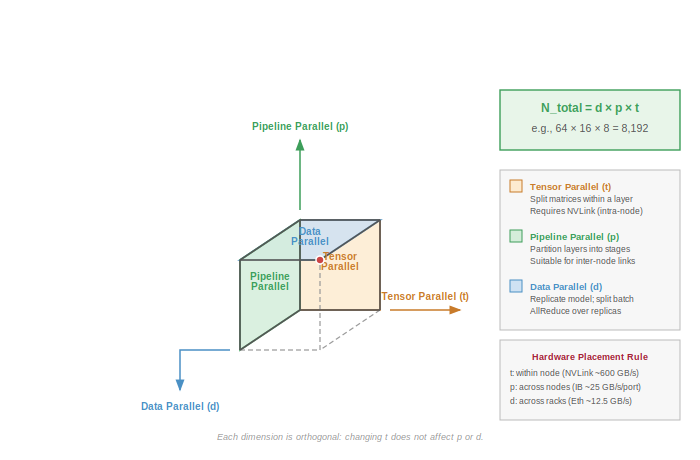
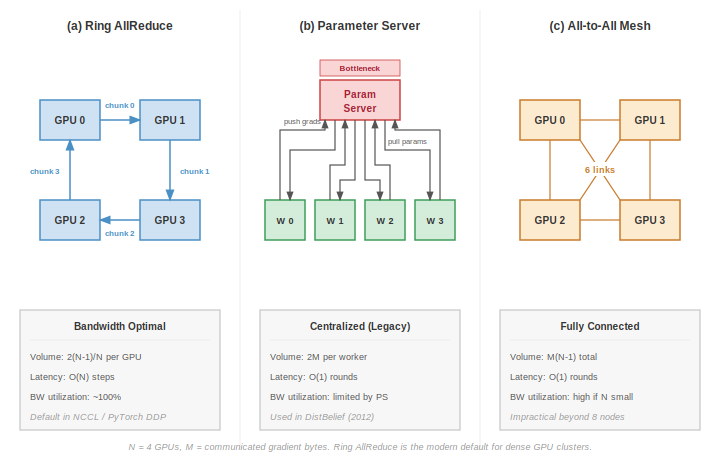
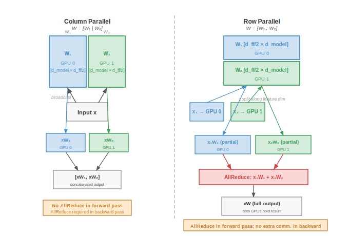
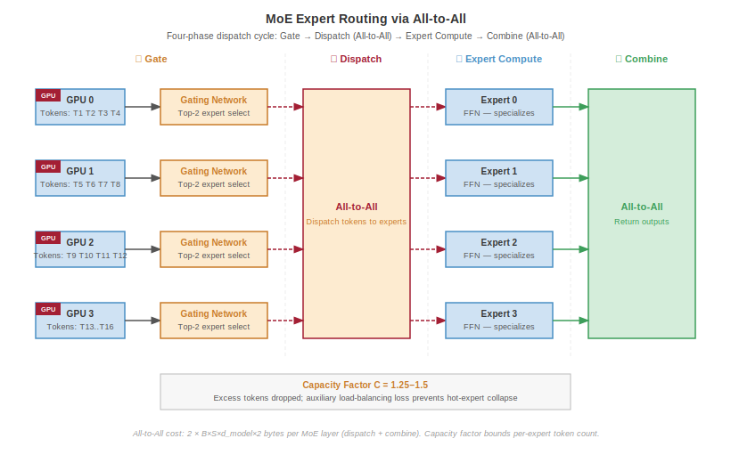
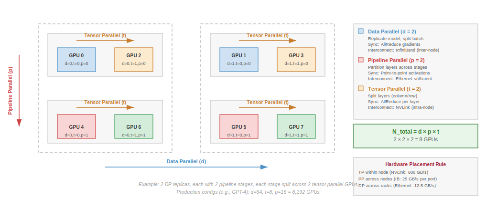

# Distributed Training Systems {#sec-distributed-training-systems}

::: {layout-narrow}
::: {.column-margin}

\chapterminitoc

:::

\noindent
{fig-alt="Distributed training across multiple nodes and accelerators."}

:::

## Purpose {.unnumbered}

\begin{marginfigure}
\mlfleetstack{30}{100}{25}{10}
\end{marginfigure}

_Why does the linear logic of "more hardware = faster training" collapse at the bisection bandwidth wall?_

Distributed training appears simple: split the work across machines and combine the results. As the Machine Learning Fleet grows, however, a new physics emerges [@hazelwood2018]. Communication costs scale with the number of machines while computation per machine shrinks, until synchronization overhead dominates and adding hardware actively degrades performance. *When* a job trains on a single GPU, the design optimizes for arithmetic intensity; *when* it trains on 10,000 GPUs, the design optimizes for communication intensity. The scaling ceiling is not a bug to be fixed but a fundamental property of the reliability gap and communication-computation ratio\index{Communication-Computation Ratio}: coordinating independent machines requires moving terabytes of state across networks that are orders of magnitude slower than on-chip memory. The art of distributed training is managing this tension—partitioning work to minimize the **coordination tax**\index{Coordination Tax}, overlapping communication with computation to hide latency, and choosing synchronization strategies that balance consistency against throughput. Without this understanding, organizations waste millions on hardware that sits idle waiting for gradients to arrive, or produce models that never converge because stale updates corrupted the optimization.

::: {.content-visible when-format="pdf"}

\newpage

:::

::: {.callout-learning-objectives}

- Apply the law of distributed efficiency to diagnose when a workload is compute-bound, memory-bound, or communication-bound
- Implement data parallelism using gradient synchronization and AllReduce to achieve 85--95 percent efficiency in the linear scaling regime
- Apply memory-efficient data parallelism (ZeRO, FSDP) to shard optimizer states and parameters, quantifying the communication trade-off
- Design tensor parallelism strategies for transformer layers by partitioning matrix operations to exploit high-bandwidth intra-node interconnects
- Construct pipeline parallelism schedules with microbatching to minimize bubble overhead and maximize fleet utilization
- Select synchronization models (BSP, SSP, asynchronous) based on staleness, straggler tolerance, throughput, and convergence trade-offs for cluster heterogeneity
- Architect hybrid 3D parallelism configurations that combine data, tensor, and pipeline strategies to train Archetype A (GPT-4/Llama-3) models

:::

```{python}
#| echo: false
from mlsysim import *
from mlsysim.core.constants import *
from mlsysim.core.solver import DistributedModel
#| label: chapter-start
# ┌─────────────────────────────────────────────────────────────────────────────
# │ CHAPTER START
# ├─────────────────────────────────────────────────────────────────────────────
# │ Context: Chapter initialization and global imports
# │
# │ Why: Registers this chapter with the mlsys registry and provides shared
# │      imports for all subsequent calculation cells.
# │
# │ Imports: mlsysim.registry, mlsysim.constants, mlsysim.book
# │ Exports: (none)
# └─────────────────────────────────────────────────────────────────────────────
from mlsysim.fmt import fmt_int, fmt_percent, fmt, check
```

```{python}
#| echo: false
from mlsysim.core.solver import DistributedModel
#| label: dist-train-setup
# ┌─────────────────────────────────────────────────────────────────────────────
# │ DISTRIBUTED TRAINING SYSTEM CONSTANTS
# ├─────────────────────────────────────────────────────────────────────────────
# │ Context: @sec-distributed-training-systems-systems-multimachine-scaling-fundamentals-ff96
# │          and ZeRO/FSDP analysis paragraphs throughout the chapter.
# │
# │ Goal:    Format GPU memory limits and NVLink bandwidths used throughout.
# │ Show:    "80" GB A100 memory and "900" GB/s NVLink H100 bandwidth.
# │ How:     Unit conversion via pint .m_as().
# │
# │ Imports: mlsysim.core.constants (Hardware.Cloud.A100.memory.capacity, Hardware.Cloud.H100.memory.capacity,
# │           Hardware.Cloud.A100.nvlink.bandwidth, Hardware.Cloud.H100.nvlink.bandwidth, Systems.Fabrics.InfiniBand_HDR.bandwidth,
# │           Systems.Fabrics.InfiniBand_NDR.bandwidth, GB, second)
# │ Exports: DistTrainReliabilityFacts.reliability_node_count_str,
# │          DistTrainReliabilityFacts.node_hourly_survival_pct_str,
# │          DistTrainReliabilityFacts.cluster_failure_prob_pct_str,
# │          DistTrainReliabilityFacts.cluster_mtbf_hours_str
# └─────────────────────────────────────────────────────────────────────────────
from mlsysim.fmt import fmt_int,  fmt_percent, fmt, check, MarkdownStr
import math

class DistTrainReliabilityFacts:
    # ┌── 1. LOAD (Constants) ──────────────────────────────
    a100_mem_gb = Hardware.Cloud.A100.memory.capacity.m_as(GiB)
    h100_mem_gb = Hardware.Cloud.H100.memory.capacity.m_as(GiB)
    nvlink_a100_gbs = Hardware.Cloud.A100.nvlink.bandwidth.m_as(GB/second)
    nvlink_h100_gbs = Hardware.Cloud.H100.nvlink.bandwidth.m_as(GB/second)
    ib_hdr_gbs = Systems.Fabrics.InfiniBand_HDR.bandwidth.m_as(GB/second)  # 200 Gbps -> 25 GB/s per port
    ib_ndr_gbs = Systems.Fabrics.InfiniBand_NDR.bandwidth.m_as(GB/second)  # 400 Gbps -> 50 GB/s per port
    reliability_node_count = 100
    node_hourly_survival = 0.999

    # ┌── 2. EXECUTE (The Compute) ─────────────────────────
    nvlink_hdr_ratio_low = nvlink_a100_gbs / ib_hdr_gbs
    nvlink_hdr_ratio_high = nvlink_h100_gbs / ib_hdr_gbs
    cluster_hourly_survival = node_hourly_survival ** reliability_node_count
    cluster_hourly_failure_prob = 1 - cluster_hourly_survival
    cluster_mtbf_hours = 1 / (reliability_node_count * -math.log(node_hourly_survival))

    # ┌── 3. GUARD (Invariants) ────────────────────────────
    check(a100_mem_gb > 0, "A100 memory must be positive")
    check(nvlink_h100_gbs > nvlink_a100_gbs, "H100 NVLink faster than A100")
    check(ib_hdr_gbs < ib_ndr_gbs, "InfiniBand HDR slower than NDR")
    check(ib_ndr_gbs < nvlink_h100_gbs, "InfiniBand NDR slower than H100 NVLink")
    check(20 < nvlink_hdr_ratio_low < 30, "A100 NVLink/HDR ratio should be about 24x")
    check(30 < nvlink_hdr_ratio_high < 40, "H100 NVLink/HDR ratio should be about 36x")
    check(9 < cluster_mtbf_hours < 11, "100 nodes at 99.9% hourly survival should fail about every 10 hours")

    # ┌── 4. OUTPUT (Formatting) ───────────────────────────
    reliability_node_count_str = fmt(reliability_node_count, precision=0, commas=False)
    node_hourly_survival_pct_str = fmt(node_hourly_survival * 100, precision=1, commas=False, suffix=" percent")
    cluster_failure_prob_pct_str = fmt(cluster_hourly_failure_prob * 100, precision=1, commas=False, suffix=" percent")
    cluster_mtbf_hours_str = fmt_int(round(cluster_mtbf_hours), commas=False, suffix=" hours")
    gpt4_mem_tb_str = fmt((Models.Language.GPT4.parameters.m_as('param') * 2 / TRILLION), precision=1, commas=False, suffix=" TB")
    # Plain-string literal → MarkdownStr per recipe Rule 1
    dlrm_mem_tb_str = MarkdownStr("10 TB")
```

## Why Distribution Is Necessary {#sec-distributed-training-systems-systems-multimachine-scaling-fundamentals-ff96}

Part I built the physical fleet: @Sec-compute-infrastructure established the accelerator hierarchy, @sec-network-fabrics wired nodes into a high-bandwidth fabric, and @sec-data-storage completed the infrastructure with storage pipelines that keep the fleet fed. With the physical foundation in place, the algorithmic challenge that defines Part II is splitting a single training job across this hardware.

A single GPU with 100 terabytes of memory and an exaflop of compute would make distributed training unnecessary. Because the laws of physics prevent this, training must be shattered across thousands of independent chips. In the Fleet Stack framework shown in @fig-fleet-stack, distributed training represents the distribution layer\index{Distribution Layer}—the logic that partitions the *mathematical* workload across the *physical* fleet. The algorithms defined here (Ring AllReduce, Tensor Parallelism) dictate the bandwidth requirements for the physical interconnects (NVLink, InfiniBand) discussed in @sec-network-fabrics.

### The physics of the cluster {#sec-distributed-training-systems-physics-cluster-a42d}

Before optimizing algorithms, we must understand the physical constraints of the Machine Learning Fleet. The performance of any distributed training job is governed by the distributed step-time law (Principle \ref{pri-distributed-step-time}), introduced alongside the fleet law in @sec-vol2-introduction-fleet-law:

$$ T_{\text{step}}(N) = \frac{T_{\text{compute}}}{N} + T_{\text{comm}}(N) + T_{\text{sync}}(N) - T_{\text{overlap}} $$

The critical term is the communication-computation ratio $\rho = T_{\text{comm}}(N)/(T_{\text{compute}}/N)$. This ratio determines whether a cluster behaves as a supercomputer or a collection of idling heaters.

*   **Compute-bound (low ratio)**: $T_{\text{compute}}/N \gg T_{\text{comm}}(N)$. The GPUs spend most of their time multiplying matrices. This is the ideal state, typical for large batch sizes on dense models (like ResNet).
*   **Communication-bound (high ratio)**: $T_{\text{comm}}(N) \approx T_{\text{compute}}/N$. The GPUs spend significant time waiting for gradients or activations to arrive. This is the common state for large language models (LLMs) and deep learning recommendation models (DLRMs), where parameter synchronization saturates the network.

### Multi-machine training requirements {#sec-distributed-training-systems-systems-multimachine-training-requirements-0277}

Three concrete signals indicate when distributed training becomes necessary rather than merely beneficial. First, **memory exhaustion** occurs when model parameters, optimizer states, and activation storage exceed single-device capacity. For full mixed-precision training with Adam, the parameter, gradient, and optimizer-state budget alone can exceed an 80 GB accelerator at roughly 5 billion parameters before activations; larger 10--20B models require sharding, offload, or other memory-saving techniques [@rajbhandari2020].

Second, **unacceptable training duration** emerges when single-device training would require weeks or months to converge. GPT-3's 175B-parameter training run used a cluster of V100 GPUs [@brown2020language], illustrating why wall-clock training time becomes a distributed-systems constraint at this scale.

Third, **dataset scale** exceeds single-machine storage when training data reaches multiple terabytes, as occurs in large-scale vision or language modeling tasks.

### Distributed training complexity trade-offs {#sec-distributed-training-systems-systems-distributed-training-complexity-tradeoffs-0138}

Distributed training introduces three primary complexity dimensions not present in single-machine scenarios:

1.  **Communication Overhead**\index{Communication Overhead}: The cost of synchronizing gradients. For a model with $P$ parameters distributed across $N$ devices, all-reduce operations must transfer approximately $2P(N-1)/N$ gradient values per step, multiplied by the bytes per gradient element. On commodity networks, this can dominate computation time.
2.  **Fault Tolerance**\index{Fault Tolerance}: The expected number of failures per unit time grows linearly with cluster size, while the probability that the entire cluster survives an interval without any failure decays exponentially. If a `{python} DistTrainReliabilityFacts.reliability_node_count_str`-node cluster has `{python} DistTrainReliabilityFacts.node_hourly_survival_pct_str` per-node hourly survival, the cluster-level failure probability is `{python} DistTrainReliabilityFacts.cluster_failure_prob_pct_str` per hour, corresponding to an MTBF of about `{python} DistTrainReliabilityFacts.cluster_mtbf_hours_str`.
3.  **Algorithmic Stability**\index{Algorithmic Stability}: Large batch sizes from data parallelism affect convergence behavior, requiring learning rate scaling and warmup strategies that single-machine training does not require [@goyal2017accurate].

### Single-machine to distributed transition {#sec-distributed-training-systems-systems-singlemachine-distributed-transition-1ee4}

The systematic optimization methodology established for single-machine training extends to distributed environments with important adaptations. Profiling must now capture inter-device communication patterns and synchronization overhead in addition to computation and memory metrics. The solution space expands to include data parallelism, model parallelism, pipeline parallelism, and hybrid approaches. @Fig-3d-parallelism-cube visualizes this three-dimensional configuration space.

::: {#fig-3d-parallelism-cube fig-env="figure" fig-pos="htb" fig-cap="**The 3D Parallelism Cube**: A conceptual visualization of the three orthogonal scaling axes: Data Parallelism (replicating the model), Pipeline Parallelism (splitting depth), and Tensor Parallelism (splitting layers). Production training for models like GPT-4 occupies a specific point $(d, p, t)$ within this cube to balance memory usage, compute efficiency, and communication overhead." fig-alt="3D coordinate system with three axes: Data Parallelism (replica count d), Pipeline Parallelism (depth p), and Tensor Parallelism (width t). Dashed cube marks a configuration point with Total Accelerators equals d times p times t."}



:::

The key insight from @fig-3d-parallelism-cube is that the total accelerator count is $N_{\text{total}} = d \times p \times t$: each axis is independent, and production systems select a specific coordinate in this cube based on the memory, compute, and bandwidth constraints of the target model and cluster.

### Engineering trade-offs: Selecting a parallelism strategy {#sec-distributed-training-systems-systems-engineering-tradeoffs-selecting-parallelism-strategy-b344}

Choosing the right parallelism strategy is not a matter of preference; it is a constraint satisfaction problem governed by parameter count $(P)$, batch size $(B)$, and interconnect bandwidth. @Tbl-parallelism-tradeoffs quantifies the communication costs for each strategy, revealing which approaches are physically feasible for a given hardware topology.

| **Strategy**               | **Communication Pattern** | **Comm. Volume**                                           | **Hardware Constraint**         |
|:---------------------------|:--------------------------|:-----------------------------------------------------------|:--------------------------------|
| **Data Parallel (DP)**     | AllReduce Gradients       | $\propto M_{\text{grad}}$ (gradient bytes)                 | Requires high bisection BW      |
| **Tensor Parallel (TP)**   | AllReduce Activations     | $\propto B \times N_L$ (Layers)                            | Critical: Needs NVLink          |
| **Pipeline Parallel (PP)** | Point-to-Point (P2P)      | $\propto B \times S \times d_{\text{model}}$ (Activations) | Low BW (Ethernet is sufficient) |

: **Parallelism Communication Costs**\index{Parallelism!communication costs}: Tensor Parallelism has the highest communication frequency (per layer), confining it to intra-node (NVLink) usage. Pipeline Parallelism has the lowest communication volume (boundary activations only), making it suitable for inter-node (Ethernet/InfiniBand) scaling. Data Parallelism sits in the middle but scales poorly as communicated gradient bytes $M_{\text{grad}}$ grow, necessitating ZeRO optimizations. {#tbl-parallelism-tradeoffs}

The bandwidth requirements impose a hard constraint on hardware placement: each parallelism strategy must be matched to the interconnect available between the GPUs that need to communicate, or the design fails before it leaves the whiteboard.

::: {#psp-distributed-training-jeff-dean-test .callout-perspective title="The Jeff Dean test"}

```{python}
#| echo: false
class DistTrainNvlinkIntro:
    from mlsysim.core.constants import GB, second
    from mlsysim.fmt import fmt, check
    nvlink_a100_gbs = Hardware.Cloud.A100.nvlink.bandwidth.m_as(GB/second)
    nvlink_h100_gbs = Hardware.Cloud.H100.nvlink.bandwidth.m_as(GB/second)
    ib_hdr_gbs = Systems.Fabrics.InfiniBand_HDR.bandwidth.m_as(GB/second)
    nvlink_hdr_ratio_low = nvlink_a100_gbs / ib_hdr_gbs
    nvlink_hdr_ratio_high = nvlink_h100_gbs / ib_hdr_gbs
    check(20 < nvlink_hdr_ratio_low < 30, "A100 NVLink/HDR ratio should be about 24x")
    nvlink_a100_str = fmt(nvlink_a100_gbs, precision=0, commas=False, suffix=" GB/s")
    nvlink_h100_str = fmt(nvlink_h100_gbs, precision=0, commas=False, suffix=" GB/s")
    nvlink_hdr_ratio_low_str = fmt(nvlink_hdr_ratio_low, precision=0, commas=False, suffix="x")
    nvlink_hdr_ratio_high_str = fmt(nvlink_hdr_ratio_high, precision=0, commas=False, suffix="x")
```

Tensor parallelism across server racks connected by standard Ethernet will stall. The communication volume scales with batch size $B$ and layer count $N_L$. It requires the `{python} DistTrainNvlinkIntro.nvlink_a100_str`--`{python} DistTrainNvlinkIntro.nvlink_h100_str` throughput of NVLink. For cross-rack scaling, the design must switch to pipeline or data parallelism to respect the physics of the network.

:::

@Fig-parallelism-decision-tree formalizes this constraint satisfaction process as a decision tree, showing how model size and hardware topology determine the viable parallelism strategies.

::: {#fig-parallelism-decision-tree fig-env="figure" fig-pos="htb" fig-cap="**Parallelism Strategy Decision Tree**: Starting from the model's memory requirements, the tree guides practitioners through the constraint satisfaction process that determines which parallelism strategies are physically feasible. The critical branching points are model memory vs. single-GPU capacity and communication bandwidth vs. parallelism demands. Leaf nodes are annotated with the dominant hardware constraint." fig-alt="Decision tree flowchart. Root asks if model fits in one GPU. Yes branch leads to data parallelism. No branch asks if model fits in one node, leading to tensor or pipeline parallelism with hardware annotations."}


:::

The decision tree reveals that parallelism strategy selection is not a preference but a consequence of physical constraints. The next question is *how* these constraints shape the mechanics of a distributed training step on a real cluster.

## The Distributed Training Step {#sec-distributed-training-systems-systems-distributed-training-fundamentals-97da}

The central challenge of distributed training is ensuring that 1,024 GPUs, operating completely independently, agree on a single, mathematically rigorous set of updated weights at the end of each training iteration. The single-machine optimization techniques discussed in the previous section only delay the inevitable; eventually, the computation must span multiple devices.

::: {#dfn-distributed-training-distributed-training .callout-definition title="Distributed training"}

***Distributed Training***\index{Distributed Training!definition} is a training methodology that partitions the optimization loop across multiple compute nodes (distributing either data, model layers, or individual tensor operations) and coordinates their outputs through synchronized communication primitives to produce a single coherent model.

1.  **Significance (quantitative)**: Distributed training becomes necessary when a model's memory requirement exceeds a single accelerator's capacity. GPT-3 (175B parameters) requires approximately 350 GB in BF16—more than 4$\times$ the 80 GB capacity of a single H100. Training it requires at least 5 H100s for model sharding alone, with production runs using thousands to achieve tractable wall-clock time.
2.  **Distinction (durable)**: Unlike distributed systems for independent requests (web serving, database reads) where nodes share no mutable state, distributed training requires every node to maintain a consistent view of model parameters—making gradient synchronization a mandatory coordination step, not an optional optimization.
3.  **Common pitfall**: A frequent misconception is that distributed training scales linearly with node count. In practice, communication overhead grows with cluster size and the serial fraction of each step (Amdahl's Law): with 30 percent of a step's time spent on synchronization, the theoretical scaling ceiling is $1/0.30 \approx 3\times$ regardless of how many accelerators are added.

:::

A useful mental model frames these distributed strategies as loop transformations, the same conceptual toolkit that compilers use to optimize sequential code. If we view the training process as a massive loop over data and layers, distributed strategies are simply *loop transformations* applied by the cluster-level compiler. The logical training loop nests three iterators (epochs, batches, layers), and each parallelism strategy unrolls one of them across devices:

*   **Data Parallelism = Parallel For Loop.** We unroll the outer loop (batch dimension) across devices. Each device runs the same code body on different data indices.
*   **Tensor Parallelism = Vectorization (single instruction, multiple data (SIMD)).** We split the inner loops (matrix multiplication) across devices. This is "Cluster-Scale SIMD," where NVLink acts as the vector register file.
*   **Pipeline Parallelism = Instruction Pipelining.** We split the sequential operations (layers) across devices. Just as a CPU pipeline stages fetch/decode/execute, the cluster stages Layer 1/Layer 2/Layer 3 to keep all ALUs busy.

Optimizing locally before scaling horizontally ensures that distributed systems operate efficiently at each node while adding the coordination mechanisms necessary for multi-machine training. When model complexity and dataset sizes exceed the capacity of individual devices, distributed training[^fn-distbelief-distributed] spreads the workload across multiple machines that coordinate to train a single model.

[^fn-distbelief-distributed]: **Distributed Training**: Google's DistBelief (2012) was the first framework to train neural networks across thousands of machines, but its parameter server architecture created bandwidth bottlenecks at central nodes. This limitation drove the shift to decentralized AllReduce patterns in successors like Horovod and PyTorch DDP, where communication cost scales as $2(N-1)/N$ per worker rather than concentrating at a single server. \index{DistBelief!distributed training}

Coordination relies on consensus protocols and synchronization primitives that keep parameter updates consistent across nodes. Basic barrier synchronization suffices for research, but production deployments require fault tolerance, checkpointing, and recovery mechanisms. @Sec-fault-tolerance-reliability examines these reliability engineering challenges, including how to handle node failures without losing days of training progress.

The progression from single-device to distributed training follows a systematic scaling path where each stage builds on the previous level's challenges. Single-GPU training requires only local memory management and straightforward forward/backward passes, establishing the baseline computational patterns. Scaling to multiple GPUs within a single node introduces high-bandwidth communication requirements, typically handled through NVLink[^fn-nvlink-intranode] or PCIe connections with NCCL[^fn-nccl-topology] optimization while preserving the single-machine simplicity of fault tolerance and scheduling.

[^fn-nvlink-intranode]: **NVLink**: NVIDIA's point-to-point GPU interconnect delivers `{python} DistTrainNvlinkIntro.nvlink_a100_str`--`{python} DistTrainNvlinkIntro.nvlink_h100_str` bidirectional bandwidth, roughly `{python} DistTrainNvlinkIntro.nvlink_hdr_ratio_low_str`--`{python} DistTrainNvlinkIntro.nvlink_hdr_ratio_high_str` InfiniBand HDR per port. This bandwidth gap is why tensor parallelism, which requires AllReduce on every layer, is confined to intra-node communication, while pipeline and data parallelism tolerate the slower inter-node fabric. \index{NVLink!distributed training}

[^fn-nccl-topology]: **NCCL (NVIDIA Collective Communications Library)**: Released in 2015, NCCL automatically selects ring, tree, or hierarchical AllReduce algorithms based on detected hardware topology: NVLink within nodes, InfiniBand across nodes. This topology-aware routing is critical because a naive single-ring AllReduce across 128 nodes would force all traffic through the slowest inter-node link, collapsing bandwidth utilization to under 30 percent. \index{NCCL!topology}

The leap to multi-node distributed training introduces new complexity dimensions: network communication overhead, fault tolerance requirements, and cluster orchestration challenges. Each scaling stage compounds the previous challenges as communication bottlenecks intensify, synchronization overhead grows, and failure probability increases. Practitioners should therefore optimize single-GPU performance before scaling to ensure efficient resource utilization at each level.

::: {#psp-distributed-training-distributed-training-complexity .callout-perspective title="Distributed training complexity"}

Although modern frameworks abstract away much of the complexity through sharded data parallelism and communication libraries, implementing distributed training efficiently remains a significant engineering challenge. Production deployments require careful network configuration (InfiniBand tuning, topology-aware routing), infrastructure management through cluster schedulers, and debugging of nonlocal issues such as synchronization hangs and communication bottlenecks.

:::

Despite this complexity, the core workflow is mechanically straightforward; the engineering challenge is making it fast and reliable at scale. The most common pattern, data parallelism, involves splitting the dataset into nonoverlapping subsets, assigning each subset to a different GPU, and performing forward and backward passes independently on each device. Once gradients are computed on each GPU, they are synchronized and aggregated before updating the model parameters, ensuring that all devices learn in a consistent manner. The coordinated flow of data splitting, computation, and gradient synchronization (@fig-dist-train-data-parallelism) forms the foundation of distributed training, with each GPU processing its batch independently before synchronization brings all gradients together.

Distributed training systems must orchestrate multi-machine computation by splitting the work, managing communication between machines, and maintaining synchronization throughout training. The AllReduce operations that aggregate gradients across devices consume 10--40 percent of total training time even with optimal implementation, and this overhead compounds as systems scale.

Four approaches address different constraint regimes. Data parallelism divides the training data across machines while each maintains a full model copy, making it the simplest approach for models that fit in single-device memory. Model parallelism splits the model itself across devices when parameters exceed single-device memory. Pipeline parallelism partitions models into sequential stages that process microbatches concurrently, improving utilization over naive model parallelism. Hybrid approaches integrate multiple strategies, enabling training at scales where any single approach would fail. Each strategy becomes necessary only after its predecessor reaches a physical ceiling.

## Data Parallelism {#sec-distributed-training-systems-systems-data-parallelism-6132}

The simplest approach gives each GPU a complete, identical copy of the model and assigns it a distinct slice of the data. Data parallelism is the natural starting point for distributed training because it requires minimal changes to the single-device training loop.

::: {#dfn-distributed-training-data-parallelism .callout-definition title="Data parallelism"}

***Data Parallelism***\index{Data Parallelism!definition} is a distributed training strategy in which each worker holds a complete replica of the model and processes an independent shard of the minibatch, then synchronizes gradient updates via AllReduce so all replicas apply identical parameter changes each step.

1.  **Significance (quantitative)**: With $N$ workers each processing batch size $B$, the effective global batch size is $N \times B$, scaling throughput linearly while keeping per-worker memory constant. For a 1B-parameter model at 2 GB in BF16, 1,024 workers achieve 1,024$\times$ the single-GPU throughput—until the gradient AllReduce (2 GB per step at ring-optimal $2(N-1)/N$ per worker) exceeds backward compute time and creates the communication bottleneck.
2.  **Distinction (durable)**: Unlike model parallelism, where parameters are partitioned so no single worker holds the full model, data parallelism requires every worker to have sufficient memory capacity to store the complete model state—making it inapplicable for models larger than a single accelerator's memory without combining it with model sharding (ZeRO, FSDP).
3.  **Common pitfall**: A frequent misconception is that data parallelism scales indefinitely with worker count. Scaling the effective batch size $B$ beyond the workload-dependent critical batch size degrades statistical efficiency, requiring more training steps to reach target loss and eroding the throughput gains from adding more workers [@Shallue2019measuring].

:::

Each device trains a complete copy of the model using its assigned subset of the data. When training an image classification model on 1 million images using 4 GPUs, each GPU processes 250,000 images while maintaining an identical copy of the model architecture.

Data parallelism is most effective when the dataset size is large but the model size remains manageable, since each device must store a full copy of the model in memory. This method is widely used in image classification and natural language processing, where the dataset can be processed in parallel without dependencies between data samples. When training a ResNet model [@he2016] on ImageNet, each GPU can independently process its portion of images because the classification of one image does not depend on the results of another.

The effectiveness of data parallelism stems from a property of stochastic gradient descent. Gradients computed on different minibatches can be averaged while preserving mathematical equivalence to single-device training. This property enables parallel computation across devices, with the mathematical foundation following directly from the linearity of expectation.

Consider a model with parameters $\theta$ training on a dataset $D$. The loss function for a single data point $x_i$ is $\mathcal{L}(\theta, x_i)$. In standard SGD with batch size $B$, the gradient update for a minibatch is:
$$
g = \frac{1}{B} \sum_{i=1}^B \nabla_{\theta} \mathcal{L}(\theta, x_i)
$$

In data parallelism with $N$ devices, each device $k$ computes gradients on its own minibatch $B_k$:
$$
g_k = \frac{1}{|B_k|} \sum_{x_i \in B_k} \nabla_{\theta} \mathcal{L}(\theta, x_i)
$$

When all workers use the same local batch size, the global update averages these local gradients:
$$
g_{\text{global}} = \frac{1}{N} \sum_{k=1}^N g_k
$$

Under that equal-batch assumption, the averaging is mathematically equivalent to computing the gradient on the combined batch $B_{\text{total}} = \bigcup_{k=1}^N B_k$:
$$
g_{\text{global}} = \frac{1}{|B_{\text{total}}|} \sum_{x_i \in B_{\text{total}}} \nabla_{\theta} \mathcal{L}(\theta, x_i)
$$

For unequal local batch sizes, the combined-batch gradient is the weighted average $g_{\text{global}} = (1/|B_{\text{total}}|)\sum_k |B_k|g_k$. The equivalence shows *why* data parallelism maintains the statistical properties of SGD training: distributing distinct data subsets across devices, computing local gradients independently, and averaging them approximates the full-batch gradient.

::: {#chk-distributed-training-data-parallelism-mechanics .callout-checkpoint title="Data parallelism mechanics"}

Verify your understanding of how data parallelism distributes work:

- [ ] In data parallelism, is the **model state** (weights) sharded or replicated across GPUs?
- [ ] If you have 8 GPUs and a per-GPU batch size of 32, what is the **effective global batch size**?
- [ ] Why is data parallelism mathematically equivalent to single-device training with a larger batch size?
- [ ] What is the primary hardware resource that constrains data parallelism as you add more nodes: GPU TFLOP/s or network bandwidth?

:::

The method parallels gradient accumulation, where a single device accumulates gradients over multiple forward passes before updating parameters. Both techniques use the additive properties of gradients to process large batches efficiently. However, moving the same idea into a production cluster introduces operational challenges beyond this theoretical equivalence. Communication overhead, node failures, and cost constraints each impose second-order effects that the single-machine derivation does not capture.

### Data parallelism implementation {#sec-distributed-training-systems-systems-data-parallelism-implementation-fa03}

The mathematical foundation above (gradient averaging preserves the statistical properties of SGD) translates into concrete implementation steps. Each step corresponds to a phase in the gradient averaging process, from distributing data subsets to synchronizing the computed gradients.

The process of data parallelism can be broken into a series of distinct steps, each with its role in ensuring the system operates efficiently. Consider @fig-dist-train-data-parallelism: it traces the complete workflow from dataset splitting through gradient aggregation, showing how each GPU processes its assigned batch before synchronization brings all gradients together for parameter updates.

::: {#fig-dist-train-data-parallelism fig-env="figure" fig-pos="htb" fig-cap="**Data Parallelism Implementation Pipeline**: The five-stage workflow for data parallel training: (1) split input data into nonoverlapping subsets, (2) assign batches to GPUs, (3) compute forward and backward passes independently, (4) synchronize gradients via AllReduce, and (5) update parameters uniformly across all devices. This approach contrasts with model parallelism, where the model itself is partitioned rather than replicated." fig-alt="Flowchart showing 5-stage data parallelism: Input Data splits into 4 batches assigned to GPUs 1-4, each performs forward and backward pass, gradients synchronize and aggregate, then model updates."}


:::

As @fig-dist-train-data-parallelism shows, the critical synchronization point is stage 4: AllReduce must complete before any GPU can update parameters, making gradient communication the dominant bottleneck as the device count grows.

#### Dataset splitting {#sec-distributed-training-systems-systems-dataset-splitting-1edf}

The first step in data parallelism involves dividing the dataset into smaller, nonoverlapping subsets. This ensures that each device processes a unique portion of the data, avoiding redundancy and enabling efficient utilization of available hardware. With a dataset of 100,000 training examples and 4 GPUs, each GPU receives 25,000 examples per epoch. The DistributedSampler must ensure no overlap between subsets to maintain gradient estimation validity: if two GPUs process the same example, the resulting gradient average would overweight that example, violating the unbiased gradient assumption that makes data parallelism mathematically equivalent to single-device training.

Modern distributed training frameworks handle this distribution automatically through a distributed sampler that implements prefetching and caching mechanisms to ensure data is readily available for processing. The sampler coordinates across workers using the process rank to deterministically partition indices, ensuring reproducibility when the same random seed is used. For a 1.2 million example dataset distributed across 32 GPUs, each GPU processes approximately 37,500 examples per epoch, with the sampler padding the final batch to maintain consistent batch sizes across all workers.

```{python}
#| echo: false
from mlsysim.core.solver import DistributedModel
#| label: gpt3-training-context
# ┌─────────────────────────────────────────────────────────────────────────────
# │ GPT-3 TRAINING CONTEXT (LEGO)
# ├─────────────────────────────────────────────────────────────────────────────
# │ Context: @sec-distributed-training-systems-systems-compute-phase-forward-backward
# │
# │ Goal: Provide GPT-3 scale statistics for distributed training discussion.
# │ Show: ~175B parameters.
# │ How: pulling Models.Language.GPT3.parameters from mlsysim.core.constants.
# │
# │ Imports: mlsysim.core.constants (Models.Language.GPT3.parameters, param, BILLION)
# │ Exports: FrontierTrainingContext.frontier_params_b_str,
# │          FrontierTrainingContext.frontier_name
# └─────────────────────────────────────────────────────────────────────────────
from mlsysim import Models, Applications
from mlsysim.fmt import fmt_percent, fmt

class FrontierTrainingContext:
    """GPT-3 scale reference for distributed training."""

    # ┌── 1. LOAD (Constants) ──────────────────────────────────────────────
    model = Models.Language.GPT3

    # ┌── 2. EXECUTE (The Compute) ────────────────────────────────────────
    params_b = model.parameters.m_as(param) / BILLION

    # ┌── 3. GUARD (Invariants) ──────────────────────────────────────────
    from mlsysim.fmt import check
    check(170 <= params_b <= 180, f"GPT-3 reference should be ~175B params, got {params_b:.1f}B")

    # ┌── 4. OUTPUT (Formatting) ──────────────────────────────────────────────
    frontier_params_b_str = fmt(params_b, precision=0)
    frontier_name = model.name
```

#### Compute phase: Forward and backward passes {#sec-distributed-training-systems-systems-compute-phase-forward-backward}

The defining feature of data parallelism is that the computation phase, both forward and backward, is *embarrassingly parallel*. Each GPU operates as an isolated island, executing an identical copy of the model on a unique micro-batch of data. For our `{python} FrontierTrainingContext.frontier_params_b_str`B parameter reference model, this isolation is critical: during the forward pass, each GPU independently computes activations for its local batch (micro-batch size 4, sequence length 2048). Without optimization, storing these activations for backpropagation would consume over 200 GB of HBM, exceeding the capacity of even an H100 GPU. Activation checkpointing\index{Activation Checkpointing!memory reduction}, which recomputes activations during the backward pass rather than storing them, is mandatory to suppress this footprint to a manageable ~50 GB.

The backward pass mirrors this independence but introduces the system's primary bottleneck. As the GPU traverses the computation graph in reverse, it computes gradients for every parameter in the model. For a `{python} FrontierTrainingContext.frontier_params_b_str`B model in FP16, this generates a 350 GB gradient payload per GPU. The computation itself requires zero communication, yet the resulting gradients represent a fractured view of the true loss surface, valid only for the local micro-batch. Before the optimizer step can occur, these local gradients must be aggregated across all $N$ GPUs to form a valid global gradient. The transition from isolated, high-throughput compute to a massive, global synchronization event defines the rhythm of data parallel training: long periods of silent, intense arithmetic punctuated by bursts of heavy network traffic.

#### Gradient synchronization {#sec-distributed-training-systems-systems-gradient-synchronization-614b}

To maintain consistency across the distributed system, the gradients computed by each device must be synchronized. This coordination represents a distributed systems challenge in achieving global consensus while minimizing communication complexity, one significant enough to warrant its own chapter. @Sec-collective-communication derives the bandwidth and latency bounds $(2(N-1)M/N)$ for Ring AllReduce\index{Ring AllReduce!bandwidth utilization}, Tree AllReduce\index{Tree AllReduce!latency reduction}, and Hierarchical AllReduce, explains how topology-aware algorithms exploit NVLink vs. InfiniBand, and details the gradient compression techniques used to reduce this overhead.

When synchronization performance deviates from theoretical expectations, the Fleet Stack framework provides a structured approach to isolating the bottleneck.

```{python}
#| echo: false
from mlsysim.core.solver import DistributedModel
#| label: hierarchical-allreduce-debug-calc
# ┌─────────────────────────────────────────────────────────────────────────────
# │ HIERARCHICAL ALLREDUCE DEBUG CALCULATION (LEGO)
# ├─────────────────────────────────────────────────────────────────────────────
# │ Context: @psp-distributed-training-debugging-slow-gradient-synchronization.
# │ Goal: Compute the flat-ring baseline and hierarchical ideal for a 3 GB tensor.
# │ How: Ring factor 2(N-1)/N; hierarchy sends 1/8 of the tensor over HDR and
# │      pays two intra-node NVLink phases.
# │ Exports: HierarchicalAllReduceDebug.*_str
# └─────────────────────────────────────────────────────────────────────────────
from mlsysim.fmt import fmt, check

# ┌── LEGO ───────────────────────────────────────────────
class HierarchicalAllReduceDebug:
    """Flat and hierarchical AllReduce timings for the debugging example."""

    # ┌── 1. LOAD ──────────────────────────────────────────────────────────
    from mlsysim.physics import calc_hierarchical_allreduce_time, calc_ring_allreduce_time
    tensor_bytes = 3.0 * ureg.GB
    nodes = 128
    gpus_per_node = 8
    ib_hdr_bw = 25.0 * ureg.GB / ureg.second
    nvlink_bw = Hardware.Cloud.A100.nvlink.bandwidth

    # ┌── 2. EXECUTE ───────────────────────────────────────────────────────
    # Flat Ring Baseline
    t_flat = calc_ring_allreduce_time(tensor_bytes, nodes * gpus_per_node, ib_hdr_bw, 0*ureg.ms)
    flat_ring_ms = t_flat.m_as("ms")

    # Hierarchical Ideal
    t_hier = calc_hierarchical_allreduce_time(
        message_bytes=tensor_bytes,
        n_nodes=nodes,
        gpus_per_node=gpus_per_node,
        intra_node_bw=nvlink_bw,
        inter_node_bw=ib_hdr_bw
    )
    hierarchical_total_ms = t_hier.m_as("ms")

    # Inter-node phase only (for prose)
    reduced_message = tensor_bytes / gpus_per_node
    t_inter = calc_ring_allreduce_time(reduced_message, nodes, ib_hdr_bw, 0*ureg.ms)
    inter_node_ms = t_inter.m_as("ms")

    observed_ms = 100.0
    residual_ms = observed_ms - hierarchical_total_ms
    ib_util_pct = 60

    # ┌── 3. GUARD ─────────────────────────────────────────────────────────
    check(235 < flat_ring_ms < 245, "Flat ring should be about 240 ms")
    check(29 < inter_node_ms < 35, "Inter-node hierarchical phase should be about 30 ms")
    check(30 < hierarchical_total_ms < 60, f"Hierarchical ideal should be about 50 ms, got {hierarchical_total_ms:.1f}")

    # ┌── 4. OUTPUT ────────────────────────────────────────────────────────
    flat_ring_ms_str = fmt(flat_ring_ms, precision=1, commas=False, suffix=" ms")
    inter_node_ms_str = fmt(inter_node_ms, precision=1, commas=False, suffix=" ms")
    hierarchical_total_ms_str = fmt(hierarchical_total_ms, precision=1, commas=False, suffix=" ms")
    observed_ms_str = fmt(observed_ms, precision=0, commas=False, suffix=" ms")
    residual_ms_str = fmt(residual_ms, precision=1, commas=False, suffix=" ms")
    nvlink_a100_str = fmt(nvlink_bw.m_as(GB/second), precision=0, commas=False, suffix=" GB/s")
    tensor_gb_str = fmt(tensor_bytes.m_as(GB), precision=0, commas=False, suffix=" GB")
    nodes_str = fmt(nodes, precision=0, commas=False, suffix=" nodes")
    gpus_per_node_str = fmt(gpus_per_node, precision=0, commas=False, suffix=" GPUs")
    total_gpus_str = fmt(nodes * gpus_per_node, precision=0, commas=True, suffix=" GPUs")
    ib_hdr_bw_str = fmt(ib_hdr_bw.m_as(GB/second), precision=0, commas=False, suffix=" GB/s")
    flat_single_link_ms_str = fmt((tensor_bytes.m_as(GB) / ib_hdr_bw.m_as(GB/second)) * THOUSAND, precision=0, commas=False, suffix=" ms")
    ib_util_pct_str = fmt(ib_util_pct, precision=0, commas=False, suffix=" percent")
```

::: {#psp-distributed-training-debugging-slow-gradient-synchronization .callout-perspective title="Debugging slow gradient synchronization"}

**Problem statement**: An AllReduce of a `{python} HierarchicalAllReduceDebug.tensor_gb_str` gradient tensor across `{python} HierarchicalAllReduceDebug.nodes_str` (`{python} HierarchicalAllReduceDebug.total_gpus_str`) takes `{python} HierarchicalAllReduceDebug.observed_ms_str`, while a hierarchical-AllReduce model that exploits NVLink within nodes and InfiniBand between nodes predicts roughly `{python} HierarchicalAllReduceDebug.hierarchical_total_ms_str` including intra-node phases. The Fleet Stack framework provides a systematic debugging methodology by examining each layer:

**Infrastructure Layer**:

- **Topology**: `{python} HierarchicalAllReduceDebug.nodes_str`, `{python} HierarchicalAllReduceDebug.gpus_per_node_str` per node
- **Intra-node**: NVLink at `{python} HierarchicalAllReduceDebug.nvlink_a100_str` bidirectional between GPUs
- **Inter-node**: InfiniBand HDR at 200 Gb/s (`{python} HierarchicalAllReduceDebug.ib_hdr_bw_str`) per port
- **Naive single-stream baseline**: A flat `{python} HierarchicalAllReduceDebug.tensor_gb_str` transfer over one InfiniBand link takes `{python} HierarchicalAllReduceDebug.tensor_gb_str` / `{python} HierarchicalAllReduceDebug.ib_hdr_bw_str` = `{python} HierarchicalAllReduceDebug.flat_single_link_ms_str`, and a flat ring across all `{python} HierarchicalAllReduceDebug.total_gpus_str` pays $2(N-1)/N \times$ `{python} HierarchicalAllReduceDebug.tensor_gb_str` / `{python} HierarchicalAllReduceDebug.ib_hdr_bw_str`, or approximately `{python} HierarchicalAllReduceDebug.flat_ring_ms_str`. A hierarchical AllReduce (intra-node ring over NVLink + inter-node ring over InfiniBand) brings the inter-node cost down to roughly `{python} HierarchicalAllReduceDebug.inter_node_ms_str` because each node only ships its 1/8 share over the slow link, or roughly `{python} HierarchicalAllReduceDebug.hierarchical_total_ms_str` after adding two intra-node NVLink phases.

**Distribution Layer**:

- **Algorithm choice**: NCCL hierarchical AllReduce (intra-node NVLink ring + inter-node InfiniBand ring)
- **Expected behavior**: Hierarchical decomposition isolates the slow link from the fast link, scaling with the inter-node share rather than the full tensor
- **Diagnosis check**: A flat single ring over all `{python} HierarchicalAllReduceDebug.total_gpus_str` would have measured close to `{python} HierarchicalAllReduceDebug.flat_ring_ms_str`, so the algorithm is already hierarchical

**Serving Layer (Measurement)**:

- **Observed latency**: `{python} HierarchicalAllReduceDebug.observed_ms_str` (well below the `{python} HierarchicalAllReduceDebug.flat_ring_ms_str` flat-ring upper bound, but about `{python} HierarchicalAllReduceDebug.residual_ms_str` above the hierarchical ideal)
- **Bandwidth utilization**: Only `{python} HierarchicalAllReduceDebug.ib_util_pct_str` of theoretical InfiniBand throughput
- **Network counters**: Show congestion on specific switch uplinks

**Root Cause Diagnosis**: NCCL is already using a hierarchical algorithm (`{python} HierarchicalAllReduceDebug.observed_ms_str` vs. the `{python} HierarchicalAllReduceDebug.flat_ring_ms_str` flat-ring prediction confirms this). The remaining gap between observed and modeled latency can come from switch congestion on a handful of inter-node uplinks, effective-bandwidth loss, or implementation overhead, not from a fully flat algorithm.

**Solution**: Monitor InfiniBand switch port utilization to identify hot spots. Consider the rail-optimized topology in @sec-network-fabrics-rail-optimized or further tuning of the hierarchical AllReduce hand-off so it explicitly partitions intra-node (NVLink) from inter-node (InfiniBand) communication. The residual gap likely represents achievable optimization through better network provisioning and bandwidth utilization rather than a wholesale algorithm change.

The analysis demonstrates how the Fleet Stack layers interact: Physical constraints (bandwidth) bound Operational choices (algorithm), which manifest in Service metrics (latency). Debugging requires examining all three layers, not just tuning one in isolation.

:::

@Fig-coll-comm contrasts three high-level synchronization topologies: the centralized Parameter Server, the bandwidth-optimal Ring AllReduce, and the low-latency Tree AllReduce. In dense synchronous data-parallel settings, ring AllReduce can avoid a single reducer bottleneck by distributing traffic evenly across participating links, as Baidu's implementation illustrates [@gibiansky2017baidu].

::: {#fig-coll-comm fig-env="figure" fig-pos="htb" fig-cap="**Gradient Synchronization Topologies**: Visual comparison of communication patterns. (A) Parameter Server uses a central node, creating bandwidth bottlenecks at the server. (B) Ring AllReduce distributes bandwidth evenly across all links but has linear latency scaling. (C) Tree AllReduce reduces latency to logarithmic time but may congest links near the root." fig-alt="Three communication topology diagrams. A: Parameter Server with central PS node connected to 4 workers creating bottleneck. B: Ring AllReduce with 4 GPUs in circular topology. C: Tree AllReduce with root R and hierarchical structure."}



:::

The trade-off visible in @fig-coll-comm is between *bandwidth* and *latency*: Ring AllReduce achieves optimal bandwidth utilization with $\mathcal{O}(N)$ latency steps, while Tree AllReduce reduces latency to $\mathcal{O}(\log N)$ at the cost of potential congestion near the root. Modern frameworks such as NCCL select between these topologies automatically based on message size and cluster topology.

#### Synchronization models {#sec-distributed-training-systems-systems-synchronization-models-396f}

Distributed training systems operate under explicit synchronization models that govern when workers observe each other's updates. The choice of model determines whether the system guarantees mathematical equivalence to single-device training or trades consistency for throughput.

The default model, Bulk Synchronous Parallel (BSP)[^fn-bsp] [@valiant1990], requires all workers to complete their local computation in forward and backward passes, synchronize gradients through a barrier with AllReduce, and then simultaneously update parameters.

[^fn-bsp]: **Bulk Synchronous Parallel (BSP)**: Introduced by @valiant1990 as a "bridging model" between hardware and software for parallel computation. BSP divides work into supersteps (compute, communicate, barrier), guaranteeing mathematical equivalence to sequential execution. The cost: iteration time equals the slowest worker's time, and at 1,000 GPUs with 1 percent straggler probability per device, roughly 10 GPUs straggle every step, making the barrier increasingly expensive. \index{BSP!synchronization}

BSP provides strong guarantees where every worker sees identical parameter values at each step, ensuring mathematical equivalence to single-device training. The cost is that the slowest worker determines iteration time, creating the straggler\index{Straggler!synchronization delay} problem.

Stale Synchronous Parallel\index{Stale Synchronous Parallel!bounded staleness} (SSP) relaxes this constraint by allowing workers to proceed up to $s$ iterations ahead of the slowest worker before blocking. This bounds staleness while reducing synchronization delays. SSP requires careful learning rate tuning since workers compute gradients on slightly different parameter versions. The bounded staleness guarantee with $s$ typically set to 2-5 provides a middle ground between BSP's strong consistency and fully asynchronous approaches.

Asynchronous SGD\index{Asynchronous SGD!staleness penalty} eliminates synchronization barriers entirely as workers update parameters independently. This maximizes hardware utilization but introduces gradient staleness that can degrade convergence. When a worker computes gradients on parameters that are already $\tau_{\text{stale}}$ steps stale, the effective learning rate decreases. Compensation techniques include learning rate scaling with $\eta' = \eta / \sqrt{\tau_{\text{stale}}}$ or momentum correction.

The key trade-offs across synchronization models are summarized in @tbl-sync-models, and @fig-sync-model-timeline illustrates how each strategy schedules work across workers over time.

| **Model** | **Consistency**   | **Throughput**            | **Convergence**                 | **Use Case**                         |
|:----------|:------------------|:--------------------------|:--------------------------------|:-------------------------------------|
| **BSP**   | Strong            | Bounded by slowest worker | Equivalent to single-GPU        | Final training runs, reproducibility |
| **SSP**   | Bounded staleness | Higher than BSP           | Near-equivalent with tuning     | Hyperparameter search                |
| **Async** | Weak              | Maximum                   | Degraded, requires compensation | Large heterogeneous clusters         |

: **Synchronization Model Trade-offs**: BSP, SSP, and asynchronous SGD trade consistency for throughput along a spectrum. BSP guarantees reproducibility but pays for the slowest worker; SSP unlocks throughput under bounded staleness; async maximizes throughput at the cost of convergence guarantees. {#tbl-sync-models}

The same trade-off becomes clearer when the schedules are placed on a timeline.

::: {#fig-sync-model-timeline fig-env="figure" fig-pos="htb" fig-cap="**Distributed Synchronization Models**: Timeline comparison of three synchronization strategies. (A) Bulk Synchronous Parallel (BSP) forces all workers to wait at a global barrier every step. (B) Stale Synchronous Parallel (SSP) allows workers to proceed up to $s$ steps ahead of the slowest worker. (C) Asynchronous SGD eliminates barriers entirely, allowing maximum throughput but introducing gradient staleness." fig-alt="Timeline diagram with three panels. Top: BSP with global barriers. Middle: SSP with bounded staleness slack. Bottom: Asynchronous with independent workers and overlapping steps."}
{width=100%}
:::

The choice of synchronization model directly affects both system throughput and model convergence. Production systems typically use BSP for final training runs to ensure reproducibility, while exploring SSP or async approaches during hyperparameter search where exact reproducibility is less critical.

#### Barrier semantics and failure modes {#sec-distributed-training-systems-systems-barrier-semantics-failure-modes-5c94}

AllReduce operations implement implicit barriers where no worker can proceed until all workers have contributed their gradients. This coupling creates failure modes absent from single-device training.

Worker failures during AllReduce cause all other workers to block indefinitely while waiting for the missing contribution. Without timeout mechanisms, the entire training job hangs rather than failing cleanly. Production systems implement watchdog timers typically set to 5--10 minutes to detect and terminate stuck jobs.

Gradient mismatches occur when workers disagree on which tensors to synchronize due to conditional computation paths or dynamic batching. AllReduce operations may block waiting for tensors that some workers never send. This commonly occurs with variable-length sequences in NLP models, dynamic computation graphs, and mixture-of-experts with different routing decisions.

Straggler-induced delays arise because iteration time equals the slowest worker's time plus synchronization overhead. A single slow worker, whether due to thermal throttling, network congestion, or OS jitter, delays all workers and reduces cluster utilization. At 1000 GPUs with 1 percent probability of straggler per GPU per step, approximately 10 GPUs straggle every iteration.

Production systems address these issues through timeouts, heartbeat monitoring, and elastic training mechanisms. @Sec-fault-tolerance-reliability provides comprehensive coverage of failure detection, checkpointing strategies, and recovery mechanisms that enable training jobs to complete despite inevitable hardware failures.

#### Parameter updating {#sec-distributed-training-systems-systems-parameter-updating-bb64}

After gradient aggregation, each device independently updates model parameters using the chosen optimization algorithm such as SGD with momentum or Adaptive Moment Estimation (Adam). This decentralized update strategy enables efficient parameter updates without requiring a central coordination server. Since all devices have identical gradient values after synchronization, they perform mathematically equivalent updates to maintain model consistency across the distributed system.

In a system with 8 GPUs training a ResNet model, each GPU computes local gradients based on its data subset. After gradient averaging via ring all-reduce [@patarasuk2009], every GPU has the same global gradient values. Each device then independently applies these gradients using the optimizer's update rule. With SGD and learning rate 0.1, the update becomes `weights = weights - 0.1 * gradients`. This process maintains mathematical equivalence to single-device training while enabling distributed computation.

The cycle of splitting data, computing gradients, synchronizing results, and updating parameters repeats for each batch. Modern frameworks automate this cycle, allowing engineers to focus on model architecture and hyperparameter tuning rather than distributed computing logistics.

### Trade-offs: The communication wall {#sec-distributed-training-systems-systems-data-parallelism-tradeoffs}

Data parallelism is the default strategy for a reason: it scales throughput linearly with device count, provided the model fits in memory and communication is not the bottleneck. However, it hits a hard ceiling defined by the communication-computation ratio [@xu2021].

Data parallelism offers three principal advantages. First, throughput scales linearly for compute-bound models: scaling ResNet-50 on ImageNet from 1 to 256 GPUs yields near-linear speedup because the gradient exchange is small relative to the compute time. Second, the model architecture remains unchanged; the framework wraps the model in a data-parallel container that intercepts backward-pass hooks to trigger gradient synchronization automatically. Third, utilization remains high because, unlike model parallelism, there are no pipeline bubbles—all GPUs work on the forward and backward pass simultaneously.

Three hard ceilings limit these advantages. The memory wall\index{Memory Wall!data parallelism} requires every GPU to hold a full copy of the model parameters, gradients, and optimizer states; for a `{python} FrontierTrainingContext.frontier_params_b_str`B parameter model, this demands more than 1 TB of memory per GPU, which is physically impossible on current hardware without ZeRO sharding. The bandwidth wall emerges as $N$ grows: the AllReduce cost $\frac{2(N-1)}{N} \times \frac{M}{\text{BW}_{\text{net}}}$ eventually dominates, and for large language models gradient synchronization can consume more than 50 percent of the step time, collapsing efficiency. The batch size trap compounds the problem: scaling to thousands of GPUs requires increasing the global batch size $(B_{\text{global}} = N \times B_{\text{local}})$, and eventually the critical batch size is reached, where adding more data per step yields diminishing returns in convergence.

A concrete scaling experiment reveals how these ceilings manifest in practice.

::: {#nbk-distributed-training-gpt-2-data-parallel-scaling .callout-notebook title="GPT-2 data parallel scaling"}

A GPT-2 scaling scenario makes the efficiency loss concrete.

**Single GPU Baseline**

```{python}
#| echo: false
from mlsysim.core.solver import DistributedModel
#| label: scaling-8gpu-calc
# ┌── LEGO ───────────────────────────────────────────────
class Scaling8GPU:
    """Scenario: 8-GPU scaling within a single node."""
    # ┌── 1. LOAD (Constants) ───────────────────────────────────────────────
    from mlsysim.physics import calc_ring_allreduce_time
    single_gpu_step_s = 1.8
    batch_per_gpu_val = 16
    fits_mem_gb = 32
    compute_8gpu_ms = 1800  # Matched to 1.8s baseline
    params_b = Models.Language.GPT2.parameters.m_as(Bparam)  # GPT-2
    nvlink_bw = Hardware.Cloud.H100.nvlink.bandwidth
    gpus_per_node = Systems.Nodes.DGX_H100.accelerators_per_node
    fp16_gradient_bytes = 2

    # ┌── 2. EXECUTE (The Compute) ─────────────────────────────────────────
    # Ring All-Reduce using library formula
    gradient_tensor = Models.Language.GPT2.parameters.m_as(param) * fp16_gradient_bytes * ureg.byte
    t_comm = calc_ring_allreduce_time(gradient_tensor, gpus_per_node, nvlink_bw, 0*ureg.ms)
    comm_8gpu_ms_val = t_comm.m_as("ms")

    sync_size_gb = (gradient_tensor * (2 * (gpus_per_node - 1) / gpus_per_node)).m_as(GB)

    total_8gpu_ms_val = compute_8gpu_ms + comm_8gpu_ms_val
    # Speedup = (N * b/T_N) / (b/T_1) = N * (T_1 / T_N)
    total_8gpu_s_val = (total_8gpu_ms_val * ms).m_as(second)
    speedup_8gpu_val = gpus_per_node * (single_gpu_step_s / total_8gpu_s_val)
    efficiency_8gpu_val = speedup_8gpu_val/gpus_per_node * 100
    training_hours_1gpu = 25
    training_hours_8gpu_val = training_hours_1gpu/speedup_8gpu_val

    # ┌── 3. GUARD (Invariants) ───────────────────────────────────────────
    check(efficiency_8gpu_val > 90, f"Intra-node efficiency ({efficiency_8gpu_val:.1f}%) should be high")

    # ┌── 4. OUTPUT (Formatting) ──────────────────────────────────────────────
    total_8gpu_str = fmt(total_8gpu_ms_val, precision=1, commas=False, suffix=" ms")
    # single_gpu_step_s float "1.8" — canonical fmt would corrupt; use MarkdownStr escape-hatch
    single_gpu_step_s_str = fmt(single_gpu_step_s, precision=1, commas=False, suffix=" s")
    speedup_8gpu_str = fmt_int(round(speedup_8gpu_val), commas=False)
    efficiency_8gpu_str = fmt(efficiency_8gpu_val, precision=1, commas=False, suffix=" percent")
    training_8gpu_str = fmt(training_hours_8gpu_val, precision=1, commas=False, suffix=" hours")
    gpt2_sync_size_gb_str = fmt(sync_size_gb, precision=1, commas=False, suffix=" GB")
    nvlink_h100_str = fmt(nvlink_bw.m_as(GB/second), precision=0, commas=False, suffix=" GB/s")
    comm_8gpu_ms_str = fmt(comm_8gpu_ms_val, precision=1, commas=False, suffix=" ms")
    # compute_8gpu_ms int "1800" — preserve original (no commas) via MarkdownStr
    compute_8gpu_ms_str = fmt(compute_8gpu_ms, precision=0, commas=False, suffix=" ms")
    # Suffix-bearing prose aliases for raw ints/floats referenced in prose
    batch_per_gpu_str = fmt(batch_per_gpu_val, precision=0, commas=False)
    training_hours_1gpu_str = fmt(training_hours_1gpu, precision=0, commas=False, suffix=" hours")
    fits_mem_gb_str = fmt(fits_mem_gb, precision=0, commas=False, suffix=" GB")
```

- Batch size: `{python} Scaling8GPU.batch_per_gpu_str` (with gradient checkpointing, fits in `{python} Scaling8GPU.fits_mem_gb_str`)
- Time per step: `{python} Scaling8GPU.single_gpu_step_s_str`
- Time to 50K steps: `{python} Scaling8GPU.training_hours_1gpu_str`

**8 GPUs: Single Node with NVLink**

Configuration:

- Per-GPU batch: 16, global batch: 128
- Gradient synchronization: `{python} Scaling8GPU.gpt2_sync_size_gb_str` @ `{python} Scaling8GPU.nvlink_h100_str` (NVLink) $\approx$ `{python} Scaling8GPU.comm_8gpu_ms_str`

Performance results:

- Computation: `{python} Scaling8GPU.compute_8gpu_ms_str` per step
- Communication: `{python} Scaling8GPU.comm_8gpu_ms_str` per step
- Total: `{python} Scaling8GPU.total_8gpu_str` per step
- Speedup (throughput): `{python} Scaling8GPU.speedup_8gpu_str`$\times$
- Parallel efficiency: `{python} Scaling8GPU.efficiency_8gpu_str`

Training time: `{python} Scaling8GPU.training_hours_1gpu_str` ÷ `{python} Scaling8GPU.speedup_8gpu_str` = `{python} Scaling8GPU.training_8gpu_str`

```{python}
#| echo: false
from mlsysim import Models
from mlsysim.fmt import fmt, check

# ┌── LEGO ───────────────────────────────────────────────
class Scaling32GPU:
    NETWORK_10G_BW = Systems.Fabrics.Ethernet_10G.bandwidth
    single_gpu_step_s = 1.8
    compute_32gpu_ms = 1800
    params_b = Models.Language.GPT2.parameters.m_as(Bparam)
    net_bw = NETWORK_10G_BW.m_as(GB/second)
    intra_node_ms_val = 0.35
    training_hours_1gpu = 25
    gpus = 32
    ring_factor = 2 * (gpus - 1) / gpus
    gradient_tensor_gb = (params_b * BILLION * 2) / BILLION
    sync_size_gb = gradient_tensor_gb * ring_factor
    inter_node_ms_val = (sync_size_gb / net_bw) * THOUSAND
    comm_32gpu_ms_val = inter_node_ms_val + intra_node_ms_val
    total_32gpu_ms_val = compute_32gpu_ms + comm_32gpu_ms_val
    compute_pct_val = compute_32gpu_ms / total_32gpu_ms_val * 100
    comm_pct_val = comm_32gpu_ms_val / total_32gpu_ms_val * 100
    total_32gpu_s_val = (total_32gpu_ms_val * ms).m_as(second)
    speedup_32gpu_val = 32 * (single_gpu_step_s / total_32gpu_s_val)
    efficiency_32gpu_val = speedup_32gpu_val / 32 * 100
    training_32gpu_hours_val = training_hours_1gpu / speedup_32gpu_val
    check(comm_pct_val > 50, f"Communication should dominate ({comm_pct_val:.1f}%)")

    # ┌── 4. OUTPUT ───────────────────────────────────────
    compute_pct_str = fmt(compute_pct_val, precision=1, commas=False, suffix=" percent")
    comm_pct_str = fmt(comm_pct_val, precision=1, commas=False, suffix=" percent")
    total_32gpu_str = fmt(total_32gpu_ms_val, precision=1, commas=False, suffix=" ms")
    speedup_32gpu_str = fmt(speedup_32gpu_val, precision=1, commas=False)
    efficiency_32gpu_str = fmt(efficiency_32gpu_val, precision=1, commas=False, suffix=" percent")
    training_32gpu_str = fmt(training_32gpu_hours_val, precision=1, commas=False, suffix=" hours")
    gpt2_sync_size_gb_str = fmt(sync_size_gb, precision=1, commas=False, suffix=" GB")
    inter_node_ms_str = fmt(inter_node_ms_val, precision=0, commas=False, suffix=" ms")
    ib_hdr_str = fmt(net_bw, precision=2, commas=False, suffix=" GB/s")
    compute_32gpu_ms_str = fmt(compute_32gpu_ms, precision=0, commas=False, suffix=" ms")
    comm_32gpu_ms_str = fmt(comm_32gpu_ms_val, precision=1, commas=False, suffix=" ms")
    intra_node_comm_ms_str = fmt(intra_node_ms_val, precision=1, commas=False, suffix=" ms")
    gpus_str = fmt(gpus, precision=0, commas=False, suffix=" GPUs")
    n_nodes_str = fmt(gpus // 8, precision=0, commas=False, suffix=" nodes")
```

**`{python} Scaling32GPU.gpus_str`: `{python} Scaling32GPU.n_nodes_str` with Commodity Network**

Configuration:

- Per-GPU batch: 16, global batch: 512
- Intra-node communication: `{python} Scaling32GPU.intra_node_comm_ms_str` (NVLink)
- Inter-node communication: `{python} Scaling32GPU.gpt2_sync_size_gb_str` @ `{python} Scaling32GPU.ib_hdr_str` (10GbE) $\approx$ `{python} Scaling32GPU.inter_node_ms_str`

Performance results:

- Computation: `{python} Scaling32GPU.compute_32gpu_ms_str` (`{python} Scaling32GPU.compute_pct_str` of time)
- Communication: `{python} Scaling32GPU.comm_32gpu_ms_str` (`{python} Scaling32GPU.comm_pct_str` of time)
- Total: `{python} Scaling32GPU.total_32gpu_str` per step
- Speedup (throughput): `{python} Scaling32GPU.speedup_32gpu_str`$\times$ faster → `{python} Scaling32GPU.training_32gpu_str`
- Parallel efficiency: `{python} Scaling32GPU.efficiency_32gpu_str`

Communication dominates and becomes the bottleneck.

:::

Gradient accumulation offers a direct remedy by keeping all communication within a single node's NVLink domain while still training on an equivalently large effective batch.

::: {#nbk-distributed-training-gradient-accumulation-speedup .callout-notebook title="Gradient accumulation speedup"}

```{python}
#| echo: false
from mlsysim.fmt import fmt, check, fmt_int, MarkdownStr

# ┌── LEGO ───────────────────────────────────────────────
class GradAccumScenario:
    n_gpus_ga = 8
    batch_per_gpu = 16
    accum_steps = 4
    compute_8gpu_ms = 1800
    comm_8gpu_ms = 0.35
    training_hours_1gpu = 25
    hourly_rate = 128
    baseline_cost_val = 3021
    effective_batch_val = n_gpus_ga * batch_per_gpu * accum_steps
    overhead_val = comm_8gpu_ms / (accum_steps * compute_8gpu_ms) * 100
    effective_speedup = n_gpus_ga * (1 - overhead_val / 100)
    ga_training_hours_val = training_hours_1gpu / effective_speedup
    ga_cost_val = ga_training_hours_val * hourly_rate
    ga_savings_val = baseline_cost_val - ga_cost_val
    ga_savings_pct_val = ga_savings_val / baseline_cost_val * 100
    check(effective_batch_val == 512, f"Effective batch should be 512, got {effective_batch_val}")

    # ┌── 4. OUTPUT ───────────────────────────────────────
    effective_batch_str = fmt(effective_batch_val, precision=0)
    comm_8gpu_ms_str = fmt(comm_8gpu_ms, precision=1, commas=False, suffix=" ms")
    comm_overhead_pct_str = fmt(overhead_val, precision=3, commas=False, suffix=" percent")
    ga_training_hours_str = fmt(ga_training_hours_val, precision=1, commas=False, suffix=" hours")
    baseline_cost_str = fmt(baseline_cost_val, precision=0)
    ga_cost_str = fmt_int(round(ga_cost_val))
    ga_savings_str = fmt_int(round(ga_savings_val))
    ga_savings_pct_str = fmt(ga_savings_pct_val, precision=1, commas=False, suffix=" percent")
    n_gpus_ga_str = fmt(n_gpus_ga, precision=0, commas=False, suffix=" GPUs")
    batch_per_gpu_str = fmt(batch_per_gpu, precision=0, commas=False)
    accum_steps_str = fmt(accum_steps, precision=0, commas=False)
    compute_8gpu_ms_str = fmt(compute_8gpu_ms, precision=0, commas=False, suffix=" ms")
    hourly_rate_str = fmt(hourly_rate, precision=0, commas=False)
    n_gpus_32_str = fmt(32, precision=0, commas=False, suffix=" GPUs")
    network_label_str = MarkdownStr("10G")
```

**Problem**: A GPT-2 run on a commodity `{python} GradAccumScenario.network_label_str` network is communication-bound at `{python} GradAccumScenario.n_gpus_32_str`, costing \$`{python} GradAccumScenario.baseline_cost_str` for a fixed number of samples. Can a single 8-GPU node achieve the same effective batch size more efficiently using gradient accumulation?

**Math**:

1. **Effective batch size**: `{python} GradAccumScenario.n_gpus_ga_str` $\times$ batch `{python} GradAccumScenario.batch_per_gpu_str` $\times$ `{python} GradAccumScenario.accum_steps_str` accumulation steps = `{python} GradAccumScenario.effective_batch_str`.
2. **Communication overhead**: With `{python} GradAccumScenario.accum_steps_str`-step accumulation, we AllReduce once every `{python} GradAccumScenario.accum_steps_str` steps.
   - Overhead = `{python} GradAccumScenario.comm_8gpu_ms_str` / (`{python} GradAccumScenario.accum_steps_str` $\times$ `{python} GradAccumScenario.compute_8gpu_ms_str`) $\approx$ `{python} GradAccumScenario.comm_overhead_pct_str`.
3. **Training duration**: Total time is `{python} GradAccumScenario.ga_training_hours_str`.
4. **Total cost**: `{python} GradAccumScenario.ga_training_hours_str` $\times$ USD `{python} GradAccumScenario.hourly_rate_str`/hr = USD `{python} GradAccumScenario.ga_cost_str`.

**Systems insight**: Gradient accumulation\index{Gradient Accumulation!communication overhead} saves \$`{python} GradAccumScenario.ga_savings_str` (`{python} GradAccumScenario.ga_savings_pct_str`) by concentrating computation where bandwidth is abundant (NVLink within the node) and minimizing the frequency of synchronization. When the network is slow, do not scale out—scale the batch size locally.

:::

The full configuration is: `{python} GradAccumScenario.n_gpus_ga_str` $\times$ batch `{python} GradAccumScenario.batch_per_gpu_str` $\times$ `{python} GradAccumScenario.accum_steps_str` accumulation steps = `{python} GradAccumScenario.effective_batch_str` effective batch, with communication overhead `{python} GradAccumScenario.comm_8gpu_ms_str` ÷ (`{python} GradAccumScenario.accum_steps_str` $\times$ `{python} GradAccumScenario.compute_8gpu_ms_str`) = `{python} GradAccumScenario.comm_overhead_pct_str`. Training time is `{python} GradAccumScenario.ga_training_hours_str`, costing USD `{python} GradAccumScenario.ga_cost_str` vs. USD `{python} GradAccumScenario.baseline_cost_str` for the 32-GPU commodity-network run—a USD `{python} GradAccumScenario.ga_savings_str` savings (`{python} GradAccumScenario.ga_savings_pct_str` reduction) at the cost of a modestly longer wall-clock run.

Four insights emerge. NVLink enables efficient scaling within single nodes (`{python} Scaling8GPU.efficiency_8gpu_str` efficiency), while inter-node communication kills efficiency (dropping to `{python} Scaling32GPU.efficiency_32gpu_str`). Gradient accumulation beats naive scale-out for communication-bound runs when the scale-out network is slow, so the sweet spot for this GPT-2 scenario is 8 GPUs per node with gradient accumulation, not naive scaling to 32+ GPUs. OpenAI's GPT-2 paper reports training on 32 V100s across 4 nodes using optimized communication (likely gradient accumulation combined with pipeline parallelism), not pure data parallelism.

### Memory-efficient data parallelism: ZeRO and FSDP {#sec-distributed-training-systems-systems-memoryefficient-data-parallelism-zero-fsdp-0e69}

The memory constraints of data parallelism motivate a family of techniques that shard memory state across workers while preserving the simplicity of data parallel training. ZeRO (Zero Redundancy Optimizer)[^fn-zero] [@rajbhandari2020] and its PyTorch implementation FSDP (Fully Sharded Data Parallel\index{Fully Sharded Data Parallel!memory reduction}) [@zhao2023] enable training models that would otherwise require model parallelism.

[^fn-zero]: **ZeRO (Zero Redundancy Optimizer)**: Published by Microsoft Research in 2019, ZeRO partitions optimizer states, gradients, and optionally parameters across workers instead of replicating them. At ZeRO Stage 3 with 64 GPUs, per-device memory drops from 16 bytes/parameter (full replication) to 0.25 bytes/parameter, converting a 112 GB memory footprint into 1.75 GB. The trade-off: FSDP (PyTorch's ZeRO-3 implementation) adds AllGather and ReduceScatter on every forward and backward layer, introducing 10--25 percent communication overhead that only pays off when memory pressure justifies it. \index{ZeRO!memory optimization}

To understand the scale of memory savings ZeRO provides, consider the concrete memory budget for a modern large language model.

```{python}
#| echo: false
from mlsysim import Hardware, Models
from mlsysim.core.constants import GiB
from mlsysim.fmt import fmt, check, fmt_int

class DistTrainA100Memory:
    model = Models.Language.Llama2_7B
    bytes_per_param = 16
    n_gpus_zero = 64
    params_b = model.parameters.m_as(Bparam)
    a100_mem_gb = Hardware.Cloud.A100.memory.capacity.m_as(GiB)
    total_state_gb = params_b * bytes_per_param
    zero3_per_gpu_gb = total_state_gb / n_gpus_zero
    activation_headroom_gb = a100_mem_gb - zero3_per_gpu_gb
    check(total_state_gb == 112, f"7B ZeRO state ({total_state_gb})")
    check(abs(zero3_per_gpu_gb - 1.75) < 0.01, f"ZeRO-3 per GPU ({zero3_per_gpu_gb})")
    params_b_str = fmt(params_b, precision=0, commas=False)
    bytes_per_param_str = fmt(bytes_per_param, precision=0, commas=False)
    n_gpus_zero_str = fmt(n_gpus_zero, precision=0, commas=False)
    activation_headroom_gb_str = fmt_int(round(activation_headroom_gb), commas=False, suffix=" GB")
    a100_mem_str = fmt(a100_mem_gb, precision=0, commas=False, suffix=" GB")
```

::: {#nbk-distributed-training-zero-memory-savings .callout-notebook title="ZeRO memory savings"}

**Problem**: Training a `{python} DistTrainA100Memory.params_b_str`B parameter Llama-2 model in mixed precision requires `{python} DistTrainA100Memory.bytes_per_param_str` bytes per parameter for weights, gradients, and optimizer state. Does the full training state fit on a single A100-`{python} DistTrainA100Memory.a100_mem_str`, and how does ZeRO Stage 3 with `{python} DistTrainA100Memory.n_gpus_zero_str` change the per-device memory requirement?

**Baseline: Standard DDP (Replicated State)**
Per-Parameter Memory Cost:

- **Weights (FP16)**: 2 bytes
- **Gradients (FP16)**: 2 bytes
- **Optimizer state (FP32)**: 12 bytes (4 master weight + 4 momentum + 4 variance)
- **Total**: 16 bytes/parameter

Total Memory for 7B Model:
$$ C_{\text{state,total}} = 7 \times 10^9 \times 16 \text{ bytes} \approx \mathbf{112 \text{ GB}} $$
**Baseline outcome**: **OOM** on A100-`{python} DistTrainA100Memory.a100_mem_str`.

**Optimization: ZeRO-3 (Fully Sharded)**
With $N=64$ GPUs, state is partitioned:

- **Weights**: $2/64$ bytes
- **Gradients**: $2/64$ bytes
- **Optimizer**: $12/64$ bytes
- **Total**: $16/64 = 0.25$ bytes/parameter effective storage!

Per-GPU Memory:
$$ C_{\text{state,ZeRO3}} = \frac{112 \text{ GB}}{64} \approx \mathbf{1.75 \text{ GB}} $$
**Result**: Fits easily, leaving ~`{python} DistTrainA100Memory.activation_headroom_gb_str` for activations (batch size).

:::

ZeRO addresses this redundancy through progressive sharding, as @fig-zero-memory illustrates and @tbl-zero-stages summarizes:

::: {#fig-zero-memory fig-env="figure" fig-pos="htb" fig-cap="**ZeRO Memory Reduction**: Standard Data Parallelism (DDP) replicates all model states across every GPU. ZeRO progressively partitions these states: ZeRO-1 shards optimizer states, ZeRO-2 adds gradient sharding, and ZeRO-3 shards the parameters themselves. ZeRO-3 achieves linear memory scaling, enabling models with 100B+ parameters to fit on commodity hardware." fig-alt="Bar chart comparing per-GPU memory usage across DDP, ZeRO-1, ZeRO-2, and ZeRO-3 with decreasing memory footprint."}

:::

| **Stage**       | **What is Sharded**   | **Memory Reduction**     | **Communication Overhead**       |
|:----------------|:----------------------|:-------------------------|:---------------------------------|
| **ZeRO-1**      | Optimizer states only | ~4$\times$               | None (same as DDP)               |
| **ZeRO-2**      | + Gradients           | ~8$\times$               | ReduceScatter replaces AllReduce |
| **ZeRO-3/FSDP** | + Parameters          | ~$N$ (linear in workers) | AllGather before each layer      |

: **ZeRO Sharding Stages**: Each stage shards a different layer of training state and trades a different communication primitive. ZeRO-1 is free relative to DDP; ZeRO-2 swaps AllReduce for ReduceScatter; ZeRO-3 (FSDP) adds an AllGather before every layer but unlocks near-linear memory scaling. {#tbl-zero-stages}

ZeRO-1 shards optimizer states across GPUs. Each GPU stores only $1/N$ of the Adam optimizer-related state. After gradient AllReduce, each GPU updates only its shard of parameters, then broadcasts updates to other GPUs. Under the 12-byte convention that counts FP32 master weights, momentum, and variance, memory savings reduce optimizer state from $12N$ bytes/param to $12$ bytes/param total across the cluster.

ZeRO-2 additionally shards gradients. Instead of AllReduce, which leaves full gradients on each GPU, ZeRO-2 uses ReduceScatter so each GPU receives $1/N$ of the reduced gradients. Under the FP16-gradient convention used here, memory savings reduce gradients from $2N$ bytes/param replicated across $N$ workers to $2$ bytes/param total, or $2/N$ bytes/param per GPU.

ZeRO-3 and FSDP shard parameters themselves. Each GPU stores only $1/N$ of the model. Before each layer's forward pass, parameters are gathered via AllGather; after backward pass, gradients are reduced via ReduceScatter, then parameters are discarded. This achieves maximum memory efficiency at the cost of additional communication that FSDP introduces relative to standard DDP.

::: {#nbk-distributed-training-fsdp-communication-analysis .callout-notebook title="FSDP communication analysis"}

FSDP introduces communication on the critical path that DDP avoids:

- **Forward pass**: AllGather to reconstruct parameters ($M_{\text{layer}}$ bytes for each layer)
- **Backward pass**: If parameters are resharded after the forward pass, a second AllGather reconstructs them for backward computation ($M_{\text{layer}}$ bytes), followed by ReduceScatter for gradients ($M_{\text{layer}}$ bytes).

For a model with $N_L$ layers, full-shard FSDP with resharding performs about $3N_L$ collective operations per training step vs. 1 AllReduce for DDP. However, FSDP enables overlapping: while layer $i$ computes, layer $i+1$ can prefetch parameters.

Total FSDP communication volume: approximately $3M_{\text{state}}$ bytes (vs. $2M_{\text{state}}$ for DDP AllReduce), but spread across more operations with overlap opportunities.

:::

The choice between FSDP and DDP depends on model size and memory constraints. Use DDP when the model fits in GPU memory with room for activations, as it has lower overhead. Use FSDP ZeRO-2 when the model barely fits or requires activation checkpointing. Use FSDP ZeRO-3 when model parameters exceed single-GPU memory. For training 70B+ models on `{python} DistTrainA100Memory.a100_mem_str`, combine FSDP with tensor parallelism.

Memory-efficient data parallelism requires careful tuning of sharding strategy (by layer, by transformer block, or flat) and mixed precision settings. The sharding granularity determines the trade-off: finer sharding reduces per-GPU memory but increases communication frequency as more AllGather and ReduceScatter operations must execute per training step.

Eliminating memory as the bottleneck through ZeRO and FSDP makes it tempting to scale data parallelism to hundreds of GPUs. Doing so, however, changes the optimization landscape in ways the communication analysis alone does not predict. Large global batch sizes alter gradient noise statistics, and learning-rate schedules tuned for eight-GPU runs can diverge catastrophically at 256 GPUs. The earliest production-scale demonstration of this failure mode, and the engineering response that became standard practice, came from a single landmark experiment.

::: {#ws-distributed-training-imagenet-one-hour .callout-war-story title="The one-hour ImageNet run"}

**Context**: Facebook AI Research set out to train ResNet-50 on ImageNet in one hour using 256 GPUs, pushing data parallelism far beyond the batch sizes that earlier practice treated as safe [@goyal2017accurate].

**Failure**: Naively increasing the global batch size destabilized optimization. The communication system could supply more throughput, but the optimizer no longer behaved like the single-machine run.

**Consequence**: The team recovered accuracy by pairing the linear scaling rule with gradual learning-rate warmup, stabilizing a global batch size of 8,192 while preserving convergence.

**Systems lesson**: Distributed training is not just parallel hardware. Scaling changes the optimization regime, so the cluster, communication schedule, batch size, and learning-rate schedule must be tuned as one system.

:::

## Scaling Efficiency and Convergence {#sec-distributed-training-systems-systems-distributed-training-efficiency-metrics-9488}

When doubling the number of GPUs yields only 1.5$\times$ speedup, communication overhead and synchronization barriers have consumed the missing 25 percent of compute budget. Data parallelism revealed the practical mechanics of gradient synchronization and memory sharding, but understanding *why* scaling efficiency degrades and *how* convergence changes with parallelism requires a quantitative framework. The metrics and convergence theory in this section apply to all parallelism strategies—data, model, pipeline, and hybrid—governing the fundamental trade-offs between throughput, communication cost, and optimization quality.

### The mathematics of scaling efficiency {#sec-distributed-training-scaling-math}

Before examining specific parallelism strategies, we must understand the metric that determines whether scaling from one device to many is worthwhile: **scaling efficiency**. If a model trains in time $T_1$ on one device, ideal (linear) scaling would train it in time $T_1/N$ on $N$ devices. In practice, communication overhead, pipeline bubbles, and load imbalances reduce the speedup. Scaling efficiency is defined as:

$$\eta_{\text{scaling}} = \frac{T_1}{N \times T_N}$$ {#eq-distributed-training-scaling-efficiency}

where $T_N$ is the training time on $N$ devices. An efficiency of 1.0 means perfect linear scaling; an efficiency of 0.5 means we achieve only half the expected speedup.

::: {#dfn-distributed-training-scaling-efficiency .callout-definition title="Scaling efficiency"}

***Scaling Efficiency $(\eta_{\text{scaling}})$***\index{Scaling Efficiency!definition} is the ratio of actual throughput to ideal linear throughput when increasing the number of compute devices ($N$).

1.  **Significance (quantitative)**: It is the most important metric for cluster productivity ($\eta_{\text{scaling}} = \frac{T_1}{N \times T_N}$). A scaling efficiency of 0.50 means that a 10,000-GPU cluster is delivering only the same useful work as a 5,000-GPU cluster, wasting 50 percent of the hardware investment.
2.  **Distinction (durable)**: Unlike single-node efficiency (which captures local bottlenecks like $\text{BW}$), scaling efficiency captures the cluster-level overhead of communication time $(T_{\text{comm}}(N))$ and synchronization.
3.  **Common pitfall**: A frequent misconception is that scaling efficiency is constant. In reality, it is a function of problem size\index{Scaling Efficiency!problem size dependence}: as $N$ increases, the communication-to-compute ratio typically worsens (Amdahl's Law), making it harder to maintain high efficiency for small models.

:::

```{python}
#| echo: false
#| label: comm-scaling-math
#| output: false
# ┌─────────────────────────────────────────────────────────────────────────────
# │ COMMUNICATION SCALING MATH BLOCKS (LEGO)
# ├─────────────────────────────────────────────────────────────────────────────
# │ Context: Scaling efficiency analysis and @callout-notebook "Scaling
# │          Efficiency for a 175B Model" that follows.
# │
# │ Goal: Provide formatted math for communication time formulas, per-step
# │       compute, and scaling efficiency calculations.
# │ Show: AllReduce time formula, compute time, comm time approximations.
# │ How: Build fmt_math strings from InfraSetup and BandwidthHierarchyScenario.
# │
# │ Imports: mlsysim.core.constants (Models.Language.GPT3.parameters, BYTES_FP16, GB, byte, param);
# │          mlsysim.book (fmt_math)
# │ Exports: CommScalingMath.comm_time_formula_math, CommScalingMath.comm_approx_math,
# │          CommScalingMath.compute_per_step_math, CommScalingMath.t_compute_math,
# │          CommScalingMath.t_comm_math
# └─────────────────────────────────────────────────────────────────────────────
from mlsysim.fmt import fmt_math

class CommScalingMath:
    """Formatted math strings for scaling efficiency and communication overhead analysis."""

    _ib_gbs = fmt(Systems.Fabrics.InfiniBand_NDR.bandwidth.m_as(GB/second), precision=0, commas=False)
    _overlap_fraction = 0.75
    _gradient_size_gb = (Models.Language.GPT3.parameters.m_as(param) * BYTES_FP16.m_as(byte) * byte).m_as(GB)

    # ┌── GUARD (Invariants) ──────────────────────────────────────────
    _raw_time_s = (2 * _gradient_size_gb) / float(_ib_gbs)
    _effective_time_s = _raw_time_s * (1 - _overlap_fraction)
    check(_raw_time_s > 5.0, f"Narrative Violation: Communication is too fast ({_raw_time_s:.1f}s)! The 'bottleneck' narrative is broken.")

    comm_time_formula_math = fmt_math(f"2 \\times (N-1)/N \\times {_gradient_size_gb:.0f} / {_ib_gbs}")
    comm_approx_math = fmt_math(f"2 \\times {_gradient_size_gb:.0f} / {_ib_gbs}")
    gpt3_params_b_str = fmt(Models.Language.GPT3.parameters.m_as(param) / BILLION, precision=0, commas=False)
    compute_per_step_math = fmt_math(f"O_{{\\text{{step}}}} = 6 \\times {gpt3_params_b_str} \\times 10^9 \\times 2 \\times 10^6 \\approx 2.1 \\times 10^{{18}}")
    t_compute_math = fmt_math(f"T_{{\\text{{compute}}}}/N \\approx 2.1")
    t_comm_math = fmt_math(f"T_{{\\text{{comm}}}}(N) \\approx {_effective_time_s:.1f}")
    t_compute_s = 2.1
    exposed_step_s = t_compute_s + _effective_time_s
    scaling_efficiency = t_compute_s / exposed_step_s
    batch_tokens_m = 2
    n_gpus = Systems.Clusters.Training_1K.total_accelerators
    mfu_pct = 50
    flops_per_token = 6
    overlap_pct = int(_overlap_fraction * 100)
    raw_comm_s = _raw_time_s

    # ┌── 4. OUTPUT (Formatting) ──────────────────────────────────────────────
    gradient_gb_str = fmt(_gradient_size_gb, precision=0, commas=False, suffix=" GB")
    exposed_step_s_str = fmt(exposed_step_s, precision=1, commas=False)
    scaling_efficiency_str = fmt(scaling_efficiency, precision=3, commas=False, suffix=" percent")
    t_compute_s_str = fmt(t_compute_s, precision=1, commas=False)
    batch_tokens_m_str = fmt(batch_tokens_m, precision=0, commas=False)
    n_gpus_str = fmt(n_gpus, precision=0)
    mfu_pct_str = fmt(mfu_pct, precision=0, commas=False, suffix=" percent")
    raw_comm_s_str = fmt(raw_comm_s, precision=0, commas=False)
    overlap_pct_str = fmt(overlap_pct, precision=0, commas=False)
    scaling_efficiency_pct_str = fmt(scaling_efficiency * 100, precision=1, commas=False)
    flops_per_token_str = fmt(flops_per_token, precision=0, commas=False)
```

```{python}
#| echo: false
# ┌── LEGO ───────────────────────────────────────────────
# │ Exports: InfraFrontierStragglerRecap13.frontier_params_b_str
class InfraFrontierStragglerRecap13:

    # ┌── 4. OUTPUT (Formatting) ──────────────────────────────────────────────
    frontier_params_b_str = fmt(Models.Language.GPT3.parameters.m_as(param) / BILLION, precision=0, commas=False)
```

```{python}
#| echo: false
# ┌── LEGO ───────────────────────────────────────────────
# │ Exports: CommScalingIbRecap.ib_bw_str
class CommScalingIbRecap:
    # ┌── 4. OUTPUT (Formatting) ──────────────────────────────────────────────
    ib_bw_str = fmt(Systems.Fabrics.InfiniBand_NDR.bandwidth.m_as(GB/second), precision=0, commas=False, suffix=" GB/s")
```
For data-parallel training of our `{python} InfraFrontierStragglerRecap13.frontier_params_b_str`B model, the communication cost per step is dominated by the AllReduce of `{python} CommScalingMath.gradient_gb_str` of gradients.

Using ring-AllReduce over InfiniBand at `{python} CommScalingIbRecap.ib_bw_str` effective bandwidth, the raw communication time is approximately `{python} CommScalingMath.comm_time_formula_math`, which for large $N$ approaches `{python} CommScalingMath.comm_approx_math` seconds. With 75 percent overlap between gradient communication and the backward pass, the effective exposed communication time drops to `{python} CommScalingMath.t_comm_math` seconds. Under the same assumptions, the compute term is `{python} CommScalingMath.t_compute_math` seconds, so the exposed step time is about `{python} CommScalingMath.exposed_step_s_str` and naive data-parallel scaling efficiency is `{python} CommScalingMath.t_compute_s_str`/`{python} CommScalingMath.exposed_step_s_str` $\approx$ `{python} CommScalingMath.scaling_efficiency_str`. Production systems recover much of this loss by combining tensor parallelism, pipeline parallelism, topology-aware placement, and more effective communication overlap, achieving 70--90 percent scaling efficiency for well-optimized training systems.

The scaling efficiency depends critically on the ratio of computation to communication. Three factors govern this ratio:

1. **Model size**\index{Model Size}: Larger models have more computation per training step (more FLOPs per weight update), so the same communication overhead represents a smaller fraction of total step time. This is sometimes called the *model-communication ratio*, and it is why scaling efficiency improves as models grow larger. *Paradoxically, larger models are easier to scale than smaller ones.*

2. **Batch size**\index{Batch Size}: Larger batches increase the computation per step without proportionally increasing communication (gradients are the same size regardless of batch size). This improves the computation-to-communication ratio. However, large batch sizes can harm convergence (the model may overfit to the batch), requiring learning rate tuning and warmup schedules.

3. **Network bandwidth**\index{Bandwidth!network}: Doubling the InfiniBand bandwidth halves the communication time, directly improving scaling efficiency. This is why the network fabric is not a secondary concern but a first-order determinant of cluster productivity. The cost of the network fabric (10--15 percent of total system cost) is easily justified if it improves scaling efficiency by even a few percentage points, because poor scaling efficiency wastes the other 85--90 percent of the investment.

These three factors interact in important ways. Larger models with larger batch sizes achieve better scaling efficiency, which means that frontier-scale training runs (the most expensive workloads) are also the ones that benefit most from scale. This creates a virtuous cycle for large-scale infrastructure: the workloads that justify building thousand-GPU clusters are also the workloads that use them most efficiently. Conversely, small models and small batch sizes scale poorly, which is why researchers training 1B-parameter models on 64 GPUs often achieve only 40--60 percent scaling efficiency.

```{python}
#| echo: false
# ┌── LEGO ───────────────────────────────────────────────
# │ Exports: InfraFrontierStragglerRecap14.frontier_params_b_str
class InfraFrontierStragglerRecap14:

    # ┌── 4. OUTPUT (Formatting) ──────────────────────────────────────────────
    frontier_params_b_str = fmt(Models.Language.GPT3.parameters.m_as(param) / BILLION, precision=0, commas=False)
```

However, even for large models, scaling does not continue indefinitely. There exists a **scaling cliff**\index{Scaling Cliff} beyond which adding more GPUs actually reduces cost-efficiency. For our `{python} InfraFrontierStragglerRecap14.frontier_params_b_str`B model, the optimal cluster size is approximately 1,024--4,096 GPUs, where the communication-to-compute ratio remains favorable and scaling efficiency stays above 70 percent. Beyond 8,192 GPUs, the AllReduce communication time begins to dominate the backward pass computation time, and the efficiency drops below 50 percent. While the wall-clock training time may still decrease slightly with more GPUs, the *cost per useful FLOP* increases because the organization is paying for 8,000 GPUs to do the work of 4,000. The nonlinear relationship dictates that the economic viability of training frontier models is bounded by the physics of interconnect latency, not merely by hardware availability. The cluster must be sized to operate in the linear regime of the scaling curve, and the model architecture (batch size, sequence length, parallelism dimensions) must be co-designed with the cluster size to maintain this balance.

::: {#nbk-distributed-training-scaling-efficiency-175b-model .callout-notebook title="Scaling efficiency for a 175B model"}

```{python}
#| echo: false
# ┌── LEGO ───────────────────────────────────────────────
# │ Exports: InfraIbBwPodRecap.ib_bw_str
class InfraIbBwPodRecap:

    # ┌── 4. OUTPUT (Formatting) ──────────────────────────────────────────────
    ib_bw_str = fmt(Systems.Fabrics.InfiniBand_NDR.bandwidth.m_as("Gbps"), precision=0, commas=False, suffix=" Gb/s")
```

```{python}
#| echo: false
# ┌── LEGO ───────────────────────────────────────────────
# │ Exports: InfraFrontierPodSetupRecap.frontier_params_b_str
class InfraFrontierPodSetupRecap:

    # ┌── 4. OUTPUT (Formatting) ──────────────────────────────────────────────
    frontier_params_b_str = fmt(Models.Language.GPT3.parameters.m_as(param) / BILLION, precision=0, commas=False)
```

```{python}
#| echo: false
# ┌── LEGO ───────────────────────────────────────────────
# │ Exports: PodSetupComputeRecap.h100_tflops_str
class PodSetupComputeRecap:

    # ┌── 4. OUTPUT (Formatting) ──────────────────────────────────────────────
    h100_tflops_str = fmt(Hardware.Cloud.H100.compute.precision_flops['fp8'].m_as(TFLOPs/second), precision=0, commas=False, suffix=" TFLOP/s")
```

**Setup**\index{Setup}: Training a `{python} InfraFrontierPodSetupRecap.frontier_params_b_str`B model on a DGX H100 cluster with `{python} InfraIbBwPodRecap.ib_bw_str` InfiniBand per GPU.

- **Compute per step** (assuming batch size `{python} CommScalingMath.batch_tokens_m_str`M tokens, `{python} CommScalingMath.flops_per_token_str` per parameter per token):
  `{python} CommScalingMath.compute_per_step_math` FLOPs

- **Per-GPU compute time** on `{python} CommScalingMath.n_gpus_str`, each at `{python} PodSetupComputeRecap.h100_tflops_str` (`{python} CommScalingMath.mfu_pct_str` utilization):
  `{python} CommScalingMath.t_compute_math` seconds

- **AllReduce time**\index{AllReduce}\index{AllReduce!ring algorithm} for `{python} CommScalingMath.gradient_gb_str` of gradients using ring-AllReduce with overlap:
  `{python} CommScalingMath.t_comm_math` seconds (raw transfer is about `{python} CommScalingMath.raw_comm_s_str`; this example assumes `{python} CommScalingMath.overlap_pct_str` overlap with the backward pass)

- **Scaling efficiency**: $\eta_{\text{scaling}} \approx \frac{T_{\text{compute}}/N}{T_{\text{compute}}/N + T_{\text{comm}}(N) + T_{\text{sync}}(N) - T_{\text{overlap}}} = 2.1/5.6 \approx 0.375$ in this simplified example, where synchronization is included in the AllReduce term and `{python} CommScalingMath.overlap_pct_str` communication overlap has already been applied.

The low efficiency (`{python} CommScalingMath.scaling_efficiency_pct_str`) shows why naive data parallelism at this scale is insufficient. <!-- lego-ok-block: production hierarchy-aware scaling efficiency range -->
Production systems achieve 70--90 percent efficiency by combining data parallelism with tensor parallelism (which communicates over NVLink) and pipeline parallelism (which overlaps computation with communication).
<!-- end lego-ok-block -->

:::

#### Parallelism-infrastructure interaction {#sec-distributed-training-parallelism-infrastructure}

\index{Parallelism!infrastructure interaction}

The scaling efficiency analysis reveals a deeper insight: the optimal parallelism strategy is not determined by the *model architecture alone* but by the *interaction* between the model's communication requirements and the infrastructure's bandwidth hierarchy. Each combination of parallelism strategy and infrastructure topology produces a different scaling efficiency curve, and selecting the wrong combination can waste a significant fraction of the cluster's capacity.

```{python}
#| echo: false
# ┌── LEGO ───────────────────────────────────────────────
# │ Exports: InfraFrontierPodParallelRecap.frontier_params_b_str
class InfraFrontierPodParallelRecap:

    # ┌── 4. OUTPUT (Formatting) ──────────────────────────────────────────────
    frontier_params_b_str = fmt(Models.Language.GPT3.parameters.m_as(param) / BILLION, precision=0, commas=False)
```

To illustrate this interaction concretely, consider three parallelism configurations for training our `{python} InfraFrontierPodParallelRecap.frontier_params_b_str`B model on a 1,024-GPU cluster organized as 128 nodes of 8 GPUs each.

Configuration A: Pure Data Parallelism (DP-1024). All 1,024 GPUs replicate the full model (using ZeRO to shard optimizer states), and each GPU processes a different data shard. The gradient AllReduce exchanges 350 GB across the full InfiniBand fabric. As the napkin math above showed, this achieves approximately 37.5 percent efficiency because the inter-node communication dominates.

Configuration B: TP-8, DP-128. Within each node, 8 GPUs use tensor parallelism over NVLink. Across nodes, 128 data-parallel groups synchronize gradients over InfiniBand. Each data-parallel group now needs to AllReduce only the gradients for its 1/8 shard of the model (43.75 GB instead of 350 GB), and the TP communication is contained within the fast NVLink domain. The inter-node AllReduce time drops from 14 seconds to approximately 1.75 seconds. If the compute time is still 2.1 seconds, the efficiency improves to $2.1 / (2.1 + 1.75) \approx 54.5$ percent, and with communication-computation overlap, practical efficiency reaches 75--85 percent.

Configuration C: TP-8, PP-4, DP-32. Within each node, 8 GPUs use tensor parallelism. Across 4 nodes, pipeline parallelism divides the model into 4 stages. Across the remaining 32 data-parallel groups, gradient synchronization occurs over InfiniBand. Pipeline parallelism reduces the gradient AllReduce volume further (each stage has roughly 1/4 of the parameters), and the pipeline communication (forwarding activations between stages) has lower volume than a full AllReduce. The trade-off is the pipeline bubble: at the beginning and end of each microbatch, some pipeline stages are idle while waiting for activations from earlier stages or gradients from later stages. The bubble fraction is approximately $(p-1)/m$, so with 4 pipeline stages and 32 microbatches per training step, the bubble wastes roughly 9 percent of compute.

The three-way comparison reveals a clear pattern: configurations that keep high-bandwidth communication (tensor parallelism) within the fast NVLink domain and push only low-bandwidth communication (data-parallel AllReduce of smaller gradient shards) onto the slower InfiniBand fabric achieve the highest efficiency. *The infrastructure hierarchy dictates the parallelism hierarchy.* The resulting principle is called **hierarchy-aware parallelism**, and it is the standard approach for all production-scale training systems.

::: {#dfn-distributed-training-hierarchy-aware-parallelism .callout-definition title="Hierarchy-aware parallelism"}

***Hierarchy-Aware Parallelism***\index{Hierarchy-Aware Parallelism!definition} is the strategy of mapping different parallel execution modes to the physical bandwidth tiers of the cluster.

1.  **Significance (quantitative)**: It ensures that high-frequency synchronization (for example, Tensor Parallelism) stays on the fastest links (NVLink), while lower-frequency tasks (for example, Data Parallelism) use slower tiers (InfiniBand). This alignment maximizes scaling efficiency $(\eta_{\text{scaling}})$ by reducing exposed communication time $(T_{\text{comm}}(N))$ and latency $(L_{\text{lat}})$.
2.  **Distinction (durable)**: Unlike Uniform Parallelism\index{Uniform Parallelism}, which treats all node-to-node links as equal, Hierarchy-Aware strategies respect the Bandwidth Cliffs between die, node, and rack boundaries.
3.  **Common pitfall**: A frequent misconception is that any model can be sharded across any number of nodes. In reality, if the Hierarchy Mapping\index{Mapping!hierarchy} is wrong (for example, sharding a large tensor across a slow inter-rack link), the communication time will dwarf the compute time, making the scale-out useless.

:::

The interaction also flows in the reverse direction: the choice of parallelism strategy influences the optimal infrastructure design. A training system that uses TP-8, PP-4, DP-32 generates a communication pattern where the most bandwidth-intensive traffic (tensor-parallel AllReduce) is confined to within each node, the moderate-bandwidth traffic (pipeline stage communication) flows between groups of 4 neighboring nodes, and the lowest-bandwidth traffic (data-parallel AllReduce of reduced gradient shards) flows across the full cluster.

The layered communication pattern favors a hierarchical network topology where nearby nodes have higher bandwidth between them (a "locality-aware" topology) over a flat topology where all node pairs have equal bandwidth (a uniform fat-tree). Rail-optimized and hierarchical fat-tree designs exploit this locality, placing the nodes that communicate most frequently on the same switch or in the same rack, minimizing the number of switch hops for the most bandwidth-intensive traffic.

The practical implication for infrastructure procurement is that the network topology must be co-designed with the parallelism strategy, not selected independently. An organization that purchases a flat fat-tree fabric (optimized for any-to-any communication) but trains exclusively with hierarchy-aware parallelism (where most traffic is local) has over-provisioned the network's global bandwidth while potentially under-provisioning local bandwidth. Conversely, an organization that purchases a rail-optimized fabric (optimized for local communication) but later needs to run Mixture-of-Experts models with AllToAll communication (which requires global bandwidth) will find the fabric inadequate. The network fabric, which represents 10--15 percent of total system cost, must be matched to the anticipated workload mix, and changing the fabric after deployment is prohibitively expensive and disruptive.

@Sec-distributed-training-systems provides the formal framework for selecting and combining parallelism strategies, and @sec-network-fabrics examines how network topology is co-designed with the parallelism mapping to maximize scaling efficiency.

Communication overhead represents the primary bottleneck in distributed training systems. AllReduce operations can consume 10--40 percent of total training time in data parallel systems, and this overhead grows with cluster size. BERT-Large on 128 GPUs can experience communication overhead reaching a large fraction of total runtime, while GPT-3-scale models require tensor, pipeline, and data parallelism plus communication overlap to avoid data-parallel gradient synchronization dominating the step.

AllReduce complexity depends on two components: latency $(\alpha)$ and bandwidth $(\beta)$. Ring AllReduce achieves bandwidth-optimal communication with $(N-1)/N$ utilization, while tree-based approaches offer lower latency at $\mathcal{O}(\log N)$ steps. The choice depends on message size: tree algorithms win for latency-dominated small messages, ring algorithms win for bandwidth-dominated large gradients. Modern implementations like NCCL use hierarchical algorithms that combine tree latency within nodes and ring bandwidth between nodes. @Sec-collective-communication provides detailed algorithm analysis, including complexity formulas, hierarchical variants, and topology-aware optimizations for production-scale collective operations.

Interconnect selection determines whether large-scale deployments remain compute-bound or collapse into communication-bound regimes.

```{python}
#| echo: false
class FrontierTrainingRecap:
    from mlsysim import Models
    from mlsysim.fmt import fmt, check
    params_b = Models.Language.GPT3.parameters.m_as(param) / BILLION
    check(170 <= params_b <= 180, f"GPT-3 reference should be ~175B params, got {params_b:.1f}B")
    frontier_params_b_str = fmt(params_b, precision=0)
```

The bandwidth requirements for efficient distributed training are substantial, particularly for transformer models. Efficient systems often require 100--400 GB/s aggregate bandwidth per node for transformer architectures. BERT-Base (110M parameters) requires approximately 440 MB of gradient synchronization per iteration in FP32, while BERT-Large (340M parameters) requires approximately 1.4 GB. Across 64 GPUs, these synchronization demands require 100--200 GB/s sustained bandwidth for sub-50 ms synchronization latency. For `{python} FrontierTrainingRecap.frontier_params_b_str`B-parameter language models, exact bandwidth requirements depend on the 3D-parallel configuration, gradient accumulation, overlap, and interconnect topology rather than a single universal number.

Synchronization frequency presents a trade-off between communication efficiency and convergence behavior. Accumulating gradients for 4 microsteps reduces synchronization frequency by 75 percent, but the realized step-time reduction depends on the compute/communication mix and how much communication can overlap with backpropagation. In standard implementations, gradient accumulation reuses one resident gradient buffer and accumulates in place; memory pressure comes from keeping that buffer resident and from any larger microbatch or activation choices, not from storing 4 independent gradient tensors. Asynchronous methods eliminate synchronization costs entirely but introduce staleness that degrades convergence by 15--30 percent for large learning rates.

### The physics of scaling: Amdahl's Law with communication {#sec-distributed-training-systems-systems-physics-scaling-amdahls-law-communication-4d7f}

Just as the Iron Law of Processor Performance governs single-thread execution, distributed training is governed by an extended version of Amdahl's Law that explicitly accounts for communication overhead. The time to complete one training step on $N$ devices is not simply $T_{\text{single}} / N$, but is constrained by the sequential nature of synchronization.

@Fig-scaling-tax visualizes this divergence from ideal linear scaling as the **Scaling Tax**\index{Scaling Tax!communication overhead}—a direct consequence of the scaling efficiency bound (Principle \ref{pri-scaling-efficiency}). It shows how communication overhead $(r)$ acts as a drag on performance, creating a communication wall where adding more GPUs yields diminishing returns.

::: {#fig-scaling-tax fig-env="figure" fig-pos="htb" fig-cap="**The Scaling Tax**: Effective speedup vs. number of GPUs. While ideal scaling (dashed black) is linear, real-world systems pay a 'tax' for communication. Compute-bound models like ResNet (green) scale well because they have high arithmetic intensity. Bandwidth-bound models like GPT-3 (red) hit a communication wall where adding more GPUs yields diminishing returns (efficiency < 50 percent)." fig-alt="Line chart of Speedup vs. GPU Count (log-log). Green line (Compute Bound) stays close to the ideal linear diagonal. Red line (Bandwidth Bound) flattens out, showing diminishing returns as GPUs are added."}

```{python}
#| echo: false
from mlsysim.core.solver import DistributedModel
# ┌─────────────────────────────────────────────────────────────────────────────
# │ SCALING TAX (FIGURE)
# ├─────────────────────────────────────────────────────────────────────────────
# │ Context: @fig-scaling-tax—effective speedup vs. communication overhead
# │
# │ Goal: Plot speedup = N/(1+(N-1)*r) vs. N for r=0, 0.05, 0.2, 0.5; show
# │       Communication Wall for bandwidth-bound.
# │ Show: Log-log; ideal vs. three r-values; annotation.
# │ How: N = [1..512]; speedup formula; viz.set_book_style().
# │
# │ Imports: matplotlib.pyplot (plt), numpy (np), mlsysim.core.viz (viz)
# │ Exports: (figure only, no prose variables)
# └─────────────────────────────────────────────────────────────────────────────
# ┌── 1. CANVAS ────────────────────────────────────────────────────────────────
# │ Plot speedup = N/(1+(N-1)*r) vs. N for r=0, 0.05, 0.2, 0.5; show
import matplotlib.pyplot as plt
import numpy as np
from mlsysim import viz

# ┌── 2. ARRAYS ────────────────────────────────────────────────────────────────
viz.set_book_style()
COLORS = viz.COLORS

fig, ax = plt.subplots(figsize=(8, 5))

N = np.array([1, 2, 4, 8, 16, 32, 64, 128, 256, 512])
scenarios = [
    {'r': 0.0, 'name': 'Ideal Linear', 'color': 'black', 'style': '--', 'marker': ''},
    {'r': 0.05, 'name': 'Compute Bound (ResNet)', 'color': COLORS['GreenLine'], 'style': '-', 'marker': 'o'},
    {'r': 0.20, 'name': 'Balanced (LLM + NVLink)', 'color': COLORS['OrangeLine'], 'style': '-', 'marker': 's'},
    {'r': 0.50, 'name': 'Bandwidth Bound', 'color': COLORS['RedLine'], 'style': '-', 'marker': '^'}
]

# ┌── 3. RENDER ────────────────────────────────────────────────────────────────
for sc in scenarios:
    speedup = N / (1 + (N - 1) * sc['r'])
    ax.plot(
        N,
        speedup,
        linestyle=sc['style'],
        color=sc['color'],
        marker=sc['marker'],
        label=sc['name'],
        linewidth=2,
        markersize=5,
    )

# ┌── 4. DECORATE ──────────────────────────────────────────────────────────────
ax.set_xscale('log', base=2)
ax.set_yscale('log', base=2)
ax.set_xticks(N)
ax.set_xticklabels(N)
ax.set_yticks(N)
ax.set_yticklabels(N)
ax.set_xlabel('Number of GPUs (N)')
ax.set_ylabel('Effective Speedup')
ax.legend(loc='upper left', fontsize=8)

#—Annotation ---
ax.annotate(
    "Communication Wall",
    xy=(32, 32 / (1 + 31 * 0.47)),
    xytext=(34, 3.25),
    arrowprops=dict(
        facecolor=COLORS['BlueLine'],
        edgecolor=COLORS['BlueLine'],
        arrowstyle='->',
        lw=1.0
    ),
    fontsize=9,
    bbox=dict(facecolor='white', alpha=0.8, edgecolor='none', pad=0.5),
)

plt.show()
plt.close()
```

:::

We can formalize the distributed step time law (Principle \ref{pri-distributed-step-time}) and map it directly to our iron law variables:

$$ T_{\text{step}}(N) = \underbrace{\frac{T_{\text{compute}}}{N}}_{\text{Compute-Time Term}} + \underbrace{T_{\text{comm}}(N)}_{\text{Bandwidth Term}} + \underbrace{T_{\text{sync}}(N)}_{\text{Coordination Term}} - T_{\text{overlap}} $$

Where:

*   **Compute-Time Term** $(T_{\text{compute}}/N)$: The total computation required for the batch after ideal partitioning across $N$ devices.
*   **Bandwidth Term** $(T_{\text{comm}}(N))$: The time spent moving data. This is governed by the iron law's data-movement term, $D_{\text{vol}}/\text{BW}$. For Ring AllReduce, this term is $\frac{2(N-1)}{N} \times \frac{M}{\text{BW}_{\text{net}}}$, where $M$ is the communicated gradient or model-state bytes and $\text{BW}_{\text{net}}$ is network bandwidth.
*   **Coordination Term** $(T_{\text{sync}}(N))$: The nonoverlapped cost of barriers, ordering, and straggler waiting.
*   **Overlap** $(T_{\text{overlap}})$: The portion of communication hidden behind computation.

The distributed step time equation leads to the scaling efficiency metric for fixed global work, where $T_{\text{compute}}$ is the single-device compute time for that work:

This is the scaling efficiency bound (Principle \ref{pri-scaling-efficiency}): perfect linear scaling $(\eta_{\text{scaling}} = 1.0)$ is a *theoretical limit*, not a *practical target*. Real systems achieve $\eta_{\text{scaling}} = 0.85$–$0.95$ at moderate scale and degrade further as $N$ grows. The gap between $\eta_{\text{scaling}} = 1.0$ and the achieved efficiency is the **communication and coordination tax**\index{Communication Tax!scaling efficiency}—the price of distributed execution.

$$ \eta_{\text{scaling}} = \frac{T_{\text{compute}}}{N \times T_{\text{step}}(N)} = \frac{1}{1 + \frac{N(T_{\text{comm}}(N) + T_{\text{sync}}(N) - T_{\text{overlap}})}{T_{\text{compute}}}} $$

The equation reveals the **Scaling Wall**: as $N$ increases, the compute term $(T_{\text{compute}}/N)$ shrinks, but the communication and synchronization terms can remain constant or grow. Eventually, the denominator is dominated by overhead, driving efficiency toward zero. Beyond wall-clock time, this communication overhead imposes an energy tax\index{Energy Tax!communication overhead} that scales with physical distance between devices.

::: {#psp-distributed-training-energy-tax-scale .callout-perspective title="The energy tax of scale"}

Distributed training is a race against **energy** as much as against time. In a single GPU, moving a byte from HBM to the cores costs roughly **1–2 pJ/bit**. Moving that same byte across an NVLink interconnect costs **5–10 pJ/bit**. Moving it across an InfiniBand network through switches costs **20–50 pJ/bit**.

At the scale of 10,000 GPUs, the energy tax of moving gradients becomes a multi-megawatt problem. Communication-Computation Overlap is therefore a necessity for making large-scale AI economically and physically sustainable, not merely a performance optimization. Every bit not moved is a joule saved.

:::

Scaling efficiency follows predictable patterns across different GPU counts. In the linear scaling regime of 2--32 GPUs, systems typically achieve 85--95 percent parallel efficiency because communication overhead remains minimal. The communication bound regime emerges at 64--256 GPUs, where efficiency drops to 60--80 percent even with optimal interconnects. Beyond 512 GPUs, coordination overhead becomes dominant and limits efficiency to 40--60 percent due to collective operation latency.

```{python}
#| echo: false
class DistTrainNvlinkScaling:
    from mlsysim.core.constants import GB, second
    from mlsysim.fmt import fmt
    nvlink_a100_str = fmt(Hardware.Cloud.A100.nvlink.bandwidth.m_as(GB/second), precision=0, commas=False, suffix=" GB/s")
```

Hardware selection critically impacts these scaling characteristics. NVIDIA DGX A100 systems provide `{python} DistTrainNvlinkScaling.nvlink_a100_str` of bidirectional NVLink bandwidth per GPU, with aggregate NVSwitch bandwidth at the system level, enabling high parallel efficiency up to 8 GPUs per node. Multi-node scaling requires InfiniBand networks, where EDR at 100 Gbps supports efficient training up to 64 nodes, while HDR at 200 Gbps enables scaling to 256+ nodes with greater than 70 percent efficiency.

The efficiency metrics directly influence the choice of parallelism strategy. Data parallelism works well in the linear scaling regime but becomes communication-bound at scale. Model parallelism addresses memory constraints but introduces sequential dependencies that limit efficiency. Pipeline parallelism reduces device idle time but introduces complexity in managing microbatches. The optimal strategy depends on which constraint—memory, bandwidth, or synchronization—dominates the target workload.

### Convergence guarantees for distributed optimization {#sec-distributed-training-systems-systems-convergence-guarantees-distributed-optimization-350e}

Hardware efficiency metrics govern throughput, but convergence theory determines whether distributed training reaches the same solution quality as single-device training. Parallelism affects optimization convergence in three ways: convergence rate changes with batch size, adding workers yields diminishing returns beyond the critical batch size, and learning rates must scale with batch size.

### Convergence rate for synchronous data parallel SGD {#sec-distributed-training-systems-systems-convergence-rate-synchronous-data-parallel-sgd-2ed5}

The fundamental convergence result for distributed SGD provides the theoretical basis for understanding parallel training. For a loss function $\mathcal{L}(\theta)$ with $L_s$-Lipschitz gradients (smoothness condition) and variance-bounded stochastic gradients $\mathbb{E}[\|g_i - \nabla \mathcal{L}(\theta)\|^2] \leq \sigma^2$, synchronous data parallel SGD with $N$ workers achieves the following convergence rate.

::: {#thrm-distributed-training-convergence-rate-distributed-sgd .callout-theorem title="Convergence rate for distributed SGD"}

For synchronous data parallel SGD with $N$ workers, each computing gradients on a local batch of size $b$, after $K$ total iterations the expected optimization error satisfies:

$$
\mathbb{E}[\mathcal{L}(\theta_K)] - \mathcal{L}^{\star} \leq \underbrace{\frac{L_s \|\theta_0 - \theta^{\star}\|^2}{2K}}_{\text{optimization error}} + \underbrace{\frac{\eta L_s \sigma^2}{2Nb}}_{\text{variance floor}}
$$

where $\eta$ is the learning rate, $L_s$ is the smoothness constant, $\mathcal{L}^{\star}$ is the optimal loss value, $\theta^{\star}$ is an optimal parameter vector, and $\sigma^2$ is the gradient variance. The effective convergence rate is $\mathcal{O}(1/\sqrt{NbK})$ when the learning rate is tuned optimally as $\eta = \mathcal{O}(\sqrt{Nb/K})$.

:::

The theorem reveals several important insights. First, the variance floor decreases linearly with the number of workers $N$, explaining why distributed training can achieve the same final loss with fewer iterations in the linear scaling regime. With equal local batch size $b$, synchronous data-parallel SGD computes the same minibatch gradient as a single worker using batch size $Nb$ for that step; convergence speed still depends on learning-rate scaling and critical-batch-size effects. Second, the convergence rate $\mathcal{O}(1/\sqrt{NbK})$ shows that workers, local batch size, and iteration count jointly determine statistical progress, assuming infinite bandwidth. This is the **statistical efficiency**\index{Statistical Efficiency!distributed training} of distributed training, distinct from hardware efficiency.

However, the theorem assumes perfect synchronization (BSP). When workers proceed at different rates or use stale gradients, convergence guarantees degrade, as we examine next.

### Staleness impact: BSP vs. SSP vs. ASP {#sec-distributed-training-systems-systems-staleness-impact-bsp-vs.-ssp-vs.-asp-e153}

Synchronization models fundamentally affect convergence behavior. The staleness parameter $\tau_{\text{stale}}$ quantifies how many iterations behind a gradient may be when applied to parameters.

::: {#dfn-distributed-training-gradient-staleness .callout-definition title="Gradient staleness"}

***Gradient Staleness ($\tau_{\text{stale}}$)***\index{Gradient Staleness!definition} is the number of parameter updates that occur between the time a gradient is computed and the time it is applied to the global model state.

1.  **Significance (quantitative)**: It represents the Synchronization Error in distributed optimization. Increasing $\tau_{\text{stale}}$ can improve throughput by reducing barrier waits $(T_{\text{sync}}(N))$, but it typically degrades the Rate of Convergence, requiring more operations $(O)$ to reach the same accuracy.
2.  **Distinction (durable)**: Unlike network latency, which is a physical delay, staleness is an algorithmic offset that arises from the choice of synchronization protocol (e.g., ASP, SSP).
3.  **Common pitfall**: A frequent misconception is that Staleness is "always bad." In reality, it is a Throughput-Convergence Trade-off: for some large-scale workloads, allowing bounded staleness is the only way to keep thousands of GPUs in use.

:::

The convergence behavior differs across these models in ways that directly affect training cost and solution quality.

In Bulk Synchronous Parallel (BSP, $\tau_{\text{stale}} = 0$), all workers compute gradients on the same parameter version, then synchronize via barrier before updating. This guarantees mathematical equivalence to single-device training with larger batch size, an optimal convergence rate of $\mathcal{O}(1/\sqrt{NbK})$, and no hyperparameter adjustment beyond batch size scaling.

Stale Synchronous Parallel (SSP, $\tau_{\text{stale}} \leq s$) relaxes the barrier by allowing workers to proceed up to $s$ iterations ahead of the slowest worker. The convergence rate degrades to:

$$
\mathbb{E}[\mathcal{L}(\theta_K)] - \mathcal{L}^{\star} \leq \mathcal{O}\left(\frac{1}{\sqrt{NbK}}\right) + \mathcal{O}\left(\frac{s^2 \eta^2 L_s^2}{Nb}\right)
$$

The second term represents the **staleness penalty**. For bounded staleness $s$, this penalty can be controlled by reducing the learning rate: $\eta' = \eta / \sqrt{1 + s}$. Typical production systems use $s \in \{2, 4, 8\}$, accepting 5--15 percent convergence degradation for 20--40 percent throughput improvement on heterogeneous clusters.

Asynchronous SGD (ASP, $\tau_{\text{stale}} = \infty$) eliminates waiting entirely: workers update parameters immediately. While this maximizes throughput, convergence degrades:

$$
\mathbb{E}[\mathcal{L}(\theta_K)] - \mathcal{L}^{\star} \leq \mathcal{O}\left(\frac{1}{\sqrt{K}}\right) + \mathcal{O}\left(\bar{\tau}_{\text{stale}}^2 \eta^2 L_s^2\right)
$$

where $\bar{\tau}_{\text{stale}}$ is the average staleness. The staleness penalty now scales with the square of average delay, and critically, the variance reduction from $N$ workers disappears in the dominant term. Compensation techniques include:

- **Learning rate decay**: $\eta' = \eta / \sqrt{1 + \bar{\tau}_{\text{stale}}}$ reduces the staleness penalty but slows convergence
- **Momentum correction**: Adjust momentum to account for delayed updates
- **Gradient clipping**: Prevent stale gradients with large magnitudes from destabilizing training

@Tbl-convergence-comparison summarizes the convergence properties of each synchronization model.

| **Model** | **Staleness**                  |                                                             **Convergence Rate** | **Variance Reduction** | **Best For**                          |
|:----------|:-------------------------------|---------------------------------------------------------------------------------:|:-----------------------|:--------------------------------------|
| **BSP**   | $\tau_{\text{stale}} = 0$      |                                                      $\mathcal{O}(1/\sqrt{NbK})$ | Full ($1/N$)           | Final training, reproducibility       |
| **SSP**   | $\tau_{\text{stale}} \leq s$   |                    $\mathcal{O}(1/\sqrt{NbK}) + \mathcal{O}(s^2\eta^2 L_s^2/Nb)$ | Partial                | Heterogeneous clusters                |
| **ASP**   | $\tau_{\text{stale}} = \infty$ | $\mathcal{O}(1/\sqrt{K}) + \mathcal{O}(\bar{\tau}_{\text{stale}}^2\eta^2 L_s^2)$ | None                   | Maximum throughput, early exploration |

: **Convergence Properties by Synchronization Model**: BSP provides optimal convergence guarantees at the cost of synchronization overhead. SSP offers a tunable trade-off between throughput and convergence. ASP maximizes throughput but loses the variance reduction benefit of parallelism. {#tbl-convergence-comparison}

### Learning rate scaling rules {#sec-distributed-training-systems-systems-learning-rate-scaling-rules-fa26}

When increasing the effective batch size through data parallelism, the learning rate must be adjusted to maintain convergence quality. Two primary scaling rules have emerged from both theory and practice.

The linear scaling rule [@goyal2017accurate] states that when the batch size is multiplied by $k$, the learning rate should also be multiplied by $k$:

$$
\eta_{\text{large}} = k \cdot \eta_{\text{base}}
$$

This rule is justified by approximating one large-batch step at learning rate $k\eta$ as $k$ consecutive small-batch steps each at learning rate $\eta$. With batch size $kB$, the gradient variance decreases by factor $k$, so the larger step is well-conditioned; the approximation holds when parameters do not move much during those $k$ small-batch steps. The linear scaling rule works well for moderate batch sizes (up to 8K--16K for ImageNet, up to 32K for BERT) but @goyal2017accurate demonstrated that applying it without warmup causes training instability for large batches. A **warmup period** that increases the learning rate linearly from $\eta_{\text{base}}$ to $k \cdot \eta_{\text{base}}$ over the first $W$ iterations (typically 5 epochs for ImageNet or 10K steps for language models) lets the model reach a region of the loss landscape where large learning rates are stable:

$$
\eta_t = \eta_{\text{base}} + \frac{t}{W}(k \cdot \eta_{\text{base}} - \eta_{\text{base}}) \quad \text{for } t < W
$$

The square root scaling rule\index{Square Root Scaling Rule!batch size} applies when batch sizes grow so large that linear scaling fails:

$$
\eta_{\text{large}} = \sqrt{k} \cdot \eta_{\text{base}}
$$

The more conservative square root rule is motivated by the observation that gradient noise (not just magnitude) affects optimization dynamics. The square root rule better preserves the signal-to-noise ratio of gradient updates. Empirically, square root scaling becomes necessary when batch sizes exceed the critical batch size discussed later.

For extreme batch sizes (32K--1M), layer-wise adaptive learning rate scaling (LARS) [@you2017large] and its Adam variant LAMB [@you2020large] automatically adjust learning rates per layer based on the ratio of weight norm to gradient norm:

$$
\eta_l = \eta_{\text{global}} \cdot \frac{\|w_l\|}{\|g_l\| + \lambda_{\text{wd}}\|w_l\|}
$$

Here $\lambda_{\text{wd}}$ is the optimizer's weight-decay coefficient in the LARS/LAMB update, avoiding collision with the failure-rate parameter used in reliability analysis.

Layer-wise scaling prevents layers with small weights from receiving disproportionately large updates. LAMB enabled BERT training with batch sizes up to 64K while maintaining convergence quality.

### Critical batch size and diminishing returns {#sec-distributed-training-systems-systems-critical-batch-size-parallelism-hurt-4961}

A fundamental property of distributed training is that adding more workers stops helping past a threshold. The critical batch size $B^{*}$ marks the transition point beyond which increasing batch size yields diminishing returns in convergence per sample seen.

::: {#dfn-distributed-training-critical-batch-size .callout-definition title="Critical batch size"}

***Critical Batch Size***\index{Critical Batch Size!definition} $(B^{*})$ is the batch size at which the Gradient Noise Scale equals the Gradient Signal Scale.

1.  **Significance (quantitative)**: It marks the transition point for parallel scaling efficiency. Below $B^{*}$, increasing the batch size linearly improves the convergence per step. Above $B^{*}$, larger batches yield diminishing returns, requiring proportionally more samples $(D)$ to reach the same loss.
2.  **Distinction (durable)**: Unlike the memory-limited batch size (determined by memory capacity and activation footprint), the critical batch size is an algorithmic property of the model and dataset.
3.  **Common pitfall**: A frequent misconception is that training can be sped up indefinitely by adding GPUs. In reality, $B^{*}$ defines the Physical Ceiling for Data Parallelism: adding workers beyond this point wastes energy and compute $(O)$ without reducing total training time $(T)$.

:::

The critical batch size can be estimated as:

$$
B^{*} \approx \frac{\text{tr}(\Sigma)}{\|\nabla \mathcal{L}(\theta)\|^2}
$$

where $\text{tr}(\Sigma)$ is the trace of the gradient covariance matrix (total gradient variance) and $\|\nabla \mathcal{L}(\theta)\|^2$ is the squared gradient norm (signal strength). Intuitively, $B^{*}$ is the batch size at which averaging reduces gradient variance to the level of the true gradient magnitude.

Empirical critical batch sizes vary by task and scale over three orders of magnitude:

- **ImageNet ResNet-50**: $B^{*} \approx 8,000 - 16,000$
- **BERT-Large pretraining**: $B^{*} \approx 32,000 - 65,000$
- **GPT-3 scale models**: $B^{*} \approx 1,000,000 - 4,000,000$

The scaling law regime exhibits three distinct behaviors:

1. **Below critical** $(B < B^{*})$: Linear scaling holds. Doubling batch size halves iterations to reach target loss. Hardware efficiency determines throughput.

2. **At critical** $(B \approx B^{*})$: Optimal trade-off point. Maximum samples-per-second efficiency.

3. **Above critical** $(B > B^{*})$: Diminishing returns. Doubling batch size requires $>2 \times$ more samples total. Additional workers provide throughput but not sample efficiency.

@Fig-critical-batch-size illustrates this relationship between batch size and training efficiency.

::: {#fig-critical-batch-size fig-env="figure" fig-pos="htb" fig-cap="**Critical Batch Size and Scaling Regimes**: Below the critical batch size $B^{*}$, larger batches reduce noise and improve sample efficiency (linear scaling regime). Above $B^{*}$, larger batches provide diminishing returns: while throughput increases, total samples required also increases, reducing sample efficiency. The optimal operating point balances hardware utilization against convergence efficiency." fig-alt="Graph showing sample efficiency vs. batch size. Efficiency is flat in the linear regime below B-star, then decreases in the diminishing returns regime above B-star. Vertical dashed line marks critical batch size."}
{width=100%}
:::

The critical batch size has important implications for distributed training system design:

1. **Worker count selection**: Adding workers beyond $B^{*}/b$ (where $b$ is per-worker batch size) improves throughput but not sample efficiency. For cost optimization, this may still be worthwhile if the marginal cost of additional workers is low.

2. **Learning rate schedule**: Above $B^{*}$, aggressive learning rate warmup becomes essential. The loss landscape near initialization may not support the large updates that linear scaling would produce.

3. **Communication trade-offs**: Above $B^{*}$, the reduced benefit of larger batches makes communication overhead relatively more costly. This strengthens the case for gradient compression or asynchronous methods.

::: {#chk-distributed-training-scaling-decisions .callout-checkpoint title="Scaling decisions"}

Given a 7B parameter model distributed across a cluster of 64 A100 GPUs (80 GB HBM2e each), what is the maximum useful batch size? To answer this, you must calculate the critical batch size $(B_{\text{crit}})$—the point where the gradient noise scale equals the batch size. Beyond this point, doubling the batch size yields diminishing returns in convergence speed (perfect scaling stops). Using the Gradient Noise Scale metric ($\mathcal{B} \approx \frac{\text{tr}(\Sigma)}{\|\mu\|^2}$), determine if your proposed batch size keeps scaling efficiency above 80 percent, or if you are simply wasting compute cycles for marginal gains.

:::

### Worked example: Convergence comparison for 8 vs. 64 workers {#sec-distributed-training-systems-systems-worked-example-convergence-comparison-8-vs.-64-workers-57ce}

To illustrate these concepts concretely, consider scaling from 8 to 64 workers when training a transformer language model with baseline batch size $B = 32$ per worker.

```{python}
#| echo: false
from mlsysim.core.solver import DistributedModel
#| label: scaling-8-to-64-workers
# ┌─────────────────────────────────────────────────────────────────────────────
# │ SCALING 8→64 WORKERS ANALYSIS (LEGO)
# ├─────────────────────────────────────────────────────────────────────────────
# │ Context: @sec-distributed-training-systems-systems-worked-example-convergence-comparison-8-vs-64-workers-57ce
# │
# │ Goal: Quantify batch sizes, speedups, and LR scaling for 8 vs. 64 workers.
# │ Show: Effective batch sizes, expected iterations, wall-clock speedups.
# │ How: Speedup = base_iters / (actual_iters × (1 + comm_overhead)).
# │
# │ Imports: math, mlsysim.book (check)
# │ Exports: ScalingWorkers.batch_8_str, ScalingWorkers.batch_64_str,
# │          ScalingWorkers.exp_iter_8_str, ScalingWorkers.exp_iter_64_str,
# │          ScalingWorkers.speedup_8_str, ScalingWorkers.speedup_64_str,
# │          ScalingWorkers.speedup_ssp_str, ScalingWorkers.lr_ssp_str,
# │          ScalingWorkers.base_iters_k_str, ScalingWorkers.base_batch_str,
# │          ScalingWorkers.n_workers_8_str, ScalingWorkers.n_workers_64_str,
# │          ScalingWorkers.ssp_staleness_str, ScalingWorkers.critical_batch_str
# └─────────────────────────────────────────────────────────────────────────────
import math
from mlsysim.fmt import fmt_int,  check, fmt, MarkdownStr

class ScalingWorkers:
    """Convergence comparison: 8 vs. 64 workers, BSP vs. SSP."""
    # ┌── 1. LOAD (Constants) ───────────────────────────────────────────────
    n8 = 8
    n64 = 64
    b = 32
    base_iters = 100_000
    actual_8bsp = 12_800
    comm_8bsp = 0.15
    actual_64bsp = 1_720
    comm_64bsp = 0.45
    staleness = 4
    actual_ssp = 2_100
    comm_ssp = 0.25
    critical_batch_size = 4_000
    n_nodes_64 = 8
    gpu_hour_rate = 3
    iter_s_8 = 0.4
    iter_s_64bsp = 0.58
    iter_s_64ssp = 0.50

    # ┌── 2. EXECUTE (The Compute) ─────────────────────────────────────────
    batch_8 = n8 * b
    batch_64 = n64 * b
    exp_iter_8 = base_iters/n8
    exp_iter_64 = base_iters/n64
    speedup_8 = base_iters / (actual_8bsp * (1 + comm_8bsp))
    speedup_64 = base_iters / (actual_64bsp * (1 + comm_64bsp))
    speedup_ssp = base_iters / (actual_ssp * (1 + comm_ssp))
    lr_factor_ssp = 1/math.sqrt(1 + staleness)
    sample_eff_8 = exp_iter_8 / actual_8bsp * 100
    sample_eff_64 = exp_iter_64 / actual_64bsp * 100
    sample_eff_ssp = exp_iter_64 / actual_ssp * 100
    cost_8 = actual_8bsp * iter_s_8 * n8 / 3600 * gpu_hour_rate
    cost_64bsp = actual_64bsp * iter_s_64bsp * n64 / 3600 * gpu_hour_rate
    cost_64ssp = actual_ssp * iter_s_64ssp * n64 / 3600 * gpu_hour_rate

    # ┌── 3. GUARD (Invariants) ───────────────────────────────────────────
    check(batch_8 == 256, f"8-worker batch ({batch_8})")
    check(batch_64 == 2048, f"64-worker batch ({batch_64})")
    check(abs(speedup_8 - 6.8) < 0.1, f"8-worker speedup ({speedup_8:.2f})")
    check(abs(speedup_64 - 40.1) < 0.2, f"64-worker speedup ({speedup_64:.2f})")
    check(abs(speedup_ssp - 38.1) < 0.1, f"SSP speedup ({speedup_ssp:.2f})")

    # ┌── 4. OUTPUT (Formatting) ──────────────────────────────────────────
    batch_8_str = fmt(batch_8, precision=0)
    batch_64_str = fmt(batch_64, precision=0)
    # Custom "K" suffix → MarkdownStr per recipe Rule 1 escape-hatch
    exp_iter_8_str = fmt(exp_iter_8/THOUSAND, precision=1, commas=False, suffix="K")
    exp_iter_64_str = fmt(exp_iter_64/THOUSAND, precision=2, commas=False, suffix="K")
    speedup_8_str = fmt(speedup_8, precision=1, commas=False)
    speedup_64_str = fmt(speedup_64, precision=1, commas=False)
    speedup_ssp_str = fmt(speedup_ssp, precision=1, commas=False)
    lr_ssp_str = fmt(lr_factor_ssp, precision=2, commas=False)
    # Custom "K" suffix → MarkdownStr
    base_iters_k_str = fmt_int(base_iters // THOUSAND, commas=False, suffix="K")
    # Plain-string literals → MarkdownStr per recipe Rule 1
    base_batch_str = MarkdownStr(str(b))
    n_workers_8_str = MarkdownStr(str(n8))
    n_workers_64_str = MarkdownStr(str(n64))
    ssp_staleness_str = MarkdownStr(str(staleness))
    critical_batch_str = fmt(critical_batch_size, precision=0)
    actual_8bsp_k_str = fmt(actual_8bsp / THOUSAND, precision=1, commas=False, suffix="K")
    actual_64bsp_k_str = fmt(actual_64bsp / THOUSAND, precision=2, commas=False, suffix="K")
    actual_ssp_k_str = fmt(actual_ssp / THOUSAND, precision=1, commas=False, suffix="K")
    comm_8bsp_pct_str = fmt(comm_8bsp * 100, precision=0, commas=False, suffix=" percent")
    comm_64bsp_pct_str = fmt(comm_64bsp * 100, precision=0, commas=False, suffix=" percent")
    comm_ssp_pct_str = fmt(comm_ssp * 100, precision=0, commas=False, suffix=" percent")
    sample_eff_8_str = fmt_int(round(sample_eff_8), commas=False, suffix=" percent")
    sample_eff_64_str = fmt_int(round(sample_eff_64), commas=False, suffix=" percent")
    sample_eff_ssp_str = fmt_int(round(sample_eff_ssp), commas=False, suffix=" percent")
    n_nodes_64_str = fmt(n_nodes_64, precision=0, commas=False)
    gpu_hour_rate_str = fmt(gpu_hour_rate, precision=0, commas=False)
    cost_8_str = fmt_int(round(cost_8), commas=False)
    cost_64bsp_str = fmt_int(round(cost_64bsp), commas=False)
    cost_64ssp_str = fmt_int(round(cost_64ssp), commas=False)
    speedup_64_round_str = fmt_int(round(speedup_64), commas=False)
    iter_s_8_str = fmt(iter_s_8, precision=1, commas=False, suffix=" s")
    iter_s_64bsp_str = fmt(iter_s_64bsp, precision=2, commas=False, suffix=" s")
    iter_s_64ssp_str = fmt(iter_s_64ssp, precision=2, commas=False, suffix=" s")

    # Per-row exports for @tbl-scaling-bsp-ssp
    base_iters_tbl_str = fmt(base_iters, precision=0)
    actual_8bsp_tbl_str = fmt(actual_8bsp, precision=0)
    actual_64bsp_tbl_str = fmt(actual_64bsp, precision=0)
    actual_ssp_tbl_str = fmt(actual_ssp, precision=0)
    comm_8bsp_tbl_str = fmt(comm_8bsp * 100, precision=0, commas=False, suffix="%")
    comm_64bsp_tbl_str = fmt(comm_64bsp * 100, precision=0, commas=False, suffix="%")
    comm_ssp_tbl_str = fmt(comm_ssp * 100, precision=0, commas=False, suffix="%")
    sample_eff_8_tbl_str = fmt_int(round(sample_eff_8), commas=False, suffix="%")
    sample_eff_64_tbl_str = fmt_int(round(sample_eff_64), commas=False, suffix="%")
    sample_eff_ssp_tbl_str = fmt_int(round(sample_eff_ssp), commas=False, suffix="%")
```

::: {#nbk-distributed-training-scaling-from-8-64-workers .callout-notebook title="Scaling from 8 to 64 workers"}

**Setup**: Transformer model with 1.3B parameters, target perplexity 15, baseline training: `{python} ScalingWorkers.base_iters_k_str` iterations on single GPU with $b =$ `{python} ScalingWorkers.base_batch_str`.

**8 Workers (BSP)**

- Effective batch size: $B = 8 \times 32 =$ `{python} ScalingWorkers.batch_8_str`
- Learning rate: $\eta =$ `{python} ScalingWorkers.n_workers_8_str` $\times \eta_{\text{base}}$ (linear scaling with warmup)
- Expected iterations: $100K/8 =$ `{python} ScalingWorkers.exp_iter_8_str` iterations
- Convergence: Reaches target perplexity in `{python} ScalingWorkers.actual_8bsp_k_str` iterations (`{python} ScalingWorkers.sample_eff_8_str` efficiency)
- Communication overhead: `{python} ScalingWorkers.comm_8bsp_pct_str` (NVLink intra-node)
- Wall-clock speedup: $100K \times 1.0 / (12.8K \times 1.15) =$ `{python} ScalingWorkers.speedup_8_str`$\times$

**64 Workers (BSP)**

- Effective batch size: $B = 64 \times 32 =$ `{python} ScalingWorkers.batch_64_str`
- Learning rate ($N =$ `{python} ScalingWorkers.n_workers_64_str` workers): $\eta = N \times \eta_{\text{base}}$ (if $B < B^*$) or $\eta = \sqrt{N} \times \eta_{\text{base}}$ (if $B > B^*$)
- Assuming $B^* \approx$ `{python} ScalingWorkers.critical_batch_str` (below critical): Linear scaling applies
- Expected iterations: $100K/64 =$ `{python} ScalingWorkers.exp_iter_64_str` iterations
- Convergence: Reaches target perplexity in `{python} ScalingWorkers.actual_64bsp_k_str` iterations (`{python} ScalingWorkers.sample_eff_64_str` efficiency)
- Communication overhead: `{python} ScalingWorkers.comm_64bsp_pct_str` (InfiniBand inter-node, `{python} ScalingWorkers.n_nodes_64_str`)
- Wall-clock speedup: $100K \times 1.0 / (1.72K \times 1.45) =$ `{python} ScalingWorkers.speedup_64_str`$\times$

**`{python} ScalingWorkers.n_workers_64_str` Workers (SSP, $s =$ `{python} ScalingWorkers.ssp_staleness_str`)**

- Same effective batch size: $B =$ `{python} ScalingWorkers.batch_64_str`
- Learning rate: $\eta' = \eta_{\text{BSP}} / \sqrt{1 + 4} \approx$ `{python} ScalingWorkers.lr_ssp_str` $\times \eta_{\text{BSP}}$
- Expected iterations: Higher due to staleness penalty
- Convergence: Reaches target perplexity in `{python} ScalingWorkers.actual_ssp_k_str` iterations (`{python} ScalingWorkers.sample_eff_ssp_str` efficiency)
- Communication overhead: `{python} ScalingWorkers.comm_ssp_pct_str` (reduced synchronization)
- Wall-clock speedup: $100K \times 1.0 / (2.1K \times 1.25) =$ `{python} ScalingWorkers.speedup_ssp_str`$\times$

**Analysis** (@tbl-scaling-bsp-ssp)

| **Configuration**    |                                 **Iterations** |                           **Comm. Overhead** |                            **Wall-clock Speedup** |                            **Sample Efficiency** |
|:---------------------|-----------------------------------------------:|---------------------------------------------:|--------------------------------------------------:|-------------------------------------------------:|
| **1 GPU (baseline)** |   `{python} ScalingWorkers.base_iters_tbl_str` |                                           0% |                                       1.0$\times$ |                                             100% |
| **8 GPU BSP**        |  `{python} ScalingWorkers.actual_8bsp_tbl_str` |  `{python} ScalingWorkers.comm_8bsp_tbl_str` |   `{python} ScalingWorkers.speedup_8_str`$\times$ |   `{python} ScalingWorkers.sample_eff_8_tbl_str` |
| **64 GPU BSP**       | `{python} ScalingWorkers.actual_64bsp_tbl_str` | `{python} ScalingWorkers.comm_64bsp_tbl_str` |  `{python} ScalingWorkers.speedup_64_str`$\times$ |  `{python} ScalingWorkers.sample_eff_64_tbl_str` |
| **64 GPU SSP**       |   `{python} ScalingWorkers.actual_ssp_tbl_str` |   `{python} ScalingWorkers.comm_ssp_tbl_str` | `{python} ScalingWorkers.speedup_ssp_str`$\times$ | `{python} ScalingWorkers.sample_eff_ssp_tbl_str` |

: **Scaling SGD Across Cluster Sizes**: Iteration count, communication overhead, wall-clock speedup, and sample efficiency for the same training job at 1, 8, and 64 GPUs. {#tbl-scaling-bsp-ssp}

The `{python} ScalingWorkers.n_workers_64_str`-GPU BSP configuration achieves `{python} ScalingWorkers.speedup_64_round_str`$\times$ speedup despite only `{python} ScalingWorkers.sample_eff_64_str` sample efficiency because the communication overhead (`{python} ScalingWorkers.comm_64bsp_pct_str`) is offset by the massive parallelism. SSP provides comparable wall-clock time with lower communication overhead but requires more total samples.

**Cost Analysis** (assuming \$`{python} ScalingWorkers.gpu_hour_rate_str`/GPU-hour):

- `{python} ScalingWorkers.n_workers_8_str`: `{python} ScalingWorkers.actual_8bsp_k_str` iters $\times$ `{python} ScalingWorkers.iter_s_8_str`s/iter $\times$ `{python} ScalingWorkers.n_workers_8_str`/3600 $\times$ \$`{python} ScalingWorkers.gpu_hour_rate_str` = \$`{python} ScalingWorkers.cost_8_str`
- `{python} ScalingWorkers.n_workers_64_str` BSP: `{python} ScalingWorkers.actual_64bsp_k_str` iters $\times$ `{python} ScalingWorkers.iter_s_64bsp_str`s/iter $\times$ `{python} ScalingWorkers.n_workers_64_str`/3600 $\times$ \$`{python} ScalingWorkers.gpu_hour_rate_str` = \$`{python} ScalingWorkers.cost_64bsp_str`
- `{python} ScalingWorkers.n_workers_64_str` SSP: `{python} ScalingWorkers.actual_ssp_k_str` iters $\times$ `{python} ScalingWorkers.iter_s_64ssp_str`s/iter $\times$ `{python} ScalingWorkers.n_workers_64_str`/3600 $\times$ \$`{python} ScalingWorkers.gpu_hour_rate_str` = \$`{python} ScalingWorkers.cost_64ssp_str`

Despite higher parallelism, 64-GPU training costs more per run due to communication overhead and reduced sample efficiency. The 8-GPU configuration is more cost-efficient but takes 6$\times$ longer wall-clock time. The choice depends on whether minimizing cost or minimizing time-to-result is the priority.

:::

### Trade-off: Communication cost vs. convergence speed {#sec-distributed-training-systems-systems-tradeoff-communication-cost-vs.-convergence-speed-cb7c}

The fundamental trade-off in distributed training is between communication efficiency and convergence quality. @Fig-comm-convergence-tradeoff visualizes this trade-off space.

::: {#fig-comm-convergence-tradeoff fig-env="figure" fig-pos="htb" fig-cap="**Communication-Convergence Trade-Off Space**: Each point represents a different distributed training configuration. The Pareto frontier (dashed line) shows optimal configurations where improving one metric requires sacrificing the other. BSP sits at high convergence quality but lower throughput; ASP provides maximum throughput at convergence cost. Gradient compression and SSP occupy intermediate positions." fig-alt="Scatter plot with Communication Efficiency on x-axis and Convergence Quality on y-axis. Points for BSP, SSP, ASP, and gradient compression methods form a Pareto frontier from upper-left to lower-right."}
{width=100%}
:::

Several techniques occupy different positions on this trade-off curve:

Gradient compression\index{Gradient Compression!bandwidth reduction} reduces communication volume by transmitting compressed gradient information through quantization, sparsification, or low-rank approximation. Examples include sign-based updates [@bernstein2018signsgd], Deep Gradient Compression [@lin2018deep], PowerSGD [@vogels2020powersgd], QSGD quantization with convergence analysis [@alistarh2017qsgd], and empirical sparse gradient dropping for neural machine translation [@aji2017].

Local SGD\index{Local SGD!communication frequency} takes a different approach: workers perform $H_{\text{local}}$ local updates before synchronizing, reducing communication frequency by factor $H_{\text{local}}$. Convergence analysis shows that for smooth, strongly convex objectives, Local SGD achieves the same asymptotic rate as synchronous SGD with appropriately tuned learning rates [@stich2019local].

Decentralized SGD restricts workers to communicating only with neighbors in a communication graph rather than performing global AllReduce. This reduces bandwidth requirements at the cost of slower mixing, making it suitable for geo-distributed training where global synchronization is expensive.

The choice among these methods depends on the specific bottleneck. When network bandwidth limits throughput, gradient compression provides the best trade-off. When synchronization latency dominates, Local SGD or SSP are preferred. When network topology constraints exist, decentralized approaches may be necessary.

## Model Parallelism {#sec-distributed-training-systems-systems-model-parallelism-7437}

When a model is so massive that even a single layer's weights exceed the memory capacity of a GPU, data parallelism entirely collapses. This is the memory capacity gap (Principle \ref{pri-memory-capacity-gap}) in operational form: model parameter growth outpaces device memory growth, forcing the model itself to be partitioned. The memory optimization techniques examined in the previous section extend data parallelism's reach, but eventually, we must partition the model itself.

```{python}
#| echo: false
from mlsysim.core.solver import DistributedModel
#| label: model-parallel-memory-facts
# ┌─────────────────────────────────────────────────────────────────────────────
# │ MODEL PARALLEL MEMORY FACTS (LEGO)
# ├─────────────────────────────────────────────────────────────────────────────
# │ Context: @sec-distributed-training-systems-systems-model-parallelism-7437
# │
# │ Goal: Compute 175B mixed-precision Adam state before model-parallelism prose.
# │ Show: 350 GB weights; 2,800 GB full state; 43.8 GB/GPU across 64 GPUs.
# │ How: full state = weights + gradients + Adam FP32 master/moments.
# │
# │ Imports: mlsysim.core.constants (Models.Language.GPT3.parameters, Bparam); mlsysim.fmt (fmt, check)
# │ Exports: ModelParallelMemoryFacts.weight_gb_str,
# │          .weight_per_gpu_str, .full_state_gb_str, .full_state_per_gpu_str
# └─────────────────────────────────────────────────────────────────────────────
from mlsysim.fmt import fmt, check

class ModelParallelMemoryFacts:
    # ┌── 1. LOAD ─────────────────────────────────────────
    params_b = Models.Language.GPT3.parameters.m_as(Bparam)
    n_gpus = 64
    bytes_weights = 2
    bytes_gradients = 2
    bytes_adam_state = 12

    # ┌── 2. EXECUTE ──────────────────────────────────────
    weight_gb = params_b * bytes_weights
    gradient_gb = params_b * bytes_gradients
    optimizer_gb = params_b * bytes_adam_state
    full_state_gb = weight_gb + gradient_gb + optimizer_gb
    weight_per_gpu_gb = weight_gb / n_gpus
    full_state_per_gpu_gb = full_state_gb / n_gpus

    # ┌── 3. GUARD ────────────────────────────────────────
    check(weight_gb == 350, "175B FP16 weights should be 350 GB")
    check(full_state_gb == 2800, "Full mixed-precision Adam state should be 2,800 GB")
    check(43 < full_state_per_gpu_gb < 44, "64-way sharded state should be about 43.8 GB/GPU")

    # ┌── 4. OUTPUT ───────────────────────────────────────
    weight_gb_str = fmt(weight_gb, precision=0, commas=False, suffix=" GB")
    weight_per_gpu_str = fmt(weight_per_gpu_gb, precision=1, commas=False, suffix=" GB")
    full_state_gb_str = fmt(full_state_gb, precision=0, suffix=" GB")
    full_state_per_gpu_str = fmt(full_state_per_gpu_gb, precision=1, commas=False, suffix=" GB")
```

```{python}
#| echo: false
class FrontierModelParallelRecap:
    from mlsysim import Models
    from mlsysim.fmt import fmt, check
    params_b = Models.Language.GPT3.parameters.m_as(param) / BILLION
    check(170 <= params_b <= 180, f"GPT-3 reference should be ~175B params, got {params_b:.1f}B")
    frontier_params_b_str = fmt(params_b, precision=0)
```

Even with ZeRO-3 fully deployed, sharding optimizer states, gradients, and parameters across workers, some architectures remain intractable. Tensor parallelism, illustrated in @fig-model-parallel-flow, addresses this by partitioning individual weight matrices across devices; pipeline parallelism partitions layers across stages and is introduced later in @sec-distributed-training-systems-systems-pipeline-parallelism-8748. For a `{python} FrontierModelParallelRecap.frontier_params_b_str`B parameter model, weights alone occupy `{python} ModelParallelMemoryFacts.weight_gb_str`, or about `{python} ModelParallelMemoryFacts.weight_per_gpu_str` per GPU across 64 GPUs. Full mixed-precision Adam training state is much larger: `{python} ModelParallelMemoryFacts.full_state_gb_str` globally, or roughly `{python} ModelParallelMemoryFacts.full_state_per_gpu_str` per GPU before activations. This distinction matters because optimizer sharding reduces static state, but it does not eliminate the activation and per-layer capacity constraints that force model parallelism.

::: {#fig-model-parallel-flow fig-env="figure" fig-pos="htb" fig-cap="**Tensor Parallelism Data Flow**: Tensor parallelism column-splits a single weight matrix ($W_0\ldots W_3$) across four GPUs, with each GPU computing a partial output that is recombined through an AllGather. The companion strategy, pipeline parallelism, partitions layers vertically across stages and is shown separately in the layer-block figure. The two strategies are often combined in hybrid 3D parallelism for frontier models." fig-alt="Single panel showing tensor parallelism: a weight matrix column-split as W0, W1, W2, W3 across four GPUs, with partial outputs combined via AllGather."}
{width=100%}
:::

For long-context transformers where activation memory dominates, a 2048-token sequence through `{python} FrontierModelParallelRecap.frontier_params_b_str`B parameters generates 200+ GB of intermediate activations, and no amount of optimizer sharding addresses this constraint. Model parallelism addresses these limitations by splitting the model architecture itself across devices, rather than replicating it with sharded state.

```{python}
#| echo: false
from mlsysim.core.solver import DistributedModel
#| label: a100-capacity-context
# ┌─────────────────────────────────────────────────────────────────────────────
# │ A100 MEMORY CAPACITY CONTEXT (LEGO)
# ├─────────────────────────────────────────────────────────────────────────────
# │ Context: @sec-distributed-training-systems-systems-model-parallelism-7437
# │
# │ Goal: Provide A100 memory capacity for ZeRO-3 discussion.
# │ Show: ~80 GB HBM.
# │ How: pulling Hardware.Cloud.A100.memory.capacity from mlsysim.core.constants.
# │
# │ Imports: mlsysim.core.constants (Hardware.Cloud.A100.memory.capacity)
# │ Imports: mlsysim.book (fmt)
# │ Exports: ModelWeightSharding.mwa_per_gpu_str,
# │          ModelWeightSharding.mwa_activation_str
# └─────────────────────────────────────────────────────────────────────────────
from mlsysim.fmt import fmt, check, MarkdownStr
class A100CapacityContext:
    """A100 hardware reference."""

    # ┌── 1. LOAD (Constants) ──────────────────────────────────────────────
    mem = Hardware.Cloud.A100.memory.capacity

    # ┌── 2. EXECUTE (The Compute) ────────────────────────────────────────
    mem_gb = mem.to("gibibyte").magnitude

    # ┌── 3. GUARD (Invariants) ──────────────────────────────────────────
    check(mem_gb == 80, "A100 memory capacity should be 80 GB")

    # ┌── 4. OUTPUT (Formatting) ──────────────────────────────────────────────
    a100_mem_str = fmt(mem_gb, precision=0, commas=False, suffix=" GB")

class MemoryWallAnalysis:
    """ZeRO-3 memory wall analysis for 175B model on A100s."""

    # ┌── 1. LOAD (Constants) ───────────────────────────────────────────────
    params_b = Models.Language.GPT3.parameters.m_as(Bparam)  # GPT-3 175B
    bytes_weights = 2
    bytes_gradients = 2
    bytes_adam_state = 12
    n_gpus = 64
    activation_approx_gb = 50

    # ┌── 2. EXECUTE (The Compute) ─────────────────────────────────────────
    param_gb = params_b * bytes_weights
    gradient_gb = params_b * bytes_gradients
    optim_gb = params_b * bytes_adam_state
    total_static_gb = param_gb + gradient_gb + optim_gb
    per_gpu_static = total_static_gb/n_gpus
    total_per_gpu = per_gpu_static + activation_approx_gb

    # ┌── 3. GUARD (Invariants) ───────────────────────────────────────────
    check(param_gb == 350, f"param storage ({param_gb})")
    check(gradient_gb == 350, f"gradient storage ({gradient_gb})")
    check(optim_gb == 2100, f"optim storage ({optim_gb})")
    check(total_static_gb == 2800, f"total static ({total_static_gb})")
    check(43 < per_gpu_static < 44, f"per-GPU static ({per_gpu_static:.1f})")
    check(93 < total_per_gpu < 94, f"total per GPU ({total_per_gpu})")

    # ┌── 4. OUTPUT (Formatting) ──────────────────────────────────────────
    param_gb_str = fmt(param_gb, precision=0, commas=False, suffix=" GB")
    gradient_gb_str = fmt(gradient_gb, precision=0, commas=False, suffix=" GB")
    optim_gb_str = fmt(optim_gb, precision=0, suffix=" GB")
    total_static_gb_str = fmt(total_static_gb, precision=0, suffix=" GB")
    per_gpu_str = fmt(per_gpu_static, precision=1, commas=False, suffix=" GB")
    activation_str = fmt(activation_approx_gb, precision=0, commas=False, suffix=" GB")
    total_per_gpu_str = fmt(total_per_gpu, precision=1, commas=False, suffix=" GB")
    n_gpus_str = fmt(n_gpus, precision=0, commas=False, suffix=" GPUs")
```

::: {#nbk-distributed-training-memory-wall-scale .callout-notebook title="The memory wall of scale"}

**Problem**: Training a `{python} FrontierModelParallelRecap.frontier_params_b_str` Billion parameter model (like GPT-3) on NVIDIA A100s (`{python} A100CapacityContext.a100_mem_str`). Can Data Parallelism with ZeRO-3 handle this?

**Math**:

1.  **Parameter storage**: `{python} FrontierModelParallelRecap.frontier_params_b_str`B params $\times$ 2 bytes (FP16) = `{python} MemoryWallAnalysis.param_gb_str`.
2.  **Gradients and optimizer state**: gradients add `{python} FrontierModelParallelRecap.frontier_params_b_str`B params $\times$ 2 bytes = `{python} MemoryWallAnalysis.gradient_gb_str`, while Adam FP32 master weights, momentum, and variance add `{python} FrontierModelParallelRecap.frontier_params_b_str`B params $\times$ 12 bytes = `{python} MemoryWallAnalysis.optim_gb_str`.
3.  **Total static memory**: `{python} MemoryWallAnalysis.total_static_gb_str`.
4.  **ZeRO-3 Sharding**: With `{python} MemoryWallAnalysis.n_gpus_str`, per-GPU static memory = `{python} MemoryWallAnalysis.total_static_gb_str`/`{python} MemoryWallAnalysis.n_gpus_str` $\approx$ `{python} MemoryWallAnalysis.per_gpu_str`.
5.  **Activation memory**: For sequence length 2048 and batch size 1, a 96-layer transformer generates $\approx$ `{python} MemoryWallAnalysis.activation_str` of activations per GPU.

**Systems insight**: `{python} MemoryWallAnalysis.per_gpu_str` (static) + `{python} MemoryWallAnalysis.activation_str` (dynamic) = `{python} MemoryWallAnalysis.total_per_gpu_str`. This exceeds the `{python} A100CapacityContext.a100_mem_str` capacity of the A100. Even with full ZeRO-3 sharding, *pure Data Parallelism fails*. The only recourse is **Tensor Parallelism** to split the layers themselves.

:::

Model parallelism addresses this limitation by distributing the model architecture itself across devices. Several implementations exist. In layer-based splitting, devices process distinct groups of layers sequentially. The first device might compute layers 1-4 while the second handles layers 5-8. Channel-based splitting divides the channels within each layer across devices, where the first device processes 512 channels while the second manages the remaining ones. For transformer architectures, attention head splitting distributes different attention heads to separate devices.

Model parallelism enables training of large-scale models. GPT-3, with `{python} FrontierModelParallelRecap.frontier_params_b_str` billion parameters, relies on model parallelism for training. Vision transformers processing high-resolution $16k{\times}16k$ pixel images use model parallelism to manage memory constraints. Mixture-of-Experts architectures use this approach to distribute their conditional computation paths across hardware.

Device coordination proceeds in three phases. In the forward pass, data flows sequentially through model segments on different devices. The backward pass propagates gradients in reverse order through these segments. During parameter updates, each device modifies only its assigned portion of the model. The coordination ensures mathematical equivalence to training on a single device while enabling models that exceed individual device memory capacities. The cost is sequential dependency between stages: while one device computes its forward pass, downstream devices sit idle, creating the pipeline bubble that dominates utilization analysis for model-parallel systems.

::: {#chk-distributed-training-model-parallelism-foundations .callout-checkpoint title="Model parallelism foundations"}

Verify your understanding of model sharding:

- [ ] Does Model Parallelism reduce the **memory footprint** per GPU for a given model?
- [ ] In which phase—forward or backward—do sequential dependencies between model shards arise?
- [ ] Why does pure Model Parallelism often lead to lower GPU utilization (the "Pipeline Bubble") compared to Data Parallelism?
- [ ] Can you identify two ways to split a Transformer layer: **Layer-based** vs. **Tensor-based**?

:::

### Model parallelism implementation {#sec-distributed-training-systems-systems-model-parallelism-implementation-0728}

When a model's parameter count exceeds single-device memory capacity, model parallelism\index{Model Parallelism!definition} divides the neural network across multiple computing devices, with each device computing a distinct portion of the model's operations. The technique encompasses device coordination, data flow management, and gradient computation across distributed model segments. @Fig-dist-model-parallelism captures this bidirectional data flow: input data propagates forward through sequentially assigned model partitions while gradients flow backward to update parameters, with intermediate results transferring across device boundaries at each stage.

::: {#fig-dist-model-parallelism fig-env="figure" fig-pos="htb" fig-cap="**Model Parallelism Data Flow**: Sequential distribution of model partitions across three devices: input data flows forward through each partition in order (top path), while gradients propagate backward during the update phase (bottom path). Each device handles a distinct portion of the model, with intermediate activations and gradients transferring at partition boundaries. This approach enables training of models exceeding single-device memory at the cost of sequential dependencies that reduce hardware utilization." fig-alt="Linear flow diagram showing model parallelism: Input Data flows through Model Parts 1-3 on Devices 1-3 to Predictions via forward pass arrows above, with gradient update arrows returning below."}

```{.tikz}
\begin{tikzpicture}[font=\small\usefont{T1}{phv}{m}{n}]
  \tikzset{
    Line/.style={line width=1.0pt, black!50, text=black},
    Box/.style={
      draw=GreenLine,
      fill=GreenL,
      line width=0.75pt,
      text width=23mm,
      align=flush center,
      minimum width=23mm,
      minimum height=10mm,
      node distance=25mm
    },
    Text/.style={
      draw=none,
      line width=0.75pt,
      fill=TextColor!80,
      font=\usefont{T1}{phv}{m}{n}\footnotesize,
      align=flush center,
      minimum width=22mm,
      minimum height=6mm
    },
    Connector/.style={
      -latex,
      Line
    },
    ReverseConnector/.style={
      latex-,
      Line
    }
  }

  \node[Box] (B1) {Input Data};
  \node[Box, right=of B1] (B2) {Model Part 1\\ on Device 1};
  \node[Box, right=of B2] (B3) {Model Part 2\\ on Device 2};
  \node[Box, right=of B3] (B4) {Model Part 3\\ on Device 3};
  \node[Box, right=of B4] (B5) {Predictions};

  \begin{scope}[every node/.style={Text}]
    \draw[Connector] (B1) -- ++(0,12mm) node[pos=0.25] {Forward Pass} -| (B2.120);
    \draw[ReverseConnector] (B1) -- ++(0,-12mm) node[pos=0.25] {Gradient Updates} -| (B2.240);

    \draw[Connector] (B2) -- ++(0,12mm) node[pos=0.25] {Intermediate Data} -| (B3.120);
    \draw[ReverseConnector] (B2) -- ++(0,-12mm) node[pos=0.25] {Gradient Updates} -| (B3.240);

    \draw[Connector] (B3) -- ++(0,12mm) node[pos=0.25] {Intermediate Data} -| (B4.120);
    \draw[ReverseConnector] (B3) -- ++(0,-12mm) node[pos=0.25] {Gradient Updates} -| (B4.240);

    \draw[Connector] (B4) -- ++(0,12mm) node[pos=0.25] {Output} -| (B5.120);
    \draw[ReverseConnector] (B4) -- ++(0,-12mm) node[pos=0.25] {Backward Pass} -| (B5.240);
  \end{scope}
\end{tikzpicture}
```

:::

```{python}
#| echo: false
class FrontierModelParallelPipelineRecap:
    from mlsysim import Models
    from mlsysim.fmt import fmt, check
    params_b = Models.Language.GPT3.parameters.m_as(param) / BILLION
    check(170 <= params_b <= 180, f"GPT-3 reference should be ~175B params, got {params_b:.1f}B")
    frontier_params_b_str = fmt(params_b, precision=0)
```

Consider our running example: the `{python} FrontierModelParallelPipelineRecap.frontier_params_b_str`B parameter model requires 350 GB of memory in FP16, exceeding the `{python} A100CapacityContext.a100_mem_str` capacity of a single A100 by a factor of four. Model parallelism addresses this **capacity wall** by partitioning model weights across multiple devices, effectively stitching them into a single super-accelerator. Unlike data parallelism, where every GPU holds a full replica of the model and processes a unique fraction of the global batch, model parallelism requires each GPU to hold a *unique* fraction of the model and process the *same* data stream sequentially. With 8-way partitioning on A100s, BF16 weights alone occupy approximately 44 GB per GPU. That is only the weights budget: full training still needs activations, gradients, and optimizer state, so pure 8-way model parallelism is not sufficient by itself. Training requires additional sharding or offload for optimizer and gradient state, plus pipeline or hybrid parallelism to keep activation memory within capacity.

In a typical pipeline parallel implementation, the training loop operates as a relay race. The forward pass initiates on GPU 1, which computes the initial transformer blocks and transmits the resulting intermediate activation tensor across the interconnect to GPU 2. For our `{python} FrontierModelParallelPipelineRecap.frontier_params_b_str`B model with a hidden dimension of 12,288 and a micro-batch size of 4 sequences at 2,048 tokens each, this handoff involves moving approximately 200 MB of data per stage boundary per step. GPU 2 must wait for this payload before it can begin its computation, creating a strict dependency chain that propagates through all stages. The backward pass mirrors this path in reverse, propagating error gradients from the final layer back to the input, with each device computing gradients only for its local parameters.

The architecture fundamentally changes the optimization dynamics compared to data parallelism. Instead of a global AllReduce to average gradients across replicas, each GPU performs a local optimizer step (Adam [@kingma2014adam], AdaFactor, or similar) on its specific slice of parameters. A device holding transformer layers 1--12 updates only those layers' weights and biases, with no cross-device synchronization required during the optimization step. While this eliminates the bandwidth-heavy gradient synchronization of data parallelism, it trades one bottleneck for another: pipeline bubbles\index{Pipeline Bubble!utilization trade-off}. If the layers assigned to GPU 1 are computationally heavier than those on GPU 2 (common when attention layers have different head counts or when embedding layers are unevenly sized), valuable compute cycles are lost to waiting. The primary engineering challenge thus shifts from maximizing arithmetic intensity to minimizing serialization latency and ensuring balanced load across the partitioned fleet [@rasley2020].

### Parallelism variations {#sec-distributed-training-systems-systems-parallelism-variations-592a}

To address these latency and balancing challenges, the choice of partitioning strategy must align with the model's architecture. Three primary approaches, layer-wise partitioning\index{Layer-Wise Partitioning!model parallelism}, operator-level partitioning (tensor parallelism), and pipeline parallelism, each optimize for different structural constraints.

#### Layer-wise partitioning {#sec-distributed-training-systems-systems-layerwise-partitioning-cf6a}

Layer-wise partitioning assigns distinct model layers to separate computing devices. In transformer architectures, this translates to specific devices managing defined sets of attention and feed-forward blocks. @Fig-dist-layers-blocks demonstrates this partitioning for a 16-layer transformer: four consecutive blocks reside on each of four devices, with forward activations flowing left-to-right and backward gradients propagating right-to-left across the device boundaries.

::: {#fig-dist-layers-blocks fig-env="figure" fig-pos="htb" fig-cap="**Layer-Wise Model Parallelism**: A 16-layer transformer distributed across four GPUs, with four consecutive transformer blocks assigned to each device (L1--L4, L5--L8, L9--L12, L13--L16). Forward activations (black arrows) flow left-to-right through device boundaries, while backward gradients (red arrows) propagate right-to-left during parameter updates. This partitioning reduces per-GPU memory from the full model size to 1/4, but introduces sequential dependencies where downstream devices wait for upstream computation to complete." fig-alt="16-layer transformer split across 4 devices: Blocks L1-L4 on GPU 0, L5-L8 on GPU 1, L9-L12 on GPU 2, L13-L16 on GPU 3. Black arrows show forward activation flow; red arrows show backward gradient propagation."}


:::

Sequential processing introduces device idle time, as each device must wait for the previous device to complete its computation before beginning work. While device 1 processes the initial blocks, devices 2, 3, and 4 remain inactive. Similarly, when device 2 begins its computation, device 1 sits idle. This pattern of waiting and idle time reduces hardware utilization efficiency compared to other parallelization strategies.

#### Pipeline parallelism {#sec-distributed-training-systems-systems-pipeline-parallelism-8748}

Pipeline parallelism extends layer-wise partitioning by introducing microbatching to minimize device idle time. Instead of waiting for an entire batch to sequentially pass through all devices, the computation is divided into smaller segments called microbatches, with overlapping execution across pipeline stages. @Fig-pipeline-parallelism shows how this overlapping works: while device 1 processes microbatch $i+1$, device 2 computes microbatch $i$, device 3 handles $i-1$, and device 4 executes $i-2$, creating a continuous flow that keeps all devices active simultaneously.

As @fig-pipeline-parallelism shows, each device, as represented by the rows in the drawing, processes its assigned model layers for different microbatches simultaneously. The forward pass involves devices passing activations to the next stage, such as $F_{0,0}$ to $F_{1,0}$. The backward pass transfers gradients back through the pipeline, such as $B_{3,3}$ to $B_{2,3}$. This overlapping computation reduces idle time and increases throughput while maintaining the logical sequence of operations across devices.

::: {#fig-pipeline-parallelism fig-env="figure" fig-pos="htb" fig-cap="**Pipeline Parallelism Schedule**: A 4-stage pipeline processing 4 microbatches, showing forward passes ($F_{i,j}$) and backward passes ($B_{i,j}$) across time. Rows represent pipeline stages (GPUs), columns represent time steps. The staggered execution keeps all devices active: while stage 0 computes $F_{0,1}$, stage 1 processes $F_{1,0}$ from the previous microbatch. After all forward passes complete, backward passes propagate in reverse order. The \"Update\" column shows synchronized parameter updates after gradient accumulation across all microbatches." fig-alt="Pipeline schedule grid showing 4 stages processing 4 microbatches. Forward passes F stagger diagonally across time, backward passes B follow in reverse order, ending with synchronized Update column."}

:::

This staggered execution gives the strategy its formal shape.

::: {#dfn-distributed-training-pipeline-parallelism .callout-definition title="Pipeline parallelism"}

***Pipeline Parallelism***\index{Pipeline Parallelism!definition} is a model parallelism technique that partitions a neural network's layers into sequential stages assigned to different devices, passing activations forward and gradients backward between stages while overlapping computation across stages using micro-batches to maintain throughput.

1.  **Significance (quantitative)**: Inter-stage communication transmits only the activation tensor at each stage boundary, sized as $B_{\mu} \times S \times d_{\text{model}} \times 2$ bytes at BF16, where $B_{\mu}$ is the micro-batch size. For a hidden dimension of 8,192 with micro-batch size 1 and a 2,048-token sequence, this is approximately $8{,}192 \times 2{,}048 \times 2 \approx 32$ MB per boundary, compared to the gigabytes required for gradient AllReduce in data parallelism. This low communication volume makes pipeline parallelism the primary technique for scaling model depth across nodes connected by 50 GB/s InfiniBand. The pipeline bubble wastes approximately $(p-1)/(m+p-1)$ of total compute, where $p$ is the number of stages and $m$ is the number of micro-batches—with $p=8$ stages and $m=32$ micro-batches, bubble overhead is about 18 percent.
2.  **Distinction (durable)**: Unlike tensor parallelism, which shards individual matrix multiplications within a single layer and requires AllReduce on every layer's output (demanding NVLink-class bandwidth within each stage), pipeline parallelism shards at layer boundaries and requires only point-to-point activation transfers between stages—tolerating InfiniBand bandwidth between nodes.
3.  **Common pitfall**: A frequent misconception is that adding more pipeline stages always improves throughput. The pipeline bubble fraction grows as $(p-1)/(m+p-1)$: with $p=16$ stages and $m=16$ micro-batches, 48 percent of compute is wasted idle—requiring large micro-batch counts ($m \gg p$) to keep the bubble below 10 percent, which in turn increases peak activation memory and the memory pressure on each stage.

:::

The same bubble term becomes concrete in the worked example below, where an 8-stage pipeline and 32 microbatches still leave a measurable idle-time tax.

```{python}
#| echo: false
from mlsysim.core.solver import DistributedModel
#| label: pipeline-bubble-notebook
# ┌─────────────────────────────────────────────────────────────────────────────
# │ PIPELINE BUBBLE TAX (NOTEBOOK)
# ├─────────────────────────────────────────────────────────────────────────────
# │ Context: "The Cost of the Pipeline Bubble" .callout-notebook
# │
# │ Goal: Quantify the GPU idle time (bubble) in pipeline parallelism.
# │ Show: bubble_fraction_pct ≈ 18 percent—inline in notebook result.
# │ How: bubble_fraction = (p - 1) / (p - 1 + m).
# │
# │ Imports: mlsysim.book (check)
# │ Exports: pb_stages_str, pb_microbatches_str, pb_bubble_pct_str
# └─────────────────────────────────────────────────────────────────────────────
from mlsysim.fmt import check, fmt

class PipelineBubble:
    # ┌── 1. LOAD ──────────────────────────────────────────
    p_stages = 8 # Number of nodes/stages
    m_microbatches = 32 # Microbatches per global batch
    # ┌── 2. EXECUTE ───────────────────────────────────────
    # Bubble overhead is the time GPUs spend waiting for the first/last samples
    bubble_fraction = (p_stages - 1) / (p_stages - 1 + m_microbatches)
    bubble_pct = bubble_fraction * 100
    # ┌── 3. GUARD ─────────────────────────────────────────
    check(17 < bubble_pct < 19, f"Bubble {bubble_pct:.1f}% unexpected")
    # ┌── 4. OUTPUT ────────────────────────────────────────
    pb_stages_str = fmt(p_stages, precision=0, commas=False, suffix=" stages")
    pb_microbatches_str = fmt(m_microbatches, precision=0, commas=False)
    pb_bubble_pct_str = fmt(bubble_pct, precision=1, commas=False, suffix=" percent")
```

::: {#nbk-distributed-training-cost-pipeline-bubble .callout-notebook title="The cost of the pipeline bubble"}

**Problem**: A frontier-model training run uses pipeline parallelism across `{python} PipelineBubble.pb_stages_str`. To hide the sequential delay, the batch is split into `{python} PipelineBubble.pb_microbatches_str` microbatches. What is the "bubble tax"—the fraction of GPU cycles lost to idle waiting?

**Math**:
In a synchronous pipeline (1F1B), the bubble fraction is determined by the ratio of stages to microbatches.

1. **Wait time**: At the start and end of each batch, GPUs sit idle for $p-1$ steps.
2. **Productive time**: GPUs compute for $m$ steps.
3. **Bubble fraction**: $(p-1) / (p-1+m) = 7 / (7+32) \approx$ `{python} PipelineBubble.pb_bubble_pct_str`.

**Systems insight**: Pipeline parallelism is a *utilization-memory trade-off*. Reducing the bubble from 18 percent to 5 percent requires more microbatches $(m)$, which consume additional activation memory on each GPU. In the machine learning fleet, depth does not scale for free; the cluster pays a `{python} PipelineBubble.pb_bubble_pct_str` capacity tax just to keep the stages coordinated. This is why techniques like interleaved pipelining are essential: they chop the bubble into smaller pieces to recover that lost 18 percent of fleet capacity.

:::

GPipe[^fn-gpipe] [@huang2019gpipe] introduced synchronous pipeline parallelism with micro-batch accumulation, while PipeDream [@narayanan2019] developed asynchronous approaches with weight stashing. To reduce the bubble overhead, modern systems employ **1F1B (One-Forward-One-Backward)**[^fn-1f1b-memory] scheduling, which interleaves the passes to reclaim memory earlier.

[^fn-1f1b-memory]: **1F1B Scheduling**: "One-Forward-One-Backward." Unlike GPipe (which processes all forward passes before any backward passes), 1F1B interleaves them. This reduces the peak activation memory footprint from $\mathcal{O}(m \times p)$ to $\mathcal{O}(p)$, where $m$ is the number of micro-batches and $p$ is the number of pipeline stages. This memory reclamation is what enables the massive micro-batch counts $(m \gg p)$ required to keep the pipeline bubble small. \index{1F1B Scheduling!memory efficiency}

[^fn-gpipe]: **GPipe**: Published by Google in 2019, GPipe introduced synchronous micro-batch pipelining that trained a 557M-parameter AmoebaNet across 8 Tensor Processing Units (TPUs) with near-linear scaling. The key trade-off GPipe exposed: the pipeline bubble fraction $(p-1)/(m+p-1)$ means that with $p=4$ stages and $m=4$ micro-batches, 43 percent of compute is wasted in idle time -- driving the field toward 1F1B schedules that interleave forward and backward passes to shrink this overhead below 15 percent. \index{GPipe!pipeline parallelism}

In a transformer model distributed across four devices, device 1 would process blocks 1-6 for microbatch $i+1$ while device 2 computes blocks 7-12 for microbatch $i$. Simultaneously, device 3 executes blocks 13-18 for microbatch $i-1$, and device 4 processes blocks 19-24 for microbatch $i-2$. Each device maintains its assigned transformer blocks but operates on a different microbatch, creating a continuous flow of computation.

The transfer of hidden states between devices occurs continuously rather than in distinct phases. When device 1 completes processing a microbatch, it immediately transfers the output tensor of shape $B_{\mu} \times S \times d_{\text{model}}$ to device 2 and begins processing the next microbatch. This overlapping computation pattern maintains full hardware utilization while preserving the model's mathematical properties.

##### Zero-bubble pipeline parallelism {#sec-distributed-training-systems-systems-zero-bubble}

The classic problem with pipeline parallelism is the pipeline bubble: GPUs at the beginning of the pipeline are idle while waiting for gradients to flow back from the end, and vice versa. These bubbles represent wasted compute. The 1F1B (one forward, one backward) schedule reduces the bubble by interleaving forward and backward microbatches. Once the pipeline is filled, each GPU alternates between executing one forward microbatch and one backward microbatch, keeping SMs busy most of the time.

**Zero-bubble pipeline schedules**\index{Zero-Bubble Pipeline Parallelism} further reduce idle time by overlapping weight gradient computation with activation gradient communication. In a standard backward pass, the GPU computes $\partial \mathcal{L} / \partial W$ (weight gradient) and $\partial \mathcal{L} / \partial X$ (activation gradient, sent to the previous stage) together. Zero-bubble scheduling splits these into separate kernels: a **B** kernel that computes only the activation gradient $\partial \mathcal{L} / \partial X$ and sends it to the previous stage, and a **W** kernel that computes the weight gradient $\partial \mathcal{L} / \partial W$ locally. The B kernel must execute promptly (it is on the critical path), but the W kernel can be scheduled opportunistically to fill bubbles.

The scheduling freedom provided by this B/W split is substantial. In a 4-stage pipeline with 8 microbatches, the standard 1F1B schedule has a bubble fraction of approximately $(p-1)/(m+p-1)$ where $p$ is the number of stages and $m$ is the number of microbatches. For $p=4, m=8$, this is $3/11 \approx 27\%$ idle time. Zero-bubble scheduling can reduce this to near zero by filling the startup and teardown bubbles with W computations.

The trade-off is memory: zero-bubble scheduling requires storing intermediate activations for longer (because the W computation is deferred), increasing peak memory usage. Some implementations address this by combining zero-bubble scheduling with activation checkpointing, selectively recomputing certain activations rather than storing them. The interaction between these techniques creates a three-way trade-off among pipeline bubble size, memory consumption, and recomputation overhead, an example of the conservation of overhead (Principle \ref{pri-conservation-overhead}).

#### Tensor parallelism {#sec-distributed-training-systems-systems-tensor-parallelism-d76e}

Pipeline parallelism, examined above, addresses device idle time by overlapping microbatch processing across stages. Each device holds complete layers and processes them sequentially, with communication only at stage boundaries when activations transfer between devices. This approach tolerates moderate interconnect bandwidth because communication occurs infrequently, once per layer boundary per microbatch. However, pipeline parallelism *cannot* help when individual layers themselves exceed device memory, or when the communication pattern within layers benefits from a different granularity than layer boundaries.

Tensor parallelism takes a fundamentally different approach: instead of assigning complete layers to devices, it splits the weight matrices within each layer. This operator-level parallelism (also called intra-layer parallelism) enables finer-grained distribution but requires high-bandwidth interconnects for the frequent intra-layer communication it introduces.

```{python}
#| echo: false
class TensorParallelBandwidth:
    from mlsysim.core.constants import GB, second
    from mlsysim.fmt import fmt
    nvlink_h100_str = fmt(Hardware.Cloud.H100.nvlink.bandwidth.m_as(GB/second), precision=0, commas=False, suffix=" GB/s")
    ib_ndr_str = fmt(Systems.Fabrics.InfiniBand_NDR.bandwidth.m_as(GB/second), precision=0, commas=False, suffix=" GB/s")
    pipeline_ib_lo_gbs = 25
    pipeline_ib_hi_gbs = 50
    pipeline_ib_lo_str = fmt(pipeline_ib_lo_gbs, precision=0, commas=False, suffix=" GB/s")
    pipeline_ib_hi_str = fmt(pipeline_ib_hi_gbs, precision=0, commas=False, suffix=" GB/s")
```

::: {#dfn-distributed-training-tensor-parallelism .callout-definition title="Tensor parallelism"}

***Tensor Parallelism***\index{Tensor Parallelism!definition} is a model parallelism technique that partitions individual tensor operations—primarily matrix multiplications—across multiple devices using column-parallel or row-parallel weight splits, typically requiring two AllReduce operations per transformer layer in Megatron-style transformer blocks to sum partial results from all participating devices.

1.  **Significance (quantitative)**: Megatron-LM style tensor parallelism places two AllReduce operations per transformer block—one after attention and one after the MLP—with each collective reducing an activation tensor of size $B_{\text{batch}} \times S \times d_{\text{model}} \times 2$ bytes in BF16. A ring AllReduce moves roughly $2(t-1)/t$ times that payload per GPU. At degree $t=8$ on NVLink with `{python} TensorParallelBandwidth.nvlink_h100_str` bandwidth, each AllReduce takes approximately 0.1–0.5 ms. The same operation over InfiniBand (`{python} TensorParallelBandwidth.ib_ndr_str`) takes 2–10 ms per layer—with 96 transformer blocks, this adds 200–960 ms of pure synchronization overhead per step, collapsing MFU to single digits.
2.  **Distinction (durable)**: Unlike pipeline parallelism, which communicates only at layer boundaries and transfers small activation slices, tensor parallelism synchronizes within every layer via AllReduce, making it sensitive to the per-operation latency of the interconnect and restricting it to within-node NVLink fabrics in practice.
3.  **Common pitfall**: A frequent misconception is that tensor parallelism can simply be scaled across nodes over InfiniBand. NVLink delivers approximately `{python} TensorParallelBandwidth.nvlink_h100_str` bidirectional bandwidth; InfiniBand NDR delivers `{python} TensorParallelBandwidth.ib_ndr_str`—an 18$\times$ gap. Running tensor parallelism across InfiniBand typically collapses MFU to single-digit percentages, making the communication overhead larger than the compute benefit of distributing the matrix multiplication.

:::

The interconnect topology dictates which form of model parallelism is viable at each level of the cluster hierarchy. Tensor parallelism's per-layer synchronization demands NVLink-class bandwidth; pipeline parallelism's boundary-only communication tolerates InfiniBand. This bandwidth pattern creates the design pressure for a hybrid: use tensor parallelism for bandwidth-intensive intra-layer splits and pipeline parallelism for coarser inter-layer splits.

Megatron-style tensor parallelism[^fn-megatron] [@shoeybi2019megatron] partitions matrix multiplications in two ways. Examine @fig-tensor-parallel-split: column-parallel splitting divides weight matrices along columns for QKV projections, allowing independent computation across GPUs, while row-parallel splitting divides along rows for output layers, requiring AllReduce to combine partial sums at the end of each block.

[^fn-megatron]: **Megatron-LM**: NVIDIA's 2019 framework that trained an 8.3B-parameter transformer -- 24$\times$ BERT and 5.6$\times$ GPT-2 at the time -- by strategically placing only two AllReduce operations per transformer block (one after attention, one after the multilayer perceptron (MLP)). This column-then-row partitioning eliminates inter-GPU communication between the two linear layers within each block, achieving 76 percent scaling efficiency across 512 GPUs and establishing the tensor parallelism patterns now standard for all large-scale transformer training. \index{Megatron-LM!tensor parallelism}

Column-parallel linear layers split weights along columns. For input $X$ and weight matrix $W = [W_1 | W_2]$ split across 2 GPUs:
$$Y = XW = X[W_1 | W_2] = [XW_1 | XW_2]$$
Each GPU computes its partition independently. Outputs are concatenated (no communication needed if followed by row-parallel layer).

::: {#fig-tensor-parallel-split fig-env="figure" fig-pos="htb" fig-cap="**Tensor Parallelism - Matrix Partitioning**: Illustration of Megatron-LM style tensor parallelism. The first linear layer (e.g., QKV) is split column-wise $[W_1 | W_2]$. The second layer (e.g., Output) is split row-wise $[W_1 ; W_2]$. This arrangement allows the output of the first layer to flow directly into the second without synchronization, requiring only one AllReduce after the second layer to sum the partial results." fig-alt="Two-panel diagram of tensor parallelism. Left: Column Parallel splits weight matrix into columns, GPUs compute independently. Right: Row Parallel splits by rows, requires AllReduce to sum partial results."}



:::

The column-then-row arrangement shown in @fig-tensor-parallel-split is the key design insight: by pairing a column-parallel layer with a row-parallel layer, the intermediate activations flow directly between them without communication, confining the AllReduce cost to a single operation per sublayer pair (one after the attention block and one after the MLP, for a total of two AllReduce operations per transformer block).

Row-parallel linear layers split weights along rows. For $W = \begin{bmatrix} W_1 \\ W_2 \end{bmatrix}$:
$$Y = XW = X_1 W_1 + X_2 W_2$$
Each GPU computes a partial sum. Outputs require AllReduce to combine.

In transformer architectures, Megatron applies this pattern:

1. **QKV projection**: Column-parallel (weights split, outputs concatenated across heads)

2. **Attention output projection**: Row-parallel (requires AllReduce after)

3. **First FFN layer**: Column-parallel (split intermediate dimension)

4. **Second FFN layer**: Row-parallel (requires AllReduce after)

The design places AllReduce operations strategically: one after attention, one after FFN, totaling 2 AllReduce operations per transformer layer.

Communication volume per transformer layer depends on sequence length $S$, hidden dimension $d_{\text{model}}$, tensor-parallel degree $t$, and batch size $B$. The activation payload is:
$$M_{\text{act}} = B \times S \times d_{\text{model}} \times \text{sizeof(dtype)}$$

A ring AllReduce transfers approximately $2(t-1)/t \times M_{\text{act}}$ bytes per GPU, which is close to $2M_{\text{act}}$ for large $t$. With $S=2048$, $d_{\text{model}}=4096$, $B=4$, and FP16, the activation payload is $4 \times 2048 \times 4096 \times 2 \approx 67$ MB. Applying the ring factor gives roughly 134 MB per AllReduce. For a 96-layer model with two AllReduce operations per layer, this totals approximately 25.7 GB per forward pass; including the symmetric backward AllReduces brings per-training-step communication to roughly 51 GB, requiring NVLink bandwidth to avoid becoming the bottleneck.

Tensor parallelism scaling degrades rapidly beyond 8-way parallelism because:

- Per-GPU compute falls as tensor parallel degree grows, while collective latency and aggregate traffic rise; per-GPU ring AllReduce bytes approach 2$\times$ the activation tensor size rather than growing linearly without bound.
- Computation per GPU decreases (less work to hide communication latency)
- NVLink bandwidth becomes saturated

Published systems such as Llama 3 405B use TP=8 within NVLink-connected H100 nodes [@dubey2024llama3], and similar node-local tensor parallelism is a common design pattern for frontier LLM training [@jiang2024megascale].

##### Ring attention for extreme sequences {#sec-distributed-training-systems-systems-ring-attention}

While standard tensor parallelism tiles computation across the HBM-NVLink boundary within a node, **Ring Attention**\index{Ring Attention} extends this principle to the entire sequence dimension. For sequence lengths that exceed even the memory capacity of a single GPU (e.g., million-token context windows), Ring Attention distributes $K$ and $V$ blocks across GPUs in a ring topology. Each GPU holds a portion of $Q$ and iterates through the ring, receiving $K$/$V$ blocks from its neighbor while simultaneously computing attention on the current block and sending the previous block onward.

The algorithm proceeds in $N - 1$ communication rounds (where $N$ is the number of GPUs). In each round, each GPU computes attention between its local $Q$ block and the currently resident $K$/$V$ block, then sends that $K$/$V$ block to its ring neighbor and receives the next block from its other neighbor.

The algorithm overlaps communication with computation: while GPU $i$ computes attention using $K_j$/$V_j$, it simultaneously receives $K_{j+1}$/$V_{j+1}$ from the ring.

```{python}
#| echo: false
from mlsysim.core.solver import DistributedModel
#| label: flash-attention-overlap-scenario
# ┌─────────────────────────────────────────────────────────────────────────────
# │ FLASHATTENTION OVERLAP HARDWARE (LEGO)
# ├─────────────────────────────────────────────────────────────────────────────
# │ Context: @sec-distributed-training-systems-ring-attention
# │
# │ Goal: Provide H100 HBM and NVLink bandwidth for overlap discussion.
# │ Show: ~3.35 TB/s HBM; ~900 GB/s NVLink.
# │ How: pulling constants from mlsysim.core.constants.
# │
# │ Imports: mlsysim.core.constants (Hardware.Cloud.H100.memory.bandwidth, Hardware.Cloud.H100.nvlink.bandwidth, TB, GB, second)
# │ Imports: mlsysim.book (fmt)
# │ Exports: FlashAttentionOverlapScenario.h100_hbm_bw_str,
# │          FlashAttentionOverlapScenario.nvlink_h100_str
# └─────────────────────────────────────────────────────────────────────────────
from mlsysim.fmt import fmt, check

class FlashAttentionOverlapScenario:
    """H100 bandwidth reference for overlap analysis."""

    # ┌── 1. LOAD (Constants) ──────────────────────────────────────────────
    hbm = Hardware.Cloud.H100.memory.bandwidth
    nvlink = Hardware.Cloud.H100.nvlink.bandwidth

    # ┌── 2. EXECUTE (The Compute) ────────────────────────────────────────
    hbm_bw = hbm.m_as(TB/second)
    nvlink_bw = nvlink.m_as(GB/second)

    # ┌── 3. GUARD (Invariants) ──────────────────────────────────────────
    check(hbm_bw > 2.0, "H100 HBM bandwidth should exceed 2 TB/s")
    check(nvlink_bw == 900, "H100 NVLink bandwidth should be 900 GB/s")

    # ┌── 4. OUTPUT (Formatting) ──────────────────────────────────────────────
    h100_hbm_bw_str = fmt(hbm_bw, precision=2, commas=False, suffix=" TB/s")
    nvlink_h100_str = fmt(nvlink_bw, precision=0, commas=False, suffix=" GB/s")
```

If the compute time for one tile exceeds the communication time for transferring one tile over NVLink, the communication is fully hidden. On an H100 with `{python} FlashAttentionOverlapScenario.h100_hbm_bw_str` HBM bandwidth and `{python} FlashAttentionOverlapScenario.nvlink_h100_str` NVLink bandwidth, this overlap is achievable for typical tile sizes.

The practical impact of Ring Attention is measured in context length. Without it, a single GPU's attention computation is limited by HBM capacity: the KV cache for a sequence of length $S$ must fit entirely in one GPU's memory. With Ring Attention across $N$ GPUs, each GPU holds $S/N$ tokens of the KV cache, enabling context lengths of $N \times S_{\text{single}}$. Combined with FlashAttention's efficient tiling within each GPU (see @sec-performance-engineering-flashattention), Ring Attention enables the massive context windows required for long-document reasoning and multi-modal understanding.

### Parameter servers and embedding sharding {#sec-distributed-training-systems-systems-parameter-servers-embedding-sharding-8821}

While AllReduce dominates dense model training, the **Parameter Server (PS)**\index{Parameter Server!architecture} architecture remains the standard for recommendation systems and other sparse workloads. A Parameter Server architecture separates workers (who compute gradients) from servers (who store parameters and apply updates).

For dense models (like ResNet or BERT), the PS architecture creates a bottleneck: all workers send dense gradient updates to the servers simultaneously, saturating the server's network bandwidth. This "incast" problem drove the adoption of Ring AllReduce, which distributes the bandwidth load across all nodes.

However, for **Recommendation Systems**—specifically the Deep Learning Recommendation Model (DLRM)—the model parameters are dominated by massive Embedding Tables (often 10 TB+) that cannot fit on any single GPU. Furthermore, the updates are sparse: a batch of users interacts with only a tiny fraction (e.g., 0.001 percent) of the items.

In this regime, Parameter Servers (often rebranded as "Embedding Servers") shine:

1.  **Embedding Sharding**: The massive tables are partitioned across the PS fleet (often CPU nodes with massive DRAM).
2.  **Sparse Lookups**: Workers send a list of IDs to the PS.
3.  **Sparse Pull**: The PS returns only the requested embedding vectors, not the full table.
4.  **Sparse Push**: Workers send gradients only for the touched embedding rows.

The **Sparse Pull/Sparse Push** pattern avoids the bandwidth bottleneck of dense AllReduce. Modern implementations like TorchRec or Meta's hierarchical sharding place "hot" embeddings on GPUs and "cold" embeddings on CPU PS nodes, creating a tiered memory hierarchy for model parameters.

### Expert parallelism (mixture of experts) {#sec-distributed-training-systems-systems-expert-parallelism-mixture-experts-bc45}

While tensor parallelism splits dense layers across devices, **Expert Parallelism**\index{Expert Parallelism!definition} enables scaling model capacity (parameters) without increasing compute cost (FLOPs) by using conditional computation. In a Mixture-of-Experts (MoE\index{MoE!routing}) architecture [@shazeer2017outrageously], the feed-forward network (FFN) of each transformer block is replaced by a set of $E$ "experts" (independent FFNs). For each token, a gating network selects a small subset (typically top-1 or top-2) of experts to process it.

In a distributed setting, experts are partitioned across workers. If we have 8 GPUs and 8 experts, each GPU hosts one expert. The training process introduces a distinct communication pattern, as @fig-moe-all-to-all-routing illustrates:

1.  **Gating**: Each token determines its destination expert.
2.  **All-to-All Dispatch**: Tokens are routed across the network to the device hosting their selected expert.
3.  **Computation**: Experts process their assigned tokens.
4.  **All-to-All Combine**: Processed tokens are routed back to their original device to resume the sequence.

::: {#fig-moe-all-to-all-routing fig-env="figure" fig-pos="htb" fig-cap="**Mixture of Experts (MoE) All-to-All Routing**: Expert parallelism requires a unique 'All-to-All' communication pattern. Tokens from a local batch are routed by a gating network to experts sharded across the cluster. This involves a global shuffle where every GPU sends tokens to and receives tokens from potentially every other GPU, stressing the cluster's bisection bandwidth." fig-alt="Diagram showing tokens being routed from a gating network to four different experts sharded across multiple GPUs, then returning to the original sequence order."}
{width=100%}
:::

The primary advantage is decoupling model size from compute budget. A trillion-parameter MoE model might use only 10B parameters per token, enabling training on feasible hardware budgets. The constraint is the **All-to-All**\index{All-to-All!expert parallelism} communication, which is bandwidth-intensive and sensitive to load imbalance.

At the heart of expert parallelism lies the All-to-All communication primitive, which shuffles tokens across the cluster based on dynamic routing decisions. Consider a configuration with $E=64$ experts distributed across 64 GPUs, processing a batch of $B=4$ sequences at length $S=2048$ with hidden dimension $d_{\text{model}}=4096$. For every MoE layer, the system must dispatch $B \times S$ tokens to their assigned experts. In FP16, this moves $B \cdot S \cdot d_{\text{model}} \cdot 2$ bytes—approximately 67 MB—in a single direction. Since the processed embeddings must return to their original device for the residual connection, the total network overhead is roughly 134 MB per transformer block. While manageable in isolation, this latency accumulates rapidly in deep, sparse architectures like the Switch Transformer [@fedus2022switch] (up to 2,048 experts) or GShard [@lepikhin2021gshard].

Network efficiency relies on the assumption of uniform token distribution, but natural language is inherently skewed: specific experts handling common syntax or connector words may receive 3--5$\times$ their fair share of traffic. To prevent memory overflows on these "hot" experts, systems enforce a hard limit defined by the **capacity factor**\index{Capacity Factor!mixture of experts} $C$, typically set between 1.25 and 1.5. This parameter caps the maximum number of tokens an expert processes at roughly $C \cdot (B \times S)/E$ for the routing group. If the routing gate assigns more tokens than this buffer allows, the excess tokens are dropped, passing through the layer unprocessed via the residual connection. To mitigate this data loss, training objectives include an **auxiliary load balancing loss**, weighted at 0.01–0.1 relative to the main cross-entropy loss, that penalizes the router for favoring specific experts. Modern implementations like Mixtral 8x7B use top-2 routing across 8 experts, achieving a favorable balance between capacity scaling and routing stability.

The sparse communication pattern distinguishes recommendation and MoE workloads (*Archetype B (DLRM at Scale)*) from dense LLM training (*Archetype A (GPT-4/Llama-3)*) (@sec-vol2-introduction-archetypes), producing fundamentally different scaling behaviors.

::: {#lhs-distributed-training-archetype-b-dlrm-at-scale-dlrm-vs-llm-scaling .callout-lighthouse title="Archetype B (DLRM at Scale): DLRM vs. LLM scaling"}

**Archetype B (DLRM at Scale)** and **Archetype A (GPT-4/Llama-3)** scale differently.

*   **LLMs (Dense)**: Scale via Tensor/Pipeline Parallelism. Constraint: **Compute & Interconnect Bandwidth** (NVLink).
*   **DLRMs (Sparse)**: Scale via Embedding Sharding (Parameter Servers). Constraint: **Memory Capacity & Interconnect Latency** (Random Access).

The distinction dictates fundamentally different cluster designs: dense GPU pods for LLMs vs. memory-rich CPU/GPU hybrids for RecSys.

:::

### Trade-offs: The bubble vs. bandwidth dilemma {#sec-distributed-training-systems-systems-model-parallelism-tradeoffs}

Model parallelism breaks the memory wall but introduces sequential dependencies that reduce hardware utilization. The engineering challenge is balancing pipeline bubbles (idle time) against all-to-all bandwidth (communication time).

```{python}
#| echo: false
class ModelParallelTradeoffsRecap:
    from mlsysim import Models
    from mlsysim.fmt import fmt, check
    params_b = Models.Language.GPT3.parameters.m_as(param) / BILLION
    check(170 <= params_b <= 180, f"GPT-3 reference should be ~175B params, got {params_b:.1f}B")
    frontier_params_b_str = fmt(params_b, precision=0)
```

Model parallelism offers three principal advantages. Memory scaling enables training of models that exceed single-device capacity: with 8-way tensor parallelism, a `{python} ModelParallelTradeoffsRecap.frontier_params_b_str`B model fits comfortably on A100s. Splitting the model also allows larger global batch sizes without out-of-memory errors, since each GPU processes a smaller parameter slice. The approach maps naturally to the physical structure of transformers, where attention heads split via tensor parallelism and layers split via pipeline parallelism.

The advantages come at the cost of three fundamental limitations. Pipeline bubbles cause GPUs to sit idle while filling and draining the pipeline; the bubble fraction is approximately $(p-1)/(m+p-1)$, where $p$ is pipeline stages and $m$ is microbatches, and achieving more than 90 percent efficiency requires $m \gg p$, which increases activation memory. Communication intensity in tensor parallelism is equally constraining: 2 AllReduce operations execute per layer on the critical path, demanding extremely high-bandwidth, low-latency interconnects (NVLink) and typically preventing scaling beyond a single node (8 GPUs) before hitting the bandwidth wall. Implementation complexity rounds out the trade-off, requiring invasive changes to the model definition—replacing standard linear layers with column-parallel and row-parallel variants—unlike data parallelism, which wraps the model externally without modifying internals.

## Advanced Training Primitives {#sec-distributed-training-advanced-primitives}

As models scale, the efficiency of individual operations becomes as critical as the overall distribution strategy. Advanced training primitives reduce the "cost per step" by optimizing the numerical precision of computation.

### FP8: The training frontier {#sec-distributed-training-fp8}

Traditional mixed-precision training uses FP32 master weights with FP16 forward and backward passes. Modern hardware like the NVIDIA H100 adds support for 8-bit floating point (FP8), offering two formats optimized for different phases of training.

The E4M3 format (4-bit exponent, 3-bit mantissa) provides a range of approximately $\pm 448$ with moderate precision. Its tighter range but better precision makes it suitable for representing *weights and activations* in the forward pass, where values cluster in predictable distributions.

The E5M2 format (5-bit exponent, 2-bit mantissa) provides a much larger range of approximately $\pm 57344$ but coarser precision. This wider range accommodates *gradients*, which can span many orders of magnitude during backpropagation. Using E4M3 for gradients would cause frequent overflow and underflow, while E5M2's range captures the full gradient distribution at the cost of slightly noisier updates.

| **Format** | **Exponent** | **Mantissa** | **Range**                | **Precision** | **Use Case**               |
|:-----------|:-------------|:-------------|:-------------------------|:--------------|:---------------------------|
| **FP32**   | 8 bits       | 23 bits      | $\pm 3.4 \times 10^{38}$ | Very high     | Master weights             |
| **FP16**   | 5 bits       | 10 bits      | $\pm 65504$              | High          | Mixed-precision            |
| **BF16**   | 8 bits       | 7 bits       | $\pm 3.4 \times 10^{38}$ | Moderate      | Training                   |
| **E4M3**   | 4 bits       | 3 bits       | $\pm 448$                | Low           | FP8 forward pass           |
| **E5M2**   | 5 bits       | 2 bits       | $\pm 57344$              | Very low      | FP8 gradients              |
| **INT8**   | N/A          | 8 bits       | $-128$ to $+127$         | Uniform       | Post-training quantization |
| **INT4**   | N/A          | 4 bits       | $-8$ to $+7$             | Uniform       | KV cache, weights          |

: **Numerical Precision Formats for ML**: Each row represents a different precision format. FP8 formats (E4M3, E5M2) occupy the sweet spot between the bandwidth of INT8 and the trainability of FP16. {#tbl-precision-formats}

As @tbl-precision-formats summarizes, the critical engineering challenge in FP8 training is *dynamic scaling*. FP8's narrow dynamic range means that a fixed scale factor will cause either overflow or underflow. Per-tensor scaling multiplies each tensor by a scale factor before casting to FP8, then divides by that factor after the FP8 computation. The scale factor is adjusted dynamically, typically by tracking the running maximum absolute value of each tensor and choosing a scale that maps this maximum to near the FP8 maximum representable value.

The three-precision approach (FP32 master weights, FP8 general matrix multiply (GEMM) operations, FP16 accumulation) achieves near-FP16 training quality while doubling effective throughput on FP8-capable hardware. The energy implications are equally significant: if FP8 operations consume roughly half the energy per operation, they provide approximately 2$\times$ better operations per joule for compute-bound workloads. The doubled throughput is the performance expression of that same efficiency gain, not an additional multiplicative factor.

## Hybrid Parallelism {#sec-distributed-training-systems-systems-hybrid-parallelism-12a0}

```{python}
#| echo: false
class FrontierHybridRecap:
    from mlsysim import Models
    from mlsysim.fmt import fmt, check
    params_b = Models.Language.GPT3.parameters.m_as(param) / BILLION
    check(170 <= params_b <= 180, f"GPT-3 reference should be ~175B params, got {params_b:.1f}B")
    frontier_params_b_str = fmt(params_b, precision=0)
```

Training a frontier model when data parallelism runs out of memory and model parallelism runs out of network bandwidth requires orchestrating both strategies simultaneously across three dimensions. The preceding sections revealed a fundamental tension: data parallelism scales throughput but demands massive memory, while model parallelism enables large models but starves the compute.

Hybrid parallelism\index{Hybrid Parallelism!definition} resolves this tension by applying both strategies orthogonally: model parallelism splits the architecture to fit available memory, while data parallelism scales throughput across multiple model replicas. Training a `{python} FrontierHybridRecap.frontier_params_b_str` billion parameter language model on a dataset of 300 billion tokens demonstrates this approach in practice. The neural network layers distribute across multiple GPUs through model parallelism, while data parallelism enables different GPU groups to process separate batches. This dual strategy addresses both memory constraints from model size and computational demands from dataset scale simultaneously, and it is precisely this combination that defines Archetype A training at frontier scale.

::: {#lhs-distributed-training-archetype-gpt-4-llama-3-physics-3d-parallelism .callout-lighthouse title="Archetype A (GPT-4/Llama-3): Physics of 3D parallelism"}

**Archetype A (GPT-4/Llama-3)** is the primary driver for hybrid parallelism. Because the model parameters $(P)$ exceed the memory of any single accelerator $(C_{\text{mem,device}})$, and the training dataset $(D)$ requires massive throughput, we must split the problem along three orthogonal axes:

1.  **Tensor Parallelism**: Splits individual layers to fit $P$ within a node's memory.
2.  **Pipeline Parallelism**: Splits layers across nodes to scale $P$ beyond a single node.
3.  **Data Parallelism**: Replicates the entire split-model pipeline to scale throughput on $D$.

Only by combining all three can we train Archetype A systems efficiently.

:::

### The 3D training loop {#sec-distributed-training-systems-systems-hybrid-parallelism-3d-loop}

Training a `{python} FrontierHybridRecap.frontier_params_b_str`B parameter model requires orchestrating computation across thousands of devices through **3D Parallelism**[^fn-3d-parallelism]. This approach does not merely sum the benefits of individual parallelism strategies; it composes them geometrically to match the physical topology of the hardware.

[^fn-3d-parallelism]: **3D Parallelism**: Named after the three orthogonal axes of decomposition: (1) Data Parallelism (batch), (2) Pipeline Parallelism (depth), and (3) Tensor Parallelism (layer width). Organizations visualize their training fleets as a 3D grid $(d, p, t)$, where the product $N_{\text{total}} = d \times p \times t$ equals the total GPU count. This geometric perspective is essential for balancing the tiered bandwidth constraints of modern clusters. \index{3D Parallelism!etymology}

```{python}
#| echo: false
from mlsysim.core.solver import DistributedModel
#| label: tensor-parallel-3d-traffic
# ┌─────────────────────────────────────────────────────────────────────────────
# │ TENSOR PARALLEL 3D TRAFFIC (LEGO)
# ├─────────────────────────────────────────────────────────────────────────────
# │ Context: @sec-distributed-training-systems-systems-hybrid-parallelism-3d-loop
# │
# │ Goal: Compute TP traffic for a 175B-scale hidden dimension in a TP=8, PP=16 fleet.
# │ Show: 201 MB activation payload; 4.2 GB/stage forward; 8.5 GB/stage fwd+bwd.
# │ How: ring AllReduce bytes = 2(t-1)/t × activation payload; two per layer.
# │
# │ Imports: mlsysim.fmt (fmt, check)
# │ Exports: TensorParallel3DTraffic.tp_str, .pp_str, .dp_str, .total_gpus_str,
# │          .activation_payload_mb_str, .full_forward_gb_str,
# │          .per_stage_forward_gb_str, .per_stage_forward_backward_gb_str
# └─────────────────────────────────────────────────────────────────────────────
from mlsysim.fmt import fmt, check

class TensorParallel3DTraffic:
    # ┌── 1. LOAD ─────────────────────────────────────────
    tp = 8
    pp = 16
    dp = 128
    microbatch = 4
    sequence_length = 2048
    hidden_dim = 12288
    dtype_bytes = 2
    layers = 96
    allreduces_per_layer = 2

    # ┌── 2. EXECUTE ──────────────────────────────────────
    total_gpus = tp * pp * dp
    activation_payload_bytes = microbatch * sequence_length * hidden_dim * dtype_bytes
    ring_factor = 2 * (tp - 1) / tp
    per_allreduce_gb = activation_payload_bytes * ring_factor / BILLION
    full_forward_gb = per_allreduce_gb * allreduces_per_layer * layers
    full_forward_backward_gb = full_forward_gb * 2
    per_stage_forward_gb = full_forward_gb / pp
    per_stage_forward_backward_gb = full_forward_backward_gb / pp

    # ┌── 3. GUARD ────────────────────────────────────────
    check(total_gpus == 16384, "TP×PP×DP should be 16,384 GPUs")
    check(200 < activation_payload_bytes / MILLION < 202, "Activation payload should be about 201 MB")
    check(67 < full_forward_gb < 68, "Full forward TP traffic should be about 68 GB")
    check(4 < per_stage_forward_gb < 5, "Per-stage forward TP traffic should be about 4.2 GB")

    # ┌── 4. OUTPUT ───────────────────────────────────────
    tp_str = fmt(tp, precision=0, commas=False, suffix=" GPUs")
    pp_str = fmt(pp, precision=0, commas=False)
    dp_str = fmt(dp, precision=0, commas=False)
    total_gpus_str = fmt(total_gpus, precision=0, suffix=" GPUs")
    activation_payload_mb_str = fmt(activation_payload_bytes / MILLION, precision=1, commas=False, suffix=" MB")
    full_forward_gb_str = fmt(full_forward_gb, precision=1, commas=False, suffix=" GB")
    per_stage_forward_gb_str = fmt(per_stage_forward_gb, precision=1, commas=False, suffix=" GB")
    per_stage_forward_backward_gb_str = fmt(per_stage_forward_backward_gb, precision=1, commas=False, suffix=" GB")
```

```{python}
#| echo: false
class DistTrainNvlinkHybridRecap:
    from mlsysim.core.constants import GB, second
    from mlsysim.fmt import fmt
    nvlink_a100_str = fmt(Hardware.Cloud.A100.nvlink.bandwidth.m_as(GB/second), precision=0, commas=False, suffix=" GB/s")
    ib_ndr_bw_str = fmt(Systems.Fabrics.InfiniBand_NDR.bandwidth.m_as(GB/second), precision=0, commas=False, suffix=" GB/s")
    ib_xdr_bw_str = fmt(Systems.Fabrics.InfiniBand_XDR.bandwidth.m_as(GB/second), precision=0, commas=False, suffix=" GB/s")
    hbm_a100_gb_str = fmt(Hardware.Cloud.A100.memory.capacity.m_as(GiB), precision=0, commas=False, suffix=" GB")
    hbm_h100_gb_str = fmt(Hardware.Cloud.H100.memory.capacity.m_as(GiB), precision=0, commas=False, suffix=" GB")

class FlashAttentionHybridRecap:
    from mlsysim.core.constants import GB, second
    from mlsysim.fmt import fmt
    nvlink_h100_str = fmt(Hardware.Cloud.H100.nvlink.bandwidth.m_as(GB/second), precision=0, commas=False, suffix=" GB/s")
```

Consider a training fleet configured with Tensor Parallelism (TP) of `{python} TensorParallel3DTraffic.tp_str`, Pipeline Parallelism (PP) of `{python} TensorParallel3DTraffic.pp_str`, and Data Parallelism (DP) of `{python} TensorParallel3DTraffic.dp_str`. This configuration uses `{python} TensorParallel3DTraffic.total_gpus_str` (`{python} TensorParallel3DTraffic.tp_str` $\times$ `{python} TensorParallel3DTraffic.pp_str` $\times$ `{python} TensorParallel3DTraffic.dp_str`) organized into a hierarchy of bandwidth domains.

The training step begins at the Data Parallel level. Each of the `{python} TensorParallel3DTraffic.dp_str` model replicas receives a distinct slice of the global batch. Within each replica, the model is split across `{python} TensorParallel3DTraffic.pp_str` pipeline stages (nodes), with micro-batches flowing sequentially from the embedding layer on Node 0 to the loss calculation on Node 15. At the finest granularity, within each node, the `{python} TensorParallel3DTraffic.tp_str` fuse into a single "super-accelerator" via TP. Every matrix multiplication in the forward pass is fractured across these devices, which must exchange partial results via high-bandwidth NVLink after every operation. For a 175B-scale hidden dimension, the activation payload is roughly `{python} TensorParallel3DTraffic.activation_payload_mb_str`; the resulting tensor-parallel traffic is about `{python} TensorParallel3DTraffic.per_stage_forward_gb_str` per pipeline stage per microbatch in the forward pass, or `{python} TensorParallel3DTraffic.per_stage_forward_backward_gb_str` including the backward pass. Across the full 96-layer replica, the forward tensor-parallel traffic is about `{python} TensorParallel3DTraffic.full_forward_gb_str`. This traffic is the highest-intensity in the system, but latency remains negligible due to the `{python} DistTrainNvlinkHybridRecap.nvlink_a100_str`--`{python} FlashAttentionHybridRecap.nvlink_h100_str` bandwidth between co-located chips.

The backward pass inverts this flow and exposes the critical dependencies between parallelism dimensions. As gradients flow backward through the pipeline, nodes exchange activation gradients point-to-point. This traffic is relatively light—roughly `{python} TensorParallel3DTraffic.activation_payload_mb_str` per stage boundary—allowing it to traverse slower inter-node InfiniBand links without stalling the pipeline. The true bottleneck emerges at the end of the step: the global AllReduce. All `{python} TensorParallel3DTraffic.dp_str` replicas must synchronize their gradients to update the weights, requiring the summation of 350 GB of gradient data across the entire cluster. By overlapping this communication with the computation of subsequent micro-batches through gradient bucketing, the system hides the latency of moving terabytes of data across the data center fabric.

The architectural imperative is *bandwidth matching*: the communication volume of each algorithm must map inversely to the latency of the hardware interconnects. Chatty, blocking TP communication stays within the `{python} DistTrainNvlinkHybridRecap.nvlink_a100_str`+ GB/s NVLink domain. Serialized, point-to-point PP transfers traverse the cluster spine at InfiniBand speeds. The massive but infrequent DP synchronization amortizes across the full training step. Attempting to run TP across racks, or DP without gradient accumulation, would violate this hierarchy—causing the 16,000-GPU fleet to wait idly for data to traverse the wire. This bandwidth-matching principle is precisely the "Jeff Dean Test" introduced in @sec-distributed-training-systems-systems-engineering-tradeoffs-selecting-parallelism-strategy-b344.

### Configuration design {#sec-distributed-training-systems-systems-hybrid-parallelism-configuration-design}

Applying this bandwidth-matching principle to physical infrastructure transforms cluster design into a combinatorial optimization problem: mapping the three dimensions of parallelism (Tensor, Pipeline, and Data) to the network topology. The fundamental constraint is that hardware interconnects dictate which strategies are feasible at each level. Intra-node NVLink (`{python} DistTrainNvlinkHybridRecap.nvlink_a100_str`--`{python} FlashAttentionHybridRecap.nvlink_h100_str`) supports the frequent AllReduce operations of Tensor Parallelism. Inter-node InfiniBand (`{python} DistTrainNvlinkHybridRecap.ib_ndr_bw_str`--`{python} DistTrainNvlinkHybridRecap.ib_xdr_bw_str`) handles the less frequent point-to-point transfers of Pipeline Parallelism. The remaining cross-pod bandwidth serves Data Parallelism's once-per-step gradient synchronization. Memory capacity per device (`{python} DistTrainNvlinkHybridRecap.hbm_a100_gb_str`–`{python} DistTrainNvlinkHybridRecap.hbm_h100_gb_str`) sets the hard limit for model shards at each level. A detailed analysis of these physical systems—including TPU Pods, SuperPODs, and wafer-scale integration—is provided in @sec-compute-infrastructure. For a standard DGX A100 deployment, we typically fix Tensor Parallelism at $t=8$ to match the number of GPUs within a single node. This ensures that the bandwidth-heavy `AllReduce` operations required by matrix multiplications occur over the high-speed NVLink fabric. We then map Pipeline Parallelism ($p$) across multiple nodes within the same high-bandwidth rack or island to handle the point-to-point activation transfers, often setting $p=8$ or $p=16$ depending on the memory footprint. Finally, Data Parallelism ($d$) scales out to the remaining dimensions across pods, as the gradient synchronization step is less sensitive to the bisection bandwidth constraints of the upper network layers.

### Memory analysis {#sec-distributed-training-systems-systems-hybrid-parallelism-memory-analysis}

```{python}
#| echo: false
from mlsysim.core.solver import DistributedModel
#| label: hybrid-memory-accounting
# ┌─────────────────────────────────────────────────────────────────────────────
# │ HYBRID PARALLELISM MEMORY ACCOUNTING (LEGO)
# ├─────────────────────────────────────────────────────────────────────────────
# │ Context: @sec-distributed-training-systems-systems-hybrid-parallelism-memory-analysis.
# │ Goal: Keep 8-byte and 12-byte Adam accounting conventions separate.
# │ How: Compute global optimizer state and per-GPU static model state for t=8, p=16.
# │ Exports: HybridMemoryAccounting.*_str
# └─────────────────────────────────────────────────────────────────────────────
from mlsysim.fmt import fmt, check

class HybridMemoryAccounting:
    """Static memory for TP-8, PP-16 hybrid parallelism."""

    # ┌── 1. LOAD ──────────────────────────────────────────────────────────
    params = Models.Language.GPT3.parameters.m_as('param')
    tensor_parallel = 8
    pipeline_parallel = 16
    simplified_optimizer_bytes_per_param = 2 * BYTES_FP32.m_as(byte)
    full_adam_bytes_per_param = 3 * BYTES_FP32.m_as(byte)

    # ┌── 2. EXECUTE ───────────────────────────────────────────────────────
    weights_gb = (params * BYTES_FP16.m_as(byte) * byte).m_as(GB)
    optimizer_simplified_gb = (params * simplified_optimizer_bytes_per_param * byte).m_as(GB)
    optimizer_full_adam_gb = (params * full_adam_bytes_per_param * byte).m_as(GB)
    tp_only_static_gb = (weights_gb + optimizer_simplified_gb) / tensor_parallel
    hybrid_static_gb = (weights_gb + optimizer_simplified_gb) / (tensor_parallel * pipeline_parallel)
    full_adam_hybrid_static_gb = (weights_gb + optimizer_full_adam_gb) / (tensor_parallel * pipeline_parallel)

    # ┌── 3. GUARD ─────────────────────────────────────────────────────────
    check(abs(optimizer_simplified_gb - 1400) < 1, "8-byte optimizer state should be 1.4 TB")
    check(abs(optimizer_full_adam_gb - 2100) < 1, "12-byte Adam state should be 2.1 TB")
    check(13 < hybrid_static_gb < 15, "Hybrid static memory should be about 14 GB/GPU")

    # ┌── 4. OUTPUT ────────────────────────────────────────────────────────
    weights_gb_str = fmt(weights_gb, precision=0, suffix=" GB")
    weight_tp_slice_gb_str = fmt(weights_gb / tensor_parallel, precision=2, commas=False, suffix=" GB")
    optimizer_simplified_tb_str = fmt(optimizer_simplified_gb / THOUSAND, precision=1, commas=False, suffix=" TB")
    optimizer_full_adam_tb_str = fmt(optimizer_full_adam_gb / THOUSAND, precision=1, commas=False, suffix=" TB")
    tp_only_static_gb_str = fmt(tp_only_static_gb, precision=1, commas=False, suffix=" GB")
    hybrid_static_gb_str = fmt(hybrid_static_gb, precision=1, commas=False, suffix=" GB")
    full_adam_hybrid_static_gb_str = fmt(full_adam_hybrid_static_gb, precision=1, commas=False, suffix=" GB")
    params_b_str = fmt(params / BILLION, precision=0, commas=False)
    hbm_gb_str = fmt(Hardware.Cloud.H100.memory.capacity.m_as(GiB), precision=0, commas=False, suffix=" GB")
    budgeted_static_gb_str = fmt(15, precision=0, commas=False, suffix=" GB")
    tensor_parallel_str = fmt(tensor_parallel, precision=0, commas=False)
    pipeline_parallel_str = fmt(pipeline_parallel, precision=0, commas=False)
```

The memory budget for training a `{python} HybridMemoryAccounting.params_b_str`-billion parameter model is dominated by model states and requires aggressive sharding to fit within the `{python} HybridMemoryAccounting.hbm_gb_str` HBM capacity of modern accelerators. The FP16 weights alone consume approximately `{python} HybridMemoryAccounting.weights_gb_str` (`{python} HybridMemoryAccounting.params_b_str` $\times 10^9 \times 2$ bytes). If we relied solely on Tensor Parallelism with `{python} HybridMemoryAccounting.tensor_parallel_str`-way sharding, each GPU would hold a `{python} HybridMemoryAccounting.weight_tp_slice_gb_str` slice of the weights. However, the optimizer state presents a larger hurdle. In the simplified optimizer-state convention used for this 3D-parallelism budget, Adam's FP32 momentum and variance consume 8 bytes per parameter, adding about `{python} HybridMemoryAccounting.optimizer_simplified_tb_str` globally; the fuller 12-byte accounting that also includes FP32 master weights would be about `{python} HybridMemoryAccounting.optimizer_full_adam_tb_str`. Even with `{python} HybridMemoryAccounting.tensor_parallel_str`-way tensor parallelism, the simplified combined weight and optimizer state would exceed `{python} HybridMemoryAccounting.tp_only_static_gb_str` per GPU, causing an Out-Of-Memory (OOM) error. Consequently, we must employ Pipeline Parallelism ($p$) to further partition the model layers. With a hybrid configuration of tensor parallelism `{python} HybridMemoryAccounting.tensor_parallel_str` and pipeline parallelism `{python} HybridMemoryAccounting.pipeline_parallel_str`, the simplified static memory footprint drops to `{python} HybridMemoryAccounting.hybrid_static_gb_str` per GPU (often budgeted as roughly `{python} HybridMemoryAccounting.budgeted_static_gb_str` after framework buffers), leaving the remaining HBM available for the dynamic activation memory $(A)$ generated during the forward pass, which scales linearly with micro-batch size and sequence length. Under the fuller 12-byte Adam convention, the same `{python} HybridMemoryAccounting.tensor_parallel_str`-way tensor, `{python} HybridMemoryAccounting.pipeline_parallel_str`-stage pipeline split would be `{python} HybridMemoryAccounting.full_adam_hybrid_static_gb_str` per GPU.

### Communication analysis {#sec-distributed-training-systems-systems-hybrid-parallelism-communication-analysis}

Each parallelism dimension imposes a distinct traffic profile on the network. Tensor Parallelism is the most chatty, requiring two `AllReduce` operations for every transformer block (one for the Attention projection, one for the MLP) in both the forward and backward passes. These messages are relatively small but occur thousands of times per step, making them strictly latency-bound and necessitating NVLink. Pipeline Parallelism, in contrast, involves point-to-point transfers of activation tensors (size $B_{\mu} \times S \times d_{\text{model}}$) only at the boundaries of the pipeline stages. While these messages are moderate in size, they occur less frequently, making them manageable over standard InfiniBand links. Data Parallelism generates the largest burst of traffic, requiring a global `AllReduce` of the entire 350 GB gradient buffer. However, this communication occurs only once per global batch update. By using gradient bucketing to overlap this transmission with the compute-intensive backward pass, the effective cost of DP communication can often be hidden, provided the cluster maintains sufficient cross-sectional bandwidth.

### Pipeline bubble {#sec-distributed-training-systems-systems-hybrid-parallelism-pipeline-bubble}

The primary efficiency penalty in pipeline parallelism is the "bubble"—the periods at the start and end of a training step where GPUs sit idle waiting for the pipeline to fill or drain. For a naive GPipe schedule, the pipeline must completely fill with micro-batches before the first backward pass begins, and completely drain at the end. The fraction of time spent in this bubble is given by the ratio $\frac{p-1}{m + p - 1}$, where $p$ is the number of pipeline stages and $m$ is the number of micro-batches per global batch. For a GPT-175B configuration with $p=16$ stages and $m=32$ micro-batches, the bubble fraction is $\frac{15}{47} \approx 31.9\%$, meaning nearly one-third of the theoretical compute capacity is wasted. To mitigate this, modern systems employ 1F1B (One-Forward-One-Backward) scheduling. 1F1B interleaves forward and backward passes once the pipeline enters the steady state, allowing memory to be freed earlier. This reduction in peak memory pressure allows practitioners to increase $m$, which drives the bubble fraction down asymptotically, improving hardware utilization.

### Blackwell and the scaling frontier {#sec-distributed-training-systems-systems-hybrid-parallelism-blackwell}

```{python}
#| echo: false
from mlsysim.core.solver import DistributedModel
#| label: three-d-parallelism-config
from mlsysim.fmt import check, fmt, MarkdownStr

class ThreeDParallelism:
    """3D parallelism configuration for GPT-175B."""
    tp_h100 = 8
    pp_h100 = 16
    dp_h100 = 128
    nvlink5_bw_tbs = Hardware.Cloud.B200.nvlink.bandwidth.m_as(TB/second)
    total_gpus_h100 = tp_h100 * pp_h100 * dp_h100
    check(total_gpus_h100 == 16384, f"H100 total GPUs ({total_gpus_h100})")
    total_gpus_h100_str = fmt(total_gpus_h100, precision=0)
    nvlink5_bw_str = fmt(nvlink5_bw_tbs, precision=1, commas=False, suffix=" TB/s")
    params_trillion_b_str = fmt(1000, precision=0, commas=False)
    tp_blackwell_str = fmt(16, precision=0, commas=False)
    pp_blackwell_str = fmt(32, precision=0, commas=False)
    gpus_per_node_str = fmt(Systems.Nodes.DGX_H100.accelerators_per_node, precision=0, commas=False, suffix=" GPUs")
    tp_alt_str = fmt(32, precision=0, commas=False)
    die_to_die_bw_str = fmt(10, precision=0, commas=False, suffix=" GB/s")
```

The transition to the Blackwell architecture (2024) introduces two architectural shifts that redefine the 3D parallelism trade-offs. First, NVLink 5 provides `{python} ThreeDParallelism.nvlink5_bw_str` of bidirectional bandwidth per GPU, doubling the intra-node capacity of the Hopper generation. This allows for even larger tensor parallelism $(t)$ groups (e.g., $t=$ `{python} ThreeDParallelism.tp_blackwell_str` or $t=$ `{python} ThreeDParallelism.tp_alt_str` across multiple nodes) with lower latency overhead. Second, Blackwell adds FP4 Tensor Core support, improving low-precision throughput and memory efficiency for supported workloads; whether FP4 is used for training depends on the numerical recipe and software stack.

For a `{python} ThreeDParallelism.params_trillion_b_str`-trillion parameter model, Blackwell enables a configuration of $t=$ `{python} ThreeDParallelism.tp_blackwell_str` (spanning two `{python} ThreeDParallelism.gpus_per_node_str`-GPU nodes via NVLink Switch) and $p=$ `{python} ThreeDParallelism.pp_blackwell_str`, reducing the total number of pipeline stages and associated bubble overhead on a `{python} ThreeDParallelism.total_gpus_h100_str`-GPU Hopper-scale fleet reference configuration. The `{python} ThreeDParallelism.die_to_die_bw_str` die-to-die interconnect within the Blackwell GPU further collapses the distinction between intra-chip and intra-package communication, allowing the two reticle-limited dies to function as a single high-bandwidth tensor parallel unit. These advancements shift the bottleneck from intra-node communication to the inter-pod optical fabric, making rail-optimized topologies (@sec-network-fabrics-rail-optimized) and All-to-All optimization even more critical for the next generation of the Machine Learning Fleet.

The same placement constraints can be made operational through design-space search.

```{python}
#| echo: false
from mlsysim.core.solver import DistributedModel
#| label: parallelism-optimizer-example
# ┌─────────────────────────────────────────────────────────────────────────────
# │ PARALLELISM OPTIMIZER (TIER 3)
# ├─────────────────────────────────────────────────────────────────────────────
# │ Context: Callout "Automated Design Space Search"
# │
# │ Goal: Demonstrate the Tier 3 Optimizer finding the optimal 3D split.
# │ Show: The optimizer automatically converges on TP=8, PP=2, DP=512 for 175B on 8K GPUs.
# │ How: Invoke mlsysim.ParallelismOptimizer on Archetype A and Frontier_8K.
# │
# │ Imports: mlsysim (ParallelismOptimizer, Models, Systems)
# │ Exports: AutoParallelism.opt_tp_str, AutoParallelism.opt_pp_str,
# │          AutoParallelism.opt_dp_str, AutoParallelism.opt_mfu_str,
# │          AutoParallelism.params_b_str, AutoParallelism.gpu_count_str
# └─────────────────────────────────────────────────────────────────────────────
from mlsysim import Models, Systems
from mlsysim.core.solver import ParallelismOptimizer
from mlsysim.fmt import fmt_percent, fmt, check, MarkdownStr

# ┌── LEGO ───────────────────────────────────────────────
class AutoParallelism:
    """
    Namespace for automated 3D parallelism search.
    Scenario: Finding the optimal split for a 175B model on 8,192 H100 GPUs.
    """

    # ┌── 1. LOAD (Constants) ───────────────────────────────────────────────
    # Use Archetype A (GPT-3 175B) and the standard 8K Frontier cluster
    model = Models.Language.GPT3
    fleet = Systems.Clusters.Frontier_8K

    # ┌── 2. EXECUTE (The Compute) ─────────────────────────────────────────
    optimizer = ParallelismOptimizer()

    # Bound the search to practical pipeline depths; the optimizer chooses the
    # shallowest valid pipeline that preserves memory fit and avoids bubbles.
    res = optimizer.solve(model, fleet, batch_size=4096, max_pp=8)

    best_tp = res.best_config['tp']
    best_pp = res.best_config['pp']
    best_dp = res.best_config['dp']
    best_mfu = res.best_mfu

    # ┌── 3. GUARD (Invariants) ───────────────────────────────────────────
    check(best_tp == 8, f"Optimizer should align TP with node size (8), got {best_tp}")
    check(best_pp * best_dp * best_tp == fleet.count * fleet.node.accelerators_per_node, "Split must use all GPUs")

    # ┌── 4. OUTPUT (Formatting) ──────────────────────────────────────────────
    opt_tp_str = fmt(best_tp, precision=0, commas=False, suffix=" GPUs")
    opt_pp_str = fmt(best_pp, precision=0, commas=False)
    opt_dp_str = fmt(best_dp, precision=0, commas=False)
    opt_mfu_str = fmt_percent(best_mfu, precision=1)
    # Plain-string literals → MarkdownStr per recipe Rule 1
    params_b_str = MarkdownStr("175")
    gpu_count_str = MarkdownStr("8,192")
    hbm_gb_str = fmt(Hardware.Cloud.H100.memory.capacity.m_as(GiB), precision=0, commas=False, suffix=" GB")
```

::: {#nbk-distributed-training-automated-design-space-search-tier-3-optimizer .callout-notebook title="Automated design space search (Tier 3 optimizer)"}

**Problem**: An engineering team needs to schedule Archetype A (a `{python} AutoParallelism.params_b_str`B parameter model) on a cluster of `{python} AutoParallelism.gpu_count_str` H100 GPUs. Manually searching the 3D-parallelism space (TP $\times$ PP $\times$ DP) is error-prone: a split that maximizes DP might exceed the `{python} AutoParallelism.hbm_gb_str` HBM capacity, while a split that maximizes TP might saturate the NVLink interconnect.

**Solution**: Instead of trial and error, we invoke a Tier 3 Optimizer (like the `ParallelismOptimizer` in our physics engine) to find the mathematically optimal split. We configure the optimizer with the workload and cluster constraints, setting the objective to maximize Model FLOPs Utilization (MFU).

**Result**: The optimizer performs a constrained grid search over all valid algebraic factorizations. In under a second, it deduces the optimal strategy:

*   **Tensor Parallelism (TP)**: `{python} AutoParallelism.opt_tp_str`
*   **Pipeline Parallelism (PP)**: `{python} AutoParallelism.opt_pp_str`
*   **Data Parallelism (DP)**: `{python} AutoParallelism.opt_dp_str`

**Systems insight**: The optimizer mathematically proves what engineers discover empirically: TP must match the intra-node GPU count (`{python} AutoParallelism.opt_tp_str`) to avoid traversing the slower inter-node fabric, while the optimal pipeline depth is only PP=`{python} AutoParallelism.opt_pp_str` once tensor parallelism and sharded state make the memory budget fit. Deeper pipelines would reduce per-stage memory further, but they also increase the pipeline bubble and reduce MFU. This automated synthesis achieves a projected `{python} AutoParallelism.opt_mfu_str` MFU, demonstrating that empirical engineering heuristics are ultimately governed by structural mathematical laws.

:::

Adjusting any one dimension shifts the pressure onto the other two, making the factorization TP $\times$ PP $\times$ DP a tightly coupled system rather than three independent knobs.

::: {#chk-distributed-training-hybrid-3d-parallelism .callout-checkpoint title="Hybrid 3D parallelism"}

Verify your understanding of how parallelism strategies combine:

- [ ] In a **TP=8, PP=16, DP=128** configuration, which dimension is responsible for sharding layers within a single node?
- [ ] How does moving from **PP=16** to **PP=8** affect the "Pipeline Bubble" fraction?
- [ ] If you have a total budget of 1,024 GPUs, what is the trade-off between increasing **DP** (Data Parallelism) vs. increasing **PP** (Pipeline Parallelism)?
- [ ] Which dimension—TP, PP, or DP—is most sensitive to **inter-node latency**?

:::

The MFU values cited above raise a natural question: how did the field arrive at 50 percent utilization, and what trajectory brought it there? @Fig-mfu-progression traces the evolution of Model FLOPs Utilization across published training systems from 2020 to 2024. The progression from GPT-3's 21 percent MFU to PaLM's 46 percent MFU reflects not improvements in raw hardware speed but advances in the parallelism strategies, communication overlap techniques, and scheduling optimizations discussed throughout this chapter. The plateau near 40--46 percent reveals that the theoretical ceiling imposed by communication overhead, pipeline bubbles, and memory management remains formidable even with the most advanced hybrid parallelism techniques available. Notably, Meta's Llama 3 training at 16,384 H100 GPUs achieved slightly lower MFU (41 percent) than the same model at 8,192 GPUs (43 percent), confirming that the scaling tax described in @sec-distributed-training-systems-systems-physics-scaling-amdahls-law-communication-4d7f is not merely theoretical but measurable in production.

::: {#fig-mfu-progression fig-env="figure" fig-pos="htb" fig-cap="**The MFU Progression**: Model FLOPs Utilization across published training systems, ordered chronologically. MFU doubled from 21 percent (GPT-3, 2020) to 46 percent (PaLM, 2022) through advances in hybrid parallelism and communication overlap, then plateaued near 40--45 percent for frontier-scale runs. The Llama 3 data points illustrate the scaling tax: MFU drops from 43 percent at 8,192 GPUs to 41 percent at 16,384 GPUs as communication overhead grows with cluster size. Data sources: @chowdhery2022palm, @dubey2024llama3." fig-alt="Horizontal bar chart of MFU percentages for six training systems from 2020 to 2024 showing progression from 21 percent to 46 percent with a plateau near 41 to 43 percent."}

```{python}
#| echo: false
from mlsysim.core.solver import DistributedModel
# ┌─────────────────────────────────────────────────────────────────────────────
# │ MFU PROGRESSION (FIGURE)
# ├─────────────────────────────────────────────────────────────────────────────
# │ Context: @fig-mfu-progression—Model FLOPs Utilization over time
# │
# │ Goal: Barh of MFU for GPT-3, Megatron-Turing, Gopher, PaLM, Llama 3;
# │       show 21 percent→46 percent progression; plateau; Scaling Tax at 16K GPUs.
# │ Show: Six horizontal bars; 50 percent reference line; annotations.
# │ How: Verified systems/mfu_values; viz.setup_plot().
# │
# │ Imports: numpy (np), matplotlib.pyplot (plt), mlsysim.core.viz (viz)
# │ Exports: (figure only, no prose variables)
# └─────────────────────────────────────────────────────────────────────────────
# ┌── 1. CANVAS ────────────────────────────────────────────────────────────────
# │ Barh of MFU for GPT-3, Megatron-Turing, Gopher, PaLM, Llama 3;
import numpy as np
import matplotlib.pyplot as plt
from mlsysim import viz

fig, ax, COLORS, plt = viz.setup_plot(figsize=(8, 5))

# VERIFIED DATA (Chowdhery et al., arXiv:2204.02311; Meta, arXiv:2407.21783)

# ┌── 2. ARRAYS ────────────────────────────────────────────────────────────────
systems = [
    'GPT-3\n(~10K V100s, 2020)',
    'Megatron-Turing NLG\n(A100s, 2021)',
    'Gopher\n(TPU v3, 2021)',
    'PaLM 540B\n(6144 TPU v4, 2022)',
    'Llama 3 405B\n(8192 H100s, 2024)',
    'Llama 3 405B\n(16384 H100s, 2024)',
]
mfu_values = [21.3, 30.2, 32.5, 46.2, 43.0, 41.0]

# Color by hardware family
bar_colors = [
    COLORS['VioletLine'],   # V100-era
    COLORS['BlueLine'],     # A100/TPU-era
    COLORS['BlueLine'],     # A100/TPU-era
    COLORS['BlueLine'],     # A100/TPU-era
    COLORS['GreenLine'],    # H100-era
    COLORS['GreenLine'],    # H100-era
]

y_pos = np.arange(len(systems))
bars = ax.barh(y_pos, mfu_values, color=bar_colors, height=0.6, edgecolor='white', linewidth=0.5)

# Label each bar with MFU value

# ┌── 3. RENDER ────────────────────────────────────────────────────────────────
for i, (val, bar) in enumerate(zip(mfu_values, bars)):
    ax.text(val + 0.8, i, f'{val}%', va='center', fontsize=9, fontweight='bold',
            color=COLORS['primary'])

# Vertical dashed line at 50 percent ("half of peak" ceiling)
ax.axvline(x=50, color=COLORS['primary'], linestyle='--', linewidth=1.2, alpha=0.5)

# ┌── 4. DECORATE ──────────────────────────────────────────────────────────────
ax.text(50.5, 5.4, '50 percent of peak', fontsize=8, color=COLORS['primary'], alpha=0.6,
        va='bottom')

# Annotation: MFU doubled 2020–2022
ax.annotate(
    'MFU doubled\n2020 to 2022',
    xy=(21.3, 0.15),
    xytext=(35, 0.28),
    fontsize=8,
    color=COLORS['VioletLine'],
    fontweight='normal',
    arrowprops=dict(
        arrowstyle='->',
        color=COLORS['VioletLine'],
        lw=1.0
    ),
    ha='center'
)

# Annotation: Scaling Tax for Llama 3
ax.annotate(
    'Scaling Tax:\n43 percent to 41 percent as\n8K to 16K GPUs',
    xy=(41, 4.9),
    xytext=(50.8, 4.0),
    fontsize=8,
    color=COLORS['GreenLine'],
    fontweight='normal',
    arrowprops=dict(
        arrowstyle='->',
        color=COLORS['GreenLine'],
        lw=1.0
    ),
    ha='left',
    va='bottom'
)

ax.set_yticks(y_pos)
ax.set_yticklabels(systems, fontsize=8)
ax.set_xlabel('Model FLOPs Utilization (%)')
ax.set_xlim(0, 60)
ax.invert_yaxis()

# Legend for hardware families
from matplotlib.patches import Patch
legend_elements = [
    Patch(facecolor=COLORS['VioletLine'], label='V100-era'),
    Patch(facecolor=COLORS['BlueLine'], label='A100/TPU-era'),
    Patch(facecolor=COLORS['GreenLine'], label='H100-era'),
]
ax.legend(handles=legend_elements, loc='lower right', fontsize=8)

plt.tight_layout()
plt.show()
plt.close()
```

:::

## Multi-Model Training: RLHF and Alignment {#sec-distributed-training-rlhf}

```{python}
#| echo: false
# ┌── LEGO ───────────────────────────────────────────────
# │ Context: @sec-distributed-training-rlhf-coordination
# │ Exports: DistTrainH100Capacity.h100_mem_str
from mlsysim import Hardware, Models
from mlsysim.core.constants import GiB, Bparam
from mlsysim.fmt import fmt, MarkdownStr
import math

class DistTrainH100Capacity:
    # ┌── 4. OUTPUT ───────────────────────────────────────
    h100_mem_str = fmt(Hardware.Cloud.H100.memory.capacity.m_as(GiB), precision=0, commas=False, suffix=" GB")
    policy_b = Models.Language.Llama2_70B.parameters.m_as(Bparam)
    reward_b = 13
    value_b = 13
    bytes_train = 16
    bytes_infer = 2
    ppo_total_mem = policy_b * bytes_train + policy_b * bytes_infer + reward_b * bytes_infer + value_b * bytes_train
    min_gpus_mem = math.ceil(ppo_total_mem / Hardware.Cloud.H100.memory.capacity.m_as(GiB))
    ppo_total_mem_str = fmt(ppo_total_mem, precision=0, commas=True, suffix=" GB")
    min_gpus_mem_str = fmt(min_gpus_mem, precision=0, commas=False, suffix=" GPUs")
    min_gpus_practical_str = MarkdownStr("64--128 GPUs")
```

The parallelism strategies examined so far assume a single model being trained on a single objective. Reinforcement Learning from Human Feedback\index{Reinforcement Learning from Human Feedback!multi-model coordination} (RLHF) and its variants break this assumption by requiring multiple models to coordinate within a single training loop, each with different memory footprints, compute profiles, and gradient requirements. This creates a heterogeneous fleet management problem that cannot be solved by any single parallelism strategy and represents a qualitatively different distributed systems challenge from standard pretraining.

### The multi-model coordination problem {#sec-distributed-training-rlhf-coordination}

Standard pretraining involves one model, one loss function, and one gradient stream. RLHF alignment, by contrast, orchestrates a system of models that interact during every training step. In the Proximal Policy Optimization\index{Proximal Policy Optimization!model asymmetry} (PPO) formulation [@ouyang2022instructgpt], four distinct models must operate in concert:

1. The **policy model** (the model being aligned) requires full training state: parameters, gradients, optimizer moments, and activations. For a 70B parameter model in mixed precision with Adam, this consumes approximately 70B $\times$ (2 + 2 + 12) = 1,120 GB of memory—the same budget as standard pretraining.

2. The **reference model** (a frozen copy of the pretrained policy) requires only inference-mode memory: parameters in FP16/BF16 without gradients or optimizer state. The same 70B model in inference mode needs 70B $\times$ 2 = 140 GB, roughly 8$\times$ less than the training configuration. The reference model computes KL-divergence penalties that prevent the policy from drifting too far from the pretrained distribution.

3. The **reward model** (typically a separate model trained on human preference data) also runs in inference mode. Reward models are often smaller than the policy—a 13B reward model requires approximately 26 GB in FP16—but must process every generated sequence to produce scalar reward signals.

4. The **value model** (the PPO critic that estimates expected future reward) requires its own training state. If the value model shares the policy's architecture, it adds another 1,120 GB of training memory; in practice, value models are often smaller or share the policy backbone with a separate value head, reducing this to 200--400 GB.

The aggregate memory demand of the four-model PPO system dwarfs standard pretraining. A naive co-location of a 70B policy, 70B reference, 13B reward, and 13B value model requires approximately `{python} DistTrainH100Capacity.ppo_total_mem_str` of accelerator memory, before accounting for the KV caches and intermediate activations generated during sequence generation. On H100 GPUs with `{python} DistTrainH100Capacity.h100_mem_str` of HBM each, this system requires a minimum of `{python} DistTrainH100Capacity.min_gpus_mem_str` for parameter storage alone. Once generation-phase KV caches (which grow linearly with output sequence length) and training-phase activations are included, the practical minimum rises to `{python} DistTrainH100Capacity.min_gpus_practical_str` for a single RLHF training instance.

### Infrastructure asymmetry: Training vs. inference models {#sec-distributed-training-rlhf-asymmetry}

The defining infrastructure challenge of RLHF is not the *total memory footprint* but the *asymmetry* between the models' compute profiles. The policy and value models require full backward passes with gradient computation, activation checkpointing, and optimizer updates—compute-intensive operations that benefit from tensor parallelism and high arithmetic intensity. The reference and reward models, by contrast, perform only forward passes: they are inference workloads embedded within a training loop, with memory access patterns dominated by KV cache management rather than gradient accumulation.

The asymmetry creates a placement dilemma. Co-locating training and inference models on the same GPUs wastes compute during the generation phase (when the training models sit idle) and wastes memory during the gradient phase (when the inference models' parameter storage could be reclaimed for activations). Separating them onto dedicated GPU pools eliminates waste but introduces network latency for reward queries—each generated token batch must traverse the interconnect to reach the reward model and return a scalar signal before the policy gradient can be computed.

```{python}
#| echo: false
from mlsysim.core.solver import DistributedModel
#| label: rlhf-kv-cache-calc
# ┌─────────────────────────────────────────────────────────────────────────────
# │ RLHF KV CACHE BUDGET (LEGO)
# ├─────────────────────────────────────────────────────────────────────────────
# │ Context: @sec-distributed-training-rlhf-asymmetry
# │
# │ Goal: Quantify generation-phase KV cache for a 70B GQA policy.
# │ Show: Llama-2-70B-style GQA cache, and dense-MHA counterfactual.
# │ How: Compute KV cache bytes from layers, KV heads, head width, sequence length,
# │      batch size, and element size.
# │
# │ Imports: mlsysim.core.constants (Llama-2-70B architecture, BYTES_FP16)
# │ Imports: mlsysim.fmt (check)
# │ Exports: RLHFKVCache.layers_str, RLHFKVCache.hidden_dim_str,
# │          RLHFKVCache.kv_heads_str, RLHFKVCache.head_dim_str,
# │          RLHFKVCache.seq_len_str, RLHFKVCache.batch_size_str,
# │          RLHFKVCache.bytes_per_element_str, RLHFKVCache.kv_total_gb_str,
# │          RLHFKVCache.dense_total_gb_str
# └─────────────────────────────────────────────────────────────────────────────
from mlsysim.fmt import check, fmt

class RLHFKVCache:
    """Generation-phase FP16 KV-cache footprint for a 70B GQA policy."""
    # ┌── 1. LOAD (Constants) ───────────────────────────────────────────────
    layers = Models.Language.Llama2_70B.layers
    hidden_dim = Models.Language.Llama2_70B.hidden_dim
    attention_heads = Models.Language.Llama2_70B.heads
    kv_heads = Models.Language.Llama2_70B.kv_heads
    seq_len = 1024
    batch_size = 256
    bytes_per_element = BYTES_FP16.m_as(byte)

    # ┌── 2. EXECUTE (The Compute) ─────────────────────────────────────────
    head_dim = hidden_dim // attention_heads
    kv_width = kv_heads * head_dim
    kv_cache_bytes = 2 * layers * kv_width * seq_len * batch_size * bytes_per_element
    kv_total_gb = (kv_cache_bytes * byte).m_as(GB)
    dense_cache_bytes = 2 * layers * hidden_dim * seq_len * batch_size * bytes_per_element
    dense_total_gb = (dense_cache_bytes * byte).m_as(GB)

    # ┌── 3. GUARD (Invariants) ───────────────────────────────────────────
    check(hidden_dim % attention_heads == 0, "Hidden dimension must divide evenly by attention heads")
    check(kv_heads < attention_heads, "GQA should use fewer KV heads than attention heads")
    check(85 <= kv_total_gb <= 87, f"GQA KV cache ({kv_total_gb:.1f} GB)")
    check(685 <= dense_total_gb <= 689, f"Dense-attention KV cache ({dense_total_gb:.1f} GB)")

    # ┌── 4. OUTPUT (Formatting) ──────────────────────────────────────────
    layers_str = fmt(layers, precision=0, commas=False)
    hidden_dim_str = fmt(hidden_dim, precision=0)
    kv_heads_str = fmt(kv_heads, precision=0, commas=False)
    head_dim_str = fmt(head_dim, precision=0, commas=False)
    seq_len_str = fmt(seq_len, precision=0)
    batch_size_str = fmt(batch_size, precision=0, commas=False)
    bytes_per_element_str = fmt(bytes_per_element, precision=0, commas=False)
    kv_total_gb_str = fmt(kv_total_gb, precision=1, commas=False, suffix=" GB")
    dense_total_gb_str = fmt(dense_total_gb, precision=1, commas=False, suffix=" GB")
```

The generation phase itself introduces a sequential bottleneck absent from standard pretraining. RLHF requires the policy model to generate complete sequences (typically 256--2,048 tokens) autoregressively before computing rewards and policy gradients. Autoregressive generation is memory-bandwidth-bound, not compute-bound: each token requires a full forward pass through the model to produce a single output token. For a Llama-2-70B-style grouped-query attention policy, the KV cache grows by approximately $2 \times N_L \times H_{\text{KV}} \times d_{\text{head}} \times 2$ bytes per generated token per sequence. With `{python} RLHFKVCache.layers_str` layers, `{python} RLHFKVCache.kv_heads_str` KV heads, `{python} RLHFKVCache.head_dim_str`-dimensional heads, `{python} RLHFKVCache.seq_len_str` generated tokens, and a batch of `{python} RLHFKVCache.batch_size_str` prompts, the cache consumes `{python} RLHFKVCache.kv_total_gb_str`: $2 \times 80 \times 8 \times 128 \times 1024 \times 256 \times 2$ bytes. A dense multi-head attention model using the full `{python} RLHFKVCache.hidden_dim_str`-wide hidden state for K and V would yield `{python} RLHFKVCache.dense_total_gb_str`. Even with GQA, the cache uses about one H100 GPU's worth of HBM for intermediate attention state that is discarded after reward computation.

Production RLHF systems address this asymmetry through temporal multiplexing. During the generation phase, the cluster operates as an *inference* system: the policy model generates sequences while the reference model computes log-probabilities, both using inference-optimized kernels (continuous batching, speculative decoding, PagedAttention for KV cache management). During the training phase, the cluster switches to *training* mode: gradients are computed through the policy and value models using the standard 3D parallelism configuration. This two-phase approach recovers most of the efficiency lost to model asymmetry but requires the orchestration layer to manage the transition between inference and training configurations—a scheduling challenge that standard training frameworks do not address.

### DPO: Simplifying the fleet {#sec-distributed-training-rlhf-dpo}

Direct Preference Optimization\index{Direct Preference Optimization!memory budget} (DPO) [@rafailov2023dpo] eliminates the reward model and value model entirely by reformulating the alignment objective as a classification loss over preference pairs. Instead of generating sequences, computing rewards, and estimating advantages, DPO directly optimizes the policy to assign higher log-probability to preferred responses over dispreferred ones, using the reference model only to compute a KL-divergence regularization term.

The infrastructure implications are substantial. DPO reduces the multi-model system from four models to two: the policy model (training mode) and the reference model (inference mode). For the 70B policy with 13B reward and value models quantified below, static parameter memory drops from about 1,494 GB to 1,260 GB, a 16 percent reduction. If the PPO value model is policy-sized, the reduction is much larger: about 2,406 GB to 1,260 GB, or roughly 48 percent. DPO also eliminates the autoregressive generation phase entirely. Training operates on a fixed dataset of (prompt, preferred response, dispreferred response) triples, restoring the standard pretraining data pipeline: fixed-length sequences, deterministic batching, and no sequential token-by-token generation. The training loop becomes a standard supervised learning step with a modified loss function, amenable to the same 3D parallelism, gradient accumulation, and communication overlap techniques used for pretraining.

The trade-off is capability. DPO operates on a static preference dataset, meaning the policy cannot explore new responses and receive feedback during training. PPO's online generation allows the policy to improve iteratively on its own outputs, potentially discovering better strategies that the static dataset does not contain. For deployment scenarios where the preference data comprehensively covers the target distribution, DPO's infrastructure simplification dominates. For scenarios requiring adaptive exploration (training models to solve novel reasoning tasks, for example), PPO's online feedback loop may justify the 2$\times$ infrastructure overhead.

### Quantitative analysis: PPO vs. DPO resource requirements {#sec-distributed-training-rlhf-quantitative}

To make the infrastructure trade-off concrete, consider aligning a 70B policy model on a cluster of 256 H100 GPUs (`{python} DistTrainH100Capacity.h100_mem_str` HBM each).

```{python}
#| echo: false
from mlsysim.core.solver import DistributedModel
#| label: rlhf-budget-ppo-vs.-dpo
# ┌─────────────────────────────────────────────────────────────────────────────
# │ RLHF INFRASTRUCTURE BUDGET (LEGO)
# ├─────────────────────────────────────────────────────────────────────────────
# │ Context: @sec-distributed-training-rlhf-quantitative
# │
# │ Goal: Quantify per-GPU memory for PPO vs. DPO with 70B policy model.
# │ Show: Static memory, KV cache, and remaining budget per GPU.
# │ How: Distribute total model memory across TP×PP GPU mesh.
# │
# │ Imports: mlsysim.book (check)
# │ Exports: RLHFBudget.policy_mem_str, RLHFBudget.ref_mem_str,
# │          RLHFBudget.n_gpus_str, RLHFBudget.policy_per_gpu_str,
# │          RLHFBudget.ref_per_gpu_str, RLHFBudget.ref_per_gpu_sep_str,
# │          RLHFBudget.reward_mem_str, RLHFBudget.value_mem_str,
# │          RLHFBudget.static_per_gpu_str, RLHFBudget.remaining_str,
# │          RLHFBudget.kv_total_gb_str, RLHFBudget.kv_per_gpu_str,
# │          RLHFBudget.remaining_kv_str, RLHFBudget.dpo_activation_ratio_str
# └─────────────────────────────────────────────────────────────────────────────
from mlsysim.fmt import check, fmt_percent, fmt

class RLHFBudget:
    """PPO vs. DPO resource requirements for 70B alignment."""
    # ┌── 1. LOAD (Constants) ───────────────────────────────────────────────
    policy_b = Models.Language.Llama2_70B.parameters.m_as(Bparam)  # Llama-2 70B
    ref_b = Models.Language.Llama2_70B.parameters.m_as(Bparam)     # Llama-2 70B
    reward_b = 13
    value_b = 13
    bytes_train = 16
    bytes_infer = 2
    tp = 8
    pp = 4
    h100_mem = Hardware.Cloud.H100.memory.capacity.m_as(GiB)
    layers = Models.Language.Llama2_70B.layers
    kv_heads = Models.Language.Llama2_70B.kv_heads
    hidden_dim = Models.Language.Llama2_70B.hidden_dim
    attention_heads = Models.Language.Llama2_70B.heads
    seq_len = 1024
    batch_size = 256
    head_dim = hidden_dim // attention_heads
    kv_width = kv_heads * head_dim
    kv_cache_bytes = 2 * layers * kv_width * seq_len * batch_size * BYTES_FP16.m_as(byte)
    kv_total_gb = (kv_cache_bytes * byte).m_as(GB)
    kv_total_gb_str = fmt(kv_total_gb, precision=1, commas=False, suffix=" GB")

    # ┌── 2. EXECUTE (The Compute) ─────────────────────────────────────────
    policy_mem = policy_b * bytes_train
    ref_mem = ref_b * bytes_infer
    n_gpus = tp * pp
    policy_per_gpu = policy_mem/n_gpus
    ref_per_gpu = ref_mem/n_gpus
    ref_per_gpu_sep = ref_mem/tp
    reward_mem = reward_b * bytes_infer
    value_mem = value_b * bytes_train
    ppo_total_mem = policy_mem + ref_mem + reward_mem + value_mem
    dpo_total_mem = policy_mem + ref_mem
    dpo_reduction_pct = (ppo_total_mem - dpo_total_mem) / ppo_total_mem
    static_per_gpu = policy_per_gpu + ref_per_gpu
    remaining = h100_mem - static_per_gpu
    kv_per_gpu = kv_total_gb/n_gpus
    remaining_after_kv = remaining - kv_per_gpu
    dpo_activation_ratio = remaining / remaining_after_kv
    gen_phase_pct = 60
    train_phase_pct = 100 - gen_phase_pct
    dpo_mfu_lo = 40
    dpo_mfu_hi = 55

    # ┌── 3. GUARD (Invariants) ───────────────────────────────────────────
    check(abs(policy_mem - 1120) < 15, f"policy memory ({policy_mem})")
    check(n_gpus == 32, f"GPU count ({n_gpus})")
    check(abs(policy_per_gpu - 35.0) < 0.5, f"policy per GPU ({policy_per_gpu})")
    check(value_mem == 208, f"value mem ({value_mem})")
    check(abs(ppo_total_mem - 1494) < 20, f"PPO total memory ({ppo_total_mem})")
    check(abs(static_per_gpu - 39.4) < 0.4, f"static/GPU ({static_per_gpu:.1f})")
    check(85 <= kv_total_gb <= 87, f"KV cache ({kv_total_gb:.1f} GB)")
    check(1.05 < dpo_activation_ratio < 1.10, f"DPO activation ratio ({dpo_activation_ratio:.2f}x)")

    # ┌── 4. OUTPUT (Formatting) ──────────────────────────────────────────
    policy_mem_str = fmt(policy_mem, precision=0, suffix=" GB")
    ref_mem_str = fmt(ref_mem, precision=0, commas=False, suffix=" GB")
    n_gpus_str = fmt(n_gpus, precision=0, commas=False, suffix=" GPUs")
    policy_per_gpu_str = fmt(policy_per_gpu, precision=0, commas=False, suffix=" GB")
    ref_per_gpu_str = fmt(ref_per_gpu, precision=1, commas=False, suffix=" GB")
    ref_per_gpu_sep_str = fmt(ref_per_gpu_sep, precision=1, commas=False, suffix=" GB")
    reward_mem_str = fmt(reward_mem, precision=0, commas=False, suffix=" GB")
    value_mem_str = fmt(value_mem, precision=0, commas=False, suffix=" GB")
    ppo_total_mem_str = fmt(ppo_total_mem, precision=0, suffix=" GB")
    dpo_total_mem_str = fmt(dpo_total_mem, precision=0, suffix=" GB")
    dpo_reduction_pct_str = fmt(dpo_reduction_pct * 100, precision=1, commas=False, suffix=" percent")
    static_per_gpu_str = fmt(static_per_gpu, precision=1, commas=False, suffix=" GB")
    remaining_str = fmt(remaining, precision=1, commas=False, suffix=" GB")
    kv_total_gb_str = fmt(kv_total_gb, precision=1, commas=False, suffix=" GB")
    kv_per_gpu_str = fmt(kv_per_gpu, precision=1, commas=False, suffix=" GB")
    remaining_kv_str = fmt(remaining_after_kv, precision=1, commas=False, suffix=" GB")
    dpo_activation_ratio_str = fmt(dpo_activation_ratio, precision=2, commas=False)
    tp_str = fmt(tp, precision=0, commas=False, suffix=" GPUs")
    pp_str = fmt(pp, precision=0, commas=False)
    policy_b_str = fmt(policy_b, precision=0, commas=False)
    reward_b_str = fmt(reward_b, precision=0, commas=False)
    value_b_str = fmt(value_b, precision=0, commas=False)
    ref_pool_gpus_str = fmt(tp, precision=0, commas=False)
    bytes_train_str = fmt(bytes_train, precision=0, commas=False)
    dp_str = fmt(8, precision=0, commas=False)
    rollout_seq_str = fmt(batch_size, precision=0, commas=False)
    rollout_tokens_str = fmt(seq_len, precision=0, commas=True)
    gen_phase_pct_str = fmt(gen_phase_pct, precision=0, commas=False, suffix=" percent")
    train_phase_pct_str = fmt(train_phase_pct, precision=0, commas=False, suffix=" percent")
    dpo_mfu_lo_str = fmt(dpo_mfu_lo, precision=0, commas=False, suffix=" percent")
    dpo_mfu_hi_str = fmt(dpo_mfu_hi, precision=0, commas=False, suffix=" percent")
```

::: {#nbk-distributed-training-rlhf-infrastructure-budget-ppo-vs-dpo .callout-notebook title="RLHF infrastructure budget: PPO vs. DPO"}

**Problem**: Aligning a `{python} RLHFBudget.policy_b_str`B policy model requires co-locating it with a `{python} RLHFBudget.policy_b_str`B reference model and, for PPO, a `{python} RLHFBudget.reward_b_str`B reward model and a `{python} RLHFBudget.value_b_str`B value model. Under 3D parallelism (TP=`{python} RLHFBudget.tp_str`, PP=`{python} RLHFBudget.pp_str`, DP=`{python} RLHFBudget.dp_str`), how much per-GPU memory does each approach consume, and how much headroom does DPO free by eliminating the reward model, value model, and generation-phase KV cache?

**PPO Memory Budget (per-GPU, with TP=`{python} RLHFBudget.tp_str`, PP=`{python} RLHFBudget.pp_str`, DP=`{python} RLHFBudget.dp_str` for policy)**

The policy model under 3D parallelism with TP=`{python} RLHFBudget.tp_str` and PP=`{python} RLHFBudget.pp_str` distributes its `{python} RLHFBudget.policy_mem_str` training state across `{python} RLHFBudget.n_gpus_str`, yielding `{python} RLHFBudget.policy_per_gpu_str` per GPU. The reference model, requiring only `{python} RLHFBudget.ref_mem_str` for inference, can be sharded across a separate pool of `{python} RLHFBudget.ref_pool_gpus_str` at `{python} RLHFBudget.ref_per_gpu_sep_str` each, or co-located with the policy GPUs at an additional `{python} RLHFBudget.ref_per_gpu_str` per GPU (`{python} RLHFBudget.ref_mem_str` / `{python} RLHFBudget.n_gpus_str`). The `{python} RLHFBudget.reward_b_str`B reward model adds `{python} RLHFBudget.reward_mem_str` shared across its pool. The `{python} RLHFBudget.value_b_str`B value model in training mode adds approximately `{python} RLHFBudget.value_mem_str` (`{python} RLHFBudget.value_b_str`B $\times$ `{python} RLHFBudget.bytes_train_str` bytes/param) across its pool.

Total static memory (co-located policy + reference on `{python} RLHFBudget.n_gpus_str`): `{python} RLHFBudget.policy_per_gpu_str` + `{python} RLHFBudget.ref_per_gpu_str` $\approx$ `{python} RLHFBudget.static_per_gpu_str` per GPU, leaving $\sim$ `{python} RLHFBudget.remaining_str` for activations and KV cache. With generation-phase KV caches for a `{python} RLHFBudget.rollout_seq_str`-sequence, `{python} RLHFBudget.rollout_tokens_str`-token rollout batch inside one $TP{\times}PP$ policy replica, each policy GPU must reserve an additional `{python} RLHFBudget.kv_total_gb_str`/`{python} RLHFBudget.n_gpus_str` $\approx$ `{python} RLHFBudget.kv_per_gpu_str` for its KV cache shard. The remaining $\sim$ `{python} RLHFBudget.remaining_kv_str` constrains the micro-batch size during the training phase.

**DPO Memory Budget (same parallelism configuration)**

The policy model uses the same `{python} RLHFBudget.policy_per_gpu_str` per GPU. The reference model adds `{python} RLHFBudget.ref_per_gpu_str` per GPU (co-located). No reward model, no value model, no KV cache for generation.

On the policy GPUs, total static memory is `{python} RLHFBudget.policy_per_gpu_str` + `{python} RLHFBudget.ref_per_gpu_str` = `{python} RLHFBudget.static_per_gpu_str` per GPU, identical to PPO's co-located policy/reference footprint. Cluster-wide, however, DPO avoids the PPO reward and value model memory, and it also removes the generation-phase KV cache burden. The full $\sim$ `{python} RLHFBudget.remaining_str` remaining on each policy GPU is available for training activations, permitting modestly larger micro-batches (about `{python} RLHFBudget.dpo_activation_ratio_str`$\times$ under this co-located policy/reference memory budget) or reducing the need for activation checkpointing that PPO requires.

**Throughput Comparison**

PPO's two-phase design (generate then train) introduces a fundamental throughput penalty. If generation consumes `{python} RLHFBudget.gen_phase_pct_str` of the step time (typical for autoregressive decoding of long sequences), the training hardware achieves only `{python} RLHFBudget.train_phase_pct_str` utilization during an RLHF step. DPO, operating as a standard training loop, achieves the same `{python} RLHFBudget.dpo_mfu_lo_str`--`{python} RLHFBudget.dpo_mfu_hi_str` MFU as pretraining. @Tbl-ppo-vs-dpo compares the two regimes side by side.

| **Metric**                 | **PPO (70B policy)**                           | **DPO (70B policy)**                           |
|:---------------------------|:-----------------------------------------------|:-----------------------------------------------|
| **Models required**        | 4 (policy, ref, reward, value)                 | 2 (policy, reference)                          |
| **Total parameter memory** | $\sim$ `{python} RLHFBudget.ppo_total_mem_str` | $\sim$ `{python} RLHFBudget.dpo_total_mem_str` |
| **Minimum GPUs (memory)**  | 64--128                                        | 32--64                                         |
| **Generation phase**       | Yes (sequential, BW-bound)                     | None                                           |
| **Effective training MFU** | 15--25%                                        | 40--55%                                        |
| **Data pipeline**          | Online generation                              | Static preference pairs                        |

: **PPO vs DPO Memory and MFU**: Per-GPU memory and effective training MFU for PPO and DPO on the same accelerator budget. {#tbl-ppo-vs-dpo}

**Systems insight**: In this 13B reward/value-model scenario, DPO reduces static parameter memory by `{python} RLHFBudget.dpo_reduction_pct_str` and doubles the effective compute utilization by eliminating the reward model, value model, and autoregressive generation phase. The choice between PPO and DPO is not only a modeling preference but an infrastructure constraint: organizations with limited GPU budgets often adopt DPO because it restores the workload to a standard fixed-data training loop. If the PPO value model is policy-sized rather than 13B, the memory reduction approaches the larger 2,406 GB to 1,260 GB comparison discussed earlier.

:::

### Sequence length variance and batching challenges {#sec-distributed-training-rlhf-batching}

Both PPO and DPO face a data engineering challenge absent from standard pretraining: extreme variance in sequence length. Pretraining typically uses fixed-length sequences (2,048 or 4,096 tokens, padded or packed to fill each position), enabling uniform batch shapes and predictable memory consumption. RLHF training data consists of variable-length prompts (10--500 tokens) concatenated with variable-length completions (50--2,048 tokens), producing sequence lengths with 10--50$\times$ variance within a single batch.

Length variance creates two interacting problems. Fixed-size batching pads all sequences to the maximum length in the batch, wasting compute on padding tokens. A batch containing one 2,048-token sequence and fifteen 128-token sequences wastes 88 percent of the compute on padding. Dynamic batching\index{Dynamic Batching!sequence length variance} groups sequences by similar length to minimize padding, but introduces load imbalance across data-parallel workers: one worker may receive a batch of long sequences consuming 60 GB of activation memory while another processes short sequences using only 8 GB, causing the short-sequence worker to stall at the synchronization barrier while the long-sequence worker completes.

Production RLHF systems mitigate this through a combination of sequence packing (concatenating multiple short sequences into a single fixed-length input with attention masking to prevent cross-contamination) and adaptive micro-batching (dynamically adjusting the number of sequences per micro-batch based on the aggregate token count rather than the sequence count). These techniques recover 70--85 percent of the compute lost to padding variance but add complexity to the data pipeline that standard pretraining frameworks do not provide. The interaction between variable-length data and distributed synchronization remains an active area of systems engineering research, because every worker must process the same number of tokens per step to maintain gradient consistency.

## Parallelism Strategy Comparison {#sec-distributed-training-systems-systems-parallelism-strategy-comparison-d92a}

To systematically weigh the architectural and hardware trade-offs for a new 50-billion parameter model, practitioners must compare data, model, pipeline, and hybrid parallelism across six critical dimensions. @Tbl-parallelism-compare presents this comparison.

| **Aspect**                        | **Data Parallelism**                                             | **Model Parallelism**                                                      | **Pipeline Parallelism**                                                   | **Hybrid Parallelism**                                            |
|:----------------------------------|:-----------------------------------------------------------------|:---------------------------------------------------------------------------|:---------------------------------------------------------------------------|:------------------------------------------------------------------|
| **Focus**                         | Distributes dataset across devices, each with a full model copy  | Distributes the model across devices, each handling a portion of the model | Distributes model stages in pipeline, processing microbatches concurrently | Combines multiple parallelism strategies for balanced scalability |
| **Memory Requirement per Device** | High (entire model on each device)                               | Low (model split across devices)                                           | Low to Moderate (stages split across devices)                              | Moderate (splits model and dataset across devices)                |
| **Communication Overhead**        | Moderate to High (gradient synchronization across devices)       | High (communication for intermediate activations and gradients)            | Moderate (activation passing between stages)                               | Very High (requires synchronization for both model and data)      |
| **Scalability**                   | Good for large datasets with moderate model sizes                | Good for very large models with smaller datasets                           | Good for deep models with many layers                                      | Excellent for extremely large models and datasets                 |
| **Implementation Complexity**     | Low to Moderate (relatively straightforward with existing tools) | Moderate to High (requires careful partitioning and coordination)          | Moderate to High (requires pipeline scheduling and microbatch management)  | High (complex integration of multiple parallelism strategies)     |
| **Ideal Use Case**                | Large datasets where model fits within a single device           | Extremely large models that exceed single-device memory limits             | Deep models with sequential stages that can tolerate microbatch latency    | Training massive models on vast datasets in large-scale systems   |

: **Parallel Training Strategies**: Data, model, pipeline, and hybrid parallelism each address the challenges of scaling machine learning training by distributing workload across devices, differing in how they partition data and model parameters to optimize memory usage, communication, and scalability. Understanding these trade-offs enables practitioners to select the most effective approach for their specific model and infrastructure. {#tbl-parallelism-compare}

@Fig-parallelism-flowchart provides a decision tree for selecting parallelism strategies based on model size, dataset size, and scaling constraints. While intentionally simplified, real-world scenarios often involve additional complexities such as hardware heterogeneity, communication bandwidth, and workload imbalance that may influence the choice of parallelism techniques. Practitioners should view this as a foundational tool for understanding trade-offs and decision points, then adapt it to the specific requirements and constraints of their systems.

::: {#fig-parallelism-flowchart fig-env="figure" fig-pos="htb" fig-cap="**Parallelism Strategy Decision Tree**: A systematic selection guide based on two key questions: Does the model fit in single-device memory? Does the dataset fit on a single device? Models exceeding device memory require model parallelism; large datasets benefit from data parallelism; significant constraints in both dimensions demand hybrid approaches. While simplified, this framework captures the primary decision points before practitioners must consider secondary factors like hardware heterogeneity and workload imbalance." fig-alt="Decision tree flowchart starting from Start. Diamond nodes ask about model and dataset fit on single device. Paths lead to four outcomes: Single Device Optimization, Data Parallelism, Model Parallelism, or Hybrid Parallelism."}
{width=100%}
:::

## From Principles to Systems {#sec-distributed-training-systems-systems-framework-integration-cf71}

The parallelism strategies examined throughout this chapter (gradient averaging, AllReduce synchronization, tensor splitting, pipeline scheduling) translate into production systems through a layered abstraction hierarchy. Understanding this hierarchy matters because the abstraction level determines which constraints the engineer must manage directly and which are delegated to the runtime.

### Data parallel abstractions {#sec-distributed-training-systems-systems-data-parallel-framework-apis-f549}

The simplest distributed training abstraction wraps a model so that the framework automatically replicates it across available accelerators, splits each batch, and averages gradients after the backward pass. Historically, parameter-server systems[^fn-parameter-server] organized this work with server nodes that store shared parameters while workers push and pull updates [@li2014]. This abstraction requires minimal changes to a single-device training loop, but dense synchronous training often prefers decentralized collectives because they spread gradient bandwidth across workers rather than concentrating it in a server tier.

[^fn-parameter-server]: **Parameter Server**: Formalized by @li2014 at CMU/Google, this architecture dedicates server nodes to storing parameters while workers push gradients and pull updates. The fundamental bottleneck: with $N$ workers, server inbound bandwidth must handle $N$ gradient streams simultaneously, making the server the communication chokepoint. For dense models beyond 4--8 GPUs, decentralized AllReduce (where each worker sends and receives at its own link rate) achieves $N$-fold higher aggregate bandwidth, which is why production systems replaced the parameter server design with decentralized AllReduce. \index{Parameter Server!architecture}

Production-scale data parallelism eliminates this bottleneck by replacing the central server with decentralized AllReduce. Each worker participates symmetrically in the reduction: every device both sends and receives gradient chunks at its own link rate, distributing the bandwidth load across all nodes rather than concentrating it. The framework initializes a process group that maps workers to the physical topology, selects the optimal collective algorithm (ring, tree, or hierarchical) based on the detected interconnect, and inserts gradient synchronization hooks into the backward pass automatically. Gradient bucketing further improves efficiency by grouping small tensors into larger messages before transmission, and computation-communication overlap allows the AllReduce for early layers to proceed while later layers are still computing gradients. These optimizations collectively achieve 90 percent+ parallel efficiency at moderate scale—not because the API is simple, but because the underlying runtime makes topology-aware decisions that a manual implementation would require thousands of lines to replicate.

### Model and pipeline parallel abstractions {#sec-distributed-training-systems-systems-model-parallel-framework-support-7f7f}

Model parallelism requires a fundamentally different abstraction because the framework must manage cross-device tensor placement and the sequential data flow between partitions. The core principle is explicit device assignment: the engineer specifies which layers reside on which devices, and the framework handles the activation transfers between devices during the forward pass and the gradient flow in reverse during backpropagation. Explicit device assignment makes the sequential dependencies of model parallelism visible, since each downstream device must wait for its upstream neighbor to complete. The engineer must reason about pipeline bubbles and load balance at the architecture level rather than hiding them behind an opaque wrapper.

For production-scale model parallelism, the key architectural insight is that tensor splitting and pipeline scheduling require different levels of framework support. Tensor parallelism replaces standard linear layers with column-parallel and row-parallel variants that automatically insert AllReduce operations at the correct points in the transformer computation graph, as described in @sec-distributed-training-systems-systems-tensor-parallelism-d76e. Pipeline parallelism adds microbatch scheduling logic that interleaves forward and backward passes across stages to minimize bubble overhead. Memory-efficient sharding integrates ZeRO-3 style parameter partitioning by wrapping model layers with automatic AllGather operations before each forward pass and ReduceScatter after each backward pass. The critical design decision is which abstraction levels to compose: pure data parallelism suffices when the model fits in memory, memory-efficient sharding extends data parallelism to memory-constrained regimes, and full tensor or pipeline parallelism becomes necessary when individual layers or the full model depth exceed single-device capacity.

### Communication primitives {#sec-distributed-training-systems-systems-communication-primitives-7207}

All distributed training ultimately reduces to a small set of collective communication primitives. Rather than exploring the network mechanics of how these primitives physically route data across the cluster—which is extensively covered in @sec-collective-communication—framework abstractions focus on *when* and *why* these primitives are invoked.

The primitives compose into the communication patterns that define each parallelism strategy. Data parallelism uses one AllReduce per training step. Full-shard FSDP with resharding uses about $3N_{\text{layers}}$ collectives per step (two AllGathers and one ReduceScatter for each of $N_{\text{layers}}$ layers). Tensor parallelism uses 2 AllReduce operations per transformer block on the critical path. The choice of primitive, its message size, and its frequency relative to computation determine whether the system operates in the compute-bound or communication-bound regime. *No framework abstraction changes the underlying physics*: the efficiency of distributed training ultimately depends on physical interconnect bandwidth, memory capacity, and synchronization latency.

## Fallacies and Pitfalls {#sec-distributed-training-systems-systems-fallacies-pitfalls-e2bc}

Many engineering teams who scale cluster capacity by $4\times$ find that their training iterations take longer to complete, reflecting a fundamental misunderstanding of distributed training physics. The following misconceptions capture errors that waste compute resources and delay research.

**Fallacy**: *Linear speedup is achievable with sufficient engineering effort.*

Amdahl's Law establishes hard limits: any sequential component bounds maximum speedup regardless of parallelism. In distributed training, gradient synchronization is inherently sequential since all gradients must be collected before any update proceeds. As @sec-distributed-training-systems-systems-distributed-training-efficiency-metrics-9488 demonstrates, the scaling efficiency equation $\eta_{\text{scaling}} = 1/(1 + N(T_{\text{comm}}(N) + T_{\text{sync}}(N) - T_{\text{overlap}})/T_{\text{compute}})$ reveals how communication and synchronization overhead dominate as $N$ increases. Even with perfect overlap and optimal algorithms, communication overhead grows with cluster size. For data parallelism, AllReduce time increases logarithmically with tree algorithms or linearly in the latency term with ring algorithms as GPU count grows. A 1000-GPU cluster will never train 1000$\times$ faster than a single GPU; achieving 500$\times$ speedup would be exceptional, and 100--200$\times$ is more typical for communication-heavy workloads. Organizations that budget projects assuming linear scaling inevitably miss deadlines and overspend on compute.

**Pitfall**: *Optimizing MFU without considering scaling efficiency.*

A team achieves 50 percent MFU on a single node, scales to 1,024 GPUs, and expects 512 GPU-equivalents of useful work. Scaling efficiency at 1,024 GPUs is typically near 50 percent for communication-heavy workloads, so actual useful throughput is roughly $0.50 \times 0.50 = 0.25$ of peak, or 256 GPU-equivalents: half the expected value. MFU and scaling efficiency are independent multiplicative factors. Optimizing one without measuring the other produces capacity estimates that are off by 2$\times$ or more. Capacity planning at fleet scale requires reporting both metrics together and tracking their product as "useful goodput."

**Pitfall**: *Hyperparameters tuned on small clusters transfer directly to large-scale training.*

Engineers tune hyperparameters on 8-GPU workstations then deploy to 256-GPU clusters expecting identical behavior. In production, convergence patterns change fundamentally with scale. The most critical hyperparameter is learning rate: as @sec-distributed-training-systems-systems-data-parallelism-6132 explains, batch size increases proportionally with GPU count in data parallelism, requiring learning rate adjustments. The "linear scaling rule"[^fn-linear-scaling] [@goyal2017accurate] suggests $\eta_{\text{large}} = \eta_{\text{base}} \times (B_{\text{large}}/B_{\text{base}})$, but this relationship holds only within bounds. As models scale, they eventually encounter the critical batch size[^fn-critical-batch-size], where adding more data per step yields diminishing returns in convergence.

[^fn-critical-batch-size]: **Critical Batch Size**: Concept introduced by OpenAI (2018), representing the point where gradient noise no longer provides a meaningful regularization signal. For GPT-3, the critical batch size is approximately 1--4 million tokens. Scaling beyond this point improves throughput but does not reduce the number of optimization steps needed to reach target accuracy, collapsing the scaling efficiency $(\eta_{\text{scaling}})$. \index{Critical Batch Size!convergence limit}

[^fn-linear-scaling]: **Linear Scaling Rule**: Established by @goyal2017accurate at Facebook AI Research, who trained ResNet-50 on ImageNet in one hour across 256 GPUs with a batch size of 8,192 while matching single-GPU accuracy. The rule -- multiply learning rate by $k$ when batch size increases by $k$ -- works because larger batches reduce gradient variance by $k$, requiring proportionally larger steps to maintain update magnitude. The rule fails above the critical batch size (8K--32K for vision, up to 4M for LLMs), where gradient noise drops below the signal floor and additional parallelism yields diminishing convergence returns. \index{Linear Scaling Rule!convergence}

Beyond the critical batch size (model and dataset dependent, often 8K to 32K for vision models), this relationship breaks down. A team training ResNet-50 on ImageNet with batch size 256 and learning rate 0.1 achieves 76.2 percent top-1 accuracy. Scaling to 1024 GPUs with batch size 32K and learning rate 12.8 (following linear scaling) produces 74.8 percent accuracy and slower convergence due to gradient noise reduction. Warmup schedules, weight decay adjustment, and careful momentum tuning recover most lost accuracy, but require systematic experimentation at target scale. Organizations that skip these scaling studies waste thousands of GPU-hours on suboptimal runs.

**Fallacy**: *Data parallelism scales indefinitely by adding more GPUs.*

Engineers assume more GPUs always accelerate training. In production, statistical efficiency limits overwhelm hardware gains. As @sec-distributed-training-systems-systems-data-parallelism-6132 establishes, data parallelism increases effective batch size proportionally with GPU count $(B_{\text{total}} = N \times B_{\text{local}})$, but gradient quality grows sublinearly beyond model-specific thresholds. A 100K-sample batch may provide only 2$\times$ the gradient information of a 10K-sample batch, not 10$\times$, because samples become redundant within the loss landscape. The critical batch size defines where marginal returns collapse: the chapter's earlier examples put ResNet-50 around 8K--16K and BERT-Large around 32K--65K, with exact thresholds depending on optimizer, schedule, and target quality. Beyond this threshold, doubling GPU count doubles cost but provides minimal convergence acceleration. A major cloud provider trained a large language model using 1024 GPUs that converged in 18 hours at \$45,000 compute cost; the same model on 512 GPUs converged in 19 hours at \$22,000 cost, demonstrating how exceeding critical batch size wastes resources without meaningful time savings.

**Pitfall**: *Choosing parallelism strategy based solely on memory constraints.*

```{python}
#| echo: false
from mlsysim import Hardware, Models
from mlsysim.core.constants import GiB, BILLION, param
from mlsysim.fmt import fmt, check

class A100CapacityFallacies:
    mem_gb = Hardware.Cloud.A100.memory.capacity.m_as(GiB)
    params_b = Models.Language.GPT3.parameters.m_as(param) / BILLION
    check(mem_gb == 80, "A100 memory capacity should be 80 GB")
    a100_mem_str = fmt(mem_gb, precision=0, commas=False, suffix=" GB")
    frontier_params_b_str = fmt(params_b, precision=0)
```

Engineers see that a 70B model exceeds `{python} A100CapacityFallacies.a100_mem_str` memory and immediately choose tensor parallelism or pipeline parallelism to split weights. In production, the optimal strategy depends on the interaction between memory pressure, computation patterns, and communication topology. As @sec-distributed-training-systems-systems-parallelism-strategy-comparison-d92a explains, tensor parallelism splits each layer across devices with AllReduce synchronization per layer, achieving even memory distribution but placing communication on the critical path. Pipeline parallelism assigns complete layers to stages with point-to-point transfers between stages, reducing per-step communication but introducing pipeline bubble overhead that wastes 10--30 percent of cycles. For a `{python} A100CapacityFallacies.frontier_params_b_str`B model on 64 A100 GPUs where tensor parallelism degree-8 enables training, pipeline parallelism with 8 stages achieves 23 percent higher throughput due to reduced all-to-all communication despite similar memory footprints. The decision requires profiling communication patterns and bubble overhead, not just checking if weights fit in memory.

**Fallacy**: *FSDP and ZeRO always improve training efficiency.*

Engineers adopt FSDP (Fully Sharded Data Parallel) universally after reading that it "reduces memory and enables larger models". In production, sharding introduces 10--25 percent communication overhead that only pays off when memory pressure justifies it. FSDP reduces memory footprint by sharding optimizer state, gradients, and optionally parameters across GPUs, but requires AllGather operations before each forward pass and ReduceScatter after backward pass. For a 7B model on A100-`{python} A100CapacityFallacies.a100_mem_str` with batch size 4, standard DDP achieves 145 samples/second while FSDP achieves only 118 samples/second (19 percent slower) because the model fits comfortably without sharding and the added communication overhead provides no benefit. FSDP provides value when model plus optimizer state exceeds single-GPU memory, when enabling larger per-GPU batch sizes justifies the overhead, or when ZeRO-Offload to CPU memory extends capacity. A 65B model that cannot fit on `{python} A100CapacityFallacies.a100_mem_str` becomes trainable with FSDP ZeRO-3, accepting 15 percent throughput loss to enable training at all. Applying FSDP universally without measuring memory pressure wastes performance.

**Fallacy**: *Parallelism overhead is roughly constant regardless of model size.*

Engineers benchmark parallelism strategies on convenient small models then apply conclusions to large-scale training. In production, the ratio between computation and communication time changes dramatically with model size, inverting strategic decisions. AllReduce communication time depends primarily on gradient tensor size and network bandwidth, growing roughly linearly with parameter count, while forward and backward pass computation time grows superlinearly due to larger matrix operations. For a 1B parameter model where forward/backward pass takes 50 ms and AllReduce takes 25 ms, communication overhead consumes 33 percent of step time. For a 70B parameter model where forward/backward takes 2400 ms and AllReduce takes 180 ms, communication overhead drops to 7 percent despite the gradient size being 70$\times$ larger. Decisions made on small models ("pipeline parallelism's 15 percent bubble overhead makes it always slower than data parallelism") completely invert at scale where data parallelism's communication overhead reaches 25--40 percent. Reliable strategy selection requires either profiling at target scale or analytical models that account for how computation scales as $\mathcal{O}(n^2)$ to $\mathcal{O}(n^3)$ while communication scales as $\mathcal{O}(n)$.

**Pitfall**: *Treating scaling efficiency as a property of the hardware alone.*

Vendor benchmarks publish "85 percent scaling efficiency at 1,024 GPUs" and procurement teams plan capacity as if that number is a cluster constant. Scaling efficiency is a joint property of four things: the workload's communication-to-computation ratio, the parallelism strategy (data, pipeline, tensor, hybrid), the network topology (fat-tree vs. torus vs. dragonfly), and the software stack (NCCL version, kernel fusion, overlap quality). Reference numbers from large-language-model training benchmarks may overstate scaling for graph neural networks with irregular communication, and they may understate scaling for embedding-heavy recommendation models with mostly local computation. Plan capacity against measured scaling on your actual workload, not the vendor's hero benchmark.

**Pitfall**: *Gradient accumulation is free.*

Engineers use gradient accumulation to simulate larger batch sizes, reducing synchronization frequency from every step to every $K$ steps. The technique appears cost-free since it eliminates $(K-1)/K$ of synchronization events. In production, accumulation introduces update latency, memory-residency, and numerical precision risks. Standard implementations accumulate into one resident gradient buffer rather than allocating a separate full gradient tensor per microstep; for a 7B model, that FP16 gradient buffer is still 14 GB and must remain live throughout the accumulation window. If the implementation retains computation graphs, overlaps multiple outstanding microbatches, or increases local microbatch size, activation memory can grow further and exhaust HBM. Effective optimizer-step latency increases proportionally with accumulation steps, so accumulating 8 steps means optimizer updates occur 8$\times$ less frequently, potentially slowing convergence despite higher throughput. Most critically, accumulated FP16 gradients risk overflow when summing hundreds of gradient tensors, particularly in early training when loss values are large. A team training a transformer model with 16-step gradient accumulation in FP16 experienced loss spikes and divergence at step 1200; switching to 4-step accumulation with more frequent synchronization resolved the instability despite higher communication costs. Gradient accumulation trades communication frequency for update latency, memory residency, and numerical stability.

**Pitfall**: *Using fixed checkpoint intervals regardless of system characteristics.*

Engineers checkpoint distributed training "every hour" or "every 1000 steps" based on intuition rather than analysis. The Young-Daly checkpoint law\index{Young-Daly Checkpoint Law!optimal interval} (Principle \ref{pri-young-daly}) shows that optimal checkpoint frequency depends on the mathematical relationship between checkpoint cost and failure rate.

```{python}
#| echo: false
from mlsysim.core.solver import DistributedModel
#| label: young-daly-calc
# ┌─────────────────────────────────────────────────────────────────────────────
# │ YOUNG-DALY OPTIMAL CHECKPOINT CALCULATION (LEGO)
# ├─────────────────────────────────────────────────────────────────────────────
# │ Context: @sec-distributed-training-systems-systems-fallacies-pitfalls-e2bc
# │
# │ Goal: Quantify the optimal trade-off between checkpoint overhead and rework.
# │ Show: That frequent checkpointing wastes compute while rare ones risk work.
# │ How: Apply Young-Daly formula (sqrt(2*C*MTBF)) for a 1024-GPU cluster.
# │       Cluster MTBF is derived from canonical per-GPU Systems.Reliability.Gpu.mttf_hours so the
# │       worked example tracks the book's single source of truth.
# │
# │ Imports: mlsysim.core.constants (Systems.Reliability.Gpu.mttf_hours), mlsysim.book (fmt, check)
# │ Exports: YoungDaly.t_opt_min_str, YoungDaly.opt_overhead_pct_str,
# │          YoungDaly.safe_loss_pct_str,
# │          YoungDaly.daily_savings_str,
# │          YoungDaly.cluster_mtbf_hr_str,
# │          YoungDaly.t_opt_hr_str,
# │          YoungDaly.sparse_interval_hr_str
# └─────────────────────────────────────────────────────────────────────────────
import math

# ┌── LEGO ───────────────────────────────────────────────
class YoungDaly:
    """
    Namespace for Young-Daly Checkpoint Optimization.
    Scenario: 1024-GPU cluster at canonical per-GPU MTBF (50,000 hr) with a
    5-minute checkpoint time.
    """

    # ┌── 1. LOAD (Constants) ───────────────────────────────────────────────
    t_write_min = 5.0
    num_gpus = Systems.Clusters.Training_1K.total_accelerators
    gpu_cost_hr = 2.0
    # System MTBF derived from canonical per-component MTBF: MTBF_system = MTBF_component/N.
    cluster_mtbf_hr = Systems.Reliability.Gpu.mttf_hours / num_gpus  # ~48.8 hours
    # "Safe" (over-frequent) and "sparse" (under-frequent) comparison intervals.
    safe_interval_min = 15
    sparse_interval_hr_val = 8

    # ┌── 2. EXECUTE (The Compute) ─────────────────────────────────────────
    # T_opt = sqrt(2 * C * MTBF)
    # Convert all to minutes
    c_min = t_write_min
    mtbf_min = cluster_mtbf_hr * 60

    t_opt_min_val = math.sqrt(2 * c_min * mtbf_min)
    t_opt_hr_val = t_opt_min_val / 60

    # Overhead: (C/T_opt) + (T_opt / 2 * MTBF)
    # (Simplified Young-Daly first-order approximation)
    ckpt_overhead = c_min/t_opt_min_val
    rework_overhead = (t_opt_min_val/2) / mtbf_min
    total_overhead = ckpt_overhead + rework_overhead

    # Daily dollar loss due to suboptimal (15 min) vs. optimal
    # (Context for the text argument)
    daily_cost = num_gpus * gpu_cost_hr * 24
    safe_overhead = (c_min/safe_interval_min) + (safe_interval_min / (2 * 60 * cluster_mtbf_hr))
    loss_safe = safe_overhead * daily_cost
    loss_opt = total_overhead * daily_cost
    diff_daily = loss_safe - loss_opt

    # ┌── 3. GUARD (Invariants) ───────────────────────────────────────────
    check(150 <= t_opt_min_val <= 200, f"Optimal interval ({t_opt_min_val:.1f}m) out of expected range.")
    check(safe_overhead > total_overhead, "15-minute checkpointing should be costlier than optimal")

    # ┌── 4. OUTPUT (Formatting) ──────────────────────────────────────────────
    t_opt_min_str = fmt(t_opt_min_val, precision=1, suffix=" minutes")
    t_opt_hr_str = fmt(t_opt_hr_val, precision=1, suffix=" hours")
    opt_overhead_pct_str = fmt(total_overhead * 100, precision=1, commas=False, suffix=" percent")
    safe_loss_pct_str = fmt(safe_overhead * 100, precision=1, commas=False, suffix=" percent")
    daily_savings_str = fmt_int(round(diff_daily), commas=True)
    cluster_mtbf_hr_str = fmt(cluster_mtbf_hr, precision=1, suffix=" hours")
    sparse_interval_hr_str = fmt(sparse_interval_hr_val, precision=0, suffix=" hours")
    num_gpus_str = fmt(num_gpus, precision=0, commas=False)
    gpu_mttf_hours_str = fmt(Systems.Reliability.Gpu.mttf_hours, precision=0, commas=True, suffix="-hour")
    safe_interval_min_str = fmt(safe_interval_min, precision=0, commas=False, suffix=" minutes")
    t_write_min_str = fmt(t_write_min, precision=0, commas=False, suffix="-minute")
```

The Young-Daly formula establishes the optimal checkpoint interval as $\tau_{\text{opt}} = \sqrt{2 \cdot T_{\text{write}} \cdot \text{MTBF}_{\text{system}}}$, where $T_{\text{write}}$ is checkpoint write time and $\text{MTBF}_{\text{system}}$ is mean time between system failures. For a `{python} YoungDaly.num_gpus_str`-GPU cluster at the canonical `{python} YoungDaly.gpu_mttf_hours_str` per-GPU MTBF, the cluster-level $\text{MTBF}_{\text{system}}$ is `{python} YoungDaly.cluster_mtbf_hr_str` ($\text{MTBF}_{\text{GPU}}/N$); with a `{python} YoungDaly.t_write_min_str` checkpoint time, the optimal interval is approximately `{python} YoungDaly.t_opt_min_str` (~`{python} YoungDaly.t_opt_hr_str`), with an unavoidable checkpoint-plus-rework tax of `{python} YoungDaly.opt_overhead_pct_str`. Checkpointing every `{python} YoungDaly.safe_interval_min_str` "to be safe" raises the total tax to `{python} YoungDaly.safe_loss_pct_str`, while checkpointing every `{python} YoungDaly.sparse_interval_hr_str` risks losing significant work on failure. For larger models where checkpoint time increases to 15 minutes due to model size and storage bandwidth, the optimal interval shifts significantly. The cost of suboptimal checkpointing scales with cluster size: a 1024-GPU cluster loses approximately USD `{python} YoungDaly.daily_savings_str` per day to excessive checkpointing when using a 15-minute interval instead of the Young-Daly optimum.

## Summary {#sec-distributed-training-systems-summary}

The chapter opened with a "scaling wall": the point where adding more GPUs eventually makes training slower rather than faster. We have reframed distributed training not as a simple hardware problem, but as a constraint satisfaction problem governed by the interaction between model size, batch size, and interconnect bandwidth.

We explored the 3D Parallelism Cube (@fig-3d-parallelism-cube-summary), the foundational framework for scaling frontier models. Data parallelism unrolls the outer loop of training to scale throughput; tensor parallelism vectorizes the inner loops of matrix multiplication to fit memory; and pipeline parallelism stages sequential layers to reduce communication frequency. Together, these strategies allow us to map models larger than any single memory bank onto a fleet of accelerators with finite bandwidth.

::: {#fig-3d-parallelism-cube-summary fig-env="figure" fig-pos="htb" fig-cap="**3D Parallelism Strategy Space**: Concrete 8-GPU configuration filling out a 3D-parallel coordinate grid. Each GPU is placed at a $(d, p, t)$ coordinate combining Data Parallelism ($d$ — replicate models across workers), Pipeline Parallelism ($p$ — partition layers vertically across stages), and Tensor Parallelism ($t$ — split individual operations horizontally within a layer). A single training step coordinates $d \times p \times t$ GPUs, with tensor-parallel communication within layers, pipeline communication at microbatch stage boundaries, and data-parallel synchronization once per optimizer step." fig-alt="Flat 8-GPU coordinate-grid layout with each GPU labeled by its (d, p, t) coordinate showing how the three parallelism axes combine in a concrete configuration."}



:::

Ultimately, the choice of parallelism is a loop transformation applied by the cluster-level compiler. By matching logical communication patterns to physical hardware hierarchies, we move from the "linear scaling regime" of small clusters to the "communication-bound" reality of the exascale supercomputer.

```{python}
#| echo: false
from mlsysim import Models
from mlsysim.core.constants import GB, second
from mlsysim.fmt import fmt, MarkdownStr

class DistTrainSummaryRecap:
    nvlink_a100_str = fmt(Hardware.Cloud.A100.nvlink.bandwidth.m_as(GB/second), precision=0, commas=False, suffix=" GB/s")
    nvlink_h100_str = fmt(Hardware.Cloud.H100.nvlink.bandwidth.m_as(GB/second), precision=0, commas=False, suffix=" GB/s")
    gpt4_mem_tb_str = fmt((Models.Language.GPT4.parameters.m_as('param') * 2 / TRILLION), precision=1, commas=False, suffix=" TB")
    dlrm_mem_tb_str = MarkdownStr("10 TB")
```

::: {.callout-takeaways title="Parallelism is a loop transformation"}

* **Communication-computation ratio is the ceiling**: Distributed training is governed by an extended Amdahl's Law. Speedup is limited by the sequential nature of synchronization (AllReduce) relative to the parallel work of computation.
* **Data parallelism is the default, but hits the batch trap**: Scaling replicas improves throughput linearly until the "critical batch size" is reached, beyond which larger batches yield diminishing returns in convergence.
* **Tensor parallelism is node-local**: Because it partitions matrix operations, it requires the `{python} DistTrainSummaryRecap.nvlink_a100_str`-`{python} DistTrainSummaryRecap.nvlink_h100_str` bandwidth of NVLink. Scaling it across racks on standard Ethernet will stall the fleet.
* **Pipeline parallelism minimizes bandwidth, but adds "bubbles"**: Splitting depth across nodes allows for massive models, but efficiency depends on microbatching $(m \gg p)$ to minimize idle time during fill and drain phases.
* **Memory-efficient DP (ZeRO/FSDP) scales linear memory**: By sharding optimizer states, gradients, and parameters, ZeRO-3 allows 100B+ models to fit on commodity hardware that would otherwise require complex model parallelism.
* **The linear scaling rule requires warmup**: Multiplying batch size $B$ by $k$ allows for multiplying learning rate by $k$, but only with a linear warmup period to maintain stability during the high-gradient-noise initial phase.

:::

Throughout this chapter, we applied these partitioning strategies to our Lighthouse Archetypes, revealing that there is no "one size fits all" configuration (@tbl-partitioning-archetypes).

::: {#lhs-distributed-training-distributed-archetype-spectrum .callout-lighthouse title="Distributed archetype spectrum"}

The "optimal point" in the 3D Parallelism Cube shifts depending on the system's primary bottleneck:

| **Archetype**                                                    | **Primary Partitioning Strategy** | **The Logic**                                                                                                                            |
|:-----------------------------------------------------------------|:----------------------------------|:-----------------------------------------------------------------------------------------------------------------------------------------|
| **Archetype A (GPT-4/Llama-3)**                                  | Hybrid 3D Parallelism             | Combine Tensor (width), Pipeline (depth), and Data (throughput) to fit `{python} DistTrainSummaryRecap.gpt4_mem_tb_str` of weights.      |
| **Archetype B (DLRM at Scale)**                                  | Embedding Sharding                | Partition massive `{python} DistTrainSummaryRecap.dlrm_mem_tb_str`+ tables across a Parameter Server fleet; use sparse AllToAll updates. |
| **Archetype C (MELLODDY Pharma QSAR) [@heyndrickx2023melloddy]** | Federated Learning                | Keep confidential assay data at participating pharmaceutical organizations while training shared QSAR models across partners.            |

: **Partitioning Strategy by Archetype**: The optimal point in the 3D-parallelism cube shifts with the dominant bottleneck. {#tbl-partitioning-archetypes}

:::

The parallelism strategies explored throughout this chapter (data, tensor, pipeline, and expert) provide the conceptual toolkit for partitioning any training workload across a cluster. The key insight is that these strategies are not mutually exclusive alternatives but complementary dimensions of a unified optimization space. Production systems like Megatron-LM achieve efficient scaling precisely because they combine all four strategies, using tensor parallelism within nodes, pipeline parallelism across node groups, data parallelism for throughput, and expert parallelism for capacity scaling.

::: {.callout-chapter-connection title="From logic to traffic"}

We have defined the *logical* traffic patterns of the Machine Learning Fleet—the *how* of splitting the math. These logical patterns, however, eventually hit the *physical* wires of the data center.

In **Communication** (@sec-collective-communication), we open the black box of the collective operations (AllReduce, AllToAll) that make this consistency possible. We move from the logic of *what* to send to the mechanics of *how* to route it through rings, trees, and rails.

:::

::: { .quiz-end }
:::
