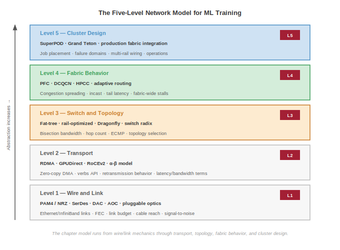
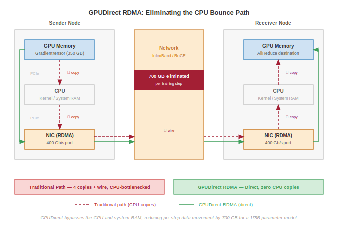
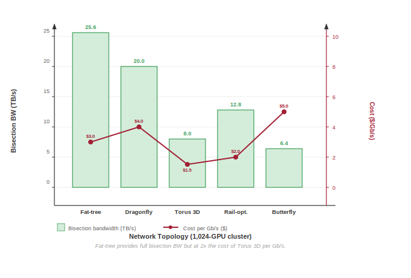

# Network Fabrics {#sec-network-fabrics}

::: {layout-narrow}
::: {.column-margin}

\chapterminitoc

:::

\noindent
{fig-alt="Network interconnects and fabric topology linking compute nodes in a data center."}

:::

## Purpose {.unnumbered}

\begin{marginfigure}
\mlfleetstack{100}{40}{15}{10}
\end{marginfigure}

_Why does the network connecting accelerators matter more than the accelerators themselves at scale?_

A single GPU can perform trillions of operations per second, but distributed training requires those operations to coordinate across thousands of devices. Every synchronization point, whether gradient averaging, activation exchange, or parameter update, depends on network bandwidth and latency. *When* network capacity cannot keep pace with accelerator throughput, GPUs sit idle waiting for data to arrive, and adding more GPUs makes the problem worse rather than better. At sufficient scale, network design dominates system performance: the topology determines which communication patterns are efficient, the bandwidth determines how large models can be partitioned, and the latency determines how tightly coupled training can be. Organizations that treat networking as an afterthought discover that their expensive accelerators deliver a fraction of theoretical performance because the network became the bottleneck nobody planned for.

::: {.content-visible when-format="pdf"}

\newpage

:::

::: {.callout-learning-objectives}

- Model network communication cost using the $\alpha$-$\beta$ framework and identify bandwidth-dominated vs. latency-dominated regimes
- Compare RDMA transport protocols (InfiniBand and RoCE) in terms of latency, lossless guarantees, and operational complexity
- Analyze network topologies (fat-tree, rail-optimized, dragonfly) by computing $\text{BW}_{\text{bisect}}$ and hop count for ML collective patterns
- Evaluate congestion control mechanisms (PFC, DCQCN, HPCC) and their impact on tail latency during distributed training
- Design network virtualization strategies for multi-tenant GPU clusters using SR-IOV and traffic isolation
- Diagnose network performance bottlenecks using RDMA counters, link-level telemetry, and bandwidth testing tools

:::

```{python}
#| echo: false
from mlsysim import *
from mlsysim.core.constants import *
#| label: network-fabrics-setup
from mlsysim.fmt import fmt_int, MarkdownStr, fmt, check, fmt_math

# ┌── LEGO ───────────────────────────────────────────────
# │ Exports: NetworkRunningExampleCluster.n_gpus_str, .peer_gpus_str
class NetworkRunningExampleCluster:
    """Mid-scale training cluster (`Systems.Clusters.Training_1K`) for the 175B running example."""
    # ┌── 1. LOAD (Constants) ──────────────────────────────────────────────
    _cluster = Systems.Clusters.Training_1K
    n_gpus = _cluster.total_accelerators
    # ┌── 4. OUTPUT (Formatting) ──────────────────────────────────────────────
    n_gpus_str = fmt_int(n_gpus, commas=True, suffix=" GPUs")
    peer_gpus_str = fmt(n_gpus - 1, precision=0, commas=False)
```

## The Synchronization Backbone {#sec-network-fabrics-introduction}

Consider the running example that threads through this volume: a 175-billion-parameter language model partitioned across `{python} NetworkRunningExampleCluster.n_gpus_str`. Each training step requires an AllReduce of 350 GB of gradient data, meaning every GPU must send and receive its share before the next step can begin. If even one link in the fabric is slow, all `{python} NetworkRunningExampleCluster.peer_gpus_str` other GPUs wait. The network is not auxiliary infrastructure; it is the synchronization backbone that determines whether this cluster trains efficiently or wastes millions of dollars in idle compute.

In the Fleet Stack\index{Fleet Stack} shown in @fig-fleet-stack, network fabrics form the connective tissue binding the Infrastructure Layer into a coherent whole. @Sec-compute-infrastructure established the building blocks: accelerators, power delivery, and cooling. Those components define what each node can compute in isolation. @Fig-network-five-level-model organizes the fabric design space into five co-dependent levels, from physical signaling to cluster-scale orchestration.

::: {#fig-network-five-level-model fig-env="figure" fig-pos="htb" fig-cap="**The Five-Level Network Model for ML Training**: Five layered levels span from the physical wire to cluster-scale design. Level 1, Wire and Link: PAM4/NRZ signaling, SerDes, DAC, AOC, pluggable optics, Ethernet and InfiniBand link layers. Level 2, Transport: RDMA, GPUDirect, RoCEv2, zero-copy DMA, and the α-β communication model. Level 3, Switch and Topology: fat-tree, rail-optimized, Dragonfly, adaptive routing. Level 4, Fabric Behavior: PFC, DCQCN, HPCC congestion control, adaptive routing, incast handling. Level 5, Cluster Design: NVIDIA SuperPOD, Meta Grand Teton, and other production fabric integrations." fig-alt="Five-level stack from bottom to top: Wire and Link, Transport, Switch and Topology, Fabric Behavior, Cluster Design. Each level lists representative technologies; abstraction increases upward."}

:::

This chapter wires those nodes together, because at scale, communication cost dominates computation cost. The **law of distributed efficiency** in @eq-iron-law-scale makes this explicit: the nonoverlapped communication term $T_{\text{comm}}(N) - T_{\text{overlap}}$ determines how much of each training step is exposed to the network fabric. The fabric constrains every layer above it in the stack by determining whether communication can be overlapped, which collective algorithms are viable, and how network partitions interact with node failures.

The physical network fabric exists to carry three fundamental collective communication patterns. An AllReduce\index{AllReduce}[^fn-allreduce-forward] sums gradients across thousands of GPUs so that every device holds the identical average, forming the heartbeat of synchronous training. An AllGather[^fn-collectives-forward] collects different model portions so that every GPU can reconstruct the full model state. An AllToAll, the most demanding pattern, requires every GPU to send unique data to every other GPU, a requirement critical to expert parallelism[^fn-moe-forward]. @Sec-collective-communication covers the *algorithms* that orchestrate these patterns; this chapter covers the *physics* of the wires and switches that carry them. The distinction matters because the fabric's physical properties (bandwidth, latency, and topology) determine which patterns are efficient and which become bottlenecks.

::: {#psp-network-fabrics-network-as-gradient-bus .callout-perspective title="The network as a gradient bus"}

In a single machine, the memory bus moves data between the processor and memory. In a distributed training cluster, the network fabric serves the analogous role: it is the **Gradient Bus**\index{Gradient!bus} that moves parameter updates between workers. Just as the memory wall in @sec-compute-memory-wall limits single-device throughput, network fabric bandwidth determines multi-device throughput (the communication wall\index{Communication Wall}). Every concept in this chapter, from protocols to topologies to congestion control, exists to make this Gradient Bus as fast and reliable as possible.

:::

```{python}
#| echo: false
#| label: network-fabrics-bandwidth-hierarchy
# ┌─────────────────────────────────────────────────────────────────────────────
# │ BANDWIDTH HIERARCHY SPECS (LEGO)
# ├─────────────────────────────────────────────────────────────────────────────
# │ Context: @sec-network-fabrics-introduction—the bandwidth cliff paragraph,
# │          and pervasive IB NDR bandwidth references throughout the chapter.
# │
# │ Goal: Compute the bandwidth hierarchy (NVLink vs IB vs HBM) and the
# │       NVLink-to-IB ratio that defines the intra/inter-node cliff.
# │ Show: ~400 Gb/s NDR, ~50 GB/s NDR, ~900 GB/s NVLink, ~18x ratio.
# │ How: .m_as() on Pint constants; ratio via simple division.
# │
# │ Imports: mlsysim.core.constants (Systems.Fabrics.InfiniBand_NDR.bandwidth, Hardware.Cloud.H100.nvlink.bandwidth,
# │           Hardware.Cloud.H100.compute.peak_flops, Hardware.Cloud.H100.memory.bandwidth,
# │           Gbps, GB, TB, second, TFLOPs)
# │ Exports: NetworkFabricsContextScenario.ib_ndr_gbps,
# │          NetworkFabricsContextScenario.ib_ndr_gbs,
# │          NetworkFabricsContextScenario.nvlink_h100_gbs,
# │          NetworkFabricsContextScenario.nvlink_to_ib_ratio,
# │          NetworkFabricsContextScenario.h100_tflops,
# │          NetworkFabricsContextScenario.h100_mem_bw
# │ Used by: @sec-network-fabrics-introduction (line ~173), and IB NDR
# │          bandwidth refs in Level 1, Level 2, Level 5, Virtualization,
# │          Monitoring, Fallacies sections.
# └─────────────────────────────────────────────────────────────────────────────
from mlsysim.fmt import fmt, check

class NetworkFabricsContextScenario:
    """Bandwidth hierarchy specs for the chapter-wide fabric discussion."""

    # ┌── 1. LOAD (Constants) ───────────────────────────────────────────────
    ib_ndr_raw = Systems.Fabrics.InfiniBand_NDR.bandwidth
    nvlink_h100_raw = Hardware.Cloud.H100.nvlink.bandwidth
    h100_flops_raw = Hardware.Cloud.H100.compute.peak_flops
    h100_mem_bw_raw = Hardware.Cloud.H100.memory.bandwidth

    # ┌── 2. EXECUTE (The Compute) ─────────────────────────────────────────
    ib_ndr_gbps_val = ib_ndr_raw.m_as(Gbps)
    ib_ndr_gbs_val = ib_ndr_raw.m_as(GB/second)
    nvlink_h100_gbs_val = nvlink_h100_raw.m_as(GB/second)
    nvlink_to_ib_ratio_val = nvlink_h100_gbs_val/ib_ndr_gbs_val

    # ┌── 3. GUARD (Invariants) ────────────────────────────────────────────
    check(ib_ndr_gbps_val > 300, "NDR BW should exceed 300 Gb/s")
    check(nvlink_to_ib_ratio_val > 10, "NVLink-to-IB ratio should exceed 10x")

    # ┌── 4. OUTPUT (Formatting) ──────────────────────────────────────────────
    ib_ndr_gbps_str = fmt(ib_ndr_gbps_val, precision=0, commas=False, suffix=" Gb/s")
    ib_ndr_gbs_str = fmt(ib_ndr_gbs_val, precision=0, commas=False, suffix=" GB/s")
    nvlink_h100_gbs_str = fmt(nvlink_h100_gbs_val, precision=0, commas=False, suffix=" GB/s")
    nvlink_to_ib_ratio_str = fmt(nvlink_to_ib_ratio_val, precision=0, commas=False)
    h100_tflops_str = fmt(h100_flops_raw.m_as(TFLOPs/second), precision=0, commas=False, suffix=" TFLOP/s")
    h100_mem_bw_str = fmt(h100_mem_bw_raw.m_as(TB/second), precision=2, commas=False, suffix=" TB/s")
```

The concrete bandwidth cliff that separates intra-node from inter-node communication makes this Gradient Bus analogy precise. @Sec-compute-infrastructure established that a single H100 delivers `{python} NetworkFabricsContextScenario.h100_tflops_str` of FP16 throughput with `{python} NetworkFabricsContextScenario.h100_mem_bw_str` of memory bandwidth. Within a node, eight such accelerators communicate through NVLink at `{python} NetworkFabricsContextScenario.nvlink_h100_gbs_str`. The moment computation crosses a node boundary, however, the available bandwidth drops by a factor of `{python} NetworkFabricsContextScenario.nvlink_to_ib_ratio_str`$\times$, from `{python} NetworkFabricsContextScenario.nvlink_h100_gbs_str` (NVLink) to `{python} NetworkFabricsContextScenario.ib_ndr_gbs_str` (NDR InfiniBand per port). This cliff, the transition from intra-node to inter-node communication, is the central challenge of network fabric design. For our 175B model, moving 350 GB of gradients through `{python} NetworkFabricsContextScenario.ib_ndr_gbs_str` links means that the AllReduce alone can take seconds, during which every GPU in the cluster sits idle unless the fabric and collective algorithms can overlap that transfer with computation.

@Fig-bandwidth-hierarchy makes this hierarchy concrete by plotting the bandwidth at each level across four GPU generations.

::: {#fig-bandwidth-hierarchy fig-env="figure" fig-pos="htb" fig-cap="**The Bandwidth Hierarchy**: Bandwidth at four levels of the communication hierarchy across four GPU generations, on a logarithmic scale. While HBM and NVLink bandwidth have grown roughly 9× and 6× respectively from V100 to B200, InfiniBand has grown only 4×. The annotations show the NVLink-to-InfiniBand ratio for each generation, quantifying the cliff that distributed training must cross at every synchronization point." fig-alt="Grouped bar chart with log-scale y-axis showing bandwidth in GB per second at four hierarchy levels across four GPU generations from V100 to B200."}

```{python}
#| echo: false
# ┌─────────────────────────────────────────────────────────────────────────────
# │ BANDWIDTH HIERARCHY (FIGURE)
# ├─────────────────────────────────────────────────────────────────────────────
# │ Context: @fig-bandwidth-hierarchy—bandwidth cliff in "The Bandwidth Cliff"
# │
# │ Goal: Plot HBM, NVLink, InfiniBand, PCIe bandwidth across V100–B200 to
# │       quantify the NVLink-to-IB ratio that distributed training must cross.
# │ Show: Grouped bar chart (log scale), NVLink/IB ratio annotations per gen.
# │ How: Hardcoded verified data; matplotlib grouped bars; viz.setup_plot().
# │
# │ Imports: numpy (np), mlsysim.core.viz (viz)
# │ Exports: (figure only, no prose variables)
# └─────────────────────────────────────────────────────────────────────────────
# ┌── 1. CANVAS ────────────────────────────────────────────────────────────────
# │ Plot HBM, NVLink, InfiniBand, PCIe bandwidth across V100–B200 to
import numpy as np
from mlsysim import viz

fig, ax, COLORS, plt = viz.setup_plot(figsize=(8, 5))

#—Verified data ---

# ┌── 2. ARRAYS ────────────────────────────────────────────────────────────────
generations = ["V100\n(2017)", "A100\n(2020)", "H100\n(2022)", "B200\n(2024)"]
hbm         = [900,  2039,  3350,  8000]
nvlink      = [300,   600,   900,  1800]
ib          = [ 24,    24,    48,   100]
pcie        = [ 15.75, 32,    64,    64]

n_gen = len(generations)
n_tiers = 4
x = np.arange(n_gen)
width = 0.18

tier_data   = [hbm, nvlink, ib, pcie]
tier_labels = ["HBM", "NVLink", "InfiniBand", "PCIe"]
tier_colors = [COLORS["BlueLine"], COLORS["GreenLine"], COLORS["OrangeLine"], COLORS["VioletLine"]]

# ┌── 3. RENDER ────────────────────────────────────────────────────────────────
for j, (data, label, color) in enumerate(zip(tier_data, tier_labels, tier_colors)):
    offset = (j - 1.5) * width
    bars = ax.bar(x + offset, data, width, label=label, color=color, alpha=0.85, zorder=3)

#—Annotate NVLink/IB ratio ---
ratios = [n/i for n, i in zip(nvlink, ib)]
for i_gen in range(n_gen):
    # Position annotation above the NVLink bar
    nvlink_x = x[i_gen] + (1 - 1.5) * width
    ax.annotate(f"{ratios[i_gen]:.0f}$\\times$",
                xy=(nvlink_x + width * 0.5, nvlink[i_gen]),
                xytext=(0, 8), textcoords="offset points",
                fontsize=7.5, ha="center", color=COLORS["RedLine"],
                fontweight="bold",
                bbox=dict(boxstyle="round,pad=0.15", fc="white", ec=COLORS["RedLine"], alpha=0.8))

# ┌── 4. DECORATE ──────────────────────────────────────────────────────────────
ax.set_yscale("log")
ax.set_ylim(5, 20000)
ax.set_xticks(x)
ax.set_xticklabels(generations)
ax.set_ylabel("Bandwidth (GB/s, log scale)")
ax.set_xlabel("GPU Generation")
ax.legend(loc="upper left", frameon=True, fancybox=True, framealpha=0.9, ncol=2)
ax.set_title("")
plt.show()
plt.close()
```

:::

@Fig-bandwidth-hierarchy reveals that the NVLink-to-InfiniBand ratio has remained between 12$\times$ and 25$\times$ across four GPU generations, despite absolute bandwidth improvements at every tier. The persistent cliff reflects fundamental physics: on-package interconnects (NVLink) operate over millimeters of copper, while inter-node links (InfiniBand) span meters of cable and must traverse switches. The ratio determines which parallelism strategies are efficient. Tensor parallelism, which requires continuous high-bandwidth exchange of activations, is viable within a node but impractical across nodes. Pipeline and data parallelism, which tolerate lower inter-node bandwidth, must carry the burden of cross-node communication. Every topology and protocol decision in the remainder of this chapter attempts to minimize the impact of this hierarchy on collective communication performance.

To see *why* this ratio matters so viscerally, consider *what* happens during a single training step. @Fig-bandwidth-cliff-gantt uses a normalized timeline: the compute phases are held fixed at 100 ms, and the AllReduce block represents a small gradient shard chosen to make the intra-node and inter-node contrast visible. It is not the full 175B-parameter gradient exchange; it isolates how crossing the node boundary changes utilization.

::: {#fig-bandwidth-cliff-gantt fig-env="figure" fig-pos="htb" fig-cap="**The Bandwidth Cliff in a Training Step**: Illustrative normalized timelines for the same compute phases: an 8-GPU intra-node job (top) using NVLink at 900 GB/s, and a 64-GPU inter-node job (bottom) using InfiniBand at 50 GB/s. The AllReduce phase (red) grows from a thin sliver to a dominant fraction of the step. Without communication--computation overlap, GPUs sit idle during the entire AllReduce, and the utilization gap between the two scenarios exceeds 10 percentage points." fig-alt="Two illustrative horizontal Gantt bars. Top bar shows forward pass, backward pass, and thin AllReduce sliver at 99.5 percent utilization. Bottom bar shows the same compute phases but a wider AllReduce block dropping utilization to about 87 percent."}

```{.tikz}
\usetikzlibrary{positioning, decorations.pathreplacing}
\begin{tikzpicture}[font=\small\usefont{T1}{phv}{m}{n}]
  \definecolor{BlueLine}{HTML}{006395}
  \definecolor{BlueL}{HTML}{D1E6F3}
  \definecolor{GreenLine}{HTML}{008F45}
  \definecolor{GreenL}{HTML}{D4EFDF}
  \definecolor{RedLine}{HTML}{CB202D}
  \definecolor{RedL}{HTML}{F5D2D5}
  \definecolor{OrangeLine}{HTML}{E67817}
  \definecolor{BrownLine}{HTML}{78492A}

  \tikzset{
    ganttbar/.style={draw=none, text=white, font=\scriptsize\usefont{T1}{phv}{m}{n}, minimum height=0.8cm, inner sep=0pt, anchor=west},
    fwd/.style={ganttbar, fill=GreenLine!80},
    bwd/.style={ganttbar, fill=BlueLine!80},
    ar/.style={ganttbar, fill=RedLine},
    label/.style={font=\small\bfseries, anchor=east},
    sublabel/.style={font=\scriptsize\usefont{T1}{phv}{m}{n}, anchor=east, text=black!60},
    util/.style={font=\scriptsize\bfseries, anchor=west}
  }

  %—Scenario A: Intra-node (NVLink) ---
  \begin{scope}[local bounding box=intra]
    \node[fwd, minimum width=4cm] (fwd1) at (0, 1.6) {Forward (100 ms)};
    \node[bwd, minimum width=4cm, right=0pt of fwd1] (bwd1) {Backward (100 ms)};
    \node[ar, minimum width=0.04cm, right=0pt of bwd1] (ar1) {};
    \node[font=\tiny\usefont{T1}{phv}{m}{n}, anchor=west, text=RedLine, right=2pt of ar1] (ar1_label) {AR (1 ms)};
    \node[util, text=GreenLine, right=10pt of ar1_label] {99.5\% util.};

    \node[label, left=0.3cm of fwd1.west, yshift=0.2cm] {Intra-Node};
    \node[sublabel, left=0.3cm of fwd1.west, yshift=-0.2cm] {8 GPUs, NVLink};
  \end{scope}

  %—Scenario B: Inter-node (InfiniBand) ---
  \begin{scope}[local bounding box=inter, yshift=-1.6cm]
    \node[fwd, minimum width=4cm] (fwd2) at (0, 1.6) {Forward (100 ms)};
    \node[bwd, minimum width=4cm, right=0pt of fwd2] (bwd2) {Backward (100 ms)};
    \node[ar, minimum width=1.2cm, right=0pt of bwd2] (ar2) {AllReduce (30 ms)};
    \node[util, text=OrangeLine, right=0.2cm of ar2] {87\% util.};

    \node[label, left=0.3cm of fwd2.west, yshift=0.2cm] {Inter-Node};
    \node[sublabel, left=0.3cm of fwd2.west, yshift=-0.2cm] {64 GPUs, IB};
  \end{scope}

  % Time axis
  \begin{scope}[yshift=-1.0cm]
    \draw[->, line width=1.0pt, black!60] (0, 0) -- (9.8, 0) node[right, font=\scriptsize\usefont{T1}{phv}{m}{n}] {Time (ms)};
    \foreach \x/\t in {0/0, 4/100, 8/200, 9.2/230} {
      \draw[black!60, line width=1.0pt] (\x, 0.1) -- (\x, -0.1);
      \node[font=\tiny\usefont{T1}{phv}{m}{n}, below] at (\x, -0.1) {\t};
    }
  \end{scope}

  % Idle cost annotation
  \draw[RedLine, line width=1.2pt, decorate, decoration={brace, amplitude=4pt}]
    (9.2, -0.5) -- (8, -0.5)
    node[midway, below=5pt, font=\tiny\bfseries, text=RedLine] {30 ms idle per step};

\end{tikzpicture}
```

:::

The 12.5 percentage-point utilization gap represents millions of dollars in wasted compute over a months-long training run. Network fabric design is therefore the central engineering challenge of distributed training, not an afterthought.

## How ML Networking Inverts Data-Center Assumptions {#sec-network-workload-inversion}

A network architect from the world of large-scale web services would find the traffic patterns of a distributed training cluster counter-intuitive. Traditional data-center traffic is characterized by a vast number of small, independent, and asynchronous flows. Millions of users accessing a web service generate a stochastic traffic pattern that is well-served by standard Transmission Control Protocol/Internet Protocol (TCP/IP) and statistically multiplexed, oversubscribed networks.

ML training workloads are the complete opposite: synchronous, periodic, and dominated by a small number of massive, collective communication operations. The resulting mismatch inverts the core assumptions of traditional network design.

| **Workload Pattern**   | **Traditional Data-Center Assumption** | **ML Reality**                             |
|:-----------------------|:---------------------------------------|:-------------------------------------------|
| **Traffic Pattern**    | Asynchronous, stochastic, many-to-many | Synchronous, periodic, all-to-all          |
| **Flow Type**          | Millions of small, short-lived flows   | A few massive, long-lived "elephant" flows |
| **Performance Metric** | Average throughput, per-flow fairness  | Tail latency, global synchronization time  |
| **Loss Tolerance**     | Tolerant (TCP retransmits)             | Intolerant (one dropped packet stalls all) |
| **Congestion**         | Localized, independent events          | Global, correlated (incast)                |

: **ML Networking Inverts Traditional Data-Center Assumptions**\index{ML Networking!data-center workload inversion}: *Where* web services require fairness for millions of independent flows, ML training requires a globally synchronized, lossless fabric optimized for a handful of massive collective operations. {#tbl-network-assumptions}

As @tbl-network-assumptions summarizes, the synchronicity inversion is the most fundamental. Web traffic is asynchronous; one user's slow connection does not affect another's. The Bulk Synchronous Parallel (BSP)[^fn-bsp-valiant] model governs distributed training: all 1,024 GPUs in a training job must complete their gradient exchange before any of them can proceed to the next step. The slowest link therefore dictates the performance of the entire cluster. A single congested switch port that delays one GPU's packets by 100 ms effectively wastes 100 ms of compute time for all 1,024 GPUs. *Tail latency is not an outlier; it is the bottleneck.*

[^fn-bsp-valiant]: **BSP (Bulk Synchronous Parallel)**: Proposed by @valiant1990 as a "bridging model" between parallel hardware and software, analogous to von Neumann's model for sequential machines. ML training adopted BSP because it guarantees mathematical equivalence to single-device training at the cost of a global barrier per step, making the network fabric's tail latency the binding constraint on cluster throughput. \index{Bulk Synchronous Parallel!origin}

The flow inversion compounds this problem. Traditional networks are designed for fairness among millions of "mice flows"[^fn-elephant-mice-flows], yet ML training is dominated by a few "elephant flows" corresponding to the gradient AllReduce. A single AllReduce on a 175B parameter model can involve exchanging 350 GB of data. Standard flow control and routing mechanisms like ECMP, which use static hashing to balance flows, are poorly suited to this traffic pattern, as they can inadvertently map multiple elephant flows to the same link, creating massive congestion while other links sit idle.

[^fn-elephant-mice-flows]: **Elephant and Mice Flows**\index{Elephant and Mice Flows}: From network measurement literature, where "mice" denote the millions of short-lived flows (web requests, DNS lookups) that traditional switches are optimized to handle fairly, and "elephants" denote the rare massive flows that dominate aggregate bandwidth. In ML clusters, a single AllReduce elephant flow can carry 350 GB---more data than millions of mice combined---and ECMP's static hash cannot subdivide it, turning one unlucky hash collision into a cluster-wide straggler. \index{Elephant Flows!network traffic}

The loss inversion completes the picture. TCP/IP was designed for unreliable networks and handles packet loss gracefully through retransmission. RDMA-based protocols used in ML clusters (InfiniBand, RoCE) assume a lossless fabric. A single dropped packet forces a Go-Back-N retransmission that can stall the sender for milliseconds, creating a catastrophic straggler that delays the entire synchronous training step. ML fabrics must therefore be engineered for zero packet loss, using credit-based flow control (InfiniBand) or carefully tuned Priority Flow Control (PFC) with large buffers (Ethernet).

These inversions explain *why* running large-scale distributed training over a standard enterprise Ethernet network is inefficient or impossible. The network fabric for ML is a distributed, high-performance "bus" for collective communication, designed from the ground up for the unique physics of synchronous, large-scale parallelism.

### The five-level model {#sec-network-fabrics-five-level-model}

Each of these inversions traces back to a specific physical or protocol constraint. A **Five-Level Model**\index{Five-Level Model} specific to high-performance interconnects makes these constraints concrete:

- **Level 1: Wire and Link** (@sec-network-fabrics-wire-link). Signal integrity (PAM4, SerDes) and the speed of light in fiber impose hard constraints on latency and cluster geometry.
- **Level 2: Transport** (@sec-network-fabrics-transport). InfiniBand and RoCE provide the RDMA primitives; the $\alpha$-$\beta$ model quantifies the latency-vs.-bandwidth trade-off for different message sizes.
- **Level 3: Switch and Topology** (@sec-network-fabrics-topology). Fat-trees, rail-optimized designs, and dragonflies achieve the $\text{BW}_{\text{bisect}}$ needed for global collectives through different structural trade-offs.
- **Level 4: Fabric Behavior** (@sec-network-fabrics-behavior). Congestion control mechanisms such as DCTCP-style ECN response, DCQCN, and HPCC, along with adaptive routing and incast behavior, determine whether theoretical bandwidth translates to realized throughput [@alizadeh2010; @zhu2015; @li2019].
- **Level 5: Cluster Design** (@sec-network-fabrics-cluster). Production supercomputers like the NVIDIA SuperPOD and Meta Grand Teton integrate these layers into a unified Gradient Bus.

The remainder of this chapter ascends this stack, starting from the copper and glass at the bottom.

## Level 1: Wire and Link {#sec-network-fabrics-wire-link}

```{python}
#| echo: false
# ┌── LEGO ───────────────────────────────────────────────
# │ Context: Wire/link section — 175B cluster GPU count
# │ Exports: NetworkWireClusterRecap.n_gpus_str
class NetworkWireClusterRecap:
    # ┌── 4. OUTPUT (Formatting) ──────────────────────────────────────────────
    n_gpus_str = fmt_int(Systems.Clusters.Training_1K.total_accelerators, commas=True, suffix=" GPUs")
```

```{python}
#| echo: false
# ┌── LEGO ───────────────────────────────────────────────
# │ Context: Wire and link — NDR line rate references.
# │ Exports: IbNdrWireRecap.ib_ndr_gbps_str
class IbNdrWireRecap:
    # ┌── 4. OUTPUT (Formatting) ──────────────────────────────────────────────
    ib_ndr_gbps_str = fmt(Systems.Fabrics.InfiniBand_NDR.bandwidth.m_as(Gbps), precision=0, commas=False, suffix=" Gb/s")
```

Before analyzing protocols and topologies, we must understand the physical medium. Every network design decision is ultimately constrained by *what* the wire can carry. At `{python} IbNdrWireRecap.ib_ndr_gbps_str` and beyond, the physics of signal transmission imposes hard limits on cable length, power consumption, and error rates. These are not engineering inconveniences; they are fundamental constraints that shape cluster geometry.

### Signal integrity and PAM4 {#sec-network-fabrics-pam4}

::: {#dfn-network-fabrics-pam4-signaling .callout-definition title="PAM4 signaling"}

***PAM4 Signaling***\index{PAM4}\index{PAM4 Signaling!definition} is an electrical modulation scheme that uses four distinct voltage levels to encode two bits per symbol period, doubling the data rate achievable over a given physical medium without requiring a higher symbol rate.

1.  **Significance (quantitative)**: PAM4 enables 400 Gb/s and 800 Gb/s link speeds that sustain the $\text{BW}$ required for large-scale gradient synchronization. However, the reduced gap between voltage levels increases susceptibility to noise, requiring Forward Error Correction (FEC), typically Reed-Solomon RS(544,514), that adds 100–200 ns of irreducible processing latency per hop. Across a three-tier fat-tree (3 hops each way), FEC alone contributes 600–1,200 ns of fixed latency to every packet, setting a hard lower bound on the $\alpha$ term in the communication cost model.
2.  **Distinction (durable)**: Unlike NRZ (Non-Return-to-Zero) binary signaling, which uses only two voltage levels and offers better noise margin but is limited to half the data rate per lane, PAM4 trades signal-to-noise ratio for bandwidth density—the same copper trace carries twice the data at the cost of requiring FEC at every port.
3.  **Common pitfall**: A frequent misconception is that doubling bits per symbol is a free throughput gain. PAM4 links require FEC at both endpoints, making them fundamentally higher-latency than equivalent NRZ links; latency-sensitive collectives like AllReduce pay this FEC tax on every packet regardless of message size.

:::

```{python}
#| echo: false
# ┌── LEGO ───────────────────────────────────────────────
# │ Context: PAM4 / FEC latency paragraph.
# │ Exports: FECLatency.ns_low_str, ns_high_str, three_hop_*_str, round_trip_*_str
class FECLatency:
    ns_low = FEC_LATENCY_LOW.m_as(NS)
    ns_high = FEC_LATENCY_HIGH.m_as(NS)
    three_hops = 3
    round_trip_hops = 6
    three_hop_low = ns_low * three_hops
    three_hop_high = ns_high * three_hops
    round_trip_low = ns_low * round_trip_hops
    round_trip_high = ns_high * round_trip_hops
    check(three_hop_low == 300, "Three-hop one-way FEC lower bound should be 300 ns")
    check(round_trip_high == 1200, "Six-hop round-trip FEC upper bound should be 1200 ns")
    # ┌── 4. OUTPUT (Formatting) ──────────────────────────────────────────────
    ns_low_str = fmt(ns_low, precision=0, commas=False, suffix=" ns")
    ns_high_str = fmt(ns_high, precision=0, commas=False, suffix=" ns")
    three_hop_low_str = fmt(three_hop_low, precision=0, commas=False, suffix=" ns")
    three_hop_high_str = fmt(three_hop_high, precision=0, commas=False, suffix=" ns")
    round_trip_low_str = fmt(round_trip_low, precision=0, commas=False, suffix=" ns")
    round_trip_high_str = fmt(round_trip_high, precision=0, commas=False, suffix=" ns")
```

To achieve `{python} IbNdrWireRecap.ib_ndr_gbps_str`, we *cannot* simply toggle a voltage on and off faster. Signal attenuation in copper and chromatic dispersion in fiber impose a hard ceiling on the **symbol rate**\index{Symbol Rate} (the number of signal transitions per second). Modern links overcome this by using PAM4 to pack more information into each transition.

However, the gap between adjacent voltage levels in PAM4 shrinks by a factor of three compared to NRZ, making the link highly susceptible to noise. Consequently, modern high-speed links operate near the physical limits of reliable detection and require **Forward Error Correction (FEC)** at the physical layer, typically Reed-Solomon RS(544,514) codes. FEC processing adds `{python} FECLatency.ns_low_str` to `{python} FECLatency.ns_high_str` of latency per hop to every packet. For our 175B model training, which generates 350 GB of gradient traffic per step across `{python} NetworkWireClusterRecap.n_gpus_str`, this latency floor is nonnegotiable. A packet crossing three switch hops in a fat-tree incurs `{python} FECLatency.three_hop_low_str`--`{python} FECLatency.three_hop_high_str` of one-way irreducible latency from FEC decoding and encoding, or `{python} FECLatency.round_trip_low_str`--`{python} FECLatency.round_trip_high_str` over a three-hop path in each direction. This "physics tax" sets a hard floor on the $\alpha$ term of our performance models, limiting the speed of latency-sensitive collectives like AllReduce regardless of software optimizations.

### Reach and medium: Copper vs. optics {#sec-network-fabrics-copper-optics}

The choice of physical medium\index{Optical Interconnect} determines the reach and economics of each link. Three categories dominate modern ML cluster design:

- **DAC (Direct Attach Copper)**\index{DAC}: Passive copper cables offering the lowest latency and cost (~\$50), but limited to ~3 meters. Used exclusively within a rack.
- **AOC (Active Optical Cable)**\index{AOC}: Fiber with permanently attached transceivers, suitable for 3 to 30 meter runs (~\$500). The conversion between electrical and optical signals, combined with Forward Error Correction (FEC)[^fn-fec-latency], adds hundreds of nanoseconds to every link.

[^fn-fec-latency]: **FEC (Forward Error Correction)**: At 400G and 800G speeds, signal integrity is so fragile that the hardware must use FEC to reconstruct corrupted bits. This adds 100--200 ns per hop---a "latency tax" that is physically unavoidable. In a three-tier fat-tree, FEC alone can contribute over 1 $\mu$s to the round-trip time, making it a significant component of the $\alpha$ latency term. \index{FEC!latency tax}
- **Pluggable Optics**\index{Pluggable Optics}: Separate transceivers and fiber cords, used for runs exceeding 30 meters to the network core.

::: {#psp-network-fabrics-cost-distance .callout-perspective title="The cost of distance"}

In an ML fleet, distance is money. A 10,000-GPU cluster requires ~20,000 optical links at the spine layer alone. At \$500 each with 10 W per link, that represents \$10 million in cabling and 200 kW of continuous power for transceivers alone. The cost dictates **cluster geometry**\index{Cluster!geometry}: architects pack accelerators as densely as possible (70–100 kW per rack) to maximize cheap copper and minimize expensive optics.

:::

As bandwidth demands grew, the industry moved from binary NRZ signaling to four-level PAM4, doubling throughput per wire at the cost of reduced noise margins (@fig-pam4-vs-nrz).

::: {#fig-pam4-vs-nrz fig-env="figure" fig-pos="htb" fig-cap="**Signaling Evolution: NRZ vs. PAM4**: To increase bandwidth without doubling clock frequency, modern interconnects transitioned from NRZ (2 voltage levels, 1 bit per symbol) to PAM4 (4 voltage levels, 2 bits per symbol). The trade-off is reduced noise margin: the 'eye' of the signal is smaller, necessitating Forward Error Correction (FEC) and increasing the irreducible $\alpha$ latency of the fabric." fig-alt="Signal waveform comparison. NRZ shows two levels (0, 1). PAM4 shows four levels (00, 01, 10, 11). Shaded regions indicate the reduced noise margin in PAM4."}

:::

### SerDes, link budget, and power {#sec-network-fabrics-serdes}

Every port depends on a **Serializer/Deserializer (SerDes)**\index{SerDes}\index{SerDes!definition}\index{Serializer/Deserializer} circuit that converts parallel data from the switch ASIC into a serial stream. As bandwidth scales, these circuits have become the dominant power consumer in the network fabric. Consider the energy implications for our cluster of `{python} NetworkWireClusterRecap.n_gpus_str`: maintaining full $\text{BW}_{\text{bisect}}$ for the 350 GB of gradient traffic requires roughly 3,000 high-speed links. If each `{python} IbNdrWireRecap.ib_ndr_gbps_str` port consumes 25 W (combined SerDes and optical transceiver power), the interconnect alone draws 75 kW continuously—over 10 percent of the cluster's power budget dedicated merely to moving bits, not computing on them.

The **link budget**\index{Link Budget}, a strict decibel (dB) allowance for signal attenuation, governs the reach of these links. As signals traverse copper, they lose energy to skin effect and dielectric absorption. The link budget is the difference between the transmitter's output power and the receiver's sensitivity limit. For a standard 50G PAM4 lane, the budget might be 30 dB. If a 3-meter DAC cable introduces 18 dB of loss and the connectors add another 2 dB, 10 dB of margin remains. However, as frequency doubles to support 100G lanes (for 800 Gb/s ports), the loss per meter increases sharply. The physics forces a brutal trade-off: to maintain signal integrity without exceeding the power budget, cable reach must decrease. 800 Gb/s copper links are limited to roughly 1–2 meters, physically constraining the diameter of a compute rack and forcing the use of expensive, power-hungry optics for any connection leaving the cabinet. As link speeds approach 1.6 Tb/s, SerDes and optical power will account for over 15 percent of total cluster energy, making power-per-bit a primary scaling constraint.

The wire sets hard limits on reach and speed; the transport layer must build a reliable communication primitive on top of these physical links.

## Level 2: Transport and the Performance Model {#sec-network-fabrics-transport}

```{python}
#| echo: false
# ┌── LEGO ───────────────────────────────────────────────
# │ Context: Transport section — 175B cluster GPU count
# │ Exports: NetworkTransportClusterRecap.n_gpus_str
class NetworkTransportClusterRecap:
    # ┌── 4. OUTPUT (Formatting) ──────────────────────────────────────────────
    n_gpus_str = fmt_int(Systems.Clusters.Training_1K.total_accelerators, commas=True, suffix=" GPUs")
```

Large-scale training requires sustained, synchronized bulk transfers. A single AllReduce operation across 1,024 accelerators may move terabytes of gradient data. This pattern demands networks optimized for Remote Direct Memory Access (RDMA) to eliminate CPU overhead and **lossless delivery** to ensure predictable performance.

### RDMA and gpudirect {#sec-network-fabrics-rdma}

::: {#dfn-network-fabrics-remote-direct-memory-access-rdma .callout-definition title="Remote direct memory access (RDMA)"}

***Remote Direct Memory Access (RDMA)***\index{RDMA}\index{RDMA!definition} is a networking technology that allows one machine to read or write the memory of another machine directly, bypassing the operating system kernel and CPU of both endpoints by offloading transport processing to the network interface card.

1.  **Significance (quantitative)**: RDMA reduces end-to-end message latency from the 50–100 μs typical of kernel TCP to approximately 1–2 μs, cutting the $L_{\text{lat}}$ term in the iron law by 25--50$\times$. For a 175B-parameter model exchanging 350 GB of gradient data across `{python} NetworkTransportClusterRecap.n_gpus_str`, RDMA also eliminates 700 GB of redundant memory copies per step by allowing the NIC to read GPU memory directly without staging through host RAM (GPUDirect RDMA).
2.  **Distinction (durable)**: Unlike traditional TCP/IP, where the CPU processes every packet through the kernel network stack (consuming tens of CPU cores to saturate a 400 Gb/s link), RDMA offloads the entire transport to dedicated NIC hardware, freeing the CPU to orchestrate computation rather than move data.
3.  **Common pitfall**: A frequent misconception is that RDMA works reliably on any Ethernet network. RDMA lacks TCP's retransmission logic; a single dropped packet can stall an entire 1,024-GPU AllReduce for 100–500 ms as the Go-Back-N recovery retransmits from the loss point. RDMA requires a lossless fabric—InfiniBand or Ethernet with Priority Flow Control—to operate correctly at scale.

:::

```{python}
#| echo: false
# ┌── LEGO ───────────────────────────────────────────────
# │ Context: Transport — NDR line rate in TCP/RDMA discussion.
# │ Exports: IbNdrTransportRecap.ib_ndr_gbps_str
class IbNdrTransportRecap:
    # ┌── 4. OUTPUT (Formatting) ──────────────────────────────────────────────
    ib_ndr_gbps_str = fmt(Systems.Fabrics.InfiniBand_NDR.bandwidth.m_as(Gbps), precision=0, commas=False, suffix=" Gb/s")
```

Standard TCP/IP is architecturally unfit for the `{python} IbNdrTransportRecap.ib_ndr_gbps_str` era. The protocol stack was designed when network speeds were orders of magnitude slower than CPU memory bandwidth, but today that relationship has inverted. Processing a `{python} IbNdrTransportRecap.ib_ndr_gbps_str` stream through the Linux kernel imposes a crushing interrupt tax: copying payload data between user space and kernel buffers can consume the entire memory bandwidth of a dual-socket server, requiring tens of CPU cores merely to keep the pipe full. The result is a CPU wall where the host processor becomes the bottleneck for network traffic, starving the application logic it is meant to serve.

RDMA bypasses this entire layer. By offloading the transport logic to the NIC hardware, it allows applications to read and write directly to remote memory. For ML, GPUDirect RDMA\index{GPUDirect RDMA}[^fn-gpudirect-rdma] extends this zero-copy principle to the accelerators themselves. Without GPUDirect, a gradient update follows a tortuous path: GPU memory $\rightarrow$ CPU system RAM $\rightarrow$ kernel buffer $\rightarrow$ NIC. GPUDirect short-circuits this to a single PCIe transaction: GPU $\rightarrow$ NIC, as @fig-gpudirect-data-path contrasts. For our 175B model's 350 GB gradient exchange, the optimization eliminates 700 GB of redundant memory copies across the cluster per step, reducing latency and freeing the CPU to orchestrate complex pipelining logic rather than acting as a data mover.

[^fn-gpudirect-rdma]: **GPUDirect RDMA**: Introduced by NVIDIA in 2013 with the Kepler architecture, GPUDirect RDMA enables the NIC to read and write GPU memory directly over PCIe without staging through host RAM. Before GPUDirect, every gradient transfer incurred two extra memory copies (GPU-to-host, host-to-NIC), adding 10--20 $\mu$s per message and consuming CPU memory bandwidth that competes with data loading. Eliminating this bounce path is what makes overlapping communication with backward-pass computation feasible at scale. \index{GPUDirect RDMA!zero-copy}

::: {#fig-gpudirect-data-path fig-env="figure" fig-pos="htb" fig-cap="**GPUDirect RDMA Data Path**: Comparison of traditional vs. GPUDirect data paths. Traditional RDMA (top) requires data to be copied to host RAM before transfer to the NIC. GPUDirect RDMA (bottom) enables the NIC to access GPU memory directly via the PCIe bus, eliminating redundant copies and reducing latency for bulk gradient transfers." fig-alt="Two-panel diagram. Top: Traditional path with GPU to CPU RAM to NIC hops. Bottom: Direct path from GPU to NIC via PCIe."}

:::

### InfiniBand and RoCE {#sec-network-fabrics-ib-roce}

Two transport protocols dominate modern GPU clusters:

- **InfiniBand (IB)**\index{InfiniBand}[^fn-infiniband-origin]: A purpose-built HPC architecture designed for point-to-point, switched fabrics [@infiniband2000spec]. It uses hardware-level **credit-based flow control**\index{Credit-Based Flow Control}: a sender must hold a credit (representing available buffer space at the receiver) before transmitting. IB is therefore inherently **lossless** at the link layer. It includes a **Subnet Manager (SM)**\index{Subnet Manager} for global routing and **Virtual Lanes (VLs)**\index{Virtual Lane} for traffic isolation.
- **RoCE (RDMA over Converged Ethernet)**\index{RoCE}: Implements RDMA semantics over standard Ethernet. RoCEv2 encapsulates IB transport headers in UDP/IP packets. While it allows using multi-vendor Ethernet switches, it requires sophisticated congestion control (PFC and ECN) to approximate the losslessness that IB provides natively.

[^fn-infiniband-origin]: **InfiniBand**: Formed in 1999 from the merger of two competing server I/O standards (Future I/O and NGIO), InfiniBand was originally designed to replace PCI as a general-purpose system interconnect. Its pivot to HPC networking preserved the credit-based, hardware-managed flow control that server I/O demanded---and this heritage is precisely why InfiniBand provides native losslessness without the PFC fragility that plagues Ethernet-based RDMA fabrics. \index{InfiniBand!origin}

@Fig-ib-roce-stack compares the two stacks, showing how RDMA-based protocols expose a user-space **Verbs API**\index{Verbs API} that bypasses the kernel's traditional TCP/IP stack.

::: {#fig-ib-roce-stack fig-env="figure" fig-pos="htb" fig-cap="**Traditional TCP/IP vs. RDMA/RoCE v2 Stacks**: Side-by-side comparison. Traditional TCP/IP (left) traverses application, OS kernel (context switch), Socket API, TCP/UDP, IP/Ethernet, and NIC, with latency of 10--20 μs and 2–3× CPU copies. RDMA/RoCE v2 (right) exposes a user-space Verbs API that bypasses the kernel, offloading transport to the RDMA NIC (GPUDirect reads GPU HBM directly), with latency of 1--3 μs and zero-copy CPU overhead." fig-alt="Two protocol stacks. Left Traditional TCP/IP: Application, OS Kernel, Socket, TCP/UDP, IP, NIC (10-20 μs, 2 to 3 copies). Right RDMA/RoCE v2: user-space Verbs API bypasses kernel to RDMA NIC with GPUDirect (1-3 μs, zero copy)."}


:::

The critical takeaway from @fig-ib-roce-stack is that the Verbs API provides a uniform programming model, but the reliability guarantees beneath it differ fundamentally: InfiniBand enforces losslessness in hardware, while RoCE must construct it from Ethernet's best-effort foundations using PFC and ECN.

### Losslessness and the go-back-n problem {#sec-network-fabrics-losslessness}

ML collectives assume in-order, lossless delivery, but the hardware implementation of this reliability introduces a critical fragility. TCP handles packet loss gracefully via Selective Acknowledgement, retransmitting only the specific missing segment. RDMA protocols like RoCEv2, by contrast, typically rely on the simpler **Go-Back-N**\index{Go-Back-N} mechanism. The NIC's physical constraints drive this choice: implementing complex reassembly logic for out-of-order packets requires substantial on-chip SRAM, which consumes precious die area needed for SerDes blocks and packet processing engines. The NIC hardware is optimized for throughput, not state management.

The trade-off is a severe penalty upon failure. If a network switch drops a single packet 900 MB into a 1 GB gradient transfer, the receiver discards all subsequent packets, forcing the sender to retransmit the entire tail of the message, potentially 100 MB of data for a single missed frame. At `{python} IbNdrTransportRecap.ib_ndr_gbps_str`, this retransmission triggers a latency spike orders of magnitude larger than the wire delay. In a synchronous training loop where thousands of GPUs wait for the slowest member, a single dropped packet idles the entire cluster. The network fabric must therefore behave as a lossless medium, pushing the complexity of flow control into the switches via Priority Flow Control (PFC) to ensure buffers never overflow.

::: {#chk-network-fabrics-protocol-selection .callout-checkpoint title="Protocol selection"}

Consider a 2,048-GPU training cluster that will run both large language model training (gradient messages of several gigabytes) and reinforcement learning (frequent small control messages).

1. Which protocol would you recommend and why? Consider that large messages are bandwidth-dominated while small messages are latency-dominated.
2. If you chose RoCE, what additional infrastructure would be needed compared to InfiniBand?
3. How would your answer change if the cluster also needed to serve inference traffic to external users over the same physical network?

:::

### The $\alpha$-$\beta$ performance model {#sec-network-fabrics-performance-model}

\index{Alpha-Beta Model}

Protocol choice determines whether the fabric can behave as a lossless medium; performance modeling then asks how fast that medium can carry a given message. The α-β model\index{Alpha-Beta Model} (formally defined in @sec-communication-collective-operations-collective-operations-alphabeta-model-f9b4) decomposes message transfer time as $T(n) = \alpha + n/\beta$, where $\alpha$ is the fixed startup latency and $\beta$ is the sustained bandwidth [@hockney1994]. Topology choice directly shifts both parameters: a fat-tree minimizes $\alpha$ by providing short equal-cost paths, while a ring amplifies $\alpha$ with cluster size as messages traverse $\lfloor H/2 \rfloor$ hops.

```{python}
#| echo: false
#| label: network-alpha-beta-refactor
# ┌─────────────────────────────────────────────────────────────────────────────
# │ NETWORK ALPHA-BETA MODEL (LEGO)
# ├─────────────────────────────────────────────────────────────────────────────
# │ Context: @sec-network-fabrics-performance-model
# │
# │ Goal: Quantify the latency-bandwidth crossover for InfiniBand vs Ethernet.
# │ Show: Crossover points (~75 KB for IB); impact on small vs large messages.
# │ How: T = alpha + n/beta. Small msg: 4 KB; Large msg: 350 MB.
# │
# │ Imports: mlsysim.core.constants (Systems.Fabrics.InfiniBand_NDR.bandwidth, Gbps, MILLION, TRILLION)
# │ Exports: NetworkAlphaBeta.n_cross_ib_kb_str,
# │          NetworkAlphaBeta.t_small_ib_us_str,
# │          NetworkAlphaBeta.small_bw_pct_str,
# │          NetworkAlphaBeta.t_large_ib_ms_str,
# │          NetworkAlphaBeta.ib_alpha_us_str,
# │          NetworkAlphaBeta.ib_beta_gbs_str
# └─────────────────────────────────────────────────────────────────────────────
from mlsysim.fmt import fmt, check, fmt_math

class NetworkAlphaBeta:
    """Namespace for the alpha-beta communication model."""
    # ┌── 1. LOAD (Constants) ───────────────────────────────────────────────
    # Level 1: Hardware Specs
    alpha_ib = FABRIC_ALPHA_NDR.m_as(second) # 1.5 us (typical for IB NDR)
    beta_ib = Systems.Fabrics.InfiniBand_NDR.bandwidth.m_as('byte/second') # ~50 GB/s

    # Level 2: Messages
    n_small = 4000 # 4 KB
    n_large = 350 * MILLION # 350 MB
    n_demo_large = 100 * MILLION # 100 MB (alpha-beta walkthrough)

    # ┌── 2. EXECUTE (The Compute) ─────────────────────────────────────────
    n_cross_ib = alpha_ib * beta_ib

    t_small_ib = alpha_ib + (n_small/beta_ib)
    small_bw_term_pct = ((n_small/beta_ib) / t_small_ib) * 100

    t_large_ib = alpha_ib + (n_large/beta_ib)

    # ┌── 3. GUARD (Invariants) ───────────────────────────────────────────
    check(n_cross_ib < 100000, f"Crossover ({n_cross_ib:.0f}) should be < 100 KB for IB")
    check(small_bw_term_pct < 10, f"Small msg should be latency-bound, got {small_bw_term_pct:.1f}% BW share")

    # ┌── 4. OUTPUT (Formatting) ──────────────────────────────────────────────
    n_cross_ib_kb_str = fmt((n_cross_ib * byte).m_as(KB), precision=0, commas=False, suffix=" KB")
    t_small_ib_us_str = fmt(t_small_ib * MILLION, precision=2, commas=False, suffix=" μs")
    small_bw_pct_str = fmt(small_bw_term_pct, precision=1, commas=False, suffix=" percent")
    t_large_ib_ms_str = fmt(t_large_ib * THOUSAND, precision=1, commas=False, suffix=" ms")
    ib_alpha_us_str = fmt(alpha_ib * MILLION, precision=1, commas=False, suffix=" μs")
    ib_beta_gbs_str = fmt((beta_ib * byte / second).m_as(GB / second), precision=0, commas=False, suffix=" GB/s")
    n_small_kb_str = fmt((n_small * byte).m_as(KB), precision=0, commas=False, suffix=" KB")
    n_large_mb_str = fmt((n_large * byte).m_as(MB), precision=0, commas=False, suffix=" MB")
    n_demo_large_mb_str = fmt((n_demo_large * byte).m_as(MB), precision=0, commas=False, suffix=" MB")
    n_large_grad_mb_str = fmt((350 * MILLION * byte).m_as(MB), precision=0, commas=False, suffix=" MB")
    eth_alpha_us = 5.0
    eth_beta_gbs = 12.5
    eth_alpha_us_str = fmt(eth_alpha_us, precision=0, commas=False, suffix=" μs")
    eth_beta_gbs_str = fmt(eth_beta_gbs, precision=1, commas=False, suffix=" GB/s")
    doubled_beta_gbs_str = fmt((beta_ib * byte / second).m_as(GB / second) * 2, precision=0, commas=False, suffix=" GB/s")
```

The model reveals two regimes:

1. **Latency-dominated $(n < \alpha\beta)$**: Transfer time is dominated by the startup cost $\alpha$. Small control messages and pipeline bubbles fall here.
2. **Bandwidth-dominated $(n > \alpha\beta)$**: Transfer time scales with $n/\beta$. Gradient AllReduce typically falls here.

For NDR InfiniBand with $\alpha \approx$ `{python} NetworkAlphaBeta.ib_alpha_us_str` and $\beta \approx$ `{python} NetworkAlphaBeta.ib_beta_gbs_str`, the crossover point $n = \alpha\beta \approx$ `{python} NetworkAlphaBeta.n_cross_ib_kb_str`. Messages smaller than this gain little from more bandwidth; messages larger than this gain little from lower latency.

The crossover point separates two fundamentally different optimization strategies: reducing hop count to lower $\alpha$, or adding link bandwidth to raise $\beta$. Applying the model to the concrete message sizes that our 175B training job generates on every iteration makes this distinction actionable.

::: {#nbk-network-fabrics-alpha-beta-crossover .callout-notebook title="The alpha-beta crossover"}

**Problem**: A fabric designer is comparing InfiniBand NDR (`{python} NetworkAlphaBeta.ib_alpha_us_str`, `{python} NetworkAlphaBeta.ib_beta_gbs_str`) against a slower Ethernet baseline (`{python} NetworkAlphaBeta.eth_alpha_us_str`, `{python} NetworkAlphaBeta.eth_beta_gbs_str`). For a `{python} NetworkAlphaBeta.n_small_kb_str` control message and a `{python} NetworkAlphaBeta.n_large_mb_str` gradient shard, which part of $T(n)=\alpha+n/\beta$ dominates, and why does the faster fabric help for different reasons in each regime?

**Math**:
Apply $T(n) = \alpha + n/\beta$ for a `{python} NetworkAlphaBeta.n_small_kb_str` control message and a `{python} NetworkAlphaBeta.n_large_mb_str` gradient shard.

1. **Small message (4 KB)**:
   - InfiniBand: $1.5\,\mu\text{s} + 4 KB/50 GB/s = 1.5 + 0.08 = \mathbf{1.58\,\mu\text{s}}$
   - Ethernet: $5.0\,\mu\text{s} + 4 KB/12.5 GB/s = 5.0 + 0.32 = \mathbf{5.32\,\mu\text{s}}$
   - **Result**: InfiniBand is 3.4$\times$ faster purely due to lower $\alpha$.

2. **Large message (`{python} NetworkAlphaBeta.n_demo_large_mb_str`)**:
   - InfiniBand: $1.5\,\mu\text{s} + 100 MB/50 GB/s = 0.0015 + 2.0 = \mathbf{2.00 ms}$
   - Ethernet: $5.0\,\mu\text{s} + 100 MB/12.5 GB/s = 0.005 + 8.0 = \mathbf{8.01 ms}$
   - **Result**: InfiniBand is 4$\times$ faster purely due to higher $\beta$.

**Systems insight**: For large-scale training, the crossover point $(n^* = \alpha\beta)$ is typically around `{python} NetworkAlphaBeta.n_cross_ib_kb_str`. Since gradients are megabytes to gigabytes, we are almost always in the bandwidth-dominated regime. However, pipeline parallelism and distributed coordination rely on small messages in the latency-dominated regime\index{Latency!dominated regime}, where wire-speed upgrades provide zero benefit and only topology and hop-count reductions matter.

:::

To see *why* this distinction matters in practice, consider two messages that our 175B model training job sends every iteration. The first is a `{python} NetworkAlphaBeta.n_small_kb_str` pipeline-scheduling control message that coordinates microbatch handoffs between pipeline stages. Applying the model: $T(n) \approx$ `{python} NetworkAlphaBeta.t_small_ib_us_str` for the control message. The bandwidth term contributes only `{python} NetworkAlphaBeta.small_bw_pct_str` of the total. Doubling the link speed would save a negligible fraction of a microsecond. For this message, the only way to reduce transfer time is to reduce the hop count (which lowers $\alpha$), not to buy faster links.

The second message is a `{python} NetworkAlphaBeta.n_large_grad_mb_str` gradient shard for one layer's AllReduce. Now: $T(n) \approx$ `{python} NetworkAlphaBeta.t_large_ib_ms_str`. The latency term is invisible. Doubling bandwidth to `{python} NetworkAlphaBeta.doubled_beta_gbs_str` would halve this transfer time, a direct and proportional gain. These two cases illustrate *why* network design must address both $\alpha$ and $\beta$ simultaneously: topology and hop count control the latency-dominated regime, while link speed and path diversity control the bandwidth-dominated regime.

@Fig-alpha-beta-crossover makes these two regimes visible across the full range of message sizes. For InfiniBand, the crossover occurs at approximately `{python} NetworkAlphaBeta.n_cross_ib_kb_str`: messages smaller than this are latency-dominated (the flat region on the left), while larger messages are bandwidth-dominated (the linear region on the right). The 5$\times$ latency gap between InfiniBand and Ethernet RoCE dominates for small messages but becomes irrelevant for the multi-megabyte gradient transfers that dominate training communication.

::: {#fig-alpha-beta-crossover fig-env="figure" fig-pos="htb" fig-cap="**The $\\alpha$-$\\beta$ Crossover**: Transfer time as a function of message size for InfiniBand NDR and Ethernet RoCE. Small messages are latency-dominated (flat region), while large messages are bandwidth-dominated (linear region). The crossover point marks where investing in bandwidth begins to pay off more than reducing latency." fig-alt="Log-log plot showing transfer time vs. message size for InfiniBand and Ethernet, with latency-dominated and bandwidth-dominated regions labeled."}

```{python}
#| echo: false
# ┌─────────────────────────────────────────────────────────────────────────────
# │ ALPHA-BETA CROSSOVER (FIGURE)
# ├─────────────────────────────────────────────────────────────────────────────
# │ Context: @fig-alpha-beta-crossover—latency vs bandwidth regime in fabric
# │          selection
# │
# │ Goal: Visualize transfer time vs message size for InfiniBand NDR vs Ethernet
# │       RoCE; show latency-dominated (flat) vs bandwidth-dominated (linear).
# │ Show: Log-log plot with crossover points (~75 KB for IB); alpha/beta model.
# │ How: T = alpha + n/beta; plot for both fabrics; annotate crossover.
# │
# │ Imports: matplotlib.pyplot (plt), numpy (np), mlsysim.constants
# │ Exports: (figure only, no prose variables)
# └─────────────────────────────────────────────────────────────────────────────
# ┌── 1. CANVAS ────────────────────────────────────────────────────────────────
# │ Visualize transfer time vs message size for InfiniBand NDR vs Ethernet
import matplotlib.pyplot as plt
import matplotlib.ticker as ticker
import numpy as np

# ┌── 2. ARRAYS ────────────────────────────────────────────────────────────────
alpha_ib = FABRIC_ALPHA_NDR.m_as(second)
beta_ib = Systems.Fabrics.InfiniBand_NDR.bandwidth.m_as('byte/second')
alpha_eth = FABRIC_ALPHA_ROCE.m_as(second)
beta_eth = NETWORK_100G_BW.m_as('byte/second')

n = np.logspace(0, 10, 1000)
t_ib = alpha_ib + n/beta_ib
t_eth = alpha_eth + n/beta_eth

n_cross_ib = alpha_ib * beta_ib
t_cross_ib = 2 * alpha_ib
n_cross_eth = alpha_eth * beta_eth
t_cross_eth = 2 * alpha_eth

fig, ax = plt.subplots(figsize=(9, 5))

# ┌── 3. RENDER ────────────────────────────────────────────────────────────────
beta_ib_gbs = (beta_ib * byte / second).m_as(GB / second)
beta_eth_gbs = (beta_eth * byte / second).m_as(GB / second)
ax.plot(n, t_ib, label=f'InfiniBand NDR ({alpha_ib*1e6:.1f}us, {beta_ib_gbs:.0f} GB/s)', color='#006395', linewidth=2.5)
ax.plot(n, t_eth, label=f'Ethernet RoCE ({alpha_eth*1e6:.1f}us, {beta_eth_gbs:.1f} GB/s)', color='#CB202D', linewidth=2.5, linestyle='--')

ax.scatter([n_cross_ib], [t_cross_ib], color='#006395', s=80, zorder=5, edgecolors='white')
ax.scatter([n_cross_eth], [t_cross_eth], color='#CB202D', s=80, zorder=5, edgecolors='white')

# ┌── 4. DECORATE ──────────────────────────────────────────────────────────────
#blue
ax.annotate(
    f'Crossover\n~{(n_cross_ib * byte).m_as(KB):.0f} KB',
    xy=(n_cross_ib*1.2, t_cross_ib*0.9),
    xytext=(n_cross_ib*40, t_cross_ib/1.5),
    arrowprops=dict(arrowstyle='->', color='#006395'),
    color='#006395',
    fontsize=9,
    ha='center',
    va='top'
)

#red
ax.annotate(
    f'Crossover\n~{(n_cross_eth * byte).m_as(KB):.0f} KB',
    xy=(n_cross_eth*0.9, t_cross_eth*1.03),
    xytext=(n_cross_eth/40, t_cross_eth*5),
    arrowprops=dict(arrowstyle='->', color='#CB202D'),
    color='#CB202D',
    fontsize=9,
    ha='center',
    va='top'
)

split_point = n_cross_ib
ax.axvspan(1, split_point, color='gray', alpha=0.1)

ax.text(3e1, 2e-4, "Latency\nDominated", fontsize=12, color='#444', ha='center', va='center', fontweight='bold')
ax.text(1e8, 2e-4, "Bandwidth\nDominated", fontsize=12, color='#444', ha='center', va='center', fontweight='bold')

ax.set_xscale('log')
ax.set_yscale('log')
ax.set_xlim(1, 1e10)
ax.set_ylim(5e-7, 1)
ax.grid(True, which="major", ls="-", alpha=0.6)
ax.grid(True, which="minor", ls=":", alpha=0.3)
ax.set_xlabel('Message Size (Bytes)', fontweight='bold')
ax.set_ylabel('Transfer Time (Seconds)', fontweight='bold')
ax.legend(loc='upper left', frameon=True, framealpha=0.9, fancybox=True)
ax.xaxis.set_major_locator(ticker.LogLocator(base=10.0, numticks=12))
plt.tight_layout()
plt.show()
plt.close()
```

:::

The same model also identifies when communication overtakes computation.

The $\alpha$-$\beta$ analysis above focused on the transfer time of individual messages across a single link, treating the network as a point-to-point channel. In a data-parallel training loop, however, the relevant question is whether the collective AllReduce across the full cluster finishes before the next compute step is ready to begin. When the gradient vector grows large enough, the aggregate transfer time for a ring AllReduce exceeds the per-step computation time, and the network becomes the pacing constraint for the entire training job.

::: {#nbk-allreduce-bottleneck .callout-notebook title="When does AllReduce become the bottleneck?"}

```{python}
#| echo: false
#| label: allreduce-bottleneck
# ┌─────────────────────────────────────────────────────────────────────────────
# │ ALLREDUCE BOTTLENECK ANALYSIS
# ├─────────────────────────────────────────────────────────────────────────────
# │ Context: Network Performance Modeling - Alpha-Beta Model.
# │
# │ Goal: Identify when communication intensity overwhelms computation.
# │ Show: Growth of comm overhead from 1B to 70B parameter models.
# │ How: Calculate T_compute vs T_ring_allreduce using Alpha-Beta parameters.
# │
# │ Imports: mlsysim.core.constants
# │ Exports: AllReduceBottleneck.alpha_math, AllReduceBottleneck.beta_math,
# │          AllReduceBottleneck.t_comp_display_math, AllReduceBottleneck.t_ring_1b_math,
# │          AllReduceBottleneck.comm_frac_display_math, AllReduceBottleneck.t_ring_70b_display_math
# └─────────────────────────────────────────────────────────────────────────────

# ┌── LEGO ───────────────────────────────────────────────
class AllReduceBottleneck:
    """
    Scenario: Cluster of 1024 H100 GPUs training models of varying scale.
    Alpha-Beta parameters for NDR InfiniBand.
    """

    # ┌── 1. LOAD (Constants) ───────────────────────────────────────────────
    from mlsysim import Models, Hardware
    from mlsysim.physics import calc_ring_allreduce_time

    num_gpus = Systems.Clusters.Training_1K.total_accelerators
    h_h100 = Hardware.Cloud.H100
    ib_ndr = Systems.Fabrics.InfiniBand_NDR

    peak_tflops = h_h100.peak_flops.m_as(TFLOPs/second)
    gpu_util = 0.50
    flops_per_sample_base = 5e13 # Realistic per-GPU compute for ~100ms iteration

    m_1b = Models.Language.BERT_Base # 1B scale for this example
    m_70b = Models.Language.Llama2_70B

    # ┌── 2. EXECUTE (The Compute) ─────────────────────────────────────────
    # Step 1: Compute time per GPU
    t_comp_s = flops_per_sample_base / (peak_tflops * TRILLION * gpu_util)

    # Use library formula for Ring AllReduce
    # Model A: 1B params (FP32 = 4 bytes/param)
    grad_1b = m_1b.parameters.m_as(param) * 4 * ureg.byte
    t_comm_1b = calc_ring_allreduce_time(grad_1b, num_gpus, ib_ndr.bandwidth, FABRIC_ALPHA_NDR)

    # Model B: 70B params (FP32 = 4 bytes/param)
    grad_70b = m_70b.parameters.m_as(param) * 4 * ureg.byte
    t_comm_70b = calc_ring_allreduce_time(grad_70b, num_gpus, ib_ndr.bandwidth, FABRIC_ALPHA_NDR)

    comm_frac_small = t_comm_1b.m_as("second") / (t_comp_s + t_comm_1b.m_as("second"))

    # ┌── 3. GUARD (Invariants) ───────────────────────────────────────────
    check(t_comp_s > 0.1, f"Compute time should be significant, got {t_comp_s:.2f}s")
    check(t_comm_70b > t_comm_1b * 50, "70B comm should be >50x 1B comm")

    # ┌── 4. OUTPUT (Formatting) ──────────────────────────────────────────────
    t_comp_ms = f"{t_comp_s * THOUSAND:.0f}"
    t_comm_1b_ms = f"{t_comm_1b.m_as('ms'):.0f}"
    t_comm_70b_ms = f"{t_comm_70b.m_as('ms'):.0f}"
    comm_frac_1b_pct = f"{comm_frac_small * 100:.1f}"

    # Math strings
    alpha_math           = fmt_math(f"\\alpha = {FABRIC_ALPHA_NDR.m_as(US):.1f} \\;\\mu\\text{{s}}")
    beta_math            = fmt_math(f"\\beta = {ib_ndr.bandwidth.m_as(GB/second):.0f} \\;\\text{{GB/s}}")
    t_comp_display_math  = MarkdownStr(f"$$ T_{{\\text{{compute}}}} = {t_comp_ms} \\text{{ ms}} $$")
    t_ring_1b_math       = fmt_math(f"T_{{\\text{{ring}}}} \\approx {t_comm_1b_ms} \\text{{ ms}}")
    comm_frac_display_math = MarkdownStr(f"$$ \\text{{Comm. fraction}} = {comm_frac_1b_pct} \\% $$")
    t_ring_70b_display_math = MarkdownStr(f"$$ T_{{\\text{{ring}}}} \\approx {t_comm_70b_ms} \\text{{ ms}} $$")

    num_gpus_str = fmt_int(num_gpus, commas=False)
    params_1b_billion_str = fmt(m_1b.parameters.m_as(param) / BILLION, precision=1, commas=False, suffix=" billion")
    grad_1b_gb_str = fmt(grad_1b.m_as(GB), precision=1, commas=False, suffix=" GB")
    gpu_util_pct_str = fmt(gpu_util * 100, precision=0, commas=False, suffix=" percent")
    h100_tflops_str = fmt(peak_tflops, precision=0, commas=False, suffix=" TFLOP/s")
    params_70b_billion_str = fmt(m_70b.parameters.m_as(param) / BILLION, precision=0, commas=False, suffix=" billion")
    grad_70b_gb_str = fmt(grad_70b.m_as(GB), precision=0, commas=False, suffix=" GB")
```

**Setup**\index{Setup}: A cluster of `{python} AllReduceBottleneck.num_gpus_str` H100 GPUs training a model with `{python} AllReduceBottleneck.params_1b_billion_str` parameters (`{python} AllReduceBottleneck.grad_1b_gb_str` of FP32 gradients). Each GPU computes at `{python} AllReduceBottleneck.h100_tflops_str`. The network uses NDR InfiniBand (`{python} AllReduceBottleneck.alpha_math` and `{python} AllReduceBottleneck.beta_math` per link).

**Step 1**: Compute time per iteration.
Assume each GPU processes a synthetic microbatch requiring $5 \times 10^{13}$ FLOPs, chosen to produce an approximately 100 ms compute phase for this bottleneck example. At `{python} AllReduceBottleneck.h100_tflops_str` with `{python} AllReduceBottleneck.gpu_util_pct_str` utilization:

`{python} AllReduceBottleneck.t_comp_display_math`

**Step 2**: Communication time (Ring AllReduce\index{Ring AllReduce}).
With $N = 1{,}024$ and $M = 4 \times 10^9$ bytes:

- Total Communication: `{python} AllReduceBottleneck.t_ring_1b_math`

**Step 3**: Communication fraction.
`{python} AllReduceBottleneck.comm_frac_display_math`

With overlap between communication and computation (possible because the backward pass produces gradients layer by layer), the effective overhead can be reduced, but the network is already a major contributor to iteration time for this configuration.

When does it become the bottleneck? If we scale to `{python} AllReduceBottleneck.params_70b_billion_str` parameters (`{python} AllReduceBottleneck.grad_70b_gb_str` of gradients) and the per-GPU computation stays similar (through batch size scaling), the bandwidth term alone becomes:

`{python} AllReduceBottleneck.t_ring_70b_display_math`

Now communication dominates computation by more than 100$\times$ under pure data parallelism. Our 175B model, at 2.5$\times$ this scale, would be even more severely bottlenecked. Models beyond a few billion parameters therefore require tensor and pipeline parallelism to partition the model, rather than relying solely on data parallelism, which must AllReduce the full gradient vector.

:::

```{python}
#| echo: false
# ┌── LEGO ───────────────────────────────────────────────
# │ Context: Transport-to-topology bridge — cluster GPU count
# │ Exports: NetworkTransportBridgeRecap.n_gpus_str
class NetworkTransportBridgeRecap:
    # ┌── 4. OUTPUT (Formatting) ──────────────────────────────────────────────
    n_gpus_str = fmt_int(Systems.Clusters.Training_1K.total_accelerators, commas=True, suffix=" GPUs")
```

The $\alpha$-$\beta$ model quantifies the speed of a single link, but our 175B-parameter model requires `{python} NetworkTransportBridgeRecap.n_gpus_str` to work in concert. Scaling these transport primitives from a pair of nodes to a warehouse-scale supercomputer demands a **Topology**\index{Topology}\index{Network Topology!definition}: a specific pattern of connections that maximizes $\text{BW}_{\text{bisect}}$ while minimizing the hop count and cabling cost for global collective operations.

## Level 3: Switch and Topology {#sec-network-fabrics-topology}

```{python}
#| echo: false
# ┌── LEGO ───────────────────────────────────────────────
# │ Context: Topology section — rack-scale cluster GPU count
# │ Exports: NetworkTopologyRadixRecap.n_gpus_str
class NetworkTopologyRadixRecap:
    # ┌── 4. OUTPUT (Formatting) ──────────────────────────────────────────────
    n_gpus_str = fmt_int(Systems.Clusters.Training_1K.total_accelerators, commas=True, suffix=" GPUs")
```

The physical arrangement of switches determines the bisection bandwidth $\text{BW}_{\text{bisect}}$ and whether the fabric is non-blocking. These two properties govern how well the network supports the global communication patterns that dominate distributed training, a constraint captured by the bisection bandwidth theorem (Principle \ref{pri-bisection-bandwidth}).

```{python}
#| echo: false
#| label: nonblocking-oversubscription-loss
# ┌─────────────────────────────────────────────────────────────────────────────
# │ NON-BLOCKING OVERSUBSCRIPTION LOSS (LEGO)
# ├─────────────────────────────────────────────────────────────────────────────
# │ Context: @dfn-network-fabrics-non-blocking-fabric.
# │ Goal: Tie the stated throughput loss to the communication fraction and
# │       oversubscription ratio.
# │ How: relative_throughput = 1 / ((1 - f_comm) + f_comm × oversub_ratio).
# │ Exports: NonBlockingOversubscription.comm_pct_str,
# │          NonBlockingOversubscription.throughput_loss_pct_str
# └─────────────────────────────────────────────────────────────────────────────
from mlsysim.fmt import fmt, check

class NonBlockingOversubscription:
    """Throughput loss from a 2:1 oversubscribed spine."""

    # ┌── 1. LOAD ──────────────────────────────────────────────────────────
    comm_fraction = 0.30
    oversubscription_ratio = 2.0

    # ┌── 2. EXECUTE ───────────────────────────────────────────────────────
    relative_throughput = 1 / ((1 - comm_fraction) + comm_fraction * oversubscription_ratio)
    throughput_loss_pct = (1 - relative_throughput) * 100

    # ┌── 3. GUARD ─────────────────────────────────────────────────────────
    check(abs(throughput_loss_pct - 23.0769230769) < 1e-6, f"Expected about 23.1%, got {throughput_loss_pct}")

    # ┌── 4. OUTPUT ────────────────────────────────────────────────────────
    comm_pct_str = fmt(comm_fraction * 100, precision=0, commas=False, suffix=" percent")
    throughput_loss_pct_str = fmt(throughput_loss_pct, precision=1, commas=False, suffix=" percent")
```

The first property, bisection bandwidth, quantifies the worst-case throughput ceiling that the topology imposes on global collectives. A cluster can have thousands of fast links at the edge and still starve its AllReduce operations if the cross-sectional capacity at the narrowest point in the switching hierarchy is insufficient.

::: {#dfn-network-fabrics-bisection-bandwidth .callout-definition title="Bisection bandwidth"}

***Bisection Bandwidth***\index{Bisection Bandwidth!definition} is a network topology metric defined as the minimum aggregate link capacity crossing any partition that divides the cluster into two equal halves, representing the worst-case throughput ceiling for all-to-all communication patterns such as AllReduce.

1.  **Significance (quantitative)**: Bisection bandwidth $\text{BW}_{\text{bisect}}$ directly sets the cluster-scale bandwidth ceiling for global synchronization. A 1,024-GPU fat-tree with 400 Gb/s (50 GB/s) links at 1:1 subscription provides $\text{BW}_{\text{bisect}} = 512 \times 50\,\text{GB/s} = 25.6\,\text{TB/s}$ per direction; a 4:1 oversubscribed spine reduces this to $6.4\,\text{TB/s}$, making each AllReduce step 4$\times$ slower and turning the network into the dominant iron law bottleneck rather than the accelerator.
2.  **Distinction (durable)**: Unlike aggregate bandwidth (the sum of all edge link speeds, which can be high even in a poorly connected topology), $\text{BW}_{\text{bisect}}$ measures global connectivity—a star topology with 1,000 edge links all meeting at one central switch has high aggregate bandwidth but $\text{BW}_{\text{bisect}}$ limited by that switch's backplane capacity.
3.  **Common pitfall**: A frequent misconception is that adding more leaf switches always increases $\text{BW}_{\text{bisect}}$. In a three-tier fat-tree, oversubscribing the spine layer (using fewer uplinks than downlinks per pod switch) reduces $\text{BW}_{\text{bisect}}$ below the edge-link total regardless of how many leaf switches are present.

:::

For ML training, where all-to-all communication is standard, full $\text{BW}_{\text{bisect}}$ is the foundational requirement. A fabric that falls short forces every synchronization step to bottleneck at the narrowest cross-section, and the entire cluster idles while gradients trickle through.

Bisection bandwidth is a metric; the topology property that delivers full $\text{BW}_{\text{bisect}}$ under arbitrary traffic patterns is a non-blocking fabric. A non-blocking design guarantees that the uplink capacity at every switch tier matches or exceeds the downlink capacity, so no internal contention reduces the cross-sectional throughput below its theoretical maximum. When a fabric is oversubscribed, the effective $\text{BW}_{\text{bisect}}$ drops by the oversubscription ratio, and every global collective slows proportionally.

::: {#dfn-network-fabrics-non-blocking-fabric .callout-definition title="Non-blocking fabric"}

***Non-blocking Fabric***\index{Non-blocking Fabric!definition} is a network topology in which any permutation of input-output port pairs can communicate simultaneously at full line rate without internal contention, achieved by ensuring that uplink capacity at every switch tier equals or exceeds downlink capacity.

1.  **Significance (quantitative)**: In ML fleets, a non-blocking fabric ensures that AllReduce traffic from any accelerator subset does not compete for shared links, preserving the full $\text{BW}_{\text{bisect}}$ term for global collectives. A 2:1 oversubscribed spine halves the effective $\text{BW}_{\text{bisect}}$, doubling AllReduce time for global gradients and dropping scaling efficiency $\eta_{\text{scaling}}$ accordingly—in a `{python} NonBlockingOversubscription.comm_pct_str`-communication workload, this costs roughly `{python} NonBlockingOversubscription.throughput_loss_pct_str` of total cluster throughput.
2.  **Distinction (durable)**: Unlike oversubscribed fabrics common in web data centers, where upper-tier links are shared among many lower-tier nodes, a non-blocking fabric provides dedicated path capacity for every possible pairing of senders and receivers simultaneously.
3.  **Common pitfall**: A frequent misconception is that non-blocking means zero congestion. Endpoint congestion (incast) can still occur if multiple senders simultaneously target the same receiver port, regardless of how much internal fabric capacity is available.

:::

@Fig-network-topologies (below) turns these topology definitions into a bandwidth and cost comparison. Fat-trees build on Clos-style non-blocking network ideas to provide full $\text{BW}_{\text{bisect}}$ [@clos1953], rail-optimized networks trade some global flexibility for lower cost, and dragonflies reduce cabling while accepting workload-placement constraints [@kim2008].

This trade-off between guaranteed bandwidth and economic scalability drives every topology decision in large-scale ML clusters.

### Top-of-rack (ToR) and the failure domain {#sec-network-fabrics-tor}

The **Top-of-Rack (ToR)**\index{ToR} switch serves as the fundamental physical aggregation point, defining both bandwidth limits and the minimum **failure domain**\index{Failure Domain} for the cluster. In a high-density AI configuration using standard DGX nodes, a single rack typically houses 4 nodes, each containing 8 GPUs, for a total of 32 accelerators. The ToR switch unites these devices but also creates a critical vulnerability: if the ToR fails, it instantly partitions 32 GPUs from the training job, forcing the global scheduler to halt and recover from the last checkpoint.

To mitigate congestion at this edge, network architects maximize the switch **radix**\index{Radix}, the number of ports available. A modern switch with a radix of 64 allocates 32 ports downlink to the servers (ensuring full bandwidth for the 32 GPUs) and 32 ports uplink to the spine. This 1:1 subscription ratio guarantees non-blocking performance at the rack level. For our cluster of `{python} NetworkTopologyRadixRecap.n_gpus_str`, the physical topology comprises approximately 32 such racks. The job scheduler must be topology-aware for performance, while reliable replica placement must also span independent rack failure domains so that a single lost rack does not take down the entire training run (see @sec-fault-tolerance-reliability-reliability-replica-placement-failure-domains-73a7).

### Fat-tree (Clos) networks {#sec-network-fabrics-fat-tree}

The ToR provides non-blocking bandwidth within a single rack, but connecting 32 racks into a cluster that preserves full $\text{BW}_{\text{bisect}}$ across every possible communication pair requires a topology that scales cross-sectional capacity with cluster size. The fat-tree (also called a Clos network) achieves this by adding parallel spine switches at each tier, so the aggregate uplink capacity always matches the total edge bandwidth feeding into it.

::: {#dfn-network-fabrics-fat-tree .callout-definition title="Fat-tree"}

***Fat-Tree***\index{Fat-Tree!definition}\index{Clos Network} is a hierarchical network topology in which the number of parallel paths (and therefore aggregate cross-sectional capacity) increases at each switch tier toward the spine, providing full $\text{BW}_{\text{bisect}}$ and multiple equal-cost routes between any two nodes [@al-fares2008].

1.  **Significance (quantitative)**: A $k$-ary fat-tree built from radix-$k$ switches supports $k^2/2$ hosts in a two-tier (pod) configuration and $k^3/4$ hosts in a three-tier configuration with full $\text{BW}_{\text{bisect}}$. With $k=64$, a two-tier pod supports 2,048 GPUs and a three-tier fabric supports 65,536 hosts. Because every AllReduce can use any available spine path, the fabric sustains simultaneous full-rate communication from all accelerators, meeting the $\text{BW}_{\text{bisect}}$ requirement for global gradient synchronization.
2.  **Distinction (durable)**: Unlike a standard tree (where bandwidth at the root is a single bottleneck shared by all leaves), a fat-tree replaces each root with multiple spine switches whose combined uplink capacity matches the total edge bandwidth, eliminating the bottleneck.
3.  **Common pitfall**: A frequent misconception is that fat-trees guarantee zero network cost. They require $\mathcal{O}(N \log N)$ switches and dense cabling: a non-blocking three-tier fat-tree at the 4,000-GPU scale needs hundreds of switches and tens of thousands of optical cables, costing \$20–100 million in switching hardware alone.

:::

::: {#fig-fat-tree-detail fig-env="figure" fig-pos="htb" fig-cap="**Non-Blocking Fat-Tree Topology**: A three-tier Clos network built from radix-$k$ switches. By ensuring that the number of uplinks at each level matches the number of downlinks, the topology provides full $\\text{BW}_{\\text{bisect}}$ between any two pods. The multiple parallel paths between leaf and spine enable hardware-based adaptive routing to spray packets and avoid congestion." fig-alt="Hierarchical switch diagram with three tiers: Core, Leaf, and GPU Racks. Multiple parallel paths connect switches across tiers, illustrating full bisection bandwidth."}

:::

The fat-tree[^fn-fat-tree-clos] is the industry standard for ML clusters because it strictly guarantees full $\text{BW}_{\text{bisect}}$, a nonnegotiable requirement for the AllReduce collective, which demands simultaneous, all-to-all communication. @Fig-fat-tree-detail shows the resulting three-tier structure. The network is constructed in hierarchical tiers: **Leaf** switches (ToR) connect directly to servers, **Spine** switches interconnect all leaves within a locality domain known as a pod\index{Pod}, and **Core** switches bind multiple pods together.

[^fn-fat-tree-clos]: **Fat-Tree (Clos Network)**: The underlying multi-stage switching theory was invented by @clos1953 at Bell Labs to minimize the number of electromechanical crosspoints in telephone exchanges. @leiserson1985 at MIT generalized the concept as the "fat-tree," where the tree is "fat" because link bandwidth increases toward the root, proving it could emulate any network of equal hardware volume. The same cost-minimization logic that drove 1950s telephony now drives ML cluster design: minimize switch count while guaranteeing non-blocking connectivity for global AllReduce. \index{Fat-Tree!Clos origin}

```{python}
#| echo: false
#| label: network-fabrics-fat-tree-scaling
# ┌─────────────────────────────────────────────────────────────────────────────
# │ FAT-TREE HOST SCALING (LEGO)
# ├─────────────────────────────────────────────────────────────────────────────
# │ Context: @sec-network-fabrics-fat-tree—three-tier fat-tree host count.
# │
# │ Goal: Compute the maximum host count for a fat-tree with radix k = 64.
# │ Show: k^3/4 = 65,536 hosts for a three-tier fat-tree.
# │ How: Integer arithmetic on switch radix.
# │
# │ Imports: mlsysim.book (fmt, check)
# │ Exports: FatTreeScaling.fat_tree_hosts
# │ Used by: paragraph immediately below (three-tier scaling sentence).
# └─────────────────────────────────────────────────────────────────────────────
from mlsysim.fmt import fmt, check

class FatTreeScaling:
    """Fat-tree host count for radix-64 switches."""

    # ┌── 1. LOAD ──────────────────────────────────────────────────────────
    fat_tree_k = 64

    # ┌── 2. EXECUTE ───────────────────────────────────────────────────────
    fat_tree_hosts_val = (fat_tree_k ** 3) // 4
    fat_tree_two_tier_hosts_val = (fat_tree_k // 2) ** 2
    fat_tree_switches_val = (5 * fat_tree_k ** 2) // 4

    # ┌── 3. GUARD ─────────────────────────────────────────────────────────
    check(fat_tree_hosts_val == 65536, f"k=64 fat-tree should support 65,536 hosts, got {fat_tree_hosts_val}")
    check(fat_tree_two_tier_hosts_val == 1024, f"k=64 two-tier should support 1,024 hosts, got {fat_tree_two_tier_hosts_val}")

    # ┌── 4. OUTPUT ────────────────────────────────────────────────────────
    fat_tree_hosts_str = fmt_int(fat_tree_hosts_val, commas=True)
    fat_tree_two_tier_hosts_str = fmt_int(fat_tree_two_tier_hosts_val, commas=True)
    fat_tree_switches_str = fmt_int(fat_tree_switches_val, commas=True)
    switch_cost_low_str = fmt(10000, precision=0, prefix="$")
    switch_cost_high_str = fmt(50000, precision=0, prefix="$")
    infra_cost_low_m_str = fmt(50, precision=0, commas=False, prefix="$", suffix="M")
    infra_cost_high_m_str = fmt(250, precision=0, commas=False, prefix="$", suffix="M")
```

```{python}
#| echo: false
# ┌── LEGO ───────────────────────────────────────────────
# │ Context: Fat-tree capacity paragraph below
# │ Exports: NetworkFatTreeRecap.production_2k_gpus_str, .n_gpus_str
class NetworkFatTreeRecap:
    # ┌── 4. OUTPUT (Formatting) ──────────────────────────────────────────────
    n_gpus_str = fmt(Systems.Clusters.Training_1K.total_accelerators, precision=0, commas=True)
    production_2k_gpus_str = fmt(Systems.Clusters.Production_2K.total_accelerators, precision=0, commas=True)
```

A fat-tree built from switches with radix[^fn-switch-radix-density] $k$ supports $N_{\text{hosts}} = k^3/4$ hosts at three tiers, or $k^2/2$ at two tiers. In a two-tier leaf-spine fabric using radix-64 switches (with $k$ leaves each providing $k/2$ host ports and $k/2$ spine uplinks), the topology supports up to `{python} NetworkFatTreeRecap.production_2k_gpus_str`, comfortably accommodating our `{python} NetworkFatTreeRecap.n_gpus_str` reference cluster with only leaf and spine layers. (A standard fat-tree pod with the leaf-aggregation pair supports $(k/2)^2 =$ `{python} NetworkFatTreeRecap.n_gpus_str` per pod; the difference is whether the second tier uplinks to a core layer or terminates as spines.)

A concrete bisection estimate shows how quickly oversubscription turns into synchronization delay.

```{python}
#| echo: false
#| label: bisection-bandwidth-scaling
# ┌─────────────────────────────────────────────────────────────────────────────
# │ BISECTION BANDWIDTH SCALING (NOTEBOOK)
# ├─────────────────────────────────────────────────────────────────────────────
# │ Context: "Bisection Bandwidth: The Cost of Oversubscription" .callout-notebook
# │
# │ Goal: Quantify the synchronization slowdown when moving from a
# │       non-blocking (1:1) to an oversubscribed (4:1) network.
# │ Show: slowdown_factor ≈ 4\times—inline in notebook result.
# │ How: T = M / BW_bisect; BW_bisect = N * BW_link / Oversub_Ratio.
# │
# │ Imports: mlsysim.core.constants, mlsysim.book (check)
# │ Exports: bbs_n_gpus_str, bbs_gpus_per_side_str, bbs_gradient_gb_str,
# │          bbs_total_data_gb_str, bbs_bw_1_1_gbs_str, bbs_bw_4_1_gbs_str,
# │          bbs_slowdown_str, bbs_time_1_1_ms_str, bbs_time_4_1_ms_str
# └─────────────────────────────────────────────────────────────────────────────
from mlsysim.fmt import fmt_int,  fmt, check

class BisectionScaling:
    # ┌── 1. LOAD ──────────────────────────────────────────
    n_gpus = Systems.Clusters.Training_1K.total_accelerators
    beta_gbs = Systems.Fabrics.InfiniBand_NDR.bandwidth.m_as(GB / second)
    gradient_gb = 100
    # ┌── 2. EXECUTE ───────────────────────────────────────
    gpus_per_side = n_gpus // 2
    bw_1_1 = gpus_per_side * beta_gbs
    bw_4_1 = bw_1_1 / 4
    total_data_gb = gpus_per_side * gradient_gb
    time_1_1 = total_data_gb/bw_1_1
    time_4_1 = total_data_gb/bw_4_1
    slowdown = time_4_1 / time_1_1
    # ┌── 3. GUARD ─────────────────────────────────────────
    check(n_gpus % 2 == 0, "Bisection model requires an even GPU count")
    check(slowdown == 4.0, "Slowdown must match oversubscription ratio")
    # ┌── 4. OUTPUT ────────────────────────────────────────
    bbs_n_gpus_str = fmt(n_gpus, precision=0, commas=False)
    bbs_gpus_per_side_str = fmt(gpus_per_side, precision=0, commas=False)
    bbs_gradient_gb_str = fmt(gradient_gb, precision=0, commas=False, suffix=" GB")
    bbs_total_data_gb_str = fmt(total_data_gb, precision=0, suffix=" GB")
    bbs_bw_1_1_gbs_str = fmt(bw_1_1, precision=0, suffix=" GB/s")
    bbs_bw_4_1_gbs_str = fmt(bw_4_1, precision=0, suffix=" GB/s")
    bbs_slowdown_str = fmt_int(slowdown, commas=False)
    bbs_time_1_1_ms_str = fmt(time_1_1 * THOUSAND, precision=0, suffix=" ms")
    bbs_time_4_1_ms_str = fmt(time_4_1 * THOUSAND, precision=0, suffix=" ms")
```

::: {#nbk-network-fabrics-bisection-bandwidth-cost-oversubscription .callout-notebook title="Bisection bandwidth: The cost of oversubscription"}

**Problem**: A cluster designer is choosing between a "Non-blocking" (1:1) fat-tree and a "Cost-optimized" (4:1) spine for a cluster of `{python} BisectionScaling.bbs_n_gpus_str`. How much slower will a `{python} BisectionScaling.bbs_gradient_gb_str`-per-GPU AllReduce be on the cheaper network?

**Math**:
Bisection bandwidth ($\text{BW}_{\text{bisect}}$) is the minimum pipe diameter between halves of the cluster.

1. **Non-blocking (1:1)**: $\text{BW}_{\text{bisect}} =$ `{python} BisectionScaling.bbs_gpus_per_side_str` $\times 50 \text{ GB/s} =$ `{python} BisectionScaling.bbs_bw_1_1_gbs_str` per direction.
   - Time: `{python} BisectionScaling.bbs_total_data_gb_str` / `{python} BisectionScaling.bbs_bw_1_1_gbs_str` $\approx$ `{python} BisectionScaling.bbs_time_1_1_ms_str`.
2. **Oversubscribed (4:1)**: $\text{BW}_{\text{bisect}} =$ `{python} BisectionScaling.bbs_bw_1_1_gbs_str` divided by 4 = `{python} BisectionScaling.bbs_bw_4_1_gbs_str` per direction.
   - Time: `{python} BisectionScaling.bbs_total_data_gb_str` / `{python} BisectionScaling.bbs_bw_4_1_gbs_str` $\approx$ `{python} BisectionScaling.bbs_time_4_1_ms_str`.

**Systems insight**: Saving money on core switches creates a `{python} BisectionScaling.bbs_slowdown_str`$\times$ bottleneck for global synchronization. For a \$300M supercomputer where training is 30 percent communication, this "saving" wastes approximately \$142 million in idle compute time (matching the bisection-bottleneck model in @sec-network-fabrics-fat-tree). For training, network oversubscription is a false economy.

:::

This oversubscription calculation turns the topology definition into a design rule: the subscription ratio at each tier determines whether a fat-tree can sustain global collectives.

::: {#chk-network-fabrics-fat-tree-topologies .callout-checkpoint title="Fat-tree topologies"}

Verify your understanding of hierarchical switch fabrics:

- [ ] In a **Radix-64** two-tier fat-tree, what is the maximum number of GPUs you can connect without core switches?
- [ ] Why does a Non-blocking fabric require a 1:1 subscription ratio at every tier of the network?
- [ ] If you move from a two-tier to a three-tier fat-tree, how does the **$\alpha$ (startup latency)** of a message change?
- [ ] Explain the difference between aggregate bandwidth and $\text{BW}_{\text{bisect}}$. Which one matters for AllReduce?

:::

[^fn-switch-radix-density]: **Switch Radix**: Modern high-end switches (for example, NVIDIA Quantum-2) feature a radix of 64 ports, each at 400 Gb/s. This density allows a two-tier fat-tree to support up to 2,048 GPUs with only two switch hops. As model scale pushes toward 100,000 GPUs, increasing switch radix (to 128 or 256) is the only way to avoid adding more tiers and the resulting latency/cost explosion. \index{Switch Radix!port density}

Scaling beyond this requires a three-tier architecture with core switches, enabling the fabric to reach `{python} FatTreeScaling.fat_tree_hosts_str` hosts. The infrastructure cost is substantial: a non-blocking $k=64$ three-tier tree requires roughly $5k^2/4 \approx$ `{python} FatTreeScaling.fat_tree_switches_str` switches across the core, aggregation, and edge layers. At `{python} FatTreeScaling.switch_cost_low_str` to `{python} FatTreeScaling.switch_cost_high_str` per switch, the switching layer alone represents `{python} FatTreeScaling.infra_cost_low_m_str` to `{python} FatTreeScaling.infra_cost_high_m_str`.

However, scale imposes a latency tax. Typical **hop counts**\index{Hop Count} are 2 for intra-pod (leaf-spine-leaf) and 4 for inter-pod (leaf-spine-core-spine-leaf). Each additional hop introduces serialization delay and switch processing time, adding microseconds to the $\alpha$ latency term that accumulates during the thousands of synchronization steps in a training run.

### Rail-optimized topology {#sec-network-fabrics-rail-optimized}

As @fig-rail-optimized-cabling shows, in modern ML nodes GPUs are partitioned into "Rails" corresponding to their PCIe slot position.

::: {#fig-rail-optimized-cabling fig-env="figure" fig-pos="htb" fig-cap="**Rail-Optimized Physical Wiring**: In modern ML nodes (for example, DGX H100), GPUs are partitioned into 'Rails' corresponding to their PCIe slot position. GPU 0 in every node connects to Switch Rail 0, GPU 1 to Switch Rail 1, and so on. This architecture ensures that data-parallel AllReduce traffic—which synchronizes between corresponding GPUs—never competes for $\\text{BW}_{\\text{bisect}}$ with other parallel groups, minimizing hop count and congestion for the most latency-sensitive traffic." fig-alt="Physical cabling diagram showing two server nodes, each with 4 GPUs. Cables connect GPU 0s to Rail Switch 0, GPU 1s to Rail Switch 1, etc."}


:::

The wiring pattern in @fig-rail-optimized-cabling ensures that same-rank inter-node communication between corresponding GPUs (GPU 0 to GPU 0, GPU 1 to GPU 1) travels over a dedicated rail switch rather than competing for shared ToR bandwidth. In standard 3D parallelism with tensor parallelism confined intra-node, this same-rank traffic is the data-parallel AllReduce path, eliminating cross-traffic congestion on the gradient-synchronization critical path.

In distributed training, data parallelism\index{Data Parallelism} creates a deterministic and highly stratified communication pattern that standard topologies fail to exploit. When tensor-parallel groups stay inside each node, the same local GPU rank in every replica owns the corresponding shard of the model. GPU 0 on one node therefore synchronizes that shard's gradients with GPU 0 on other nodes, but rarely with GPU 1. A **rail-optimized topology**\index{Rail-Optimized Topology!definition} physically hardwires this logic by isolating these same-rank communication paths into dedicated networks. Instead of connecting all 8 GPUs in a node to a single ToR switch, the network connects all GPU 0s across the entire cluster to a dedicated "Rail 0" switch fabric, all GPU 1s to "Rail 1," and so on.

A simple hop-count estimate shows the payoff.

```{python}
#| echo: false
#| label: rail-optimized-latency-notebook
# ┌─────────────────────────────────────────────────────────────────────────────
# │ RAIL-OPTIMIZED LATENCY BUDGET (NOTEBOOK)
# ├─────────────────────────────────────────────────────────────────────────────
# │ Context: "The Rail-Optimized Dividend" .callout-notebook
# │
# │ Goal: Quantify the latency savings of rail-optimized topology.
# │ Show: speedup ≈ 2x—inline in notebook result.
# │ How: T = Hop_Count * T_hop.
# │
# │ Imports: mlsysim.book (check)
# │ Exports: rol_hop_lat_us_str, rol_speedup_str
# └─────────────────────────────────────────────────────────────────────────────
from mlsysim.fmt import fmt, check

class RailLatency:
    # ┌── 1. LOAD ──────────────────────────────────────────
    t_hop_us = FABRIC_HOP_LATENCY.m_as(US) # switch + wire latency
    n_nodes = 128
    # Standard fat-tree: Leaf -> Spine -> Leaf (2 hops)
    # Rail-optimized: Leaf (direct) (1 hop)
    # ┌── 2. EXECUTE ───────────────────────────────────────
    lat_std = 2 * t_hop_us
    lat_rail = 1 * t_hop_us
    speedup = lat_std/lat_rail
    # ┌── 3. GUARD ─────────────────────────────────────────
    check(speedup == 2.0, f"Speedup {speedup:.1f}x unexpected")
    # ┌── 4. OUTPUT ────────────────────────────────────────
    rol_hop_lat_us_str = fmt(t_hop_us, precision=1, commas=False, suffix=" μs")
    rol_speedup_str = fmt(speedup, precision=0, commas=False)
    rol_n_nodes_str = fmt_int(n_nodes, commas=False, suffix=" nodes")
```

::: {#nbk-network-fabrics-rail-optimized-dividend .callout-notebook title="The rail-optimized dividend"}

**Problem**: A team is synchronizing per-rank data-parallel gradients across `{python} RailLatency.rol_n_nodes_str`. In a standard fat-tree, each message between same-rank GPUs traverses a Leaf switch and a Spine switch (2 hops). In a rail-optimized network, all corresponding GPUs are on the same rail switch (1 hop). How much "Latency Dividend" does the rail design earn?

**Math**:
Communication latency ($\alpha$) is proportional to the number of switch hops.

1. **Standard Latency**\index{Latency!standard}: 2 hops $\times$ `{python} RailLatency.rol_hop_lat_us_str` = 1.2 μs.
2. **Rail-Optimized**: 1 hop $\times$ `{python} RailLatency.rol_hop_lat_us_str` = 0.6 μs.
3. **Result**: `{python} RailLatency.rol_speedup_str`$\times$ lower latency.

**Systems insight**: For synchronous data-parallel AllReduce (which the training step waits on every iteration), a 2$\times$ latency reduction is the difference between 80 percent and 95 percent scaling efficiency. The scaling efficiency bound (Principle \ref{pri-scaling-efficiency}) explains why this matters: physically aligning the network to the model's same-rank traffic pattern eliminates the "Spine Tax" for the most bandwidth-hungry communication. Archetype A clusters achieve their performance because they are structured, not merely large.

:::

That same-rank latency dividend is why the rail pattern appears in production LLM training fleets rather than remaining a cabling optimization. The archetype A workloads that dominate large-scale LLM training exploit this structure directly, because 3D parallelism generates traffic patterns that align with the rail wiring.

::: {#lhs-network-fabrics-archetype-gpt-4-llama-3-rail-optimized-fleet .callout-lighthouse title="Archetype A (GPT-4/Llama-3): The rail-optimized fleet"}

**Archetype A (GPT-4)** is the primary driver for rail-optimized fabrics. Because it uses **3D Parallelism**\index{3D Parallelism}, it generates two distinct traffic patterns: (1) massive, bandwidth-hungry gradient averaging for data parallelism, and (2) high-frequency, latency-sensitive activation exchanges for tensor parallelism. The rail-optimized design ensures that data-parallel traffic traverses only a single switch hop between nodes, minimizing the latency that would otherwise stall the synchronous training loop.

:::

The engineering consequence of this alignment is measurable at cluster scale. Because each of the 8 GPU ranks in a node communicates only with the same rank on other nodes during data-parallel AllReduce, the rail topology partitions the cluster into 8 independent switch networks that can operate concurrently without contention.

```{python}
#| echo: false
# ┌── LEGO ───────────────────────────────────────────────
# │ Context: Rail-optimized paragraph below — cluster node and rail counts
# │ Exports: NetworkRailRecap.n_gpus_str, .n_nodes_str, .gpus_per_rail_str
class NetworkRailRecap:
    _cluster = Systems.Clusters.Training_1K
    # ┌── 4. OUTPUT (Formatting) ──────────────────────────────────────────────
    n_gpus_str = fmt_int(_cluster.total_accelerators, commas=True, suffix=" GPUs")
    n_nodes_str = fmt_int(_cluster.count, commas=False, suffix=" nodes")
    gpus_per_rail_str = fmt_int(_cluster.total_accelerators // 8, commas=False, suffix=" GPUs")
```

For our cluster of `{python} NetworkRailRecap.n_gpus_str` spanning `{python} NetworkRailRecap.n_nodes_str`, this creates 8 parallel networks of `{python} NetworkRailRecap.gpus_per_rail_str` each, allowing per-rank data-parallel AllReduce traffic to traverse a single switch hop rather than the multi-hop leaf-spine-leaf path required by a standard fat-tree. The latency benefit is significant for the frequent, bandwidth-hungry gradient exchanges that synchronous data parallelism demands. However, this architecture introduces a sharp trade-off: traffic that must reach GPUs of different ranks (such as expert routing in MoE, or pipeline-stage handoffs that do not align with the rail wiring) requires bridging across rails. Modern clusters therefore employ a hybrid approach, using rail-optimized leaves for same-rank data-parallel traffic while bridging the rails with a full fat-tree spine to support cross-rank communication patterns.

::: {#chk-network-fabrics-rail-optimized-networks .callout-checkpoint title="Rail-optimized networks"}

Verify your understanding of workload-specific network design:

- [ ] Which dimension of 3D Parallelism (TP, PP, or DP) is the primary beneficiary of a **Rail-Optimized** design?
- [ ] Why does a rail-optimized network reduce the number of switch hops for gradient exchanges compared to a standard fat-tree?
- [ ] What is the "Traffic Isolation" benefit: why do we want all GPU 0s on one rail and all GPU 1s on another?
- [ ] True or False: A rail-optimized network eliminates the need for high-bandwidth core switches connecting different rails.

:::

### Dragonfly and torus alternatives {#sec-network-fabrics-dragonfly}

A **Dragonfly**\index{Dragonfly Topology}[^fn-dragonfly-isca] topology organizes switches into high-radix groups, where each group functions as a fully connected island. These groups connect to one another via global optical links. The hierarchical structure minimizes the number of expensive long-distance cables required to scale, reducing cabling cost by roughly 50 percent compared to a fat-tree. However, bandwidth within a group is non-blocking (100 percent), while bandwidth between groups is typically only 25–50 percent of the aggregate injection rate. For ML workloads, this oversubscription creates a binary performance cliff based on job placement. A training job that fits entirely within a single dragonfly group sees full line-rate performance; a job spanning multiple groups is throttled by the limited global bandwidth, potentially suffering a 2--4$\times$ slowdown. Dragonfly fabrics therefore require topology-aware schedulers that rigidly pack jobs into groups to avoid crossing the oversubscribed global links.

[^fn-dragonfly-isca]: **Dragonfly Topology**: Introduced by John Kim and William Dally at ISCA 2008, the dragonfly uses high-radix routers grouped into fully connected "super-nodes" to reduce global cabling by 52 percent compared to a folded Clos of equivalent scale. The cost savings are real but create a rigid scheduling constraint: any training job that crosses group boundaries hits the oversubscribed global links, making topology-aware placement mandatory rather than optional. \index{Dragonfly!topology origin}

A **Torus**\index{Torus} topology connects each node directly to its neighbors in a multidimensional grid, most commonly a 3D torus where every node links to its six adjacent peers (up/down, left/right, front/back). The design offers full local bandwidth with minimal switching hardware, as connections travel only 1–2 hops to reach neighbors. However, global communication requires traversing the diameter of the mesh ($\mathcal{O}(N^{1/3})$ hops), making latency scale poorly with cluster size. Google adopted this architecture for its Tensor Processing Unit (TPU) pods because Transformer training is dominated by data parallelism and pipeline parallelism, both of which use nearest-neighbor communication patterns that map naturally onto the physical grid. The limitation becomes apparent with Mixture-of-Experts (MoE), which relies on AllToAll communication patterns. On a torus, these random permutations congest the limited $\text{BW}_{\text{bisect}}$ of the mesh, causing performance to degrade by 2--4$\times$ compared to a switch-based fat-tree.

The trade-offs between these topologies become stark when quantified for a large-scale deployment. Consider a 4,096-GPU cluster. A non-blocking fat-tree at this scale, built from the $k=64$ switches assumed throughout this chapter, requires hundreds of switches (two 2,048-GPU pods plus a bridging core layer) and tens of thousands of optical cables to deliver 100 percent $\text{BW}_{\text{bisect}}$, enabling any GPU to communicate with any other at full speed. A 3D torus connecting the same nodes might use zero external switches (relying on direct host-to-host links) and only short copper cables, but offers only a fraction of $\text{BW}_{\text{bisect}}$ (scaling with $N^{2/3}$). The divergence in industry architectures follows directly. Google's TPU Pods employ torus topologies because their workloads, primarily transformer training, are predictable and the structured grid efficiently supports collective communication algorithms (ring AllReduce, AllGather, ReduceScatter) that map onto the 3D mesh. GPU clusters overwhelmingly favor fat-trees because their workloads are more diverse, ranging from recommendation systems to graph neural networks, and rely heavily on global AllReduce patterns that require the full $\text{BW}_{\text{bisect}}$ only a tree can provide. A torus saves millions in switch costs but rigidly constrains the software; a fat-tree costs more but provides the universality needed for general-purpose AI research.

@Fig-network-topologies quantifies the bandwidth and cost differences between these common families.

::: {#fig-network-topologies fig-env="figure" fig-pos="htb" fig-cap="**Network Topologies for ML: Bandwidth vs. Cost**: Bar chart comparing $\\text{BW}_{\\text{bisect}}$ (TB/s, left axis) and cost per Gb/s (right axis) for five topologies on a 1,024-GPU cluster: Fat-tree (25.6 TB/s, \\$3.0/Gb/s), Dragonfly (20.0, \\$4.0), Torus 3D (8.0, \\$1.5), Rail-opt (12.8, \\$2.0), Butterfly (6.4, \\$5.0). Fat-tree provides full $\\text{BW}_{\\text{bisect}}$ but at 2× the cost of Torus 3D per Gb/s." fig-alt="Bar chart of five topologies (Fat-tree, Dragonfly, Torus 3D, Rail-opt, Butterfly) with two y-axes: bisection bandwidth in TB/s on the left and cost per Gb/s on the right. Fat-tree is tallest (25.6 TB/s); Torus 3D is cheapest per Gb/s."}

:::

::: {#chk-network-fabrics-topology-selection .callout-checkpoint title="Topology selection"}

The choice of network topology dictates the upper bound of training efficiency. Consider three workloads:

1. For a standard data-parallel job, bandwidth is dominated by AllReduce. Which topology maximizes $\text{BW}_{\text{bisect}}$?
2. For a Mixture-of-Experts model with AllToAll-dominant, bursty, sparse communication, which topology minimizes hop count while maintaining congestion control?
3. For a 2D mesh computation (a physics simulation or specific parallel strategy), which topology offers the best locality by mapping physical neighbor links directly to hardware?

:::

The qualitative topology choice becomes a financial decision once oversubscription enters the design. The next calculation isolates that cost by holding the cluster fixed and changing only the spine subscription ratio.

::: {#nbk-bisection-bottleneck .callout-notebook title="The bisection bottleneck"}

```{python}
#| echo: false
#| label: bisection-bottleneck
# ┌─────────────────────────────────────────────────────────────────────────────
# │ BISECTION BOTTLENECK ANALYSIS
# ├─────────────────────────────────────────────────────────────────────────────
# │ Context: Network Topology - Bisection Bandwidth impact.
# │
# │ Goal: Quantify the slowdown from network oversubscription.
# │ Show: That cost-optimized (oversubscribed) networks throttle training.
# │ How: Calculate AllReduce time for 1:1 vs 4:1 oversubscription.
# │
# │ Imports: mlsysim.core.constants
# │ Exports: BisectionBottleneck.gpus_per_side_str,
# │          BisectionBottleneck.bisec_bw_a_gbs_str,
# │          BisectionBottleneck.bisec_bw_b_gbs_str,
# │          BisectionBottleneck.bisec_bw_a_tbs_str,
# │          BisectionBottleneck.bisec_bw_b_tbs_str,
# │          BisectionBottleneck.data_crossing_gb_str,
# │          BisectionBottleneck.time_a_ms_str,
# │          BisectionBottleneck.time_b_ms_str,
# │          BisectionBottleneck.waste_m_str
# └─────────────────────────────────────────────────────────────────────────────

# ┌── LEGO ───────────────────────────────────────────────
class BisectionBottleneck:
    """
    Scenario: 1024 accelerators (128 nodes) running AllReduce.
    Comparison of non-blocking (1:1) vs oversubscribed (4:1) fabric.
    """

    # ┌── 1. LOAD (Constants) ───────────────────────────────────────────────
    from mlsysim import Hardware
    num_gpus = Systems.Clusters.Training_1K.total_accelerators
    num_nodes = Systems.Clusters.Training_1K.count
    injection_bw = Systems.Fabrics.InfiniBand_NDR
    gradient_size_gb = 100
    oversub_ratio_b = 4
    cluster_cost_m = 300
    comm_fraction = 0.30

    # ┌── 2. EXECUTE (The Compute) ─────────────────────────────────────────
    # Step 1: BW_bisect (aggregate across the cut)
    gpus_per_side = num_gpus // 2
    total_bisec_bw_a = gpus_per_side * injection_bw.bandwidth.m_as(GB/second)
    total_bisec_bw_b = total_bisec_bw_a/oversub_ratio_b

    # Step 2: Time = Data/Bandwidth
    total_data_crossing_bisection = gpus_per_side * gradient_size_gb
    time_a_s = total_data_crossing_bisection/total_bisec_bw_a
    time_b_s = total_data_crossing_bisection/total_bisec_bw_b

    # Step 3: Economic impact
    rel_throughput = 1 / ((1 - comm_fraction) + (comm_fraction * oversub_ratio_b))
    waste_val = (1 - rel_throughput) * cluster_cost_m

    # ┌── 3. GUARD (Invariants) ───────────────────────────────────────────
    from mlsysim.fmt import check
    check(num_gpus % 2 == 0, "Bisection model requires an even GPU count")
    check(time_b_s == time_a_s * 4, "Scenario B must be 4x slower than Scenario A")

    # ┌── 4. OUTPUT (Formatting) ──────────────────────────────────────────────
    from mlsysim.fmt import fmt
    gpus_per_side_str = fmt(gpus_per_side, precision=0, commas=False)
    bisec_bw_a_gbs_str = fmt(total_bisec_bw_a, precision=0, suffix=" GB/s")
    bisec_bw_b_gbs_str = fmt(total_bisec_bw_b, precision=0, suffix=" GB/s")
    bisec_bw_a_tbs_str = fmt(total_bisec_bw_a / THOUSAND, precision=1, commas=False, suffix=" TB/s")
    bisec_bw_b_tbs_str = fmt(total_bisec_bw_b / THOUSAND, precision=1, commas=False, suffix=" TB/s")
    data_crossing_gb_str = fmt(total_data_crossing_bisection, precision=0, suffix=" GB")
    num_gpus_str = fmt_int(num_gpus, commas=False)
    num_nodes_str = fmt_int(num_nodes, commas=False, suffix=" nodes")
    gradient_size_gb_str = fmt(gradient_size_gb, precision=0, commas=False, suffix=" GB")
    time_a_ms_str = fmt(time_a_s * THOUSAND, precision=0, commas=False, suffix=" ms")
    time_b_ms_str = fmt(time_b_s * THOUSAND, precision=0, commas=False, suffix=" ms")
    waste_m_str = fmt(waste_val, precision=1, commas=False, prefix="$", suffix="M")
```

```{python}
#| echo: false
# ┌── LEGO ───────────────────────────────────────────────
# │ Context: Bisection bottleneck callout — NDR injection bandwidth.
# │ Exports: IbNdrTopologyRecap.ib_ndr_gbps_str, ib_ndr_gbs_str
class IbNdrTopologyRecap:
    # ┌── 4. OUTPUT (Formatting) ──────────────────────────────────────────────
    ib_ndr_gbps_str = fmt(Systems.Fabrics.InfiniBand_NDR.bandwidth.m_as(Gbps), precision=0, commas=False, suffix=" Gb/s")
    ib_ndr_gbs_str = fmt(Systems.Fabrics.InfiniBand_NDR.bandwidth.m_as(GB/second), precision=0, commas=False, suffix=" GB/s")
```

**Problem**: A cluster has `{python} BisectionBottleneck.num_gpus_str` accelerators across `{python} BisectionBottleneck.num_nodes_str`. Each accelerator has `{python} IbNdrTopologyRecap.ib_ndr_gbps_str` (`{python} IbNdrTopologyRecap.ib_ndr_gbs_str`) of network injection bandwidth. An AllReduce job requires full $\text{BW}_{\text{bisect}}$.

**Scenario A (non-blocking fat-tree)**: 1:1 oversubscription ratio. Per-direction $\text{BW}_{\text{bisect}} =$ `{python} BisectionBottleneck.gpus_per_side_str` $\times 50 =$ `{python} BisectionBottleneck.bisec_bw_a_gbs_str` = `{python} BisectionBottleneck.bisec_bw_a_tbs_str`.

**Scenario B (cost-optimized)**: 4:1 oversubscription at the spine layer. Per-direction $\text{BW}_{\text{bisect}} =$ `{python} BisectionBottleneck.bisec_bw_a_gbs_str` divided by 4 = `{python} BisectionBottleneck.bisec_bw_b_gbs_str` = `{python} BisectionBottleneck.bisec_bw_b_tbs_str`.

**Math**: Suppose the AllReduce must exchange `{python} BisectionBottleneck.gradient_size_gb_str` of gradient data per accelerator. In this simplified per-direction bisection model, `{python} BisectionBottleneck.data_crossing_gb_str` crosses the cut.

- Time on Scenario A: `{python} BisectionBottleneck.time_a_ms_str`
- Time on Scenario B: `{python} BisectionBottleneck.time_b_ms_str`

**Systems insight**: Saving money on spine switches (Scenario B) slows every synchronization step of the entire cluster by approximately 4$\times$. If AllReduce accounts for 30 percent of each training iteration, the cluster's effective throughput drops significantly. For a \$300 million supercomputer, this amounts to wasting approximately **\$`{python} BisectionBottleneck.waste_m_str`** worth of accelerator time waiting for the network. Network oversubscription is false economy for training workloads.

:::

The preceding analysis assumed a single workload type. In practice, clusters serve multiple workloads with different communication patterns, and topology selection must balance their competing demands.

::: {#chk-network-fabrics-topology-selection-your-workload .callout-checkpoint title="Topology selection for your workload"}

You are designing the network for a new ML cluster that will run two primary workloads: (1) training a 175B-parameter language model using 3D parallelism (tensor, pipeline, and data parallelism), and (2) serving a Mixture-of-Experts model that relies heavily on AllToAll communication to route tokens to the correct experts.

1. The training workload's tensor parallelism operates within groups of 8 GPUs, while data parallelism operates across all nodes. Which topology (fat-tree, rail-optimized, or hybrid) best matches this communication pattern, and why?
2. The MoE serving workload generates unpredictable AllToAll traffic where any GPU may need to communicate with any other. How does this change your topology choice compared to the training workload?
3. If budget constraints force you to accept 2:1 oversubscription at the spine layer, which workload suffers more, and what scheduling strategy could mitigate the impact?

:::

```{python}
#| echo: false
# ┌── LEGO ───────────────────────────────────────────────
# │ Context: Fabric behavior bridge — synchronized gradient traffic at cluster scale
# │ Exports: NetworkFabricBridgeRecap.n_gpus_str
class NetworkFabricBridgeRecap:
    # ┌── 4. OUTPUT (Formatting) ──────────────────────────────────────────────
    n_gpus_str = fmt_int(Systems.Clusters.Training_1K.total_accelerators, commas=True, suffix=" GPUs")
```

Topology provides the structural capacity for our cluster of `{python} NetworkFabricBridgeRecap.n_gpus_str` to communicate, but structure alone does not guarantee performance. When all `{python} NetworkFabricBridgeRecap.n_gpus_str` simultaneously inject 350 GB of gradient traffic into the fabric, that theoretical capacity collides with the reality of **Fabric Behavior**\index{Fabric Behavior}: congestion control and routing dynamics determine whether this traffic flows smoothly or gridlocks under the strict synchronization of the BSP model.

## Level 4: Fabric Behavior (Congestion, Routing) {#sec-network-fabrics-behavior}

Real fabrics deviate from theoretical full $\text{BW}_{\text{bisect}}$ due to **congestion**, and the impact of this congestion is qualitatively different in ML clusters than in general-purpose networks. Web traffic is stochastic and asynchronous: if one user's request is delayed by 50 ms, it does not penalize the thousands of other users on the network. The Bulk Synchronous Parallel (BSP) execution model governs ML training, by contrast. Every GPU must complete its communication before any GPU can proceed to the next compute step, creating a weakest-link dynamic where the slowest flow in the fabric dictates the iteration time for the entire cluster. If a single link out of 10,000 becomes congested and doubles its latency, the effective throughput of the entire supercomputer drops for that step. In this synchronized regime, tail latency is the dominant performance constraint, not an outlier metric.

::: {#dfn-network-fabrics-bulk-synchronous-parallel-bsp .callout-definition title="Bulk synchronous parallel (BSP)"}

***Bulk Synchronous Parallel (BSP)***\index{Bulk Synchronous Parallel!definition} is a parallel execution model in which every worker completes a local computation phase, exchanges data with all other workers, and then waits at a global barrier before any worker begins the next phase—making the slowest participant the pacing constraint for the entire cluster.

1.  **Significance (quantitative)**: BSP makes system efficiency $\eta_{\text{scaling}}$ directly proportional to the slowest worker: if one GPU in a 1,024-GPU cluster runs 10 percent slower due to thermal throttling or network jitter, the barrier stalls the remaining 1,023 GPUs for that fraction of the step, wasting effectively 102 GPU-steps of compute per iteration. At \$3/GPU-hour, a 5 percent straggler gap across a \$50M training run wastes roughly \$2.5M in idle accelerator time.
2.  **Distinction (durable)**: Unlike asynchronous parallelism, which allows workers to proceed with stale weights from previous steps, BSP enforces a global state update at every barrier, providing mathematical equivalence to single-device training and predictable convergence behavior.
3.  **Common pitfall**: A frequent misconception is that BSP is simply inefficient compared to async models. Asynchronous training often requires more total steps to converge because stale gradient updates introduce noise—in practice, BSP with careful straggler mitigation typically reaches the same loss in fewer wall-clock hours than async alternatives.

:::

Because BSP enforces a global barrier at each superstep, the entire cluster moves at the speed of the slowest packet. A single congested switch port can stall 10,000 GPUs, making **tail latency (P99)** more critical than average throughput.

### Priority flow control (PFC) {#sec-network-fabrics-pfc}

\index{Priority Flow Control}

The BSP weakest-link property means that even a single dropped packet can trigger a retransmission timeout that stalls the global barrier for milliseconds, an eternity in a training loop where each compute step finishes in tens of milliseconds. RoCEv2 fabrics solve this by operating in lossless mode: rather than allowing switch buffers to overflow and drop packets, the fabric uses a link-layer backpressure mechanism to pause upstream senders before any buffer saturates.

::: {#dfn-network-fabrics-priority-flow-control .callout-definition title="Priority flow control"}

***Priority Flow Control (PFC)***\index{Priority Flow Control!definition} is a link-layer mechanism that prevents switch buffer overflow by sending PAUSE frames to an upstream sender when a port's queue depth crosses a configured threshold, throttling injection on a per-priority basis without dropping packets.

1.  **Significance (quantitative)**: PFC is the foundation for lossless Ethernet required by RoCEv2 RDMA. A PFC PAUSE frame must reach the upstream sender within one round-trip time (roughly 1–5 μs at switch-to-switch distances) before the buffer overflows. In a 1,000-node cluster, a single slow receiver can trigger PAUSE frames that propagate 3–5 hops upstream within 10–50 ms, halting gradient traffic across thousands of unrelated GPU pairs and collapsing cluster throughput to near zero.
2.  **Distinction (durable)**: Unlike standard IEEE 802.3 flow control, which pauses all traffic classes on a link, PFC operates per priority class, allowing latency-sensitive control messages to continue flowing while only pausing the congested gradient data queue.
3.  **Common pitfall**: A frequent misconception is that PFC solves congestion. It transforms packet loss into congestion spreading: a backpressure cascade can freeze the entire fabric within 200 ms of a single faulty transceiver (as in the 2022 incident documented in this chapter), because no mechanism limits how far PAUSE frames propagate across the network.

:::

The danger of PFC lies in its cascading nature. When a switch port's buffer fills, it sends a PAUSE frame upstream, which causes that switch's buffers to fill, which triggers another PAUSE frame further upstream. In theory, this backpressure should throttle the source. In practice, a single slow receiver can propagate pauses across the entire fabric in milliseconds, freezing links that have no direct relationship to the original congestion point. This cascading behavior, known as **congestion spreading**\index{Congestion Spreading} or **victim flows**\index{Victim Flows}, is the primary operational risk of PFC-based lossless Ethernet. The root cause is incast, a many-to-one traffic pattern inherent to distributed synchronization, as illustrated in @fig-congestion-cascade; this deterministic overload is what triggers the PFC backpressure cascades.

::: {#fig-congestion-cascade fig-env="figure" fig-pos="htb" fig-cap="**The Incast Problem in Distributed Training**: During AllReduce synchronization, every GPU node sends line-rate traffic to a common aggregation switch port, producing a many-to-one traffic burst. The figure shows 256 GPU nodes each at 50 GB/s converging on a switch port with 400 Gb/s (50 GB/s) capacity and a 32 MB buffer: 12.8 TB/s of offered load against 50 GB/s of capacity oversubscribes the egress port by 256×. This deterministic overload is the root cause of the PFC backpressure cascades described later in this section." fig-alt="Eight labeled GPU nodes (with 248 more implied) each at 50 GB/s converge on a central Switch Port with 400 Gb/s capacity and a 32 MB buffer that overflows. Callout notes 256-times egress oversubscription: 256 times 50 GB/s = 12.8 TB/s vs. 50 GB/s port capacity."}

:::

A production incident shows how this cascade can freeze a cluster.

```{python}
#| echo: false
#| label: pfc-storm-probability
# ┌─────────────────────────────────────────────────────────────────────────────
# │ PFC STORM PROBABILITY (NOTEBOOK)
# ├─────────────────────────────────────────────────────────────────────────────
# │ Context: "The Probability of a PFC Storm" .callout-notebook
# │
# │ Goal: Quantify the risk of congestion spreading in a large RoCE cluster.
# │ Show: storm_prob_pct ≈ 22%—inline in notebook result.
# │ How: Pr(storm) = 1 - (1 - p_transceiver_degrade)^N_transceivers.
# │
# │ Imports: mlsysim.book (check)
# │ Exports: pfc_n_gpus_str, pfc_p_degrade_str, pfc_total_links_str,
# │          pfc_total_transceivers_str, pfc_safe_prob_str,
# │          pfc_storm_prob_decimal_str, pfc_storm_prob_str,
# │          pfc_storm_prob_rounded_str
# └─────────────────────────────────────────────────────────────────────────────
from mlsysim.fmt import fmt, check, MarkdownStr

class PfcStormRisk:
    # ┌── 1. LOAD ──────────────────────────────────────────
    n_gpus = 4096
    links_per_gpu = 3 # leaf + spine + core
    transceivers_per_link = 2
    p_transceiver_degrade = 1e-5 # 0.001% per day
    # ┌── 2. EXECUTE ───────────────────────────────────────
    n_total_links = n_gpus * links_per_gpu
    n_total_transceivers = n_total_links * transceivers_per_link
    p_safe = (1 - p_transceiver_degrade) ** n_total_transceivers
    p_storm = 1 - p_safe
    # ┌── 3. GUARD (Invariants) ─────────────────────────────────────────
    check(n_total_links == 12288, f"Total links {n_total_links} outside expected range")
    check(n_total_transceivers == 24576, f"Total transceivers {n_total_transceivers} outside expected range")
    check(0.2 < p_storm < 0.23, f"Storm probability {p_storm:.2f} outside expected range")
    # ┌── 4. OUTPUT (Formatting) ────────────────────────────────────────
    pfc_n_gpus_str = fmt_int(n_gpus, commas=False)
    pfc_p_degrade_str = MarkdownStr("0.001%")
    pfc_total_links_str = fmt(n_total_links, precision=0)
    pfc_total_transceivers_str = fmt(n_total_transceivers, precision=0)
    pfc_safe_prob_str = fmt(p_safe, precision=2, commas=False)
    pfc_storm_prob_decimal_str = fmt(p_storm, precision=2, commas=False)
    pfc_storm_prob_str = fmt(p_storm * 100, precision=1, commas=False, suffix=" percent")
    pfc_storm_prob_rounded_str = fmt(p_storm * 100, precision=1, commas=False, suffix=" percent")
    pfc_safe_prob_math = fmt_math(
        f"\\Pr(\\text{{safe}}) = (1 - 0.00001)^{{{pfc_total_transceivers_str}}} "
        f"\\approx {pfc_safe_prob_str}"
    )
    pfc_storm_prob_math = fmt_math(
        f"\\Pr(\\text{{storm}}) = 1 - {pfc_safe_prob_str} "
        f"= \\mathbf{{{pfc_storm_prob_decimal_str}}}"
    )
    pfc_links_per_gpu_str = fmt(links_per_gpu, precision=0, commas=False, suffix=" link tiers")
```

::: {#ws-network-fabrics-microsoft-pfc-deadlock .callout-war-story title="Microsoft's PFC deadlock"}
**Context**: A team led by Chuanxiong Guo at Microsoft Research deployed RoCEv2 across Microsoft's data centers---a fleet operating at the scale of tens of thousands of servers---to support latency-sensitive services. RoCEv2 requires a lossless fabric, so the network used Priority Flow Control (PFC), and the team developed a DSCP-based PFC mechanism to extend the deployment beyond VLAN boundaries [@guo2016rdma].

**Failure**: PFC interacted with Ethernet flooding to create a cyclic buffer dependency. In Microsoft's reported example, a dead server with an incomplete ARP/MAC mapping caused upstream switches to flood lossless packets to every port; PFC PAUSE frames then propagated upstream in response to the flooded traffic, eventually forming a closed loop of paused buffers among switches.

**Consequence**: Once the PFC deadlock formed, restarting servers did not clear it. Microsoft's fix was architectural: block broadcast and multicast traffic from entering lossless traffic classes, and drop lossless packets when the corresponding ARP entry is incomplete rather than fall back to flooding.

**Systems lesson**: PFC congestion spreading is a structural vulnerability of lossless Ethernet at hyperscale. RoCE fabrics require packet-class discipline, PFC pause telemetry, and hardware-level safeguards because a mechanism designed to avoid packet loss can itself become the failure mode. ML training fabrics built on RoCE inherit this risk directly: a single stale ARP entry can cascade into a PFC storm that stalls a multi-thousand-GPU training run, with the cluster appearing healthy while no gradient flows between workers.
:::

A simple probability calculation shows that such incidents are not rare edge cases but recurring operational risks at scale.

::: {#nbk-network-fabrics-probability-pfc-storm .callout-notebook title="The probability of a PFC storm"}

**Problem**: A `{python} PfcStormRisk.pfc_n_gpus_str`-GPU RoCE cluster is in operation. If the probability of a single transceiver degrading and triggering PFC pauses is just `{python} PfcStormRisk.pfc_p_degrade_str` per day, what is the chance of a cluster-wide "PFC Storm" occurring today?

**Math**:
In a lossless Ethernet fabric, one bad link can pause its neighbor, which pauses its neighbor, eventually freezing the entire tree.

1. **Total exposure**: `{python} PfcStormRisk.pfc_n_gpus_str` $\times$ `{python} PfcStormRisk.pfc_links_per_gpu_str` = `{python} PfcStormRisk.pfc_total_links_str` links, or `{python} PfcStormRisk.pfc_total_transceivers_str` transceivers.
2. **Probability of zero transceiver failures**: `{python} PfcStormRisk.pfc_safe_prob_math`.
3. **Probability of at least one storm**: `{python} PfcStormRisk.pfc_storm_prob_math` (about `{python} PfcStormRisk.pfc_storm_prob_rounded_str`).

**Systems insight**: Even with "five-nines" reliable components, a large-scale RoCE cluster faces a `{python} PfcStormRisk.pfc_storm_prob_str` daily risk of a fabric-wide freeze. That is not guaranteed to happen every day, but it is frequent enough to be a weekly-scale operational concern. RoCE deployments therefore require aggressive PFC watchdogs and hardware-level telemetry, because at scale, "rare" link degradations become recurring operational realities that must be handled automatically.

:::

### Proactive congestion control: DCQCN and HPCC {#sec-network-fabrics-congestion-control}

To avoid the blunt instrument of PFC pauses, modern fabrics rely on proactive congestion control to modulate injection rates before buffers overflow. In BSP workloads, proactive control is a *latency requirement*, not an *optional throughput optimization*: if a single packet is delayed by a congested switch queue, the entire cluster must wait for that straggler to complete the synchronization step. The tail latency of the network effectively becomes the average step time of the training job.

The first widely deployed solution, **DCQCN**\index{DCQCN}[^fn-dcqcn-congestion], operates as a reactive feedback loop using Explicit Congestion Notification (ECN)\index{ECN} [@zhu2015]. When a switch's queue depth exceeds a configured threshold, it marks the ECN bit in the packet header. The receiver echoes this mark back to the sender via a Congestion Notification Packet (CNP), prompting the sender to reduce its injection rate using a multiplicative-decrease algorithm. DCQCN is widely supported but suffers from a "blind driver" problem: the sender receives a binary signal indicating that congestion exists without precise data on the severity. Senders must consequently oscillate their rates to find the safe operating point, typically capping stable link utilization at 85–90 percent.

A more precise alternative, **HPCC**\index{HPCC}[^fn-hpcc-telemetry], addresses this opacity by using In-Network Telemetry\index{In-Network Telemetry} (INT). Instead of a simple bit mark, switches append precise metadata to every packet header: current queue depth, link utilization, and timestamps. The sender receives a full dashboard of the network state, allowing it to calculate the exact allowable transmission rate within a single round-trip time. By reacting to precise telemetry rather than binary signals, HPCC virtually eliminates queue buildup and stabilizes link utilization above 95 percent, reducing tail latency variance for bursty AllToAll traffic by up to 95 percent compared to DCQCN. The primary trade-off is hardware support: DCQCN functions on standard ECN-capable Ethernet switches, whereas HPCC requires programmable switches capable of pushing INT metadata at line rate.

[^fn-dcqcn-congestion]: **DCQCN (Data Center Quantized Congestion Notification)**: Introduced at SIGCOMM 2015 by Microsoft and Mellanox, DCQCN was the first congestion control protocol designed specifically for large-scale RDMA fabrics. Its binary ECN feedback limits stable link utilization to 85--90 percent, meaning a 400 Gb/s link effectively delivers only 340--360 Gb/s of useful gradient bandwidth under contention. \index{DCQCN!congestion control}

[^fn-hpcc-telemetry]: **HPCC (High Precision Congestion Control)**: Developed by Alibaba and presented at SIGCOMM 2019, HPCC replaced binary ECN with per-packet in-network telemetry, reducing flow completion times by up to 95 percent compared to DCQCN in incast-heavy workloads. The trade-off is hardware dependency: HPCC requires programmable switch ASICs capable of appending telemetry metadata at line rate, limiting deployment to clusters with newer switching silicon [@li2019]. \index{HPCC!congestion control}

### Adaptive routing {#sec-network-fabrics-adaptive-routing}

Static routing protocols like ECMP[^fn-ecmp-hashing] (Equal-Cost Multi-Path) distribute traffic by hashing flow headers to fixed paths. While statistically sound for millions of small web requests, this approach fails for the elephant flows typical of ML training. Consider a scenario with 4 equal-cost paths and 8 large gradient flows. A perfect distribution would place 2 flows on each link. However, static hashing frequently results in collisions where one link carries 4 flows while another sits idle. In a synchronized training step, the completion time is dictated by the overloaded link, effectively halving the network's useful bandwidth.

[^fn-ecmp-hashing]: **ECMP (Equal-Cost Multi-Path)**: ECMP selects a path by hashing on the 5-tuple (source/destination IP, source/destination port, protocol), which means the same flow always takes the same path. This determinism is a feature for packet ordering but a liability for ML: because a single AllReduce ring produces a small number of persistent flows, hash collisions are not transient statistical events but permanent hot spots that persist for the entire training run. \index{ECMP!hash collision}

Adaptive routing\index{Adaptive Routing} mitigates this problem by allowing switches to dynamically select the output port based on real-time queue depth rather than a static hash. The implementation is protocol-dependent: InfiniBand fabrics perform packet-level adaptive routing, spraying[^fn-packet-spraying] individual packets across all available lanes because the hardware transport guarantees in-order delivery at the destination.

[^fn-packet-spraying]: **Packet Spraying**: Unlike standard Ethernet (which hashes flows to single paths to avoid reordering), packet spraying sends individual packets of a single flow across all available paths. This maximizes $\text{BW}_{\text{bisect}}$ for AllReduce elephant flows. InfiniBand performs this natively in hardware; the next-generation Ultra Ethernet standard (UEC) is adding this to Ethernet to eliminate the ECMP collision problem. \index{Packet Spraying!load balancing}
Ethernet fabrics typically employ *flowlet switching*\index{Flowlet Switching}, rerouting bursts of packets only when a sufficient time gap is detected, to avoid the performance penalties associated with packet reordering.

This mechanism becomes essential for Mixture-of-Experts (MoE) models. Unlike the predictable Ring AllReduce pattern, MoE models use AllToAll communication, where every GPU sends data to every other GPU containing active experts. For a 175B-parameter model using expert parallelism with 64 experts, this generates a dense $64{\times}64$ traffic matrix—4,096 simultaneous flows. Under static ECMP, hash collisions are statistically guaranteed to create stragglers; adaptive routing is required to distribute this traffic evenly across the fabric's $\text{BW}_{\text{bisect}}$.

### The incast problem in ML {#sec-network-fabrics-incast}

\index{Incast}

Congestion control and adaptive routing manage flows that traverse the interior of the fabric. A different failure mode occurs at the edge, where the traffic pattern itself overwhelms a single port regardless of how much capacity the fabric interior provides.

::: {#dfn-network-fabrics-incast .callout-definition title="Incast"}

***Incast***\index{Incast!definition} is a many-to-one traffic pattern in which a large number of senders simultaneously transmit data to a single receiver port, concentrating line-rate traffic from multiple sources into a single switch queue and causing buffer overflow even when the rest of the fabric is uncongested.

1.  **Significance (quantitative)**: In the reduce phase of AllReduce, every participating GPU simultaneously sends gradients toward the same aggregation points. With 256 senders each at 50 GB/s targeting one switch port, the instantaneous incast exceeds 12.8 TB/s, orders of magnitude above a 400 Gb/s port's absorption capacity. A 32 MB switch buffer holds about 640 μs of one 400 Gb/s egress stream, but under 256-to-1 incast the net fill rate is roughly 12.75 TB/s after subtracting the single 50 GB/s egress port, so overflow arrives in about 2.5 μs. That sudden overflow triggers either PFC cascade or packet drops that elevate $L_{\text{lat}}$ cluster-wide.
2.  **Distinction (durable)**: Unlike general congestion (which occurs on shared internal links when aggregate traffic exceeds link capacity), incast is an endpoint bottleneck: it occurs even if every internal spine and leaf link is completely uncongested, because the bottleneck is the single destination port, not the fabric interior.
3.  **Common pitfall**: A frequent misconception is that incast is rare or unpredictable. Because ML training synchronizes all GPUs at each backward pass, incast is a deterministic event at the end of every layer's gradient computation—it occurs hundreds of times per training step and must be architecturally mitigated through layer-staggered AllReduce or tree-based collective algorithms, not treated as an edge case.

:::

```{python}
#| echo: false
# ┌── LEGO ───────────────────────────────────────────────
# │ Context: Incast paragraph below — cluster GPU count
# │ Exports: NetworkIncastClusterRecap.n_gpus_str
class NetworkIncastClusterRecap:
    # ┌── 4. OUTPUT (Formatting) ──────────────────────────────────────────────
    n_gpus_str = fmt_int(Systems.Clusters.Training_1K.total_accelerators, commas=True, suffix=" GPUs")
```

ML training is structurally susceptible to incast because of its synchronized communication patterns. When a layer finishes backward computation, thousands of nodes simultaneously initiate AllReduce, targeting the same switch ports. In our 175B model training across `{python} NetworkIncastClusterRecap.n_gpus_str`, each AllReduce involves every node injecting data simultaneously, creating a burst that can momentarily exceed the fabric's capacity at specific switch ports. Production clusters mitigate this by:

1. **Layer-staggering**\index{Incast!layer-staggering mitigation}: Starting AllReduce for early layers while later layers are still computing.
2. **Algorithm selection**\index{Incast!algorithm selection mitigation}: Using tree-based AllReduce instead of ring-based ones to reduce concurrent flow counts.
3. **QoS Priority**\index{Quality of Service!priority traffic}: Tagging gradient traffic with highest priority to ensure it is not delayed by background storage or management traffic.

Real fabrics have congestion and tail latency; the question becomes how to build end-to-end clusters that perform despite these realities.

## Level 5: Cluster Design and Case Studies {#sec-network-fabrics-cluster}

The final level of the stack is the **Cluster**\index{Cluster Design}, where wires, transport, topology, and congestion control combine into a coherent system. The goal of cluster design is to provide an end-to-end Gradient Bus that makes thousands of distributed GPUs feel like a single machine. At this level, the abstraction layers collapse into concrete engineering decisions: which cables to buy, how to wire the racks, which protocol to deploy, and how to validate that the resulting fabric actually delivers the bandwidth the training job expects. Two representative production architectures, one built on InfiniBand and one on Ethernet, illuminate the trade-offs that define modern ML infrastructure [@meta2024genaiInfrastructure].

### The GPU-to-GPU "gradient bus" {#sec-network-fabrics-gradient-bus}

```{python}
#| echo: false
# ┌── LEGO ───────────────────────────────────────────────
# │ Context: Gradient bus — NVLink/IB cliff and SuperPOD specs.
# │ Exports: NetworkFabricsClusterRecap.nvlink_to_ib_ratio_str,
# │          nvlink_h100_gbs_str, ib_ndr_gbps_str
class NetworkFabricsClusterRecap:
    ib_ndr_gbs = Systems.Fabrics.InfiniBand_NDR.bandwidth.m_as(GB/second)
    nvlink_gbs = Hardware.Cloud.H100.nvlink.bandwidth.m_as(GB/second)
    # ┌── 4. OUTPUT (Formatting) ──────────────────────────────────────────────
    nvlink_to_ib_ratio_str = fmt(nvlink_gbs / ib_ndr_gbs, precision=0, commas=False)
    nvlink_h100_gbs_str = fmt(nvlink_gbs, precision=0, commas=False, suffix=" GB/s")
    ib_ndr_gbps_str = fmt(Systems.Fabrics.InfiniBand_NDR.bandwidth.m_as(Gbps), precision=0, commas=False, suffix=" Gb/s")
```

In a well-designed cluster, the network fabric acts as a scheduler-aware extension of the system bus, not a passive pipe. The intra-node (NVLink) bandwidth is ~`{python} NetworkFabricsClusterRecap.nvlink_to_ib_ratio_str`$\times$ higher than inter-node (InfiniBand/RoCE) bandwidth, and the primary mechanism for hiding this cliff is **communication-computation overlap**\index{Communication-Computation Overlap}. During the backward pass, gradients for the final layers are computed first. Instead of waiting for the entire backward pass to finish, the system triggers an asynchronous AllReduce for these gradients immediately while the GPUs continue computing gradients for earlier layers. If the backward pass requires 500 ms of computation and the AllReduce takes 300 ms, perfect overlap masks the entire communication cost behind computation, reducing the effective overhead to $\max(0, 300 - 500) = 0$. In practice, dependency chains and resource contention limit this efficiency to 60–80 percent, leaving a **last-mile problem**\index{Last-Mile Problem}: the gradients for the very first layer (computed last) have no subsequent computation to hide behind, exposing their raw transfer time to the critical path.

The bandwidth hierarchy plotted in @fig-bandwidth-hierarchy dictates the parallelism strategy to mitigate this cliff. Tensor parallelism, requiring massive bandwidth for frequent activation exchanges, is confined to the NVLink domain within a node. Pipeline parallelism\index{Pipeline Parallelism}, involving point-to-point transfers of activations between pipeline stages, spans the InfiniBand links between nodes. Data parallelism\index{Data Parallelism}, tolerant of lower bandwidth through gradient accumulation and overlap, stretches across the full fabric.

### Case study: NVIDIA DGX SuperPOD {#sec-network-fabrics-dgx-superpod}

The NVIDIA DGX SuperPOD architecture connects DGX H100 nodes using a two-tier InfiniBand network, serving as the reference implementation for the Gradient Bus concept. Each node acts as a dense compute island, with eight H100 GPUs connected via NVSwitch to provide `{python} NetworkFabricsClusterRecap.nvlink_h100_gbs_str` of internal bandwidth. Externally, each GPU pairs with a ConnectX-7 NIC delivering `{python} NetworkFabricsClusterRecap.ib_ndr_gbps_str` of injection bandwidth. Across a standard scalable unit of 32 nodes (256 GPUs), this yields an aggregate injection bandwidth of 12.8 TB/s ($256 \times 50$ GB/s), ensuring the fabric can ingest gradients as fast as the accelerators produce them.

This architecture explicitly instantiates the five-level model constructed in this chapter. At Level 1, it minimizes latency by using passive copper (DAC) within the rack and active optics only for spine connections. At Level 2, it relies on InfiniBand's native credit-based flow control to guarantee a lossless medium without the fragility of Ethernet PFC. Level 3 implements a rail-optimized fat-tree: all GPU 0s across the cluster connect to the same leaf switch group, ensuring that bandwidth-hungry same-rank data-parallel AllReduce traffic traverses only a single switch hop. At Level 4, hardware-based adaptive routing sprays packets across all spine links to maximize $\text{BW}_{\text{bisect}}$ for cross-rank communication. At Level 5, the design is modular: multiple SuperPODs connect via a core switching layer to form massive clusters. For our 175B-parameter model, the physical infrastructure would consist of approximately four SuperPOD units wired together, allowing 1,024 GPUs to function as a single synchronous instrument.

### Case study: Meta Grand Teton {#sec-network-fabrics-grand-teton}

Meta disclosed two Grand Teton-based 24,576-H100 clusters: one using RoCE over an Arista/OCP Ethernet fabric and one using NVIDIA Quantum-2 InfiniBand, both with 400 Gb/s endpoints. Meta used both for Llama 3 training and used the RoCE cluster for the largest model. The primary motivation for Ethernet is operational scale and supply chain resilience: by using Ethernet, Meta can source switches from multiple vendors and use the same optical infrastructure and management tooling shared by their front-end serving fleet, avoiding the operational silo of a dedicated InfiniBand island.

Making Ethernet perform like a dedicated HPC fabric at this scale requires significant engineering at Level 4. To prevent the PFC deadlocks described in @sec-network-fabrics-pfc, the fabric uses aggressive watchdog timers that disable flow control on stalled ports before congestion spreads. To handle massive AllReduce incast, Meta tunes DCQCN parameters (specifically the $K_{\min}$ and $K_{\max}$ thresholds) on a per-workload basis, ensuring that congestion notification packets are sent early enough to throttle senders before switch buffers overflow. For load balancing, the cluster moves beyond standard ECMP to use flowlet switching, where the switch hardware dynamically re-hashes flows to less-used paths during gaps in the packet stream. While this architecture achieves high line-rate bandwidth for large gradient transfers, it accepts a trade-off: small-message latency can remain higher than InfiniBand because RoCE deployments rely on Ethernet buffering, QoS, PFC/ECN/DCQCN tuning, and switch/NIC implementation choices rather than InfiniBand's native credit-based fabric semantics. For giant models where bandwidth dominates, this is an acceptable exchange; for latency-sensitive MoE routing, the penalty requires careful algorithmic compensation.

::: {#psp-network-fabrics-infiniband-vs-roce-industry-verdict .callout-perspective title="InfiniBand vs. RoCE: The industry verdict"}

The coexistence of InfiniBand (NVIDIA DGX SuperPOD) and RoCE (Meta Grand Teton, Google) in production reflects a genuine trade-off rather than a clear winner. InfiniBand provides 30 to 50 percent lower tail latency and simpler lossless configuration. RoCE provides 20 to 40 percent lower switch costs and multi-vendor flexibility. For *training runs* where iteration time is measured in seconds, the latency difference is often absorbed into the noise. For *inference serving* with tight SLOs, the latency difference may matter.

The trend is toward convergence. NVIDIA's Spectrum-4 Ethernet switches incorporate InfiniBand-inspired adaptive routing and congestion control. Broadcom's Memory DCS chips add hardware support for RDMA-optimized switching. The distinction between the two ecosystems is narrowing, though it has not disappeared.

:::

### Looking ahead: Next-generation interconnects {#sec-network-fabrics-next-gen}

As cluster sizes push past 100,000 accelerators, the physics tax of current interconnects (power, latency, and reliability) becomes the primary scaling bottleneck. Four emerging technologies promise to reshape the fabric.

The **Ultra Ethernet Consortium (UEC)**\index{Ultra Ethernet} represents a clean-slate overhaul of Ethernet specifically for AI and HPC. Recognizing that TCP/IP is too heavy and RoCEv2's reliance on PFC is too fragile, UEC integrates HPC-native features directly into the standard: packet spraying across multiple paths, flexible ordered and unordered reliable delivery services, packet-trimming and link-layer-retry mechanisms, and new congestion-control schemes intended to reduce reliance on Priority Flow Control for AI/HPC traffic. The goal is to provide the losslessness of InfiniBand with the ubiquity and multi-vendor economics of Ethernet.

The power consumption of pluggable transceivers is becoming unsustainable at scale. **Co-Packaged Optics (CPO)**\index{Co-Packaged Optics} addresses this by moving the optical engine from the faceplate directly into the switch ASIC package. By driving optical signals almost from the silicon itself, CPO eliminates the power-hungry electrical traces across the PCB, reducing power per port by 30–50 percent.

A quick estimate makes the power dividend concrete.

```{python}
#| echo: false
#| label: optical-dividend-calc
from mlsysim.fmt import fmt_int,  fmt, check

class OpticalDividend:
    """Power savings from Co-Packaged Optics (CPO)."""
    # ┌── 1. LOAD ──────────────────────────────────────────
    n_ports = int(SWITCH_ASIC_51T2_BW.m_as(Gbps) / ETHERNET_400G_BW.m_as(Gbps)) # 51.2 Tb/s switch
    p_pluggable_w = OPTICS_POWER_PLUGGABLE_400G_W.m_as(watt)
    p_cpo_w = OPTICS_POWER_CPO_400G_W.m_as(watt)
    n_switches = 1000
    # ┌── 2. EXECUTE ───────────────────────────────────────
    total_pluggable_kw = (n_ports * p_pluggable_w * watt).m_as(kilowatt)
    total_cpo_kw = (n_ports * p_cpo_w * watt).m_as(kilowatt)
    savings_kw = total_pluggable_kw - total_cpo_kw
    cluster_pluggable_mw = total_pluggable_kw * n_switches / THOUSAND
    cluster_savings_mw = savings_kw * n_switches / THOUSAND
    h100_tdp_kw = Hardware.Cloud.H100.tdp.m_as(kilowatt)
    equivalent_h100_gpus = cluster_savings_mw * THOUSAND / h100_tdp_kw
    # ┌── 3. GUARD ─────────────────────────────────────────
    check(savings_kw == 1.28, f"Savings {savings_kw:.2f}kW unexpected")

    @classmethod
    def plot(cls):
        """Visualizes the Optical Dividend."""
        from mlsysim import viz
        return viz.bar_compare(
            labels=["Pluggable", "CPO"],
            values=[cls.total_pluggable_kw, cls.total_cpo_kw],
            title="Optical Power Dividend",
            ylabel="Total Optics Power (kW)"
        )

    # ┌── 4. OUTPUT ────────────────────────────────────────
    p_pluggable_w_str = fmt(p_pluggable_w, precision=0, commas=False, suffix=" W")
    p_cpo_w_str = fmt(p_cpo_w, precision=0, commas=False, suffix=" W")
    savings_kw_str = fmt(savings_kw, precision=2, commas=False, suffix=" kW")
    total_pluggable_kw_str = fmt(total_pluggable_kw, precision=2, commas=False, suffix=" kW")
    total_cpo_kw_str = fmt(total_cpo_kw, precision=2, commas=False, suffix=" kW")
    n_switches_str = fmt(n_switches, precision=0)
    cluster_pluggable_mw_str = fmt(cluster_pluggable_mw, precision=2, commas=False, suffix=" MW")
    cluster_savings_mw_str = fmt(cluster_savings_mw, precision=2, commas=False, suffix=" MW")
    equivalent_h100_gpus_str = fmt_int(round(equivalent_h100_gpus / 100) * 100)
```

::: {#nbk-network-fabrics-napkin-math-optical-dividend .callout-notebook title="The optical dividend"}

**Problem**: Calculate the power savings of moving a 51.2 Tb/s switch from pluggable transceivers to Co-Packaged Optics (CPO).

1. **Pluggable Architecture**\index{Pluggable Optics!power cost}: 128 ports $\times$ `{python} OpticalDividend.p_pluggable_w_str` = `{python} OpticalDividend.total_pluggable_kw_str` for optics alone.
2. **CPO Architecture**\index{Co-Packaged Optics!power savings}: 128 engines $\times$ `{python} OpticalDividend.p_cpo_w_str` = `{python} OpticalDividend.total_cpo_kw_str`.
3. **The dividend**: The savings reach `{python} OpticalDividend.savings_kw_str` of power per switch.

**Systems insight**: In a cluster with `{python} OpticalDividend.n_switches_str` switches, pluggable optics consume `{python} OpticalDividend.cluster_pluggable_mw_str` megawatts just to move light. CPO halves this "network tax," saving `{python} OpticalDividend.cluster_savings_mw_str` megawatts and redirecting enough power to fuel roughly `{python} OpticalDividend.equivalent_h100_gpus_str` H100 GPUs. At the $\text{BW}_{\text{bisect}}$ wall, sustainability is not a choice; it is an architectural requirement driven by the thermal limits of the faceplate.

:::

For a 10,000-GPU cluster, eliminating pluggable modules could save over 100 kW of power—energy that can be redirected to computation. CPO also removes the transceiver as a discrete field-replaceable unit, eliminating a common point of mechanical failure.

```{python}
#| echo: false
#| label: next-gen-link-density
# ┌─────────────────────────────────────────────────────────────────────────────
# │ NEXT-GENERATION LINK DENSITY (LEGO)
# ├─────────────────────────────────────────────────────────────────────────────
# │ Context: @sec-network-fabrics-next-gen—800G/XDR and 1.6T link density.
# │
# │ Goal: Keep the exact next-generation port-rate and switch-capacity claims
# │       local to the paragraph that uses them.
# │ Show: 800 Gb/s XDR/800GbE, 1.6 Tb/s Ethernet ports, 102.4 Tb/s switch ASIC.
# │ How: Decimal link-rate arithmetic; 1.6 Tb/s / 400 Gb/s = 4.
# │
# │ Imports: mlsysim.core.constants, mlsysim.fmt (fmt, check)
# │ Exports: NextGenLinkDensity.xdr_port_gbps_str,
# │          NextGenLinkDensity.eth_800g_port_gbps_str,
# │          NextGenLinkDensity.eth_1_6t_port_tbps_str,
# │          NextGenLinkDensity.switch_capacity_tbps_str,
# │          NextGenLinkDensity.port_ratio_str
# └─────────────────────────────────────────────────────────────────────────────
from mlsysim.fmt import fmt, check

class NextGenLinkDensity:
    """Port-rate and switch-capacity references for next-generation fabrics."""

    # ┌── 1. LOAD ──────────────────────────────────────────
    xdr_port_gbps_val = Systems.Fabrics.InfiniBand_XDR.bandwidth.m_as(Gbps)
    eth_800g_port_gbps_val = ETHERNET_800G_BW.m_as(Gbps)
    eth_1_6t_port_gbps_val = ETHERNET_1P6T_BW.m_as(Gbps)
    baseline_port_gbps_val = ETHERNET_400G_BW.m_as(Gbps)
    switch_capacity_tbps_val = SWITCH_ASIC_102T4_BW.m_as(Gbps) / THOUSAND

    # ┌── 2. EXECUTE ───────────────────────────────────────
    port_ratio_val = eth_1_6t_port_gbps_val / baseline_port_gbps_val
    equivalent_1_6t_ports_val = (switch_capacity_tbps_val * THOUSAND) / eth_1_6t_port_gbps_val

    # ┌── 3. GUARD ─────────────────────────────────────────
    check(port_ratio_val == 4, "1.6T should equal four 400G ports")
    check(equivalent_1_6t_ports_val == 64, "102.4 Tb/s should equal 64 x 1.6T ports")

    # ┌── 4. OUTPUT ────────────────────────────────────────
    xdr_port_gbps_str = fmt(xdr_port_gbps_val, precision=0, commas=False, suffix=" Gb/s")
    eth_800g_port_gbps_str = fmt(eth_800g_port_gbps_val, precision=0, commas=False, suffix=" Gb/s")
    eth_1_6t_port_tbps_str = fmt(eth_1_6t_port_gbps_val / THOUSAND, precision=1, commas=False, suffix=" Tb/s")
    switch_capacity_tbps_str = fmt(switch_capacity_tbps_val, precision=1, commas=False, suffix=" Tb/s")
    port_ratio_str = fmt(port_ratio_val, precision=0, commas=False)
```

The bandwidth march continues to **800G and 1.6T links**: XDR InfiniBand pushes `{python} NextGenLinkDensity.xdr_port_gbps_str` per port and 800GbE pushes `{python} NextGenLinkDensity.eth_800g_port_gbps_str` per port, while `{python} NextGenLinkDensity.eth_1_6t_port_tbps_str` Ethernet switch silicon pushes aggregate capacity to `{python} NextGenLinkDensity.switch_capacity_tbps_str`. A single `{python} NextGenLinkDensity.eth_1_6t_port_tbps_str` port delivers the bandwidth of `{python} NextGenLinkDensity.port_ratio_str` 400G ports. The increased density allows architects to flatten the topology: a cluster that previously required three tiers of switches can now be served by two, halving the transceiver count and reducing tail latency by removing an entire hop of switching and FEC overhead.

Finally, **CXL (Compute Express Link)**\index{CXL} is blurring the boundary between network and memory bus. While currently an intra-rack technology, CXL 3.0 enables memory pooling\index{Memory!pooling}, allowing a GPU in one chassis to access host memory in another with load/store semantics rather than RDMA message passing. Memory pooling suggests a future where the rigid distinction between intra-node NVLink domains and inter-node InfiniBand domains dissolves into a unified memory fabric, allowing the scheduler to compose virtual nodes of arbitrary size dynamically.

The physical fabric and production architectures established in the preceding sections leave a practical challenge unaddressed: sharing this expensive infrastructure across multiple teams and workloads without sacrificing the predictable performance that training demands.

## Network Virtualization {#sec-network-fabrics-virtualization}

Production ML clusters are rarely dedicated to a single training job, creating a massive economic imperative for efficient multi-tenancy. A \$300 million supercomputer that sits 30 percent idle because it cannot securely isolate concurrent workloads represents a \$90 million waste of capital. To recover this utility, the network must support virtualization\index{Network Virtualization}\index{SR-IOV} along three orthogonal dimensions: **bandwidth partitioning** (guaranteeing minimum throughput), **latency determinism** (preventing head-of-line blocking), and **security isolation** (preventing memory snooping between tenants). Technologies like SR-IOV (Single Root I/O Virtualization) and virtual lanes decouple the training job from the physical wire, much as hypervisors decoupled the operating system from the CPU. For our 175B model, this means the training job can reliably consume 80 percent of the cluster's $\text{BW}_{\text{bisect}}$ while a high-priority inference service and a background data preprocessing job share the remaining 20 percent, with the fabric enforcing hard boundaries that prevent the preprocessor's bursty traffic from stalling gradient updates.

### SR-IOV: Hardware NIC virtualization {#sec-network-fabrics-sriov}

```{python}
#| echo: false
# ┌── LEGO ───────────────────────────────────────────────
# │ Context: SR-IOV and QoS — NDR line rate.
# │ Exports: IbNdrVirtualizationRecap.ib_ndr_gbps_str
class IbNdrVirtualizationRecap:
    ib_ndr_gbps_str = fmt(Systems.Fabrics.InfiniBand_NDR.bandwidth.m_as(Gbps), precision=0, commas=False, suffix=" Gb/s")
```

Cloud providers deliver bare-metal RDMA performance to virtualized GPU instances through **Single Root I/O Virtualization (SR-IOV)**\index{SR-IOV}, a standard that allows a physical NIC to present itself as multiple independent **Virtual Functions (VFs)**\index{Virtual Function}. Each VF has its own hardware queues, doorbell registers, and DMA mappings. By assigning a dedicated VF to each VM or container, the hardware creates a direct path for DMA operations that bypasses the host kernel and hypervisor completely. The passthrough architecture is critical for ML training because it reduces virtualization overhead to negligible levels, typically adding less than 2 percent latency compared to bare metal. In a Kubernetes environment, the RDMA device plugin manages this resource allocation, exposing available VFs to the scheduler so that pods can request guaranteed network access just as they request GPU cores.

However, hardware-level isolation still needs explicit bandwidth policy. SR-IOV exposes multiple VFs that share the NIC's physical resources; administrators can add per-VF or per-group QoS policies to cap or guarantee bandwidth, such as assigning eight VFs 50 Gb/s each on a `{python} IbNdrVirtualizationRecap.ib_ndr_gbps_str` NIC. For our 175B-parameter model training on a multi-tenant cluster, that configured partitioning can prevent a neighboring tenant from stealing bandwidth, but it also enforces a hard ceiling on peak throughput. The training job must be architected to operate within this slice, as no amount of software optimization can burst beyond the configured VF limit.

### Traffic isolation and quality of service {#sec-network-fabrics-qos}

Consider a worst-case contention scenario on a shared cluster: our 175B model is midway through a latency-sensitive AllReduce operation when a neighboring job initiates a massive checkpoint save. Without strict isolation, a bursty 100 GB write (taking 2 seconds at full `{python} IbNdrVirtualizationRecap.ib_ndr_gbps_str` line rate) could saturate the shared spine links, introducing queuing delays that increase the AllReduce time by 50 percent or more. To prevent this noisy-neighbor effect, modern fabrics rely on **Quality of Service (QoS)**\index{Quality of Service} mechanisms that enforce fairness at the packet level.

The primary tool is the Virtual Lane (VL) in InfiniBand (or **Traffic Class** in RoCE), which provides up to 16 independent logical channels on a single physical link. By mapping different traffic types to separate VLs, the network ensures that a saturation event in one lane does not block progress in another. Each VL maintains its own independent credit-based flow control: if the storage traffic for the checkpoint fills up its buffer, the switch pauses only that specific lane. Gradient updates, tagged with a high-priority service level, continue to flow through their reserved lane unimpeded. On the Ethernet side, **Enhanced Transmission Selection (ETS)** provides analogous bandwidth guarantees per traffic class, while advanced switch ASICs can partition their forwarding tables and buffer pools into isolated **network slices**\index{Network Slices}, ensuring that congestion in one tenant's slice cannot trigger PFC pauses in another's.

Virtualization solves the sharing problem but makes performance diagnosis harder. When a training job slows down on a multi-tenant cluster, the cause could be a physical link degradation, a noisy neighbor exceeding its bandwidth allocation, or a misconfigured QoS policy. Systematic monitoring is essential to distinguish these cases.

## Monitoring and Debugging {#sec-network-fabrics-monitoring}

```{python}
#| echo: false
# ┌── LEGO ───────────────────────────────────────────────
# │ Context: Monitoring section — cluster GPU count for silent-waste arithmetic
# │ Exports: NetworkMonitoringClusterRecap.n_gpus_str
class NetworkMonitoringClusterRecap:
    # ┌── 4. OUTPUT (Formatting) ──────────────────────────────────────────────
    n_gpus_str = fmt_int(Systems.Clusters.Training_1K.total_accelerators, commas=True, suffix=" GPUs")
```

Network performance problems in ML clusters are insidious because they manifest as **silent waste** rather than explicit failures. A degraded transceiver causing a 10 percent reduction in effective bandwidth might slow each training iteration by only 2–3 percent, a drift easily masked by the natural variance of checkpointing or data loading. Over a 30-day training run on `{python} NetworkMonitoringClusterRecap.n_gpus_str`, this invisible drag accumulates to roughly 14,000--22,000 wasted GPU-hours, burning about \$40,000--\$65,000 at \$3 per GPU-hour without triggering a single alarm. Traditional IT monitoring tools like SNMP or `ping` measure connectivity, not the sustained throughput required by RDMA. Effective observability\index{Monitoring!network} requires a three-layer approach: **physical monitoring** (FEC errors, signal attenuation), **transport monitoring** (PFC pause frames, retransmission rates), and **application monitoring** (NCCL algorithmic bandwidth) [@jeaugey2017nccl]. Only by correlating signals across these layers can operators detect that a "slow training run" is actually caused by a single degraded cable in one rack.

### Link-level telemetry {#sec-network-fabrics-link-telemetry}

The physical layer of a high-performance network is surprisingly fragile, making hardware counters the ground truth for fabric reliability. Every RDMA NIC and switch maintains these counters, accessible via the `perfquery` utility. **PortXmitData**\index{PortXmitData} and **PortRcvData**\index{PortRcvData} provide the raw byte counts used to compute real-time link utilization, while **PortXmitDiscards**\index{PortXmitDiscards} tracks packets dropped by the switch—in a properly configured lossless fabric, discards should be exactly zero. Physical signal integrity is tracked via the **SymbolErrorCounter**\index{SymbolErrorCounter}, which increments on bit-level errors caused by loose cables or dirty optics, and the **LinkDownedCounter**\index{LinkDownedCounter}, which logs link flaps often triggered by intermittent hardware faults or overheating transceivers.

```{python}
#| echo: false
#| label: network-fabrics-hdr-ndr-reference
# ┌─────────────────────────────────────────────────────────────────────────────
# │ HDR/NDR BANDWIDTH REFERENCE (LEGO)
# ├─────────────────────────────────────────────────────────────────────────────
# │ Context: @sec-network-fabrics-link-telemetry—silent degradation from
# │          HDR fallback; @sec-network-fabrics-fallacies—bandwidth fallacy.
# │
# │ Goal: Provide HDR bandwidth for comparison against NDR in monitoring and
# │       fallacy discussions.
# │ Show: ~200 Gb/s HDR vs ~400 Gb/s NDR.
# │ How: .m_as(Gbps) on the Systems.Fabrics.InfiniBand_HDR.bandwidth constant.
# │
# │ Imports: mlsysim.core.constants (Systems.Fabrics.InfiniBand_HDR.bandwidth, Gbps)
# │ Exports: IbHdrReference.ib_hdr_gbps
# │ Used by: silent degradation paragraph below; Fallacies section.
# └─────────────────────────────────────────────────────────────────────────────

class IbHdrReference:
    # ┌── 1. LOAD (Constants) ──────────────────────────────────────────────
    hdr_bw = Systems.Fabrics.InfiniBand_HDR.bandwidth

    # ┌── 2. EXECUTE (The Compute) ────────────────────────────────────────
    hdr_gbps = hdr_bw.m_as(Gbps)

    # ┌── 3. GUARD (Invariants) ──────────────────────────────────────────
    from mlsysim.fmt import fmt, check
    check(hdr_gbps == 200, "HDR bandwidth should be 200 Gb/s")

    # ┌── 4. OUTPUT (Formatting) ──────────────────────────────────────────────
    ib_hdr_gbps_str = fmt(hdr_gbps, precision=0, commas=False, suffix=" Gb/s")
```

```{python}
#| echo: false
# ┌── LEGO ───────────────────────────────────────────────
# │ Context: Monitoring — NDR negotiated speed checks.
# │ Exports: IbNdrMonitoringRecap.ib_ndr_gbps_str, ib_ndr_gbs_str
class IbNdrMonitoringRecap:
    ib_ndr_gbps_str = fmt(Systems.Fabrics.InfiniBand_NDR.bandwidth.m_as(Gbps), precision=0, commas=False, suffix=" Gb/s")
    ib_ndr_gbs_str = fmt(Systems.Fabrics.InfiniBand_NDR.bandwidth.m_as(GB/second), precision=0, commas=False, suffix=" GB/s")
```

These metrics are typically polled by a centralized monitoring system (for example, Prometheus with Grafana dashboards) at 10–30 second intervals to catch **silent degradation**\index{Silent Degradation}. A common failure mode involves a QSFP56 cable negotiating at HDR speed (`{python} IbHdrReference.ib_hdr_gbps_str`) instead of NDR (`{python} IbNdrMonitoringRecap.ib_ndr_gbps_str`), or silently dropping from 4 lanes to 2 lanes due to a single bad connector pin. The link remains "up" and functional, but its bandwidth is halved. In a cluster of `{python} NetworkMonitoringClusterRecap.n_gpus_str` with over 3,000 links, a 0.1 percent point-in-time component degradation rate implies about 3 degraded links in expectation, with a high probability that at least one link is degraded. Because distributed training algorithms like Ring AllReduce are synchronous, a single degraded link throttles the entire job to the speed of that straggler, transforming a minor hardware fault into a massive waste of idle compute cycles.

### Bandwidth and latency validation {#sec-network-fabrics-bw-testing}

While counters track errors, achievable performance must be empirically validated using the `perftest` suite. A healthy NDR InfiniBand link typically delivers 48 to 49 GB/s of useful payload (out of the raw `{python} IbNdrMonitoringRecap.ib_ndr_gbs_str` rate) after encoding overhead. Operators rely on periodic health checks, often running `ib_write_bw` between all node pairs to generate an **all-pairs bandwidth matrix**. This heatmap immediately visualizes cold spots in the fabric where specific spine switches or cable bundles are underperforming, allowing for targeted maintenance before jobs are scheduled.

For latency-sensitive synchronization, `ib_write_lat` measures round-trip times for small RDMA writes. Baseline NDR latency should remain below 2 $\mu$s for directly connected nodes. Latencies exceeding 5 $\mu$s suggest switch-buffer congestion or routing imbalances, while values spiking above 100 $\mu$s usually indicate the RDMA path has fallen back to TCP/IP emulation—a catastrophic configuration error. Before launching a massive training job, standard procedure involves running application-level validation via `nccl-tests`, which verifies that the fabric can sustain the expected AllReduce bandwidth across the specific collective topology (ring or tree) used by the workload. This ensures that the physical network reality matches the theoretical design before expensive compute resources are allocated.

### Systematic debugging workflow {#sec-network-fabrics-debug-workflow}

When a training job reports lower-than-expected throughput, the following diagnostic sequence isolates the cause:

1. **Check GPU utilization**\index{GPU Utilization!check}: Rule out compute bottlenecks using `dcgmi` or `nvidia-smi`. If SM utilization is 100 percent, the network is not the bottleneck. Low utilization does not automatically implicate the fabric, however: a starved input pipeline (data loading or storage) produces the same symptom, so confirm the data path is keeping the accelerators fed before investigating the network.
2. **Inspect NCCL logs**\index{NCCL!debug logs}: Set `NCCL_DEBUG=INFO` to reveal which network transport was selected, the detected bandwidth between nodes, and any fallbacks to slower protocols.
3. **Run point-to-point tests**\index{Perftest!point-to-point bandwidth tests}: Use `ib_write_bw` between specific nodes in the job. A single degraded link can bottleneck the entire ring in a Ring AllReduce.
4. **Check PFC/ECN counters**\index{Congestion Control!PFC and ECN counters}: Inspect switch counters along the path. Sustained PFC activity indicates persistent congestion that should be investigated at the scheduler or routing level.
5. **Validate Physical Layer**\index{Physical Layer!validation}: Check symbol errors and CRC counts to identify failing transceivers or cables.

The diagnostic sequence progresses from application-level symptoms to physical-layer causes, preventing weeks of guesswork when cluster performance drifts.

::: {#chk-network-fabrics-diagnosing-training-slowdown .callout-checkpoint title="Diagnosing a training slowdown"}

**Scenario**: Your 175B model training job has been running for 3 days on 512 GPUs. You notice that the iteration time has gradually increased from 4.2 seconds to 4.8 seconds (a 14 percent slowdown). The GPU utilization reported by `nvidia-smi` has dropped from 92 percent to 85 percent.

1. What is the first diagnostic step you would take, and which tool would confirm whether the bottleneck is communication-bound or compute-bound? Cite the evidence that distinguishes the two.
2. You run `ib_write_bw` between all node pairs and find that one pair achieves only 24 GB/s instead of the expected 48 GB/s. What physical-layer causes could explain a 50 percent bandwidth drop, and how would you verify using switch counters?
3. If the degraded link is in the Ring AllReduce path, estimate the impact on overall AllReduce time. Would switching to a Tree AllReduce algorithm help, and why or why not?

:::

Monitoring reveals problems, but before examining common misconceptions about how networks behave at scale, we must look at the emerging technologies attempting to solve these physical bottlenecks.

## Emerging Network Technologies {#sec-network-fabrics-emerging}

As clusters scale toward 100,000 nodes, the physical limitations of copper wires dictate the boundary of the synchronization backbone. To break these limits, the next generation of network fabrics replaces electrical signaling with photons and rigid servers with composable resource pools.

### Optical interconnects {#sec-network-fabrics-optical}

\index{Optical Interconnect!co-packaged optics}

The bandwidth hierarchy has a physical limitation: electrical signaling over copper traces becomes increasingly power-hungry and distance-limited as data rates increase. At 112 Gb/s per lane (the current PAM-4 signaling rate used by NVLink 4.0 and InfiniBand NDR), copper SerDes transceivers consume approximately 7--10 pJ per bit and are limited to distances of 2--3 meters before signal integrity degrades beyond the point where equalization can recover the data.

The next generation of links (224 Gb/s per lane, required for NVLink 5.0 and InfiniBand XDR) pushes copper even harder. At 224 Gb/s, the SerDes power consumption roughly doubles to 15--20 pJ per bit, and the reach shrinks to 1--1.5 meters over passive copper cables. Active electrical cables (which include retimer chips to regenerate the signal mid-cable) extend the reach but add latency and power.

Co-packaged optics (CPO) addresses these limitations by integrating optical transceivers directly into the switch or accelerator package, rather than placing them at the end of a pluggable cable module. In CPO, a silicon photonics chip sits on the same package substrate as the processor, converting electrical signals to light at the die boundary. The optical signal then travels through a fiber at the speed of light, with negligible attenuation over distances of tens of meters, and is converted back to electrical at the receiving package.

The benefits are threefold. First, the electrical signal path from the SerDes to the optical transceiver is reduced from centimeters (in a pluggable module at the faceplate of a switch) to millimeters (on the package substrate), reducing the power consumed by electrical signal conditioning. Second, optical fiber has no distance-dependent bandwidth degradation over data center-relevant distances (up to 100 meters), eliminating the need for retimers and enabling more flexible physical layouts. Third, fiber is lighter and thinner than copper cables, dramatically simplifying the cable management challenge in dense racks.

For ML infrastructure, CPO could flatten the bandwidth hierarchy by narrowing the gap between intra-node and inter-node bandwidth. If inter-node links achieve bandwidth comparable to current NVLink (hundreds of GB/s per GPU), the constraint that confines tensor parallelism to within a single node would relax. This would enable new parallelism strategies where tensor parallelism spans 2--4 nodes rather than being confined to a single 8-GPU node, potentially improving scaling efficiency for very large models.

NVIDIA's NVLink 5.0 (expected with the next GPU generation after Blackwell) and Broadcom's co-packaged optics switches are among the first products targeting this transition. The industry roadmap envisions CPO becoming standard for data center switches in the mid-2020s, with GPU-integrated optics following by 2028–2030.

However, CPO introduces new challenges. Optical components are sensitive to temperature (laser wavelength shifts with temperature, requiring active thermal management), and integrating photonics on the same package as a 1,000 W GPU creates a hostile thermal environment for the optical components. The manufacturing processes for silicon photonics and CMOS transistors are similar but not identical, requiring separate fabrication steps that increase package cost and complexity. These challenges are being addressed through hybrid integration approaches where the photonics chiplet is placed on a cooler region of the package substrate, thermally isolated from the GPU die.

### Disaggregated and composable architectures {#sec-network-fabrics-disaggregated}

\index{Architecture!disaggregated}

The current node architecture bundles a fixed ratio of compute, memory, and networking in each server: 8 GPUs, 640 GB of HBM, 2 TB of DDR, and 8 InfiniBand HCAs in a DGX H100. This fixed bundling is suboptimal for workloads that need a different ratio. Training a 175B model needs more memory capacity per GPU than training a 7B model. Inference serving needs more network bandwidth per GPU (to handle request traffic) than training (which has predictable, batch-oriented communication). The fixed node architecture forces organizations to provision for the most demanding ratio across all workloads, wasting resources on workloads that need a different balance.

Disaggregated architectures decouple compute, memory, and networking into separate, independently scalable pools. A disaggregated system might have a pool of GPU compute modules, a pool of CXL-attached memory modules, and a pool of network interface modules, all connected through a high-bandwidth fabric. The orchestration layer composes these pools into virtual nodes with the exact ratio of resources that each workload requires.

The approach has several potential advantages. Upgrading compute (replacing GPU modules with a newer generation) does not require replacing the memory or networking components. Scaling memory capacity (for larger models) does not require purchasing additional GPUs. Failure of a compute module does not take down the associated memory or networking resources.

The concept is not purely theoretical. Several startups and research projects are exploring disaggregated designs for ML infrastructure. Intel's data-centric architecture strategy and AMD's MI300X (which combines GPU compute dies and CPU dies on the same package with a unified memory controller) represent partial steps toward disaggregation. Full disaggregation, where GPUs are separated from memory by a fabric rather than co-located on the same interposer, requires CXL-class bandwidth and latency to be competitive, which is why disaggregated architectures and CXL are deeply intertwined.

The timeline for production disaggregated ML infrastructure is likely 2028–2032, as the technology depends on CXL maturation, silicon photonics for inter-pool communication, and software stack evolution to manage the additional complexity of resource composition. Infrastructure planners should be aware of this direction because facilities built today will likely host disaggregated systems during the later years of their operational life.

## Fallacies and Pitfalls {#sec-network-fabrics-fallacies}

Designing and operating high-performance fabrics for ML requires unlearning assumptions from traditional data-center networking. The following fallacies and pitfalls capture the most common errors that stall training and degrade cluster productivity.

**Fallacy**: *More bandwidth always means faster training.*

```{python}
#| echo: false
# ┌── LEGO ───────────────────────────────────────────────
# │ Context: Bandwidth fallacy — HDR vs NDR line rates.
# │ Exports: IbNdrFallaciesRecap.ib_ndr_gbps_str
class IbNdrFallaciesRecap:
    # ┌── 4. OUTPUT (Formatting) ──────────────────────────────────────────────
    ib_ndr_gbps_str = fmt(Systems.Fabrics.InfiniBand_NDR.bandwidth.m_as(Gbps), precision=0, commas=False, suffix=" Gb/s")
```

Engineers assume upgrading from HDR (`{python} IbHdrReference.ib_hdr_gbps_str`) to NDR (`{python} IbNdrFallaciesRecap.ib_ndr_gbps_str`) will yield proportional gains, but the $\alpha$-$\beta$ model (@sec-network-fabrics-performance-model) reveals this is only true in the bandwidth-dominated regime. For small models or the small-message phases of pipeline parallelism, the latency term $\alpha$, dominated by switch hops and FEC (~1 $\mu\text{s}$), dictates performance. If a workload is latency-bound, a 2$\times$ bandwidth increase may deliver only a small fraction of the line-rate gain while adding substantial power and transceiver cost.

```{python}
#| echo: false
#| label: bandwidth-fallacy
# ┌─────────────────────────────────────────────────────────────────────────────
# │ BANDWIDTH FALLACY
# ├─────────────────────────────────────────────────────────────────────────────
# │ Context: Fallacy "More bandwidth always means faster training"
# │
# │ Goal: Show diminishing returns of BW in the latency-dominated regime.
# │ Show: That a 2x BW increase yields minimal gain for small messages.
# │ How: Calculate T(n) for HDR vs NDR for 10 KB message.
# │
# │ Imports: mlsysim.book (fmt)
# │ Exports: InfiniBandSpeedupScenario.hdr_bw_gbs,
# │          InfiniBandSpeedupScenario.ndr_bw_gbs,
# │          InfiniBandSpeedupScenario.t_hdr_us,
# │          InfiniBandSpeedupScenario.t_ndr_us,
# │          InfiniBandSpeedupScenario.speedup_pct
# └─────────────────────────────────────────────────────────────────────────────
from mlsysim.fmt import fmt, check

# ┌── LEGO ───────────────────────────────────────────────
class BandwidthFallacy:
    """
    Scenario: Latency comparison for small messages across HDR vs NDR.
    Illustrates why doubling bandwidth does not halve latency for small packets.
    """

    # ┌── 1. LOAD (Constants) ───────────────────────────────────────────────
    from mlsysim import Hardware
    ib_hdr = Systems.Fabrics.InfiniBand_HDR
    ib_ndr = Systems.Fabrics.InfiniBand_NDR
    alpha_us = FABRIC_ALPHA_NDR.m_as(US)
    msg_size_kb = 10

    # ┌── 2. EXECUTE (The Compute) ─────────────────────────────────────────
    # T(n) = alpha + n/beta, computed via pint to keep units explicit.
    msg = msg_size_kb * ureg.KB
    t_hdr = alpha_us + (msg / ib_hdr.bandwidth).m_as(US)
    t_ndr = alpha_us + (msg / ib_ndr.bandwidth).m_as(US)

    speedup_pct = (1 - (t_ndr/t_hdr)) * 100

    # ┌── 3. GUARD (Invariants) ───────────────────────────────────────────
    from mlsysim.fmt import check
    check(speedup_pct < 25, f"Speedup ({speedup_pct:.1f}%) too high; fallacy argument weakened.")

    # ┌── 4. OUTPUT (Formatting) ──────────────────────────────────────────────
    from mlsysim.fmt import fmt
    hdr_bw_str = fmt(ib_hdr.bandwidth.m_as(Gbps), precision=0, commas=False, suffix=" Gb/s")
    ndr_bw_str = fmt(ib_ndr.bandwidth.m_as(Gbps), precision=0, commas=False, suffix=" Gb/s")
    t_hdr_str = fmt(t_hdr, precision=2, commas=False, suffix=" μs")
    t_ndr_str = fmt(t_ndr, precision=2, commas=False, suffix=" μs")
    speed_pct_str = fmt(speedup_pct, precision=1, commas=False, suffix=" percent")
```

Consider a 10 KB message (typical for control synchronization). On `{python} BandwidthFallacy.hdr_bw_str` InfiniBand, it takes `{python} BandwidthFallacy.t_hdr_str`. Upgrading to `{python} BandwidthFallacy.ndr_bw_str` reduces this to `{python} BandwidthFallacy.t_ndr_str`, a `{python} BandwidthFallacy.speed_pct_str` improvement despite doubling the link rate.

**Fallacy**: *InfiniBand is just fast Ethernet.*

Procurement teams compare InfiniBand and high-speed Ethernet on link rate alone and conclude they are equivalent at the same Gb/s. InfiniBand and Ethernet differ architecturally, not just in speed. InfiniBand provides kernel-bypass (RDMA), hardware-managed flow control, and credit-based congestion avoidance, all standardized and predictable. Ethernet relies on software-managed TCP/IP stacks with orders-of-magnitude higher latency and requires PFC/ECN approximations to behave losslessly under RDMA. The choice between InfiniBand and Ethernet is a system architecture decision, not a bandwidth selection: it determines whether failure modes are bounded by hardware credits or by software configuration discipline.

**Pitfall**: *Assuming lossless Ethernet is as reliable as InfiniBand.*

RoCE over Ethernet can achieve throughput comparable to InfiniBand for large transfers, but the "lossless" property is an approximation maintained by PFC (@sec-network-fabrics-pfc). A misconfigured switch or a firmware bug can trigger a **PFC storm**\index{PFC Storm}, where PAUSE frames propagate in a loop, freezing the entire fabric. InfiniBand's credit-based flow control is inherently immune to such cascades because it operates on per-hop buffer availability rather than reactive signals. Teams deploying RoCE must invest substantially more engineering effort in fabric testing and monitoring to avoid multi-day outages caused by "lossless" deadlocks.

**Fallacy**: *Network oversubscription is acceptable if "most" traffic is local.*

```{python}
#| echo: false
# ┌── LEGO ───────────────────────────────────────────────
# │ Context: Fallacies — bisection waste recap.
# │ Exports: BisectionWasteRecap.waste_m_str
class BisectionWasteRecap:
    num_gpus = Systems.Clusters.Training_1K.total_accelerators
    gradient_size_gb = 100
    oversub_ratio_b = 4
    cluster_cost_m = 300
    comm_fraction = 0.30
    gpus_per_side = num_gpus // 2
    injection_bw = Systems.Fabrics.InfiniBand_NDR
    total_bisec_bw_a = gpus_per_side * injection_bw.bandwidth.m_as(GB/second)
    rel_throughput = 1 / ((1 - comm_fraction) + (comm_fraction * oversub_ratio_b))
    waste_val = (1 - rel_throughput) * cluster_cost_m
    # ┌── 4. OUTPUT (Formatting) ──────────────────────────────────────────────
    waste_m_str = fmt(waste_val, precision=1, commas=False, prefix="$", suffix="M")
```

In general-purpose clouds, 4:1 or 8:1 oversubscription at the spine is common because traffic is stochastic. However, ML training is bulk synchronous. When an AllReduce starts, every node attempts to inject full bandwidth simultaneously. As shown in the bisection bottleneck analysis (@sec-network-fabrics-fat-tree), even a 4:1 oversubscription slows the entire synchronization by 4$\times$. For a \$300M cluster where sync accounts for 30 percent of time, this "cost optimization" wastes over \$`{python} BisectionWasteRecap.waste_m_str` in idle GPU cycles.

**Pitfall**: *Testing network performance with `iperf` instead of RDMA tools.*

Standard benchmarks like `iperf` measure kernel-based TCP/IP performance. Because TCP requires CPU-managed buffer copies and context switches, it often caps at 20–40 Gb/s regardless of the wire speed. ML training uses RDMA, which bypasses the kernel entirely. A link that appears "broken" at 30 Gb/s in `iperf` might be perfectly healthy and deliver 390 Gb/s in `ib_write_bw`. Validation protocols must use RDMA-specific tools from the `perftest` suite to match the workload's data path.

**Fallacy**: *Adaptive routing eliminates the need for topology-aware placement.*

Adaptive routing distributes traffic across available paths, but it cannot create bandwidth that does not exist. If a scheduler places a 1,024-GPU job across two oversubscribed spine groups, adaptive routing will balance the traffic, but it will still be throttled by the group-to-group links. Topology-aware placement, discussed in @sec-fleet-orchestration-topology-aware, and adaptive routing are complementary: the former ensures bandwidth exists, while the latter ensures it is used efficiently.

**Pitfall**: *Neglecting PFC and ECN counter monitoring in production.*

Network performance issues in ML clusters manifest as subtle training slowdowns rather than errors. A 10 percent reduction in throughput due to intermittent congestion can waste thousands of GPU-hours before being noticed. Operators must alert on PortXmitDiscards and PFC Pause frame rates. A gradual increase in these counters is often the "canary in the coal mine" for a failing transceiver or a routing imbalance that will eventually lead to a job failure.

## Summary {#sec-network-fabrics-summary}

The Five-Level Model shown in @fig-network-five-level-model structures our analysis of high-bandwidth fabrics, ascending from the physics of signal transmission to the architecture of warehouse-scale clusters. The framework reveals that network performance is the product of interactions between physical reach, transport protocols, topology, and congestion control, not link speed in isolation. Level 1 (Wire) established that PAM4 encoding and FEC impose irreducible latency floors constraining cluster diameter. At Level 2 (Transport), InfiniBand's native credit-based flow control and RoCE's reliance on PFC yield different reliability guarantees, and the $\alpha$-$\beta$ model quantifies the bandwidth-latency trade-offs inherent in distributed collectives.

Level 3 (Topology) demonstrated how non-blocking fat-trees and rail-optimized designs provide the structural $\text{BW}_{\text{bisect}}$ required by global AllReduce patterns. However, Level 4 (Behavior) showed that structure alone is insufficient: in the synchronous world of BSP training, tail latency is the dominant constraint, necessitating proactive congestion control mechanisms like DCQCN and HPCC to prevent incast-induced stalling. Level 5 (Cluster Design) integrated these layers into production architectures like the NVIDIA SuperPOD and Meta Grand Teton, illustrating how virtualization and multi-tenancy allow these massive instruments to be shared safely.

Looking forward, the physical limits of copper and the operational complexity of Ethernet are driving a new generation of interconnects. Technologies like the Ultra Ethernet Consortium (UEC) standards, Co-Packaged Optics (CPO), and CXL memory pooling promise to flatten topologies and reduce the power tax of moving data. Yet, as our monitoring workflow discussion emphasized, no technology eliminates the need for rigorous observability. Whether debugging a single degraded transceiver or optimizing a multi-tenant scheduler, the ability to correlate physical counters with application-level throughput remains the ultimate safeguard against silent waste in the machine learning fleet.

::: {.callout-takeaways title="The network is the bottleneck"}

* **Network as computer**: At scale, the interconnect\index{Interconnect!performance role} is a primary determinant of system performance. Bandwidth and topology constrain training speed as fundamentally as accelerator FLOP/s.
* **$\alpha$-$\beta$ framework**: The performance model developed in @sec-network-fabrics-performance-model guides topology selection and collective algorithm design by separating latency-dominated and bandwidth-dominated regimes.
* **Lossless is non-negotiable**: RDMA\index{RDMA!lossless requirement} requires a lossless fabric. InfiniBand provides this natively; Ethernet must approximate it via PFC/ECN, adding operational complexity and tail-latency risk.
* **Topology choice is workload-dependent**: The topology comparison\index{Network Topology!workload fit} in @fig-network-topologies shows why fat-trees provide flexibility, rail-optimized networks accelerate same-rank data-parallel AllReduce, and dragonflies reduce cabling costs for massive scale.
* **Monitor or waste**: Systematic telemetry\index{Network Telemetry!observability} (PFC counters, bandwidth baselines) is the only way to detect subtle network-induced training slowdowns before they waste significant GPU-hours.

:::

The practical value of this layered understanding is diagnostic precision. When a distributed training job underperforms, the complaint is invariably "the network is slow," but slowness has many causes: a failing transceiver degrading a single link, a PFC storm cascading across a subnet, a topology bottleneck starving one communication pattern while adequately serving another. Engineers who understand the Five-Level Model can isolate the layer at fault, correlate physical counters with transport behavior, and distinguish a topology limitation from a congestion control misconfiguration. This capacity to reason across abstraction layers, from SerDes signal integrity to cluster-wide $\text{BW}_{\text{bisect}}$, is what separates routine troubleshooting from genuine systems engineering.

Equally important, the $\alpha$-$\beta$ cost model provides a quantitative vocabulary for making architectural decisions before hardware is purchased and racks are wired. Choices between InfiniBand and RoCE, between fat-tree and rail-optimized topologies, and between 400G and 800G link speeds are all decisions with multi-million-dollar consequences that hinge on the interaction between message size distributions, collective algorithms, and physical link characteristics. The framework developed in this chapter equips practitioners to evaluate these trade-offs with analytical rigor rather than vendor benchmarks alone.

::: {.callout-chapter-connection title="From wires to data pipelines"}

The network fabric now binds compute nodes into a fleet, and every byte of gradient data and activation tensor flows through it. The fleet, however, also needs to move massive datasets and enormous checkpoints. @Sec-data-storage examines the parallel storage systems and data-loading architectures that keep the fleet supplied with data.

:::

[^fn-allreduce-forward]: **AllReduce**: A collective operation that sums data from all nodes and distributes the result back to all nodes. @sec-collective-communication develops the mathematical cost models for ring and tree-based AllReduce implementations. \index{AllReduce!forward reference}

[^fn-collectives-forward]: **Collective Primitives**: Higher-level communication patterns involving groups of nodes. While @sec-collective-communication derives the algorithms for AllGather, ReduceScatter, and AllToAll, this chapter addresses the physical fabric requirements ($\text{BW}_{\text{bisect}}$, switch radix) that enable them at scale. \index{Collective Primitives!forward reference}

[^fn-moe-forward]: **Mixture-of-Experts (MoE)**: An architecture that activates only a subset of model "experts" per input, necessitating AllToAll communication. @sec-inference-scale-expert-parallelism-moe-models-55f6 examines how MoE decouples model capacity from per-token compute cost ($O$). \index{MoE!forward reference}

::: { .quiz-end }
:::
