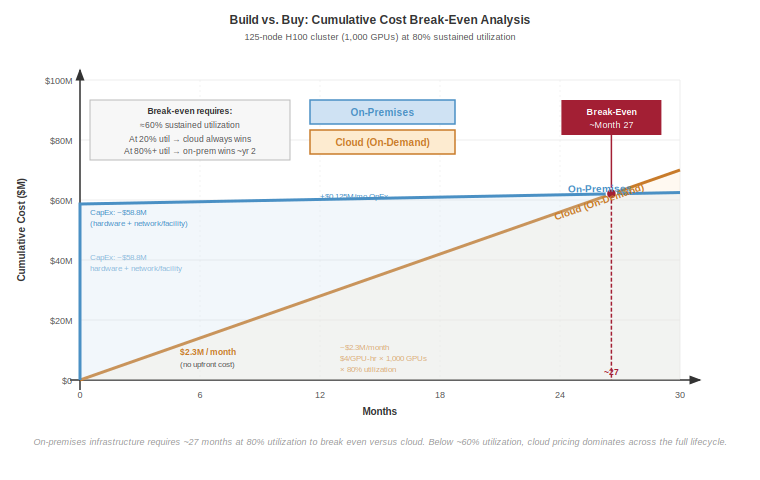
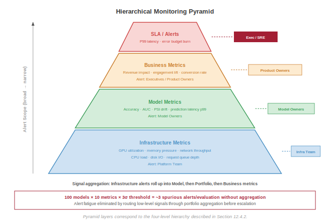
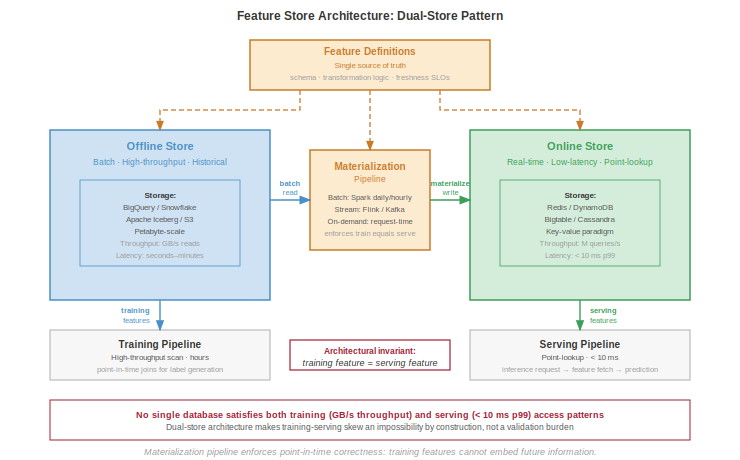

# ML Operations at Scale {#sec-ops-scale}

::: {layout-narrow}
::: {.column-margin}

\chapterminitoc

:::

\noindent
{fig-alt="Operations and production management at fleet scale."}

:::

## Purpose {.unnumbered}

\begin{marginfigure}
\mlfleetstack{25}{35}{100}{40}
\end{marginfigure}

_Why do practices that work for managing one model collapse when organizations deploy hundreds?_

One model is a project. A hundred models is a system of systems, where interactions, dependencies, and failures cascade in ways that per-model practices cannot anticipate or contain. A data pipeline change affects twelve models built by four teams, but no single team owns the impact assessment. A deployment failure requires coordinating rollbacks across interconnected services. Monitoring dashboards multiply until alert fatigue makes them useless. The practices that let a single team manage a single model (manual deployment, ad-hoc monitoring, spreadsheet tracking) become organizational liabilities at scale. MLOps at scale is the recognition that model management must become infrastructure: shared platforms with consistent APIs, automated pipelines that enforce quality gates, monitoring systems that aggregate signals across the fleet, and governance frameworks that track dependencies between artifacts nobody remembers creating. Without this infrastructure, organizations drown in operational complexity while their ML investments depreciate.

::: {.content-visible when-format="pdf"}

\newpage

:::

::: {.callout-learning-objectives}

- Calculate platform ROI to justify shared ML infrastructure investments across diverse model portfolios
- Design dependency-aware model registries that track versioning, lineage, and ensemble relationships across hundreds of models
- Implement CI/CD pipelines tailored to model risk profiles, from staged LLM rollouts to rapid fraud-detection deployment
- Architect hierarchical monitoring systems that aggregate signals across model fleets while preventing alert fatigue
- Quantify ML technical debt using deployment velocity, incident rates, and toil metrics to prioritize platform improvements
- Compare centralized, embedded, and hybrid organizational patterns for ML platform teams
- Evaluate feature store architectures that maintain freshness SLOs and point-in-time correctness at scale
- Apply the total cost of ownership framework to guide scale-stage investment

:::

```{python}
#| echo: false
from mlsysim import *
from mlsysim.core.constants import *
#| label: chapter-start
# ┌─────────────────────────────────────────────────────────────────────────────
# │ CHAPTER START
# ├─────────────────────────────────────────────────────────────────────────────
# │ Context: Chapter initialization and global imports
# │
# │ Why: Registers this chapter with the mlsys registry and provides shared
# │      imports for all subsequent calculation cells.
# │
# │ Imports: mlsysim.registry, mlsysim.constants, mlsysim.book
# │ Exports: (none)
# └─────────────────────────────────────────────────────────────────────────────
from mlsysim import Systems
from mlsysim.core.constants import (
    MILLION, BILLION, THOUSAND, HUNDRED, SEC_PER_HOUR, USD,
    HOURS_PER_DAY,
)
Systems.Nodes.DGX_H100.accelerators_per_node = Systems.Nodes.DGX_H100.accelerators_per_node
from mlsysim.fmt import fmt, check, MarkdownStr
```

The chapter's position in the book's organizing framework, the fleet stack, clarifies why operational management is not overhead but the control plane that keeps the physical and logical layers functioning as a coherent system.

::: {#psp-ops-scale-fleet-stack-connection .callout-perspective title="Fleet stack connection"}

We are now at the *Management Layer* of the fleet stack. While Parts I and II built the engine, and Part III deployed the service, this chapter provides the **control plane**\index{Control Plane}: the dashboard, steering, and maintenance systems that keep the entire fleet operational. Without this layer, the physical and logical layers below drift into chaos.

:::

## From Single-Model to Platform Operations {#sec-ml-operations-scale-singlemodel-platform-operations-db8e}

Consider a team of five engineers maintaining a single recommendation model. When the model drifts, they manually retrain it. When the API latency spikes, they manually scale the instances. Now, scale that same team to support five hundred models across dozens of product surfaces. Manual intervention is no longer merely inefficient; it is mathematically impossible. The transition from single-model to platform operations is fundamentally about replacing human-in-the-loop maintenance with automated, systemic governance.

@Sec-inference-scale established the distributed serving architectures that handle massive request volumes, and @sec-edge-intelligence pushed deployment to its physical limits: smartphones, microcontrollers, and federated fleets spanning billions of heterogeneous devices. The question now is what happens when organizations must sustain not one but hundreds of such systems across this entire spectrum. Managing individual models and operating enterprise-scale ML platforms are fundamentally different problems, separated by a phase transition in operational complexity.

Single-model MLOps focuses on continuous integration, deployment pipelines, and monitoring for individual models. The distinct challenges that emerge when organizations deploy tens, hundreds, or thousands of models across distributed infrastructure are qualitatively different. The practices that enable a single team to develop, deploy, and maintain one model become unsustainable at scale because they fail to account for the interactions, dependencies, and coordination requirements that characterize multi-model environments.

Every organization that successfully deploys machine learning at scale discovers this transition point through experience. The first few models can be managed with spreadsheets, manual deployments, and ad hoc monitoring. Each model team develops its own practices, optimized for their specific requirements. The approach works initially because the models operate independently: what happens to the recommendation system does not affect the fraud detection model.

Independence vanishes as model count grows. Models begin sharing data sources, and changes to upstream data pipelines cascade through multiple consumers. Infrastructure becomes contested: deployment of one model delays deployment of another. Monitoring dashboards multiply until no single team can observe the complete system state. On-call rotations expand from single-model responsibility to cross-model coordination that requires understanding interactions between systems developed by different teams with different assumptions.

Infrastructure efficiency compounds these coordination challenges. Production ML workloads rarely achieve high GPU utilization because training jobs run intermittently and inference loads fluctuate with user traffic. A single model team might accept 20 percent GPU utilization because optimizing further is not worth the engineering investment. Multiply by 100 models, and that underutilization represents millions of dollars in wasted infrastructure. Similarly, a single model's occasional production incident is manageable, but 100 models with independent failure modes produce a constant stream of alerts that exhaust on-call engineers and mask genuine emergencies.

The organizational response is platform thinking. Rather than treating each model as an independent system with its own infrastructure, platforms provide shared services that amortize operational costs across the entire model portfolio. Feature stores[^fn-feature-store-skew] eliminate redundant feature computation. Unified deployment pipelines ensure consistent rollout practices. Centralized monitoring aggregates signals across models to detect system-wide issues and enable capacity planning. The challenge is designing, implementing, and operating these platforms so they scale with the portfolio rather than against it.

[^fn-feature-store-skew]: **Feature Store**: A centralized repository that manages the computation, storage, and serving of ML features. The core systems problem feature stores solve is training-serving skew: when training and serving compute the same feature differently, model accuracy degrades silently because the model receives inputs it never trained on. At fleet scale, where hundreds of models share overlapping features, a single inconsistent computation path can cascade degradation across the entire portfolio. \index{Feature Store!training-serving skew}

### The N-models problem {#sec-ml-operations-scale-nmodels-problem-fcff}

A typical technology organization's journey with machine learning follows a predictable pattern. The first model might be a recommendation system for the homepage, followed by a search ranking model, then a fraud detection system, then content moderation. Each model team initially operates independently, developing bespoke pipelines for data processing, training, validation, and deployment. The absence of coordination overhead lets each team optimize for its specific requirements.

As the number of models grows, the problems that emerge are not *multiplicative* but *combinatorial*. One hundred models do not require 100 times the operational effort of one model; they introduce dependencies and interactions that create superlinear growth in operational complexity. @Tbl-ops-scale-complexity quantifies this growth across six operational dimensions, from deployment coordination that becomes critical path at scale to debugging complexity that demands distributed tracing across model boundaries.

| **Operational Aspect**         | **Single Model** | **10 Models**    | **100 Models**               |
|:-------------------------------|:-----------------|:-----------------|:-----------------------------|
| **Deployment coordination**    | None             | Ad hoc           | Critical path                |
| **Shared data dependencies**   | None             | Some overlap     | Dense graph                  |
| **Monitoring dashboards**      | 1                | 10               | Unmanageable                 |
| **On-call rotation scope**     | Single team      | Multiple teams   | Organization-wide            |
| **Infrastructure utilization** | Often idle       | Moderate sharing | Efficiency critical          |
| **Debugging complexity**       | Local            | Cross-team       | Distributed tracing required |

: **Operational Complexity Growth at Scale**\index{Operational Complexity Growth at Scale}: Six dimensions of operational complexity across 1, 10, and 100 models. Deployment coordination evolves from nonexistent to critical path, monitoring dashboards become unmanageable without aggregation, and debugging shifts from local investigation to organization-wide distributed tracing requirements. {#tbl-ops-scale-complexity}

```{python}
#| echo: false
#| label: multi-tenant-efficiency-notebook
# ┌─────────────────────────────────────────────────────────────────────────────
# │ MULTI-TENANT EFFICIENCY DIVIDEND (NOTEBOOK)
# ├─────────────────────────────────────────────────────────────────────────────
# │ Context: "The Sharing Dividend" .callout-notebook
# │
# │ Goal: Quantify the hardware savings from multi-tenant resource sharing.
# │ Show: cost_savings_pct ≈ 57%—inline in notebook result.
# │ How: Estimate savings from reducing idle dedicated capacity.
# │
# │ Imports: mlsysim.book (check)
# │ Exports: mt_idle_dedicated_str, mt_idle_shared_str, mt_savings_pct_str
# └─────────────────────────────────────────────────────────────────────────────
from mlsysim.fmt import check, fmt, fmt_int, MarkdownStr

class MultiTenantEfficiency:
    # ┌── 1. LOAD ──────────────────────────────────────────
    avg_util_dedicated = 0.30 # 70% idle (typical for single-team clusters)
    avg_util_shared = 0.70    # 30% idle (sharing across training/inference)
    n_gpus_required = 100
    gpu_cost_hour = 2.0 # $/hr
    annual_budget_m = 1.75
    # ┌── 2. EXECUTE ───────────────────────────────────────
    # For a fixed workload of 30 "active" GPU-hours:
    # Dedicated needs: 30 / 0.30 = 100 GPUs
    # Shared needs: 30 / 0.70 = 43 GPUs
    savings_pct = (1 - (avg_util_dedicated/avg_util_shared)) * 100
    annual_savings = annual_budget_m * (savings_pct / 100) * MILLION
    # ┌── 3. GUARD ─────────────────────────────────────────
    check(55 < savings_pct < 60, f"Savings {savings_pct:.1f}% unexpected")
    # ┌── 4. OUTPUT ────────────────────────────────────────
    # Non-numeric label strings → MarkdownStr per recipe Rule 1 escape-hatch
    mt_idle_dedicated_str = MarkdownStr("70%")
    mt_idle_shared_str = MarkdownStr("30%")
    mt_savings_pct_str = fmt(savings_pct, precision=1, commas=False, suffix=' percent')
    mt_n_gpus_str = fmt(n_gpus_required, precision=0, commas=False, suffix=' GPUs')
    mt_savings_pct_round_str = fmt_int(round(savings_pct), commas=False, suffix=' percent')
    mt_annual_budget_m_str = fmt(annual_budget_m, precision=2, commas=False)
    mt_annual_savings_str = fmt(annual_savings, precision=0)
```

::: {#nbk-ops-scale-sharing-dividend .callout-notebook title="The sharing dividend"}

**Problem**: A platform team manages a fleet of `{python} MultiTenantEfficiency.mt_n_gpus_str`. Under dedicated per-team quotas, average idle time is `{python} MultiTenantEfficiency.mt_idle_dedicated_str`. Moving to a multi-tenant ML platform that shares resources across teams and uses idle training GPUs for inference reduces aggregate idle time to `{python} MultiTenantEfficiency.mt_idle_shared_str`. What hardware cost does the platform save?

**Math**:
For a fixed active workload, required hardware is inverse to utilization, while useful work per GPU is proportional to utilization.

1. **Efficiency Gain**\index{Efficiency Gain}: 0.70 (Shared) / 0.30 (Dedicated) = 2.33$\times$ more work per GPU.
2. **Hardware Reduction**\index{Hardware Reduction}: 1 - (0.30/0.70) = `{python} MultiTenantEfficiency.mt_savings_pct_str`.
3. **Annual Savings**\index{Savings!annual}: `{python} MultiTenantEfficiency.mt_savings_pct_round_str` of \$`{python} MultiTenantEfficiency.mt_annual_budget_m_str`M budget $\approx$ \$`{python} MultiTenantEfficiency.mt_annual_savings_str`/year.

**Systems insight**: Multi-tenancy acts as an infrastructure multiplier. Breaking down resource silos reduces required hardware by 57 percent for the same workload; with the same hardware budget, it raises useful work from 30 to 70 active GPU-equivalents. In the machine learning fleet, *statistical multiplexing* (the principle that different teams' peak demands rarely coincide) is the mechanism that makes shared platforms economically sustainable. The platform team's primary role is to harvest this sharing dividend and reinvest it into future capacity growth.

:::

The fundamental insight is that per-model operational practices do not compose. When Model A depends on features computed by Pipeline B, which uses embeddings from Model C, changes to any component cascade unpredictably. A seemingly innocuous update to Model C's embedding layer might shift the feature distributions that Model A depends upon, degrading its performance even though Model A itself has not changed. This cascading interdependence turns scale into a qualitatively different management problem.

::: {#psp-ops-scale-complexity-explosion .callout-perspective title="The complexity explosion"}

Managing 100 models is not 100 times the work of managing 1 model. It is fundamentally different due to dependencies, interactions, and organizational complexity. As Jeff Dean observes, the challenge shifts from individual model optimization to system-level coordination where the interactions between models often matter more than the models themselves.

:::

@Fig-n-models-complexity visualizes this superlinear growth across three complexity dimensions. Monitoring alerts grow linearly with model count, but dependency conflicts grow quadratically as models share features, data sources, and infrastructure. The total operational load crosses team capacity around 50 models, the empirical threshold where organizations discover they need platform engineering.

::: {#fig-n-models-complexity fig-env="figure" fig-pos="htb" fig-cap="**The N-Models Complexity Explosion**: Monitoring alerts grow linearly with model count, deployment coordination grows as $\mathcal{O}(N_{\text{models}} \log N_{\text{models}})$, and dependency conflicts grow quadratically as models share features and data sources. The total operational load crosses team capacity around 50 models, marking the transition from artisanal model management to platform-required operations." fig-alt="Log-scale plot showing linear, model-count-log-model-count, and quadratic curves with total operational load crossing team capacity at 50 models, with Artisanal, Growing Pains, and Platform Required zones."}

```{python}
#| echo: false
# ┌─────────────────────────────────────────────────────────────────────────────
# │ N-MODELS COMPLEXITY (FIGURE)
# ├─────────────────────────────────────────────────────────────────────────────
# │ Context: @fig-n-models-complexity—operational complexity scaling
# │
# │ Goal: Plot linear, model-count-log-model-count, and quadratic curves; show total crossing capacity
# │       at ~50 models; Artisanal/Growing Pains/Platform Required zones.
# │ Show: Log-scale y; capacity threshold line; shaded regions.
# │ How: monitoring_alerts, deployment_coordination, dependency_conflicts;
# │      matplotlib.
# │
# │ Imports: matplotlib.pyplot (plt), numpy (np)
# │ Exports: (figure only, no prose variables)
# └─────────────────────────────────────────────────────────────────────────────
# ┌── 1. CANVAS ────────────────────────────────────────────────────────────────
# │ Plot linear, model-count-log-model-count, and quadratic curves; show total crossing capacity
import matplotlib.pyplot as plt
import numpy as np

plt.style.use('seaborn-v0_8-whitegrid')
fig, ax = plt.subplots(figsize=(10, 6))

# ┌── 2. ARRAYS ────────────────────────────────────────────────────────────────
n_models_axis = np.arange(1, 501)
monitoring_alerts = 20 * n_models_axis
deployment_coordination = n_models_axis * np.log(n_models_axis)
deployment_coordination[0] = 0
dependency_conflicts = 0.5 * n_models_axis**2

total_operational_load = monitoring_alerts + deployment_coordination + dependency_conflicts

# ┌── 3. RENDER ────────────────────────────────────────────────────────────────
ax.plot(n_models_axis, monitoring_alerts, label='Monitoring Alerts—linear', linestyle=':')
ax.plot(n_models_axis, deployment_coordination, label='Deployment Coordination—model count log model count', linestyle='--')
ax.plot(n_models_axis, dependency_conflicts, label='Dependency Conflicts—quadratic', linestyle='-.')
ax.plot(n_models_axis, total_operational_load, label='Total Operational Load', color='black', linewidth=3)

capacity_threshold = 2500
ax.axhline(y=capacity_threshold, color='crimson', linestyle='--', linewidth=2,
           label='Team Capacity Without Platform')

# ┌── 4. DECORATE ──────────────────────────────────────────────────────────────
ax.text(400, capacity_threshold+800,
        'Capacity Limit',
        color='crimson',
        va='center',
        ha='left')

ax.set_yscale('log')

ymin, ymax = ax.get_ylim()
text_y_pos = ymax * 0.3

ax.axvspan(1, 10, alpha=0.15, color='#3498db', ec='none')
ax.text(6.5,60000, 'Artisanal',
        ha='center',
        rotation=90,
        fontsize=10,
        style='italic',
        color='#2c3e50')

ax.axvspan(10, 50, alpha=0.15, color='#f39c12', ec='none')
ax.text(30, text_y_pos, 'Growing\n Pains',
        ha='center',
        fontsize=10,
        style='italic',
        color='#2c3e50')

ax.axvspan(50, 500, alpha=0.15, color='#e74c3c', ec='none')
ax.text(170, text_y_pos, 'Platform Required',
        ha='center',
        fontsize=10,
        style='italic',
        color='#2c3e50')

ax.set_title("The N-Models Complexity Explosion", fontsize=16, fontweight='bold')
ax.set_xlabel("Number of Models in Production", fontsize=12)
ax.set_ylabel("Operational Complexity (Log Scale)", fontsize=12)
ax.set_xlim(1, 500)
ax.set_ylim(bottom=10)

plt.legend(
    loc='lower right',
    fontsize=8,
    frameon=True,
    facecolor='white',
    framealpha=0.95,
    edgecolor='gray',
    fancybox=True,
    borderpad=0.6
)

plt.tight_layout()
fig = plt.gcf()
```

:::

### Quantifying platform economics {#sec-ml-operations-scale-quantifying-platform-economics-2026}

The economic case for platform operations rests on understanding both the costs of fragmented approaches and the returns from shared infrastructure. @Eq-platform-roi formalizes platform return on investment as the ratio of engineering time savings across all models to total platform cost:

$$\text{ROI}_{\text{platform}} = \frac{N_{\text{models}} \times T_{\text{saved}} \times C_{\text{engineer}}}{C_{\text{platform}}}$$ {#eq-platform-roi}

where $N_{\text{models}}$ represents the number of models benefiting from the platform, $T_{\text{saved}}$ is the engineering time saved per model per period, $C_{\text{engineer}}$ is the fully-loaded cost per engineer hour, and $C_{\text{platform}}$ is the total platform cost including development, infrastructure, and maintenance.

The equation reveals why platform investments make sense only at sufficient scale. For a small organization with five models, the denominator might exceed the numerator even with significant per-model savings. As model count grows, the numerator scales linearly with $N_{\text{models}}$ while platform costs grow much more slowly, typically sublinearly due to infrastructure amortization.

```{python}
#| echo: false
#| label: platform-roi-notebook
# ┌─────────────────────────────────────────────────────────────────────────────
# │ PLATFORM ROI (NOTEBOOK)
# ├─────────────────────────────────────────────────────────────────────────────
# │ Context: "The Platform Dividend" .callout-notebook
# │
# │ Goal: Quantify the ROI of building a centralized ML platform.
# │ Show: roi_ratio ≈ 1.25x—inline in notebook result.
# │ How: Compute platform ROI from model count, saved engineering time, engineer rate, and platform cost.
# │
# │ Imports: mlsysim.book (check)
# │ Exports: pr_n_models_str, pr_savings_h_str, pr_roi_ratio_str
# └─────────────────────────────────────────────────────────────────────────────
from mlsysim.fmt import check, fmt

class PlatformRoi:
    # ┌── 1. LOAD ──────────────────────────────────────────
    n_models = 50
    savings_h_per_month = 20 # Engineering time saved per model
    engineer_rate = 150 # $/hr
    platform_cost_per_month = 120000 # Platform team + infra
    # ┌── 2. EXECUTE ───────────────────────────────────────
    total_savings = n_models * savings_h_per_month * engineer_rate
    roi_ratio = total_savings/platform_cost_per_month
    # ┌── 3. GUARD ─────────────────────────────────────────
    check(roi_ratio == 1.25, f"ROI {roi_ratio} unexpected")
    # ┌── 4. OUTPUT ────────────────────────────────────────
    pr_n_models_str = fmt(n_models, precision=0, commas=False)
    pr_savings_h_str = fmt(savings_h_per_month, precision=0, commas=False, suffix=' hours')
    pr_roi_ratio_str = fmt(roi_ratio, precision=2, commas=False)
    pr_platform_cost_str = fmt(platform_cost_per_month, precision=0)
    pr_gross_savings_str = fmt(total_savings, precision=0)
    pr_net_benefit_str = fmt(total_savings - platform_cost_per_month, precision=0)
```

::: {#nbk-ops-scale-platform-dividend .callout-notebook title="The platform dividend"}

**Problem**: An organization manages `{python} PlatformRoi.pr_n_models_str` models. A centralized ML Platform team costs \$`{python} PlatformRoi.pr_platform_cost_str`/month. If the platform saves each model team `{python} PlatformRoi.pr_savings_h_str` of manual toil per month, is the platform investment profitable?

**Math**:

1. **Gross Monthly Savings**\index{Gross Monthly Savings}: `{python} PlatformRoi.pr_n_models_str` models $\times$ `{python} PlatformRoi.pr_savings_h_str`/model $\times$ \$150/hr = \$`{python} PlatformRoi.pr_gross_savings_str`.
2. **Net Monthly Benefit**\index{Net Monthly Benefit}: \$`{python} PlatformRoi.pr_gross_savings_str` (Savings) - \$`{python} PlatformRoi.pr_platform_cost_str` (Cost) = \$`{python} PlatformRoi.pr_net_benefit_str`.
3. **ROI Ratio**\index{ROI Ratio}: \$`{python} PlatformRoi.pr_gross_savings_str` / \$`{python} PlatformRoi.pr_platform_cost_str` = `{python} PlatformRoi.pr_roi_ratio_str`.

**Systems insight**: Platforms exhibit a scaling threshold. At 50 models, this platform earns a 25 percent return on its cost. However, if the organization only had 20 models, the savings would be only \$60,000—a 50 percent loss on the platform team's salary. In MLOps, platform engineering is a fixed cost that pays off through variable savings. The right time to build a platform is when the "manual toil tax" across the model fleet exceeds the "platform maintenance tax."

:::

#### From artisanal to industrial operations {#sec-ml-operations-scale-artisanal-to-industrial-operations-092d}

```{python}
#| echo: false
#| label: platform-economics-lego
# │ PLATFORM ROI CALCULATION (LEGO)
# ├─────────────────────────────────────────────────────────────────────────────
# │ Context: @sec-ml-operations-scale-quantifying-platform-economics-2026
# │
# │ Goal: Estimate platform ROI for a 50-model ML fleet to show that shared
# │       infrastructure reduces annual operational engineering costs by >56%
# │       and pays for itself within the first year.
# │ Show: ~$2.03M annual savings (~56% reduction)—inline in the worked
# │       example paragraph following @eq-platform-roi.
# │ How: Compare before-platform cost (50 models × 40 hrs/month × $150/hr)
# │      against after-platform cost (10 hrs/model/month + $667K/yr amort)
# │      using the ROI formula from @eq-platform-roi.
# │
# │ Imports: mlsysim.core.constants (MILLION), mlsysim.book (fmt, check)
# │ Exports: annual_savings_str, savings_pct_str, annual_cost_before_str,
# │          annual_cost_after_str
# └─────────────────────────────────────────────────────────────────────────────

# ┌── LEGO ───────────────────────────────────────────────
class PlatformEconomics:
    """
    Namespace for Platform ROI Calculation.
    Scenario: Comparing manual operations vs. shared platform costs.
    """

    # ┌── 1. LOAD (Constants) ───────────────────────────────────────────────
    from mlsysim.core.constants import ureg, MILLION
    n_models = 50
    hours_per_model_month = 40
    months_per_year = 12
    engineer_cost_hr = 150
    platform_cost = 2 * MILLION
    amortization_years = 3
    hours_saved_per_model = 30

    # ┌── 2. EXECUTE (The Compute) ─────────────────────────────────────────
    # Step 1: Before platform
    annual_cost_before_val = n_models * hours_per_model_month * months_per_year * engineer_cost_hr

    # Step 2: After platform
    hours_after = hours_per_model_month - hours_saved_per_model  # 10 hrs/model/month
    annual_ops_after = n_models * hours_after * months_per_year * engineer_cost_hr
    annual_platform_amort = platform_cost/amortization_years
    annual_cost_after_val = annual_ops_after + annual_platform_amort

    # Step 3: Savings
    annual_savings = annual_cost_before_val - annual_cost_after_val
    savings_pct = (annual_savings/annual_cost_before_val) * 100

    # ┌── 3. GUARD (Invariants) ───────────────────────────────────────────
    from mlsysim.fmt import check
    check(annual_savings > 0, "Platform must generate savings.")
    check(savings_pct > 50, f"Expected >50% savings, got {savings_pct:.1f}%")

    # ┌── 4. OUTPUT (Formatting) ──────────────────────────────────────────────
    from mlsysim.fmt import fmt
    annual_cost_before_str = fmt(annual_cost_before_val, precision=0)
    annual_cost_after_str = fmt(annual_cost_after_val, precision=1)
    annual_savings_str = fmt(annual_savings, precision=1)
    savings_pct_str = fmt(savings_pct, precision=1, commas=False, suffix=' percent')
```

Consider an organization evaluating whether to build a centralized ML platform. Current state:

- 50 production models across 8 teams
- Each model requires 40 engineer-hours monthly for operational tasks
- Engineers cost \$150 per hour fully loaded
- Platform development cost: \$2 million amortized over 3 years
- Expected time savings: 30 hours per model per month postplatform

Before platform (annual operational cost):

$C_{\text{current}} = 50 \times 40 \times 12 \times 150 =$ USD `{python} PlatformEconomics.annual_cost_before_str`

After platform (annual operational cost plus amortized platform cost):

$C_{\text{after}} = 50 \times 10 \times 12 \times 150 + \frac{2{,}000{,}000}{3} = 900{,}000 + 666{,}667 =$ USD `{python} PlatformEconomics.annual_cost_after_str`

Annual savings reach \$`{python} PlatformEconomics.annual_savings_str`, a `{python} PlatformEconomics.savings_pct_str` reduction in operational costs. The platform pays for itself within the first year.

The economic gap explains why large technology companies have invested heavily in ML platforms while smaller organizations often struggle to justify similar investments. The economic threshold typically falls between 20 and 50 models, depending on model complexity and organizational structure.

@Fig-platform-roi-threshold visualizes this threshold effect by plotting platform ROI as a function of model count for two platform cost levels. A \$2M/year platform breaks even at approximately 20 models, while a more expensive \$5M/year enterprise platform requires roughly 50 models to justify the investment. Beyond break-even, ROI grows linearly because each additional model contributes the same per-model savings to the numerator of @eq-platform-roi while platform costs remain essentially fixed. At 100 models, the \$2M platform delivers 5$\times$ return on investment. This linearity is both the economic argument for platform investment and the explanation for why organizations that defer platform building until they are "at scale" often find themselves paralyzed by accumulated operational debt: the break-even point arrives earlier than intuition suggests.

::: {#fig-platform-roi-threshold fig-env="figure" fig-pos="htb" fig-cap="**The Platform ROI Threshold**: Platform return on investment as a function of model count, for two platform cost levels. A \$2M/year platform breaks even at approximately 20 models, while a \$5M/year enterprise platform requires roughly 50 models. Beyond break-even, ROI grows linearly—at 100 models, the \$2M platform delivers 5× return." fig-alt="Line chart showing platform ROI vs. model count with break-even points for two cost levels"}

```{python}
#| echo: false
# ┌─────────────────────────────────────────────────────────────────────────────
# │ PLATFORM ROI THRESHOLD (FIGURE)
# ├─────────────────────────────────────────────────────────────────────────────
# │ Context: @fig-platform-roi-threshold—platform economics
# │
# │ Goal: Plot ROI = (model_count * savings) / platform_cost vs model_count; show break-even at
# │       ~20 models ($2M) and ~50 models ($5M).
# │ Show: Two ROI curves; break-even line; shaded investment/returns phases.
# │ How: Compute platform ROI across model counts; viz.setup_plot().
# │
# │ Imports: numpy (np), matplotlib.pyplot (plt), mlsysim.core.viz (viz)
# │ Exports: (figure only, no prose variables)
# └─────────────────────────────────────────────────────────────────────────────
# ┌── 1. CANVAS ────────────────────────────────────────────────────────────────
# │ Plot ROI = (model_count * savings) / platform_cost vs model_count; show break-even at
import numpy as np
import matplotlib.pyplot as plt
from mlsysim import viz

fig, ax, COLORS, plt = viz.setup_plot(figsize=(9, 5.5))

# ┌── 2. ARRAYS ────────────────────────────────────────────────────────────────
n_models = np.arange(1, 501)

# Per-model savings: 0.5 FTE * $200K/FTE = $100K/year per model
savings_per_model = 100_000  # $100K/year

# Platform A: $2M/year
platform_cost_a = 2_000_000
roi_a = (n_models * savings_per_model) / platform_cost_a
breakeven_a = platform_cost_a/savings_per_model  # 20 models

# Platform B: $5M/year (enterprise)
platform_cost_b = 5_000_000
roi_b = (n_models * savings_per_model) / platform_cost_b
breakeven_b = platform_cost_b/savings_per_model  # 50 models

# Plot ROI curves

# ┌── 3. RENDER ────────────────────────────────────────────────────────────────
ax.plot(n_models, roi_a, color=COLORS["BlueLine"], linewidth=2.5,
        label="$2M/year platform")
ax.plot(n_models, roi_b, color=COLORS["OrangeLine"], linewidth=2.5,
        label="$5M/year enterprise platform")

# Break-even line at ROI = 1
ax.axhline(y=1.0, color=COLORS["primary"], linestyle="--", linewidth=1.5, alpha=0.6)

# ┌── 4. DECORATE ──────────────────────────────────────────────────────────────
ax.text(480, 1.15, "Break-even (ROI = 1)", fontsize=8,
        color=COLORS["primary"], ha="right", va="bottom")

# Shade investment phase (below ROI=1) and returns phase (above)
ax.fill_between(n_models, 0, np.minimum(roi_a, 1.0), alpha=0.08, color=COLORS["RedLine"])
ax.fill_between(n_models, 1.0, np.maximum(roi_a, 1.0), alpha=0.08, color=COLORS["GreenLine"])

# Mark break-even points
ax.plot(breakeven_a, 1.0, "o", color=COLORS["BlueLine"], markersize=10, zorder=5)
ax.annotate(f"Break-even at\n~{int(breakeven_a)} models",
            xy=(breakeven_a, 1.0), fontsize=8,
            color=COLORS["BlueLine"], fontweight="bold",
            ha="left", va="bottom",
            xytext=(breakeven_a -11, 3.8),
            arrowprops=dict(arrowstyle="->",
                            color=COLORS["BlueLine"],
                            lw=0.75,
                            shrinkB=5))

ax.plot(breakeven_b, 1.0, "o", color=COLORS["OrangeLine"], markersize=10, zorder=5)
ax.annotate(f"Break-even at\n~{int(breakeven_b)} models",
            xy=(breakeven_b, 1.10), fontsize=8,
            color=COLORS["OrangeLine"], fontweight="bold",
            ha="left", va="bottom",
            xytext=(breakeven_b + 38, 3.0),
            arrowprops=dict(arrowstyle="->",
                            color=COLORS["OrangeLine"],
                            shrinkB=5,
                            lw=0.75))

# Annotate the ROI at 100 models for platform A
roi_at_100 = (100 * savings_per_model) / platform_cost_a
ax.annotate(f"100 models: {roi_at_100:.0f}× ROI",
            xy=(100, roi_at_100), fontsize=8,
            color=COLORS["BlueLine"], fontweight="bold",
            ha="left", va="bottom",
            xytext=(70, roi_at_100 + 3.0),
            arrowprops=dict(arrowstyle="->", color=COLORS["BlueLine"], lw=1.0))

# Region labels
ax.text(310, 0.45, "Investment phase", fontsize=9, color=COLORS["RedLine"],
        fontweight="bold", ha="center", va="center", alpha=0.8)

ax.text(310, 12, "Returns phase", fontsize=9, color=COLORS["GreenLine"],
        fontweight="bold", ha="center", va="center", alpha=0.8)

ax.set_xlabel("Number of Production Models")
ax.set_ylabel("Platform ROI (ratio)")
ax.set_xlim(0, 500)
ax.set_ylim(0, 25)
plt.legend(
    loc='upper left',
    fontsize=8,
    frameon=True,
    facecolor='white',
    framealpha=0.95,
    edgecolor='gray',
    fancybox=True,
    borderpad=0.6
)

plt.tight_layout()
plt.show()
```

:::

::: {#chk-ops-scale-platform-roi .callout-checkpoint title="Platform ROI break-even"}

@Eq-platform-roi expresses platform return on investment as $N_{\text{models}} \times T_{\text{saved}} \times C_{\text{engineer}} / C_{\text{platform}}$. @Fig-platform-roi-threshold shows two cost curves and the linear ROI growth past break-even. Apply the formula to two concrete decisions.

- [ ] At an organization with 30 models, each saving 200 engineer-hours per year at \$150/hour, what is the ROI of a \$2M/year platform? What is the ROI of a \$5M/year enterprise platform?
- [ ] Using the same per-model savings (\$30K/year, which is 200 hours at \$150/hour), at what model count does each platform break even? How does this compare to the rule-of-thumb 20 and 50 in @fig-platform-roi-threshold, and what implicit per-model savings does the figure assume?
- [ ] Your organization currently has 8 models and is debating whether to build a \$2M/year platform. Given the linear ROI structure of @eq-platform-roi past break-even, what is the strongest argument for building now versus waiting until the model count crosses break-even, and what assumption about future growth must hold for that argument?

:::

Platform ROI is one lever; the cost of individual training runs and the capacity decisions that follow are another.

### Capacity planning and cost of training {#sec-ml-operations-scale-capacity-planning-cost-training}

```{python}
#| echo: false
#| label: training-capacity-cost-lego
# ┌─────────────────────────────────────────────────────────────────────────────
# │ TRAINING CAPACITY COST (LEGO)
# ├─────────────────────────────────────────────────────────────────────────────
# │ Context: @sec-ml-operations-scale-capacity-planning-cost-training
# │
# │ Goal: Compute the direct GPU-hour cost of an illustrative 30-day H100 run.
# │ Show: 2,048 GPUs and ~$2.95M direct GPU cost inline in the paragraph below.
# │ How: Multiply GPU count, training duration, and GPU-hour rate.
# │
# │ Imports: mlsysim.core.constants (MILLION), mlsysim.book (check)
# │ Exports: n_gpus_str, gpu_hour_rate_str, training_cost_m_str
# └─────────────────────────────────────────────────────────────────────────────

class TrainingCapacityCost:
    # ┌── 1. LOAD ───────────────────────────────────────────────────────────
    n_nodes = 256
    gpus_per_node = Systems.Nodes.DGX_H100.accelerators_per_node
    training_days = 30
    hours_per_day = HOURS_PER_DAY
    gpu_hour_rate = 2.00

    # ┌── 2. EXECUTE ───────────────────────────────────────────────────────
    n_gpus = n_nodes * gpus_per_node
    training_cost = n_gpus * training_days * hours_per_day * gpu_hour_rate

    # ┌── 3. GUARD ─────────────────────────────────────────────────────────
    check(n_gpus == 2048, f"Expected 2,048 GPUs, got {n_gpus}")
    check(2.9 * MILLION < training_cost < 3.0 * MILLION,
          f"Unexpected training cost ${training_cost:,.0f}")

    # ┌── 4. OUTPUT ────────────────────────────────────────────────────────
    n_gpus_str = fmt(n_gpus, precision=0, suffix=' GPUs')
    gpu_hour_rate_str = fmt(gpu_hour_rate, precision=0, commas=False)
    training_cost_m_str = fmt(training_cost / MILLION, precision=2, commas=False)
```

Capacity planning for large-scale ML is fundamentally an exercise in optimizing the economics of the GPU-hour. For our running example, a 30-day training run on a 256-node H100 cluster (`{python} TrainingCapacityCost.n_gpus_str`) at an illustrative market rate of USD `{python} TrainingCapacityCost.gpu_hour_rate_str` per GPU-hour represents a direct investment of roughly USD `{python} TrainingCapacityCost.training_cost_m_str` million. At this scale, the cost per training run $(C_{\text{run}})$ becomes a primary design lever that dictates the sizing of the entire fleet. We must balance the desire for faster time-to-market (scaling to more GPUs) against the diminishing returns of large-scale parallelism and the increased probability of hardware failure. Total cost is not merely a function of compute time; it must account for the overhead of data staging, checkpointing, and the inevitable cost of recovery from interruptions (@sec-fault-tolerance-reliability).

The drive for efficiency forces us to treat capacity as a dynamic resource rather than a static allocation. Organizations must decide when to invest in additional permanent capacity (buying more nodes for the data center) vs. when to optimize the existing fleet's utilization through better orchestration or model optimization. This decision is increasingly linked to the environmental cost of training, as the energy required to power thousands of GPUs for months carries a significant carbon footprint. We thus link capacity planning directly to our sustainability goals (@sec-sustainable-ai), where we calculate the carbon intensity of each training run alongside its financial cost. By quantifying these trade-offs, we transform capacity planning from a purely operational task into a strategic lever that balances performance, budget, and responsible engineering.

Cost visibility also sharpens the case for paying down technical debt: the same metrics that reveal runaway training costs expose the hidden cost of unversioned data, brittle pipelines, and manual toil.

### Quantifying and managing ML technical debt {#sec-ml-operations-scale-quantifying-managing-ml-technical-debt-9055}

ML technical debt falls into four primary categories (data, configuration, model, and infrastructure debt), each requiring quantitative measurement at platform scale.

```{python}
#| echo: false
#| label: maintenance-dividend-notebook
# ┌─────────────────────────────────────────────────────────────────────────────
# │ MAINTENANCE DIVIDEND (NOTEBOOK)
# ├─────────────────────────────────────────────────────────────────────────────
# │ Context: "The Maintenance Dividend" .callout-notebook
# │
# │ Goal: Quantify the long-term cost of technical debt vs proactive maintenance.
# │ Show: savings_ratio ≈ 3.2x—inline in notebook result.
# │ How: Compare years of toil cost against one-time setup plus lower ongoing toil.
# │
# │ Imports: mlsysim.book (check)
# │ Exports: md_toil_hours_str, md_low_toil_str, md_savings_ratio_str
# └─────────────────────────────────────────────────────────────────────────────
from mlsysim.fmt import check, fmt

class MaintenanceDividend:
    # ┌── 1. LOAD ──────────────────────────────────────────
    toil_h_per_month = 40 # manual monitoring, data cleaning, broken scripts
    low_toil_h_per_month = 8 # after platform automation
    maintenance_investment_h = 160 # engineering time to fix "plumbing"
    years = 3
    engineer_rate = 150 # $/hr
    # ┌── 2. EXECUTE ───────────────────────────────────────
    months = years * 12
    cost_toil = months * toil_h_per_month * engineer_rate
    cost_proactive = (maintenance_investment_h + (months * low_toil_h_per_month)) * engineer_rate
    savings = cost_toil - cost_proactive
    ratio = cost_toil/cost_proactive
    # ┌── 3. GUARD ─────────────────────────────────────────
    check(3 < ratio < 4, f"Ratio {ratio:.1f} unexpected")
    # ┌── 4. OUTPUT ────────────────────────────────────────
    md_toil_hours_str = fmt(toil_h_per_month, precision=0, commas=False, suffix=' hours')
    md_low_toil_str = fmt(low_toil_h_per_month, precision=0, commas=False, suffix=' hours')
    md_savings_ratio_str = fmt(ratio, precision=1, commas=False)
    md_maintenance_investment_str = fmt(maintenance_investment_h, precision=0, commas=False, suffix=' hours')
    md_years_str = fmt(years, precision=0, commas=False, suffix=' years')
    md_months_str = fmt(months, precision=0, commas=False, suffix=' months')
    md_cost_toil_str = fmt(cost_toil, precision=0, commas=False)
    md_cost_proactive_str = fmt(cost_proactive, precision=0, commas=False)
    md_net_savings_str = fmt(savings, precision=0, commas=False)
```

::: {#nbk-ops-scale-maintenance-dividend .callout-notebook title="The maintenance dividend"}

**Problem**: A team spends `{python} MaintenanceDividend.md_toil_hours_str`/month manually fixing "broken plumbing" (stale data, failed scripts, manual monitoring). A one-month intensive cleanup (`{python} MaintenanceDividend.md_maintenance_investment_str`) is projected to reduce this to `{python} MaintenanceDividend.md_low_toil_str`/month. Is the cleanup worth it over a `{python} MaintenanceDividend.md_years_str`-year model lifecycle?

**Math**:

1. **Status quo (`{python} MaintenanceDividend.md_years_str`)**: `{python} MaintenanceDividend.md_months_str` $\times$ `{python} MaintenanceDividend.md_toil_hours_str`/month $\times$ \$150/hr = \$`{python} MaintenanceDividend.md_cost_toil_str`.
2. **Proactive Path**\index{Proactive Path}: (`{python} MaintenanceDividend.md_maintenance_investment_str` investment + `{python} MaintenanceDividend.md_months_str` $\times$ `{python} MaintenanceDividend.md_low_toil_str`/month) $\times$ \$150/hr = \$`{python} MaintenanceDividend.md_cost_proactive_str`.
3. **Net Savings**\index{Savings!net}: \$`{python} MaintenanceDividend.md_cost_toil_str` - \$`{python} MaintenanceDividend.md_cost_proactive_str` = \$`{python} MaintenanceDividend.md_net_savings_str`.
4. **Dividend ratio**: `{python} MaintenanceDividend.md_savings_ratio_str`$\times$.

**Systems insight**: Proactive maintenance reduces total cost by a factor of `{python} MaintenanceDividend.md_savings_ratio_str`$\times$ over the model lifecycle. In the ML Fleet, "Plumbing" is more important than "Pipes": an organization that ignores technical debt eventually spends its entire budget just keeping old models alive, leaving zero capacity for new development. The most successful teams treat refactoring as a high-yield investment, not a distraction.

:::

Moving beyond awareness to action requires frameworks for measuring and prioritizing debt paydown across a portfolio of models. Technical debt manifests in measurable operational symptoms that directly impact platform velocity and reliability.

#### Debt categories and measurement {#sec-ml-operations-scale-debt-categories-measurement-6b29}

Data debt encompasses unstable data dependencies, lack of versioning, and missing quality monitoring. Measurement approaches include counting data incidents per month, tracking manual intervention frequency in data pipelines, and measuring the percentage of features without automated validation. Organizations with high data debt typically experience more than 10 data incidents monthly and require manual intervention on over 30 percent of pipeline runs.

Configuration debt includes ad-hoc configuration files, absent validation, and duplication across models. Measurement approaches include configuration-related deployment failures per 100 deployments, lines of configuration per model, and percentage of config parameters without validation. A model requiring more than 500 lines of unvalidated configuration likely carries significant configuration debt.

Model debt manifests as glue code connecting components, undeclared consumers of model outputs, and tangled serving paths. Measurement approaches include coupling scores computed from the dependency graph, number of undocumented model consumers, and median time to trace a prediction through the serving path. High model debt is indicated by more than 20 percent of engineering time spent maintaining glue code.

Infrastructure debt appears in brittle pipelines, manual deployment procedures, and inconsistent environments. Measurement approaches include toil hours per week on manual operational tasks, deployment automation coverage percentage, and environment drift incidents. Organizations spending more than 50 percent of platform engineering capacity on toil carry substantial infrastructure debt.

#### Quantification metrics {#sec-ml-operations-scale-quantification-metrics-904f}

Four metrics quantify technical debt impact.

Deployment velocity measures time from code commit to production deployment. Healthy baselines include less than one day for inference code changes and less than one week for training code changes. Deployment times exceeding two weeks indicate configuration complexity, brittle dependencies, or inadequate automation.

Incident rate counts production incidents per 1000 deployments. The healthy baseline is fewer than 5 incidents per 1000 deployments. Rates exceeding 20 incidents indicate technical debt in testing, validation, or deployment procedures.

Toil percentage quantifies engineer hours per week on manual operational tasks as percentage of team capacity. The healthy baseline is less than 20 percent of capacity on toil. Exceeding 50 percent indicates automation debt that prevents the team from improving the platform.

Dependency staleness measures percentage of dependencies more than two major versions behind current releases. The healthy baseline is less than 10 percent stale dependencies. Exceeding 30 percent indicates accumulated upgrade debt that increases security risk and limits access to performance improvements.

#### Worked example: ML debt audit and prioritization {#sec-ml-operations-scale-worked-example-ml-debt-audit-prioritization-0e34}

An ML platform team supporting 40 production models with 15 engineers faces deployment velocity problems. New models require 6 weeks to reach production, frustrating both platform and model teams.

**Analysis**:

##### Configuration debt {#sec-ml-operations-scale-configuration-debt-9cfe}

- Symptom: Each model has custom YAML (YAML Ain't Markup Language) configuration files averaging 847 lines with no validation schema
- Impact metric: 35 percent of deployment delays result from configuration errors caught late
- Technical measure: Manual config review required for every deployment
- Estimated cost: 12 engineer-hours per deployment $\times$ 80 deployments/year = 960 hours annually

##### Pipeline glue code debt {#sec-ml-operations-scale-pipeline-glue-code-debt-1e31}

- Symptom: Data preprocessing uses 23 different scripts with 62 percent code duplication
- Impact metric: 12 engineer-hours per week debugging pipeline breaks
- Technical measure: No shared preprocessing library, each team implements custom logic
- Estimated cost: 12 hours/week $\times$ 52 weeks = 624 hours annually

##### Monitoring debt {#sec-ml-operations-scale-monitoring-debt-8b27}

- Symptom: Each model uses ad-hoc monitoring, no unified observability platform
- Impact metric: Mean time to detect (MTTD) incidents is 4.2 hours
- Technical measure: 23 different monitoring approaches across 40 models
- Estimated cost: Extended incident duration costs \$50K per incident $\times$ 15 incidents/year = \$750K annually

**Approach**:

Using a three-criterion scoring system (impact severity, frequency, and resolution cost), each scored 1 to 3, @tbl-debt-prioritization-scoring ranks the three debt categories observed earlier. Higher impact and frequency raise priority; higher resolution cost lowers it.

```{python}
#| echo: false
#| label: debt-priority-lego
# ┌─────────────────────────────────────────────────────────────────────────────
# │ DEBT PRIORITY SCORING (LEGO)
# ├─────────────────────────────────────────────────────────────────────────────
# │ Context: @sec-ml-operations-scale-worked-example-ml-debt-audit-prioritization-0e34
# │
# │ Goal: Compute Impact x Frequency / Resolution-Cost scores for three debt
# │       categories in the worked prioritization table.
# │ Show: configuration = 4.5, monitoring = 3.0, pipeline glue = 1.3.
# │ How: Debt Score = Impact * Frequency / Resolution Cost, where higher
# │      resolution_cost means slower/more expensive remediation.
# │
# │ Imports: mlsysim.book (check)
# │ Exports: config_score_str, monitoring_score_str, pipeline_score_str,
# │          weeks_saved_str, config_savings_str
# └─────────────────────────────────────────────────────────────────────────────

class DebtPriority:
    # ┌── 1. LOAD ───────────────────────────────────────────────────────────
    config_impact = 3
    config_frequency = 3
    config_resolution_cost = 2

    monitoring_impact = 3
    monitoring_frequency = 2
    monitoring_resolution_cost = 2

    pipeline_impact = 2
    pipeline_frequency = 2
    pipeline_resolution_cost = 3

    deployment_delay_weeks = 6
    eliminated_delay_fraction = 0.35
    models_per_year = 40
    hours_per_week = 40
    engineer_rate = 150

    # ┌── 2. EXECUTE ───────────────────────────────────────────────────────
    config_score = config_impact * config_frequency / config_resolution_cost
    monitoring_score = monitoring_impact * monitoring_frequency / monitoring_resolution_cost
    pipeline_score = pipeline_impact * pipeline_frequency / pipeline_resolution_cost

    weeks_saved = deployment_delay_weeks * eliminated_delay_fraction * models_per_year
    config_savings = weeks_saved * hours_per_week * engineer_rate

    # ┌── 3. GUARD ─────────────────────────────────────────────────────────
    check(config_score > monitoring_score > pipeline_score,
          "Debt priority ordering changed unexpectedly")
    check(abs(weeks_saved - 84) < 1e-9, f"Expected 84 weeks saved, got {weeks_saved}")

    # ┌── 4. OUTPUT ────────────────────────────────────────────────────────
    config_score_str = fmt(config_score, precision=1, commas=False)
    monitoring_score_str = fmt(monitoring_score, precision=0, commas=False)
    pipeline_score_str = fmt(pipeline_score, precision=1, commas=False)
    weeks_saved_str = fmt(weeks_saved, precision=0, commas=False, suffix=' weeks')
    config_savings_str = fmt(config_savings / THOUSAND, precision=0, commas=False, suffix="K")
    deployment_delay_weeks_str = fmt(deployment_delay_weeks, precision=0, commas=False, suffix=' weeks')
    eliminated_delay_pct_str = fmt(eliminated_delay_fraction * 100, precision=0, commas=False, suffix=' percent')
    delay_per_model_weeks_str = fmt(deployment_delay_weeks * eliminated_delay_fraction, precision=1, commas=False, suffix=' weeks')
    models_per_year_str = fmt(models_per_year, precision=0, commas=False)
    payback_months_str = fmt(2, precision=0, commas=False, suffix=' months')
```

| **Debt Category** | **Impact** | **Frequency** | **Resolution Cost** |                              **Total Score** | **Priority** |
|:------------------|-----------:|--------------:|--------------------:|---------------------------------------------:|-------------:|
| **Configuration** |   3 (High) |     3 (Daily) | 2 (Medium: 6 weeks) |     `{python} DebtPriority.config_score_str` |      **1st** |
| **Monitoring**    |   3 (High) |    2 (Weekly) | 2 (Medium: 8 weeks) | `{python} DebtPriority.monitoring_score_str` |      **2nd** |
| **Pipeline Glue** | 2 (Medium) |    2 (Weekly) |  3 (High: 16 weeks) |   `{python} DebtPriority.pipeline_score_str` |      **3rd** |

: **Debt Prioritization Scoring**: Three-criterion scoring (impact severity, frequency, and resolution cost) applied to three observed debt categories. Scores use $\text{Impact} \times \text{Frequency} / \text{Resolution Cost}$, so slower or more expensive fixes are penalized. Configuration debt scores highest, justifying first-priority remediation. {#tbl-debt-prioritization-scoring}

**Recommendation**: Prioritize configuration debt paydown. Build configuration schema validation and templating system.

**Result**: `{python} DebtPriority.deployment_delay_weeks_str` engineering investment to build config system. Saves `{python} DebtPriority.eliminated_delay_pct_str` of deployment delays = `{python} DebtPriority.delay_per_model_weeks_str` per model $\times$ `{python} DebtPriority.models_per_year_str` models/year = `{python} DebtPriority.weeks_saved_str` of deployment time saved. At \$150/hour engineer cost, `{python} DebtPriority.weeks_saved_str` = \$`{python} DebtPriority.config_savings_str` annual savings. Investment pays back within `{python} DebtPriority.payback_months_str`.

#### Decision framework {#sec-ml-operations-scale-decision-framework-b97b}

The general debt paydown decision extends the worked score with an explicit benefit estimate:

$$\text{Paydown Priority} = \frac{\text{Impact} \times \text{Frequency} \times \text{Benefit}}{\text{Resolution Cost}}$$

```{python}
#| echo: false
#| label: deployment-roi-notebook
# ┌─────────────────────────────────────────────────────────────────────────────
# │ DEPLOYMENT ROI (NOTEBOOK)
# ├─────────────────────────────────────────────────────────────────────────────
# │ Context: "ROI of Automation" .callout-notebook
# │
# │ Goal: Quantify the financial return of automating a manual deployment pipeline.
# │ Show: payback_weeks ≈ 4.2 weeks—inline in notebook result.
# │ How: Compare manual deployment labor cost with setup plus lower automated labor.
# │
# │ Imports: mlsysim.book (check)
# │ Exports: roi_engineer_rate_str, roi_manual_hours_str, roi_auto_hours_str, roi_payback_weeks_str
# └─────────────────────────────────────────────────────────────────────────────
from mlsysim.fmt import check, fmt, MarkdownStr

class DeploymentRoi:
    # ┌── 1. LOAD ──────────────────────────────────────────
    engineer_rate = 150 # $/hour
    manual_hours_per_deploy = 10
    auto_hours_per_deploy = 0.5
    automation_setup_hours = 120
    deploys_per_week = 3
    # ┌── 2. EXECUTE ───────────────────────────────────────
    savings_per_deploy = (manual_hours_per_deploy - auto_hours_per_deploy) * engineer_rate
    weekly_savings = savings_per_deploy * deploys_per_week
    automation_cost = automation_setup_hours * engineer_rate
    payback_weeks = automation_cost/weekly_savings
    # ┌── 3. GUARD ─────────────────────────────────────────
    check(4 < payback_weeks < 5, f"Payback {payback_weeks:.1f} weeks unexpected")
    # ┌── 4. OUTPUT ────────────────────────────────────────
    roi_engineer_rate_str = fmt(engineer_rate, precision=0, commas=False)
    roi_manual_hours_str = fmt(manual_hours_per_deploy, precision=0, commas=False, suffix=' hours')
    # auto_hours is 0.5 — canonical fmt(x, precision=1) renders "0.5" correctly
    roi_auto_hours_str = fmt(auto_hours_per_deploy, precision=1, commas=False, suffix=' hours')
    roi_payback_weeks_str = fmt(payback_weeks, precision=1, commas=False, suffix=' weeks')
    # Surface the suffix-bearing aliases used in prose (originals kept for arithmetic)
    automation_setup_hours_str = fmt(automation_setup_hours, precision=0, commas=False, suffix=' hours')
    deploys_per_week_str = fmt(deploys_per_week, precision=0, commas=False)
    automation_cost_str = fmt(automation_cost, precision=0, commas=False)
    weekly_savings_str = fmt(weekly_savings, precision=0, commas=False)
    hours_saved_per_deploy_str = fmt(manual_hours_per_deploy - auto_hours_per_deploy, precision=1, commas=False, suffix=' hours')
```

::: {#nbk-ops-scale-roi-automation .callout-notebook title="ROI of automation"}

**Problem**: A team spends `{python} DeploymentRoi.roi_manual_hours_str` of manual toil per model deployment. Investing `{python} DeploymentRoi.automation_setup_hours_str` in a CI/CD pipeline is projected to reduce deployment toil to `{python} DeploymentRoi.roi_auto_hours_str`. At `{python} DeploymentRoi.deploys_per_week_str` deploys per week, how long until the automation pays for itself?

**Math**:

1. **Automation Cost**\index{Automation!automation cost}: `{python} DeploymentRoi.automation_setup_hours_str` $\times$ USD `{python} DeploymentRoi.roi_engineer_rate_str`/hr = USD `{python} DeploymentRoi.automation_cost_str`.
2. **Weekly Savings**\index{Savings!weekly}: `{python} DeploymentRoi.hours_saved_per_deploy_str`/deploy $\times$ `{python} DeploymentRoi.deploys_per_week_str` deploys/week $\times$ USD `{python} DeploymentRoi.roi_engineer_rate_str`/hr = USD `{python} DeploymentRoi.weekly_savings_str`/week.
3. **Payback Period**\index{Payback Period}: USD `{python} DeploymentRoi.automation_cost_str` / USD `{python} DeploymentRoi.weekly_savings_str` $\approx$ `{python} DeploymentRoi.roi_payback_weeks_str`.

**Systems insight**: Automation is a high-yield capital investment. A payback period of `{python} DeploymentRoi.roi_payback_weeks_str` is an exceptional return on engineering time. In MLOps, "Toil" is the highest-interest technical debt an organization can carry: paying it down early yields massive dividends for the rest of the model's lifecycle.

:::

Pay debt when this ratio exceeds the expected value from feature development. For the configuration debt above: high impact (blocks deployments), high frequency (every deployment), high benefit (eliminates 35 percent of delays), moderate cost (6 weeks).

Defer debt when: debt is localized to single team, frequency is low (monthly or less), system sunset is planned within 12 months, or resolution cost exceeds 6 months of engineering effort.

#### Organizational practices {#sec-ml-operations-scale-organizational-practices-9f81}

Effective technical debt management requires organizational commitment in three areas.

Debt tracking maintains a debt backlog with quantified impact metrics. Each debt item includes affected systems, estimated impact, resolution cost, and priority score. Teams should review quarterly and update priorities based on changing organizational needs.

Debt budgets allocate 20 to 30 percent of sprint capacity to debt paydown. This prevents debt accumulation while maintaining feature velocity. Teams spending less than 10 percent on debt typically see debt grow faster than they can address it.

Prevention includes debt impact in code and design reviews. Teams should ask whether changes introduce configuration complexity, create data dependencies that will be hard to maintain, or require manual operational procedures. Preventing debt creation costs less than paying it down later.

### How operations differ at scale {#sec-ml-operations-scale-operations-differ-scale-dacb}

The operational requirements for multi-model platforms differ qualitatively from single-model operations. @Tbl-ops-scale-differences contrasts these approaches across six dimensions, revealing that platform-scale deployment demands dependency-aware scheduling, monitoring must shift from *model-centric* to *system-centric* aggregation, and governance evolves from *team-specific* policies to *organization-wide* standards:

| **Aspect**              | **Single-Model Operations**     | **Multi-Model Platform (100+)**                   |
|:------------------------|:--------------------------------|:--------------------------------------------------|
| **Deployment**          | Simple rollout, team-controlled | Dependency-aware scheduling, platform-coordinated |
| **Monitoring**          | Model-centric metrics           | System-centric with model aggregation             |
| **Debugging**           | Local to model and data         | Distributed tracing across model boundaries       |
| **Resource Management** | Dedicated allocation            | Shared pools with multi-tenant isolation          |
| **Governance**          | Team-specific policies          | Organization-wide standards and automation        |
| **Organization**        | Single team ownership           | Platform team plus consumer teams                 |

: **Single-Model vs. Platform Operations**\index{Single-Model vs. Platform Operations}: Six qualitative differences that emerge when scaling from one model to 100+. Deployment shifts from team-controlled rollouts to dependency-aware platform coordination, monitoring evolves from model-centric dashboards to system-level aggregation, and governance expands from team-specific policies to organization-wide automated enforcement. {#tbl-ops-scale-differences}

#### Deployment complexity {#sec-ml-operations-scale-deployment-complexity-c976}

The qualitative gap is most visible in deployment operations. Single-model deployment is straightforward: validate the new version, deploy to a canary, monitor for regressions, and proceed to full rollout. Platform-scale deployment must consider dependency ordering, where models that consume features from other models cannot be updated independently. Rollback coordination becomes essential, as reverting one model may require reverting dependent models. Resource contention arises when multiple deployments compete for GPU memory or network bandwidth. Blast radius management limits the impact of any single deployment failure.

For recommendation systems, this complexity is particularly acute. A typical recommendation request might involve 10--50 models executing in sequence or parallel: candidate retrieval models, ranking models, diversity filters, and business rule layers. Updating any component requires understanding its interactions with all others.

#### Monitoring evolution {#sec-ml-operations-scale-monitoring-evolution-549b}

Monitoring requirements evolve similarly. At single-model scale, monitoring focuses on model-specific metrics: prediction accuracy, inference latency, and data drift indicators. At platform scale, this approach becomes untenable. With 100 models, 100 independent dashboards create information overload that prevents effective incident response.

Platform monitoring must therefore aggregate across models while maintaining the ability to drill down into specifics. This requires hierarchical metrics. Business metrics capture overall system health through revenue, engagement, and user satisfaction. Portfolio metrics aggregate model performance by domain or business unit. Model metrics track individual model accuracy, latency, and drift. Infrastructure metrics monitor GPU utilization, memory pressure, and network throughput.

#### Telemetry collection at scale {#sec-ml-operations-scale-telemetry-collection-scale-a738}

The transition to platform-scale observability requires a fundamental shift in how telemetry is collected and processed. When 10,000 edge nodes or hundreds of microservices generate logs simultaneously, the monitoring infrastructure itself can become a bottleneck, creating a "thundering herd" that overwhelms the network. Telemetry must be rigorously categorized and sampled to prevent the observability system from perturbing the production system.

| **Telemetry Type** | **Definition**                                             | **Volume**                  | **Primary Use Case**                                     |
|:-------------------|:-----------------------------------------------------------|:----------------------------|:---------------------------------------------------------|
| **Metrics**        | Aggregated numerical data (counters, gauges, histograms).  | Low (constant size)         | Alerting, SLA tracking, and high-level dashboarding.     |
| **Logs**           | Discrete, timestamped text records of specific events.     | High (scales with requests) | Post-incident root cause analysis and auditing.          |
| **Traces**         | End-to-end request paths across distributed microservices. | Very High                   | Diagnosing latency bottlenecks and distributed failures. |

: **Telemetry Paradigms at Scale**\index{Telemetry!paradigms at scale}: Because logs and traces grow linearly with request volume, they must be aggressively sampled or aggregated at the edge, whereas metrics can be continuously pushed or pulled without overwhelming the network. {#tbl-ops-scale-telemetry}

Notice in @tbl-ops-scale-telemetry that volume grows from constant (metrics) through linear (logs) to super-linear (traces) with request rate, which is why effective platforms present high-level metric dashboards by default and enable investigation into lower levels only when anomalies are detected.

### Model-type operations diversity {#sec-ml-operations-scale-modeltype-operations-diversity-3a36}

Beyond scale considerations, different model types require fundamentally different operational patterns. The practices appropriate for deploying a large language model are entirely inappropriate for a fraud detection system, and vice versa. The archetype taxonomy in @sec-vol2-introduction-archetypes helps interpret @tbl-ops-scale-model-types: LLMs demand staged rollouts over days to weeks with hours-long rollback windows, while fraud detection requires hourly updates with seconds-fast rollback to address adversarial dynamics.

| **Model Type**                             | **Update Frequency** | **Deployment Pattern**      | **Primary Risk**           | **Rollback Speed** |
|:-------------------------------------------|:---------------------|:----------------------------|:---------------------------|:-------------------|
| **Archetype A (GPT-4/Llama-3)**            | Monthly to quarterly | Staged, careful             | Quality regression, safety | Hours to days      |
| **Archetype B (DLRM at Scale)**            | Daily to weekly      | Shadow, interleaving        | Engagement drop            | Minutes            |
| **Fraud Detection**\index{Fraud Detection} | Hourly to daily      | Rapid with instant rollback | False negatives            | Seconds            |
| **Vision (Classification)**                | Weekly to monthly    | Canary                      | Accuracy regression        | Minutes            |
| **Search Ranking**                         | Daily                | A/B with holdout            | Relevance degradation      | Minutes            |

: **Model-Type Operational Requirements**\index{Model-Type Operational Requirements}: Update frequency, deployment patterns, and rollback speeds vary by model type due to differing risk profiles. LLMs require monthly staged rollouts with hours-to-days rollback due to quality regression risks, while fraud detection demands hourly updates with seconds-fast rollback to counter adversarial dynamics. {#tbl-ops-scale-model-types}

#### LLM operations {#sec-ml-operations-scale-llm-operations-8963}

These variations reflect fundamentally different risk profiles and operational constraints. Large language models present unique operational challenges due to their size, cost, and potential for subtle quality regressions. A minor degradation in response quality might not appear in automated metrics but could erode user satisfaction measurably. Consequently, LLM updates typically involve extended shadow deployment periods where new versions serve traffic without affecting users, human evaluation alongside automated metrics, staged rollouts over days or weeks rather than hours, and extensive safety evaluation before any production exposure.

The cost of regression becomes concrete in the general-purpose LLM archetype:

::: {#lhs-ops-scale-archetype-gpt-4-llama-3-cost-regression .callout-lighthouse title="Archetype A (GPT-4/Llama-3): Cost of regression"}

**Archetype A (GPT-4/Llama-3)** (@sec-vol2-introduction-archetypes) faces the "Generalist's Dilemma." Because the model serves millions of distinct use cases, a fine-tuning update to improve Python coding might silently degrade Haiku writing. Archetype A (GPT-4/Llama-3) therefore requires the most complex CI/CD pipeline, involving "Constitutional AI" checks and massive evaluation suites like Massive Multitask Language Understanding (MMLU) and HumanEval, before any production rollout.

:::

The operational cadence for LLMs is measured in weeks to months, with each update treated as a significant event requiring cross-functional coordination.

#### Recommendation system operations {#sec-ml-operations-scale-recommendation-system-operations-9bc9}

Recommendation systems operate at the opposite end of the operational spectrum [@steck2021]. User preferences shift continuously, new content arrives constantly, and the systems must adapt rapidly to remain relevant. A recommendation system that cannot update for a month will show measurable engagement degradation.

In response to these dynamics, operational patterns for recommendation systems emphasize continuous training pipelines that produce daily or weekly model updates, interleaving experiments that compare multiple model variants on the same requests, rapid iteration cycles where changes can reach production within hours, and statistically rigorous A/B testing infrastructure. A key metric that captures this operational urgency is feature freshness latency, which measures how quickly user actions propagate into the model's predictions.

::: {#exmp-ops-scale-feature-freshness-latency .callout-example title="Feature freshness latency"}

The problem: A user clicks a "Basketball" video. The time required for their feed to show more basketball content is the feature freshness latency.

The formula is:
$$T_{\text{freshness}} = T_{\text{available}} - T_{\text{event}}$$

Consider the scenario:

* Batch Pipeline (Daily): Events are aggregated at midnight.
    *   $T_{\text{freshness}} \approx 12\text{--}24 \text{ hours}$.
    *   **Impact**: User leaves session before recommendations update.
* Streaming Pipeline (Real-time): Events flow through Kafka/Flink to Feature Store.
    *   $T_{\text{freshness}} \approx 1\text{--}5 \text{ seconds}$.
    *   **Impact**: Next page load reflects the interest.

Therefore, for session-based recommendations, moving from Batch $(T_{\text{freshness}} \approx 24\text{ h})$ to Streaming $(T_{\text{freshness}} \approx 5\text{ s})$ often yields a 10--20 percent lift in engagement, justifying the increased infrastructure cost.

:::

The key insight is that recommendation operations is fundamentally about ensemble management. A single recommendation request might invoke 10 to 50 distinct models, each requiring its own update cadence while maintaining coherent behavior as a system.

#### Fraud detection operations {#sec-ml-operations-scale-fraud-detection-operations-f99e}

Fraud detection systems face yet another distinct set of operational challenges. Adversarial dynamics impose unique requirements. Fraudsters actively probe systems to find exploits, then rapidly shift tactics once detected. A fraud model that cannot adapt within hours provides a window of vulnerability.

These adversarial dynamics dictate operational requirements: hourly or more frequent model updates in response to emerging patterns, instant rollback capability when false positive rates spike, shadow scoring of all transactions for rapid model comparison, and feature velocity monitoring to detect sudden distribution shifts.

The risk profile is asymmetric. False negatives (missed fraud) cause direct financial losses, while false positives (legitimate transactions blocked) cause customer friction. Operations must balance these competing concerns in real time.

#### The underlying principle {#sec-ml-operations-scale-underlying-principle-568f}

These diverse operational patterns reflect a single underlying principle: risk profile determines operational cadence. LLMs carry large deployment-risk surfaces, including bias, misuse, and environmental harms that motivate careful risk-benefit analysis before release [@bender2021]. Recommendation systems operate rapidly because stale models lose relevance faster than bad updates can cause damage. Fraud detection operates continuously because adversaries do not wait for scheduled deployments. Understanding this principle enables teams to design appropriate operational practices for new model types by analyzing their risk characteristics rather than copying patterns from superficially similar systems.

Building upon foundational ML Operations—which transition an organization from ad-hoc notebooks (Level 1) to automated pipelines (Level 2)—this chapter focuses exclusively on Enterprise Fleet Operations (Level 3).

For a complete glossary of foundational MLOps terminology, see @sec-glossary.

### Platform team justification {#sec-ml-operations-scale-platform-team-justification-3017}

Establishing a dedicated ML platform team requires organizational commitment and clear justification. The decision involves both quantitative factors (cost savings, velocity improvements) and qualitative factors (consistency, governance, talent retention).

#### Quantitative justification {#sec-ml-operations-scale-quantitative-justification-8b70}

The ROI calculation presented earlier provides the primary quantitative argument. Additional quantitative benefits include infrastructure efficiency, time to production, and incident reduction.

Infrastructure efficiency improves through shared GPU clusters, which achieve 70 to 80 percent utilization vs. 30 to 40 percent for dedicated per-team resources. For an organization with 100 GPUs at \$2 per GPU-hour, moving from 35 percent to 75 percent effective utilization saves approximately \$930,000 annually when the same 35 active GPU-equivalents can be served by fewer provisioned GPUs.

Time to production decreases through platform abstractions that reduce the time from trained model to production deployment. Organizations report reductions from weeks to days or hours. If this acceleration enables one additional high-value model to reach production per quarter, the business value typically exceeds platform costs.

Incident reduction follows from standardized deployments and monitoring. Industry data suggests that mature platforms reduce ML-related incidents by 60 to 80 percent, translating to both direct cost savings and improved user experience.

#### Qualitative justification {#sec-ml-operations-scale-qualitative-justification-ec16}

Beyond quantitative metrics, platform teams provide qualitative benefits in four areas.

Consistency emerges from standardized practices that ensure all models meet baseline quality standards for monitoring, rollback capability, and documentation.

Knowledge sharing accumulates in centralized teams, where operational expertise benefits all model teams rather than remaining siloed.

Career development improves through platform roles that provide career paths for ML engineers interested in infrastructure, improving retention.

Governance readiness increases as regulatory requirements for AI grow. Platform-level controls provide the foundation for compliance.

The decision to establish a platform team typically occurs when organizations recognize that the alternative, allowing fragmentation to continue, imposes costs exceeding the platform investment. This recognition often follows a significant production incident that revealed cross-model dependencies or operational gaps. The resulting economics show why platform operations become more valuable as the model fleet grows.

::: {.callout-important title="Key insight"}

Platform operations provide superlinear returns on investment. As model count grows, the value of shared infrastructure increases faster than its cost, creating increasingly favorable economics for platform investments. Organizations that delay platform investment accumulate operational debt that becomes progressively more expensive to address.

:::

## Fleet Economics and Total Cost of Ownership {#sec-ops-scale-fleet-economics}

While operational tooling saves engineering hours, the financial ledger of a large-scale AI lab is dominated by physical capital. Before we scale our deployment practices, we must understand the economics of the fleet itself.

\index{Total Cost of Ownership}
\index{CapEx}
\index{OpEx}

Engineering constraints are ultimately economic constraints: every design decision trades cost against performance, and the "right" infrastructure is the one that maximizes useful computation per dollar over the system's lifetime. Using the \$350,000 per 8-GPU DGX H100 node assumption, a 10,000-GPU cluster represents about \$437.5 million in node hardware CapEx before networking, facility, staffing, and maintenance costs. The purchase price, however, is only the beginning. Over a typical three-year hardware lifecycle, power and cooling are material operating costs, and facility construction, networking, staffing, and maintenance add further. Understanding the full financial picture requires **Total Cost of Ownership (TCO)**[^fn-tco-framework] analysis, which encompasses every cost incurred from the day the first shovel breaks ground to the day the last GPU is decommissioned.

The economics of ML infrastructure differ from traditional IT in three fundamental ways. First, the hardware depreciates faster than any other IT category, with each new accelerator generation delivering 2--3$\times$ the performance per watt and rendering previous generations economically obsolete within 3--4 years. Second, the power consumption is an order of magnitude higher per rack, making electricity a first-order cost rather than a rounding error. Third, the utilization sensitivity is extreme: the same cluster can be a brilliant investment at 80 percent utilization or a financial disaster at 20 percent utilization, with no change in hardware or facility costs. These three factors make TCO analysis essential for any organization considering ML infrastructure investment.

[^fn-tco-framework]: **TCO (Total Cost of Ownership)**: A financial framework, formalized by Gartner in the 1980s for IT procurement, that sums CapEx (one-time acquisition) and OpEx (recurring operation) over a system's lifecycle. For ML clusters, TCO analysis is uniquely consequential because power, cooling, staffing, facility, and network costs materially change the three-year economics, and a 60-percentage-point swing in utilization (20 percent to 80 percent) can flip the build-vs.-buy decision entirely without changing any hardware specification. \index{TCO!financial framework}

### TCO breakdown {#sec-compute-tco-breakdown}

The total cost of an ML cluster decomposes into two broad categories. **Capital expenditure (CapEx)** covers the one-time costs of building the infrastructure: accelerators, servers, networking equipment, facility construction, and installation. **Operational expenditure (OpEx)** covers the recurring costs of running it: electricity, cooling, network bandwidth, staffing, maintenance, and software licenses. For a large on-premises cluster, the approximate breakdown is:

```{python}
#| echo: false
# ┌── LEGO ───────────────────────────────────────────────
# │ Exports: InfraFrontierTcoClusterRecap.frontier_params_b_str
class InfraFrontierTcoClusterRecap:
    _cluster = Systems.Clusters.Training_1K
    cluster_gpus = _cluster.total_accelerators
    cluster_nodes = _cluster.count
    node_price_usd = Infrastructure.Pricing.Capital.DgxH100NodeUsd.rate.m_as(USD)
    hardware_capex_usd = cluster_nodes * node_price_usd

    # ┌── 4. OUTPUT (Formatting) ──────────────────────────────────────────────
    frontier_params_b_str = fmt(Models.Language.GPT3.parameters.m_as(param) / BILLION, precision=0, commas=False)
    cluster_gpus_str = fmt(cluster_gpus, precision=0, commas=True)
    cluster_nodes_str = fmt(cluster_nodes, precision=0, commas=False)
    hardware_capex_m_str = fmt(hardware_capex_usd / MILLION, precision=2, commas=False, suffix=" M")
```

- **Accelerators and servers** (50--60 percent of CapEx): The GPUs or TPUs themselves, along with the host servers, baseboard management controllers, and local storage.
- **Networking** (10--15 percent of CapEx): InfiniBand switches, HCAs, cables, and optical transceivers. A fat-tree fabric for `{python} InfraFrontierTcoClusterRecap.cluster_gpus_str` can cost \$10--20 million.
- **Facility** (15--25 percent of CapEx): Building construction or retrofit, electrical infrastructure (transformers, UPS, PDUs), and cooling plant (chillers, piping, pumps). Liquid cooling infrastructure adds 10--15 percent to facility costs but reduces long-term OpEx.
- **Electricity** (60--70 percent of OpEx): At \$0.07/kWh, a `{python} InfraFrontierTcoClusterRecap.cluster_gpus_str`-GPU H100 cluster consuming 1 MW (including cooling at PUE 1.1) costs approximately \$615,000 per year in electricity alone.
- **Staffing and maintenance** (20--30 percent of OpEx): System administrators, hardware technicians, replacement parts, and software license fees.

For our `{python} InfraFrontierTcoClusterRecap.frontier_params_b_str`B model, a minimum viable training cluster requires approximately `{python} InfraFrontierTcoClusterRecap.cluster_gpus_str` H100 GPUs spread across `{python} InfraFrontierTcoClusterRecap.cluster_nodes_str` to complete a training run in 2--4 weeks. Evaluating the TCO over a three-year lifecycle reveals a stark utilization dependency. The hardware CapEx dominates at \$`{python} InfraFrontierTcoClusterRecap.hardware_capex_m_str` million (\$350,000 per node), supported by a \$5 million investment in a two-tier InfiniBand fat-tree network and a proportional \$10 million facility allocation. Operational costs add approximately \$1.5 million annually for electricity (at \$0.07/kWh with a PUE of 1.1) and specialized staffing, bringing the three-year total to roughly \$63 million. If this dedicated cluster only trains six frontier models per year, the effective cost per run is \$3.5 million. Renting the same `{python} InfraFrontierTcoClusterRecap.cluster_gpus_str`-GPU allocation in the public cloud at \$4.00 per GPU-hour costs about \$1.3--2.7 million per run (`{python} InfraFrontierTcoClusterRecap.cluster_gpus_str` times 336--672 hours × \$4), or \$24--48 million over three years for six runs per year. The cloud is cheaper for this bursty cadence because the organization is not paying for idle weeks. The economic advantage of owning hardware only materializes at *continuous utilization*: if the cluster runs 24/7 (supporting training, inference, fine-tuning, and experimentation), the effective on-premises cost drops to approximately \$2.40 per GPU-hour, significantly undercutting the cloud rate. This utilization dependency is the central tension in every build-vs.-buy analysis.

### Build vs. buy {#sec-compute-build-vs-buy}

The most consequential infrastructure decision is whether to build an on-premises cluster or rent capacity from a cloud provider. This decision depends primarily on one variable: sustained utilization, as @fig-tco-build-vs-buy makes visible by plotting cumulative cost over time for both options at varying utilization rates.

```{python}
#| echo: false
#| label: build-vs-buy-figure-scenario
# ┌─────────────────────────────────────────────────────────────────────────────
# │ BUILD-VS-BUY FIGURE SCENARIO (LEGO)
# ├─────────────────────────────────────────────────────────────────────────────
# │ Context: @fig-tco-build-vs-buy
# │ Goal: Compute the numeric assumptions drawn in the build-vs-buy figure.
# │ How: upfront = nodes*node_price + network + facility; cloud monthly =
# │      GPUs * rate * utilization * hours/year / 12.
# │ Exports: BuildVsBuyFigureScenario.*_str
# └─────────────────────────────────────────────────────────────────────────────
from mlsysim.fmt import fmt, check

class BuildVsBuyFigureScenario:
    """Cluster-level assumptions for the build-vs-buy figure."""

    # ┌── 1. LOAD ──────────────────────────────────────────────────────────
    gpus = Systems.Clusters.Training_1K.total_accelerators
    gpus_per_node = Systems.Nodes.DGX_H100.accelerators_per_node
    node_price_usd = Infrastructure.Pricing.Capital.DgxH100NodeUsd.rate.m_as(USD)
    network_capex_usd = 5_000_000
    facility_capex_usd = 10_000_000
    annual_opex_usd = 1_500_000
    cloud_gpu_hour_usd = Infrastructure.Pricing.Cloud.GpuTrainingPerHour.rate.m_as(USD / hour)
    utilization = 0.80
    horizon_months = 30

    # ┌── 2. EXECUTE ───────────────────────────────────────────────────────
    nodes = gpus // gpus_per_node
    upfront_capex_usd = nodes * node_price_usd + network_capex_usd + facility_capex_usd
    monthly_opex_usd = annual_opex_usd / 12
    cloud_monthly_usd = gpus * cloud_gpu_hour_usd * utilization * HOURS_PER_YEAR / 12
    cloud_horizon_usd = cloud_monthly_usd * horizon_months
    breakeven_month = upfront_capex_usd / (cloud_monthly_usd - monthly_opex_usd)

    # ┌── 3. GUARD ─────────────────────────────────────────────────────────
    check(nodes == Systems.Clusters.Training_1K.count, "Training_1K should require 128 nodes")
    check(26 <= breakeven_month <= 27, "Build-vs-buy break-even should be near month 27")

    # ┌── 4. OUTPUT ────────────────────────────────────────────────────────
    gpus_str = fmt(gpus, precision=0)
    nodes_str = fmt(nodes, precision=0, commas=False)
    util_pct_str = fmt(utilization * 100, precision=0, commas=False)
    horizon_months_str = fmt(horizon_months, precision=0, commas=False)
    upfront_capex_str = fmt(upfront_capex_usd / MILLION, precision=2, prefix="$", suffix="M")
    annual_opex_str = fmt(annual_opex_usd / MILLION, precision=1, prefix="$", suffix="M")
    cloud_monthly_str = fmt(cloud_monthly_usd / MILLION, precision=2, prefix="$", suffix="M")
    cloud_horizon_str = fmt(cloud_horizon_usd / MILLION, precision=1, prefix="$", suffix="M")
    breakeven_month_str = fmt(breakeven_month, precision=1, commas=False)
```

::: {#fig-tco-build-vs-buy fig-env="figure" fig-pos="htb" fig-cap="**TCO: Build vs. Buy**: Cumulative cost over a 30-month horizon for a high-utilization H100 reference cluster. The plotted curves compare an upfront on-premises CapEx step plus monthly OpEx against linear cloud rental cost." fig-alt="Cumulative cost vs. months plot for an H100 reference cluster. The cloud line rises linearly with no upfront cost. The on-premises line starts with a large CapEx jump and has a shallow OpEx slope. The lines cross late in the 30-month horizon."}

:::

The plotted reference uses `{python} BuildVsBuyFigureScenario.gpus_str` H100 GPUs across `{python} BuildVsBuyFigureScenario.nodes_str` at `{python} BuildVsBuyFigureScenario.util_pct_str` sustained utilization. The on-premises curve starts at `{python} BuildVsBuyFigureScenario.upfront_capex_str` in upfront CapEx and adds about `{python} BuildVsBuyFigureScenario.annual_opex_str` per year, while cloud rental at \$4/GPU-hour grows by about `{python} BuildVsBuyFigureScenario.cloud_monthly_str` per month. Over `{python} BuildVsBuyFigureScenario.horizon_months_str`, the cloud line reaches `{python} BuildVsBuyFigureScenario.cloud_horizon_str`, and the on-premises line crosses it around month `{python} BuildVsBuyFigureScenario.breakeven_month_str`.

```{python}
#| echo: false
#| label: tco-scenario
# ┌─────────────────────────────────────────────────────────────────────────────
# │ TCO AND BUILD-VS-BUY ANALYSIS (LEGO)
# ├─────────────────────────────────────────────────────────────────────────────
# │ Context: @sec-ops-scale-fleet-economics
# │
# │ Goal: Compare Cloud vs On-Premises TCO for an 8-GPU H100 node.
# │ Show: On-prem ~30-40% cheaper at 80% utilization.
# │ How: cloud_node_annual = hourly_rate * gpus * 8760 * util.
# │      onprem_node_annual = (price / 3) + annual_elec.
# │
# │ Imports: mlsysim.core.constants (Hardware.Cloud.H100.tdp, Systems.Nodes.DGX_H100.accelerators_per_node,
# │          HOURS_PER_YEAR, kilowatt),
# │          mlsysim.book (fmt, check)
# │ Exports: cloud_cost_display, annual_elec_display, onprem_display,
# │          util_pct_str, breakeven_util
# └─────────────────────────────────────────────────────────────────────────────
from mlsysim.fmt import fmt, check

class TcoScenario:
    """Namespace for build-vs-buy economics."""

    # ┌── 1. LOAD (Constants) ──────────────────────────────────────────────
    cloud_h100_hourly = Infrastructure.Pricing.Cloud.GpuTrainingPerHour.rate.m_as(USD / hour)
    gpus_per_node = Systems.Nodes.DGX_H100.accelerators_per_node
    dgx_h100_price = Infrastructure.Pricing.Capital.DgxH100NodeUsd.rate.m_as(USD)
    amortization_years = 3
    utilization = 0.80
    electricity_rate = Infrastructure.Pricing.OnPremises.ElectricityPerKwh.rate.m_as(USD / ureg.kilowatt_hour) # USD/kWh
    pue = Infrastructure.FacilityCooling.StateOfArt.pue
    h100_tdp = Hardware.Cloud.H100.tdp

    # ┌── 2. EXECUTE (The Compute) ────────────────────────────────────────
    hours_per_year = HOURS_PER_YEAR
    cloud_node_annual = cloud_h100_hourly * gpus_per_node * hours_per_year * utilization

    # On-prem: CapEx + OpEx
    node_power_kw = (h100_tdp * gpus_per_node).m_as(kilowatt) * 1.2 # including system
    annual_elec = node_power_kw * hours_per_year * utilization * electricity_rate * pue
    onprem_node_annual = (dgx_h100_price/amortization_years) + annual_elec

    # Breakeven utilization (rough estimate)
    # cloud_rate * hours * util = (price/3) + power_kw * hours * util * elec_rate
    # util * (cloud_rate * hours - power_kw * hours * elec_rate) = price/3
    numerator = dgx_h100_price/amortization_years
    denominator = (cloud_h100_hourly * gpus_per_node * hours_per_year) - (node_power_kw * hours_per_year * electricity_rate * pue)
    breakeven = (numerator/denominator) * 100

    # ┌── 3. GUARD (Invariants) ──────────────────────────────────────────
    check(onprem_node_annual < cloud_node_annual, "On-prem should be cheaper at 80% util")

    # ┌── 4. OUTPUT (Formatting) ──────────────────────────────────────────────
    cloud_cost_str = fmt(cloud_node_annual, precision=0, prefix="$")
    annual_elec_str = fmt(annual_elec, precision=1, prefix="$")
    onprem_str = fmt(onprem_node_annual, precision=1, prefix="$")
    util_pct_str = fmt(utilization*100, precision=0, commas=False)
    breakeven_util_str = fmt(breakeven, precision=1, commas=False)
```

Cloud providers charge by the GPU-hour. At approximately \$4.00 per H100-hour, a single 8-GPU node running at `{python} TcoScenario.util_pct_str` utilization costs `{python} TcoScenario.cloud_cost_str` per year. An on-premises DGX H100 node costs approximately \$350,000 to purchase. Amortized over three years and combined with electricity costs of `{python} TcoScenario.annual_elec_str` per node per year, the total annual on-premises cost is approximately `{python} TcoScenario.onprem_str` per node. On-premises infrastructure becomes favorable when sustained utilization exceeds roughly `{python} TcoScenario.breakeven_util_str`.

Several factors complicate this simple comparison. Cloud pricing is highly dynamic, with multiple pricing tiers that can significantly shift the economics. Reserved instances (1--3 year commitments) reduce the effective hourly rate by 40--60 percent, narrowing the gap between cloud and on-premises costs. For a 3-year commitment, the effective cloud cost for our 8-GPU node drops from `{python} TcoScenario.cloud_cost_str` to approximately \$100,000--140,000 per year, which approaches the on-premises cost.

Spot or preemptible instances offer even deeper discounts of 60--80 percent, but they can be interrupted at any time when the cloud provider needs the capacity for higher-paying customers. This makes them suitable for fault-tolerant workloads (where frequent checkpointing allows the job to resume after interruption) but risky for long-running training jobs where interruption costs hours of lost computation and checkpoint restoration time.

On the on-premises side, the analysis above excludes facility construction costs, which can add \$500--1,000 per kW of IT capacity, as well as networking equipment, staffing, and maintenance. A comprehensive TCO analysis must also account for the time value of money: CapEx is a large upfront payment, while cloud OpEx is spread over time, which matters for organizations that value capital preservation or have limited access to financing.

Hardware obsolescence risk further complicates the comparison. A three-year-old GPU may be economically stranded if a new generation delivers 3$\times$ more performance per watt. The organization has already paid for the hardware and cannot recover its investment, whereas a cloud customer simply switches to the latest instance type when the new generation launches.

The build-vs.-buy decision is therefore not a simple arithmetic exercise but a strategic choice that depends on an organization's financial structure, workload predictability, and tolerance for operational complexity. An organization with access to cheap capital (low interest rates on debt or strong cash reserves) and predictable, sustained GPU demand benefits from ownership. An organization with limited capital, uncertain demand, or rapidly evolving hardware requirements benefits from the cloud's pay-as-you-go flexibility.

Many organizations find that a hybrid approach, using owned infrastructure for predictable baseline workloads and cloud for peak demand or experimental workloads, provides the best balance of cost and flexibility. The hybrid model captures the cost advantage of ownership for the steady-state workload (which justifies the capital investment) while using the cloud's elasticity for the variable portion (avoiding the risk of over-provisioning owned hardware for peak demand that occurs only occasionally).

```{python}
#| echo: false
# ┌── LEGO ───────────────────────────────────────────────
# │ Exports: InfraFrontierTcoBuildRecap.frontier_params_b_str
class InfraFrontierTcoBuildRecap:

    # ┌── 4. OUTPUT (Formatting) ──────────────────────────────────────────────
    frontier_params_b_str = fmt(Models.Language.GPT3.parameters.m_as(param) / BILLION, precision=0, commas=False)
```

For our `{python} InfraFrontierTcoBuildRecap.frontier_params_b_str`B model, the build-vs.-buy decision depends critically on the organization's training cadence. An organization that trains one frontier model per year and serves it for the remaining 11 months faces a fundamentally different calculus than one that continuously trains, fine-tunes, and experiments. The single-model organization would achieve perhaps 15--20 percent utilization on owned hardware (2--4 weeks of training out of 52 weeks), making cloud rental overwhelmingly cheaper. The continuous-training organization, running back-to-back experiments, hyperparameter sweeps, and model variants, can sustain 70--80 percent utilization, making owned hardware the clear winner. The hybrid approach serves the middle ground: own enough hardware for the continuous baseline workload (fine-tuning, inference, experimentation) and burst to the cloud for the periodic frontier training runs that temporarily require 5--10$\times$ the baseline capacity.

#### Operational complexity {#sec-compute-infrastructure-operational-complexity-c325}

The TCO analysis often understates the operational complexity of running an on-premises ML cluster. Unlike traditional server infrastructure, which can be managed with general-purpose IT skills, ML clusters require specialized expertise in several areas.

Hardware maintenance for ML clusters involves diagnosing and replacing failed GPUs, NVLink cables, InfiniBand HCAs, and cooling components. A 10,000-GPU cluster experiencing one GPU failure every five hours (as predicted by MTBF analysis at the canonical 50,000-hour per-GPU MTBF) requires a hardware team that can diagnose, isolate, and replace the failed component within hours, not days. This requires maintaining an inventory of spare parts on site, including spare GPUs (\$20,000--30,000 each), NVLink cables, InfiniBand switches, and cooling components.

Software stack management encompasses the CUDA toolkit, GPU drivers, InfiniBand drivers, container runtime (typically Docker or Enroot), job scheduler (Slurm, Kubernetes, or a custom scheduler), monitoring and alerting systems, and the training frameworks themselves. These components interact in complex ways, and version incompatibilities between the GPU driver and the CUDA toolkit, for example, can silently degrade performance or cause intermittent failures. A typical large-scale training cluster employs 5--15 infrastructure engineers per 10,000 GPUs to manage these systems.

Performance optimization is an ongoing activity, not a one-time setup. As models, frameworks, and hardware configurations change, the cluster's communication patterns change, requiring updates to the network configuration, parallelism strategies, and memory management settings. Teams that treat infrastructure as "set and forget" after initial deployment typically achieve 30--40 percent lower utilization than teams with dedicated performance engineers who continuously monitor and tune the system.

Cloud providers absorb all of this operational complexity into their service, which is one reason that cloud pricing includes a substantial margin above the raw hardware and electricity costs. For organizations that lack the specialized engineering talent to operate a large cluster, the cloud's operational simplicity may justify its higher per-GPU-hour cost.

The staffing challenge deserves particular emphasis. The labor market for engineers who can operate large-scale GPU clusters is extraordinarily thin. The required skill set spans GPU kernel optimization, InfiniBand network administration, distributed systems debugging, liquid cooling maintenance, and power systems engineering -- a combination that few individuals possess and that no university program explicitly trains. Organizations building on-premises clusters often find that recruiting and retaining this talent is more difficult and more expensive than procuring the hardware itself. A single senior infrastructure engineer with experience operating 10,000+ GPU clusters can command compensation exceeding \$500,000 per year, and the loss of such an individual can measurably degrade cluster utilization for months until a replacement is found and onboarded.

#### From TCO to total value of ownership {#sec-compute-infrastructure-tco-total-value-ownership-de10}

A more complete framework than TCO is Total Value of Ownership (TVO), which considers not only the *costs* but also the *value* generated by the infrastructure. Two clusters with identical TCO may generate very different value if one achieves higher utilization, faster time-to-result, or better model quality.

The value side of the equation includes:

- **Time-to-market advantage**\index{Time-to-Market Advantage}: An organization that trains a model 2 weeks faster than competitors may capture significantly more market share, generating value that dwarfs the infrastructure cost difference.
- **Model quality**\index{Model Quality}: A cluster with better scaling efficiency (due to superior networking or more recent GPUs) can train for more steps within the same time budget, potentially producing a higher-quality model.
- **Experimentation velocity**\index{Experimentation Velocity}: Infrastructure that enables rapid iteration (quick job startup, fast checkpointing, seamless scaling) accelerates the research cycle, allowing more experiments per unit time. The value of each experiment is hard to quantify but compounds over time.
- **Inference cost**\index{Inference!cost}: For organizations that serve trained models at scale, the cost of inference hardware and electricity may dominate the training cost by 10$\times$ or more over the model's lifetime. An infrastructure decision that reduces inference cost per token (for example, by training a more efficient model using more training compute) can generate enormous downstream value.

The value-oriented perspective often changes the optimal infrastructure decision. A team that evaluates infrastructure purely on TCO may choose the cheapest option, which saves money on infrastructure but produces a slower research cycle and lower-quality models. A team that evaluates on TVO may choose a more expensive infrastructure option that pays for itself through faster iteration and better models.

```{python}
#| echo: false
# ┌── LEGO ───────────────────────────────────────────────
# │ Exports: InfraFrontierStragglerRecap20.frontier_params_b_str
class InfraFrontierStragglerRecap20:

    # ┌── 4. OUTPUT (Formatting) ──────────────────────────────────────────────
    frontier_params_b_str = fmt(Models.Language.GPT3.parameters.m_as(param) / BILLION, precision=0, commas=False)
```

The inference dimension of TVO deserves particular emphasis because it often dominates the total economic picture. Training our `{python} InfraFrontierStragglerRecap20.frontier_params_b_str`B model is a one-time cost -- even at \$5 million per training run, it is a bounded expenditure. Serving the trained model, however, is an ongoing operational cost that accumulates indefinitely. A popular LLM serving 10 million queries per day, with each query generating an average of 500 tokens, processes 5 billion tokens daily. At an inference cost of \$2.00 per million tokens on H100 hardware, the daily serving cost is \$10,000, or approximately \$3.6 million per year. The cumulative inference cost exceeds a \$5 million training run after roughly 17 months, and exceeds it several times over during a multi-year deployment. This inversion means that infrastructure decisions optimized for training (maximizing TFLOP/s per dollar) may be suboptimal for the model's total lifecycle cost. An organization that spends an additional \$2 million on training infrastructure to produce a model that is 20 percent more efficient at inference (through better architecture search enabled by faster experimentation) can recover that investment over a three-year serving lifetime at this traffic level.

```{python}
#| echo: false
#| label: ten-k-gpu-cluster-tco
# ┌─────────────────────────────────────────────────────────────────────────────
# │ 10,000-GPU CLUSTER TCO (LEGO)
# ├─────────────────────────────────────────────────────────────────────────────
# │ Context: @nbk-compute-infrastructure-10-000-gpu-cluster.
# │ Goal: Compute each TCO line item used in the 10,000-GPU notebook.
# │ How: Hardware + network + facility upfront; GPU-only electricity and
# │      staffing as annual OpEx; cloud at $4/GPU-hour and 80% utilization.
# │ Exports: TenKGpuClusterTco.*_str
# └─────────────────────────────────────────────────────────────────────────────
from mlsysim.fmt import fmt, check

class TenKGpuClusterTco:
    """TCO for the 10,000-GPU reference cluster."""

    # ┌── 1. LOAD ──────────────────────────────────────────────────────────
    gpus = Systems.Clusters.Training_10K.total_accelerators
    gpus_per_node = Systems.Nodes.DGX_H100.accelerators_per_node
    node_price_usd = Infrastructure.Pricing.Capital.DgxH100NodeUsd.rate.m_as(USD)
    network_capex_usd = 25_000_000
    facility_capex_usd = 75_000_000
    electricity_rate = Infrastructure.Pricing.OnPremises.ElectricityPerKwh.rate.m_as(USD / ureg.kilowatt_hour)
    pue = Infrastructure.FacilityCooling.StateOfArt.pue
    annual_staffing_usd = 5_000_000
    cloud_gpu_hour_usd = Infrastructure.Pricing.Cloud.GpuTrainingPerHour.rate.m_as(USD / hour)
    utilization = 0.80
    lifecycle_years = 3
    gpu_tdp_w = Hardware.Cloud.H100.tdp.m_as(watt)

    # ┌── 2. EXECUTE ───────────────────────────────────────────────────────
    nodes = gpus // gpus_per_node
    hardware_capex_usd = nodes * node_price_usd
    upfront_capex_usd = hardware_capex_usd + network_capex_usd + facility_capex_usd
    annual_electricity_usd = gpus * gpu_tdp_w / THOUSAND * pue * HOURS_PER_YEAR * electricity_rate
    annual_opex_usd = annual_electricity_usd + annual_staffing_usd
    three_year_total_usd = upfront_capex_usd + lifecycle_years * annual_opex_usd
    cloud_annual_usd = gpus * cloud_gpu_hour_usd * HOURS_PER_YEAR * utilization
    cloud_three_year_usd = cloud_annual_usd * lifecycle_years
    savings_usd = cloud_three_year_usd - three_year_total_usd
    breakeven_utilization = three_year_total_usd / (gpus * cloud_gpu_hour_usd * HOURS_PER_YEAR * lifecycle_years)

    # ┌── 3. GUARD ─────────────────────────────────────────────────────────
    check(nodes == 1250, f"Expected 1,250 nodes, got {nodes}")
    check(4.6e6 < annual_electricity_usd < 4.8e6, "GPU-only electricity should be about $4.7M/year")
    check(0.53 < breakeven_utilization < 0.55, "Break-even utilization should be about 54%")

    # ┌── 4. OUTPUT ────────────────────────────────────────────────────────
    nodes_str = fmt(nodes, precision=0, commas=True)
    hardware_capex_str = fmt(hardware_capex_usd / MILLION, precision=1, prefix="$", suffix="M")
    network_capex_str = fmt(network_capex_usd / MILLION, precision=0, prefix="$", suffix="M")
    facility_capex_str = fmt(facility_capex_usd / MILLION, precision=0, prefix="$", suffix="M")
    annual_electricity_str = fmt(annual_electricity_usd / MILLION, precision=1, prefix="$", suffix="M")
    annual_staffing_str = fmt(annual_staffing_usd / MILLION, precision=0, prefix="$", suffix="M")
    upfront_capex_str = fmt(upfront_capex_usd / MILLION, precision=1, prefix="$", suffix="M")
    annual_opex_str = fmt(annual_opex_usd / MILLION, precision=1, prefix="$", suffix="M")
    three_year_total_str = fmt(three_year_total_usd / MILLION, precision=1, prefix="$", suffix="M")
    cloud_annual_str = fmt(cloud_annual_usd / MILLION, precision=1, prefix="$", suffix="M")
    cloud_three_year_str = fmt(cloud_three_year_usd / MILLION, precision=1, prefix="$", suffix="M")
    savings_str = fmt(savings_usd / MILLION, precision=1, prefix="$", suffix="M")
    breakeven_util_str = fmt(breakeven_utilization * 100, precision=1, commas=False, suffix=" percent")
    gpus_str = fmt(gpus, precision=0, commas=True, suffix=" GPUs")
    node_price_str = fmt(node_price_usd, precision=0, commas=True, prefix="$", suffix="")
    gpu_tdp_str = fmt(gpu_tdp_w, precision=0, commas=False, suffix=" W")
    pue_str = fmt(pue, precision=1, commas=False)
    hours_per_year_str = fmt(HOURS_PER_YEAR, precision=0, commas=True)
    electricity_rate_str = fmt(electricity_rate, precision=2, commas=False, prefix="$", suffix="/kWh")
    cloud_gpu_hour_str = fmt(cloud_gpu_hour_usd, precision=0, commas=False, prefix="$", suffix="/hr")
    utilization_str = fmt(utilization, precision=2, commas=False)
    cloud_utilization_pct_str = fmt(utilization * 100, precision=0, commas=False, suffix=" percent")
    lifecycle_years_str = fmt(lifecycle_years, precision=0, commas=False)
```

::: {#nbk-compute-infrastructure-10-000-gpu-cluster .callout-notebook title="The 10,000-GPU cluster"}

```{python}
#| echo: false
# ┌── LEGO ───────────────────────────────────────────────
# │ Exports: InfraFrontierTcoTenKRecap.frontier_params_b_str
class InfraFrontierTcoTenKRecap:

    # ┌── 4. OUTPUT (Formatting) ──────────────────────────────────────────────
    frontier_params_b_str = fmt(Models.Language.GPT3.parameters.m_as(param) / BILLION, precision=0, commas=False)
```

Consider a cluster of `{python} TenKGpuClusterTco.nodes_str` DGX H100 nodes (`{python} TenKGpuClusterTco.gpus_str`) for training our `{python} InfraFrontierTcoTenKRecap.frontier_params_b_str`B model.

**On-Premises (3-year lifecycle)**:

- **Hardware CapEx**\index{CapEx!hardware}: `{python} TenKGpuClusterTco.nodes_str`$\times$ `{python} TenKGpuClusterTco.node_price_str` = `{python} TenKGpuClusterTco.hardware_capex_str`
- **Network CapEx**\index{CapEx!network}: ~`{python} TenKGpuClusterTco.network_capex_str` (InfiniBand fat-tree fabric)
- **Facility CapEx**\index{CapEx!facility capex}: ~`{python} TenKGpuClusterTco.facility_capex_str` (liquid-cooled data center hall)
- **Annual Electricity**\index{Electricity!annual electricity}: simplified GPU-only estimate: `{python} TenKGpuClusterTco.gpus_str` $\times$ `{python} TenKGpuClusterTco.gpu_tdp_str` $\times$ PUE `{python} TenKGpuClusterTco.pue_str` $\times$ `{python} TenKGpuClusterTco.hours_per_year_str` h $\times$ `{python} TenKGpuClusterTco.electricity_rate_str` = `{python} TenKGpuClusterTco.annual_electricity_str`/year
- **Annual Staffing**\index{Staffing!annual staffing}: ~`{python} TenKGpuClusterTco.annual_staffing_str`/year
- **3-Year Total**: `{python} TenKGpuClusterTco.upfront_capex_str` + `{python} TenKGpuClusterTco.lifecycle_years_str`$\times$ `{python} TenKGpuClusterTco.annual_opex_str` = **~`{python} TenKGpuClusterTco.three_year_total_str`**

**Cloud (3-year rental at `{python} TenKGpuClusterTco.cloud_utilization_pct_str` utilization)**:

- **Annual Cost**\index{Cost!annual cost}: `{python} TenKGpuClusterTco.gpus_str`$\times$ `{python} TenKGpuClusterTco.cloud_gpu_hour_str`$\times$ `{python} TenKGpuClusterTco.hours_per_year_str` h$\times$ `{python} TenKGpuClusterTco.utilization_str` = `{python} TenKGpuClusterTco.cloud_annual_str`/year
- **3-Year Total**: **~`{python} TenKGpuClusterTco.cloud_three_year_str`**

**Break-Even**\index{Total Cost of Ownership!break-even}: On-premises saves approximately `{python} TenKGpuClusterTco.savings_str` over three years at `{python} TenKGpuClusterTco.cloud_utilization_pct_str` utilization. The savings disappear if utilization drops below roughly `{python} TenKGpuClusterTco.breakeven_util_str`, because the on-premises hardware still incurs facility and staffing costs regardless of load.

:::

That utilization threshold explains why infrastructure scale can become a competitive advantage.

::: {#psp-compute-infrastructure-infrastructure-moat .callout-perspective title="The infrastructure moat"}

The economics of ML infrastructure create a self-reinforcing advantage for organizations that can sustain high utilization. Building a 10,000-GPU cluster saves hundreds of millions over cloud rental, but only if the organization has enough workloads to keep it busy. Large technology companies with continuous training pipelines, frequent model refreshes, and massive inference workloads achieve 70--90 percent utilization, making on-premises infrastructure highly cost-effective. Smaller organizations with sporadic training needs may achieve only 20--30 percent utilization, making cloud rental cheaper despite the higher per-hour cost. This dynamic creates an infrastructure moat: organizations with scale can afford to build, and building makes scale cheaper, which enables more ambitious models, which require more infrastructure. The gap compounds over time, explaining why a small number of organizations dominate frontier model development.

:::

### Depreciation and lifecycle {#sec-compute-depreciation}

\index{Depreciation}

ML accelerators depreciate faster than any other category of IT equipment. Traditional servers have useful lifetimes of 5--7 years; network switches last even longer. ML accelerators become economically obsolete in 3--4 years because each new generation delivers more performance per watt. Under the low-precision efficiency basis in @tbl-power-efficiency, an organization operating V100 GPUs in 2024 is paying the same electricity bill per GPU as in 2017 but receiving only about 1/6.8 the throughput per watt compared to H100s. The electricity cost per unit of useful computation is therefore about 6.8$\times$ higher than a team with current-generation hardware.

The economic impact of this depreciation is significant. A V100 GPU that cost \$10,000--12,000 in 2018 could be purchased on the secondary market for \$2,000--3,000 in 2023, a depreciation of 70--80 percent in five years. An A100 GPU that cost \$15,000--20,000 in 2021 traded for \$8,000--12,000 in 2024, after just three years. These depreciation rates are far steeper than traditional IT equipment, reflecting the rapid pace of accelerator innovation.

Rapid depreciation has several implications for fleet management:

- **Accelerated write-off**\index{Depreciation!accelerated write-off}: Most organizations depreciate ML accelerators over 3 years for accounting purposes, even if the hardware physically functions for longer. After 3 years, the residual value of the hardware is near zero because the secondary market is flooded with previous-generation equipment.
- **Staggered refresh**\index{Staggered Refresh}: Rather than replacing the entire fleet simultaneously (which requires enormous CapEx outlays), some organizations refresh one third of their fleet each year, maintaining a mixed-generation cluster. This approach reduces peak CapEx but complicates software optimization, as training frameworks must handle heterogeneous hardware with different compute capabilities, memory capacities, and communication bandwidths.
- **Resale and repurposing**\index{Resale and Repurposing}: Older accelerators that are inefficient for training may still be cost-effective for inference, where memory bandwidth (which improves more slowly across generations) is the binding constraint. Some organizations sell their training-retired GPUs to smaller companies or repurpose them for less compute-intensive tasks like fine-tuning or small-model serving.
- **Lease-back arrangements**\index{Lease-Back Arrangements}: Some GPU-as-a-service providers offer lease-back programs where an organization purchases GPUs, leases them back to the provider when not in use, and receives the GPUs on demand when needed. This reduces the effective cost of ownership by generating revenue during idle periods.

The depreciation challenge is particularly acute for organizations that train models infrequently. If a team trains one frontier model per year, the GPUs sit idle for months between training runs. The depreciation during those idle months represents pure loss, as the hardware's value decreases with calendar time regardless of whether it is being used.

The idle depreciation cost is one reason why the cloud is often more cost-effective for organizations with bursty workloads: they pay only for the GPU-hours they use, and the cloud provider ensures the hardware is in use during the gaps between one customer's training runs. The cloud provider amortizes the hardware across multiple customers, achieving 70--90 percent utilization even when each individual customer uses the hardware only intermittently.

Organizations with bursty workloads that still prefer owned hardware can partially mitigate the depreciation cost by renting out their idle capacity to other organizations through GPU-as-a-service platforms. Several companies have built businesses around this model, purchasing GPU clusters, renting them to training customers, and achieving economics that work only because high utilization across multiple customers amortizes the depreciation effectively.

```{python}
#| echo: false
# ┌── LEGO ───────────────────────────────────────────────
# │ Exports: InfraFrontierTcoDeprecRecap.frontier_params_b_str
class InfraFrontierTcoDeprecRecap:

    # ┌── 4. OUTPUT (Formatting) ──────────────────────────────────────────────
    frontier_params_b_str = fmt(Models.Language.GPT3.parameters.m_as(param) / BILLION, precision=0, commas=False)
```

For our `{python} InfraFrontierTcoDeprecRecap.frontier_params_b_str`B model, the depreciation calculus is stark. A 1,000-GPU H100 cluster purchased in 2024 under the \$350,000-per-8-GPU-node assumption costs \$43.75 million before network and facility costs. If that cluster has a resale value of approximately \$7--10 million by 2027, when the next-next-generation accelerators (post-Blackwell) are expected to deliver 3--4$\times$ the performance per watt, its net hardware depreciation is \$33.75--36.75 million. If the cluster trained only two frontier models during its lifetime, each model effectively cost \$16.9--18.4 million in depreciated hardware alone -- before accounting for electricity, staffing, or facility costs. If the same cluster ran continuously at 80 percent utilization for three years (training, fine-tuning, inference, and experimentation), the depreciated hardware cost per GPU-hour drops to approximately \$1.61--1.75 after resale, still well below the cloud rate. The depreciation math reinforces the central lesson of TCO analysis: utilization is the single most important variable in determining whether owned infrastructure is economically viable.

```{python}
#| echo: false
# ┌── LEGO ───────────────────────────────────────────────
# │ Exports: GpuEfficiencyTableRecap.v100_ef_str, GpuEfficiencyTableRecap.a100_ef_str, GpuEfficiencyTableRecap.h100_ef_str, GpuEfficiencyTableRecap.b200_ef_str, GpuEfficiencyTableRecap.b200_fp8_tflops_str, GpuEfficiencyTableRecap.b200_tdp_w_str
class GpuEfficiencyTableRecap:

    # ┌── 4. OUTPUT (Formatting) ──────────────────────────────────────────────
    v100_ef_str = fmt(Hardware.Cloud.V100.compute.peak_flops.m_as(TFLOPs/second)/Hardware.Cloud.V100.tdp.m_as(watt), precision=2, commas=False, suffix=" TFLOP/s")
    a100_ef_str = fmt(Hardware.Cloud.A100.compute.peak_flops.m_as(TFLOPs/second)/Hardware.Cloud.A100.tdp.m_as(watt), precision=2, commas=False, suffix=" TFLOP/s")
    h100_ef_str = fmt(Hardware.Cloud.H100.compute.precision_flops['fp8'].m_as(TFLOPs/second)/Hardware.Cloud.H100.tdp.m_as(watt), precision=2, commas=False, suffix=" TFLOP/s")
    b200_ef_str = fmt(Hardware.Cloud.B200.compute.precision_flops['fp8'].m_as(TFLOPs/second)/Hardware.Cloud.B200.tdp.m_as(watt), precision=2, commas=False, suffix=" TFLOP/s")
    b200_fp8_tflops_str = fmt(Hardware.Cloud.B200.compute.precision_flops['fp8'].m_as(TFLOPs/second), precision=0, commas=False, suffix=" TFLOP/s")
    b200_tdp_w_str = fmt(Hardware.Cloud.B200.tdp.m_as(watt), precision=0, commas=False, suffix=" W")
```

### Power efficiency trajectory {#sec-compute-power-efficiency}

\index{Efficiency!power}

The trajectory of power efficiency across accelerator generations provides a quantitative framework for making cluster refresh decisions. Replacing an older cluster with a newer generation can pay for itself through electricity savings alone, particularly at scale.

```{python}
#| echo: false
# ┌── LEGO ───────────────────────────────────────────────
# │ Exports: V100EfficiencyRecap.flops_fp16_str, V100EfficiencyRecap.tdp_str
class V100EfficiencyRecap:

    # ┌── 4. OUTPUT (Formatting) ──────────────────────────────────────────────
    flops_fp16_str = fmt(Hardware.Cloud.V100.compute.peak_flops.m_as(TFLOPs/second), precision=0, commas=False, suffix=" TFLOP/s")
    tdp_str = fmt(Hardware.Cloud.V100.tdp.m_as(watt), precision=0, commas=False, suffix=" W")
```

```{python}
#| echo: false
# ┌── LEGO ───────────────────────────────────────────────
# │ Exports: A100EfficiencyRowRecap.flops_fp16_str, A100EfficiencyRowRecap.tdp_str
class A100EfficiencyRowRecap:
    flops_fp16_str = fmt(Hardware.Cloud.A100.compute.peak_flops.m_as(TFLOPs/second), precision=0, commas=False, suffix=" TFLOP/s")
    tdp_str = fmt(Hardware.Cloud.A100.tdp.m_as(watt), precision=0, commas=False, suffix=" W")

    # ┌── 4. OUTPUT (Formatting) ──────────────────────────────────────────────
    flops_fp16_str = fmt(Hardware.Cloud.A100.compute.peak_flops.m_as(TFLOPs/second), precision=0, commas=False, suffix=" TFLOP/s")
    tdp_str = fmt(Hardware.Cloud.A100.tdp.m_as(watt), precision=0, commas=False, suffix=" W")
```

```{python}
#| echo: false
# ┌── LEGO ───────────────────────────────────────────────
# │ Exports: H100TdpEfficiencyRecap.tdp_str
class H100TdpEfficiencyRecap:

    # ┌── 4. OUTPUT (Formatting) ──────────────────────────────────────────────
    tdp_str = fmt(Hardware.Cloud.H100.tdp.m_as(watt), precision=0, commas=False, suffix=" W")
```

```{python}
#| echo: false
# ┌── LEGO ───────────────────────────────────────────────
# │ Exports: TensorCoreEfficiencyRecap.h100_fp8_tc_str
class TensorCoreEfficiencyRecap:

    # ┌── 4. OUTPUT (Formatting) ──────────────────────────────────────────────
    h100_fp8_tc_str = fmt(Hardware.Cloud.H100.compute.precision_flops['fp8'].m_as(TFLOPs/second), precision=0, commas=True)
```

| **Generation**  |                            **Peak TFLOP/s (best precision)** |                                       **TDP (W)** |              **TFLOP/s per watt**              | **Relative Efficiency** |
|:----------------|-------------------------------------------------------------:|--------------------------------------------------:|:----------------------------------------------:|:-----------------------:|
| **V100 (2017)** |         `{python} V100EfficiencyRecap.flops_fp16_str` (FP16) |            `{python} V100EfficiencyRecap.tdp_str` | `{python} GpuEfficiencyTableRecap.v100_ef_str` |        1$\times$        |
| **A100 (2020)** |      `{python} A100EfficiencyRowRecap.flops_fp16_str` (FP16) |         `{python} A100EfficiencyRowRecap.tdp_str` | `{python} GpuEfficiencyTableRecap.a100_ef_str` |       1.9$\times$       |
| **H100 (2022)** |   `{python} TensorCoreEfficiencyRecap.h100_fp8_tc_str` (FP8) |         `{python} H100TdpEfficiencyRecap.tdp_str` | `{python} GpuEfficiencyTableRecap.h100_ef_str` |       6.8$\times$       |
| **B200 (2024)** | `{python} GpuEfficiencyTableRecap.b200_fp8_tflops_str` (FP8) | `{python} GpuEfficiencyTableRecap.b200_tdp_w_str` | `{python} GpuEfficiencyTableRecap.b200_ef_str` |       10.8$\times$      |

: **Power Efficiency Across GPU Generations**: Each generation delivers substantially more computation per watt, meaning that for a fixed power budget, newer hardware provides multiplicatively more throughput. A facility that draws 10 MW can train models roughly 10$\times$ faster with B200s than with V100s, without any increase in electricity cost. {#tbl-power-efficiency}

As @tbl-power-efficiency shows, the implication is that hardware refresh cycles are about getting more work per dollar of electricity, not just more FLOP/s. At scale, the electricity savings from upgrading to a more efficient generation can amortize a significant fraction of the new hardware's purchase cost within the first year. This economic dynamic drives the rapid depreciation of ML accelerators: a three-year-old GPU is not just slower than the current generation; it is more expensive to operate per unit of useful computation.

```{python}
#| echo: false
# ┌── LEGO ───────────────────────────────────────────────
# │ Exports: V100RefreshRecap.tdp_str
class V100RefreshRecap:

    # ┌── 4. OUTPUT (Formatting) ──────────────────────────────────────────────
    tdp_str = fmt(Hardware.Cloud.V100.tdp.m_as(watt), precision=0, commas=False, suffix=" W")
```

Consider a concrete refresh scenario. An organization operating 1,000 V100 GPUs (`{python} V100RefreshRecap.tdp_str` each, `{python} GpuEfficiencyTableRecap.v100_ef_str` per watt) consumes 300 kW of IT power for 125,000 TFLOP/s of aggregate throughput. Replacing them with 1,000 H100 GPUs (`{python} H100TdpEfficiencyRecap.tdp_str` each, `{python} GpuEfficiencyTableRecap.h100_ef_str` per watt) increases power consumption to 700 kW but delivers 1,979,000 TFLOP/s, a 15.8$\times$ throughput increase for a 2.3$\times$ power increase.

Alternatively, the organization could match the V100 fleet's throughput with roughly 63 H100 GPUs, consuming only 44 kW and freeing 256 kW of power capacity for other workloads. The optimal strategy depends on whether the organization is throughput-constrained (wants to train larger models) or power-constrained (has a fixed electrical budget).

Both scenarios demonstrate that generational efficiency improvements reshape the economics of the fleet. The power-constrained case is particularly instructive: a data center with a fixed 300 kW power budget can deliver about 6.8$\times$ more computation by replacing V100s with H100s, even though it can only install 43 percent as many GPUs. The 15.8$\times$ throughput gain applies to a same-GPU-count refresh that raises power from 300 kW to 700 kW. Power, not procurement budget, is increasingly the binding constraint for fleet expansion.

The interplay between CapEx and OpEx also shapes procurement strategy. Cloud providers amortize their hardware over shorter periods (often 18--24 months) because they can sell older-generation instances at lower prices to price-sensitive customers, extracting residual value. On-premises operators typically amortize over 3--5 years, accepting that the hardware's relative performance declines over time.

Some organizations adopt a hybrid approach: running baseline workloads on owned infrastructure for cost efficiency and bursting to the cloud for peak demand or for early access to the latest hardware generation before committing to a large purchase. This hybrid model is increasingly common among mid-sized AI companies that have a steady-state training workload (justifying owned hardware) but periodically need 2--3$\times$ their base capacity for new model training campaigns.

```{python}
#| echo: false
# ┌── LEGO ───────────────────────────────────────────────
# │ Exports: InfraFrontierTcoPowerRecap.frontier_params_b_str
class InfraFrontierTcoPowerRecap:

    # ┌── 4. OUTPUT (Formatting) ──────────────────────────────────────────────
    frontier_params_b_str = fmt(Models.Language.GPT3.parameters.m_as(param) / BILLION, precision=0, commas=False)
```

```{python}
#| echo: false
# ┌── LEGO ───────────────────────────────────────────────
# │ Exports: V100TcoPowerRecap.tdp_str
class V100TcoPowerRecap:
    # ┌── 4. OUTPUT (Formatting) ──────────────────────────────────────────────
    tdp_str = fmt(Hardware.Cloud.V100.tdp.m_as(watt), precision=0, commas=False, suffix=" W")
```
The power efficiency trajectory has a direct implication for our `{python} InfraFrontierTcoPowerRecap.frontier_params_b_str`B model's training economics.

Training on 1,000 V100 GPUs would require approximately `{python} V100TcoPowerRecap.tdp_str` of IT power and take roughly 8 months (given the V100's lower throughput). Training on 1,000 H100 GPUs requires `{python} H100TdpEfficiencyRecap.tdp_str` but completes in approximately 2--4 weeks. The H100 cluster consumes 2.3$\times$ more power per unit time but finishes 8--16$\times$ faster, resulting in a net energy reduction of 3.5--7$\times$ for the same training run. When electricity costs \$0.07/kWh, the V100 training run costs approximately \$120,000 in electricity while the H100 run costs approximately \$25,000. The newer hardware is simultaneously faster, cheaper to operate, and more energy-efficient -- a rare alignment that makes hardware refresh decisions straightforward for organizations with the capital to invest.

### GPU procurement and supply chain {#sec-compute-procurement}

\index{GPU!procurement}
\index{Supply Chain}

The economics of ML infrastructure are not purely about hardware specifications and electricity rates. The procurement process itself introduces costs, risks, and constraints that must be factored into infrastructure planning.

The GPU supply chain is unusually concentrated. NVIDIA holds approximately 80--90 percent of the data center GPU market for ML workloads. TSMC manufactures essentially all high-end GPU dies. A small number of companies (SK Hynix, Samsung, and Micron) produce the HBM stacks. This concentration means that a disruption at any single point in the supply chain, whether a natural disaster at a fab, an equipment failure at an HBM manufacturer, or a geopolitical event affecting chip exports, can delay GPU deliveries across the entire industry.

The practical consequence of this concentration is that procurement timelines for large deployments (1,000+ GPUs) typically span 6--12 months from purchase decision to first production training job, encompassing negotiation, manufacturing, shipping, installation, and burn-in testing. During periods of intense demand (such as 2023--2024), this can stretch to 12--18 months. These lead times make GPU procurement a first-order planning constraint: organizations must commit capital and secure allocations months before the hardware is needed, often before the facility to house it is complete. The 6--12 month procurement horizon, combined with the 18--30 month facility construction timeline discussed earlier, means that infrastructure teams must plan two to three years ahead, making procurement strategy inseparable from the broader capacity planning process.

```{python}
#| echo: false
# ┌── LEGO ───────────────────────────────────────────────
# │ Exports: InfraFrontierTcoProcureRecap.frontier_params_b_str
class InfraFrontierTcoProcureRecap:

    # ┌── 4. OUTPUT (Formatting) ──────────────────────────────────────────────
    frontier_params_b_str = fmt(Models.Language.GPT3.parameters.m_as(param) / BILLION, precision=0, commas=False)
```

For our `{python} InfraFrontierTcoProcureRecap.frontier_params_b_str`B model, the procurement challenge is acute. A minimum viable training cluster of 1,000 H100 GPUs represents approximately \$44 million in node hardware under the \$350,000-per-8-GPU-node assumption used above. At this scale, the organization is not purchasing off-the-shelf products but negotiating directly with NVIDIA for an allocation from a constrained production pipeline. The negotiation involves price, delivery schedule, warranty terms, and often a commitment to purchase future generations. Organizations that delay procurement by even one quarter may find their allocation pushed back by 6--12 months, during which time a competitor with earlier access to the same hardware can complete a training run and capture the market advantage. This first-mover dynamic has led some organizations to commit hundreds of millions of dollars to GPU procurement before their models or training recipes are fully designed, treating hardware access as a strategic asset rather than a commodity input.

### Cloud infrastructure options {#sec-compute-cloud-options}

\index{Cloud Computing!ML infrastructure}

For organizations that choose the cloud path, the major providers (AWS, Google Cloud, Microsoft Azure) offer GPU and custom accelerator instances with different trade-offs in performance, availability, and cost. The specific instance types and pricing change frequently, but three enduring architectural distinctions shape the cloud ML landscape.

First, providers differ in their **interconnect fabric**. Some offer InfiniBand connectivity between GPU instances (providing RDMA with the same performance characteristics as on-premises clusters), while others use custom Ethernet-based fabrics with RDMA-like capabilities. The choice of fabric affects scaling efficiency for large training jobs: InfiniBand-connected instances can match on-premises AllReduce performance, while Ethernet-based fabrics may introduce 10--20 percent higher communication latency.

Second, providers differ in their **provisioning granularity**. Some provision individual GPU instances that the user must configure into a cluster, while others offer pod-level provisioning where the provider delivers a preconfigured, preconnected cluster as a single resource. Pod-level provisioning simplifies networking configuration (one of the most error-prone aspects of cloud-based training) but reduces flexibility in cluster composition.

Third, all major providers offer **custom accelerator** options (purpose-built training and inference ASICs) alongside GPU instances. These custom chips apply the same generality-efficiency trade-off we observed at the silicon level: lower cost per operation for supported workloads, but reduced flexibility for nonstandard architectures. The choice between GPU and custom accelerator instances mirrors the on-premises accelerator selection decision.

The pricing models across providers share three common tiers. **On-demand** instances provide immediate access at the highest per-hour cost. **Reserved instances** (1--3 year commitments) reduce costs by 40--60 percent but require upfront commitment and risk hardware obsolescence. **Spot/preemptible** instances offer 60--80 percent discounts but can be interrupted with minimal notice, making them suitable only for fault-tolerant workloads with frequent checkpointing. The choice between tiers is a risk management decision, balancing cost against the probability and impact of interruption.

```{python}
#| echo: false
# ┌── LEGO ───────────────────────────────────────────────
# │ Exports: InfraFrontierStragglerRecap21.frontier_params_b_str
class InfraFrontierStragglerRecap21:

    # ┌── 4. OUTPUT (Formatting) ──────────────────────────────────────────────
    frontier_params_b_str = fmt(Models.Language.GPT3.parameters.m_as(param) / BILLION, precision=0, commas=False)
```

The economics of spot instances deserve particular attention because they can dramatically reduce training costs for organizations with the engineering sophistication to exploit them. At a 70 percent discount, spot H100 instances cost approximately \$1.20 per GPU-hour instead of \$4.00. For our `{python} InfraFrontierStragglerRecap21.frontier_params_b_str`B model, the 1,000-GPU, 2--4 week workload consumes approximately 336,000--672,000 allocated GPU-hours. The on-demand cost is therefore about \$1.3--2.7 million, while spot pricing would reduce the bill to roughly \$0.4--0.8 million before accounting for interruptions. However, the stochastic nature of preemption transforms training from a deterministic process into a fault-tolerance engineering problem. If the cloud provider reclaims 5 percent of the nodes mid-training, a standard training job crashes instantly. Capturing spot economics requires an elastic training framework (such as TorchElastic) that can dynamically rebalance the computation graph when nodes are added or removed. The economic viability hinges on the **checkpoint tax**\index{Checkpoint Tax}: if the system must checkpoint every 10 minutes to limit data loss from preemption, and each checkpoint takes 30 seconds, approximately 5 percent of the "cheap" compute is consumed by I/O overhead. There exists a break-even point where the frequency of preemption events combined with checkpoint overhead makes spot instances more expensive in wall-clock time than reserved instances, despite the lower hourly rate.

A critical consideration for cloud-based ML infrastructure is **networking between instances**. Unlike on-premises clusters where the network topology is custom-designed, cloud instances share the provider's network fabric with other tenants. Most cloud providers now offer placement groups or dedicated networking fabrics that guarantee InfiniBand or equivalent bandwidth between instances within the same group.

However, cross-group or cross-zone communication may traverse shared infrastructure with lower bandwidth and higher latency. Training frameworks that span multiple placement groups or availability zones must account for this heterogeneous bandwidth topology, a challenge that does not arise in dedicated on-premises clusters. The practical consequence is that cloud-based training jobs must be sized to fit within a single placement group whenever possible, as crossing group boundaries can reduce scaling efficiency by 20--40 percent.

```{python}
#| echo: false
# ┌── LEGO ───────────────────────────────────────────────
# │ Exports: InfraFrontierTcoCloudRecap.frontier_params_b_str
class InfraFrontierTcoCloudRecap:

    # ┌── 4. OUTPUT (Formatting) ──────────────────────────────────────────────
    frontier_params_b_str = fmt(Models.Language.GPT3.parameters.m_as(param) / BILLION, precision=0, commas=False)
```

For our `{python} InfraFrontierTcoCloudRecap.frontier_params_b_str`B model, the cloud path presents a specific challenge: securing 1,000+ GPUs in a single placement group for a multi-week training run. Cloud providers typically limit placement group sizes to 256--512 GPUs, meaning that a frontier training run must either negotiate a custom allocation (often requiring a multi-million dollar commitment) or accept the performance penalty of spanning multiple groups. The availability of large contiguous GPU allocations varies by region and time of day, and organizations have reported waiting weeks for a sufficiently large allocation to become available during periods of peak demand. This availability uncertainty is a hidden cost of the cloud path that does not appear in the per-GPU-hour pricing but can delay training timelines significantly.

::: {#chk-compute-infrastructure-tco-decision-framework .callout-checkpoint title="TCO decision framework"}

```{python}
#| echo: false
# ┌── LEGO ───────────────────────────────────────────────
# │ Exports: TcoDecisionExercise.models_per_year_str,
# │          TcoDecisionExercise.gpu_hours_per_model_str,
# │          TcoDecisionExercise.cluster_gpus_str,
# │          TcoDecisionExercise.cloud_gpu_hour_str,
# │          TcoDecisionExercise.node_price_str,
# │          TcoDecisionExercise.electricity_rate_str,
# │          TcoDecisionExercise.pue_str
class TcoDecisionExercise:
    models_per_year = 10
    gpu_hours_per_model = 1_000
    cluster_gpus = 128
    cloud_gpu_hour_usd = Infrastructure.Pricing.Cloud.GpuTrainingPerHour.rate.m_as(USD / hour)
    node_price_usd = Infrastructure.Pricing.Capital.DgxH100NodeUsd.rate.m_as(USD)
    electricity_rate = Infrastructure.Pricing.OnPremises.ElectricityPerKwh.rate.m_as(USD / ureg.kilowatt_hour)
    pue = Infrastructure.FacilityCooling.StateOfArt.pue

    # ┌── 4. OUTPUT (Formatting) ──────────────────────────────────────────────
    models_per_year_str = fmt(models_per_year, precision=0, commas=False)
    gpu_hours_per_model_str = fmt(gpu_hours_per_model, precision=0, suffix=" GPU-hours")
    cluster_gpus_str = fmt(cluster_gpus, precision=0, commas=False)
    cloud_gpu_hour_str = fmt(cloud_gpu_hour_usd, precision=0, commas=False, prefix="$")
    node_price_str = fmt(node_price_usd, precision=0, prefix="$")
    electricity_rate_str = fmt(electricity_rate, precision=2, commas=False, prefix="$", suffix="/kWh")
    pue_str = fmt(pue, precision=1, commas=False)
```

```{python}
#| echo: false
# ┌── LEGO ───────────────────────────────────────────────
# │ Exports: H100TdpExerciseRecap.tdp_str
class H100TdpExerciseRecap:

    # ┌── 4. OUTPUT (Formatting) ──────────────────────────────────────────────
    tdp_str = fmt(Hardware.Cloud.H100.tdp.m_as(watt), precision=0, commas=False, suffix=" W")
```

Your organization needs to train `{python} TcoDecisionExercise.models_per_year_str` models per year, each requiring `{python} TcoDecisionExercise.gpu_hours_per_model_str` on H100s. You are evaluating whether to purchase a `{python} TcoDecisionExercise.cluster_gpus_str`-GPU on-premises cluster or use cloud instances at `{python} TcoDecisionExercise.cloud_gpu_hour_str`/GPU-hour. Calculate the annual cost of each option (assume on-premises costs of `{python} TcoDecisionExercise.node_price_str` per 8-GPU node, `{python} TcoDecisionExercise.electricity_rate_str` electricity at PUE `{python} TcoDecisionExercise.pue_str`, and `{python} H100TdpExerciseRecap.tdp_str` per GPU). At what number of annual training runs does on-premises become cheaper?

:::

### Infrastructure planning methodology {#sec-compute-planning}

\index{Infrastructure Planning}

Infrastructure planning requires considering all levels of the stack simultaneously, because decisions at one level constrain choices at every other level. Selecting an accelerator determines the TDP, which determines the cooling architecture, which constrains the rack density, which constrains the pod layout, which determines the TCO. A systematic methodology integrates these interdependent decisions into a coherent process.

The planning process begins with the **workload characterization**. Before any hardware is selected, the team must answer several questions:

- **What is the target model size?** This determines the memory requirements and therefore the minimum number of accelerators.
- **What is the training dataset size and target throughput?** This determines the total compute budget (in FLOP-hours) and, combined with the hardware's sustained throughput, the required cluster size.
- **What is the acceptable training time?** This, combined with the total compute budget, determines the minimum aggregate throughput and therefore the minimum cluster size.
- **What communication patterns will dominate?** AllReduce (dense models), AllToAll (MoE models), or point-to-point (pipeline parallelism)? This drives the network topology selection.
- **What is the inference serving requirement?** If the trained model will be served at scale, the inference hardware may differ from the training hardware.

With the workload characterized, the planning follows a **bottom-up sizing** approach:

- **Accelerator selection**: Based on the Roofline analysis of the workload (compute-bound or memory-bound), select the accelerator type. For compute-bound training, optimize for TFLOP/s per dollar; for memory-bound inference, optimize for bandwidth per dollar.
```{python}
#| echo: false
# ┌── LEGO ───────────────────────────────────────────────
# │ Exports: InfraFrontierTcoNodeRecap.frontier_params_b_str
class InfraFrontierTcoNodeRecap:

    # ┌── 4. OUTPUT (Formatting) ──────────────────────────────────────────────
    frontier_params_b_str = fmt(Models.Language.GPT3.parameters.m_as(param) / BILLION, precision=0, commas=False)
```

- **Node sizing**: Determine the number of accelerators per node and the memory tier allocation. For our `{python} InfraFrontierTcoNodeRecap.frontier_params_b_str`B model, eight GPUs per node with tensor parallelism, 2 TB host DRAM for optimizer state offloading.
- **Cluster sizing**: Divide the total compute budget by the per-node sustained throughput (accounting for MFU) to determine the number of nodes. Add 5--10 percent overhead for maintenance pool and spares.
- **Network design**: Based on the communication pattern and cluster size, select the network topology (fat-tree, torus, or rail-optimized) and size the switch fabric. Calculate the expected scaling efficiency using @eq-distributed-training-scaling-efficiency to verify that the cluster size is within the efficient scaling regime.
- **Power and cooling**: Calculate the total facility power requirement (IT load$\times$ PUE) using @tbl-rack-power as a reference for per-rack power budgets. Verify that the target facility (existing or planned) can deliver this power and cooling capacity.
- **TCO analysis**: Compute the 3-year total cost of ownership, including hardware CapEx, facility CapEx, electricity OpEx, and staffing OpEx. Compare against cloud alternatives at the expected utilization rate.
- **Timeline and risk assessment**: Map the procurement, construction, and deployment timelines to the project schedule. Identify the longest-lead items (typically electrical infrastructure and GPU procurement) and start those procurement processes first.

```{python}
#| echo: false
#| label: planning-throughput-scenario
# ┌─────────────────────────────────────────────────────────────────────────────
# │ INFRASTRUCTURE PLANNING THROUGHPUT (LEGO)
# ├─────────────────────────────────────────────────────────────────────────────
# │ Context: @sec-ops-scale-fleet-economics
# │ Goal: Compute the conservative BF16/FP16 throughput basis for the 175B plan.
# │ How: Compute total training FLOPs and sustained cluster throughput.
# │ Exports: PlanningThroughputScenario.*_str
# └─────────────────────────────────────────────────────────────────────────────
from mlsysim.fmt import fmt_int,  fmt, fmt_sci, check

class PlanningThroughputScenario:
    """Conservative BF16/FP16 planning basis for the 175B training run."""

    # ┌── 1. LOAD ──────────────────────────────────────────────────────────
    params = Models.Language.GPT3.parameters.m_as(param)
    tokens = Models.Language.GPT3.training_tokens.m_as(count)
    training_flops_per_token_param = Literature.Chinchilla.ComputeConstant
    mfu = Literature.Training.MfuHigh * 0.9
    gpus = 1_024
    h100_peak_tflops = Hardware.Cloud.H100.compute.peak_flops.m_as(TFLOPs / second)

    # ┌── 2. EXECUTE ───────────────────────────────────────────────────────
    total_flops = training_flops_per_token_param * params * tokens
    per_gpu_sustained_tflops = h100_peak_tflops * mfu
    cluster_sustained_pflops = (per_gpu_sustained_tflops * gpus) / THOUSAND
    ideal_seconds = total_flops / (cluster_sustained_pflops * (THOUSAND * TRILLION))
    ideal_days = ideal_seconds / SEC_PER_DAY

    # ┌── 3. GUARD ─────────────────────────────────────────────────────────
    check(3.14e23 < total_flops < 3.16e23, "175B x 300B x 6 should be 3.15e23 FLOPs")
    check(450 <= cluster_sustained_pflops <= 460, "Cluster sustained throughput should be about 456 PFLOP/s")
    check(7.5 <= ideal_days <= 8.5, "Ideal training time should be about 8 days")

    # ┌── 4. OUTPUT ────────────────────────────────────────────────────────
    total_flops_str = fmt_sci(total_flops, precision=2)
    mfu_pct_str = fmt(mfu * 100, precision=0, commas=False, suffix=" percent")
    h100_peak_tflops_str = fmt(h100_peak_tflops, precision=0, commas=False, suffix=" TFLOP/s")
    per_gpu_sustained_tflops_str = fmt(per_gpu_sustained_tflops, precision=1, commas=False, suffix=" TFLOP/s")
    gpus_str = fmt(gpus, precision=0, suffix=" GPUs")
    cluster_sustained_pflops_str = fmt(cluster_sustained_pflops, precision=1, commas=False, suffix=" PFLOP/s")
    ideal_days_str = fmt_int(round(ideal_days), commas=False)
```

```{python}
#| echo: false
# ┌── LEGO ───────────────────────────────────────────────
# │ Exports: InfraFrontierTcoPlanningRecap.frontier_params_b_str
class InfraFrontierTcoPlanningRecap:

    # ┌── 4. OUTPUT (Formatting) ──────────────────────────────────────────────
    frontier_params_b_str = fmt(Models.Language.GPT3.parameters.m_as(param) / BILLION, precision=0, commas=False)
```

```{python}
#| echo: false
# ┌── LEGO ───────────────────────────────────────────────
# │ Exports: RackPowerPlanningRecap.rack_power_str
class RackPowerPlanningRecap:

    # ┌── 4. OUTPUT (Formatting) ──────────────────────────────────────────────
    rack_power_str = fmt((Hardware.Cloud.H100.tdp*Systems.Nodes.DGX_H100.accelerators_per_node).m_as(kilowatt)*4+10.3, precision=1, commas=False, suffix=" kW")
```

To illustrate this methodology concretely, consider planning the infrastructure for training our `{python} InfraFrontierTcoPlanningRecap.frontier_params_b_str`B model. The training workload at large batch sizes is compute-bound, so the design optimizes for TFLOP/s per dollar and selects the H100 as the highest available TFLOP/s at reasonable cost. The 2.2 TB training state requires tensor parallelism within each node plus optimizer sharding, activation checkpointing, and offload across the wider data-parallel group, yielding a DGX H100 configuration. Sizing the cluster follows from the compute budget: at 6 FLOPs per parameter-token over 175 billion parameters and 300 billion tokens, the run requires `{python} PlanningThroughputScenario.total_flops_str`. Using a conservative BF16/FP16 planning basis rather than the FP8 headline peak, each H100 delivers `{python} PlanningThroughputScenario.h100_peak_tflops_str` peak and `{python} PlanningThroughputScenario.per_gpu_sustained_tflops_str` sustained at `{python} PlanningThroughputScenario.mfu_pct_str` MFU; with `{python} PlanningThroughputScenario.gpus_str`, the cluster reaches roughly `{python} PlanningThroughputScenario.cluster_sustained_pflops_str` sustained and completes the run in about `{python} PlanningThroughputScenario.ideal_days_str` days of idealized compute time, or 2--4 weeks with operational overhead. The TP-8, PP-4, DP-32 configuration generates structured AllReduce traffic suited to a rail-optimized InfiniBand fabric.

The 128 nodes draw `{python} RackPowerPlanningRecap.rack_power_str` per 4-node rack across 32 racks at approximately 1.1 MW of facility-relevant load, necessitating liquid cooling. The 3-year TCO comes to approximately \$63M on-premises; renting the six-runs-per-year workload in the cloud is roughly \$24--48M depending on whether each run lasts 2 or 4 weeks, while continuous cloud use is more expensive. The break-even depends on sustained utilization beyond the initial training run. GPU procurement (6--12 months) and facility preparation must begin immediately, with phased deployment targeting initial capacity within 3 months.

::: {#chk-compute-infrastructure-infrastructure-planning-exercise .callout-checkpoint title="Infrastructure planning exercise"}

```{python}
#| echo: false
# ┌── LEGO ───────────────────────────────────────────────
# │ Exports: InfraPlanningExercise.params_b_str,
# │          InfraPlanningExercise.tokens_t_str,
# │          InfraPlanningExercise.weeks_str,
# │          InfraPlanningExercise.power_mw_str,
# │          InfraPlanningExercise.mfu_pct_str,
# │          InfraPlanningExercise.pue_str,
# │          InfraPlanningExercise.non_gpu_overhead_pct_str,
# │          InfraPlanningExercise.cloud_gpu_hour_str,
# │          InfraPlanningExercise.node_price_str
class InfraPlanningExercise:
    _plan_model = Models.Language.Llama2_70B
    params_b = round(_plan_model.parameters.m_as(Bparam))
    tokens_t = 1
    weeks = 4
    power_mw = 2
    mfu_pct = round(Literature.Training.MfuHigh * 0.9 * 100)
    pue = Infrastructure.FacilityCooling.StateOfArt.pue
    non_gpu_overhead_pct = 50
    cloud_gpu_hour_usd = Infrastructure.Pricing.Cloud.GpuTrainingPerHour.rate.m_as(USD / hour)
    node_price_usd = Infrastructure.Pricing.Capital.DgxH100NodeUsd.rate.m_as(USD)

    # ┌── 4. OUTPUT (Formatting) ──────────────────────────────────────────────
    params_b_str = fmt(params_b, precision=0, commas=False)
    tokens_t_str = fmt(tokens_t, precision=0, commas=False)
    weeks_str = fmt(weeks, precision=0, commas=False, suffix=" weeks")
    power_mw_str = fmt(power_mw, precision=0, commas=False, suffix=" MW")
    mfu_pct_str = fmt(mfu_pct, precision=0, commas=False, suffix=" percent")
    pue_str = fmt(pue, precision=1, commas=False)
    non_gpu_overhead_pct_str = fmt(non_gpu_overhead_pct, precision=0, commas=False, suffix=" percent")
    cloud_gpu_hour_str = fmt(cloud_gpu_hour_usd, precision=0, commas=False, prefix="$")
    node_price_str = fmt(node_price_usd, precision=0, prefix="$")
```

Your team needs to train a `{python} InfraPlanningExercise.params_b_str`B-parameter model on `{python} InfraPlanningExercise.tokens_t_str` trillion tokens within `{python} InfraPlanningExercise.weeks_str`. Using the following specifications:

```{python}
#| echo: false
# ┌── LEGO ───────────────────────────────────────────────
# │ Exports: NodeCapacityScenarioSecComputeTcoRecap.h100_tflops_str
class NodeCapacityScenarioSecComputeTcoRecap:

    # ┌── 4. OUTPUT (Formatting) ──────────────────────────────────────────────
    h100_tflops_str = fmt(Hardware.Cloud.H100.compute.precision_flops['fp8'].m_as(TFLOPs/second), precision=0, commas=False, suffix=" TFLOP/s")
```

```{python}
#| echo: false
# ┌── LEGO ───────────────────────────────────────────────
# │ Exports: H100TdpExerciseRecap.tdp_str
class H100TdpExerciseRecap:

    # ┌── 4. OUTPUT (Formatting) ──────────────────────────────────────────────
    tdp_str = fmt(Hardware.Cloud.H100.tdp.m_as(watt), precision=0, commas=False, suffix=" W")
```

- H100 GPU: `{python} NodeCapacityScenarioSecComputeTcoRecap.h100_tflops_str` peak, assume `{python} InfraPlanningExercise.mfu_pct_str` MFU
- Compute budget: $6 \times 70 \times 10^9 \times 10^{12} = 4.2 \times 10^{23}$ FLOPs
- Available power: `{python} InfraPlanningExercise.power_mw_str`

Determine: (a) the minimum number of GPUs needed, (b) whether the `{python} InfraPlanningExercise.power_mw_str` power budget is sufficient (assume PUE `{python} InfraPlanningExercise.pue_str` and `{python} H100TdpExerciseRecap.tdp_str` per GPU with `{python} InfraPlanningExercise.non_gpu_overhead_pct_str` overhead for non-GPU components), and (c) the approximate cost of the training run at `{python} InfraPlanningExercise.cloud_gpu_hour_str`/GPU-hour for cloud or `{python} InfraPlanningExercise.node_price_str` per 8-GPU node for on-premises.

:::

While the economic justification for platform operations becomes clear at scale, the technical implementation begins with a deceptively difficult problem: preventing independent models from colliding. Multi-model management requires untangling the hidden dependencies that emerge when hundreds of models share the same data, infrastructure, and user experiences.

## Multi-Model Management {#sec-ml-operations-scale-multimodel-management-d8ac}

Imagine an e-commerce platform where the search ranking model uses outputs from a user embedding model. If the embedding team silently pushes an updated model with a different dimensionality or scale, the search model will immediately begin producing garbage predictions. The maturity progression from single to multi-model operations hinges on managing precisely this kind of invisible entanglement.

Managing multiple machine learning models in production introduces coordination challenges absent from single-model operations. When models share features, feed predictions into one another, or compete for shared infrastructure resources, their individual behaviors become interdependent. Effective portfolio management therefore starts with registries, dependency tracking, and ensemble-aware deployment practices that make those relationships explicit.

### Model registries at scale {#sec-ml-operations-scale-model-registries-scale-ccba}

Effective multi-model management begins with proper artifact tracking. A model registry serves as the central catalog for all machine learning artifacts in an organization. While basic registries track model versions and metadata, enterprise-scale registries must support hundreds of models with complex interdependencies.

#### Core registry requirements {#sec-ml-operations-scale-core-registry-requirements-1a58}

An effective model registry provides four core capabilities.

Version management ensures every model artifact receives a unique version identifier. The registry tracks the lineage of each version, including the training data, hyperparameters, code commit, and evaluation metrics that produced it.

Metadata storage extends beyond the model weights to include training configuration, evaluation results, hardware requirements, serving configuration, and ownership information.

Artifact storage handles model binaries durably and retrieves them efficiently. Large models such as LLMs can exceed 100 gigabytes and require distributed storage with caching at serving locations.

Access control manages permissions across teams. Model developers need read-write access to their models, platform operators need administrative access, and other teams may need read-only access for dependencies.

#### Dependency tracking {#sec-ml-operations-scale-dependency-tracking-1d7e}

Beyond these core requirements, the distinguishing feature of enterprise registries is explicit dependency tracking. @Fig-model-registry illustrates how updates to an upstream model (such as a user embedding model) automatically trigger alerts and validation for all downstream consumers, including ranking and retrieval models. When Model A consumes features computed by Model B, this relationship must be recorded and enforced.

::: {#fig-model-registry fig-env="figure" fig-pos="htb" fig-cap="**Dependency-Aware Model Registry**: Diagram showing a registry that tracks not just *artifacts* but the *graph* of dependencies between models. An update to the \"User Embedding Model\" triggers alerts or automated retraining for dependent \"Ranking\" and \"Retrieval\" models, preventing silent downstream failures." fig-alt="Dependency graph with User Embedding v3.2 at top connected by dashed arrows to three downstream models: Retrieval, Ranking, and Ensemble. Red alert box indicates update triggers auto-retrain."}


:::

The key takeaway from @fig-model-registry is that a single upstream update can silently invalidate every downstream consumer unless the registry enforces explicit dependency edges. The necessity of this tracking becomes clear when considering a recommendation system where:

- Embedding Model E produces user and item embeddings
- Retrieval Model R uses embeddings from E to generate candidates
- Ranking Models R1, R2, R3 score candidates using embeddings from E
- Ensemble Model M combines outputs from R1, R2, R3

The dependency graph must be explicit in the registry. When Embedding Model E is updated, the registry should:

1. Identify all dependent models (R, R1, R2, R3, M)
2. Trigger re-evaluation of dependent models with new embeddings
3. Block deployment of the new E until compatibility is verified
4. Coordinate deployment order if updates proceed

Without explicit dependency tracking, organizations discover dependencies through production failures when an upstream model change breaks downstream consumers.

#### Registry schema example {#sec-ml-operations-scale-registry-schema-example-b135}

@Lst-registry-schema illustrates how a single YAML entry captures artifact location, training provenance, and evaluation thresholds, giving the dependency tracker enough metadata to identify which downstream models must be re-evaluated when the upstream embedding changes.\index{Model Registry!schema}

::: {#lst-registry-schema lst-cap="**Model Registry Schema**: A YAML entry capturing model metadata, artifact location, training provenance, and evaluation results for dependency tracking and reproducibility."}

```{.yaml}
model:
  name: user_embedding_v3
  version: "3.2.1"
  type: embedding_model
  domain: recommendation

artifact:
  path: gs://models/user_embedding_v3/3.2.1/
  format: tensorflow_savedmodel
  size_bytes: 4294967296

training:
  data_version: user_interaction_2024_01
  code_commit: abc123def
  started_at: 2024-01-15T10:00:00Z
  duration_hours: 48
  hardware: 8xA100-80 GB

evaluation:
  metrics:
    recall_at_100: 0.342
    embedding_quality: 0.891
  evaluation_set: eval_2024_01

dependencies:
  upstream:
    - feature_store/user_features_v2
    - feature_store/interaction_features_v1
  downstream:
    - models/candidate_retrieval_v4
    - models/ranking_ensemble_v2

serving:
  min_replicas: 10
  max_replicas: 100
  latency_p99_target_ms: 5
  memory_gb: 16

ownership:
  team: recommendation-core
  oncall: recsys-oncall-team
```

:::

### Ensemble management {#sec-ml-operations-scale-ensemble-management-67f5}

Recommendation systems exemplify the multi-model management challenge because they operate as ensembles of 10--50 models per request. Understanding ensemble management is essential for operating these systems effectively.

#### Why ensembles dominate recommendation {#sec-ml-operations-scale-ensembles-dominate-recommendation-d94b}

Modern recommendation systems use ensemble architectures for several reasons.

Diverse objectives demand specialized models because a single model cannot optimize for engagement, diversity, freshness, and business constraints simultaneously. Separate models specialize in each objective, and an ensemble combines their outputs.

Staged filtering becomes essential because processing billions of candidates with a single model is computationally infeasible. Multi-stage architectures[^fn-multi-stage-recsys-latency] progressively filter candidates [@covington2016; @liu2022]. The retrieval stage narrows billions to thousands, coarse ranking reduces thousands to hundreds, fine ranking selects tens from hundreds, and re-ranking produces the final ordering.

[^fn-multi-stage-recsys-latency]: **Multi-Stage Recommendation Architecture**\index{Recommendation!architecture, multi-stage recommendation}: YouTube's 2016 deep-recommendation paper established this paradigm: a fast retrieval model narrows billions of candidates to thousands, then a compute-intensive ranking model scores the survivors. The trade-off is latency vs. accuracy at each stage -- the retrieval model sacrifices precision for speed (sub-10 ms over the full corpus), while the ranker spends its budget on the reduced set. Updating any single stage without re-validating downstream stages is a primary source of ensemble regression at fleet scale. \index{Recommendation!architecture, multi-stage, recommendation}

Experimentation velocity improves because ensemble architectures allow updating individual components without retraining the entire system. Teams can iterate on specific models while others remain stable.

Risk management benefits from ensemble resilience. If one model fails or produces poor results, others can compensate, providing natural fault tolerance.

#### Ensemble deployment patterns {#sec-ml-operations-scale-ensemble-deployment-patterns-c4eb}

Deploying ensemble updates requires coordination that single-model deployments do not. Consider updating the fine ranking model within a recommendation ensemble. @Tbl-ops-scale-ensemble-deploy breaks down the staged deployment pattern into four phases: shadow deployment (24--48 hours logging without serving), canary (1 percent traffic for 4--8 hours), staged rollout (5 percent to 100 percent over 24--72 hours), and soak (7--14 days monitoring for delayed effects).

| **Deployment Stage** | **Actions**                                                          | **Duration** | **Rollback Trigger**                   |
|:---------------------|:---------------------------------------------------------------------|-------------:|:---------------------------------------|
| **Shadow**           | New model scores alongside production, results logged but not served | 24--48 hours | Quality metrics below threshold        |
| **Canary**           | 1 percent traffic receives new model results                         |   4--8 hours | Statistical significance of regression |
| **Staged Rollout**   | 5 percent → 25 percent → 50 percent → 100 percent                    | 24--72 hours | Business metric degradation            |
| **Soak**             | Full traffic, extended monitoring                                    |   7--14 days | Delayed effects emerge                 |

: **Staged Ensemble Deployment Pattern**\index{Staged Ensemble Deployment Pattern}: Four-phase rollout for updating recommendation ensemble components. Shadow deployment (24--48 hours) validates behavior without user impact, canary (1 percent traffic, 4--8 hours) enables statistical regression detection, staged rollout progressively increases exposure, and soak period (7--14 days) catches delayed interaction effects. {#tbl-ops-scale-ensemble-deploy}

The extended timeline reflects the difficulty of detecting regressions in ensemble systems. A component change that improves its local metrics might degrade system-level performance through subtle interactions with other components.

#### Interaction effects {#sec-ml-operations-scale-interaction-effects-9ae7}

Ensemble components interact in complex ways that complicate operations. Common interaction patterns include three categories.

Compensation effects occur when the retrieval model starts returning lower-quality candidates and the ranking model learns to compensate by upweighting quality signals. When retrieval is fixed, ranking over-compensates and degrades results.

Distribution shift propagation happens when updating an upstream model changes the distribution of inputs to downstream models. Even if the upstream model improves, downstream models trained on the old distribution may degrade.

Feedback loops emerge because ranking decisions affect which items users interact with, which becomes training data for future models. Changes propagate through this feedback loop over days to weeks.

Managing these interactions requires holdout groups that experience no changes and provide stable baselines, extensive logging of intermediate model outputs beyond final recommendations, long-term monitoring over weeks to months for feedback loop effects, and periodic ensemble reset experiments that retrain all components together.

### Model lifecycle management {#sec-ml-operations-scale-model-lifecycle-management-f112}

Models progress through distinct lifecycle stages, each with different operational requirements.

```text
Development → Staging → Canary → Production → Deprecation → Archive
```

#### Development stage {#sec-ml-operations-scale-development-stage-b8b6}

In development, models exist as experimental artifacts. Operations requirements are minimal and include storage of experimental results, basic version tracking, and reproducibility for successful experiments.

The operational concern at this stage is ensuring that promising models can transition to staging. This requires clear criteria for production readiness, automated evaluation against production-equivalent data, and documentation requirements before staging promotion.

#### Staging stage {#sec-ml-operations-scale-staging-stage-8ac8}

Staging provides a production-like environment for predeployment validation. Models in staging should process production traffic in shadow mode where predictions are logged but not served, run against production feature pipelines, execute on production-equivalent hardware, and meet latency and throughput requirements.

The staging to production gate often involves both automated checks such as metrics thresholds and latency requirements, alongside human review covering model behavior analysis and risk assessment.

#### Production stage {#sec-ml-operations-scale-production-stage-6ac0}

Production models serve live traffic and require full operational support including continuous monitoring with alerting, capacity for traffic fluctuations, rollback procedures, and on-call support.

Production is not a terminal state. Models require ongoing maintenance that includes regular retraining as data distributions shift, feature pipeline updates as upstream data changes, infrastructure updates as serving systems evolve, and periodic re-evaluation against newer baseline models.

#### Deprecation and archive {#sec-ml-operations-scale-deprecation-archive-f089}

Models eventually become obsolete as better alternatives emerge or business requirements change. Deprecation involves identifying dependent systems that must migrate, providing migration path and timeline to consumers, maintaining the old model until migration completes, and archiving artifacts for reproducibility and audit purposes.

Organizations often underinvest in deprecation, leading to accumulation of zombie models[^fn-zombie-models-waste] that consume resources but provide questionable value. Platform-level lifecycle enforcement helps address this pattern.

[^fn-zombie-models-waste]: **Zombie Models**: Production models that continue serving despite being obsolete or superseded. Industry surveys estimate 20--40 percent of production models at mature organizations qualify as zombies, each consuming GPU memory, on-call attention, and monitoring budget while delivering negligible business value. The operational cost extends beyond wasted compute: zombie models inflate the dependency graph, making platform-wide upgrades and security patches slower and riskier. \index{Zombie Models!deprecation}

### Deployment patterns by model count {#sec-ml-operations-scale-deployment-patterns-model-count-e071}

The appropriate deployment pattern depends on the number and interdependence of models being updated. @Tbl-ops-scale-deploy-patterns categorizes four patterns by model count: single model deployments (monthly updates for isolated vision classifiers), pipeline deployments (weekly updates for 3-5 sequential NLP models), ensemble deployments (daily updates for 10–50 recommendation components), and platform deployments (continuous updates across hundreds of enterprise models).

| **Pattern**      | **Model Count** | **Update Frequency** | **Example**             |
|:-----------------|----------------:|:---------------------|:------------------------|
| **Single Model** |               1 | Monthly              | Vision classifier       |
| **Pipeline**     |             3-5 | Weekly               | NLP processing pipeline |
| **Ensemble**     |           10-50 | Daily                | Recommendation system   |
| **Platform**     |            100s | Continuous           | Enterprise ML platform  |

: **Deployment Patterns by Scale**\index{Deployment!patterns by scale}: Four patterns addressing different model counts and update frequencies. Single model deployments (1 model, monthly updates) use standard canary rollouts, while platform deployments (100+ models, continuous updates) require automated policy enforcement, cross-model impact analysis, and global rate limiting to prevent simultaneous high-risk deployments. {#tbl-ops-scale-deploy-patterns}

#### Single model deployment {#sec-ml-operations-scale-single-model-deployment-4181}

For isolated models with no dependencies, standard deployment patterns suffice. Canary deployments, **blue-green switches**[^fn-blue-green-deployment], and gradual rollouts all work effectively.

[^fn-blue-green-deployment]: **Blue-Green Deployment**: A release pattern that uses two identical production environments ("Blue" and "Green"). Only one environment is live at a time. This enables zero-downtime rollouts and near-instant rollback if the new model fails, at the cost of doubling the required serving infrastructure $(C_{\text{infer}})$. \index{Blue-Green Deployment!ML serving}

#### Pipeline deployment {#sec-ml-operations-scale-pipeline-deployment-127d}

Pipelines involve models that execute in sequence, where each model's output feeds the next. Deployment must respect this ordering:

1. Deploy models in dependency order (upstream before downstream)
2. Validate each stage before proceeding
3. Maintain version compatibility between stages
4. Roll back as a unit if any stage fails

#### Ensemble deployment {#sec-ml-operations-scale-ensemble-deployment-d254}

Ensemble deployment coordinates multiple models that may execute in parallel or in complex graphs. Key considerations include that models may be developed by different teams with different schedules, partial updates that change only some components are common, system behavior emerges from component interactions, and testing in isolation is insufficient while integration testing is essential.

#### Platform deployment {#sec-ml-operations-scale-platform-deployment-5d6c}

At platform scale, continuous deployment means some model is always being updated somewhere. Platform deployment requires automated rollout policies based on model risk classification, cross-model impact analysis before deployment approval, global rate limiting to prevent simultaneous high-risk deployments, and automated correlation of incidents with recent deployments.

### Cross-model dependencies in practice {#sec-ml-operations-scale-crossmodel-dependencies-practice-fc81}

Dependencies between models create operational complexity that requires explicit management. Consider a concrete example from e-commerce:

#### Example: E-commerce model ecosystem {#sec-ml-operations-scale-example-ecommerce-model-ecosystem-e47f}

An e-commerce platform might operate the following models:

1. **User Embedding Model**\index{User Embedding Model}: Generates user representations from behavior history

2. **Product Embedding Model**\index{Product Embedding Model}: Generates product representations from attributes and interactions

3. **Candidate retrieval model**: Uses embeddings to retrieve relevant products

4. **Price Sensitivity Model**\index{Price Sensitivity Model}: Predicts user sensitivity to pricing

5. **Ranking Model**\index{Ranking Model}: Scores candidates using embeddings and auxiliary models

6. **Business rules model**: Applies promotional and inventory constraints

@Fig-ecommerce-graph maps this dependency structure, showing how user and product embeddings flow through retrieval and price sensitivity models before converging in the ranking and business rules layers. This graph reveals critical operational implications:

::: {#fig-ecommerce-graph fig-env="figure" fig-pos="htb" fig-cap="**E-Commerce Model Ecosystem**: A complex dependency graph where upstream models (Embeddings) feed into mid-tier models (Retrieval, Price Sensitivity) which feed into final ranking and logic layers. Changes to identifying \"User Embedding\" require coordinated updates to all downstream consumers." fig-alt="Four-layer dependency graph. Top: User Behavior and Product Data sources. Layer 1: User and Product Embeddings. Layer 2: Candidate Retrieval and Price Sensitivity. Layer 3: Ranking Model. Layer 4: Business Rules. Arrows show data flow."}


:::

As @fig-ecommerce-graph makes visible, a single change to the User Embedding model propagates through two direct consumers and four transitive downstream nodes, including the final business rules layer. Operational procedures must therefore:

1. Re-evaluate all downstream models with new embeddings before deployment
2. Consider simultaneous deployment of related components
3. Monitor both direct metrics (embedding quality) and downstream metrics (ranking performance)
4. Maintain embedding version compatibility or coordinate synchronized updates

The example illustrates why multi-model management requires explicit dependency tracking and coordinated deployment procedures. Dependency graphs and registries, however, are static artifacts. To safely move these entangled models from a repository into a live production environment without causing cascading failures, we must transform our static graphs into automated, verifiable deployment pipelines.

## CI/CD for ML at Scale {#sec-ml-operations-scale-cicd-ml-scale-730a}

The dependency graphs and ensemble architectures examined in multi-model management do not deploy themselves. Each model update must navigate the dependency web: an embedding model update might require re-evaluation of four transitive downstream components, including the business rules layer, before any component can safely reach production. This coordination challenge transforms CI/CD from a per-model concern into a platform orchestration problem. Where software CI/CD validates code in isolation, ML CI/CD at scale must validate models within their operational context, ensuring upstream changes do not break downstream consumers and that deployment order respects the dependency graph.

@Sec-distributed-training-systems detailed how data, tensor, and pipeline parallelism enable training models too large for single machines, producing artifacts that require validation and deployment at scale. Continuous integration\index{Continuous Integration} and continuous deployment practices for machine learning differ fundamentally from traditional software CI/CD. While software CI/CD focuses on code correctness and deployment reliability, ML CI/CD must additionally validate data, verify model performance, and manage the complex interactions between code, data, and learned parameters. At platform scale, these challenges multiply as pipelines must coordinate across hundreds of models with varying requirements.

### Training pipeline automation {#sec-ml-operations-scale-training-pipeline-automation-9da3}

CI/CD for machine learning begins with automation of the training process itself. Automated training pipelines form the foundation of ML CI/CD. A well-designed training pipeline executes reproducibly, handles failures gracefully, and produces artifacts suitable for deployment validation.

#### Pipeline stages {#sec-ml-operations-scale-pipeline-stages-06f5}

A complete training pipeline includes data validation, training execution, model evaluation, registry registration, and canary deployment, each separated by quality gates that prevent defective artifacts from advancing (@fig-ml-cicd).

::: {#fig-ml-cicd fig-env="figure" fig-pos="htb" fig-cap="**ML CI/CD Pipeline**: The automated workflow transforming code and data into a deployed service. Stages include Data Validation (schema/drift checks), Training, Evaluation (metric gates), Artifact Registration, and Staged Deployment (canary rollout). Feedback loops automatically trigger retrains or alerts if gates fail." fig-alt="Pipeline diagram showing stages from data validation to deployment with gates and feedback loops."}

:::

1. **Data Validation**\index{Data Validation}: Verify input data meets schema requirements and statistical expectations

2. **Feature Engineering**\index{Feature Engineering}: Transform raw data into model inputs, ensuring consistency with serving

3. **Training**\index{Training}: Execute model training with tracked hyperparameters

4. **Evaluation**\index{Evaluation}: Compute metrics on held-out data

5. **Artifact generation**: Package model with serving configuration

6. **Registration**\index{Registration}: Record artifact in model registry with full lineage

Each stage should be independently executable and idempotent. If the pipeline fails at evaluation, restarting should not re-execute data validation and feature engineering unless their inputs have changed.

#### Pipeline orchestration {#sec-ml-operations-scale-pipeline-orchestration-705a}

Training pipelines require orchestration systems that handle:

- Directed acyclic graph (DAG) execution with dependency tracking
- Retry policies for transient failures
- Resource allocation (GPU scheduling, memory management)
- Caching of intermediate results
- Logging and artifact storage

Common orchestration choices include Kubeflow Pipelines[^fn-kubeflow-orchestration] [@bisong2019], Airflow with ML extensions, and cloud-native solutions like Vertex AI Pipelines or SageMaker Pipelines. The choice depends on existing infrastructure, team expertise, and scale requirements.

[^fn-kubeflow-orchestration]: **Kubeflow**: An open-source ML platform released by Google in 2018 that couples pipeline orchestration to Kubernetes resource management. The key systems consequence: because Kubeflow DAGs express both computational dependencies and resource requests, the orchestrator can schedule GPU-intensive training steps only when accelerators are available, preventing the resource contention that makes manual scheduling of multi-model training fleets untenable. \index{Kubeflow!orchestration}

#### Pipeline parameterization {#sec-ml-operations-scale-pipeline-parameterization-a5e4}

Effective pipelines separate configuration from code, as illustrated in @lst-pipeline-params.\index{Pipeline!parameterization}

::: {#lst-pipeline-params lst-cap="**Pipeline Parameterization**: A YAML configuration separating data paths, feature sets, training hyperparameters, and evaluation criteria from pipeline code."}

```{.yaml}
training_pipeline:
  model_type: transformer_ranking
  data:
    train_path: gs://data/train/2024-01-*
    eval_path: gs://data/eval/2024-01-15
    schema_version: v3.2
  features:
    user_features: [embedding, history, demographics]
    item_features: [embedding, attributes, popularity]
  training:
    epochs: 10
    batch_size: 4096
    learning_rate: 0.001
    optimizer: adam
    hardware: 4xA100
  evaluation:
    metrics: [ndcg_10, mrr, coverage]
    baseline_model: ranking_v2.1.0
```

:::

The separation enables configuration-driven training: running identical code with different data versions, systematic hyperparameter exploration, clear reproducibility from configuration alone, and environment-specific overrides that allow different resources for development vs. production.

### Validation gates {#sec-ml-operations-scale-validation-gates-89a2}

Validation gates determine whether a trained model should proceed toward production. Effective gates balance thoroughness against deployment velocity.

#### Performance gates {#sec-ml-operations-scale-performance-gates-18e5}

Performance validation compares the candidate model against absolute thresholds where the model must exceed minimum acceptable performance, relative baselines where the model must match or exceed current production performance, and historical trends where the model should not regress from recent performance trajectory. @Lst-performance-gates demonstrates this multi-criteria evaluation.\index{Validation Gate!performance}

::: {#lst-performance-gates lst-cap="**Performance Gate Evaluation**: A validation function that checks absolute thresholds, relative improvement over the production model, and regression bounds on secondary metrics."}

```{.python}
def evaluate_performance_gate(
    candidate_metrics, production_metrics, thresholds
):
    """
    Evaluate whether candidate model passes performance gates.

    Returns tuple of (passed: bool, reasons: list)
    """
    reasons = []

    # Absolute threshold check
    if candidate_metrics["ndcg_10"] < thresholds["min_ndcg"]:
        reasons.append(
            f"NDCG_10 {candidate_metrics['ndcg_10']:.4f} below minimum {thresholds['min_ndcg']}"
        )

    # Relative improvement check
    relative_improvement = (
        candidate_metrics["ndcg_10"] - production_metrics["ndcg_10"]
    ) / production_metrics["ndcg_10"]
    if relative_improvement < thresholds["min_improvement"]:
        reasons.append(
            f"Improvement {relative_improvement:.2%} below minimum {thresholds['min_improvement']:.2%}"
        )

    # Regression check on secondary metrics
    for metric in ["mrr", "coverage"]:
        if candidate_metrics[metric] < production_metrics[metric] * (
            1 - thresholds["max_regression"]
        ):
            reasons.append(
                f"{metric} regression exceeds {thresholds['max_regression']:.2%} tolerance"
            )

    return (len(reasons) == 0, reasons)
```

:::

#### Latency gates {#sec-ml-operations-scale-latency-gates-bf9e}

Production models must meet latency requirements. Validation should measure inference latency on representative hardware, test at expected throughput levels, and account for batching effects if applicable. @Tbl-ops-scale-latency-gates specifies model-type-specific thresholds: fraud detection demands the strictest requirements (5 ms p50, 20 ms p99 with instant blocking on violation), while LLMs accept broader bounds (500 ms p50, 2000 ms p99) reflecting their different operational constraints.

| **Model Type**      | **p50 Target** | **p99 Target** | **Gate Action if Exceeded**            |
|:--------------------|---------------:|---------------:|:---------------------------------------|
| **LLM**\index{LLM}  |         500 ms |        2000 ms | Block deployment, require optimization |
| **Recommendation**  |          10 ms |          50 ms | Block deployment                       |
| **Fraud Detection** |           5 ms |          20 ms | Block deployment, high priority        |
| **Vision**          |          50 ms |         200 ms | Warning, conditional approval          |

: **Latency Gate Thresholds by Model Type**\index{Latency!gate thresholds by model type}: Production latency requirements (p50 and p99) and gate actions when thresholds are exceeded. Fraud detection enforces the strictest requirements (5 ms p50, 20 ms p99) with high-priority blocking, reflecting the real-time nature of transaction processing. LLMs accept broader bounds (500 ms p50, 2000 ms p99) while requiring optimization before deployment approval. {#tbl-ops-scale-latency-gates}

Latency gates catch overt performance violations, but some regressions pass every gate and still degrade the product. The most dangerous failures are semantically silent: valid outputs built on corrupted inputs.

::: {#exmp-ops-scale-silent-model-regression .callout-example title="Silent model regression"}

**Scenario**: A product ranking model passes offline validation gates but causes a measurable business regression after deployment.

**Failure mode**: The culprit is a silent failure in an upstream feature pipeline. A schema change causes a key behavioral feature to return `null` for a small slice of users. The model serving infrastructure, designed for robustness, automatically imputes these nulls as `0.0`.

**Consequence**: Since `0.0` is a valid value in the feature space, no errors are logged. The model simply makes worse predictions for those users until a business metric monitor catches the regression.

**Systems insight**: Semantic silence is more dangerous than loud failure: syntactically valid feature values can hide production regressions until business metrics move.

:::

#### Fairness gates {#sec-ml-operations-scale-fairness-gates-145c}

For models affecting users, fairness validation[^fn-fairness-validation-tradeoff] ensures equitable treatment across demographic groups [@hardt2016equality]. Two mathematical definitions formalize this requirement. @Eq-demographic-parity expresses demographic parity: the probability of positive prediction must differ by less than threshold $\epsilon$ between protected groups $a$ and $b$. @Eq-equalized-odds strengthens this to equalized odds: prediction accuracy must be similar across groups for both positive and negative true outcomes:

[^fn-fairness-validation-tradeoff]: **Fairness Validation in ML**\index{Fairness!validation in ml}: Multiple fairness definitions exist -- demographic parity, equalized odds, calibration -- and satisfying all simultaneously is mathematically impossible (the Chouldechova-Kleinberg impossibility result). This forces a systems design choice: automated validation gates must encode which fairness definition the organization prioritizes, making the gate configuration itself a policy decision that cannot be delegated to a generic threshold. \index{Fairness!validation, impossibility trade-off}

$$\text{Demographic Parity: } |\Pr(\hat{Y}=1 \mid A=a) - \Pr(\hat{Y}=1 \mid A=b)| < \epsilon$$ {#eq-demographic-parity}

$$\text{Equalized Odds: } |\Pr(\hat{Y}=1 \mid Y=y, A=a) - \Pr(\hat{Y}=1 \mid Y=y, A=b)| < \epsilon$$ {#eq-equalized-odds}

where $A$ represents the protected attribute, $\hat{Y}$ is the model prediction, and $Y$ is the true outcome.

Fairness gates should evaluate multiple fairness definitions since different contexts require different definitions, compare against historical baselines rather than thresholds alone, flag improvements as well as regressions for review, and integrate with human review for borderline cases.

#### Data quality gates {#sec-ml-operations-scale-data-quality-gates-4c04}

Before training or deployment, data quality validation ensures that data meets expected properties [@caveness2020]. Schema conformance verifies all required fields are present with correct types. Statistical properties ensure feature distributions remain within expected bounds. Freshness checks confirm data is not stale beyond acceptable thresholds. Completeness verification ensures missing data rates stay within tolerance.

Data quality gates catch issues that would otherwise manifest as mysterious model degradation.

### Staged rollout strategies {#sec-ml-operations-scale-staged-rollout-strategies-2d1f}

Deploying models to production should proceed gradually, with increasing traffic exposure contingent on continued acceptable performance.

```{python}
#| echo: false
#| label: deployment-safety-notebook
# ┌─────────────────────────────────────────────────────────────────────────────
# │ DEPLOYMENT SAFETY BUDGET (NOTEBOOK)
# ├─────────────────────────────────────────────────────────────────────────────
# │ Context: "The Safety of Staged Rollouts" .callout-notebook
# │
# │ Goal: Quantify the 'Risk Exposure' reduction from canary deployments.
# │ Show: risk_reduction ≈ 20x—inline in notebook result.
# │ How: Exposure = traffic_pct * detection_time.
# │
# │ Imports: mlsysim.book (check)
# │ Exports: ds_canary_pct_str, ds_risk_reduction_str
# └─────────────────────────────────────────────────────────────────────────────
from mlsysim.fmt import check, fmt, MarkdownStr

class DeploymentSafety:
    # ┌── 1. LOAD ──────────────────────────────────────────
    canary_pct = 0.05 # 5% canary traffic
    detection_time_h = 2 # hours to detect a major crash/bug
    # ┌── 2. EXECUTE ───────────────────────────────────────
    # Risk exposure is the expected number of broken requests
    # Ratio of exposure: (100% * T) / (5% * T)
    risk_reduction = 1.0 / canary_pct
    # ┌── 3. GUARD ─────────────────────────────────────────
    check(risk_reduction == 20.0, f"Risk reduction {risk_reduction} unexpected")
    # ┌── 4. OUTPUT ────────────────────────────────────────
    # Custom percent suffix → MarkdownStr escape-hatch (preserves "%" appended)
    ds_canary_pct_str = fmt(canary_pct*100, precision=0, commas=False, suffix="%")
    ds_risk_reduction_str = fmt(risk_reduction, precision=0, commas=False)
    ds_full_cutover_pct_str = fmt(100, precision=0, commas=False, suffix="%")
```

::: {#nbk-ops-scale-safety-staged-rollouts .callout-notebook title="The safety of staged rollouts"}

**Problem**: A team is deploying a new ranking model. A "Blue-Green" deployment (`{python} DeploymentSafety.ds_full_cutover_pct_str` cutover) exposes all users to any potential bugs. A "Canary" deployment starts at `{python} DeploymentSafety.ds_canary_pct_str` traffic. By how much does the canary approach reduce the deployment's "Risk Exposure"?

**Math**:
Risk exposure is proportional to the traffic percentage affected during the detection window.

1. **Blue-Green Exposure**\index{Blue-Green Deployment!blue-green exposure}: `{python} DeploymentSafety.ds_full_cutover_pct_str` of users affected until rollback.
2. **Canary Exposure**\index{Canary Deployment!canary, exposure}: `{python} DeploymentSafety.ds_canary_pct_str` of users affected until rollback.
3. **Risk Mitigation**\index{Risk Mitigation}: 100/5 = `{python} DeploymentSafety.ds_risk_reduction_str`$\times$.

**Systems insight**: Staged rollouts are an insurance policy for model quality. Limiting initial exposure to `{python} DeploymentSafety.ds_canary_pct_str` reduces the blast radius of a catastrophic failure by `{python} DeploymentSafety.ds_risk_reduction_str`$\times$. In the Machine Learning Fleet, where model behavior is probabilistic and hard to unit-test, gradual exposure is the only reliable way to ensure that "SOTA on paper" does not become "Broken in Production."

:::

#### Blue-green deployment {#sec-ml-operations-scale-bluegreen-deployment-894e}

Blue-green deployment maintains two identical production environments. The current version (blue) serves traffic while the new version (green) is prepared. Once ready, traffic switches instantaneously to green.

Advantages include simple mental model, instant rollback by switching back to blue, and full testing in production-equivalent environment before exposure.

Disadvantages include requiring duplicate infrastructure during transition, no gradual exposure to detect subtle issues, and binary switch that may miss issues emerging only at scale.

Blue-green is appropriate for low-risk changes or models where gradual rollout provides limited additional safety.

#### Canary deployment {#sec-ml-operations-scale-canary-deployment-3d8b}

Canary deployment[^fn-canary-deploy] routes a small percentage of traffic to the new version while monitoring for regressions. If metrics remain acceptable, traffic percentage increases until the new version serves all traffic.

[^fn-canary-deploy]: **Canary Deployment**: Named after the coal-mining practice of using canaries to detect toxic gases -- a small sacrifice that protects the whole. For ML systems, the analogy is precise: model regressions typically manifest as gradual accuracy degradation rather than crashes, making them invisible to health checks but detectable through statistical comparison of canary vs. control traffic. Without canary stages, a subtly degraded model can reach 100 percent traffic before anyone notices the loss. \index{Canary Deployment!gradual rollout}

Typical progression: 1 percent → 5 percent → 25 percent → 50 percent → 100 percent

Determining the duration of each stage is critical. @Eq-canary-duration relates stage duration to sample requirements, request rate, and traffic percentage, enabling precise calculation of minimum canary durations for statistical validity:

$$t_{\text{stage}} = \frac{n_{\text{samples needed}}}{r_{\text{requests}} \times p_{\text{stage}}}$$ {#eq-canary-duration}

where $t_{\text{stage}}$ is the duration required at a given percentage, $n_{\text{samples needed}}$ is the number of observations needed for statistical significance, $r_{\text{requests}}$ is the request rate, and $p_{\text{stage}}$ is the traffic percentage.

#### Worked example: Canary duration calculation {#sec-ml-operations-scale-worked-example-canary-duration-calculation-9448}

A model serves 1 million requests per hour. To detect a 1 percent change in click-through rate with 95 percent confidence requires approximately 10,000 samples per variant.

At 1 percent canary traffic:
$$t_{1\%} = \frac{10,000}{1,000,000 \times 0.01} = 1 \text{ hour}$$

At 5 percent canary traffic:
$$t_{5\%} = \frac{10,000}{1,000,000 \times 0.05} = 0.2 \text{ hours} = 12 \text{ minutes}$$

The organization might configure:

- 1 percent for 2 hours (2$\times$ minimum for buffer)
- 5 percent for 30 minutes
- 25 percent for 30 minutes
- 50 percent for 1 hour
- 100 percent deployment

Total rollout: approximately 4 hours for a confident deployment.

```{python}
#| echo: false
from mlsysim.fmt import fmt_int
#| label: silent-failure-cost-notebook
# ┌─────────────────────────────────────────────────────────────────────────────
# │ SILENT FAILURE COST (NOTEBOOK)
# ├─────────────────────────────────────────────────────────────────────────────
# │ Context: "The Cost of a Delayed Alert" .callout-notebook
# │
# │ Goal: Quantify the financial loss from a silent model regression.
# │ Show: total_loss ≈ $1,080,000—inline in notebook result.
# │ How: Multiply request rate, detection delay, CTR drop, and click value.
# │
# │ Imports: mlsysim.book (check)
# │ Exports: sf_qps_str, sf_detection_hours_str, sf_ctr_drop_str, sf_total_loss_str
# └─────────────────────────────────────────────────────────────────────────────
from mlsysim.fmt import check, fmt, MarkdownStr
from mlsysim.core.constants import SEC_PER_HOUR

class SilentFailure:
    # ┌── 1. LOAD ──────────────────────────────────────────
    qps = 5000
    t_detection_h = 24 # 1 day to detect and rollback
    ctr_baseline = 0.05
    ctr_new = 0.045 # 0.5 percentage-point absolute drop (10% relative)
    value_per_click = 0.50 # $0.50 per click
    # ┌── 2. EXECUTE ───────────────────────────────────────
    total_requests = qps * SEC_PER_HOUR * t_detection_h
    lost_clicks = total_requests * (ctr_baseline - ctr_new)
    total_loss = lost_clicks * value_per_click
    # ┌── 3. GUARD ─────────────────────────────────────────
    check(1000000 < total_loss < 1500000, f"Loss ${total_loss:,.0f} unexpected")
    # ┌── 4. OUTPUT ────────────────────────────────────────
    sf_qps_str = fmt(qps, precision=0)
    sf_detection_hours_str = fmt(t_detection_h, precision=0, commas=False, suffix=' hours')
    # Non-numeric label string → MarkdownStr per recipe Rule 1 escape-hatch
    sf_ctr_drop_str = MarkdownStr("0.5 percentage points (10 percent relative)")
    sf_total_loss_str = fmt(total_loss, precision=0)
    sf_sec_per_day_str = fmt(SEC_PER_HOUR * 24, precision=0, commas=False)
    sf_total_requests_str = fmt(total_requests, precision=0, commas=False)
    sf_lost_clicks_str = fmt_int(lost_clicks)
```

::: {#nbk-ops-scale-cost-delayed-alert .callout-notebook title="The cost of a delayed alert"}

**Problem**: A team deploys a recommendation model that has a silent bug: it reduces Click-Through Rate (CTR) by `{python} SilentFailure.sf_ctr_drop_str` (from 5 percent to 4.5 percent). If the service handles `{python} SilentFailure.sf_qps_str` requests/s and each click is worth \$0.50, how much revenue is lost if detection and remediation take `{python} SilentFailure.sf_detection_hours_str`?

**Math**:

1. **Total Requests**\index{Total Requests}: `{python} SilentFailure.sf_qps_str` requests/s $\times$ `{python} SilentFailure.sf_sec_per_day_str` = `{python} SilentFailure.sf_total_requests_str` requests.
2. **Lost Clicks**\index{Lost Clicks}: `{python} SilentFailure.sf_total_requests_str` $\times$ 0.005 = `{python} SilentFailure.sf_lost_clicks_str` lost clicks.
3. **Total Financial Loss**\index{Total Financial Loss}: 2.16M $\times$ \$0.50 = \$`{python} SilentFailure.sf_total_loss_str`.

**Systems insight**: A "minor" 0.5 percentage-point regression in a high-traffic model is a \$1.08 million daily disaster. MLOps is fundamentally economic risk management. Every hour shaved from "Time-to-Detection" via canary deployments and automated drift monitoring translates directly into saved revenue. In the fleet stack, monitoring is the "Insurance Policy" that protects model business value.

:::

### Multi-region deployment coordination {#sec-ml-operations-scale-multiregion-deployment-coordination-ab6a}

@Sec-fault-tolerance-reliability established checkpointing, elastic training, and recovery mechanisms for handling failures within distributed training jobs. Multi-region deployment extends these fault tolerance principles to the inference plane, where coordination across geographic regions introduces challenges absent from single-region operations. Model version consistency, traffic routing during transitions, and coordinated rollback require explicit protocol design to prevent mixed-version serving that can corrupt A/B test validity and user experience.

#### Coordination challenges {#sec-ml-operations-scale-coordination-challenges-085c}

Multi-region deployments must address four fundamental challenges:

Clock skew and timing coordination create ambiguity about canary phase boundaries. When a deployment starts at 2:00 PM UTC, Region A may begin its 1 percent canary while Region B, due to network delays or operational variation, still serves the old version. Defining deployment phases using wall-clock time leads to inconsistent user experiences as users crossing region boundaries encounter different model versions.

Regional traffic variation means uniform global percentages produce nonuniform statistical samples. A 1 percent global canary might represent 5 percent of traffic in a low-volume region (sufficient for statistical significance) but only 0.3 percent in a high-volume region (potentially insufficient). Per-region sample sizes must be validated independently.

Cross-region request routing complicates version consistency. Users may be routed to different regions based on latency, load balancing, or failover. A user whose requests span multiple regions during a deployment window may receive predictions from different model versions, violating the consistency assumptions underlying A/B test analysis.

Coordinated rollback requires global synchronization. Rolling back one region while others continue serving the new version creates the same mixed-version problems that careful deployment coordination prevents.

#### Deployment strategies {#sec-ml-operations-scale-deployment-strategies-fc90}

Three architectural approaches address multi-region coordination with different tradeoffs:

Sequential regional rollout deploys to regions one at a time, completing the full canary progression in each region before proceeding to the next. This approach maximizes safety by limiting blast radius to a single region, but extends total deployment duration proportionally to region count.

Typical progression for 5 regions:

1. Canary region (lowest traffic): Full canary cycle, 24 to 48 hours
2. Early adopter regions (2 regions, 20 percent global traffic): Parallel deployment, 24 to 48 hours
3. Majority regions (2 regions, 70 percent global traffic): Parallel deployment, 24 to 48 hours
4. Final validation: Cross-region consistency check, 12 to 24 hours

Total deployment duration: 4 to 8 days for a conservative rollout.

Synchronized global rollout maintains identical deployment state across all regions simultaneously. A global coordination service ensures that all regions transition between canary phases at the same logical timestamp. This provides consistent user experience but means any region experiencing issues affects the global deployment decision.

Implementation requires a centralized deployment coordinator with global view, logical sequence numbers rather than wall-clock timestamps, two-phase transitions that announce phase change and wait for acknowledgment from all regions before executing, and global metrics aggregation for deployment decisions.

Hybrid approaches balance regional independence with global consistency. The deployment coordinator enforces minimum and maximum phase boundaries while allowing regions to progress independently within those bounds. Regions can accelerate through phases if local metrics are strong, or pause if issues emerge, while global constraints prevent excessive version skew.

#### Traffic management during transitions {#sec-ml-operations-scale-traffic-management-during-transitions-731d}

Maintaining request consistency during deployment transitions requires explicit traffic management:

Sticky routing ensures that a user's requests consistently route to the same region throughout the deployment window. This is typically implemented through consistent hashing on user identifier, directing each user to a primary region. Users experience either the old version or new version consistently, never mixing within a session.

Version pinning allows clients to request specific model versions. The request includes a model version hash; the serving infrastructure routes to replicas serving that version. This supports gradual client migration independent of server-side deployment state.

Request isolation prevents cross-region traffic during critical deployment phases. Temporarily disabling cross-region failover during canary evaluation ensures that metrics reflect single-region behavior rather than mixed routing patterns.

#### Consistency models for deployment {#sec-ml-operations-scale-consistency-models-deployment-4995}

The choice of consistency model affects both deployment complexity and validity of deployment metrics. @Tbl-multi-region-consistency compares three approaches: strong consistency guarantees identical versions across regions (essential for financial predictions) but requires high coordination overhead, while eventual consistency allows independent progression suitable for content recommendations at the cost of temporary version divergence:

| **Model**             | **Guarantee**                             | **Use Case**                           | **Coordination Overhead**     |
|:----------------------|:------------------------------------------|:---------------------------------------|:------------------------------|
| **Strong**            | All regions serve identical version       | Financial predictions, safety-critical | High (global synchronization) |
| **Eventual**          | Regions converge to same version          | Content recommendations                | Low (independent progression) |
| **Bounded staleness** | Regions within $k$ versions of each other | Real-time ranking                      | Medium (version monitoring)   |

: **Consistency Models for Multi-Region Deployment**\index{Deployment!consistency models for multi-region}: Three consistency guarantees with their use cases and coordination overhead. Strong consistency (all regions serve identical versions) is essential for financial predictions but requires high synchronization overhead. Eventual consistency enables independent regional progression suitable for content recommendations but may produce temporary version divergence. {#tbl-multi-region-consistency}

For A/B testing validity, model serving typically requires strong consistency within treatment groups. If some users assigned to treatment receive old-version predictions due to deployment timing, the measured treatment effect is diluted. Eventual consistency across treatment groups is acceptable since each group is analyzed independently.

#### Rollback coordination {#sec-ml-operations-scale-rollback-coordination-b751}

Rolling back a multi-region deployment requires careful coordination to prevent oscillation and mixed-version serving:

**Mechanism**:

Phase 1: Stop traffic to new version globally

- Deployment coordinator broadcasts rollback intent
- All regions acknowledge and stop routing new traffic to new version
- Continue serving in-flight requests to completion
- Timeout: regions that do not acknowledge within threshold are marked unhealthy

Phase 2: Restore old version globally

- Coordinator confirms all regions serving old version only
- Re-enable normal traffic routing
- Clear deployment state and prepare for re-attempt

The protocol ensures that at no point do some regions serve the new version while others have rolled back, which would create inconsistent user experiences.

Partial rollback allows rolling back individual regions while others continue. This is appropriate when issues are region-specific (infrastructure problems, regional traffic patterns) rather than model-inherent. The deployment coordinator tracks per-region state and prevents inconsistent global decisions based on partial information.

#### Worked example: Multi-region coordination overhead {#sec-ml-operations-scale-worked-example-multiregion-coordination-overhead-a78b}

A recommendation system deploys across 5 regions with average inter-region latency of 80 ms. The coordination protocol requires:

1. Announce deployment intent (broadcast to all regions): 80 ms
2. Receive acknowledgments (wait for slowest region): 80 ms
3. Execute deployment phase (region-local): variable
4. Confirm completion (broadcast): 80 ms
5. Receive confirmations (wait for slowest region): 80 ms

Minimum coordination overhead per phase transition: 320 ms for the synchronization protocol itself. For a deployment with 5 canary phases, coordination adds 1.6 seconds to total deployment time, negligible compared to the hours spent in each phase.

However, the coordination service becomes a critical dependency. If the coordinator fails during a deployment:

- With strong consistency: All regions freeze in current state until coordinator recovers
- With eventual consistency: Regions continue independent progression, potentially diverging
- With bounded staleness: Regions continue but coordinator failure triggers alerts if staleness exceeds bounds

Organizations deploying safety-critical models typically implement coordinator redundancy through consensus protocols (Raft, Paxos) that survive single-node failures while maintaining consistency guarantees.

#### Shadow deployment and traffic replay {#sec-ml-operations-scale-shadow-deployment-traffic-replay-ee4f}

Shadow deployment\index{Shadow Deployment} runs the new model in parallel with production, receiving the same inputs and logging outputs, but not affecting user-visible results (@fig-shadow-deployment). This provides the highest fidelity testing environment short of actual production exposure, enabling detection of issues that escape offline validation.

::: {#fig-shadow-deployment fig-env="figure" fig-pos="htb" fig-cap="**Shadow Deployment Architecture**: Production traffic is mirrored to the shadow model asynchronously. The router returns the production response to the user immediately, while both responses are logged for offline quality comparison and operational validation." fig-alt="Architecture diagram showing request router splitting traffic to production and shadow models with response logging."}

:::

#### Shadow deployment benefits {#sec-ml-operations-scale-shadow-deployment-benefits-e5dc}

Shadow deployment provides four critical validation capabilities:

Operational load testing proves the new model can handle full production traffic volume without crashing, leaking memory, or violating latency **service-level objectives (SLOs)**[^fn-slo-three-nines].

[^fn-slo-three-nines]: **SLO (Service Level Objective)**: A target reliability level. For a model-serving API, "three nines" (99.9 percent) availability allows only 8.7 hours of downtime per year. For latency, a P99 SLO of 200 ms means 99 percent of requests must complete faster than 200 ms. Meeting these targets at scale requires automated scaling and circuit breaking to handle load spikes. \index{SLO!reliability target}

A model that passes offline validation with small datasets may exhibit memory leaks, performance regressions, or resource contention when processing millions of requests per hour. Shadow deployment catches these operational issues before user impact.

Output comparison enables quantitative analysis of prediction differences between production and shadow models. Rather than relying on aggregate offline metrics, teams can analyze distribution shifts, outlier behavior, and edge cases at production scale. For classification models, this might reveal systematic shifts in confidence scores; for recommendation systems, it might expose changes in diversity or category distribution.

Behavioral validation detects unexpected model behaviors that emerge only at production scale. A model might handle typical inputs correctly but fail on the long tail of unusual inputs that appear infrequently in validation sets but thousands of times daily in production traffic.

Performance characterization measures actual latency, throughput, and resource consumption at production scale. This validates capacity planning assumptions and identifies performance bottlenecks before deployment.

#### Traffic replay patterns {#sec-ml-operations-scale-traffic-replay-patterns-8146}

Shadow deployment requires capturing and replaying production traffic. Three architectural patterns address different operational requirements:

Live mirroring duplicates every production request to the shadow model in real-time. The production model serves the response while the shadow model processes the same input in parallel. This provides immediate validation at full production scale but requires shadow infrastructure capable of handling 100 percent traffic load.

Implementation considerations:

- Asynchronous shadow invocation to avoid adding latency to production requests
- Timeout handling for shadow requests that exceed latency budgets
- Load shedding when shadow infrastructure cannot keep pace
- Resource isolation to prevent shadow load affecting production

Sampled replay mirrors a configurable percentage of production traffic to shadow models. This reduces infrastructure costs while maintaining statistical power for validation. A shadow model receiving 10 percent of traffic still processes hundreds of thousands of requests daily at scale, sufficient for detecting most issues.

Sampling strategies:

- Random sampling: Select requests uniformly at random (simple, unbiased)
- Stratified sampling: Ensure representation across user segments, time periods, request types
- Adaptive sampling: Increase sampling rate for request patterns where shadow and production outputs diverge

Batch replay captures production traffic logs and replays them asynchronously against shadow models. This decouples shadow validation from production latency constraints and enables historical replay for regression testing.

Batch replay advantages:

- No impact on production latency or reliability
- Replay can proceed at faster-than-real-time rates
- Historical data enables regression testing of new models against past production behavior
- Cost optimization through off-peak replay

Batch replay challenges:

- Delayed validation (hours to days latency between production and shadow)
- Requires persistent logging infrastructure
- Feature freshness issues for time-dependent features
- Cannot validate real-time operational characteristics

#### Shadow deployment metrics {#sec-ml-operations-scale-shadow-deployment-metrics-d377}

Effective shadow deployment requires quantitative comparison metrics beyond simple accuracy. Four metric categories guide deployment decisions:

Output divergence measures how shadow model predictions differ from production. For classification, track percentage of predictions that differ, magnitude of probability shifts, and whether disagreements concentrate in specific classes or input patterns. For regression, compute root mean square error (RMSE) between shadow and production predictions.

Performance metrics compare latency distributions, throughput capabilities, and resource consumption. A shadow model with equivalent accuracy but 50 percent higher p99 latency requires infrastructure capacity adjustments before deployment.

Error modes identify failure patterns. Count timeouts, exceptions, malformed outputs, and null predictions. A shadow model that times out on 0.1 percent of requests encounters 1,000 failures per day at 1M requests/day scale. Understanding which request patterns trigger failures guides remediation.

Statistical validation determines if observed differences represent genuine model changes or random variation. For a shadow model processing 100K requests with 1 percent disagreement rate and production model at 1.5 percent disagreement, a two-proportion z-test determines statistical significance:

$$z = \frac{0.015 - 0.010}{\sqrt{0.0125 \times 0.9875 \times (2/100000)}} = \frac{0.005}{0.000497} \approx 10.1$$

With $z > 1.96$, this difference is statistically significant at $\alpha_{\text{sig}} = 0.05$, indicating a genuine shift rather than sampling noise.

#### Worked example: Shadow deployment workflow {#sec-ml-operations-scale-worked-example-shadow-deployment-workflow-216d}

A fraud detection model processes 5 million transactions daily. The team develops a new model architecture expected to improve precision while maintaining recall. The shadow deployment workflow proceeds:

Phase 1: Sampled shadow (10 percent traffic, 3 days)

- Shadow infrastructure handles 500K requests/day
- Observed metrics: Shadow recall 94.2 percent vs. production 94.5 percent (not statistically different), shadow precision 87.1 percent vs. production 82.3 percent (statistically significant improvement)
- Performance: Shadow p99 latency 45 ms vs. production 38 ms (acceptable given 50 ms SLO)
- Decision: Proceed to full shadow

Phase 2: Full shadow (100 percent traffic, 5 days)

- Shadow processes all 5M daily requests
- Confirm precision improvement holds at full scale
- Identify edge case: Shadow model flags 0.02 percent of transactions as errors due to unexpected feature distribution (1,000 transactions/day)
- Root cause: Shadow model more sensitive to outliers in transaction amount
- Fix: Adjust feature clipping thresholds, redeploy shadow
- Validation: Error rate drops to 0.001 percent (acceptable)
- Decision: Approve canary deployment

Phase 3: Postdeployment validation

- After production deployment, compare actual production metrics to shadow deployment predictions
- Confirm precision improvement materializes: 87.3 percent in production vs. 87.1 percent in shadow (within expected variation)
- Shadow deployment successfully predicted production behavior

#### Shadow deployment infrastructure {#sec-ml-operations-scale-shadow-deployment-infrastructure-78c9}

Operating shadow deployments at scale requires purpose-built infrastructure:

Traffic mirroring layer intercepts production requests and duplicates them to shadow environments. This layer must handle routing logic, sampling decisions, timeout enforcement, and error isolation to prevent shadow failures affecting production.

Logging and comparison infrastructure captures outputs from both production and shadow models, computes divergence metrics, and stores results for analysis. For high-throughput systems, this generates terabytes of comparison data requiring efficient storage and query capabilities.

Alerting and dashboards surface shadow deployment metrics to deployment decision makers. Automated alerts trigger on statistically significant divergences, performance regressions, or elevated error rates. Dashboards enable drilling into specific request patterns showing divergence.

Resource isolation prevents shadow workloads from impacting production. This requires separate compute pools, network bandwidth allocation, and database capacity. Cloud deployments achieve isolation through separate clusters; on-premises deployments require careful resource partitioning.

#### When shadow deployment is essential {#sec-ml-operations-scale-shadow-deployment-essential-8087}

Shadow deployment is most valuable for:

- New model architectures where offline validation may miss production-specific failure modes
- High-stakes models (financial, medical, safety-critical) where production issues have severe consequences
- Models with complex dependencies on real-time features where offline replay cannot fully validate behavior
- Performance-sensitive deployments where latency or throughput regressions must be detected before user impact
- Regulatory environments requiring preproduction validation evidence

Shadow deployment is less critical for:

- Minor model updates (retraining with same architecture) where production behavior is well-understood
- Low-risk models where rapid rollback is acceptable
- Resource-constrained environments where shadow infrastructure costs exceed validation benefits

#### Interleaving experiments {#sec-ml-operations-scale-interleaving-experiments-519c}

Recommendation systems use interleaving experiments[^fn-interleaving-efficiency] for more efficient comparison than traditional A/B testing [@chapelle2012]. Rather than splitting users between variants, interleaving presents items from both variants to each user, then measures which items users engage with.

[^fn-interleaving-efficiency]: **Interleaving Experiments**: Originally developed for search engine evaluation, interleaving merges results from two rankers into one list shown to each user, then credits clicks to the originating ranker. This requires 10--100$\times$ fewer samples than A/B testing because each user provides a direct within-subject comparison rather than a between-population signal. For fleet-scale recommendation systems iterating on dozens of model variants, this 10--100$\times$ sample reduction translates directly into faster experiment cycles and lower opportunity cost from suboptimal models in production. \index{Interleaving Experiments!sample efficiency}

The key insight is statistical efficiency. An interleaving experiment can require an order of magnitude fewer samples than A/B testing, and Netflix reports more than 100$\times$ fewer users for some ranking experiments [@chapelle2012; @netflix2017interleaving], because each user provides direct comparison signals rather than contributing to aggregate statistics.

Interleaving implementation:

1. Both model variants score all candidates
2. Results are interleaved using team draft or probabilistic interleaving
3. User interactions attribute credit to the originating variant
4. Statistical tests determine winning variant

Interleaving is essential for recommendation systems where detecting small engagement changes quickly enables rapid iteration, as @fig-interleaving-vs-ab contrasts with traditional A/B testing.

::: {#fig-interleaving-vs-ab fig-env="figure" fig-pos="htb" fig-cap="**Interleaving vs. A/B Testing**: In traditional A/B testing (left), users see only one variant. In interleaving (right), users see a blended list. Clicks on items are attributed to the source ranker, providing a higher-sensitivity signal that controls for user-specific variance." fig-alt="Side-by-side comparison: A/B testing splits users between models; interleaving blends both models results for each user."}

```{.tikz}
\begin{tikzpicture}[font=\small\usefont{T1}{phv}{m}{n}, node distance=0.5cm and 0.5cm]
  \definecolor{AColor}{HTML}{D1E6F3}
  \definecolor{BColor}{HTML}{FCE4CC}

  \tikzset{
    item/.style={draw=black!50, fill=white, minimum width=2cm, minimum height=0.5cm, line width=0.75pt, align=center},
    edge/.style={->, line width=1.0pt},
    title/.style={font=\bfseries\usefont{T1}{phv}{b}{n}, anchor=south},
    desc/.style={font=\scriptsize\usefont{T1}{phv}{m}{n}, text=black!60}
  }

  \begin{scope}[local bounding box=ab]
    % A/B Testing
    \node[title] (ABTitle) {A/B Testing};
    \node[below left=of ABTitle] (UserA) {User A};
    \node[below right=of ABTitle] (UserB) {User B};

    \node[item, fill=AColor, below=0.2cm of UserA] (ListA) {Model A List};
    \node[item, fill=BColor, below=0.2cm of UserB] (ListB) {Model B List};

    \node[desc, below=1cm of ABTitle] (ABDesc) {Split Traffic (Low Sensitivity)};
  \end{scope}

  \begin{scope}[local bounding box=interleave, xshift=7cm]
    % Interleaving
    \node[title] (IntTitle) {Interleaving};
    \node[below=0.5cm of IntTitle] (AnyUser) {Any User};

    \node[item, fill=AColor, below left=0.2cm and 0.1cm of AnyUser, minimum width=1.5cm] (A1) {A1};
    \node[item, fill=BColor, below right=0.2cm and 0.1cm of AnyUser, minimum width=1.5cm] (B1) {B1};

    \node[draw, fill=black!5, minimum width=2.2cm, minimum height=2cm, below=1.5cm of AnyUser, line width=0.75pt, anchor=north] (MixedBox) {Mixed List};

    \node[item, fill=AColor, minimum width=1.8cm, below=0.5cm of MixedBox.north] (MixA1) {A1};
    \node[item, fill=BColor, minimum width=1.8cm, below=0cm of MixA1] (MixB1) {B1};
    \node[item, fill=AColor, minimum width=1.8cm, below=0cm of MixB1] (MixA2) {A2};

    \draw[edge] (A1) -- (MixedBox);
    \draw[edge] (B1) -- (MixedBox);

    \node[desc, below=0.2cm of MixedBox] (IntDesc) {Blended (High Sensitivity)};
  \end{scope}

\end{tikzpicture}
```

:::

#### A/B testing statistical foundations {#sec-ml-operations-scale-ab-testing-statistical-foundations-b9bd}

The statistical challenges of experimentation multiply at platform scale. A/B testing provides rigorous frameworks for comparing model variants, but requires careful attention to statistical power[^fn-ab-testing-power], significance thresholds, and multiple testing correction.

[^fn-ab-testing-power]: **A/B Testing Power**\index{A/B Testing!power}: The probability that an experiment correctly detects a true effect ($1-\beta_{\text{stat}}$, typically set to 0.8). At fleet scale, the systems challenge is Statistical Power: if the expected improvement is small (for example, 0.1 percent), the experiment may require millions of samples to reach statistical significance, consuming substantial serving resources $(C_{\text{infer}})$ for weeks. \index{A/B Testing!statistical power}

Improper statistical practices lead to false positives that waste engineering resources or false negatives that miss genuine improvements.

#### Sample size calculation {#sec-ml-operations-scale-sample-size-calculation-fade}

The required sample size for detecting an effect depends on four parameters: significance level $(\alpha_{\text{sig}})$, statistical power $(1-\beta_{\text{stat}})$, baseline conversion rate $(p)$, and minimum detectable effect $(\delta)$. @Eq-ops-scale-ab-sample-size formalizes this relationship for comparing two proportions, showing that required samples scale inversely with the square of the minimum detectable effect:

$$n_{\text{sample}} = \frac{(Z_{\alpha_{\text{sig}}} + Z_{\beta_{\text{stat}}})^2 \times 2p(1-p)}{\delta^2}$$ {#eq-ops-scale-ab-sample-size}

where $Z_{\alpha_{\text{sig}}}$ is the critical value for significance level $\alpha_{\text{sig}}$ (typically 1.96 for $\alpha_{\text{sig}} = 0.05$), $Z_{\beta_{\text{stat}}}$ is the critical value for power (typically 0.84 for 80 percent power), $p$ is the baseline rate, and $\delta$ is the minimum detectable effect as an absolute difference.

#### Worked example: Sample size for recommendation model {#sec-ml-operations-scale-worked-example-sample-size-recommendation-model-5d42}

A recommendation system has baseline click-through rate (CTR) of 5 percent. The team wants to detect a 10 percent relative improvement (0.5 percentage points absolute) with 95 percent confidence and 80 percent power.

Parameters:

- $Z_{\alpha_{\text{sig}}} = 1.96$ (95 percent confidence, two-tailed)
- $Z_{\beta_{\text{stat}}} = 0.84$ (80 percent power)
- $p = 0.05$ (baseline CTR)
- $\delta = 0.005$ (0.5 percentage point improvement)

Calculation:

$$n_{\text{sample}} = \frac{(1.96 + 0.84)^2 \times 2 \times 0.05 \times 0.95}{0.005^2}$$

$$n_{\text{sample}} = \frac{7.84 \times 0.095}{0.000025} = \frac{0.7448}{0.000025} = 29,792$$

Each variant requires approximately 30,000 samples, totaling 60,000 observations. At 1 million requests per day, this experiment requires less than 2 hours. However, for a model with 1 percent baseline CTR detecting a 5 percent relative improvement (0.05 percentage points), the calculation yields:

$$n_{\text{sample}} = \frac{7.84 \times 2 \times 0.01 \times 0.99}{0.0005^2} = \frac{0.1552}{0.00000025} = 620,800$$

Now each variant needs approximately 621K samples. At 1M total requests/day split evenly between the two variants, the experiment requires about 30 hours. The lower the baseline rate and smaller the effect, the longer the experiment must run.

#### Statistical significance testing {#sec-ml-operations-scale-statistical-significance-testing-0ea1}

Once data is collected, a two-proportion z-test determines if the observed difference is statistically significant. @Eq-ab-ztest computes the test statistic as the difference in observed rates normalized by the pooled standard error:

$$z = \frac{\hat{p}_B - \hat{p}_A}{\sqrt{\hat{p}(1-\hat{p})(\frac{1}{m_A} + \frac{1}{m_B})}}$$ {#eq-ab-ztest}

where $\hat{p}_A$ and $\hat{p}_B$ are the observed conversion rates for control and treatment, $m_A$ and $m_B$ are sample sizes, and $\hat{p} = \frac{m_A\hat{p}_A + m_B\hat{p}_B}{m_A + m_B}$ is the pooled proportion.

If $|z| > Z_{\alpha_{\text{sig}}}$, reject the null hypothesis and conclude the variants differ significantly.

#### Multiple testing correction {#sec-ml-operations-scale-multiple-testing-correction-023f}

Running multiple A/B tests simultaneously or sequentially without correction inflates the familywise error rate. With 20 independent tests at $\alpha_{\text{sig}} = 0.05$, the probability of at least one false positive is:

$$\Pr(\text{at least one false positive}) = 1 - (1-\alpha_{\text{sig}})^k = 1 - 0.95^{20} = 0.642$$

The result is a 64 percent chance of falsely detecting an improvement. Three correction approaches address this problem:

Bonferroni correction adjusts the significance threshold to $\alpha_{\text{sig}}' = \frac{\alpha_{\text{sig}}}{k}$ for $k$ tests. This is conservative but simple. For 20 tests with $\alpha_{\text{sig}} = 0.05$, use $\alpha_{\text{sig}}' = 0.0025$ for each test. This controls the familywise error rate but reduces statistical power.

Šidák correction provides a less conservative adjustment. @Eq-sidak-correction computes the per-test threshold that maintains the desired familywise error rate exactly, yielding slightly more statistical power than Bonferroni:

$$\alpha_{\text{sig}}' = 1 - (1-\alpha_{\text{sig}})^{1/k}$$ {#eq-sidak-correction}

For 20 tests: $\alpha_{\text{sig}}' = 1 - 0.95^{1/20} = 0.00256$, slightly more lenient than Bonferroni.

False Discovery Rate (FDR) control using Benjamini-Hochberg procedure allows a specified proportion of false positives among all rejections. This is appropriate when some false positives are acceptable. Order p-values from smallest to largest: $p_{(1)} \leq p_{(2)} \leq \ldots \leq p_{(k)}$. Find the largest $i$ such that:

$$p_{(i)} \leq \frac{i}{k} \times \alpha_{\text{sig}}$$

Reject all hypotheses $H_{(1)}, \ldots, H_{(i)}$. This procedure yields higher statistical power than Bonferroni when running many tests.

#### Sequential testing and early stopping {#sec-ml-operations-scale-sequential-testing-early-stopping-5b04}

Traditional A/B tests fix sample size in advance and evaluate once. Sequential testing allows monitoring results during data collection with principled early stopping rules. This can reduce experiment duration by 50 percent or more while controlling error rates.

The sequential probability ratio test (SPRT) evaluates the likelihood ratio after each observation:

$$\Lambda_m = \frac{p(X_1, \ldots, X_m \mid H_1)}{p(X_1, \ldots, X_m \mid H_0)}$$

Stop and reject $H_0$ if $\Lambda_m \geq \frac{1-\beta_{\text{stat}}}{\alpha_{\text{sig}}}$, stop and accept $H_0$ if $\Lambda_m \leq \frac{\beta_{\text{stat}}}{1-\alpha_{\text{sig}}}$, otherwise continue collecting data.

For large-scale A/B testing, group sequential methods divide the experiment into planned analysis stages. At each stage, compare test statistic to adjusted thresholds (computed using methods such as O'Brien-Fleming or Pocock boundaries) that maintain overall $\alpha_{\text{sig}}$.

#### Practical implementation considerations {#sec-ml-operations-scale-practical-implementation-considerations-5684}

Real-world A/B testing faces complications beyond textbook statistics:

**Carryover effects**: Users exposed to treatment may retain behavior changes after returning to control. This violates independence assumptions. Mitigation: use sufficient washout periods or cookie-based consistent assignment.

**Network effects**: In social platforms, treating user A may affect user B's behavior if they interact. This violates the stable unit treatment value assumption (SUTVA). Mitigation: cluster randomization at network community level, though this reduces statistical power.

**Novelty effects**: New model variants may show artificial improvement because users respond to novelty, not genuine superiority. Mitigation: extend experiment duration (typically 2--4 weeks) to observe steady-state behavior.

**Metric selection**: Surrogate metrics (clicks, engagement) may not align with long-term objectives (retention, revenue). Mitigation: track both short-term surrogate metrics and long-term guardrail metrics, even if the latter require longer observation periods.

#### Worked example: Multiple testing scenario {#sec-ml-operations-scale-worked-example-multiple-testing-scenario-ce6c}

A platform team runs 30 A/B tests per quarter comparing candidate models. Using $\alpha_{\text{sig}} = 0.05$ without correction, expect $30 \times 0.05 = 1.5$ false positives per quarter. Over a year, expect approximately 6 models falsely identified as improvements, wasting engineering effort on deployments that provide no actual value.

Applying Bonferroni correction: $\alpha_{\text{sig}}' = \frac{0.05}{30} = 0.00167$ per test. This requires larger sample sizes. For the recommendation model example above (5 percent baseline, 0.5pp effect), original requirement was 30K samples per variant. With a two-sided Bonferroni threshold, the critical value rises to about 3.14, increasing the requirement to roughly 60K samples per variant.

Using FDR control at $q = 0.05$: Across repeated use, the Benjamini-Hochberg procedure controls the expected proportion of false discoveries among rejected hypotheses. If 10 of 30 tests are declared significant, the target is an expected false discovery proportion of 5 percent among those discoveries, not a hard maximum count in that single quarter. This provides better power than Bonferroni when running many tests.

The choice of correction method depends on consequences of false positives. For high-stakes decisions (financial models, safety-critical systems), use conservative Bonferroni correction. For exploratory analysis where missing true effects is costly, use FDR control.

::: {#chk-ops-scale-multiple-testing .callout-checkpoint title="Family-wise error rate under multiple testing"}

@Sec-ml-operations-scale-multiple-testing-correction-023f introduced three correction methods (Bonferroni, Šidák, Benjamini-Hochberg) and the worked example applied Bonferroni to 30 tests. Apply the same reasoning to a smaller platform.

- [ ] A platform runs 20 simultaneous A/B tests per quarter at $\alpha_{\text{sig}} = 0.05$ with no correction. Assuming independence, what is the expected number of false positives, and what is the family-wise error rate (the probability of at least one false positive across the 20 tests)?
- [ ] Apply Bonferroni correction. What is the per-test threshold $\alpha_{\text{sig}}'$? What is the family-wise error rate after correction, and how does it compare to the uncorrected rate?
- [ ] The worked example notes that Bonferroni is conservative and reduces statistical power. For 20 tests where the team expects most candidates to genuinely improve the metric, would you recommend Bonferroni or the Benjamini-Hochberg FDR control discussed in the worked example, and why?

:::

### SUTVA violations and network effects {#sec-ml-operations-scale-sutva-violations-network-effects-2252}

Before accepting these statistical results, we must examine a fundamental assumption they all share: independence between users. The statistical power calculations above assume something fundamental: that one user's treatment does not affect another user's outcome. If we show User A an improved recommendation algorithm, this should not change User B's behavior since User B never saw the new algorithm. This independence assumption underpins all the sample size calculations and significance tests presented so far.

Social platforms systematically violate this assumption. When User A receives better content recommendations, they share that content with their network, including User B in the control group. User B's engagement changes despite never seeing the treatment. The control condition becomes contaminated, not through experimental error, but through the natural mechanics of networked products.

Formally, standard A/B testing relies on the Stable Unit Treatment Value Assumption (SUTVA): user $i$'s outcome $Y_i(t)$ depends only on their own treatment assignment $t$, not on the treatments assigned to other users. This assumption fails systematically in networked products and distributed ML systems, leading to biased effect estimates that can mislead deployment decisions.

#### Network effect categories {#sec-ml-operations-scale-network-effect-categories-d253}

Network effects manifest in three primary forms, each requiring different detection and mitigation strategies:

Direct network effects occur when user A's treatment directly influences user B's outcome through platform interactions. In a social feed ranking experiment, the treatment group receives algorithmically optimized content that they share with connections. Control group users now see content influenced by the treatment algorithm through their social graph, contaminating the control condition. This treatment leakage biases measured effects toward zero because control users partially receive the treatment through network propagation.

Indirect network effects operate through market-level mechanisms that affect all users regardless of their individual treatment assignment. A ride-sharing pricing experiment that increases driver compensation in the treatment group attracts more drivers to the platform overall. Control group users experience shorter wait times due to increased driver supply, an effect driven entirely by the treatment condition. The measured treatment effect underestimates the true benefit because the control group also improves.

Spillover effects create geographic or temporal contagion where treatment effects spread across boundaries. A local recommendation system experiment showing treatment users restaurants in a specific neighborhood influences foot traffic patterns. Control group users in adjacent neighborhoods experience changed recommendation quality because the underlying popularity signals shift. Geographic clustering of users means spatial spillover can systematically bias experiments.

#### Quantifying SUTVA violations {#sec-ml-operations-scale-quantifying-sutva-violations-e04e}

The severity of network effect bias depends on network structure and outcome correlation. For cluster-randomized experiments, @eq-sutva-vif gives a common design-effect approximation that quantifies how within-cluster correlation inflates the variance of treatment effect estimates, directly determining the sample size increase required for equivalent statistical power:

$$\text{DEFF} \approx 1 + (m - 1)\rho$$ {#eq-sutva-vif}

where $m$ is the average cluster size and $\rho$ is the intra-cluster correlation of outcomes (how similar outcomes are within connected user groups). This factor indicates how much larger sample sizes must be to achieve equivalent statistical power. Network interference can also bias the estimated treatment effect itself, so variance inflation is only part of the correction.

#### Worked example: Network effect bias in social recommendation {#sec-ml-operations-scale-worked-example-network-effect-bias-social-recommendation-3de0}

A social platform tests a new feed ranking algorithm. Individual user randomization assigns 50 percent of users to treatment.

Experimental setup:

- 10 million users, average 150 connections each
- Clustering coefficient $C = 0.4$ (typical for social networks)
- Outcome: daily engagement minutes

Naive analysis results:

- Treatment group: 45.2 minutes average
- Control group: 43.8 minutes average
- Measured effect: +1.4 minutes (+3.2 percent)

However, network analysis reveals that control group users have on average about half of their connections in treatment, as expected under independent individual randomization. These treatment connections share algorithmically-boosted content that control users see, inflating control group engagement.

Corrected analysis using inverse probability weighting for network exposure:

- Adjusted control baseline: 42.3 minutes (what control would show without spillover)
- True treatment effect: +2.9 minutes (+6.9 percent)
- SUTVA violation inflated control by 1.5 minutes, halving the measured effect

With intra-cluster correlation $\rho = 0.15$ and an average experiment cluster size of $m = 1.4$ effective users:
$$\text{DEFF} = 1 + (1.4 - 1) \times 0.15 = 1.06$$

This toy calculation gives 6 percent variance inflation and would require 6 percent larger sample sizes for equivalent power, but the bias correction is far more impactful than the variance adjustment.

#### Detection strategies {#sec-ml-operations-scale-detection-strategies-dc16}

Detecting SUTVA violations requires explicit measurement of network exposure:

Ego-network analysis measures each user's exposure to treatment through their connections. For control user $i$ with connection set $\mathcal{N}_i$, compute treatment exposure:

$$E_i = \frac{|\{j \in \mathcal{N}_i : T_j = 1\}|}{|\mathcal{N}_i|}$$

where $T_j$ indicates treatment assignment for user $j$. If control group outcomes correlate with $E_i$, network effects are present. Regression of control outcomes on exposure quantifies spillover magnitude.

Interference tests compare outcomes for control users with high vs. low treatment exposure. Under SUTVA, these groups should show identical outcomes. Significant differences indicate network contamination.

Temporal analysis examines whether treatment effects propagate over time. If day-over-day control group metrics trend toward treatment group metrics, spillover is accumulating through the network.

#### Mitigation approaches {#sec-ml-operations-scale-mitigation-approaches-dc04}

When SUTVA violations are detected, several experimental design modifications can recover valid causal estimates:

Graph cluster randomization assigns treatment at the community level rather than individual level. Using graph partitioning algorithms (Louvain, spectral clustering), divide the user graph into clusters with dense internal connections and sparse cross-cluster edges. Randomize clusters to treatment or control, ensuring users primarily interact with others in the same condition.

The trade-off is reduced statistical power. With $k$ clusters, effective sample size becomes $k$ rather than the total individual-user count. An experiment with 10 million users in 1,000 clusters has effective $n_{\text{sample}} = 1000$ for statistical calculations, requiring proportionally larger effects to detect.

Ego-exclusion designs exclude users whose network exposure exceeds a threshold from analysis. By analyzing only control users with minimal treatment connections (for example, $E_i < 0.05$), the control condition remains uncontaminated. This sacrifices sample size for validity.

Switchback experiments alternate all users between treatment and control over time periods (hours, days). Since all users receive both conditions, there is no cross-user contamination within periods. Analysis compares outcomes across time periods rather than across users. This design is particularly effective for supply-side effects in marketplace platforms.

Geo-based experiments use geographic boundaries as natural barriers to network effects. For location-dependent services, randomize at the city or region level. Users in different cities rarely interact directly, eliminating most spillover pathways.

#### Practical implementation {#sec-ml-operations-scale-practical-implementation-832c}

Implementing network-aware A/B testing requires infrastructure investment:

- Graph analysis pipelines that compute network statistics and cluster assignments
- Exposure calculation for every user based on their connections' treatment status
- Modified statistical tests that account for clustered randomization
- Monitoring dashboards showing spillover indicators

For recommendation systems at scale, the engineering cost is justified by the magnitude of bias that network effects introduce. A system measuring +3 percent improvement when the true effect is +6 percent may incorrectly reject valuable model changes or incorrectly prioritize inferior alternatives.

### Managing the edge fleet {#sec-ml-operations-scale-managing-edge-fleet-c591}

The operational challenges examined thus far assume a controlled data center environment. However, @sec-edge-intelligence demonstrated that federated learning and on-device ML extend the "Machine Learning Fleet" to millions of heterogeneous edge devices with constrained connectivity, power, and compute. Managing this distributed population introduces three distinct MLOps challenges.

#### Fleet version skew {#sec-ml-operations-scale-fleet-version-skew-f34c}

In a data center, a model rollout completes in hours. In an edge fleet, a rollout can take weeks or months. Devices are frequently offline, on low-battery modes, or connected to restricted networks. At any given time, an organization may have 50 different model versions active across the population. MLOps platforms must support this **extreme version skew**\index{Extreme Version Skew}, ensuring that upstream data pipelines remain backwards-compatible with models deployed months ago.

#### Device-aware CI/CD {#sec-ml-operations-scale-deviceaware-cicd-40d2}

Validating a model for the edge requires more than a simple metric check. The CI/CD pipeline must include a **Hardware-in-the-Loop (HIL)**\index{Hardware-in-the-Loop} stage. Before a model is promoted, it must be profiled on physical or emulated representations of the target fleet (for example, specific NPU architectures, microcontrollers, or DSPs). A model that passes accuracy gates might still be rejected if it exceeds the 1&nbsp;MB memory limit of a budget microcontroller or triggers thermal throttling on a specific smartphone system on chip (SoC).

#### Privacy-preserving observability {#sec-ml-operations-scale-privacypreserving-observability-59ac}

Monitoring an edge fleet violates the "log everything" data center mantra. Privacy regulations and bandwidth costs prevent streaming raw predictions back to the server. MLOps at the edge relies on **Federated Analytics**\index{Federated Analytics}: devices compute local performance statistics (for example, local error rates or drift) and transmit only the aggregated, anonymized metrics. The management layer must then reconstruct the "global health" of the fleet from these fragmented signals.

### Rollout risk management {#sec-ml-operations-scale-rollout-risk-management-a3d0}

Not all deployments carry equal risk. Effective CI/CD systems classify and handle deployments based on their risk profile. @Tbl-ops-scale-risk-categories maps four risk categories to appropriate rollout strategies: low-risk minor fixes proceed through fast canary, while critical core model changes require the full shadow deployment, human review, and staged rollout sequence.

#### Risk classification {#sec-ml-operations-scale-risk-classification-9023}

@Eq-rollout-risk formalizes deployment risk as the product of regression probability, impact severity, and exposure level, providing a quantitative foundation for risk-based rollout decisions:

$$R_{\text{rollout}} = p_{\text{regression}} \times I_{\text{regression}} \times E_{\text{exposure}}$$ {#eq-rollout-risk}

where $p_{\text{regression}}$ is the probability that the change causes a regression, $I_{\text{regression}}$ is the impact severity if regression occurs, and $E_{\text{exposure}}$ is the exposure level during the rollout period.

The rollout risk framework suggests three mitigation strategies:

- Reduce $p_{\text{regression}}$: More thorough testing before deployment
- Reduce $I_{\text{regression}}$: Architectural patterns that limit blast radius
- Reduce $E_{\text{exposure}}$: Slower rollouts with lower initial traffic percentages

#### Risk categories {#sec-ml-operations-scale-risk-categories-6247}

| **Category** | **$p_{\text{regression}}$** | **$I_{\text{regression}}$** | **Rollout Strategy**           |
|:-------------|:----------------------------|:----------------------------|:-------------------------------|
| **Low**      | Minor code fix              | Limited user impact         | Fast canary                    |
| **Medium**   | Retrained model             | Engagement effects          | Standard canary                |
| **High**     | New architecture            | Revenue impact              | Extended shadow + slow canary  |
| **Critical** | Core model change           | Safety implications         | Shadow + human review + staged |

: **Risk-Based Rollout Strategy Selection**\index{Risk-Based Rollout Strategy Selection}: Four qualitative risk categories mapped to deployment strategies. Teams compute numeric rollout risk using the probability, impact, and exposure formula above, then choose the rollout pattern that matches the resulting risk profile. {#tbl-ops-scale-risk-categories}

#### Automated rollback triggers {#sec-ml-operations-scale-automated-rollback-triggers-ffa3}

Rollback should be automated based on metric degradation, as configured in @lst-rollback-triggers.\index{Rollback!automated configuration}

::: {#lst-rollback-triggers lst-cap="**Automated Rollback Configuration**: Metric-specific thresholds, observation windows, and minimum sample sizes that balance sensitivity against false triggers."}

```{.python}
rollback_config = {
    "metrics": {
        "engagement_rate": {
            "threshold": -0.02,  # 2% relative decline triggers rollback
            "window_minutes": 15,
            "min_samples": 1000,
        },
        "error_rate": {
            "threshold": 0.01,  # 1% absolute increase triggers rollback
            "window_minutes": 5,
            "min_samples": 500,
        },
        "latency_p99": {
            "threshold": 1.5,  # 50% relative increase triggers rollback
            "window_minutes": 5,
            "min_samples": 100,
        },
    },
    "rollback_action": "immediate",  # or 'gradual' for less severe issues
    "notification": ["oncall", "model-owner"],
}
```

:::

Automated rollback must balance sensitivity against false triggers. The statistical significance requirements (minimum samples, window duration) prevent premature rollback from random fluctuation while enabling rapid response to genuine regressions.

### CI/CD patterns by model type {#sec-ml-operations-scale-cicd-patterns-model-type-b412}

Different model types require different CI/CD approaches, reflecting their distinct operational characteristics. @Tbl-ops-scale-cicd-patterns contrasts four patterns: LLMs require quality-gated pipelines with human evaluation taking days to weeks, while fraud detection uses threshold-gated pipelines enabling hours-fast deployment with seconds-fast rollback to counter adversarial dynamics.

| **Pattern**          | **Model Type** | **Validation Focus**   | **Rollout Speed** | **Rollback Speed** |
|:---------------------|:---------------|:-----------------------|:------------------|:-------------------|
| **Quality-gated**    | LLM            | Human eval, safety     | Days to weeks     | Hours              |
| **Metric-driven**    | Recommendation | Engagement metrics     | Hours to days     | Minutes            |
| **Threshold-gated**  | Fraud          | Precision/recall       | Hours             | Seconds            |
| **Accuracy-focused** | Vision         | Classification metrics | Days              | Minutes            |

: **CI/CD Patterns by Model Type**\index{CI/CD Patterns by Model Type}: Validation focus, rollout speed, and rollback capabilities vary by model type. LLMs require quality-gated pipelines with human evaluation taking days to weeks for deployment, while fraud detection uses threshold-gated pipelines enabling hours-fast deployment with seconds-fast automated rollback to counter adversarial dynamics. {#tbl-ops-scale-cicd-patterns}

#### LLM CI/CD {#sec-ml-operations-scale-llm-cicd-d56c}

Large language models require extended validation due to the difficulty of automated quality assessment:

1. Automated evaluation on benchmark datasets (MMLU, HumanEval, and similar benchmarks)
2. Human evaluation on sample outputs across capability categories
3. Safety evaluation (red teaming, toxicity detection)
4. Shadow deployment measuring user satisfaction signals
5. Slow staged rollout with extended soak periods

The full cycle may take 2--4 weeks from candidate model to full deployment.

#### Recommendation CI/CD {#sec-ml-operations-scale-recommendation-cicd-8473}

Recommendation systems prioritize iteration velocity:

1. Automated evaluation on offline metrics (NDCG, recall)
2. Interleaving experiment against production baseline
3. Statistical significance testing on engagement metrics
4. Rapid canary with automated promotion/rollback

The full cycle may complete in 24--48 hours for routine updates.

#### Fraud detection CI/CD {#sec-ml-operations-scale-fraud-detection-cicd-0c79}

Fraud models balance quality validation against deployment urgency:

1. Automated evaluation on labeled fraud cases
2. False positive rate validation on legitimate traffic sample
3. Shadow scoring with precision/recall analysis
4. Rapid deployment with instant rollback capability

The full cycle may complete in 4--12 hours, with ability to deploy emergency updates in under 1 hour when new fraud patterns emerge.

A mature CI/CD pipeline ensures that only healthy, verified models reach production, completing the deployment cycle in hours rather than weeks. However, deployment is not the *finish line*—it is the *starting line*. Once a model is safely deployed, the question of whether it continues to perform as expected under shifting conditions becomes the primary operational concern. Answering this requires a monitoring architecture capable of scaling alongside our automated deployments.

## Monitoring at Scale {#sec-ml-operations-scale-monitoring-scale-73c5}

Before we can detect data drift at the application layer, we must ensure the physical substrate is healthy. At fleet scale, a degraded NVLink connection or a thermally throttling GPU will masquerade as a software timeout.

### Fleet telemetry and hardware observability {#sec-ops-scale-fleet-telemetry}

\index{Monitoring!fleet}
\index{Observability}

Because failure is routine at pod scale, the monitoring system is not an operational convenience but a prerequisite for productive training. A 10,000-GPU cluster experiences hardware failures roughly once every five hours, and the difference between a 10-minute recovery and a multi-hour disruption depends on whether the operations team can detect degradation before it becomes failure. The monitoring system is itself a distributed system, collecting telemetry from every GPU, switch, and cooling component in the fleet.

The telemetry spans three physical levels. At the GPU level, the most diagnostic signals are junction temperature (which reveals cooling degradation), ECC error counts in HBM and SRAM (where a rising rate of correctable errors often precedes a crash-inducing uncorrectable error), and SM utilization (which distinguishes hardware faults from software inefficiencies). At the network level, packet retry rates on individual ports reveal failing cables or switches. At the facility level, coolant temperature deviations trigger automated load shedding before thermal damage occurs. The challenge is not collecting these signals individually but correlating them across spatial and temporal dimensions.

The most operationally valuable monitoring capability is **correlation analysis** across these telemetry streams. A single GPU showing elevated temperature might indicate a failing fan or a coolant flow restriction. If 8 GPUs in the same node simultaneously show elevated temperatures, however, the cause is more likely a node-level cooling issue. If all GPUs in a rack show elevated temperatures, the cause is probably a rack-level CDU problem. If GPUs across multiple racks show coordinated temperature changes, the cause is likely a facility-level event such as a chiller failure. The monitoring system must detect and classify these patterns at the correct spatial scale to direct operators to the actual root cause, rather than generating hundreds of independent alerts for what is a single underlying problem.

The scale of this telemetry is nontrivial. A 10,000-GPU cluster generates approximately 1 TB of metric data per day -- junction temperatures sampled every second across 10,000 GPUs alone produce 864 million data points daily, before accounting for ECC counters, power readings, NVLink error rates, and network port statistics. Ingesting, indexing, and querying this firehose of time-series data with sub-second latency requires its own dedicated infrastructure. Organizations typically dedicate 1--2 percent of the cluster's total compute and storage capacity to the monitoring stack itself: time-series databases (Prometheus, InfluxDB, or custom solutions), alerting engines, and dashboard systems. This operational overhead is the cost of visibility at scale; without it, the fleet is flying blind.

Before a training job is allocated to a set of nodes, the scheduler employs **automated preflight checks**\index{Automated Pre-Flight Checks} to verify hardware health. The control plane runs a battery of short, intensive diagnostics: GEMM benchmarks to verify Tensor Core throughput, NCCL AllReduce tests to validate NVLink and InfiniBand bandwidth, and memory stress tests to catch weak HBM bit cells that might produce uncorrectable errors under sustained load. A node that underperforms on any diagnostic is automatically quarantined for repair, and a healthy replacement is substituted before the job launches. This validation process adds 5--10 minutes to job startup time, a negligible cost compared to the hours of wasted computation when a training run crashes mid-flight due to a degraded GPU that passed a simple power-on self-test but fails under sustained arithmetic load.

The most insidious adversary in a large fleet is not the hard failure but the **gray failure**\index{Gray Failure} -- a component that continues to function but at degraded performance. A single GPU with a partially failed HBM stack might operate at only 75 percent of its peak bandwidth. An NVLink with marginal signal integrity might force frequent link retraining, causing microsecond stalls that accumulate into seconds of lost time per training step. In a synchronous data-parallel workload, a single straggler slows the entire cluster, because every other GPU must wait for the slowest participant to complete its AllReduce contribution. These gray failures are invisible to simple "up/down" health checks and require continuous, fine-grained performance benchmarking to detect. The most effective approach is to run periodic micro-benchmarks on idle nodes (or during scheduled maintenance windows) and compare each node's performance against the fleet baseline. A node whose GEMM throughput drops below 90 percent of the fleet median, or whose NVLink bandwidth drops below 85 percent, is flagged for investigation even though it has not experienced any hard error.

::: {#psp-compute-infrastructure-proactive-vs-reactive-maintenance .callout-perspective title="Proactive vs. reactive maintenance"}

Fleet operators have learned, often through costly experience, that proactive maintenance dramatically reduces the impact of hardware failures on training productivity. The three pillars of proactive maintenance are: **predictive diagnostics** (using models trained on historical telemetry to predict component failures 24--72 hours before they occur), **scheduled burn-in testing** (running benchmark workloads on newly installed nodes before assigning production work), and **rolling maintenance windows** (cycling 2--5 percent of nodes through health checks without reducing available capacity). Organizations that invest in proactive maintenance typically achieve 95--98 percent effective fleet utilization, compared to 80--90 percent for organizations that rely on reactive maintenance.

:::

```{python}
#| echo: false
# ┌── LEGO ───────────────────────────────────────────────
# │ Exports: InfraFrontierStragglerRecap15.frontier_params_b_str
class InfraFrontierStragglerRecap15:

    # ┌── 4. OUTPUT (Formatting) ──────────────────────────────────────────────
    frontier_params_b_str = fmt(Models.Language.GPT3.parameters.m_as(param) / BILLION, precision=0, commas=False)
```

In multi-tenant clusters where multiple training jobs share the same physical infrastructure, the **noisy neighbor** problem introduces a performance hazard that is invisible to individual job metrics. While containerization strictly limits CPU and memory usage, the network fabric is often a shared resource susceptible to interference. If Job A initiates a massive AllReduce operation across the spine switches just as Job B attempts to fetch training data from networked storage, the resulting micro-bursts of packet contention can throttle Job B's throughput by 30--40 percent. This interference is particularly pernicious in RDMA-enabled clusters where traffic bypasses the host CPU, rendering standard OS-level packet scheduling ineffective. Modern orchestration mitigates this via **static rail alignment**\index{Static Rail Alignment} -- physically dedicating specific InfiniBand subnets to specific jobs -- or by deploying congestion notification protocols that throttle aggressive flows at the switch hardware level. For organizations running our `{python} InfraFrontierStragglerRecap15.frontier_params_b_str`B model training alongside smaller research experiments, the safest approach is to physically partition the cluster into isolated "islands" with dedicated network fabrics, accepting the utilization penalty of fragmentation in exchange for performance predictability.

```{python}
#| echo: false
from mlsysim.fmt import fmt_int
#| label: checkpoint-compute-tradeoff
# ┌── LEGO ───────────────────────────────────────────────
# │ Exports: CheckpointComputeTradeoff.frontier_params_b_str,
# │          CheckpointComputeTradeoff.training_state_tb_str,
# │          CheckpointComputeTradeoff.write_bw_gbs_str,
# │          CheckpointComputeTradeoff.t_write_s_str,
# │          CheckpointComputeTradeoff.num_gpus_str,
# │          CheckpointComputeTradeoff.mtbf_system_s_str,
# │          CheckpointComputeTradeoff.tau_opt_s_str,
# │          CheckpointComputeTradeoff.tau_opt_min_str,
# │          CheckpointComputeTradeoff.overhead_pct_str
import math

class CheckpointComputeTradeoff:
    # ┌── 1. LOAD ──────────────────────────────────────────
    params = Models.Language.GPT3.parameters.m_as(param)
    write_bw_gbs = 100
    num_gpus = Systems.Clusters.Training_10K.total_accelerators

    # ┌── 2. EXECUTE ───────────────────────────────────────
    weights_gb = (params * BYTES_FP16.m_as(byte) * byte).m_as(GB)
    gradients_gb = weights_gb
    optimizer_gb = (params * BYTES_FP32.m_as(byte) * 2 * byte).m_as(GB)
    training_state_tb = (weights_gb + gradients_gb + optimizer_gb) / THOUSAND
    t_write_s = training_state_tb * THOUSAND / write_bw_gbs
    mtbf_system_s = Systems.Reliability.Gpu.mttf_hours * SEC_PER_HOUR / num_gpus
    mtbf_system_hr = mtbf_system_s / SEC_PER_HOUR
    tau_opt_s = math.sqrt(2 * t_write_s * mtbf_system_s)
    overhead_pct = t_write_s / tau_opt_s * 100

    # ┌── 3. GUARD ─────────────────────────────────────────
    check(abs(t_write_s - 21) < 1, "Checkpoint write time should be about 21 s")
    check(800 < tau_opt_s < 900, "Optimal checkpoint interval should be about 14 min")

    # ┌── 4. OUTPUT (Formatting) ──────────────────────────────────────────────
    frontier_params_b_str = fmt(params / BILLION, precision=0, commas=False)
    training_state_tb_str = fmt_int(training_state_tb, commas=False)
    write_bw_gbs_str = fmt(write_bw_gbs, precision=0, commas=False, suffix=" GB/s")
    t_write_s_str = fmt(t_write_s, precision=0, commas=False, suffix=" seconds")
    num_gpus_str = fmt(num_gpus, precision=0, commas=True)
    mtbf_system_s_str = fmt(mtbf_system_s, precision=0, commas=True)
    mtbf_system_hr_str = fmt(mtbf_system_hr, precision=0, commas=False, suffix=" hours")
    tau_opt_s_str = fmt_int(tau_opt_s, commas=False)
    tau_opt_min_str = fmt_int(tau_opt_s / SECONDS_PER_MINUTE, commas=False)
    overhead_pct_str = fmt(overhead_pct, precision=1, commas=False, suffix=" percent")
```

The reliability challenge is formalized by the **checkpoint-compute trade-off**\index{Checkpoint-Compute Trade-Off}, which balances the time lost to saving state against the time lost to recomputing work after a failure. The **Young/Daly formula** defines the optimal checkpoint interval $\tau_{\text{opt}}$ as $\sqrt{2 \cdot T_{\text{write}} \cdot \text{MTBF}_{\text{system}}}$, where $T_{\text{write}}$ is the time to write a checkpoint and $\text{MTBF}_{\text{system}}$ is the system-wide Mean Time Between Failures. For our `{python} CheckpointComputeTradeoff.frontier_params_b_str`B model, the full training state -- weights, optimizer moments, and gradients -- approaches `{python} CheckpointComputeTradeoff.training_state_tb_str`. Even with a high-performance parallel filesystem capable of `{python} CheckpointComputeTradeoff.write_bw_gbs_str` write throughput, committing this state to persistent storage takes approximately $T_{\text{write}} \approx$ `{python} CheckpointComputeTradeoff.t_write_s_str`. In a cluster of `{python} CheckpointComputeTradeoff.num_gpus_str`, $\text{MTBF}_{\text{system}} \approx$ `{python} CheckpointComputeTradeoff.mtbf_system_s_str` s (`{python} CheckpointComputeTradeoff.mtbf_system_hr_str`), the formula yields $\tau_{\text{opt}} \approx$ `{python} CheckpointComputeTradeoff.tau_opt_s_str` s, an optimal checkpoint interval of roughly `{python} CheckpointComputeTradeoff.tau_opt_min_str`. This creates a steady cadence: every `{python} CheckpointComputeTradeoff.tau_opt_min_str`, the entire cluster pauses for `{python} CheckpointComputeTradeoff.t_write_s_str` to serialize its state to disk, introducing a sustained training overhead of approximately `{python} CheckpointComputeTradeoff.overhead_pct_str`. If the interval is too long, the cost of recomputing lost work after a failure exceeds the savings from fewer checkpoints; if too short, the I/O overhead dominates the training budget. @Sec-fault-tolerance-young-daly examines checkpointing strategies, including asynchronous checkpointing and incremental state saving, that reduce this overhead.

```{python}
#| echo: false
# ┌── LEGO ───────────────────────────────────────────────
# │ Exports: InfraFrontierStragglerRecap17.frontier_params_b_str
class InfraFrontierStragglerRecap17:

    # ┌── 4. OUTPUT (Formatting) ──────────────────────────────────────────────
    frontier_params_b_str = fmt(Models.Language.GPT3.parameters.m_as(param) / BILLION, precision=0, commas=False)
```

Successful navigation through CI/CD pipelines marks the beginning, not the end, of operational responsibility. Models that pass validation gates and survive canary deployment enter a production environment where gradual degradation, data drift, and emergent interactions can erode performance over weeks or months. The staged rollout strategies and rollback triggers examined in CI/CD detect acute failures during deployment; monitoring systems must detect chronic degradation during operation. At platform scale, where hundreds of models operate simultaneously, this monitoring challenge transforms fundamentally.

While fleet telemetry provides visibility into the physical substrate, ML operations monitoring must additionally capture model quality, data drift, and business impact. Monitoring machine learning systems at scale presents challenges fundamentally different from monitoring individual models. When an organization operates hundreds of models, the naive approach of applying single-model monitoring practices to each model independently leads to alert fatigue\index{Alert Fatigue}, missed correlations, and operational chaos. Monitoring strategies appropriate for enterprise-scale ML platforms require hierarchical aggregation and systemic governance.

### The alert fatigue problem {#sec-ml-operations-scale-alert-fatigue-problem-038c}

The mathematical reality of monitoring at scale exposes the limitations of per-model alerting. Consider the mathematics of monitoring 100 models with independent alerting. If each model has 10 monitored metrics, and each metric generates alerts at a 0.3 percent false positive rate (3-sigma thresholding), the expected number of false alerts is still substantial.

```{python}
#| echo: false
#| label: false-alarm-tax-calc
# ┌─────────────────────────────────────────────────────────────────────────────
# │ THE FALSE ALARM TAX (LEGO)
# ├─────────────────────────────────────────────────────────────────────────────
# │ Context: @sec-ml-operations-scale-alert-fatigue-problem-038c
# │
# │ Goal: Quantify the daily volume of false alerts in a large ML fleet.
# │ Show: ~864 alerts/day for 100 models with 10 metrics at 3--sigma thresholds.
# │ How: Daily alerts = n_models * n_metrics * (1 - specificity) * checks_per_day.
# │
# │ Imports: (none)
# │ Exports: n_monitors_str, checks_per_day_str, check_interval_min_str,
# │          daily_alerts_str, sigma_label_str
# └─────────────────────────────────────────────────────────────────────────────

# ┌── LEGO ───────────────────────────────────────────────
class FalseAlarmTax:
    """Quantify the impact of scale on monitoring noise."""

    # ┌── 1. LOAD (Constants) ──────────────────────────────────────────────
    n_models = 100
    n_metrics = 10
    specificity = 0.997 # 3--sigma
    check_interval_min = 5

    # ┌── 2. EXECUTE (The Compute) ────────────────────────────────────────
    n_monitors = n_models * n_metrics
    fpr = 1 - specificity
    checks_per_day = (24 * 60) / check_interval_min
    daily_alerts = n_monitors * checks_per_day * fpr

    # ┌── 3. GUARD (Invariants) ──────────────────────────────────────────
    from mlsysim.fmt import fmt_int,  check
    check(daily_alerts > 800, f"Expected high alert volume at scale, got {daily_alerts:.1f}")

    # ┌── 4. OUTPUT (Formatting) ──────────────────────────────────────────────
    from mlsysim.fmt import fmt_int,  fmt, MarkdownStr
    n_monitors_str = fmt_int(n_monitors)
    checks_per_day_str = fmt_int(checks_per_day, commas=False)
    check_interval_min_str = fmt(check_interval_min, precision=0, commas=False, suffix=' minutes')
    daily_alerts_str = fmt(daily_alerts, precision=0, commas=False)
    specificity_val_str = fmt(specificity, precision=3, commas=False)
    fpr_str = fmt(fpr, precision=3, commas=False)
    fpr_pct_str = fmt(fpr * 100, precision=1, commas=False, suffix=' percent')
    daily_alerts_expr_str = MarkdownStr(f"{int(n_monitors):,} x {int(checks_per_day)} x {fpr:.3f}")
    n_models_str = fmt(n_models, precision=0, commas=False)
    n_metrics_str = fmt(n_metrics, precision=0, commas=False)
    sigma_label_str = MarkdownStr("3-sigma")
    fpr_eqn_str = MarkdownStr(f"$1 - {specificity_val_str} = {fpr_str}$")
```

::: {#nbk-ops-scale-false-alarm-tax .callout-notebook title="The false alarm tax"}

The problem: Consider a system monitoring `{python} FalseAlarmTax.n_models_str` models. Each model has `{python} FalseAlarmTax.n_metrics_str` metrics (latency, accuracy, drift, and others). Alert thresholds are set at `{python} FalseAlarmTax.sigma_label_str` (99.7 percent specificity), and a control script re-evaluates every metric on a fixed interval. This configuration generates a massive volume of false alarms that the on-call engineer must address each day.

**Math**:

1.  **Total Monitors**\index{Total Monitors}: `{python} FalseAlarmTax.n_models_str` models $\times$ `{python} FalseAlarmTax.n_metrics_str` metrics = `{python} FalseAlarmTax.n_monitors_str` monitors.
2.  **False Positive Rate**\index{False Positive Rate}: `{python} FalseAlarmTax.fpr_eqn_str` (`{python} FalseAlarmTax.fpr_pct_str`).
3.  **Checks per Day**: Assume checks every `{python} FalseAlarmTax.check_interval_min_str` (`{python} FalseAlarmTax.checks_per_day_str` checks/day).
4.  **Daily false alarms**: `{python} FalseAlarmTax.daily_alerts_expr_str` $\approx$ `{python} FalseAlarmTax.daily_alerts_str` alerts/day.

The systems conclusion is that even with high-specificity (3-sigma) alerts, scale becomes problematic. It is not feasible to alert on raw metrics. One must use *hierarchical aggregation* (for example, "Cluster Health" instead of "Node Health") to survive the false alarm tax.

:::

@Eq-false-alert-rate reveals the mathematical inevitability of alert fatigue at scale: for a single metric with false positive rate $\alpha_{\text{fp}}$, the probability of at least one false alert grows exponentially with the number of independent tests $N_{\text{tests}}$:

$$\Pr(\text{at least one false alert}) = 1 - (1 - \alpha_{\text{fp}})^{N_{\text{tests}}}$$ {#eq-false-alert-rate}

With $\alpha_{\text{fp}} = 0.05$ and $N_{\text{tests}} = 1000$ (100 models$\times$ 10 metrics):

$$\Pr(\text{false alert}) = 1 - (1 - 0.05)^{1000} = 1 - 0.95^{1000} \approx 1.0$$

The probability is essentially 100 percent. At this scale, the monitoring system will generate false alerts continuously. This creates a destructive dynamic: operators learn to ignore alerts because most are false, genuine issues get lost in the noise, and the monitoring system provides negative rather than positive value.

#### Worked example: Alert volume calculation {#sec-ml-operations-scale-worked-example-alert-volume-calculation-94aa}

An ML platform monitors 100 models with the following configuration:

- 10 metrics per model (accuracy, latency p50, latency p99, throughput, error rate, data freshness, feature drift, memory usage, GPU utilization, request volume)
- Alert threshold at 2 standard deviations (approximately 5 percent false positive rate per metric)
- Metrics checked every 5 minutes

Expected daily false alerts:
$$\text{Daily false alerts} = 100 \times 10 \times 0.05 \times \frac{24 \times 60}{5} = 14,400$$

Even if 99 percent of these are deduplicated or auto-resolved, the remaining 144 alerts daily overwhelm any on-call team. The monitoring system becomes useless despite (or rather, because of) comprehensive coverage.

### Hierarchical monitoring architecture {#sec-ml-operations-scale-hierarchical-monitoring-architecture-407d}

The alert fatigue problem demands a fundamentally different approach. The solution is hierarchical monitoring (@fig-monitoring-pyramid) that presents different levels of detail to different audiences and aggregates signals to reduce alert volume while maintaining detection capability.

::: {#fig-monitoring-pyramid fig-env="figure" fig-pos="htb" fig-cap="**Hierarchical Monitoring Architecture**: To prevent alert fatigue, monitoring operates at four abstraction levels. High-level business metrics trigger alarms for broad issues, while lower-level metrics are used primarily for investigation and root cause analysis." fig-alt="Pyramid with four tiers from bottom to top: infrastructure metrics, model metrics, business metrics, and SLA/alerts."}

:::

#### Level 1: Business metrics {#sec-ml-operations-scale-level-1-business-metrics-c06d}

The highest monitoring level tracks business outcomes that ML systems affect:

- Revenue or conversion metrics attributed to ML recommendations
- User engagement indicators (session length, return rate)
- Operational efficiency metrics (automation rate, human review volume)

Business metric monitoring involves few metrics with high signal. Alerts at this level warrant immediate executive attention because they indicate significant business impact.

#### Level 2: Portfolio metrics {#sec-ml-operations-scale-level-2-portfolio-metrics-203c}

Portfolio metrics aggregate across groups of related models:

- Recommendation portfolio: Overall engagement lift, diversity metrics
- Fraud portfolio: Total fraud caught, false positive rate
- Content moderation portfolio: Violation detection rate, appeal rate

Aggregation at this level reduces the number of monitored signals while maintaining actionability. A regression in portfolio metrics triggers investigation into constituent models.

#### Level 3: Model metrics {#sec-ml-operations-scale-level-3-model-metrics-af2d}

Individual model metrics track the health of specific models:

- Accuracy/quality metrics specific to each model's task
- Latency distribution (p50, p95, p99)
- Throughput and error rates
- Resource utilization

Model-level alerts should be rare, triggered only by significant deviations, because investigation happens at this level when higher-level metrics indicate problems.

#### Level 4: Infrastructure metrics {#sec-ml-operations-scale-level-4-infrastructure-metrics-e2c0}

Infrastructure metrics track the systems supporting ML operations:

- GPU cluster utilization and availability
- Feature store latency and throughput
- Training pipeline execution times
- Serving cluster health

Infrastructure alerts typically route to platform teams rather than model teams.

### Anomaly detection across the fleet {#sec-ml-operations-scale-anomaly-detection-across-fleet-e38f}

Rather than alerting on individual metric thresholds, fleet-wide anomaly detection identifies unusual patterns across the model portfolio.

#### Statistical process control {#sec-ml-operations-scale-statistical-process-control-c95d}

Control charts[^fn-spc-ml] adapted for ML monitoring track whether metric distributions remain stable over time [@shewhart1931economic]. The core idea is distinguishing common cause variation (normal fluctuation) from special cause variation (genuine anomalies).

[^fn-spc-ml]: **Statistical Process Control (SPC)**: @shewhart1931economic invented the Bell Labs control framework in 1924 for manufacturing quality control. The 3--sigma control limit produces false alarms only 0.27 percent of the time for a stable process. For ML fleet monitoring, this false-alarm rate compounds: 100 models with 10 metrics each generate roughly 3 spurious alerts per evaluation at 3--sigma, or hundreds per day when evaluated every few minutes, making alert-fatigue management an inherent constraint of applying SPC at platform scale. \index{Statistical Process Control!ML monitoring}

For a metric $X$ with established mean $\mu$ and standard deviation $\sigma$:

- Upper Control Limit: $\text{UCL} = \mu + 3\sigma$
- Lower Control Limit: $\text{LCL} = \mu - 3\sigma$

Points outside control limits or systematic patterns (7 consecutive points above/below mean) trigger investigation.

#### Fleet-wide correlation {#sec-ml-operations-scale-fleetwide-correlation-d928}

When multiple models exhibit similar anomalies simultaneously, the root cause is likely shared infrastructure or data rather than individual model issues. Correlation analysis across models enables:

- Automatic attribution of anomalies to likely causes (deployment, data issue, infrastructure)
- Deduplication of alerts that have common causes
- Prioritization based on breadth of impact

@Lst-anomaly-attribution shows a fleet-wide correlation detector that attributes simultaneous anomalies to shared causes.\index{Fleet Anomaly Attribution}

::: {#lst-anomaly-attribution lst-cap="**Fleet Anomaly Attribution**: Detecting correlated anomalies across a model fleet and attributing them to shared infrastructure or data causes."}

```{.python}
def detect_fleet_anomaly(model_metrics, threshold=0.6):
    """
    Detect correlated anomalies across model fleet.

    Returns list of (timestamp, affected_models, likely_cause) tuples.
    """
    anomalies = []

    for timestamp in model_metrics.timestamps:
        # Identify models with anomalous metrics at this time
        anomalous_models = []
        for model in model_metrics.models:
            if is_anomalous(model_metrics[model][timestamp]):
                anomalous_models.append(model)

        # Check if anomaly fraction exceeds correlation threshold
        if (
            len(anomalous_models) / len(model_metrics.models)
            > threshold
        ):
            # Many models affected -> likely shared cause
            cause = attribute_to_shared_cause(
                timestamp, anomalous_models
            )
            anomalies.append((timestamp, anomalous_models, cause))

    return anomalies
```

:::

#### Drift detection {#sec-ml-operations-scale-drift-detection-793f}

Data drift represents gradual shifts in input distributions that degrade model performance over time. Detecting drift requires distinguishing between two fundamental types.

Covariate shift\index{Covariate Shift} occurs when the distribution of input features $p(X)$ changes, but the relationship between inputs and outputs $p(Y \mid X)$ remains constant. This is detectable in real-time by monitoring input statistics such as mean, variance, and null rates without needing labels.

Concept drift\index{Concept Drift} occurs when the relationship $p(Y \mid X)$ changes, such as when users change their definition of spam or relevant content. This requires ground truth labels to detect, which are often delayed by minutes, days, or weeks.

Because labels are often delayed, most real-time monitoring systems focus on detecting covariate shift as a leading indicator of potential performance degradation. Statistical tests like the Population Stability Index (PSI) quantify this shift.

For continuous features, the Population Stability Index (PSI)[^fn-psi-drift] quantifies distribution shift [@yurdakul2020]. @Eq-psi-monitoring computes PSI as the sum of log-ratio weighted differences between actual and expected bucket proportions, yielding actionable thresholds: values below 0.1 indicate stability, while values at or above 0.25 demand immediate investigation. The mathematical foundation of PSI is established in @sec-robust-ai-population-stability-index-psi-077d.

[^fn-psi-drift]: **Population Stability Index (PSI)**: Originally developed in credit scoring to detect shifts in loan-applicant populations, where regulators mandated quantitative drift monitoring. The standard thresholds ($\text{PSI} < 0.1$ stable, $\text{PSI} \geq 0.25$ action required) were established empirically in financial services. For ML fleet monitoring, PSI's advantage is computational cheapness -- a single pass over bucketed histograms -- making it feasible to track hundreds of features across hundreds of models without saturating the monitoring budget. \index{Population Stability Index!drift detection}

$$\text{PSI} = \sum_{i=1}^{K_{\text{bucket}}} (A_i - E_i) \times \ln\left(\frac{A_i}{E_i}\right)$$ {#eq-psi-monitoring}

where $A_i$ is the proportion in bucket $i$ of the actual (current) distribution, $E_i$ is the proportion in bucket $i$ of the expected (reference) distribution, and $K_{\text{bucket}}$ is the number of buckets.

Interpretation depends on the value. PSI below 0.1 indicates no significant shift. Values between 0.1 and 0.25 indicate moderate shift where investigation is recommended. Values at or above 0.25 indicate significant shift requiring action.

```{python}
#| echo: false
#| label: drift-latency-notebook
# ┌─────────────────────────────────────────────────────────────────────────────
# │ DRIFT DETECTION LATENCY (NOTEBOOK)
# ├─────────────────────────────────────────────────────────────────────────────
# │ Context: "Time-to-Detection: The Monitoring Lag" .callout-notebook
# │
# │ Goal: Quantify the number of samples required to detect a 2% accuracy drop.
# │ Show: n_samples ≈ 2,207—inline in notebook result.
# │ How: Compute the two-proportion sample size from the significance target,
# │      power target, baseline rate, and shifted rate.
# │
# │ Imports: mlsysim.book (check)
# │ Exports: dl_base_acc_str, dl_drop_str, dl_samples_needed_str
# └─────────────────────────────────────────────────────────────────────────────
from mlsysim.fmt import fmt_int,  check, fmt, MarkdownStr
import math

class DriftLatency:
    # ┌── 1. LOAD ──────────────────────────────────────────
    p1 = 0.95 # baseline accuracy
    p2 = 0.93 # degraded accuracy (2% drop)
    alpha = 0.05 # 95% confidence
    power = 0.80 # 80% power
    dl_qps = 1000
    # ┌── 2. EXECUTE ───────────────────────────────────────
    # Z-scores for alpha/power
    z_a = 1.96
    z_b = 0.84
    avg_p = (p1 + p2) / 2
    n = (z_a + z_b)**2 * (p1*(1-p1) + p2*(1-p2)) / (p1 - p2)**2
    dl_detection_hours = n / dl_qps
    # ┌── 3. GUARD ─────────────────────────────────────────
    check(2000 < n < 3000, f"Samples {n:.0f} unexpected")
    # ┌── 4. OUTPUT ────────────────────────────────────────
    # Custom percent suffix → MarkdownStr escape-hatch (preserves "%" appended)
    dl_base_acc_str = fmt(p1*100, precision=0, commas=False, suffix="%")
    dl_drop_str = fmt((p1-p2)*100, precision=0, commas=False, suffix="%")
    dl_samples_needed_str = fmt_int(n)
    dl_qps_str = fmt(dl_qps, precision=0, commas=False)
    dl_detection_hours_str = fmt(dl_detection_hours, precision=1, commas=False, suffix=' hours')
    dl_confidence_pct_str = fmt(95, precision=0, commas=False, suffix=' percent')
```

::: {#nbk-ops-scale-time-detection-monitoring-lag .callout-notebook title="Time-to-detection: The monitoring lag"}

**Problem**: A production model has a baseline accuracy of `{python} DriftLatency.dl_base_acc_str`. A data drift event causes accuracy to drop by `{python} DriftLatency.dl_drop_str`. If the service receives `{python} DriftLatency.dl_qps_str` requests per hour with labels, how long is needed to statistically prove the model has degraded?

**Math**:
Detection requires enough samples to distinguish the signal (the `{python} DriftLatency.dl_drop_str` drop) from the noise (random variance).

1. **Samples Required**\index{Samples Required}: Using a two-sample proportion test, detecting a `{python} DriftLatency.dl_drop_str` drop with `{python} DriftLatency.dl_confidence_pct_str` confidence requires `{python} DriftLatency.dl_samples_needed_str` samples.
2. **Detection Latency**\index{Latency!detection}: `{python} DriftLatency.dl_samples_needed_str` samples/`{python} DriftLatency.dl_qps_str` samples/hr $\approx$ `{python} DriftLatency.dl_detection_hours_str`.

**Systems insight**: Monitoring is not instantaneous. For a 2 percent degradation, the model operates in a broken state for over 2 hours before there is enough data to trigger an alert. This is the *monitoring lag*. Reducing this lag requires either increasing the volume of labeled data (expensive) or monitoring "proxy" metrics like PSI\index{Population Stability Index!proxy metric} (faster but noisier). In a high-stakes fleet, the alert triggers on *input drift* as a leading indicator rather than waiting for accuracy to drop.

:::

Fleet-wide drift monitoring tracks PSI for critical features across all models, alerting when drift affects multiple models or critical features.

### Model-type specific monitoring {#sec-ml-operations-scale-modeltype-specific-monitoring-b901}

Different model types require different monitoring strategies, reflecting their distinct failure modes and operational requirements. Compare the entries in @tbl-ops-scale-monitoring-types: recommendation systems demand real-time CTR monitoring with 5 percent degradation thresholds, while vision classifiers tolerate daily accuracy checks with dataset-specific thresholds reflecting their lower update frequency.

| **Model Type**      | **Primary Metrics**            | **Alert Thresholds**    | **Monitoring Frequency** |
|:--------------------|:-------------------------------|:------------------------|:-------------------------|
| **Recommendation**  | CTR, engagement lift           | 5 percent relative drop | Real-time                |
| **Fraud Detection** | Precision, recall, fraud rate  | 1 percent degradation   | Real-time                |
| **LLM**             | Quality scores, safety metrics | Per-model calibration   | Hourly                   |
| **Vision**          | Accuracy by class              | Dataset-specific        | Daily                    |
| **Search Ranking**  | NDCG, click position           | 2 percent degradation   | Real-time                |

: **Model-Type Monitoring Parameters**\index{Model-Type Monitoring Parameters}: Primary metrics, alert thresholds, and monitoring frequencies tailored to model operational requirements. Recommendation systems demand real-time CTR monitoring with 5 percent degradation thresholds, while vision classifiers tolerate daily accuracy checks at dataset-specific thresholds reflecting their lower update frequency and more stable input distributions. {#tbl-ops-scale-monitoring-types}

#### Recommendation system monitoring {#sec-ml-operations-scale-recommendation-system-monitoring-85fa}

Recommendation systems require real-time monitoring because their impact is immediately visible in user engagement:

Engagement metrics include click-through rate, dwell time, and conversion rate attributed to recommendations. These metrics should be compared against historical baseline for the same time period accounting for day of week and hour of day, control group receiving non-ML recommendations if available, and previous model version for recently deployed changes.

**Diversity metrics**: Recommendation diversity, coverage of catalog, filter bubble indicators. Optimization for engagement can inadvertently reduce diversity, creating long-term user experience issues.

**Business metrics**: Revenue attributed to recommendations, promotional inventory utilization, cross-selling effectiveness.

#### Fraud detection monitoring {#sec-ml-operations-scale-fraud-detection-monitoring-ff45}

Fraud monitoring must balance detection rate against false positive rate, with real-time alerting because missed fraud causes immediate financial loss:

**Detection metrics**: Fraud caught rate, dollar amount prevented, detection latency (time from fraudulent action to detection).

**False positive metrics**: False positive rate, customer friction events (blocked legitimate transactions), manual review volume.

**Adversarial indicators**: Unusual probing patterns, exploit attempts, distribution shifts in fraudulent behavior.

#### LLM monitoring {#sec-ml-operations-scale-llm-monitoring-92d7}

LLM quality is difficult to assess automatically, requiring hybrid approaches:

**Automated metrics**: Response latency, token generation rate, error rates, safety classifier scores.

**Quality signals**: User satisfaction indicators (thumbs up/down, regeneration rate), task completion proxies.

**Safety metrics**: Toxicity detection, refusal rate, hallucination indicators (where detectable).

#### Red teaming and jailbreak detection {#sec-ml-operations-scale-red-teaming-jailbreak-detection-7b94}

Standard monitoring cannot detect semantic safety failures like persuasive misinformation or skilled manipulation. Red teaming\index{Red Teaming} involves adversarial human evaluators or automated agents specifically trying to break the model's safety guardrails through jailbreaking.

Predeployment red teaming provides intensive adversarial testing to discover failure modes. Continuous red teaming uses automated probes with known jailbreak\index{Jailbreak} prompts sent to production models to verify safety filters remain active and effective.

LLM monitoring often includes delayed human evaluation through sampling outputs for manual review to detect issues automated metrics miss.

### Observability architecture {#sec-ml-operations-scale-observability-architecture-ba87}

Effective monitoring requires observability infrastructure that captures, stores, and enables analysis of operational data.

#### Metrics collection {#sec-ml-operations-scale-metrics-collection-c64e}

Metrics should be collected at multiple granularities. Real-time streaming supports alerting and dashboards with resolution of seconds to minutes. Aggregated time series enable trend analysis and capacity planning with resolution of minutes to hours. Raw logs support detailed investigation and are retained for days to weeks.

#### Distributed tracing {#sec-ml-operations-scale-distributed-tracing-b2bc}

In multi-model systems, a single user request may traverse multiple models. Distributed tracing[^fn-distributed-tracing-ml], pioneered by Google's Dapper system [@sigelman2010dapper], tracks requests across model boundaries and coordinates observability across inference services. This enables end-to-end latency decomposition, cross-model dependency analysis, and root cause identification when multi-model interactions fail.

[^fn-distributed-tracing-ml]: **Distributed Tracing**: Google's 2010 Dapper paper established the pattern of propagating unique trace IDs across service boundaries. For multi-model ML pipelines, tracing is the only reliable way to attribute end-to-end latency to a specific model stage -- without it, a 50 ms tail-latency spike in a 10-model pipeline requires investigating all 10 models independently. Dapper achieved this with less than 0.3 percent CPU overhead per host, setting the performance bar that makes always-on tracing feasible at fleet scale. \index{Distributed Tracing!ML pipelines}

Each request receives a trace ID propagated across all model invocations. Traces capture timing, inputs, outputs, and resource usage for each component.

#### Log aggregation {#sec-ml-operations-scale-log-aggregation-f536}

Centralized log aggregation enables correlation of events across the model fleet through structured logging with consistent schema across models, indexed search for rapid investigation, and anomaly detection on log patterns to identify unusual error rates and new error types.

#### Prediction logging {#sec-ml-operations-scale-prediction-logging-7c83}

For detailed model analysis, logging predictions enables offline accuracy assessment against delayed labels, training data generation for model updates, and debugging specific prediction failures.

Prediction logging generates substantial data volume. Sampling strategies such as logging 1 percent of predictions or logging all predictions for specific users balance storage cost against analysis capability.

### Dashboard design {#sec-ml-operations-scale-dashboard-design-ffcc}

Dashboards translate monitoring data into actionable information. Effective ML platform dashboards follow consistent design principles.

#### Executive dashboard {#sec-ml-operations-scale-executive-dashboard-bb25}

A single-page view showing:

- Overall platform health (green/yellow/red)
- Business impact summary (revenue attribution, engagement trends)
- Active incidents and ongoing deployments
- Key trends requiring attention

#### Portfolio dashboard {#sec-ml-operations-scale-portfolio-dashboard-a60b}

Per-domain views showing:

- Model inventory and health summary
- Portfolio-level metrics with trends
- Recent deployments and their impact
- Resource utilization and cost

#### Model dashboard {#sec-ml-operations-scale-model-dashboard-be3e}

Detailed per-model views showing:

- Current metrics vs. historical baselines
- Deployment history and rollback points
- Feature importance and drift indicators
- Resource consumption and cost attribution

#### Investigation dashboard {#sec-ml-operations-scale-investigation-dashboard-9bd9}

Interactive analysis tools for incident response:

- Cross-model correlation analysis
- Time-series overlay for root cause identification
- Log search integrated with metric views
- Trace exploration for request-level debugging

### Cost monitoring and anomaly detection {#sec-ml-operations-scale-cost-monitoring-anomaly-detection-1976}

Infrastructure costs represent one of the largest operational expenditures for ML platforms, yet cost monitoring often receives less attention than performance or quality metrics. At scale, undetected cost anomalies can accumulate millions of dollars in unexpected charges before manual review catches them. A quantitative framework for cost anomaly detection balances sensitivity against false positive rates.

#### Cost anomaly detection metrics {#sec-ml-operations-scale-cost-anomaly-detection-metrics-366f}

The foundation of cost monitoring is statistical anomaly detection. For a cost time series with historical mean $\mu$ and standard deviation $\sigma$, the **Z-score** quantifies how unusual a current observation is:

$$Z = \frac{C_{\text{current}} - \mu}{\sigma}$$

where $C_{\text{current}}$ is the observed cost for the current period. A Z-score of 3 indicates the current cost is 3 standard deviations above the historical mean, an event expected less than 0.3 percent of the time under normal operations.

Complementing Z-score analysis, **percentage change** detection captures sudden shifts regardless of historical variance:

$$\Delta\% = \frac{C_{\text{current}} - C_{\text{previous}}}{C_{\text{previous}}} \times 100$$

Percentage change detection excels at catching step-function increases, such as when a misconfigured autoscaler doubles instance count overnight.

#### Alerting thresholds and false positive analysis {#sec-ml-operations-scale-alerting-thresholds-false-positive-analysis-7b48}

Effective alerting requires calibrating thresholds to balance detection sensitivity against operational burden. Two common threshold configurations are:

- **Z-score threshold**\index{Z-Score Threshold}: Alert when $|Z| > 3$ (3--sigma rule)
- **Percentage change threshold**\index{Percentage Change Threshold}: Alert when $|\Delta\%| > 50\%$ day-over-day

The choice of thresholds determines false positive rates. For a normally distributed cost metric checked daily, a 3--sigma threshold produces:

$$\Pr(\text{false positive per day}) = 2 \times (1 - \Phi(3)) \approx 0.0027$$

Over a year of daily monitoring:

$$E[\text{false alerts per year}] = 365 \times 0.0027 \approx 1$$

This rate is operationally acceptable. Lowering the threshold to 2-sigma would increase annual false alerts to approximately 16, likely causing alert fatigue without meaningfully improving detection.

For percentage-based alerts, false positive rates depend on the underlying volatility of costs. Services with naturally variable demand may require higher thresholds (75 percent or 100 percent) to avoid excessive alerts, while stable baseline services can use tighter thresholds (25 percent or 30 percent).

#### Worked example: Detecting an inference cost spike {#sec-ml-operations-scale-worked-example-detecting-inference-cost-spike-9069}

A recommendation service typically costs \$100 per day for inference compute. The operations team receives an alert: today's cost has reached \$250 by end of day.

Step 1: Compute the Z-score

Historical data shows mean daily cost $\mu = \$100$ with standard deviation $\sigma = \$15$.

$$Z = \frac{\$250 - \$100}{\$15} = \frac{\$150}{\$15} = 10$$

A Z-score of 10 is extraordinarily unlikely under normal operations. This is unambiguously anomalous.

Step 2: Verify the anomaly is real

Before investigating root causes, confirm the data is accurate. Check for billing system delays, double-counting, or data pipeline errors. In this case, the billing data is confirmed accurate.

Step 3: Root cause analysis

The investigation proceeds through a structured checklist:

1. **Traffic analysis**\index{Traffic Analysis}: Query volume (QPS) is unchanged from historical baseline. Traffic did not cause the spike.

2. **Latency analysis**\index{Latency!analysis}: P99 latency increased from 50 ms to 125 ms. Each request now consumes roughly 2.5$\times$ the GPU-seconds.

3. **Model version check**\index{Model Version Check}: A new model version deployed at 2:00 AM used a larger ranking model and additional features for quality improvements.

4. **Resource utilization**\index{Resource Utilization}: GPU utilization remained at 95 percent, but throughput (requests per second per GPU) dropped 60 percent.

The root cause was the model update, which increased computational cost per prediction. With unchanged traffic and a 2.5$\times$ per-request cost, total cost rose from \$100/day to \$250/day.

The team must decide whether the quality improvement justifies the cost increase or whether optimization (quantization, smaller batches, model distillation) is required.

#### Root cause analysis framework {#sec-ml-operations-scale-root-cause-analysis-framework-cb82}

@Tbl-cost-anomaly-categories groups cost anomalies into five categories, each with distinct investigation paths:

| **Category**              | **Indicators**                          | **Investigation Path**                                              |
|:--------------------------|:----------------------------------------|:--------------------------------------------------------------------|
| **Traffic increase**      | QPS proportional to cost                | Check upstream services, marketing campaigns, viral events          |
| **Efficiency regression** | Cost up, QPS unchanged, latency up      | Review recent deployments, model updates, infrastructure changes    |
| **Resource leak**         | Gradual cost growth, utilization stable | Check for orphaned resources, failed cleanup jobs, zombie processes |
| **Pricing change**        | Cost up, all metrics stable             | Verify cloud provider pricing, reserved instance expiration         |
| **Configuration error**   | Step-function cost increase             | Audit autoscaling rules, instance types, replica counts             |

: **Cost Anomaly Root Cause Categories**\index{Cost!anomaly root cause categories}: Five primary categories of cost anomalies with their characteristic indicators and investigation approaches. Traffic increases show proportional QPS growth, while efficiency regressions exhibit rising latency with stable traffic. {#tbl-cost-anomaly-categories}

#### Cost attribution by service and team {#sec-ml-operations-scale-cost-attribution-service-team-59af}

Effective cost management requires attributing costs to organizational units. Tag-based allocation assigns costs based on resource metadata, as shown in @lst-cost-attribution.\index{Cost!attribution schema}

::: {#lst-cost-attribution lst-cap="**Cost Attribution Schema**: Resource tagging dimensions and shared-cost distribution policies for allocating ML infrastructure expenses to teams and services."}

```{.yaml}
# Resource tagging schema for cost attribution
cost_allocation:
  dimensions:
    - team: "recommendation"      # Organizational owner
    - service: "ranking-model"    # Specific service
    - environment: "production"   # prod/staging/dev
    - model_type: "inference"     # training/inference
    - cost_center: "CC-4521"      # Finance tracking

  shared_cost_distribution:
    # Platform infrastructure costs distributed by usage
    - resource: "shared-gpu-cluster"
      method: "proportional_gpu_hours"
    - resource: "feature-store"
      method: "proportional_query_volume"
    - resource: "monitoring-infrastructure"
      method: "equal_split"
```

:::

Shared infrastructure costs require allocation policies. Common methods include:

- **Proportional allocation**\index{Proportional Allocation}: Distribute shared costs based on usage metrics (GPU-hours, storage bytes, API calls)
- **Equal split**\index{Equal Split}: Divide costs equally among consuming teams (appropriate for fixed infrastructure)
- **Marginal cost**\index{Marginal Cost}: Charge teams for the incremental cost their usage adds

#### Cost dashboards {#sec-ml-operations-scale-cost-dashboards-113a}

Effective cost monitoring dashboards present information at multiple granularities:

**Executive view**: Total ML infrastructure cost, month-over-month trend, budget vs. actual, cost efficiency metrics (cost per prediction, cost per active user).

**Portfolio view**: Cost breakdown by domain (recommendations, fraud, search), cost trends by model type, anomaly indicators.

**Service view**: Per-service cost with drill-down, cost per inference, GPU utilization efficiency, comparison to budget allocation.

**Investigation view**: Time-series cost with deployment markers, correlation with operational metrics, attribution breakdown.

The key metrics for ongoing monitoring include:

- **Cost per inference**\index{Cost Per Inference}: Total serving cost divided by prediction count. Track trends to detect efficiency regressions.
- **Cost per active user**\index{Cost!per active user}: Infrastructure cost normalized by user base. Enables comparison across services with different scales.
- **GPU utilization efficiency**\index{GPU Utilization!efficiency}: Revenue or value generated per GPU-hour. Connects infrastructure cost to business outcomes.
- **Budget burn rate**\index{Budget!burn rate}: Current spending velocity relative to allocated budget. Enables proactive intervention before overruns.

Integrating cost monitoring with the hierarchical monitoring architecture ensures that cost anomalies receive appropriate attention alongside performance and quality metrics. Yet building these CI/CD pipelines and hierarchical monitoring systems for every individual product team is prohibitively expensive. To make these capabilities universally available without duplicating effort, organizations must elevate them into a unified internal product, a discipline known as platform engineering.

## Platform Engineering {#sec-ml-operations-scale-platform-engineering-17be}

Organizations where every data science team independently provisions GPU clusters, configures model registries, and wires up alerting dashboards pay a massive duplication tax on undifferentiated infrastructure work. Platform engineering\index{Platform Engineering} solves this by treating the ML infrastructure itself as a product, providing paved roads that allow product teams to focus entirely on modeling rather than infrastructure plumbing.

Platform engineering for machine learning creates shared infrastructure that enables model teams to develop, deploy, and operate models without managing underlying complexity. Effective platforms balance self-service capabilities that accelerate development against governance requirements that ensure consistency and reliability.

### Abstraction levels {#sec-ml-operations-scale-abstraction-levels-6e15}

ML platforms can operate at different abstraction levels, each representing different tradeoffs between flexibility and convenience.

#### Level 1: Bare infrastructure {#sec-ml-operations-scale-level-1-bare-infrastructure-97d0}

At the lowest level, platforms provide access to raw compute resources:

- GPU allocations
- Storage volumes
- Network connectivity
- Basic orchestration (Kubernetes namespaces)

Model teams handle all ML-specific concerns: training code, serving infrastructure, monitoring, and deployment. This level offers maximum flexibility but requires deep infrastructure expertise on every model team.

#### Level 2: Container orchestration {#sec-ml-operations-scale-level-2-container-orchestration-ee8a}

The next level adds containerization and orchestration:

- Standardized container images for common frameworks
- Kubernetes integration with ML-aware scheduling
- Persistent volume management for datasets and artifacts
- Basic service mesh for model-to-model communication

Model teams package their code in containers but manage ML-specific workflows independently. This level reduces infrastructure burden while maintaining flexibility.

#### Level 3: ML-aware scheduling {#sec-ml-operations-scale-level-3-mlaware-scheduling-4895}

Specialized ML orchestration adds:

- Training job scheduling with GPU awareness
- Hyperparameter tuning infrastructure
- Distributed training coordination
- Model serving with autoscaling

Platforms at this level include Kubeflow, Ray, and similar frameworks. Model teams focus on model code while the platform handles operational complexity.

#### Level 4: Full platform {#sec-ml-operations-scale-level-4-full-platform-424c}

Complete ML platforms provide end-to-end capabilities:

- Integrated development environments
- Feature store integration
- Experiment tracking and model registry
- Automated CI/CD for models
- Monitoring and alerting
- Cost attribution and governance

Platforms at this level include Vertex AI, SageMaker, and internal platforms at major technology companies such as TFX[^fn-tfx-production] at Google [@baylor2017] and MLflow [@zaharia2018accelerating]. Model teams interact through high-level APIs while the platform manages all operational concerns.

[^fn-tfx-production]: **TensorFlow Extended (TFX)**: Google's production ML platform. TFX's key architectural insight is that data validation via TensorFlow Data Validation (TFDV) gates the pipeline before training begins, catching schema violations and distribution drift that would otherwise produce silently degraded models. This "fail before training" philosophy prevents the most expensive class of ML waste: GPU-hours spent training on corrupted data. \index{TFX!data validation}

### Self-service model deployment {#sec-ml-operations-scale-selfservice-model-deployment-4753}

Self-service deployment enables model teams to push models to production without platform team involvement for routine operations.

#### Deployment API design {#sec-ml-operations-scale-deployment-api-design-e962}

A well-designed deployment API abstracts operational complexity. @Lst-deployment-api illustrates a declarative specification that covers model selection, resource allocation, traffic management, and monitoring in a single configuration.\index{Deployment!declarative API}

::: {#lst-deployment-api lst-cap="**Declarative Deployment API**: A YAML specification defining model version, serving resources, canary traffic strategy, and monitoring alerts for self-service deployment."}

```{.yaml}
deployment:
  model:
    registry_path: models/recommendation/ranking_v3
    version: "3.2.1"

  serving:
    replicas:
      min: 5
      max: 50
    resources:
      gpu: nvidia-t4
      memory: 16Gi
    autoscaling:
      metric: requests_per_second
      target: 1000

  traffic:
    strategy: canary
    canary_percentage: 5
    promotion_criteria:
      - metric: error_rate
        threshold: 0.01
      - metric: latency_p99_ms
        threshold: 100

  monitoring:
    alerts:
      - metric: accuracy_degradation
        threshold: 0.05
        notification: model-team-alerts
```

:::

TensorFlow Serving provides the underlying model-serving lifecycle capabilities for loading, versioning, canarying, and rolling back models [@olston2017tensorflow]. A self-service platform then translates the model team's specification into deployment infrastructure:

- Kubernetes deployments with appropriate resource requests
- Load balancer configuration for traffic routing
- **Prometheus**[^fn-prometheus-fleet] metrics collection

[^fn-prometheus-fleet]: **Prometheus**: An open-source monitoring system now maintained under the CNCF umbrella, using a **Pull-Based** model to scrape metrics from exporters. For ML fleets, Prometheus is the standard for tracking operational health (CPU/GPU utilization, request rates), but its time-series model is poorly suited for tracking high-dimensional distribution drift, necessitating a two-tier monitoring architecture. \index{Prometheus!monitoring}
- Alertmanager rules for notifications
- Istio service mesh configuration for traffic splitting

Model teams specify what they need; the platform handles how to provide it.

#### Guardrails and governance {#sec-ml-operations-scale-guardrails-governance-ba3c}

Self-service must operate within governance constraints:

**Resource quotas**: Teams have GPU and compute budgets. Deployments exceeding quotas require approval.

**Security requirements**: Models accessing sensitive data must meet security controls. The platform enforces requirements automatically.

**Quality gates**: Deployments must pass validation checks. The platform rejects deployments that fail required gates.

**Deployment windows**: High-risk deployments may be restricted to certain times. The platform enforces scheduling constraints.

### Resource management {#sec-ml-operations-scale-resource-management-5550}

Efficient resource utilization is essential for platform economics. ML workloads have distinct resource patterns that require specialized management.

#### Training resource management {#sec-ml-operations-scale-training-resource-management-a972}

Training workloads are batch-oriented with predictable resource requirements. Jobs have defined start and end times, GPU memory requirements are known in advance, jobs can often be preempted and restarted, and scheduling can optimize for cluster utilization.

Effective training resource management includes:

**Job scheduling**: Priority queues, fair sharing across teams, deadline-aware scheduling for urgent jobs.

**Preemption policies**: Low-priority jobs can be preempted[^fn-preemption-ml] for high-priority work, with checkpointing to avoid lost progress.

[^fn-preemption-ml]: **Job Preemption**: The ability to terminate lower-priority workloads to free resources for urgent work. Cloud providers offer 60--90 percent discounts on preemptible/spot instances, but the trade-off is that ML training must support checkpoint-and-resume: without periodic checkpointing, a preempted 72-hour training run restarts from scratch, converting a 70 percent cost savings into a net loss. Checkpoint frequency itself is a trade-off between I/O overhead and wasted-compute risk. \index{Job Preemption!checkpoint trade-off}

**Spot/preemptible instances**: Training can often use discounted preemptible compute, with automatic retry on preemption.

#### Serving resource management {#sec-ml-operations-scale-serving-resource-management-35b7}

Serving workloads are online with variable demand. They must respond within latency bounds, demand fluctuates by time of day along with events and seasonality, they cannot be preempted without user impact, and scaling must be faster than demand changes.

Effective serving resource management includes:

**Autoscaling**: Horizontal scaling based on request rate, latency, or custom metrics. Scale-up must be fast enough to handle demand spikes.

**Resource isolation**: Models should not interfere with each other. Noisy neighbor prevention through resource limits and scheduling constraints.

**Cost optimization**: Right-sizing instances, using reserved capacity for baseline demand, spot instances for overflow.

#### Platform utilization metrics {#sec-ml-operations-scale-platform-utilization-metrics-ed31}

@Eq-platform-utilization defines platform efficiency as the capacity-weighted average utilization across all resources:

$$U_{\text{platform}} = \frac{\sum_{i} U_i \times R_i}{\sum_{i} R_i}$$ {#eq-platform-utilization}

where $U_i$ is the utilization of resource $i$ and $R_i$ is the capacity of resource $i$.

However, raw utilization is incomplete. Effective utilization must also consider utilization quality to determine whether GPUs are doing productive work or waiting on data, utilization fairness to assess whether utilization is distributed appropriately across teams, and utilization cost to evaluate efficiency in terms of cost per unit of ML output.

#### Worked example: GPU cluster efficiency {#sec-ml-operations-scale-worked-example-gpu-cluster-efficiency-87b0}

A platform operates a 100-GPU cluster for ML training. Current metrics:

- Average GPU utilization: 65 percent
- GPU memory utilization: 80 percent
- Jobs waiting in queue: average 4 hours
- Cost per GPU-hour: \$2.50

Analysis reveals:

- High memory utilization suggests jobs are sized correctly
- Moderate compute utilization suggests some jobs are I/O bound
- Queue times indicate demand exceeds supply

Recommendations:

1. Add data loading optimization to reduce I/O bottlenecks (target: 80 percent compute utilization)
2. Expand cluster or implement job scheduling optimization
3. Daily cluster spend is fixed by provisioned capacity: $100 \times 24 \times \$2.50 = \$6,000/day$
4. Optimization turns more of that fixed spend into productive GPU-hours: $100 \times 24 \times 0.65 \times \$2.50 = \$3,900/day$ of useful work today vs. $100 \times 24 \times 0.80 \times \$2.50 = \$4,800/day$ after optimization

::: {#chk-ops-scale-gpu-cluster-efficiency .callout-checkpoint title="The annual cost of GPU cluster underutilization"}

The worked example computed daily cluster spend (\$6,000/day) and productive GPU-hours (\$3,900/day at 65 percent utilization). Extend the analysis to annual scale and compare against the platform ROI argument from earlier in the chapter.

- [ ] What is the annual cost of underutilization for the 100-GPU cluster at 65 percent utilization, and what does it become after the recommended optimization to 80 percent? How much annual savings does the data loading optimization deliver?
- [ ] The cluster has 4-hour average queue waits, indicating demand exceeds supply. Using Little's Law $L = \lambda W$, if the average wait is 4 hours and 100 jobs sit in queue, what is the arrival rate, and what does that imply about whether expanding the cluster or optimizing utilization recovers more annual value?
- [ ] Compare the annual savings from the cluster optimization to the \$2M/year platform investment scenario discussed earlier in the chapter. At what fleet size does cluster-efficiency optimization alone justify the platform investment, holding all other per-model savings constant?

:::

### Advanced fleet metrics: ML productivity goodput (MPG) {#sec-ml-operations-scale-advanced-fleet-metrics-ml-productivity-goodput-mpg-fabf}

While utilization metrics capture resource busyness, they often fail to reflect true engineering value. A GPU spinning at 100 percent utilization on a hyperparameter tuning job that eventually fails due to a configuration error is "efficient" in terms of hardware but "wasteful" in terms of productivity. To address this, **ML Productivity Goodput (MPG)**\index{ML Productivity Goodput} provides a comprehensive metric for fleet efficiency [@wongpanich2025fleet].

MPG extends the fleet law introduced in @sec-vol2-introduction-fleet-law into what we term the **Iron Law of Machine Learning Fleet Efficiency**. Just as the classic Iron Law of Processor Performance [@hennessy2011computer] decomposes CPU execution time, this formulation decomposes ML fleet efficiency into three orthogonal components:

$$\text{MPG} = \text{Scheduling Efficiency} \times \text{Runtime Efficiency} \times \text{Program Efficiency}$$

1.  **Scheduling Efficiency**\index{Efficiency!scheduling}: Measures the platform's ability to place jobs on available resources. It penalizes queuing delays and fragmentation where resources exist but cannot be assigned.
2.  **Runtime Efficiency**\index{Efficiency!runtime}: Captures the hardware utilization quality during execution. It penalizes "bad put" such as restart overheads from preemption, idle time due to data loading bottlenecks, and straggler effects in distributed training.
3.  **Program Efficiency** (or Compiler Efficiency): Assesses whether the code running on the hardware is optimized. It penalizes suboptimal kernels, excessive precision (FP32 where BF16 suffices), and redundant computations.

By tracking the iron law components, platform teams move beyond simple "utilization" to measuring "goodput"—the rate at which valid, useful model training work is completed. This shift often reveals that high-utilization clusters may have low MPG due to frequent failures or inefficient code, guiding optimization efforts toward the highest-impact bottlenecks.

### Multi-tenancy and isolation {#sec-ml-operations-scale-multitenancy-isolation-c3ff}

Enterprise platforms serve multiple teams with different requirements, creating multi-tenancy challenges.

#### Isolation requirements {#sec-ml-operations-scale-isolation-requirements-19a2}

Tenants need isolation at multiple levels:

**Performance isolation**: One team's workload should not impact another's. Resource limits, scheduling fairness, and network quality of service enforce performance boundaries.

Security isolation: Teams may work with different data sensitivity levels. Access controls, network segmentation, and encryption protect sensitive workloads.

**Cost isolation**: Each team's usage should be attributable. Metering and chargeback enable cost accountability.

#### Namespace architecture {#sec-ml-operations-scale-namespace-architecture-190c}

A typical multi-tenant architecture uses hierarchical namespaces:

```text
Platform
├── Team A
│   ├── Development
│   ├── Staging
│   └── Production
├── Team B
│   ├── Development
│   ├── Staging
│   └── Production
└── Shared
    ├── Feature Store
    ├── Model Registry
    └── Monitoring
```

Each team receives dedicated namespaces with resource quotas, while shared services operate in common namespaces with appropriate access controls.

Without controls, one team's demanding workload can degrade performance for others, a failure mode known as the noisy neighbor problem[^fn-noisy-neighbor-ml]. Prevention strategies include:

[^fn-noisy-neighbor-ml]: **Noisy Neighbor Problem**\index{Noisy Neighbor Problem}: A multi-tenancy failure mode where one tenant's workload degrades performance for co-located tenants. ML workloads are particularly prone to this because training jobs allocate GPU memory greedily -- a single job requesting all available HBM on a shared node can starve co-located inference services, causing latency spikes that violate SLOs. Unlike CPU workloads, GPU memory cannot be overcommitted, making physical resource isolation the only reliable prevention. \index{Noisy Neighbor!GPU multi-tenancy}

**Request limits**: Cap the resources any single request can consume
**Rate limiting**: Limit request rates per tenant to prevent overwhelming shared services
**Priority classes**: Ensure critical workloads receive resources even under contention
**Burst budgets**: Allow temporary resource overages while maintaining long-term fairness

### FinOps for ML platforms {#sec-ml-operations-scale-finops-ml-platforms-ffd6}

ML workloads present unique cost management challenges that traditional IT FinOps practices do not address. GPU compute costs dominate ML budgets, with a single training run potentially costing tens of thousands of dollars. Serving infrastructure scales with traffic, creating variable costs that can swing by an order of magnitude between peak and trough. The experimental nature of ML development means many training runs produce no production value. Effective FinOps for ML requires specialized practices that account for these realities.

::: {#dfn-ops-scale-finops-ml .callout-definition title="FinOps for ML"}

***FinOps for ML***\index{FinOps!definition} is the practice of treating compute cost as a first-class engineering constraint (measured in real-time per experiment and model, and optimized jointly with model accuracy and latency) rather than accounting for it retrospectively through annual budget reconciliation.

1.  **Significance (quantitative)**: ML compute costs scale steeply with experimentation volume. A team running 1,000 GPU-hours/day at \$3/GPU-hour spends \$3,000/day (\$1.1M/year) on training alone. With per-experiment cost visibility, an engineer can identify that 30 percent of runs are terminated early due to divergence (recoverable with better hyperparameter selection) and that spot instances provide 60–70 percent cost reduction for fault-tolerant workloads, reducing effective spend by 40–50 percent without changing output quality.
2.  **Distinction (durable)**: Unlike traditional IT budgeting (which allocates fixed annual compute budgets across departments), FinOps for ML operates at the per-run and per-model level with real-time feedback—enabling decisions like early stopping a \$50K training run at step 1,000 when loss curves signal divergence, rather than discovering the waste after the full run completes.
3.  **Common pitfall**: A frequent misconception is that FinOps means minimizing compute spend. The goal is maximizing accuracy-per-dollar across the full lifecycle: a \$500K training run producing a model serving 10B inferences at \$0.0001/query may be far more cost-efficient than a \$50K run producing a model that requires 10$\times$ the inference compute to achieve the same accuracy at scale.

:::

#### Cost components {#sec-ml-operations-scale-cost-components-ce4e}

ML platform costs span multiple categories with different optimization strategies. @Tbl-ops-scale-cost-breakdown reveals that training compute dominates (40--60 percent of costs), driven by GPU hours and experiment volume, with spot instances and early stopping as primary optimization levers:

| **Cost Category**     | **Typical Share** | **Primary Drivers**                | **Optimization Lever**             |
|:----------------------|------------------:|:-----------------------------------|:-----------------------------------|
| **Training compute**  |    40--60 percent | GPU hours, experiment volume       | Spot instances, early stopping     |
| **Serving compute**   |    20--40 percent | Traffic volume, latency SLOs       | Autoscaling, model optimization    |
| **Storage**           |    10--20 percent | Dataset size, checkpoint frequency | Tiered storage, retention policies |
| **Network**           |     5--15 percent | Multi-region, data transfer        | Caching, compression               |
| **Platform overhead** |     5--10 percent | Team size, tooling                 | Automation, self-service           |

: **ML Platform Cost Breakdown**\index{ML Platform!cost breakdown}: Five cost categories with typical budget share and optimization levers. Training compute dominates (40--60 percent) driven by GPU hours and experiment volume; spot instances and early stopping provide primary savings. Serving compute (20--40 percent) scales with traffic; autoscaling and model optimization reduce costs while maintaining latency SLOs. {#tbl-ops-scale-cost-breakdown}

### Cost optimization strategies {#sec-ml-operations-scale-cost-optimization-strategies-d1c8}

ML platforms offer multiple levers for cost reduction, each with different tradeoffs.

#### Spot and preemptible instances {#sec-ml-operations-scale-spot-preemptible-instances-ad69}

Cloud providers offer significant discounts (60--90 percent) for interruptible compute capacity. ML training workloads are well suited for spot instances because checkpointing enables recovery from interruptions, training jobs tolerate delays better than serving, and large batch jobs amortize instance acquisition overhead.

Effective spot usage requires:

1. **Checkpoint frequency tuning**\index{Checkpointing!frequency tuning}: Balance checkpoint overhead against potential lost work. For a job costing \$10/hour on spot instances, hourly checkpoints losing at most one hour of work (\$10) far outweigh checkpoint storage costs.

2. **Instance diversification**\index{Instance Diversification}: Request capacity across multiple instance types and availability zones to reduce interruption probability.

3. **Fallback strategies**\index{Fallback Strategies}: Automatically fall back to on-demand instances for time-sensitive jobs or when spot availability is low.

```text
Training Cost Comparison (100 GPU-hours):
├── On-demand:     100 × $3.00 = $300
├── Spot (70% discount): 100 × $0.90 = $90 (+ potential reruns)
├── Reserved (40% discount): 100 × $1.80 = $180 (requires commitment)
└── Actual spot with interruptions: ~$110 (accounting for 20% rerun overhead)
```

#### Autoscaling for serving {#sec-ml-operations-scale-autoscaling-serving-2ae1}

Serving costs scale with traffic, making autoscaling essential. However, ML serving autoscaling differs from traditional web applications:

Model loading latency: Loading large models takes seconds to minutes, requiring predictive scaling rather than reactive scaling. Scale up before anticipated traffic increases.

**GPU memory constraints**: Unlike CPU applications, GPU serving cannot easily add fractional capacity. Scaling often involves discrete jumps (0, 1, 2, 4 GPUs).

**Batch accumulation trade-off**: Higher utilization through request batching increases latency. Autoscaling policies must balance cost against latency SLOs.

#### Right-sizing and instance selection {#sec-ml-operations-scale-rightsizing-instance-selection-fe66}

ML workloads have distinct compute profiles requiring careful instance matching:

- **Memory-bound training** (large embedding tables): Prioritize GPU memory over compute
- **Compute-bound training** (dense models): Maximize FLOP/s per dollar
- **Latency-sensitive serving**: Minimize cold start, prioritize single-request performance
- **Throughput-oriented serving**: Maximize requests per dollar through batching

Instance selection should be data-driven. Run benchmarks comparing cost-per-training-step or cost-per-inference across instance types rather than assuming newer or larger instances are always better.

### Cost visibility and attribution {#sec-ml-operations-scale-cost-visibility-attribution-3f3a}

Cost optimization requires granular visibility into spending. Platform teams must attribute costs to consuming teams, projects, and individual models.

#### Attribution models {#sec-ml-operations-scale-attribution-models-91d5}

Several attribution approaches exist:

**Direct metering**: Charge teams exactly for resources consumed. Most accurate but creates complex incentives (teams may under-provision to reduce costs).

**Allocation-based**: Charge based on reserved capacity rather than actual usage. Simpler but may not reflect actual consumption.

**Hybrid**: Base charge for allocation plus variable charge for excess usage. Balances predictability with efficiency incentives.

#### Cost per inference analysis {#sec-ml-operations-scale-cost-per-inference-analysis-4f1d}

For serving workloads, cost per inference provides the key unit economic metric. @Eq-cost-per-inference expresses this as total serving cost divided by inference count, enabling direct comparison of model efficiency and capacity planning:

$$\text{Cost per inference} = \frac{\text{Total serving cost}}{\text{Total inferences served}}$$ {#eq-cost-per-inference}

Cost per inference enables:

- Comparing model versions (does the accuracy gain justify 2$\times$ inference cost?)
- Evaluating optimization investments (quantization reduced cost per inference by 40 percent)
- Capacity planning (at projected traffic, monthly serving cost will be X)
- Business decisions (can we offer this feature profitably at the expected price point?)

Track cost per inference by model, customer segment, and request type to identify optimization opportunities.

#### Chargeback implementation {#sec-ml-operations-scale-chargeback-implementation-ee7f}

Effective chargeback requires:

1. Fine-grained metering at the resource level
2. Attribution rules mapping resources to teams
3. Reporting dashboards showing cost by team, project, model
4. Forecasting tools to help teams plan budgets
5. Anomaly detection for unexpected cost increases

### Budget-aware development {#sec-ml-operations-scale-budgetaware-development-5ab2}

FinOps extends beyond infrastructure optimization to influence ML development practices.

#### Experiment budgets {#sec-ml-operations-scale-experiment-budgets-ea9d}

Unconstrained experimentation leads to runaway costs. Effective controls include:

- Per-experiment limits: Cap individual training runs at a cost threshold
- Team budgets: Allocate monthly compute budgets to teams with visibility into consumption
- Approval workflows: Require approval for experiments exceeding cost thresholds

These controls should inform rather than block. The goal is cost awareness, not prevention of valuable experiments.

#### Cost-quality tradeoffs {#sec-ml-operations-scale-costquality-tradeoffs-67dc}

Model selection should explicitly consider cost alongside accuracy. @Tbl-ops-scale-cost-quality illustrates the diminishing returns: moving from small to medium model yields a 3 percentage-point accuracy gain for 10$\times$ training cost increase, while medium to large yields only 1 additional percentage point for another 10$\times$ cost, a pattern that should inform deployment decisions:

| **Model**  | **Accuracy** | **Training Cost** | **Serving Cost/1K** | **Value Judgment**                                |
|:-----------|-------------:|------------------:|--------------------:|:--------------------------------------------------|
| **Small**  |   92 percent |             \$500 |              \$0.10 | Baseline                                          |
| **Medium** |   95 percent |           \$5,000 |              \$0.50 | 3 percentage points for 10$\times$ cost           |
| **Large**  |   96 percent |          \$50,000 |              \$2.00 | Additional 1 percentage point for 10$\times$ more |

: **Cost-Quality Tradeoff Analysis**\index{Cost!quality trade-off analysis}: Diminishing returns in model scaling. Small-to-medium model transition yields a 3 percentage-point accuracy gain for 10$\times$ cost increase; medium-to-large yields only 1 additional percentage point for another 10$\times$ cost. This pattern demonstrates why explicit cost-quality analysis should inform model selection rather than defaulting to larger architectures. {#tbl-ops-scale-cost-quality}

For many applications, the marginal accuracy gain does not justify the cost increase. Making these tradeoffs explicit prevents defaulting to the largest available model.

#### Efficiency metrics {#sec-ml-operations-scale-efficiency-metrics-a397}

Track efficiency metrics alongside model quality:

- Cost per accuracy point: Total cost divided by accuracy percentage
- Experiments per production model: Ratio indicates development efficiency
- GPU utilization: Low utilization suggests over-provisioning or inefficient code
- Spot utilization rate: Fraction of eligible workloads using spot instances

Regular review of these metrics identifies systemic inefficiencies and guides platform improvements.

### RAG vs. fine-tuning: The knowledge operations trade-off {#sec-ml-operations-scale-rag-vs-finetuning-knowledge-operations-tradeoff-77f3}

A critical operational decision for LLM platforms is how to inject domain knowledge. The choice between Retrieval-Augmented Generation\index{Retrieval-Augmented Generation} (RAG) and Fine-Tuning fundamentally alters TCO structure and operational complexity. The decision is a systems engineering trade-off between **context window compute** (RAG) and **parameter storage management** (Fine-Tuning), with ramifications far beyond model accuracy.

#### Retrieval-augmented generation (RAG) {#sec-ml-operations-scale-retrievalaugmented-generation-rag-a56c}
RAG injects knowledge at *inference time* by retrieving relevant documents and stuffing them into the prompt.
*   **Operational Profile**\index{Operational Profile}: Knowledge updates are instantaneous (update the Vector DB). No model training is required.
*   **Cost Structure**\index{Cost!structure}: Moves cost to **Inference**\index{Inference}. Each query carries a massive payload of retrieved context (for example, 10k tokens), increasing the prefill attention compute roughly quadratically in sequence length while KV cache memory scales linearly with context length (FlashAttention reduces attention memory traffic and intermediate memory but not the asymptotic attention compute or the linear KV-cache footprint).
*   **Failure Mode**\index{Failure Mode}: "Lost in the Middle"—reasoning degrades as context length grows.

#### Fine-tuning (SFT/LoRA) {#sec-ml-operations-scale-finetuning-sftlora-f19d}
Fine-Tuning injects knowledge into the *model weights* (or adapter weights) during a training phase.
*   **Operational profile**: Knowledge updates are slow (requires retraining). Requires a multi-stage training pipeline (data curation, validation).
*   **Cost structure**: High Training and **Iteration** cost. Low Inference cost (prompts are short). However, managing thousands of LoRA adapters (one per customer) introduces "Multi-Tenant LoRA Serving" complexity (see @sec-inference-scale-multitenancy-isolation-688c).
*   **Failure mode**: "Hallucination"—the model may confidently state outdated facts. Hard to "delete" specific facts (unlearning).

#### The decision boundary {#sec-ml-operations-scale-decision-boundary-35fd}
Use **RAG** when:

1.  **Knowledge Volatility is High**\index{Knowledge Volatility Is High}: Facts change hourly/daily (for example, stock prices, news). Retraining is too slow.
2.  **Attribution is Critical**: Citations are needed for every claim.
3.  **Scale is Small**\index{Scale Is Small}: The context window cost is manageable.

Use **Fine-Tuning**\index{Fine-Tuning} when:

1.  **Domain Language is Specialized**: The model needs to learn a new syntax (for example, medical coding, proprietary SQL dialect), beyond factual knowledge alone.
2.  **Latency is Critical**: It is not feasible to afford the latency of processing 10k context tokens per query.
3.  **Style/Voice Consistency**\index{Style/Voice Consistency}: The model must adhere to strict brand guidelines.

Most mature platforms converge on a hybrid of RAG and Fine-Tuning: Fine-Tuning teaches the model *how* to use the retrieved tools and documents efficiently, while RAG provides the *facts*.

### ML systems TCO framework {#sec-ml-operations-scale-ml-systems-tco-framework-b980}

While FinOps practices provide operational cost visibility, strategic ML investment decisions require a comprehensive **TCO framework** that captures the complete economic picture across the ML lifecycle. Unlike traditional software where infrastructure costs dominate, ML systems exhibit a distinctive four-component cost structure that evolves differently with scale.

::: {#dfn-ops-scale-ml-systems-tco .callout-definition title="ML systems TCO"}

***Total Cost of Ownership (TCO) for ML Systems***\index{Total Cost of Ownership!definition} is the complete economic accounting of developing, deploying, and operating machine learning capabilities across their full lifecycle.

1.  **Significance (quantitative)**: It captures the Cost Inversion of scale: while training costs are a one-time upfront operation, the cumulative Inference TCO grows linearly with user adoption and time, often exceeding development costs by 5$\times$ to 10$\times$ over a 3-year period.
2.  **Distinction (durable)**: Unlike traditional IT TCO (where hardware CapEx dominates), ML TCO is uniquely shaped by operating efficiency $(\eta_{\text{hw}})$, meaning the ability to serve predictions at the lowest possible energy and compute cost per query.
3.  **Common pitfall**: A frequent misconception is that the initial training bill is the primary financial risk. In reality, the Data Debt\index{Data Debt} and Maintenance Overhead\index{Maintenance Overhead} are the "silent interest rates" that can make an accurate model economically unsustainable in production.

:::

#### The TCO equation {#sec-ml-operations-scale-tco-equation-169d}

@Eq-tco-ml expresses the total cost of ownership as the sum of four distinct cost components, each with different scaling characteristics and optimization levers:

$$\text{TCO}_{\text{ML}} = C_{\text{train}} + C_{\text{infer}} + C_{\text{data}} + C_{\text{iter}}$$ {#eq-tco-ml}

As @fig-tco-iceberg illustrates, while GPU compute and storage are the visible costs, hidden operational costs often constitute fully half of the actual budget.

::: {#fig-tco-iceberg fig-env="figure" fig-pos="htb" fig-cap="**The TCO Iceberg**: Total Cost of Ownership analysis for ML systems. While GPU compute and storage are the visible costs, the hidden operational costs---including engineering labor, maintenance, and compliance---often constitute fully half of the actual budget." fig-alt="Horizontal bar chart showing cost categories from GPU compute to compliance, with waterline separating visible infrastructure from hidden operational costs."}

```{python}
#| echo: false
# ┌─────────────────────────────────────────────────────────────────────────────
# │ TCO ICEBERG (FIGURE)
# ├─────────────────────────────────────────────────────────────────────────────
# │ Context: @fig-tco-iceberg—TCO decomposition (@eq-tco-ml)
# │
# │ Goal: Horizontal bar chart of cost categories; show visible (GPU, storage)
# │       vs hidden (labor, maintenance, compliance) costs.
# │ Show: Barh; waterline annotation; percentage labels.
# │ How: categories/values; barh; matplotlib.
# │
# │ Imports: matplotlib.pyplot (plt), numpy (np)
# │ Exports: (figure only, no prose variables)
# └─────────────────────────────────────────────────────────────────────────────
# ┌── 1. CANVAS ────────────────────────────────────────────────────────────────
# │ Horizontal bar chart of cost categories; show visible (GPU, storage)
import matplotlib.pyplot as plt
import numpy as np

plt.style.use('seaborn-v0_8-whitegrid')

# ┌── 2. ARRAYS ────────────────────────────────────────────────────────────────
categories = [
    'GPU Cloud Compute', 'Object Storage',
    'Engineering Labor', 'Data Pipeline Maint.', 'Retraining Compute',
    'Monitoring & Obs.', 'Incident Response', 'Compliance & Gov.'
]
values = [40, 10, 20, 10, 5, 5, 5, 5]
colors = ['#3498db', '#5dade2'] + ['#2c3e50', '#34495e', '#566573', '#808b96', '#abb2b9', '#d5d8dc']

y_pos = np.arange(len(categories))

fig, ax = plt.subplots(figsize=(10, 7))

bars = ax.barh(y_pos, values, color=colors, edgecolor='white')

# ┌── 3. RENDER ────────────────────────────────────────────────────────────────
for bar in bars:
    width = bar.get_width()
    ax.text(width + 1, bar.get_y() + bar.get_height()/2,
            f'{width}%', ha='left', va='center', fontsize=10)

ax.axhline(y=1.5, color='#e74c3c', linestyle='--', linewidth=2)

# ┌── 4. DECORATE ──────────────────────────────────────────────────────────────
ax.text(50, 1.3, 'Waterline: Visible Budget',
        color='#e74c3c',
        fontsize=10,
        fontweight='bold',
        ha='center',
        va='bottom',
        bbox=dict(
            boxstyle='round,pad=0.2',
            facecolor='white',
            edgecolor='none',
            alpha=0.8
        )
    )
ax.text(50, 1.7, 'Hidden Operational Debt',
       color='#2c3e50',
       fontsize=10,
       fontweight='bold',
       ha='center',
       va='top',
       bbox=dict(
            boxstyle='round,pad=0.2',
            facecolor='white',
            edgecolor='none',
            alpha=0.8
        )
    )

ax.set_yticks(y_pos)
ax.set_yticklabels(categories, fontsize=11)
ax.invert_yaxis()
ax.set_xlabel('Percentage of Total Cost of Ownership (TCO)', fontsize=12)
ax.set_title('The TCO Iceberg: Hidden Costs of ML Ops', fontsize=14, pad=15)
ax.set_xlim(0, 60)

from matplotlib.patches import Patch
legend_elements = [
    Patch(facecolor='#3498db', label='Visible Infrastructure Costs'),
    Patch(facecolor='#2c3e50', label='Hidden Operational Costs')
]
ax.legend(handles=legend_elements,
    loc='lower right',
    fontsize=8,
    frameon=True,
    facecolor='white',
    framealpha=0.95,
    edgecolor='gray',
    fancybox=True,
    borderpad=0.6
)

fig = plt.gcf()
```

:::

where $C_{\text{train}}$ represents training costs (one-time and retraining), $C_{\text{infer}}$ represents inference costs (ongoing serving), $C_{\text{data}}$ represents data costs (storage, transfer, processing), and $C_{\text{iter}}$ represents iteration costs (experimentation and development).

The decomposition reveals a critical insight: the dominant cost component shifts as organizations mature. Early-stage ML efforts are dominated by $C_{\text{iter}}$ (experimentation), growth-stage by $C_{\text{train}}$ (model development), and production-scale by $C_{\text{infer}}$ (serving at volume). Optimization strategies must match the current cost structure.

#### Training cost model {#sec-ml-operations-scale-training-cost-model-9e15}

Training costs encompass the compute required to develop and maintain models. @Eq-training-cost formalizes training cost as a function of GPU count, training duration, hourly rates, data center efficiency, and failure overhead:

$$C_{\text{train}} = N_{\text{GPU}} \times T_{\text{hours}} \times R_{\text{GPU/hr}} \times \text{PUE} \times (1 + F_{\text{fail}})$$ {#eq-training-cost}

where:

- $N_{\text{GPU}}$ is the number of GPUs allocated
- $T_{\text{hours}}$ is the training duration in hours
- $R_{\text{GPU/hr}}$ is the hourly GPU cost (including instance overhead)
- $\text{PUE}$ is the Power Usage Effectiveness multiplier (typically 1.1-1.5)
- $F_{\text{fail}}$ is the failure overhead factor (fraction of training lost to failures and restarts)

The PUE factor captures data center efficiency: a PUE of 1.2 means 20 percent additional power for cooling and infrastructure. The failure overhead $F_{\text{fail}}$ accounts for checkpoint-and-restart costs; at scale, @sec-fault-tolerance-reliability establishes that failure rates of 1-5 percent per GPU-day require 10–25 percent overhead for fault tolerance.

#### Worked example: Training cost calculation {#sec-ml-operations-scale-worked-example-training-cost-calculation-6535}

Consider training a large language model:

- Configuration: 256 H100 GPUs for 14 days
- Hourly rate: \$3.50 per H100 GPU-hour (cloud pricing)
- PUE: 1.15 (modern hyperscale data center)
- Failure overhead: 15 percent (typical for multi-node training)

$$C_{\text{train}} = 256 \times (14 \times 24) \times \$3.50 \times 1.15 \times 1.15 \approx \$398,147$$

If this model requires quarterly retraining, annual training cost reaches approximately \$1.6 million. However, training cost often represents a small fraction of total TCO for production systems serving millions of users.

#### Inference cost model {#sec-ml-operations-scale-inference-cost-model-63ed}

Inference costs dominate TCO for production ML systems at scale. @Eq-ops-scale-inference-cost expresses serving cost as a function of query volume, latency requirements, and utilization efficiency:

$$C_{\text{infer}} = \frac{Q_{\text{daily}} \times T_{\text{infer,avg}}}{U_{\text{GPU}} \times B_{\text{eff}}} \times R_{\text{GPU/hr}} \times 365$$ {#eq-ops-scale-inference-cost}

where:

- $Q_{\text{daily}}$ is the daily query volume
- $T_{\text{infer,avg}}$ is the average latency per inference (in hours, so the numerator carries units of GPU-hours per day)
- $U_{\text{GPU}}$ is the effective GPU utilization (typically 0.4-0.8)
- $B_{\text{eff}}$ is the effective batch size (throughput multiplier from batching)
- $R_{\text{GPU/hr}}$ is the hourly GPU cost
- The $\times 365$ factor lifts daily GPU-hours into an annualized cost. The 24-hours-per-day factor is already absorbed into $Q_{\text{daily}} \times T_{\text{infer,avg}}$ and must not be applied a second time.

The key insight is that inference cost scales linearly with query volume but sublinearly with optimization: improving utilization from 40 percent to 80 percent halves infrastructure requirements, and effective batching $(B_{\text{eff}} > 1)$ further reduces per-query costs.

#### Alternative formulation {#sec-ml-operations-scale-alternative-formulation-fa12}

For capacity planning, express inference cost in terms of required GPU-seconds per query:

$$C_{\text{infer}} = Q_{\text{annual}} \times \frac{T_{\text{infer}}}{U_{\text{GPU}}} \times \frac{R_{\text{GPU/hr}}}{3600}$$

where $T_{\text{infer}}$ is the inference time in seconds. This formulation directly connects latency optimization to cost reduction.

#### Data cost model {#sec-ml-operations-scale-data-cost-model-c51a}

Data costs exhibit superlinear scaling with user base due to storage growth, transfer volume, and processing requirements. @Eq-data-cost decomposes data cost into three components:

$$C_{\text{data}} = C_{\text{storage}} + C_{\text{egress}} + C_{\text{process}}$$ {#eq-data-cost}

Each component scales differently:

Storage costs grow with data retention requirements:
$$C_{\text{storage}} = D_{\text{vol,data}} \times R_{\text{storage/GB}} \times T_{\text{retention}}$$

where $D_{\text{vol,data}}$ is data volume in GB, $R_{\text{storage/GB}}$ is the monthly storage rate, and $T_{\text{retention}}$ is retention period in months.

Egress costs scale with data transfer volume:
$$C_{\text{egress}} = D_{\text{vol,transfer}} \times R_{\text{egress/GB}}$$

Cloud egress pricing (\$0.08-0.12 per gigabyte) makes data transfer a significant cost driver for multi-region deployments and training data distribution.

Processing costs scale with compute requirements for extract, transform, load (ETL), feature engineering, and data validation:
$$C_{\text{process}} = D_{\text{vol,processed}} \times R_{\text{process/GB}}$$

Data processing costs often surprise organizations: a feature engineering pipeline processing 10 terabytes daily at \$0.02 per gigabyte costs \$73,000 annually.

#### Iteration cost model {#sec-ml-operations-scale-iteration-cost-model-50a9}

Development costs capture the engineering investment in experimentation and model improvement. @Eq-iteration-cost formalizes this as the product of experiment count, experiment duration, and combined engineering and compute costs:

$$C_{\text{iter}} = N_{\text{exp}} \times T_{\text{exp}} \times (C_{\text{engineer}} + C_{\text{compute}})$$ {#eq-iteration-cost}

where:

- $N_{\text{exp}}$ is the number of experiments conducted
- $T_{\text{exp}}$ is the average experiment duration
- $C_{\text{engineer}}$ is the engineering cost per experiment (time allocation)
- $C_{\text{compute}}$ is the compute cost per experiment

A critical but often overlooked factor: failed experiments have real cost. If 90 percent of experiments do not improve production metrics, the effective cost per successful experiment is 10$\times$ the nominal experiment cost. This motivates investment in experiment infrastructure that reduces $T_{\text{exp}}$ and improves experiment success rates.

#### Worked example: Startup vs. production company TCO {#sec-ml-operations-scale-worked-example-startup-vs-production-company-tco-a2cb}

@Tbl-ops-tco-comparison illustrates how cost structure evolves with scale by comparing two organizations. The startup operates 1 production model serving 100,000 daily users with monthly retraining, a 2-engineer team, and cloud-native infrastructure. The production company operates 50 models serving 10 million daily users with weekly retraining for high-velocity models, a dedicated 15-engineer ML platform team, and hybrid cloud/on-premise infrastructure.

```{python}
#| echo: false
#| label: ops-tco-comparison-calc
# ┌─────────────────────────────────────────────────────────────────────────────
# │ STARTUP VS. PRODUCTION COMPANY TCO COMPARISON
# ├─────────────────────────────────────────────────────────────────────────────
# │ Context: @tbl-ops-tco-comparison and surrounding prose (§TCO worked example).
# │
# │ Goal:    Compare cost structure across startup and production company.
# │ Show:    Total TCO, per-component scaling factors, dominant cost shift.
# │ How:     Sum components, derive ratios and percentages.
# │
# │ Imports: mlsysim.fmt (fmt, fmt_int, MarkdownStr, check)
# │ Exports: TcoComparison.s_*_str, p_*_str, sc_*_str, s_total_str, p_total_str,
# │          sc_total_str, s_dom_str, p_dom_str
# └─────────────────────────────────────────────────────────────────────────────
from mlsysim.fmt import fmt, fmt_int, MarkdownStr, check

class TcoComparison:
    # ┌── 1. LOAD (Constants) ──────────────────────────────────────────────
    s_training = 5_000
    s_inference = 2_000
    s_data = 500
    s_iteration = 40_000

    p_training = 150_000
    p_inference = 400_000
    p_data = 80_000
    p_iteration = 350_000

    # ┌── 2. EXECUTE (The Compute) ─────────────────────────────────────────
    s_total = s_training + s_inference + s_data + s_iteration
    p_total = p_training + p_inference + p_data + p_iteration

    sc_training = p_training / s_training
    sc_inference = p_inference / s_inference
    sc_data = p_data / s_data
    sc_iteration = p_iteration / s_iteration
    sc_total = p_total / s_total

    s_dom_pct = round(s_iteration / s_total * 100)
    p_dom_pct = round(p_inference / p_total * 100)

    # ┌── 3. GUARD (Invariants) ───────────────────────────────────────────
    check(s_total == 47_500, f"Startup total ({s_total})")
    check(p_total == 980_000, f"Production total ({p_total})")
    check(abs(sc_total - 20.6) < 0.1, f"Total scaling ({sc_total:.1f})")
    check(s_dom_pct == 84, f"Startup dominant pct ({s_dom_pct})")
    check(p_dom_pct == 41, f"Production dominant pct ({p_dom_pct})")

    # ┌── 4. OUTPUT (Formatting) ──────────────────────────────────────────
    s_training_str = fmt(s_training, precision=0, prefix="\\$", suffix="/month")
    s_inference_str = fmt(s_inference, precision=0, prefix="\\$", suffix="/month")
    s_data_str = fmt(s_data, precision=0, prefix="\\$", suffix="/month")
    s_iteration_str = fmt(s_iteration, precision=0, prefix="\\$", suffix="/month")
    s_total_str = fmt(s_total, precision=0, prefix="\\$", suffix="/month")

    p_training_str = fmt(p_training, precision=0, prefix="\\$", suffix="/month")
    p_inference_str = fmt(p_inference, precision=0, prefix="\\$", suffix="/month")
    p_data_str = fmt(p_data, precision=0, prefix="\\$", suffix="/month")
    p_iteration_str = fmt(p_iteration, precision=0, prefix="\\$", suffix="/month")
    p_total_str = fmt(p_total, precision=0, prefix="\\$", suffix="/month")

    sc_training_str = fmt(sc_training, precision=0, commas=False)
    sc_inference_str = fmt(sc_inference, precision=0, commas=False)
    sc_data_str = fmt(sc_data, precision=0, commas=False)
    sc_iteration_str = fmt(sc_iteration, precision=2, commas=False)
    sc_total_str = fmt(sc_total, precision=1, commas=False)

    s_dom_str = fmt(s_dom_pct, precision=0, commas=False, suffix=" percent")
    p_dom_str = fmt(p_dom_pct, precision=0, commas=False, suffix=" percent")
```

| **Cost Component** |                                    **Startup** |                         **Production Company** |                                                                  **Scaling Factor** |
|:-------------------|-----------------------------------------------:|-----------------------------------------------:|------------------------------------------------------------------------------------:|
| **Training**       |        `{python} TcoComparison.s_training_str` |        `{python} TcoComparison.p_training_str` |              `{python} TcoComparison.sc_training_str`$\times$ (more models, larger) |
| **Inference**      |       `{python} TcoComparison.s_inference_str` |       `{python} TcoComparison.p_inference_str` | `{python} TcoComparison.sc_inference_str`$\times$ (100$\times$ users, optimization) |
| **Data**           |            `{python} TcoComparison.s_data_str` |            `{python} TcoComparison.p_data_str` |               `{python} TcoComparison.sc_data_str`$\times$ (superlinear with users) |
| **Iteration**      |       `{python} TcoComparison.s_iteration_str` |       `{python} TcoComparison.p_iteration_str` |          `{python} TcoComparison.sc_iteration_str`$\times$ (team size, experiments) |
| **Total TCO**      |       **`{python} TcoComparison.s_total_str`** |       **`{python} TcoComparison.p_total_str`** |                                   **`{python} TcoComparison.sc_total_str`$\times$** |
| **Dominant Cost**  | Iteration (`{python} TcoComparison.s_dom_str`) | Inference (`{python} TcoComparison.p_dom_str`) |                                                                                     |

: **TCO Comparison: Startup vs. Production Company**: Cost structure shifts dramatically with scale. Startups are dominated by iteration costs (engineering salaries for experimentation), while production companies see inference costs dominate as serving volume grows. The 100$\times$ user increase yields only `{python} TcoComparison.sc_total_str`$\times$ TCO increase due to optimization effects, but note the superlinear `{python} TcoComparison.sc_data_str`$\times$ scaling in data costs. {#tbl-ops-tco-comparison}

The comparison reveals four key insights:

1. **Cost structure inversion**\index{Cost!structure inversion}: Startups spend `{python} TcoComparison.s_dom_str` on iteration (people), production companies spend `{python} TcoComparison.p_dom_str` on inference (infrastructure). This shift demands different optimization strategies.

2. **Sublinear TCO scaling**\index{Scaling!sublinear tco}: 100$\times$ users yields `{python} TcoComparison.sc_total_str`$\times$ TCO due to economies of scale in inference (batching, utilization) and amortized training costs across larger user base.

3. **Data cost superlinearity**\index{Data!cost superlinearity}: Data costs scale `{python} TcoComparison.sc_data_str`$\times$ for 100$\times$ users because storage requirements grow with user history, and processing costs increase with feature complexity.

4. **Iteration efficiency**\index{Efficiency!iteration}: Production company runs 10$\times$ more experiments but iteration cost only grows `{python} TcoComparison.sc_iteration_str`$\times$ due to platform automation reducing per-experiment overhead.

#### TCO sensitivity analysis {#sec-ml-operations-scale-tco-sensitivity-analysis-01e8}

Understanding how TCO responds to key parameters enables strategic planning. @Tbl-tco-sensitivity shows the impact of 2$\times$ increases in key parameters on each cost component:

| **Parameter**                    | **Change** | **Training** | **Inference** |   **Data**   | **Total Impact** |
|:---------------------------------|:----------:|:------------:|:-------------:|:------------:|:----------------:|
| **Daily users**                  | 2$\times$  |      --      |  +100 percent | +120 percent |   +45 percent    |
| **Model count**                  | 2$\times$  | +100 percent |  +100 percent | +50 percent  |   +85 percent    |
| **Queries per user**             | 2$\times$  |      --      |  +100 percent | +80 percent  |   +40 percent    |
| **Model size**\index{Model Size} | 2$\times$  | +150 percent |  +120 percent | +30 percent  |   +55 percent    |
| **Retraining freq.**             | 2$\times$  | +100 percent |       --      | +40 percent  |   +25 percent    |

: **TCO Sensitivity Analysis**: Impact of 2$\times$ increase in key parameters on cost components. Model count has the highest total impact (85 percent) because it affects all components, while retraining frequency has the lowest (25 percent) as it affects only training and associated data costs. User growth shows superlinear data cost impact (120 percent) due to storage and processing requirements scaling faster than user count. {#tbl-tco-sensitivity}

#### Nonlinear effects {#sec-ml-operations-scale-nonlinear-effects-5885}

- **User scaling**\index{Scaling!user}: Data costs grow superlinearly (120 percent for 2$\times$ users) due to user history accumulation and cross-user feature computation.
- **Model size scaling**\index{Model Size!scaling}: Training cost grows superlinearly (150 percent for 2$\times$ parameters) due to increased memory requirements forcing multi-GPU configurations.
- **Model count**: Creates multiplicative effects across all components, making portfolio growth the most expensive scaling dimension.

#### Decision framework: Speed vs. efficiency {#sec-ml-operations-scale-decision-framework-speed-vs-efficiency-baf4}

TCO analysis enables principled decisions about when to optimize for development speed vs. operational efficiency. @Eq-optimization-breakeven calculates the breakeven point for optimization investments:

$$T_{\text{breakeven}} = \frac{C_{\text{optimization}}}{C_{\text{save,monthly}}}$$ {#eq-optimization-breakeven}

where $C_{\text{optimization}}$ is the one-time cost of implementing an optimization and $C_{\text{save,monthly}}$ is the monthly savings it produces.

#### Decision rules based on cost structure {#sec-ml-operations-scale-decision-rules-based-cost-structure-94d7}

When **iteration costs dominate** (early-stage, $C_{\text{iter}} > 50\%$ of TCO):

- Optimize for development velocity, not infrastructure efficiency
- Accept higher per-inference costs for faster experimentation
- Invest in experiment infrastructure (reduce $T_{\text{exp}}$)
- Defer infrastructure optimization until cost structure shifts

When **training costs dominate** (growth-stage, $C_{\text{train}} > 40\%$ of TCO):

- Invest in training efficiency (mixed precision, gradient checkpointing)
- Consider spot instances with checkpoint-and-resume
- Evaluate model architecture changes that reduce training time
- Breakeven threshold: 3-6 month payback acceptable

When **inference costs dominate** (scale-stage, $C_{\text{infer}} > 40\%$ of TCO):

- Prioritize serving optimization (quantization, batching, caching)
- Model optimization ROI is highest at this stage
- Consider model distillation to reduce per-query cost
- Breakeven threshold: 1-3 month payback required (faster iteration)

#### Worked example: Optimization investment decision {#sec-ml-operations-scale-worked-example-optimization-investment-decision-cc81}

A production company $(C_{\text{infer}} = \$400K/\text{month})$ evaluates INT8 quantization:

- Implementation cost: \$80,000 (engineering time + validation)
- Expected inference cost reduction: 40 percent
- Monthly savings: \$400,000 $\times$ 0.40 = \$160,000

$$T_{\text{breakeven}} = \frac{\$80,000}{\$160,000/month} = 0.5 \text{ months}$$

Breakeven in 2 weeks makes this investment highly attractive. However, if the same company $(C_{\text{train}} = \$150K/\text{month})$ evaluates a training optimization:

- Implementation cost: \$80,000
- Expected training cost reduction: 30 percent
- Monthly savings: \$150,000 $\times$ 0.30 = \$45,000

$$T_{\text{breakeven}} = \frac{\$80,000}{\$45,000/month} = 1.8 \text{ months}$$

Still attractive, but lower priority than inference optimization due to longer payback and smaller absolute savings.

#### Optimization priority matrix {#sec-ml-operations-scale-optimization-priority-matrix-a87c}

@Tbl-optimization-priority provides a decision framework mapping cost structure to optimization priorities:

| **Dominant Cost**              | **First Priority**  | **Second Priority**      | **Avoid**                   |
|:-------------------------------|:--------------------|:-------------------------|:----------------------------|
| **Iteration (&gt;50 percent)** | Experiment velocity | Developer tooling        | Infrastructure optimization |
| **Training (&gt;40 percent)**  | Training efficiency | Spot/preemptible compute | Over-engineering serving    |
| **Inference (&gt;40 percent)** | Model optimization  | Serving infrastructure   | Excessive retraining        |
| **Data (&gt;30 percent)**      | Storage tiering     | Egress reduction         | Premature feature expansion |

: **Optimization Priority Matrix**: Match optimization investments to current cost structure. When iteration dominates, invest in developer velocity, not infrastructure. When inference dominates, model optimization yields fastest payback. Data-dominated cost structures (unusual but possible with large feature stores) require storage and transfer optimization before model improvements. {#tbl-optimization-priority}

#### TCO-driven architecture decisions {#sec-ml-operations-scale-tcodriven-architecture-decisions-2fea}

TCO analysis should inform architectural choices alongside operational optimization:

1. Build vs. buy\index{Build vs. Buy}: Platform services with usage-based pricing may have lower TCO than self-managed infrastructure despite higher unit costs, especially when iteration costs dominate.

2. **Model architecture selection**\index{Model Architecture Selection}: A model requiring 2$\times$ training cost but 0.5$\times$ inference cost may have lower TCO at scale where inference dominates.

3. **Retraining frequency**\index{Retraining!frequency}: More frequent retraining increases $C_{\text{train}}$ and $C_{\text{data}}$ but may reduce $C_{\text{iter}}$ by catching drift earlier and avoiding emergency interventions.

4. **Feature complexity**\index{Feature Complexity}: Additional features increase $C_{\text{data}}$ (storage, processing) and $C_{\text{train}}$ (longer training) but may reduce $C_{\text{iter}}$ by improving model performance faster.

The TCO framework transforms these architectural debates from opinion-based discussions into quantitative analyses with measurable outcomes. Among these investments, one particular component consistently emerges as both the most expensive to build and the most valuable to standardize. Because data represents the lifeblood of every model in the fleet, the platform must solve the persistent challenge of serving consistent features at scale.

## Feature Store Operations {#sec-ml-operations-scale-feature-store-operations-2a36}

Consider a fraud detection system that needs to know a user's transaction volume over the last ten minutes. In production, this requires a sub-millisecond database lookup. During training, however, evaluating a year's worth of historical data requires a massive distributed join across billions of rows. When the logic to compute "transaction volume" differs even slightly between the batch processing and the real-time lookup, the resulting training-serving skew will silently destroy the model's performance.

@Sec-ml-operations-scale-feature-store-architecture-51da introduces feature store architectures with online stores for low-latency serving and offline stores for training data generation. Operating these systems at scale presents unique challenges in freshness, consistency, and performance. The core problem feature stores solve is the **training-serving gap**\index{Training-Serving Gap}: features computed during training must be reproducible during serving, but the computational contexts differ fundamentally: *batch* vs. *real-time*, *hours* vs. *milliseconds*.

The gap often manifests as training-serving skew\index{Training-Serving Skew}, a critical failure mode where subtle differences in feature processing logic between batch training and real-time inference pipelines cause silent accuracy degradation.

::: {#psp-ops-scale-training-serving-skew .callout-perspective title="Training-serving skew"}

**Training-serving skew** is the failure mode where subtle differences in feature processing logic between batch training and real-time inference pipelines cause silent accuracy degradation. At fleet scale, the concern shifts from detecting skew in a single model to preventing it as a platform-level property: a feature store (see @sec-ml-operations-scale-feature-store-architecture-51da) provides the consistency guarantee that eliminates skew by construction—training and serving pipelines read from the same materialized feature store, making $f_{\text{train}}(x) \equiv f_{\text{serve}}(x)$ an architectural invariant rather than a manual verification responsibility.

:::

At the scale of fleet-wide operations, skew prevention shifts from individual model validation to platform-level consistency guarantees.

During training, features are computed in batch over historical data. There is no latency constraint: a training pipeline can spend hours computing features over millions of training examples. The priority is correctness and coverage.

### Feature store architecture {#sec-ml-operations-scale-feature-store-architecture-51da}

The dual-store pattern (@fig-feature-store-architecture) resolves this conflict by separating the offline analytical store from the online key-value store, connected through a shared materialization layer.

::: {#fig-feature-store-architecture fig-env="figure" fig-pos="htb" fig-cap="**Feature Store Architecture**: Resolving the conflict between training (high-throughput batch scans) and serving (low-latency point lookups) through a dual-store architecture. Features are materialized from batch and streaming sources into an offline store (for training) and an online store (for serving), ensuring consistency across the ML lifecycle." fig-alt="System diagram with Data Sources feeding into a Materialization layer. This layer writes to an Offline Store (Data Lake) and an Online Store (Key-Value). Training reads from Offline; Serving reads from Online."}

:::

A feature store is not merely a database; it is an architectural pattern designed to resolve the fundamental conflict between the data access patterns of model training and real-time serving. Training requires high-throughput analytical scans over massive historical datasets, while serving requires low-latency point lookups for individual prediction requests. No single database system can efficiently satisfy both constraints, forcing the adoption of a **dual-store architecture** composed of an offline store and an online store.

The **offline store**\index{Offline Store} is the system of record for all historical feature data, often holding petabytes of information. It is optimized for the massive sequential reads characteristic of training data generation, where a single query might scan terabytes of data to build a feature set for millions of examples. The key metric is throughput, not latency. Systems like BigQuery, Snowflake, or data lakes built on S3 with formats like Apache Iceberg are common choices, designed to parallelize these large-scale analytical queries.

The **online store**\index{Online Store} is purpose-built for speed at serving time. When a prediction request arrives, the model needs its features within a strict latency budget---often a p99 of less than 10 milliseconds. For a platform serving 10,000 models, this can translate to millions of queries per second. This requires a key-value paradigm, using systems like Redis, DynamoDB, or Bigtable that are optimized for retrieving a small number of values for a specific entity key.

Features are loaded into these stores through a process called **materialization**. Batch computation pipelines, often running on Spark, execute daily or hourly to generate features from historical data. Streaming computation pipelines using Flink or Spark Streaming generate features in near-real-time from event streams like Kafka. On-demand computation calculates features at request time when freshness requirements exceed batch frequency. The central architectural challenge is ensuring consistency between the two stores during materialization. If the offline store contains a feature value for training that was not identically available in the online store at the time of prediction, it introduces a subtle form of data leakage that can lead to silent degradation of model performance in production---the training-serving skew problem formalized above.

For a platform managing over 10,000 models, this centralized dual-store architecture is not optional. It provides a governable contract between data production and model consumption, preventing thousands of independent, unmaintainable feature pipelines and ensuring that all models are built from a consistent, high-quality source of truth.

### Freshness SLOs {#sec-ml-operations-scale-freshness-slos-6912}

Feature freshness represents the delay between real-world events and their reflection in feature values. @Tbl-ops-scale-feature-freshness maps four feature types to their freshness requirements: static features like user demographics tolerate day-scale staleness with batch computation, while real-time features capturing the last user action demand seconds-scale freshness through streaming or on-demand computation.

The freshness requirement is particularly acute for recommendation systems, where stale features become a direct tax on engagement:

::: {#lhs-ops-scale-archetype-b-dlrm-at-scale-staleness-tax .callout-lighthouse title="Archetype B (DLRM at Scale): The staleness tax"}

**Archetype B (DLRM at Scale)**, the Deep Learning Recommendation Model (DLRM) workload, is uniquely sensitive to freshness. Unlike Archetype A (GPT-4/Llama-3) (where grammar rules do not change), Archetype B (DLRM at Scale)'s "ground truth" changes every second. If a user clicks a video about baking, and the feature store has a 10-minute lag, the next 100 recommendations will miss this new intent. This "staleness tax" directly degrades engagement, forcing Archetype B (DLRM at Scale) systems to adopt expensive streaming pipelines over cheaper batch ones.

:::

| **Feature Type**    | **Example**             | **Freshness SLO** | **Computation Pattern** |
|:--------------------|:------------------------|:------------------|:------------------------|
| **Static**          | User demographics       | Days              | Batch                   |
| **Slowly changing** | User preferences        | Hours             | Batch                   |
| **Session-level**   | Current session context | Minutes           | Streaming               |
| **Real-time**       | Last action             | Seconds           | Streaming/On-demand     |

: **Feature Freshness Requirements by Type**\index{Feature Freshness Requirements by Type}: Four feature categories with SLO thresholds and computation patterns. Static features (user demographics) tolerate day-scale staleness with batch computation; real-time features (last user action) demand seconds-scale freshness through streaming or on-demand computation, directly impacting recommendation quality and engagement. {#tbl-ops-scale-feature-freshness}

#### Freshness monitoring {#sec-ml-operations-scale-freshness-monitoring-e1fe}

@Eq-feature-staleness defines feature staleness as the difference between current time and the most recent feature update, enabling direct comparison against SLO thresholds:

$$\text{Staleness} = t_{\text{current}} - t_{\text{feature\_update}}$$ {#eq-feature-staleness}

Alerts trigger when staleness exceeds SLO thresholds. For streaming features, staleness spikes indicate pipeline issues. For batch features, staleness increases linearly between updates.

#### Worked example: Freshness impact on model quality {#sec-ml-operations-scale-worked-example-freshness-impact-model-quality-676b}

A recommendation system uses user interaction features with different freshness levels. Testing on historical data produces the engagement lift in @tbl-feature-freshness-engagement:

| **Feature Freshness**           | **Engagement Lift vs. Baseline** |
|:--------------------------------|---------------------------------:|
| **Real-time (&lt; 1 min)**      |                    +12.3 percent |
| **Near real-time (&lt; 5 min)** |                    +11.8 percent |
| **Hourly**                      |                    +10.2 percent |
| **Daily**                       |                     +8.1 percent |

: **Engagement Lift by Feature Freshness**: Historical testing of a recommendation system. Real-time features (under one minute) deliver 4.2 percentage points of additional engagement lift over daily features. The 2.1-point gap between hourly and real-time features quantifies the value of investing in streaming feature infrastructure. {#tbl-feature-freshness-engagement}

The engagement difference between hourly and real-time features is 2.1 percentage points. If this translates to \$10 million in annual engagement value, investing in real-time feature infrastructure may be justified if costs are below this value.

::: {#chk-ops-scale-freshness-revenue .callout-checkpoint title="Pricing the streaming and batch freshness decision"}

@Tbl-feature-freshness-engagement shows that hourly-to-real-time features add 2.1 percentage points of engagement lift, which the worked example translates to \$10 million in annual engagement value. Apply this to the choice between streaming and batch infrastructure.

- [ ] What is the maximum annual cost of a real-time feature pipeline that still breaks even on the 2.1-point lift, holding the \$10 million engagement value constant? Below what annual cost is the streaming investment a clear win?
- [ ] The lift between daily and hourly features is 2.1 points; between hourly and near real-time it is 1.6 points; between near real-time and real-time it is only 0.5 points. Which transition has the highest return per percentage point of latency reduction, and what does that imply about the right freshness target for a team that cannot afford full streaming?
- [ ] If the \$10 million annual engagement value scales linearly with platform user count, at what user count does a \$5 million per year streaming feature platform pay for itself? At what user count does it not, and what alternative architecture from @tbl-ops-scale-feature-freshness should the team adopt instead?

:::

### Point-in-time correctness {#sec-ml-operations-scale-pointintime-correctness-41f4}

Training data must use features as they existed at the time of each training example. @Fig-time-travel illustrates the "time travel" problem: a batch job computing `total_clicks_today` at midnight produces a value of 10, but using this to train a model predicting behavior at noon introduces leakage since the true value at noon was only 4. Using current feature values to label historical events creates data leakage[^fn-data-leakage-pitfall] that inflates offline metrics but fails in production.

[^fn-data-leakage-pitfall]: **Data Leakage**: An error where future information contaminates training data. The systems danger is that leakage produces models with spectacular offline metrics -- sometimes 99 percent+ accuracy -- that fail completely in production where future information is unavailable. At feature-store scale, leakage risk multiplies because batch-computed features may embed temporal information invisible to the model team but exploitable by the optimizer, making point-in-time correctness an infrastructure guarantee rather than a per-team responsibility. \index{Data Leakage!feature store risk}

::: {#fig-time-travel fig-env="figure" fig-pos="htb" fig-cap="**Point-in-Time Correctness**: Preventing data leakage by joining training events with feature values as they existed *at the event timestamp*, not the *current values*. This ensures the model learns from the information actually available at inference time." fig-alt="Timeline from midnight to midnight with inference event at noon. Blue segments show 4 clicks by noon, 10 total by end. Red curved arrow shows leakage path using future value of 10. Green label shows correct point-in-time value of 4."}


:::

The contrast in @fig-time-travel is stark: the correct point-in-time value at noon is 4 clicks, but a naive batch join would supply the midnight value of 10, inflating the training signal by 2.5 times and producing a model that cannot generalize to production.

#### The leakage problem ("time travel") {#sec-ml-operations-scale-leakage-problem-time-travel-9c31}

"Time Travel\index{Time Travel}" is the most common and devastating bug in ML pipelines. It occurs when a model is trained using data that was not yet available at the moment of prediction.

For example, consider a feature `total_clicks_today`.

- **Training**: At midnight, the feature pipeline calculates `total_clicks_today` for User A as 10.
- **Leakage**\index{Leakage}: If we use this value (10) to train a model predicting a click that happened at noon, we have leaked future information. At noon, the user might have only had 4 clicks.
- **Result**\index{Result}: The model learns to "cheat" using future knowledge, achieving spectacular offline metrics but failing catastrophically in production where future data is unavailable.

#### Point-in-time joins {#sec-ml-operations-scale-pointintime-joins-146f}

Feature stores implement point-in-time joins that retrieve feature values as of specific timestamps, as shown in @lst-pit-joins.\index{Point-in-Time Join}

::: {#lst-pit-joins lst-cap="**Point-in-Time Join**: A SQL lateral join that retrieves the most recent feature values available before each event, preventing future data leakage into training examples."}

```{.sql}
SELECT
    e.user_id,
    e.event_timestamp,
    e.label,
    f.feature_1,
    f.feature_2
FROM events e
LEFT JOIN LATERAL (
    SELECT feature_1, feature_2
    FROM features f
    WHERE f.user_id = e.user_id
      AND f.feature_timestamp <= e.event_timestamp
    ORDER BY f.feature_timestamp DESC
    LIMIT 1
) f ON TRUE
```

:::

This query retrieves the most recent feature values that existed before each event, ensuring training data reflects production reality.

#### Storage implications {#sec-ml-operations-scale-storage-implications-945f}

Point-in-time correctness requires storing feature history rather than current values alone. The storage implications are substantial:

$$\text{Storage} = N_{\text{entities}} \times N_{\text{features}} \times \frac{T_{\text{retention}}}{T_{\text{update}}}$$

For 100 million users, 1000 features, 1 year retention, and hourly updates:

$$\text{Storage} = 10^8 \times 10^3 \times \frac{365 \times 24}{1} = 8.76 \times 10^{14} \text{ feature values}$$

At 100 bytes per value, this represents approximately 87 petabytes before compression. Efficient feature stores use compression, columnar storage, and retention policies to manage this scale.

### Feature versioning and lineage {#sec-ml-operations-scale-feature-versioning-lineage-624c}

Features evolve over time as definitions change, bugs are fixed, and requirements shift. Versioning enables managing this evolution without breaking dependent models.

#### Version schema {#sec-ml-operations-scale-version-schema-178c}

Features should include:

- Definition version: The computation logic version
- Data version: The source data version
- Schema version: The output schema version

Changes to any component create a new version. Models declare which feature versions they depend on.

#### Lineage tracking {#sec-ml-operations-scale-lineage-tracking-1265}

Feature lineage records the complete provenance of each feature value:

- Source data tables and their versions
- Transformation code and its version
- Computation timestamp and environment
- Quality metrics at computation time

Lineage enables:

- Debugging unexpected feature behavior by tracing to sources
- Impact analysis when source data changes
- Reproducibility for auditing and compliance

### Backfill procedures {#sec-ml-operations-scale-backfill-procedures-eb66}

When feature definitions change, historical feature values may need recomputation for model retraining.

#### Backfill challenges {#sec-ml-operations-scale-backfill-challenges-e4ee}

Backfilling features at scale involves:

- Computing features over historical data that may be in cold storage
- Managing compute resources for potentially massive historical periods
- Validating backfilled features against original computations
- Coordinating with dependent pipelines during backfill\index{Backfill}

#### Backfill best practices {#sec-ml-operations-scale-backfill-best-practices-d6aa}

1. Incremental backfill: Process historical data in date partitions, validating each before proceeding
2. Dual-write period: Run old and new feature computations in parallel before cutover
3. Validation checks: Compare backfilled features against production features for overlapping periods
4. Rollback capability: Maintain ability to revert to previous feature versions if issues emerge

### Scale challenges {#sec-ml-operations-scale-scale-challenges-b84b}

Feature stores at recommendation system scale face extreme requirements.

#### Request volume {#sec-ml-operations-scale-request-volume-603c}

Major recommendation systems process billions of feature requests daily:

- 1 billion daily recommendations
- 100 features per recommendation
- 100 billion feature lookups per day
- 1.1 million lookups per second average, 5--10$\times$ peaks

#### Latency requirements {#sec-ml-operations-scale-latency-requirements-5265}

Feature retrieval must complete within the overall latency budget:

- Total recommendation latency budget: 50 ms
- Feature retrieval allocation: 5-10 ms
- Network overhead: 1-2 ms
- Remaining for store lookup: 3-8 ms

Meeting these budgets requires in-memory stores with geographic distribution to minimize network latency.

#### Storage scale {#sec-ml-operations-scale-storage-scale-28a3}

Production feature stores manage:

- Billions of entities (users, items)
- Thousands of features per entity
- Terabytes of online data, petabytes of historical data
- Multi-region replication for availability and latency

### Data quality operations {#sec-ml-operations-scale-data-quality-operations-e77b}

Data quality\index{Data Quality} issues are a major source of production ML problems [@polyzotis2017]. While model monitoring detects symptoms, data quality monitoring prevents problems at their source. At scale, data quality operations become as critical as model quality operations, requiring systematic monitoring, validation, and incident response procedures.

#### Data quality metrics {#sec-ml-operations-scale-data-quality-metrics-b0bd}

Data quality can be quantified across four primary dimensions:

1. **Completeness**: The percentage of expected records and fields that are present. For instance, a daily data pipeline expected to produce 10 million user events that delivers only 8.2 million indicates 82 percent completeness. Alert thresholds typically trigger if completeness drops below 95 percent for two consecutive hours, as this indicates pipeline failures or upstream data source issues.
2. **Consistency**: Schema compliance and referential integrity. Features should conform to expected types and ranges. For example, an `age` feature should fall between 0 and 120; values of 999 or -1 suggest sentinel values or data errors. Production systems reject batches failing more than 5 percent of validation rules to prevent corrupt data from reaching models.
3. **Timeliness**: Data freshness relative to SLO requirements. Fraud detection systems might require features less than 100 milliseconds old, while demographic features can tolerate staleness measured in days. Alerts trigger when feature freshness exceeds the SLO plus a 50 percent safety margin.
4. **Accuracy**: Correctness of data values within expected distributions. Temperature sensor readings that drift after calibration lapses represent accuracy violations. Statistical tests including Kolmogorov-Smirnov for continuous features, chi-square for categorical features, and Maximum Mean Discrepancy for high-dimensional data detect distribution shifts on hourly aggregations.

#### Data validation patterns {#sec-ml-operations-scale-data-validation-patterns-9377}

Production data quality operations employ three validation patterns:

Schema validation enforces expected schema at ingestion, verifying column names, types, and constraints. Tools such as Great Expectations, TensorFlow Data Validation, and Pandera provide declarative schema definitions with automated validation.

Distribution monitoring tracks feature distributions over time to detect drift that may not violate schema constraints but indicates upstream changes. A feature might remain within type constraints while shifting distribution in ways that degrade model performance. Statistical tests applied to rolling windows detect these shifts before they manifest as model quality degradation.

Cross-field validation checks logical relationships between fields. If `country="USA"`, the `zip_code` should match US postal formats. If `order_status="shipped"`, a `shipping_date` should exist. Age derived from birthdate should match any explicit age field. These relationships encode business logic that schema validation alone cannot enforce.

#### Worked example: Debugging data quality incident {#sec-ml-operations-scale-worked-example-debugging-data-quality-incident-72cd}

A recommendation model's click-through rate (CTR) drops 8 percent over five days. Initial hypothesis focuses on model drift, but data quality investigation reveals the root cause.

The investigation proceeds through five steps:

1. **Model metrics**\index{Model Metrics}: CTR degradation confirmed, declining from 4.2 percent to 3.87 percent

2. **Data freshness**\index{Data!data freshness}: Feature freshness within SLO (< 1 hour)

3. **Distribution analysis**: `user_engagement_score` mean shifted from 0.42 to 0.31 (26 percent decline)

4. **Lineage tracking**\index{Lineage Tracking}: Upstream pipeline version change deployed five days prior

5. **Root cause**\index{Root Cause}: Feature computation bug in new pipeline version

The quantitative impact is:

$$\text{Revenue impact} = 0.08 \times \$15M\text{/week} \times 5\text{ days}/7 = \$857K$$

Detection latency of five days cost \$857K in revenue. Distribution monitoring with automated alerts would detect the shift within four hours, reducing impact by 97 percent.

The resolution is to roll back the pipeline to the previous version, redeploy models with correctly computed features, and add a distribution validation gate to prevent future pipeline deployments with feature shifts exceeding 10 percent threshold.

#### Operational integration {#sec-ml-operations-scale-operational-integration-a2de}

Data quality operations integrate into production systems through three mechanisms:

Data contracts\index{Data Contract} establish formal agreements between data producers and consumers. Contracts specify schema requirements, freshness SLOs, quality thresholds for completeness and accuracy, and escalation procedures for violations. When a data producer changes schema or computation logic, contracts force explicit negotiation with consumers.

Continuous validation\index{Continuous Validation} integrates checks throughout data pipelines: preingestion validation at source before accepting data, posttransformation verification of transformation logic correctness, and preserving validation as final checks before features reach models. Each stage acts as a quality gate.

Incident response\index{Incident Response} procedures activate when quality degrades:

1. Automated alerting to on-call team with degradation severity and affected systems
2. Circuit breaker activation to prevent bad data reaching models
3. Fallback to last-known-good data or cached features
4. Quarantine bad batches for forensic analysis
5. Root cause analysis and pipeline remediation

#### Feature monitoring at scale {#sec-ml-operations-scale-feature-monitoring-scale-1ea6}

At enterprise scale with thousands of features, monitoring requires aggregation strategies. Individual feature monitoring creates alert fatigue; hierarchical monitoring groups features by:

**Source system**: Features from the same upstream system likely share failure modes. An outage in the payment processing system affects all payment-related features simultaneously.

**Computation pipeline**: Features computed by the same pipeline share failure risks. Pipeline configuration errors or dependency issues affect entire feature groups.

**Update frequency**: Real-time streaming features require different monitoring than daily batch features. Staleness thresholds and alerting sensitivity vary by update pattern.

**Business domain**: User demographics, product catalog, and interaction features serve different models and have different consumers. Domain-level aggregation enables targeted alerting.

#### Freshness tracking at scale {#sec-ml-operations-scale-freshness-tracking-scale-58a2}

Feature freshness monitoring becomes computationally intensive at scale. For 10,000 features updated at different frequencies, continuous freshness checking generates substantial overhead. Efficient implementations employ:

**Sampling**: Monitor freshness for representative samples rather than every feature value. For features with millions of entities (users, items), sampling 1 percent provides sufficient signal for detecting systemic freshness issues.

**Aggregation windows**: Track freshness at the pipeline level rather than individual features. If a pipeline updates 500 features, monitoring the pipeline's update timestamp suffices.

**Threshold stratification**: Different features have different freshness requirements. Stratify monitoring by criticality. Revenue-critical features warrant per-feature monitoring; less critical features can use aggregated monitoring.

The computational overhead of freshness monitoring scales with the number of distinct features, not the volume of feature values. Efficient implementations maintain $\mathcal{O}(F)$ overhead where $F$ is the feature count, even when feature values scale to billions of entities.

### Organizational patterns {#sec-ml-operations-scale-organizational-patterns-e2e8}

Technical infrastructure alone is insufficient for ML operations at scale. Organizational structure determines how effectively teams can use platform capabilities. The organizational patterns for ML platform teams and the tradeoffs each presents are discussed next.

### Centralized platform team {#sec-ml-operations-scale-centralized-platform-team-16fc}

A centralized ML platform team builds and maintains shared infrastructure while model teams focus on model development. Three dominant organizational patterns have emerged in practice (@fig-ml-org-models), each trading off consistency against velocity.

::: {#fig-ml-org-models fig-env="figure" fig-pos="htb" fig-cap="**Organizational Patterns for ML**: (Left) Centralized model provides consistency but risks bottlenecks. (Center) Embedded model provides velocity but risks fragmentation. (Right) Hybrid usage of a core platform team with embedded specialists offers a balance of standardization and responsiveness." fig-alt="Three org chart diagrams: centralized platform team, embedded per-team platform engineers, and hybrid with shared core platform."}

```{.tikz}
\begin{tikzpicture}[font=\small\usefont{T1}{phv}{m}{n}, node distance=1cm and 0.5cm]
  \definecolor{PlatformColor}{HTML}{D1E6F3}
  \definecolor{ModelColor}{HTML}{FCE4CC}
  \definecolor{RedLine}{HTML}{FF0000}
  \definecolor{GreenLine}{HTML}{00FF00}

  \tikzset{
    box/.style={draw=black!70, line width=0.75pt, minimum width=1.5cm, minimum height=0.8cm, font=\tiny\usefont{T1}{phv}{m}{n}, align=center},
    edge/.style={->, line width=1.0pt},
    title/.style={font=\bfseries\usefont{T1}{phv}{b}{n}, anchor=south},
    risk/.style={font=\scriptsize\usefont{T1}{phv}{m}{n}, text=RedLine},
    balance/.style={font=\scriptsize\usefont{T1}{phv}{m}{n}, text=GreenLine}
  }

  \begin{scope}[local bounding box=central]
    % Centralized
    \node[title] (CentTitle) {Centralized};
    \node[box, fill=PlatformColor, minimum width=3cm, below=0.5cm of CentTitle] (P1) {Platform Team};

    \node[box, fill=ModelColor, below left=of P1] (M1a) {M1};
    \node[box, fill=ModelColor, right=of M1a] (M1b) {M2};
    \node[box, fill=ModelColor, right=of M1b] (M1c) {M3};

    \draw[edge] (M1a) -- (P1);
    \draw[edge] (M1b) -- (P1);
    \draw[edge] (M1c) -- (P1);

    \node[risk, below=0.5cm of M1b] {Risk: Bottleneck};
  \end{scope}

  \begin{scope}[local bounding box=embedded, xshift=6cm]
    % Embedded
    \node[title] (EmbTitle) {Embedded};

    \node[box, fill=ModelColor, below=0.5cm of EmbTitle, xshift=-1.5cm] (M2a) {M1};
    \node[box, fill=PlatformColor, minimum width=0.5cm, right=of M2a] (P2a) {P};

    \node[box, fill=ModelColor, below=1.5cm of EmbTitle] (M2b) {M2};
    \node[box, fill=PlatformColor, minimum width=0.5cm, right=of M2b] (P2b) {P};

    \node[box, fill=ModelColor, below=0.5cm of EmbTitle, xshift=1.5cm] (M2c) {M3};
    \node[box, fill=PlatformColor, minimum width=0.5cm, right=of M2c] (P2c) {P};

    \node[risk, below=0.5cm of M2b] {Risk: Fragmentation};
  \end{scope}

  \begin{scope}[local bounding box=hybrid, xshift=12cm]
    % Hybrid
    \node[title] (HybTitle) {Hybrid};
    \node[box, fill=PlatformColor, minimum width=3cm, below=0.5cm of HybTitle] (P3) {Core Platform};

    \node[box, fill=ModelColor, below left=of P3] (M3a) {M1};
    \node[box, fill=PlatformColor, minimum width=0.5cm, right=of M3a] (P3a) {P};

    \node[box, fill=ModelColor, below right=of P3] (M3b) {M2};
    \node[box, fill=PlatformColor, minimum width=0.5cm, right=of M3b] (P3b) {P};

    \draw[edge, dashed] (P3a) -- (P3);
    \draw[edge, dashed] (P3b) -- (P3);

    \node[balance, below=0.5cm of M3a, xshift=1cm] {Balanced};
  \end{scope}

\end{tikzpicture}
```

:::

#### Advantages {#sec-ml-operations-scale-advantages-916f}

- **Consistency**: Centralized teams enforce standards across the organization. All models use consistent deployment, monitoring, and governance practices.
- **Efficiency**: Platform investments benefit all model teams. Improvements to training infrastructure or serving systems immediately help everyone.
- **Expertise concentration**: Platform engineers develop deep infrastructure expertise that would be difficult to replicate across many teams.
- **Career paths**: Centralized teams provide clear career progression for ML infrastructure engineers.

#### Disadvantages {#sec-ml-operations-scale-disadvantages-b3a1}

- **Bottleneck risk**: All platform requests route through one team, which can become overwhelmed with competing priorities.
- **Distance from problems**: Platform engineers may not fully understand model team requirements, leading to suboptimal solutions.
- **Prioritization conflicts**: With many consuming teams, platform prioritization inevitably leaves some teams unsatisfied.

### Embedded ML engineers {#sec-ml-operations-scale-embedded-ml-engineers-35e2}

An alternative places ML infrastructure expertise within model teams, with coordination through communities of practice rather than organizational structure.

#### Advantages {#sec-ml-operations-scale-advantages-1a10}

- **Responsiveness**: Platform expertise is directly available to model teams without cross-team coordination.
- **Context**: Embedded engineers deeply understand their team's specific requirements and constraints.
- **Ownership**: Teams own their full stack, enabling rapid iteration without external dependencies.

#### Disadvantages {#sec-ml-operations-scale-disadvantages-a6a7}

- **Fragmentation**: Without strong coordination, teams develop incompatible solutions to common problems.
- **Duplication**: Each team may solve the same problems independently, wasting organization-wide effort.
- **Career isolation**: Embedded platform engineers may lack career growth opportunities without a larger team context.
- **Inconsistency**: Platform quality varies across teams based on embedded engineer skill and attention.

### Hybrid models {#sec-ml-operations-scale-hybrid-models-237b}

Most mature organizations adopt hybrid approaches that balance centralization and distribution.

#### Tiered platform model {#sec-ml-operations-scale-tiered-platform-model-ac81}

Core infrastructure is centralized while domain-specific components are distributed:

```text
Central Platform Team
├── Core infrastructure (compute, storage, networking)
├── Common ML systems (training, serving, monitoring)
└── Cross-cutting concerns (security, compliance, cost)

Domain Platform Teams
├── Recommendation team: RecSys-specific infrastructure
├── NLP team: LLM-specific infrastructure
├── Vision team: Vision-specific infrastructure
```

The hybrid model recognizes that generic infrastructure benefits from centralization while domain-specific components require proximity to model teams.

#### Federated platform model {#sec-ml-operations-scale-federated-platform-model-edf7}

Multiple teams contribute to a shared platform with coordinated governance:

```text
Platform Governance Board
├── Representatives from major contributing teams
├── Architectural decisions and standards
└── Prioritization of shared components

Contributing Teams
├── Team A: Maintains feature store components
├── Team B: Maintains serving infrastructure
├── Team C: Maintains monitoring systems
```

The federated model distributes platform work while maintaining coordination through governance structures.

### Organizational pattern selection {#sec-ml-operations-scale-organizational-pattern-selection-56a9}

The appropriate organizational pattern depends on several factors. @Tbl-ops-scale-org-factors maps five decision criteria to organizational recommendations: higher model counts (100+), stricter regulatory requirements, and earlier infrastructure maturity favor centralized platforms, while heterogeneous model portfolios and smaller organizations may benefit from distributed expertise:

| **Factor**                  | **Favors Centralized** | **Favors Distributed** |
|:----------------------------|:-----------------------|:-----------------------|
| **Model count**             | Higher (100+)          | Lower (10-20)          |
| **Model similarity**        | Homogeneous            | Heterogeneous          |
| **Organization size**       | Larger                 | Smaller                |
| **Regulatory requirements** | Stricter               | Lighter                |
| **Infrastructure maturity** | Earlier stage          | Later stage            |

: **Organizational Pattern Decision Factors**\index{Organizational Pattern Decision Factors}: Five criteria for choosing between centralized and distributed ML platform teams. Higher model counts (100+), stricter regulatory requirements, and earlier infrastructure maturity favor centralized platforms; heterogeneous model portfolios and smaller organizations may benefit from distributed expertise with coordination through communities of practice. {#tbl-ops-scale-org-factors}

#### Worked example: Organizational design {#sec-ml-operations-scale-worked-example-organizational-design-a02d}

A technology company with 50 ML engineers across 8 teams is evaluating organizational structure. Current state:

- 80 production models across diverse domains (recommendation, fraud, search, ads)
- Each team maintains its own deployment and monitoring
- Significant duplication of infrastructure work
- Inconsistent practices create integration challenges

Analysis:

- Model count (80) suggests centralization benefits
- Domain diversity suggests some distributed expertise needed
- Current duplication indicates centralization opportunity
- Integration challenges require standardization

Recommendation: Hybrid model with:

- Central platform team (12–15 engineers) for core infrastructure
- Domain-specific platform leads embedded in major teams
- Community of practice for coordination
- Shared contribution model for domain-specific components

By establishing shared contribution models and domain-specific platform leads, organizations can maintain a unified feature store that serves the entire enterprise without becoming a bottleneck. The same platform engineering and feature management concepts become more concrete in the hyper-scale systems built by large technology companies.

## Case Studies {#sec-ml-operations-scale-case-studies-8bfd}

Examining how leading technology companies have built ML operations at scale provides concrete examples of the principles discussed throughout this chapter.

### Uber Michelangelo {#sec-ml-operations-scale-uber-michelangelo-37ff}

Uber's Michelangelo platform serves as an influential reference architecture for managing machine learning at company scale [@hermann2017michelangelo]. Before Michelangelo, Uber faced a "dual implementation" problem: data scientists developed models in Python, but engineering teams had to rewrite feature pipelines for production, creating delay and logic divergence. The platform combined model training, deployment, serving, workflow management, and feature management for use cases including ETA prediction, fraud detection, and recommendations. Its feature store centralized reusable features such as trip-distance aggregates, reducing duplicated feature engineering and addressing training-serving consistency.

The operational challenge at Uber was not just model count, but the need to make model development repeatable across many product teams. Michelangelo provided a "Golden Path" for common workflows: teams could train models, create offline training datasets, serve predictions online or in batch, and reuse platform-managed feature pipelines. This standardization improved automation across training, evaluation, deployment, and monitoring while still requiring product teams to own model behavior and business-specific validation.

A critical evolution in platforms like Michelangelo is the move from batch-centric training toward fresher online features and lower-latency serving. Early platform designs commonly pair offline stores for training data with online stores for serving precomputed or recently computed features. Real-time products such as food delivery and fraud detection then introduce consistency challenges: the same feature definition must produce compatible values for offline training sets and online inference requests. The lesson is durable even when implementation details vary: centralized ML platforms must provide shared abstractions for features, training, serving, experimentation, and monitoring without turning every model into bespoke infrastructure.

### Meta FBLearner Flow {#sec-ml-operations-scale-meta-ml-platform}

Meta's FBLearner Flow exemplifies the "democratization" philosophy of ML infrastructure [@facebook2016fblearner]. Facebook reported that more than 25 percent of its engineering organization used FBLearner Flow, that the system had trained more than one million models, and that its online prediction service made more than six million predictions per second. The primary operational challenge was the "N-models problem": many teams needed repeatable model workflows without hand-building infrastructure for every ranking, ads, recommendation, or integrity model. FBLearner addressed this by treating the training pipeline as a DAG that abstracts away the underlying infrastructure. An engineer defines the workflow in code, and the platform handles resource allocation, dependency management, and fault tolerance.

A defining characteristic of large social ML platforms is feature freshness. For products like feed ranking, the value of a feature (for example, "user just clicked 'like' on a similar video") can decay quickly. This pushes platforms toward stream processing, online feature computation, and monitoring that tracks data distributions as well as service health. Standard metrics like CPU usage are insufficient to detect silent failures in feature streams; production ML systems need checks for missing features, distribution shifts, and training-serving skew.

To manage deployment risk, platforms at this scale commonly use Shadow Mode (or dark launching\index{Dark Launching}), canary releases, and online evaluation before broad promotion. Candidate models can run alongside the current production model, receiving live traffic while their outputs are logged but not shown to users. This phase verifies operational integrity (latency, memory usage, error rates) and helps build comparison data before a model affects user experience.

### Netflix ML infrastructure {#sec-ml-operations-scale-netflix-ml-infrastructure}

Netflix's ML infrastructure illustrates a specialized personalization architecture [@gomez-uribe2015]. Rather than one model making one decision, the recommendation system combines multiple ranking and personalization algorithms for tasks such as page generation, row selection, search, "continue watching," and artwork personalization. The operational challenge is **fan-out cost**\index{Fan-Out Cost}: every additional online ranker or feature dependency consumes latency budget. Production systems therefore separate candidate generation, offline model training, online ranking, and caching so the homepage can remain personalized without executing an unbounded number of expensive models per request.

A specific problem Netflix tackles aggressively is the **"Cold Start"**\index{Cold Start}---the inability to recommend content to a new user with no history, or to recommend a brand new show with no viewing data. Their infrastructure solves this using "online learning" bandits that dynamically balance exploration and exploitation. When a new show launches, the system allocates a small "budget" of impressions to test the title on different user cohorts, rapidly converging on the optimal audience. This requires an infrastructure capable of updating serving policies, exploration budgets, and recommendation state in near real-time, rather than waiting for the traditional daily batch training cycle. The system must also handle the "feedback loop" latency, ensuring that a user's interaction with a new title is immediately reflected in their subsequent recommendations, a requirement that pushed Netflix to move key parts of their feature engineering into the serving layer itself.

To validate these complex interactions, Netflix moved beyond standard A/B testing [@netflix2017interleaving] to "Interleaving." In a traditional A/B test, Group A sees Ranking 1 and Group B sees Ranking 2. This requires huge sample sizes and long durations to detect small improvements. Interleaving mixes the results of Ranking 1 and Ranking 2 into a single list for the same user, tracking which source the user actually clicks. This method cancels out user-level variance and creates a direct head-to-head comparison. The infrastructure supports this by allowing the serving layer to merge ranked lists on the fly and log attribution data with high fidelity. While this increases the complexity of the logging and attribution pipelines, the quantitative outcome is substantial: Netflix can detect statistically significant improvements with 100$\times$ fewer users than traditional A/B testing, allowing them to iterate on ranking algorithms at a velocity that traditional testing frameworks could not support.

### Google Vertex AI {#sec-ml-operations-scale-google-vertex-ai}

Google Vertex AI represents the "Managed Platform" paradigm, where the primary design challenge is determining the correct **level of abstraction**. Google aimed to solve the "glue code" problem---where 95 percent of ML code is infrastructure boilerplate---by providing a unified control plane that spans data labeling, training, and serving. A key architectural decision was the integration of **AutoML**\index{AutoML} as a first-class citizen alongside custom training. This allows the platform to perform neural architecture search\index{Neural Architecture Search} (NAS) to find the optimal model structure for a given budget. The operational trade-off here is "compute for human time": rather than an engineer spending weeks tuning hyperparameters, the platform spins up hundreds of parallel trials. This requires a multi-tenant scheduler capable of managing "burst capacity," allowing high-priority production jobs to preempt experimental AutoML trials without losing state, effectively maximizing cluster utilization.

For the serving layer, Vertex AI addresses the "noisy neighbor" problem inherent in multi-tenant environments. When thousands of customers deploy models to the same underlying fleet of Tensor Processing Units (TPUs) and GPUs, resource contention can cause unpredictable latency spikes. Google solves this with a strict containerization strategy and a "prediction sidecar" architecture. Every model runs in an isolated container, but a shared sidecar proxy handles logging, monitoring, and request batching. This separation allows the platform to enforce strict resource quotas (CPU, RAM, Accelerator RAM) and provide auto-scaling that reacts to custom metrics like "request queue depth" alongside CPU load. The quantitative benefit is a predictable latency tail; by enforcing hard isolation boundaries, Vertex guarantees that a heavy batch job from one tenant does not degrade the real-time inference performance of another.

Vertex also tackles the feature store problem with a focus on consistency and compliance. Managed feature serving and point-in-time retrieval let training pipelines request only the feature values that existed at the timestamp of each training example. A common operational failure in ML is temporal data leakage---using feature values that were not available at prediction time. A related failure, training-serving skew, occurs when offline feature generation and online serving logic diverge; managed feature serving helps control that risk by standardizing feature definitions and serving paths. These design decisions add storage and lineage overhead, but they eliminate entire classes of silent bugs. Combined with cost and utilization controls around training and serving, managed platforms can help teams manage total cost of ownership rather than just providing raw compute.

### Spotify ML platform {#sec-ml-operations-scale-spotify-ml-platform}

Spotify's ML platform, largely built on top of Kubeflow, is designed to solve the **"Exploration vs. Exploitation"** dilemma at the scale of 500 million users. The core operational challenge is that optimizing strictly for immediate clicks (exploitation) creates "filter bubbles\index{Filter Bubble}" that degrade long-term user retention. To counter this, the platform supports counterfactual evaluation and contextual bandit algorithms directly in the serving path. The architecture separates the "candidate generation" phase (retrieving 1,000 potential songs) from the "ranking" phase (ordering the top 10). The candidate generators are diverse---some are collaborative filtering models [@koren2009] updated daily, while others are "algotorial" heuristics updated in real-time. This decoupling allows the platform to mix-and-match retrieval strategies without rewriting the heavy ranking logic, facilitating rapid experimentation with new content types like podcasts and audiobooks.

A central component of their architecture is the **"Paved Road"**\index{Paved Road} for model orchestration [@spotify2019mlinfra]. Spotify uses a centralized Model Registry that enforces strict lineage tracking. Every model artifact in production is cryptographically linked to the specific dataset snapshot, code commit, and hyperparameter set used to create it. This rigorous tracking is essential for debugging "silent regressions." If a user complains about repetitive recommendations, an engineer can trace the exact lineage of the responsible model to find that a specific data pipeline upstream was delayed. This lineage system also enables automated "canary deployments." When a new model version is registered, the platform automatically deploys it to a small subset of users (for example, 1 percent) and compares business metrics (streams per session) against the control group. If the metrics drop, the rollback is automatic, preventing bad models from ever reaching the full user base.

Latency constraints at Spotify are nonnegotiable; playback must feel instantaneous. This forces a design trade-off where complex inference is often precomputed. For the "Discover Weekly" playlist, the platform runs massive batch inference jobs on weekends, storing the results in a low-latency key-value store. However, for the "Home" screen, which must react to the song just listened to, they employ a hybrid approach. User embeddings are updated in near real-time using a streaming pipeline, but the heavy item-item similarity matrices are computed offline. This split architecture allows them to achieve sub-100 ms latency for the Home screen while still incorporating the user's immediate history. By optimizing the "Time to Interactivity," Spotify's platform proves that the best ML infrastructure is invisible---delivering complex personalization so fast that it feels like a static page load.

At Spotify, nonnegotiable latency constraints force a design trade-off where complex inference is precomputed, demonstrating how strict operational requirements shape system architecture. Yet even the most mature platforms, from Uber's Michelangelo to Spotify's orchestrators, face catastrophic failures that require rigorous, systematic incident response.

## Production Debugging and Incident Response {#sec-ml-operations-scale-production-debugging-incident-response-9449}

At 3:00 AM, PagerDuty alerts the on-call engineer that revenue from the core recommendation system has dropped 15 percent in the last hour. The servers are healthy, the latency is normal, and there are no exception logs. In traditional software, a silent failure of this magnitude is rare; in machine learning systems, it is the expected reality. Debugging production ML systems requires fundamentally different investigative frameworks because the failures reside in data and mathematics as much as in code.

Engineers spend 30–50 percent of their time debugging production issues. At platform scale, the complexity multiplies: failures may originate in data pipelines, model code, infrastructure, or emergent interactions between components. Effective incident response requires systematic approaches that go beyond single-model debugging techniques.

::: {#ws-ops-scale-meta-2021-outage .callout-war-story title="The control plane that disappeared"}

**Context**: Meta's global services depended on a backbone network that connected data centers and carried the internal control traffic needed to operate Facebook, Instagram, WhatsApp, and related systems [@meta2021outage].

**Failure**: On October 4, 2021, a command intended to assess backbone capacity unintentionally disconnected Facebook data centers from each other. The resulting routing withdrawal also broke access to the DNS and internal tools needed for remote recovery.

**Consequence**: Major services were unavailable globally for hours while teams restored connectivity through constrained operational paths.

**Systems lesson**: Platform-scale operations must treat the control plane as a dependency with its own blast radius. Runbooks, out-of-band access, and staged network changes matter because the tools used to fix an outage can depend on the system that is down. ML platforms expose the same trap at fleet scale: training schedulers, model registries, feature stores, and inference routers often share the auth, DNS, and network plane an incident takes down, so recovery requires explicit isolation between the control plane and the ML systems that depend on it.

:::

### Incident classification {#sec-ml-operations-scale-incident-classification-fb00}

ML incidents fall into distinct categories, each requiring different response strategies.

Data incidents involve problems with input data: pipeline failures that prevent fresh data from reaching models, schema changes that break downstream consumers, data quality degradation from missing values or distribution shifts, and feature staleness exceeding SLO thresholds. These incidents often manifest as accuracy degradation across multiple models that share data sources, making data pipeline health the first diagnostic checkpoint.

Model incidents involve problems with model behavior, including accuracy degradation beyond acceptable thresholds, latency spikes indicating computational issues, memory exhaustion from growing state (KV cache, buffers), and prediction bias shifts detected by fairness monitoring. Model incidents typically affect individual models. If multiple unrelated models degrade simultaneously, suspect a shared data or infrastructure issue rather than independent model problems.

Infrastructure incidents involve problems with the serving platform: GPU failures causing request errors, network partitions between model shards, load balancer misconfigurations routing traffic poorly, and container orchestration issues affecting deployments. These incidents tend to produce error rate spikes and timeout patterns rather than gradual accuracy degradation.

Business metric incidents involve unexpected changes to downstream KPIs, such as engagement drops without clear model or data cause, revenue anomalies during normal model operation, and user behavior shifts that affect model efficacy. These incidents are the hardest to attribute because they may stem from external factors (competition, seasonality, marketing campaigns) rather than ML system problems.

### Attribution analysis {#sec-ml-operations-scale-attribution-analysis-5c7b}

When metrics degrade, determine the root cause before implementing fixes. Temporal correlation analysis traces the degradation backward through recent changes:

```text
Symptom: Recommendation engagement dropped 5% in past hour

Step 1: Check recent deployments
        → No model deployments in past 4 hours
        → Eliminate model change as cause

Step 2: Check feature freshness SLOs
        → user_features: 3 hours stale (SLO: 1 hour)
        → Feature pipeline delayed

Step 3: Check feature pipeline status
        → Kafka consumer lag: 10M events (normal: 10K)
        → Data ingestion bottleneck

Step 4: Investigate Kafka cluster
        → Broker disk 95% full on partition 7
        → Root cause identified
```

When a model's accuracy drops, the critical question is whether the root cause lies in the *data* or the *model*. The attribution flow distinguishes between:

- **Data drift**\index{Data Drift}: Input distribution shifted (new user demographics, seasonal patterns)
- **Feature staleness**\index{Feature Staleness}: Pipeline delays causing stale predictions
- **Model decay**\index{Model Decay}: Concept drift where true relationships changed
- **Upstream model change**\index{Upstream Model Change}: A model this model depends on was updated

Attribution flow:

1. Compare current input distribution to training distribution
2. Check feature freshness across all input features
3. Examine performance on stable evaluation sets
4. Trace dependency graph for recent changes

::: {#exmp-ops-scale-feature-pipeline-cascade .callout-example title="Feature pipeline cascade"}

**Scenario**: A platform team updates the normalization logic for a shared "User Engagement Score" feature, switching from a 30-day z-score to a 7-day min-max scale to better capture trends. They update the feature store definition and backfill the data.

**Failure mode**: Multiple downstream models, owned by different teams, suffer significant accuracy degradation because they all consumed the feature as an implicit interface.

**Consequence**: Without explicit lineage tracking, each team debugs its own model architecture and recent deployments before noticing the shared feature change.

**Systems insight**: Shared features need immutable versions (for example, `engagement_score_v2`) because feature semantics are production interfaces, not implementation details.

:::

At platform scale, failures often span multiple models. Cross-model correlation patterns reveal the likely root cause, as @tbl-cross-model-failure-patterns shows:

| **Pattern**                    | **Likely Cause**             |
|:-------------------------------|:-----------------------------|
| **All RecSys models degraded** | Feature store issue          |
| **All vision models degraded** | Image preprocessing pipeline |
| **Single model degraded**      | Model-specific issue         |
| **Geographic pattern**         | Regional infrastructure      |
| **Time-based pattern**         | Batch job scheduling         |

: **Cross-Model Failure Patterns**: At platform scale, the pattern of which models degrade simultaneously points directly at the shared infrastructure layer responsible. Correlated degradation across all recommender systems points at the feature store; an all-vision degradation points at the image preprocessing pipeline; a single-model degradation isolates the issue to that model. {#tbl-cross-model-failure-patterns}

### Runbook development {#sec-ml-operations-scale-runbook-development-1946}

Runbooks encode institutional knowledge about incident response:

#### Structure for ML runbooks {#sec-ml-operations-scale-structure-ml-runbooks-5520}

```markdown
### Runbook: Recommendation engagement drop

### Symptoms
- Engagement metrics (CTR, conversion) dropped >3% vs. 7-day baseline
- Alert from monitoring system: rec_engagement_anomaly

### Diagnostic steps
1. Check MetricsDashboard for engagement trend
2. Query FeatureStore for freshness violations
3. Review ModelRegistry for recent deployments
4. Check InfraMonitoring for GPU/network issues

### Decision tree
IF recent_deployment AND rollback_available:
    Execute rollback, observe metrics for 15 min
    IF metrics recover: Investigate deployment offline
    IF metrics persist: Continue diagnosis

IF feature_freshness_violated:
    Page data engineering on-call
    Check pipeline job status in Airflow

IF no_obvious_cause:
    Engage ML platform on-call
    Consider shadow deployment to compare model versions

### Escalation
- 15 min without progress: Page ML platform lead
- 30 min without progress: Page engineering manager
- User-visible impact >1 hour: Executive notification
```

#### Runbook anti-patterns {#sec-ml-operations-scale-runbook-antipatterns-e63d}

- Too specific: "If BERT model fails, restart container" - does not generalize
- Too vague: "Investigate the issue" - provides no actionable guidance
- Outdated: References deprecated systems or contacts

### Post-incident reviews {#sec-ml-operations-scale-postincident-reviews-a8f5}

Post-incident reviews (PIRs) transform incidents into organizational learning:

#### PIR template for ML incidents {#sec-ml-operations-scale-pir-template-ml-incidents-d630}

```markdown
### Incident summary
- Duration: 2 hours 15 minutes
- Impact: 4.2% engagement drop, affecting 12M users
- Severity: SEV-2 (significant user impact)

### Timeline
09:15 - Feature pipeline job failed silently
10:30 - Monitoring detected engagement anomaly
10:45 - On-call engineer paged
11:00 - Root cause identified (Kafka broker disk full)
11:30 - Disk space cleared, pipeline resumed
11:45 - Features refreshed, engagement recovered

### Root causes
1. Primary: Disk monitoring threshold too high (alert at 90%, issue at 95%)
2. Contributing: Feature pipeline no health check on data freshness
3. Contributing: Engagement monitoring delay of 75 minutes

### Corrective actions
1. Lower disk alert threshold to 80% (Owner: Infra, Due: 1 week)
2. Add feature freshness monitoring to pipeline (Owner: Data, Due: 2 weeks)
3. Reduce engagement anomaly detection latency (Owner: ML, Due: 3 weeks)

### Lessons learned
- Silent failures in data pipelines eventually surface as model quality issues
- Monitoring latency directly extends incident duration
- Cross-team dependencies require explicit SLO definitions
```

#### PIR culture {#sec-ml-operations-scale-pir-culture-356e}

Effective PIRs require psychological safety. Focus on systemic improvements rather than individual blame. Questions should be:

- "What systems allowed this to happen?" not "Who caused this?"
- "What would have detected this earlier?" not "Why did no one notice?"
- "How do we prevent this class of failure?" not "How do we prevent this exact failure?"

### Debugging distributed ML systems {#sec-ml-operations-scale-debugging-distributed-ml-systems-a2ea}

Distributed training and inference introduce debugging challenges absent from single-machine systems:

#### Communication failures {#sec-ml-operations-scale-communication-failures-19b4}

NCCL[^fn-nccl-debug] collective operations can fail silently or hang indefinitely. @Lst-nccl-debug shows how to enable debug logging to identify blocked ranks.\index{NCCL!debug logging}

[^fn-nccl-debug]: **NVIDIA Collective Communications Library (NCCL)**: NCCL implements AllReduce, AllGather, and ReduceScatter with topology-aware algorithms that exploit NVLink, NVSwitch, and InfiniBand. Debugging NCCL failures is notoriously difficult because collective hangs are deadlocks by another name: one rank waits for data another never sent, producing no error message and no crash -- just silence. At fleet scale with thousands of GPUs, identifying the single blocked rank requires correlating logs across all participants. \index{NCCL!debugging}

::: {#lst-nccl-debug lst-cap="**NCCL Debug Logging**: Environment variables that enable verbose logging for diagnosing collective communication hangs and identifying blocked ranks."}

```{.bash}
# Enable NCCL debug logging
export NCCL_DEBUG=INFO
export NCCL_DEBUG_SUBSYS=ALL

# Identify slow/failed ranks
# Look for: "Waiting for" messages indicating a rank is blocking others
```

:::

When a collective hangs:

1. Identify which ranks completed vs. blocked
2. Check network connectivity between problematic ranks
3. Examine GPU memory pressure on blocked ranks
4. Look for asymmetric workloads causing timing differences

Training instabilities at scale often manifest as gradient issues, each with a distinct diagnostic path, as @tbl-gradient-instability-diagnostics summarizes:

| **Symptom**          | **Likely Cause**       | **Diagnostic**                 |
|:---------------------|:-----------------------|:-------------------------------|
| **Loss NaN**         | Gradient explosion     | Log gradient norms             |
| **Loss stuck**       | Vanishing gradients    | Check per-layer norms          |
| **Slow convergence** | Learning rate mismatch | Compare to single-GPU baseline |
| **Rank divergence**  | Nondeterminism         | Compare rank-specific losses   |

: **Gradient Instability Diagnostics**: Training instabilities at scale manifest as gradient issues with distinct diagnostic signatures. Loss NaN points at gradient explosion (check gradient norms); loss stuck points at vanishing gradients (per-layer norms); slow convergence points at a learning rate mismatch (compare to a single-GPU baseline); rank divergence points at nondeterminism (compare rank-specific losses). {#tbl-gradient-instability-diagnostics}

OOM errors at scale require tracking memory across devices, as in @lst-memory-debugging.\index{Per-Rank Memory Tracking}

::: {#lst-memory-debugging lst-cap="**Per-Rank Memory Tracking**: Reporting allocated, reserved, and peak memory on each GPU rank to diagnose OOM errors in distributed training."}

```{.python}
# Memory tracking per rank
for rank in range(world_size):
    if torch.distributed.get_rank() == rank:
        print(f"Rank {rank}:")
        print(
            f"  Allocated: {torch.cuda.memory_allocated() / BILLION:.2f} GB"
        )
        print(
            f"  Reserved: {torch.cuda.memory_reserved() / BILLION:.2f} GB"
        )
        print(
            f"  Max allocated: {torch.cuda.max_memory_allocated() / BILLION:.2f} GB"
        )
    torch.distributed.barrier()
```

:::

Memory leaks in distributed training often occur at:

- Gradient accumulation buffers not freed
- Communication buffers retained across iterations
- Activation checkpointing not releasing properly

Profiling across all ranks identifies stragglers, as shown in @lst-distributed-profiling.\index{Profiling!distributed profiling}

::: {#lst-distributed-profiling lst-cap="**Distributed Profiling**: Per-rank profiling with synchronization to identify straggler ranks that limit overall training throughput."}

```{.python}
# Per-rank profiling with synchronization
with torch.profiler.profile() as prof:
    # Training iteration
    ...

# Gather profiles from all ranks
all_profiles = gather_profiles(prof)
# Identify slowest rank and operation
```

:::

The slowest rank determines overall throughput. Straggler causes include:

- Thermal throttling on specific GPUs
- Network congestion on particular switches
- Uneven data loading across ranks
- GPU hardware degradation

### On-call practices for ML teams {#sec-ml-operations-scale-oncall-practices-ml-teams-26e4}

ML systems require specialized on-call practices that build on established Site Reliability Engineering (SRE)[^fn-sre-ml] principles [@beyer2016sre]:

[^fn-sre-ml]: **Site Reliability Engineering (SRE)**: Founded by Ben Treynor Sloss at Google in 2003, SRE introduced error budgets and SLOs as quantitative reliability contracts. For ML systems, classical SRE must be extended: traditional services fail in binary (up/down), but models degrade probabilistically -- accuracy can drop 5 percent over weeks without triggering any health check. This demands drift-aware SLOs that treat prediction quality alongside uptime as a reliability metric. \index{Site Reliability Engineering!ML extension}

Rotation design determines sustainability. @Tbl-oncall-rotation-design lists guidelines that reflect industry practice:

| **Aspect**              |                                               **Recommendation** |
|:------------------------|-----------------------------------------------------------------:|
| **Rotation length**     | 1 week (shorter causes context switching, longer causes burnout) |
| **Primary + secondary** |  Always have backup; ML incidents often require multiple experts |
| **Handoff overlap**     |                     30 min overlap for incident context transfer |
| **Follow-the-sun**      |  For global teams, hand off with timezone; 8-hour shifts maximum |

: **On-Call Rotation Design**: Industry-practice guidelines for rotation length, primary/secondary coverage, handoff overlap, and follow-the-sun handoffs in ML on-call. The recommendations balance context-switching cost (shorter rotations) against burnout risk (longer rotations) while ensuring expertise overlap for complex ML incidents. {#tbl-oncall-rotation-design}

Alert fatigue poses a persistent risk to on-call effectiveness. Signs include on-call engineers ignoring alerts (assuming false positives), increasing time to acknowledge, and alerts auto-resolved without investigation. Mitigation strategies include:

1. Tune alert thresholds quarterly based on false positive rate
2. Deduplicate related alerts (one incident = one page)
3. Add runbook links to every alert
4. Track alert-to-action ratio; aim for >80 percent

Beyond general SRE skills, ML on-call requires interpreting model quality metrics, understanding data pipeline dependencies, distinguishing model bugs from data drift, and making rollback vs. investigate decisions under pressure.

Toil reduction is equally critical. Track time spent on recurring manual tasks, targeting less than 25 percent of on-call time on toil.

Common ML toil:

- Manually restarting failed training jobs
- Manually approving routine deployments
- Investigating alerts that require no action
- Generating recurring reports

Automate aggressively. Every hour of automation development that saves 10 minutes per incident per on-call pays back within a quarter. Despite these operational tools, common misconceptions consistently lead engineering teams astray when attempting to scale their ML operations.

## Fallacies and Pitfalls {#sec-ml-operations-scale-fallacies-pitfalls-fe00}

Operating machine learning systems at scale involves counterintuitive complexity growth that causes common misconceptions. Engineers often assume that operational practices scale linearly with model count, when in reality the interactions between models create combinatorial complexity that demands fundamentally different platform architectures. These fallacies and pitfalls capture errors that waste millions in operational costs, cause cascading production failures across model fleets, and prevent organizations from deploying machine learning effectively beyond initial prototypes.

**Fallacy**: *Operational complexity grows linearly with model count.*

In production, complexity grows superlinearly due to inter-model dependencies: 100 models introduce dense dependency graphs where Model A depends on features from Pipeline B using embeddings from Model C, making isolated updates impossible. The monitoring burden alone is telling: 100 models with 10 metrics each at 5 percent false positive rate generate 14,400 false alerts daily. A platform supporting 40 models with per-model operational practices requires 1,600 engineer-hours monthly (\$2.88M annually at \$150/hour). Per-model CI/CD, monitoring, and deployment patterns do not compose at scale.

**Pitfall**: *Applying independent alerting to every model and metric.*

Comprehensive per-model alerting guarantees alert fatigue. @Eq-false-alert-rate establishes that for $N_{\text{tests}}=1000$ independent tests (100 models $\times$ 10 metrics) at $\alpha_{\text{fp}}=0.05$, $\Pr(\text{at least one false alert}) = 1 - 0.95^{1000} \approx 1.0$. Operators learn to ignore the noise, and genuine incidents disappear. The solution is hierarchical monitoring: business metrics trigger executive attention, portfolio metrics aggregate across related models, and model-specific metrics serve investigation rather than primary alerting.

**Fallacy**: *Platform investment makes sense only after reaching 100+ models.*

@Fig-platform-roi-threshold shows platform ROI becomes positive at 20–50 models, not 100+. Technical debt from fragmented practices compounds rapidly: 40 models maintaining 847-line YAML files with no validation schema cause 35 percent of deployment delays; 23 preprocessing scripts with 62 percent duplication require 12 engineer-hours weekly to debug. By the time organizations reach 100 models, migration cost exceeds the cost of building the platform initially by 3--5$\times$. With 50 models requiring 40 hours monthly operational work each, a \$2M platform investment pays for itself within 12 months.

**Pitfall**: *Treating all deployments with uniform rollout procedures regardless of risk profile.*

Applying the same staged rollout to every model update either over-burdens low-risk changes or under-protects high-risk ones. @Tbl-ops-scale-model-types demonstrates that fraud detection requires hourly updates with seconds-fast rollback, while LLMs require monthly staged rollouts with hours-to-days rollback windows. A fraud model that cannot redeploy within one hour provides an exploitable window; an LLM deployed without multi-day shadow testing risks safety violations across millions of queries. Risk-based policies should match @sec-ml-operations-scale-cicd-ml-scale-730a patterns: instant rollback for adversarial models, canary deployments for recommendations, shadow deployments for LLMs.

**Fallacy**: *Monitoring per-model metrics (loss, accuracy) provides sufficient observability at scale.*

In multi-model platforms, system-level metrics matter more than individual model performance. A recommendation ensemble invoking 10–50 models can experience 30 percent latency degradation when one upstream retrieval model slows by 20 ms, even though all accuracy metrics remain nominal. Upstream embedding drift can degrade 12 downstream models simultaneously, a failure mode invisible in per-model accuracy tracking. @Sec-ml-operations-scale-monitoring-scale-73c5 establishes that platform observability requires business metrics at the top, portfolio metrics for coordination, model metrics for investigation, and infrastructure metrics at the foundation.

**Pitfall**: *Defaulting to batch feature computation for all features to simplify architecture.*

Batch pipelines with daily feature updates ignore the quantitative impact of staleness. The freshness formula $T_{\text{freshness}} = T_{\text{available}} - T_{\text{event}}$ shows daily batch processing yields $T_{\text{freshness}} \approx 12\text{--}24 \text{ hours}$; streaming pipelines achieve $T_{\text{freshness}} \approx 1\text{--}5 \text{ seconds}$. The recommendation-system example in @tbl-feature-freshness-engagement quantifies the engagement lift from fresher features, and for fraud detection, day-old features give adversaries a 24-hour exploitation window. A recommendation platform generating \$15M weekly with 10 percent from ML that improves 15 percent with real-time features gains \$225K weekly, easily covering streaming infrastructure costs.

**Fallacy**: *Technical debt is inevitable at scale and should be addressed only when it blocks critical work.*

The premise misunderstands technical debt economics. @Sec-ml-operations-scale-quantification-metrics-904f establishes quantitative thresholds: deployment velocity exceeding 2 weeks (healthy: $<$1 day) indicates configuration complexity, incident rates exceeding 20 per 1,000 deployments (healthy: $<$5) indicate testing debt, and toil exceeding 50 percent of capacity (healthy: $<$20 percent) indicates automation debt. Monitoring debt alone, with mean-time-to-detect of 4.2 hours, costs \$50K per incident $\times$ 15 incidents yearly = \$750K annually. Organizations that treat debt as inevitable watch toil consume 70–80 percent of engineering capacity, creating a death spiral where teams can only maintain existing systems.

Teams that accept growing deployment times and expanding toil as the inevitable "cost of growth" fundamentally misunderstand technical debt economics; these are symptoms of failing to invest in platform abstractions. Recognizing these pitfalls is the final step in mastering ML operations, allowing us to synthesize the complete management layer of the AI fleet before moving on to security.

## Summary {#sec-ml-operations-scale-summary-4d70}

ML Operations at scale is the "nervous system" of the Machine Learning Fleet. Throughout this book, we have progressed from logical algorithms (Part I) to physical machines (Part II) and global services (Part III). This chapter has developed the management layer required to sustain that entire architecture across hundreds of models and billions of devices.

The transition from managing a single model to operating an organizational platform represents a qualitative shift in complexity. We established that per-model operational practices do not compose; instead, they create combinatorial debt that can only be resolved through platform abstractions like centralized registries, ensemble-aware CI/CD, and hierarchical monitoring.

Operational cadences must match model risk profiles, from the staged, weeks-long rollouts of LLMs to the seconds-fast rollbacks of adversarial fraud detection. The TCO framework $(\text{TCO}_{\text{ML}} = C_{\text{train}} + C_{\text{infer}} + C_{\text{data}} + C_{\text{iter}})$ provides quantitative foundations for strategic investment decisions, revealing how cost structure shifts from iteration-dominated (early stage) to inference-dominated (production scale) and how optimization priorities must evolve accordingly. Finally, the MLOps vision extends to the edge, addressing the "Fleet Version Skew" and "Hardware-in-the-Loop" validation requirements essential for managing intelligence on millions of heterogeneous devices.

::: {.callout-takeaways title="Platforms, not pipelines"}

* **Platform ROI is superlinear**: The value of shared ML infrastructure\index{ML Platform!superlinear ROI} grows faster than the model count. Organizations that defer platform investment until "at scale" often find themselves paralyzed by accumulated operational debt.
* **TCO drives strategy**: ML systems exhibit a four-component cost structure\index{TCO!ML cost components} (training, inference, data, iteration) that evolves with scale. Early-stage systems are iteration-dominated (optimize for velocity); production systems are inference-dominated (optimize for efficiency). Match optimization investments to the current cost structure using breakeven analysis.
* **Management of the edge fleet**: MLOps\index{MLOps!edge fleet} extends beyond the data center. Managing edge intelligence requires handling extreme version skew (weeks-long rollouts) and Hardware-in-the-Loop (HIL) CI/CD to ensure models do not crash on diverse NPU/DSP architectures.
* **Ensembles are the unit of management**: In production (especially recommendation), the atomic unit\index{Model Ensemble!management unit} is rarely a single model but an ensemble of 10–50 components. Management must be "dependency-aware" to prevent upstream updates from breaking downstream consumers.
* **Aggregation over enumeration**: Monitoring 100 models with independent alerts is mathematically guaranteed to cause alert fatigue. Effective platforms use hierarchical monitoring and fleet-wide anomaly detection to find the "signal" across the portfolio.
* **FinOps for AI**: GPU compute\index{FinOps!AI cost attribution} is the primary cost driver. Effective MLOps requires granular cost attribution (Cost-per-Inference) and opportunistic resource scheduling (Spot instances) to maintain economic viability.

:::

The central lesson of this chapter is that managing one model differs qualitatively from managing hundreds. A single model can be operated through manual processes, ad hoc monitoring, and bespoke deployment scripts. At organizational scale, these practices collapse under combinatorial weight: 200 models with independent CI/CD pipelines, individual alert configurations, and separate cost tracking create thousands of operational surfaces that no team can maintain. Platform abstractions are the only viable response, transforming per-model toil into shared infrastructure where each additional model incurs marginal rather than linear operational cost.

The practitioner who internalizes this lesson gains a strategic advantage. Understanding TCO economics enables quantitative arguments for infrastructure investment, demonstrating why a \$2M platform investment can pay for itself within 12 months at 50 models by eliminating redundant pipelines and reducing incident response costs. Mastering hierarchical monitoring turns fleet-wide observability from an aspiration into an engineering discipline, surfacing cross-model failures that per-model dashboards cannot detect. Quantifying platform ROI in terms of deployment velocity, incident rates, and toil ratios provides the evidence that leadership requires before committing resources. Without these skills, operational debt accumulates silently until it paralyzes the organization, consuming engineering capacity in maintenance while competitors build the platforms that let them iterate faster.

::: {.callout-chapter-connection title="From operations to security"}

We have built the operational machinery for managing ML systems at scale, from platform economics and fleet monitoring to edge deployment and FinOps governance. Yet a fleet that is globally distributed and autonomously adapting also presents an expansive attack surface.

The next chapter addresses how to defend the fleet, examining adversarial threats unique to ML systems, including data poisoning, model extraction, and membership inference, alongside the differential privacy frameworks that govern how we can safely handle the data fueling our fleet.

:::

<!-- This is here to make sure that quizzes are inserted properly before a part begins. -->

::: { .quiz-end }
:::

```{=latex}
\part{key:vol2_responsible}
```
