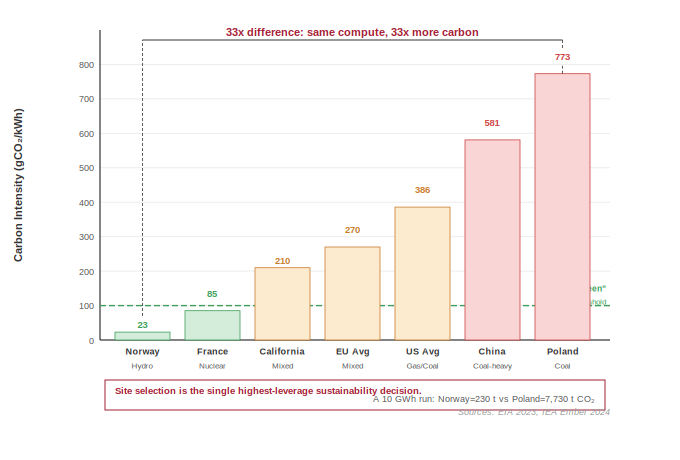
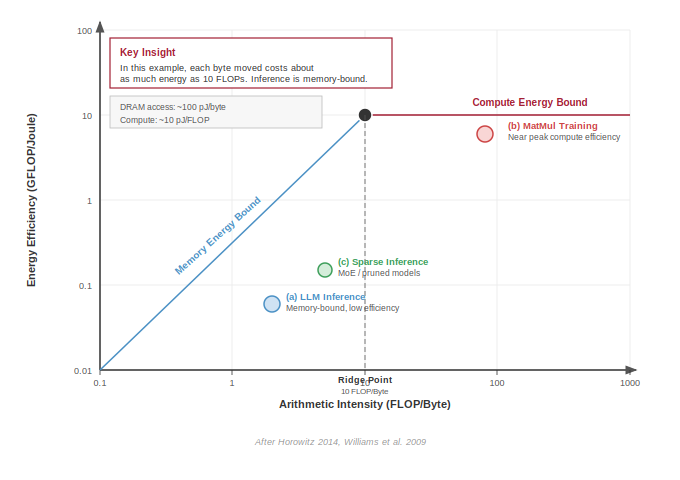
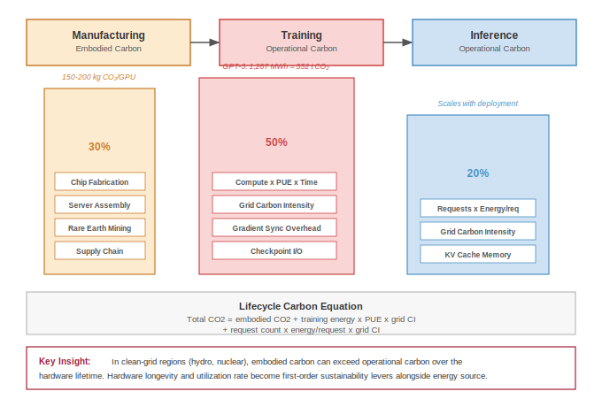
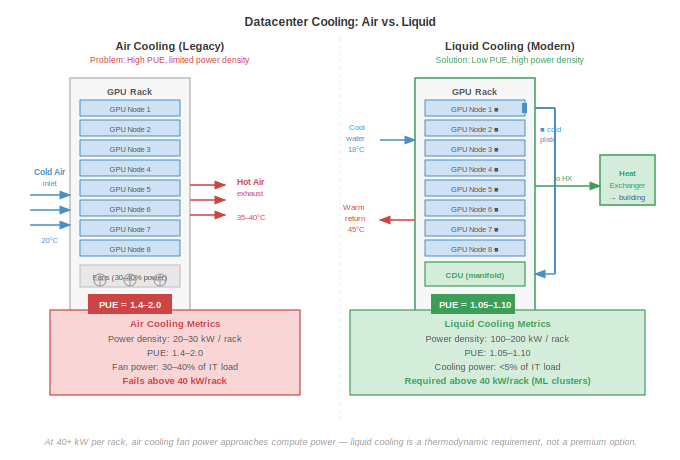

# Sustainable AI {#sec-sustainable-ai}

::: {layout-narrow}
::: {.column-margin}

\chapterminitoc

:::

\noindent
{fig-alt="Sustainable AI and energy-efficient computing."}

:::

## Purpose {.unnumbered}

\begin{marginfigure}
\mlfleetstack{60}{20}{20}{100}
\end{marginfigure}

_Why does energy consumption determine what machine learning systems can exist, not just what they cost to operate?_

Power is not merely an operational expense but a hard physical constraint that limits what can be built. A data center has a fixed power budget determined by its electrical infrastructure and cooling capacity; exceeding that budget is not expensive but impossible. Training runs that require more power than available *cannot* happen regardless of budget. Deployment locations are constrained by grid capacity and cooling feasibility, not just real estate prices. At frontier scale, the question shifts from "can we afford this" to "can this physically exist"—and the answer increasingly depends on energy efficiency rather than algorithmic capability. The organizations pushing machine learning forward are those that treat energy as a first-class engineering constraint alongside accuracy and latency, because sustainability is about the physical infrastructure that determines which ambitious systems can actually be built and operated [@barroso2019; @patterson2021carbon].

::: {.content-visible when-format="pdf"}

\newpage

:::

::: {.callout-learning-objectives}

- Explain the sustainability paradox where AI compute growth outpaces hardware efficiency gains
- Analyze how Jevons Paradox causes efficiency improvements to increase total resource consumption
- Calculate Power Usage Effectiveness (PUE) and lifecycle carbon footprints across training, inference, and manufacturing, differentiating operational emissions from embodied carbon
- Analyze geographic and temporal factors affecting carbon intensity and apply these insights to workload scheduling decisions
- Evaluate algorithmic optimizations (pruning, quantization, knowledge distillation) and edge deployment for accuracy-energy trade-offs and lifecycle sustainability
- Design carbon-aware scheduling that uses renewable energy and grid intensity to cut emissions 50--80 percent while meeting performance requirements
- Critique carbon offsets vs. actual emissions reductions and synthesize multi-layer plans integrating algorithmic, infrastructure, and policy levers

:::

```{python}
#| echo: false
from mlsysim import *
from mlsysim.core.constants import *
#| label: chapter-start
# ┌─────────────────────────────────────────────────────────────────────────────
# │ CHAPTER START
# ├─────────────────────────────────────────────────────────────────────────────
# │ Context: Chapter initialization and global imports
# │
# │ Why: Registers this chapter with the mlsys registry and provides shared
# │      imports for all subsequent calculation cells.
# │
# │ Imports: mlsysim.registry, mlsysim.constants, mlsysim.book
# │ Exports: (none)
# └─────────────────────────────────────────────────────────────────────────────
from mlsysim.fmt import fmt, check, MarkdownStr
```

This chapter's position in the book's organizing framework, the fleet stack, clarifies why energy and environmental constraints are not external concerns but physical limits that bound what the entire system can achieve.

::: {#psp-sustainable-ai-fleet-stack-connection .callout-perspective title="Fleet stack connection"}

Sustainability is the final component of the **Governance Layer**. Security protects against adversaries; Robustness protects against operational chaos; **Sustainability**\index{Sustainability} protects against resource exhaustion. A system that exceeds its energy budget or cannot be powered by the available grid is operationally failed in the same sense as one that crashes. Sustainability engineering ensures that the fleet continues to operate within its long-run energy and carbon constraints.

:::

## The Energy Ceiling {#sec-sustainable-ai-sustainable-ai-engineering-discipline-6d39}

When an engineer optimizes a database query to save 100 milliseconds, it is considered standard performance tuning. When that same query is executed billions of times a day across a global data center, however, that 100-millisecond savings translates to megawatts of electrical power and tons of avoided carbon emissions [@lacoste2019quantifying]. Sustainable AI ceases to be a theoretical ethical concern once we recognize that power density is the absolute physical ceiling on data center computational capacity; energy is the ultimate currency of machine learning.[^fn-joule-ml]

[^fn-joule-ml]: **Joule**: The SI unit of energy (1 J = 1 Watt-second). To ground the scale of the fleet: a single A100 GPU at peak load consumes ~400 Joules every second. Large-model training runs are measured in billions to trillions of joules, so small per-operation inefficiencies scale into facility-level energy demand.

Security (@sec-security-privacy) protects ML systems from adversarial threats. Robustness (@sec-robust-ai) ensures they perform reliably under distribution shift. This chapter addresses a third operational concern that determines long-term viability: the resource constraints that govern whether systems remain economically and environmentally sustainable at scale.

Contemporary machine learning applications operate at industrial scales, with environmental impact now comparable to established heavy industries. Training a single frontier AI model can consume as much electricity as roughly 122 US homes do in an entire year. The exponential growth trajectory of computational demands outpaces efficiency improvements in underlying hardware by orders of magnitude, establishing the **sustainability paradox**\index{Sustainability Paradox} in artificial intelligence [@sevilla2022]. This chapter formalizes these constraints into an engineering discipline: Sustainable AI.

::: {#dfn-sustainable-ai-sustainable-ai .callout-definition title="Sustainable AI"}

***Sustainable AI***\index{Sustainable AI!definition} is the systems engineering practice of measuring and optimizing the full environmental cost of ML systems (energy, water, and embodied carbon across training, inference, and hardware manufacturing) and incorporating those costs as explicit constraints in architecture decisions alongside performance and accuracy objectives [@lannelongue2021].

1.  **Significance (quantitative)**: Training GPT-3 consumed approximately 1,287 MWh of energy [@li2020estimating], equivalent to roughly 122 US household-years of electricity. Fine-tuning a pretrained model on domain data consumes roughly 1–5 percent of full training cost, making transfer learning a 20--100$\times$ more energy-efficient path to the same capability. At inference scale, a 175B-parameter model serving 10M queries/day at 100 ms per query can consume more cumulative energy in months of production service than its training, making inference optimization the dominant sustainability lever at production scale.
2.  **Distinction (durable)**: Unlike corporate sustainability reporting (which aggregates energy usage into annual CO~2~ disclosures), sustainable AI engineering operates at the individual workload level—selecting hardware based on FLOP/s per watt efficiency, scheduling training during periods of high renewable availability, and choosing model architectures that minimize inference FLOPs rather than simply maximizing accuracy.
3.  **Common pitfall**: A frequent misconception is that switching to renewable energy solves the sustainability problem. For hardware-intensive ML, embodied carbon (the carbon emitted manufacturing the chips, servers, and cooling equipment before they ever run a training job) often equals or exceeds operational carbon; over 50 percent of an edge device's lifecycle carbon can come from manufacturing, making hardware longevity and utilization rate as important as energy source.

:::

The environmental impact of AI systems spans the complete lifecycle: from semiconductor manufacturing and data center construction to model training, inference deployment, and electronic waste [@Jones2021datacenters]. Treating this full lifecycle as an engineering problem rather than a corporate responsibility exercise transforms sustainability from a vague objective into a measurable engineering requirement. Before we can optimize this massive footprint, however, we must ground our intuition by calculating the raw physical energy required to produce frontier machine intelligence.

::: {#chk-sustainable-ai-energy-intelligence .callout-checkpoint title="The energy of intelligence"}

A 175B parameter model requires approximately $3.14 \times 10^{23}$ FLOPs to train. Assuming a data center PUE of 1.1 and an end-to-end realized training efficiency of 50 GFLOP/J:

1. Calculate the total energy consumption in megawatt-hours (MWh).
2. If the average US household consumes 10.6 MWh per year, how many "household-years" does this single training run represent?
3. Discuss whether this metric captures the true environmental cost, considering the difference between energy consumption (MWh) and carbon intensity (g CO~2~/kWh).

:::

The measurement, modeling, and mitigation frameworks presented in this chapter represent essential engineering competencies alongside traditional performance optimization. Mastering them requires understanding the scale of the problem, the physics that constrain solutions, and the system-level interventions that move the needle.

### The scale of environmental impact {#sec-sustainable-ai-scale-environmental-impact-ac9a}

The numbers become visceral when translated into familiar physical quantities. To appreciate the scale of the problem, translate a single frontier training run into emissions and a familiar travel comparison.

```{python}
#| echo: false
#| label: carbon-cost-training-calc
# ┌─────────────────────────────────────────────────────────────────────────────
# │ CARBON COST OF TRAINING (LEGO)
# ├─────────────────────────────────────────────────────────────────────────────
# │ Context: @sec-sustainable-ai-scale-environmental-impact-ac9a
# │
# │ Goal: Quantify carbon emissions for GPT-3 training and compare to flights.
# │ Show: ~552,000 kg CO2 (~552 flights) at US avg grid intensity.
# │ How: Energy * Grid_Intensity; Flight_equiv = Emissions / kg_per_flight.
# │
# │ Imports: mlsysim.book (fmt, check)
# │ Exports: training_mwh_gpt3, grid_ci_us_kg, total_emissions_gpt3_kg_str,
# │          flight_ratio_gpt3_str, emissions_ratio_low_carbon_str
# └─────────────────────────────────────────────────────────────────────────────

# ┌── LEGO ───────────────────────────────────────────────
class CarbonCostGPT3:
    """Quantify the environmental impact of a frontier model training run."""

    # ┌── 1. LOAD (Constants) ──────────────────────────────────────────────
    energy_mwh = 1287
    us_grid = Infrastructure.Grids.US_Avg
    hydro_grid = Infrastructure.Grids.Quebec
    grid_ci_us_kg = us_grid.carbon_intensity_kg_kwh
    grid_ci_low_kg = hydro_grid.carbon_intensity_kg_kwh
    kg_per_flight = 1000 # NY to London round trip

    # ┌── 2. EXECUTE (The Compute) ────────────────────────────────────────
    energy_kwh = energy_mwh * THOUSAND  # MWh → kWh (mlsysim does not export kilowatt_hour)
    total_emissions_kg = energy_kwh * grid_ci_us_kg
    flight_ratio = total_emissions_kg/kg_per_flight

    low_carbon_emissions = energy_kwh * grid_ci_low_kg
    emissions_ratio = total_emissions_kg/low_carbon_emissions
    low_carbon_flights = low_carbon_emissions / kg_per_flight

    # ┌── 3. GUARD (Invariants) ──────────────────────────────────────────
    check(total_emissions_kg > 500000, f"Expected >500k kg CO2, got {total_emissions_kg:.0f}")

    # ┌── 4. OUTPUT (Formatting) ──────────────────────────────────────────────
    training_mwh_str = fmt(energy_mwh, precision=0, suffix=' MWh')
    energy_kwh_str = fmt(energy_kwh, precision=0, suffix=' kWh')
    total_emissions_kg_str = fmt(total_emissions_kg, precision=0)
    flight_ratio_str = fmt(flight_ratio, precision=1)
    emissions_ratio_str = fmt(emissions_ratio, precision=1, commas=False)
    grid_ci_us_kg_str = fmt(grid_ci_us_kg, precision=3, commas=False)
    grid_ci_low_kg_str = fmt(grid_ci_low_kg, precision=3, commas=False)
    kg_per_flight_str = fmt(kg_per_flight, precision=0, commas=False)
    low_carbon_flights_str = fmt(low_carbon_flights, precision=1, commas=False)
```

::: {#nbk-sustainable-ai-carbon-cost-training .callout-notebook title="The carbon cost of training"}

**Problem**: A team trains a large model (GPT-3 size) consuming `{python} CarbonCostGPT3.training_mwh_str`. How much CO~2~ is emitted, and how does that compare to a trans-Atlantic flight?

**Math**:

1.  **Energy**\index{Training!energy consumption}: `{python} CarbonCostGPT3.training_mwh_str` = `{python} CarbonCostGPT3.energy_kwh_str`.
2.  **Carbon intensity (US average)**: $\approx$ `{python} CarbonCostGPT3.grid_ci_us_kg_str` kg CO$_2$/kWh.
3.  **Total Emissions**\index{Carbon Footprint!training emissions}: `{python} CarbonCostGPT3.energy_kwh_str` $\times$ `{python} CarbonCostGPT3.grid_ci_us_kg_str` kg/kWh $\approx$ `{python} CarbonCostGPT3.total_emissions_kg_str` kg CO$_2$.
4.  **Comparison**:
    *   One passenger, NY to London (round trip): $\approx$ `{python} CarbonCostGPT3.kg_per_flight_str` kg CO$_2$.
    *   **Ratio**: `{python} CarbonCostGPT3.total_emissions_kg_str` / `{python} CarbonCostGPT3.kg_per_flight_str` = `{python} CarbonCostGPT3.flight_ratio_str`.

**Systems insight**: A single training run emits as much carbon as hundreds of trans-Atlantic passenger round trips. Optimization matters. Moving this job to a hydro-powered region (`{python} CarbonCostGPT3.grid_ci_low_kg_str` kg/kWh) would reduce emissions by `{python} CarbonCostGPT3.emissions_ratio_str`$\times$ to about `{python} CarbonCostGPT3.low_carbon_flights_str` passenger round trips.

:::

```{python}
#| echo: false
#| label: archetype-a-tdp
# ┌─────────────────────────────────────────────────────────────────────────────
# │ ARCHETYPE A: H100 TDP REFERENCE (LEGO)
# ├─────────────────────────────────────────────────────────────────────────────
# │ Context: callout-lighthouse "Archetype A (GPT-4/Llama-3): The energy wall"
# │
# │ Goal: Provide H100 per-chip TDP for the 25k-GPU energy-wall framing.
# │ Show: ~700 W per chip.
# │ How: pulling Hardware.Cloud.H100.tdp from mlsysim.core.constants.
# │
# │ Imports: mlsysim.core.constants (Hardware.Cloud.H100.tdp, watt)
# │ Exports: ArchetypeATdp.h_h100_tdp_w_str
# └─────────────────────────────────────────────────────────────────────────────
from mlsysim.fmt import fmt

class ArchetypeATdp:
    """H100 per-chip TDP for the Archetype A energy framing."""

    # ┌── 1. LOAD (Constants) ──────────────────────────────────────────────
    tdp = Hardware.Cloud.H100.tdp

    # ┌── 2. EXECUTE (The Compute) ────────────────────────────────────────
    tdp_w = tdp.m_as(watt)
    cluster_gpus = 25000
    cluster_accel_mw = cluster_gpus * tdp_w / MILLION

    # ┌── 3. GUARD (Invariants) ──────────────────────────────────────────
    from mlsysim.fmt import check
    check(tdp_w > 500, "H100 TDP should exceed 500 W")
    check(abs(cluster_accel_mw - 17.5) < 0.1, f"Cluster MW unexpected: {cluster_accel_mw}")

    # ┌── 4. OUTPUT (Formatting) ──────────────────────────────────────────────
    h_h100_tdp_w_str = fmt(tdp_w, precision=0, commas=False)
    cluster_gpus_str = fmt(cluster_gpus, precision=0, commas=True)
    cluster_accel_mw_str = fmt(cluster_accel_mw, precision=1, commas=False, suffix=' MW')
```

That arithmetic shows the carbon cost of one run; at frontier scale, the next constraint is whether enough power can be delivered to the cluster at all.

::: {#lhs-sustainable-ai-archetype-gpt-4-llama-3-energy-wall .callout-lighthouse title="Archetype A (GPT-4/Llama-3): The energy wall"}

**Archetype A (GPT-4)** is the primary driver of the industry's exponential energy growth. A single `{python} ArchetypeATdp.cluster_gpus_str`-GPU cluster drawing `{python} ArchetypeATdp.h_h100_tdp_w_str` W per chip requires `{python} ArchetypeATdp.cluster_accel_mw_str` of accelerator power before server, network, and cooling overhead. The constraint is *physical*, not *financial*: it is a grid capacity problem. Organizations operating Archetype A models are increasingly forced to build their own power infrastructure or relocate to regions with excess renewable energy, making Carbon-Aware Scheduling and Geographic Optimization as critical as learning rate tuning.

:::

That accelerator draw alone, before server, network, and cooling overhead, already competes with heavy industry for grid capacity, which makes *where* and *when* a job runs the dominant lever, the subject of the calculations that follow.

```{python}
#| echo: false
#| label: carbon-frontier-notebook
# ┌─────────────────────────────────────────────────────────────────────────────
# │ CARBON-PERFORMANCE FRONTIER (NOTEBOOK)
# ├─────────────────────────────────────────────────────────────────────────────
# │ Context: "The Geography of Carbon" .callout-notebook
# │
# │ Goal: Quantify the carbon footprint difference between geographic regions.
# │ Show: ratio ≈ 40x—inline in notebook result.
# │ How: Carbon = Energy_kWh * Intensity_g/kWh.
# │
# │ Imports: mlsysim.book (check)
# │ Exports: cf_energy_mwh_str, cf_quebec_tonnes_str, cf_poland_tonnes_str, cf_ratio_str
# └─────────────────────────────────────────────────────────────────────────────
from mlsysim.fmt import fmt, check

class CarbonFrontier:
    # ┌── 1. LOAD ──────────────────────────────────────────
    energy_mwh = 10000 # 10 GWh training run
    quebec_grid = Infrastructure.Grids.Quebec
    poland_grid = Infrastructure.Grids.Poland
    intensity_quebec = quebec_grid.carbon_intensity_g_kwh
    intensity_poland = poland_grid.carbon_intensity_g_kwh
    # ┌── 2. EXECUTE ───────────────────────────────────────
    energy_kwh = energy_mwh * THOUSAND  # MWh → kWh
    quebec_g = energy_kwh * intensity_quebec
    poland_g = energy_kwh * intensity_poland
    # g CO2 → tonnes (mlsysim does not export mass pint units yet; use MILLION = g/tonne).
    quebec_tonnes = quebec_g / MILLION
    poland_tonnes = poland_g / MILLION
    ratio = poland_tonnes / quebec_tonnes
    # ┌── 3. GUARD ─────────────────────────────────────────
    check(ratio > 40, f"Ratio {ratio:.1f} unexpected")
    # ┌── 4. OUTPUT ────────────────────────────────────────
    cf_energy_mwh_str = fmt(energy_mwh, precision=0, suffix=' MWh')
    energy_kwh_str = fmt(energy_kwh, precision=0)
    quebec_g_str = fmt(quebec_g, precision=0)
    poland_g_str = fmt(poland_g, precision=0)
    cf_quebec_tonnes_str = fmt(quebec_tonnes, precision=0)
    cf_poland_tonnes_str = fmt(poland_tonnes, precision=0)
    cf_ratio_str = fmt(ratio, precision=0, commas=False)
    intensity_quebec_str = fmt(intensity_quebec, precision=0, commas=False)
    intensity_poland_str = fmt(intensity_poland, precision=0, commas=False)
```

```{python}
#| echo: false
#| label: placement-optimizer-example
# ┌─────────────────────────────────────────────────────────────────────────────
# │ PLACEMENT OPTIMIZER (TIER 3)
# ├─────────────────────────────────────────────────────────────────────────────
# │ Context: Callout "Automated Carbon-Aware Scheduling"
# │
# │ Goal: Demonstrate the Tier 3 Optimizer finding the cheapest geographic placement.
# │ Show: How a $100/ton carbon tax shifts workloads from coal to hydro regions.
# │ How: Invoke mlsysim.PlacementOptimizer.
# │
# │ Imports: mlsysim (PlacementOptimizer, Systems, Hardware)
# │ Exports: AutoPlacement.best_region, AutoPlacement.total_tco_str,
# │          AutoPlacement.carbon_tax_str, AutoPlacement.energy_mwh_str
# └─────────────────────────────────────────────────────────────────────────────
from mlsysim import PlacementOptimizer, Systems, Hardware
from mlsysim.fmt import fmt, check, MarkdownStr

# ┌── LEGO ───────────────────────────────────────────────
class AutoPlacement:
    '''
    Namespace for automated Workload Placement.
    Scenario: Finding the optimal region for a 10,000 MWh training run.
    '''

    # ┌── 1. LOAD (Constants) ───────────────────────────────────────────────
    fleet = Systems.Clusters.Frontier_8K
    energy_mwh = 10000.0
    carbon_tax = 100.0  # $/ton
    duration_days = (energy_mwh / 143.0) / 24.0

    # ┌── 2. EXECUTE (The Compute) ─────────────────────────────────────────
    optimizer = PlacementOptimizer()
    res = optimizer.solve(fleet, duration_days=duration_days, regions=["US_Avg", "Quebec", "Iowa"], carbon_tax_per_ton=carbon_tax, mfu=Literature.Training.MfuHigh)

    # ┌── 3. GUARD (Invariants) ───────────────────────────────────────────
    check(res.best_region == "Quebec", f"Quebec should be optimal with ${carbon_tax}/ton tax")

    # ┌── 4. OUTPUT (Formatting) ──────────────────────────────────────────────
    best_region = res.best_region  # kept raw for invariant check above
    best_region_str = MarkdownStr(res.best_region)
    total_tco_str = fmt(res.objective_value / MILLION, precision=2)  # USD → millions of USD (display)
    carbon_tax_str = fmt(carbon_tax, precision=0, commas=False)
    energy_mwh_str = fmt(energy_mwh, precision=0, suffix=' MWh')
```

::: {#nbk-sustainable-ai-automated-carbon-aware-scheduling-tier-3-optimizer .callout-notebook title="Automated carbon-aware scheduling (Tier 3 optimizer)"}

**Problem**: A team is planning a large training run requiring `{python} AutoPlacement.energy_mwh_str` of energy, choosing between three regions with different electricity prices and carbon intensities. With an internal carbon tax of USD `{python} AutoPlacement.carbon_tax_str`/tonne, which region minimizes the true Total Cost of Ownership (TCO)?

**Solution**: We invoke the `PlacementOptimizer` to synthesize grid carbon intensity, regional electricity rates, and the carbon tax into a single optimization objective.

**Result**: The optimizer evaluates the design space and selects the global minimum:

*   **Optimal Region**\index{Carbon-Aware Scheduling!optimal region}: `{python} AutoPlacement.best_region_str`
*   **Total Projected Cost**\index{Total Cost of Ownership!carbon-aware placement}: USD `{python} AutoPlacement.total_tco_str` million (Including carbon penalty)

**Systems insight**: In a pure energy-cost-only model, engineers might choose the region with the lowest raw electricity rate. However, once a carbon tax is introduced, the externalities wall becomes a first-class economic constraint. The optimizer proves that the hydro-powered grid in `{python} AutoPlacement.best_region_str` is the most cost-effective choice, as the massive carbon savings more than offset any marginal difference in electricity pricing.

:::

The scheduling optimizer treats carbon intensity as a time-varying input, shifting workloads to low-carbon hours within a single region. Geographic placement extends the same logic across space: because national grids differ by an order of magnitude in carbon intensity, choosing *where* to run a job can dwarf any gain from choosing *when* to run it. The following calculation isolates this geographic factor by holding energy demand constant and varying only the grid.

::: {#nbk-sustainable-ai-geography-carbon .callout-notebook title="The geography of carbon"}

**Problem**: A team is choosing a data center for a `{python} CarbonFrontier.cf_energy_mwh_str` training run.

- **Site A (Quebec)**: Hydropower, `{python} CarbonFrontier.intensity_quebec_str` g $\text{CO}_2$/kWh.
- **Site B (Poland)**: Coal-heavy, `{python} CarbonFrontier.intensity_poland_str` g $\text{CO}_2$/kWh.
How does the location affect a model's carbon footprint?

**Math**:
Carbon = Energy $\times$ Grid Intensity.

1. **Site A Emissions**: `{python} CarbonFrontier.energy_kwh_str` $\times$ `{python} CarbonFrontier.intensity_quebec_str` g/kWh = `{python} CarbonFrontier.quebec_g_str` g = `{python} CarbonFrontier.cf_quebec_tonnes_str` tonnes $\text{CO}_2$.
2. **Site B Emissions**: `{python} CarbonFrontier.energy_kwh_str` $\times$ `{python} CarbonFrontier.intensity_poland_str` g/kWh = `{python} CarbonFrontier.poland_g_str` g = `{python} CarbonFrontier.cf_poland_tonnes_str` tonnes $\text{CO}_2$.
3. **Ratio**: `{python} CarbonFrontier.cf_poland_tonnes_str` / `{python} CarbonFrontier.cf_quebec_tonnes_str` = `{python} CarbonFrontier.cf_ratio_str`$\times$ difference.

**Systems insight**: Site selection is the single most effective tool for sustainable AI. A `{python} CarbonFrontier.cf_ratio_str`$\times$ difference in carbon emissions is larger than any possible algorithmic speedup. In the machine learning fleet, carbon-aware scheduling (moving nonurgent jobs to low-carbon regions or hours) is a first-class operational competency. Efficiency extends beyond FLOPs to the carbon-intensity of those FLOPs.

:::

Training a single large language model consumes thousands of megawatt-hours of electricity, equivalent to powering hundreds of households for months.[^fn-household-energy] IEA projects global data-center electricity consumption to reach about 945 TWh by 2030, just under 3 percent of global electricity demand, with AI-accelerated servers driving much of the growth.[^fn-data-center-industrial-scale] Computational demands increased 350,000$\times$ from 2012 to 2019 [@schwartz2020], while hardware efficiency improved at a far slower rate, creating an unsustainable growth trajectory.

[^fn-household-energy]: **Household Energy Baseline**\index{Household Energy Baseline}: The average U.S. household consumes 10,500 kWh annually. GPT-3's verified 1,287 MWh training run equals 122 households' annual electricity, and later frontier-scale runs can require substantially more compute. This comparison anchors an otherwise abstract energy figure to physical infrastructure: a single training run draws more grid capacity than a residential neighborhood. \index{Energy!household, sustainability baseline}

[^fn-data-center-industrial-scale]: **Data Center Industrial Scale**\index{Data Center!industrial scale}: IEA's 2025 *Energy and AI* analysis projects data centers to consume about 945 TWh of electricity by 2030, just under 3 percent of global electricity demand. This is an electricity-demand metric, not directly comparable to aviation or cement shares of global emissions, but it still means AI infrastructure competes for grid capacity with heavy industry: regions that cannot expand power generation cannot expand AI deployment, regardless of demand. \index{Data Center!industrial emissions}

Beyond direct energy consumption, AI systems drive environmental impact through hardware manufacturing and resource consumption. Training and inference workloads depend on specialized processors that require rare earth metals whose extraction and processing generate pollution.[^fn-gpu-manufacturing-carbon] The growing demand for AI applications accelerates electronic waste production, with global e-waste reaching 54 million metric tons annually [@forti2020ewaste]. AI hardware rapidly becomes obsolete due to accelerating performance requirements.[^fn-ewaste-ai-hardware]

[^fn-gpu-manufacturing-carbon]: **GPU Manufacturing Embodied Carbon**\index{GPU!manufacturing embodied carbon}: NVIDIA's HGX H100 product carbon footprint reports 1,312 kg CO~2~e for an eight-H100 baseboard, or roughly 164 kg CO~2~e per H100 if allocated evenly across the eight GPUs [@nvidia2025hgxh100pcf]. Advanced-node manufacturing also requires substantial ultrapure water, specialty gases, chemicals, and high-temperature process steps. This embodied cost means that in clean-grid regions (hydro, nuclear), manufacturing emissions can rival or exceed operational carbon, making hardware longevity and circular economy reuse critical sustainability levers. \index{GPU!manufacturing, embodied carbon}

[^fn-ewaste-ai-hardware]: **AI Hardware E-Waste**\index{E-Waste!AI hardware}: Global e-waste reached 53.6 million metric tons in 2019, with computing equipment contributing 15 percent. AI accelerators compound this: 3-5 year obsolescence cycles driven by rapidly advancing architectures mean that a fleet of 10,000 GPUs generates 10–20 metric tons of toxic e-waste per refresh cycle, containing lead, mercury, and cadmium requiring specialized disposal.

Addressing these environmental challenges demands a coordinated response across technical, policy, and ethical dimensions to ensure AI development remains viable and responsible.

### Environmental impact and ethical foundations {#sec-sustainable-ai-part-environmental-impact-ethical-foundations-7581}

When training a single language model consumes electricity equivalent to hundreds of homes annually, urgent questions arise about who benefits from AI progress and who bears its ecological costs. The intersection of exponential computational demands with finite planetary resources demands that the field confront difficult choices about sustainable development pathways balancing innovation with environmental responsibility.

### Environmental justice and responsible development {#sec-sustainable-ai-environmental-justice-responsible-development-3923}

The environmental impact of AI creates ethical responsibilities that extend beyond technical optimization. Environmental sustainability emerges as a critical component of trustworthy AI systems, extending the responsible AI principles examined in @sec-responsible-ai to include ecological stewardship [@vinuesa2020]. The computational resources required for AI development concentrate environmental costs on specific communities while distributing benefits unequally across global populations. Data centers consume on the order of a few percent of global electricity and substantial water for cooling [@andrae2015; @jones2018], often in regions where energy grids rely on fossil fuels and water resources face stress from climate change.

Geographic concentration of environmental burden creates questions of environmental justice that align with broader responsible AI frameworks.[^fn-environmental-justice-siting] Fairness considerations require examining who benefits from AI systems and who bears their risks; environmental responsibility demands understanding who pays the ecological costs of AI advancement. Communities hosting AI infrastructure bear disproportionate environmental burdens while having limited access to AI's economic benefits, exemplifying the need to extend ethical AI frameworks beyond algorithmic fairness to encompass environmental stewardship.

[^fn-environmental-justice-siting]: **Environmental Justice in Data center Siting**: Data centers gravitate toward low-cost land and electricity, which often means economically disadvantaged areas. The result is an asymmetric externality: communities hosting AI infrastructure bear water depletion, heat island effects, and grid strain, while economic benefits concentrate in distant tech hubs. For ML systems engineers, this creates a design constraint: site selection must factor in social license alongside grid carbon intensity, because community opposition can block or delay facility expansion. \index{Environmental Justice!data center siting}

### Exponential growth vs. physical constraints {#sec-sustainable-ai-exponential-growth-vs-physical-constraints-0f4e}

```{python}
#| echo: false
#| label: compute-growth-scenario
# ┌─────────────────────────────────────────────────────────────────────────────
# │ COMPUTE GROWTH SCENARIO (LEGO)
# ├─────────────────────────────────────────────────────────────────────────────
# │ Context: @sec-sustainable-ai-exponential-growth-vs-physical-constraints-0f4e
# │
# │ Goal: Quantify the exponential scaling of AI compute demand (2012-2019).
# │ Show: ~350,000x increase in compute requirements.
# │ How: Historical data from @schwartz2020green.
# │
# │ Imports: mlsysim.book (fmt, check)
# │ Exports: compute_growth_factor_str, compute_doubling_months_str,
# │          compute_annual_growth_str, moore_speedup_str
# └─────────────────────────────────────────────────────────────────────────────
import math
from mlsysim.fmt import fmt, check

class ComputeGrowthScenario:
    """Historical AI compute growth quantification."""

    # ┌── 1. LOAD (Constants) ──────────────────────────────────────────────
    compute_growth_factor = 350000
    growth_years = 7
    months_per_year = 12

    # ┌── 2. EXECUTE (The Compute) ────────────────────────────────────────
    compute_annual_growth = compute_growth_factor ** (1 / growth_years)
    compute_doubling_months = (growth_years * months_per_year) / math.log2(compute_growth_factor)
    moore_speedup = 24 / compute_doubling_months

    # ┌── 3. GUARD (Invariants) ──────────────────────────────────────────
    check(compute_growth_factor > 300000, f"Expected >300k, got {compute_growth_factor}")
    check(4.5 < compute_doubling_months < 4.7, f"Unexpected doubling time: {compute_doubling_months:.2f}")

    # ┌── 4. OUTPUT (Formatting) ──────────────────────────────────────────────
    compute_growth_factor_str = fmt(compute_growth_factor, precision=0)
    compute_doubling_months_str = fmt(compute_doubling_months, precision=1, suffix=' months')
    compute_annual_growth_str = fmt(compute_annual_growth, precision=1, suffix="×/year")
    moore_speedup_str = fmt(moore_speedup, precision=1)
```

Exponential growth in computational demands challenges the long-term sustainability of AI training and deployment. Over the past decade, AI systems have scaled faster than any prior computing workload, with compute requirements increasing `{python} ComputeGrowthScenario.compute_growth_factor_str`$\times$ from 2012 to 2019[^fn-ai-compute-growth] [@schwartz2020]. This trend continues as machine learning systems prioritize larger models with more parameters, larger training datasets, and higher computational complexity. Sustaining this trajectory poses sustainability challenges, as hardware efficiency gains fail to keep pace with rising AI workload demands.

[^fn-ai-compute-growth]: **AI Compute Growth Rate**\index{AI Compute Growth!growth rate}: The `{python} ComputeGrowthScenario.compute_growth_factor_str`$\times$ increase from 2012 to 2019 implies a doubling time of approximately `{python} ComputeGrowthScenario.compute_doubling_months_str`, roughly `{python} ComputeGrowthScenario.moore_speedup_str`$\times$ faster than Moore's Law's 2-year doubling. This divergence is the root cause of the energy wall: no physically realizable improvement in silicon efficiency can match a doubling cadence measured in months, making algorithmic efficiency and carbon-aware scheduling the only viable sustainability levers at scale. \index{AI Compute Growth!doubling time}

Historically, computational efficiency improved with advances in semiconductor technology. Moore's Law predicted that the number of transistors on a chip would double approximately every two years, leading to continuous improvements in processing power and energy efficiency.[^fn-moores-law-sustainability] However, Moore's Law is now reaching core physical limits, making further transistor scaling difficult and costly. Dennard scaling, which once ensured that smaller transistors would operate at lower power levels, has also ended, leading to stagnation in energy efficiency improvements per transistor.[^fn-dennard-scaling-end]

[^fn-moores-law-sustainability]: **Moore's Law**: Gordon Moore's 1965 observation that transistor density doubles every two years drove 60 years of "free" efficiency gains for the semiconductor industry. At 3nm process nodes, physical limits are ending this trajectory: individual atoms become the constraint. For AI sustainability, the end of Moore's Law means that future efficiency gains must come from architectural specialization and algorithmic optimization rather than process shrinks. \index{Moore's Law!sustainability limits}

[^fn-dennard-scaling-end]: **Dennard Scaling**: Robert Dennard observed in 1974 that smaller transistors could operate at constant power density by reducing voltage proportionally. This ended around 2005 when leakage current made further voltage reduction impractical. The consequence for AI sustainability is direct: without Dennard scaling, each new process node no longer delivers proportional power savings, forcing the shift to specialized accelerators—GPUs and Tensor Processing Units (TPUs)—that achieve efficiency through architectural parallelism rather than transistor physics. \index{Dennard Scaling!sustainability}

While AI models continue to scale in size and capability, the hardware running these models no longer improves at the same exponential rate. As @fig-energy-wall-quantitative illustrates, this growing divergence between computational demand and hardware efficiency creates an unsustainable trajectory where AI consumes ever-increasing amounts of energy. This technical reality underscores why sustainable AI development requires coordinated action across the entire systems stack, from individual algorithmic choices to infrastructure design and policy frameworks.

::: {#fig-energy-wall-quantitative fig-env="figure" fig-pos="htb" fig-cap="**The Energy Wall Quantified**: The widening gap between the exponential growth of AI compute demand (approx. `{python} ComputeGrowthScenario.compute_annual_growth_str`, matching the 2012--2019 historical claim) and the slower pace of hardware efficiency gains (approx. 1.5×/year) creates a massive energy deficit that defines the modern sustainable AI challenge." fig-alt="Log-scale plot of compute demand at about 6.2 times per year vs. hardware efficiency at 1.5 times per year from 2012 to 2025. Shaded energy deficit region. Milestones: AlexNet, GPT-3, GPT-4."}

```{python}
#| echo: false
# ┌─────────────────────────────────────────────────────────────────────────────
# │ ENERGY WALL QUANTITATIVE (FIGURE)
# ├─────────────────────────────────────────────────────────────────────────────
# │ Context: @fig-energy-wall-quantitative—demand vs efficiency divergence
# │
# │ Goal: Plot compute demand (~6.2×/yr) vs hardware efficiency (1.5×/yr);
# │       show shaded energy deficit; AlexNet/GPT-3/GPT-4 milestones.
# │ Show: Two curves; fill_between; log-scale y.
# │ How: Exponential growth; matplotlib.
# │
# │ Imports: matplotlib.pyplot (plt), numpy (np)
# │ Exports: (figure only, no prose variables)
# └─────────────────────────────────────────────────────────────────────────────
# ┌── 1. CANVAS ────────────────────────────────────────────────────────────────
# │ Plot compute demand (~6.2×/yr) vs hardware efficiency (1.5×/yr);
import matplotlib.pyplot as plt
import numpy as np

plt.style.use('seaborn-v0_8-whitegrid')

# ┌── 2. ARRAYS ────────────────────────────────────────────────────────────────
years = np.linspace(2012, 2025, 100)
t = years - 2012

compute_annual_factor = ComputeGrowthScenario.compute_annual_growth
compute_growth = compute_annual_factor ** t
efficiency_growth = 1.5 ** t

fig, ax = plt.subplots(figsize=(10, 6))

# ┌── 3. RENDER ────────────────────────────────────────────────────────────────
ax.plot(years, compute_growth, color='#C0392B', linewidth=3, label='AI Compute Demand (~6.2x/year)')
ax.plot(years, efficiency_growth, color='#27AE60', linewidth=3, linestyle='--', label='Hardware Efficiency (~1.5x/year)')

ax.fill_between(years, efficiency_growth, compute_growth, color='#E74C3C', alpha=0.2, label='The Energy Wall (Deficit)')

milestones = [
    (2012, 'AlexNet', 1.0),
    (2020, 'GPT-3', compute_annual_factor**(2020-2012)),
    (2023, 'GPT-4', compute_annual_factor**(2023-2012))
]

milestone_label_styles = {
    'AlexNet': {
        'xytext': (50, 35),
        'ha': 'right',
        'va': 'bottom',
        'fontsize': 10,
        'fontweight': 'bold',
        'arrowprops': dict(arrowstyle='-', color='#333333', lw=0.75),
    },
    'GPT-3': {
        'xytext': (-12, 14),
        'ha': 'right',
        'va': 'bottom',
        'fontsize': 10,
        'fontweight': 'bold',
        'arrowprops': dict(arrowstyle='-', color='#333333', lw=0.75),
    },
    'GPT-4': {
        'xytext': (-10, 15),
        'ha': 'right',
        'va': 'bottom',
        'fontsize': 10,
        'fontweight': 'bold',
        'arrowprops': dict(arrowstyle='-', color='#333333', lw=0.75),
    },
}

default_milestone_style = {
    'xytext': (-10, 15),
    'ha': 'right',
    'va': 'bottom',
    'fontsize': 10,
    'fontweight': 'bold',
    'arrowprops': dict(arrowstyle='-', color='#333333', lw=0.75),
}

for year, name, y_val in milestones:
    ax.plot(year, y_val, 'o', color='#333333', markersize=6)

    style = default_milestone_style.copy()
    style.update(milestone_label_styles.get(name, {}))

    ax.annotate(
        name,
        xy=(year, y_val),
        xytext=style['xytext'],
        textcoords='offset points',
        fontsize=style['fontsize'],
        fontweight=style['fontweight'],
        ha=style['ha'],
        va=style['va'],
        arrowprops=style['arrowprops'],
    )

# ┌── 4. DECORATE ──────────────────────────────────────────────────────────────
ax.set_yscale('log')
ax.set_xlim(2012, 2025)
ax.set_ylim(0.8, 5e10)
ax.set_ylabel('Relative Scale (Log, 2012 = 1x)', fontsize=11)
ax.set_xlabel('Year', fontsize=11)
ax.set_title('The Energy Wall: Demand vs. Efficiency (2012-2025)', fontsize=13, pad=15)
ax.legend(
    loc='upper left',
    fontsize=8,
    frameon=True,
    facecolor='white',
    framealpha=0.95,
    edgecolor='gray',
    fancybox=True,
    borderpad=0.6
)
ax.grid(True, which='major', alpha=0.6)
ax.grid(True, which='minor', alpha=0.2, linestyle=':')

fig = plt.gcf()
```

:::

To make the uncertainty visible, @fig-data-center-energy-usage shows high-growth sensitivity scenarios for data center electricity usage rather than the IEA baseline forecast above. The spread between best, expected, and worst cases illustrates how strongly the outcome depends on efficiency improvements and demand growth assumptions.\index{Data Center!energy projections}

::: {#fig-data-center-energy-usage fig-env="figure" fig-pos="htb" fig-cap="**High-Growth Data Center Energy Sensitivity Scenarios**: Global data center electricity consumption scenarios from 2010 to 2030 under aggressive demand-growth assumptions. The three trajectories—best case, expected, and worst case—diverge significantly after 2018, highlighting the uncertainty and importance of efficiency improvements; they should be read as a sensitivity envelope, not as the IEA baseline projection." fig-alt="Line graph showing high-growth sensitivity scenarios for data center electricity usage from 2010 to 2030 in TWh. Three scenarios diverge after 2018: Best case reaches 700 TWh, Expected case reaches 3000 TWh, Worst case reaches 8000 TWh. Grid lines mark 2000 TWh intervals."}

```{.tikz}
\begin{tikzpicture}[font=\small\usefont{T1}{phv}{m}{n}]
\begin{axis}[
  axis line style={draw=none},
  width=16cm,
  height=10cm,
  table/col sep=comma,
  x tick label style={rotate=0, anchor=north},
  xmin=2009.5,xmax=2030,
  ymin=250, ymax=8300,
  ytick={2000,4000,6000,8000},
  ylabel={Electricity Usage (TWh)},
  xlabel={Year},
   legend style={at={(0.15,0.9)}, anchor=north},
   legend cell align=left,
   legend style={fill=BrownL!40,draw=BrownLine,row sep=1.85pt,
   font=\footnotesize\usefont{T1}{phv}{m}{n}},
  grid=both,
  minor tick num=1,
  major grid style={black!80},
  minor grid style={black!40},
    /pgf/number format/.cd,
  1000 sep={},
  nodes near coords align=right,
        tick label style={/pgf/number format/assume math mode=true},
        ticklabel style={font=\footnotesize\usefont{T1}{phv}{m}{n}},
    cycle multi list={
     red,blue,green\nextlist
     solid\nextlist
     mark=o,mark=none,mark=triangle,mark=none,mark=,mark=none
     },
]
\addplot+[mark=*,line width=2pt,
red] table[x=Date,y=Y, col sep=comma] {
Y,Date
500, 2010
510, 2012
520, 2014
540, 2016
560, 2018
580, 2020
600, 2022
630, 2024
660, 2026
690, 2028
700, 2030
};
\addplot+[mark=triangle*, mark size=3pt,cyan!90!black,
line width=2pt] table[x=Date,y=Y, col sep=comma] {
Y,Date
500, 2010
550, 2012
600, 2014
680, 2016
760, 2018
860, 2020
1000, 2022
1200, 2024
1600, 2026
2000, 2028
2967, 2030
};
\addplot+[mark=square*,line width=2pt, mark size=2.5pt,
green!70!black] table[x=Date,y=Y, col sep=comma] {
Y,Date
500, 2010
600, 2012
750, 2014
1000, 2016
1250, 2018
1600, 2020
2200, 2022
3000, 2024
4500, 2026
6000, 2028
7933, 2030
};
 \legend{Best, Expected, Worst}
\coordinate (legend) at (axis description cs:0.15,0.92);
\end{axis}
\node[fill=white,above=2pt of legend,anchor=center]{\small\bfseries Scenario};
\end{tikzpicture}
```

:::

### The energy wall: Divergent scaling {#sec-sustainable-ai-energy-wall}

@Fig-energy-wall-quantitative frames the energy wall as a divergence between compute demand and *silicon efficiency*, but silicon efficiency is only one ceiling. Even if every accelerator hit its theoretical limit, a second ceiling remains: the *physical energy infrastructure* of battery density and grid efficiency, which scales far more slowly than compute demand. AI sustainability presents a unique engineering challenge because it is a race between two fundamentally different physics: the *exponential scaling of logic* and the *linear scaling of energy infrastructure*.

```{python}
#| echo: false
#| label: energy-wall-scenario
# ┌─────────────────────────────────────────────────────────────────────────────
# │ ENERGY WALL SCENARIO (LEGO)
# ├─────────────────────────────────────────────────────────────────────────────
# │ Context: @sec-sustainable-ai-energy-wall—AI growth vs energy scaling
# │
# │ Goal: Quantify the sustainability gap between AI logic and physical grid.
# │ Show: ~249,000x gap over the same 7-year interval.
# │ How: AI growth (Schwartz) vs annual grid/battery improvements.
# │
# │ Imports: mlsysim.book (fmt, check)
# │ Exports: energy_wall_gap_str, battery_gain_pct_str, grid_gain_pct_str
# └─────────────────────────────────────────────────────────────────────────────
from mlsysim.fmt import fmt, check

class EnergyWallScenario:
    """Quantitative comparison of AI scaling vs. energy scaling."""

    # ┌── 1. LOAD (Constants) ──────────────────────────────────────────────
    compute_growth_factor = 350000
    battery_annual_growth = 0.05
    grid_annual_growth = 0.02
    n_years = 7

    # ┌── 2. EXECUTE (The Compute) ────────────────────────────────────────
    # Compound growth: (1 + r)^n
    battery_gain = (1 + battery_annual_growth) ** n_years
    grid_gain = (1 + grid_annual_growth) ** n_years

    # Gap between compute growth and infrastructure growth
    energy_wall_gap = compute_growth_factor/battery_gain

    # ┌── 3. GUARD (Invariants) ──────────────────────────────────────────
    check(energy_wall_gap > 100000, f"Expected massive gap, got {energy_wall_gap:.0f}")

    # ┌── 4. OUTPUT (Formatting) ──────────────────────────────────────────────
    energy_wall_gap_str = fmt(energy_wall_gap, precision=1)
    battery_gain_pct_str = fmt((battery_gain - 1) * 100, precision=1, commas=False, suffix=' percent')
    grid_gain_pct_str = fmt((grid_gain - 1) * 100, precision=1, commas=False, suffix=' percent')
```

As @fig-energy-wall shows, AI compute grew ~350,000$\times$ over the 2012--2019 period cited above while battery density and grid efficiency improve at only ~2–5 percent annually.

::: {#fig-energy-wall fig-env="figure" fig-pos="htb" fig-cap="**The Energy Wall**: Training-run energy (MWh) plotted across 2016--2026 against a horizontal power-plant reference line, with milestone models annotated along the trajectory. The curve rises by roughly 350,000$\times$ across this window in published estimates while battery density and grid efficiency improve at only 2--5 percent annually, framing the 'energy wall' where algorithmic ambition outruns the physical substrate." fig-alt="Single rising trajectory of training-run energy in MWh across 2016 to 2026, annotated with model milestones, plotted against a horizontal power-plant reference line."}


:::

While AI logic follows the "iron law" of software optimization, energy follows the laws of chemistry and thermodynamics. Over the same seven-year interval, battery energy density would improve by only ~`{python} EnergyWallScenario.battery_gain_pct_str` at a 5 percent annual rate, and grid efficiency by ~`{python} EnergyWallScenario.grid_gain_pct_str` at a 2 percent annual rate. The `{python} EnergyWallScenario.energy_wall_gap_str`$\times$ gap between these curves is the **Sustainability Wall**\index{Sustainability!wall}—the point where we can no longer "buy our way out" of the efficiency problem with more power.

### Data center grid dynamics {#sec-sustainable-ai-grid-dynamics}

Sustainable AI requires looking beyond the server rack to the electrical grid interface. Traditional data centers are "Steady-State" loads; they pull constant power 24/7. ML training clusters, however, are transient loads.

::: {#ws-sustainable-ai-ireland-grid-constraint .callout-war-story title="When the grid became the bottleneck"}
**Context**: In July 2022, the Government of Ireland published its *Government Statement on the Role of Data Centres in Ireland's Enterprise Strategy*, formalizing the country's posture toward a sector that by then consumed roughly 18 percent of Ireland's total metered electricity---concentrated almost entirely in the greater Dublin area [@ireland2022datacentres; @iea2024datacentresireland].

**Failure**: Grid expansion did not keep pace with connection demand. EirGrid and the national regulator reported multiple gigawatts of prospective data-center load queued near Dublin, with the local transmission system pushed to its limit and reinforcement timelines stretching into the next decade.

**Consequence**: EirGrid effectively imposed a moratorium on new data-center grid connections in the Dublin region through 2028. New connections became a grid-planning and policy decision rather than a normal procurement step, with location, on-site generation, and reinforcement requirements shaping what could be built---and where AI capacity could land at all.

**Systems lesson**: Sustainable AI is constrained by interconnection, geography, and power-system adequacy. Efficient accelerators help, but the fleet cannot scale faster than the grid that feeds it, and the binding constraint moves from the chip to the substation.
:::

#### The power ramp and grid stability {#sec-sustainable-ai-power-ramp-grid-stability-a4d6}
As discussed in @sec-sustainable-ai-power-delivery, a 10,000-GPU cluster can swing its load by 5–10 megawatts in milliseconds during an AllReduce synchronization step. For an electrical utility, this is a noise event. When thousands of GPUs suddenly stop computing to wait for the network, they cause a voltage spike on the grid; when they resume, they cause a voltage sag.
Managing these transients requires **Energy Buffering**\index{Energy!buffering}: using on-site battery arrays or massive capacitors to smooth the training iterations, ensuring the ML Fleet does not destabilize the local municipal power grid.

#### Heat reuse: Turning waste into fuel {#sec-sustainable-ai-heat-reuse-turning-waste-into-fuel-a5d7}
A data center is physically a system that converts high-quality energy (electricity) into low-quality energy (waste heat). In a sustainable fleet, this heat is not *exhausted* into the atmosphere but *harvested*.
*   **District Heating**\index{District Heating}: Modern facilities in Nordic regions (for example, Meta's Odense facility) pipe waste heat into local municipal heating systems, providing enough thermal energy to warm thousands of homes.
*   **Industrial Coupling**\index{Industrial Coupling}: Using low-grade waste heat (~45°C) for greenhouse climate control or water desalination.

By treating heat as a recoverable byproduct rather than a pollutant, the fleet can offset nearby thermal demand through data-center waste-heat recovery[^fn-pue-evolution] [@ebrahimi2014].

[^fn-pue-evolution]: **PUE (Power Usage Effectiveness)**: In the early 2000s, PUE values of 2.0-2.5 were common, meaning more power went to cooling than to computing [@thegreengrid2007pue]. Google's 2009 disclosure of PUE 1.21 proved that free-air cooling could halve data center overhead. The shift from PUE to CUE (Carbon Usage Effectiveness) and WUE (Water Usage Effectiveness) reflects a systems-level insight: optimizing watts alone is insufficient when water and carbon constraints bind independently. \index{PUE!evolution}

Training complex AI systems demands high levels of computing power, resulting in significant energy consumption. OpenAI's GPT-3 exemplifies this scale: training required 1,287 megawatt-hours of electricity, equivalent to powering roughly 122 US homes for an entire year[^fn-gpt3-energy-scale] [@maslej2023artificial]. This energy consumption reflects the computation required to train modern large language models on large datasets.[^fn-training-communication-overhead]

[^fn-training-communication-overhead]: **Training Communication Overhead**: Distributed training adds 15–30 percent energy overhead beyond raw computation due to gradient synchronization and checkpointing across nodes. For frontier models requiring thousands of GPUs, this communication tax alone can consume more energy than the entire training run of a mid-scale model, making parallelism strategy selection a first-order sustainability decision.

[^fn-gpt3-energy-scale]: **GPT-3 Energy Scale**\index{GPT-3!energy scale}: GPT-3's 1,287 MWh training cost translates to roughly \$130,000 in US electricity and 552 metric tons of CO~2~ at average grid intensity. The energy-per-parameter ratio of approximately 7.35 MWh per billion parameters reveals the co-design opportunity: optimized architectures using mixed precision and sparsity achieve sub-1 MWh per billion parameters, a several-fold efficiency gain that compounds across frontier-scale training runs. \index{GPT-3!energy consumption}

The scale of energy consumption makes efficiency improvements an engineering imperative. Generative AI models have proliferated in recent years, with each generation trained at larger parameter counts.

Research shows that increasing model size, dataset size, and compute used for training improves performance smoothly with no signs of saturation [@kaplan2020scaling]. @Fig-model-scaling demonstrates that test loss decreases predictably as each of these three factors increases, with no apparent ceiling in sight. Beyond training, AI-powered applications such as large-scale recommender systems and generative models require continuous inference at scale, consuming energy even after training completes. As AI adoption grows across industries from finance to healthcare to entertainment, the cumulative energy burden of AI workloads continues to rise, raising concerns about the environmental impact of widespread deployment.\index{Scaling Laws!model}

::: {#fig-model-scaling fig-env="figure" fig-pos="htb" fig-cap="**Model Scaling Laws**: Increasing model size, dataset size, and compute consistently reduces test loss, indicating that performance improvements continue to be achievable with greater resources and without evidence of saturation. The raster reproduces source-paper notation, where $N$ denotes parameter count and $C_{\min}$ denotes compute; elsewhere this book uses $P$ for parameter count and $O$ for operation count. These scaling laws suggest that larger models trained on more data with increased compute will likely yield further gains in performance, driving continued investment in these areas." fig-alt="Three line graphs showing test loss decreasing as model parameters, dataset tokens, and compute FLOPs increase. Each plot shows smooth power-law scaling with no saturation, indicating continued improvement with more resources."}


:::

Beyond electricity consumption, the sustainability challenges of AI extend to hardware resource demands and the energy efficiency limitations of current architectures. Different processor types affect environmental impact through their energy characteristics. Using pJ/FLOP as a common comparison point, central processing units consume approximately 100 pJ/FLOP, graphics processing units achieve roughly 10 pJ/FLOP for dense tensor operations, specialized tensor processors reach about 1--2 pJ/FLOP, and fixed-function low-precision accelerators approach 0.1 pJ/operation.[^fn-pj-mac-hierarchy] These hardware platforms require rare earth metals and complex manufacturing processes with embodied carbon.

[^fn-pj-mac-hierarchy]: **pJ/FLOP and pJ/MAC**\index{Multiply-Accumulate}: Energy-efficiency specifications often mix floating-point operations and multiply-accumulate operations. One MAC performs a multiply and an add, so direct comparisons require converting the unit convention and precision. The simplified hierarchy used here aligns with @tbl-energy-per-op: CPUs at roughly 100 pJ/FLOP, GPUs around 10 pJ/FLOP for dense tensor operations, TPUs around 1--2 pJ/FLOP, and custom low-precision ASICs approaching 0.1 pJ/operation. This hierarchy defines the sustainability opportunity: choosing the right hardware tier for a given workload can reduce energy consumption by 100--1,000$\times$ without any algorithmic changes.

The production of AI chips is energy-intensive, involving multiple fabrication steps that constitute a major portion of Scope 3 emissions in the overall AI system lifecycle. As model sizes continue to grow, the demand for AI hardware increases, exacerbating the environmental impact of semiconductor production and disposal.

### Theoretical efficiency limits as a sustainability model {#sec-sustainable-ai-theoretical-efficiency-limits-d880}

To understand the scale of AI's energy challenge, it helps to compare current systems with the theoretical limits of computational efficiency. Modern large language models (LLMs) operate with an energy efficiency gap of $10^6\times$ compared to the most efficient known physical implementations of pattern recognition and reasoning. This gap is the headroom the Sustainability Wall leaves on the table: industrial-scale energy infrastructure performs tasks that theoretically require only milliwatts of power.

Training a single model like GPT-3 creates a stark reminder of this gap: while silicon-based systems consume megawatts to process $10^{12}$ tokens, theoretical models of distributed processing suggest that similar cognitive capabilities are achievable with power budgets comparable to a household light bulb. This motivates the search for alternative computing paradigms that prioritize energy-aware architecture over raw throughput.

#### Principles of high-efficiency computing {#sec-sustainable-ai-principles-highefficiency-computing-6a9b}

Physical efficiency in information processing stems from three key principles that differ from current AI systems:

1. **Selective, Event-Driven Activation**: Rather than processing all information continuously, high-efficiency systems are asynchronous. They activate only small portions of the network at any time and consume energy only when actively processing changing signals.[^fn-event-driven-energy]

2. **Local Learning and Sample Efficiency**\index{Local Learning and Sample Efficiency}: Current architectures require training on trillions of tokens to achieve competence. High-efficiency models use strong inductive biases and self-supervised local learning to acquire capabilities from 10,000$\times$ less data, reducing the cumulative energy cost of the training phase.

3. **Sparsity and Sparse Interconnects**: In modern GPUs, the majority of energy is spent on data movement and global synchronization. High-efficiency systems use sparse representations where only 1-2 percent of parameters are active for any given task, reducing bandwidth and switching energy by 50--100$\times$.

[^fn-event-driven-energy]: **Event-Driven Computing**: A paradigm where computation triggers only on input changes rather than continuous clock cycles. Neuromorphic chips like Intel's Loihi exploit this to achieve 100--1,000$\times$ energy reductions for temporal tasks (audio, video, sensor data) by drawing near-zero power when inputs are static. The trade-off: event-driven architectures sacrifice throughput on batch workloads where all data changes simultaneously. \index{Event-Driven Computing!energy}

The biological model points toward promising research directions for sustainable AI. Architectures that implement **Spiking Neural Networks (SNNs)** or sparse activation patterns can achieve significant energy reductions by mimicking sparse communication models[^fn-snn-efficiency] [@prakash2023tinyml]. Local learning algorithms and self-supervised approaches offer additional pathways toward more sample-efficient and energy-conscious systems.

[^fn-snn-efficiency]: **Spiking Neural Networks (SNNs)**: Third-generation neural networks that communicate through discrete spikes rather than continuous activations. SNNs process information only when spikes occur, achieving 10--100$\times$ energy savings on temporal data (audio, video, sensor streams). The sustainability trade-off: current SNN training algorithms remain immature compared to backpropagation, limiting accuracy on standard benchmarks, but hardware implementations like Intel Loihi 2 demonstrate the efficiency ceiling these architectures can approach. \index{Spiking Neural Networks!energy efficiency}

Achieving sustainable AI requires a systematic shift in system design, moving from continuously active, dense architectures toward event-driven, sparse computation models. As compute demands outpace incremental efficiency improvements in silicon manufacturing, addressing AI's environmental impact demands rethinking the fundamental "Physics" of the algorithm based on these efficiency principles.

@Fig-energy-intervention shows how six successive intervention steps combine to reduce the energy gap by approximately 10,000$\times$, transforming an intractable divergence into an engineering challenge. No single lever is sufficient; closing the gap requires simultaneous progress across algorithmic, hardware, and systemic fronts.\index{Energy!gap intervention cascade}

::: {#fig-energy-intervention fig-env="figure" fig-pos="htb" fig-cap="**Energy Gap Intervention Cascade**: Six successive intervention steps progressively reduce the 350,000$\times$ energy gap. The combined cascade delivers roughly $10{,}000\times$ reduction across the six steps, leaving a tractable residual that engineering can close." fig-alt="Six horizontal step rows in the intervention cascade, decreasing in width as the gap closes from 350,000 times current down to a tractable residual, with combined reduction annotated as approximately 10,000 times."}


:::

The convergence of exponential computational demands with hard physical efficiency limits creates an unsustainable trajectory that threatens the long-term viability of AI scaling. To alter this trajectory, we must move beyond back-of-the-envelope calculations and establish rigorous, systemic frameworks for measuring and assessing energy consumption across the entire ML infrastructure.

---

## Energy Measurement and Modeling {#sec-sustainable-ai-part-ii-measurement-assessment-fb0b}

Engineers cannot optimize what they cannot measure. A cluster consuming five megawatts during a large language model training run directs only a fraction of that power into matrix multiplications; the remainder is consumed by cooling fans removing the resulting heat. Effective energy modeling requires decomposing the monolithic data center power bill into granular, component-level metrics that engineers can target for optimization.

The data center infrastructure foundations from @sec-compute-infrastructure established power and cooling as dominant engineering constraints. Systematic measurement transforms these constraints into actionable sustainability metrics across three critical areas: energy consumption tracking during training and inference, carbon footprint analysis across system lifecycles, and resource usage assessment for hardware and infrastructure. Just as performance engineering requires profiling before optimization, sustainable AI engineering requires measurement before mitigation.

### Carbon footprint analysis {#sec-sustainable-ai-carbon-footprint-analysis-ccc5}

Carbon footprint analysis provides the foundation for making informed design decisions about AI system sustainability. As AI systems continue to scale, systematic measurement of energy consumption and resource demands enables proactive approaches to environmental optimization. Developers and companies that build and deploy AI systems must consider not only performance and efficiency but also the environmental consequences of their design choices.

A central ethical challenge lies in balancing technological progress with ecological responsibility. The pursuit of increasingly large models often prioritizes accuracy and capability over energy efficiency, creating exponential increases in carbon emissions. While optimizing for sustainability may introduce trade-offs such as 10 to 30 percent longer development cycles or 1 to 5 percent accuracy reductions through techniques like pruning and quantization, these costs are substantially outweighed by environmental benefits. Integrating environmental considerations into AI system design has become an ethical imperative. The shift demands new industry norms: energy-aware training techniques, low-power hardware designs, and carbon-conscious deployment strategies [@patterson2021carbon].

The ethical imperative extends beyond sustainability to encompass broader concerns related to transparency, fairness, and accountability. @Fig-ethical-ai frames these concerns as connected environmental-justice and accountability trade-offs: transparency gaps obscure energy and carbon costs, fairness failures distribute harms unevenly, and weak accountability makes resource consumption difficult to trace. These concerns extend to sustainability, as the environmental trade-offs of AI development are often opaque and difficult to quantify. The lack of traceability in energy consumption and carbon emissions can lead to unjustified actions, where companies prioritize performance gains without fully understanding or disclosing the environmental costs.

::: {#fig-ethical-ai fig-env="figure" fig-pos="htb" fig-cap="**Ethical AI Concerns**: Four-quadrant layout of environmental-justice and accountability concerns in AI systems, spanning transparency, fairness, and sustainability. The quadrants make explicit how design choices in one quadrant (for example, opacity in training data) propagate into outcomes in an adjacent quadrant (for example, discriminatory predictions or untraceable resource consumption). Addressing these challenges requires proactive design choices that prioritize accountability and minimize negative societal and environmental impacts." fig-alt="Four-quadrant diagram of environmental-justice and accountability concerns in AI: transparency, fairness, accountability, and sustainability arranged in four quadrants with arrows connecting related issues across quadrants."}

:::

Addressing these concerns demands greater transparency and accountability from AI companies. Large technology firms operate extensive cloud infrastructures that power modern AI applications, yet their environmental impact remains opaque. Organizations must measure, report, and reduce their carbon footprint throughout the AI lifecycle, from hardware manufacturing to model training and inference. Voluntary self-regulation provides an initial step, but policy interventions and industry-wide standards may be necessary to ensure long-term sustainability. Reported metrics such as energy consumption, carbon emissions, and efficiency benchmarks can hold organizations accountable.

Ethical AI development requires open discourse on environmental trade-offs. Researchers must advocate for sustainability within their institutions and organizations, ensuring that environmental concerns are integrated into AI development priorities. The broader AI community has debated governance of large-scale AI experiments, as exemplified by an open letter warning about unchecked expansion and calling for a pause on giant AI experiments [@fli2023pauseai]. Fostering a culture of transparency and ethical responsibility allows the AI industry to align technological advancement with ecological sustainability.

AI has the potential to reshape industries and societies, but its long-term viability depends on responsible development practices. Ethical AI development involves preventing harm to individuals and communities while ensuring that AI-driven innovation does not occur at the cost of environmental degradation. As stewards of these technologies, developers and organizations must integrate sustainability into AI's future trajectory.

Preventing environmental harm requires us to hold AI systems accountable for their resource usage with the same rigor we apply to latency or accuracy. To achieve this transparency, we must translate abstract power consumption metrics into the universally recognized metric of environmental impact: the carbon footprint calculation.

```{python}
#| echo: false
from mlsysim.fmt import fmt_int
#| label: lifecycle-carbon-estimation-calc
# ┌─────────────────────────────────────────────────────────────────────────────
# │ LIFECYCLE CARBON ESTIMATION (LEGO)
# ├─────────────────────────────────────────────────────────────────────────────
# │ Context: @sec-sustainable-ai-carbon-footprint-analysis-ccc5 ("Lifecycle
# │          carbon estimation" .callout-checkpoint)
# │
# │ Goal: Compute operational and amortized embodied carbon for a 70B run.
# │ Show: ~537 tonnes operational + ~9 tonnes embodied = ~546 tonnes total.
# │ How: GPU power * hours * PUE * grid intensity; embodied / 36 months.
# │
# │ Imports: mlsysim.core.constants (Hardware.Cloud.H100.tdp, kilowatt)
# │ Exports: LifecycleCarbonEstimate.*_str values for checkpoint prose.
# └─────────────────────────────────────────────────────────────────────────────

# ┌── LEGO ───────────────────────────────────────────────
class LifecycleCarbonEstimate:
    """Worked lifecycle carbon estimate for a 70B training run."""

    # ┌── 1. LOAD (Constants) ──────────────────────────────────────────────
    from mlsysim import Hardware, Systems, Infrastructure
    from mlsysim.engine.solver import SustainabilityModel

    n_gpus = 2048
    training_days = 30
    h_h100 = Hardware.Cloud.H100
    baseline_grid = Infrastructure.Grids.US_Avg

    # Define Fleet and Region (nested class cannot see outer n_gpus at class body time)
    class DummyFleet:
        node = type('obj', (object,), {'accelerator': Hardware.Cloud.H100})
        total_accelerators = 2048
        effective_pue = Infrastructure.Grids.US_Avg.pue

    # Amortization details
    embodied_kg_per_gpu = 164
    amortization_months = 36
    amortization_window_months = 1
    lifecycle_years = amortization_months // 12

    # ┌── 2. EXECUTE (The Compute) ────────────────────────────────────────
    res = SustainabilityModel().solve(
        fleet=DummyFleet(),
        datacenter=baseline_grid,
        duration_days=training_days,
        mfu=1.0 # Peak training
    )

    operational_tonnes = res.total_energy_kwh.magnitude * baseline_grid.carbon_intensity_g_kwh / MILLION
    embodied_tonnes = n_gpus * embodied_kg_per_gpu / amortization_months / THOUSAND
    total_tonnes = operational_tonnes + embodied_tonnes
    gpu_tdp_kw = h_h100.tdp.m_as(kilowatt)
    hours_per_day = HOURS_PER_DAY
    total_facility_energy_kwh = res.total_energy_kwh.magnitude
    facility_power_kw = n_gpus * gpu_tdp_kw * DummyFleet.effective_pue

    # ┌── 3. GUARD (Invariants) ──────────────────────────────────────────
    check(450 < operational_tonnes < 550, f"Unexpected operational carbon: {operational_tonnes:.1f} t")
    check(
        abs(total_facility_energy_kwh - facility_power_kw * hours_per_day * training_days) < 1.0,
        "Facility energy must match power × hours × days",
    )

    # ┌── 4. OUTPUT (Formatting) ──────────────────────────────────────────────
    n_gpus_str = fmt(n_gpus, precision=0)
    training_days_str = fmt(training_days, precision=0)
    h_h100_tdp_w_str = fmt(h_h100.tdp.m_as("W"), precision=0, commas=False)
    gpu_tdp_kw_str = fmt(gpu_tdp_kw, precision=1, commas=False, suffix=' kW')
    hours_per_day_str = fmt(hours_per_day, precision=0, commas=False)
    pue_str = fmt(DummyFleet.effective_pue, precision=2, commas=False)
    grid_ci_str = fmt(baseline_grid.carbon_intensity_g_kwh, precision=0, commas=False)
    it_power_kw_str = fmt(n_gpus * h_h100.tdp.m_as("kW"), precision=1)
    facility_power_kw_str = fmt(facility_power_kw, precision=1, suffix=' kW')
    facility_energy_kwh_str = fmt_int(round(total_facility_energy_kwh), commas=True, suffix=' kWh')
    amortization_months_str = fmt(amortization_months, precision=0, commas=False)
    amortization_window_months_str = fmt(amortization_window_months, precision=0, commas=False)
    lifecycle_years_str = fmt(lifecycle_years, precision=0, commas=False)
    operational_tonnes_str = fmt(operational_tonnes, precision=1)
    embodied_kg_per_gpu_str = fmt(embodied_kg_per_gpu, precision=0, commas=False)
    embodied_tonnes_str = fmt(embodied_tonnes, precision=1, commas=False)
    total_tonnes_str = fmt(total_tonnes, precision=1)
```

::: {#chk-sustainable-ai-lifecycle-carbon-estimation .callout-checkpoint title="Lifecycle carbon estimation"}

Calculate the total carbon footprint for training a 70B parameter model.

**Parameters**: `{python} LifecycleCarbonEstimate.n_gpus_str` H100 GPUs, `{python} LifecycleCarbonEstimate.training_days_str` days, `{python} LifecycleCarbonEstimate.h_h100_tdp_w_str` W TDP, PUE `{python} LifecycleCarbonEstimate.pue_str`, grid intensity `{python} LifecycleCarbonEstimate.grid_ci_str` g $\text{CO}_2$/kWh.

**Operational**: Power = `{python} LifecycleCarbonEstimate.n_gpus_str` $\times$ `{python} LifecycleCarbonEstimate.gpu_tdp_kw_str` $\times$ `{python} LifecycleCarbonEstimate.pue_str` $\approx$ `{python} LifecycleCarbonEstimate.facility_power_kw_str`. Energy = `{python} LifecycleCarbonEstimate.facility_power_kw_str` $\times$ `{python} LifecycleCarbonEstimate.hours_per_day_str` h $\times$ `{python} LifecycleCarbonEstimate.training_days_str` d $\approx$ `{python} LifecycleCarbonEstimate.facility_energy_kwh_str`. Emissions $\approx$ `{python} LifecycleCarbonEstimate.operational_tonnes_str` metric tons $\text{CO}_2$.

**Embodied**: Assume manufacturing footprint is $\approx$ `{python} LifecycleCarbonEstimate.embodied_kg_per_gpu_str` kg $\text{CO}_2$ per H100 GPU, allocating NVIDIA's HGX H100 baseboard product carbon footprint evenly across its eight GPUs [@nvidia2025hgxh100pcf]. Amortized for a `{python} LifecycleCarbonEstimate.amortization_window_months_str`-month window of a `{python} LifecycleCarbonEstimate.lifecycle_years_str`-year cycle: (`{python} LifecycleCarbonEstimate.n_gpus_str` $\times$ `{python} LifecycleCarbonEstimate.embodied_kg_per_gpu_str` kg) / `{python} LifecycleCarbonEstimate.amortization_months_str` $\approx$ `{python} LifecycleCarbonEstimate.embodied_tonnes_str` metric tons.

**Total**: `{python} LifecycleCarbonEstimate.operational_tonnes_str` + `{python} LifecycleCarbonEstimate.embodied_tonnes_str` $\approx$ `{python} LifecycleCarbonEstimate.total_tonnes_str` metric tons $\text{CO}_2$.

:::

Translating power consumption into carbon emissions is only the first measurement challenge. A systematic lifecycle assessment across the full hardware lifecycle reveals where carbon emissions concentrate and where engineering interventions yield the greatest returns.

#### Three-phase lifecycle assessment framework {#sec-sustainable-ai-threephase-lifecycle-assessment-framework-883a}

Effective carbon footprint measurement requires systematic analysis across three distinct phases that collectively determine environmental impact:

For training-centric research workloads, the training phase often dominates operational emissions because mathematical optimization requires sustained parallel computation[^fn-optimizer-memory-cost]. As demonstrated by the GPT-3 case study, large language model training runs exemplify this energy intensity. Geographic placement affects emissions: moving an identical workload between hydro-heavy and coal-heavy grids can create tens-fold differences in carbon intensity.[^fn-carbon-intensity-variance]

[^fn-optimizer-memory-cost]: **Optimizer Memory as Energy Cost**\index{Optimizer!memory energy cost}: Adaptive Moment Estimation (Adam) requires 3$\times$ the memory of plain SGD because it stores per-parameter first and second moment estimates alongside the weights themselves. For a 70B model in FP32, this means 840 GB of optimizer state. The sustainability implication is direct: larger optimizer state means more HBM accesses per training step, and at 160 pJ/byte for DRAM, memory overhead can dominate the energy budget of parameter updates.

[^fn-carbon-intensity-variance]: **Carbon Intensity Variance**: Grid carbon intensity spans two orders of magnitude: coal at 820 g CO~2~/kWh vs. hydro at 10–30 g CO~2~/kWh. Critically, intensity also varies temporally: Texas fluctuates 10$\times$ within a single day based on wind generation. This dual geographic and temporal variance is what makes carbon-aware scheduling viable: identical training runs can differ by 40--75$\times$ in emissions based solely on when and where they execute. \index{Carbon Intensity!variance}

For high-volume production services, the inference phase can dominate lifetime emissions because model serving repeats continuously after the training run is complete. While individual inferences require less computation than training, the cumulative impact scales with deployment breadth and usage frequency. Models serving millions of users generate ongoing emissions that can exceed training costs over extended deployment periods.

The manufacturing phase contributes **embodied carbon**\index{Embodied Carbon} from hardware production, including semiconductor fabrication, rare earth mining, and supply chain logistics.[^fn-embodied-carbon-hardware] Its share is smaller for long-running workloads on carbon-intensive grids, but it can reach 30--50 percent of lifetime emissions on clean grids or low-utilization hardware. Often overlooked, this phase represents irreducible baseline emissions independent of operational efficiency.

```{python}
#| echo: false
#| label: gpu-emissions-scenario
# ┌─────────────────────────────────────────────────────────────────────────────
# │ GPU EMISSIONS SCENARIO (LEGO)
# ├─────────────────────────────────────────────────────────────────────────────
# │ Context: @sec-sustainable-ai-scale-environmental-impact-ac9a—operational emissions
# │
# │ Goal: Quantify H100 operational emissions for lifecycle comparison.
# │ Show: ~700 W H100 power consumption.
# │ How: pulling Hardware.Cloud.H100.tdp from mlsysim.core.constants.
# │
# │ Imports: mlsysim.core.constants (Hardware.Cloud.H100.tdp, watt)
# │ Exports: h_h100_tdp_w_str
# └─────────────────────────────────────────────────────────────────────────────
from mlsysim.fmt import fmt

class GpuEmissionsScenario:
    """H100 operational footprint reference."""

    # ┌── 1. LOAD (Constants) ──────────────────────────────────────────────
    h_h100_tdp = Hardware.Cloud.H100.tdp

    # ┌── 2. EXECUTE (The Compute) ────────────────────────────────────────
    h_h100_tdp_w_val = h_h100_tdp.m_as(watt)

    # ┌── 3. GUARD (Invariants) ──────────────────────────────────────────
    from mlsysim.fmt import check
    check(h_h100_tdp_w_val == 700, "H100 TDP should be 700W")

    # ┌── 4. OUTPUT (Formatting) ──────────────────────────────────────────────
    h_h100_tdp_w_str = fmt(h_h100_tdp_w_val, precision=0, commas=False)
```

[^fn-embodied-carbon-hardware]: **Embodied Carbon**: The CO~2~ emitted during manufacturing, transport, and disposal before a device computes its first FLOP. Allocating NVIDIA's HGX H100 baseboard product carbon footprint evenly across its eight GPUs gives roughly 164 kg CO~2~e per H100 [@nvidia2025hgxh100pcf]; at `{python} GpuEmissionsScenario.h_h100_tdp_w_str` W on the average U.S. grid, continuous operation matches embodied carbon in roughly three to four weeks. As data centers shift to renewables, embodied carbon's share of total lifetime emissions grows, potentially exceeding 30 percent, making hardware refresh cycles a first-order sustainability decision. \index{Embodied Carbon!hardware lifecycle}

#### Geographic and temporal optimization {#sec-sustainable-ai-geographic-temporal-optimization-492c}

Carbon intensity varies across geographic locations and time periods, creating optimization opportunities. Temporal scheduling can reduce emissions by 50–80 percent by aligning compute workloads with renewable energy availability, such as peak solar generation during daylight hours [@Patterson2022carbonaware]. Carbon-aware scheduling systems can automatically shift nonurgent training jobs to regions and times with lower carbon intensity.

Measuring carbon footprint\index{Carbon Footprint!tracking} during development requires integrating tracking tools into ML workflows. @Lst-carbon-tracking demonstrates how the CodeCarbon library wraps model training to capture real-time emissions data, enabling data-driven sustainability decisions.

::: {#lst-carbon-tracking lst-cap="**Carbon Footprint Tracking**: Example implementation using CodeCarbon library to measure emissions during model training, enabling data-driven sustainability decisions."}

```{.python}
from codecarbon import EmissionsTracker
import torch

# Initialize carbon tracking
tracker = EmissionsTracker()
tracker.start()

# Your model training code
model = torch.nn.Linear(100, 10)
optimizer = torch.optim.Adam(model.parameters())

for epoch in range(100):
    # Training step
    loss = model(data).mean()
    loss.backward()
    optimizer.step()

# Get emissions report
emissions = tracker.stop()
print(f"Training emissions: {emissions:.4f} kg CO2")
```

:::

Integration of energy tracking into the development workflow allows engineers to make informed decisions about model complexity vs. environmental impact during development.

### Power modeling fundamentals {#sec-sustainable-ai-power-modeling-fundamentals-67cb-67cb}

Understanding where energy goes in AI systems requires grounding in the physics of digital computation. The CMOS power equation\index{CMOS Power Equation} provides the foundation for reasoning about energy consumption in modern processors, explaining why different optimization techniques achieve their efficiency gains and enabling quantitative comparison of architectural choices.

#### The CMOS power equation {#sec-sustainable-ai-cmos-power-equation-a33a-a33a}

Every digital circuit consumes power through two fundamental mechanisms. **Dynamic power**\index{Dynamic Power} arises from switching transistors between states, while **static power**\index{Static Power} results from leakage current\index{Leakage Current} that flows even when transistors are nominally off. @Eq-cmos-power formalizes the total power consumption:

$$P_{\text{total}} = P_{\text{dynamic}} + P_{\text{static}} = \alpha_{\text{sw}} C V^2 f + V I_{\text{leak}}$$ {#eq-cmos-power}

The dynamic power component $P_{\text{dynamic}} = \alpha_{\text{sw}} C V^2 f$ depends on four parameters. The **switching activity factor**\index{Switching Activity Factor} $\alpha_{\text{sw}}$ represents the fraction of transistors changing state per clock cycle, ranging from 0 to 1. General-purpose CPUs typically exhibit $\alpha_{\text{sw}} \approx 0.1$ to $0.3$ due to diverse instruction mixes, while specialized AI accelerators can achieve $\alpha_{\text{sw}} \approx 0.6$ to $0.8$ through optimized dataflow that keeps more circuits active during computation. The load capacitance $C$ scales with transistor count and interconnect length. Supply voltage $V$ enters quadratically, making voltage reduction the highest-impact lever for energy efficiency. Clock frequency $f$ determines operations per second.

The static power component $P_{\text{static}} = V \cdot I_{\text{leak}}$ represents leakage current that increases exponentially with temperature, approximately doubling for every 10 degrees Celsius rise. This thermal dependence creates a feedback loop: higher power generates heat, which increases leakage, which generates more heat. Managing this thermal runaway constrains the power density achievable in modern processors and explains why cooling infrastructure represents such a significant fraction of data center energy consumption [@dayarathna2016].

The practical implications for AI systems follow directly from these physics. The quadratic voltage dependence means that reducing voltage from 1.0V to 0.8V decreases dynamic power by 36 percent, even before considering that lower voltages often enable frequency reduction with additional linear savings. This relationship explains why specialized AI accelerators operating at lower voltages but higher utilization can achieve order-of-magnitude efficiency improvements over general-purpose processors.

#### Why optimization techniques save energy {#sec-sustainable-ai-optimization-techniques-save-energy-832c}

The power equation illuminates why specific optimization techniques achieve their efficiency gains. Quantization reduces numerical precision from 32-bit floating point to 8-bit integers, which directly reduces datapath capacitance $C$ by approximately 4 times since narrower datapaths require fewer transistors and shorter interconnects. Additionally, lower precision arithmetic enables reduced supply voltage $V$ because the circuits have larger noise margins. The combined effect yields 6 to 10 times energy reduction per operation, closely matching published measurements of INT8 vs. FP32 inference efficiency.

Pruning removes weights from neural networks, reducing the effective capacitance $C$ by eliminating computation paths that would otherwise consume switching energy. Structured pruning, which removes entire channels or attention heads, achieves larger efficiency gains than unstructured pruning because it eliminates complete circuit paths rather than individual operations that the hardware must still orchestrate.

Specialized accelerators improve the activity factor $\alpha_{\text{sw}}$ by designing circuits specifically for matrix multiplication and convolution operations. Where a CPU might activate 10 percent of its transistors during typical ML workloads, a systolic array architecture can keep 70 percent or more of its compute units active, effectively performing more useful work per watt of power consumed.

#### Facility-level power metrics {#sec-sustainable-ai-facilitylevel-power-metrics-5558}

Beyond chip-level power, data center infrastructure imposes additional energy overhead. @Eq-pue captures this relationship through the Power Usage Effectiveness (PUE) metric:

$$\text{PUE} = \frac{P_{\text{total facility}}}{P_{\text{IT equipment}}}$$ {#eq-pue}

```{python}
#| echo: false
#| label: pue-efficiency-notebook
# ┌─────────────────────────────────────────────────────────────────────────────
# │ PUE EFFICIENCY GAINS (NOTEBOOK)
# ├─────────────────────────────────────────────────────────────────────────────
# │ Context: "PUE: The Cost of Cooling" .callout-notebook
# │
# │ Goal: Quantify annual energy savings from PUE optimization.
# │ Show: savings_mwh ≈ 8,400 MWh—inline in notebook result.
# │ How: Energy = P_IT * (PUE_old - PUE_new) * 8760.
# │
# │ Imports: mlsysim.book (check)
# │ Exports: pue_it_mw_str, pue_old_str, pue_new_str, pue_savings_mwh_str, pue_savings_usd_str
# └─────────────────────────────────────────────────────────────────────────────
from mlsysim.fmt import fmt, check

class PueEfficiency:
    # ┌── 1. LOAD ──────────────────────────────────────────
    p_it_mw = 2.0  # 2MW cluster (~3000 H100s)
    pue_old = 1.58 # industry average
    pue_new = 1.10 # state-of-the-art
    elec_price = 0.07 # $/kWh
    # ┌── 2. EXECUTE ───────────────────────────────────────
    diff = pue_old - pue_new
    annual_savings_mwh = p_it_mw * diff * HOURS_PER_YEAR
    annual_savings_usd = annual_savings_mwh * THOUSAND * elec_price
    # ┌── 3. GUARD ─────────────────────────────────────────
    check(8000 < annual_savings_mwh < 9000, f"Savings {annual_savings_mwh:.0f} MWh unexpected")
    # ┌── 4. OUTPUT ────────────────────────────────────────
    pue_it_mw_str = fmt(p_it_mw, precision=0, commas=False, suffix=' MW')
    pue_old_str = fmt(pue_old, precision=2, commas=False)
    pue_new_str = fmt(pue_new, precision=2, commas=False)
    pue_diff_str = fmt(diff, precision=2, commas=False)
    hours_per_year_str = fmt(HOURS_PER_YEAR, precision=0, commas=False)
    elec_price_per_mwh_str = fmt(elec_price * THOUSAND, precision=0, commas=False)
    pue_savings_mwh_str = fmt(annual_savings_mwh, precision=1, suffix=' MWh')
    pue_savings_usd_str = fmt(annual_savings_usd, precision=0)
```

::: {#nbk-sustainable-ai-pue-cost-cooling .callout-notebook title="PUE: The cost of cooling"}

**Problem**: A team operates a `{python} PueEfficiency.pue_it_mw_str` cluster. If the facility can be optimized from the industry average PUE (`{python} PueEfficiency.pue_old_str`) to state-of-the-art (`{python} PueEfficiency.pue_new_str`), how much energy and money does that save annually?

**Math**:
Energy saved is the difference in infrastructure overhead $(\text{PUE}-1)$ across the IT load.

1. **Overhead Reduction**\index{PUE!overhead reduction}: `{python} PueEfficiency.pue_old_str` - `{python} PueEfficiency.pue_new_str` = `{python} PueEfficiency.pue_diff_str`.
2. **Annual energy savings**: `{python} PueEfficiency.pue_it_mw_str` $\times$ `{python} PueEfficiency.pue_diff_str` $\times$ `{python} PueEfficiency.hours_per_year_str` h $\approx$ `{python} PueEfficiency.pue_savings_mwh_str`.
3. **Financial Savings**\index{PUE!financial savings}: `{python} PueEfficiency.pue_savings_mwh_str` $\times$ USD `{python} PueEfficiency.elec_price_per_mwh_str`/MWh $\approx$ USD `{python} PueEfficiency.pue_savings_usd_str`.

**Systems insight**: Infrastructure optimization is as valuable as algorithmic optimization. Dropping PUE by `{python} PueEfficiency.pue_diff_str` is equivalent to discovering an algorithmic "free lunch" that makes the entire model 30 percent more efficient without changing a single line of training code. For large operators, cooling efficiency is the primary economic lever for sustainability.

:::

A PUE of 1.0 would indicate perfect efficiency where all energy powers computation, though this is physically impossible since cooling, power distribution, and lighting require nonzero energy. Industry-average data centers operate at PUE of 1.5 to 2.0, meaning that 50 percent to 100 percent additional energy beyond computation goes to infrastructure [@davis2022uptime]. Leading hyperscale facilities achieve PUE between 1.1 and 1.2 through advanced cooling techniques including free-air cooling in cold climates, liquid cooling for high-density GPU clusters, and optimized power distribution.

@Eq-wue formalizes **Water Usage Effectiveness (WUE)**\index{Water Usage Effectiveness}, capturing the water consumption that evaporative cooling and other processes require:

$$\text{WUE} = \frac{W_{\text{annual\_water\_usage}}}{E_{\text{IT\_equipment}}}$$ {#eq-wue}

The units are liters per kilowatt-hour, with typical values ranging from 0.5 to 2.0 L/kWh depending on climate and cooling technology. A data center with WUE of 1.8 L/kWh training a model requiring 10,000 MWh would consume 18 million liters of water, equivalent to roughly 40--50 US household-years of water use under a 380,000--450,000 L/year household baseline.

Facility-level metrics identify where engineering intervention yields the greatest returns. The following case study demonstrates how ML-driven optimization of PUE translates directly into measurable energy savings.

#### Case study: DeepMind energy efficiency {#sec-sustainable-ai-case-study-deepmind-energy-efficiency-84fd}

Google's data centers form the backbone of services such as Search, Gmail, and YouTube, handling billions of queries daily [-@google2023cooling]. These facilities require substantial electricity consumption, particularly for cooling infrastructure that ensures optimal server performance. Improving data center energy efficiency has long been a priority, but conventional engineering approaches faced diminishing returns due to cooling system complexity and highly dynamic environmental conditions [@buyya2010energyefficient]. To address these challenges, Google collaborated with DeepMind to develop a machine learning optimization system that automates and enhances energy management at scale.

After more than a decade of efforts to optimize data center design, energy-efficient hardware, and renewable energy integration, DeepMind's AI approach targeted cooling systems, among the most energy-intensive aspects of data centers. Traditional cooling relies on manually set heuristics that account for server heat output, external weather conditions, and architectural constraints. These systems exhibit nonlinear interactions, so simple rule-based optimizations often fail to capture the full complexity of their operations. The result was suboptimal cooling efficiency, leading to unnecessary energy waste.

DeepMind's team trained a neural network model using Google's historical sensor data, which included real-time temperature readings, power consumption levels, cooling pump activity, and other operational parameters. Building on Jim Gao's earlier work demonstrating that machine learning could predict data center PUE with 99.6 percent accuracy [@gao2014machine], the model learned the intricate relationships between these factors and could dynamically predict the most efficient cooling configurations. Unlike traditional approaches that relied on human engineers periodically adjusting system settings, the AI model continuously adapted in real time to changing environmental and workload conditions.

The results demonstrated significant efficiency gains. When deployed in live data center environments, DeepMind's AI-driven cooling system reduced cooling energy consumption by 40 percent, leading to an overall 15 percent improvement in PUE[^fn-pue-deepmind] [@barroso2019; @evans2016deepmind]. For a facility operating at the industry-average PUE of 1.5 from @eq-pue, a 15 percent improvement reclaims a substantial fraction of the energy lost to cooling overhead. These improvements were achieved without additional hardware modifications, demonstrating the potential of software-driven optimizations to reduce AI's carbon footprint.

[^fn-pue-deepmind]: **PUE Optimization via ML**\index{PUE!ML optimization}: Google's best facilities achieve PUE 1.08, meaning only 8 percent energy overhead for cooling and power distribution. DeepMind's reinforcement-learning controller reduced cooling energy by 40 percent by exploiting nonlinear interactions between chillers, pumps, and ambient conditions that rule-based systems miss. This is a rare positive feedback loop where AI improves the efficiency of the infrastructure that powers AI.

The DeepMind case study illustrates a rare positive feedback loop: machine learning optimizing the infrastructure that powers machine learning. The framework generalizes across facility designs and climate conditions, offering a scalable approach for global data center networks.

#### Carbon intensity and regional variation {#sec-sustainable-ai-carbon-intensity-regional-variation-db41-regional-variation-db41}

The carbon impact of electricity consumption depends critically on the energy generation mix, quantified by carbon intensity measured in grams of CO~2~ equivalent per kilowatt-hour (g CO~2~eq/kWh). @Tbl-carbon-intensity quantifies how dramatically these intensities vary across energy sources:

| **Energy Source** | **Carbon Intensity** **(g CO~2~eq/kWh)** | **Regional Examples**       |
|:------------------|-----------------------------------------:|:----------------------------|
| **Coal**          |                             820 to 1,200 | Poland, West Virginia       |
| **Natural Gas**   |                               350 to 500 | Texas combined cycle plants |
| **Solar PV**      |                                 20 to 50 | California, Arizona         |
| **Wind**          |                                  7 to 15 | Denmark, Scotland           |
| **Hydroelectric** |                                 10 to 30 | Quebec, Norway              |
| **Nuclear**       |                                  5 to 20 | France, Ontario             |

: **Carbon Intensity by Energy Source**\index{Carbon Intensity!by energy source}: Electricity generation carbon intensity varies by more than two orders of magnitude across energy sources. Geographic location of computation can dramatically affect emissions even for identical workloads, enabling order-of-magnitude reductions through strategic placement. {#tbl-carbon-intensity}

Geographic optimization can reduce carbon emissions by 10--50$\times$ through strategic training location selection, as @fig-carbon-intensity illustrates across representative regions.

::: {#fig-carbon-intensity fig-env="figure" fig-pos="htb" fig-cap="**Geographic Carbon Intensity**: The carbon footprint of a training job depends critically on where it runs. Regions with hydro or nuclear power (for example, Quebec, France) have carbon intensities 10×–50× lower than regions reliant on coal (for example, Poland, West Virginia). Carbon-aware scheduling exploits this variance by moving nonurgent jobs to cleaner grids." fig-alt="Bar chart or map showing carbon intensity in grams CO2 per kWh across geographic regions from low to high."}

:::

### Systematic energy metrics {#sec-sustainable-ai-systematic-energy-metrics-5779-5779}

Quantifying energy efficiency requires systematic metrics that enable comparison across hardware architectures and algorithmic approaches. These metrics provide the foundation for reasoning about optimization trade-offs and identifying bottlenecks in AI system energy consumption.

#### Energy per operation {#sec-sustainable-ai-energy-per-operation-776a-776a}

The fundamental metric for computational energy efficiency is energy consumed per operation, typically measured in picojoules. For AI workloads, the most relevant metrics are energy per floating-point operation and energy per multiply-accumulate, where one MAC operation performs both a multiplication and addition, equivalent to two FLOPs.

Hardware architecture determines energy efficiency across orders of magnitude, spanning nearly four orders of magnitude from general-purpose CPUs to specialized analog accelerators. @Tbl-energy-per-op quantifies these differences:

| **Architecture**             | **Energy Efficiency**\index{Energy Efficiency} **(pJ/FLOP or pJ/MAC)** | **Characteristics**                               |
|:-----------------------------|-----------------------------------------------------------------------:|:--------------------------------------------------|
| **CPU (general)**            |                                                            100 pJ/FLOP | Low utilization, high flexibility                 |
| **GPU (tensor cores)**       |                                                             10 pJ/FLOP | High throughput, parallel execution               |
| **TPU (systolic array)**     |                                                            1-2 pJ/FLOP | Specialized matrix operations, optimized dataflow |
| **Google Edge TPU**          |                                                            2-4 pJ/FLOP | On-device inference, INT8 optimized               |
| **ARM Ethos-U55**            |                                                           0.5-2 pJ/MAC | Microcontroller NPU, sub-watt TinyML              |
| **Maxim MAX78000**           |                                                           0.3-1 pJ/MAC | CNN accelerator with local weight storage         |
| **ASIC (INT8)**              |                                                       0.1 pJ/operation | Fixed-function, low precision                     |
| **Analog/In-Memory Compute** |                                                        0.01-0.1 pJ/MAC | Emerging technology, compute in memory array      |

: **Energy Efficiency by Architecture**\index{Energy Efficiency!by architecture}: Hardware specialization provides up to four orders of magnitude improvement in energy per operation. Data center accelerators (TPU, GPU) optimize for throughput, while edge accelerators (Ethos-U, MAX78000) optimize for energy per inference. Emerging analog compute approaches promise further efficiency gains. {#tbl-energy-per-op}

The four-order-of-magnitude spread reflects both circuit-level efficiency and architectural choices affecting utilization. CPUs execute diverse instruction mixes with low average utilization of arithmetic units. GPUs achieve higher utilization through massive parallelism. TPUs and ASICs maximize utilization through specialized datapaths optimized for specific operation types.

Precision directly affects energy per operation. INT8 integer arithmetic consumes approximately one-sixteenth the energy of FP32 floating-point at the same frequency and voltage. This combines reduced datapath capacitance of 4$\times$ from bit width with lower voltage requirements of 2$\times$ from larger noise margins and simpler control logic of 2$\times$ from reduced complexity.

#### Energy per byte {#sec-sustainable-ai-energy-per-byte-5d87-5d87}

Data movement often dominates energy consumption in modern AI systems. The energy cost of memory access spans five orders of magnitude across the storage hierarchy:

```{python}
#| echo: false
#| label: sustainable-ai-memory-hierarchy-energy
# ┌─────────────────────────────────────────────────────────────────────────────
# │ PER-BYTE MEMORY-HIERARCHY ENERGY (LEGO)
# ├─────────────────────────────────────────────────────────────────────────────
# │ Context: @tbl-energy-per-byte rows.
# │ Goal: Single-source the per-byte data-movement hierarchy from mlsysim.
# │ How:  Literature.Energy.Move* (pedagogical per-byte rungs); DRAM = device
# │       figure Hardware.Tech.Memory.HBM3.energy_per_byte (160) per the single-source decision.
# │ Imports: mlsysim (Literature.Energy.Move*, Hardware.Tech.Memory.HBM3.energy_per_byte),
# │          mlsysim.fmt (fmt, check)
# │ Exports: reg_str, l1_str, l2_str, dram_str, nvme_str, net_str
# └─────────────────────────────────────────────────────────────────────────────
from mlsysim import Literature
from mlsysim.fmt import fmt, check

class MemoryHierarchyEnergy:
    # ┌── 1. LOAD (Constants) ──────────────────────
    reg = float(Literature.Energy.MoveRegPjByte)
    l1 = float(Literature.Energy.MoveL1PjByte)
    l2 = float(Literature.Energy.MoveL2PjByte)
    # DRAM per-byte energy sourced from Hardware.Tech (taxonomy refactor; energy-as-property).
    dram = Hardware.Tech.Memory.HBM3.energy_per_byte.m_as('picojoule/byte')
    nvme = float(Literature.Energy.MoveNvmePjByte)
    net = float(Literature.Energy.MoveNetPjByte)

    # ┌── 2. GUARD (Invariants) ────────────────────
    check(reg < l1 < l2 < dram < nvme < net, "per-byte energy must increase down the memory hierarchy")

    # ┌── 3. OUTPUT (Formatting) ───────────────────
    reg_str = fmt(reg, precision=1, commas=False)
    l1_str = fmt(l1, precision=0, commas=False)
    l2_str = fmt(l2, precision=0, commas=False)
    dram_str = fmt(dram, precision=0, commas=False)
    nvme_str = fmt(nvme, precision=0)
    net_str = fmt(net, precision=0)
```

@Tbl-energy-per-byte reveals a critical insight: moving data from DRAM consumes 10 to 100 times more energy than performing arithmetic operations. For a GPU operating at 10 pJ/FLOP, accessing one FP32 operand from DRAM (4 bytes times 160 pJ/byte = 640 pJ) costs 64 times more than the computation itself. This energy gap drives architectural innovations including:

| **Memory Level**             |                     **Energy Cost** **(pJ/byte)** |    **Access Latency** |
|:-----------------------------|--------------------------------------------------:|----------------------:|
| **Register**                 |  `{python} MemoryHierarchyEnergy.reg_str` pJ/byte |               1 cycle |
| **L1 Cache**\index{L1 Cache} |   `{python} MemoryHierarchyEnergy.l1_str` pJ/byte |            3-5 cycles |
| **L2 Cache**\index{L2 Cache} |   `{python} MemoryHierarchyEnergy.l2_str` pJ/byte |          10-20 cycles |
| **DRAM**\index{DRAM}         | `{python} MemoryHierarchyEnergy.dram_str` pJ/byte |        200-300 cycles |
| **NVMe SSD**                 | `{python} MemoryHierarchyEnergy.nvme_str` pJ/byte | 50,000-100,000 cycles |
| **Network**                  | `{python} MemoryHierarchyEnergy.net_str`+ pJ/byte |    Millions of cycles |

: **Memory Hierarchy Energy Costs**\index{Memory Hierarchy!energy costs}: Energy per byte increases by orders of magnitude moving down the memory hierarchy. Data movement can easily dominate computation energy. {#tbl-energy-per-byte}

- On-chip memory for data reuse (NVIDIA tensor cores with shared memory)
- Optimized data layouts minimizing DRAM access (Google TPU systolic arrays)
- Compression reducing data movement (sparse tensor representations)

#### Arithmetic intensity and energy roofline {#sec-sustainable-ai-arithmetic-intensity-energy-roofline-6d13-roofline-6d13}

The balance between computation and data movement determines whether energy consumption is compute-bound or memory-bound. @Eq-energy-arithmetic-intensity defines arithmetic intensity (AI), the ratio that determines which resource dominates energy consumption:

$$\text{AI} = \frac{O}{D_{\text{vol}}}$$ {#eq-energy-arithmetic-intensity}

Arithmetic intensity measured in FLOP/byte determines the dominant energy consumer. @Eq-energy-total expresses total energy as the sum of compute and memory contributions, while @eq-energy-roofline isolates the roofline-style dominant term:

$$E_{\text{total}} = O \times E_{\text{compute}} + D_{\text{vol}} \times E_{\text{move}}$$ {#eq-energy-total}

$$E_{\text{dominant}} = \max\left(O \times E_{\text{compute}}, D_{\text{vol}} \times E_{\text{move}}\right)$$ {#eq-energy-roofline}

where $E_{\text{compute}}$ is energy per FLOP and $E_{\text{move}}$ is energy per byte moved. The maximum term identifies the dominant bottleneck for roofline reasoning; it is not the full energy in balanced cases. @Eq-ai-crossover defines the crossover arithmetic intensity\index{Crossover Arithmetic Intensity} where compute and memory energy balance:

$$\text{AI}_{\text{crossover}} = \frac{E_{\text{move}}}{E_{\text{compute}}}$$ {#eq-ai-crossover}

```{python}
#| echo: false
#| label: sustainable-ai-matmul-energy
# ┌─────────────────────────────────────────────────────────────────────────────
# │ ENERGY CROSSOVER + MATMUL WORKED EXAMPLE (LEGO)
# ├─────────────────────────────────────────────────────────────────────────────
# │ Context: @eq-ai-crossover prose and @exmp-sustainable-ai-matmul-energy-analysis.
# │
# │ Goal: Pin the energy crossover and the MatMul compute/memory energies to
# │       mlsysim so they cannot drift; the small matrix sits exactly at the
# │       crossover (AI = N/6 = crossover) so compute and memory energy balance.
# │ How:  E_compute = ENERGY_EFF_GPU (architecture-effective); E_move =
# │       Hardware.Tech.Memory.HBM3.energy_per_byte (device). crossover = E_move/E_compute.
# │
# │ Imports: mlsysim (Literature.Energy.EffGpuPjFlop, Hardware.Tech.Memory.HBM3.energy_per_byte),
# │          mlsysim.core.constants (BYTES_FP32), mlsysim.fmt (fmt, MarkdownStr, check)
# │ Exports: e_compute_str, e_move_str, crossover_eq_math, n_small_str,
# │          {ai,comp,mem}_{small,large,vec}_eq_math, vec_bytes_eq_math
# └─────────────────────────────────────────────────────────────────────────────
from mlsysim import Literature
from mlsysim.core.constants import BYTES_FP32
from mlsysim.fmt import fmt, MarkdownStr, check

class MatMulEnergyAnalysis:
    # ┌── 1. LOAD (Constants) ──────────────────────
    e_compute = float(Literature.Energy.EffGpuPjFlop)              # 10 (effective)
    # E_move sourced from Hardware.Tech (taxonomy refactor; energy-as-property).
    e_move = Hardware.Tech.Memory.HBM3.energy_per_byte.m_as('picojoule/byte')  # 160 (device)
    bytes_fp32 = BYTES_FP32.m_as('byte')                            # 4
    n_large = 1000
    n_vec = 1000

    # ┌── 2. EXECUTE (The Compute) ─────────────────
    crossover_ai = e_move / e_compute                # 16 FLOP/byte
    n_small = int(round(6 * crossover_ai))           # matrix that sits at the crossover (AI = N/6)
    ai_small = n_small / 6
    comp_small_pj = 2 * n_small**3 * e_compute
    mem_small_pj = 3 * n_small**2 * bytes_fp32 * e_move
    ai_large = n_large / 6
    comp_large_pj = 2 * n_large**3 * e_compute
    mem_large_pj = 3 * n_large**2 * bytes_fp32 * e_move
    vec_bytes = 3 * n_vec * bytes_fp32
    ai_vec = n_vec / vec_bytes
    comp_vec_pj = n_vec * e_compute
    mem_vec_pj = vec_bytes * e_move

    # ┌── 3. GUARD (Invariants) ────────────────────
    check(abs(ai_small - crossover_ai) < 1e-9, "small matrix must sit at the energy crossover")
    check(abs(comp_small_pj - mem_small_pj) < 1.0, "compute and memory energy must balance at the crossover")
    check(ai_large > crossover_ai > ai_vec, "large case compute-bound; vector case memory-bound")

    # ┌── 4. OUTPUT (Formatting) ───────────────────
    e_compute_str = fmt(e_compute, precision=0, commas=False)
    e_move_str = fmt(e_move, precision=0, commas=False)
    n_small_str = fmt(n_small, precision=0, commas=False)
    crossover_eq_math = MarkdownStr(
        rf"$$\text{{AI}}_{{\text{{crossover}}}} = \frac{{{e_move:.0f} \text{{ pJ/byte}}}}{{{e_compute:.0f} \text{{ pJ/FLOP}}}} = {crossover_ai:.0f} \text{{ FLOP/byte}}$$")
    ai_small_eq_math = MarkdownStr(rf"$\text{{AI}} = {n_small}/6 = {ai_small:.0f}$")
    comp_small_eq_math = MarkdownStr(
        rf"$2 \times {n_small}^3 \times {e_compute:.0f} \text{{ pJ}} = {comp_small_pj/1e6:.2f}\,\mu\text{{J}} = {comp_small_pj/1e9:.4f}$")
    mem_small_eq_math = MarkdownStr(
        rf"$3 \times {n_small}^2 \times {bytes_fp32:.0f} \times {e_move:.0f} \text{{ pJ}} = {mem_small_pj/1e6:.2f}\,\mu\text{{J}} = {mem_small_pj/1e9:.4f}$")
    ai_large_eq_math = MarkdownStr(rf"$\text{{AI}} = {n_large}/6 = {ai_large:.0f}$")
    comp_large_eq_math = MarkdownStr(
        rf"$2 \times 10^9 \times {e_compute:.0f} \text{{ pJ}} = {comp_large_pj/1e9:.0f}$")
    mem_large_eq_math = MarkdownStr(
        rf"$3 \times 10^6 \times {bytes_fp32:.0f} \times {e_move:.0f} \text{{ pJ}} = {mem_large_pj/1e9:.2f}$")
    vec_bytes_eq_math = MarkdownStr(
        (rf"$3N_{{\text{{vec}}}} \times {bytes_fp32:.0f} = {vec_bytes:,.0f}$").replace(",", "{,}"))
    ai_vec_eq_math = MarkdownStr(rf"$\text{{AI}} = {n_vec}/{vec_bytes:.0f} = {ai_vec:.3f}$")
    comp_vec_eq_math = MarkdownStr(rf"${n_vec} \times {e_compute:.0f} \text{{ pJ}} = {comp_vec_pj/1e9:.5f}$")
    mem_vec_eq_math = MarkdownStr(rf"${vec_bytes:.0f} \times {e_move:.0f} \text{{ pJ}} = {mem_vec_pj/1e9:.5f}$")
```

For a GPU with $E_{\text{compute}}$ of `{python} MatMulEnergyAnalysis.e_compute_str` pJ/FLOP and $E_{\text{move}}$ of `{python} MatMulEnergyAnalysis.e_move_str` pJ/byte (DRAM access):

`{python} MatMulEnergyAnalysis.crossover_eq_math`

The **energy roofline model**\index{Energy Roofline Model} (@fig-energy-roofline) visualizes this relationship between arithmetic intensity and energy efficiency, revealing how different workload types are constrained by different bottlenecks.

::: {#fig-energy-roofline fig-env="figure" fig-pos="htb" fig-cap="**Energy Roofline Model**: Just as performance rooflines limit FLOP/s based on bandwidth, energy rooflines limit FLOP/J. Workloads with low arithmetic intensity (left) are dominated by memory energy ($E_{\text{move}}$), while compute-heavy workloads (right) are limited by arithmetic energy ($E_{\text{compute}}$). Optimizing the wrong metric yields diminishing returns." fig-alt="Log-log plot of energy efficiency vs. arithmetic intensity with two regimes: memory-bound and compute-bound separated by a ridge point."}

:::

To make this framework concrete, we can apply it to the most common operation in deep learning: matrix multiplication.

::: {#exmp-sustainable-ai-matmul-energy-analysis .callout-example title="MatMul energy analysis"}

Consider matrix multiplication $C = A \times B$ for $N_{\text{mat}}{\times}N_{\text{mat}}$ matrices in FP32 precision on a GPU with the energy characteristics above.

**Step 1**: Calculate FLOPs and bytes.
- FLOPs: $2N_{\text{mat}}^3$ (one multiply-add for each of $N_{\text{mat}}^2$ output elements, accumulating over $N_{\text{mat}}$ elements)
- Bytes: $3N_{\text{mat}}^2 \times 4$ bytes (read matrices $A$ and $B$, write matrix $C$, each FP32 = 4 bytes)
- Arithmetic intensity: $\text{AI} = \frac{2N_{\text{mat}}^3}{12N_{\text{mat}}^2} = \frac{N_{\text{mat}}}{6}$ FLOP/byte

**Step 2**: Determine energy-limiting factor.
For small matrices ($N_{\text{mat}}$ = `{python} MatMulEnergyAnalysis.n_small_str`):

- `{python} MatMulEnergyAnalysis.ai_small_eq_math` FLOP/byte (at crossover)
- Compute energy: `{python} MatMulEnergyAnalysis.comp_small_eq_math` mJ
- Memory energy: `{python} MatMulEnergyAnalysis.mem_small_eq_math` mJ
- Balanced: both compute and memory contribute equally

For large matrices ($N_{\text{mat}} = 1000$):

- `{python} MatMulEnergyAnalysis.ai_large_eq_math` FLOP/byte (compute-bound)
- Compute energy: `{python} MatMulEnergyAnalysis.comp_large_eq_math` mJ (dominates)
- Memory energy: `{python} MatMulEnergyAnalysis.mem_large_eq_math` mJ (negligible)
- Optimization priority: Focus on compute efficiency

For element-wise operations ($N_{\text{vec}} = 1000$, vector addition):

- FLOPs: $N_{\text{vec}} = 1000$ (one addition per element)
- Bytes: `{python} MatMulEnergyAnalysis.vec_bytes_eq_math` bytes (read two vectors, write one)
- `{python} MatMulEnergyAnalysis.ai_vec_eq_math` FLOP/byte (memory-bound)
- Compute energy: `{python} MatMulEnergyAnalysis.comp_vec_eq_math` mJ (negligible)
- Memory energy: `{python} MatMulEnergyAnalysis.mem_vec_eq_math` mJ (dominates)
- Optimization priority: Reduce data movement through fusion

:::

The energy roofline model reveals why different optimization strategies suit different workloads. Large dense matrix operations benefit from faster arithmetic units. Memory-bound operations like element-wise kernels benefit from data layout optimization, kernel fusion to reduce memory round-trips, and on-chip memory utilization. This framework guides architectural and algorithmic choices for sustainable AI system design.

### Energy measurement techniques {#sec-sustainable-ai-energy-measurement-techniques-590e-techniques-590e}

Quantifying AI system energy consumption requires measurement at multiple levels of the hardware stack, from chip-level instrumentation to facility-wide monitoring. Each measurement approach offers different granularity, accuracy, and overhead trade-offs that practitioners must understand to select appropriate methods for their use case.

#### Hardware power counters {#sec-sustainable-ai-hardware-power-counters-0ec9}

Modern processors include dedicated circuitry for power measurement that software can query through manufacturer-provided interfaces. These hardware counters measure actual power draw rather than estimating from activity, providing ground-truth energy consumption data at microsecond resolution.

Intel's **Running Average Power Limit (RAPL)**\index{RAPL Energy Measurement} interface exposes power measurements for CPU packages, DRAM, and integrated graphics through model-specific registers (MSRs). RAPL reports energy consumption in microjoules with updates every millisecond, enabling fine-grained attribution of energy to specific code regions. @Lst-rapl-measurement demonstrates how to read RAPL counters and calculate average power draw during a training loop:

::: {#lst-rapl-measurement lst-cap="**RAPL Energy Measurement**: Reading Intel RAPL counters to measure CPU and DRAM energy consumption during model training."}

```{.python}
import subprocess
import time


def read_rapl_energy():
    """Read current RAPL energy counters.

    Requires root or perf permissions.
    """
    result = subprocess.run(
        [
            "cat",
            "/sys/class/powercap/intel-rapl/intel-rapl:0/energy_uj",
        ],
        capture_output=True,
        text=True,
    )
    return int(result.stdout.strip())  # Returns microjoules


# Measure training energy
start_energy = read_rapl_energy()
start_time = time.time()

# Training loop
for epoch in range(num_epochs):
    train_one_epoch(model, dataloader, optimizer)

end_energy = read_rapl_energy()
end_time = time.time()

energy_joules = ((end_energy - start_energy) * ureg.microjoule).m_as(
    ureg.joule
)
avg_power_watts = energy_joules / (end_time - start_time)
print(
    f"Training energy: {energy_joules:.2f} J, Average power: {avg_power_watts:.2f} W"
)
```

:::

RAPL measurements exclude discrete GPUs, which require separate monitoring through vendor-specific interfaces.

#### GPU power monitoring {#sec-sustainable-ai-gpu-power-monitoring-88fe-88fe}

NVIDIA GPUs expose power measurements through the NVIDIA Management Library (NVML), accessible via the `nvidia-smi` command-line tool or programmatic bindings. GPU power monitoring\index{GPU!power monitoring} reports instantaneous power draw, which can vary significantly during computation due to dynamic voltage and frequency scaling. @Lst-gpu-power implements a measurement loop that samples power at regular intervals, computing average and peak power over the inference workload:

::: {#lst-gpu-power lst-cap="**GPU Power Monitoring**: Using NVIDIA's pynvml library to measure GPU power consumption during inference."}

```{.python}
import pynvml
import torch
import time

pynvml.nvmlInit()
handle = pynvml.nvmlDeviceGetHandleByIndex(0)  # First GPU


def measure_inference_power(model, input_data, num_iterations=100):
    """Measure average GPU power during inference."""
    power_readings = []

    model.eval()
    with torch.no_grad():
        for _ in range(num_iterations):
            # Run inference
            _ = model(input_data)
            torch.cuda.synchronize()

            # Sample power and convert mW → W via pint.
            power_mw = pynvml.nvmlDeviceGetPowerUsage(handle)
            power_readings.append((power_mw * milliwatt).m_as(watt))

    avg_power = sum(power_readings) / len(power_readings)
    return avg_power


avg_power = measure_inference_power(model, sample_input)
print(f"Average inference power: {avg_power:.1f} W")
```

:::

For accurate energy measurement rather than instantaneous power sampling, integrate power readings over time or use NVIDIA's energy counter when available on data center GPUs.

#### Edge and mobile device energy measurement {#sec-sustainable-ai-edge-mobile-device-energy-measurement-3012}

The measurement techniques described earlier apply to data center hardware with built-in power monitoring capabilities. Edge devices and microcontrollers present fundamentally different measurement challenges: they lack built-in power counters, operate at milliwatt rather than kilowatt scales, and require external instrumentation for accurate energy profiling. As TinyML deployments expand to billions of devices, understanding edge energy measurement becomes essential for comprehensive sustainability assessment.

#### Hardware power monitors for embedded systems {#sec-sustainable-ai-hardware-power-monitors-embedded-systems-c6c3}

Microcontrollers and edge processors require external current and voltage measurement to quantify energy consumption. Several instrumentation approaches provide different trade-offs between accuracy, resolution, and cost:

The INA219 and INA226 I2C-based current sensors provide affordable measurement for development and validation, sampling at rates sufficient to capture inference-level energy consumption. For research requiring nanosecond-resolution measurements of individual operations, instruments like the Joulescope JS220 measure current from sub-microamp sleep states through ampere-level active peaks, enabling characterization of the full dynamic range of edge AI workloads.

#### Mobile platform energy profiling {#sec-sustainable-ai-mobile-platform-energy-profiling-7f9d}

Mobile devices provide platform-specific APIs for energy attribution, though with less granularity than hardware monitors:

- **Android PowerStats HAL**: Provides per-component power attribution for CPU, GPU, NPU, and radio subsystems, enabling developers to identify which model operations dominate energy consumption.
- **Qualcomm Trepn Profiler**\index{Qualcomm!trepn profiler}: Offers millisecond-resolution power measurement on Snapdragon platforms, correlating power traces with code execution for NPU workload optimization.
- **ARM Streamline**: Provides energy-annotated profiling for Cortex-A and Mali GPU platforms, enabling identification of inefficient kernel implementations.
- **Apple Instruments Energy Log**: Reports thermal state and energy impact scores for iOS applications, though without direct wattage measurements.

Mobile profiling tools integrate with development workflows, enabling iterative optimization of on-device inference energy consumption during model deployment. @Tbl-edge-power-monitors summarizes the available instrumentation options across platforms, including resolution, accuracy, and integration requirements.

| **Instrument**       |                 **Resolution** |              **Accuracy** | **Use Case**                     |
|:---------------------|-------------------------------:|--------------------------:|:---------------------------------|
| **INA219/INA226**    |       100 microsecond sampling |   plus or minus 1 percent | Low-cost embedded profiling      |
| **PAC1934**          |      1 millisecond, 4 channels |   plus or minus 2 percent | Multi-rail MCU measurement       |
| **Joulescope JS220** | Sub-microsecond, nanoamp range | plus or minus 0.1 percent | Professional TinyML benchmarking |
| **Otii Arc Pro**     |     10 microsecond, automation | plus or minus 0.5 percent | Automated battery life testing   |

: **Edge Power Measurement Instruments**\index{Edge Power Measurement Instruments}: External power monitors enable energy measurement on devices without built-in counters. The Joulescope JS220 provides the gold-standard accuracy for TinyML research, while INA-series sensors offer cost-effective solutions for deployment validation. {#tbl-edge-power-monitors}

#### Edge measurement methodology {#sec-sustainable-ai-edge-measurement-methodology-c02a}

Edge energy measurement requires careful methodology to produce reproducible results:

1. **Baseline characterization**: Measure idle power consumption across all sleep states, as baseline power can vary from 1 microamp in deep sleep to 1 milliamp in idle active states on typical microcontrollers.

2. **Warm-up Period**\index{Warm-Up Period}: Execute 100 or more inference iterations before measurement to reach thermal equilibrium, as initial iterations may exhibit different power characteristics due to cache warming and voltage regulator settling.

3. **Duty Cycle Accounting**\index{Duty Cycle!accounting}: Edge devices typically operate with significant idle periods between inferences. Report both peak inference power and average power at realistic duty cycles. @Eq-edge-duty-cycle expresses this relationship:

$$P_{\text{average}} = P_{\text{active}} \times \delta_{\text{duty}} + P_{\text{idle}} \times (1 - \delta_{\text{duty}})$$ {#eq-edge-duty-cycle}

where $\delta_{\text{duty}}$ is the duty cycle (fraction of time performing inference).

4. **Peripheral Isolation**\index{Peripheral Isolation}: Disable or account for peripheral power consumption (sensors, radios, displays) when measuring model inference energy, as these can dominate total system power.

#### System-level energy profiling {#sec-sustainable-ai-systemlevel-energy-profiling-eecf}

Comprehensive energy accounting requires combining chip-level measurements with infrastructure overhead. @Eq-total-energy formalizes total energy as the sum of component contributions scaled by facility overhead:

$$E_{\text{total}} = (E_{\text{CPU}} + E_{\text{GPU}} + E_{\text{memory}} + E_{\text{network}}) \times \text{PUE}$$ {#eq-total-energy}

System-level profilers like Intel VTune, NVIDIA Nsight Systems, and open-source tools such as PowerJoular aggregate measurements across components. For production deployments, smart power distribution units (PDUs) at the rack level provide facility-verified measurements that include cooling overhead.

@Eq-facility-power expresses the relationship between measured component power and total facility energy:

$$P_{\text{facility}} = P_{\text{IT}} \times \text{PUE} = (P_{\text{servers}} + P_{\text{network}} + P_{\text{storage}}) \times \text{PUE}$$ {#eq-facility-power}

For a cluster consuming 1 MW of IT power in a facility with PUE of 1.4, total facility power consumption reaches 1.4 MW, with the additional 400 kW powering cooling, power conversion, and infrastructure systems.

Understanding that a PUE of 1.4 means an automatic 40 percent overhead on all computational power highlights the critical role of facility efficiency. However, operational power consumption is only one piece of the equation; to capture the true environmental cost of our systems, we must formalize how we convert raw kilowatts into tons of carbon emissions.

## Carbon Footprint Calculation {#sec-sustainable-ai-carbon-footprint-calculation-c2fe}

Consider a data center running on 100 percent renewable hydroelectric power. Its operational carbon emissions are effectively zero, but AI trained there is *not* carbon-free. Mining the silicon, manufacturing the GPUs, and pouring the concrete for the data center released thousands of tons of CO~2~ before the servers were ever turned on. A true carbon footprint calculation must account for both the energy consumed during operation and the "embodied carbon" emitted during construction.

### Operational carbon calculation {#sec-sustainable-ai-operational-carbon-calculation-4627-calculation-4627}

Operational carbon emissions result from electricity consumption during training and inference, scaled by grid carbon intensity. @Eq-operational-carbon quantifies this as the product of energy, grid carbon intensity, and facility overhead:

$$C_{\text{operational}} = E_{\text{total}} \times \text{CI}_{\text{grid}}$$ {#eq-operational-carbon}

where $E_{\text{total}}$ is the **facility-level** energy from @eq-total-energy (component energy already scaled by $\text{PUE}$) and $\text{CI}_{\text{grid}}$ is the carbon intensity of the electricity grid. The facility overhead enters once, through $E_{\text{total}}$, so it does not appear again in the carbon equation. A concrete training emissions calculation illustrates this framework.

```{python}
#| echo: false
#| label: training-emissions-setup
# ┌─────────────────────────────────────────────────────────────────────────────
# │ TRAINING EMISSIONS CALCULATION (LEGO)
# ├─────────────────────────────────────────────────────────────────────────────
# │ Context: @sec-sustainable-ai-scale-environmental-impact-ac9a
# │
# │ Goal: Compute operational carbon for 64 A100 GPUs training for 14 days.
# │ Show: ~8,602 kWh GPU energy → ~10,322 kWh facility (PUE 1.2) → ~4,428 kg CO2.
# │ How: GPU energy = n_gpus * Hardware.Cloud.A100.tdp * hours; facility = GPU * PUE.
# │
# │ Imports: mlsysim.core.constants (Hardware.Cloud.A100.tdp, watt, hour, ureg, THOUSAND — module-wide)
# │ Exports: training_hours_str, gpu_energy_wh_str, gpu_energy_kwh_str,
# │          facility_energy_kwh_str, emissions_kg_str, emissions_tons_str,
# │          quebec_emissions_kg_str, emissions_ratio_str,
# │          embodied_training_kg_str, embodied_us_ratio_pct_str,
# │          embodied_quebec_total_share_pct_str, a100_tdp_w
# └─────────────────────────────────────────────────────────────────────────────

# ┌── LEGO ───────────────────────────────────────────────
class TrainingEmissions:
    """Namespace for 7B model training emissions worked example."""

    # ┌── 1. LOAD (Constants) ──────────────────────────────────────────────
    n_gpus = 64
    training_days = 14
    training_hours = training_days * HOURS_PER_DAY
    gpu_power_w = Hardware.Cloud.A100.tdp.m_as(watt)
    us_grid = Infrastructure.Grids.US_Avg
    quebec_grid = Infrastructure.Grids.Quebec
    pue = us_grid.pue
    grid_ci_g_per_kwh = us_grid.carbon_intensity_g_kwh
    quebec_ci = quebec_grid.carbon_intensity_g_kwh
    embodied_kg_per_accelerator = 164
    embodied_lifetime_years = 4
    hours_per_day = HOURS_PER_DAY

    # ┌── 2. EXECUTE (The Compute) ────────────────────────────────────────
    gpu_energy = n_gpus * gpu_power_w * watt * training_hours * hour
    gpu_energy_kwh = gpu_energy.to(ureg.kilowatt_hour).magnitude
    facility_energy_kwh = gpu_energy_kwh * pue
    # g CO2 → kg, then kg → metric tons. mlsysim does not export mass pint units yet.
    emissions_kg = facility_energy_kwh * grid_ci_g_per_kwh / THOUSAND
    emissions_tons = emissions_kg / THOUSAND
    quebec_emissions_kg = facility_energy_kwh * quebec_ci / THOUSAND
    emissions_ratio = emissions_kg/quebec_emissions_kg
    embodied_daily_kg = embodied_kg_per_accelerator / (embodied_lifetime_years * DAYS_PER_YEAR)
    embodied_training_kg = n_gpus * training_days * embodied_daily_kg
    embodied_us_ratio_pct = embodied_training_kg / emissions_kg * 100
    embodied_quebec_total_share_pct = embodied_training_kg / (quebec_emissions_kg + embodied_training_kg) * 100

    # ┌── 3. GUARD (Invariants) ──────────────────────────────────────────
    check(gpu_power_w == 400, f"Expected 400 W for A100, got {gpu_power_w}")
    check(abs(facility_energy_kwh - gpu_energy_kwh * pue) < 0.05, "Facility energy must equal GPU energy × PUE")
    check(100 < embodied_training_kg < 102, f"Unexpected embodied training kg: {embodied_training_kg:.1f}")

    # ┌── 4. OUTPUT (Formatting) ──────────────────────────────────────────────
    training_hours_str = fmt(training_hours, precision=0, suffix=' hours')
    training_days_str = fmt(training_days, precision=0, commas=False)
    hours_per_day_str = fmt(hours_per_day, precision=0, commas=False)
    n_gpus_str = fmt(n_gpus, precision=0, commas=False)
    pue_str = fmt(pue, precision=2, commas=False)
    grid_ci_g_per_kwh_str = fmt(grid_ci_g_per_kwh, precision=0, commas=False)
    quebec_ci_str = fmt(quebec_ci, precision=0, commas=False)
    gpu_energy_wh_str = fmt(gpu_energy.to(ureg.watt_hour).magnitude, precision=0, suffix=' Wh')
    gpu_energy_kwh_str = fmt(gpu_energy_kwh, precision=1, suffix=' kWh')
    facility_energy_kwh_str = fmt(facility_energy_kwh, precision=1, suffix=' kWh')
    emissions_kg_str = fmt(emissions_kg, precision=1)
    emissions_tons_str = fmt(emissions_tons, precision=1, commas=False)
    quebec_emissions_kg_str = fmt(quebec_emissions_kg, precision=1)
    emissions_ratio_str = fmt(emissions_ratio, precision=1, commas=False)
    a100_tdp_w_str = fmt(gpu_power_w, precision=0, commas=False)
    embodied_kg_per_accelerator_str = fmt(embodied_kg_per_accelerator, precision=0, commas=False)
    embodied_lifetime_years_str = fmt(embodied_lifetime_years, precision=0, commas=False)
    embodied_daily_kg_str = fmt(embodied_daily_kg, precision=3, commas=False)
    embodied_training_kg_str = fmt(embodied_training_kg, precision=1)
    embodied_us_ratio_pct_str = fmt(embodied_us_ratio_pct, precision=1, commas=False)
    embodied_quebec_total_share_pct_str = fmt(embodied_quebec_total_share_pct, precision=1, commas=False)
```

::: {#exmp-sustainable-ai-training-emissions-calculation .callout-example title="Training emissions calculation"}

Consider training a 7 billion parameter model on `{python} TrainingEmissions.n_gpus_str` A100 GPUs for `{python} TrainingEmissions.training_days_str` days:

```{python}
#| echo: false
# ┌── LEGO ───────────────────────────────────────────────
# │ Context: Training emissions example — A100 TDP for Step 1.
# │ Goal: Format A100 TDP locally for the worked example below.
# │ Exports: A100PowerScenario.a100_tdp_w_str
class A100PowerScenario:
    a100_tdp_w_val = Hardware.Cloud.A100.tdp.m_as(watt)
    from mlsysim.fmt import fmt, check
    check(a100_tdp_w_val == 400, "A100 TDP should be 400W")
    # ┌── 4. OUTPUT (Formatting) ──────────────────────────────────────────────
    a100_tdp_w_str = fmt(a100_tdp_w_val, precision=0, commas=False)
```

**Step 1**: Compute energy.
- GPU power: `{python} A100PowerScenario.a100_tdp_w_str` W per A100 at typical training utilization
- Training time: `{python} TrainingEmissions.training_days_str` days $\times$ `{python} TrainingEmissions.hours_per_day_str` h/day = `{python} TrainingEmissions.training_hours_str`
- GPU energy: `{python} TrainingEmissions.n_gpus_str` $\times$ `{python} A100PowerScenario.a100_tdp_w_str` W $\times$ `{python} TrainingEmissions.training_hours_str` h = `{python} TrainingEmissions.gpu_energy_wh_str` = `{python} TrainingEmissions.gpu_energy_kwh_str`

**Step 2**: Apply PUE.
- Facility PUE: `{python} TrainingEmissions.pue_str` (efficient hyperscale data center)
- Total facility energy: `{python} TrainingEmissions.gpu_energy_kwh_str` $\times$ `{python} TrainingEmissions.pue_str` = `{python} TrainingEmissions.facility_energy_kwh_str`

**Step 3**: Calculate emissions.
- Grid carbon intensity: `{python} TrainingEmissions.grid_ci_g_per_kwh_str` g CO~2~/kWh (US average)
- Operational emissions: `{python} TrainingEmissions.facility_energy_kwh_str` $\times$ `{python} TrainingEmissions.grid_ci_g_per_kwh_str` g/kWh = `{python} TrainingEmissions.emissions_kg_str` kg CO~2~ = `{python} TrainingEmissions.emissions_tons_str` metric tons

**Comparison: Same training in low-carbon region**

- Quebec grid intensity: `{python} TrainingEmissions.quebec_ci_str` g CO~2~/kWh
- Emissions: `{python} TrainingEmissions.facility_energy_kwh_str` $\times$ `{python} TrainingEmissions.quebec_ci_str` g/kWh = `{python} TrainingEmissions.quebec_emissions_kg_str` kg CO~2~

The geographic choice alone produces a `{python} TrainingEmissions.emissions_ratio_str`-fold difference in training emissions.

:::

#### Embodied carbon assessment {#sec-sustainable-ai-embodied-carbon-assessment-9de0}

As @fig-carbon-tco illustrates, operational energy dominates total cost of ownership for typical deployments, but embodied carbon from semiconductor fabrication becomes the binding constraint as the grid shifts to renewables.

::: {#fig-carbon-tco fig-env="figure" fig-pos="htb" fig-cap="**The Total Carbon of Ownership (TCO)**: Five-year stacked bar chart breaking down AI deployment cost (USD) into operational energy and embodied carbon components across years 1--5. For a typical deployment, operational energy dominates the early bars; embodied carbon (semiconductor fabrication and data center construction) becomes the binding component as the grid decarbonizes, making hardware longevity a critical engineering lever." fig-alt="Five-year stacked bar chart of AI deployment cost in USD, with each bar decomposed into operational energy and embodied carbon contributions."}


:::

The key insight from @fig-carbon-tco is the shifting bottleneck: as grids decarbonize, embodied carbon from chip fabrication and data center construction becomes the dominant term, making hardware utilization and longevity the highest-leverage sustainability levers.

Embodied carbon encompasses emissions from raw material extraction, semiconductor fabrication, assembly, transportation, and end-of-life disposal. For AI hardware, manufacturing emissions are dominated by the energy-intensive nature of advanced semiconductor processes.

Advanced-node AI accelerators carry substantial manufacturing footprints: an NVIDIA A100 GPU embodies approximately 150 kg CO~2~eq per unit [@luccioni2023estimating], and NVIDIA's HGX H100 product carbon footprint implies roughly 164 kg CO~2~e per H100 when the baseboard footprint is allocated evenly across its eight GPUs [@nvidia2025hgxh100pcf], including wafer fabrication at advanced process nodes, high-bandwidth memory production, and packaging. @Eq-embodied-daily amortizes this embodied carbon over the hardware lifetime to compute per-use emissions:

$$C_{\text{embodied,daily}} = \frac{C_{\text{manufacturing}}}{T_{\text{lifetime}} \times 365}$$ {#eq-embodied-daily}

Understanding how embodied carbon accumulates over time reveals why hardware utilization and lifetime dominate total lifecycle emissions.

```{python}
#| echo: false
#| label: embodied-carbon-amort-calc
# ┌─────────────────────────────────────────────────────────────────────────────
# │ EMBODIED CARBON AMORTIZATION (LEGO)
# ├─────────────────────────────────────────────────────────────────────────────
# │ Context: @sec-sustainable-ai-embodied-carbon-assessment-9de0
# │
# │ Goal: Quantify the hourly carbon "rent" of an H100 GPU and its impact
# │       on total training footprint in clean vs dirty grids.
# │ Show: ~$0.46 kg CO2 embodied cost for 10hr run; ~30--40% share in clean grids.
# │ How: Hourly_amort = Mfg_cost / (lifetime_yrs * 8760).
# │
# │ Imports: mlsysim.core.constants (Hardware.Cloud.H100.tdp, kilowatt),
# │          mlsysim.fmt (fmt, check — module-wide)
# │ Exports: op_carbon_dirty_str, op_carbon_clean_str, embodied_carbon_job_str,
# │          share_clean_pct_str, t_job_hr_str, n_gpus_str
# └─────────────────────────────────────────────────────────────────────────────

# ┌── LEGO ───────────────────────────────────────────────
class EmbodiedCarbonAmort:
    """Quantify the hidden carbon cost of hardware manufacturing."""

    # ┌── 1. LOAD (Constants) ──────────────────────────────────────────────
    n_gpus = 8
    h_h100_tdp_kw = Hardware.Cloud.H100.tdp.m_as(kilowatt)
    t_job_hr = 10
    mfg_carbon_per_gpu = 164 # kg CO2 (NVIDIA H100 product carbon footprint)
    lifetime_years = 3
    ci_dirty = Infrastructure.Grids.US_Avg.carbon_intensity_kg_kwh
    ci_clean = Infrastructure.Grids.Quebec.carbon_intensity_kg_kwh

    # ┌── 2. EXECUTE (The Compute) ────────────────────────────────────────
    op_energy_kwh = n_gpus * h_h100_tdp_kw * t_job_hr
    op_carbon_dirty = op_energy_kwh * ci_dirty
    op_carbon_clean = op_energy_kwh * ci_clean

    total_mfg_carbon = n_gpus * mfg_carbon_per_gpu
    total_lifetime_hr = lifetime_years * DAYS_PER_YEAR * HOURS_PER_DAY
    hourly_rent_kg = total_mfg_carbon/total_lifetime_hr
    embodied_carbon_job = hourly_rent_kg * t_job_hr

    share_clean_pct = (embodied_carbon_job / (op_carbon_clean + embodied_carbon_job)) * 100

    # ┌── 3. GUARD (Invariants) ──────────────────────────────────────────
    check(embodied_carbon_job < 1.0, f"Expected small amortized cost, got {embodied_carbon_job:.2f}")

    # ┌── 4. OUTPUT (Formatting) ──────────────────────────────────────────────
    h_h100_tdp_kw_str = fmt(h_h100_tdp_kw, precision=1, commas=False, suffix=' kW')
    op_energy_kwh_str = fmt(op_energy_kwh, precision=0, commas=False, suffix=' kWh')
    ci_dirty_str = fmt(ci_dirty, precision=3, commas=False)
    ci_clean_str = fmt(ci_clean, precision=3, commas=False)
    mfg_carbon_per_gpu_str = fmt(mfg_carbon_per_gpu, precision=0, commas=False)
    total_mfg_carbon_str = fmt(total_mfg_carbon, precision=0, commas=False)
    lifetime_years_str = fmt(lifetime_years, precision=0, commas=False, suffix=' years')
    total_lifetime_hr_str = fmt(total_lifetime_hr, precision=0, commas=False, suffix=' hours')
    hourly_rent_kg_str = fmt(hourly_rent_kg, precision=3, commas=False)
    op_carbon_dirty_str = fmt(op_carbon_dirty, precision=1, commas=False)
    op_carbon_clean_str = fmt(op_carbon_clean, precision=1, commas=False)
    embodied_carbon_job_str = fmt(embodied_carbon_job, precision=2, commas=False)
    share_clean_pct_str = fmt(share_clean_pct, precision=1, commas=False, suffix=' percent')
    t_job_hr_str = fmt(t_job_hr, precision=0, commas=False, suffix=' hours')
    n_gpus_str = fmt(n_gpus, precision=0, commas=False)
```

::: {#psp-sustainable-ai-embodied-carbon-amortization .callout-perspective title="Embodied carbon amortization"}

A hidden cost emerges when renting a GPU for an hour: the fee does not cover electricity alone but also amortizes the carbon debt of manufacturing.

**Formula**\index{Embodied Carbon!amortization formula}:
$$C_{\text{total}} = C_{\text{operational}} + \left( \frac{C_{\text{manufacturing}}}{T_{\text{lifetime,years}} \times 365 \times 24} \times T_{\text{job,hours}} \right)$$

**Scenario**: Training a model for `{python} EmbodiedCarbonAmort.t_job_hr_str` on `{python} EmbodiedCarbonAmort.n_gpus_str` NVIDIA H100s.

*   **Operational**: `{python} EmbodiedCarbonAmort.n_gpus_str` $\times$ `{python} EmbodiedCarbonAmort.h_h100_tdp_kw_str` $\times$ `{python} EmbodiedCarbonAmort.t_job_hr_str` h = `{python} EmbodiedCarbonAmort.op_energy_kwh_str`. At `{python} EmbodiedCarbonAmort.ci_dirty_str` kg/kWh (US-average grid) = `{python} EmbodiedCarbonAmort.op_carbon_dirty_str` kg CO~2~.
*   **Embodied**: `{python} EmbodiedCarbonAmort.n_gpus_str` $\times$ `{python} EmbodiedCarbonAmort.mfg_carbon_per_gpu_str` kg/GPU = `{python} EmbodiedCarbonAmort.total_mfg_carbon_str` kg total.
*   **Amortization**: Lifetime = `{python} EmbodiedCarbonAmort.lifetime_years_str` (`{python} EmbodiedCarbonAmort.total_lifetime_hr_str`).
    *   Hourly "Rent" = `{python} EmbodiedCarbonAmort.total_mfg_carbon_str` / `{python} EmbodiedCarbonAmort.total_lifetime_hr_str` $\approx$ `{python} EmbodiedCarbonAmort.hourly_rent_kg_str` kg/hour.
    *   Job Cost = `{python} EmbodiedCarbonAmort.hourly_rent_kg_str` $\times$ `{python} EmbodiedCarbonAmort.t_job_hr_str` = `{python} EmbodiedCarbonAmort.embodied_carbon_job_str` kg CO~2~.

**Systems insight**: For long-lived hardware in dirty grids, electricity dominates (`{python} EmbodiedCarbonAmort.op_carbon_dirty_str` vs. `{python} EmbodiedCarbonAmort.embodied_carbon_job_str`). However, in clean grids (hydro, `{python} EmbodiedCarbonAmort.ci_clean_str` kg/kWh), operational drops to `{python} EmbodiedCarbonAmort.op_carbon_clean_str` kg, making embodied carbon a significant fraction (~`{python} EmbodiedCarbonAmort.share_clean_pct_str`) of the total footprint.

:::

```{python}
#| echo: false
# ┌── LEGO ───────────────────────────────────────────────
# │ Context: Embodied carbon amortization prose below.
# │ Goal: Recap embodied-carbon inputs for the training-run example.
# │ Exports: TrainingEmbodiedRecap.*
from mlsysim.fmt import fmt

class TrainingEmbodiedRecap:
    # ┌── 1. LOAD (Constants) ──────────────────────────────────────────────
    n_gpus = 64
    training_days = 14
    gpu_power_w = Hardware.Cloud.A100.tdp.m_as(watt)
    us_grid = Infrastructure.Grids.US_Avg
    quebec_grid = Infrastructure.Grids.Quebec
    pue = us_grid.pue
    grid_ci_g_per_kwh = us_grid.carbon_intensity_g_kwh
    quebec_ci = quebec_grid.carbon_intensity_g_kwh
    embodied_kg_per_accelerator = 164
    embodied_lifetime_years = 4
    days_per_year = DAYS_PER_YEAR
    # ┌── 2. EXECUTE (The Compute) ────────────────────────────────────────
    gpu_energy_kwh = (n_gpus * gpu_power_w * training_days * HOURS_PER_DAY * watt * hour).m_as(ureg.kilowatt_hour)
    facility_energy_kwh = gpu_energy_kwh * pue
    emissions_kg = facility_energy_kwh * grid_ci_g_per_kwh / THOUSAND
    quebec_emissions_kg = facility_energy_kwh * quebec_ci / THOUSAND
    embodied_daily_kg = embodied_kg_per_accelerator / (embodied_lifetime_years * days_per_year)
    embodied_training_kg = n_gpus * training_days * embodied_daily_kg
    embodied_us_ratio_pct = embodied_training_kg / emissions_kg * 100
    embodied_quebec_total_share_pct = embodied_training_kg / (quebec_emissions_kg + embodied_training_kg) * 100
    # ┌── 4. OUTPUT (Formatting) ──────────────────────────────────────────────
    embodied_kg_per_accelerator_str = fmt(embodied_kg_per_accelerator, precision=0, commas=False)
    embodied_lifetime_years_str = fmt(embodied_lifetime_years, precision=0, commas=False)
    days_per_year_str = fmt(days_per_year, precision=0, commas=False)
    embodied_daily_kg_str = fmt(embodied_daily_kg, precision=3, commas=False)
    n_gpus_str = fmt(n_gpus, precision=0, commas=False)
    training_days_str = fmt(training_days, precision=0, commas=False)
    embodied_training_kg_str = fmt(embodied_training_kg, precision=1)
    embodied_us_ratio_pct_str = fmt(embodied_us_ratio_pct, precision=1, commas=False, suffix=' percent')
    embodied_quebec_total_share_pct_str = fmt(embodied_quebec_total_share_pct, precision=1, commas=False, suffix=' percent')
    emissions_kg_str = fmt(emissions_kg, precision=1)
    quebec_emissions_kg_str = fmt(quebec_emissions_kg, precision=1)
```

For an accelerator with `{python} TrainingEmbodiedRecap.embodied_kg_per_accelerator_str` kg embodied carbon (per NVIDIA's product carbon footprint) and a `{python} TrainingEmbodiedRecap.embodied_lifetime_years_str`-year data center lifetime:

The daily amortized embodied carbon is `{python} TrainingEmbodiedRecap.embodied_kg_per_accelerator_str` kg / (`{python} TrainingEmbodiedRecap.embodied_lifetime_years_str` $\times$ `{python} TrainingEmbodiedRecap.days_per_year_str`) $\approx$ `{python} TrainingEmbodiedRecap.embodied_daily_kg_str` kg/day.

Over a `{python} TrainingEmbodiedRecap.training_days_str`-day training run using `{python} TrainingEmbodiedRecap.n_gpus_str` accelerators:

The job's amortized embodied carbon is `{python} TrainingEmbodiedRecap.n_gpus_str` $\times$ `{python} TrainingEmbodiedRecap.training_days_str` $\times$ `{python} TrainingEmbodiedRecap.embodied_daily_kg_str` $\approx$ `{python} TrainingEmbodiedRecap.embodied_training_kg_str` kg CO~2~.

The embodied contribution of `{python} TrainingEmbodiedRecap.embodied_training_kg_str` kg represents approximately `{python} TrainingEmbodiedRecap.embodied_us_ratio_pct_str` of the operational emissions (`{python} TrainingEmbodiedRecap.emissions_kg_str` kg) calculated above for the US average grid. If training occurred in Quebec's low-carbon grid, where the same run produced `{python} TrainingEmbodiedRecap.quebec_emissions_kg_str` kg of operational emissions, the embodied contribution would be about `{python} TrainingEmbodiedRecap.embodied_quebec_total_share_pct_str` of total emissions.

#### Lifecycle carbon accounting {#sec-sustainable-ai-lifecycle-carbon-accounting-99a1}

Complete lifecycle assessment combines operational and embodied emissions across all phases. @Eq-lifecycle-carbon aggregates these contributions:

$$C_{\text{lifecycle}} = C_{\text{training}} + C_{\text{inference}} + C_{\text{embodied}}$$ {#eq-lifecycle-carbon}

As @fig-carbon-lifecycle shows, training dominates this single-deployment lifecycle snapshot, while manufacturing and inference remain significant factors.

::: {#fig-carbon-lifecycle fig-env="figure" fig-pos="htb" fig-cap="**The Carbon Lifecycle of an ML System**: Single-deployment lifecycle snapshot with training as the largest share, followed by manufacturing and inference." fig-alt="Lifecycle diagram showing carbon emissions across ML system stages from manufacturing through training, inference, and decommissioning."}



:::

The carbon-lifecycle breakdown in @fig-carbon-lifecycle shows training dominating a single-deployment snapshot, with manufacturing and inference taking smaller shares. The cumulative picture, however, is the opposite: a model serving millions of queries per day can exceed its entire training carbon footprint within months, or within days for higher-traffic services, making inference optimization the highest-impact sustainability intervention for production systems over a model's service life.

```{python}
#| echo: false
#| label: inference-lifecycle-example-calc
# ┌─────────────────────────────────────────────────────────────────────────────
# │ INFERENCE LIFECYCLE EXAMPLE (LEGO)
# ├─────────────────────────────────────────────────────────────────────────────
# │ Context: @sec-sustainable-ai-lifecycle-carbon-accounting-99a1
# │
# │ Goal: Quantify annual inference emissions and training crossover time.
# │ Show: 3.65 GWh/year, ~1,566 t CO2/year, ~1 day crossover.
# │ How: queries/day * kWh/query * 365 * grid intensity.
# │
# │ Imports: (none)
# │ Exports: InferenceLifecycleExample.*_str values for lifecycle prose.
# └─────────────────────────────────────────────────────────────────────────────

# ┌── LEGO ───────────────────────────────────────────────
class InferenceLifecycleExample:
    """Inference emissions example for a high-volume deployed model."""

    # ┌── 1. LOAD (Constants) ──────────────────────────────────────────────
    queries_per_day = 10_000_000
    kwh_per_query = 0.001
    days_per_year = DAYS_PER_YEAR
    us_grid = Infrastructure.Grids.US_Avg
    grid_ci_kg_per_kwh = us_grid.carbon_intensity_kg_kwh
    n_gpus = 64
    training_days = 14
    gpu_power_w = Hardware.Cloud.A100.tdp.m_as(watt)
    pue = us_grid.pue
    grid_ci_g_per_kwh = us_grid.carbon_intensity_g_kwh
    gpu_energy_kwh = (n_gpus * gpu_power_w * training_days * HOURS_PER_DAY * watt * hour).m_as(ureg.kilowatt_hour)
    facility_energy_kwh = gpu_energy_kwh * pue
    training_emissions_kg = facility_energy_kwh * grid_ci_g_per_kwh / THOUSAND

    # ┌── 2. EXECUTE (The Compute) ────────────────────────────────────────
    daily_energy_kwh = queries_per_day * kwh_per_query
    annual_energy_kwh = daily_energy_kwh * days_per_year
    annual_emissions_kg = annual_energy_kwh * grid_ci_kg_per_kwh
    annual_emissions_tonnes = annual_emissions_kg / THOUSAND
    daily_emissions_kg = daily_energy_kwh * grid_ci_kg_per_kwh
    crossover_days = training_emissions_kg / daily_emissions_kg

    # ┌── 3. GUARD (Invariants) ──────────────────────────────────────────
    check(annual_emissions_tonnes > 1500, f"Unexpected annual inference tCO2: {annual_emissions_tonnes:.1f}")
    check(crossover_days < 2, f"Expected crossover under 2 days, got {crossover_days:.2f}")

    # ┌── 4. OUTPUT (Formatting) ──────────────────────────────────────────────
    queries_per_day_str = fmt(queries_per_day / MILLION, precision=0, commas=False, suffix=" million")
    kwh_per_query_str = fmt(kwh_per_query, precision=3, commas=False, suffix=' kWh')
    daily_energy_kwh_str = fmt(daily_energy_kwh, precision=0, suffix=' kWh')
    annual_energy_kwh_str = fmt(annual_energy_kwh, precision=0, suffix=' kWh')
    grid_ci_kg_per_kwh_str = fmt(grid_ci_kg_per_kwh, precision=3, commas=False)
    annual_emissions_kg_str = fmt(annual_emissions_kg, precision=0)
    annual_emissions_tonnes_str = fmt(annual_emissions_tonnes, precision=1)
    days_per_year_str = fmt(days_per_year, precision=0, commas=False)
    crossover_days_str = fmt_int(round(crossover_days), commas=False)
```

For models deployed at scale, inference emissions often dominate the lifecycle.

```{python}
#| echo: false
# ┌── LEGO ───────────────────────────────────────────────
# │ Context: Inference lifecycle crossover prose below.
# │ Goal: Recap training emissions total for inference crossover comparison.
# │ Exports: TrainingEmissionsRecap.emissions_tons_str
class TrainingEmissionsRecap:
    n_gpus = 64
    training_days = 14
    gpu_power_w = Hardware.Cloud.A100.tdp.m_as(watt)
    us_grid = Infrastructure.Grids.US_Avg
    pue = us_grid.pue
    grid_ci_g_per_kwh = us_grid.carbon_intensity_g_kwh
    gpu_energy_kwh = (n_gpus * gpu_power_w * training_days * HOURS_PER_DAY * watt * hour).m_as(ureg.kilowatt_hour)
    facility_energy_kwh = gpu_energy_kwh * pue
    emissions_kg = facility_energy_kwh * grid_ci_g_per_kwh / THOUSAND
    emissions_tons = emissions_kg / THOUSAND
    from mlsysim.fmt import fmt
    # ┌── 4. OUTPUT (Formatting) ──────────────────────────────────────────────
    emissions_tons_str = fmt(emissions_tons, precision=1, commas=False)
```

Consider a model serving `{python} InferenceLifecycleExample.queries_per_day_str` queries per day at `{python} InferenceLifecycleExample.kwh_per_query_str` per query. The annual inference energy and emissions break down as follows:

- Daily energy: `{python} InferenceLifecycleExample.queries_per_day_str` queries $\times$ `{python} InferenceLifecycleExample.kwh_per_query_str` = `{python} InferenceLifecycleExample.daily_energy_kwh_str`
- Annual energy: `{python} InferenceLifecycleExample.daily_energy_kwh_str` $\times$ `{python} InferenceLifecycleExample.days_per_year_str` days = `{python} InferenceLifecycleExample.annual_energy_kwh_str`
- Annual emissions (US grid): `{python} InferenceLifecycleExample.annual_energy_kwh_str` $\times$ `{python} InferenceLifecycleExample.grid_ci_kg_per_kwh_str` kg/kWh = `{python} InferenceLifecycleExample.annual_emissions_kg_str` kg = `{python} InferenceLifecycleExample.annual_emissions_tonnes_str` metric tons CO~2~

Compared with the 7B/64-A100 training example above (`{python} TrainingEmissionsRecap.emissions_tons_str` metric tons), cumulative inference emissions exceed training emissions after approximately `{python} InferenceLifecycleExample.crossover_days_str` day of deployment at this scale. For frontier-scale training runs, the crossover can shift to weeks or months depending on query volume, per-query energy, and grid intensity.

The lifecycle perspective reveals a clear priority: optimize inference efficiency for widely-deployed models, and focus training efficiency efforts on models that undergo frequent retraining or experimental iteration.

#### Regional grid intensity data sources {#sec-sustainable-ai-regional-grid-intensity-data-sources-0b88}

Accurate carbon accounting requires reliable grid intensity data. Real-time carbon intensity varies with generation mix, which changes hourly based on demand, renewable availability, and plant dispatch decisions. Several data sources provide this information:

The US Energy Information Administration (EIA) publishes historical grid emissions factors by region, updated annually. For prospective analysis, these annual averages provide reasonable estimates. ElectricityMap and WattTime provide real-time carbon intensity APIs covering major grids worldwide, enabling carbon-aware scheduling systems. For retrospective analysis of completed training runs, hourly marginal emissions data from these sources enables accurate attribution. @Lst-carbon-calculation implements a lifecycle carbon calculator\index{Lifecycle Carbon Calculation} that integrates energy measurements with grid intensity data:

::: {#lst-carbon-calculation lst-cap="**Lifecycle Carbon Calculation**: Computing total carbon footprint including operational and embodied emissions."}

```{.python}
def calculate_carbon_footprint(
    gpu_power_watts: float,
    num_gpus: int,
    training_hours: float,
    pue: float,
    grid_intensity_gco2_kwh: float,
    gpu_embodied_kg: float,
    gpu_lifetime_years: float,
) -> dict:
    """Calculate lifecycle carbon footprint for a training run."""

    # Operational emissions
    energy_wh = gpu_power_watts * num_gpus * training_hours
    energy_kwh = (energy_wh * watt * hour).m_as(ureg.kilowatt_hour)
    facility_energy_kwh = energy_kwh * pue
    # g CO2 → kg (mlsysim does not export mass pint units yet).
    operational_kg = (
        facility_energy_kwh * grid_intensity_gco2_kwh / THOUSAND
    )

    # Embodied emissions (amortized)
    daily_embodied = gpu_embodied_kg / (gpu_lifetime_years * 365)
    training_days = training_hours / 24
    embodied_kg = num_gpus * training_days * daily_embodied

    return {
        "energy_kwh": facility_energy_kwh,
        "operational_carbon_kg": operational_kg,
        "embodied_carbon_kg": embodied_kg,
        "total_carbon_kg": operational_kg + embodied_kg,
        "embodied_fraction": embodied_kg
        / (operational_kg + embodied_kg),
    }


# Example: 7B model training
_us_grid = Infrastructure.Grids.US_Avg
result = calculate_carbon_footprint(
    gpu_power_watts=400,
    num_gpus=64,
    training_hours=336,  # 14 days
    pue=_us_grid.pue,
    grid_intensity_gco2_kwh=_us_grid.carbon_intensity_g_kwh,
    gpu_embodied_kg=164,
    gpu_lifetime_years=4,
)
print(
    f"Total carbon footprint: {result['total_carbon_kg']:.0f} kg CO2"
)
print(f"Embodied fraction: {result['embodied_fraction']:.1%}")
```

:::

Teams can integrate total lifecycle carbon accounting directly into their orchestration dashboards using this programmatic approach. Calculating operational and embodied emissions for individual training runs, however, captures only one dimension of the problem. The macro-level patterns of how modern AI data centers consume resources at scale reveal additional constraints and optimization opportunities.

## Data Center Energy and Resource Consumption {#sec-sustainable-ai-data-center-energy-consumption-patterns-09c0}

When a traditional web server handles an HTTP request, the CPU briefly spikes to 20 percent utilization and immediately returns to idle. When a GPU cluster trains a foundation model, thousands of processors run at 100 percent utilization, drawing maximum power continuously for three straight months. This unprecedented, unyielding thermal density fundamentally breaks traditional data center design, forcing engineers to adopt liquid cooling and redesign entire power distribution networks.

### Data center energy and AI workloads {#sec-sustainable-ai-data-center-energy-ai-workloads-b1a8}

Data centers are the primary energy consumers for AI systems, and the variation in their power demands reveals both the scale of the challenge and specific optimization opportunities.

Data center energy efficiency varies significantly across facilities. Power Usage Effectiveness ranges from 1.1 in Google's most efficient facilities to 2.5 in typical enterprise data centers, effectively doubling energy consumption through infrastructure overhead. Geographic location also impacts carbon intensity: the same model trained on a hydro-heavy grid can have tens-fold lower operational emissions than one trained on a coal-heavy grid under the representative intensities used earlier. Without access to renewable energy, these facilities rely heavily on nonrenewable sources such as coal and natural gas, contributing to global carbon emissions. IEA estimates data-center electricity-use emissions at about 180 Mt today, rising to around 300 Mt by 2035 in its Base Case while remaining below 1.5 percent of total energy-sector emissions.[^fn-data-center-emissions-scale] The energy burden of AI is expected to grow due to increasing data center capacity, rising AI training workloads, and increasing inference demands [@patterson2021carbon]. Without intervention, these trends risk making AI's environmental footprint unsustainably large [@thompson2023compute; @dodge2022].

[^fn-data-center-emissions-scale]: **Data Center Emissions Scale**: Data centers consume roughly 1--2 percent of global electricity today, with AI accelerating demand growth. IEA estimates emissions from data-center electricity use at about 180 Mt today, rising to around 300 Mt by 2035 in its Base Case and remaining below 1.5 percent of total energy-sector emissions. The largest hyperscale facilities draw over 100 MW continuously, equivalent to powering tens of thousands of homes, and AI workloads are the fastest-growing segment of that demand.

#### Energy demands in data centers {#sec-sustainable-ai-energy-demands-data-centers-b7ba}

AI workloads are among the most compute-intensive operations in modern data centers. Companies such as Meta operate hyperscale data centers spanning multiple football fields in size, housing large fleets of AI-optimized servers.[^fn-hyperscale-footprint] Unofficial estimates have suggested GPT-4 may have used on the order of tens of thousands of A100-class GPUs for months [@semianalysisGPT4], but OpenAI has not disclosed GPT-4's hardware, training compute, model size, or training duration. These facilities rely on high-performance AI accelerators such as NVIDIA H100 GPUs, whose architecture targets high-throughput tensor workloads and improved performance per watt over prior generations [@choquette2023]. Lower-precision methods can improve compute and memory efficiency by replacing full-precision arithmetic when model accuracy permits [@gholami2022].

[^fn-hyperscale-footprint]: **Hyperscale Data Center Footprint**\index{Data Center!hyperscale footprint}: Meta's Prineville facility spans 230,000 m² and houses over 150,000 servers; major cloud fleets consume country-scale electricity annually. These physical scales matter for sustainability because each facility's power demand (100--300 MW) locks in decades of grid-dependency decisions that no algorithmic optimization can undo.

AI's rapid adoption across industries drives this dramatic energy consumption. @Fig-ai-data-center-demand illustrates a high-growth scenario in which AI workloads add materially to total data center energy demand after 2024. @masanet2020energy show why this scenario should be read against the historical context: efficiency gains have previously moderated data center energy growth, but sustained demand growth can erode that offset.

::: {#fig-ai-data-center-demand fig-env="figure" fig-pos="htb" fig-cap="**Projected Demand**: An illustrative high-growth scenario shows AI workloads adding materially to data center power demand by 2030. @masanet2020energy document the historical efficiency gains that previously moderated data center energy growth; the stacked values are scenario assumptions, not a direct forecast from that source." fig-alt="Stacked bar chart showing an illustrative high-growth data center power demand scenario from 2015 to 2030. Dark blue bars show non-AI demand growing from 200 to 780 TWh. Light blue shows AI demand growing from 0 to 240 TWh. Gray line shows efficiency gains declining then stabilizing."}

```{python}
#| echo: false
#| fig-align: center
# ┌─────────────────────────────────────────────────────────────────────────────
# │ AI DATA CENTER DEMAND (FIGURE)
# ├─────────────────────────────────────────────────────────────────────────────
# │ Context: @fig-ai-data-center-demand—projected power demand
# │
# │ Goal: Stacked bar chart of DC ex-AI + AI demand 2015–2030; secondary axis
# │       for efficiency gains; show AI share growing to ~30%.
# │ Show: Bars; twinx for efficiency; viz.set_book_style().
# │ How: dc_demand, ai_demand, efficiency_gains; ax.bar; ax2.plot.
# │
# │ Imports: mlsysim.core.viz (viz), matplotlib.pyplot (plt)
# │ Exports: (figure only, no prose variables)
# └─────────────────────────────────────────────────────────────────────────────
# ┌── 1. CANVAS ────────────────────────────────────────────────────────────────
# │ Stacked bar chart of DC ex-AI + AI demand 2015–2030; secondary axis
from mlsysim import viz
import matplotlib.pyplot as plt

# ┌── 2. ARRAYS ────────────────────────────────────────────────────────────────
viz.set_book_style()
COLORS = viz.COLORS

fig, ax = plt.subplots(figsize=(10, 6))

# Data
years = list(range(2015, 2031))
dc_demand = [200, 200, 200, 200, 200, 210, 220, 230, 250, 290, 340, 400, 480, 570, 670, 780]
ai_demand = [0, 0, 0, 0, 0, 0, 0, 0, 0, 10, 20, 40, 70, 110, 170, 240]
efficiency_gains = [20, 19, 18, 17, 15, 12, 9, 6, 3, 1.5, 2, 2.5, 3, 3.2, 3.5, 3.7]

# Stacked bar chart
bar_width = 0.8

# ┌── 3. RENDER ────────────────────────────────────────────────────────────────
ax.bar(
    years,
    dc_demand,
    bar_width,
    label='Data Center ex-AI',
    color=COLORS['BlueLine'],
    edgecolor='white',
)
ax.bar(
    years,
    ai_demand,
    bar_width,
    bottom=dc_demand,
    label='AI',
    color=COLORS['BlueL'],
    edgecolor='white',
)

# ┌── 4. DECORATE ──────────────────────────────────────────────────────────────
ax.set_xlabel('Year')
ax.set_ylabel('Data Center Energy Demand (TWh)')
plt.legend(
    loc='upper left',
    fontsize=9,
    frameon=True,
    facecolor='white',
    framealpha=0.95,
    edgecolor='gray',
    fancybox=True,
    borderpad=0.6
)

# Secondary axis for efficiency gains
ax2 = ax.twinx()
ax2.plot(years, efficiency_gains, color=COLORS['grid'], linewidth=3)
ax2.set_ylabel('Power Efficiency Gains (%)')
ax2.set_ylim(0, 25)
ax2.spines['right'].set_visible(True)
ax2.spines['top'].set_visible(False)

# Vertical dashed line at 2024
ax.axvline(x=2024, linestyle='--', color=COLORS['OrangeLine'], linewidth=1.5)

# Annotations
ax.text(
    2028,
    219,
    'Power Demand\nIncreasing',
    fontsize=9,
    fontweight='semibold',
    ha='center',
    va='center',
    color=COLORS['primary'],
    bbox=dict(facecolor='white', alpha=0.8, edgecolor='none', pad=1.7),
)
ax.text(
    2017.5,
    840,
    'Efficiency Gains\nDecelerating',
    fontsize=9,
    fontweight='semibold',
    ha='center',
    color=COLORS['primary'],
    bbox=dict(facecolor='white', alpha=0.8, edgecolor='none', pad=0.6),
)

ax.set_ylim(0, 1100)

plt.show()
```

:::

Beyond computational demands, cooling accounts for 30--40 percent of data center energy consumption [@ebrahimi2014], as discussed in @sec-sustainable-ai-infrastructure-optimization-1d41.

While @fig-ai-data-center-demand projects global trends, the United States alone illustrates just how rapidly cloud and AI infrastructure are reshaping national energy planning. @Fig-energy-gap presents US data center electricity consumption data from the Lawrence Berkeley National Laboratory (LBNL), showing that consumption tripled from 58 TWh in 2014 to 176 TWh in 2023, with AI workloads becoming an increasingly important driver. LBNL projects a further doubling or tripling by 2028, with the high-end scenario implying that data centers would consume approximately 12 percent of US electricity. This trajectory represents a physical constraint on AI scaling that no software optimization alone can overcome.

::: {#fig-energy-gap fig-env="figure" fig-pos="htb" fig-cap="**The Energy Gap**: US data center electricity consumption tripled from 58 TWh (2014) to 176 TWh (2023), with AI workloads becoming an increasingly important driver. LBNL projects a further doubling to 325 to 580 TWh by 2028. At the high end, data centers would consume approximately 12 percent of US electricity, representing a physical constraint on AI scaling that no software optimization can overcome." fig-alt="Bar chart showing US data center electricity: 58 TWh in 2014, 176 TWh in 2023, projected 325 to 580 TWh by 2028. Bars colored blue for historical and red for projections."}

```{python}
#| echo: false
# ┌─────────────────────────────────────────────────────────────────────────────
# │ ENERGY GAP (FIGURE)
# ├─────────────────────────────────────────────────────────────────────────────
# │ Context: @fig-energy-gap—US datacenter electricity (LBNL)
# │
# │ Goal: Bar chart of 2014/2023/2028 low/2028 high TWh; show 3× growth,
# │       12% US electricity at high end.
# │ Show: Four bars; value labels; percentage annotations.
# │ How: LBNL data; ax.bar; viz.setup_plot().
# │
# │ Imports: numpy (np), matplotlib.pyplot (plt), mlsysim.core.viz (viz)
# │ Exports: (figure only, no prose variables)
# └─────────────────────────────────────────────────────────────────────────────
# ┌── 1. CANVAS ────────────────────────────────────────────────────────────────
# │ Bar chart of 2014/2023/2028 low/2028 high TWh; show 3× growth,
import numpy as np
import matplotlib.pyplot as plt
from mlsysim import viz

fig, ax, COLORS, plt = viz.setup_plot(figsize=(8, 6))

# LBNL 2024 US Data Center Energy Usage Report

# ┌── 2. ARRAYS ────────────────────────────────────────────────────────────────
labels = ['2014', '2023', '2028\n(Low)', '2028\n(High)']
values = [58, 176, 325, 580]
colors = [COLORS['BlueLine'], COLORS['BlueLine'],
          COLORS['RedLine'], COLORS['RedLine']]
alphas = [1.0, 1.0, 0.6, 0.6]

# ┌── 3. RENDER ────────────────────────────────────────────────────────────────
bars = ax.bar(labels, values, color=colors, width=0.5, edgecolor='white',
              linewidth=1.2, zorder=3)
for bar, alpha in zip(bars, alphas):
    bar.set_alpha(alpha)

# Value labels on bars
for bar, val in zip(bars, values):
    ax.text(bar.get_x() + bar.get_width() / 2, bar.get_height() + 12,
            f'{val} TWh', ha='center', va='bottom', fontsize=10,
            fontweight='normal', color=COLORS['primary'])

# Percentage of US electricity annotations

# ┌── 4. DECORATE ──────────────────────────────────────────────────────────────
ax.text(bars[1].get_x() + bars[1].get_width() / 2, bars[1].get_height() / 2,
        '~4.4%\nof US\nelectricity', ha='center', va='center', fontsize=8,
        color='white', fontweight='bold')
ax.text(bars[3].get_x() + bars[3].get_width() / 2, bars[3].get_height() / 2,
        '~12%\nof US\nelectricity', ha='center', va='center', fontsize=8,
        color='white', fontweight='bold')

# 2014 baseline reference line
ax.axhline(y=58, color=COLORS['BlueLine'], linestyle=':', linewidth=1,
           alpha=0.4)
ax.text(2.71, 62, '2014 baseline', fontsize=7, color='gray', ha='right')

# Growth annotations
ax.annotate('', xy=(1, 176), xytext=(0, 58),
            arrowprops=dict(arrowstyle='<->', color=COLORS['BrownLine'],
                            lw=1.5))
ax.text(0.35, 129, '3$\\times$ growth\nin 9 years', fontsize=8,
        color=COLORS['BrownLine'], ha='center')

# Source
ax.text(0.03, 0.97, 'Source: LBNL 2024 US Data Center\nEnergy Usage Report',
        transform=ax.transAxes, fontsize=8, va='top', ha='left',
        color='gray', style='italic')

ax.set_ylabel('Electricity consumption (TWh)')
ax.set_ylim(0, 680)
ax.set_title('')
plt.show()
```

:::

### Distributed systems energy optimization {#sec-sustainable-ai-distributed-systems-energy-optimization-5e83}

Large-scale AI training inherently requires distributed systems coordination, creating additional energy overhead that compounds computational demands. The parallelism strategies examined in @sec-distributed-training-systems introduce network communication costs that can account for 20–40 percent of total energy consumption in large clusters.[^fn-parallelism-energy-overhead] This coordination across thousands of GPUs requires constant synchronization of computational updates and model parameters[^fn-gradient-sync-energy], generating data movement between nodes. This communication overhead scales poorly: increasing cluster size can increase networking energy superlinearly for all-to-all communication patterns in gradient aggregation.

[^fn-parallelism-energy-overhead]: **Parallelism Energy Overhead**: Data, model, and pipeline parallelism each impose distinct communication patterns with different energy costs. Data parallelism broadcasts gradients (bandwidth-bound); model parallelism exchanges activations every layer (latency-bound); pipeline parallelism introduces bubble overhead (utilization-bound). GPT-3 combined all three, and the choice of parallelism strategy can swing total training energy by 20–40 percent for the same model. \index{Distributed Training!energy overhead}

[^fn-gradient-sync-energy]: **Gradient Synchronization Energy Cost**: Ring-allreduce scales communication linearly with message size but requires every node to participate, meaning one slow node wastes energy across the entire ring. At scale, gradient compression (1-2 bit quantization) can reduce network energy by 10--50$\times$ per synchronization step, but introduces statistical noise that may require additional training iterations, partially offsetting the savings.

Addressing these communication overheads, cluster-wide energy optimization requires coordinated resource management that extends beyond individual server efficiency. Dynamic workload placement can achieve 15–25 percent energy savings by consolidating training jobs onto fewer nodes during low-demand periods, allowing unused hardware to enter low-power states. Similarly, intelligent scheduling that coordinates training across multiple data centers can use time-zone differences and regional renewable energy availability, reducing carbon intensity by 30–50 percent through temporal load balancing.

Infrastructure sharing presents efficiency opportunities often overlooked in sustainability analyses. Multi-tenant training environments, where multiple model training jobs share the same cluster, can improve GPU utilization from typical 40–60 percent to 80–90 percent, effectively halving energy consumption per model trained. Resource sharing also enables batch processing optimizations where multiple smaller training jobs are combined to use available compute capacity more effectively, reducing the energy overhead of maintaining idle infrastructure.

#### AI energy consumption compared to other industries {#sec-sustainable-ai-ai-energy-consumption-compared-industries-3d5d}

The environmental impact of AI workloads has emerged as a concern, with carbon emissions approaching levels comparable to established carbon-intensive sectors. Research demonstrates that training a single large AI model generates carbon emissions equivalent to multiple passenger vehicles over their complete lifecycle [@strubell2019]. To contextualize AI's environmental footprint\index{Carbon Footprint!benchmarks}, @fig-carbonfootprint plots CO~2~ per inference against task accuracy for several BERT-family models, illustrating how larger and more accurate models carry meaningfully higher per-query carbon. The scatter shows that the highest-accuracy variants sit near the top-right of the plot and that the carbon cost rises faster than the accuracy gain. The same trade-off underscores the need for more sustainable AI practices.[^fn-nas-carbon-cost]

[^fn-nas-carbon-cost]: **Neural Architecture Search (NAS) Carbon Cost**: The 284,000 kg CO~2~ figure from @strubell2019 represents evaluating 12,800 architecture configurations, equivalent to the annual emissions of 140 average Americans. This extreme cost catalyzed efficient NAS research: weight-sharing methods like DARTS reduced search cost by 1,000$\times$, demonstrating that the meta-optimization of *how* we search for architectures is itself a sustainability lever. \index{Neural Architecture Search!carbon cost}

::: {#fig-carbonfootprint fig-env="figure" fig-pos="htb" fig-cap="**Carbon Footprint Benchmarks**: Scatter plot of CO~2~ emissions per inference (vertical axis) against task accuracy (horizontal axis) for several BERT-family models. Higher-accuracy variants sit near the top-right of the plot; carbon cost rises faster than accuracy gain, emphasizing the environmental impact of pushing toward marginal accuracy improvements." fig-alt="Scatter plot of CO2 per inference vs. accuracy for BERT-family models. Higher-accuracy points sit in the top-right; carbon cost rises faster than accuracy gain."}

:::

The training phase of large natural language processing models can produce carbon dioxide emissions comparable to hundreds of transcontinental flights. At the broader industry scale, AI and data-center emissions are growing rapidly, but the IEA-scale estimates in this chapter do not yet support a direct parity claim with commercial aviation. As AI applications scale to serve billions of users globally, the cumulative emissions from continuous inference operations may ultimately exceed those generated during training.

@Fig-meta-analysis provides a detailed analysis of carbon emissions across various large-scale machine learning tasks at Meta\index{Carbon Footprint!operational, large-scale ML}, illustrating the environmental impact of different AI applications and architectures. This quantitative assessment of AI's carbon footprint underscores the need for more sustainable approaches to machine learning development and deployment, grounding mitigation strategies in measured environmental costs rather than estimates.

::: {#fig-meta-analysis fig-env="figure" fig-pos="htb" fig-cap="**Operational Carbon Footprint of Large-Scale ML Tasks**: Stacked bars show lifetime CO~2~e for Meta's recommendation models (RM-1 through RM-5), a language model (LM), and several open-source large models (BERT-NAS, Evolved Transformer, T5, Meena, GShard-600B, Switch Transformer, GPT-3). Recommendation models are dominated by inference (solid black), while the public open-source baselines report training-only footprints (hatched), underscoring that inference serving at scale can rival or exceed training emissions for deployed systems. Source: [@wu2022sustainable]." fig-alt="Stacked bar chart of CO2e in kilograms for 13 ML models. Facebook RM-1 is tallest near 0.85 million kg with large inference portion; GPT-3 shows a training-only footprint near 0.55 million kg."}

:::

### Comprehensive carbon accounting methodologies {#sec-sustainable-ai-comprehensive-carbon-accounting-methodologies-62fc}

AI's impact extends beyond operational energy consumption. Comprehensive carbon footprint assessment integrates the Three-Phase Lifecycle Analysis (training, inference, manufacturing) with the three standard emission scopes defined by the GHG Protocol. With AI projected to grow rapidly through 2030, understanding total lifecycle costs across all phases and scopes is essential for identifying the most impactful sustainability interventions.

Within an owned data-center facility boundary, **Scope 1 emissions**\index{Scope 1 Emissions} originate from on-site power generation including backup diesel generators, facility cooling systems, and owned power plants. While many AI data centers primarily use grid electricity, those with fossil-fuel backup systems or owned generation contribute directly to emissions.

**Scope 2 emissions**\index{Scope 2 Emissions} represent indirect emissions from electricity purchased to power AI infrastructure. This is often the dominant category for owned facility operations, and it varies dramatically by geographic location and grid energy mix. As established in our geographic optimization discussion, training location can create up to 75$\times$ differences in carbon intensity.

**Scope 3 emissions**\index{Scope 3 Emissions} constitute the most complex category, encompassing hardware manufacturing, cloud supply chains, transportation, disposal, and downstream use. Semiconductor manufacturing is carbon-intensive.[^fn-euv-energy-cost] Producing a single high-performance AI accelerator generates emissions equivalent to several years of operational energy use. Under company-wide or value-chain AI accounting, Scope 3 can dominate even when Scope 2 dominates a single owned facility's operational footprint.

[^fn-euv-energy-cost]: **EUV Lithography Energy Cost**: Each ASML EUV machine draws 1 MW continuously and consumes 30,000 liters of ultrapure water daily, a 10$\times$ energy increase over older deep-UV systems. Since EUV is required for sub-7 nm nodes used in every modern AI accelerator, the embodied energy of each chip generation compounds: more transistors per die means more EUV exposure steps, making advanced-node fabrication an irreducible and growing component of AI's Scope 3 emissions. \index{EUV Lithography!energy cost}

Beyond manufacturing, Scope 3 emissions include the downstream impact of AI once deployed. AI services such as search engines, social media platforms, and cloud-based recommendation systems operate at enormous scale, requiring continuous inference across millions or even billions of user interactions. The cumulative electricity demand of inference workloads can ultimately surpass the energy used for training, further amplifying AI's carbon impact. End-user devices, including smartphones, IoT devices, and edge computing[^fn-edge-energy-paradox] platforms, also contribute to Scope 3 emissions, as their AI-enabled functionality depends on sustained computation. Companies such as Meta and Google report that Scope 3 emissions from AI-powered services make up the largest share of their total environmental footprint, due to the sheer scale at which AI operates.

[^fn-edge-energy-paradox]: **Edge AI Energy Paradox**\index{Edge AI!energy paradox}: Edge inference reduces per-query latency from 100--200 ms (cloud) to 1--10 ms, but distributes power draw across many always-on devices. Tesla's FSD computer draws 72 W continuously while driving; scaling comparable onboard compute across a global vehicle fleet would imply roughly 100 GW of collective power, comparable to dozens of large power plants. The sustainability trade-off is that edge eliminates network energy but creates an unmetered, distributed energy footprint invisible to carbon accounting frameworks. \index{Edge Computing!energy paradox}

Operational emissions capture only the production phase of AI. Software development itself adds another layer of environmental impact that is rarely accounted for.

::: {#psp-sustainable-ai-hidden-carbon-cost-software .callout-perspective title="Hidden carbon cost of software"}

Beyond direct training and inference energy use, the entire software development ecosystem for AI has a significant, though difficult to measure, carbon footprint. The millions of continuous integration and continuous deployment (CI/CD) pipeline runs, constant code recompilation during development, operation of massive version control systems like GitHub, and the computational resources consumed by code review systems, automated testing frameworks, and collaborative development platforms all contribute to environmental impact. Large AI research organizations may run thousands of experimental training runs, most of which never reach production, consuming substantial energy in the exploration process. The entire ecosystem of AI development is energy-intensive, extending well beyond the final model training and inference phases.

:::

The **GHG Protocol**\index{GHG Protocol}[^fn-ghg-protocol-standard] framework [@ghgprotocol2023] provides the standard categorization for these emissions. @Fig-ghg-protocol illustrates the three scopes:

[^fn-ghg-protocol-standard]: **GHG Protocol**: Developed jointly by the World Resources Institute and WBCSD, this framework is used by over 90 percent of Fortune 500 companies reporting to CDP. Its three-scope taxonomy matters for ML systems because most AI carbon hides in Scope 3 (hardware manufacturing, cloud compute supply chains), which companies historically underreport by 50–70 percent compared to Scopes 1 and 2. \index{GHG Protocol!scope taxonomy}

- **Scope 1 (Direct Emissions)**: Arise from direct company operations---backup generators, company-owned power generation.
- **Scope 2 (Indirect Energy Emissions)**: Electricity purchased from the grid, the primary emission source for cloud computing workloads.
- **Scope 3 (Value Chain Emissions)**: Extend beyond direct control---semiconductor manufacturing, hardware transportation, end-of-life disposal of AI accelerators.

::: {#fig-ghg-protocol fig-env="figure" fig-pos="htb" fig-cap="**GHG Emission Scopes**: Hub-and-spoke layout placing the reporting organization at the center, with Scope 1 (direct emissions), Scope 2 (purchased energy), and Scope 3 (value chain) arranged as distinct branches around it. Each branch lists representative emission sources, supporting comprehensive environmental-impact assessment. Source: Ucircularise." fig-alt="Hub-and-spoke diagram with reporting organization at center and three branches: Scope 1 (direct emissions from owned sources), Scope 2 (purchased energy emissions), and Scope 3 (value chain emissions including manufacturing and disposal)."}

:::

Categorizing these emissions into Scope 1, 2, and 3 frameworks provides a standardized vocabulary for corporate environmental reporting. Correctly applying this framework in practice requires classifying the various hidden emission sources across a typical ML platform's operational lifecycle.

::: {#chk-sustainable-ai-accounting-invisible-carbon .callout-checkpoint title="Accounting for invisible carbon"}

You are auditing the carbon footprint of a Machine Learning platform. Classify the following emission sources into Scope 1 (Direct), Scope 2 (Indirect Energy), or Scope 3 (Value Chain):

1. Diesel burned by backup generators during a grid outage at your owned facility.
2. Electricity purchased from the grid to power your leased NVIDIA H100 cluster.
3. The embodied carbon emitted during the manufacturing of the GPUs by TSMC.
4. Emissions from the end-user's smartphone battery while running your mobile inference app.

:::

Accurately classifying these hidden emissions forces engineering teams to take responsibility for the entire value chain of their deployments.

The abstract energy metrics of a facility, and the resulting carbon footprint, are ultimately governed by the physical thermodynamics of the rack. Delivering 120 kW to a single cabinet and extracting the resulting heat requires moving beyond traditional air conditioning.

### Power delivery {#sec-sustainable-ai-power-delivery}

\index{Power Distribution Unit}
\index{UPS}

Electricity flows through a chain of transformations before it reaches a GPU's voltage regulators, and understanding this chain is essential for capacity planning. The chain has five stages, each with its own conversion technology, efficiency, and failure modes.

Stage 1: Grid Connection. Utility power arrives at the data center as high-voltage AC, typically 13.8--69 kV depending on the country and the size of the facility. A dedicated substation or transformer yard steps this down to medium voltage (480 V AC in North America, 400 V AC in Europe). The largest ML facilities require their own substation, which takes 18--24 months to build and requires coordination with the local utility. The grid connection is the ultimate bottleneck: no amount of engineering inside the building can deliver more power than the grid provides.

```{python}
#| echo: false

#| label: grid-queue-calc
from mlsysim.fmt import check, fmt

class GridQueue:
    """The lead-time bottleneck of the ML fleet."""
    # ┌── 1. LOAD ──────────────────────────────────────────
    gpu_lead_time_months = Infrastructure.Capacity.GpuLeadTimeMonths
    substation_lead_time_months = Infrastructure.Capacity.SubstationLeadTimeMonths
    grid_queue_size_gw = Infrastructure.Capacity.GridInterconnectionQueueGw
    cluster_gpus = Systems.Clusters.Training_10K.total_accelerators
    cluster_power_mw = 7
    # ┌── 2. EXECUTE ───────────────────────────────────────
    lead_time_ratio = substation_lead_time_months/gpu_lead_time_months
    # ┌── 3. GUARD ─────────────────────────────────────────
    check(lead_time_ratio == 4, f"Ratio {lead_time_ratio} unexpected")

    @classmethod
    def plot(cls):
        """Visualizes the Interconnection Queue."""
        from mlsysim import viz
        return viz.bar_compare(
            labels=["GPU Silicon", "Grid Substation"],
            values=[cls.gpu_lead_time_months, cls.substation_lead_time_months],
            title="Fleet Deployment Lead Times",
            ylabel="Lead Time (Months)",
            goal_line=6 # Target turnaround for logic layer
        )

    # ┌── 4. OUTPUT ────────────────────────────────────────
    ratio_str = fmt(lead_time_ratio, precision=0, commas=False)
    queue_str = fmt(grid_queue_size_gw, precision=0, commas=False)
    gpu_lead_time_months_str = fmt(gpu_lead_time_months, precision=0, commas=False)
    substation_lead_time_months_str = fmt(substation_lead_time_months, precision=0, commas=False)
    cluster_gpus_str = fmt(cluster_gpus, precision=0, commas=True)
    cluster_power_mw_str = fmt(cluster_power_mw, precision=0, commas=False)
```

::: {#nbk-sustainable-ai-interconnection-queue .callout-notebook title="The interconnection queue"}

**Problem**: Compare the deployment timeline for `{python} GridQueue.cluster_gpus_str` vs. the electrical substation required to power them (`{python} GridQueue.cluster_power_mw_str`).

1. **Silicon Path**: GPU supply chains are volatile, but typical enterprise lead times are `{python} GridQueue.gpu_lead_time_months_str`.
2. **Infrastructure Path**: Permitting, EPC (Engineering, Procurement, Construction), and grid connection for a new 10+ MW substation averages `{python} GridQueue.substation_lead_time_months_str`.
3. **The lag**: Infrastructure takes `{python} GridQueue.ratio_str`$\times$ longer to deploy than the accelerators themselves.

**Systems insight**: In the era of the ML Fleet, the primary bottleneck is not the supply chain of silicon, but the interconnection queue of the grid. As of 2024, there are over `{python} GridQueue.queue_str` of capacity waiting for grid connection in the US alone. An engineer who optimizes for GPU utilization without a 2-year power roadmap will find their fleet "electrically stranded": expensive silicon sitting in a dark building waiting for a transformer.

:::

Stage 2: UPS and Power Conditioning. An Uninterruptible Power Supply (UPS) sits between the utility feed and the IT equipment. The UPS serves two functions: it conditions the incoming power (removing voltage fluctuations and frequency variations) and provides battery backup during brief outages. Modern online (double-conversion) UPS systems convert AC to DC, charge a battery bank, and then convert back to AC, ensuring clean power but losing 3--5 percent efficiency. Newer high-efficiency "eco-mode" UPS designs bypass the double conversion during normal operation, achieving 98--99 percent efficiency but providing slightly less protection against input power anomalies.

Stage 3: Power Distribution Unit (PDU). The PDU distributes power from the UPS to individual racks. In traditional data centers, the PDU provides the final AC-to-AC step-down (from 480 V to 208/240 V for servers).

Some modern ML facilities use **48 V DC distribution**, which eliminates one conversion stage and improves efficiency by 2--3 percent. The principle is straightforward: each AC-to-DC or DC-to-DC conversion stage loses 1--5 percent of the power as heat. By reducing the number of conversion stages, 48 V DC distribution directly increases the fraction of utility power that reaches the GPU. Google pioneered 48 V DC distribution in their data centers, and the Open Compute Project (OCP) has standardized rack-level 48 V DC power buses for high-density compute.

At ML rack power densities, the difference between 95 percent and 98 percent distribution efficiency is meaningful. For a 33 kW rack, a 3 percent efficiency improvement saves approximately 1 kW of power per rack. Across a facility with 300 racks, this saves 300 kW, enough to power roughly 35 additional GPU nodes, or about 9 four-node racks under this rack-power mix. Over a 3-year lifecycle at \$0.07/kWh, the efficiency improvement saves approximately \$550,000 in electricity costs.

Stage 4: Server Power Supply. Each server (or node) contains power supply units (PSUs) that convert the rack-level voltage to 12 V DC or directly to the multiple voltages needed by the baseboard components. The DGX H100 uses multiple high-efficiency PSUs rated for 10 kW total, with N+1 redundancy (one spare PSU per node to tolerate a single PSU failure without downtime).

Stage 5: Voltage Regulators. On the baseboard, voltage regulator modules (VRMs) perform the final conversion from 12 V DC to the 0.7--1.0 V required by the GPU core and the 1.1--1.2 V required by the HBM. These regulators must respond to load changes within microseconds (when the GPU transitions between idle and full-load computation), and they operate at 90--95 percent efficiency.

```{python}
#| echo: false
# ┌── LEGO ───────────────────────────────────────────────
# │ Exports: RackPowerRackRecap.rack_power_str
class RackPowerRackRecap:

    # ┌── 4. OUTPUT (Formatting) ──────────────────────────────────────────────
    rack_power_str = fmt((Hardware.Cloud.H100.tdp*Systems.Nodes.DGX_H100.accelerators_per_node).m_as(kilowatt)*4+10.3, precision=1, commas=False, suffix=" kW")
```

```{python}
#| echo: false
from mlsysim.fmt import fmt_int
# ┌── LEGO ───────────────────────────────────────────────
# │ Exports: H100TdpRackRecap.tdp_str, H100TdpRackRecap.cluster_gpus_str,
# │          H100TdpRackRecap.comm_phase_w_str, H100TdpRackRecap.power_delta_w_str,
# │          H100TdpRackRecap.power_delta_kw_str, H100TdpRackRecap.transition_us_str,
# │          H100TdpRackRecap.power_rate_gws_str
class H100TdpRackRecap:
    # ┌── 1. LOAD ──────────────────────────────────────────
    gpu_tdp_w = Hardware.Cloud.H100.tdp.m_as(watt)
    cluster_gpus = Systems.Clusters.Training_1K.total_accelerators
    comm_phase_w = 400
    transition_us = 100

    # ┌── 2. EXECUTE ───────────────────────────────────────
    power_delta_w = gpu_tdp_w - comm_phase_w
    power_delta_kw = power_delta_w * cluster_gpus / THOUSAND
    power_rate_gws = power_delta_w * cluster_gpus / (transition_us / MILLION) / BILLION

    # ┌── 3. GUARD ─────────────────────────────────────────
    check(power_delta_kw > 300, "Power ramp should exceed 300 kW")

    # ┌── 4. OUTPUT (Formatting) ──────────────────────────────────────────────
    tdp_str = fmt(gpu_tdp_w, precision=0, commas=False, suffix=" W")
    cluster_gpus_str = fmt(cluster_gpus, precision=0, commas=False)
    comm_phase_w_str = fmt(comm_phase_w, precision=0, commas=False)
    power_delta_w_str = fmt(power_delta_w, precision=0, commas=False)
    power_delta_kw_str = fmt_int(power_delta_kw, commas=False)
    transition_us_str = fmt(transition_us, precision=0, commas=False)
    power_rate_gws_str = fmt(power_rate_gws, precision=2, commas=False, suffix=" GW/s")
    node_power_budget_kw_str = fmt(7.0, precision=0, commas=False)
    node_gpus_str = fmt(Systems.Nodes.DGX_H100.accelerators_per_node, precision=0, commas=False)
    node_gpu_only_kw_str = fmt(Hardware.Cloud.H100.tdp.m_as(watt) * Systems.Nodes.DGX_H100.accelerators_per_node / THOUSAND, precision=1, commas=False)
```

::: {#chk-sustainable-ai-power-delivery-physics .callout-checkpoint title="Power delivery physics"}

Verify your understanding of the data center power path:

- [ ] Why does synchronous ML training create more stress on the power grid than asynchronous web traffic?
- [ ] What is the "Power Ramp" problem, and how do supercapacitor banks address it?
- [ ] If a node has `{python} H100TdpRackRecap.node_gpus_str` at `{python} H100TdpRackRecap.tdp_str` each, why is the total node power budgeted at ~`{python} H100TdpRackRecap.node_power_budget_kw_str` rather than `{python} H100TdpRackRecap.node_gpu_only_kw_str`?
- [ ] True or False: Converting high-voltage AC to low-voltage DC at the rack level is more efficient than doing it at the server level.

:::

At `{python} H100TdpRackRecap.tdp_str` per GPU, the VRM dissipates 35--70 W of heat, which must be cooled along with the GPU itself. This VRM heat is sometimes overlooked in thermal design: in a liquid-cooled system where cold plates cover the GPUs, the VRMs are typically still air-cooled by small fans, creating a thermal management challenge for the remaining components that do not have direct liquid cooling contact.

The cumulative efficiency across all five stages is typically 85--90 percent, meaning that for every 100 W of useful computation, 10--15 W is lost as heat in the power delivery chain itself. This overhead is part of the PUE calculation and represents an irreducible cost of converting utility power to useful computation.

To make this concrete, consider the power budget for a single rack containing four DGX H100 nodes:

```{python}
#| echo: false
#| label: rack-power-budget-calc
# ┌─────────────────────────────────────────────────────────────────────────────
# │ RACK POWER BUDGET (LEGO)
# ├─────────────────────────────────────────────────────────────────────────────
# │ Context: @tbl-rack-power and surrounding prose.
# │
# │ Goal:    Itemize power budget for a 4-node DGX H100 rack.
# │ Show:    Per-component kW and percentage of rack total.
# │ How:     GPU power from mlsysim constants; other components as inputs;
# │          total = sum; percentages = component/total × 100.
# │
# │ Imports: mlsysim.fmt (fmt, fmt_int, check), Hardware, Systems
# │ Exports: RackPowerBudget.*_str (per-row power and percentage, plus total)
# └─────────────────────────────────────────────────────────────────────────────

class RackPowerBudget:
    # ┌── 1. LOAD (Constants) ──────────────────────────────────────────────
    gpu_tdp_w = Hardware.Cloud.H100.tdp.m_as(watt)
    gpus_per_node = Systems.Nodes.DGX_H100.accelerators_per_node
    nodes_per_rack = 4

    host_kw = 3.2
    nvswitch_kw = 1.6
    ib_kw = 0.8
    conversion_kw = 2.8
    cooling_kw = 2.7

    # ┌── 2. EXECUTE (The Compute) ─────────────────────────────────────────
    num_gpus = gpus_per_node * nodes_per_rack
    gpu_kw = num_gpus * gpu_tdp_w / THOUSAND
    total_kw = gpu_kw + host_kw + nvswitch_kw + ib_kw + conversion_kw + cooling_kw

    gpu_pct = round(gpu_kw / total_kw * 100)
    host_pct = round(host_kw / total_kw * 100)
    nvswitch_pct = round(nvswitch_kw / total_kw * 100)
    ib_pct = round(ib_kw / total_kw * 100)
    conversion_pct = round(conversion_kw / total_kw * 100)
    cooling_pct = round(cooling_kw / total_kw * 100)
    pct_sum = gpu_pct + host_pct + nvswitch_pct + ib_pct + conversion_pct + cooling_pct

    # ┌── 3. GUARD (Invariants) ───────────────────────────────────────────
    check(num_gpus == 32, f"Expected 32 GPUs, got {num_gpus}")
    check(abs(gpu_kw - 22.4) < 0.1, f"GPU power ({gpu_kw:.1f} kW)")
    check(abs(total_kw - 33.5) < 0.1, f"Total rack power ({total_kw:.1f} kW)")
    check(pct_sum == 100, f"Percentages sum to {pct_sum}, expected 100")

    # ┌── 4. OUTPUT (Formatting) ──────────────────────────────────────────
    num_gpus_str = fmt(num_gpus, precision=0, commas=False)
    gpu_tdp_w_str = fmt(gpu_tdp_w, precision=0, commas=False)
    gpu_kw_str = fmt(gpu_kw, precision=1, commas=False)
    host_kw_str = fmt(host_kw, precision=1, commas=False)
    nvswitch_kw_str = fmt(nvswitch_kw, precision=1, commas=False)
    ib_kw_str = fmt(ib_kw, precision=1, commas=False)
    conversion_kw_str = fmt(conversion_kw, precision=1, commas=False)
    cooling_kw_str = fmt(cooling_kw, precision=1, commas=False)
    total_kw_str = fmt(total_kw, precision=1, commas=False)

    gpu_pct_str = fmt(gpu_pct, precision=0, commas=False, suffix=" percent")
    host_pct_str = fmt(host_pct, precision=0, commas=False, suffix=" percent")
    nvswitch_pct_str = fmt(nvswitch_pct, precision=0, commas=False, suffix=" percent")
    ib_pct_str = fmt(ib_pct, precision=0, commas=False, suffix=" percent")
    conversion_pct_str = fmt(conversion_pct, precision=0, commas=False, suffix=" percent")
    cooling_pct_str = fmt(cooling_pct, precision=0, commas=False, suffix=" percent")
```

| **Component**                                                                                                 |                **Power (kW)**                |              **% of Rack Total**              |
|:--------------------------------------------------------------------------------------------------------------|:--------------------------------------------:|:---------------------------------------------:|
| **GPU compute ($`{python} RackPowerBudget.num_gpus_str` \times `{python} RackPowerBudget.gpu_tdp_w_str`$ W)** |    `{python} RackPowerBudget.gpu_kw_str`     |     `{python} RackPowerBudget.gpu_pct_str`    |
| **Host CPUs and DRAM**                                                                                        |    `{python} RackPowerBudget.host_kw_str`    |    `{python} RackPowerBudget.host_pct_str`    |
| **NVSwitch fabric**                                                                                           |  `{python} RackPowerBudget.nvswitch_kw_str`  |  `{python} RackPowerBudget.nvswitch_pct_str`  |
| **InfiniBand HCAs**                                                                                           |     `{python} RackPowerBudget.ib_kw_str`     |     `{python} RackPowerBudget.ib_pct_str`     |
| **Power conversion losses**                                                                                   | `{python} RackPowerBudget.conversion_kw_str` | `{python} RackPowerBudget.conversion_pct_str` |
| **Cooling overhead (PUE 1.1)**                                                                                |  `{python} RackPowerBudget.cooling_kw_str`   |   `{python} RackPowerBudget.cooling_pct_str`  |
| **Total**                                                                                                     | **`{python} RackPowerBudget.total_kw_str`**  |                **100 percent**                |

: **Power Budget for a Four-Node DGX H100 Rack**: GPUs consume two thirds of total rack power, but the remaining one third (host systems, networking, power conversion, and cooling) cannot be eliminated and must be budgeted for when sizing the facility's electrical infrastructure. The power conversion losses (8 percent) represent the cumulative inefficiency of the five-stage delivery chain. {#tbl-rack-power}

As @tbl-rack-power shows, this breakdown reveals that the GPU power alone (22.4 kW) understates the true rack power requirement by roughly 50 percent. Infrastructure planners who size their facility based on GPU TDP alone will underestimate the electrical load and may discover during commissioning that their power capacity is insufficient.

ML training workloads impose a unique challenge on this power chain: **synchronous transients**. In traditional web-serving data centers, thousands of servers handle independent requests with uncorrelated power draws. The aggregate load is smooth and predictable, varying by perhaps 10--20 percent over the course of a day.

In a training cluster, the picture is radically different. All accelerators execute the same computation in lockstep. When a large matrix multiplication begins, thousands of Tensor Cores across the cluster activate simultaneously, and power demand surges by 40--60 percent within microseconds. When the computation pauses for gradient synchronization, demand drops just as sharply. These **power ramps** stress every component in the delivery chain, from the VRMs on the baseboard to the transformers in the substation.

::: {#exmp-sustainable-ai-power-ramp-sizing .callout-example title="Power-ramp sizing"}

**Scenario**: A 512-GPU training cluster experiences intermittent node resets during synchronized training steps. The failures appear unrelated to the model code.

**Failure mode**: Hardware diagnostics show no component defects. The likely root cause is the power delivery chain: synchronous training steps can create a few-hundred-kilowatt load step -- roughly 300 kW for a 600 W idle-to-peak swing across 512 GPUs before facility overhead -- that exceeds the response time of upstream power-conditioning equipment.

**Consequence**: Voltage sags can trigger accelerator undervoltage protection circuits and force hard resets. The mitigation is local ride-through capacity, such as supercapacitor banks, that smooths the transient until slower UPS and facility systems respond.

**Systems insight**: ML clusters do not behave like traditional data center workloads: the *temporal correlation* of power demand across thousands of chips creates a qualitatively different electrical engineering challenge.

:::

Modern ML data centers address power transients through a layered defense strategy, with each layer covering a different timescale.

Supercapacitor banks provide the first line of defense, delivering hundreds of kilowatts within microseconds to smooth the initial surge. Unlike batteries, which have response times measured in milliseconds, supercapacitors store energy electrostatically and can discharge instantaneously. A typical installation places 50--100 kJ of supercapacitor storage per rack, enough to sustain a 100 kW transient for 0.5--1.0 seconds.

Battery-backed UPS systems with fast inverter response (under 10 ms switching time) handle longer transients and provide ride-through capability during brief grid disturbances lasting up to several minutes.

Dedicated electrical substations with custom transformer designs serve the largest installations. These transformers are rated for the high di/dt (rate of current change) characteristic of ML workloads, with custom winding configurations that can handle rapid load swings without voltage distortion. Standard utility transformers are designed for slowly varying loads and can experience magnetic saturation when subjected to the rapid load changes that ML training creates.

To appreciate the magnitude of these transients, consider a `{python} H100TdpRackRecap.cluster_gpus_str`-GPU cluster transitioning from communication phase (`{python} H100TdpRackRecap.comm_phase_w_str` W per GPU average) to matrix multiplication phase (`{python} H100TdpRackRecap.tdp_str` per GPU). The power delta is `{python} H100TdpRackRecap.power_delta_w_str` W$\times$ `{python} H100TdpRackRecap.cluster_gpus_str` = `{python} H100TdpRackRecap.power_delta_kw_str`, and this transition occurs in approximately `{python} H100TdpRackRecap.transition_us_str` microseconds. The rate of power change is therefore `{python} H100TdpRackRecap.power_delta_kw_str`/`{python} H100TdpRackRecap.transition_us_str` $\mu$s = `{python} H100TdpRackRecap.power_rate_gws_str`. No passive electrical component can respond at this rate; only energy storage devices (supercapacitors) positioned physically close to the load can absorb the transient before it propagates into the building's electrical distribution.

The power delivery chain itself introduces inefficiencies at each stage. Utility-to-medium-voltage transformation loses 1--2 percent. The UPS loses 3--5 percent (modern double-conversion designs) or 1--2 percent (eco-mode designs that bypass the inverter during normal operation). The PDU loses 2--3 percent. Voltage regulation on the baseboard loses another 5--8 percent. Cumulatively, 10--15 percent of the power drawn from the grid is dissipated as heat in the delivery chain before it ever reaches a transistor. This overhead is part of the PUE calculation: a PUE of 1.10 implies that the delivery chain and cooling together consume 10 percent above the IT load.

At the largest scales, the data center's power draw represents a significant fraction of the local electrical grid's capacity. A 100,000-GPU cluster at `{python} H100TdpRackRecap.tdp_str` per GPU consumes 70 MW of IT power, and with PUE the total facility draw approaches 80 MW. This is equivalent to powering a small city. Such installations require dedicated feeds from the electrical grid, often with purpose-built substations and transmission lines. The lead time for grid interconnection can exceed two years, making power availability one of the longest-lead-time constraints in building ML infrastructure.

The energy consumption of ML training has grown rapidly enough to become a topic of public concern. Training GPT-3 consumed approximately 1,287 MWh of electricity, equivalent to the annual energy consumption of roughly 120 US households. Training GPT-4, while not officially disclosed, is estimated to have consumed 10--100$\times$ more energy.

The scaling of energy consumption with model size is approximately linear: doubling the model parameters roughly doubles the training energy (assuming the same number of training tokens per parameter). However, the trend in frontier model development has been to increase both model size and dataset size simultaneously, leading to super-linear growth in total training energy. A model with 10$\times$ the parameters, trained on 10$\times$ the data, requires approximately 100$\times$ the energy.

As models continue to scale, the energy requirements scale proportionally, raising questions about the environmental sustainability of frontier model development. The electricity consumed by a single frontier model training run is no longer negligible relative to the output of a single power plant. A 100 MW training facility operating at full capacity for one year consumes 876 GWh, which is comparable to the annual output of a 100 MW wind farm (at 30 percent capacity factor, a wind farm produces about 263 GWh per year, so the training facility would require the equivalent of approximately 3.3 large wind farms).

The energy growth rate cannot continue indefinitely without addressing the source of the energy. Organizations training frontier models increasingly seek to match their electricity consumption with renewable energy generation, either by locating data centers near renewable sources (hydro, wind, solar) or by purchasing renewable energy certificates (RECs) to offset their grid consumption.

Some have invested directly in new renewable energy projects, adding generation capacity to the grid specifically to power their ML workloads. Microsoft, for example, has signed agreements to purchase nuclear energy from restarted reactors, recognizing that the scale and consistency of ML training loads require baseload power sources that renewable intermittent sources alone cannot provide. Google has similarly invested in geothermal energy projects, which provide consistent power output independent of weather conditions.

```{python}
#| echo: false
# ┌── LEGO ───────────────────────────────────────────────
# │ Exports: InfraFrontierStragglerRecap8.frontier_params_b_str
class InfraFrontierStragglerRecap8:

    # ┌── 4. OUTPUT (Formatting) ──────────────────────────────────────────────
    frontier_params_b_str = fmt(Models.Language.GPT3.parameters.m_as(param) / BILLION, precision=0, commas=False)
```

The **carbon intensity** of the energy grid dictates the true environmental cost of a training run. A facility powered by hydroelectric dams in the Pacific Northwest emits approximately 50 g CO$_2$/kWh, while a coal-heavy grid can produce 400 g CO$_2$/kWh or more. A single training run for our `{python} InfraFrontierStragglerRecap8.frontier_params_b_str`B model, consuming approximately 1,287 MWh, implies a carbon impact ranging from 64 tonnes to 515 tonnes depending solely on location -- an 8$\times$ variance that makes site selection the single most effective tool for decarbonization. This environmental calculus increasingly drives infrastructure decisions: organizations that can locate training clusters in low-carbon regions achieve both lower electricity costs (hydroelectric power is typically cheaper than fossil-fuel generation) and lower carbon footprints, a rare alignment of economic and environmental incentives.

### Cooling {#sec-sustainable-ai-cooling}

Every watt of electrical power delivered to a GPU is ultimately converted to heat. The first law of thermodynamics guarantees this: the electrical energy is converted to computational work (switching transistors), but the "work" product is just bit flips in memory, which themselves have negligible energy. All of the input energy exits the system as thermal energy that must be physically removed from the chip, transported out of the rack, and rejected to the environment. The fundamental physics of heat transfer establishes an unavoidable constraint: the rack-level electrical load represented by `{python} RackPowerRackRecap.rack_power_str` must be absorbed by a cooling medium and carried away at the same rate, continuously. If cooling falls behind even briefly, chip temperatures rise, triggering thermal throttling that reduces clock speeds and throughput. At extreme temperatures, the silicon can sustain permanent damage.

Air cooling, the dominant technology for decades, works by blowing room-temperature air across heat sinks attached to the chips. The air absorbs heat at a rate determined by its specific heat capacity, roughly 1.0 kJ/kg/K. The heated air is exhausted from the rear of the rack, typically 15--20 degrees Celsius warmer than the inlet, and directed to a computer room air conditioning (CRAC) unit that cools it before recirculating.

The fundamental problem is that air is a poor thermal conductor. Its thermal conductivity is only 0.026 W/m/K, compared to 0.6 W/m/K for water and 400 W/m/K for copper. To remove 100 kW from a rack using air alone, the fans must move enormous volumes of air at high velocity, consuming 30--40 percent of the rack's total power budget just for cooling.

The physics can be made precise with a simple calculation. The heat removal capacity of a fluid flow is:

$$Q = \dot{m} \times c_p \times \Delta T$$

where $Q$ is the heat removed (watts), $\dot{m}$ is the mass flow rate (kg/s), $c_p$ is the specific heat capacity (J/kg/K), and $\Delta T$ is the temperature difference between outlet and inlet. For air with $c_p = 1{,}005$ J/kg/K and a typical $\Delta T$ of 15 K (inlet at 20 degrees C, outlet at 35 degrees C), removing 100 kW requires a mass flow rate of $100{,}000 / (1{,}005 \times 15) \approx 6.6$ kg/s. At sea-level air density of 1.2 kg/m$^3$, this corresponds to a volumetric flow rate of 5.5 m$^3$/s, or approximately 11,600 CFM (cubic feet per minute). Moving this much air through the confined space of a server rack requires powerful fans that themselves consume substantial power.

At higher power densities (above 30 kW per rack), the fan power begins to approach or exceed the compute power, at which point the cooling system is consuming more energy than the computation it supports.

The result is the **Power Usage Effectiveness (PUE)**[^fn-pue-metric] metric: a PUE of 1.5 means that for every watt consumed by compute, an additional 0.5 watts is consumed by cooling and power distribution overhead.

```{python}
#| echo: false

#| label: pue-household-equivalence
# ┌─────────────────────────────────────────────────────────────────────────────
# │ PUE SAVINGS HOUSEHOLD EQUIVALENCE (LEGO)
# ├─────────────────────────────────────────────────────────────────────────────
# │ Context: @sec-sustainable-ai-cooling; PUE footnote and cooling-overhead prose.
# │ Goal: Keep the PUE power saving, dollar saving, and household equivalent
# │       tied to one calculation.
# │ How: saved_power = IT_load × (old_PUE - new_PUE); households use the
# │      chapter's 1,287 MWh ~= 120 US households scale.
# │ Exports: PueSavings.diff_15_to_11_mw_str,
# │          PueSavings.diff_158_to_110_mw_str,
# │          PueSavings.savings_15_to_11_musd_str,
# │          PueSavings.savings_158_to_110_musd_str,
# │          PueSavings.households_158_to_110_str
# └─────────────────────────────────────────────────────────────────────────────

from mlsysim.fmt import fmt, check

class PueSavings:
    """PUE power and household equivalence for a 10,000-GPU cluster."""

    # ┌── 1. LOAD ──────────────────────────────────────────────────────────
    it_power_mw = 7.0
    pue_air_simple = 1.5
    pue_air_industry = Infrastructure.FacilityCooling.Legacy.pue
    pue_liquid = Infrastructure.FacilityCooling.StateOfArt.pue
    electricity_rate = Infrastructure.Pricing.OnPremises.ElectricityPerKwh.rate.m_as(USD / ureg.kilowatt_hour)
    gpt3_training_mwh = 1287.0
    gpt3_households = 120.0

    # ┌── 2. EXECUTE ───────────────────────────────────────────────────────
    diff_15_to_11_mw = it_power_mw * (pue_air_simple - pue_liquid)
    diff_158_to_110_mw = it_power_mw * (pue_air_industry - pue_liquid)
    savings_15_to_11_usd = diff_15_to_11_mw * THOUSAND * HOURS_PER_YEAR * electricity_rate
    savings_158_to_110_usd = diff_158_to_110_mw * THOUSAND * HOURS_PER_YEAR * electricity_rate
    household_mwh_per_year = gpt3_training_mwh / gpt3_households
    households_158_to_110 = (diff_158_to_110_mw * HOURS_PER_YEAR) / household_mwh_per_year
    households_158_to_110_rounded = round(households_158_to_110 / 100) * 100

    # ┌── 3. GUARD ─────────────────────────────────────────────────────────
    check(abs(diff_15_to_11_mw - 2.8) < 1e-9, f"Expected 2.8 MW, got {diff_15_to_11_mw}")
    check(2700 < households_158_to_110 < 2900, "Household equivalent should be about 2,800")

    # ┌── 4. OUTPUT ────────────────────────────────────────────────────────
    diff_15_to_11_mw_str = fmt(diff_15_to_11_mw, precision=1, commas=False)
    diff_158_to_110_mw_str = fmt(diff_158_to_110_mw, precision=1, commas=False)
    savings_15_to_11_musd_str = fmt(savings_15_to_11_usd / MILLION, precision=1, prefix="$", suffix="M")
    savings_158_to_110_musd_str = fmt(savings_158_to_110_usd / MILLION, precision=1, prefix="$", suffix="M")
    households_158_to_110_str = fmt(households_158_to_110_rounded, precision=0, commas=True)
```

Reducing PUE is a primary engineering objective for ML data centers because the cooling overhead is wasted energy that produces no useful computation. At the scale of a 10,000-GPU cluster consuming 7 MW of IT power, the difference between PUE 1.5 and PUE 1.1 is `{python} PueSavings.diff_15_to_11_mw_str` of wasted power, costing approximately `{python} PueSavings.savings_15_to_11_musd_str` per year in electricity and requiring proportionally more cooling infrastructure to dissipate.

[^fn-pue-metric]: **PUE (Power Usage Effectiveness)**: Defined by The Green Grid consortium in 2007 as $P_{\text{total}} / P_{\text{IT}}$. Google's fleet-wide PUE averages 1.10; the industry average is ~1.58. For a 10,000-GPU cluster consuming 7 MW of IT power, reducing PUE from 1.58 to 1.10 saves `{python} PueSavings.diff_158_to_110_mw_str` of cooling overhead -- roughly `{python} PueSavings.savings_158_to_110_musd_str` per year in electricity and the equivalent of removing `{python} PueSavings.households_158_to_110_str` residential homes from the grid. ML-specific facilities with direct-to-chip liquid cooling have demonstrated PUE values of 1.03--1.08. \index{PUE!efficiency metric}

::: {#dfn-sustainable-ai-pue .callout-definition title="Power usage effectiveness (PUE)"}

***Power Usage Effectiveness (PUE)***\index{Power Usage Effectiveness!definition} is the ratio of total facility power consumption to the power consumed specifically by IT equipment ($P_{\text{facility}} / P_{\text{IT}}$).

1.  **Significance (quantitative)**: It measures the Infrastructure Overhead of the data center. A PUE of 1.0 is the theoretical ideal; a PUE of 1.10 means that for every 100 watts of computation, an additional 10 watts are required for cooling and power distribution.
2.  **Distinction (durable)**: Unlike Computing Efficiency (which focuses on FLOPs per Watt), PUE focuses on Facility Efficiency\index{Efficiency!facility}: it captures how much energy is "wasted" before it even reaches the processor.
3.  **Common pitfall**: A frequent misconception is that a low PUE means a "green" data center. In reality, PUE only measures Efficiency, not the Carbon Intensity of the energy source; a coal-powered data center can have a better PUE than a solar-powered one while having a much higher environmental impact.

:::

```{python}
#| echo: false
from mlsysim.fmt import fmt_int
# ┌── LEGO ───────────────────────────────────────────────
# │ Exports: H100TdpCoolingRecap.tdp_str
class H100TdpCoolingRecap:
    n_gpus = Systems.Clusters.Training_1K.total_accelerators
    gpu_tdp_w = Hardware.Cloud.H100.tdp.m_as(watt)
    pue_air = (Infrastructure.FacilityCooling.Typical.pue + Infrastructure.FacilityCooling.Legacy.pue) / 2
    pue_liquid = (Infrastructure.FacilityCooling.LiquidCooled.pue + Infrastructure.FacilityCooling.StateOfArt.pue) / 2
    electricity_rate = Infrastructure.Pricing.OnPremises.ElectricityPerKwh.rate.m_as(USD / ureg.kilowatt_hour)
    hours_per_year = HOURS_PER_YEAR

    it_power_kw = n_gpus * gpu_tdp_w / THOUSAND
    air_total_kw = it_power_kw * pue_air
    air_cooling_kw = air_total_kw - it_power_kw
    liquid_total_kw = it_power_kw * pue_liquid
    liquid_cooling_kw = liquid_total_kw - it_power_kw
    savings_kw = air_cooling_kw - liquid_cooling_kw
    annual_savings_usd = savings_kw * hours_per_year * electricity_rate / THOUSAND
    lifecycle_years = 3
    three_year_savings_usd = annual_savings_usd * lifecycle_years

    # ┌── 4. OUTPUT (Formatting) ──────────────────────────────────────────────
    tdp_str = fmt(gpu_tdp_w, precision=0, commas=False, suffix=" W")
    n_gpus_str = fmt(n_gpus, precision=0)
    it_power_kw_str = fmt(it_power_kw, precision=1, commas=False, suffix=" kW")
    air_total_kw_str = fmt(air_total_kw, precision=1, commas=False, suffix=" kW")
    air_cooling_kw_str = fmt(air_cooling_kw, precision=1, commas=False, suffix=" kW")
    liquid_total_kw_str = fmt(liquid_total_kw, precision=1, commas=False, suffix=" kW")
    liquid_cooling_kw_str = fmt(liquid_cooling_kw, precision=1, commas=False, suffix=" kW")
    savings_kw_str = fmt(savings_kw, precision=1, commas=False, suffix=" kW")
    annual_savings_str = fmt_int(annual_savings_usd, prefix="$")
    electricity_rate_str = fmt(electricity_rate, precision=2, commas=False, prefix="$", suffix="/kWh")
    three_year_savings_str = fmt_int(three_year_savings_usd, prefix="$")
```

Water has a specific heat capacity of 4.18 kJ/kg/K, over four times that of air, and a thermal conductivity roughly 25$\times$ higher. These physical properties make water an inherently superior heat transfer medium. To appreciate the magnitude of the difference, consider how much fluid must flow to remove `{python} H100TdpCoolingRecap.tdp_str` from a single GPU. Air at a 15-degree temperature rise requires tens of liters per second of airflow (a small wind tunnel). Water at the same temperature rise requires only about 0.01 liters per second (a thin stream). This thousands-fold difference in volumetric flow rate is why air cooling requires massive fans and carefully designed airflow paths, while liquid cooling requires only thin pipes and small pumps.

Direct-to-chip liquid cooling routes chilled water (or a specialized dielectric coolant) through machined copper cold plates mounted directly on each GPU package. The cold plate makes physical contact with the GPU's heat spreader through a thin layer of thermal interface material, creating a thermal path with a resistance of less than 0.1 K/W. The coolant absorbs heat within millimeters of the die surface and carries it via manifolds and pipes to a Coolant Distribution Unit (CDU) at the rack or row level.

The CDU transfers heat from the chip-level coolant loop (a closed loop using deionized water or dielectric fluid) to the building's chilled water loop, which rejects the heat to the outside environment via cooling towers or dry coolers. This two-loop design isolates the chip-level coolant (which must be ultra-pure to avoid mineral deposits on the cold plates) from the building-level water (which is less rigorously filtered).

Because liquid coolant is far more effective at absorbing heat per unit volume, the server-level fans are eliminated entirely (or reduced to small units for auxiliary components like DIMMs and VRMs). The cooling power overhead drops to 3--8 percent of IT power, yielding PUE values of 1.03--1.08. An additional benefit is noise reduction: liquid-cooled data centers are dramatically quieter than their air-cooled counterparts, which matters for facilities co-located with offices or in noise-regulated areas.

A more aggressive approach, **immersion cooling**\index{Immersion Cooling}, submerges entire server boards in a tank of nonconductive dielectric fluid. The fluid absorbs heat through direct contact with every component surface, eliminating the need for cold plates, fans, and even heat sinks. The principle is simple: if every surface of the board is in contact with coolant, the heat has nowhere to accumulate and is removed uniformly across the entire assembly.

Single-phase immersion cooling uses a fluid that remains liquid throughout the process, with heat carried away by convection currents in the tank. The heated fluid rises to the surface, is pumped through a heat exchanger to reject the heat to the building's chilled water loop, and returns to the bottom of the tank.

Two-phase immersion cooling takes this further: the fluid boils at the chip surface, absorbing the latent heat of vaporization (roughly 100$\times$ more energy per gram than a simple temperature change), condenses on a cold surface at the top of the tank, and drips back down. This cycle is self-sustaining and remarkably efficient, removing over 200 kW per rack with PUE values approaching 1.02.

The trade-off is serviceability: accessing a failed component requires draining or partially submerging in fluid, and the dielectric fluids themselves are expensive (\$20--50 per liter). A single immersion tank holding four server boards may contain 500-1,000 liters of fluid, representing \$10,000-50,000 in coolant cost alone.

The operational procedures for immersion-cooled facilities differ sharply from air-cooled ones, requiring specialized training for technicians and different approaches to cable management, since all connectors must be compatible with prolonged fluid exposure. Standard copper cables and connectors can corrode or swell when exposed to some dielectric fluids, necessitating the use of specialized fluid-resistant materials that add cost and reduce the available supply chain options.

| **Metric**             | **Air Cooling (Legacy)**  | **Liquid Cooling (Modern)** |
|:-----------------------|:--------------------------|:----------------------------|
| **Max Power Density**  | ~20--30 kW/Rack           | >120 kW/Rack                |
| **Cooling Efficiency** | PUE ~1.5--2.0             | PUE ~1.05--1.10             |
| **Mechanism**          | Forced-Air Fans           | Direct-to-Chip Coolant      |
| **Heat Carrier**       | Air (1.0 kJ/kg/K)         | Water (4.18 kJ/kg/K)        |
| **Fan Power**          | 30--40 percent of IT load | <5 percent of IT load       |

: **The Shift to Liquid Cooling**: At rack power densities above 30 kW, air cooling requires fan power that approaches the power consumed by the GPUs themselves. Liquid cooling is not a premium option; it is a thermodynamic requirement for modern ML racks. {#tbl-cooling-limits}

::: {#fig-cooling-comparison fig-env="figure" fig-pos="htb" fig-cap="**Cooling Architectures: Air vs. Liquid**: Comparison of thermal management strategies for high-density ML racks. Air cooling (left) requires massive airflow and large fan overhead, reaching a physical limit near 30 kW per rack. Liquid cooling (right) uses direct-to-chip cold plates and high-thermal-capacity coolant, enabling densities exceeding 100 kW per rack with significantly lower PUE." fig-alt="Two-panel diagram. Left: Server rack with large fans and blue/red air arrows. Right: Server rack with thin pipes and blue/red liquid arrows leading to a heat exchanger."}

:::

```{python}
#| echo: false
# ┌── LEGO ───────────────────────────────────────────────
# │ Exports: InfraFrontierStragglerRecap9.frontier_params_b_str
class InfraFrontierStragglerRecap9:

    # ┌── 4. OUTPUT (Formatting) ──────────────────────────────────────────────
    frontier_params_b_str = fmt(Models.Language.GPT3.parameters.m_as(param) / BILLION, precision=0, commas=False)
```

```{python}
#| echo: false
# ┌── LEGO ───────────────────────────────────────────────
# │ Exports: RackPowerCoolingRecap.rack_power_str
class RackPowerCoolingRecap:

    # ┌── 4. OUTPUT (Formatting) ──────────────────────────────────────────────
    rack_power_str = fmt((Hardware.Cloud.H100.tdp*Systems.Nodes.DGX_H100.accelerators_per_node).m_as(kilowatt)*4+10.3, precision=1, commas=False, suffix=" kW")
```

@Fig-cooling-comparison and @tbl-cooling-limits together illustrate the stark contrast between these approaches. The capital cost of these cooling technologies spans an order of magnitude. Standard air cooling infrastructure costs \$2,000--5,000 per rack (fans, CRAC units, raised floor tiles). Direct-to-chip liquid cooling costs \$15,000--25,000 per rack (cold plates, manifolds, CDUs, piping). Full immersion cooling costs \$30,000--50,000 per tank (dielectric fluid, sealed tanks, specialized heat exchangers). The break-even analysis between air and liquid cooling depends on rack power density: at 20 kW per rack, air cooling's lower CapEx wins over a 3-year lifecycle. At 40 kW per rack, the electricity savings from liquid cooling's lower PUE (1.08 vs. 1.5) offset the higher CapEx within 18--24 months. At 60+ kW per rack -- the regime of modern ML infrastructure -- air cooling is physically impossible, making the comparison moot. For our `{python} InfraFrontierStragglerRecap9.frontier_params_b_str`B model's

32-rack training cluster at `{python} RackPowerCoolingRecap.rack_power_str` per rack, direct-to-chip liquid cooling is the standard choice, balancing density, serviceability, and cost. Immersion cooling offers marginal PUE improvement (1.03 vs. 1.08) but introduces operational complexity that most organizations find unjustified at current rack densities.

::: {#nbk-sustainable-ai-cooling-tax .callout-notebook title="The cooling tax"}

Consider a `{python} H100TdpCoolingRecap.n_gpus_str`-GPU cluster of H100s at `{python} H100TdpCoolingRecap.tdp_str` TDP each.

- **IT Power**\index{IT Power}: `{python} H100TdpCoolingRecap.n_gpus_str` $\times$ `{python} H100TdpCoolingRecap.tdp_str` = `{python} H100TdpCoolingRecap.it_power_kw_str`
- **Air cooling (PUE 1.5)**: Total facility power = `{python} H100TdpCoolingRecap.it_power_kw_str`$\times$ 1.5 = `{python} H100TdpCoolingRecap.air_total_kw_str`. Cooling overhead = `{python} H100TdpCoolingRecap.air_cooling_kw_str`.
- **Liquid cooling (PUE 1.08)**: Total facility power = `{python} H100TdpCoolingRecap.it_power_kw_str`$\times$ 1.08 = `{python} H100TdpCoolingRecap.liquid_total_kw_str`. Cooling overhead = `{python} H100TdpCoolingRecap.liquid_cooling_kw_str`.

**Savings**: Liquid cooling saves `{python} H100TdpCoolingRecap.savings_kw_str` of continuous power. At `{python} H100TdpCoolingRecap.electricity_rate_str`, the annual savings are approximately `{python} H100TdpCoolingRecap.annual_savings_str`. Over a 3-year hardware lifecycle, the cooling savings alone total `{python} H100TdpCoolingRecap.three_year_savings_str`, which often exceeds the capital cost of installing the liquid cooling infrastructure.

:::

The final link in the cooling chain is **heat rejection**\index{Heat Rejection}: getting the heat from the building's chilled water loop to the outside environment. The dominant technology is the cooling tower, which sprays warm water over a fill medium and uses evaporation to carry heat into the atmosphere. Evaporative cooling is remarkably efficient (the latent heat of vaporization of water is 2,260 kJ/kg, compared to 4.18 kJ/kg/K for sensible heating), but it consumes water.

A 10 MW data center with evaporative cooling towers can consume well over 100 million liters of water per year, depending on climate and cooling design, which has become a significant concern in water-stressed regions. To put this in perspective, 140 million liters is roughly the annual water consumption of about 1,000 households. As ML data centers grow to 100 MW and beyond, their water footprint becomes a meaningful factor in local resource planning.

Dry coolers, which use fans to blow air over a radiator without evaporation, eliminate water consumption but work efficiently only when the ambient air temperature is well below the coolant temperature, limiting their effectiveness in hot climates. Many modern facilities use hybrid approaches: dry coolers during cool weather and evaporative towers during heat waves.

An increasingly attractive alternative is **waste heat reuse**\index{Waste Heat Reuse}, which treats the data center's thermal output as a resource rather than a waste product. A liquid-cooled ML facility produces hot water at 40–60 degrees Celsius, a temperature range suitable for district heating systems, greenhouse agriculture, and industrial process heat. Several Nordic data centers already supply their waste heat to municipal heating networks, offsetting the natural gas or electricity that would otherwise be required to heat buildings during winter. A 10 MW data center can supply approximately 8-9 MW of useful heat (accounting for heat pump efficiency), enough to heat several thousand apartments. When the economic value of the waste heat is credited against the data center's operating costs, the effective PUE can drop below 1.0, meaning the facility produces more useful energy (computation plus heat) than it consumes from the grid.

The viability of waste heat reuse depends on the proximity of heat consumers. Urban data centers, despite their higher land and electricity costs, are often better positioned for waste heat reuse than remote facilities because they are close to residential and commercial heating loads. The result is a counterintuitive economic optimization: a data center in a Nordic city may have higher electricity costs but lower net operating costs after waste heat revenues, compared to a remote facility with cheaper electricity but no heat consumers nearby.

```{python}
#| echo: false
# ┌── LEGO ───────────────────────────────────────────────
# │ Exports: InfraFrontierRackCoolingChoiceRecap.frontier_params_b_str
class InfraFrontierRackCoolingChoiceRecap:

    # ┌── 4. OUTPUT (Formatting) ──────────────────────────────────────────────
    frontier_params_b_str = fmt(Models.Language.GPT3.parameters.m_as(param) / BILLION, precision=0, commas=False)
```

For our `{python} InfraFrontierRackCoolingChoiceRecap.frontier_params_b_str`B model training cluster, the choice between cooling technologies is not optional. A cluster of 1,000 H100s dissipates 700 kW of heat from the GPUs alone, before accounting for CPUs, memory, networking, and power conversion losses. Only liquid cooling can remove this heat at the required density. The rack is the level at which the problem shifts from *computation* to *physics*, and the design of the cooling infrastructure often determines whether a training cluster can operate at full utilization or must be throttled to prevent thermal runaway.

#### Cooling system reliability {#sec-sustainable-ai-cooling-reliability}

Cooling system failures have more severe consequences in ML clusters than in traditional data centers because of the higher power density. In a traditional air-cooled data center at 10 kW per rack, losing a CRAC unit causes temperatures to rise gradually over tens of minutes, providing ample time for operators to respond. In a liquid-cooled ML rack at 100+ kW, losing coolant flow causes temperatures to reach the GPU's thermal shutdown threshold within 30--60 seconds, because the heat capacity of the cold plate and the small volume of coolant in the pipes provides minimal thermal buffer.

Rapid thermal runaway drives several design decisions. Coolant loops are designed with N+1 redundancy: each CDU has a backup pump, and the piping manifold includes bypass valves that can reroute coolant around a failed CDU. Temperature sensors at each cold plate trigger immediate alerts when the coolant outlet temperature exceeds a threshold (typically 65 degrees Celsius), and the GPU firmware will throttle power within milliseconds if the junction temperature approaches the 83-degree limit.

Some facilities also maintain an emergency air cooling capability as a last-resort backup. Even though air cooling cannot sustain full-power operation at ML rack densities, it can keep the hardware below damage thresholds (at reduced clock speeds) long enough for operators to repair the liquid cooling system. The defense-in-depth approach to cooling reliability reflects that a cooling failure in a 10,000-GPU cluster can simultaneously affect hundreds of GPUs, making the potential financial impact of a cooling outage far greater than the cost of the redundancy.

The failure modes of liquid cooling systems are qualitatively different from those of air cooling. Air cooling fails gracefully: a fan failure reduces airflow, causing temperatures to rise slowly over minutes, providing ample time for automated load shedding. Liquid cooling can fail catastrophically: a coolant leak can simultaneously damage hardware (if the coolant is conductive) and remove cooling capacity (if the leak drains the loop). Quick-disconnect fittings, which allow hot-swapping of server nodes without draining the entire coolant loop, are a critical design feature that reduces maintenance downtime from hours to minutes. However, these fittings are also the most common point of failure in the coolant loop, as the O-ring seals degrade over thousands of connect/disconnect cycles. Facilities that perform frequent hardware swaps (common in research environments where nodes are regularly reconfigured) must budget for quarterly O-ring replacement and maintain a stock of spare fittings.

The economics of cooling reliability shift dramatically when moving from independent inference servers to tightly coupled training clusters. In a distributed training run using synchronous parallelism, a single rack failure halts the entire job. Consider a cooling failure that triggers a thermal shutdown of a 256-GPU rack within a 10,000-GPU cluster. The direct hardware cost is negligible, but the opportunity cost is immense. If the repair time for a CDU pump is four hours, the immediate loss of 256 GPUs at \$4 per GPU-hour is only \$4,096. However, because the training algorithm requires all workers to proceed in lockstep, the remaining 9,744 GPUs also sit idle, burning electricity without making progress. This straggler effect inflates the cost to \$160,000 in lost compute time. When adding the overhead of checkpoint retrieval and the rollback to the last saved state -- often losing 30 to 60 minutes of computation -- the total financial impact of a single cooling component failure easily exceeds \$200,000. The nonlinear scaling of failure costs makes N+1 redundancy in cooling loops a mathematical necessity for training economics.

Maintaining the physical integrity of the liquid loop requires managing complex hydro-chemical dynamics. The fluid circulating through direct-to-chip systems is typically **deionized water** mixed with specific corrosion inhibitors, not simple tap water. The conductivity must be rigorously maintained below 1 microsiemens per centimeter ($\mu$S/cm) to prevent **galvanic corrosion**\index{Galvanic Corrosion}, where the electrical potential difference between dissimilar metals in the loop (copper cold plates and stainless steel manifolds) eats away at the cooling surfaces. This chemical balance is unstable: inhibitors are consumed over time and dissolved gases accumulate, necessitating monthly quality testing and annual full-volume replacement. Biological contamination poses an equally severe threat. **Biofilm** growth on the internal micro-fins of a cold plate acts as a thermal insulator; a mere 50-micron layer of organic growth can degrade heat transfer coefficients by 30 percent, forcing pumps to run at maximum power to compensate. Regular biocide treatments and periodic system flushing are therefore as critical to cluster performance as driver updates or firmware patches.

While cooling infrastructure manages the intense thermal load of the cluster, the total magnitude of that load depends entirely on whether the fleet is executing a concentrated training run or a globally distributed inference workload.

## Training vs. Inference Energy Analysis {#sec-sustainable-ai-training-vs-inference-energy-analysis-4cb5}

Training a massive language model is a spectacular, highly visible energy event, akin to launching a rocket. Deploying that same model to serve a billion daily queries is like operating an international airline fleet. *Training* burns thousands of megawatt-hours in a single, concentrated burst over several months; *inference* burns energy continuously, query by query, year after year. Understanding where the majority of the energy budget goes dictates where optimization efforts must concentrate.

Optimization opportunities differ across lifecycle phases. Training optimizations focus on computational efficiency and hardware utilization, while inference optimizations emphasize latency, throughput, and edge deployment strategies. Matching the sustainability intervention to the dominant energy consumer for each application yields the greatest returns.

### Training energy demands {#sec-sustainable-ai-training-energy-demands-1ff6}

Training frontier AI models requires computational infrastructure with hundreds of thousands of cores and specialized AI accelerators operating continuously for months. Microsoft's 2020 disclosure of the OpenAI dedicated supercomputer, built specifically for large-scale AI training at the time, reported 285,000 CPU cores, 10,000 GPUs, and network bandwidth exceeding 400 gigabits per second per server [@patterson2021carbon]. Frontier infrastructure has since grown more than an order of magnitude; this 2020 figure remains useful as a calibrated reference point rather than a current frontier number.

The intensive computational loads generate heat that cooling infrastructure must continuously remove, adding 30--40 percent to total energy requirements. Reducing this overhead requires co-optimization of hardware architecture, parallelism strategy, and algorithmic efficiency.

Training energy costs occur once per model. The primary sustainability challenge emerges during deployment, where inference workloads continuously serve millions or billions of users.

#### Inference energy costs {#sec-sustainable-ai-inference-energy-costs-aec9}

Inference workloads execute every time an AI model responds to queries, classifies images, or makes predictions. Unlike training, inference scales dynamically and continuously across applications such as search engines, recommendation systems, and generative AI models. Although each individual inference request consumes far less energy compared to training, the cumulative energy usage from billions of daily AI interactions quickly surpasses training-related consumption [@patterson2021carbon].

For example, AI-driven search engines handle billions of queries per day, recommendation systems provide personalized content continuously, and generative AI services such as ChatGPT or DALL-E have substantial per-query computational costs. The inference energy footprint is high in transformer-based models due to high memory and computational bandwidth requirements.

McKinsey's then-forward-looking market analysis for inference workloads projected dramatic growth. @Fig-mckinsey-analysis tracks data center inference from \$4--5 billion in 2017 to a projected \$9--10 billion by 2025, more than doubling in size. Similarly, edge inference workloads were projected to increase from less than \$0.1 billion to \$4--4.5 billion in the same period. This growth substantially outpaced the projected expansion of training workloads in both environments, highlighting how the economic footprint of inference was expected to outgrow that of training operations.

::: {#fig-mckinsey-analysis fig-env="figure" fig-pos="htb" fig-cap="**AI Hardware Market Growth**: McKinsey analysis comparing 2017 market estimates with then-projected 2025 data center and edge markets. Inference workloads dominate the projected growth, with edge inference emerging as a significant new segment while training markets grow more gradually." fig-alt="Two grouped bar charts comparing 2017 market estimates with then-projected 2025 market projections. Data center inference doubles from 4-5 to 9-10 billion dollars. Edge inference grows from near zero to 4-4.5 billion dollars. Training markets grow more slowly."}

```{.tikz}
\begin{tikzpicture}
\tikzset{
  helvetica/.style={align=flush center, font={\usefont{T1}{phv}{m}{n}\small}},
  Line/.style={line width=1.0pt, black!50},
  Box/.style={helvetica,
    anchor=south,
    inner xsep=2pt,
    node distance=3.0,
    draw=none,
    fill=BrownL,
    minimum width=30,
    minimum height=100
  },
}
\begin{scope}
\begin{scope}
\node[Box](B1){};
\node[Box,minimum height=80,fill=BrownLine](B11){};
\node[above=2pt of B1]{4-5};
\node[below=2pt of B11]{2017};
\end{scope}

\begin{scope}[shift={(2,0)}]
\node[Box,minimum height=200](B2){};
\node[Box,minimum height=175,fill=BrownLine](B22){};
\node[above=2pt of B2]{9-10};
\node[below=2pt of B22]{2025};
\end{scope}

\fill[fill=OliveLine!10](B1.north east)--(B2.north west)|-(B1.south east);
\node[below=0.5 of $(B1.south)!0.5!(B2.south)$]{\textbf{Inference}};
%%%
\begin{scope}[shift={(5,0)}]
\node[Box,minimum height=20,fill=BrownLine](B3){};
\node[above=2pt of B3]{$<1$};
\node[below=2pt of B3]{2017};
\end{scope}

\begin{scope}[shift={(7,0)}]
\node[Box,minimum height=100](B4){};
\node[Box,minimum height=80,fill=BrownLine](B44){};
\node[above=2pt of B4]{4-5};
\node[below=2pt of B44]{2025};
\end{scope}
\fill[fill=OliveLine!10](B3.north east)--(B4.north west)|-(B3.south east);
\node[below=0.5 of $(B3.south)!0.5!(B4.south)$]{\textbf{Training}};
%%%
\scoped[on background layer]
\node[draw=VioletLine2,inner xsep=11,inner ysep=33,yshift=1mm,
           fill=VioletL2!50,fit=(B1)(B2)(B4),line width=0.75pt](BB1){};
\node[below=3pt of  BB1.north,anchor=north]{\textbf{Data center, total market}, $\$$ billion};
\end{scope}
%%%%%%%%%%%%%%%%%
%%%%%%%%%%%%%%%%%
\begin{scope}[shift={(10,0)}]
\begin{scope}
\node[Box,minimum height=200,fill=none](B0){};
\node[Box,minimum height=2mm,fill=BrownLine](B1){};
\node[above=2pt of B1]{\textless~0.1};
\node[below=2pt of B1]{2017};
\end{scope}

\begin{scope}[shift={(2,0)}]
\node[Box,minimum height=90](B2){};
\node[Box,minimum height=80,fill=BrownLine](B22){};
\node[above=2pt of B2]{4-4.5};
\node[below=2pt of B22]{2025};
\end{scope}

\fill[fill=OliveLine!10](B1.north east)--(B2.north west)|-(B1.south east);
\node[below=0.5 of $(B1.south)!0.5!(B2.south)$]{\textbf{Inference}};
%%%
\begin{scope}[shift={(5,0)}]
\node[Box,minimum height=2mm,fill=BrownLine](B3){};
\node[above=2pt of B3]{\textless~0.1};
\node[below=2pt of B3]{2017};
\end{scope}

\begin{scope}[shift={(7,0)}]
\node[Box,minimum height=31](B4){};
\node[Box,minimum height=20,fill=BrownLine](B44){};
\node[above=2pt of B4]{1-1.5};
\node[below=2pt of B44]{2025};
\end{scope}
\fill[fill=OliveLine!10](B3.north east)--(B4.north west)|-(B3.south east);
\node[below=0.5 of $(B3.south)!0.5!(B4.south)$]{\textbf{Training}};
%%%
\scoped[on background layer]
\node[draw=cyan,inner xsep=11,inner ysep=33,yshift=1mm,
           fill=cyan!03,fit=(B0)(B2)(B4),line width=0.75pt](BB1){};
\node[below=3pt of  BB1.north,anchor=north,helvetica]{\textbf{Edge total market}, $\$$ billion};
\end{scope}
\end{tikzpicture}
```

:::

Unlike traditional software applications with fixed energy footprints, inference workloads dynamically scale with user demand. AI services like Alexa, Siri, and Google Assistant rely on continuous cloud-based inference, processing millions of voice queries per minute, necessitating uninterrupted operation of energy-intensive data center infrastructure.

#### The energy inefficiency of the decode phase {#sec-sustainable-ai-energy-inefficiency-decode-phase-24da}

The energy gap between the two inference phases is striking (@fig-prefill-decode-energy).

::: {#fig-prefill-decode-energy fig-env="figure" fig-pos="htb" fig-cap="**Prefill vs. Decode Energy Intensity**: Two side-by-side panels comparing prefill and decode. The left panel shows GPU utilization bars across the two phases — high during prefill (compute-saturated) and low during decode (memory-bandwidth bound). The right panel decomposes energy per token into compute and memory components. Decode is 10$\times$--50$\times$ less energy-efficient than prefill per operation because compute units sit idle drawing static power while waiting for memory." fig-alt="Two side-by-side comparison panels. Left panel shows GPU utilization bars for prefill (high) vs. decode (low). Right panel shows per-token energy breakdown into compute and memory components, with decode dominated by memory-bound waste."}

:::

The prefill/decode distinction summarized in @tbl-prefill-decode extends beyond latency into energy efficiency. Recent analysis [@ma2026challenges] reveals that autoregressive generation is inherently energy-wasteful compared to batch processing.

- **Prefill (Compute-Bound)**\index{Inference!prefill phase}: High arithmetic intensity allows the GPU to perform thousands of operations for every byte read from memory, achieving near-peak energy efficiency (pJ/FLOP).
- **Decode (Bandwidth-Bound)**\index{Inference!decode phase}: The "Decode" phase requires reading the entire model weight set from HBM to generate a single token. Since arithmetic intensity is low, the compute units sit idle for much of the cycle.

The result is Static Power Waste\index{Static Power Waste}: the GPU draws significant leakage and clock power while waiting for memory transfers. Generating 1,000 tokens through 1,000 sequential decode steps can therefore consume 10--50$\times$ more energy than processing the same 1,000 tokens in a single prefill batch. The inefficiency drives demand for specialized, memory-optimized NPUs and TPUs examined in @sec-compute-infrastructure, which prioritize bandwidth-per-watt over raw TFLOP/s.

#### Edge AI impact {#sec-sustainable-ai-edge-ai-impact-6694}

The edge intelligence architectures from @sec-edge-intelligence enable inference beyond centralized data centers. This distributed approach offers unique sustainability advantages by reducing data transmission energy costs and lowering dependency on high-power cloud infrastructure. Instead of routing every AI request to centralized cloud servers, models can be deployed directly on user devices or at edge computing nodes.

However, running inference at the edge does not eliminate energy concerns, especially when AI is deployed at scale. Autonomous vehicles, for instance, require millisecond-latency AI inference, meaning cloud processing is impractical. Instead, vehicles are now being equipped with onboard AI accelerators that function as "data centers on wheels" [@sudhakar2023]. These embedded computing systems process real-time sensor data equivalent to small data centers, consuming significant power even without relying on cloud inference.

Similarly, consumer devices such as smartphones, wearables, and IoT sensors individually consume milliwatts to watts of power but collectively add terawatt-hours to global energy use due to their sheer numbers. Therefore, the efficiency benefits of edge computing must be balanced against the extensive scale of device deployment.

Edge deployment can be more sustainable than cloud deployment when designed correctly. The combination of eliminated data transmission, local processing efficiency, and duty-cycled operation can reduce total system energy consumption by orders of magnitude compared to always-connected cloud inference.

#### Edge and mobile power budgets {#sec-sustainable-ai-edge-mobile-power-budgets-b3b2-b3b2}

ARM-based edge devices operate under fundamentally different power constraints than data center GPUs. Understanding these constraints is essential for sustainable edge AI system design:

Power budgets reflect the physical constraints of battery capacity, thermal dissipation, and deployment environment. @Tbl-edge-power-budgets shows how these constraints propagate: TinyML devices operating from coin cells or energy harvesting cannot exceed milliwatt average power, mobile devices must balance user experience with battery life, and automotive systems face thermal constraints within enclosed vehicle compartments despite having access to vehicle power.

| **Platform Category**  | **Idle Power** | **Active Power** | **Peak Power** | **Example Devices**                                                                   |
|:-----------------------|---------------:|-----------------:|---------------:|:--------------------------------------------------------------------------------------|
| **TinyML (MCU)**       |   1--100 \mu W |         1--50 mW |         100 mW | Arduino Nano 33, STM32H7, Nordic nRF5340                                              |
| **Mobile NPU**         |      10-100 mW |         0.5--5 W |           10 W | Pixel Tensor, Apple Neural Engine, Snapdragon NPU                                     |
| **Edge GPU/TPU**       |          1-5 W |          5--30 W |           75 W | NVIDIA Jetson Orin NX (10--25 W) and AGX Orin (15--60 W), Google Edge TPU, RPi AI Kit |
| **Autonomous Vehicle** |       10--50 W |        50--200 W |          500 W | Tesla FSD Computer, Mobileye EyeQ, NVIDIA Drive                                       |

: **Edge AI Power Budget Categories**\index{Edge AI!power budget categories}: Edge platforms span five orders of magnitude in power consumption, from sub-milliwatt TinyML systems to automotive compute platforms approaching data center power levels. Sustainable deployment requires matching workload requirements to appropriate power tiers. {#tbl-edge-power-budgets}

#### TinyML power state dynamics {#sec-sustainable-ai-tinyml-power-state-dynamics-ceaf}

While @sec-edge-intelligence examines TinyML from a systems architecture perspective, the energy efficiency of on-device inference is equally a sustainability consideration: each of the billions of edge inference calls aggregates into measurable carbon footprint at fleet scale. TinyML efficiency depends heavily on duty cycling, where devices alternate between deep sleep and active inference. @Eq-tinyml-duty-cycle expresses average power as a weighted sum of active and sleep power:

$$P_{\text{average}} = P_{\text{active}} \times \frac{t_{\text{inference}}}{T_{\text{period}}} + P_{\text{sleep}} \times \frac{T_{\text{period}} - t_{\text{inference}}}{T_{\text{period}}}$$ {#eq-tinyml-duty-cycle}

For a keyword-spotting model running on a Cortex-M4 microcontroller (Archetype C (Federated MobileNet) regime, @sec-vol2-introduction-archetypes):

- Active inference power: 15 mW for 20 ms per detection cycle
- Deep sleep power: 10 microamps at 3.3V (33 microwatts)
- Detection period: 1 second (continuous listening)

$$P_{\text{average}} = 15 \text{ mW} \times \frac{20 \text{ ms}}{1000 \text{ ms}} + 0.033 \text{ mW} \times \frac{980 \text{ ms}}{1000 \text{ ms}}$$

$$P_{\text{average}} = 0.30 \text{ mW} + 0.032 \text{ mW} = 0.33 \text{ mW}$$

At this average power, a 250 mAh coin cell battery (at 3.0V nominal) provides approximately 2,270 hours of operation, nearly 95 days of continuous always-on AI inference. This calculation demonstrates how TinyML enables sustainable AI deployment scenarios impossible with higher-power platforms.

These power-aware design principles carry directly into practical industrial deployment scenarios.

::: {#exmp-sustainable-ai-battery-life-tinyml .callout-example title="Battery life for TinyML"}

Consider deploying an anomaly detection model on a factory sensor node:

**System parameters**:

- Model: Autoencoder for vibration anomaly detection
- MCU: ARM Cortex-M4 at 80 MHz
- Inference latency: 5 ms per sample
- Sampling rate: 10 Hz (100 ms period)
- Active power: 12 mW during inference
- Sleep power: 5 microamps at 3.3V (16.5 microwatts)
- Battery: two AA cells (3000 mAh at 3.0V)

**Step 1**: Calculate duty cycle and average power.
$$\delta_{\text{duty}} = \frac{5 \text{ ms}}{100 \text{ ms}} = 0.05 \text{ (5\% duty cycle)}$$

$$P_{\text{avg}} = 12 \text{ mW} \times 0.05 + 0.0165 \text{ mW} \times 0.95 = 0.60 + 0.016 = 0.616 \text{ mW}$$

**Step 2**: Calculate battery life.
$$E_{\text{battery}} = 3000 \text{ mAh} \times 3.0 \text{ V} = 9000 \text{ mWh}$$

$$t_{\text{life}} = \frac{9000 \text{ mWh}}{0.616 \text{ mW}} = 14,610 \text{ hours} \approx 1.7 \text{ years}$$

The deployment achieves continuous AI-powered monitoring for nearly two years on standard batteries, demonstrating the sustainability potential of TinyML systems designed with power-aware principles.

:::

#### On-device learning and the battery wall {#sec-sustainable-ai-edge-learning-battery}

While inference on TinyML devices is highly efficient, **on-device learning** introduces a much steeper energy challenge. Personalizing a model to a user's specific voice or gait requires backpropagation, which demands 2--3$\times$ more compute and memory than forward inference.

The thermal design power (TDP) of mobile processors creates hard constraints that shape every aspect of on-device learning strategies. Modern smartphones typically maintain sustained processing at 2--3 W for ML workloads to prevent thermal discomfort, but can burst to 5--10 W for brief periods before thermal throttling occurs. This thermal design power determines the entire feasible space of adaptive algorithms.

```{python}
#| echo: false
#| label: on-device-learning-energy-calc
# ┌─────────────────────────────────────────────────────────────────────────────
# │ ON-DEVICE LEARNING ENERGY (LEGO)
# ├─────────────────────────────────────────────────────────────────────────────
# │ Context: @sec-sustainable-ai-edge-learning-battery ("The energy of
# │          learning" .callout-notebook)
# │
# │ Goal: Quantify why full 1B-parameter phone fine-tuning is infeasible.
# │ Show: 5% of 45 kJ budget supports only ~375 tokens.
# │ How: Battery Wh -> joules; budget / joules per token.
# │
# │ Imports: (none)
# │ Exports: OnDeviceLearningEnergy.*_str values for notebook prose.
# └─────────────────────────────────────────────────────────────────────────────

# ┌── LEGO ───────────────────────────────────────────────
class OnDeviceLearningEnergy:
    """Phone battery budget for on-device language model fine-tuning."""

    # ┌── 1. LOAD (Constants) ──────────────────────────────────────────────
    phone_battery_wh = 12.5
    joules_per_wh = 3600
    battery_budget_pct = 5
    model_params = 1_000_000_000
    forward_nj_per_param = 2
    backward_nj_per_param = 4
    nanojoules_per_joule = 1_000_000_000

    # ┌── 2. EXECUTE (The Compute) ────────────────────────────────────────
    phone_battery_j = phone_battery_wh * joules_per_wh
    budget_j = phone_battery_j * battery_budget_pct / 100
    train_nj_per_param = forward_nj_per_param + backward_nj_per_param
    joules_per_token = train_nj_per_param * model_params / nanojoules_per_joule
    token_capacity = budget_j / joules_per_token

    # ┌── 3. GUARD (Invariants) ──────────────────────────────────────────
    check(token_capacity == 375, f"Unexpected phone fine-tuning capacity: {token_capacity:.0f}")

    # ┌── 4. OUTPUT (Formatting) ──────────────────────────────────────────────
    phone_battery_wh_str = fmt(phone_battery_wh, precision=1, commas=False, suffix=' Wh')
    phone_battery_j_str = fmt(phone_battery_j, precision=0)
    battery_budget_pct_str = fmt(battery_budget_pct, precision=0, commas=False, suffix=' percent')
    budget_j_str = fmt(budget_j, precision=0)
    model_params_b_str = fmt(model_params / BILLION, precision=0, commas=False, suffix="B")
    forward_nj_per_param_str = fmt(forward_nj_per_param, precision=0, commas=False)
    backward_nj_per_param_str = fmt(backward_nj_per_param, precision=0, commas=False)
    train_nj_per_param_str = fmt(train_nj_per_param, precision=0, commas=False)
    joules_per_token_str = fmt(joules_per_token, precision=0, commas=False)
    token_capacity_str = fmt(token_capacity, precision=0, suffix=' tokens')
```

::: {#nbk-sustainable-ai-energy-learning .callout-notebook title="The energy of learning"}

**Problem**: Consider fine-tuning a small language model (`{python} OnDeviceLearningEnergy.model_params_b_str` parameters) on a user's smartphone overnight. Is this feasible within a `{python} OnDeviceLearningEnergy.battery_budget_pct_str` battery budget?

**Math**:

1.  **Phone Battery**\index{On-Device Learning!battery budget}: Typical capacity is approximately `{python} OnDeviceLearningEnergy.phone_battery_wh_str` (Watt-hours), or about `{python} OnDeviceLearningEnergy.phone_battery_j_str` Joules.
2.  **Budget**: `{python} OnDeviceLearningEnergy.battery_budget_pct_str` of `{python} OnDeviceLearningEnergy.phone_battery_j_str` J = `{python} OnDeviceLearningEnergy.budget_j_str` Joules.
3.  **Training Cost**\index{On-Device Learning!training cost}:
    *   Forward pass: $\approx$ `{python} OnDeviceLearningEnergy.forward_nj_per_param_str` nJ/param.
    *   Backward pass: $\approx$ `{python} OnDeviceLearningEnergy.backward_nj_per_param_str` nJ/param.
    *   Total per token: `{python} OnDeviceLearningEnergy.train_nj_per_param_str` nJ/param $\times 10^9$ params = `{python} OnDeviceLearningEnergy.joules_per_token_str` Joules/token.
4.  **Capacity**: `{python} OnDeviceLearningEnergy.budget_j_str` J / `{python} OnDeviceLearningEnergy.joules_per_token_str` J/token = `{python} OnDeviceLearningEnergy.token_capacity_str`.

**Systems insight**: Full fine-tuning is impossible within a reasonable daily battery budget. Sustainable on-device learning requires **PEFT (Parameter-Efficient Fine-Tuning)**\index{Parameter-Efficient Fine-Tuning} or sparse updates to reduce the energy cost per token by 100$\times$ or more.

:::

The fundamental physics of energy consumption reveals why local processing is almost always preferable to cloud offloading for on-device learning, provided the model is sufficiently compact.

::: {#psp-sustainable-ai-energy-hierarchy .callout-perspective title="The energy hierarchy"}

**Trade-off**: The architectural choice between processing data locally and sending it to the cloud is governed by an energy budget. The physics of energy consumption provides a clear answer based on the **Energy-to-Communication Ratio**.

**Energy cost per operation (approximate)**:

*   **32-bit Integer Add**: 0.1 pJ
*   **32-bit Float Mult**: 4.0 pJ
*   **Wireless Transmit (1 bit)**: 100,000--500,000 pJ (Bluetooth/WiFi)

**Systems insight**: Transmitting a single bit of data costs roughly the same energy as performing 25,000 to 125,000 FP32 multiplies, or 1 million to 5 million 32-bit integer adds, under these operation-cost assumptions. When insight can be extracted from data using fewer than roughly 100,000 floating-point operations per bit, local processing is usually more energy efficient than cloud offloading. This ratio drives the architecture of federated learning: *compute is cheap; radio transmission is expensive*.

:::

#### Energy harvesting for autonomous edge AI {#sec-sustainable-ai-energy-harvesting-autonomous-edge-ai-ac2b-autonomous-edge-ai-ac2b}

With sufficient optimization, TinyML enables energy-autonomous operation where devices harvest ambient energy rather than relying on batteries:

Consider @tbl-energy-harvesting: a keyword spotting model optimized to 0.5 mW average power can operate indefinitely on approximately 5 square centimeters of indoor solar harvesting only under bright indoor conditions near the top of the listed range. Typical indoor deployments need additional area, energy storage, duty cycling, or a lower average-power model to leave margin for conversion losses and dim lighting. This perpetual operation model represents the ultimate sustainable edge AI deployment, where operational energy comes entirely from ambient sources.

| **Harvesting Source**          |   **Typical Power** | **Viable TinyML Applications** |
|:-------------------------------|--------------------:|:-------------------------------|
| **Indoor solar (1 cm^2)**      |   10-100 microwatts | Periodic sensor classification |
| **Outdoor solar (1 cm^2)**     |     1-10 milliwatts | Continuous keyword spotting    |
| **Thermoelectric (body heat)** |   10-100 microwatts | Wearable gesture recognition   |
| **RF harvesting (WiFi)**       |     1-10 microwatts | Ultra-low-duty sensor nodes    |
| **Vibration piezoelectric**    | 100 microwatts-1 mW | Industrial monitoring          |

: **Energy Harvesting Power Budgets**\index{Energy Harvesting!power budgets}: Ambient energy harvesting enables batteryless TinyML deployments when average power consumption remains within harvesting capacity. Solar harvesting provides the highest power density for most deployments. {#tbl-energy-harvesting}

#### Sustainable edge deployment patterns {#sec-sustainable-ai-sustainable-edge-deployment-patterns-9415}

Beyond individual device efficiency, architectural patterns determine total system energy consumption across edge-cloud boundaries:

#### Cascade inference architecture {#sec-sustainable-ai-cascade-inference-architecture-c710}

Deploy a small edge model (under 100 KB) to filter inputs before cloud inference. @Eq-cascade-energy expresses total energy as the sum of local processing plus probabilistically-triggered cloud costs:

$$E_{\text{cascade}} = E_{\text{edge}} + p_{\text{escalate}} \times (E_{\text{transmit}} + E_{\text{cloud}})$$ {#eq-cascade-energy}

where $p_{\text{escalate}}$ is the probability of requiring cloud inference (typically 5--20 percent for well-designed cascades).

For a visual inspection system:

- Edge model (MobileNet-v3 tiny): 0.5 mJ per image classification
- Cloud model (ResNet-152): 50 mJ per classification
- Transmission energy: 10 mJ per image (cellular)
- Escalation rate: 10 percent (only ambiguous cases sent to cloud)

$$E_{\text{cascade}} = 0.5 + 0.10 \times (10 + 50) = 0.5 + 6.0 = 6.5 \text{ mJ/image}$$

Compared to always-cloud inference at 60 mJ per image, the cascade architecture achieves 89 percent energy reduction while maintaining accuracy through selective cloud escalation.

#### Wake-word triggered systems {#sec-sustainable-ai-wakeword-triggered-systems-c878}

Always-on systems use hierarchical wake detection to minimize average power:

1. Ultra-low-power analog front end: 10 microwatts continuous voice activity detection
2. Tiny neural network wake detector: 100 microwatts when speech detected
3. Full model inference: 10 mW for 50 ms when wake word confirmed

```{python}
#| echo: false
#| label: wake-word-power-calc
# ┌─────────────────────────────────────────────────────────────────────────────
# │ WAKE-WORD AVERAGE POWER (LEGO)
# ├─────────────────────────────────────────────────────────────────────────────
# │ Context: @sec-sustainable-ai-wakeword-triggered-systems-c878
# │
# │ Goal: Keep the wake-word duty-cycle arithmetic synchronized with prose.
# │ Show: 0.0155 mW average power, 15.5 microwatts, about 645x reduction.
# │ How: Sum always-on, speech-gated, and wake-word-gated power terms.
# │
# │ Imports: mlsysim.fmt (fmt, check, MarkdownStr)
# │ Exports: WakeWordPower.avg_power_eq, avg_power_uw_str, reduction_str
# └─────────────────────────────────────────────────────────────────────────────

class WakeWordPower:
    # ┌── 1. LOAD ──────────────────────────────────────────────────────────────
    vad_power_mw = 0.01
    speech_activity = 0.05
    wake_detector_power_mw = 0.1
    wake_occurrence = 0.001
    full_model_power_mw = 10
    full_model_duty_s = 0.05

    # ┌── 2. EXECUTE ──────────────────────────────────────────────────────────
    avg_power_mw = (
        vad_power_mw
        + speech_activity * wake_detector_power_mw
        + wake_occurrence * full_model_power_mw * full_model_duty_s
    )
    avg_power_uw = avg_power_mw * THOUSAND
    reduction = full_model_power_mw / avg_power_mw

    # ┌── 3. GUARD ────────────────────────────────────────────────────────────
    check(abs(avg_power_mw - 0.0155) < 1e-9, f"Expected 0.0155 mW, got {avg_power_mw}")
    check(640 < reduction < 650, f"Expected about 645x, got {reduction}")

    # ┌── 4. OUTPUT ───────────────────────────────────────────────────────────
    avg_power_mw_str = fmt(avg_power_mw, precision=4, commas=False)
    avg_power_uw_str = fmt(avg_power_uw, precision=1, commas=False)
    reduction_str = fmt(reduction, precision=1, commas=False)
    avg_power_eq = MarkdownStr(
        f"$$P_{{\\text{{average}}}} = 0.01 + 0.05 \\times 0.1 + "
        f"0.001 \\times 10 \\times 0.05 = {avg_power_mw_str} \\text{{ mW}}$$"
    )
```

With typical speech activity rates of 5 percent and wake word occurrence of 0.1 percent:

`{python} WakeWordPower.avg_power_eq`

The hierarchical approach achieves `{python} WakeWordPower.avg_power_uw_str` microwatts average power compared to 10 mW for always-active full inference, a `{python} WakeWordPower.reduction_str`$\times$ reduction enabling battery-powered voice assistants with multi-year operation.

#### Federated learning energy analysis {#sec-sustainable-ai-federated-learning-energy-analysis-2c07}

Training at the edge eliminates data transmission but increases local compute. @Eq-federated-energy contrasts the energy trade-offs between federated and centralized approaches:

$$E_{\text{federated}} = N_{\text{clients}} \times E_{\text{local\_train}} + E_{\text{aggregation}}$$
$$E_{\text{centralized}} = N_{\text{clients}} \times E_{\text{transmit}} + E_{\text{cloud\_train}}$$ {#eq-federated-energy}

Federated learning becomes more energy-efficient when data sizes exceed model update sizes. For privacy-sensitive applications with rich sensor data, federated approaches often achieve both privacy *and* energy benefits, as transmitting model weight updates (megabytes) requires less energy than transmitting raw data (gigabytes) for applications like on-device personalization.

AI's environmental footprint extends beyond electricity consumption to include physical resources---water, hazardous chemicals, and critical materials---that require different assessment approaches.

### Resource consumption and ecosystem effects {#sec-sustainable-ai-resource-consumption-ecosystem-effects-51f5}

Carbon footprint analysis provides a crucial but incomplete picture of AI's environmental impact. Comprehensive assessment requires measuring additional ecological impacts including water consumption, hazardous chemical usage, rare material extraction, and biodiversity disruption that often receive less attention despite their ecological significance. Modern semiconductor fabrication plants producing AI chips require millions of liters of water daily and use over 250 hazardous substances in their processes. In regions already facing water stress, such as Taiwan, Arizona, and Singapore, this intensive usage threatens local ecosystems and communities. AI hardware also relies heavily on scarce materials like gallium, indium, arsenic, and helium, which face both geopolitical supply risks and depletion concerns [@jha2014; @chen2006]. These resource dependencies are examined in detail in the hardware lifecycle assessment that follows.

### Water, chemicals, and critical materials {#sec-sustainable-ai-water-usage-caae}

Semiconductor fabrication is an exceptionally water-intensive process [@cooper2011]. TSMC's fab in Arizona is projected to consume 34 million liters of water per day[^fn-fab-water-scale] [@tsmc2023water], accounting for nearly 3 percent of the city's total water production. A single 300mm silicon wafer requires over 8,300 liters of water throughout the complete fabrication process. @Fig-water-cycle illustrates the typical fab water cycle, where advanced recycling can reclaim 60--80 percent of water but still leaves a substantial consumption footprint.

[^fn-fab-water-scale]: **Semiconductor Water Scale**\index{Semiconductor Water Scale}: TSMC's Arizona fab will consume 12 billion liters annually (about 4,800 Olympic pools), and advanced-node AI chips require 5--10$\times$ more water per die than older process nodes due to additional EUV and cleaning steps. This water dependency creates a direct sustainability constraint: fabs compete with municipal water supplies in drought-prone regions like Arizona and Taiwan, where semiconductor water demand can reach 3 percent of a city's total allocation. \index{Semiconductor Fabrication!water consumption}

::: {#fig-water-cycle fig-env="figure" fig-pos="htb" fig-cap="**Semiconductor Water Cycle**: Modern fabs consume millions of liters of water daily. To mitigate this, advanced facilities implement closed-loop recycling. Raw water is purified to Ultra-Pure Water (UPW) for processing. Wastewater is treated and recycled back into the UPW system, reducing net consumption by 60--80 percent." fig-alt="Flowchart of fab water cycle with 5 stages: raw water source, ultra-pure water purification, fab processing, wastewater treatment, and recycling plant. Blue arrow shows 60-80 percent reclaim loop. Dashed line shows discharge."}


:::

The critical takeaway from @fig-water-cycle is that even with 60--80 percent reclamation rates, the absolute volume of ultra-pure water consumed by advanced-node fabs remains enormous, creating a hard physical constraint on where AI chip manufacturing can sustainably operate.

Fabrication is also heavily reliant on hazardous chemicals for etching, doping, and cleaning. Strong acids (hydrofluoric, sulfuric), volatile organic compounds like xylene, and highly toxic gases (arsine, phosphine) are used in massive quantities---a large fab may consume over 2,000 metric tons of acids annually [@kim2018]. These substances create hazardous waste streams requiring extensive treatment to prevent ecological harm.

AI hardware depends on a suite of scarce and geopolitically sensitive **critical materials**. While silicon is abundant, high-performance chips require rare elements like gallium, indium, tantalum, and helium. Materials such as indium appear on critical-materials lists under reserve, substitution, and supply-risk analyses [@davies2011endangered]. The geographic concentration of rare earth refining creates significant supply chain vulnerabilities. @Tbl-material_depletion quantifies the scope of this material dependency challenge.

| **Material**                   | **Application in AI Semiconductor Manufacturing**             | **Supply Concerns**                                                                 |
|:-------------------------------|:--------------------------------------------------------------|:------------------------------------------------------------------------------------|
| **Silicon (Si)**               | Primary substrate for chips, wafers, transistors              | • Processing constraints<br>• Geopolitical risks                                    |
| **Gallium (Ga)**               | GaN-based power amplifiers, high-frequency components         | • Limited availability<br>• Byproduct of aluminum and zinc production               |
| **Germanium (Ge)**             | High-speed transistors, photodetectors, optical interconnects | • Scarcity<br>• Geographically concentrated                                         |
| **Indium (In)**                | Indium Tin Oxide (ITO), optoelectronics                       | • Limited reserves<br>• Recycling dependency                                        |
| **Tantalum (Ta)**              | Capacitors, stable integrated components                      | • Conflict mineral<br>• Vulnerable supply chains                                    |
| **Rare Earth Elements (REEs)** | Magnets, sensors, high-performance electronics                | • High geopolitical risks<br>• Environmental extraction concerns                    |
| **Cobalt (Co)**                | Batteries for edge computing devices                          | • Human rights issues<br>• Geographical concentration (Congo)                       |
| **Tungsten (W)**               | Interconnects, barriers, heat sinks                           | • Limited production sites<br>• Geopolitical concerns                               |
| **Copper (Cu)**                | Interconnects, barriers, heat sinks                           | • Limited high-purity sources<br>• Geopolitical concerns                            |
| **Helium (He)**                | Semiconductor cooling, plasma etching, EUV lithography        | • Nonrenewable<br>• Irretrievable atmospheric loss<br>• Limited extraction capacity |

: **Critical Materials for AI Hardware**\index{Critical Materials!AI hardware}: Semiconductor manufacturing relies on specific materials, including silicon, gallium, germanium, indium, tantalum, cobalt, tungsten, copper, helium, and rare earth elements, that face increasing supply constraints and geopolitical risks, potentially impacting AI hardware production and innovation. The table details these materials, their applications in AI systems, and the associated supply vulnerabilities requiring proactive mitigation strategies. {#tbl-material_depletion}

The construction and operation of fabs and data centers also directly impacts natural ecosystems through habitat disruption, water stress, and pollution from chemical discharge. Semiconductor-industry effluents can contaminate nearby fluvial sediments with heavy metals and trace elements [@hsu2016]. Waste generation from fabrication---including gaseous emissions, VOC-laden air, and metal-contaminated wastewater---requires advanced treatment systems, and the end-of-life disposal of AI hardware contributes to a growing e-waste crisis, with only 17.4 percent of global e-waste properly recycled [@singh2022].

The environmental toll of our computational demands extends far beyond atmospheric carbon, manifesting as severe water stress and ecological disruption around manufacturing hubs. This sobering reality converges on the ultimate physical consequence of the AI arms race: the disposition of massive, resource-intensive hardware clusters that become obsolete within three years.

## Hardware Lifecycle and E-Waste {#sec-sustainable-ai-hardware-lifecycle-environmental-assessment-66ee}

The environmental cost of an AI accelerator begins long before its first FLOP is calculated [@harris2023semiconductor]. NVIDIA's HGX H100 product carbon footprint implies roughly 164 kg CO~2~e per H100 when the baseboard footprint is allocated evenly across its eight GPUs [@nvidia2025hgxh100pcf].[^fn-lca-ai-hardware] The fleet of thousands of such processors required to train our 175B parameter model---consuming 1,287 MWh of electricity---represents a significant upfront carbon investment before any computation occurs. A comprehensive **Life Cycle Assessment (LCA)** quantifies the cumulative environmental impact across four key phases: design, manufacture, use, and disposal. LCA can reveal manufacturing as a major share of lifecycle impact, making it a critical sustainability lever that operational efficiency improvements alone cannot address.

[^fn-lca-ai-hardware]: **Life Cycle Assessment (LCA)**: Standardized by ISO 14040/14044 in the 1990s, LCA traces environmental impact from raw material extraction through disposal. For AI hardware, LCA separates embodied manufacturing emissions from operational energy use, making hardware refresh cycles and accelerator lifespan extension first-order sustainability levers that operational efficiency alone cannot substitute. \index{Life Cycle Assessment!AI hardware}

::: {#chk-sustainable-ai-training-inference-flip .callout-checkpoint title="The training-inference flip"}

Consider a vision model where training requires 2,000 GPU-hours at an average power draw of 300 W. Once deployed, the model serves 1 million requests per day, with each request taking 50 ms at an average draw of 100 W.

1. Calculate the total energy used for training.
2. Calculate the total energy used for inference over a 2-year product lifespan.
3. Determine the "Inference-to-Training Ratio." Based on this, where should an engineer focus optimization efforts to maximize sustainability?

:::

Life Cycle Assessments can show that discarding functional hardware purely for modest efficiency gains causes more environmental harm through embodied carbon than it saves in operational power. To evaluate the tipping point where new hardware becomes environmentally justified, we must estimate the intersection of training costs, inference scale, and hardware lifespans.

Each of the four primary lifecycle stages\index{Life Cycle Assessment!AI system lifecycle} contributes to an AI system's total environmental footprint. @Fig-ai-lca visualizes this progression from design through disposal, highlighting the interdependencies between phases and the environmental impact categories associated with each stage.

::: {#fig-ai-lca fig-env="figure" fig-pos="htb" fig-cap="**AI System Lifecycle**: Analyzing AI systems across design, manufacture, use, and disposal stages exposes the full environmental impact beyond operational energy consumption, encompassing resource depletion and electronic waste. This lifecycle assessment allows targeted interventions to improve sustainability throughout the entire AI system's existence." fig-alt="Four connected arrow boxes showing AI lifecycle phases: Design with computer icon, Manufacture with factory icon, Use with mobile device icon, and Disposal with recycling bin icon. Labeled as Life Cycle Analysis."}

:::

### Design and experimentation phase {#sec-sustainable-ai-design-phase-0954}

The design phase encompasses the research, development, and optimization of ML models before deployment---iterating on architectures, tuning hyperparameters, and running training experiments. The environmental cost of this phase is often underestimated because reported training energy (such as GPT-3's 1,287 MWh) reflects only the final run, not the extensive trial-and-error that preceded it. Automated architecture search techniques evaluate hundreds or thousands of configurations, each requiring a separate training cycle. Early neural architecture search (NAS) could require thousands of GPU-days [@strubell2019]; later efficient NAS methods use weight sharing, continuous relaxations, and hardware-aware search to reduce the search budget [@elsken2019]. @Tbl-training-emissions reveals stark differences in emissions across model scales.

| **AI Model**    |   **Training FLOPs** | **Estimated CO~2~ Emissions (kg)** | **Equivalent Car Distance** |
|:----------------|---------------------:|-----------------------------------:|----------------------------:|
| **GPT-3**       | $3.1 \times 10^{23}$ |                         502,000 kg |              1.9 million km |
| **T5-11B**      | $2.3 \times 10^{22}$ |                          85,000 kg |                  338,000 km |
| **BERT (Base)** | $3.3 \times 10^{18}$ |                             650 kg |                    2,400 km |
| **ResNet-50**   | $2.0 \times 10^{17}$ |                              35 kg |                      129 km |

: **Model Carbon Footprint**\index{Carbon Footprint!model}: Training large AI models generates substantial carbon emissions directly correlating with computational demands. GPT-3's training emissions are equivalent to driving 1.9 million km. {#tbl-training-emissions}

Addressing the design phase's sustainability challenges requires innovations in training efficiency: sparse training, low-precision arithmetic, weight-sharing, and energy-aware NAS approaches. Transfer learning and fine-tuning pretrained models reuse pretrained representations instead of requiring every task to be trained from scratch [@Raffel2020exploring].

### Manufacturing phase {#sec-sustainable-ai-manufacturing-phase-4ce1}

The manufacturing of AI hardware is enormously resource-intensive, with the per-H100 share of NVIDIA's HGX H100 baseboard footprint reaching roughly 164 kg CO~2~e before any computation occurs [@nvidia2025hgxh100pcf]. Semiconductor fabrication requires extreme precision through processes such as EUV lithography---each tool consuming approximately 1 MW of continuous power---chemical vapor deposition, and ion implantation. The resource demands detailed in @sec-sustainable-ai-water-usage-caae reveal the scale: TSMC's Arizona fab consumes 34 million liters of water daily, fabrication relies on over 250 hazardous substances, and the supply chain depends on geopolitically concentrated critical materials.

The energy required to manufacture AI hardware is substantial, and in clean-grid regions embodied manufacturing impacts can rival operational impacts over useful life. Advanced-node fabrication plants consume large volumes of ultrapure water and rely on energy-intensive processes that generate significant CO~2~ emissions. Research on eco-friendly electronics points to lower-toxicity materials, improved recycling, and greener device and manufacturing approaches as sustainability directions for electronics production [@cenci2021; @irimia-vladu2014].

### Use phase {#sec-sustainable-ai-use-phase-a0a1}

The operational energy consumed during training and inference is detailed in @sec-sustainable-ai-training-vs-inference-energy-analysis-4cb5. What merits attention here is the pattern of this consumption and its interaction with grid infrastructure. The 1,287 MWh required to train our 175B model represents a massive, inflexible power draw that runs 24/7, making it difficult to shift workloads to times of higher renewable energy availability.

The inflexibility exacerbates a critical grid management problem known as the **duck curve**\index{Duck Curve}---as solar power ramps down in the late afternoon, grid operators must rapidly bring other generation sources online to meet evening demand. A data center's constant, high power draw deepens this evening ramp, increasing reliance on fossil-fuel peaker plants. Cooling systems compound the problem, accounting for 30--40 percent of a data center's total energy consumption. Geographic optimization, as discussed in @sec-sustainable-ai-carbon-footprint-calculation-c2fe, can place data centers in regions with cleaner energy grids, but the operational footprint remains shaped by these infrastructure-level dynamics.

### Disposal, e-waste, and embedded AI {#sec-sustainable-ai-disposal-phase-b4f1}

The rapid pace of innovation in AI hardware creates a relentless upgrade cycle [@slade2007], contributing to a growing global crisis of electronic waste (e-waste). Globally, humanity generates over 50 million metric tons of e-waste annually, of which only 17.4 percent is formally documented as collected and properly recycled [@singh2022]. The high-performance servers used for training large models have a typical service life of just three to five years before they are considered obsolete. Discarded AI hardware contains toxic materials---lead, mercury, cadmium, and beryllium---that can leach into soil and groundwater when disposed of in landfills or informal recycling facilities [@grossman2007high].

The problem is compounded by the rise of **embedded AI**\index{Embedded AI}, where machine learning capabilities are integrated into billions of consumer devices. @Fig-iot-number projects nearly 30 billion IoT devices\index{IoT!device growth} by 2030 [@Statista_2022], creating a distributed, low-value, and exceptionally difficult-to-recycle form of e-waste. Many AI-powered IoT sensors, wearables, and smart appliances are built with short lifespans and limited upgradability, making them difficult or impossible to repair or recycle [@Balde_2017]. Nonreplaceable lithium-ion batteries, sealed enclosures, and proprietary components ensure that even minor failures lead to complete device replacement.

::: {#fig-iot-number fig-env="figure" fig-pos="htb" fig-cap="**IoT Device Growth**: Rapid expansion in the number of connected devices amplifies the environmental impact of embedded AI systems, as short device lifecycles contribute to escalating electronic waste. Projections approaching 30 billion devices by 2030 necessitate sustainable design and improved recycling infrastructure to mitigate the growing e-waste crisis." fig-alt="Bar chart showing IoT device growth from 8.6 billion in 2019 to projected 29.42 billion in 2030. Steady annual increases of approximately 2 billion devices per year. Asterisks mark projected values from 2024 onward."}

```{.tikz}
\begin{tikzpicture}
\begin{axis}[
    axis lines=left,
    axis line style={thick,-latex},
    /pgf/number format/.cd,fixed,
    ylabel = Connected devices in billions,
    ylabel style={font=\footnotesize\usefont{T1}{phv}{m}{n}},
    symbolic x coords={2019,2020,2021,2022,2023,2024*,2025*,2026*,2027*,2028*,2029*,2030*},
    ybar,
    ymin=0,
    ymax=34,
    width=136mm,
    height=65mm,
    bar width=7.5mm,
    scale only axis,
    xtick=data,
    ytick={0,5,10,15,20,25,30},
    enlarge x limits=0.07,
    xticklabel style={align=right,font=\small\usefont{T1}{phv}{m}{n}},
    tick label style={/pgf/number format/assume math mode=true},
    yticklabel style={font=\small\usefont{T1}{phv}{m}{n},
    /pgf/number format/.cd, fixed, precision=1},%fixed zerofill,
    nodes near coords,
    nodes near coords style={/pgf/number format/assume math mode=true,
    font=\footnotesize\usefont{T1}{phv}{m}{n},  /pgf/number format/.cd, fixed, precision=2},
    grid= major,
    major grid style = {dashed},
    xmajorgrids = false,
]
\addplot [fill=RedLine] coordinates {
(2019, 8.6) (2020, 9.76)(2021, 11.28) (2022, 13.14)(2023, 15.14) (2024*, 17.8)(2025*, 19.08)
(2026*, 21.09)(2027*, 23.14)(2028*, 25.21)(2029*, 27.31)(2030*, 29.42)
};
\end{axis}
\end{tikzpicture}
```

:::

Short product lifecycles accelerate the cycle: limited software support windows, proprietary components that prevent repair, and sealed designs that make disassembly difficult all push devices toward replacement instead of reuse. A disproportionate share of this e-waste burden falls on developing nations, which often receive shipments of discarded electronics from wealthier countries, leading to significant environmental and social costs for populations least equipped to manage them.

### Extending hardware lifespan {#sec-sustainable-ai-extending-hardware-lifespan-b028}

Countering the linear "take-make-dispose" model requires a shift toward a **circular economy** [@stahel2016]\index{Circular Economy} that prioritizes reuse, refurbishment, and recycling. Extending the functional lifespan of AI hardware is the single most effective way to reduce its total environmental impact, as it amortizes the high embodied carbon over a longer period. Extending server life from three to five years reduces embodied carbon per year of service by 40 percent---a larger gain than most algorithmic optimizations.

Several strategies can facilitate this shift. Legislative movements promoting the **right-to-repair**\index{Right-to-Repair} are gaining traction globally, pushing back against proprietary designs and mandating the availability of spare parts and service information [@johnson2018right]. Modular AI hardware designs---allowing independent upgrade of accelerators, memory, or networking interfaces---prevent the need to discard entire systems when only one component is obsolete, following the principle demonstrated by companies like Framework in consumer laptops [@framework2022modular]. Extended software and firmware support cycles ensure that hardware remains secure and performant for longer, delaying its entry into the e-waste stream [@brown2021longterm]. Companies such as Google and Microsoft have launched initiatives to repurpose decommissioned AI hardware for secondary applications, redistributing functional components to research institutions and running lower-priority workloads on older equipment.

Mandating interoperability and extending hardware lifespans through right-to-repair initiatives are crucial steps toward a circular economy. The scale of the hardware, energy, and carbon footprint generated by AI systems is now quantified—the question becomes what specific engineering techniques can reduce this impact.

---

## Mitigation Strategies {#sec-sustainable-ai-part-iii-implementation-solutions-232d}

When a data center hits its absolute power ceiling, the operator *cannot* simply buy more GPUs. The only path forward is extracting more intelligence from every watt through algorithmic intervention: quantizing FP32 weights down to INT4, pruning inactive neural pathways, and scheduling training runs to execute precisely when the local power grid is flooded with excess solar energy. Mitigation is the process of treating energy efficiency as a core algorithmic constraint.

The measurement frameworks developed in preceding sections revealed where environmental costs concentrate: training dominates for research workloads, inference dominates for deployed services, and manufacturing contributes a baseline that operational efficiency cannot eliminate. The findings guide implementation strategy along three axes: algorithmic optimization reduces per-operation costs, infrastructure choices determine whether those savings translate to actual emissions reduction, and policy frameworks ensure industry-wide adoption.

Implementation must account for Jevons Paradox[^fn-jevons-paradox-ai], the counterintuitive risk that efficiency improvements may inadvertently increase overall consumption by making AI more accessible and affordable. The **rebound effect**\index{Rebound Effect} occurs when efficiency gains lower computation costs, enabling entirely new applications that were previously economically infeasible. Successful strategies therefore combine technical optimization with usage governance that prevents efficiency gains from being offset by exponential growth in deployment scale.

This is the Jevons paradox of AI (Principle \ref{pri-jevons-paradox}): making models 10$\times$ more efficient can increase total usage enough to erase or even exceed the expected energy savings. Sustainability strategies must therefore focus on **absolute limits** (carbon budgets, renewable sourcing) rather than just rate efficiency (FLOP/s per watt).

### Multi-layer mitigation strategy framework {#sec-sustainable-ai-multilayer-mitigation-strategy-framework-80f2}

Addressing AI's environmental footprint requires a multi-layered approach that integrates energy-efficient algorithmic design, optimized hardware deployment, sustainable infrastructure operations, and carbon-aware computing strategies. The selection and optimization of AI frameworks themselves play a role in efficiency, involving careful evaluation of computational efficiency and resource usage patterns. Additionally, AI systems must be designed with lifecycle sustainability in mind, ensuring that models remain efficient throughout their deployment, from training to inference.

The most counterintuitive obstacle to sustainable AI is not inefficiency but success. @Fig-jevons-ai captures the core challenge: efficiency improvements that reduce per-unit energy often trigger demand increases that overwhelm the savings, a phenomenon known as the Jevons paradox.\index{Jevons Paradox}

[^fn-jevons-paradox-ai]: **Jevons Paradox**: Named after @jevons1865coal, who observed that James Watt's more efficient steam engine increased total coal consumption by making steam power economically viable for new applications. The pattern recurs in AI: making inference 10$\times$ cheaper enables 100$\times$ more applications (chatbots, code assistants, real-time translation), producing a net increase in total energy. This is why per-query efficiency alone cannot guarantee sustainability without usage governance. \index{Jevons Paradox!AI rebound effect}

As AI systems become more efficient, the cost per unit of computation drops, whether for language model tokens, computer vision inferences, or recommendation predictions. Cheaper computation, however, drives usage up faster than efficiency brings the per-unit cost down, so total consumption, and environmental impact, rises rather than falls. This is the core of Jevons paradox in AI: efficiency alone is not sufficient to guarantee sustainability.

::: {#fig-jevons-ai fig-env="figure" fig-pos="htb" fig-cap="**Jevons Paradox**: Decreasing computation costs drive increased AI usage, potentially offsetting efficiency gains and leading to higher overall resource consumption; the figure maps this effect, showing how a cost reduction (A to B) fuels demand growth (C to D). This counterintuitive relationship underscores the importance of considering systemic effects when evaluating the environmental impact of AI advancements." fig-alt="Supply-demand graph with downward-sloping curve. Y-axis shows AI service costs dropping 50 percent from point A to B. X-axis shows usage more than doubling from C to D. Shaded regions show efficiency savings offset by increased consumption."}

```{.tikz}
\scalebox{0.75}{%
\begin{tikzpicture}[font=\small\usefont{T1}{phv}{m}{n}]
% Axses
\draw[thick,-latex] (0,0)--(9.0,0)coordinate(XT) node[below=1mm] {AI Usage};
\draw[thick,-latex] (0,0)--(0,5.2)coordinate(YT)
              node[below left=0mm and 3mm,align=right] {Cost of\\ AI Services};
% curved line
\draw[line width=1.95pt,BlueLine,name path=G] (1,4.7) to[bend right=20]
               node[align=center,right=7mm,pos=0.3,text=black]{Demand Response \\
                         Curve for AI Usage}(8.5,1.9);
%
\path[name path=L1](1.75,0)coordinate(X1)--(1.75,5.5);
\path[name path=L2](6.7,0)coordinate(X2)--(6.7,5.5);
\path [name intersections={of=G and L1,by=T1}];
\path [name intersections={of=G and L2,by=T2}];
 %
\draw[dashed,thick](X1)--(T1)--(T1-|YT)coordinate(Y2);
\draw[dashed,thick](X2)--(T2)--(T2-|YT)coordinate(Y1);
\draw[](Y2)--++(180:0.5)coordinate(YY2)node[left]{A};
\draw[](Y1)--++(180:0.5)coordinate(YY1)node[left]{B};
\draw[-latex]($(Y2)!0.8!(YY2)$)--
            node[align=center,left,font=\footnotesize\usefont{T1}{phv}{m}{n}]{50\% Drop\\ in Costs}($(Y1)!0.8!(YY1)$);
%
\draw[](0,0)--++(270:0.5)coordinate(XX0);
\draw[](X1)--++(270:0.5)coordinate(XX1)node[below]{C};
\draw[](X2)--++(270:0.5)coordinate(XX2)node[below]{D};
\draw[-latex]($(0,0)!0.8!(XX0)$)--($(X1)!0.8!(XX1)$);
\draw[-latex]($(X1)!0.8!(XX1)$)--
            node[align=center,below,font=\footnotesize
            \usefont{T1}{phv}{m}{n}]{Consumption of tech. more than\\
              doubles - total costs are higher}($(X2)!0.8!(XX2)$);
%
\scoped[on background layer]
\fill[fill=GreenL!60](X1)rectangle(T2);
\scoped[on background layer]
\fill[fill=BrownL!60](Y1)rectangle(T1);
\node[align=center,font=\footnotesize\usefont{T1}{phv}{m}{n}]
at($(Y1)!0.5!(T1)$){Savings  \\ from\\ reduced\\ AI costs};
\node[align=center,font=\footnotesize\usefont{T1}{phv}{m}{n}]
at($(X1)!0.5!(T2)$){Savings are offset\\ by increased AI usage};
\end{tikzpicture}}
```

:::

The paradox has profound implications for sustainable AI strategy because total energy depends on both per-query cost and demand elasticity.

::: {#chk-sustainable-ai-efficiency-trap-jevons-paradox .callout-checkpoint title="The efficiency trap (Jevons Paradox)"}

Your team optimizes a translation service, reducing the computational cost per query by 50 percent (2$\times$ efficiency gain).

1. If demand is inelastic (price change does not affect usage), how does total energy consumption change?
2. If demand is highly elastic, such that the 50 percent cost reduction leads to a 300 percent increase in query volume (new use cases become viable), calculate the net change in total energy consumption.
3. Define how this "rebound effect" challenges the assumption that "efficient models are automatically green models."

:::

Jevons Paradox does not invalidate efficiency as a strategy; it simply means that efficiency must be paired with governance and capacity planning. At the level of individual systems, efficiency remains the single most impactful lever engineers can pull.

::: {#psp-sustainable-ai-efficiency-as-sustainability .callout-perspective title="Efficiency as sustainability"}

Every model optimization technique is simultaneously a sustainability tool. Pruning reduces computational complexity and energy consumption by eliminating unnecessary parameters. Quantization decreases memory requirements and accelerates inference while cutting power consumption. Knowledge distillation enables smaller models to achieve competitive performance with lower resource demands.

Performance engineering and environmental responsibility converge on the same objective. Optimizing a model to run faster or use less memory simultaneously reduces its carbon footprint. Designing efficient architectures or implementing hardware-software co-design produces systems that are both high-performing and environmentally sustainable.

The fundamental insight is that **sustainable AI engineering overlaps strongly with efficient AI engineering, but extends beyond it**. The engineering principles that enable systems to scale, perform better, and cost less to operate also make them more environmentally responsible, but sustainability adds lifecycle accounting, carbon-aware placement, absolute resource budgets, water and materials constraints, and governance against rebound effects. Sustainability is an integral part of good systems engineering, not a synonym for efficiency alone.

:::

### Lifecycle-aware development methodologies {#sec-sustainable-ai-lifecycleaware-development-methodologies-bf40}

Implementing sustainable AI requires systematic integration of environmental considerations across the entire development lifecycle, spanning algorithmic design choices, infrastructure optimization, operational practices, and governance mechanisms that collectively reduce environmental impact while maintaining technical capabilities [@uddin2012].

#### Energy-efficient algorithmic design {#sec-sustainable-ai-energyefficient-algorithmic-design-e71c}

Many deep learning models rely on billions of parameters, requiring trillions of FLOPs during training and inference.[^fn-flops-vs.-flops-energy] While these large models achieve top benchmark scores, research indicates that much of their computational complexity is unnecessary. Many parameters contribute little to final predictions, leading to wasteful resource consumption. Sustainable AI development treats energy efficiency as a design constraint rather than an optimization afterthought, requiring hardware-software co-design approaches that simultaneously optimize algorithmic choices and their hardware implementation for maximum efficiency per unit of computational capability.

```{python}
#| echo: false
#| label: energy-efficiency-range-calc
# ┌─────────────────────────────────────────────────────────────────────────────
# │ ENERGY EFFICIENCY RANGE CALCULATION
# ├─────────────────────────────────────────────────────────────────────────────
# │ Context: @sec-sustainable-ai-energyefficient-algorithmic-design-e71c
# │
# │ Goal: Compute 1000x efficiency range from CPU (~100 pJ/FLOP) to ASIC
# │       (~0.1 pJ/FLOP) to quantify the sustainability opportunity.
# │ Show: "1000" efficiency range—inline in footnote and prose.
# │ How: Scalar ratio of CPU vs ASIC pJ/FLOP energy costs.
# │
# │ Imports: mlsysim (Literature.Energy.Eff{Cpu,Gpu,Tpu,Asic}PjFlop)
# │ Exports: cpu_pj_per_flop, gpu_pj_per_flop, tpu_pj_per_flop,
# │          asic_pj_per_flop, efficiency_range_str
# └─────────────────────────────────────────────────────────────────────────────

# ┌── LEGO ───────────────────────────────────────────────
from mlsysim import Literature

class EnergyEfficiencyRange:
    """Namespace for hardware energy efficiency range across CPU to ASIC."""

    # ┌── 1. LOAD (Constants) ──────────────────────────────────────────────
    # Architecture-class efficiency hierarchy — single source of truth: Literature.Energy.
    cpu_pj_per_flop = float(Literature.Energy.EffCpuPjFlop)
    gpu_pj_per_flop = float(Literature.Energy.EffGpuPjFlop)
    tpu_pj_per_flop = float(Literature.Energy.EffTpuPjFlop)
    asic_pj_per_flop = float(Literature.Energy.EffAsicPjFlop)

    # ┌── 2. EXECUTE (The Compute) ────────────────────────────────────────
    efficiency_range = cpu_pj_per_flop / asic_pj_per_flop

    # ┌── 3. GUARD (Invariants) ──────────────────────────────────────────
    check(cpu_pj_per_flop > gpu_pj_per_flop > tpu_pj_per_flop > asic_pj_per_flop,
          "architecture efficiency hierarchy CPU > GPU > TPU > ASIC must hold")

    # ┌── 4. OUTPUT (Formatting) ─────────────────────────────────────────────
    efficiency_range_str = fmt(efficiency_range, precision=0, commas=False)
    cpu_pj_per_flop_str = fmt(cpu_pj_per_flop, precision=0, commas=False)
    gpu_pj_per_flop_str = fmt(gpu_pj_per_flop, precision=0, commas=False)
    tpu_pj_per_flop_str = fmt(tpu_pj_per_flop, precision=0, commas=False)
    asic_pj_per_flop_str = fmt(asic_pj_per_flop, precision=1, commas=False)
```

[^fn-flops-vs.-flops-energy]: **FLOP/s vs. FLOPs**\index{FLOP/s vs. FLOPs}: FLOP/s denotes a rate (operations per second); FLOPs denotes an operation count. The distinction matters for sustainability because energy scales with FLOPs (count), not FLOP/s (rate). GPT-3 required $3.1 \times 10^{23}$ FLOPs total, and the energy cost per operation spans a `{python} EnergyEfficiencyRange.efficiency_range_str`$\times$ range: CPUs at ~`{python} EnergyEfficiencyRange.cpu_pj_per_flop_str` pJ/FLOP, GPUs at ~`{python} EnergyEfficiencyRange.gpu_pj_per_flop_str` pJ/FLOP, TPUs at ~`{python} EnergyEfficiencyRange.tpu_pj_per_flop_str` pJ/FLOP, and custom ASICs approaching `{python} EnergyEfficiencyRange.asic_pj_per_flop_str` pJ/FLOP. \index{FLOP/s!energy distinction}

Model pruning provides a widely used method for improving energy efficiency by removing unnecessary connections from trained models.[^fn-pruning-energy-impact] By systematically eliminating redundant weights, pruning reduces both the model size and the number of computations required during inference. Studies show that structured pruning can remove up to 90 percent of weights in models such as ResNet-50 while maintaining comparable accuracy. This approach allows AI models to operate efficiently on lower-power hardware, making them more suitable for deployment in resource-constrained environments.

[^fn-pruning-energy-impact]: **Pruning Energy Impact**: Structured pruning at 90 percent sparsity reduces inference energy by 2--10$\times$ because eliminated weights require neither storage nor computation, directly reducing both memory bandwidth and arithmetic. SparseGPT achieves 60 percent unstructured sparsity\index{Unstructured Sparsity} on LLMs with less than 1 percent accuracy loss, though realizing energy savings from unstructured sparsity requires hardware with native sparse execution support (for example, NVIDIA's Sparse Tensor Cores).

Another technique for reducing energy consumption is quantization, which lowers the numerical precision of computations in AI models.[^fn-quantization-energy-savings] Standard deep learning models typically use 32-bit floating-point precision, but many operations can be performed with 8-bit or even 4-bit integers without significant accuracy loss. The energy efficiency gains from quantization are substantial. 8-bit integer operations consume approximately 16$\times$ less energy than 32-bit floating-point operations, while 4-bit operations achieve 64$\times$ energy reductions. This hardware-software co-design optimization requires careful coordination between algorithm precision requirements and hardware capabilities. By using lower precision, quantization reduces memory requirements, speeds up inference, and lowers power consumption. NVIDIA's TensorRT framework applies post-training quantization to deep learning models, achieving a threefold increase in inference speed while maintaining nearly identical accuracy. Similarly, Intel's Q8BERT demonstrates that quantizing the BERT language model to 8-bit integers can reduce its size by a factor of four with minimal performance degradation [@zafrir2019].

[^fn-quantization-energy-savings]: **Quantization Energy Savings**: INT8 multiply-accumulate consumes roughly 16$\times$ less energy than FP32 because both the arithmetic unit area and memory bandwidth shrink proportionally with bit-width. GPTQ enables 4-bit LLM quantization (64$\times$ energy reduction per operation) with only 2 percent perplexity increase, reducing LLaMA-65B from 130 GB to 32 GB and enabling consumer-GPU deployment. The sustainability implication is multiplicative: lower precision reduces energy in both compute and memory movement simultaneously.

A third approach, knowledge distillation [@hinton2015distilling], allows large AI models to transfer their learned knowledge to smaller, more efficient models.[^fn-distillation-sustainability] In this process, a large teacher model trains a smaller student model to approximate its predictions, enabling the student model to achieve competitive performance with significantly fewer parameters. DistilBERT exemplifies this technique, retaining 97 percent of the original BERT model's accuracy with 40 percent fewer parameters and 60 percent faster inference [@sanh2019distilbert]. Knowledge distillation techniques allow AI practitioners to deploy lightweight models that require less computational power while delivering high-quality predictions.

[^fn-distillation-sustainability]: **Knowledge Distillation**: Introduced by @hinton2015distilling, distillation trains a compact "student" model on soft probability targets from a larger "teacher," capturing inter-class relationships that hard labels discard. DistilBERT retains 97 percent of BERT's accuracy with 40 percent fewer parameters and 60 percent faster inference. The sustainability arithmetic is decisive: the one-time cost of training teacher plus student is amortized across millions of inference queries, making distillation one of the highest-ROI sustainability interventions for deployed services. \index{Knowledge Distillation!sustainability}

Pruning, quantization, and distillation form the core toolkit for sustainable AI development. Comprehensive coverage of their implementation and performance trade-offs appears in the model optimization chapters, where integration into efficient AI system design receives full treatment.

While model compression, efficient architectures, and carbon-aware scheduling provide the technical mechanisms for efficiency, deploying them haphazardly yields diminishing returns. To achieve maximum impact, engineering teams must synthesize these isolated techniques into a coherent, prioritized strategy that attacks the largest sources of emissions first.

::: {#chk-sustainable-ai-prioritizing-decarbonization-strategy .callout-checkpoint title="Prioritizing decarbonization strategy"}

You are deploying a 70B LLM for a latency-sensitive application. Rank the following techniques by their potential to reduce total energy consumption, justifying your order using the principle that "memory movement costs more than arithmetic":

1. **INT4 Quantization** (reduces memory footprint and bandwidth by 4$\times$).
2. **Unstructured Pruning** (zeros out weights, requires specialized hardware support).
3. **Carbon-Aware Scheduling** (shifts workload to times of high renewable energy availability).
4. **Knowledge Distillation** (trains a smaller student model to mimic the teacher).

:::

#### TinyML optimization stack {#sec-sustainable-ai-tinyml-optimization-stack-7d4a}

TinyML deployments face unique constraints beyond data center optimization: models must fit in kilobytes of SRAM, execute with microsecond latency, and consume milliwatts of power. Standard optimization techniques like INT8 quantization (4$\times$ memory reduction, 8--16$\times$ energy savings) and structured pruning (2--10$\times$ improvements at 90 percent sparsity) provide the foundation for microcontroller deployment. Achieving sustainable operation on energy-harvesting devices, however, requires pushing optimization to extremes. The techniques that enable truly autonomous TinyML systems operating on harvested energy budgets of 10–100 microwatts are summarized in @tbl-tinyml-optimization.

| **Technique**                                                                              | **Typical Accuracy Impact** | **Memory Reduction** |      **Energy Reduction** |
|:-------------------------------------------------------------------------------------------|:----------------------------|:---------------------|--------------------------:|
| **Binary Neural Networks**\index{Binary Neural Networks}                                   | 5--15 percent               | 32$\times$           |           50--100$\times$ |
| **Neural Architecture Search for MCUs**\index{Neural Architecture Search!microcontrollers} | varies                      | task-dependent       | 2--5$\times$ vs. baseline |

: **Extreme TinyML Optimization Techniques**\index{TinyML!extreme optimization techniques}: For energy-harvesting devices operating on microwatt budgets, these techniques push beyond conventional INT8/pruning approaches, trading significant accuracy for the dramatic efficiency gains required for truly autonomous operation. {#tbl-tinyml-optimization}

Memory-aware optimization: Microcontrollers operate with 64 KB to 2 MB SRAM, requiring careful memory planning during model design:

- **Layer-wise memory analysis**\index{Memory Analysis!layer-wise}: Peak activation memory, not only model weights, must fit in SRAM
- **In-place operations**\index{In-Place Operations}: Reuse activation buffers to minimize memory footprint
- **Tensor arena optimization**\index{Tensor Arena!optimization}: Single contiguous memory allocation eliminates fragmentation overhead
- **Operator fusion**\index{Operator Fusion}: Combine sequential operations to reduce intermediate storage requirements

Binary neural networks for energy harvesting: For devices powered by ambient energy harvesting (solar, vibration, RF), even INT8 inference may exceed available power budgets. Binary neural networks (BNNs) push quantization to its extreme, representing weights and activations as single bits. This directly enables the ultra-low-power operation required for the TinyML paradigms established in @sec-edge-intelligence.

- **XNOR-Net operations**\index{XNOR-Net Operations}: Replace multiply-accumulate with bit operations, achieving 50--100$\times$ energy reduction over full-precision inference
- **Sub-milliwatt inference**\index{Inference!sub-milliwatt}: Enable always-on sensing on harvested energy budgets of 10–100 microwatts
- **Accuracy trade-offs**: BNNs sacrifice 5-15 percent accuracy compared to full-precision models, acceptable for many classification tasks where sustainability outweighs precision requirements

Neural architecture search for TinyML: Automated architecture design finds efficient network structures for specific constraints:

- **MCUNet**\index{MCUNet}: Jointly searches network architecture and inference scheduling for memory-limited MCUs, achieving ImageNet-scale accuracy on 256 KB SRAM devices
- **Once-for-All Networks**\index{Once-for-All Networks}: Train a supernet once, then extract specialized subnets for different target devices without retraining
- **ProxylessNAS**\index{ProxylessNAS}: Hardware-aware architecture search that directly optimizes for latency and energy on target devices

TinyML-specific techniques enable sustainable AI deployment at billion-device scale: always-on sensor nodes achieving useful intelligence on harvested energy, eliminating the infrastructure, network, and power demands of cloud-dependent alternatives.

While these optimization techniques improve efficiency, they also introduce trade-offs. Pruning and quantization can lead to small reductions in model accuracy, requiring fine-tuning to balance performance and sustainability. Knowledge distillation demands additional training cycles, meaning that energy savings are realized during deployment rather than in the training phase. The Jevons Paradox principle established earlier demonstrates how efficiency gains must be carefully managed to prevent proliferation effects that increase overall consumption. Strategies that combine efficiency with conscious limitations on resource usage are necessary to ensure these techniques genuinely reduce environmental footprint.

#### Lifecycle-aware systems {#sec-sustainable-ai-lifecycleaware-systems-5f26}

Many AI deployments operate with a short-term mindset, where models are trained, deployed, and discarded within months. Reducing this waste requires limiting full model retraining through incremental learning and transfer learning---fine-tuning pretrained models on new datasets reduces computational cost by orders of magnitude compared to training from scratch [@Raffel2020exploring]. Edge deployment further enhances sustainability by running inference on specialized low-power hardware at the point of use, eliminating the energy costs of constant cloud communication [@xu2020edge].

Embedding LCA methodologies into AI workflows allows developers to identify sustainability bottlenecks early. @Henderson2020towards argue for systematic reporting of ML energy and carbon footprints so teams can compare and improve workloads consistently. However, as Jevons Paradox warns, optimizing individual stages may not reduce overall impact if efficiency gains enable expanded usage.

#### Sustainability benchmarks and metrics {#sec-sustainable-ai-policy-incentives-3370}

Standardized benchmarks provide the objective data needed to compare and improve AI system efficiency. The ML.ENERGY Leaderboard [@mlenergy2023leaderboard] ranks models by energy efficiency and carbon footprint, encouraging researchers to optimize for sustainability alongside accuracy.

#### MLPerf sustainability benchmarks {#sec-sustainable-ai-mlperf-sustainability-benchmarks-de02}

MLCommons provides industry-standard benchmarks that enable fair comparison of AI system efficiency across platforms. The MLPerf benchmark suite includes power measurement protocols for both data center and edge deployments:

MLPerf inference power metrics:

- **Samples per Joule**\index{Samples Per Joule}: Primary energy efficiency measure for batch inference workloads
- **Queries per Joule**\index{Queries Per Joule}: Efficiency metric for latency-sensitive server scenarios
- **Joules per Token**\index{Joules Per Token}: Emerging metric for generative AI workloads where output length varies

Standardized metrics enable organizations to compare efficiency across hardware platforms and model implementations, driving competition toward more sustainable AI systems.

#### MLPerf tiny for TinyML systems {#sec-sustainable-ai-mlperf-tiny-tinyml-systems-fb68}

For sub-watt TinyML deployments, MLPerf Tiny provides benchmarks specifically designed for microcontroller-class devices:

Examine @tbl-mlperf-tiny to understand the benchmark tasks and their typical energy requirements spanning from sub-millijoule to multi-millijoule ranges. The MLPerf Tiny measurement methodology requires external power monitors (like those in @sec-sustainable-ai-edge-mobile-device-energy-measurement-3012) and specifies warm-up periods, measurement windows, and statistical reporting requirements to ensure reproducible results across submissions.

| **Benchmark**            | **Task**                                |   **Reference** **Model** | **Typical Energy** **(mJ/inference)** |
|:-------------------------|:----------------------------------------|--------------------------:|--------------------------------------:|
| **Visual Wake Words**    | Image Classification (person detection) | MobileNetV1 0.25 (250 KB) |                            0.1-1.0 mJ |
| **Keyword Spotting**     | Audio Classification (12 keywords)      |            DS-CNN (19 KB) |                           0.05-0.5 mJ |
| **Anomaly Detection**    | Time Series (machine health)            |   Deep Autoencoder (5 KB) |                           0.01-0.1 mJ |
| **Image Classification** | Visual Recognition (CIFAR-10)           |          ResNet-8 (70 KB) |                            0.5-5.0 mJ |

: **MLPerf Tiny Benchmark Suite**\index{MLPerf Tiny!benchmark suite}: Standardized benchmarks for TinyML systems measure accuracy, latency, and energy consumption on microcontroller-class hardware. Reference model sizes indicate minimum viable deployments; optimized implementations often achieve 2--10$\times$ better energy efficiency. {#tbl-mlperf-tiny}

#### Energy delay product {#sec-sustainable-ai-energy-delay-product-e2bf}

Beyond simple energy metrics, the **Energy Delay Product (EDP)**\index{Energy Delay Product} balances energy consumption against latency. @Eq-energy-delay-product formalizes this as the product of energy and time, penalizing solutions that achieve low power through excessive delays:

$$\text{EDP} = E \times T = P_{\text{average}} \times T^2$$ {#eq-energy-delay-product}

where $E$ is energy consumed, $T$ is latency, and $P_{\text{average}}$ is average power. The quadratic latency term penalizes solutions that achieve low energy through excessive delays. Lower EDP indicates better efficiency, enabling comparison of systems with different energy-latency trade-offs.

For TinyML deployments, EDP helps identify optimal operating points. A microcontroller running at reduced clock frequency consumes less power but takes longer to complete inference. The EDP-minimizing configuration often operates at moderate frequencies where voltage can be reduced (exploiting the quadratic voltage term in CMOS power) without excessive latency penalties.

Sustainability metrics complement traditional performance benchmarks by creating evaluation frameworks that account for both capability and environmental impact. As the EU AI Act requires providers of general-purpose AI models to document known or estimated model energy consumption, these metrics are moving from voluntary best practices toward compliance requirements.

### Infrastructure optimization {#sec-sustainable-ai-infrastructure-optimization-1d41}

Algorithmic optimizations reduce per-operation energy, but the operational environment determines whether those savings translate to actual emissions reduction. Infrastructure-level innovations address the physical context where computational efficiency gains are realized: renewable energy integration, carbon-aware workload scheduling, and AI-driven cooling optimization each target a different layer of the data center stack.

#### Green data centers {#sec-sustainable-ai-green-data-centers-2580}

A single hyperscale data center can consume over 100 MW of power---comparable to a small city[^fn-pue-hyperscale-gap]. Reducing this footprint requires three complementary strategies: renewable energy integration, advanced cooling, and AI-driven optimization.

[^fn-pue-hyperscale-gap]: **PUE Gap**\index{PUE!gap}: The industry-average PUE of 1.67 means 40 percent of electricity powers cooling and infrastructure rather than computation, while Google's best facilities achieve 1.08 (only 7.4 percent overhead). For a 100 MW AI data center, this gap represents 59 MW of wasted power, enough to run 47,000 homes. Each 0.1 PUE improvement at hyperscale saves millions in annual electricity costs and tens of thousands of tonnes of CO~2~ per year on an average U.S. grid. \index{PUE!hyperscale efficiency gap}

Major cloud providers have committed to powering their data centers with renewable energy, but intermittency remains a challenge. AI infrastructure must incorporate energy storage solutions and intelligent scheduling that shifts workloads to times of peak renewable availability. Google has set a goal to operate on 24/7 carbon-free energy by 2030[^fn-google-cfe-challenge], matching every unit of electricity consumed with renewable generation in real time rather than relying on annual carbon offsets.

[^fn-google-cfe-challenge]: **24/7 Carbon-Free Energy (CFE)**: Google's 2030 target requires matching every hour of consumption with real-time carbon-free generation, far harder than annual-average offsets. Closing the remaining gap requires substantial storage, transmission, and clean-generation investment. The distinction matters: annual-average carbon neutrality allows fossil-fuel hours offset by renewable credits, while hourly CFE forces genuine elimination of carbon-emitting generation from the supply chain. \index{Energy!carbon-free, 24/7 challenge}

Cooling systems account for 30--40 percent of total data center electricity consumption[^fn-cooling-energy-density]. Liquid cooling, which transfers heat directly from accelerators using specially designed coolants, is significantly more effective than traditional air cooling and is now being deployed in high-density AI clusters. DeepMind's ML-based cooling optimization achieved a 40 percent reduction in cooling energy by dynamically adjusting parameters based on real-time sensor data---demonstrating AI improving the sustainability of its own infrastructure.

[^fn-cooling-energy-density]: **Cooling Energy Density**: AI accelerator racks can exceed 100 kW per cabinet, roughly 10$\times$ the density of traditional servers, making air cooling physically inadequate. Direct liquid cooling reduces cooling energy from 38 percent to under 10 percent of total facility power by transferring heat at 3,000$\times$ the volumetric efficiency of air. For AI data centers, the cooling system is no longer infrastructure overhead but an active constraint on how many accelerators can be physically co-located.

#### Carbon-aware scheduling {#sec-sustainable-ai-carbonaware-scheduling-c2db}

Grid carbon intensity fluctuates dramatically based on the mix of power sources available at any given time---from 50 g CO~2~/kWh in nuclear-heavy France to 820 g/kWh in coal-dependent Poland. **Carbon-aware scheduling** dynamically shifts AI computations to times and locations where low-carbon energy is available, representing the highest-leverage sustainability intervention available to most organizations.

Carbon-aware scheduling is fundamentally a **load shifting software problem**. The scheduler queries real-time grid carbon intensity APIs (for example, ElectricityMap, WattTime) and dynamically:

1.  **Pauses** nonurgent training jobs during carbon-intensive periods (for example, evening peak).
2.  **Migrates** workloads to geographic regions with excess renewable energy (for example, solar peak in California vs. wind peak in Iowa).

Google's carbon-intelligent computing platform[^fn-carbon-scheduling-results] demonstrated this approach at scale, achieving a 40 percent reduction in carbon footprint under its global workload-shifting assumptions. @Fig-carbon-scheduling shows where this intervention falls in the broader cascade: it appears as a systemic-stage step and contributes a more conservative 1.3$\times$ average reduction for mixed production fleets, where only some jobs are deadline-tolerant enough to move across time or geography.

::: {#fig-carbon-scheduling fig-env="figure" fig-pos="htb" fig-cap="**Carbon-Aware Workload Scheduling**: The same six-step intervention cascade introduced in @fig-energy-intervention, with carbon-aware scheduling appearing as one of the systemic-stage steps and contributing a conservative 1.3$\times$ reduction for mixed fleets via temporal and geographic shifting." fig-alt="Six-step intervention cascade reused from the energy-intervention figure; carbon-aware scheduling sits among the systemic-stage steps with a conservative 1.3 times contribution."}

:::

[^fn-carbon-scheduling-results]: **Carbon-Aware Scheduling at Scale**\index{Carbon-Aware Scheduling!at scale}: Google's system achieved 15 percent carbon reduction through intra-region temporal shifting alone, and 40 percent globally by routing nonurgent batch training (70 percent of total workload) across time zones to chase renewable peaks. The key insight is that most training workloads are deadline-tolerant: a job that can accept a 6-hour delay gains access to dramatically different grid carbon intensities without any model or infrastructure changes. \index{Carbon-Aware Scheduling!results}

The effectiveness of carbon-aware scheduling depends on accurate real-time grid emissions data. The Electricity Maps API provides real-time CO~2~ emissions data for power grids worldwide[^fn-marginal-emissions-data], while WattTime provides marginal emissions data showing which power plants turn on/off next. @Fig-carbon-aware-scheduling demonstrates the scheduling opportunity: shifting training jobs to low-carbon hours in lower-carbon regions reduces emissions by up to 8$\times$ without changing a single line of model code.

[^fn-marginal-emissions-data]: **Marginal vs. Average Emissions**\index{Marginal vs. Average Emissions}: WattTime's marginal emissions data identifies which power plant turns on next when load increases, enabling 2--5$\times$ better carbon optimization than grid-average intensity. The distinction is critical: average intensity smooths out peaks, but marginal data reveals that adding 1 MW of load at the wrong hour can activate a coal peaker plant at 900 g/kWh even on a nominally "clean" grid. \index{Grid Carbon!marginal emissions}

::: {#fig-carbon-aware-scheduling fig-env="figure" fig-pos="htb" fig-cap="**Carbon-Aware Scheduling Opportunity**: Grid carbon intensity varies by region and time of day. Training during off-peak hours in lower-carbon regions (US-West) produces up to 8× less carbon than peak hours in coal-heavy regions (US-East). This geographic and temporal flexibility is the highest-leverage sustainability intervention available." fig-alt="Two curves of grid carbon intensity over 24 hours: US-East (coal-heavy, peak) high; US-West (lower-carbon, off-peak) low. Shaded low-carbon window 6-10am; peak carbon 6-10pm."}

```{python}
#| echo: false
# ┌─────────────────────────────────────────────────────────────────────────────
# │ CARBON-AWARE SCHEDULING (FIGURE)
# ├─────────────────────────────────────────────────────────────────────────────
# │ Context: @fig-carbon-aware-scheduling—grid carbon intensity by region/time
# │
# │ Goal: Plot US-East (coal, peak) vs US-West (lower-carbon, off-peak)
# │       carbon intensity over 24h; show 8× difference; low-carbon window.
# │ Show: fill_between; two curves; shaded regions.
# │ How: Sinusoidal + noise; matplotlib.
# │
# │ Imports: matplotlib.pyplot (plt), numpy (np)
# │ Exports: (figure only, no prose variables)
# └─────────────────────────────────────────────────────────────────────────────
# ┌── 1. CANVAS ────────────────────────────────────────────────────────────────
# │ Plot US-East (coal, peak) vs US-West (lower-carbon, off-peak) carbon
import matplotlib.pyplot as plt
import numpy as np

# ┌── 2. ARRAYS ────────────────────────────────────────────────────────────────
np.random.seed(42)
plt.style.use('seaborn-v0_8-whitegrid')
fig, ax = plt.subplots(figsize=(9, 5))

hours = np.arange(24)
us_east_peak = 800 + 200 * np.sin(2 * np.pi * (hours - 18) / 24) + 50 * np.random.randn(24)
us_east_peak = np.clip(us_east_peak, 400, 800)
us_west_offpeak = 80 + 40 * np.sin(2 * np.pi * (hours - 12) / 24) + 20 * np.random.randn(24)
us_west_offpeak = np.clip(us_west_offpeak, 100, 150)

# ┌── 3. RENDER ────────────────────────────────────────────────────────────────
ax.fill_between(hours, 0, us_east_peak, alpha=0.4, color='#CB202D')
ax.plot(hours, us_east_peak, color='#CB202D', linewidth=2, label='US-East (coal-heavy, peak)')

ax.fill_between(hours, 0, us_west_offpeak, alpha=0.4, color='#008F45')
ax.plot(hours, us_west_offpeak, color='#008F45', linewidth=2, label='US-West (lower-carbon, off-peak)')

ax.axvspan(6, 10, alpha=0.1, color='#008F45')
ax.axvspan(18, 22, alpha=0.1, color='#CB202D')

# ┌── 4. DECORATE ──────────────────────────────────────────────────────────────
ax.text(8, 500, 'Low-carbon\nwindow',
       fontsize=9,
       ha='center',
       va='center',
       fontweight="bold",
       color='#008F45')
ax.text(20, 500, 'Peak carbon',
       fontsize=9,
       ha='center',
       va='center',
       fontweight="bold",
       color='#CB202D')

ax.set_xlabel('Hour of Day', fontsize=11, fontweight='bold')
ax.set_ylabel('Grid Carbon Intensity (g CO2/kWh)', fontsize=11, fontweight='bold')
ax.set_xlim(0, 23)
ax.set_ylim(0, 1050)
ax.legend(
    loc='upper right',
    bbox_to_anchor=(0.75, 0.98),
    fontsize=8,
    frameon=True,
    facecolor='white',
    framealpha=0.95,
    edgecolor='gray',
    fancybox=True,
    borderpad=0.6
)
ax.grid(True, alpha=0.3)
plt.tight_layout()
plt.show()
```

:::

Renewable energy variability presents a key challenge for carbon-aware scheduling. @Fig-europe-energy-grid captures European grid dynamics: solar energy peaks at midday, wind shows distinct peaks in mornings and evenings, and fossil generation fills the gaps. This temporal pattern determines when AI workloads can run on clean energy.

::: {#fig-europe-energy-grid fig-env="figure" fig-pos="htb" fig-cap="**European Energy Mix**: Renewable energy sources exhibit significant temporal variability, necessitating fossil fuel supplementation to meet consistent demand. Understanding this fluctuation is important for effectively scheduling AI workloads to periods of high renewable energy availability. Source: Uenergy charts." fig-alt="Stacked area chart of European energy production showing temporal variability. Solar peaks at midday, wind varies throughout day. Nuclear provides constant baseload. Fossil fuels supplement when renewables fall short."}


:::

Energy-aware AI frameworks complement scheduling by optimizing the workloads themselves. Zeus [@jie2023zeus] achieves 75 percent energy savings on BERT training by automatically finding optimal energy-performance trade-offs, while Perseus [@chung2024] reduces large-model training energy consumption by up to 30 percent by mitigating energy bloat. These tools, alongside CodeCarbon for emissions tracking, democratize energy optimization beyond hyperscale companies.

#### AI-driven thermal optimization {#sec-sustainable-ai-aidriven-thermal-optimization-68ef}

AI-driven cooling optimization represents an immediate, software-deployable opportunity for reducing data center energy consumption. Traditional cooling systems rely on fixed control policies with predefined temperature thresholds, often consuming more energy than necessary. DeepMind's deep reinforcement learning system continuously analyzes real-time sensor data---temperature, humidity, cooling pump speeds, and fan activity---to identify the most energy-efficient configuration for each workload. In production at Google's data centers, this system achieved a 40 percent reduction in cooling energy usage and a 15 percent reduction in total data center power consumption.

Complementing software optimization, advances in liquid cooling\index{Liquid Cooling} and immersion cooling\index{Immersion Cooling} are transforming data center thermal management. Liquid cooling transfers heat directly from accelerator chips using specially designed coolants, achieving 3,000$\times$ better heat transfer than air. Immersion cooling submerges entire server racks in nonconductive liquid coolants, eliminating traditional air-based systems entirely. These approaches enable higher compute densities with lower power consumption---critical as AI accelerators push thermal design power into the hundreds of watts per chip.

### Case study: Google's framework {#sec-sustainable-ai-case-study-googles-framework-e4c2}

To mitigate emissions from rapidly expanding AI workloads, Google engineers identified four key optimization areas, the "4 Ms," where systematic improvements collectively reduce the carbon footprint of machine learning [@patterson2021carbon]:

* **Model**: The selection of efficient AI architectures reduces computation requirements by 5--10$\times$ without compromising model quality. Google has extensively researched sparse models and neural architecture search methodologies, resulting in efficient architectures such as the Evolved Transformer and Primer.

* **Machine**\index{Google Sustainability Framework!machine}: The implementation of AI-specific hardware offers 2--5$\times$ improvements in performance per watt compared to general-purpose systems. Google's TPUs demonstrate 5--13$\times$ greater carbon efficiency relative to nonoptimized GPUs.

* **Mechanization**\index{Google Sustainability Framework!mechanization}: Optimized cloud computing infrastructure with high utilization rates yields 1.4--2$\times$ energy reductions compared to conventional on-premise data centers. Google's facilities consistently exceed industry standards for PUE.

* **Map**\index{Google Sustainability Framework!map}: The strategic positioning of data centers in regions with low-carbon electricity supplies reduces gross emissions by 5--10$\times$. Google maintains real-time monitoring of renewable energy usage across its global infrastructure.

The combined effect of these practices produces multiplicative efficiency gains. For instance, implementing the optimized Transformer model on TPUs in strategically located data centers reduced energy consumption by a factor of 83 and CO~2~ emissions by a factor of 747.

Despite substantial growth in AI deployment across Google's product ecosystem, systematic efficiency improvements have effectively constrained energy consumption growth. A significant indicator of this progress is the observation that AI workloads have maintained a consistent 10 percent to 15 percent proportion of Google's total energy consumption from 2019 through 2021. As AI functionality expanded across Google's services, corresponding increases in compute cycles were offset by advancements in algorithms, specialized hardware, infrastructure design, and geographical optimization.

Empirical case studies demonstrate how engineering principles focused on sustainable AI development allow simultaneous improvements in both performance and environmental impact. For example, comparative analysis between GPT-3 (the leading model in mid-2020) and Google's GLaM model reveals improved accuracy metrics alongside reduced training computation requirements and lower-carbon energy sources—resulting in a 14-fold reduction in CO~2~ emissions within an 18-month development cycle.

Google's multifaceted strategy---combining systematic measurement, carbon-aware development, transparency in reporting, and renewable energy transition---establishes a replicable framework for sustainable AI scaling. Their analysis also revealed that previous published estimates overestimated ML's energy requirements by 100 to 100,000$\times$ due to methodological limitations, underscoring the importance of empirical measurement over theoretical projections.

### Engineering guidelines for sustainable AI development {#sec-sustainable-ai-engineering-guidelines-sustainable-ai-development-309d}

Measurement, optimization, and scheduling frameworks provide the analytical foundation, but implementation requires concrete, actionable steps. The following checklist consolidates practices that AI engineers can implement immediately to reduce environmental impact:

1. **Measure First**\index{Sustainable AI!measurement first}: Tools like CodeCarbon track the emissions of training runs. Teams cannot improve what they do not measure, and establishing baseline metrics is essential for validating the effectiveness of optimization efforts [@anthony2020carbontracker].

2. **Choose Region Wisely**: Train models in data centers powered by renewable energy. Grid carbon intensity varies by 20--50$\times$ across regions; scheduling workloads where clean energy is most abundant yields immediate reductions.

3. **Optimize the Model**\index{Sustainable AI!model optimization}: Avoid training the largest model possible by default. Pruning, quantization, and knowledge distillation find the smallest model that meets accuracy targets. A 90 percent accurate model requiring 10 percent of the resources often provides better real-world value than a 95 percent accurate model requiring full resources.

4. **Avoid Retraining From Scratch**: Transfer learning and fine-tuning reduce computational requirements by orders of magnitude compared to full retraining.

5. **Select Efficient Hardware**\index{Sustainable AI!efficient hardware selection}: Energy-efficient accelerators (such as TPUs or specialized inference chips) reduce deployment costs. The full hardware lifecycle and workload-specific platform selection matter as much as raw throughput.

6. **Account for the Full Lifecycle**: Longer hardware refresh cycles and responsible e-waste policies reduce total environmental impact. Manufacturing often exceeds operational energy consumption, making hardware longevity a critical sustainability factor.

The cumulative impact of individual technical choices depends on systemic, industry-wide adoption. Without external pressure, market forces prioritize speed and scale over efficiency. Policy and regulatory frameworks translate engineering possibilities into industry-wide practice by making sustainable choices a financial and legal imperative.

## Policy, Regulation, and the Path Forward {#sec-sustainable-ai-policy-regulation-9668}

If a company can slash its cloud computing bill by relocating its training cluster to a region powered entirely by cheap, high-emission coal, the market alone will not prevent them from doing so. Engineering ingenuity can provide the tools for efficient computation, but it requires policy, regulation, and carbon pricing to ensure that using those tools becomes a financial and legal imperative rather than just a corporate public relations talking point.

### Regulatory mechanisms {#sec-sustainable-ai-regulatory-mechanisms-global-coordination-4180}

Effective AI sustainability governance operates through a combination of mandatory reporting, emission restrictions, and financial incentives, though global policy fragmentation presents a significant implementation challenge. The European Union has taken a leading role with mandatory approaches, notably the **AI Act**[^fn-ai-act-energy] and the **Corporate Sustainability Reporting Directive (CSRD)**\index{Corporate Sustainability Reporting Directive}.[^fn-csrd-ai-reporting] The AI Act creates separate obligations for general-purpose AI models and for general-purpose AI models with systemic risk, including documentation of computational resources and known or estimated model energy consumption. The CSRD mandates that large companies disclose their environmental impacts, including Scope 1, 2, and 3 emissions from AI operations, according to standardized, audited reporting frameworks. This regulatory shift transforms energy monitoring from an optional optimization into a legal necessity.

[^fn-ai-act-energy]: **EU AI Act (2024)**: The world's first comprehensive AI regulation creates obligations for general-purpose AI models and additional obligations for models with systemic risk, including models presumed to have high-impact capabilities above $10^{25}$ FLOPs of training compute. Technical documentation must include computational resources and known or estimated model energy consumption. For violations by providers of general-purpose AI models, Article 101 permits fines up to 3 percent of annual worldwide turnover or EUR 15 million; the separate 7 percent maximum applies to prohibited-practice violations. \index{EU AI Act!energy reporting}

[^fn-csrd-ai-reporting]: **CSRD (Corporate Sustainability Reporting Directive)**: Effective 2024, this EU regulation requires 50,000+ companies to disclose audited Scope 1, 2, and 3 emissions using standardized ESRS frameworks. For AI infrastructure, CSRD forces disclosure of previously hidden costs: the embodied carbon of GPU procurement, energy from outsourced cloud training, and end-of-life hardware disposal that collectively constitute the majority of an AI system's Scope 3 footprint.

Beyond measurement mandates, governments are exploring direct restriction mechanisms. These include setting limits on computational power available for training large AI models, mirroring **Emissions Trading Systems (ETS)**[^fn-ets-compute-cap] used in environmental policy. Such "cap-and-trade" systems for compute would force organizations to operate within predefined energy budgets or procure additional capacity, creating a market for computational carbon credits. The expansion of carbon pricing and **Carbon Border Adjustment Mechanisms (CBAM)** is converting the geographic location of compute into a direct financial variable---the carbon intensity of regional electricity grids can vary by over 40$\times$, making carbon-aware scheduling a key compliance strategy.

[^fn-ets-compute-cap]: **Emissions Trading for Compute**\index{Emissions Trading for Compute}: The EU ETS (2005) pioneered cap-and-trade for industrial emissions; applying this model to AI compute would set aggregate energy budgets for training clusters and let organizations trade surplus capacity. The mechanism converts sustainability from a voluntary optimization into a priced constraint: organizations that invest in efficiency can sell unused allocation to less efficient competitors, creating a financial incentive aligned with the iron law's utilization term ($\eta_{\text{hw}}$). \index{Emissions Trading!compute cap}

To balance these restrictions, government incentives play a proactive role. Financial support, tax benefits, and grants for Green AI research can make sustainability a competitive advantage. Spain has committed €300 million to AI projects focused on sustainability. Governments can also use their public procurement power, mandating that vendors meet sustainability benchmarks such as operating on carbon-neutral data centers or using energy-efficient models. Broader corporate reporting frameworks---the Greenhouse Gas Protocol, TCFD, and ISSB---are increasingly scrutinizing Scope 3 emissions\index{Scope 3 Emissions}, encompassing the substantial embodied carbon of GPU procurement and data center construction alongside operational emissions of outsourced cloud compute.

### Industry self-regulation and standards {#sec-sustainable-ai-selfregulation-02df}

Alongside government mandates, the AI industry is driving significant environmental improvements through self-regulation and common standards. The most visible commitments from major cloud providers---Google, Microsoft, and Amazon---focus on matching data center electricity consumption with renewable energy procurement and increasing direct clean-energy supply. Going further, the push for 24/7 Carbon-Free Energy (CFE) aims to match every hour of energy consumption with real-time clean energy procurement, moving beyond annual averages and carbon offsets that can obscure actual emissions from fossil-fuel-reliant grids [@monyei2018].

Internal carbon pricing is another effective self-regulatory tool. By assigning a "shadow price" to carbon emissions, companies integrate environmental costs directly into financial decision-making for AI projects, naturally prioritizing investments in energy-efficient hardware and low-emission models. Voluntary checklists and open-source tools further promote accountability: the **AI Sustainability Coalition** and projects like **CodeCarbon** and **ML CO~2~ Impact** provide frameworks that allow developers to estimate and track model carbon footprints directly within their workflows.

Standardized benchmarks provide the objective data needed to validate these efforts. **MLCommons**\index{MLCommons}, through its MLPerf benchmark suite, has incorporated power measurement protocols for both data center and edge deployments. By establishing metrics like "samples per Joule" and "Joules per token," MLCommons enables fair, transparent comparison of AI system efficiency across different hardware and software platforms. These benchmarks, combined with independent sustainability audits from organizations like the Green Software Foundation, create a measurable mechanism for holding the industry accountable and driving competition toward genuinely greener AI.

### Public engagement and environmental justice {#sec-sustainable-ai-public-engagement-9850}

Effective AI sustainability governance requires public support, which depends on transparency, clear communication, and equitable access. Currently, public understanding of AI's environmental impact is limited and often polarized between narratives of technological salvation and ecological disaster. Fostering informed discourse requires moving beyond **greenwashing**[^fn-greenwashing-ai]---the practice of making misleading claims about environmental responsibility---toward genuine, verifiable transparency.

[^fn-greenwashing-ai]: **Greenwashing in AI**: Manifests as claiming "carbon neutrality" through offsets while expanding data center capacity, or highlighting per-query efficiency gains while total compute grows 10$\times$. Emerging green-claims rules increasingly require verifiable evidence for environmental claims. For ML engineers, the technical litmus test is whether sustainability reporting covers all three GHG Protocol scopes, or conveniently omits Scope 3 (hardware manufacturing, cloud supply chain) where much of AI's carbon can reside. \index{Greenwashing!AI sustainability}

The **Montréal Carbon Pledge** offers a model for such transparency. Originally for institutional investors, its core commitment---to measure and disclose carbon footprints annually---is directly applicable to the AI industry.

> "Measuring our carbon footprint is integral to understanding better, quantifying, and managing the carbon and climate change-related impacts, risks, and opportunities in our investments. Therefore, as a first step, we commit to measuring and disclosing the carbon footprint...annually."---Montréal Carbon Pledge

Adopting a similar pledge would help build public trust by substantiating sustainability claims with data. Building public participation through citizen science, open data platforms, and inclusive governance forums ensures that AI development aligns with societal values and that its benefits are shared broadly.

The principles of environmental justice must be central to AI sustainability. The environmental burdens of AI---from resource extraction for hardware manufacturing to the siting of energy-intensive data centers---are often borne by marginalized communities, while economic benefits concentrate elsewhere. The digital divide means that access to AI-driven sustainability tools is unevenly distributed, potentially widening global inequalities. Ensuring equitable access to AI technologies, investing in capacity-building in developing nations, and requiring social impact assessments for large-scale AI projects are critical steps to ensure that the transition to a sustainable AI ecosystem is also a just one.

### Future research directions {#sec-sustainable-ai-future-challenges-58e2}

While policy and public engagement shape the context for sustainable AI, its future ultimately depends on continued technical innovation. One of the most promising areas is the development of **non-von Neumann computing architectures**[^fn-von-neumann-bottleneck-sustain], such as **neuromorphic computing**\index{Neuromorphic Computing!definition} and **in-memory computing**\index{In-Memory Computing}. By processing data where it is stored, these paradigms aim to eliminate the "von Neumann bottleneck"---the energy-intensive shuttling of data between memory and processing units that can account for 60--80 percent of a system's power consumption. Successful implementation could yield energy efficiency improvements of 100--1000$\times$ for certain AI workloads.

[^fn-von-neumann-bottleneck-sustain]: **Von Neumann Bottleneck**\index{Von Neumann Bottleneck}: John von Neumann's 1945 stored-program architecture separates processing from memory, requiring constant data shuttling that consumes 60--80 percent of system power. For AI workloads dominated by matrix multiplications with low arithmetic intensity, this bottleneck means most energy moves data rather than computes results. In-memory and neuromorphic architectures attack this directly, with potential 100--1,000$\times$ energy reductions for inference by eliminating the memory-processor round trip. \index{Von Neumann!bottleneck energy cost}

A critical implementation barrier is the "measurement gap": AI teams need standardized, workload-level reporting of energy use and carbon emissions rather than relying only on coarse proxy metrics [@Henderson2020towards]. Current methods often rely on proxies such as GPU-hours multiplied by average grid intensity, which fail to capture the real-world dynamics required by emerging regulations. Developing and standardizing granular, real-time energy and carbon accounting tools is essential for both compliance and effective optimization.

Furthermore, an integrated, data-centric approach is needed to minimize redundant computation. Research shows that the predictive value of training data often decays, meaning models are frequently trained on vast datasets with diminishing returns [@wu2022sustainable]. Smarter data sampling, active learning, and data valuation techniques can optimize training processes to use only the most informative data, reducing computational waste without sacrificing accuracy. Ultimately, an integrated approach combining algorithmic efficiency, hardware innovation, renewable energy adoption, and transparent governance is necessary to ensure AI's trajectory aligns with global sustainability goals.

Minimizing redundant computation through smarter data curation directly aligns regulatory compliance with operational efficiency. The most dangerous obstacles to sustainable AI are not technical limitations but incorrect assumptions—miscalculations that cause well-intentioned teams to inadvertently increase their environmental footprint.

## Fallacies and Pitfalls {#sec-sustainable-ai-fallacies-pitfalls-ee9a}

Sustainability involves counterintuitive physics where efficiency improvements can increase total consumption and geographic choices dominate all other optimizations. These fallacies and pitfalls capture errors that waste compute budgets and planetary resources through misallocated optimization effort.

**Fallacy**: *Cloud computing automatically makes AI systems more environmentally sustainable.*

Engineers assume cloud providers operate efficiently and sustainably. In production, geographic region dominates all other factors through grid carbon intensity differences. Training a 7B model on 64 A100s for 14 days produces 4.4 metric tons CO~2~ on the US average grid (429 g/kWh) but only 206 kg CO~2~ on Quebec's hydroelectric grid (20 g/kWh operational)—a roughly 21-fold difference for identical workloads, consistent with the 4,400 kg vs. 206 kg figures. Coal-powered grids emit 800–1000 g CO~2~/kWh while well-managed hydroelectric sources emit 10–50 g CO~2~/kWh. As demonstrated in @sec-sustainable-ai-carbon-footprint-calculation-c2fe, teams that deploy to default cloud regions without checking grid carbon intensity waste 20--50$\times$ more carbon budget than necessary, turning "cloud sustainability" into a geographic lottery rather than an inherent advantage.

**Pitfall**: *Focusing only on operational energy consumption while ignoring embodied carbon and lifecycle impacts.*

Teams optimize training efficiency while ignoring manufacturing emissions. In low-carbon grids, embodied carbon can dominate fleet-level footprint accounting. As quantified in @sec-sustainable-ai-embodied-carbon-assessment-9de0, an A100 accelerator embodies roughly 150 kg CO~2~ from manufacturing [@luccioni2023estimating]; for the 14-day, 64-A100 training run above, the unamortized upfront burden is roughly 9.6 metric tons CO~2~. Amortized over a 4-year service life, the share attributable to this specific 14-day job is about 90 kg, but the unamortized fleet-level number is what dominates total footprint accounting: it exceeds the job's operational emissions on Quebec's clean grid where operational emissions are minimal. Extending hardware lifetime from 3 to 5 years reduces amortized embodied carbon by 40 percent. Organizations focusing exclusively on operational efficiency miss this procurement and depreciation lever while optimizing marginal gains in PUE or compute efficiency.

**Pitfall**: *Treating TDP as actual power consumption when estimating energy use.*

Thermal Design Power (TDP) is the maximum sustained draw the cooling system must handle, not the wattage the accelerator actually consumes under a given workload. Real power varies with utilization, memory access pattern, and clock frequency: an H100 idles around 50--80 W, runs inference workloads at 250--400 W, and approaches its 700 W TDP only during sustained training with high tensor-core occupancy. Using TDP for energy calculations overestimates carbon for inference fleets (which rarely sustain peak power) and underestimates it for sustained training on newer hardware with dynamic boost above the published envelope. Carbon and electricity-cost estimates that drive geographic-placement decisions (@sec-sustainable-ai-carbon-footprint-calculation-c2fe) should use measured average power per workload class, not datasheet TDP.

**Fallacy**: *PUE captures total environmental impact.*

Data-center operators report PUE in sustainability disclosures and engineers treat the figure as a single number that summarizes efficiency. PUE measures only the ratio of total facility power to IT power; it says nothing about water consumption, embodied carbon in manufacturing, or the carbon intensity of the electricity the facility consumes. A data center with PUE 1.06 running on a coal-heavy grid (820 g CO~2~/kWh) has a far larger operational carbon footprint than a data center with PUE 1.40 running on hydroelectric power (10 g CO~2~/kWh)---a 30$\times$ difference that PUE alone hides. Reporting total environmental impact requires PUE, WUE (water-usage effectiveness), grid carbon intensity, and embodied-carbon amortization together. No single metric is sufficient.

**Fallacy**: *Efficiency improvements automatically reduce total environmental impact.*

Engineers assume that halving inference cost cuts environmental impact in half. In production, Jevons Paradox establishes that efficiency improvements increase total consumption by enabling expanded usage. GPT-3's launch at \$0.06 per 1,000 tokens enabled applications impossible at GPT-2's economics; reducing costs to \$0.002 per 1,000 tokens (30$\times$ improvement) triggered a 100$\times$ increase in query volume, growing total emissions despite per-query efficiency gains. Quantization that reduces inference energy by 4$\times$ often leads to 10$\times$ deployment expansion as cost constraints relax. Organizations that optimize efficiency without usage governance consistently experience 3--5$\times$ consumption growth within six months of deployment, transforming sustainability wins into consumption explosions requiring carbon budgets and usage caps of the kind motivated by the Jevons analysis in @fig-jevons-ai.

**Pitfall**: *Treating carbon offsets as a substitute for reducing actual emissions.*

Organizations purchase offsets to neutralize emissions without validating offset quality. In reality, analysis of voluntary carbon markets reveals that 60–90 percent of credits fail to deliver claimed reductions due to inflated baselines, nonpermanent sequestration, or projects that would have occurred regardless. A company training models on coal grids (1000 g CO~2~/kWh) and buying offsets spends 2--3$\times$ more than directly migrating to renewable regions (20–50 g CO~2~/kWh) while achieving inferior environmental outcomes. Offset projects take 5-20 years to sequester carbon while compute emissions are immediate. Teams that prioritize offsets over actual reduction miss the 20--50$\times$ leverage available through geographic optimization shown in @sec-sustainable-ai-carbon-footprint-calculation-c2fe and delay renewable energy transitions that deliver permanent improvements.

**Pitfall**: *Optimizing individual components without analyzing system-level lifecycle impacts.*

Teams reduce training cost to improve sustainability without analyzing deployment scale. In production, training-inference trade-offs often invert total emissions. A model pruned by 40 percent to save training energy but requiring 2$\times$ inference compute increases total lifecycle emissions if it serves more than 100 million queries—a crossover point reached in 3-6 months for production systems. Edge deployment that reduces data center energy by 60 percent but requires manufacturing 10,000 specialized devices adds 1,500-2,000 kg embodied carbon (10$\times$ the cloud training emissions). Extending GPU lifetime from 3 to 5 years reduces amortized embodied carbon by 40 percent but may sacrifice 15–25 percent operational efficiency; the lifecycle break-even depends on grid carbon intensity, with lifetime extension dominating on clean grids and efficiency winning on dirty grids. Effective sustainability requires holistic analysis across @sec-sustainable-ai-lifecycle-carbon-accounting-99a1 rather than local optimization.

A model aggressively pruned to save training energy, only to require massive computational overhead during inference to compensate for lost accuracy, perfectly illustrates the danger of localized optimization. Avoiding these systemic pitfalls allows us to view the ML lifecycle holistically, bringing us to a final synthesis of sustainable AI architecture.

## Summary {#sec-sustainable-ai-summary-8cec}

Sustainable AI represents the "physical limit" of the Machine Learning Fleet. The preceding chapters optimized the logic, constructed the hardware, launched global services, and hardened the perimeter. The final gating constraint remains the question of whether these systems can exist within the energy, water, and material boundaries of the planet.

Sustainability is a core engineering requirement, not a discretionary "nice-to-have." The lifecycle carbon footprint spans from the roughly 164 kg CO~2~e per-H100 share implied by NVIDIA's HGX H100 product carbon footprint [@nvidia2025hgxh100pcf] to the thousands of megawatt-hours consumed during training. The "Mobile memory wall" and the "Decode Energy Problem" explain why the shift to specialized accelerators is a survival strategy for both the cloud and the edge. The "Rebound Effect" completes the picture: efficiency alone cannot solve the crisis if it leads to exponential increases in usage.

::: {.callout-takeaways title="Efficiency alone is not enough"}

* **The sustainability paradox**: In the historical 2012--2019 scaling window, AI compute demand grew about 6.2$\times$ per year, roughly 4$\times$ faster than the 1.5$\times$ annual hardware-efficiency curve used in this chapter. Without algorithmic intervention (for example, pruning, quantization), the Machine Learning Fleet will hit a "power wall" that constrains all future innovation.
* **The inefficiency of decode**: Autoregressive token generation is notoriously energy-wasteful. While *prefill* is compute-bound and efficient, *decode* is bandwidth-bound, leaving GPUs idling and drawing massive static power. Specialized, memory-optimized NPUs/TPUs are essential for sustainable serving.
* **Embodied carbon is real**: Up to 30 percent of a system's lifecycle emissions occur before it is ever powered on. The manufacturing of sub-5nm chips is water- and chemical-intensive\index{Embodied Carbon!lifecycle emissions}, making hardware longevity and circular economy reuse critical MLOps concerns.
* **Jevons paradox**: Improving the efficiency of AI tokens reduces their cost, which often triggers a massive increase in total demand. Sustainable AI requires a dual strategy: technical optimization combined with carbon-aware governance.
* **Carbon-aware scheduling**: Geographic placement is the highest-leverage sustainability choice. Moving a training job from a coal-powered grid to a hydro-powered one can reduce emissions by 20--50$\times$ without changing a single line of code.

:::

Sustainability is an *engineering discipline*, not a *public relations exercise*. Carbon budgets, power delivery constraints, and cooling capacity impose hard limits on fleet expansion that no amount of marketing language can circumvent. The Jevons Paradox makes this especially clear: efficiency gains that reduce per-query cost routinely trigger demand explosions that overwhelm the original savings, meaning that technical optimization without governance is self-defeating. Organizations that treat sustainability as a solved problem after adopting a few efficiency techniques are repeating the same mistake that drove industrial energy consumption upward for two centuries.

The practitioner who can quantify lifecycle carbon across training, inference, and embodied manufacturing emissions, and who can design carbon-aware scheduling policies that respect grid carbon intensity, is increasingly essential to production ML teams. These skills transform sustainability from an abstract corporate goal into a measurable engineering constraint with the same rigor applied to latency budgets or memory capacity. As regulatory frameworks mature and carbon pricing mechanisms expand, the ability to account for and minimize environmental impact will become as fundamental to ML systems engineering as fault tolerance or security.

::: {.callout-chapter-connection title="From sustainability to responsibility"}

The environmental footprint of the ML fleet is now quantified and constrained, ensuring that systems remain viable as they scale. Security, robustness, and sustainability together form the engineering foundation of production AI. A system that is technically sound, however, can still cause social harm.

In @sec-responsible-ai, we turn to the governance frameworks, fairness requirements, and ethical guardrails that ensure our fleet serves the values of the society that built it, completing the transition from *how to build* the machine to *whom it serves*.

:::

<!-- This is here to make sure that quizzes are inserted properly before a part begins. -->

::: { .quiz-end }
:::
