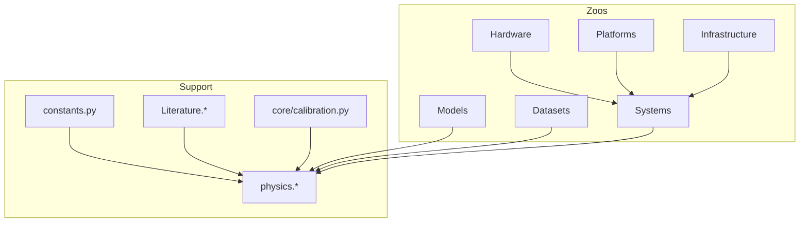

# MLSysSim Data Model

Six **zoos** (typed registries) plus support layers. Book LEGO cells and
tutorials should prefer zoos + `mlsysim.physics.*` + explicit operands.
`constants.py` holds physics, units, and cross-cutting numeric laws only.

## Zoos

| Zoo | Registry | Role |
|-----|----------|------|
| Hardware | `Hardware.Cloud.*`, `Hardware.Edge.*`, … | Chip/board/appliance specs (datasheet truth). **Canonical paths only** — no bare `Hardware.H100`. |
| Models | `Models.*` | Workloads and architectures (parameters, layers, FLOPs). |
| Datasets | `Datasets.*` | Data zoo — ImageNet, MNIST, CIFAR, etc. |
| Platforms | `Platforms.*` | Abstract deployment envelopes (RAM, storage, latency ranges). Replaces `Systems.Tiers`. |
| Infrastructure | `Infrastructure.Grids.*`, `Infrastructure.Datacenters.*`, `Infrastructure.Racks.*` | Site/energy layer — utility grid, facility PUE, rack kW. **Not** GPU fleets or network fabrics. |
| Systems | `Systems.Nodes.*`, `Systems.Fabrics.*`, `Systems.Clusters.*`, `Systems.Pods.*` | Compute topology. Fleets live in `Systems.Clusters` (type `Fleet`). Pods may start as an empty scaffold. |

## Support (not zoos)

- **`mlsysim.core.constants`** — pint units, energy/latency laws, precision map, dimensionless teaching examples.
- **`Literature.*`** — cited appendix scalars (MFU bands, Chinchilla, scaling η, overheads).
- **`Systems.Reliability` / `Orchestration`** — MTTF, recovery, scheduling assumptions.
- **`Ops.Monitoring`** — PSI, KS, drift thresholds (MLOps chapters).
- **`mlsysim.engine.calibration`** — solver/engine default kwargs (not appendix tables).
- **`Infrastructure.Pricing`** — cloud, storage, labeling, fleet economics (`PricePoint.rate`).
- **Regional carbon / PUE / fleet / fabrics** — `Infrastructure.Grids`, `FacilityCooling`, `Systems.Clusters`, `Systems.Fabrics`.
- **`mlsysim.physics.*`** — formulas (roofline, training memory, serving, etc.).

## Relationships

- **Fleet ≠ datacenter:** `Systems.Clusters.*` (Fleet) references optional `Infrastructure.Datacenters.*` / grid for carbon and PUE.
- **NVL72** is `Hardware.Cloud.GB200_NVL72`, not an Infrastructure rack entry.
- **Networks/fabrics:** interconnect specs on Hardware; topology instances under `Systems.Fabrics`.

## Book LEGO conventions

1. One class per `{python}` cell (already enforced).
2. Import `from mlsysim import *` or explicit zoo paths — not `from mlsysim.core.constants import *`.
3. Use `mlsysim.physics.*` for derived quantities; registries for operands.
4. `Scenario.evaluate()` reserved for labs; capstone book cells only (≤5–10 total).

## Migration tiers (QMD)

| Tier | Source | Target |
|------|--------|--------|
| A | GPU/chip constants (`H100_*`, `NVLINK_*`, …) | `Hardware.*` |
| B | Network/fabric (`INFINIBAND_*`, `ETHERNET_*`, …) | `Hardware.Networks.*` / `Systems.Fabrics.*` |
| C | Model/dataset constants | `Models.*` / `Datasets.*` |
| D | Economics/reliability/literature | `Infrastructure.Pricing.*`, `Literature.*`, `Systems.Reliability.*` |
| Platforms | `Systems.Tiers`, tier latency/RAM strings | `Platforms.*` |

## No aliases

Hard-delete migrated symbols from `constants.py` after parity tests pass.
Do not keep `Hardware.H100`, `Infrastructure.Quebec`, or `Systems.Cloud = …` shims.

## Verification gates (every commit)

- L1: pytest, exec affected QMD cells, `lego_focal_verify.py`
- L2: `test_registry_parity.py` for deleted symbols
- L3–L5: fmt, HTML build, `audit_lego_html.py` when QMD touched
- L6: chapter sign-off before QMD commits

See `book/docs/LEGO_CELLS.md` and `book/tools/audit/artifacts/registry_migration_manifest.json`.
